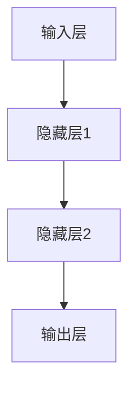

                 

# 文章标题：神经网络：人类智慧的解放

> 关键词：神经网络、反向传播、深度学习、激活函数、图像识别、自然语言处理、强化学习、优化与调试、硬件加速、迁移学习、量子神经网络、自适应学习、隐私保护、伦理与公平

> 摘要：本文旨在深入探讨神经网络这一人工智能的核心技术，从基本理论到应用实践，全面解析其原理、架构、算法以及未来发展趋势。通过一步一步的分析和推理，我们将揭示神经网络如何释放人类智慧，引领技术革新。

----------------------------------------------------------------

## 第一部分：神经网络基本理论

### 核心概念与联系

神经网络是一种模拟生物神经系统的计算模型，由大量相互连接的神经元组成。这些神经元通过加权连接进行信息传递和处理，形成一种分布式计算结构。下面是神经网络的 Mermaid 流程图：

