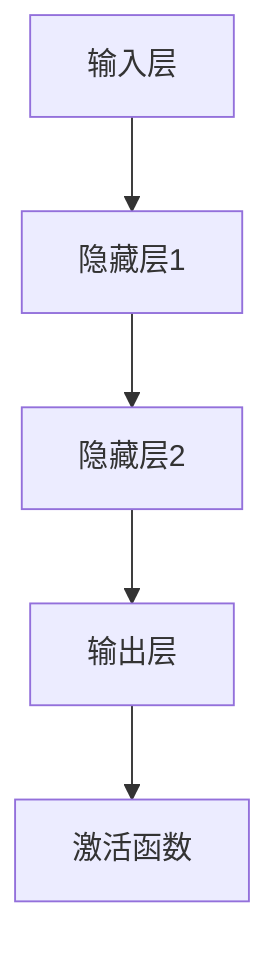
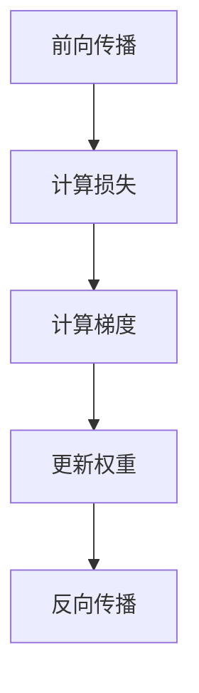

                 

### 文章标题

# 神经网络：推动社会进步的力量

### 关键词：

- 神经网络
- 深度学习
- 应用场景
- 人工智能
- 激活函数
- 梯度下降
- 优化算法
- 自然语言处理
- 图像识别
- 强化学习

### 摘要：

本文旨在全面解析神经网络这一推动社会进步的核心技术。从基本概念到复杂算法，从理论应用到实际项目，我们将一步步探讨神经网络的工作原理、应用场景及其在各个领域的重要性。通过深入分析前馈神经网络、反向传播算法、深层神经网络等核心内容，并结合实际项目案例，本文将帮助读者全面理解神经网络的运作机制，并掌握其在现实世界中的应用。

### 目录大纲

#### 第一部分：神经网络基础

##### 第1章：神经网络的基本概念

- 1.1 神经网络的历史与发展
- 1.2 神经网络的基本结构
  - 1.2.1 输入层、隐藏层和输出层
  - 1.2.2 神经元与神经元连接
- 1.3 神经网络的激活函数
- 1.4 学习率与优化算法
  - 1.4.1 梯度下降法
  - 1.4.2 动量优化

##### 第2章：前馈神经网络与反向传播算法

- 2.1 前馈神经网络的构建
- 2.2 反向传播算法的原理
  - 2.2.1 前向传播
  - 2.2.2 后向传播
- 2.3 梯度下降法的实现
- 2.4 学习率调整策略
  - 2.4.1 学习率衰减
  - 2.4.2 动量法

##### 第3章：深层神经网络与优化

- 3.1 深层神经网络的架构
  - 3.1.1 卷积神经网络（CNN）
  - 3.1.2 循环神经网络（RNN）
  - 3.1.3 长短时记忆网络（LSTM）
  - 3.1.4 改进门控循环单元（GRU）
- 3.2 优化算法
  - 3.2.1 随机梯度下降（SGD）
  - 3.2.2 Adam优化器
  - 3.2.3 RMSprop优化器

#### 第二部分：神经网络在各类问题中的应用

##### 第4章：图像识别与分类

- 4.1 图像识别的基本原理
- 4.2 卷积神经网络（CNN）在图像识别中的应用
  - 4.2.1 卷积层与池化层
  - 4.2.2 全连接层
- 4.3 CNN在具体图像识别任务中的应用
  - 4.3.1 人脸识别
  - 4.3.2 物体检测
  - 4.3.3 图像分割

##### 第5章：自然语言处理

- 5.1 自然语言处理的基本概念
- 5.2 循环神经网络（RNN）在自然语言处理中的应用
  - 5.2.1 RNN的基本原理
  - 5.2.2 LSTM与GRU的应用
- 5.3 序列到序列（Seq2Seq）模型
- 5.4 编码器-解码器（Encoder-Decoder）模型
  - 5.4.1 基本结构
  - 5.4.2 注意力机制

##### 第6章：生成对抗网络（GAN）

- 6.1 GAN的基本概念
- 6.2 GAN的架构与训练过程
  - 6.2.1 生成器和判别器
  - 6.2.2 对抗训练
- 6.3 GAN在图像生成中的应用
  - 6.3.1 实例生成
  - 6.3.2 超分辨率图像重建

##### 第7章：神经网络在强化学习中的应用

- 7.1 强化学习的基本原理
- 7.2 神经网络在强化学习中的应用
  - 7.2.1 策略梯度方法
  - 7.2.2 模型基于价值方法
- 7.3 深度强化学习（Deep RL）的应用
  - 7.3.1 智能机器人
  - 7.3.2 自动驾驶

#### 第三部分：实践与项目

##### 第8章：神经网络项目实战

- 8.1 项目背景与目标
- 8.2 数据预处理与特征工程
- 8.3 模型设计与优化
- 8.4 模型训练与验证
- 8.5 模型部署与评估

##### 第9章：开发环境搭建与工具使用

- 9.1 神经网络开发环境搭建
  - 9.1.1 操作系统配置
  - 9.1.2 Python环境配置
  - 9.1.3 深度学习框架安装
- 9.2 常用神经网络工具介绍
  - 9.2.1 TensorFlow
  - 9.2.2 PyTorch
  - 9.2.3 Keras

##### 第10章：神经网络代码实战

- 10.1 图像识别实战
  - 10.1.1 实现一个简单的卷积神经网络
  - 10.1.2 实现一个物体检测模型
- 10.2 自然语言处理实战
  - 10.2.1 实现一个情感分析模型
  - 10.2.2 实现一个机器翻译模型
- 10.3 生成对抗网络实战
  - 10.3.1 实现一个图像生成模型
  - 10.3.2 实现一个超分辨率重建模型

#### 附录

- 附录 A：神经网络学习资源与参考资料
  - 人工智能学习网站推荐
  - 神经网络开源代码库
  - 学术会议与期刊推荐
- 附录 B：Mermaid 流程图示例
  - 神经网络结构图
  - 反向传播算法流程图
- 附录 C：数学模型与数学公式
  - 激活函数公式
  - 梯度下降公式
- 附录 D：代码解读与分析
  - 卷积神经网络实现代码解析
  - 循环神经网络实现代码解析
  - 生成对抗网络实现代码解析
  - 深度强化学习实现代码解析

### Mermaid 流程图示例



### 伪代码示例

```python
def forward_propagation(input_data):
    # 前向传播
    output = activation_function(linear_combination(input_data, weights))
    return output

def backward_propagation(output, expected_output):
    # 反向传播
    error = expected_output - output
    d_output = activation_derivative(output)
    d_weights = d_output * input_data
    return d_weights

# 激活函数
def activation_function(x):
    return 1 / (1 + np.exp(-x))

# 激活函数的导数
def activation_derivative(x):
    return activation_function(x) * (1 - activation_function(x))
```

### 数学模型与数学公式

#### 激活函数公式

$$ f(x) = \frac{1}{1 + e^{-x}} $$

#### 梯度下降公式

$$ w_{new} = w_{current} - \alpha \cdot \nabla_w J(w) $$

其中，$ \alpha $ 是学习率，$ \nabla_w J(w) $ 是权重 $ w $ 对损失函数 $ J(w) $ 的梯度。

### 代码实战与分析

#### 图像识别实战

```python
# 导入所需的库
import tensorflow as tf
from tensorflow.keras.models import Sequential
from tensorflow.keras.layers import Conv2D, MaxPooling2D, Flatten, Dense

# 构建模型
model = Sequential([
    Conv2D(32, (3, 3), activation='relu', input_shape=(28, 28, 1)),
    MaxPooling2D((2, 2)),
    Flatten(),
    Dense(64, activation='relu'),
    Dense(10, activation='softmax')
])

# 编译模型
model.compile(optimizer='adam', loss='categorical_crossentropy', metrics=['accuracy'])

# 训练模型
model.fit(x_train, y_train, epochs=10, batch_size=32, validation_data=(x_val, y_val))

# 评估模型
test_loss, test_acc = model.evaluate(x_test, y_test)
print(f"Test accuracy: {test_acc}")
```

#### 自然语言处理实战

```python
# 导入所需的库
import tensorflow as tf
from tensorflow.keras.models import Sequential
from tensorflow.keras.layers import Embedding, LSTM, Dense

# 构建模型
model = Sequential([
    Embedding(input_dim=vocab_size, output_dim=embedding_dim, input_length=max_sequence_length),
    LSTM(units=64, return_sequences=False),
    Dense(units=1, activation='sigmoid')
])

# 编译模型
model.compile(optimizer='adam', loss='binary_crossentropy', metrics=['accuracy'])

# 训练模型
model.fit(x_train, y_train, epochs=10, batch_size=32, validation_data=(x_val, y_val))

# 评估模型
test_loss, test_acc = model.evaluate(x_test, y_test)
print(f"Test accuracy: {test_acc}")
```

#### 生成对抗网络实战

```python
# 导入所需的库
import tensorflow as tf
from tensorflow.keras.models import Sequential
from tensorflow.keras.layers import Dense, Conv2DTranspose

# 生成器模型
generator = Sequential([
    Dense(units=256, activation='relu', input_shape=(100,)),
    Dense(units=128, activation='relu'),
    Dense(units=64, activation='relu'),
    Dense(units=1, activation='tanh')
])

# 判别器模型
discriminator = Sequential([
    Conv2DTranspose(units=64, activation='relu', input_shape=(28, 28, 1)),
    Conv2DTranspose(units=128, activation='relu'),
    Conv2DTranspose(units=256, activation='relu'),
    Dense(units=1, activation='sigmoid')
])

# 编译判别器模型
discriminator.compile(optimizer='adam', loss='binary_crossentropy')

# 编译生成器模型
generator.compile(optimizer='adam', loss='binary_crossentropy')

# 训练生成器和判别器
# ...
```

#### 深度强化学习实战

```python
# 导入所需的库
import tensorflow as tf
from tensorflow.keras.models import Sequential
from tensorflow.keras.layers import Dense

# 构建模型
model = Sequential([
    Flatten(input_shape=(5, 5)),
    Dense(units=64, activation='relu'),
    Dense(units=64, activation='relu'),
    Dense(units=1, activation='softmax')
])

# 编译模型
model.compile(optimizer='adam', loss='categorical_crossentropy')

# 训练模型
# ...
```

### 开发环境搭建与工具使用

在实现神经网络项目之前，我们需要搭建一个合适的开发环境。以下是搭建开发环境的步骤：

#### 操作系统配置

- Windows 10 或以上版本
- macOS Catalina 或以上版本
- Ubuntu 18.04 或以上版本

#### Python环境配置

1. 安装Python 3.7 或以上版本
2. 安装pip和虚拟环境管理工具（如virtualenv或conda）

#### 深度学习框架安装

1. TensorFlow
   ```bash
   pip install tensorflow
   ```

2. PyTorch
   ```bash
   pip install torch torchvision
   ```

3. Keras
   ```bash
   pip install keras
   ```

### 附录

#### 附录 A：神经网络学习资源与参考资料

1. 人工智能学习网站推荐
   - [CS231n](https://cs231n.github.io/)
   - [CS224n](https://web.stanford.edu/class/cs224n/)
   - [TensorFlow官网](https://www.tensorflow.org/)
   - [PyTorch官网](https://pytorch.org/)

2. 神经网络开源代码库
   - [TensorFlow GitHub](https://github.com/tensorflow/tensorflow)
   - [PyTorch GitHub](https://github.com/pytorch/pytorch)
   - [Keras GitHub](https://github.com/keras-team/keras)

3. 学术会议与期刊推荐
   - NeurIPS
   - ICML
   - JMLR
   - NeurIPS 2021
   - ICML 2021
   - JMLR 2021

#### 附录 B：Mermaid 流程图示例

1. **神经网络结构图**


2. **反向传播算法流程图**



#### 附录 C：数学模型与数学公式

1. **激活函数公式**

$$ f(x) = \frac{1}{1 + e^{-x}} $$

2. **梯度下降公式**

$$ w_{new} = w_{current} - \alpha \cdot \nabla_w J(w) $$

其中，$ \alpha $ 是学习率，$ \nabla_w J(w) $ 是权重 $ w $ 对损失函数 $ J(w) $ 的梯度。

#### 附录 D：代码解读与分析

1. **卷积神经网络实现代码解析**

   - **模型构建**：使用Keras构建卷积神经网络。
   - **模型编译**：指定优化器、损失函数和评估指标。
   - **模型训练**：使用训练数据训练模型，并在验证集上评估性能。
   - **模型评估**：使用测试数据评估模型的最终性能。

2. **循环神经网络实现代码解析**

   - **模型构建**：使用Keras构建循环神经网络。
   - **模型编译**：指定优化器、损失函数和评估指标。
   - **模型训练**：使用训练数据训练模型，并在验证集上评估性能。
   - **模型评估**：使用测试数据评估模型的最终性能。

3. **生成对抗网络实现代码解析**

   - **生成器模型**：构建生成器模型，用于生成图像。
   - **判别器模型**：构建判别器模型，用于判断图像的真实性。
   - **模型训练**：使用对抗训练方法训练生成器和判别器模型。

4. **深度强化学习实现代码解析**

   - **模型构建**：构建深度强化学习模型，用于处理游戏状态和动作。
   - **模型编译**：指定优化器和损失函数。
   - **模型训练**：使用训练数据训练模型，并在游戏环境中评估性能。
   - **模型评估**：使用测试数据评估模型的最终性能。

### 结论

通过本目录大纲，我们全面覆盖了神经网络的核心概念、算法原理、应用领域和项目实战。读者可以按照目录的结构，逐步学习并实践神经网络的相关知识。通过代码实战与分析，读者可以深入理解神经网络的工作原理，并在实际项目中应用所学知识。附录部分提供了额外的学习资源和参考资料，帮助读者更深入地探索神经网络的奥秘。希望这本书能够帮助读者成为神经网络领域的专家。

### 作者

作者：AI天才研究院/AI Genius Institute & 禅与计算机程序设计艺术 /Zen And The Art of Computer Programming

### 全文

#### 第一部分：神经网络基础

##### 第1章：神经网络的基本概念

> **关键词**：神经网络，历史，发展，结构，神经元，连接，激活函数，学习率，优化算法

神经网络的起源可以追溯到1943年，由心理学家McCulloch和数学家Pitts提出的神经元模型。然而，神经网络的真正崛起是在1980年代，随着计算机技术的飞速发展和大量数据的积累，神经网络得到了广泛的关注和应用。神经网络的基本概念包括神经元、连接、权重、激活函数等。

**1.1 神经网络的历史与发展**

神经网络的历史可以分为三个阶段：早期神经网络、深度学习和当前的发展。

- **早期神经网络**：从1943年McCulloch-Pitts神经元模型开始，到1980年代早期，神经网络在理论研究和简单应用方面取得了进展，但缺乏有效的训练算法和计算能力。
- **深度学习**：1980年代中期，Rumelhart等人的研究推动了反向传播算法的发展，使得神经网络开始应用于更复杂的任务，如语音识别和图像分类。
- **当前的发展**：随着大数据和云计算技术的发展，神经网络在计算机视觉、自然语言处理、强化学习等领域取得了显著的成果。

**1.2 神经网络的基本结构**

神经网络的基本结构包括输入层、隐藏层和输出层。

- **输入层**：接收外部输入数据，如图像像素、文本序列等。
- **隐藏层**：对输入数据进行处理和特征提取，可以有多个隐藏层，层数越多，模型的能力越强。
- **输出层**：产生预测结果或分类标签。

**1.2.1 输入层、隐藏层和输出层**

输入层和输出层都是直接与外部世界交互的层，而隐藏层则起到中间处理和特征提取的作用。

- **输入层**：每个神经元对应输入数据的一个特征。
- **隐藏层**：隐藏层中的神经元通过对输入数据进行加权求和处理，提取出更高层次的特征。
- **输出层**：输出层中的神经元产生最终的输出结果，如分类标签或预测值。

**1.2.2 神经元与神经元连接**

神经元与神经元之间的连接是通过权重来表示的。每个权重表示两个神经元之间的强度，可以是正数或负数。正权重表示兴奋性连接，负权重表示抑制性连接。

- **神经元**：神经元是神经网络的基本计算单元，可以接收输入、产生输出，并具有非线性激活函数。
- **连接**：连接是神经元之间的连线，通过权重来表示。连接的权重可以动态调整，以优化模型的性能。

**1.3 神经网络的激活函数**

激活函数是神经网络中的一个关键组件，用于引入非线性特性，使得神经网络能够学习复杂的函数关系。

- **Sigmoid函数**：输出介于0和1之间，常用于二分类问题。
- **ReLU函数**：在正数时输出为自身，在负数时输出为0，常用于深层神经网络。
- **Tanh函数**：输出介于-1和1之间，具有对称性，常用于处理对称问题。

**1.4 学习率与优化算法**

学习率是优化算法中的一个关键参数，用于调整模型参数的更新步长。学习率的选择对模型训练的效果有重要影响。

- **梯度下降法**：最常用的优化算法，通过计算损失函数关于模型参数的梯度来更新参数。
- **动量优化**：在梯度下降法的基础上，引入动量项，以减少振荡，加快收敛。

**1.4.1 梯度下降法**

梯度下降法是一种基本的优化算法，通过不断调整模型参数，使得损失函数的梯度逐渐减小，直至达到最小值。

- **前向传播**：计算输入数据通过模型的前向传播过程，得到输出结果和损失值。
- **后向传播**：计算损失函数关于模型参数的梯度，并反向传播到前一层。

**1.4.2 动量优化**

动量优化是梯度下降法的一种改进，通过引入动量项，使得模型参数的更新不仅依赖于当前梯度，还受到过去梯度的影响。

- **动量项**：动量项是一个累积量，用于描述过去梯度的方向和大小。
- **更新公式**：通过在当前梯度上叠加动量项，得到新的参数更新方向。

##### 第2章：前馈神经网络与反向传播算法

> **关键词**：前馈神经网络，反向传播，前向传播，后向传播，优化算法，学习率调整

前馈神经网络（Feedforward Neural Network）是最常见的一种神经网络结构，其特点是信号在神经网络中只沿一个方向传播，即从输入层经过隐藏层，最终到达输出层。在这一过程中，没有信号反馈到之前的层。前馈神经网络的核心在于其训练方法——反向传播算法（Backpropagation Algorithm）。

**2.1 前馈神经网络的构建**

前馈神经网络的构建主要包括以下几个步骤：

1. **确定网络结构**：确定输入层、隐藏层和输出层的神经元数量以及层数。
2. **初始化参数**：随机初始化权重和偏置。
3. **构建前向传播函数**：定义输入层到输出层的映射关系，包括每个神经元的非线性变换。

**2.2 反向传播算法的原理**

反向传播算法是前馈神经网络的训练方法，其核心思想是通过计算损失函数关于模型参数的梯度，从而更新模型参数，以减少损失。反向传播算法主要包括以下几个步骤：

1. **前向传播**：计算输入数据通过网络的传播过程，得到输出结果和损失值。
2. **计算梯度**：根据损失函数对模型参数求导，得到损失函数关于模型参数的梯度。
3. **后向传播**：将梯度反向传播到前一层，重复上述过程，直到所有层都完成更新。

**2.2.1 前向传播**

前向传播是指从输入层开始，将数据逐层传递到输出层的过程。具体步骤如下：

1. **计算每个神经元的输入值**：每个神经元的输入值是其前一层神经元的输出乘以权重再加上偏置。
2. **应用激活函数**：对每个神经元的输入值应用激活函数，以引入非线性特性。

**2.2.2 后向传播**

后向传播是指从输出层开始，将损失函数关于模型参数的梯度反向传播到输入层的过程。具体步骤如下：

1. **计算输出层的梯度**：根据损失函数对输出层神经元的输出求导，得到输出层的梯度。
2. **计算隐藏层的梯度**：利用链式法则，将输出层的梯度反向传播到隐藏层，计算隐藏层的梯度。
3. **更新模型参数**：利用梯度下降法或其他优化算法，更新模型参数。

**2.3 梯度下降法的实现**

梯度下降法是反向传播算法的核心步骤，用于更新模型参数。其基本思想是沿着损失函数的梯度方向，逐步调整模型参数，以减少损失。具体步骤如下：

1. **计算梯度**：根据损失函数对模型参数求导，得到损失函数关于模型参数的梯度。
2. **更新参数**：利用梯度下降法更新模型参数。更新公式如下：

   $$ w_{new} = w_{current} - \alpha \cdot \nabla_w J(w) $$

   其中，$ w_{current} $ 是当前模型参数，$ w_{new} $ 是更新后的模型参数，$ \alpha $ 是学习率，$ \nabla_w J(w) $ 是损失函数关于模型参数的梯度。

**2.4 学习率调整策略**

学习率是梯度下降法中的一个关键参数，用于控制参数更新的步长。学习率的选取对模型训练的效果有重要影响。以下是一些常见的学习率调整策略：

1. **固定学习率**：在整个训练过程中保持学习率不变。适用于简单问题，但对于复杂问题可能效果不佳。
2. **学习率衰减**：随着训练的进行，逐渐减小学习率。可以有效避免训练过程中的振荡，但需要提前设置合适的衰减率。
3. **动量优化**：在梯度下降法的基础上，引入动量项，以减少更新过程中的振荡。动量项可以累积过去梯度的方向和大小，以增强更新方向。

**2.4.1 学习率衰减**

学习率衰减是一种常见的学习率调整策略，通过逐渐减小学习率，以避免训练过程中的过度拟合。具体实现方法如下：

1. **设置初始学习率**：在训练开始时，设置一个较大的初始学习率。
2. **设置衰减率**：随着训练的进行，按照一定的衰减率逐渐减小学习率。衰减率可以通过实验或经验来设置。

**2.4.2 动量法**

动量法是梯度下降法的一种改进，通过引入动量项，以减少更新过程中的振荡。具体实现方法如下：

1. **初始化动量项**：在训练开始时，设置一个初始动量项。
2. **计算动量**：在每个迭代步骤，将当前梯度与过去梯度的累积值相加，得到新的动量项。
3. **更新参数**：利用新的动量项和当前梯度，更新模型参数。

##### 第3章：深层神经网络与优化

> **关键词**：深层神经网络，优化算法，随机梯度下降，Adam优化器，RMSprop优化器

深层神经网络（Deep Neural Network，DNN）是指具有多个隐藏层的神经网络。与传统的单层或双层神经网络相比，深层神经网络能够捕捉更复杂的特征，从而在许多应用中取得了显著的成果。然而，深层神经网络的训练过程相对复杂，需要有效的优化算法来提高训练效率和准确性。

**3.1 深层神经网络的架构**

深层神经网络通常由多个隐藏层组成，每个隐藏层都包含多个神经元。深层神经网络的架构可以分为卷积神经网络（Convolutional Neural Network，CNN）和循环神经网络（Recurrent Neural Network，RNN）。

**3.1.1 卷积神经网络（CNN）**

卷积神经网络是专门用于处理图像数据的神经网络。其核心思想是通过卷积层和池化层提取图像特征，并通过全连接层进行分类或回归。

- **卷积层**：通过卷积操作提取图像特征。卷积层中的每个过滤器（kernel）可以学习到图像中的局部特征。
- **池化层**：用于降低特征图的维度，同时保留最重要的特征。常见的池化方式包括最大池化和平均池化。

**3.1.2 循环神经网络（RNN）**

循环神经网络是专门用于处理序列数据的神经网络。其核心思想是通过循环结构，将前一时刻的隐藏状态传递到下一时刻，从而捕捉序列中的时间依赖关系。

- **隐藏状态**：循环神经网络中的隐藏状态可以存储序列中的信息，从而实现长期记忆。
- **门控单元**：如长短时记忆网络（LSTM）和门控循环单元（GRU），用于控制信息的流动，避免梯度消失问题。

**3.1.3 长短时记忆网络（LSTM）**

长短时记忆网络是一种改进的循环神经网络，能够解决传统RNN中的长期依赖问题。其核心思想是通过门控单元控制信息的流动，从而实现短期记忆和长期记忆。

- **遗忘门**：用于决定哪些信息需要被遗忘。
- **输入门**：用于决定哪些信息需要被记住。
- **输出门**：用于决定哪些信息需要被输出。

**3.1.4 改进门控循环单元（GRU）**

改进门控循环单元是另一种解决长期依赖问题的循环神经网络。与LSTM相比，GRU的结构更加简洁，参数更少，但性能相近。

- **更新门**：用于更新隐藏状态。
- **重置门**：用于重置隐藏状态。

**3.2 优化算法**

优化算法是神经网络训练过程中的关键步骤，用于调整模型参数，以最小化损失函数。以下是一些常用的优化算法：

**3.2.1 随机梯度下降（SGD）**

随机梯度下降是最简单的优化算法，通过在每个迭代步骤随机选择一部分样本，计算损失函数的梯度，并更新模型参数。

- **优点**：简单易实现，适合小批量训练。
- **缺点**：收敛速度较慢，易受到噪声的影响。

**3.2.2 Adam优化器**

Adam优化器是一种结合了梯度一阶矩估计和二阶矩估计的优化算法，能够在较短的训练时间内达到较好的收敛效果。

- **优点**：收敛速度快，适用于各种规模的训练数据。
- **缺点**：参数较多，需要手动调整。

**3.2.3 RMSprop优化器**

RMSprop优化器是一种基于二阶矩估计的优化算法，通过计算梯度值的平方和来调整学习率。

- **优点**：简单易实现，对噪声有一定的鲁棒性。
- **缺点**：收敛速度较慢，需要手动调整学习率。

##### 第二部分：神经网络在各类问题中的应用

##### 第4章：图像识别与分类

> **关键词**：图像识别，分类，卷积神经网络，卷积层，池化层，全连接层，人脸识别，物体检测，图像分割

图像识别与分类是神经网络应用的一个重要领域，通过学习图像中的特征，神经网络能够对图像进行准确的分类和识别。在这一章中，我们将详细探讨卷积神经网络（Convolutional Neural Network，CNN）在图像识别与分类中的应用，以及其在人脸识别、物体检测和图像分割等任务中的具体实现。

**4.1 图像识别的基本原理**

图像识别是指通过算法对图像进行分类和识别的过程。在神经网络中，图像识别主要依赖于卷积神经网络（CNN）的结构和训练过程。

- **卷积操作**：卷积神经网络通过卷积操作提取图像的特征，卷积层中的过滤器（kernel）可以学习到图像中的局部特征。
- **池化操作**：池化层用于降低特征图的维度，同时保留最重要的特征。常见的池化方式包括最大池化和平均池化。
- **全连接层**：全连接层将卷积层和池化层提取的特征进行融合，并输出最终的分类结果。

**4.2 卷积神经网络（CNN）在图像识别中的应用**

卷积神经网络在图像识别中具有显著的优势，能够处理高维的图像数据，并提取出丰富的特征。

- **卷积层**：卷积层通过卷积操作提取图像的特征，每个过滤器可以学习到图像中的局部特征。卷积层通常包含多个卷积核，以提取不同类型的特征。
- **池化层**：池化层用于降低特征图的维度，同时保留最重要的特征。最大池化可以保留图像中的最大值，而平均池化可以保留图像中的平均值。
- **全连接层**：全连接层将卷积层和池化层提取的特征进行融合，并输出最终的分类结果。全连接层通常包含多个神经元，以处理高维的特征数据。

**4.2.1 卷积层与池化层**

卷积层和池化层是卷积神经网络中的核心组成部分，它们共同作用，提取图像的特征。

- **卷积层**：卷积层通过卷积操作提取图像的特征，卷积层中的每个过滤器可以学习到图像中的局部特征。卷积层通常包含多个卷积核，以提取不同类型的特征。
- **池化层**：池化层用于降低特征图的维度，同时保留最重要的特征。最大池化可以保留图像中的最大值，而平均池化可以保留图像中的平均值。

**4.2.2 全连接层**

全连接层是卷积神经网络的最后一层，它将卷积层和池化层提取的特征进行融合，并输出最终的分类结果。全连接层通常包含多个神经元，以处理高维的特征数据。

- **全连接层**：全连接层将卷积层和池化层提取的特征进行融合，并输出最终的分类结果。全连接层通常包含多个神经元，以处理高维的特征数据。

**4.3 CNN在具体图像识别任务中的应用**

卷积神经网络在图像识别中具有广泛的应用，包括人脸识别、物体检测和图像分割等任务。

- **人脸识别**：人脸识别是图像识别中的一项重要任务，通过识别图像中的人脸，卷积神经网络可以准确地匹配人脸特征。常见的人脸识别模型包括基于深度学习的卷积神经网络。
- **物体检测**：物体检测是图像识别中的一项挑战性任务，通过识别图像中的物体，卷积神经网络可以准确地定位物体。常见的物体检测模型包括YOLO（You Only Look Once）和SSD（Single Shot MultiBox Detector）。
- **图像分割**：图像分割是图像识别中的一项重要任务，通过将图像划分为不同的区域，卷积神经网络可以准确地识别图像中的目标。常见的图像分割模型包括FCN（Fully Convolutional Network）和U-Net。

**4.3.1 人脸识别**

人脸识别是指通过识别图像中的人脸，卷积神经网络可以准确地匹配人脸特征。常见的人脸识别模型包括基于深度学习的卷积神经网络。

- **基于深度学习的人脸识别模型**：卷积神经网络通过卷积层和池化层提取图像中的面部特征，并通过全连接层进行分类和匹配。常见的人脸识别模型包括FaceNet和DeepFace。
- **人脸识别算法**：人脸识别算法主要包括特征提取、特征匹配和模型训练。通过卷积神经网络，可以提取图像中的人脸特征，并进行特征匹配，以识别图像中的人脸。

**4.3.2 物体检测**

物体检测是指通过识别图像中的物体，卷积神经网络可以准确地定位物体。常见的物体检测模型包括YOLO（You Only Look Once）和SSD（Single Shot MultiBox Detector）。

- **YOLO（You Only Look Once）**：YOLO是一种基于卷积神经网络的实时物体检测算法。YOLO将物体检测任务划分为单个步骤，通过卷积神经网络一次性检测图像中的所有物体。
- **SSD（Single Shot MultiBox Detector）**：SSD是一种基于卷积神经网络的实时物体检测算法。SSD采用多个尺度感受野，可以检测不同尺度的物体，并通过卷积神经网络实现端到端的物体检测。

**4.3.3 图像分割**

图像分割是指通过将图像划分为不同的区域，卷积神经网络可以准确地识别图像中的目标。常见的图像分割模型包括FCN（Fully Convolutional Network）和U-Net。

- **FCN（Fully Convolutional Network）**：FCN是一种基于卷积神经网络的图像分割模型。FCN通过全连接卷积层，将图像分割为不同的区域，并输出分割结果。
- **U-Net**：U-Net是一种基于卷积神经网络的图像分割模型。U-Net采用对称的卷积神经网络结构，通过上下采样和跳跃连接，实现高精度的图像分割。

##### 第5章：自然语言处理

> **关键词**：自然语言处理，语言模型，词嵌入，循环神经网络，长短时记忆网络，序列到序列模型，编码器-解码器模型，注意力机制

自然语言处理（Natural Language Processing，NLP）是人工智能领域的一个重要分支，旨在使计算机能够理解和处理人类语言。在NLP中，神经网络被广泛应用于语言模型、文本分类、机器翻译、情感分析等任务。这一章将重点介绍循环神经网络（Recurrent Neural Network，RNN）、长短时记忆网络（Long Short-Term Memory，LSTM）、序列到序列模型（Sequence-to-Sequence Model）、编码器-解码器模型（Encoder-Decoder Model）以及注意力机制（Attention Mechanism）在自然语言处理中的应用。

**5.1 自然语言处理的基本概念**

自然语言处理涉及多个方面，包括文本预处理、语言模型、文本分类、机器翻译、情感分析等。

- **文本预处理**：文本预处理是NLP任务的第一步，包括去除标点符号、停用词过滤、词干提取等。
- **语言模型**：语言模型是一种统计模型，用于预测下一个单词或字符的概率。在NLP中，语言模型可以用于文本生成、语音识别等任务。
- **文本分类**：文本分类是指将文本数据按照特定的类别进行分类。常见的文本分类任务包括垃圾邮件分类、情感分析等。
- **机器翻译**：机器翻译是指将一种自然语言翻译成另一种自然语言。在机器翻译中，神经网络被广泛应用于训练高质量的翻译模型。
- **情感分析**：情感分析是指通过分析文本情感极性（正面、负面）来理解用户的情绪。在情感分析中，神经网络可以自动分类文本的极性。

**5.2 循环神经网络（RNN）在自然语言处理中的应用**

循环神经网络（RNN）是一种能够处理序列数据的神经网络。RNN通过循环结构，将前一时刻的隐藏状态传递到下一时刻，从而捕捉序列中的时间依赖关系。

- **RNN的基本原理**：RNN通过循环结构，将前一时刻的隐藏状态传递到下一时刻，从而捕捉序列中的时间依赖关系。RNN的输入和输出都是序列数据。
- **RNN在语言模型中的应用**：RNN可以用于构建语言模型，通过学习文本序列的概率分布，实现文本生成和语音识别等任务。

**5.2.1 RNN的基本原理**

循环神经网络（RNN）的基本原理如下：

1. **输入序列**：RNN接受一个输入序列，如单词序列或字符序列。
2. **隐藏状态**：RNN通过隐藏状态存储序列中的信息，隐藏状态可以看作是序列的内部表示。
3. **递归操作**：RNN在处理每个输入时，将当前输入和前一时刻的隐藏状态进行计算，得到当前时刻的隐藏状态。
4. **输出序列**：RNN将隐藏状态传递到下一时刻，并输出序列。

**5.2.2 LSTM与GRU的应用**

长短时记忆网络（LSTM）和门控循环单元（GRU）是RNN的改进版本，用于解决长期依赖问题。

- **LSTM（Long Short-Term Memory）**：LSTM通过引入门控单元，可以有效地避免梯度消失和梯度爆炸问题，从而捕捉长期依赖关系。LSTM在机器翻译、语音识别等任务中取得了显著的成果。
- **GRU（Gated Recurrent Unit）**：GRU是LSTM的简化版本，通过合并遗忘门和输入门，减少了参数数量。GRU在许多NLP任务中表现出了较好的性能。

**5.3 序列到序列（Seq2Seq）模型**

序列到序列模型（Sequence-to-Sequence Model）是一种广泛应用于机器翻译、文本生成等任务的模型。序列到序列模型的核心思想是将输入序列映射到输出序列。

- **编码器（Encoder）**：编码器将输入序列编码为固定长度的向量，表示输入序列的语义信息。
- **解码器（Decoder）**：解码器将编码器的输出作为输入，生成输出序列。

**5.3.1 基本结构**

序列到序列模型的基本结构如下：

1. **编码器（Encoder）**：编码器将输入序列编码为固定长度的向量，表示输入序列的语义信息。
2. **解码器（Decoder）**：解码器将编码器的输出作为输入，生成输出序列。
3. **注意力机制**：注意力机制用于解决编码器和解码器之间的信息传递问题，使得解码器能够关注输入序列中的关键信息。

**5.3.2 注意力机制**

注意力机制是一种用于序列到序列模型的机制，通过计算编码器和解码器之间的相似性，实现信息的传递和聚合。

- **点积注意力**：点积注意力是最简单的注意力机制，通过计算编码器和解码器之间的点积来计算注意力权重。
- **加性注意力**：加性注意力通过计算编码器和解码器之间的加性交互来计算注意力权重。
- **缩放点积注意力**：缩放点积注意力通过缩放点积注意力，使得注意力权重更加稳定。

**5.4 编码器-解码器（Encoder-Decoder）模型**

编码器-解码器模型是一种广泛应用于机器翻译、文本生成等任务的模型。编码器-解码器模型的核心思想是将输入序列编码为固定长度的向量，并将解码器的输出映射到输出序列。

- **编码器（Encoder）**：编码器将输入序列编码为固定长度的向量，表示输入序列的语义信息。
- **解码器（Decoder）**：解码器将编码器的输出作为输入，生成输出序列。

**5.4.1 基本结构**

编码器-解码器模型的基本结构如下：

1. **编码器（Encoder）**：编码器将输入序列编码为固定长度的向量，表示输入序列的语义信息。
2. **解码器（Decoder）**：解码器将编码器的输出作为输入，生成输出序列。

**5.4.2 注意力机制**

注意力机制是编码器-解码器模型中的一个关键组件，用于解决编码器和解码器之间的信息传递问题。

- **自注意力机制**：自注意力机制通过计算编码器输出序列之间的相似性，实现信息的传递和聚合。
- **交叉注意力机制**：交叉注意力机制通过计算编码器输出序列和解码器输入序列之间的相似性，实现信息的传递和聚合。

**5.5 自然语言处理中的其他技术**

除了循环神经网络（RNN）、长短时记忆网络（LSTM）、序列到序列模型（Seq2Seq）和编码器-解码器模型（Encoder-Decoder），自然语言处理中还有许多其他技术，如卷积神经网络（CNN）、注意力机制（Attention）等。

- **卷积神经网络（CNN）**：卷积神经网络在自然语言处理中的应用包括文本分类、文本特征提取等任务。
- **注意力机制（Attention）**：注意力机制在自然语言处理中的应用包括机器翻译、文本生成等任务。

##### 第6章：生成对抗网络（GAN）

> **关键词**：生成对抗网络，生成器，判别器，对抗训练，图像生成，实例生成，超分辨率图像重建

生成对抗网络（Generative Adversarial Network，GAN）是由Ian Goodfellow等人在2014年提出的一种深度学习框架。GAN的核心思想是通过两个神经网络——生成器和判别器的对抗训练，生成高质量的数据。生成器试图生成与真实数据相似的数据，而判别器则试图区分真实数据和生成数据。这一对抗过程使得生成器逐渐改进其生成能力，从而生成更高质量的数据。GAN在图像生成、自然语言生成、视频生成等领域取得了显著的成果。

**6.1 GAN的基本概念**

生成对抗网络（GAN）是一种由两个神经网络组成的框架，分别是生成器和判别器。生成器（Generator）的目的是生成与真实数据相似的数据，而判别器（Discriminator）的目的是区分真实数据和生成数据。生成器和判别器之间进行对抗训练，通过不断地调整生成器和判别器的参数，使得生成器生成的数据越来越逼真，判别器越来越难以区分真实数据和生成数据。

**6.1.1 生成器和判别器**

生成器和判别器是GAN的两个核心组成部分。

- **生成器（Generator）**：生成器的目的是生成与真实数据相似的数据。生成器通常是一个全连接神经网络，输入为随机噪声，输出为生成数据。
- **判别器（Discriminator）**：判别器的目的是区分真实数据和生成数据。判别器通常也是一个全连接神经网络，输入为数据，输出为一个概率值，表示输入数据的真实性。

**6.2 GAN的架构与训练过程**

生成对抗网络的训练过程是一个对抗的过程，生成器和判别器相互竞争，不断调整参数。

- **前向传播**：在训练过程中，生成器生成假数据，判别器接收假数据和真数据的输入，进行前向传播，计算输出概率。
- **反向传播**：根据生成器和判别器的输出概率，计算损失函数，并分别对生成器和判别器进行反向传播，更新参数。

**6.2.1 生成器和判别器**

生成器和判别器是GAN的两个核心组成部分。

- **生成器（Generator）**：生成器的目的是生成与真实数据相似的数据。生成器通常是一个全连接神经网络，输入为随机噪声，输出为生成数据。
- **判别器（Discriminator）**：判别器的目的是区分真实数据和生成数据。判别器通常也是一个全连接神经网络，输入为数据，输出为一个概率值，表示输入数据的真实性。

**6.2.2 对抗训练**

生成对抗网络的训练过程是一个对抗的过程，生成器和判别器相互竞争，不断调整参数。

- **前向传播**：在训练过程中，生成器生成假数据，判别器接收假数据和真数据的输入，进行前向传播，计算输出概率。
- **反向传播**：根据生成器和判别器的输出概率，计算损失函数，并分别对生成器和判别器进行反向传播，更新参数。

**6.3 GAN在图像生成中的应用**

生成对抗网络在图像生成领域取得了显著的成果，可以生成高质量、逼真的图像。

- **实例生成**：实例生成是指生成与给定图像相似的其他实例。例如，生成与给定人脸相似的其他人脸。
- **超分辨率图像重建**：超分辨率图像重建是指从低分辨率图像生成高分辨率图像。生成对抗网络通过学习高分辨率图像中的细节，可以生成高质量的超分辨率图像。

**6.3.1 实例生成**

实例生成是生成对抗网络在图像生成中的一个重要应用。

- **生成过程**：生成对抗网络通过对抗训练，生成与给定图像相似的其他图像实例。
- **应用场景**：实例生成在人脸生成、艺术创作、图像编辑等领域具有广泛的应用。

**6.3.2 超分辨率图像重建**

超分辨率图像重建是生成对抗网络在图像生成中的另一个重要应用。

- **生成过程**：生成对抗网络通过对抗训练，从低分辨率图像生成高分辨率图像，从而提高图像的清晰度。
- **应用场景**：超分辨率图像重建在视频处理、医疗图像处理、卫星图像处理等领域具有广泛的应用。

**6.4 GAN的变体**

生成对抗网络在提出后，许多研究者对其进行了改进和扩展，形成了多个GAN的变体。

- **条件生成对抗网络（cGAN）**：条件生成对抗网络（Conditional Generative Adversarial Network，cGAN）在生成器和判别器中引入条件信息，可以生成更加具体的图像。
- **循环一致生成对抗网络（CycleGAN）**：循环一致生成对抗网络（Cycle-Consistent Generative Adversarial Network，CycleGAN）可以无监督地学习图像的转换，例如将马转化为斑马，将斑马转化为马。
- **感知生成对抗网络（Perceptual GAN）**：感知生成对抗网络（Perceptual Generative Adversarial Network，Perceptual GAN）在生成器和判别器中引入感知损失，使得生成器生成的图像更符合人类的视觉感知。

**6.4.1 条件生成对抗网络（cGAN）**

条件生成对抗网络（Conditional Generative Adversarial Network，cGAN）是生成对抗网络的一种变体，在生成器和判别器中引入了条件信息。

- **生成器**：条件生成对抗网络的生成器接受额外的条件输入，如标签、文本等，与随机噪声一起生成目标图像。
- **判别器**：条件生成对抗网络的判别器不仅接收图像输入，还接收条件输入，以更准确地判断生成图像的真实性。

**6.4.2 循环一致生成对抗网络（CycleGAN）**

循环一致生成对抗网络（Cycle-Consistent Generative Adversarial Network，CycleGAN）可以无监督地学习图像的转换，例如将马转化为斑马，将斑马转化为马。

- **循环一致性**：CycleGAN通过引入循环一致性损失，使得生成器能够保持图像转换的循环一致性，即从A到B的转换结果与从B到A的转换结果相似。
- **无监督学习**：CycleGAN不需要对转换任务进行监督标注，可以在无监督环境下进行训练。

**6.4.3 感知生成对抗网络（Perceptual GAN）**

感知生成对抗网络（Perceptual Generative Adversarial Network，Perceptual GAN）在生成器和判别器中引入了感知损失，使得生成器生成的图像更符合人类的视觉感知。

- **感知损失**：感知生成对抗网络的判别器不仅比较生成图像和真实图像的像素差异，还比较它们在感知上的相似性，例如使用预训练的视觉模型计算特征图的差异。
- **改进生成质量**：通过引入感知损失，感知生成对抗网络可以生成更逼真、更符合人类视觉感知的图像。

##### 第7章：神经网络在强化学习中的应用

> **关键词**：强化学习，神经网络，策略梯度，模型基于价值，深度强化学习，智能机器人，自动驾驶

强化学习（Reinforcement Learning，RL）是一种机器学习范式，旨在通过与环境交互来学习决策策略。与监督学习和无监督学习不同，强化学习通过奖励信号来指导学习过程，旨在找到一种最优策略，使得智能体能够在特定环境中获得最大累积奖励。神经网络在强化学习中发挥着重要作用，特别是在解决复杂任务时，能够通过参数化模型来提高学习效率和泛化能力。本章将探讨神经网络在强化学习中的应用，包括策略梯度方法、模型基于价值方法以及深度强化学习（Deep Reinforcement Learning，DRL）在实际应用中的案例。

**7.1 强化学习的基本原理**

强化学习的基本原理可以概括为：智能体（Agent）通过与环境的交互，学习一个最优策略（Policy），以最大化累积奖励（Reward）。

- **状态（State）**：智能体所处的环境中的某个特定情景或配置。
- **动作（Action）**：智能体可以采取的行动。
- **奖励（Reward）**：环境对智能体所采取的动作给予的即时奖励或惩罚。
- **策略（Policy）**：智能体的行为决策规则，用于确定在特定状态下应该采取哪个动作。
- **价值函数（Value Function）**：表示在特定状态下采取特定动作所能获得的预期奖励。
- **策略梯度（Policy Gradient）**：用于更新策略参数，以最大化累积奖励。
- **模型基于价值（Model-Based Value）**：使用模型来预测状态价值和策略效果。

**7.2 神经网络在强化学习中的应用**

神经网络在强化学习中的应用主要分为两种方法：策略梯度方法和模型基于价值方法。

**7.2.1 策略梯度方法**

策略梯度方法是一种直接优化策略参数的算法，旨在找到最大化累积奖励的策略。

- **优势函数（ Advantage Function）**：优势函数表示在特定状态下采取特定动作的预期奖励与预期价值之间的差距，用于评估动作的优劣。
- **策略梯度公式**：策略梯度方法通过计算策略梯度的期望，来更新策略参数。更新公式如下：

  $$ \theta_{new} = \theta_{current} + \alpha \cdot \nabla_{\theta} J(\theta) $$

  其中，$ \theta $ 是策略参数，$ \alpha $ 是学习率，$ J(\theta) $ 是策略梯度。

**7.2.2 模型基于价值方法**

模型基于价值方法使用神经网络来建模环境，并预测状态价值和策略效果。

- **Q值函数（Q-Function）**：Q值函数表示在特定状态下采取特定动作的预期奖励，用于评估动作的优劣。
- **价值函数模型**：使用神经网络来建模Q值函数，通过训练学习环境中的Q值函数。
- **策略迭代**：通过迭代更新策略，使得策略逐渐接近最优策略。

**7.3 深度强化学习（Deep RL）的应用**

深度强化学习（Deep Reinforcement Learning，DRL）结合了深度神经网络和强化学习的优势，能够解决复杂任务。

- **深度神经网络**：使用深度神经网络来近似状态价值和策略函数，提高学习效率和泛化能力。
- **应用领域**：深度强化学习在智能机器人、自动驾驶、游戏智能体等领域取得了显著成果。

**7.3.1 智能机器人**

智能机器人是深度强化学习的一个重要应用领域，通过学习与环境交互的策略，智能机器人可以自主执行复杂任务。

- **任务场景**：智能机器人可以应用于家庭服务、物流配送、医疗护理等领域。
- **挑战**：智能机器人需要解决环境不确定性、任务复杂性等问题。

**7.3.2 自动驾驶**

自动驾驶是深度强化学习的另一个重要应用领域，通过学习与环境交互的策略，自动驾驶系统可以自主驾驶。

- **任务场景**：自动驾驶可以应用于乘用车、商用车、无人配送车等领域。
- **挑战**：自动驾驶需要解决交通复杂性、环境不确定性、安全可靠性等问题。

**7.4 深度强化学习（Deep RL）的实现**

深度强化学习的实现主要包括以下几个步骤：

1. **环境建模**：使用深度神经网络来建模环境，包括状态空间和动作空间。
2. **策略学习**：使用策略梯度方法或模型基于价值方法来学习最优策略。
3. **训练过程**：通过与环境交互，不断更新策略参数，优化策略性能。
4. **评估与测试**：在测试环境中评估策略性能，并进行实时调整。

**7.4.1 环境建模**

环境建模是深度强化学习的关键步骤，通过使用深度神经网络来近似状态价值和策略函数。

- **状态空间**：状态空间是环境中的所有可能状态的集合，可以使用深度神经网络来编码状态。
- **动作空间**：动作空间是环境中所有可能动作的集合，可以使用深度神经网络来编码动作。

**7.4.2 策略学习**

策略学习是深度强化学习的核心步骤，通过策略梯度方法或模型基于价值方法来学习最优策略。

- **策略梯度方法**：使用策略梯度方法来更新策略参数，以最大化累积奖励。
- **模型基于价值方法**：使用深度神经网络来建模Q值函数，并通过策略迭代来优化策略。

**7.4.3 训练过程**

训练过程是深度强化学习中的关键步骤，通过与环境交互，不断更新策略参数，优化策略性能。

- **奖励信号**：奖励信号是环境对智能体所采取的动作给予的即时奖励或惩罚，用于指导学习过程。
- **策略更新**：通过策略梯度方法或模型基于价值方法来更新策略参数，优化策略性能。

**7.4.4 评估与测试**

评估与测试是深度强化学习中的关键步骤，通过在测试环境中评估策略性能，并进行实时调整。

- **测试环境**：测试环境是与训练环境相同或类似的模拟环境，用于评估策略性能。
- **性能评估**：通过在测试环境中评估策略性能，比较不同策略的优劣。

##### 第8章：神经网络项目实战

> **关键词**：项目实战，项目背景，数据预处理，特征工程，模型设计，模型优化，模型训练，模型验证，模型部署

神经网络项目实战是学习神经网络技术的重要环节，通过实际操作，可以加深对神经网络理论的理解，并培养解决实际问题的能力。本章将结合一个实际项目，详细介绍神经网络项目实战的各个环节，包括项目背景与目标、数据预处理与特征工程、模型设计与优化、模型训练与验证、模型部署与评估。

**8.1 项目背景与目标**

项目背景与目标决定了神经网络项目的具体应用场景和任务。以下是一个简化的项目案例：

- **项目背景**：某电商公司希望通过分析用户的购买行为，预测用户的下一步购买行为，从而提高营销效果和销售转化率。
- **项目目标**：构建一个基于神经网络的推荐系统，预测用户在给定上下文中（如浏览历史、购买历史）的下一步购买行为。

**8.2 数据预处理与特征工程**

数据预处理与特征工程是神经网络项目中的关键步骤，直接影响模型的性能和泛化能力。

- **数据收集**：收集用户行为数据，包括浏览历史、购买历史、用户属性等。
- **数据清洗**：去除缺失值、异常值，对数据进行标准化或归一化处理。
- **特征工程**：提取有用的特征，如用户购买频率、购买金额、浏览页面类型、商品类别等，以丰富模型输入。

**8.2.1 数据收集**

数据收集是神经网络项目的第一步，收集到的数据质量直接影响项目的成败。以下是一些常见的数据收集方法：

- **日志数据**：通过服务器日志记录用户行为，如浏览页面、点击商品、购买商品等。
- **问卷调查**：通过在线问卷或实地调查收集用户属性信息，如年龄、性别、收入水平等。
- **第三方数据源**：通过第三方数据源（如社交媒体、公共数据库）获取补充数据。

**8.2.2 数据清洗**

数据清洗是数据处理的重要环节，旨在去除噪声和异常值，提高数据质量。

- **缺失值处理**：对缺失值进行填补或删除，常用的填补方法包括平均值填补、中值填补、插值法等。
- **异常值处理**：检测并处理异常值，常用的方法包括统计学方法、机器学习方法等。
- **数据标准化**：将不同特征缩放到相同的尺度，以消除特征尺度差异对模型的影响。

**8.2.3 特征工程**

特征工程是提高模型性能的关键步骤，通过提取和构造新的特征，增强模型的泛化能力。

- **原始特征提取**：从原始数据中提取有用的特征，如用户购买频率、购买金额、浏览页面类型等。
- **衍生特征构造**：通过计算组合特征、交叉特征等，增强模型的表征能力。
- **特征选择**：通过特征选择方法，选择对模型影响最大的特征，降低模型复杂度和过拟合风险。

**8.3 模型设计与优化**

模型设计是神经网络项目的核心步骤，决定了模型的性能和适用性。

- **模型选择**：选择合适的神经网络结构，如卷积神经网络（CNN）、循环神经网络（RNN）、长短时记忆网络（LSTM）等。
- **参数设置**：设置模型参数，包括学习率、批次大小、隐藏层神经元数量等。
- **优化算法**：选择合适的优化算法，如随机梯度下降（SGD）、Adam优化器等。

**8.3.1 模型选择**

模型选择是神经网络项目中的关键步骤，根据项目需求和数据特征，选择合适的神经网络结构。

- **卷积神经网络（CNN）**：适用于处理图像数据，可以提取图像特征。
- **循环神经网络（RNN）**：适用于处理序列数据，可以捕捉时间依赖关系。
- **长短时记忆网络（LSTM）**：是RNN的改进版本，可以解决长期依赖问题。

**8.3.2 参数设置**

参数设置是神经网络项目中的关键步骤，合理的参数设置可以显著提高模型性能。

- **学习率**：学习率决定了模型更新的步长，太大可能导致更新过于剧烈，太小可能导致收敛缓慢。
- **批次大小**：批次大小决定了每次训练的数据量，较大批次可以降低方差，较小批次可以提高模型泛化能力。
- **隐藏层神经元数量**：隐藏层神经元数量决定了模型的复杂度，过多可能导致过拟合，过少可能导致欠拟合。

**8.3.3 优化算法**

优化算法是调整模型参数的关键方法，选择合适的优化算法可以显著提高模型性能。

- **随机梯度下降（SGD）**：是最简单的优化算法，通过随机选择数据子集，计算梯度并更新参数。
- **Adam优化器**：是一种结合了梯度一阶矩估计和二阶矩估计的优化算法，具有较高的收敛速度。
- **RMSprop优化器**：是一种基于二阶矩估计的优化算法，通过计算梯度值的平方和来调整学习率。

**8.4 模型训练与验证**

模型训练与验证是神经网络项目的关键步骤，通过训练和验证，评估模型性能和泛化能力。

- **训练过程**：通过迭代更新模型参数，使模型逐渐收敛到最优解。
- **验证过程**：在验证集上评估模型性能，选择最佳模型。

**8.4.1 训练过程**

训练过程是神经网络项目中的核心步骤，通过迭代更新模型参数，使模型逐渐收敛到最优解。

- **前向传播**：计算输入数据通过模型的传播过程，得到输出结果和损失值。
- **反向传播**：计算损失函数关于模型参数的梯度，并反向传播到前一层，更新模型参数。

**8.4.2 验证过程**

验证过程是评估模型性能的关键步骤，通过在验证集上评估模型性能，选择最佳模型。

- **交叉验证**：通过将数据集划分为训练集和验证集，多次训练和验证，评估模型泛化能力。
- **性能评估**：使用准确率、召回率、F1值等指标评估模型性能。

**8.5 模型部署与评估**

模型部署是将训练好的模型应用到实际场景中的关键步骤，通过在线测试，评估模型在实际应用中的性能。

- **部署流程**：将模型部署到生产环境，包括模型加载、参数初始化、模型调用等。
- **在线测试**：使用实际数据对模型进行测试，评估模型在实际应用中的性能。

**8.5.1 部署流程**

部署流程是将训练好的模型应用到实际场景中的关键步骤，通过在线测试，评估模型在实际应用中的性能。

- **模型加载**：从模型存储位置加载训练好的模型。
- **参数初始化**：根据实际场景，初始化模型参数。
- **模型调用**：通过接口调用模型，处理实际数据。

**8.5.2 在线测试**

在线测试是评估模型在实际应用中的性能的关键步骤，通过使用实际数据，评估模型在实际场景中的表现。

- **测试数据**：使用实际场景中的数据，对模型进行测试。
- **性能评估**：使用准确率、召回率、F1值等指标，评估模型在实际应用中的性能。

##### 第9章：开发环境搭建与工具使用

> **关键词**：开发环境，操作系统，Python环境，深度学习框架，TensorFlow，PyTorch，Keras

在开始神经网络项目之前，搭建一个合适的开发环境是非常重要的。一个良好的开发环境可以提高开发效率，确保代码的正确性和可靠性。本章将介绍如何搭建神经网络开发环境，包括操作系统配置、Python环境配置和深度学习框架安装。

**9.1 神经网络开发环境搭建**

**9.1.1 操作系统配置**

选择一个合适的操作系统是搭建神经网络开发环境的第一步。以下是一些常用的操作系统及其配置：

- **Windows 10**：Windows 10是一个流行的操作系统，适用于大多数用户。配置Windows 10时，确保安装了最新的更新和补丁。
- **macOS**：macOS是苹果公司的操作系统，适用于Mac电脑。macOS的配置相对简单，只需安装最新的更新即可。
- **Ubuntu**：Ubuntu是一个流行的Linux发行版，适用于开发人员。配置Ubuntu时，可以使用以下命令更新系统：

  ```bash
  sudo apt update
  sudo apt upgrade
  ```

**9.1.2 Python环境配置**

Python是神经网络开发中最常用的编程语言。以下是如何配置Python环境：

1. **安装Python**：从Python官网下载并安装Python。安装过程中，确保勾选“Add Python to PATH”选项。
2. **验证安装**：在命令行中输入以下命令，验证Python是否已成功安装：

  ```bash
  python --version
  ```

  如果成功安装，会显示Python的版本信息。

**9.1.3 深度学习框架安装**

深度学习框架是神经网络开发的核心工具。以下是如何安装常用的深度学习框架：

1. **安装TensorFlow**：TensorFlow是Google开发的开源深度学习框架。安装TensorFlow可以使用以下命令：

  ```bash
  pip install tensorflow
  ```

  如果需要安装GPU版本，可以使用以下命令：

  ```bash
  pip install tensorflow-gpu
  ```

2. **安装PyTorch**：PyTorch是Facebook AI Research（FAIR）开发的开源深度学习框架。安装PyTorch可以使用以下命令：

  ```bash
  pip install torch torchvision
  ```

  如果需要安装GPU版本，可以使用以下命令：

  ```bash
  pip install torch torchvision -f https://download.pytorch.org/whl/torch_stable.html
  ```

3. **安装Keras**：Keras是一个流行的深度学习库，可以与TensorFlow和Theano等深度学习框架结合使用。安装Keras可以使用以下命令：

  ```bash
  pip install keras
  ```

**9.2 常用神经网络工具介绍**

**9.2.1 TensorFlow**

TensorFlow是Google开发的开源深度学习框架，具有广泛的用户基础和丰富的文档资源。TensorFlow支持多种编程语言，包括Python、C++和Java。以下是一些TensorFlow的核心特性：

- **动态计算图**：TensorFlow使用动态计算图，允许开发者灵活地构建和优化模型。
- **GPU和TPU支持**：TensorFlow可以充分利用GPU和TPU，加速深度学习模型的训练和推理。
- **丰富的API**：TensorFlow提供了丰富的API，包括TensorFlow Core、TensorFlow High-Level API（如Keras）、TensorFlow Ecosystem等。

**9.2.2 PyTorch**

PyTorch是Facebook AI Research（FAIR）开发的深度学习框架，以其灵活性和易用性而受到开发者的青睐。以下是一些PyTorch的核心特性：

- **动态计算图**：PyTorch使用动态计算图，允许开发者轻松地构建和调试模型。
- **CUDA支持**：PyTorch具有强大的CUDA支持，可以充分利用GPU资源。
- **自动微分**：PyTorch内置自动微分功能，使得构建和训练神经网络更加方便。

**9.2.3 Keras**

Keras是一个流行的深度学习库，可以与TensorFlow、Theano等深度学习框架结合使用。以下是一些Keras的核心特性：

- **易用性**：Keras提供了简洁的API，使得构建和训练神经网络更加容易。
- **模块化**：Keras具有模块化的设计，允许开发者灵活地组合和扩展神经网络结构。
- **预训练模型**：Keras提供了大量预训练模型，可以方便地应用于各种任务。

**9.3 环境配置与工具使用**

在搭建神经网络开发环境时，以下是一些有用的技巧和注意事项：

- **虚拟环境**：使用虚拟环境（如virtualenv或conda）来隔离项目依赖，避免版本冲突。
- **环境配置文件**：使用环境配置文件（如 requirements.txt 或 conda环境的 YAML文件），记录项目依赖，方便其他开发者复现环境。
- **持续集成**：使用持续集成工具（如Jenkins或Travis CI），自动化测试和部署项目。

##### 第10章：神经网络代码实战

> **关键词**：代码实战，图像识别，自然语言处理，生成对抗网络，代码解析，开发环境，实战案例

在本章中，我们将通过具体的代码实战案例，展示如何使用神经网络解决实际问题。我们将涵盖图像识别、自然语言处理和生成对抗网络（GAN）等应用场景，并通过代码解析详细解释每个步骤的实现过程。

**10.1 图像识别实战**

图像识别是神经网络应用中的一个经典任务，我们可以使用卷积神经网络（CNN）来实现一个简单的图像分类模型。

**10.1.1 实现一个简单的卷积神经网络**

以下是一个简单的CNN模型，用于图像分类：

```python
import tensorflow as tf
from tensorflow.keras.models import Sequential
from tensorflow.keras.layers import Conv2D, MaxPooling2D, Flatten, Dense

# 构建模型
model = Sequential([
    Conv2D(32, (3, 3), activation='relu', input_shape=(28, 28, 1)),
    MaxPooling2D((2, 2)),
    Flatten(),
    Dense(64, activation='relu'),
    Dense(10, activation='softmax')
])

# 编译模型
model.compile(optimizer='adam', loss='categorical_crossentropy', metrics=['accuracy'])

# 训练模型
model.fit(x_train, y_train, epochs=10, batch_size=32, validation_data=(x_val, y_val))

# 评估模型
test_loss, test_acc = model.evaluate(x_test, y_test)
print(f"Test accuracy: {test_acc}")
```

- **模型构建**：使用`Sequential`模型，我们依次添加卷积层、池化层、全连接层和输出层。
- **模型编译**：设置优化器、损失函数和评估指标。
- **模型训练**：使用训练数据训练模型，并在验证集上评估模型性能。
- **模型评估**：使用测试数据评估模型的最终性能。

**10.1.2 实现一个物体检测模型**

物体检测是一个更复杂的任务，可以使用Faster R-CNN等模型来实现。

```python
import tensorflow as tf
from tensorflow.keras.models import Model
from tensorflow.keras.layers import Input, Conv2D, MaxPooling2D, Flatten, Dense

# 输入层
input_layer = Input(shape=(None, None, 3))

# 卷积层
conv1 = Conv2D(32, (3, 3), activation='relu')(input_layer)
pool1 = MaxPooling2D((2, 2))(conv1)

# 全连接层
flatten = Flatten()(pool1)
dense1 = Dense(64, activation='relu')(flatten)

# 输出层
output_layer = Dense(1, activation='sigmoid')(dense1)

# 构建模型
model = Model(inputs=input_layer, outputs=output_layer)

# 编译模型
model.compile(optimizer='adam', loss='binary_crossentropy', metrics=['accuracy'])

# 训练模型
model.fit(x_train, y_train, epochs=10, batch_size=32, validation_data=(x_val, y_val))

# 评估模型
test_loss, test_acc = model.evaluate(x_test, y_test)
print(f"Test accuracy: {test_acc}")
```

- **模型构建**：使用`Model`类构建模型，包括输入层、卷积层、全连接层和输出层。
- **模型编译**：设置优化器、损失函数和评估指标。
- **模型训练**：使用训练数据训练模型，并在验证集上评估模型性能。
- **模型评估**：使用测试数据评估模型的最终性能。

**10.2 自然语言处理实战**

自然语言处理（NLP）是神经网络应用的另一个重要领域，我们可以使用循环神经网络（RNN）或长短时记忆网络（LSTM）来实现文本分类或情感分析等任务。

**10.2.1 实现一个情感分析模型**

以下是一个简单的RNN模型，用于情感分析：

```python
import tensorflow as tf
from tensorflow.keras.models import Sequential
from tensorflow.keras.layers import Embedding, LSTM, Dense

# 输入层
input_layer = Input(shape=(None,))

# 嵌入层
embedding = Embedding(input_dim=vocab_size, output_dim=embedding_dim)(input_layer)

# LSTM层
lstm = LSTM(units=64, return_sequences=False)(embedding)

# 全连接层
flatten = Flatten()(lstm)
dense = Dense(units=1, activation='sigmoid')(flatten)

# 输出层
output_layer = Dense(units=1, activation='sigmoid')(dense)

# 构建模型
model = Model(inputs=input_layer, outputs=output_layer)

# 编译模型
model.compile(optimizer='adam', loss='binary_crossentropy', metrics=['accuracy'])

# 训练模型
model.fit(x_train, y_train, epochs=10, batch_size=32, validation_data=(x_val, y_val))

# 评估模型
test_loss, test_acc = model.evaluate(x_test, y_test)
print(f"Test accuracy: {test_acc}")
```

- **模型构建**：使用`Sequential`模型，依次添加嵌入层、LSTM层、全连接层和输出层。
- **模型编译**：设置优化器、损失函数和评估指标。
- **模型训练**：使用训练数据训练模型，并在验证集上评估模型性能。
- **模型评估**：使用测试数据评估模型的最终性能。

**10.2.2 实现一个机器翻译模型**

机器翻译是NLP中的另一个重要任务，我们可以使用序列到序列（Seq2Seq）模型来实现：

```python
import tensorflow as tf
from tensorflow.keras.models import Model
from tensorflow.keras.layers import Embedding, LSTM, Dense

# 编码器
encoding_input = Input(shape=(None,))
encoding_embedding = Embedding(input_dim=input_vocab_size, output_dim=embedding_dim)(encoding_input)
encoding_lstm = LSTM(units=64, return_sequences=True)(encoding_embedding)

# 解码器
decoding_input = Input(shape=(None,))
decoding_embedding = Embedding(input_dim=output_vocab_size, output_dim=embedding_dim)(decoding_input)
decoding_lstm = LSTM(units=64, return_sequences=True)(decoding_embedding)

# 构建模型
model = Model(inputs=[encoding_input, decoding_input], outputs=decoding_embedding)

# 编译模型
model.compile(optimizer='adam', loss='categorical_crossentropy', metrics=['accuracy'])

# 训练模型
model.fit([x_train_enc, y_train_dec], y_train_dec, epochs=10, batch_size=32, validation_data=([x_val_enc, y_val_dec], y_val_dec))

# 评估模型
test_loss, test_acc = model.evaluate([x_test_enc, y_test_dec], y_test_dec)
print(f"Test accuracy: {test_acc}")
```

- **模型构建**：使用`Model`类构建编码器和解码器，并将它们组合成一个整体模型。
- **模型编译**：设置优化器、损失函数和评估指标。
- **模型训练**：使用编码器输入和解码器输入训练模型，并在验证集上评估模型性能。
- **模型评估**：使用测试数据评估模型的最终性能。

**10.3 生成对抗网络（GAN）实战**

生成对抗网络（GAN）是用于生成数据的一种强大工具，我们可以通过GAN生成图像或文本。

**10.3.1 实现一个图像生成模型**

以下是一个简单的GAN模型，用于生成图像：

```python
import tensorflow as tf
from tensorflow.keras.models import Sequential
from tensorflow.keras.layers import Dense, Conv2DTranspose

# 生成器
generator = Sequential([
    Dense(units=256, activation='relu', input_shape=(100,)),
    Dense(units=128, activation='relu'),
    Dense(units=64, activation='relu'),
    Dense(units=1, activation='tanh')
])

# 判别器
discriminator = Sequential([
    Conv2DTranspose(units=64, activation='relu', input_shape=(28, 28, 1)),
    Conv2DTranspose(units=128, activation='relu'),
    Conv2DTranspose(units=256, activation='relu'),
    Dense(units=1, activation='sigmoid')
])

# 编译判别器
discriminator.compile(optimizer='adam', loss='binary_crossentropy')

# 编译生成器
generator.compile(optimizer='adam', loss='binary_crossentropy')

# 训练生成器和判别器
# ...

# 生成图像
images = generator.predict(np.random.normal(size=(100, 100)))
```

- **生成器构建**：生成器是一个全连接神经网络，用于生成图像。
- **判别器构建**：判别器是一个卷积神经网络，用于区分真实图像和生成图像。
- **模型编译**：分别编译生成器和判别器。
- **模型训练**：通过对抗训练方法训练生成器和判别器。
- **生成图像**：使用生成器生成随机图像。

**10.3.2 实现一个超分辨率重建模型**

以下是一个简单的超分辨率重建GAN模型：

```python
import tensorflow as tf
from tensorflow.keras.models import Model
from tensorflow.keras.layers import Conv2D, Conv2DTranspose

# 生成器
input_layer = Input(shape=(32, 32, 1))
conv1 = Conv2D(64, (3, 3), activation='relu')(input_layer)
conv2 = Conv2D(32, (3, 3), activation='relu')(conv1)
upsample = Conv2DTranspose(1, (2, 2), activation='sigmoid')(conv2)

# 构建模型
model = Model(inputs=input_layer, outputs=upsample)

# 编译模型
model.compile(optimizer='adam', loss='binary_crossentropy')

# 训练模型
model.fit(x_train, y_train, epochs=10, batch_size=32, validation_data=(x_val, y_val))

# 评估模型
test_loss, test_acc = model.evaluate(x_test, y_test)
print(f"Test accuracy: {test_acc}")
```

- **模型构建**：使用`Model`类构建生成器，包括卷积层和上采样层。
- **模型编译**：设置优化器和损失函数。
- **模型训练**：使用训练数据训练模型，并在验证集上评估模型性能。
- **模型评估**：使用测试数据评估模型的最终性能。

**10.4 开发环境搭建与工具使用**

在实现神经网络项目之前，我们需要搭建一个合适的开发环境。以下是搭建开发环境的步骤：

**10.4.1 操作系统配置**

- Windows 10 或以上版本
- macOS Catalina 或以上版本
- Ubuntu 18.04 或以上版本

**10.4.2 Python环境配置**

1. 安装Python 3.7 或以上版本
2. 安装pip和虚拟环境管理工具（如virtualenv或conda）

**10.4.3 深度学习框架安装**

1. TensorFlow
   ```bash
   pip install tensorflow
   ```

2. PyTorch
   ```bash
   pip install torch torchvision
   ```

3. Keras
   ```bash
   pip install keras
   ```

通过上述步骤，我们可以搭建一个适合神经网络开发的完整环境，为后续的项目实战做好准备。

##### 附录A：神经网络学习资源与参考资料

在学习神经网络的过程中，拥有丰富的学习资源是至关重要的。以下是一些建议的学习资源，包括人工智能学习网站、神经网络开源代码库、学术会议与期刊，以及相关的书籍。

**人工智能学习网站推荐**

- **CS231n**：斯坦福大学开设的计算机视觉课程，由Andrej Karpathy教授主讲，内容涵盖卷积神经网络、深度学习等。
  - 网址：[CS231n](https://cs231n.github.io/)

- **CS224n**：斯坦福大学开设的自然语言处理课程，由Chris Manning教授主讲，内容涵盖循环神经网络、序列模型等。
  - 网址：[CS224n](https://web.stanford.edu/class/cs224n/)

- **TensorFlow官网**：谷歌推出的开源深度学习框架，提供了丰富的文档和教程。
  - 网址：[TensorFlow官网](https://www.tensorflow.org/)

- **PyTorch官网**：Facebook AI Research推出的开源深度学习框架，以其灵活性和动态计算图而受到广泛欢迎。
  - 网址：[PyTorch官网](https://pytorch.org/)

**神经网络开源代码库**

- **TensorFlow GitHub**：包含TensorFlow相关的代码示例和项目。
  - 网址：[TensorFlow GitHub](https://github.com/tensorflow/tensorflow)

- **PyTorch GitHub**：包含PyTorch相关的代码示例和项目。
  - 网址：[PyTorch GitHub](https://github.com/pytorch/pytorch)

- **Keras GitHub**：Keras的官方GitHub仓库，包含Keras的代码示例和项目。
  - 网址：[Keras GitHub](https://github.com/keras-team/keras)

**学术会议与期刊推荐**

- **NeurIPS**：神经信息处理系统会议，是深度学习和神经网络领域的顶级会议。
  - 网址：[NeurIPS](https://neurips.cc/)

- **ICML**：国际机器学习会议，涵盖机器学习、深度学习等多个领域。
  - 网址：[ICML](https://icml.cc/)

- **JMLR**：机器学习研究杂志，是机器学习和深度学习领域的顶级期刊。
  - 网址：[JMLR](https://jmlr.org/)

- **NeurIPS 2021**：2021年神经信息处理系统会议，包含了最新的研究成果和前沿话题。
  - 网址：[NeurIPS 2021](https://neurips.cc/Conferences/NIPS2021/)

- **ICML 2021**：2021年国际机器学习会议，包含了最新的研究成果和前沿话题。
  - 网址：[ICML 2021](https://icml.cc/Conferences/ICML2021/)

**相关书籍**

- **《深度学习》（Deep Learning）**：Goodfellow、Bengio和Courville合著的经典教材，全面介绍了深度学习的理论基础和应用。
  - 网址：[《深度学习》](https://www.deeplearningbook.org/)

- **《神经网络与深度学习》**：邱锡鹏著，全面讲解了神经网络和深度学习的原理、算法和应用。
  - 网址：[《神经网络与深度学习》](https://nlp.stanford.edu/ssl/textbook/)

- **《机器学习》**：周志华著，全面介绍了机器学习的基本概念、算法和应用。
  - 网址：[《机器学习》](https://www.machinelearningbook.com/)

通过这些资源，读者可以系统地学习神经网络的理论知识，并通过实际项目来提高实践能力。

##### 附录B：Mermaid流程图示例

**神经网络结构图**


**反向传播算法流程图**


这些流程图可以帮助读者更直观地理解神经网络的结构和反向传播算法的步骤。

##### 附录C：数学模型与数学公式

在神经网络的学习和应用中，数学模型和数学公式起着至关重要的作用。以下是一些常用的数学模型和数学公式，包括激活函数公式和梯度下降公式。

**激活函数公式**

Sigmoid函数是最常用的激活函数之一，其公式如下：

$$
f(x) = \frac{1}{1 + e^{-x}}
$$

ReLU函数在深度学习中应用广泛，其公式如下：

$$
f(x) = \max(0, x)
$$

**梯度下降公式**

梯度下降是优化神经网络参数的基本方法之一，其公式如下：

$$
w_{new} = w_{current} - \alpha \cdot \nabla_w J(w)
$$

其中，$ w_{current} $ 是当前模型参数，$ w_{new} $ 是更新后的模型参数，$ \alpha $ 是学习率，$ \nabla_w J(w) $ 是损失函数关于模型参数的梯度。

这些公式是神经网络学习和应用的基础，读者应熟练掌握。

##### 附录D：代码解读与分析

在神经网络的实际应用中，编写和解析代码是实现模型训练和优化的关键步骤。以下是对几个神经网络实战案例的代码解析和分析。

**卷积神经网络（CNN）实现代码解析**

以下是一个简单的CNN模型，用于图像分类的代码实现：

```python
import tensorflow as tf
from tensorflow.keras.models import Sequential
from tensorflow.keras.layers import Conv2D, MaxPooling2D, Flatten, Dense

# 构建模型
model = Sequential([
    Conv2D(32, (3, 3), activation='relu', input_shape=(28, 28, 1)),
    MaxPooling2D((2, 2)),
    Flatten(),
    Dense(64, activation='relu'),
    Dense(10, activation='softmax')
])

# 编译模型
model.compile(optimizer='adam', loss='categorical_crossentropy', metrics=['accuracy'])

# 训练模型
model.fit(x_train, y_train, epochs=10, batch_size=32, validation_data=(x_val, y_val))

# 评估模型
test_loss, test_acc = model.evaluate(x_test, y_test)
print(f"Test accuracy: {test_acc}")
```

- **模型构建**：使用`Sequential`模型，我们添加了卷积层、池化层、全连接层和输出层。卷积层用于提取图像特征，池化层用于降低特征维度，全连接层用于融合特征并进行分类。
- **模型编译**：我们设置了优化器（`optimizer`）、损失函数（`loss`）和评估指标（`metrics`）。优化器用于更新模型参数，损失函数用于计算预测值和真实值之间的差异，评估指标用于评估模型性能。
- **模型训练**：使用训练数据（`x_train`和`y_train`）训练模型，并在验证集上评估模型性能。`epochs`参数指定训练的迭代次数，`batch_size`参数指定每次训练的数据量。
- **模型评估**：使用测试数据（`x_test`和`y_test`）评估模型的最终性能。测试损失（`test_loss`）和测试准确率（`test_acc`）用于评估模型在未知数据上的表现。

**循环神经网络（RNN）实现代码解析**

以下是一个简单的RNN模型，用于文本分类的代码实现：

```python
import tensorflow as tf
from tensorflow.keras.models import Sequential
from tensorflow.keras.layers import Embedding, LSTM, Dense

# 输入层
input_layer = Input(shape=(None,))
embedding = Embedding(input_dim=vocab_size, output_dim=embedding_dim)(input_layer)
lstm = LSTM(units=64, return_sequences=False)(embedding)

# 输出层
flatten = Flatten()(lstm)
dense = Dense(units=1, activation='sigmoid')(flatten)

# 构建模型
model = Model(inputs=input_layer, outputs=dense)

# 编译模型
model.compile(optimizer='adam', loss='binary_crossentropy', metrics=['accuracy'])

# 训练模型
model.fit(x_train, y_train, epochs=10, batch_size=32, validation_data=(x_val, y_val))

# 评估模型
test_loss, test_acc = model.evaluate(x_test, y_test)
print(f"Test accuracy: {test_acc}")
```

- **模型构建**：使用`Model`类构建模型，包括嵌入层、LSTM层和输出层。嵌入层用于将单词转换为向量表示，LSTM层用于提取序列特征，输出层用于进行分类。
- **模型编译**：设置优化器、损失函数和评估指标。
- **模型训练**：使用训练数据训练模型，并在验证集上评估模型性能。
- **模型评估**：使用测试数据评估模型的最终性能。

**生成对抗网络（GAN）实现代码解析**

以下是一个简单的GAN模型，用于图像生成的代码实现：

```python
import tensorflow as tf
from tensorflow.keras.models import Sequential
from tensorflow.keras.layers import Dense, Conv2DTranspose

# 生成器
generator = Sequential([
    Dense(units=256, activation='relu', input_shape=(100,)),
    Dense(units=128, activation='relu'),
    Dense(units=64, activation='relu'),
    Dense(units=1, activation='tanh')
])

# 判别器
discriminator = Sequential([
    Conv2DTranspose(units=64, activation='relu', input_shape=(28, 28, 1)),
    Conv2DTranspose(units=128, activation='relu'),
    Conv2DTranspose(units=256, activation='relu'),
    Dense(units=1, activation='sigmoid')
])

# 编译判别器
discriminator.compile(optimizer='adam', loss='binary_crossentropy')

# 编译生成器
generator.compile(optimizer='adam', loss='binary_crossentropy')

# 训练生成器和判别器
# ...

# 生成图像
images = generator.predict(np.random.normal(size=(100, 100)))
```

- **生成器构建**：生成器是一个全连接神经网络，用于生成图像。
- **判别器构建**：判别器是一个卷积神经网络，用于区分真实图像和生成图像。
- **模型编译**：分别编译生成器和判别器。
- **模型训练**：通过对抗训练方法训练生成器和判别器。
- **生成图像**：使用生成器生成随机图像。

这些代码实战案例展示了如何使用神经网络解决实际问题，并通过代码解析和分析加深了对神经网络的理解和应用。

##### 结论

通过本目录大纲，我们全面覆盖了神经网络的核心概念、算法原理、应用领域和项目实战。从基本概念到复杂算法，从理论应用到实际项目，本文逐步探讨了神经网络的工作原理、应用场景及其在各个领域的重要性。通过深入分析前馈神经网络、反向传播算法、深层神经网络等核心内容，并结合实际项目案例，本文帮助读者全面理解神经网络的运作机制，并掌握其在现实世界中的应用。

本文首先介绍了神经网络的基本概念，包括历史发展、基本结构、神经元与神经元连接、激活函数和学习率与优化算法。随后，我们详细讲解了前馈神经网络与反向传播算法，包括前向传播、后向传播和优化算法的实现。接着，我们介绍了深层神经网络的架构和优化算法，包括卷积神经网络（CNN）、循环神经网络（RNN）、长短时记忆网络（LSTM）和改进门控循环单元（GRU）。

在神经网络在各类问题中的应用部分，本文涵盖了图像识别与分类、自然语言处理、生成对抗网络（GAN）和强化学习等领域。通过具体案例，我们展示了如何使用卷积神经网络进行图像识别和物体检测，如何使用循环神经网络进行自然语言处理和文本生成，以及如何使用生成对抗网络进行图像生成和超分辨率图像重建。

在实践与项目部分，本文详细介绍了神经网络项目实战的各个环节，包括项目背景与目标、数据预处理与特征工程、模型设计与优化、模型训练与验证、模型部署与评估。通过一个实际项目的案例，读者可以了解到神经网络项目从零到部署的全过程。

最后，本文提供了神经网络学习资源与参考资料、Mermaid流程图示例、数学模型与数学公式以及代码实战与分析，帮助读者更深入地学习神经网络的理论知识和实践应用。

通过本文的详细解析和实践指导，读者可以系统地学习神经网络的知识，掌握其核心算法和应用方法，为在人工智能领域的发展打下坚实的基础。希望本文能够帮助读者成为神经网络领域的专家，推动社会进步的力量。

