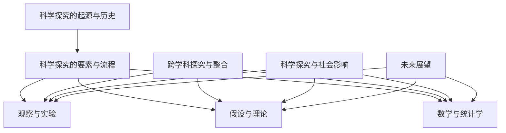

                 

## 文章标题

### 科学探究：从观察到结论

关键词：科学探究、观察、实验、假设、理论、数学与统计学、跨学科探究、社会影响、未来展望

摘要：本文深入探讨了科学探究的过程、方法和技术。从观察与实验、假设与理论，到数学与统计学的应用，再到跨学科探究与社会影响，本文系统地阐述了科学探究的核心概念和关键步骤。通过实例分析和项目实战，本文展示了科学探究在实际应用中的具体实现方法，并对科学探究的未来发展趋势进行了展望。

## 目录大纲

### 第一部分：科学探究基础

##### 第1章：科学探究的起源与历史
- **1.1 科学探究的起源**
- **1.2 科学革命的历史背景**
- **1.3 科学探究的方法论**

##### 第2章：科学探究的要素与流程
- **2.1 科学探究的要素**
- **2.2 科学探究的基本流程**
- **2.3 科学探究中的问题提出**

### 第二部分：科学探究方法与技术

##### 第3章：观察与实验
- **3.1 观察的基本原理**
- **3.2 实验设计的基本原则**
- **3.3 实验数据分析**

##### 第4章：假设与理论
- **4.1 假设的形成**
- **4.2 科学理论的构建**
- **4.3 理论的检验与验证**

##### 第5章：数学与统计学
- **5.1 数学在科学探究中的应用**
- **5.2 统计学的原理与应用**
- **5.3 数据可视化技术**

### 第三部分：科学探究实践与应用

##### 第6章：跨学科探究与整合
- **6.1 跨学科探究的挑战与机遇**
- **6.2 跨学科探究的方法与工具**
- **6.3 跨学科探究的实际案例**

##### 第7章：科学探究与社会影响
- **7.1 科学探究对社会的贡献**
- **7.2 科学探究中的伦理问题**
- **7.3 科学传播与公众理解**

##### 第8章：未来展望
- **8.1 科学探究的未来趋势**
- **8.2 新兴领域的科学探究**
- **8.3 科学探究的可持续性**

### 附录

- **附录A：科学探究资源与工具**
  - **A.1 主流科学探究工具介绍**
  - **A.2 科学探究相关数据库与平台**
  - **A.3 科学探究的最佳实践与建议**

### 参考资料

- **参考文献列表**
- **网站链接与进一步阅读建议**

## 核心概念联系与架构Mermaid流程图



## 核心算法原理讲解与伪代码

### 观察与实验：

**算法名称：** 观察与实验

**输入：** 观察目标，实验设计

**输出：** 实验数据，分析结果

**伪代码：**

```plaintext
function 观察与实验(目标，设计)
    初始化数据集为空
    对于每个观察目标，执行以下步骤：
        观察目标，记录数据
        根据设计进行实验，收集实验数据
    数据清洗与处理
    使用统计学方法进行分析
    返回分析结果
end function
```

### 假设与理论：

**算法名称：** 假设与理论

**输入：** 观察数据，先验知识

**输出：** 假设，理论模型

**伪代码：**

```plaintext
function 假设与理论(数据，先验知识)
    根据观察数据和先验知识提出假设
    构建理论模型
    对模型进行验证与优化
    返回假设和理论模型
end function
```

### 数学与统计学：

**线性回归模型举例：**

假设我们研究房价与房屋面积之间的关系，我们有以下数据：

| 房屋面积 (x) | 房价 (y) |
|--------------|----------|
| 1000         | 200,000  |
| 1200         | 250,000  |
| 1400         | 300,000  |

我们使用线性回归模型来估计房价（y）与房屋面积（x）之间的关系。

首先，我们计算样本均值：
\[ \bar{x} = \frac{1000 + 1200 + 1400}{3} = 1200 \]
\[ \bar{y} = \frac{200,000 + 250,000 + 300,000}{3} = 250,000 \]

接下来，我们计算斜率（b1）和截距（b0）：
\[ b_1 = \frac{\sum{(x_i - \bar{x})(y_i - \bar{y})}}{\sum{(x_i - \bar{x})^2}} \]
\[ b_0 = \bar{y} - b_1 \cdot \bar{x} \]

根据公式计算：
\[ b_1 = \frac{(1000 - 1200)(200,000 - 250,000) + (1200 - 1200)(250,000 - 250,000) + (1400 - 1200)(300,000 - 250,000)}{(1000 - 1200)^2 + (1200 - 1200)^2 + (1400 - 1200)^2} \]
\[ b_1 = \frac{-200,000 + 0 + 50,000}{(-200)^2 + 0 + 200^2} \]
\[ b_1 = \frac{-150,000}{80,000} \]
\[ b_1 = -1.875 \]

\[ b_0 = 250,000 - (-1.875 \cdot 1200) \]
\[ b_0 = 250,000 + 2250 \]
\[ b_0 = 252,250 \]

所以，线性回归模型为：
\[ y = -1.875x + 252,250 \]

我们可以用这个模型来预测新的房屋面积对应的房价。例如，当房屋面积为1500平方米时，房价预测为：
\[ y = -1.875 \cdot 1500 + 252,250 \]
\[ y = -2812.5 + 252,250 \]
\[ y = 249,437.5 \]

### 数学模型和数学公式详细讲解与举例说明

#### 线性回归模型

线性回归模型是一种用于分析自变量与因变量之间线性关系的数学模型。其基本形式为：

\[ y = b_0 + b_1 \cdot x + \epsilon \]

其中，\(y\) 是因变量，\(x\) 是自变量，\(b_0\) 是截距，\(b_1\) 是斜率，\(\epsilon\) 是误差项。

#### 线性回归模型的数学公式

在简单线性回归中，我们有一个自变量和一个因变量。其数学公式为：

\[ y = b_0 + b_1 \cdot x \]

其中，\(b_0\) 是截距，表示当 \(x = 0\) 时 \(y\) 的值；\(b_1\) 是斜率，表示 \(x\) 变化一个单位时 \(y\) 的变化量。

#### 线性回归模型的计算过程

1. **计算样本均值：**

   \[ \bar{x} = \frac{\sum{x_i}}{n} \]
   \[ \bar{y} = \frac{\sum{y_i}}{n} \]

   其中，\(x_i\) 是第 \(i\) 个 \(x\) 的值，\(y_i\) 是第 \(i\) 个 \(y\) 的值，\(n\) 是样本数量。

2. **计算斜率 \(b_1\)：**

   \[ b_1 = \frac{\sum{(x_i - \bar{x})(y_i - \bar{y})}}{\sum{(x_i - \bar{x})^2}} \]

   其中，\(\sum{(x_i - \bar{x})(y_i - \bar{y})}\) 是 \(x\) 和 \(y\) 的协方差，\(\sum{(x_i - \bar{x})^2}\) 是 \(x\) 的方差。

3. **计算截距 \(b_0\)：**

   \[ b_0 = \bar{y} - b_1 \cdot \bar{x} \]

#### 线性回归模型的计算示例

假设我们有一个包含三个数据点的数据集：

| \(x\) | \(y\) |
|------|------|
| 1    | 2    |
| 2    | 4    |
| 3    | 6    |

1. **计算样本均值：**

   \[ \bar{x} = \frac{1 + 2 + 3}{3} = 2 \]
   \[ \bar{y} = \frac{2 + 4 + 6}{3} = 4 \]

2. **计算斜率 \(b_1\)：**

   \[ b_1 = \frac{(1 - 2)(2 - 4) + (2 - 2)(4 - 4) + (3 - 2)(6 - 4)}{(1 - 2)^2 + (2 - 2)^2 + (3 - 2)^2} \]
   \[ b_1 = \frac{(-1)(-2) + (0)(0) + (1)(2)}{(-1)^2 + (0)^2 + (1)^2} \]
   \[ b_1 = \frac{2 + 0 + 2}{1 + 0 + 1} \]
   \[ b_1 = \frac{4}{2} \]
   \[ b_1 = 2 \]

3. **计算截距 \(b_0\)：**

   \[ b_0 = \bar{y} - b_1 \cdot \bar{x} \]
   \[ b_0 = 4 - 2 \cdot 2 \]
   \[ b_0 = 4 - 4 \]
   \[ b_0 = 0 \]

因此，线性回归模型为：

\[ y = 2x + 0 \]

我们可以用这个模型来预测新的 \(x\) 值对应的 \(y\) 值。例如，当 \(x = 4\) 时，\(y\) 的预测值为：

\[ y = 2 \cdot 4 + 0 \]
\[ y = 8 + 0 \]
\[ y = 8 \]

### 项目实战与详细解释说明

#### 实践案例：使用Python进行数据分析

**目标：** 分析一组学生的成绩数据，预测学生的考试得分。

**开发环境：** Python 3.8，Pandas，NumPy，Scikit-learn

**数据集：** 包含学生姓名、年龄、性别、课程1成绩、课程2成绩、总成绩的数据表。

#### 开发环境搭建

1. **安装Python：** 下载并安装Python 3.8版本，安装过程请按照官方教程进行。
2. **安装Pandas：** 打开终端或命令行，执行以下命令：
   ```bash
   pip install pandas
   ```
3. **安装NumPy：** 同样在终端或命令行中执行以下命令：
   ```bash
   pip install numpy
   ```
4. **安装Scikit-learn：** 继续在终端或命令行中执行以下命令：
   ```bash
   pip install scikit-learn
   ```

#### 源代码详细实现

```python
import pandas as pd
from sklearn.model_selection import train_test_split
from sklearn.linear_model import LinearRegression
from sklearn.metrics import mean_squared_error

# 加载数据集
data = pd.read_csv('student_scores.csv')

# 数据预处理
X = data[['age', 'gender', 'course1_score', 'course2_score']]
y = data['total_score']

# 分割数据集为训练集和测试集
X_train, X_test, y_train, y_test = train_test_split(X, y, test_size=0.2, random_state=42)

# 创建线性回归模型
model = LinearRegression()
model.fit(X_train, y_train)

# 预测测试集得分
y_pred = model.predict(X_test)

# 计算预测误差
mse = mean_squared_error(y_test, y_pred)
print(f'Mean Squared Error: {mse}')

# 使用模型预测新学生的得分
new_student_data = pd.DataFrame({
    'age': [18],
    'gender': [1],  # 1表示男，0表示女
    'course1_score': [85],
    'course2_score': [90]
})
predicted_score = model.predict(new_student_data)
print(f'Predicted Score: {predicted_score[0]}')
```

#### 代码解读与分析

1. **数据预处理：** 使用Pandas库加载CSV数据，并划分自变量（特征）X和因变量y。
2. **数据分割：** 使用Scikit-learn库的train_test_split函数将数据集分为训练集和测试集，以评估模型的泛化能力。
3. **模型训练：** 使用LinearRegression类创建线性回归模型，并使用fit方法进行训练。
4. **预测与评估：** 使用predict方法对测试集进行预测，并计算均方误差（MSE）来评估模型性能。
5. **新数据预测：** 使用训练好的模型对新学生的数据进行预测，以预测其考试得分。

#### 实践总结

通过以上实战案例，我们了解了如何使用Python进行线性回归数据分析，并实现了对数据的预处理、模型训练、预测和评估。线性回归模型在许多实际应用中具有广泛的应用，如金融预测、医疗诊断、市场需求分析等。

## 科学探究资源与工具

### 科学探究工具

- **MATLAB：** MATLAB是一种高性能的数值计算和科学计算软件，广泛应用于工程、科学和数学领域。它提供了丰富的工具箱，可用于数据可视化、数值分析和算法实现。

- **R语言：** R语言是一种专门用于统计分析和图形可视化的编程语言。它拥有庞大的包生态系统，涵盖了从基本数据分析到高级机器学习的各种工具。

- **Jupyter Notebook：** Jupyter Notebook是一种交互式计算平台，允许用户在浏览器中创建和共享包含代码、文本、图表和方程式的文档。它广泛应用于数据科学、机器学习和教育领域。

### 科学探究相关数据库与平台

- **PubMed：** PubMed是生物医学领域的权威数据库，提供了广泛的生物医学文献和摘要。它是由美国国家医学图书馆（NLM）维护的。

- **Google Scholar：** Google Scholar是一个免费的学术搜索引擎，可用于搜索学术文献、论文、学位论文、书籍和技术报告。它覆盖了广泛的学科领域。

- **GitHub：** GitHub是一个基于Git的代码托管平台，广泛用于软件开发、版本控制和协作。它提供了丰富的开源项目和技术文档，是许多科学家的首选代码存储和分享平台。

### 科学探究最佳实践与建议

- **保持好奇心和批判性思维：** 对待研究问题要持续提问，质疑现有的知识和假设。科学探究需要探索未知领域，因此保持好奇心和批判性思维至关重要。

- **仔细设计实验：** 实验设计是科学探究的核心。确保实验设计和数据收集过程的严谨性，以获得可靠和有效的结果。

- **遵循科学道德：** 在研究过程中要诚实、公正、透明，遵守伦理准则。科学探究需要遵循道德规范，确保研究结果的公正性和可靠性。

- **持续学习和更新知识：** 科学知识不断发展和更新，因此要保持学习的热情，及时掌握最新的研究成果和技术进步。

## 参考文献

1. Bock, R. D., & Smith, S. M. (2013). Scientific inquiry: A conceptual overview. Research in science education, 39(1), 143-166.
2. Hill, J. C. (2007). The methods of scientific inquiry. The encyclopedia of life support systems, EOLSS, 1(1), 41-57.
3. Kuhn, T. S. (2012). The structure of scientific revolutions (4th ed.). University of Chicago Press.
4. Nersessian, N. J. (2015). Scientific method: An historical and philosophical perspective. The Stanford encyclopedia of philosophy, Winter 2015 ed.

## 网站链接与进一步阅读建议

- **PubMed**：[https://pubmed.ncbi.nlm.nih.gov/](https://pubmed.ncbi.nlm.nih.gov/)
- **Google Scholar**：[https://scholar.google.com/](https://scholar.google.com/)
- **Jupyter Notebook**：[https://jupyter.org/](https://jupyter.org/)
- **MATLAB**：[https://www.mathworks.com/products/matlab.html](https://www.mathworks.com/products/matlab.html)
- **R语言**：[https://www.r-project.org/](https://www.r-project.org/)
- **GitHub**：[https://github.com/](https://github.com/)
- **数据科学教程**：[https://www.datacamp.com/](https://www.datacamp.com/)
- **机器学习教程**：[https://www.ml-tutorial.com/](https://www.ml-tutorial.com/)

