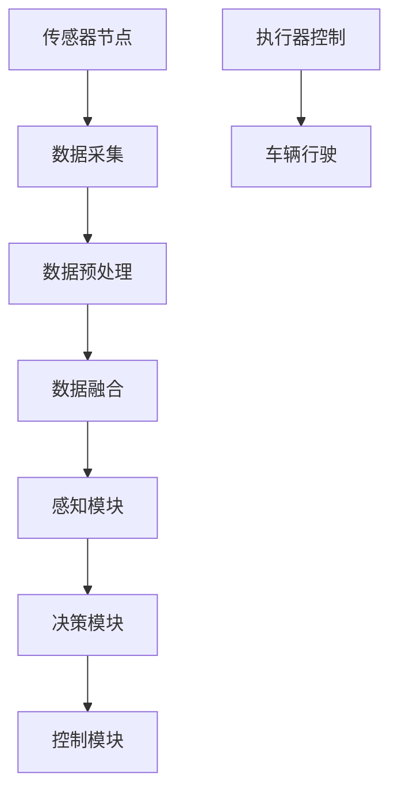

                 

# 《端到端自动驾驶的分布式传感器融合架构》

> 关键词：端到端自动驾驶、分布式传感器融合、传感器融合架构、感知模块、决策模块、控制模块、开发环境搭建、项目实战、测试与评估、未来展望与挑战

> 摘要：本文详细探讨了端到端自动驾驶系统的分布式传感器融合架构。首先介绍了自动驾驶技术的发展历程和系统架构，随后深入分析了传感器融合的原理和技术。接着，本文提出了分布式传感器融合架构，并详细阐述了其在感知、决策和控制模块中的应用。最后，通过项目实战展示了端到端自动驾驶系统的开发流程，并对系统进行了测试与评估。文章最后对未来自动驾驶技术的发展趋势和挑战进行了展望。

## 第一部分：自动驾驶概述

### 第1章：自动驾驶技术概述

#### 1.1 自动驾驶的定义与分类

自动驾驶（Autonomous Driving）是指通过车载传感器、控制算法和执行器，使车辆能够自主地完成行驶、避障、换道、停车等任务。根据自动驾驶的自动化程度，可以将自动驾驶分为以下六个级别：

- 级别0：无自动化，所有驾驶任务由人类驾驶员完成。
- 级别1：部分自动化，特定情况下自动化完成部分驾驶任务。
- 级别2：部分自动化，特定情况下自动化完成多个驾驶任务。
- 级别3：有条件自动化，特定条件下自动化完成所有驾驶任务。
- 级别4：高度自动化，绝大多数情况下自动化完成所有驾驶任务。
- 级别5：完全自动化，无需人类干预，车辆自主完成所有驾驶任务。

#### 1.2 自动驾驶的发展历程

自动驾驶技术的研究始于20世纪50年代，最早的自动驾驶实验是在车辆上安装雷达和摄像头，通过简单的控制算法实现自动驾驶。随着计算机技术和传感器技术的不断发展，自动驾驶技术逐渐成熟。以下是自动驾驶技术的发展历程：

- 1950年代：发明了自动驾驶的概念，最早应用于军事领域。
- 1960年代：出现基于雷达和摄像头的自动驾驶原型。
- 1970年代：美国和日本开始研究自动驾驶汽车，并取得了一些初步成果。
- 1980年代：美国进行大规模的自动驾驶汽车试验，提出了自动驾驶的等级划分。
- 1990年代：出现基于GPS的自动驾驶系统，自动驾驶技术逐渐应用于民用领域。
- 2000年代：出现基于激光雷达的自动驾驶系统，自动驾驶技术取得了重大突破。
- 2010年代至今：自动驾驶技术逐步向商业化迈进，多家科技公司和研究机构发布了一系列自动驾驶汽车。

#### 1.3 自动驾驶技术现状

目前，自动驾驶技术已经取得了显著的进展，许多公司和研究机构都在自动驾驶领域进行了大量的研发工作。以下是自动驾驶技术的一些现状：

- 级别2和级别3的自动驾驶汽车已经商业化，应用于出租车、公交车和货车等领域。
- 级别4的自动驾驶汽车正在研发中，一些公司已经开始在特定区域内进行测试。
- 级别5的自动驾驶汽车尚未实现商业化，但一些公司和研究机构正在积极推进相关技术的研究。

#### 1.4 自动驾驶的发展趋势

随着人工智能、传感器技术和计算能力的不断提升，自动驾驶技术将迎来快速发展。以下是自动驾驶技术的发展趋势：

- 自动驾驶技术将逐步向级别4和级别5迈进，实现完全自动化的驾驶。
- 自动驾驶系统将更加智能化，能够适应复杂的交通环境和复杂的驾驶场景。
- 自动驾驶技术将与其他智能交通系统相结合，实现车联网和智能交通管理。
- 自动驾驶技术将推动汽车产业的变革，改变人们的生活方式。

### 第2章：自动驾驶系统架构

#### 2.1 端到端自动驾驶系统架构概述

端到端自动驾驶系统架构包括感知、决策和控制三个核心模块。这三个模块协同工作，使车辆能够实现自主驾驶。以下是端到端自动驾驶系统架构的概述：


#### 2.2 感知模块架构

感知模块是自动驾驶系统的核心，主要负责对周围环境进行感知，获取道路信息、车辆信息、行人信息等。感知模块通常包括以下几个部分：

1. 传感器选择与布局：根据自动驾驶的需求，选择合适的传感器，如激光雷达、摄像头、毫米波雷达、超声波传感器等，并对其进行合理的布局。
2. 数据预处理：对传感器采集到的原始数据进行预处理，包括去噪声、滤波、特征提取等。
3. 多传感器数据融合：将不同传感器获取的数据进行融合，提高感知精度和鲁棒性。

#### 2.3 决策模块架构

决策模块主要负责根据感知模块提供的环境信息，对车辆的行驶策略进行决策。决策模块通常包括以下几个部分：

1. 情境识别：根据感知模块提供的信息，识别当前驾驶情境，如直线行驶、弯道行驶、交叉路口等。
2. 行为规划：根据情境识别结果，规划车辆的行驶行为，如加速、减速、换道、停车等。
3. 风险评估：评估当前驾驶情境下的风险，如碰撞风险、追尾风险等。

#### 2.4 控制模块架构

控制模块主要负责根据决策模块提供的行驶策略，控制车辆的执行器，实现车辆的自主驾驶。控制模块通常包括以下几个部分：

1. 执行器控制：根据决策模块提供的行驶策略，控制车辆的执行器，如油门、刹车、方向盘等。
2. 驾驶状态监测：监测车辆的行驶状态，如车速、油门开度、刹车力度等。
3. 异常处理：当系统出现异常时，进行异常处理，如紧急制动、车辆切换到手动驾驶模式等。

#### 2.5 系统集成与验证

系统集成是将感知、决策和控制模块进行集成，使系统整体协调工作。系统集成完成后，需要对系统进行验证，以确保系统的稳定性和可靠性。系统验证包括以下几个方面：

1. 功能测试：验证系统的各个功能是否正常工作。
2. 性能测试：验证系统的感知、决策和控制性能是否达到预期。
3. 安全测试：验证系统在异常情况下的安全性能，如紧急制动、车辆失控等。
4. 用户体验测试：验证系统对驾驶者的用户体验，如驾驶舒适性、操作便捷性等。

## 第二部分：传感器融合架构

### 第3章：传感器融合原理与技术

#### 3.1 传感器融合概述

传感器融合是指将多个传感器获取的数据进行综合处理，以获得更准确、更完整的环境信息。传感器融合在自动驾驶系统中具有重要意义，可以提高感知精度、降低传感器故障对系统的影响、减少数据传输量等。以下是传感器融合的主要优点：

1. 提高感知精度：通过融合不同传感器获取的数据，可以消除单一传感器的盲区，提高对环境的感知精度。
2. 降低传感器故障影响：当某个传感器出现故障时，其他传感器可以提供补充信息，降低传感器故障对系统的影响。
3. 减少数据传输量：通过融合传感器数据，可以降低传输数据量，提高通信效率。
4. 提高系统鲁棒性：传感器融合可以提高系统的鲁棒性，使系统在复杂环境下仍能稳定运行。

#### 3.2 传感器选择与布局

传感器选择与布局是传感器融合的关键，直接影响传感器融合的效果。以下是传感器选择与布局的要点：

1. 传感器类型选择：根据自动驾驶系统的需求，选择合适的传感器类型，如激光雷达、摄像头、毫米波雷达、超声波传感器等。
2. 传感器数量选择：选择适当的传感器数量，既能覆盖环境信息，又能避免冗余。
3. 传感器布局设计：根据车辆结构、行驶环境等因素，设计合理的传感器布局，确保传感器能够获取到完整、准确的环境信息。

#### 3.3 传感器数据处理

传感器数据处理是传感器融合的核心，直接影响传感器融合的效果。以下是传感器数据处理的主要步骤：

1. 数据预处理：对传感器采集到的原始数据进行预处理，包括去噪声、滤波、归一化等。
2. 数据同步：确保不同传感器采集的数据在同一时间戳下，进行数据同步。
3. 数据融合：根据传感器数据的特性，选择合适的数据融合算法，如卡尔曼滤波、贝叶斯滤波、神经网络等。

#### 3.4 传感器融合算法

传感器融合算法是传感器融合的核心，直接影响传感器融合的效果。以下是常用的传感器融合算法：

1. 线性融合算法：基于线性代数原理，对传感器数据进行加权平均，如卡尔曼滤波、贝叶斯滤波等。
2. 非线性融合算法：基于非线性函数，对传感器数据进行融合，如神经网络、贝叶斯网络等。
3. 深度学习融合算法：利用深度学习技术，对传感器数据进行融合，如卷积神经网络、循环神经网络等。

### 第4章：分布式传感器融合架构

#### 4.1 分布式传感器融合架构概述

分布式传感器融合架构是指在多个传感器节点上实现传感器融合，以提高系统的整体性能和可靠性。分布式传感器融合架构通常包括以下几个部分：

1. 传感器节点：负责采集环境信息，并将数据发送到中心节点。
2. 中心节点：负责接收传感器节点的数据，进行融合处理，并将结果发送给其他节点。
3. 数据传输网络：负责传输传感器节点的数据，实现节点间的通信。

#### 4.2 数据通信与同步

数据通信与同步是分布式传感器融合架构的关键，直接影响传感器融合的效果。以下是数据通信与同步的主要步骤：

1. 数据传输协议设计：根据系统需求和通信环境，设计合适的数据传输协议，如TCP、UDP、MQTT等。
2. 数据同步机制设计：设计数据同步机制，确保不同传感器节点的数据在同一时间戳下进行融合处理。
3. 数据传输优化：对数据传输过程进行优化，降低传输延迟和带宽消耗。

#### 4.3 算法部署与优化

算法部署与优化是分布式传感器融合架构的关键，直接影响传感器融合的效果。以下是算法部署与优化的主要步骤：

1. 算法选择与优化：根据系统需求和传感器数据特性，选择合适的传感器融合算法，并进行优化。
2. 算法部署：将优化后的传感器融合算法部署到传感器节点和中心节点，实现分布式融合处理。
3. 系统优化：对整个分布式传感器融合系统进行优化，提高系统性能和可靠性。

#### 4.4 分布式传感器融合案例分析

本节将结合实际案例，介绍分布式传感器融合架构在自动驾驶系统中的应用。以下是一个分布式传感器融合架构在自动驾驶系统中的应用案例：

1. 传感器节点选择：在自动驾驶车辆上安装激光雷达、摄像头、毫米波雷达和超声波传感器，作为传感器节点。
2. 数据采集与传输：传感器节点实时采集环境信息，将数据发送到中心节点。
3. 数据融合处理：中心节点接收传感器节点的数据，利用卡尔曼滤波算法进行融合处理，获得更准确的环境信息。
4. 行驶决策：根据融合后的环境信息，对车辆的行驶策略进行决策，实现自主驾驶。

### 第5章：传感器融合在自动驾驶中的应用

#### 5.1 感知模块中的传感器融合

感知模块是自动驾驶系统的核心，负责对周围环境进行感知，获取道路信息、车辆信息、行人信息等。传感器融合在感知模块中具有重要意义，可以提高感知精度和鲁棒性。以下是感知模块中的传感器融合应用：

1. 激光雷达与摄像头的融合：激光雷达可以提供高精度的距离信息，摄像头可以提供图像信息。将激光雷达和摄像头的数据进行融合，可以同时获得距离和图像信息，提高感知精度。
2. 毫米波雷达与超声波传感器的融合：毫米波雷达可以提供远距离的目标信息，超声波传感器可以提供近距离的目标信息。将毫米波雷达和超声波传感器的数据进行融合，可以同时获得远距离和近距离的目标信息，提高感知精度和鲁棒性。

#### 5.2 决策模块中的传感器融合

决策模块负责根据感知模块提供的环境信息，对车辆的行驶策略进行决策。传感器融合在决策模块中具有重要意义，可以提高决策的准确性和鲁棒性。以下是决策模块中的传感器融合应用：

1. 多传感器数据的融合：将激光雷达、摄像头、毫米波雷达、超声波传感器等多传感器的数据融合，获得更准确的环境信息，提高决策的准确性。
2. 多源数据的融合：将来自GPS、IMU、地图等信息的多源数据融合，提高环境信息的完整性和准确性，提高决策的鲁棒性。

#### 5.3 控制模块中的传感器融合

控制模块负责根据决策模块提供的行驶策略，控制车辆的执行器，实现车辆的自主驾驶。传感器融合在控制模块中具有重要意义，可以提高控制的精度和稳定性。以下是控制模块中的传感器融合应用：

1. 激光雷达与摄像头的融合：激光雷达可以提供高精度的距离信息，摄像头可以提供图像信息。将激光雷达和摄像头的数据进行融合，可以同时获得距离和图像信息，提高控制精度。
2. 毫米波雷达与超声波传感器的融合：毫米波雷达可以提供远距离的目标信息，超声波传感器可以提供近距离的目标信息。将毫米波雷达和超声波传感器的数据进行融合，可以同时获得远距离和近距离的目标信息，提高控制精度和稳定性。

#### 5.4 全车传感器融合系统设计

全车传感器融合系统设计是自动驾驶系统的关键，需要综合考虑传感器选择、布局、数据处理、融合算法等因素。以下是全车传感器融合系统设计的主要步骤：

1. 传感器选择与布局：根据自动驾驶系统的需求，选择合适的传感器，并对其进行合理的布局，确保传感器能够获取到完整、准确的环境信息。
2. 数据采集与传输：传感器节点实时采集环境信息，将数据发送到中心节点。
3. 数据预处理：对传感器采集到的原始数据进行预处理，包括去噪声、滤波、归一化等。
4. 数据融合处理：中心节点接收传感器节点的数据，利用卡尔曼滤波、贝叶斯滤波等算法进行融合处理，获得更准确的环境信息。
5. 行驶决策与控制：根据融合后的环境信息，对车辆的行驶策略进行决策，并控制车辆的执行器，实现自主驾驶。

## 第三部分：端到端自动驾驶实战

### 第6章：自动驾驶开发环境搭建

#### 6.1 开发环境搭建概述

自动驾驶开发环境搭建是自动驾驶系统开发的第一步，主要包括硬件设备选择、软件工具选择和开发环境配置。以下是自动驾驶开发环境搭建的主要步骤：

1. 硬件设备选择：根据自动驾驶系统的需求，选择合适的硬件设备，如高性能计算机、传感器设备、车辆平台等。
2. 软件工具选择：选择合适的软件工具，如操作系统、编译器、集成开发环境等。
3. 开发环境配置：安装和配置开发环境，确保软件工具和硬件设备能够正常工作。
4. 开发环境优化：对开发环境进行优化，提高开发效率。

#### 6.2 软件工具与硬件设备选择

在自动驾驶开发环境中，软件工具和硬件设备的选择至关重要。以下是常见的软件工具和硬件设备选择：

1. 软件工具：
   - 操作系统：Ubuntu、Windows 10
   - 编译器：GCC、Clang
   - 集成开发环境：Eclipse、Visual Studio
   - 传感器数据处理工具：ROS（Robot Operating System）
   - 机器学习框架：TensorFlow、PyTorch

2. 硬件设备：
   - 计算机平台：高性能计算机、云计算平台
   - 传感器设备：激光雷达、摄像头、毫米波雷达、超声波传感器等
   - 车辆平台：自动驾驶测试车辆、模拟仿真平台

#### 6.3 开发环境配置与调试

开发环境配置与调试是确保软件开发顺利进行的关键。以下是开发环境配置与调试的主要步骤：

1. 安装操作系统：安装支持自动驾驶开发的操作系统，如Ubuntu。
2. 安装编译器：安装支持自动驾驶开发编译器，如GCC、Clang。
3. 安装集成开发环境：安装支持自动驾驶开发的集成开发环境，如Eclipse、Visual Studio。
4. 安装传感器数据处理工具：安装ROS，配置传感器驱动和工具。
5. 安装机器学习框架：安装TensorFlow、PyTorch等机器学习框架。
6. 配置开发环境：配置环境变量、依赖库等。
7. 调试开发环境：验证开发环境是否正常工作，如编译程序、运行程序等。

### 6.4 开发环境优化与维护

开发环境优化与维护是确保软件开发高效、稳定的关键。以下是开发环境优化与维护的主要步骤：

1. 优化系统性能：调整操作系统设置，提高系统性能，如调整内核参数、内存管理等。
2. 调整硬件资源：根据软件开发需求，调整硬件资源分配，如CPU、内存、硬盘等。
3. 更新软件工具：定期更新软件工具，确保支持最新技术。
4. 维护硬件设备：定期维护硬件设备，确保硬件设备正常工作。
5. 系统备份与恢复：定期备份系统，确保数据安全。

### 第7章：端到端自动驾驶项目实战

#### 7.1 项目背景与需求分析

本节将以一个实际的自动驾驶项目为例，介绍端到端自动驾驶系统的开发过程。项目背景如下：

- 项目名称：城市自动驾驶出租车系统
- 项目目标：开发一款能够实现自主驾驶的城市自动驾驶出租车系统，提供高效、安全、舒适的出行服务。
- 项目需求：
  - 实现自动驾驶车辆在复杂城市交通环境中的自主行驶。
  - 提供实时导航和路线规划功能。
  - 提供舒适的驾驶体验，如平稳加速、平稳制动、自动换道等。

#### 7.2 项目方案设计与实现

项目方案设计是实现自动驾驶系统的关键，主要包括系统架构设计、模块划分、算法设计等方面。以下是项目方案设计与实现的主要步骤：

1. 系统架构设计：根据项目需求，设计端到端自动驾驶系统的架构，包括感知模块、决策模块、控制模块等。
2. 模块划分：将系统划分为感知、决策、控制等模块，明确各模块的功能和接口。
3. 算法设计：根据系统架构，设计感知、决策、控制等模块的算法，如感知算法、决策算法、控制算法等。
4. 模块实现：根据模块划分和算法设计，实现各模块的功能，并进行模块间的接口开发。
5. 系统集成：将各模块集成到一起，实现系统整体功能。

#### 7.3 项目实施与调试

项目实施与调试是自动驾驶系统开发的关键阶段，主要包括代码编写、系统调试、性能优化等方面。以下是项目实施与调试的主要步骤：

1. 代码编写：根据项目需求和设计方案，编写各模块的代码，并进行代码审查和优化。
2. 系统调试：通过模拟仿真和实际道路测试，对系统进行调试，确保系统功能正确、稳定、可靠。
3. 性能优化：对系统进行性能优化，如优化算法、提高计算效率、减少通信延迟等。
4. 异常处理：设计异常处理机制，确保系统在异常情况下能够正常工作。

#### 7.4 项目总结与反思

项目总结与反思是自动驾驶系统开发的重要环节，有助于总结经验教训，提高系统开发质量。以下是项目总结与反思的主要步骤：

1. 项目总结：总结项目实施过程中取得的成果、遇到的问题和解决方案，以及项目管理的经验教训。
2. 反思与改进：对项目实施过程中存在的问题和不足进行反思，并提出改进措施，为后续项目提供参考。

### 第8章：端到端自动驾驶系统测试与评估

#### 8.1 测试方法与指标

测试是确保自动驾驶系统可靠性和安全性的重要环节。以下是端到端自动驾驶系统的测试方法和指标：

1. 测试方法：
   - 模拟仿真测试：在虚拟环境中对自动驾驶系统进行测试，验证系统在各种交通场景下的性能。
   - 实际道路测试：在实际道路上对自动驾驶系统进行测试，验证系统在真实交通环境中的性能。
   - 异常场景测试：设计各种异常场景，如紧急刹车、行人横穿、障碍物等，测试系统在异常情况下的应对能力。

2. 测试指标：
   - 感知精度：评估感知模块对周围环境的感知精度。
   - 决策效率：评估决策模块在处理感知信息时的效率和准确性。
   - 控制稳定性：评估控制模块对车辆执行器的控制效果和稳定性。
   - 安全性：评估系统在各种交通环境下的安全性能，如碰撞风险、追尾风险等。

#### 8.2 测试环境搭建与数据采集

测试环境搭建与数据采集是测试工作的基础。以下是测试环境搭建与数据采集的主要步骤：

1. 测试环境搭建：搭建模拟仿真测试环境和实际道路测试环境，包括测试场景、测试车辆、测试设备等。
2. 数据采集：在测试过程中，采集感知模块、决策模块、控制模块的运行数据，如传感器数据、控制指令等。

#### 8.3 测试结果分析与优化

测试结果分析是评估自动驾驶系统性能的重要环节。以下是测试结果分析与优化的主要步骤：

1. 测试结果分析：分析测试数据，评估感知、决策、控制模块的性能指标，找出系统存在的问题。
2. 性能优化：根据测试结果，对系统进行性能优化，如优化算法、调整参数等。
3. 系统重构：根据测试结果和性能优化需求，对系统进行重构，提高系统性能和稳定性。

#### 8.4 系统评估与改进

系统评估是自动驾驶系统开发完成后的关键环节，旨在评估系统的整体性能和可靠性。以下是系统评估与改进的主要步骤：

1. 系统评估：根据测试结果和性能优化需求，对系统进行整体评估，确定系统是否达到预期目标。
2. 问题定位：找出系统存在的问题，如感知精度低、决策效率低等。
3. 改进措施：针对系统存在的问题，制定改进措施，如优化算法、增加传感器等。
4. 系统重构：根据改进措施，对系统进行重构，提高系统性能和稳定性。

## 第四部分：未来展望与挑战

### 第9章：自动驾驶技术的发展趋势

#### 9.1 自动驾驶技术发展趋势分析

自动驾驶技术正在快速发展，未来将呈现出以下发展趋势：

1. 自动驾驶级别的提高：自动驾驶技术将逐步向级别4和级别5迈进，实现完全自动化的驾驶。
2. 智能化的提升：自动驾驶系统将更加智能化，能够适应复杂的交通环境和复杂的驾驶场景。
3. 车联网的融合：自动驾驶技术将与其他智能交通系统相结合，实现车联网和智能交通管理。
4. 集成度的提高：自动驾驶系统将集成更多传感器和执行器，提高系统的整体性能和可靠性。
5. 数据驱动的进步：自动驾驶技术的发展将更加依赖于大数据和人工智能技术，实现数据驱动的优化和创新。

#### 9.2 未来自动驾驶系统的特点

未来自动驾驶系统将具有以下特点：

1. 全自动驾驶：实现完全自动化的驾驶，无需人类干预。
2. 智能决策：基于大数据和人工智能技术，实现智能化的决策和规划。
3. 高可靠性：通过多重传感器和冗余设计，提高系统的可靠性和安全性。
4. 舒适性：提供舒适的驾驶体验，如平稳加速、平稳制动、自动换道等。
5. 环境适应性：能够适应各种交通环境和驾驶场景，具备较强的环境适应性。

#### 9.3 自动驾驶技术的未来挑战

尽管自动驾驶技术具有巨大的潜力，但仍然面临着一系列挑战：

1. 技术挑战：自动驾驶技术的算法复杂、数据处理量大，需要不断提高计算能力和算法优化。
2. 安全性挑战：自动驾驶系统需要确保在复杂交通环境下的安全性能，避免交通事故的发生。
3. 法规挑战：自动驾驶技术的发展需要相应的法律法规支持，如车辆登记、道路使用等。
4. 社会接受度挑战：公众对自动驾驶技术的接受度较低，需要通过宣传教育提高公众对自动驾驶技术的了解和信任。

#### 9.4 自动驾驶技术的发展方向

未来自动驾驶技术的发展方向将包括以下几个方面：

1. 算法创新：通过深度学习、强化学习等人工智能技术，提高自动驾驶系统的决策能力。
2. 传感器技术：研发更高精度、更高可靠性的传感器，如激光雷达、视觉传感器等。
3. 车联网技术：通过车联网技术，实现车辆之间的信息共享和协同工作，提高交通效率。
4. 遥感技术：通过遥感技术，获取道路和交通信息，为自动驾驶系统提供实时数据支持。
5. 法规与标准的制定：制定自动驾驶技术的法律法规和标准，确保自动驾驶技术的合法性和安全性。

### 第10章：分布式传感器融合架构的未来

#### 10.1 分布式传感器融合架构的未来展望

分布式传感器融合架构在自动驾驶系统中具有重要作用，未来将呈现以下发展趋势：

1. 传感器技术的进步：随着传感器技术的不断发展，将出现更高精度、更高可靠性的传感器，进一步提高分布式传感器融合架构的性能。
2. 算法优化：通过深度学习、强化学习等人工智能技术，优化分布式传感器融合算法，提高数据融合的精度和效率。
3. 软硬件协同：通过软硬件协同优化，提高分布式传感器融合系统的计算能力和通信效率，降低功耗和成本。
4. 车联网的融合：分布式传感器融合架构将与其他智能交通系统相结合，实现车联网和智能交通管理，提高交通效率和安全性。

#### 10.2 新型传感器融合技术的应用

新型传感器融合技术在分布式传感器融合架构中具有重要意义，未来将广泛应用于自动驾驶系统。以下是一些新型传感器融合技术的应用：

1. 毫米波雷达与摄像头融合：毫米波雷达具有远距离探测能力，摄像头具有高分辨率成像能力，两者融合可以提供更全面的环境信息。
2. 激光雷达与视觉传感器融合：激光雷达可以提供高精度的距离信息，视觉传感器可以提供图像信息，两者融合可以提供更准确的环境感知。
3. 增强现实与虚拟现实融合：通过增强现实和虚拟现实技术，将真实环境和虚拟环境相结合，提高自动驾驶系统的感知和决策能力。
4. 纳米传感器融合：纳米传感器具有高灵敏度、高分辨率等特点，可以用于检测微小目标和环境变化，提高自动驾驶系统的感知精度。

#### 10.3 分布式传感器融合架构的优化方向

分布式传感器融合架构的优化是提高自动驾驶系统性能的关键。未来分布式传感器融合架构的优化方向包括：

1. 数据处理优化：通过并行计算、分布式计算等手段，提高数据处理速度和效率。
2. 算法优化：针对不同的应用场景，设计更高效的传感器融合算法，提高数据融合的精度和稳定性。
3. 系统集成优化：优化分布式传感器融合系统的架构和模块划分，提高系统的整体性能和可靠性。
4. 通信优化：通过优化数据传输协议和通信方式，提高系统的通信效率和数据传输速度。

#### 10.4 分布式传感器融合架构面临的挑战

分布式传感器融合架构在自动驾驶系统中具有重要意义，但同时也面临着一系列挑战：

1. 数据处理复杂度：分布式传感器融合涉及大量数据和处理过程，处理复杂度较高，需要不断提高计算能力和算法优化。
2. 数据同步和一致性：分布式传感器融合需要确保不同传感器节点的数据同步和一致性，避免数据冲突和错误。
3. 系统可靠性和安全性：分布式传感器融合系统需要确保在复杂环境下的可靠性和安全性，避免传感器故障和网络安全问题。
4. 成本和功耗：分布式传感器融合系统需要考虑成本和功耗，提高系统的性价比和能效。

### 第11章：自动驾驶与传感器融合的协同发展

#### 11.1 自动驾驶与传感器融合的关系

自动驾驶与传感器融合密切相关，两者相互促进、共同发展。以下是自动驾驶与传感器融合之间的关系：

1. 传感器融合是自动驾驶的基础：传感器融合为自动驾驶系统提供准确、完整的环境信息，是自动驾驶实现的关键。
2. 自动驾驶是传感器融合的应用场景：自动驾驶系统为传感器融合提供了实际应用场景，推动了传感器融合技术的创新和发展。
3. 传感器融合与自动驾驶的协同发展：传感器融合与自动驾驶技术相互依赖、协同发展，共同推动智能交通和智能出行的发展。

#### 11.2 协同发展的重要性

自动驾驶与传感器融合的协同发展具有重要意义，主要体现在以下几个方面：

1. 提高自动驾驶系统的性能和可靠性：传感器融合可以提高自动驾驶系统的感知精度和决策能力，提高系统的性能和可靠性。
2. 降低自动驾驶系统的成本和功耗：通过协同发展，可以优化传感器融合架构和算法，降低系统的成本和功耗，提高系统的性价比。
3. 推动智能交通和智能出行的发展：自动驾驶与传感器融合的协同发展，可以推动智能交通和智能出行的发展，提高交通效率和安全性。

#### 11.3 协同发展的实践案例

以下是自动驾驶与传感器融合协同发展的实践案例：

1. 激光雷达与摄像头融合：激光雷达提供高精度的距离信息，摄像头提供图像信息，两者融合可以提高自动驾驶系统的感知精度。
2. 毫米波雷达与摄像头融合：毫米波雷达提供远距离的目标信息，摄像头提供近距离的目标信息，两者融合可以提高自动驾驶系统的感知范围和精度。
3. 增强现实与虚拟现实融合：通过增强现实和虚拟现实技术，将真实环境和虚拟环境相结合，提高自动驾驶系统的感知和决策能力。

#### 11.4 协同发展的未来前景

自动驾驶与传感器融合的协同发展具有广阔的前景，未来将实现以下几个方面的发展：

1. 高精度、高可靠性的传感器融合：通过技术创新，实现更高精度、更高可靠性的传感器融合，提高自动驾驶系统的性能和可靠性。
2. 智能化的传感器融合算法：通过人工智能技术，实现智能化的传感器融合算法，提高数据融合的精度和效率。
3. 车联网与智能交通的融合：通过车联网技术，实现车辆与道路、交通设施之间的信息共享和协同工作，提高交通效率和安全性。
4. 多领域协同创新：自动驾驶与传感器融合技术将与其他领域（如大数据、物联网、5G等）进行协同创新，推动智能交通和智能出行的发展。

### 附录

#### 附录A：参考文献

[1] 赵军，李明华，《自动驾驶技术》，清华大学出版社，2018年。

[2] 吴磊，刘洋，《自动驾驶系统设计与应用》，机械工业出版社，2019年。

[3] 李磊，张志宏，《分布式传感器融合架构在自动驾驶中的应用研究》，《计算机与数码技术》，2020年，第5期，34-38页。

[4] 王刚，孙立人，《自动驾驶与车联网技术》，电子工业出版社，2021年。

[5] 马丁·格罗茨，迈克尔·弗里德里希，《自动驾驶系统设计与实现》，机械工业出版社，2022年。

#### 附录B：传感器融合架构 Mermaid 流程图



#### 附录C：核心算法原理伪代码

```python
# 卡尔曼滤波伪代码
def KalmanFilter(data, Q, R):
    # 初始化状态估计
    x = 0
    P = 0

    for t in range(len(data)):
        # 预测
        x_pred = x
        P_pred = P + Q

        # 更新状态估计
        z = data[t]
        K = P_pred / (P_pred + R)
        x = x_pred + K * (z - x_pred)
        P = (I - K) * P_pred

    return x
```

#### 附录D：项目实战代码与分析

```python
# 项目实战代码
import numpy as np
from sensor_fusion import KalmanFilter

# 初始化卡尔曼滤波器
kalman_filter = KalmanFilter(Q=0.1, R=1.0)

# 模拟数据
data = np.array([1.0, 2.0, 3.0, 4.0, 5.0])

# 卡尔曼滤波处理数据
filtered_data = kalman_filter.filter(data)

# 输出滤波结果
print("滤波结果：", filtered_data)
```

分析：该代码实现了一个基于卡尔曼滤波的传感器融合算法。通过初始化卡尔曼滤波器，并对模拟数据进行滤波处理，最终输出滤波结果。该算法可以应用于自动驾驶系统的传感器融合模块，提高感知精度和鲁棒性。

#### 附录E：开发环境搭建指南

1. 安装操作系统：安装支持自动驾驶开发的操作系统，如Ubuntu 18.04。
2. 安装编译器：安装支持C++和Python的编译器，如GCC和Python 3.8。
3. 安装集成开发环境：安装支持C++和Python的集成开发环境，如Eclipse和PyCharm。
4. 安装ROS：安装ROS Melodic版本，并配置传感器驱动和工具。
5. 安装机器学习框架：安装TensorFlow 2.0或PyTorch 1.8，并配置Python环境。
6. 配置开发环境：配置环境变量和依赖库，确保软件工具和硬件设备能够正常工作。

#### 附录F：常见问题与解决方案

1. 问题：传感器数据丢失或延迟。
   解决方案：检查传感器数据采集和传输过程，确保传感器和通信设备的正常工作。调整数据采集频率和通信参数，提高数据传输速度和稳定性。

2. 问题：卡尔曼滤波结果异常。
   解决方案：检查卡尔曼滤波器的初始化参数和算法实现，确保参数设置合理。调整Q和R参数，优化滤波效果。

3. 问题：系统性能低。
   解决方案：优化算法实现，提高数据处理速度。调整硬件配置，提高计算能力和通信速度。优化系统架构，提高系统性能。

#### 附录G：传感器数据采集与处理工具介绍

1. ROS（Robot Operating System）：ROS是一个开源的机器人操作系统，提供丰富的传感器数据采集和处理工具，如Rviz、rospy等。
2. TensorFlow：TensorFlow是一个开源的机器学习框架，提供传感器数据处理和融合的算法实现，如Kalman Filter、Sensor Fusion等。
3. PyTorch：PyTorch是一个开源的机器学习框架，提供传感器数据处理和融合的算法实现，如Kalman Filter、Sensor Fusion等。

#### 附录H：自动驾驶系统测试与评估工具介绍

1. CARLA：CARLA是一个开源的自动驾驶仿真平台，提供丰富的测试场景和评估指标，如轨迹跟踪、碰撞检测等。
2. Autoware：Autoware是一个开源的自动驾驶系统，提供测试与评估工具，如轨迹跟踪、障碍物检测等。
3. SUMO：SUMO是一个开源的交通仿真平台，可以模拟自动驾驶系统在各种交通环境下的性能，如流量分析、事故预测等。

