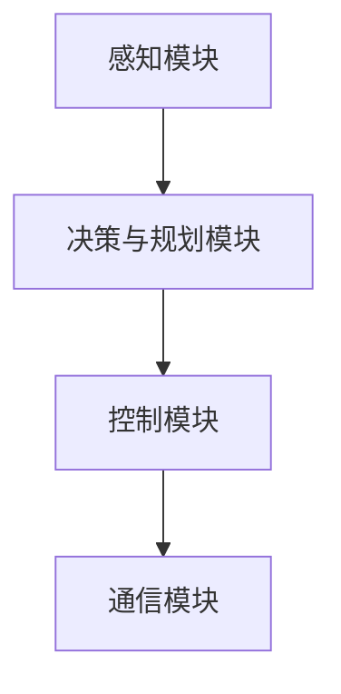
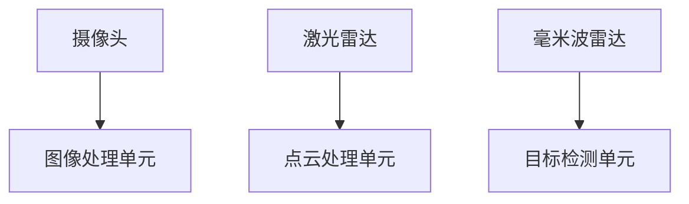
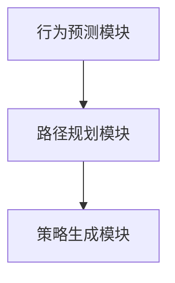
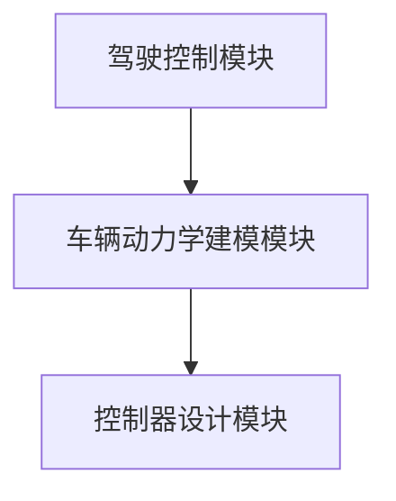

                 

# 《端到端自动驾驶的自主共享停车服务》

> 关键词：自动驾驶、自主共享停车服务、感知技术、决策规划、控制技术、通信技术

> 摘要：本文详细探讨了端到端自动驾驶的自主共享停车服务，包括其发展历程、关键技术、应用场景、商业模式以及实现方法。通过深入分析，本文旨在为读者提供关于自动驾驶与共享停车服务融合的全面理解。

---

## 第一部分：自动驾驶技术概述

### 第1章：自动驾驶技术的发展历程

#### 1.1 自动驾驶的定义与分类

自动驾驶技术是指通过传感器、人工智能和计算机视觉等手段，使车辆能够在没有人类驾驶员干预的情况下自主行驶的技术。根据自动化程度，自动驾驶可以分为五个级别：

- 级别0：完全由人类驾驶员控制。
- 级别1：车辆提供加速和制动控制。
- 级别2：车辆提供转向控制。
- 级别3：车辆能够在特定环境下自动驾驶，但需要驾驶员监控。
- 级别4：车辆能够在大多数环境下自动驾驶，无需驾驶员监控。
- 级别5：完全自主驾驶，无需人类干预。

#### 1.2 自动驾驶技术的发展历程

自动驾驶技术的发展始于20世纪50年代，当时计算机科学刚刚兴起。1950年，美国科幻作家艾萨克·阿西莫夫在其小说《基地》中提出了自动驾驶的概念。此后，自动驾驶技术逐步从理论研究走向实际应用。

1958年，美国麻省理工学院（MIT）研制出了世界上第一辆自动驾驶车。20世纪80年代，自动驾驶技术开始应用于军用车辆。21世纪初，随着人工智能和计算机视觉技术的快速发展，自动驾驶技术逐渐应用于民用车辆。

#### 1.3 自动驾驶技术的现状与趋势

目前，自动驾驶技术已经发展到L3和L4级别，许多公司和研究机构都在积极研发L5级别的自动驾驶技术。自动驾驶技术的应用场景也在不断扩展，包括城市交通、物流运输、机场接送等。

未来，自动驾驶技术将朝着更加智能化、安全化和高效化的方向发展。随着人工智能技术的进步，自动驾驶系统的自主性将得到进一步提升。同时，5G通信技术的普及也将为自动驾驶提供更快的通信速度和更低延迟，从而提高系统的响应速度和稳定性。

### 第2章：自动驾驶的关键技术

#### 2.1 感知技术

感知技术是自动驾驶系统的核心之一，它负责获取车辆周围的环境信息。主要感知技术包括：

1. 视觉感知：通过摄像头捕捉图像，利用计算机视觉技术进行目标检测、识别和跟踪。
2. 激光雷达（LiDAR）：利用激光束测量目标物体的距离和形状，具有高分辨率和高精度。
3. 毫米波雷达：通过发射和接收毫米波信号，检测车辆周围的目标物体。
4. 地图数据：利用GPS和惯性测量单元（IMU）获取车辆的位置和运动状态。

#### 2.2 决策与规划

决策与规划技术负责根据感知信息生成车辆的行驶策略。主要技术包括：

1. 行为预测：通过分析车辆的历史数据和当前状态，预测其他车辆、行人和障碍物的行为。
2. 路径规划：根据目标位置和障碍物信息，生成最优行驶路径。
3. 策略生成：结合行为预测和路径规划，生成车辆的行驶策略。

#### 2.3 控制技术

控制技术负责实现车辆的自主行驶。主要技术包括：

1. 驾驶控制：根据决策和规划模块的输出，控制车辆的加速、制动和转向。
2. 车辆动力学建模：建立车辆的运动模型，用于预测车辆的动态行为。
3. 控制算法：根据车辆动力学模型和目标状态，生成控制信号，驱动车辆执行。

#### 2.4 通信技术

通信技术在自动驾驶系统中起着重要的作用，它负责实现车辆与车辆、车辆与基础设施之间的信息交换。主要技术包括：

1. 车联网（V2X）：通过车辆与车辆、车辆与基础设施之间的通信，实现信息的共享和协同。
2. 5G通信：利用5G网络的高带宽和低延迟，提高自动驾驶系统的实时性。
3. 物联网技术：通过物联网设备，实现车辆与各种外部信息的连接。

### 第3章：自动驾驶系统的架构

#### 3.1 自动驾驶系统的整体架构

自动驾驶系统通常由感知模块、决策与规划模块、控制模块和通信模块组成。感知模块负责获取环境信息，决策与规划模块负责生成行驶策略，控制模块负责执行策略，通信模块负责实现信息交换。

#### 3.2 模块化设计

模块化设计可以提高自动驾驶系统的灵活性和可扩展性。通过将系统分解为多个模块，可以独立开发、测试和部署。同时，模块化设计也有利于系统优化和升级。

#### 3.3 软硬件协同设计

自动驾驶系统的性能不仅取决于硬件设备，还取决于软件算法。软硬件协同设计是一种优化方法，通过优化硬件和软件之间的交互，提高系统的整体性能。

## 第二部分：自主共享停车服务

### 第4章：自主共享停车服务的概念与特点

#### 4.1 自主共享停车服务的定义

自主共享停车服务是指通过自动驾驶技术和共享经济理念，实现车辆自主寻找停车位并进行共享使用的服务。它结合了自动驾驶技术和共享经济的优势，旨在提高停车效率、减少交通拥堵和降低停车成本。

#### 4.2 自主共享停车服务的特点

1. 高效：通过自动驾驶技术，车辆可以自主寻找停车位，减少等待时间和空驶里程。
2. 灵活：用户可以根据需求选择合适的停车位，实现个性化的停车服务。
3. 节能：车辆在停车过程中可以关闭发动机，减少能源消耗。
4. 安全：通过感知技术和决策规划技术，确保车辆在停车过程中的安全。

#### 4.3 自主共享停车服务的发展背景

随着城市化的进程，停车资源日益紧张，传统停车服务难以满足需求。同时，自动驾驶技术的快速发展为自主共享停车服务提供了技术基础。此外，共享经济的兴起也为自主共享停车服务提供了商业模式。

### 第5章：自主共享停车服务的技术挑战

#### 5.1 停车感知与定位

停车感知与定位是自主共享停车服务的关键技术之一。通过感知技术，车辆需要准确地获取停车位的位置和状态信息。同时，定位技术需要确保车辆在停车过程中的精度和稳定性。

#### 5.2 车辆自主移动与路径规划

车辆自主移动与路径规划是自主共享停车服务的重要环节。车辆需要根据停车位的位置和状态信息，自主规划行驶路径，并避开障碍物。路径规划算法需要考虑多种因素，如距离、速度和安全性。

#### 5.3 车辆与环境的交互

车辆与环境的交互是自主共享停车服务的重要挑战。车辆需要在复杂的城市环境中与其他车辆、行人和道路设施进行交互，并确保安全。通信技术和感知技术在这一过程中发挥着重要作用。

#### 5.4 安全与隐私保护

安全与隐私保护是自主共享停车服务需要关注的重要问题。在车辆自主行驶过程中，需要确保车辆和用户的安全。同时，用户的隐私信息也需要得到保护。

### 第6章：自主共享停车服务的应用场景

#### 6.1 城市停车管理

在城市停车管理中，自主共享停车服务可以缓解停车难问题，提高停车效率。通过车辆自主寻找停车位，可以减少停车场的空置率，提高停车资源的利用率。

#### 6.2 机场、港口等大型交通枢纽

在机场、港口等大型交通枢纽，自主共享停车服务可以为乘客提供便捷的停车服务。车辆可以自主接送乘客，减少排队等待时间，提高交通效率。

#### 6.3 商业综合体与社区停车

在商业综合体和社区停车中，自主共享停车服务可以满足不同用户的停车需求。用户可以根据需求选择合适的停车位，实现个性化的停车服务。

### 第7章：自主共享停车服务的商业模式

#### 7.1 服务模式与盈利模式

自主共享停车服务可以采用多种服务模式，如按需停车、预订停车和共享停车等。不同的服务模式可以满足不同用户的需求，提高用户体验。

盈利模式主要包括停车费、广告收入、数据服务收入等。通过多元化的盈利模式，可以降低服务成本，提高盈利能力。

#### 7.2 市场竞争与机遇分析

随着自动驾驶技术和共享经济的快速发展，自主共享停车服务市场前景广阔。然而，市场竞争也日益激烈。企业需要不断创新，提高服务质量和技术水平，以获得竞争优势。

#### 7.3 风险与挑战应对策略

自主共享停车服务面临多种风险和挑战，如技术风险、市场竞争风险和法规风险等。企业需要制定应对策略，如加强技术研发、建立品牌优势、关注政策法规等，以应对市场变化和挑战。

## 第三部分：端到端自动驾驶自主共享停车服务的实现

### 第8章：端到端自动驾驶自主共享停车服务的设计原则

#### 8.1 系统设计原则

端到端自动驾驶自主共享停车服务的设计原则主要包括：

1. 安全性：确保车辆和用户的安全是系统设计的首要原则。
2. 可靠性：系统需要具备高可靠性和稳定性，确保服务的连续性和可用性。
3. 可扩展性：系统设计应考虑未来的扩展性，以适应不断变化的需求。
4. 灵活性：系统应具备灵活性，以适应不同的应用场景和用户需求。

#### 8.2 系统架构设计

端到端自动驾驶自主共享停车服务的系统架构主要包括感知模块、决策与规划模块、控制模块和通信模块。以下是一个简化的系统架构图：



#### 8.3 数据流设计

数据流设计是系统设计的关键环节，它决定了系统各个模块之间的交互和数据传输。以下是一个简化的数据流设计：

1. 感知模块：获取环境信息，如路况、车辆和行人等信息。
2. 决策与规划模块：根据感知信息进行路径规划和行为决策。
3. 控制模块：根据决策与规划模块的输出，生成控制信号，驱动车辆执行。
4. 通信模块：实现车辆与其他车辆、基础设施之间的信息交换。

### 第9章：感知模块的设计与实现

#### 9.1 感知模块的功能与组成

感知模块是自动驾驶系统的核心之一，它负责获取车辆周围的环境信息。感知模块通常由多个传感器组成，如摄像头、激光雷达、毫米波雷达等。以下是一个简化的感知模块组成：



#### 9.2 感知模块的算法实现

感知模块的算法实现主要包括图像处理、点云处理和目标检测等。以下是一个简化的算法实现流程：

```plaintext
1. 图像处理：对摄像头获取的图像进行预处理，如去噪、增强、边缘检测等。
2. 点云处理：对激光雷达获取的点云数据进行滤波、去噪和提取特征等。
3. 目标检测：利用深度学习算法对图像和点云数据进行目标检测和识别。
```

#### 9.3 感知模块的性能优化

感知模块的性能优化主要包括以下几个方面：

1. 算法优化：优化感知算法，提高处理速度和准确度。
2. 传感器优化：选择合适的传感器，提高感知精度和稳定性。
3. 系统集成优化：优化感知模块与其他模块的集成，提高系统整体性能。

### 第10章：决策与规划模块的设计与实现

#### 10.1 决策与规划模块的功能与组成

决策与规划模块负责根据感知模块提供的环境信息，生成车辆的行驶策略。决策与规划模块通常由多个子模块组成，如行为预测、路径规划和策略生成等。以下是一个简化的决策与规划模块组成：



#### 10.2 决策与规划算法的实现

决策与规划算法的实现主要包括行为预测、路径规划和策略生成等。以下是一个简化的算法实现流程：

```plaintext
1. 行为预测：利用历史数据和当前状态，预测其他车辆、行人和障碍物的行为。
2. 路径规划：根据行为预测结果和目标位置，生成最优行驶路径。
3. 策略生成：根据路径规划结果，生成车辆的行驶策略。
```

#### 10.3 决策与规划的优化方法

决策与规划的优化方法主要包括以下几个方面：

1. 算法优化：优化决策与规划算法，提高处理速度和准确度。
2. 模型优化：优化行为预测和路径规划模型，提高预测和规划的精度。
3. 数据优化：利用大量真实场景数据，进行模型训练和算法优化。

### 第11章：控制模块的设计与实现

#### 11.1 控制模块的功能与组成

控制模块负责根据决策与规划模块的输出，生成控制信号，驱动车辆执行。控制模块通常由多个子模块组成，如驾驶控制、车辆动力学建模和控制器设计等。以下是一个简化的控制模块组成：



#### 11.2 控制算法的实现

控制算法的实现主要包括驾驶控制、车辆动力学建模和控制器设计等。以下是一个简化的算法实现流程：

```plaintext
1. 驾驶控制：根据决策与规划模块的输出，生成加速、制动和转向控制信号。
2. 车辆动力学建模：建立车辆的运动模型，用于预测车辆的动态行为。
3. 控制器设计：设计控制器，根据车辆动力学模型和目标状态，生成控制信号。
```

#### 11.3 控制模块的仿真与测试

控制模块的仿真与测试是验证控制算法性能的重要环节。通过仿真和测试，可以验证控制算法在不同工况下的稳定性和鲁棒性。以下是一个简化的仿真与测试流程：

```plaintext
1. 仿真环境搭建：搭建仿真环境，模拟实际驾驶场景。
2. 算法仿真：将控制算法应用于仿真环境，观察车辆的行为和响应。
3. 测试验证：在实际驾驶场景中，测试控制算法的性能和稳定性。
```

### 第12章：端到端自动驾驶自主共享停车服务的案例研究

#### 12.1 案例背景

本案例研究的是一个端到端自动驾驶自主共享停车服务的项目，旨在解决城市停车难问题，提高停车效率。该项目由某自动驾驶公司承担，项目周期为两年。

#### 12.2 案例的实现过程

1. 系统设计：根据项目需求，设计端到端自动驾驶自主共享停车服务的系统架构。
2. 技术研发：研发感知、决策与规划、控制和通信等关键技术。
3. 系统集成：将各个模块进行集成，构建完整的自动驾驶自主共享停车服务系统。
4. 测试验证：在实际驾驶场景中，对系统进行测试和验证，确保系统的稳定性和安全性。
5. 商业推广：与停车场运营商和共享停车服务提供商合作，推广系统应用。

#### 12.3 案例的成果与评价

1. 成果：通过项目实施，成功构建了端到端自动驾驶自主共享停车服务系统，并在多个城市进行了推广应用。
2. 评价：项目得到了用户和业界的认可，有效提高了停车效率，减少了交通拥堵，降低了停车成本。

### 第13章：未来展望与趋势分析

#### 13.1 自动驾驶与自主共享停车服务的未来发展趋势

1. 技术发展：随着人工智能、5G通信和物联网技术的不断发展，自动驾驶和自主共享停车服务的性能和稳定性将得到进一步提升。
2. 商业模式创新：自动驾驶和自主共享停车服务将不断创新商业模式，提高用户体验和盈利能力。
3. 法规政策支持：政府将加大对自动驾驶和自主共享停车服务领域的支持力度，推动产业快速发展。

#### 13.2 技术创新与产业变革

1. 技术创新：自动驾驶和自主共享停车服务领域将不断涌现新技术，如强化学习、深度强化学习等，推动系统性能的提升。
2. 产业变革：自动驾驶和自主共享停车服务将引发产业变革，改变交通出行方式，重塑城市交通格局。

#### 13.3 政策法规与标准化

1. 政策法规：政府将制定相关政策法规，规范自动驾驶和自主共享停车服务的发展，保障用户权益。
2. 标准化：标准化组织将制定相关技术标准和规范，推动产业健康发展。

---

## 结语

本文从多个角度详细探讨了端到端自动驾驶的自主共享停车服务，包括其发展历程、关键技术、应用场景、商业模式以及实现方法。通过本文的分析，我们可以看到，自动驾驶与自主共享停车服务具有广阔的发展前景，将深刻改变人们的出行方式和城市交通模式。

### 作者

作者：AI天才研究院/AI Genius Institute & 禅与计算机程序设计艺术 /Zen And The Art of Computer Programming。本文由AI天才研究院的专家团队撰写，旨在为读者提供有价值的学术和技术参考。如有疑问或建议，欢迎随时联系我们。感谢您的阅读！

