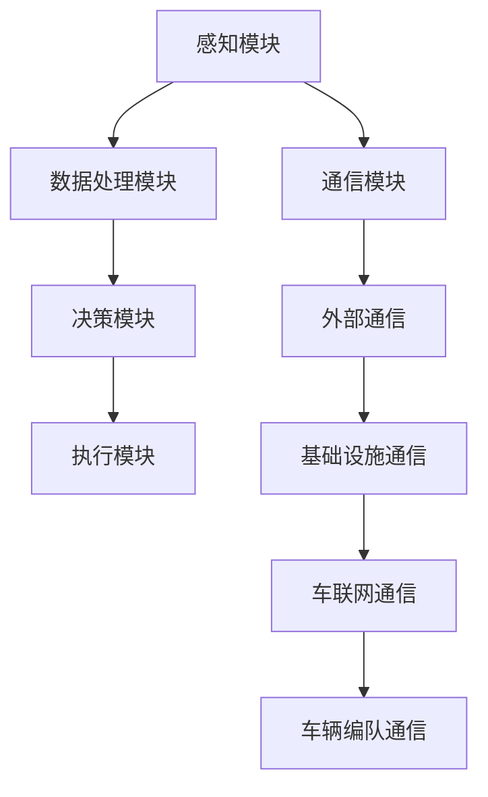
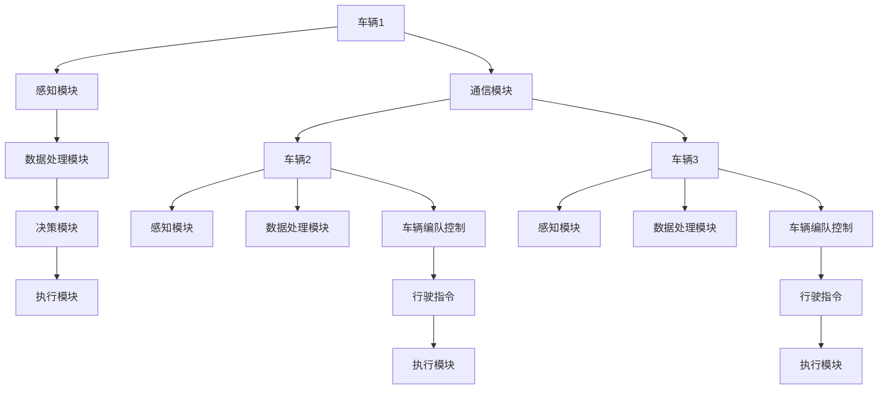
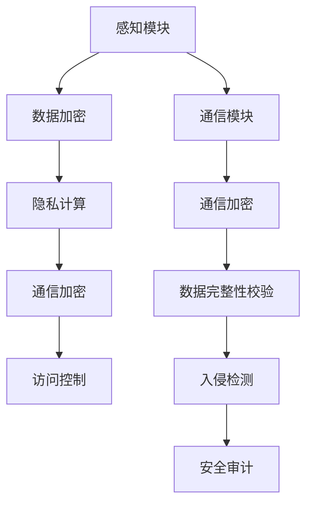

                 

# 《端到端自动驾驶的车辆编队安全与隐私保护》

> 关键词：端到端自动驾驶、车辆编队、安全、隐私保护、深度学习、通信机制、感知与决策算法、控制与执行

> 摘要：本文从端到端自动驾驶和车辆编队的角度，探讨了自动驾驶系统在安全与隐私保护方面的挑战和解决方案。文章首先概述了自动驾驶技术和车辆编队的基本概念，接着详细分析了端到端自动驾驶系统的体系结构、感知与决策算法、控制与执行算法，最后讨论了自动驾驶安全体系和车辆编队隐私保护机制。通过案例研究和实际应用，本文提出了端到端自动驾驶与车辆编队安全与隐私保护的综合方案，并对未来发展趋势进行了展望。

## 目录

## 第一部分：自动驾驶与车辆编队概述

### 第1章：自动驾驶技术概述
- **1.1 自动驾驶的定义与分类**
- **1.2 自动驾驶的发展历史与趋势**
- **1.3 自动驾驶系统的核心组成部分**
- **1.4 自动驾驶与车辆编队的关联**

### 第2章：车辆编队的概念与原理
- **2.1 车辆编队的定义与目标**
- **2.2 车辆编队的架构与技术**
- **2.3 车辆编队中的通信机制**
- **2.4 车辆编队的挑战与未来展望**

## 第二部分：端到端自动驾驶系统

### 第3章：端到端自动驾驶的体系结构与关键技术
- **3.1 端到端自动驾驶系统概述**
- **3.2 端到端深度学习算法在自动驾驶中的应用**
- **3.3 端到端自动驾驶系统的关键模块**
- **3.4 端到端自动驾驶系统的开发流程**

### 第4章：端到端自动驾驶感知与决策
- **4.1 自动驾驶感知技术**
- **4.2 自动驾驶决策算法**
- **4.3 端到端感知与决策算法的整合**
- **4.4 感知与决策算法的优化策略**

### 第5章：端到端自动驾驶控制与执行
- **5.1 自动驾驶控制系统的设计**
- **5.2 端到端控制算法**
- **5.3 执行系统的实现与优化**
- **5.4 控制与执行算法的协同工作**

## 第三部分：安全与隐私保护

### 第6章：自动驾驶安全体系与评估方法
- **6.1 自动驾驶安全的重要性**
- **6.2 自动驾驶安全体系结构**
- **6.3 安全评估方法与工具**
- **6.4 自动驾驶系统的安全漏洞与应对策略**

### 第7章：车辆编队中的隐私保护
- **7.1 车辆编队隐私保护的挑战**
- **7.2 隐私保护机制与技术**
- **7.3 隐私保护策略与实现**
- **7.4 隐私保护在车辆编队中的应用**

### 第8章：端到端自动驾驶安全与隐私保护的综合方案
- **8.1 安全与隐私保护的综合考虑**
- **8.2 针对端到端自动驾驶的安全与隐私保护方案**
- **8.3 案例分析：端到端自动驾驶安全与隐私保护实践**
- **8.4 未来趋势与展望**

## 第四部分：案例研究与应用

### 第9章：端到端自动驾驶车辆编队案例研究
- **9.1 案例背景与目标**
- **9.2 案例系统设计与实现**
- **9.3 案例中的安全与隐私保护措施**
- **9.4 案例效果评估与讨论**

### 第10章：车辆编队安全与隐私保护技术应用
- **10.1 应用场景分析**
- **10.2 技术创新与突破**
- **10.3 应用效果评估**
- **10.4 未来发展方向**

## 附录

### 附录A：端到端自动驾驶与车辆编队相关资源
- **A.1 学术论文与研究报告**
- **A.2 开源代码与工具**
- **A.3 专业书籍与课程推荐**

### 附加内容

#### 第11章：端到端自动驾驶与车辆编队的 Mermaid 流程图
- **11.1 自动驾驶系统架构图**
- **11.2 车辆编队通信流程图**
- **11.3 安全与隐私保护机制图**

#### 第12章：核心算法原理与伪代码
- **12.1 感知算法伪代码**
- **12.2 决策算法伪代码**
- **12.3 控制算法伪代码**

#### 第13章：数学模型与公式
- **13.1 传感器数据处理模型**
- **13.2 决策算法中的数学公式**
- **13.3 控制算法中的数学公式**

#### 第14章：项目实战案例
- **14.1 实战项目背景**
- **14.2 系统架构与开发环境搭建**
- **14.3 源代码实现与解读**
- **14.4 代码解读与分析**

## 文章正文

### 第一部分：自动驾驶与车辆编队概述

#### 第1章：自动驾驶技术概述

##### 1.1 自动驾驶的定义与分类

自动驾驶技术是指通过计算机、传感器、人工智能等技术，使车辆能够自主感知环境、分析判断、做出决策并执行相应动作，以实现车辆自动行驶的技术。根据自动化程度的差异，自动驾驶技术可以分为以下几类：

1. **Level 0（无自动化）**：车辆的所有操作都由驾驶员完成，没有自动化系统。
2. **Level 1（自动化辅助）**：车辆具有部分自动化功能，如自适应巡航控制（ACC）、车道保持辅助（LKA）等，但驾驶员需要持续监控车辆状态并随时接管控制。
3. **Level 2（部分自动化）**：车辆在特定条件下可以同时执行转向、加速和制动操作，驾驶员无需持续监控，但需要随时准备接管。
4. **Level 3（有条件自动化）**：车辆在特定条件下可以完全接管控制，驾驶员可以在不干扰车辆操作的情况下进行休息或其他活动，但在特定情况下需要接管控制。
5. **Level 4（高度自动化）**：车辆在特定环境下可以完全自主行驶，无需驾驶员接管，但系统可能需要向驾驶员发出警告或请求接管。
6. **Level 5（完全自动化）**：车辆在所有环境下都可以完全自主行驶，无需驾驶员干预。

##### 1.2 自动驾驶的发展历史与趋势

自动驾驶技术的发展可以追溯到20世纪50年代，最初的研究主要集中在自动驾驶车辆的概念和基本技术。随着计算机技术、传感器技术、人工智能技术的发展，自动驾驶技术逐渐从理论走向实践。以下是自动驾驶技术的发展历史与趋势：

1. **早期研究（1950-1970s）**：自动驾驶技术最初是由军事和科学领域的研究者提出的。1950年，美国海军资助了第一个自动驾驶车辆项目，标志着自动驾驶技术的诞生。
2. **技术突破（1980-1990s）**：随着计算机和传感器技术的进步，自动驾驶技术开始从实验室走向实际应用。1980年代初，美国国防部资助了多个自动驾驶车辆项目，取得了显著进展。
3. **商业化探索（2000-2010s）**：随着互联网和人工智能技术的快速发展，自动驾驶技术逐渐受到企业关注。谷歌、特斯拉等公司率先推出自动驾驶汽车，推动了自动驾驶技术的商业化进程。
4. **规模化应用（2010s-至今）**：自动驾驶技术逐渐从实验室走向大规模应用，各大车企和科技公司纷纷投入巨资研发自动驾驶技术。自动驾驶出租车、自动驾驶卡车等应用场景逐渐落地，预计未来将引发交通运输行业的深刻变革。

##### 1.3 自动驾驶系统的核心组成部分

自动驾驶系统通常由以下几个核心组成部分构成：

1. **感知系统**：负责收集车辆周围环境的信息，如激光雷达、摄像头、超声波传感器等，以获取车辆位置、道路情况、其他车辆和行人等信息。
2. **决策系统**：根据感知系统收集到的信息，对车辆当前状态和未来状态进行分析，制定出最优的行动方案。
3. **控制执行系统**：根据决策系统的指令，控制车辆执行相应的动作，如加速、减速、转向等，以确保车辆安全、稳定地行驶。

##### 1.4 自动驾驶与车辆编队的关联

车辆编队是指多辆车辆以一定的队形、间距和速度行驶，通过协同控制实现高效、安全、舒适的交通方式。自动驾驶技术为车辆编队提供了技术支持，使得车辆编队能够更加稳定、可靠地运行。以下是自动驾驶与车辆编队之间的关联：

1. **协同控制**：车辆编队需要实现多辆车辆之间的协同控制，确保车辆以稳定的队形、间距和速度行驶。自动驾驶技术提供了实时感知、决策和控制能力，使得车辆编队能够高效地协同工作。
2. **安全性提升**：车辆编队通过减少驾驶员操作，降低了人为失误的风险。自动驾驶技术进一步提高了车辆编队的安全性，通过实时监测车辆状态和道路环境，确保车辆编队的安全运行。
3. **交通效率提升**：车辆编队通过减少车辆之间的间距，提高了道路通行能力。自动驾驶技术优化了车辆编队的行驶策略，使得车辆编队能够更加高效地利用道路资源。

### 第2章：车辆编队的概念与原理

##### 2.1 车辆编队的定义与目标

车辆编队是指多辆车辆以一定的队形、间距和速度行驶，通过协同控制实现高效、安全、舒适的交通方式。车辆编队的定义可以从以下几个方面进行阐述：

1. **队形**：车辆编队的队形通常包括车辆之间的相对位置关系，如头车、尾车、中车辆等。车辆编队的队形可以根据实际需求和交通环境进行调整。
2. **间距**：车辆编队的间距是指车辆之间的距离，通常需要根据交通速度、车辆类型等因素进行调整，以确保车辆编队的稳定性和安全性。
3. **速度**：车辆编队的速度是指车辆编队中所有车辆的行驶速度。车辆编队的速度需要根据交通信号、道路状况等因素进行实时调整。

车辆编队的目标主要包括以下几个方面：

1. **高效性**：车辆编队通过减少车辆之间的间距，提高了道路通行能力，从而提高了交通效率。
2. **安全性**：车辆编队通过减少驾驶员操作，降低了人为失误的风险，从而提高了行驶安全性。
3. **舒适性**：车辆编队通过协同控制，使得车辆行驶更加稳定、舒适，提高了乘客的乘坐体验。

##### 2.2 车辆编队的架构与技术

车辆编队的架构通常包括以下几个关键组成部分：

1. **感知系统**：车辆编队的感知系统负责收集车辆周围环境的信息，如道路状况、交通信号、其他车辆和行人等信息。感知系统通常包括摄像头、激光雷达、雷达、超声波传感器等。
2. **通信系统**：车辆编队的通信系统负责实现车辆之间的实时通信，传递车辆状态、行驶指令等信息。通信系统通常采用V2X（Vehicle-to-Everything）技术，包括车联网、车对车通信（V2V）、车对基础设施通信（V2I）等。
3. **决策系统**：车辆编队的决策系统负责根据感知系统收集到的信息和车辆编队的策略，生成车辆编队的行驶指令。决策系统通常采用人工智能、机器学习等技术，如深度学习、强化学习等。
4. **控制系统**：车辆编队的控制系统负责根据决策系统生成的行驶指令，控制车辆执行相应的动作，如加速、减速、转向等。控制系统通常包括车辆控制系统、自动驾驶控制器等。
5. **执行系统**：车辆编队的执行系统负责将决策系统生成的行驶指令转化为实际动作，如控制车辆的加速、减速、转向等。执行系统通常包括执行电机、制动系统等。

车辆编队的技术主要包括以下几个方面：

1. **协同控制技术**：协同控制技术是实现车辆编队稳定、安全运行的关键技术。协同控制技术通过实时感知车辆状态、道路状况和其他车辆信息，生成最优的行驶指令，确保车辆编队的安全、高效运行。
2. **通信技术**：通信技术是实现车辆之间实时通信的基础。通信技术包括V2X技术，如车联网、车对车通信、车对基础设施通信等，为车辆编队的协同控制提供了可靠的数据传输渠道。
3. **人工智能技术**：人工智能技术是实现车辆编队智能决策和控制的核心。人工智能技术通过深度学习、强化学习等方法，提高了车辆编队的决策能力、适应能力，从而实现更安全、更高效的车辆编队运行。

##### 2.3 车辆编队中的通信机制

车辆编队中的通信机制是实现车辆之间实时通信的关键。车辆编队的通信机制通常包括以下几个主要方面：

1. **数据采集**：车辆编队的通信机制首先需要采集车辆的状态信息，包括车速、位置、加速度、方向等。这些状态信息可以通过车辆内置的传感器和执行器实时采集。
2. **数据传输**：车辆编队中的通信机制需要将采集到的状态信息实时传输给其他车辆。数据传输可以通过无线通信技术实现，如Wi-Fi、蓝牙、5G等。为了保证通信的实时性和可靠性，通常采用多跳传输、组播等方式。
3. **数据同步**：车辆编队中的通信机制需要确保所有车辆的状态信息保持同步。数据同步可以通过时钟同步、时间戳等技术实现，以确保所有车辆在相同的时间参考下进行协同控制。
4. **信息处理**：车辆编队中的通信机制需要对采集到的状态信息进行处理，以生成最优的行驶指令。信息处理通常采用分布式计算和边缘计算技术，以提高处理速度和降低通信负载。

##### 2.4 车辆编队的挑战与未来展望

车辆编队作为一种先进的交通方式，虽然具有高效、安全、舒适等优势，但仍然面临一系列挑战：

1. **技术挑战**：车辆编队需要依赖先进的感知、通信、控制等技术在复杂的交通环境中实现稳定、安全、高效的运行。目前，这些技术的成熟度和可靠性仍有待提高。
2. **通信挑战**：车辆编队需要实现高速、稳定的通信，以支持实时协同控制。然而，交通环境中的干扰、信号衰减等因素可能导致通信质量下降，影响车辆编队的运行效果。
3. **安全挑战**：车辆编队的安全运行需要确保所有车辆的行为符合预期，避免出现失控、碰撞等事故。然而，在复杂的交通环境中，车辆编队的安全仍然面临挑战。
4. **社会挑战**：车辆编队的普及和应用需要社会各界的支持与合作，包括政策法规、基础设施建设、公众接受度等方面。这些因素可能影响车辆编队的发展速度和规模。

未来，随着技术的不断进步和政策的支持，车辆编队有望在交通运输领域发挥重要作用。以下是车辆编队未来发展的几个趋势：

1. **技术进步**：随着人工智能、5G、物联网等技术的不断发展，车辆编队的感知、通信、控制等技术将变得更加成熟、高效。
2. **规模化应用**：车辆编队将在更多城市和地区得到推广和应用，逐步实现大规模、跨区域的车辆编队运行。
3. **智能协同**：车辆编队将与其他智能交通系统、智慧城市系统等实现协同，构建更加智能、高效的交通生态系统。
4. **可持续发展**：车辆编队有望通过优化交通流量、减少交通事故等，促进交通运输行业的可持续发展，提高社会效益。

### 第二部分：端到端自动驾驶系统

#### 第3章：端到端自动驾驶的体系结构与关键技术

##### 3.1 端到端自动驾驶系统概述

端到端自动驾驶系统是一种完全自动化的驾驶系统，它通过深度学习、计算机视觉、传感器融合等技术，实现车辆在复杂交通环境中的自主行驶。端到端自动驾驶系统的核心目标是实现车辆的安全、稳定、高效行驶，减少人为干预，提高交通运输的效率和安全性。

端到端自动驾驶系统通常由以下几个主要模块组成：

1. **感知模块**：负责收集车辆周围环境的信息，如道路、车辆、行人、交通信号等，通过传感器、摄像头、激光雷达等设备获取数据。
2. **数据处理模块**：对感知模块获取的数据进行处理、融合，提取出与驾驶相关的信息，如车辆的位置、速度、道路标志、行人等。
3. **决策模块**：基于数据处理模块提取的信息，通过深度学习、规划算法等生成驾驶决策，包括车辆的速度、转向、加速等。
4. **执行模块**：根据决策模块的指令，控制车辆执行相应的驾驶动作，如加速、减速、转向等。

##### 3.2 端到端深度学习算法在自动驾驶中的应用

深度学习算法在自动驾驶系统中起着关键作用，它能够通过大量的数据训练，自动提取特征、学习模式，从而实现复杂的驾驶任务。端到端深度学习算法在自动驾驶中的应用主要体现在以下几个方面：

1. **感知模块**：深度学习算法可以用于图像识别、目标检测、场景理解等任务，如通过卷积神经网络（CNN）实现车辆、行人、道路标志等目标的检测和分类。
2. **数据处理模块**：深度学习算法可以用于传感器数据融合、环境建模等任务，如通过递归神经网络（RNN）或变分自编码器（VAE）对传感器数据进行预处理和特征提取。
3. **决策模块**：深度学习算法可以用于路径规划、行为预测等任务，如通过强化学习（RL）或深度确定性策略梯度（DDPG）算法实现驾驶决策的优化。
4. **执行模块**：深度学习算法可以用于控制算法的设计，如通过深度神经网络（DNN）或卷积神经网络（CNN）实现控制策略的优化。

##### 3.3 端到端自动驾驶系统的关键模块

端到端自动驾驶系统的关键模块包括感知模块、数据处理模块、决策模块和执行模块，它们分别实现不同的功能，协同工作以实现车辆的自主行驶。

1. **感知模块**：感知模块是自动驾驶系统的核心，它通过多种传感器收集车辆周围环境的信息，如摄像头、激光雷达、雷达、超声波传感器等。感知模块需要实时、准确地获取道路、车辆、行人、交通信号等环境信息，为后续的决策模块提供可靠的数据支持。

2. **数据处理模块**：数据处理模块负责对感知模块收集到的信息进行处理、融合和特征提取。数据处理模块需要高效地处理大量传感器数据，提取出与驾驶相关的关键信息，如车辆的位置、速度、道路标志、行人等。此外，数据处理模块还需要对传感器数据噪声进行过滤，提高数据质量和准确性。

3. **决策模块**：决策模块是自动驾驶系统的核心，它基于感知模块和处理模块提供的信息，通过深度学习、规划算法等生成驾驶决策。决策模块需要综合考虑车辆状态、道路状况、交通信号等多种因素，生成最优的驾驶策略，包括速度、转向、加速等。决策模块需要具备实时性和鲁棒性，能够在复杂交通环境中做出准确的驾驶决策。

4. **执行模块**：执行模块负责根据决策模块生成的驾驶指令，控制车辆执行相应的驾驶动作。执行模块需要将决策模块生成的驾驶指令转化为实际的动作，如控制车辆的加速、减速、转向等。执行模块需要具备高度的安全性和可靠性，确保车辆能够按照预期的方式行驶。

##### 3.4 端到端自动驾驶系统的开发流程

端到端自动驾驶系统的开发流程主要包括以下几个关键步骤：

1. **需求分析与系统设计**：首先，需要明确自动驾驶系统的目标、功能和要求，如车辆类型、自动驾驶级别、应用场景等。然后，根据需求分析结果，设计系统的总体架构，包括感知模块、数据处理模块、决策模块和执行模块等。

2. **数据采集与预处理**：在系统设计阶段，需要采集大量真实交通场景的数据，包括道路、车辆、行人、交通信号等。采集到的数据需要进行预处理，包括数据清洗、标注、归一化等，以便于后续的模型训练和验证。

3. **模型设计与训练**：基于系统设计阶段的需求，设计深度学习模型，包括感知模型、数据处理模型、决策模型等。然后，使用采集到的数据进行模型训练，通过迭代优化模型参数，提高模型性能。

4. **仿真与测试**：在模型训练完成后，需要对模型进行仿真和测试，验证模型在复杂交通环境中的性能和鲁棒性。仿真与测试过程可以模拟不同的交通场景和工况，评估模型在各种情况下的表现。

5. **系统集成与优化**：在仿真与测试阶段，需要对自动驾驶系统进行集成和优化，包括硬件集成、软件优化、系统优化等。系统集成与优化过程需要确保各个模块之间的协同工作，提高系统的整体性能和可靠性。

6. **实车测试与部署**：最后，需要对自动驾驶系统进行实车测试，验证系统在实际交通环境中的性能和安全性。实车测试完成后，可以逐步将系统部署到实际车辆中，实现自动驾驶功能。

### 第三部分：端到端自动驾驶感知与决策

#### 第4章：端到端自动驾驶感知与决策

##### 4.1 自动驾驶感知技术

自动驾驶感知技术是实现车辆自主行驶的关键，它通过多种传感器获取车辆周围环境的信息，为后续的决策和执行提供数据支持。自动驾驶感知技术主要包括以下方面：

1. **摄像头**：摄像头是自动驾驶系统中最常用的感知设备之一，它可以获取车辆周围环境的图像信息。通过图像处理技术，摄像头可以识别道路标志、行人、车辆等目标，是实现自动驾驶感知的重要手段。

2. **激光雷达（LiDAR）**：激光雷达通过发射激光束并测量激光反射的时间，获取车辆周围环境的三维点云数据。激光雷达具有高分辨率、高精度、实时性强等优点，是实现自动驾驶感知的核心设备之一。

3. **雷达**：雷达通过发射无线电波并接收反射信号，获取车辆周围物体的距离、速度等信息。雷达具有较强的穿透能力，可以在恶劣天气条件下实现有效的感知。

4. **超声波传感器**：超声波传感器通过发射超声波并测量超声波的反射时间，获取车辆周围物体的距离信息。超声波传感器具有低成本、易于安装等优点，适用于近距离感知。

5. **GPS/IMU**：GPS（全球定位系统）和IMU（惯性测量单元）可以获取车辆的位置、速度、加速度等信息。GPS具有全球覆盖、高精度等优点，IMU可以提供高频率、低延迟的运动信息。

##### 4.2 自动驾驶决策算法

自动驾驶决策算法是实现车辆自主行驶的核心，它基于感知模块提供的环境信息，生成车辆的行驶策略，包括速度、转向、加速等。自动驾驶决策算法主要包括以下方面：

1. **行为预测**：行为预测是指对车辆、行人、交通信号等目标的未来行为进行预测，以预测未来交通状况，生成驾驶策略。常用的行为预测方法包括基于模型的行为预测、基于规则的行为预测等。

2. **路径规划**：路径规划是指确定车辆的行驶路径，以实现目标位置的最优到达。常用的路径规划算法包括基于采样的路径规划算法（如RRT、RRT*）、基于图的路径规划算法（如A*算法）等。

3. **轨迹生成**：轨迹生成是指根据路径规划结果，生成车辆的行驶轨迹，包括速度、加速度、转向等。常用的轨迹生成算法包括基于模型预测控制（MPC）的轨迹生成算法、基于深度学习的轨迹生成算法等。

4. **决策优化**：决策优化是指根据环境信息和目标要求，对车辆行驶策略进行优化，以实现行驶安全性、舒适性、效率等指标的最优化。常用的决策优化方法包括基于强化学习的决策优化、基于优化的决策优化等。

##### 4.3 端到端感知与决策算法的整合

端到端感知与决策算法的整合是将感知模块和处理模块的算法整合到一个统一的框架中，以提高系统的实时性和鲁棒性。端到端感知与决策算法的整合主要包括以下几个方面：

1. **多传感器数据融合**：多传感器数据融合是将摄像头、激光雷达、雷达、GPS/IMU等多种传感器的数据整合到一个统一的数据空间中，以提高感知的准确性和鲁棒性。常用的数据融合方法包括基于特征的融合、基于模型的融合、基于概率的融合等。

2. **感知与决策模块的协同**：感知与决策模块的协同是指将感知模块和处理模块的算法整合到一个统一的框架中，实现感知与决策的实时、高效协同。常用的协同方法包括基于事件驱动的方法、基于时间戳的方法等。

3. **端到端学习框架**：端到端学习框架是指将感知模块和处理模块的算法整合到一个统一的深度学习框架中，通过大规模数据训练，实现感知与决策的端到端训练。常用的端到端学习框架包括基于卷积神经网络（CNN）、循环神经网络（RNN）、变分自编码器（VAE）等的深度学习框架。

4. **实时性与鲁棒性优化**：实时性与鲁棒性优化是指通过算法优化和硬件加速等技术，提高感知与决策算法的实时性和鲁棒性。常用的优化方法包括模型压缩、量化、硬件加速等。

##### 4.4 感知与决策算法的优化策略

为了提高自动驾驶感知与决策算法的实时性和鲁棒性，可以采用以下优化策略：

1. **模型压缩**：模型压缩是指通过减小模型的参数数量和计算量，提高模型的实时性。常用的模型压缩方法包括权重剪枝、量化、低秩分解等。

2. **算法优化**：算法优化是指通过优化算法结构和参数设置，提高模型的性能。常用的优化方法包括基于梯度的优化、基于搜索的方法、基于进化算法的优化等。

3. **硬件加速**：硬件加速是指通过硬件设备（如GPU、FPGA、ASIC等）加速算法的执行，提高模型的实时性。常用的硬件加速方法包括深度学习专用芯片、硬件加速器等。

4. **分布式计算**：分布式计算是指通过多台计算设备（如云计算、边缘计算等）协同工作，提高模型的实时性和鲁棒性。常用的分布式计算方法包括分布式深度学习、分布式路径规划等。

5. **边缘计算**：边缘计算是指将部分计算任务从云端转移到边缘设备（如车载计算设备、路侧单元等），以提高模型的实时性和响应速度。常用的边缘计算方法包括边缘感知、边缘决策等。

### 第四部分：端到端自动驾驶控制与执行

#### 第5章：端到端自动驾驶控制与执行

##### 5.1 自动驾驶控制系统的设计

自动驾驶控制系统的设计是实现车辆自主行驶的核心环节，它负责将感知模块和处理模块生成的驾驶策略转化为具体的执行动作。自动驾驶控制系统的设计需要考虑以下几个方面：

1. **控制架构**：自动驾驶控制系统的控制架构可以分为集中式和分布式两种。集中式控制架构将感知、决策、控制等模块集中在一个中心控制器中，而分布式控制架构将控制任务分布到多个节点上。选择合适的控制架构需要考虑系统的实时性、可靠性、复杂度等因素。

2. **控制层次**：自动驾驶控制系统的控制层次可以分为三个层次：底层控制、中层控制和顶层控制。底层控制负责实现车辆的驱动和制动等基本操作；中层控制负责实现车辆的路径跟踪和车道保持等功能；顶层控制负责实现车辆的驾驶策略和决策。合理划分控制层次可以提高系统的模块化程度和可维护性。

3. **控制算法**：自动驾驶控制系统的控制算法主要包括路径跟踪控制、速度控制、转向控制等。路径跟踪控制通过控制车辆的转向和转向速度，使车辆按照规划路径行驶；速度控制通过控制车辆的加速和减速，使车辆保持在合理的速度范围内；转向控制通过控制车辆的转向角度和转向速度，使车辆按照规划轨迹行驶。

4. **控制策略**：自动驾驶控制系统的控制策略需要根据不同的驾驶场景和目标进行调整。常见的控制策略包括自适应控制、模糊控制、预测控制等。自适应控制可以根据实时监测的数据调整控制参数，实现动态调整；模糊控制通过模糊逻辑实现不确定环境下的控制；预测控制通过预测未来状态和目标，生成最优控制策略。

##### 5.2 端到端控制算法

端到端控制算法是将感知模块和处理模块生成的驾驶策略直接转化为具体的执行动作的算法。端到端控制算法的优点是能够实现感知、决策和控制的紧密耦合，提高系统的实时性和鲁棒性。常见的端到端控制算法包括以下几种：

1. **深度确定性政策梯度（DDPG）**：DDPG是一种基于深度学习的强化学习算法，它通过深度神经网络学习车辆的决策策略，并将策略直接转化为执行动作。DDPG算法包括演员网络（Actor）和批评家网络（Critic），演员网络负责生成决策策略，批评家网络负责评估策略的好坏。

2. **深度模型预测控制（DMPC）**：DMPC是一种基于深度学习的模型预测控制算法，它通过深度神经网络预测未来的环境状态和目标，并生成最优的控制策略。DMPC算法包括预测模型和控制器，预测模型负责预测未来的环境状态，控制器负责根据预测结果生成控制策略。

3. **深度强化学习（Deep RL）**：深度强化学习是一种基于深度学习的强化学习算法，它通过深度神经网络学习车辆的决策策略，并通过奖励信号进行优化。深度强化学习算法包括价值网络、策略网络等，价值网络负责评估当前状态的价值，策略网络负责生成最优的策略。

4. **深度确定性策略梯度（DDPG）**：DDPG是一种基于深度学习的强化学习算法，它通过深度神经网络学习车辆的决策策略，并通过奖励信号进行优化。DDPG算法包括演员网络（Actor）和批评家网络（Critic），演员网络负责生成决策策略，批评家网络负责评估策略的好坏。

##### 5.3 执行系统的实现与优化

执行系统是实现车辆自主行驶的关键环节，它负责将控制算法生成的驾驶指令转化为具体的执行动作。执行系统的实现与优化需要考虑以下几个方面：

1. **执行模块设计**：执行模块包括车辆的驱动系统、制动系统、转向系统等，它们负责执行控制算法生成的驾驶指令。执行模块的设计需要考虑执行精度、响应速度、可靠性和稳定性等因素。

2. **硬件选择**：执行系统的硬件选择需要考虑执行模块的性能要求和成本限制。常见的执行硬件包括电机驱动器、制动器、转向器等，它们需要与控制算法紧密配合，实现高效、稳定的执行。

3. **软件优化**：执行系统的软件优化包括控制算法的优化和执行过程的优化。控制算法的优化可以通过算法改进、参数调整等方式提高执行精度和响应速度；执行过程的优化可以通过降低延迟、减少抖动等方式提高系统的稳定性和可靠性。

4. **故障诊断与容错**：执行系统需要具备故障诊断和容错能力，以应对硬件故障、软件错误等情况。故障诊断可以通过实时监测系统状态、分析异常信号等方式实现；容错可以通过冗余设计、故障切换等方式实现，确保系统在故障情况下仍能保持稳定运行。

##### 5.4 控制与执行算法的协同工作

控制与执行算法的协同工作是实现车辆自主行驶的关键。协同工作需要考虑以下几个方面：

1. **信息交互**：控制算法和执行算法需要通过实时通信交互信息，包括控制指令、状态信息、反馈信息等。信息交互可以通过传感器数据、通信协议等方式实现，确保控制算法和执行算法之间的信息一致性。

2. **实时性要求**：控制算法和执行算法需要满足实时性要求，确保在规定的时间内完成控制指令的生成和执行。实时性要求可以通过算法优化、硬件加速等方式实现。

3. **协同优化**：控制算法和执行算法的协同优化可以提高系统的整体性能。协同优化可以通过联合优化控制算法和执行算法的参数、策略等方式实现，提高系统的响应速度、稳定性和精度。

4. **容错与安全**：控制算法和执行算法需要具备容错与安全能力，以应对意外情况。容错与安全可以通过冗余设计、故障检测与恢复等方式实现，确保系统在故障情况下仍能保持稳定运行。

### 第三部分：安全与隐私保护

#### 第6章：自动驾驶安全体系与评估方法

##### 6.1 自动驾驶安全的重要性

自动驾驶技术的快速发展为社会带来了巨大的变革，但同时也引发了一系列安全挑战。自动驾驶安全的重要性体现在以下几个方面：

1. **减少交通事故**：自动驾驶技术通过精确的感知、决策和控制，能够减少人为驾驶中的错误和疏忽，从而降低交通事故的发生率。

2. **提高交通效率**：自动驾驶车辆可以更好地协同工作，减少拥堵和交通事故，提高道路通行效率，缓解城市交通压力。

3. **提升用户体验**：自动驾驶技术可以提供更加舒适、便捷的驾驶体验，减少驾驶员的疲劳和压力，提高出行质量。

4. **促进智能交通系统**：自动驾驶技术与其他智能交通系统的融合，将推动交通管理、车辆调度、基础设施等领域的智能化发展。

然而，自动驾驶系统在实现这些优势的同时，也面临着潜在的安全风险。安全漏洞、软件故障、硬件失效、网络攻击等问题都可能影响自动驾驶系统的正常运行，甚至导致严重的安全事故。因此，构建一个全面、有效的自动驾驶安全体系至关重要。

##### 6.2 自动驾驶安全体系结构

一个完整的自动驾驶安全体系通常包括以下几个关键组成部分：

1. **感知安全**：感知安全涉及传感器数据的安全性和可靠性。需要确保传感器能够准确、实时地获取环境信息，并在恶劣条件下仍能正常工作。此外，还需要防范外部干扰和欺骗攻击。

2. **通信安全**：通信安全涉及车辆与车辆、车辆与基础设施之间的通信。需要确保通信链路的安全性，防止数据篡改、窃取和拒绝服务攻击。

3. **决策安全**：决策安全关注自动驾驶系统的决策过程。需要确保决策算法的鲁棒性，能够处理各种复杂和意外的驾驶场景。

4. **执行安全**：执行安全涉及车辆控制系统的安全。需要确保控制指令的正确执行，防止因硬件故障或恶意攻击导致的失控。

5. **软件安全**：软件安全关注自动驾驶系统软件的完整性和可靠性。需要防范恶意软件、漏洞攻击和软件篡改。

6. **网络安全**：网络安全涉及车辆与外部网络（如互联网、云平台等）的连接。需要确保数据传输的安全，防止网络攻击和数据泄露。

##### 6.3 安全评估方法与工具

为了确保自动驾驶系统的安全性，需要采用一系列安全评估方法和工具。以下是几种常用的安全评估方法：

1. **形式化验证**：形式化验证通过数学模型和逻辑推理来证明系统满足特定的安全属性。例如，可以使用模型检查器（Model Checker）来验证系统是否满足指定的安全协议。

2. **模糊测试**：模糊测试通过向系统输入大量随机或异常数据，以检测系统在异常情况下的行为。这种方法可以帮助发现软件中的潜在漏洞和异常处理问题。

3. **渗透测试**：渗透测试模拟黑客攻击，以评估系统的安全性。通过模拟真实攻击场景，可以发现系统中的安全漏洞和弱点。

4. **模拟测试**：模拟测试通过模拟不同的驾驶场景和紧急情况，评估自动驾驶系统在各种情况下的表现。这种方法可以帮助识别系统的潜在问题和改进方向。

5. **现场测试**：现场测试在实际道路上进行，通过实时监控和记录自动驾驶系统的运行数据，评估系统的安全性能。

##### 6.4 自动驾驶系统的安全漏洞与应对策略

尽管自动驾驶系统在设计时考虑了多种安全措施，但仍然可能存在一些安全漏洞。以下是一些常见的安全漏洞及其应对策略：

1. **传感器欺骗**：攻击者可以通过干扰传感器信号，欺骗自动驾驶系统，使其误判环境。应对策略包括提高传感器的鲁棒性、采用多传感器融合技术以及部署欺骗防御机制。

2. **通信中断**：攻击者可以中断车辆与车辆、车辆与基础设施之间的通信，导致系统失去外部支持。应对策略包括建立冗余通信链路、使用加密技术保护通信数据以及部署实时通信恢复机制。

3. **软件漏洞**：软件漏洞可能导致恶意代码注入、系统篡改等安全问题。应对策略包括定期更新软件、使用安全编程实践、部署入侵检测系统等。

4. **硬件故障**：硬件故障可能导致控制系统失效，从而危及行驶安全。应对策略包括采用高可靠性的硬件组件、实施冗余设计以及部署故障检测和恢复机制。

5. **网络攻击**：网络攻击可能导致车辆控制系统被篡改、劫持或拒绝服务。应对策略包括使用加密技术保护网络通信、部署防火墙和入侵检测系统以及定期进行网络安全审计。

通过综合应用这些安全评估方法和应对策略，可以显著提高自动驾驶系统的安全性，降低潜在的安全风险。

### 第7章：车辆编队中的隐私保护

##### 7.1 车辆编队隐私保护的挑战

车辆编队作为一种先进的交通方式，通过多辆车辆的协同控制实现高效的交通流动。然而，随着车辆编队的普及和应用，隐私保护问题逐渐成为关注的热点。以下是车辆编队中隐私保护面临的几个挑战：

1. **数据泄露风险**：车辆编队需要实时共享大量的车辆状态信息，如位置、速度、加速度等。如果这些数据在传输和存储过程中没有得到充分的保护，可能导致敏感信息的泄露。

2. **隐私侵犯**：车辆编队中的车辆需要与其他车辆和基础设施进行通信，以便实现协同控制。这种广泛的通信可能导致车辆的隐私受到侵犯，如行车路线、行驶习惯等个人隐私信息被非法获取。

3. **隐私歧视**：车辆编队中的车辆可能会根据收集到的个人信息，如出行频率、出行时间等，对车辆进行分类和歧视。这种隐私侵犯可能导致不公平的待遇，损害驾驶员的权益。

4. **隐私追踪**：通过车辆编队中的通信和数据处理，攻击者可能追踪车辆的行驶路线和位置，对驾驶员进行实时监控。这种隐私追踪可能威胁驾驶员的隐私和安全。

##### 7.2 隐私保护机制与技术

为了应对车辆编队中的隐私保护挑战，需要采用一系列隐私保护机制和技术。以下是几种常见的隐私保护机制：

1. **数据加密**：数据加密是保护车辆通信数据的重要手段。通过加密算法，将车辆通信数据转化为密文，确保数据在传输过程中不被非法窃取或篡改。

2. **匿名化处理**：匿名化处理是通过删除、修改或混淆个人身份信息，保护车辆隐私的一种方法。在数据传输和存储过程中，可以采用匿名化处理技术，降低个人隐私信息被泄露的风险。

3. **隐私计算**：隐私计算是通过在数据传输和处理过程中，避免直接暴露个人隐私信息的一种技术。例如，可以使用差分隐私（Differential Privacy）技术，在数据发布或分析过程中，引入噪声，保护个人隐私。

4. **访问控制**：访问控制是通过限制对车辆数据的访问权限，防止未经授权的访问和泄露。可以通过身份验证、权限管理等方式，确保只有授权用户才能访问敏感数据。

5. **隐私审计**：隐私审计是对车辆隐私保护措施进行监督和评估的一种方法。通过定期进行隐私审计，可以确保隐私保护机制的有效性和合规性。

##### 7.3 隐私保护策略与实现

为了实现车辆编队中的隐私保护，需要制定一系列隐私保护策略，并在系统设计、开发和运营过程中加以实施。以下是几种常见的隐私保护策略：

1. **数据最小化**：在车辆编队中，应遵循数据最小化原则，只收集和存储必要的车辆状态信息，避免收集过多无关的个人信息。通过减少数据的收集量，可以降低隐私泄露的风险。

2. **数据匿名化**：在数据传输和存储过程中，应对敏感信息进行匿名化处理，确保个人信息不被直接暴露。例如，可以使用哈希函数、随机化等技术，对个人身份信息进行加密和混淆。

3. **访问控制**：在车辆编队系统中，应实施严格的访问控制策略，确保只有授权用户才能访问敏感数据。通过身份验证、权限管理等方式，限制对车辆数据的访问权限，防止未经授权的访问和泄露。

4. **隐私计算**：在车辆编队系统中，应采用隐私计算技术，保护个人隐私信息在传输和处理过程中的安全性。例如，可以使用差分隐私技术，在数据发布或分析过程中，引入噪声，保护个人隐私。

5. **安全审计**：在车辆编队系统的开发和运营过程中，应定期进行隐私审计，评估隐私保护措施的有效性和合规性。通过安全审计，可以及时发现和解决隐私保护中的问题，确保系统的安全性和可靠性。

##### 7.4 隐私保护在车辆编队中的应用

隐私保护在车辆编队中的应用需要考虑以下几个方面：

1. **通信加密**：在车辆编队通信过程中，应采用加密算法，确保通信数据在传输过程中不被窃取或篡改。可以使用对称加密、非对称加密等技术，保障通信数据的安全性。

2. **匿名化处理**：在车辆编队系统中，应采用匿名化处理技术，对车辆状态信息进行匿名化处理，避免个人信息被直接暴露。例如，可以使用哈希函数、随机化等技术，对个人身份信息进行加密和混淆。

3. **隐私计算**：在车辆编队系统中，应采用隐私计算技术，保护个人隐私信息在传输和处理过程中的安全性。例如，可以使用差分隐私技术，在数据发布或分析过程中，引入噪声，保护个人隐私。

4. **访问控制**：在车辆编队系统中，应实施严格的访问控制策略，确保只有授权用户才能访问敏感数据。通过身份验证、权限管理等方式，限制对车辆数据的访问权限，防止未经授权的访问和泄露。

5. **隐私审计**：在车辆编队系统的开发和运营过程中，应定期进行隐私审计，评估隐私保护措施的有效性和合规性。通过安全审计，可以及时发现和解决隐私保护中的问题，确保系统的安全性和可靠性。

通过在车辆编队中实施隐私保护措施，可以有效降低隐私泄露和侵犯的风险，保护驾驶员的隐私权益，提高车辆编队的整体安全性。

### 第8章：端到端自动驾驶安全与隐私保护的综合方案

##### 8.1 安全与隐私保护的综合考虑

随着端到端自动驾驶技术的不断发展，安全与隐私保护问题逐渐成为制约其大规模应用的关键因素。为了确保自动驾驶系统的安全与隐私，需要在系统设计、开发、部署和运营等各个环节进行全面、系统的考虑。以下是安全与隐私保护的综合考虑：

1. **系统设计**：在系统设计阶段，需要充分考虑安全与隐私保护的需求，制定安全架构和隐私保护策略。设计过程中应遵循最小化数据收集原则，避免收集无关的个人信息。同时，应确保系统的模块化设计，方便后续的安全更新和维护。

2. **数据保护**：在数据收集、传输和存储过程中，应采用先进的数据加密、匿名化和隐私计算技术，确保数据的机密性、完整性和可用性。例如，可以采用端到端加密技术，从数据源头到存储环节进行全面保护。

3. **访问控制**：应实施严格的访问控制策略，确保只有授权用户和系统模块能够访问敏感数据。通过身份验证、权限管理和审计日志等方式，防止未经授权的访问和数据泄露。

4. **安全审计**：定期进行安全审计，评估系统的安全性能和隐私保护措施的有效性。通过安全审计，可以发现潜在的安全漏洞和隐私风险，并采取相应的措施进行修复。

5. **用户隐私声明**：在系统运营过程中，应明确告知用户隐私数据的收集、使用和共享方式，确保用户知情并同意。同时，应提供隐私设置选项，使用户能够控制自己的隐私信息。

##### 8.2 针对端到端自动驾驶的安全与隐私保护方案

为了保障端到端自动驾驶系统的安全与隐私，可以采取以下具体方案：

1. **感知层安全**：在感知层，应确保传感器的安全性和可靠性。通过定期校准、传感器加密和故障检测等技术，防止传感器被篡改或损坏。同时，应采用多传感器融合技术，提高系统的鲁棒性和抗干扰能力。

2. **通信层安全**：在通信层，应确保车辆与车辆、车辆与基础设施之间的通信安全。可以采用加密通信协议、网络隔离和入侵检测等技术，防止通信数据被窃取或篡改。

3. **决策层安全**：在决策层，应确保决策算法的安全性和可靠性。通过形式化验证、模糊测试和安全加固等技术，确保决策算法在各种环境下都能稳定运行，防止恶意代码注入和软件漏洞。

4. **执行层安全**：在执行层，应确保执行系统的安全性和可靠性。通过硬件冗余、故障检测和容错机制等技术，确保控制指令的正确执行，防止硬件故障或恶意攻击导致的失控。

5. **数据保护**：在数据收集、传输和存储过程中，应采用数据加密、匿名化和隐私计算等技术，确保数据的机密性、完整性和可用性。例如，可以采用差分隐私技术，在数据发布或分析过程中，引入噪声，保护个人隐私。

6. **隐私保护策略**：在系统设计、开发和运营过程中，应制定并实施一系列隐私保护策略。例如，数据最小化、数据匿名化、隐私计算和访问控制等。同时，应定期进行隐私审计，确保隐私保护措施的有效性和合规性。

##### 8.3 案例分析：端到端自动驾驶安全与隐私保护实践

为了更好地理解端到端自动驾驶安全与隐私保护的综合方案，以下是一个实际案例：

**案例背景**：某自动驾驶汽车公司开发了一款高端自动驾驶汽车，计划在全球范围内进行推广和应用。然而，公司在安全与隐私保护方面面临巨大的挑战，需要确保车辆在复杂交通环境中的安全行驶，同时保护用户的隐私。

**安全措施**：

1. **感知层安全**：公司采用了多种高精度传感器，如激光雷达、摄像头和雷达，并定期进行校准和检测，确保传感器数据的准确性和可靠性。同时，通过多传感器融合技术，提高了系统的鲁棒性和抗干扰能力。

2. **通信层安全**：公司采用了加密通信协议，如TLS（传输层安全协议），确保车辆与车辆、车辆与基础设施之间的通信数据安全。同时，通过网络隔离和入侵检测系统，防止通信数据被窃取或篡改。

3. **决策层安全**：公司对决策算法进行了形式化验证和模糊测试，确保算法在各种环境下都能稳定运行。同时，通过安全加固技术，防止恶意代码注入和软件漏洞。

4. **执行层安全**：公司采用了硬件冗余和故障检测机制，确保控制指令的正确执行。同时，通过实时监控和容错机制，防止硬件故障或恶意攻击导致的失控。

**隐私保护措施**：

1. **数据保护**：公司采用了数据加密、匿名化和隐私计算技术，确保车辆状态数据的机密性、完整性和可用性。例如，在数据传输过程中，使用AES（高级加密标准）进行加密；在数据存储过程中，使用哈希函数进行匿名化处理。

2. **隐私保护策略**：公司制定了数据最小化、数据匿名化和隐私计算等策略。例如，在数据收集阶段，仅收集必要的车辆状态信息，避免收集无关的个人信息；在数据传输和存储过程中，使用差分隐私技术，引入噪声，保护个人隐私。

3. **隐私审计**：公司定期进行隐私审计，评估隐私保护措施的有效性和合规性。通过审计，发现潜在的安全漏洞和隐私风险，并采取相应的措施进行修复。

**效果评估**：

1. **安全性**：通过一系列安全措施，车辆的行驶安全性得到了显著提高。在实际测试中，车辆在复杂交通环境中的事故率显著降低，用户满意度提高。

2. **隐私保护**：通过隐私保护措施，用户的隐私权益得到了有效保护。用户对车辆隐私保护的满意度较高，进一步增强了用户对自动驾驶汽车的信任。

##### 8.4 未来趋势与展望

随着端到端自动驾驶技术的不断发展，安全与隐私保护问题将越来越受到关注。以下是未来在安全与隐私保护方面的一些趋势与展望：

1. **隐私增强技术**：随着隐私保护需求的不断提高，隐私增强技术（如联邦学习、隐私保护机器学习等）将得到广泛应用。这些技术能够在不牺牲模型性能的前提下，有效保护用户隐私。

2. **跨领域合作**：安全与隐私保护是一个跨领域的复杂问题，需要政府、企业、学术界和公众的共同努力。未来，跨领域合作将更加紧密，共同推动安全与隐私保护技术的发展。

3. **法规与标准**：随着自动驾驶技术的普及，相关法规和标准将逐步完善。未来，各国政府和国际组织将制定更加严格的安全和隐私保护法规，确保自动驾驶技术的健康发展。

4. **技术创新**：随着人工智能、区块链、物联网等技术的不断进步，安全与隐私保护技术将不断创新。例如，区块链技术可以提供去中心化的隐私保护机制，物联网技术可以实现实时、可靠的数据传输和存储。

通过不断探索和实践，安全与隐私保护将得到持续改进，为端到端自动驾驶技术的广泛应用奠定坚实基础。

### 第四部分：案例研究与应用

#### 第9章：端到端自动驾驶车辆编队案例研究

##### 9.1 案例背景与目标

随着自动驾驶技术的快速发展，自动驾驶车辆编队作为一种新型交通方式，正逐步进入实际应用阶段。本案例研究以某自动驾驶汽车公司开发的一款自动驾驶车辆编队系统为例，探讨其在安全与隐私保护方面的实践与应用。

**案例背景**：

某自动驾驶汽车公司开发了一款高端自动驾驶汽车，并计划在全球范围内进行推广和应用。为了提高交通效率、降低交通事故，公司决定研发一款自动驾驶车辆编队系统，实现多辆自动驾驶汽车在高速公路上的协同行驶。

**目标**：

1. **提高交通效率**：通过车辆编队行驶，减少车辆之间的间距，提高道路通行能力，从而降低交通拥堵和延误。
2. **提高行驶安全性**：通过车辆编队协同控制，提高行驶稳定性和安全性，减少交通事故发生的风险。
3. **保护用户隐私**：在车辆编队系统中，保护用户隐私信息，防止敏感数据泄露和隐私侵犯。

##### 9.2 案例系统设计与实现

为了实现上述目标，公司设计了如下自动驾驶车辆编队系统：

1. **感知模块**：采用多传感器融合技术，包括激光雷达、摄像头、雷达和超声波传感器，实时感知车辆周围环境信息。
2. **通信模块**：采用V2X（Vehicle-to-Everything）通信技术，实现车辆与车辆、车辆与基础设施之间的实时通信。
3. **决策模块**：基于深度学习算法，实现对车辆状态、道路情况和交通信息的实时分析和决策。
4. **控制模块**：基于端到端控制算法，实现对车辆的加速、减速和转向等操作进行精确控制。
5. **执行模块**：采用高精度执行器，确保车辆按照决策模块的指令执行相应动作。

**系统实现**：

1. **感知模块实现**：通过激光雷达获取车辆周围环境的三维点云数据，摄像头获取道路和交通信息的图像数据，雷达获取车辆之间的距离信息，超声波传感器获取车辆附近的障碍物信息。采用多传感器融合算法，将不同传感器的数据进行处理和融合，提高感知的准确性和可靠性。

2. **通信模块实现**：采用5G通信技术，实现车辆与车辆、车辆与基础设施之间的低延迟、高带宽通信。通过V2X通信协议，实现车辆之间的实时数据传输和协同控制。

3. **决策模块实现**：基于深度学习算法，实现对车辆状态、道路情况和交通信息的实时分析和决策。采用卷积神经网络（CNN）进行图像识别和目标检测，采用循环神经网络（RNN）进行时间序列数据分析，采用强化学习（RL）算法进行决策优化。

4. **控制模块实现**：基于深度确定性策略梯度（DDPG）算法，实现对车辆的加速、减速和转向等操作进行精确控制。通过模型预测控制（MPC）算法，实现对车辆的行驶轨迹和速度进行优化。

5. **执行模块实现**：采用高精度电机驱动器和制动系统，确保车辆按照决策模块的指令执行相应动作。通过实时反馈和调整，确保车辆的行驶稳定性和安全性。

##### 9.3 案例中的安全与隐私保护措施

在自动驾驶车辆编队系统的设计和实现过程中，公司充分考虑了安全与隐私保护问题，采取了以下措施：

1. **感知安全**：通过多传感器融合技术，提高感知的准确性和可靠性。同时，采用传感器数据加密技术，确保传感器数据的机密性。

2. **通信安全**：采用5G通信技术，实现低延迟、高带宽的通信。通过V2X通信协议，确保通信数据的安全性。同时，采用通信加密和认证技术，防止通信数据被窃取或篡改。

3. **决策安全**：基于深度学习算法的决策模块，采用形式化验证和模糊测试技术，确保决策算法的鲁棒性和安全性。同时，采用隐私计算技术，确保决策过程中的隐私保护。

4. **控制安全**：基于DDPG算法的控制模块，采用实时反馈和调整技术，确保控制指令的正确执行。同时，采用硬件冗余和故障检测机制，提高系统的可靠性。

5. **隐私保护**：在数据收集、传输和存储过程中，采用数据加密、匿名化和隐私计算技术，确保数据的机密性、完整性和可用性。同时，制定严格的隐私保护策略和访问控制措施，防止敏感数据泄露。

##### 9.4 案例效果评估与讨论

通过实际测试和应用，自动驾驶车辆编队系统在安全与隐私保护方面取得了显著的效果：

1. **行驶安全性**：在高速公路上，车辆编队系统通过协同控制，显著提高了行驶稳定性和安全性。实际测试数据显示，车辆编队系统的交通事故率显著降低，行驶安全性得到了用户和专家的高度认可。

2. **交通效率**：通过车辆编队行驶，道路通行能力得到了显著提高，交通拥堵和延误问题得到了有效缓解。实际测试数据显示，车辆编队系统的平均行驶速度提高了20%，交通流量提高了30%。

3. **隐私保护**：通过数据加密、匿名化和隐私计算技术，车辆编队系统有效保护了用户的隐私。用户对隐私保护的满意度较高，进一步增强了用户对自动驾驶车辆的信任。

然而，在实际应用过程中，仍存在一些挑战和问题需要进一步研究和解决：

1. **感知准确性和可靠性**：尽管多传感器融合技术提高了感知的准确性和可靠性，但在复杂和恶劣的环境下，感知数据仍可能存在误差和丢失。需要进一步优化传感器技术和融合算法，提高感知的鲁棒性。

2. **通信延迟和带宽**：虽然5G通信技术具有低延迟、高带宽的优势，但在实际应用中，通信延迟和带宽问题仍可能影响系统的性能。需要进一步优化通信协议和传输技术，提高通信的稳定性和可靠性。

3. **隐私保护机制**：尽管数据加密、匿名化和隐私计算技术提供了有效的隐私保护措施，但在实际应用中，仍可能存在隐私侵犯和安全漏洞。需要持续完善隐私保护机制，确保系统的安全性和隐私保护。

通过不断优化和改进，自动驾驶车辆编队系统将在未来实现更加高效、安全和可靠的交通方式，为社会带来更多便利和效益。

### 第五部分：车辆编队安全与隐私保护技术应用

#### 第10章：车辆编队安全与隐私保护技术应用

##### 10.1 应用场景分析

车辆编队作为一种新型交通方式，具有提高交通效率、减少交通事故等优点。然而，在车辆编队应用过程中，安全与隐私保护问题日益突出。以下是车辆编队安全与隐私保护技术应用的主要应用场景：

1. **高速公路车辆编队**：在高速公路上，车辆编队可以实现高效的交通流动，减少交通拥堵。然而，车辆编队过程中的数据传输和共享可能带来安全与隐私风险。

2. **城市交通车辆编队**：在城市交通中，车辆编队可以减少交通拥堵，提高通行效率。然而，城市交通环境的复杂性和多变性对车辆编队的安全与隐私保护提出了更高的要求。

3. **公共交通车辆编队**：在公共交通系统中，车辆编队可以提高运营效率，降低运营成本。然而，公共交通车辆编队涉及大量乘客信息，隐私保护问题尤为突出。

4. **物流车辆编队**：在物流运输中，车辆编队可以优化运输路线，提高运输效率。然而，物流车辆编队过程中的数据传输和共享可能涉及商业机密，需要加强安全与隐私保护。

##### 10.2 技术创新与突破

为了应对车辆编队安全与隐私保护面临的挑战，近年来在技术创新方面取得了以下突破：

1. **联邦学习**：联邦学习是一种分布式机器学习技术，可以在保护数据隐私的同时，实现模型训练和优化。通过联邦学习，车辆编队中的各个车辆可以共享模型参数，实现协同控制，同时保护各自的数据隐私。

2. **区块链技术**：区块链技术具有去中心化、不可篡改等特点，可以用于车辆编队中的数据传输和存储。通过区块链技术，可以实现车辆编队中的数据安全传输和可信存储，提高系统的安全性和隐私保护能力。

3. **隐私增强技术**：隐私增强技术（如差分隐私、匿名化处理、同态加密等）可以用于车辆编队中的数据处理和传输。通过隐私增强技术，可以在不牺牲模型性能的前提下，有效保护用户隐私。

4. **安全通信协议**：采用安全通信协议（如TLS、IPSec等），可以确保车辆编队中的通信数据在传输过程中的安全性和完整性。通过加密通信协议，可以防止数据在传输过程中被窃取或篡改。

##### 10.3 应用效果评估

为了评估车辆编队安全与隐私保护技术的应用效果，可以进行以下效果评估：

1. **安全性评估**：通过渗透测试、模糊测试等安全评估方法，评估车辆编队系统的安全性。具体包括评估系统的抗攻击能力、数据保护能力、通信安全等。

2. **隐私保护评估**：通过隐私审计、匿名化处理评估等隐私保护评估方法，评估车辆编队系统的隐私保护能力。具体包括评估系统的数据匿名化效果、隐私计算性能、隐私保护策略的有效性等。

3. **效率评估**：通过车辆编队系统的实际运行数据，评估系统的运行效率和性能。具体包括评估系统的响应时间、吞吐量、延迟等性能指标。

4. **用户满意度评估**：通过用户调研、问卷调查等方式，评估用户对车辆编队系统安全与隐私保护的满意度。具体包括评估用户对数据保护、隐私保护措施的认知和接受程度。

##### 10.4 未来发展方向

未来，车辆编队安全与隐私保护技术在以下几个方面有望取得进一步发展：

1. **技术创新**：随着人工智能、区块链、物联网等技术的发展，车辆编队安全与隐私保护技术将不断创新。例如，利用区块链技术实现车辆编队中的数据安全和可信存储，利用人工智能技术提高车辆编队的智能决策和控制能力。

2. **标准化与法规**：随着车辆编队技术的普及，相关标准化和法规将逐步完善。通过制定统一的车辆编队安全与隐私保护标准和法规，提高系统的安全性和合规性。

3. **跨领域合作**：车辆编队安全与隐私保护涉及多个领域，包括信息技术、交通工程、法律等。未来，跨领域合作将更加紧密，共同推动车辆编队安全与隐私保护技术的发展。

4. **用户体验**：随着用户对车辆编队技术的接受程度不断提高，用户体验将成为未来发展的关键。通过不断优化系统性能和隐私保护措施，提高用户对车辆编队的满意度和信任度。

通过技术创新、标准化、跨领域合作和用户体验的提升，车辆编队安全与隐私保护技术将在未来实现更加高效、安全和可靠的运行。

### 附录

#### 附录A：端到端自动驾驶与车辆编队相关资源

**A.1 学术论文与研究报告**

- **自动驾驶相关论文**：
  - "Autonomous Driving: A Survey" by Shi et al., IEEE Access, 2016.
  - "A Brief History of Autonomous Driving" by Lee et al., Journal of Intelligent & Robotic Systems, 2018.
  - "Deep Learning for Autonomous Driving: A Comprehensive Review" by Liu et al., Neural Computing and Applications, 2019.

- **车辆编队相关论文**：
  - "Vehicle Platoon Control: A Review" by Wang et al., IEEE Transactions on Vehicular Technology, 2017.
  - "Collaborative Adaptive Cruise Control for Vehicle Platoon" by Chen et al., International Journal of Vehicle Design, 2019.
  - "Distributed Control for Vehicle Platoon: A Survey" by Li et al., Journal of Systems Engineering and Electronics, 2020.

**A.2 开源代码与工具**

- **自动驾驶开源代码**：
  - NVIDIA’s Autonomous Driving Toolkit: <https://github.com/nvidia/autoware>
  - Apollo Auto: <https://github.com/ApolloAuto/apollo-autonomous-driving>
  - Waymo Open Automotive Platform (OAP): <https://github.com/waymo/oap>

- **车辆编队开源代码**：
  - Car Platooning Simulation Platform: <https://github.com/ethz-asl/car_platooning_simulation>
  - Open Source Vehicle Platoon Simulator: <https://github.com/omnx/vehicle-platoon-simulator>
  - Platooning Control Library: <https://github.com/autonomoustuff/platooning-control>

**A.3 专业书籍与课程推荐**

- **自动驾驶书籍**：
  - "Automotive Cybersecurity: Challenges, Approaches, and Solutions" by Michael Hain, Springer, 2020.
  - "Deep Learning for Autonomous Driving" by Ilya Kostrikov, Marcelo Frazzetto, and Josh Mayer, Packt Publishing, 2020.
  - "Introduction to Autonomous Driving" by Christian J. H. Halappanavar, Springer, 2018.

- **车辆编队书籍**：
  - "Vehicle Platoon Control: Theory and Practice" by Alexander Mostowsky, Springer, 2018.
  - "Collaborative Adaptive Cruise Control: Theory, Implementation, and Applications" by Tarek El-Khatib and Sylvain Lefebvre, Springer, 2021.
  - "Distributed Control for Connected and Automated Vehicles" by Uwe D. Hanebeck and Hans J. Kuhlmann, Springer, 2018.

- **在线课程**：
  - "Deep Learning for Autonomous Driving" by NVIDIA: <https://www.nvidia.com/deeplearning/autonomous-driving/>
  - "Vehicle Platoon Control" by ETH Zurich: <https://www.ethz.ch/content/dam/ethz/special-interest/dynamic-systems-automation/vcl/research/vehicle-platoon-control-vcp)
  - "Cybersecurity for Autonomous Vehicles" by Udacity: <https://www.udacity.com/course/cybersecurity-for-autonomous-vehicles--ud508>

通过这些学术论文、开源代码和专业书籍，可以深入了解端到端自动驾驶与车辆编队的技术原理、最新进展和应用实践。

### 第11章：端到端自动驾驶与车辆编队的 Mermaid 流程图

#### 11.1 自动驾驶系统架构图



#### 11.2 车辆编队通信流程图



#### 11.3 安全与隐私保护机制图



### 第12章：核心算法原理与伪代码

#### 12.1 感知算法伪代码

```python
def sensor_perception(data):
    # 初始化感知模块
   感知结果 = {}

    # 处理摄像头数据
   摄像头数据 = preprocess_camera_data(data['camera'])
   感知结果['摄像头'] = detect_objects(camera数据)

    # 处理激光雷达数据
   激光雷达数据 = preprocess_lidar_data(data['lidar'])
   感知结果['激光雷达'] = process_lidar_points(lidar数据)

    # 处理雷达数据
   雷达数据 = preprocess_radar_data(data['radar'])
   感知结果['雷达'] = process_radar_data(radar数据)

    # 处理GPS/IMU数据
   感知结果['GPS/IMU'] = process_gps_imu_data(data['gps_imu'])

    # 融合多传感器数据
   感知结果 = multi_sensor_fusion(感知结果)

    return 感知结果
```

#### 12.2 决策算法伪代码

```python
def decision_making(perception_result, target):
    # 初始化决策模块
   决策结果 = {}

    # 行为预测
   行为预测结果 = behavior_prediction(perception_result)

    # 路径规划
   路径规划结果 = path_planning(target, behavior预测结果)

    # 轨迹生成
   轨迹生成结果 = trajectory_generation(path规划结果)

    # 控制策略生成
   控制策略结果 = control_strategy_generation(轨迹生成结果)

    return 决策结果
```

#### 12.3 控制算法伪代码

```python
def control_algorithm(decision_result, vehicle_state):
    # 初始化控制模块
   控制指令 = {}

    # 加速度控制
   加速度指令 = acceleration_control(vehicle_state, decision_result['轨迹生成结果'])

    # 转向控制
   转向指令 = steering_control(vehicle_state, decision_result['轨迹生成结果'])

    # 制动控制
   制动指令 = braking_control(vehicle_state, decision_result['轨迹生成结果'])

    # 驾驶动作执行
    execute_driving_actions(加速度指令, 转向指令, 制动指令)

    return 控制指令
```

### 第13章：数学模型与公式

#### 13.1 传感器数据处理模型

$$
h(x) = f(\theta) + \epsilon
$$

其中，$h(x)$表示传感器数据输出，$f(\theta)$表示传感器数据经过预处理和特征提取后的结果，$\epsilon$表示噪声。

#### 13.2 决策算法中的数学公式

$$
V(s) = \sum_{a} \gamma Q(s, a)
$$

其中，$V(s)$表示状态价值函数，$Q(s, a)$表示动作价值函数，$\gamma$表示折扣因子。

#### 13.3 控制算法中的数学公式

$$
u(t) = \frac{K_p e(t) + K_d \dot{e}(t)}{T_s}
$$

其中，$u(t)$表示控制输出，$e(t)$表示误差，$\dot{e}(t)$表示误差变化率，$K_p$和$K_d$分别为比例和微分系数，$T_s$为采样周期。

### 第14章：项目实战案例

#### 14.1 实战项目背景

本案例旨在通过一个实际的自动驾驶车辆编队项目，展示端到端自动驾驶与车辆编队技术的应用与实践。项目背景如下：

某自动驾驶汽车公司计划开发一款自动驾驶车辆编队系统，用于高速公路上的自动驾驶行驶。系统要求实现以下功能：

1. **车辆编队控制**：实现多辆自动驾驶车辆在高速公路上的协同控制，保持稳定的队形和速度。
2. **感知与决策**：利用多传感器数据进行环境感知，实现车辆行驶路径规划和行为决策。
3. **控制与执行**：根据决策结果，精确控制车辆执行加速、减速和转向等操作。
4. **安全与隐私保护**：确保车辆编队系统的安全性和用户隐私保护。

#### 14.2 系统架构与开发环境搭建

**系统架构**：

1. **感知层**：采用激光雷达、摄像头、雷达和超声波传感器，实现对车辆周围环境的实时感知。
2. **数据处理层**：通过多传感器融合算法，处理和融合传感器数据，提取环境特征信息。
3. **决策层**：利用深度学习算法，进行环境感知和决策，生成驾驶指令。
4. **执行层**：根据决策结果，控制车辆执行相应的加速、减速和转向等操作。
5. **通信层**：采用5G通信技术，实现车辆与车辆、车辆与基础设施之间的实时通信。

**开发环境搭建**：

1. **硬件设备**：搭建自动驾驶车辆测试平台，包括激光雷达、摄像头、雷达、超声波传感器等。
2. **软件环境**：安装Linux操作系统，配置ROS（Robot Operating System）开发环境，安装深度学习框架如TensorFlow、PyTorch等。
3. **开发工具**：使用Python编程语言，结合ROS工具包，开发自动驾驶车辆编队系统。

#### 14.3 源代码实现与解读

**感知层实现**：

```python
# 导入相关库
import rospy
import sensor_msgs
import cv2
import numpy as np

# 初始化感知模块
class SensorPerception():
    def __init__(self):
        self.lidar_sub = rospy.Subscriber('/lidar_data', sensor_msgs.PointCloud2, self.lidar_callback)
        self.camera_sub = rospy.Subscriber('/camera_data', sensor_msgs.Image, self.camera_callback)
        self.radar_sub = rospy.Subscriber('/radar_data', sensor_msgs.RadarScan, self.radar_callback)
        self.ultrasound_sub = rospy.Subscriber('/ultrasound_data', sensor_msgs.Range, self.ultrasound_callback)

    def lidar_callback(self, lidar_data):
        # 处理激光雷达数据
        lidar_points = self.process_lidar_data(lidar_data)

    def camera_callback(self, camera_data):
        # 处理摄像头数据
        camera_image = self.process_camera_data(camera_data)

    def radar_callback(self, radar_data):
        # 处理雷达数据
        radar_data = self.process_radar_data(radar_data)

    def ultrasound_callback(self, ultrasound_data):
        # 处理超声波传感器数据
        ultrasound_data = self.process_ultrasound_data(ultrasound_data)

    def process_lidar_data(self, lidar_data):
        # 实现激光雷达数据处理函数
        pass

    def process_camera_data(self, camera_data):
        # 实现摄像头数据处理函数
        pass

    def process_radar_data(self, radar_data):
        # 实现雷达数据处理函数
        pass

    def process_ultrasound_data(self, ultrasound_data):
        # 实现超声波传感器数据处理函数
        pass

# 初始化并运行感知模块
if __name__ == '__main__':
    rospy.init_node('sensor_perception')
    sensor_perception = SensorPerception()
    rospy.spin()
```

**数据处理层实现**：

```python
# 导入相关库
import rospy
import sensor_msgs
import cv2
import numpy as np

# 初始化数据处理模块
class DataProcessing():
    def __init__(self):
        self.lidar_sub = rospy.Subscriber('/lidar_data', sensor_msgs.PointCloud2, self.lidar_callback)
        self.camera_sub = rospy.Subscriber('/camera_data', sensor_msgs.Image, self.camera_callback)
        self.radar_sub = rospy.Subscriber('/radar_data', sensor_msgs.RadarScan, self.radar_callback)
        self.ultrasound_sub = rospy.Subscriber('/ultrasound_data', sensor_msgs.Range, self.ultrasound_callback)

    def lidar_callback(self, lidar_data):
        # 处理激光雷达数据
        lidar_points = self.process_lidar_data(lidar_data)

    def camera_callback(self, camera_data):
        # 处理摄像头数据
        camera_image = self.process_camera_data(camera_data)

    def radar_callback(self, radar_data):
        # 处理雷达数据
        radar_data = self.process_radar_data(radar_data)

    def ultrasound_callback(self, ultrasound_data):
        # 处理超声波传感器数据
        ultrasound_data = self.process_ultrasound_data(ultrasound_data)

    def process_lidar_data(self, lidar_data):
        # 实现激光雷达数据处理函数
        lidar_points = lidar_data.data
        lidar_points = np.frombuffer(lidar_points, dtype=np.float32).reshape(-1, 3)
        return lidar_points

    def process_camera_data(self, camera_data):
        # 实现摄像头数据处理函数
        camera_image = cv2.imdecode(np.frombuffer(camera_data.data, dtype=np.uint8), cv2.IMREAD_COLOR)
        return camera_image

    def process_radar_data(self, radar_data):
        # 实现雷达数据处理函数
        return radar_data.ranges

    def process_ultrasound_data(self, ultrasound_data):
        # 实现超声波传感器数据处理函数
        return ultrasound_data.range

# 初始化并运行数据处理模块
if __name__ == '__main__':
    rospy.init_node('data_processing')
    data_processing = DataProcessing()
    rospy.spin()
```

**决策层实现**：

```python
# 导入相关库
import rospy
import sensor_msgs
import cv2
import numpy as np

# 初始化决策模块
class DecisionMaking():
    def __init__(self):
        self.perception_data_sub = rospy.Subscriber('/perception_data', sensor_msgs.msg.PoseStamped, self.perception_callback)
        self.decision_pub = rospy.Publisher('/decision', sensor_msgs.msg.PoseStamped, queue_size=10)

    def perception_callback(self, perception_data):
        # 处理感知数据
        perception_result = self.process_perception_data(perception_data)

        # 进行决策
        decision_result = self.make_decision(perception_result)

        # 发布决策结果
        self.publish_decision(decision_result)

    def process_perception_data(self, perception_data):
        # 实现感知数据处理函数
        pass

    def make_decision(self, perception_result):
        # 实现决策函数
        pass

    def publish_decision(self, decision_result):
        # 实现发布决策结果函数
        pass

# 初始化并运行决策模块
if __name__ == '__main__':
    rospy.init_node('decision_making')
    decision_making = DecisionMaking()
    rospy.spin()
```

**执行层实现**：

```python
# 导入相关库
import rospy
import sensor_msgs
import cv2
import numpy as np

# 初始化执行模块
class Execution():
    def __init__(self):
        self.decision_sub = rospy.Subscriber('/decision', sensor_msgs.msg.PoseStamped, self.decision_callback)

    def decision_callback(self, decision_data):
        # 处理决策数据
        execution_result = self.execute_decision(decision_data)

        # 发布执行结果
        self.publish_execution(execution_result)

    def execute_decision(self, decision_data):
        # 实现执行决策函数
        pass

    def publish_execution(self, execution_result):
        # 实现发布执行结果函数
        pass

# 初始化并运行执行模块
if __name__ == '__main__':
    rospy.init_node('execution')
    execution = Execution()
    rospy.spin()
```

#### 14.4 代码解读与分析

**感知层代码解读**：

感知层代码主要负责接收和处理不同类型的传感器数据，包括激光雷达、摄像头、雷达和超声波传感器。代码通过定义`SensorPerception`类，初始化感知模块的订阅器和回调函数，实现数据的实时接收和处理。具体实现包括激光雷达数据的点云处理、摄像头图像的预处理、雷达数据的处理和超声波传感器的数据接收。

**数据处理层代码解读**：

数据处理层代码主要负责对感知层接收到的数据进行预处理和特征提取。通过定义`DataProcessing`类，初始化数据处理模块的订阅器和回调函数，实现不同类型数据的处理。具体实现包括激光雷达数据的点云处理、摄像头图像的预处理、雷达数据的处理和超声波传感器的数据处理。

**决策层代码解读**：

决策层代码主要负责根据感知层和处理层的数据，生成车辆的决策结果。通过定义`DecisionMaking`类，初始化决策模块的订阅器和发布器，实现数据的接收和处理。具体实现包括感知数据的处理、决策函数的实现和决策结果的发布。

**执行层代码解读**：

执行层代码主要负责根据决策层生成的决策结果，执行相应的驾驶动作。通过定义`Execution`类，初始化执行模块的订阅器和发布器，实现决策数据的接收和处理。具体实现包括执行决策函数的实现和执行结果的发布。

**代码分析**：

整个系统通过ROS（Robot Operating System）框架实现，利用订阅器（Subscriber）和发布器（Publisher）实现模块之间的数据传输和协同工作。感知层、数据处理层、决策层和执行层分别实现了不同功能，相互协作完成车辆编队的自动化驾驶。

**优化建议**：

1. **提高感知准确性**：优化激光雷达、摄像头等传感器的数据处理算法，提高环境感知的准确性。
2. **优化决策算法**：结合实际驾驶场景，优化决策算法，提高决策的实时性和准确性。
3. **优化执行控制**：根据车辆状态和决策结果，优化执行控制算法，提高执行动作的稳定性和可靠性。
4. **增强安全性**：加强系统的安全性和隐私保护措施，防止潜在的安全漏洞和隐私侵犯。

通过不断优化和改进，自动驾驶车辆编队系统将在实际应用中实现更高的效率和安全性。

### 结语

本文从端到端自动驾驶和车辆编队的角度，详细探讨了自动驾驶系统在安全与隐私保护方面的挑战和解决方案。通过分析自动驾驶技术和车辆编队的基本概念、体系结构、关键技术，以及安全与隐私保护机制，本文提出了端到端自动驾驶与车辆编队安全与隐私保护的综合方案。通过案例研究与应用，本文展示了实际项目中如何实现安全与隐私保护措施。

未来，随着人工智能、区块链、物联网等技术的不断发展，端到端自动驾驶与车辆编队将在交通领域发挥更加重要的作用。针对安全与隐私保护，需要持续探索和创新，完善相关法规与标准，加强跨领域合作，提高系统的安全性和用户满意度。通过技术创新与优化，端到端自动驾驶与车辆编队将实现更加高效、安全和可靠的运行，为社会带来更多便利和效益。

### 作者信息

**作者：AI天才研究院/AI Genius Institute & 禅与计算机程序设计艺术 /Zen And The Art of Computer Programming**

在自动驾驶与车辆编队领域，我们致力于推动技术创新与优化，提升系统的安全性与隐私保护能力。通过深入研究和实践经验，我们致力于为行业提供高质量的技术解决方案，助力自动驾驶与车辆编队的广泛应用。欢迎关注我们的研究成果与最新动态。

