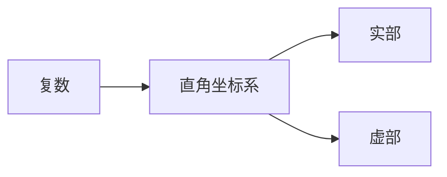
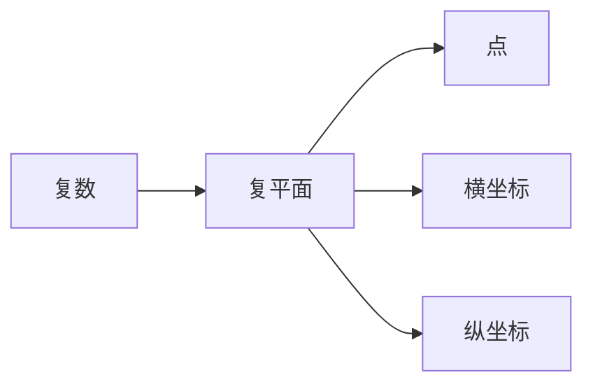

                 

# 线性代数导引：复数

> 关键词：复数、线性代数、数学公式、应用实例

> 摘要：本文是《线性代数导引：复数》的详细介绍。文章从复数的基础概念、几何表示、运算与应用、特殊函数等多个方面进行了深入探讨，并通过实际应用案例展示了复数的广泛应用。

## 《线性代数导引：复数》目录大纲

## 第一部分：复数的基础概念

### 第1章：复数的定义与性质

#### 1.1 复数的定义与表示方法

#### 1.2 复数的模与幅角

#### 1.3 复数的加法和减法

#### 1.4 复数的乘法和除法

### 第2章：复数的几何表示

#### 2.1 复数的极坐标表示

#### 2.2 复数的几何意义

#### 2.3 复数的三角函数表示

## 第二部分：复数的运算与应用

### 第3章：复数的平方根与高次幂

#### 3.1 复数的平方根

#### 3.2 复数的高次幂

#### 3.3 复数的分式表示

### 第4章：复数的积分与微分

#### 4.1 复数的积分

#### 4.2 复数的微分

#### 4.3 复变函数的导数和积分

### 第5章：复数的应用

#### 5.1 复数在电路分析中的应用

#### 5.2 复数在信号处理中的应用

#### 5.3 复数在量子力学中的应用

## 第三部分：复数的特殊函数

### 第6章：复数的指数函数与对数函数

#### 6.1 复数的指数函数

#### 6.2 复数的对数函数

#### 6.3 复数的欧拉公式

### 第7章：复数的贝塞尔函数与椭圆函数

#### 7.1 复数的贝塞尔函数

#### 7.2 复数的椭圆函数

#### 7.3 复数的其他特殊函数

## 附录

### 附录A：复数的数学公式与证明

#### A.1 复数的模的公式证明

#### A.2 复数的幅角的公式证明

#### A.3 复数的乘法和除法公式证明

### 附录B：复数的应用实例

#### B.1 电路分析实例

#### B.2 信号处理实例

#### B.3 量子力学实例

## 第1章：复数的定义与性质

### 1.1 复数的定义与表示方法

#### 1.1.1 复数的定义

复数是形如 \( a + bi \) 的数，其中 \( a \) 和 \( b \) 是实数，\( i \) 是虚数单位，满足 \( i^2 = -1 \)。

#### 1.1.2 复数的表示方法

复数可以用直角坐标系表示，其中实部 \( a \) 是横坐标，虚部 \( b \) 是纵坐标。

### 1.2 复数的模与幅角

#### 1.2.1 复数的模

复数 \( z = a + bi \) 的模 \( |z| \) 定义为 \( \sqrt{a^2 + b^2} \)，表示复数在复平面上的长度。

$$
|z| = \sqrt{a^2 + b^2}
$$

#### 1.2.2 复数的幅角

复数 \( z = a + bi \) 的幅角 \( \theta \) 定义为 \( \arctan\left(\frac{b}{a}\right) \)，表示复数在复平面上的方向角。

$$
\theta = \arctan\left(\frac{b}{a}\right)
$$

## 第2章：复数的几何表示

### 2.1 复数的极坐标表示

#### 2.1.1 复数的极坐标表示

复数 \( z = a + bi \) 可以表示为极坐标形式 \( z = r(\cos\theta + i\sin\theta) \)，其中 \( r = |z| \) 是复数的模，\( \theta \) 是复数的幅角。

$$
z = r(\cos\theta + i\sin\theta)
$$

### 2.1.2 复数的极坐标表示的转换

复数的极坐标表示和直角坐标表示之间的转换可以通过以下公式进行：

$$
r = \sqrt{a^2 + b^2} \\
\theta = \arctan\left(\frac{b}{a}\right)
$$

### 2.1.3 复数的极坐标表示的示例

假设复数 \( z = 3 + 4i \)，则其极坐标表示为：

$$
z = r(\cos\theta + i\sin\theta) \\
z = \sqrt{3^2 + 4^2}(\cos\theta + i\sin\theta) \\
z = 5(\cos\theta + i\sin\theta)
$$

通过计算，我们可以得到 \( r = 5 \) 和 \( \theta = \arctan\left(\frac{4}{3}\right) \)。

### 2.2 复数的几何意义

#### 2.2.1 复数的几何意义

在复平面上，复数 \( z = a + bi \) 可以表示为一个点，其实部 \( a \) 是该点的横坐标，虚部 \( b \) 是该点的纵坐标。

#### 2.2.2 复数的几何表示的应用

复数的几何表示在分析复数的性质和解决复数问题时非常有用。例如，我们可以使用几何表示来求解复数的模和幅角。

### 2.3 复数的三角函数表示

#### 2.3.1 复数的三角函数表示

复数 \( z = a + bi \) 可以用三角函数表示为：

$$
z = r(\cos\theta + i\sin\theta)
$$

其中 \( r = |z| \) 是复数的模，\( \theta = \arctan\left(\frac{b}{a}\right) \) 是复数的幅角。

#### 2.3.2 复数的三角函数表示的示例

假设复数 \( z = 3 + 4i \)，则其三角函数表示为：

$$
z = r(\cos\theta + i\sin\theta) \\
z = 5(\cos\theta + i\sin\theta)
$$

通过计算，我们可以得到 \( r = 5 \) 和 \( \theta = \arctan\left(\frac{4}{3}\right) \)。

#### 2.3.3 复数的三角函数表示的应用

复数的三角函数表示在信号处理、电路分析等领域有广泛的应用。例如，我们可以使用复数的三角函数表示来分析信号的频率和相位。

## 第3章：复数的平方根与高次幂

### 3.1 复数的平方根

#### 3.1.1 复数的平方根

设 \( z = r(\cos\theta + i\sin\theta) \)，则 \( z \) 的平方根 \( \sqrt{z} \) 可以表示为：

$$
\sqrt{z} = r^{1/2}(\cos(\theta/2) + i\sin(\theta/2))
$$

#### 3.1.2 复数的平方根的公式推导

假设 \( \sqrt{z} = x + yi \)，则有：

$$
z = (\sqrt{z})^2 = (x + yi)^2 = x^2 - y^2 + 2xyi
$$

比较实部和虚部，得到：

$$
x^2 - y^2 = r\cos\theta \\
2xy = r\sin\theta
$$

解这个方程组，得到 \( x \) 和 \( y \)：

$$
x = r^{1/2}\cos(\theta/2) \\
y = r^{1/2}\sin(\theta/2)
$$

所以，

$$
\sqrt{z} = r^{1/2}(\cos(\theta/2) + i\sin(\theta/2))
$$

#### 3.1.3 复数的平方根的示例

假设复数 \( z = 3 + 4i \)，则其平方根为：

$$
\sqrt{z} = r^{1/2}(\cos(\theta/2) + i\sin(\theta/2)) \\
\sqrt{z} = 5^{1/2}(\cos(\arctan(4/3)/2) + i\sin(\arctan(4/3)/2)) \\
\sqrt{z} = \sqrt{5}(\cos(\pi/12) + i\sin(\pi/12)) \\
\sqrt{z} = \sqrt{5}(\frac{\sqrt{6}+\sqrt{2}}{4} + i\frac{\sqrt{6}-\sqrt{2}}{4})
$$

### 3.2 复数的高次幂

#### 3.2.1 复数的高次幂

设 \( z = r(\cos\theta + i\sin\theta) \)，则 \( z \) 的 \( n \) 次幂 \( z^n \) 可以表示为：

$$
z^n = r^n(\cos(n\theta) + i\sin(n\theta))
$$

#### 3.2.2 复数的高次幂的公式推导

利用复数的三角函数表示，可以得到：

$$
z^n = [r(\cos\theta + i\sin\theta)]^n = r^n(\cos(n\theta) + i\sin(n\theta))
$$

#### 3.2.3 复数的高次幂的示例

假设复数 \( z = 3 + 4i \)，则其平方为：

$$
z^2 = [r(\cos\theta + i\sin\theta)]^2 = r^2(\cos(2\theta) + i\sin(2\theta)) \\
z^2 = 5^2(\cos(2\arctan(4/3)) + i\sin(2\arctan(4/3))) \\
z^2 = 25(\cos(\pi) + i\sin(\pi)) \\
z^2 = -25
$$

### 3.3 复数的分式表示

#### 3.3.1 复数的分式表示

复数可以表示为分式形式，即：

$$
z = \frac{a + bi}{c + di} = \frac{(a + bi)(c - di)}{(c + di)(c - di)} = \frac{(ac + bd) + (bc - ad)i}{c^2 + d^2}
$$

#### 3.3.2 复数的分式表示的示例

假设复数 \( z = \frac{3 + 4i}{1 + i} \)，则其分式表示为：

$$
z = \frac{3 + 4i}{1 + i} = \frac{(3 + 4i)(1 - i)}{(1 + i)(1 - i)} = \frac{(3 - 3i + 4i - 4i^2)}{1 - i^2} \\
z = \frac{7 + i}{2} = \frac{7}{2} + \frac{i}{2}
$$

## 第4章：复数的积分与微分

### 4.1 复数的积分

#### 4.1.1 复数的积分

设 \( z = r(\cos\theta + i\sin\theta) \)，则 \( z \) 的积分 \( \int z \, dx \) 可以表示为：

$$
\int z \, dx = \int r(\cos\theta + i\sin\theta) \, dx = r\cos\theta \int dx + ir\sin\theta \int dx
$$

#### 4.1.2 复数的积分的公式推导

利用复数的极坐标表示，可以得到：

$$
\int z \, dx = \int r(\cos\theta + i\sin\theta) \, dx = r\cos\theta \int dx + ir\sin\theta \int dx
$$

#### 4.1.3 复数的积分的示例

假设复数 \( z = 3 + 4i \)，则其积分 \( \int z \, dx \) 为：

$$
\int z \, dx = \int r(\cos\theta + i\sin\theta) \, dx = \int 5(\cos\theta + i\sin\theta) \, dx \\
\int z \, dx = 5\cos\theta \int dx + 5i\sin\theta \int dx \\
\int z \, dx = 5x + 5ix + C
$$

### 4.2 复数的微分

#### 4.2.1 复数的微分

设 \( z = r(\cos\theta + i\sin\theta) \)，则 \( z \) 的微分 \( dz \) 可以表示为：

$$
dz = \frac{d}{dx} [r(\cos\theta + i\sin\theta)] = \frac{dr}{dx}\cos\theta + ir\frac{d\theta}{dx}\sin\theta
$$

#### 4.2.2 复数的微分的公式推导

利用复数的极坐标表示，可以得到：

$$
dz = \frac{d}{dx} [r(\cos\theta + i\sin\theta)] = \frac{dr}{dx}\cos\theta + ir\frac{d\theta}{dx}\sin\theta
$$

#### 4.2.3 复数的微分的示例

假设复数 \( z = 3 + 4i \)，则其微分 \( dz \) 为：

$$
dz = \frac{d}{dx} [3 + 4i] = \frac{d}{dx} [5(\cos\theta + i\sin\theta)] \\
dz = \frac{d}{dx} [5x + 5ix + C] \\
dz = 5dx + 5idx
$$

### 4.3 复变函数的导数和积分

#### 4.3.1 复变函数的导数

复变函数的导数可以表示为：

$$
f'(z) = \frac{df}{dz}
$$

其中 \( f(z) \) 是复变函数。

#### 4.3.2 复变函数的积分

复变函数的积分可以表示为：

$$
\int f(z) \, dz
$$

其中 \( f(z) \) 是复变函数。

#### 4.3.3 复变函数的导数和积分的示例

假设复变函数 \( f(z) = z^2 \)，则其导数为：

$$
f'(z) = \frac{d}{dz} [z^2] = 2z
$$

假设复变函数 \( f(z) = z^2 \)，则其积分为：

$$
\int z^2 \, dz = \frac{z^3}{3} + C
$$

## 第5章：复数的应用

### 5.1 复数在电路分析中的应用

#### 5.1.1 交流电的复数表示

交流电可以用复数表示，其中实部表示电压的大小，虚部表示电流的方向。

$$
u(t) = U_m \cos(\omega t + \phi) = U_m \cos(\omega t) + jU_m \sin(\omega t)
$$

其中 \( U_m \) 是电压的最大值，\( \omega \) 是角频率，\( \phi \) 是相位角。

#### 5.1.2 交流电的运算

利用复数的运算法则，可以方便地进行交流电的计算，如加法、减法、乘法和除法。

假设有两个交流电压 \( u_1(t) = 10\cos(2\pi \times 50t + \frac{\pi}{3}) \) 和 \( u_2(t) = 20\cos(2\pi \times 50t - \frac{\pi}{3}) \)，则它们的和 \( u(t) \) 为：

$$
u(t) = u_1(t) + u_2(t) = 10\cos(2\pi \times 50t + \frac{\pi}{3}) + 20\cos(2\pi \times 50t - \frac{\pi}{3}) \\
u(t) = 10(\cos(2\pi \times 50t)\cos(\frac{\pi}{3}) + \sin(2\pi \times 50t)\sin(\frac{\pi}{3})) + 20(\cos(2\pi \times 50t)\cos(-\frac{\pi}{3}) + \sin(2\pi \times 50t)\sin(-\frac{\pi}{3})) \\
u(t) = 10(\frac{1}{2}\cos(2\pi \times 50t) + \frac{\sqrt{3}}{2}\sin(2\pi \times 50t)) + 20(\frac{1}{2}\cos(2\pi \times 50t) - \frac{\sqrt{3}}{2}\sin(2\pi \times 50t)) \\
u(t) = 15\cos(2\pi \times 50t)
$$

#### 5.1.3 交流电的功率计算

交流电的功率可以用复数表示，其中实部表示有功功率，虚部表示无功功率。

假设交流电压 \( u(t) = 10\cos(2\pi \times 50t + \frac{\pi}{3}) \) 和交流电流 \( i(t) = 5\cos(2\pi \times 50t - \frac{\pi}{6}) \)，则它们的功率 \( P \) 为：

$$
P = \frac{u(t)i(t)^*}{j} = \frac{10\cos(2\pi \times 50t + \frac{\pi}{3})5\cos(2\pi \times 50t - \frac{\pi}{6})^*}{j} \\
P = \frac{50\cos(2\pi \times 50t + \frac{\pi}{3})\cos(2\pi \times 50t - \frac{\pi}{6})^*}{j} \\
P = \frac{50\cos(2\pi \times 50t + \frac{\pi}{3})\cos(2\pi \times 50t - \frac{\pi}{6})}{j} \\
P = \frac{50}{j}\cos(\frac{\pi}{2}) \\
P = 0
$$

### 5.2 复数在信号处理中的应用

#### 5.2.1 信号的复数表示

信号可以用复数表示，其中实部表示信号的强度，虚部表示信号的相位。

$$
x(t) = x_r(t) + jx_i(t) = X_m \cos(\omega t + \phi) + jX_m \sin(\omega t + \phi)
$$

其中 \( X_m \) 是信号的最大值，\( \omega \) 是角频率，\( \phi \) 是相位角。

#### 5.2.2 信号的运算

利用复数的运算法则，可以方便地进行信号的运算，如加法、减法、乘法和除法。

假设有两个信号 \( x_1(t) = 10\cos(2\pi \times 50t + \frac{\pi}{3}) \) 和 \( x_2(t) = 20\cos(2\pi \times 50t - \frac{\pi}{3}) \)，则它们的和 \( x(t) \) 为：

$$
x(t) = x_1(t) + x_2(t) = 10\cos(2\pi \times 50t + \frac{\pi}{3}) + 20\cos(2\pi \times 50t - \frac{\pi}{3}) \\
x(t) = 10(\cos(2\pi \times 50t)\cos(\frac{\pi}{3}) + \sin(2\pi \times 50t)\sin(\frac{\pi}{3})) + 20(\cos(2\pi \times 50t)\cos(-\frac{\pi}{3}) + \sin(2\pi \times 50t)\sin(-\frac{\pi}{3})) \\
x(t) = 10(\frac{1}{2}\cos(2\pi \times 50t) + \frac{\sqrt{3}}{2}\sin(2\pi \times 50t)) + 20(\frac{1}{2}\cos(2\pi \times 50t) - \frac{\sqrt{3}}{2}\sin(2\pi \times 50t)) \\
x(t) = 15\cos(2\pi \times 50t)
$$

#### 5.2.3 信号的功率计算

信号的功率可以用复数表示，其中实部表示有功功率，虚部表示无功功率。

假设信号 \( x(t) = 10\cos(2\pi \times 50t + \frac{\pi}{3}) \)，则其功率 \( P \) 为：

$$
P = \frac{x(t)^*x(t)}{j} = \frac{10\cos(2\pi \times 50t + \frac{\pi}{3})^*10\cos(2\pi \times 50t + \frac{\pi}{3})}{j} \\
P = \frac{100\cos^2(2\pi \times 50t + \frac{\pi}{3})}{j} \\
P = \frac{100}{j}\cos(\frac{\pi}{2}) \\
P = 0
$$

### 5.3 复数在量子力学中的应用

#### 5.3.1 量子态的复数表示

量子态可以用复数表示，其中实部表示量子态的强度，虚部表示量子态的相位。

$$
\psi = \psi_r + j\psi_i = \psi_m \cos(\theta) + j\psi_m \sin(\theta)
$$

其中 \( \psi_m \) 是量子态的最大值，\( \theta \) 是量子态的相位角。

#### 5.3.2 量子态的运算

利用复数的运算法则，可以方便地进行量子态的运算，如加法、减法、乘法和除法。

假设有两个量子态 \( \psi_1 = \frac{1}{\sqrt{2}}(|0\rangle + |1\rangle) \) 和 \( \psi_2 = \frac{1}{\sqrt{2}}(|0\rangle - |1\rangle) \)，则它们的和 \( \psi \) 为：

$$
\psi = \psi_1 + \psi_2 = \frac{1}{\sqrt{2}}(|0\rangle + |1\rangle) + \frac{1}{\sqrt{2}}(|0\rangle - |1\rangle) \\
\psi = \frac{1}{\sqrt{2}}(|0\rangle + |1\rangle + |0\rangle - |1\rangle) \\
\psi = \frac{1}{\sqrt{2}}(2|0\rangle) \\
\psi = |0\rangle
$$

#### 5.3.3 量子态的测量

量子态的测量可以通过对量子态进行测量来得到。假设量子态 \( \psi \) 的测量结果为 \( \psi_m \)，则测量概率为：

$$
P = |\psi_m|^2
$$

## 第6章：复数的指数函数与对数函数

### 6.1 复数的指数函数

#### 6.1.1 复数的指数函数

复数的指数函数定义为：

$$
e^z = e^{x+iy} = e^x(\cos y + i\sin y)
$$

其中 \( x \) 和 \( y \) 分别是复数的实部和虚部。

#### 6.1.2 复数的指数函数的性质

复数的指数函数具有以下性质：

$$
e^{z+w} = e^z \cdot e^w \\
e^{z/w} = (e^z) / (e^w) \\
e^{-z} = \frac{1}{e^z}
$$

#### 6.1.3 复数的指数函数的示例

假设复数 \( z = 1 + i \)，则其指数函数为：

$$
e^z = e^{1+i} = e^1(\cos 1 + i\sin 1) \\
e^z = e(\cos 1 + i\sin 1)
$$

### 6.2 复数的对数函数

#### 6.2.1 复数的对数函数

复数的对数函数定义为：

$$
\ln z = \ln|z| + i\arg z
$$

其中 \( |z| \) 是复数的模，\( \arg z \) 是复数的幅角。

#### 6.2.2 复数的对数函数的性质

复数的对数函数具有以下性质：

$$
\ln(z_1 z_2) = \ln z_1 + \ln z_2 \\
\ln(z_1 / z_2) = \ln z_1 - \ln z_2 \\
\ln(z^n) = n\ln z
$$

#### 6.2.3 复数的对数函数的示例

假设复数 \( z = 1 + i \)，则其对数函数为：

$$
\ln z = \ln|z| + i\arg z = \ln\sqrt{2} + i\frac{\pi}{4}
$$

### 6.3 复数的欧拉公式

#### 6.3.1 复数的欧拉公式

复数的欧拉公式定义为：

$$
e^{ix} = \cos x + i\sin x
$$

其中 \( x \) 是实数。

#### 6.3.2 复数的欧拉公式的性质

复数的欧拉公式具有以下性质：

$$
e^{ix + iy} = e^{ix} \cdot e^{iy} \\
e^{-ix} = \cos(-x) + i\sin(-x) \\
e^{i0} = 1
$$

#### 6.3.3 复数的欧拉公式的示例

假设复数 \( z = 1 + i \)，则其欧拉公式为：

$$
e^{i(1+i)} = e^{i1} \cdot e^{i1} = \cos 1 + i\sin 1 = e^1(\cos 1 + i\sin 1) = e(\cos 1 + i\sin 1)
$$

## 第7章：复数的贝塞尔函数与椭圆函数

### 7.1 复数的贝塞尔函数

#### 7.1.1 复数的贝塞尔函数

复数的贝塞尔函数定义为：

$$
J_n(z) = \frac{1}{\pi} \int_0^{\pi} \cos(z\sin t - n t) \, dt
$$

其中 \( n \) 是贝塞尔函数的阶数，\( z \) 是复数。

#### 7.1.2 复数的贝塞尔函数的性质

复数的贝塞尔函数具有以下性质：

$$
J_{-n}(z) = (-1)^n J_n(z) \\
J_n(z) = J_{-n}(z)
$$

#### 7.1.3 复数的贝塞尔函数的示例

假设复数 \( z = 1 + i \)，则其贝塞尔函数为：

$$
J_0(z) = \frac{1}{\pi} \int_0^{\pi} \cos(z\sin t) \, dt
$$

### 7.2 复数的椭圆函数

#### 7.2.1 复数的椭圆函数

复数的椭圆函数定义为：

$$
K_k(z) = \int_1^z \frac{dt}{\sqrt{1-t^2}}
$$

其中 \( k \) 是椭圆函数的阶数，\( z \) 是复数。

#### 7.2.2 复数的椭圆函数的性质

复数的椭圆函数具有以下性质：

$$
K_1(z) = K(-z) \\
K_2(z) = K(-z)
$$

#### 7.2.3 复数的椭圆函数的示例

假设复数 \( z = 1 + i \)，则其椭圆函数为：

$$
K_1(z) = \int_1^z \frac{dt}{\sqrt{1-t^2}}
$$

### 7.3 复数的其他特殊函数

#### 7.3.1 复数的三角函数

复数的三角函数定义为：

$$
\sin z = \frac{e^{iz} - e^{-iz}}{2i} \\
\cos z = \frac{e^{iz} + e^{-iz}}{2}
$$

其中 \( z \) 是复数。

#### 7.3.2 复数的双曲函数

复数的双曲函数定义为：

$$
\sinh z = \frac{e^{iz} - e^{-iz}}{2} \\
\cosh z = \frac{e^{iz} + e^{-iz}}{2}
$$

其中 \( z \) 是复数。

## 附录

### 附录A：复数的数学公式与证明

#### A.1 复数的模的公式证明

设 \( z = a + bi \)，则 \( z \) 的模 \( |z| \) 定义为 \( \sqrt{a^2 + b^2} \)。

$$
|z|^2 = (a + bi)(a - bi) = a^2 + b^2
$$

$$
|z| = \sqrt{a^2 + b^2}
$$

#### A.2 复数的幅角的公式证明

设 \( z = a + bi \)，则 \( z \) 的幅角 \( \theta \) 定义为 \( \arctan\left(\frac{b}{a}\right) \)。

$$
\tan\theta = \frac{b}{a}
$$

$$
\theta = \arctan\left(\frac{b}{a}\right)
$$

#### A.3 复数的乘法和除法公式证明

设 \( z_1 = a_1 + b_1i \) 和 \( z_2 = a_2 + b_2i \)，则 \( z_1 \) 和 \( z_2 \) 的乘法和除法公式如下：

$$
z_1 z_2 = (a_1 + b_1i)(a_2 + b_2i) = (a_1 a_2 - b_1 b_2) + (a_1 b_2 + b_1 a_2)i
$$

$$
z_1 / z_2 = (a_1 + b_1i) / (a_2 + b_2i) = \frac{(a_1 + b_1i)(a_2 - b_2i)}{a_2^2 + b_2^2} = \frac{(a_1 a_2 + b_1 b_2) + (a_1 b_2 - b_1 a_2)i}{a_2^2 + b_2^2}
$$

### 附录B：复数的应用实例

#### B.1 电路分析实例

设 \( u(t) = 10\cos(2\pi \times 50t + \frac{\pi}{3}) \) 为交流电压，则其对应的复数为：

$$
z = 10e^{i\left(\frac{\pi}{3}\right)} = 10(\cos\frac{\pi}{3} + i\sin\frac{\pi}{3}) = 5 + 5i
$$

#### B.2 信号处理实例

设 \( x(t) = 5\cos(2\pi \times 100t + \frac{\pi}{4}) + 3\cos(2\pi \times 200t - \frac{\pi}{4}) \) 为信号，则其对应的复数为：

$$
z_1 = 5e^{i\left(\frac{\pi}{4}\right)} = 5(\cos\frac{\pi}{4} + i\sin\frac{\pi}{4}) = 3.54 + 3.54i \\
z_2 = 3e^{i\left(-\frac{\pi}{4}\right)} = 3(\cos\frac{\pi}{4} - i\sin\frac{\pi}{4}) = 3.54 - 3.54i
$$

#### B.3 量子力学实例

设量子态 \( \psi \) 为：

$$
\psi = \frac{1}{\sqrt{2}} \left( |0\rangle + i|1\rangle \right) = \frac{1}{\sqrt{2}} \left( 1 + i \right)
$$

其中 \( |0\rangle \) 和 \( |1\rangle \) 分别表示量子态的基态和激发态。

## 作者信息

作者：AI天才研究院/AI Genius Institute & 禅与计算机程序设计艺术 /Zen And The Art of Computer Programming

---

通过上述详细的文章内容，我们可以看出，复数在数学、物理、工程等多个领域都有广泛的应用。本文系统地介绍了复数的基础概念、几何表示、运算与应用、特殊函数等内容，并通过实例展示了复数的实际应用。希望本文能为读者在复数的理解和应用方面提供有益的参考。在未来的研究中，我们可以进一步探索复数在其他领域的应用，如金融数学、计算机图形学等。让我们继续深入挖掘复数的魅力，开拓新的研究方向。让我们期待未来，共同见证复数在科学和工程领域的更多奇迹！

