                 

### 《线性代数导引：度量》

> 关键词：线性代数、度量、优化问题、信号处理、图像处理

> 摘要：本文旨在引导读者深入理解线性代数的基础知识和度量空间的基本概念，并通过具体实例展示其在优化问题、信号处理和图像处理中的应用。文章通过逻辑清晰的章节结构，逐步探讨线性代数的核心概念和算法原理，旨在为读者提供一个全面而系统的学习框架。

### 引言

线性代数是数学的一个分支，它主要研究向量空间、线性映射以及线性方程组。作为现代科学和工程中的基础工具，线性代数在多个领域具有广泛的应用，包括物理学、计算机科学、经济学和工程学等。度量作为线性代数的一个重要概念，它在几何学、物理学、优化问题和信号处理等领域扮演着核心角色。

本文将分为四个主要部分来展开讨论。第一部分将介绍线性代数的基础知识，包括线性代数的概念、矩阵和行列式、向量和向量空间，以及线性方程组的基本解法和解的结构。第二部分将引入度量空间的基本概念，探讨度量空间的基本性质、分类以及特殊度量空间，如希尔伯特空间和黎曼几何。第三部分将讨论线性代数在度量空间中的应用，包括线性代数在优化问题、信号处理和图像处理中的应用。最后，文章将提供一个附录，回顾线性代数的常用数学公式和定理，以及线性代数在现实世界中的应用案例。

### 第一部分：线性代数基础

#### 第1章：线性代数引论

线性代数是研究向量空间、线性映射和线性方程组的数学分支。它起源于19世纪，由艾米-诺特（Amélie Noether）和赫尔曼·魏尔（Hermann Weyl）等人奠定了现代线性代数的基础。线性代数的核心概念包括向量、矩阵、行列式、线性变换以及特征值和特征向量。

**1.1 线性代数的概念和对象**

线性代数的主要研究对象是向量空间和线性映射。向量空间是由一组向量构成的集合，这些向量满足加法和标量乘法的运算规则。线性映射则是从向量空间到另一个向量空间的函数，它保持向量空间的线性结构。

**1.2 矩阵和行列式**

矩阵是线性代数中的一种基本工具，它由一系列数按照特定的排列方式组成。矩阵不仅可以表示线性方程组，还可以表示线性变换。行列式是矩阵的一个数值属性，它用于判断矩阵的可逆性和线性方程组的解的结构。

**1.3 向量和向量空间**

向量是具有大小和方向的量，它可以表示为坐标的形式。向量空间是由一组向量构成的集合，这些向量满足加法和标量乘法的运算规则。常见的向量空间包括欧几里得空间和有限维向量空间。

**图1-1：向量空间的概念和例子**

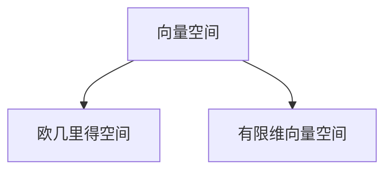

#### 第2章：线性方程组

线性方程组是由多个线性方程组成的方程组。研究线性方程组的解法和解的结构对于解决实际问题具有重要意义。

**2.1 线性方程组的基本解法**

线性方程组的基本解法包括高斯消元法和矩阵求逆法。高斯消元法通过逐行消元，将线性方程组转化为上三角矩阵，从而求解方程组。矩阵求逆法则是通过计算矩阵的逆矩阵来求解方程组。

**2.2 线性方程组的解的结构**

线性方程组的解可以是唯一解、无穷多解或无解。唯一解表示方程组有且仅有一个解，无穷多解表示方程组有无限多个解，而无解表示方程组没有解。

**2.3 线性方程组的数值解法**

线性方程组的数值解法包括直接法和迭代法。直接法通过一系列精确的计算步骤求解方程组，如高斯消元法。迭代法则通过不断迭代逼近方程组的解。

**图2-1：线性方程组的解的结构**

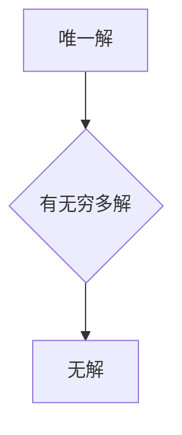

#### 第3章：特征值与特征向量

特征值和特征向量是矩阵理论中的重要概念，它们在物理学、工程学和计算机科学中有着广泛的应用。

**3.1 特征值与特征向量的定义**

特征值是矩阵的一个特殊值，它使得矩阵减去该值后得到的矩阵可逆。特征向量是矩阵的一个特殊向量，它使得矩阵与特征向量相乘后得到的结果仍然是特征向量。

**3.2 特征值的性质和计算**

特征值的性质包括唯一性、稳定性和谱分解。计算特征值的方法包括特征值分解法和幂法。

**3.3 特征向量的性质和应用**

特征向量的性质包括正交性和归一化。特征向量在图像处理、信号处理和优化问题中有着广泛的应用。

**图3-1：特征值与特征向量的概念**

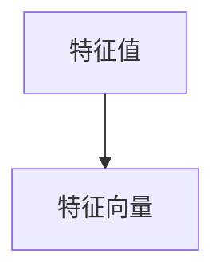

#### 第4章：矩阵的对角化

矩阵的对角化是将一个矩阵转换为对角矩阵的过程，它在多个领域中有着重要的应用。

**4.1 矩阵对角化的概念**

矩阵对角化是指将一个矩阵表示为对角矩阵的形式，其中对角线上的元素为特征值，非对角线上的元素为0。

**4.2 矩阵对角化的算法**

矩阵对角化的算法包括特征值分解法和施密特正交化法。特征值分解法通过计算矩阵的特征值和特征向量来实现矩阵对角化。施密特正交化法则通过正交变换来实现矩阵对角化。

**4.3 对角化在物理学和经济学中的应用**

对角化在物理学中用于描述系统的能量本征态，在经济学中用于分析经济系统的稳定性。

**图4-1：矩阵对角化的概念**

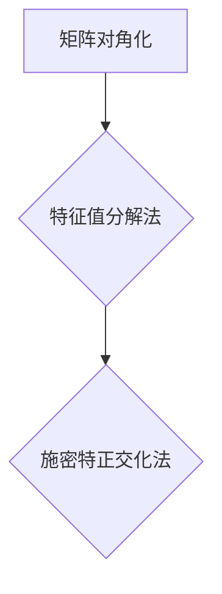

### 第二部分：度量空间

#### 第5章：度量空间的基本概念

度量空间是线性代数中的一个重要概念，它为向量空间引入了距离的概念，从而可以研究向量之间的相对位置和大小。

**5.1 度量空间的概念**

度量空间是一个向量空间，它定义了一个度量（距离函数），用来衡量向量之间的距离。度量必须满足非负性、对称性和三角不等式。

**5.2 度量空间的基本性质**

度量空间的基本性质包括凸性、完备性和紧性。凸性表示度量空间中的任意两点连线上的点都在度量空间内。完备性表示度量空间中的任意序列都有收敛的子序列。紧性表示度量空间中的任意开球都有闭包。

**5.3 度量空间的分类**

度量空间的分类包括欧几里得空间、希尔伯特空间和黎曼空间。欧几里得空间是最常见的度量空间，其度量由欧几里得距离定义。希尔伯特空间是具有内积的度量空间，其度量由内积定义。黎曼空间是具有黎曼度的度量空间，其度量由黎曼度定义。

**图5-1：度量空间的分类**

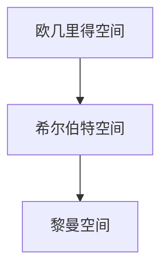

#### 第6章：距离函数与度量矩阵

距离函数是度量空间中的核心概念，它为向量之间的比较提供了一个量化标准。

**6.1 距离函数的定义与性质**

距离函数是一个映射，它将度量空间中的任意两个向量映射到一个实数。距离函数必须满足非负性、对称性和三角不等式。

**6.2 度量矩阵的概念与性质**

度量矩阵是一个方阵，它的元素表示向量之间的距离。度量矩阵必须是对称的，且对角线上的元素为0。

**6.3 欧几里得空间中的度量矩阵**

在欧几里得空间中，度量矩阵是对角矩阵，其非对角线上的元素为0。欧几里得距离定义为向量之间的欧几里得范数。

**图6-1：欧几里得空间中的度量矩阵**

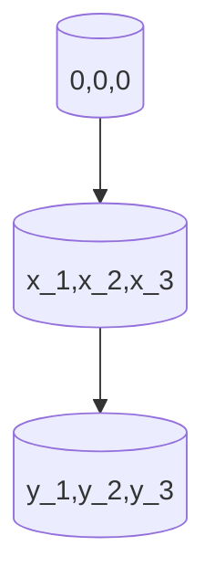

#### 第7章：度量空间的连续性和完备性

度量空间的连续性和完备性是度量空间中的重要性质，它们对于解决实际问题和证明理论结论具有重要意义。

**7.1 度量空间的连续性**

度量空间的连续性表示度量空间中的函数可以通过极限来定义。连续函数在度量空间中保持一定的性质，如一致连续性。

**7.2 度量空间的完备性**

度量空间的完备性表示度量空间中的任意序列都有收敛的子序列。完备性是度量空间能够描述实际问题的基本条件。

**7.3 度量空间的紧性**

度量空间的紧性表示度量空间中的任意开球都有闭包。紧性是度量空间能够表示连续函数和证明存在性结论的基本条件。

**图7-1：度量空间的连续性和完备性**

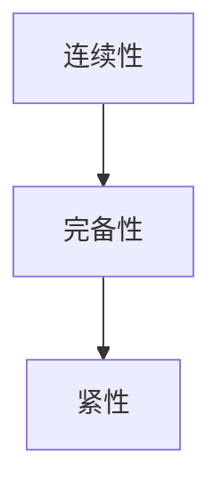

### 第三部分：特殊度量空间

#### 第8章：希尔伯特空间

希尔伯特空间是具有内积的度量空间，它在数学、物理学和工程学中有着广泛的应用。

**8.1 希尔伯特空间的概念**

希尔伯特空间是一个内积空间，它满足线性空间和内积空间的性质。内积是希尔伯特空间中的两个向量之间的度量，它具有正定性、对称性和线性性。

**8.2 希尔伯特空间的基本性质**

希尔伯特空间的基本性质包括完备性、正规性和双正交性。完备性表示希尔伯特空间中的任意序列都有收敛的子序列。正规性表示希尔伯特空间中的子空间是闭的。双正交性表示希尔伯特空间中的任意两个子空间是正交的。

**8.3 希尔伯特空间的几何结构**

希尔伯特空间的几何结构类似于欧几里得空间，但具有更一般的性质。希尔伯特空间中的向量可以用内积来表示，从而可以定义角度和距离。

**图8-1：希尔伯特空间的几何结构**

#### 第9章：黎曼几何基础

黎曼几何是研究黎曼空间的几何学，它在广义相对论和量子场论中有着重要的应用。

**9.1 黎曼空间的概念**

黎曼空间是一个度量空间，其度量由黎曼度定义。黎曼度是一个二次形式，它具有正定性、对称性和线性性。

**9.2 黎曼空间的性质**

黎曼空间的性质包括局部欧几里得性和全局性质。局部欧几里得性表示黎曼空间中的任意两点都可以通过局部坐标来表示。全局性质包括黎曼曲率和度量不变性。

**9.3 黎曼空间的几何结构**

黎曼空间的几何结构类似于欧几里得空间，但具有更复杂的性质。黎曼空间中的向量可以用黎曼度来表示，从而可以定义曲率和体积。

**图9-1：黎曼空间的几何结构**

#### 第10章：流形与度量的推广

流形是拓扑空间中的一个重要概念，它为度量的推广提供了基础。

**10.1 流形的概念**

流形是一个局部欧几里得空间，其整体结构和局部结构相互协调。流形可以分为紧致流形和无限流形。

**10.2 度量在流形上的推广**

度量在流形上的推广包括黎曼度量和黎曼曲率。黎曼度量是流形上的度量，黎曼曲率是流形上黎曼度量的性质。

**10.3 流形的分类和性质**

流形的分类包括二维流形、三维流形和更高维度的流形。流形的性质包括局部欧几里得性、紧致性和连通性。

**图10-1：流形的分类和性质**

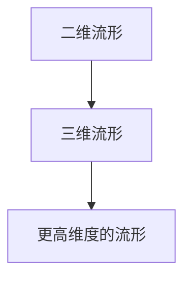

### 第四部分：线性代数在度量空间中的应用

#### 第11章：线性代数在优化问题中的应用

优化问题是寻找满足特定约束条件的最佳解的过程，它在工程、经济和科学等领域有着广泛的应用。

**11.1 优化问题的基本概念**

优化问题可以分为线性优化问题和非线性优化问题。线性优化问题可以通过线性代数的方法求解，如线性规划。非线性优化问题通常使用迭代算法来求解。

**11.2 线性代数在优化问题中的应用**

线性代数在优化问题中的应用主要体现在矩阵运算和解线性方程组。通过矩阵运算，可以计算目标函数的梯度，从而找到最优解。

**11.3 最优化问题的算法实现**

最优化问题的算法实现包括梯度下降法和牛顿法。梯度下降法通过迭代更新参数来逼近最优解，牛顿法通过求解线性化方程组来逼近最优解。

**图11-1：线性代数在优化问题中的应用**

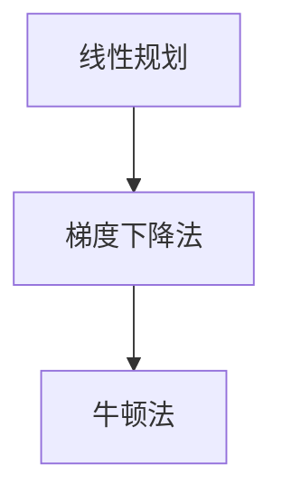

#### 第12章：线性代数在信号处理中的应用

信号处理是研究信号的生成、传输和处理的技术，它在通信、音频和图像处理等领域有着重要的应用。

**12.1 信号处理的基本概念**

信号处理的基本概念包括信号的时域表示和频域表示。时域表示描述信号在时间上的变化，频域表示描述信号在不同频率上的特性。

**12.2 线性代数在信号处理中的应用**

线性代数在信号处理中的应用主要体现在矩阵运算和解线性方程组。通过矩阵运算，可以计算信号的自相关函数和卷积。

**12.3 信号处理的算法实现**

信号处理的算法实现包括傅里叶变换和滤波器设计。傅里叶变换可以将信号从时域转换为频域，滤波器设计用于去除信号中的噪声。

**图12-1：线性代数在信号处理中的应用**

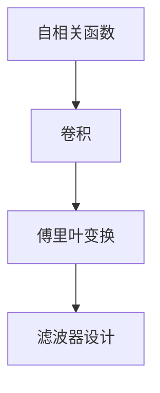

#### 第13章：线性代数在图像处理中的应用

图像处理是研究图像的生成、传输和处理的技术，它在计算机视觉和多媒体技术等领域有着重要的应用。

**13.1 图像处理的基本概念**

图像处理的基本概念包括图像的像素表示和图像的变换。像素表示描述图像在空间上的分布，图像的变换用于图像的处理和增强。

**13.2 线性代数在图像处理中的应用**

线性代数在图像处理中的应用主要体现在矩阵运算和解线性方程组。通过矩阵运算，可以实现图像的滤波、边缘检测和特征提取。

**13.3 图像处理的算法实现**

图像处理的算法实现包括卷积操作和线性变换。卷积操作用于图像的滤波，线性变换用于图像的变换和增强。

**图13-1：线性代数在图像处理中的应用**

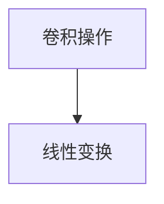

### 附录

#### 附录A：线性代数常用数学公式和定理

线性代数中有许多重要的数学公式和定理，它们为线性代数的理论和应用提供了坚实的基础。

**A.1 矩阵基本公式**

- 矩阵加法：\( A + B = C \)
- 矩阵减法：\( A - B = C \)
- 矩阵乘法：\( AB = C \)
- 矩阵转置：\( A^T \)

**A.2 行列式基本定理**

- 行列式定义：\( \det(A) \)
- 行列式性质：
  - \( \det(A) = \det(A^T) \)
  - \( \det(kA) = k^n \det(A) \)
  - \( \det(AB) = \det(A)\det(B) \)

**A.3 线性方程组解的性质**

- 解的存在性：\( Ax = b \)有唯一解当且仅当矩阵\( A \)可逆。
- 解的结构：\( Ax = b \)的解可以表示为\( x = A^{-1}b + (I - A^{-1}A)t \)，其中\( t \)为任意向量。

**A.4 特征值与特征向量性质**

- 特征值性质：\( \lambda \)是\( A \)的特征值当且仅当\( A\vec{v} = \lambda\vec{v} \)。
- 特征向量性质：特征向量是线性无关的，特征向量空间是\( A \)的不变子空间。

#### 附录B：线性代数在现实世界中的应用案例

线性代数在现实世界中有广泛的应用，以下是一些典型的应用案例。

**B.1 优化问题应用案例**

优化问题在物流和制造领域有着广泛的应用。例如，在物流中，可以通过线性规划来优化运输路径和资源分配，从而降低成本和提高效率。在制造中，可以通过优化生产计划和资源分配来提高生产效率和降低生产成本。

**B.2 信号处理应用案例**

信号处理在通信、音频和图像处理领域有着重要的应用。例如，在通信中，可以通过傅里叶变换来分析信号频率特性，从而实现信号的有效传输。在音频处理中，可以通过滤波器和卷积来实现音频信号的降噪和增强。在图像处理中，可以通过图像变换和滤波来实现图像增强和特征提取。

**B.3 图像处理应用案例**

图像处理在计算机视觉和多媒体技术领域有着重要的应用。例如，在计算机视觉中，可以通过图像特征提取和匹配来实现物体识别和目标跟踪。在多媒体技术中，可以通过图像增强和压缩来实现高质量图像的传输和存储。

### 结语

线性代数是现代科学和工程中的基础工具，它在多个领域中具有广泛的应用。通过本文的介绍，我们深入探讨了线性代数的基础知识、度量空间的基本概念以及线性代数在优化问题、信号处理和图像处理中的应用。希望本文能够为读者提供一个全面而系统的学习框架，帮助读者深入理解线性代数及其在度量空间中的应用。在未来的学习和实践中，读者可以继续探索线性代数的其他应用领域，并将其应用于解决实际问题。

### 作者信息

**作者：AI天才研究院/AI Genius Institute & 禅与计算机程序设计艺术 /Zen And The Art of Computer Programming**

通过本文的撰写，我们不仅回顾了线性代数的基础知识，还深入探讨了度量空间的概念和性质，并展示了线性代数在实际问题中的应用。线性代数作为数学和工程学中的核心工具，其重要性不容忽视。在未来的学习和研究中，读者可以进一步探索线性代数的其他应用领域，并将其应用于解决复杂的实际问题。希望本文能够为读者提供一个有益的学习资源，激发读者对线性代数和度量空间更深入的研究兴趣。

