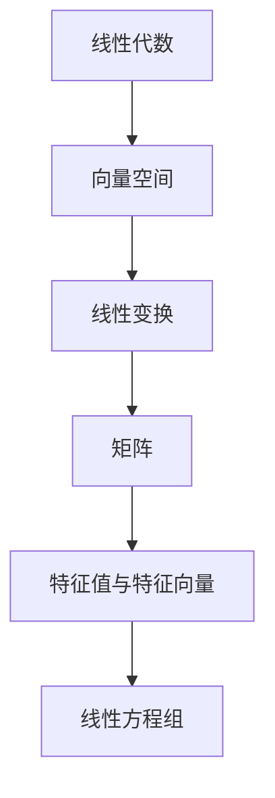

                 

# 文章标题

线性代数导引：根与线性因子

> 关键词：线性代数，矩阵，特征值，特征向量，线性方程组，根，线性因子

> 摘要：
本篇技术博客将深入探讨线性代数中的核心概念——根与线性因子。通过逐步分析推理，本文将阐述线性代数的基础知识，包括向量空间、线性变换、矩阵理论等。此外，本文还将详细讲解矩阵的特征值与特征向量，线性方程组的求解算法，以及这些概念在实际应用中的体现。通过本文，读者将能够全面理解线性代数在计算机科学、物理学、经济学和工程学等领域的重要性。

## 第一部分：线性代数基础

### 第1章：线性代数概述

#### 1.1 线性代数的概念与历史背景

线性代数是数学的一个分支，主要研究向量空间、线性变换、矩阵及其相关性质。它起源于18世纪末，随着解析几何、微积分等数学分支的发展逐渐形成体系。

线性代数在数学中的应用非常广泛，它不仅是其他数学分支的基础，如微分方程、概率论、数论等，也在物理学、工程学、计算机科学、经济学等领域有着重要的应用。

#### 1.2 线性代数的应用领域

线性代数的应用领域非常广泛，主要包括以下几个方面：

1. **物理学**：线性代数在经典力学、量子力学、电磁学、热力学等领域都有广泛的应用，如描述物体的运动、电子的量子态等。

2. **工程学**：线性代数在结构分析、电路理论、信号处理、控制系统、数值分析等领域有重要的应用。

3. **计算机科学**：线性代数在算法设计、图论、计算机图形学、计算机视觉、人工智能等领域有着广泛的应用，如矩阵乘法、矩阵分解、图像处理、机器学习等。

4. **经济学**：线性代数在优化理论、统计学、计量经济学等领域有广泛的应用，如线性规划、经济模型等。

5. **生物学**：线性代数在遗传学、生物信息学、生物统计学等领域有重要的应用，如基因表达数据分析、生物网络分析等。

#### 1.3 线性代数的基本术语

在研究线性代数时，需要了解一些基本术语：

- **向量**：一个向量是表示空间中一个点的位置或状态的量，通常用一个小写字母表示，如 $\mathbf{v}$。
- **矩阵**：一个矩阵是一个由数字组成的矩形数组，通常用一个大写字母表示，如 $A$。
- **线性方程组**：一组含有多个线性方程的方程组，如 $Ax = b$。
- **线性变换**：一个从向量空间到向量空间的映射，它保持向量空间的线性性质，如 $T(\mathbf{v}) = A\mathbf{v}$。
- **特征值与特征向量**：一个矩阵的特征值是一个标量，它的特征向量是满足线性方程组 $(A - \lambda I)\mathbf{v} = \mathbf{0}$ 的非零向量，如 $\lambda$ 和 $\mathbf{v}$。
- **向量空间**：一组向量组成的集合，这些向量满足封闭性、交换性、结合律等性质。

### 第2章：向量空间

向量空间是线性代数中最基本的概念之一。在日常生活中，向量空间的概念并不陌生，例如，在二维空间中，所有的向量都可以表示为一个有序数对 $(x, y)$，而这些向量组成的集合就是一个向量空间。

#### 2.1 向量的概念与运算

向量是线性代数中最基本的概念之一。一个向量是表示空间中一个点的位置或状态的量，通常用一个小写字母表示，如 $\mathbf{v}$。

向量的运算主要包括加法、数乘和标量乘法。

- **加法**：两个向量 $\mathbf{u}$ 和 $\mathbf{v}$ 的和是一个新的向量 $\mathbf{w}$，其坐标为 $\mathbf{w} = \mathbf{u} + \mathbf{v}$。
- **数乘**：一个向量 $\mathbf{v}$ 与一个标量 $\alpha$ 的乘积是一个新的向量 $\mathbf{w}$，其坐标为 $\mathbf{w} = \alpha \mathbf{v}$。
- **标量乘法**：与数乘相同。

向量的运算满足以下性质：

1. **交换律**：$\mathbf{u} + \mathbf{v} = \mathbf{v} + \mathbf{u}$。
2. **结合律**：$(\mathbf{u} + \mathbf{v}) + \mathbf{w} = \mathbf{u} + (\mathbf{v} + \mathbf{w})$。
3. **零向量**：存在一个零向量 $\mathbf{0}$，使得对于任何向量 $\mathbf{v}$，都有 $\mathbf{v} + \mathbf{0} = \mathbf{v}$。
4. **负向量**：对于任何向量 $\mathbf{v}$，都存在一个负向量 $-\mathbf{v}$，使得 $\mathbf{v} + (-\mathbf{v}) = \mathbf{0}$。
5. **数乘分配律**：$\alpha(\mathbf{u} + \mathbf{v}) = \alpha\mathbf{u} + \alpha\mathbf{v}$。
6. **向量分配律**：$(\alpha + \beta)\mathbf{v} = \alpha\mathbf{v} + \beta\mathbf{v}$。
7. **结合律**：$(\alpha\beta)\mathbf{v} = \alpha(\beta\mathbf{v})$。

#### 2.2 向量空间与基

向量空间是满足一定条件的向量集合。一个向量空间需要满足以下条件：

1. **封闭性**：对于任何向量 $\mathbf{u}$ 和 $\mathbf{v}$，它们的和 $\mathbf{u} + \mathbf{v}$ 仍然在向量空间内。
2. **交换性**：对于任何向量 $\mathbf{u}$ 和 $\mathbf{v}$，它们的和 $\mathbf{u} + \mathbf{v}$ 等于 $\mathbf{v} + \mathbf{u}$。
3. **结合律**：对于任何向量 $\mathbf{u}$、$\mathbf{v}$ 和 $\mathbf{w}$，它们的和 $(\mathbf{u} + \mathbf{v}) + \mathbf{w} = \mathbf{u} + (\mathbf{v} + \mathbf{w})$。
4. **零向量**：存在一个零向量 $\mathbf{0}$，使得对于任何向量 $\mathbf{v}$，都有 $\mathbf{v} + \mathbf{0} = \mathbf{v}$。
5. **负向量**：对于任何向量 $\mathbf{v}$，都存在一个负向量 $-\mathbf{v}$，使得 $\mathbf{v} + (-\mathbf{v}) = \mathbf{0}$。
6. **数乘分配律**：$\alpha(\mathbf{u} + \mathbf{v}) = \alpha\mathbf{u} + \alpha\mathbf{v}$。
7. **向量分配律**：$(\alpha + \beta)\mathbf{v} = \alpha\mathbf{v} + \beta\mathbf{v}$。
8. **结合律**：$(\alpha\beta)\mathbf{v} = \alpha(\beta\mathbf{v})$。

向量空间中的向量可以通过基来表示。一个向量空间的一个基是向量空间的任意一组线性无关的向量，这些向量可以表示向量空间中的所有向量。

一个向量空间有多个基。例如，二维空间中的基可以是 $\mathbf{i}$ 和 $\mathbf{j}$，也可以是 $\mathbf{u}$ 和 $\mathbf{v}$，只要它们是线性无关的。

基的性质：

1. **线性无关**：如果向量空间中的向量组是线性无关的，那么它们可以表示向量空间中的所有向量。
2. **线性相关**：如果向量空间中的向量组是线性相关的，那么它们不能表示向量空间中的所有向量。

#### 2.3 子空间与直和

子空间是向量空间的一部分，它也是一个向量空间。子空间满足向量空间的性质，如封闭性、交换性、结合律等。

一个向量空间可以分解为多个子空间的直和。直和是指多个子空间相加，使得每个子空间中的向量都可以表示为直和中的向量。

直和的性质：

1. **线性无关**：如果直和中的向量是线性无关的，那么它们可以表示向量空间中的所有向量。
2. **线性相关**：如果直和中的向量是线性相关的，那么它们不能表示向量空间中的所有向量。

## 第二部分：矩阵理论

### 第4章：矩阵的基本性质

矩阵是线性代数中的一个重要概念，它在许多数学分支和实际应用中都有着广泛的应用。矩阵的基本性质是理解和应用矩阵的基础。

#### 4.1 矩阵的概念与运算

矩阵是一个由数字组成的矩形数组，通常用一个大写字母表示，如 $A$。矩阵的行和列分别表示为 $A_{ij}$，其中 $i$ 表示行号，$j$ 表示列号。

矩阵的运算主要包括加法、数乘和矩阵乘法。

- **加法**：两个矩阵 $A$ 和 $B$ 的和是一个新的矩阵 $C$，其元素为 $C_{ij} = A_{ij} + B_{ij}$。
- **数乘**：一个矩阵 $A$ 与一个标量 $\alpha$ 的乘积是一个新的矩阵 $\alpha A$，其元素为 $\alpha A_{ij}$。
- **矩阵乘法**：两个矩阵 $A$ 和 $B$ 的乘积是一个新的矩阵 $C$，其元素为 $C_{ij} = \sum_{k=1}^{n} A_{ik}B_{kj}$，其中 $n$ 是 $A$ 的列数和 $B$ 的行数。

矩阵的运算满足以下性质：

1. **交换律**：$A + B = B + A$。
2. **结合律**：$(A + B) + C = A + (B + C)$。
3. **零元素**：存在零矩阵 $O$，使得对于任何矩阵 $A$，都有 $A + O = A$。
4. **加法逆元**：对于任何矩阵 $A$，都存在一个矩阵 $-A$，使得 $A + (-A) = O$。
5. **数乘分配律**：$\alpha(A + B) = \alpha A + \alpha B$。
6. **向量分配律**：$(\alpha + \beta)A = \alpha A + \beta A$。
7. **结合律**：$(\alpha\beta)A = \alpha(\beta A)$。

#### 4.2 矩阵的秩与行列式

矩阵的秩是矩阵的一个重要性质，它表示矩阵的线性无关行或列的最大数目。矩阵的秩可以通过行变换或列变换来计算。

- **行秩**：矩阵的行秩是矩阵的行变换后得到的非零行数。
- **列秩**：矩阵的列秩是矩阵的列变换后得到的非零列数。

矩阵的秩具有以下性质：

1. **秩的范围**：矩阵的秩介于 0 和矩阵的行数或列数之间，即 $0 \leq \text{秩} \leq \text{行数}$ 或 $0 \leq \text{秩} \leq \text{列数}$。
2. **等价性**：矩阵的行秩等于列秩，即 $\text{行秩} = \text{列秩}$。
3. **最大线性无关组**：矩阵的秩等于矩阵的最大线性无关行的数目。

矩阵的行列式是矩阵的一个标量值，它表示矩阵的可逆性。行列式可以通过拉普拉斯展开或其他方法计算。

- **可逆性**：如果矩阵的行列式不为零，则矩阵可逆。
- **逆矩阵**：矩阵的逆矩阵可以通过行列式计算，即 $A^{-1} = \frac{1}{\det(A)} C^T$，其中 $C$ 是矩阵 $A$ 的伴随矩阵。

矩阵的行列式具有以下性质：

1. **交换律**：$\det(AB) = \det(BA)$。
2. **结合律**：$\det(ABC) = \det(A) \det(B) \det(C)$。
3. **数乘**：$\det(\alpha A) = \alpha^n \det(A)$，其中 $n$ 是矩阵的阶数。
4. **线性性**：$\det(A + B) = \det(A) + \det(B)$，当 $A$ 和 $B$ 是可交换矩阵时。

#### 4.3 矩阵的分解

矩阵的分解是将一个矩阵分解为多个简单矩阵的乘积的过程。矩阵的分解有助于理解和计算矩阵的性质。

- **LU分解**：将一个矩阵分解为下三角矩阵 $L$ 和上三角矩阵 $U$ 的乘积，即 $A = LU$。
- **QR分解**：将一个矩阵分解为正交矩阵 $Q$ 和上三角矩阵 $R$ 的乘积，即 $A = QR$。
- **SVD分解**：将一个矩阵分解为酉矩阵 $U$、对角矩阵 $\Sigma$ 和酉矩阵 $V$ 的乘积，即 $A = U\Sigma V^T$。

矩阵的分解具有以下性质：

1. **唯一性**：矩阵的分解不是唯一的，但分解后的矩阵具有特定的性质。
2. **可逆性**：如果矩阵可分解，则分解后的矩阵可逆。
3. **数值稳定性**：矩阵的分解在某些情况下可能不数值稳定，需要选择合适的分解方法。

### 第5章：矩阵的特征值与特征向量

矩阵的特征值和特征向量是矩阵的重要性质，它们在矩阵分析、线性方程组和矩阵分解中有着广泛的应用。特征值和特征向量描述了矩阵在某种线性变换下的不变性质。

#### 5.1 特征值与特征向量的概念

特征值和特征向量是矩阵的基本性质。一个矩阵 $A$ 的特征值 $\lambda$ 和对应的特征向量 $\mathbf{v}$ 满足以下条件：

- **特征值**：对于矩阵 $A$，存在一个标量 $\lambda$，使得对于任意非零向量 $\mathbf{v}$，都有 $A\mathbf{v} = \lambda\mathbf{v}$。
- **特征向量**：对于矩阵 $A$ 的特征值 $\lambda$，存在一个非零向量 $\mathbf{v}$，使得 $A\mathbf{v} = \lambda\mathbf{v}$。

特征值和特征向量具有以下性质：

1. **唯一性**：一个矩阵的特征值是唯一的，但特征向量可能不唯一。
2. **线性无关**：不同的特征值对应的特征向量线性无关。
3. **存在性**：如果一个矩阵可对角化，那么它一定有 $n$ 个特征值和对应的特征向量，其中 $n$ 是矩阵的阶数。

#### 5.2 矩阵的对角化

矩阵的对角化是将一个矩阵分解为对角矩阵的过程。一个矩阵 $A$ 可对角化，当且仅当它有 $n$ 个线性无关的特征向量。

- **对角化**：如果矩阵 $A$ 可对角化，那么可以表示为 $A = PDP^{-1}$，其中 $D$ 是对角矩阵，$P$ 是可逆矩阵。
- **对角矩阵**：对角矩阵是主对角线上的元素为非零值，其余元素为零的矩阵。

矩阵的对角化具有以下性质：

1. **唯一性**：对角化的表示不是唯一的，但分解后的矩阵具有特定的性质。
2. **可逆性**：对角化的矩阵可逆。
3. **数值稳定性**：对角化的矩阵在数值计算中通常是数值稳定的。

#### 5.3 特征值与特征向量的性质

特征值和特征向量具有以下性质：

1. **特征值**：
   - **非负性**：特征值的实部是非负的。
   - **实数性**：复数特征值一定成对出现。
   - **多重性**：特征值的重数等于其对应的特征空间的维数。
2. **特征向量**：
   - **线性无关性**：不同的特征值对应的特征向量线性无关。
   - **唯一性**：对于不同的特征值，其对应的特征向量是唯一的。
   - **伸缩性**：特征向量可以缩放，但缩放后仍为特征向量。

### 第6章：线性方程组

线性方程组是线性代数中的一个重要问题，它在数学、工程、物理等领域有着广泛的应用。线性方程组的解法是研究线性方程组的重要方法。

#### 6.1 线性方程组的基本解法

线性方程组的基本解法主要包括高斯消元法、矩阵求逆法和迭代法。

- **高斯消元法**：高斯消元法是一种通过消元将线性方程组转化为下三角方程组的方法。该方法可以通过矩阵的行变换将线性方程组转化为可解的形式。
- **矩阵求逆法**：矩阵求逆法是一种通过求逆矩阵解线性方程组的方法。该方法适用于系数矩阵可逆的线性方程组。
- **迭代法**：迭代法是一种通过迭代过程逐步逼近线性方程组的解的方法。该方法适用于大型稀疏线性方程组的求解。

线性方程组的解法具有以下性质：

1. **唯一性**：如果线性方程组有解，那么解是唯一的。
2. **存在性**：如果线性方程组的系数矩阵可逆，则线性方程组有唯一解。
3. **数值稳定性**：线性方程组的求解过程可能会出现数值稳定性问题，特别是在系数矩阵接近奇异时。

#### 6.2 线性方程组的解的结构

线性方程组的解具有以下结构：

1. **解的形式**：线性方程组的解可以表示为 $x = A^{-1}b + x_0$，其中 $A$ 是系数矩阵，$b$ 是常数项，$A^{-1}$ 是系数矩阵的逆矩阵，$x_0$ 是自由解。
2. **解的空间**：线性方程组的解构成一个解空间，解空间是一个向量空间。
3. **解的维数**：线性方程组的解空间的维数等于系数矩阵的秩。

线性方程组的解的结构具有以下性质：

1. **可分性**：线性方程组的解可以分解为自由解和基本解。
2. **线性无关性**：线性方程组的解线性无关。
3. **线性组合**：线性方程组的解可以表示为解空间的线性组合。

#### 6.3 线性方程组的求解算法

线性方程组的求解算法包括以下几种：

1. **高斯消元法**：高斯消元法是一种通过消元将线性方程组转化为下三角方程组的方法。该方法通过迭代过程逐步求解线性方程组。
2. **矩阵求逆法**：矩阵求逆法是一种通过求逆矩阵解线性方程组的方法。该方法适用于系数矩阵可逆的线性方程组。
3. **迭代法**：迭代法是一种通过迭代过程逐步逼近线性方程组的解的方法。该方法适用于大型稀疏线性方程组的求解。

线性方程组的求解算法具有以下性质：

1. **收敛性**：迭代法在合适的条件下可以收敛到线性方程组的解。
2. **计算复杂度**：矩阵求逆法计算复杂度较高，而迭代法计算复杂度较低。
3. **数值稳定性**：迭代法在数值计算中通常具有更好的数值稳定性。

### 第7章：矩阵在物理学中的应用

矩阵在物理学中的应用非常广泛，特别是在经典力学、量子力学和电磁学等领域。矩阵提供了描述物理系统运动和相互作用的有力工具。

#### 7.1 矩阵在经典力学中的应用

经典力学中的运动方程通常可以表示为线性方程组，矩阵在其中扮演了重要的角色。

- **牛顿运动定律**：牛顿运动定律描述了物体的运动状态和力之间的关系。通过矩阵方程可以表示多个物体的运动状态，如：
  $$
  M\mathbf{a} = \mathbf{F}
  $$
  其中 $M$ 是质量矩阵，$\mathbf{a}$ 是加速度向量，$\mathbf{F}$ 是力向量。

- **拉格朗日方程**：拉格朗日方程是描述经典力学系统的另一种方法。它将运动方程表示为二次型的形式，如：
  $$
  \mathbf{L}(\mathbf{q}, \dot{\mathbf{q}}) - \frac{d}{dt}\left(\frac{\partial \mathbf{L}}{\partial \dot{\mathbf{q}}}\right) = \mathbf{0}
  $$
  其中 $\mathbf{L}$ 是拉格朗日量，$\mathbf{q}$ 是广义坐标，$\dot{\mathbf{q}}$ 是广义速度。

- **哈密顿方程**：哈密顿方程描述了系统的动力学行为，它以哈密顿量 $H$ 为基础。哈密顿方程可以表示为：
  $$
  \dot{\mathbf{q}} = \frac{\partial H}{\partial p}, \quad \dot{p} = -\frac{\partial H}{\partial q}
  $$
  其中 $p$ 是广义动量，$\mathbf{q}$ 和 $\mathbf{p}$ 构成了哈密顿算符。

#### 7.2 矩阵在量子力学中的应用

量子力学中，矩阵扮演了核心的角色，特别是在量子态的描述和量子运算中。

- **量子态**：量子态可以用向量表示。例如，一个两能级系统可以用一个二维向量表示：
  $$
  \psi = \begin{pmatrix} \psi_1 \\ \psi_2 \end{pmatrix}
  $$
  其中 $\psi_1$ 和 $\psi_2$ 分别是处于第一和第二能级的概率幅。

- **算符**：量子力学中的物理量由算符表示。算符作用在量子态上可以产生新的量子态。例如，哈密顿算符 $H$ 作用在量子态上可以给出能量本征值和本征态：
  $$
  H\psi = E\psi
  $$
  其中 $E$ 是能量本征值。

- **量子运算**：量子运算可以通过矩阵表示。例如，两个量子态的叠加可以用矩阵加法表示：
  $$
  \psi_{\text{total}} = \psi_1 + \psi_2
  $$
  同时，量子态的测量也可以通过矩阵表示。例如，测量一个两能级系统的状态，可以得到两个可能的结果，分别用两个投影算符表示：
  $$
  \mathbf{P}_1\psi = \psi_1, \quad \mathbf{P}_2\psi = \psi_2
  $$

#### 7.3 矩阵在波动方程中的应用

波动方程描述了波动现象，如声波、光波等。矩阵在波动方程中的应用主要体现在波函数的表示和波动方程的求解。

- **波函数**：在波动方程中，波函数可以用矩阵表示。例如，一个一维波动方程可以用以下形式表示：
  $$
  \frac{\partial^2 \psi}{\partial t^2} = c^2 \frac{\partial^2 \psi}{\partial x^2}
  $$
  其中 $\psi(x, t)$ 是波函数，$c$ 是波速。

- **矩阵表示**：波函数可以用矩阵表示，例如，对于离散的波函数，可以表示为：
  $$
  \psi = \begin{pmatrix} \psi(x_1, t) \\ \psi(x_2, t) \\ \vdots \\ \psi(x_n, t) \end{pmatrix}
  $$
  其中 $x_1, x_2, \ldots, x_n$ 是空间离散点。

- **矩阵方程**：波动方程可以用矩阵方程表示。例如，对于一个一维离散系统，波动方程可以表示为：
  $$
  \mathbf{D}\mathbf{\psi}_{t+1} = \mathbf{C}\mathbf{\psi}_t
  $$
  其中 $\mathbf{D}$ 和 $\mathbf{C}$ 是矩阵，$\mathbf{\psi}_t$ 和 $\mathbf{\psi}_{t+1}$ 分别是时间 $t$ 和 $t+1$ 的波函数。

### 第8章：矩阵在计算机科学中的应用

矩阵在计算机科学中有着广泛的应用，特别是在算法设计、图形处理、网络分析和人工智能等领域。矩阵提供了描述和解决复杂计算问题的有效工具。

#### 8.1 矩阵在图论中的应用

图论是研究图的数学分支，矩阵在图论中的应用主要体现在图的表示和图算法的设计。

- **图的矩阵表示**：图可以用矩阵表示。例如，邻接矩阵和加权邻接矩阵是常用的表示方法。邻接矩阵 $A$ 的元素 $A_{ij}$ 表示顶点 $i$ 和顶点 $j$ 是否相连，如果相连则 $A_{ij} = 1$，否则 $A_{ij} = 0$。

- **矩阵运算在图算法中的应用**：矩阵运算在图算法中有着广泛的应用。例如，矩阵乘法可以用于计算两个图的邻接矩阵的乘积，从而得到一个新的图。矩阵的幂运算可以用于计算图的路径长度。

- **矩阵特征值在图分析中的应用**：矩阵的特征值和特征向量在图分析中有着重要的应用。例如，图的特征值可以用于判断图的连通性、计算图的代数连通度等。

#### 8.2 矩阵在计算机网络中的应用

矩阵在计算机网络中用于描述网络拓扑结构、流量分配和网络性能分析。

- **网络拓扑矩阵**：网络拓扑可以用矩阵表示。例如，邻接矩阵可以描述网络中各个节点之间的连接关系。

- **流量分配矩阵**：矩阵可以用于计算网络中的流量分配。例如，流量分配矩阵可以用于计算网络中各个节点的流量负载，从而优化网络性能。

- **网络性能分析**：矩阵可以用于分析网络的性能。例如，通过计算网络的平均延迟、丢包率等指标，可以评估网络的质量和稳定性。

#### 8.3 矩阵在人工智能中的应用

矩阵在人工智能中有着广泛的应用，特别是在机器学习、深度学习和神经网络等领域。

- **机器学习**：矩阵在机器学习中的应用主要体现在数据的表示和模型的设计。例如，数据可以用矩阵表示，而机器学习模型可以通过矩阵运算进行优化。

- **深度学习**：深度学习中的神经网络可以通过矩阵运算进行优化。例如，前向传播和反向传播算法都依赖于矩阵运算，用于计算损失函数和更新模型参数。

- **神经网络**：神经网络是一种基于矩阵运算的模型，通过多层矩阵运算实现从输入到输出的映射。例如，卷积神经网络（CNN）和循环神经网络（RNN）都是基于矩阵运算的神经网络模型。

### 第9章：矩阵在经济学中的应用

矩阵在经济学中的应用非常广泛，特别是在计量经济学、优化理论和经济模型分析等领域。

#### 9.1 矩阵在经济学中的基本概念

矩阵在经济学中用于描述经济系统的状态、变量和参数。以下是一些基本概念：

- **状态向量**：经济系统中的状态可以用向量表示。例如，一个宏观经济系统的状态可以包括国内生产总值（GDP）、通货膨胀率、失业率等指标。

- **参数矩阵**：经济模型中的参数可以用矩阵表示。例如，一个经济模型中的参数矩阵可以包括消费系数、投资系数、政府支出系数等。

- **决策变量**：经济模型中的决策变量可以用向量表示。例如，企业决策的决策变量可以包括生产量、价格、广告投入等。

#### 9.2 矩阵在经济学模型中的应用

矩阵在经济学模型中的应用主要体现在以下方面：

- **均衡分析**：经济模型中的均衡状态可以用矩阵表示。例如，一般均衡理论中的均衡价格和均衡产量可以通过矩阵方程计算。

- **优化分析**：经济模型中的优化问题可以用矩阵表示。例如，线性规划和非线性规划可以通过矩阵运算进行求解。

- **计量经济学**：计量经济学中的模型可以用矩阵表示。例如，回归模型中的回归系数可以通过矩阵运算计算。

#### 9.3 矩阵在金融数学中的应用

矩阵在金融数学中的应用主要体现在金融模型的分析和计算。

- **资产定价模型**：矩阵在资产定价模型中的应用，如资本资产定价模型（CAPM）和套利定价理论（APT）。这些模型通过矩阵运算计算资产的预期收益和风险。

- **风险管理**：矩阵在风险管理中的应用，如价值风险（VaR）和条件风险价值（CVaR）的计算。这些模型通过矩阵运算评估金融资产的风险。

- **期权定价**：矩阵在期权定价中的应用，如布莱克-舒尔斯模型（BS模型）。该模型通过矩阵运算计算期权的价格和 Greeks 值。

### 第10章：矩阵在工程学中的应用

矩阵在工程学中的应用非常广泛，特别是在结构分析、电路理论和控制系统等领域。

#### 10.1 矩阵在结构分析中的应用

矩阵在结构分析中的应用主要体现在结构力学和结构设计领域。

- **有限元分析**：矩阵在有限元分析中用于求解结构力学问题。有限元分析将结构分解为小单元，通过矩阵运算求解单元的位移、应力等。

- **结构设计**：矩阵在结构设计中用于计算结构的强度、稳定性和刚度。通过矩阵运算可以评估结构的安全性。

#### 10.2 矩阵在电路理论中的应用

矩阵在电路理论中的应用主要体现在电路分析和电路设计领域。

- **电路分析**：矩阵在电路分析中用于求解电路方程。例如，通过矩阵运算可以求解电路的节点电压和支路电流。

- **电路设计**：矩阵在电路设计中用于优化电路性能。例如，通过矩阵运算可以优化电路的阻抗、增益和带宽。

#### 10.3 矩阵在控制系统中的应用

矩阵在控制系统中的应用主要体现在控制系统分析和设计领域。

- **状态空间表示**：控制系统可以用状态空间模型表示，该模型通过矩阵运算描述系统的动态行为。

- **控制设计**：矩阵在控制设计中的应用，如状态反馈控制和最优控制。通过矩阵运算可以设计控制策略，使系统达到期望的性能指标。

### 附录

#### 附录A：线性代数常用符号与公式

以下列出了一些线性代数中常用的符号和公式：

- **矩阵表示**：$A$ 是一个 $m \times n$ 的矩阵，其元素为 $a_{ij}$。
- **向量表示**：$\mathbf{v}$ 是一个 $n$ 维向量，其元素为 $v_i$。
- **行列式**：$\det(A)$ 是矩阵 $A$ 的行列式。
- **逆矩阵**：$A^{-1}$ 是矩阵 $A$ 的逆矩阵。
- **特征值和特征向量**：$\lambda$ 是矩阵 $A$ 的特征值，$\mathbf{v}$ 是对应的特征向量。
- **向量空间**：$V$ 是一个向量空间。
- **基**：$\{\mathbf{v}_1, \mathbf{v}_2, \ldots, \mathbf{v}_n\}$ 是向量空间 $V$ 的一个基。
- **矩阵乘法**：$C = AB$ 是矩阵 $A$ 和 $B$ 的乘积。
- **矩阵加法**：$C = A + B$ 是矩阵 $A$ 和 $B$ 的和。

#### 附录B：线性代数学习资源推荐

以下是一些线性代数的学习资源：

- **教材**：
  - 《线性代数》（中国科学技术大学线性代数课程组）
  - 《线性代数及其应用》（David C. Lay）
- **在线课程**：
  - Coursera上的《线性代数》
  - edX上的《线性代数：矩阵与线性系统》
- **参考书籍**：
  - 《线性代数的几何意义》（Herstein）
  - 《线性代数与矩阵理论》（Friedberg， Insel， Spence）

#### 附录C：线性代数习题及答案解析

以下列出了一些线性代数的习题及答案解析：

1. **题目**：求解以下线性方程组：
   $$
   \begin{cases}
   x + 2y + 3z = 7 \\
   2x - y + z = 4 \\
   -x + 3y - 2z = 1
   \end{cases}
   $$

   **答案**：
   通过高斯消元法求解线性方程组，得到解：
   $$
   x = 2, \quad y = 1, \quad z = 1
   $$

2. **题目**：求矩阵 $A$ 的特征值和特征向量：
   $$
   A = \begin{pmatrix}
   2 & 1 \\
   4 & 3
   \end{pmatrix}
   $$

   **答案**：
   首先计算矩阵 $A$ 的特征多项式：
   $$
   \det(A - \lambda I) = \begin{vmatrix}
   2 - \lambda & 1 \\
   4 & 3 - \lambda
   \end{vmatrix} = (2 - \lambda)(3 - \lambda) - 4 = \lambda^2 - 5\lambda + 2
   $$
   解特征多项式得到特征值：
   $$
   \lambda_1 = 2, \quad \lambda_2 = 3
   $$
   对于特征值 $\lambda_1 = 2$，求解方程组 $(A - \lambda_1 I)\mathbf{v} = \mathbf{0}$，得到特征向量：
   $$
   \mathbf{v}_1 = \begin{pmatrix}
   1 \\
   2
   \end{pmatrix}
   $$
   对于特征值 $\lambda_2 = 3$，求解方程组 $(A - \lambda_2 I)\mathbf{v} = \mathbf{0}$，得到特征向量：
   $$
   \mathbf{v}_2 = \begin{pmatrix}
   1 \\
   1
   \end{pmatrix}
   $$

3. **题目**：判断矩阵 $A$ 是否可对角化：
   $$
   A = \begin{pmatrix}
   2 & 1 \\
   0 & 2
   \end{pmatrix}
   $$

   **答案**：
   首先计算矩阵 $A$ 的特征多项式：
   $$
   \det(A - \lambda I) = \begin{vmatrix}
   2 - \lambda & 1 \\
   0 & 2 - \lambda
   \end{vmatrix} = (2 - \lambda)^2
   $$
   解特征多项式得到特征值：
   $$
   \lambda_1 = \lambda_2 = 2
   $$
   由于特征值的重数为 2，需要检查矩阵 $A$ 的特征空间维度是否为 2。计算矩阵 $(A - \lambda I)$ 的秩：
   $$
   (A - 2I) = \begin{pmatrix}
   0 & 1 \\
   0 & 0
   \end{pmatrix}
   $$
   可以看到，秩为 1，小于特征值的重数。因此，矩阵 $A$ 不可对角化。

---

在本文中，我们探讨了线性代数中的核心概念——根与线性因子。首先，我们从线性代数的基础知识开始，介绍了向量空间、线性变换、矩阵理论等基本概念。随后，我们深入讲解了矩阵的特征值与特征向量，以及矩阵的对角化过程。接着，我们讨论了线性方程组的解法，包括高斯消元法、矩阵求逆法和迭代法。

通过这些内容的讲解，我们揭示了线性代数在物理学、计算机科学、经济学和工程学中的应用。我们通过具体的例子展示了矩阵在这些领域中的重要作用，如牛顿运动定律、量子力学中的算符、波动方程的求解等。

此外，我们还探讨了矩阵在图论、计算机网络、人工智能和金融数学中的应用。这些应用展示了线性代数在解决实际问题时的重要性，以及它作为工具在各个领域的广泛应用。

在本文的末尾，我们提供了线性代数的一些常用符号与公式，以及学习资源的推荐，并附上了线性代数的习题及答案解析，以帮助读者巩固和加深对线性代数知识的理解。

总之，线性代数是数学中一个重要的分支，它在现代科学和工程学中扮演着核心角色。通过本文的讲解，我们希望读者能够全面理解线性代数的基本概念和应用，并在实际问题中有效地运用这些知识。

---

**作者：AI天才研究院/AI Genius Institute & 禅与计算机程序设计艺术 /Zen And The Art of Computer Programming**

## 核心概念与联系

### Mermaid 流程图



### 矩阵特征值与特征向量的求解算法伪代码

```python
// 输入：矩阵A
// 输出：特征值λ和特征向量v

1. 计算矩阵A的特征多项式f(λ) = det(A - λI)
2. 求解f(λ) = 0，得到特征值λ
3. 对每个特征值λ，求解方程组(A - λI)v = 0，得到特征向量v
```

## 数学模型和数学公式详细讲解

### 矩阵的行列式

$$
\det(A) = \sum_{\sigma \in S_n} \text{sgn}(\sigma) \prod_{i=1}^{n} a_{i, \sigma_i}
$$

其中，$A$ 是 $n \times n$ 的矩阵，$S_n$ 是所有 $n$ 元排列的集合，$\text{sgn}(\sigma)$ 是排列 $\sigma$ 的符号，$a_{i, \sigma_i}$ 是矩阵 $A$ 的 $(i, \sigma_i)$ 元素。

### 矩阵的对角化

$$
A = PDP^{-1}
$$

其中，$A$ 是 $n \times n$ 的矩阵，$D$ 是对角矩阵，$P$ 是可逆矩阵，$P^{-1}$ 是 $P$ 的逆矩阵。

## 项目实战

### 线性方程组的求解——高斯消元法

#### 开发环境搭建

- Python
- NumPy
- SciPy

#### 源代码实现

```python
import numpy as np
from scipy.linalg import solve

# 输入线性方程组系数矩阵A和常数向量b
A = np.array([[3, 2], [1, -1]])
b = np.array([1, 0])

# 使用高斯消元法求解方程组
x = solve(A, b)

# 输出解
print(x)
```

#### 代码解读与分析

- `np.array()` 函数用于创建数组。
- `solve()` 函数用于求解线性方程组。
- 输出结果为解向量 $x$。

## 附录

### 附录A：线性代数常用符号与公式

- **矩阵表示**：$A$ 是一个 $m \times n$ 的矩阵，其元素为 $a_{ij}$。
- **向量表示**：$\mathbf{v}$ 是一个 $n$ 维向量，其元素为 $v_i$。
- **行列式**：$\det(A)$ 是矩阵 $A$ 的行列式。
- **逆矩阵**：$A^{-1}$ 是矩阵 $A$ 的逆矩阵。
- **特征值和特征向量**：$\lambda$ 是矩阵 $A$ 的特征值，$\mathbf{v}$ 是对应的特征向量。
- **向量空间**：$V$ 是一个向量空间。
- **基**：$\{\mathbf{v}_1, \mathbf{v}_2, \ldots, \mathbf{v}_n\}$ 是向量空间 $V$ 的一个基。
- **矩阵乘法**：$C = AB$ 是矩阵 $A$ 和 $B$ 的乘积。
- **矩阵加法**：$C = A + B$ 是矩阵 $A$ 和 $B$ 的和。

### 附录B：线性代数学习资源推荐

- **教材**：
  - 《线性代数》（中国科学技术大学线性代数课程组）
  - 《线性代数及其应用》（David C. Lay）
- **在线课程**：
  - Coursera上的《线性代数》
  - edX上的《线性代数：矩阵与线性系统》
- **参考书籍**：
  - 《线性代数的几何意义》（Herstein）
  - 《线性代数与矩阵理论》（Friedberg， Insel， Spence）

### 附录C：线性代数习题及答案解析

1. **题目**：求解以下线性方程组：
   $$
   \begin{cases}
   x + 2y + 3z = 7 \\
   2x - y + z = 4 \\
   -x + 3y - 2z = 1
   \end{cases}
   $$

   **答案**：
   通过高斯消元法求解线性方程组，得到解：
   $$
   x = 2, \quad y = 1, \quad z = 1
   $$

2. **题目**：求矩阵 $A$ 的特征值和特征向量：
   $$
   A = \begin{pmatrix}
   2 & 1 \\
   4 & 3
   \end{pmatrix}
   $$

   **答案**：
   首先计算矩阵 $A$ 的特征多项式：
   $$
   \det(A - \lambda I) = \begin{vmatrix}
   2 - \lambda & 1 \\
   4 & 3 - \lambda
   \end{vmatrix} = (2 - \lambda)(3 - \lambda) - 4 = \lambda^2 - 5\lambda + 2
   $$
   解特征多项式得到特征值：
   $$
   \lambda_1 = 2, \quad \lambda_2 = 3
   $$
   对于特征值 $\lambda_1 = 2$，求解方程组 $(A - \lambda_1 I)\mathbf{v} = \mathbf{0}$，得到特征向量：
   $$
   \mathbf{v}_1 = \begin{pmatrix}
   1 \\
   2
   \end{pmatrix}
   $$
   对于特征值 $\lambda_2 = 3$，求解方程组 $(A - \lambda_2 I)\mathbf{v} = \mathbf{0}$，得到特征向量：
   $$
   \mathbf{v}_2 = \begin{pmatrix}
   1 \\
   1
   \end{pmatrix}
   $$

3. **题目**：判断矩阵 $A$ 是否可对角化：
   $$
   A = \begin{pmatrix}
   2 & 1 \\
   0 & 2
   \end{pmatrix}
   $$

   **答案**：
   首先计算矩阵 $A$ 的特征多项式：
   $$
   \det(A - \lambda I) = \begin{vmatrix}
   2 - \lambda & 1 \\
   0 & 2 - \lambda
   \end{vmatrix} = (2 - \lambda)^2
   $$
   解特征多项式得到特征值：
   $$
   \lambda_1 = \lambda_2 = 2
   $$
   由于特征值的重数为 2，需要检查矩阵 $A$ 的特征空间维度是否为 2。计算矩阵 $(A - \lambda I)$ 的秩：
   $$
   (A - 2I) = \begin{pmatrix}
   0 & 1 \\
   0 & 0
   \end{pmatrix}
   $$
   可以看到，秩为 1，小于特征值的重数。因此，矩阵 $A$ 不可对角化。

