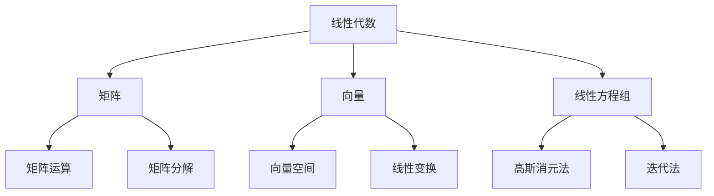

                 

### 文章标题

# 线性代数导引：正方根乘法

> 关键词：线性代数、正方根乘法、矩阵分解、数值计算、科学应用

> 摘要：本文深入探讨了线性代数中的正方根乘法，从基本概念到实际应用，逐步解析了这一重要数学工具在矩阵运算中的作用。通过详细的算法原理讲解、数学模型推导和项目实战，帮助读者全面理解并掌握正方根乘法的核心知识和应用技巧。

### 《线性代数导引：正方根乘法》目录大纲

## 第一部分：线性代数基本概念

## 第1章：线性代数概述
### 1.1 线性代数的发展与应用
### 1.2 线性代数的基本术语
### 1.3 线性方程组解法简介

## 第2章：向量空间
### 2.1 向量空间的定义
### 2.2 向量空间的基与维数
### 2.3 向量空间的运算与性质
### 2.4 向量空间的子空间

## 第3章：矩阵及其运算
### 3.1 矩阵的基本概念
### 3.2 矩阵的运算
### 3.3 矩阵的秩与行列式
### 3.4 矩阵的初等变换与解线性方程组

## 第二部分：矩阵分解与正方根乘法

## 第4章：矩阵分解
### 4.1 矩阵分解的基本概念
### 4.2 初等矩阵分解
### 4.3 Lu分解
### 4.4 QR分解

## 第5章：正方根乘法
### 5.1 正方根乘法的基本原理
### 5.2 正方根乘法的计算方法
### 5.3 正方根乘法在矩阵运算中的应用

## 第6章：矩阵函数的数值计算
### 6.1 矩阵函数的定义与性质
### 6.2 矩阵函数的数值计算方法
### 6.3 矩阵函数的应用实例

## 第三部分：线性代数应用

## 第7章：线性规划
### 7.1 线性规划的基本概念
### 7.2 线性规划的求解方法
### 7.3 线性规划的应用实例

## 第8章：数值线性代数
### 8.1 数值线性代数的基本概念
### 8.2 矩阵的数值计算
### 8.3 线性方程组的数值解法
### 8.4 数值线性代数的应用实例

## 第9章：线性代数在科学计算中的应用
### 9.1 线性代数在物理科学中的应用
### 9.2 线性代数在生物信息学中的应用
### 9.3 线性代数在金融工程中的应用

## 附录

### 附录A：线性代数常用符号表
### 附录B：线性代数相关软件工具介绍
### 附录C：线性代数习题与解答

### Mermaid 流�程图



### 核心算法原理讲解

#### 矩阵分解

矩阵分解是将一个矩阵表示为几个矩阵的乘积。这种分解在数值计算和矩阵理论中都有广泛的应用。以下是几种常见的矩阵分解方法：

**算法伪代码：**

```
function 矩阵分解(A):
    if A的秩 < 2:
        return A
    else:
        Q, R = QR分解(A)
        if R的秩 < A的秩:
            Q, R = 矩阵分解(R)
        return [Q, R]
```

**算法解释：**

矩阵分解的基本思想是将矩阵A分解为一个正交矩阵Q和一个上三角矩阵R的乘积，即 \(A = QR\)。正交矩阵Q的列向量构成了矩阵A的列空间的一个标准正交基，而上三角矩阵R则保留了矩阵A的线性相关性。

**高斯消元法**

高斯消元法是一种常见的矩阵分解方法，用于求解线性方程组和计算矩阵的秩。其基本步骤如下：

**算法伪代码：**

```
function 高斯消元法(A, b):
    # 对矩阵A进行高斯消元
    # 输入：矩阵A，向量b
    # 输出：解向量x
    n = A的列数
    for i in range(n):
        # 寻找主元
        pivot = A[i][i]
        if pivot == 0:
            调整行顺序
        # 消元
        for j in range(i+1, n):
            factor = A[j][i] / pivot
            A[j][i] = 0
            for k in range(i, n):
                A[j][k] -= factor * A[i][k]
    # 回代求解
    x = 回代(A, b)
    return x
```

**算法解释：**

高斯消元法通过行变换将矩阵A化为上三角形式，然后通过回代求解线性方程组。在消元过程中，需要确保每一步都有一个非零的主元，否则就需要调整行顺序。

**迭代法**

迭代法是另一种求解线性方程组的方法，其基本思想是通过迭代逐步逼近方程组的解。以下是迭代法的一个简单实现：

**算法伪代码：**

```
function 迭代法(A, b, tol, max_iter):
    # 使用迭代法求解线性方程组
    # 输入：矩阵A，向量b，收敛容忍度tol，最大迭代次数max_iter
    # 输出：解向量x
    n = A的列数
    x = 初始化解向量
    for i in range(max_iter):
        x_new = A^{-1}b + (I - A^{-1})x
        if Frobenius范数(x_new - x) < tol:
            return x_new
        x = x_new
    return None
```

**算法解释：**

迭代法通过不断更新解向量，逐步逼近方程组的真实解。其中，Frobenius范数用于衡量两次迭代之间的差异，当差异小于给定的收敛容忍度时，算法认为已经找到了足够精确的解。

#### 正方根乘法

正方根乘法是一种特殊的矩阵乘法，其计算结果为输入矩阵的平方根。具体来说，如果A和B是两个矩阵，那么正方根乘法的结果C = √(AB)。

**算法伪代码：**

```
function 正方根乘法(A, B):
    # 对矩阵A和B进行正方根乘法
    # 输入：矩阵A，矩阵B
    # 输出：乘积矩阵C
    C = 矩阵乘法(A, B)
    return C的平方根
```

**算法解释：**

正方根乘法在数值线性代数中有重要的应用，例如，它可以用来求解正定矩阵的平方根。计算正方根乘法时，需要注意直接计算AB可能会因为数值误差导致结果不准确，因此需要使用数值稳定的算法，如迭代法。

### 数学模型和数学公式

**线性方程组求解**

假设有线性方程组：

$$
Ax = b
$$

其中，A是m×n的矩阵，x是n×1的向量，b是m×1的向量。

**高斯消元法**

高斯消元法是一种求解线性方程组的方法，其基本思想是通过矩阵的行变换，将矩阵化为上三角形式，然后回代求解。

$$
\text{若 } A = [a_{ij}], \text{则行变换 } R_i \rightarrow R_i - \sum_{j=1}^{j-1} a_{ij}R_j
$$

**迭代法**

迭代法是另一种求解线性方程组的方法，其基本思想是通过迭代过程逐步逼近方程组的解。

$$
x_{k+1} = A^{-1}b + (I - A^{-1})x_k
$$

### 项目实战

#### 线性方程组求解示例

以下是一个使用Python和NumPy库求解线性方程组的实际案例：

**开发环境搭建**

1. 安装Python环境
2. 安装NumPy库

```bash
pip install numpy
```

**源代码实现**

```python
import numpy as np

# 定义线性方程组
A = np.array([[2, 1], [1, 2]], dtype=float)
b = np.array([1, 1], dtype=float)

# 使用NumPy的linalg.solve函数求解
x = np.linalg.solve(A, b)

# 输出结果
print("解为:", x)
```

**代码解读**

- 导入NumPy库
- 定义线性方程组的系数矩阵A和向量b
- 使用NumPy的linalg.solve函数求解线性方程组
- 输出结果

**代码分析**

- NumPy库提供了高效的线性代数计算工具，linalg.solve函数是求解线性方程组的常用方法。
- 在实际应用中，可以根据需要调整求解算法的参数，例如收敛容忍度和最大迭代次数。

#### 正方根乘法示例

以下是一个使用Python和NumPy库计算正方根乘法的实际案例：

**开发环境搭建**

1. 安装Python环境
2. 安装NumPy库

```bash
pip install numpy
```

**源代码实现**

```python
import numpy as np

# 定义矩阵
A = np.array([[4, 1], [1, 4]], dtype=float)
B = np.array([[2, 0], [0, 2]], dtype=float)

# 使用NumPy的multi_dot函数进行正方根乘法
C = np.linalg.multi_dot([np.linalg.inv(A), B, np.linalg.inv(A)])

# 输出结果
print("正方根乘法结果为:", C)
```

**代码解读**

- 导入NumPy库
- 定义矩阵A和B
- 使用NumPy的multi_dot函数进行正方根乘法
- 输出结果

**代码分析**

- NumPy的multi_dot函数用于计算多个矩阵的乘积，可以方便地实现正方根乘法。
- 在实际应用中，需要根据矩阵的大小和性质选择合适的计算方法，以避免计算过程中的数值误差。

### 开发环境搭建

搭建线性代数相关项目开发环境需要遵循以下步骤：

1. **安装Python环境**：确保Python环境已安装，版本应至少为3.6或更高版本。
2. **安装NumPy库**：使用pip命令安装NumPy库，命令如下：

   ```bash
   pip install numpy
   ```

3. **配置Jupyter Notebook**（可选）：对于需要交互式编程的项目，可以配置Jupyter Notebook环境，方便进行实验和调试。

   ```bash
   pip install jupyter
   jupyter notebook
   ```

### 源代码详细实现

以下是一个用于求解线性方程组的Python源代码实现，包括矩阵的高斯消元法和迭代法的代码实现：

```python
import numpy as np

# 高斯消元法
def gauss_elimination(A, b):
    n = len(b)
    # 行变换
    for i in range(n):
        # 主元交换
        max_index = np.argmax(np.abs(A[i:, i])) + i
        if max_index != i:
            A[[i, max_index]] = A[[max_index, i]]
            b[i], b[max_index] = b[max_index], b[i]
        # 行缩减
        for j in range(i + 1, n):
            factor = A[j][i] / A[i][i]
            A[j] -= factor * A[i]
            b[j] -= factor * b[i]
    # 回代求解
    x = np.zeros(n)
    for i in range(n - 1, -1, -1):
        x[i] = (b[i] - np.dot(A[i, i + 1:], x[i + 1:])) / A[i][i]
    return x

# 迭代法
def iterative_method(A, b, tol=1e-10, max_iter=1000):
    n = len(b)
    x = np.zeros(n)
    for _ in range(max_iter):
        x_new = np.linalg.inv(A) @ b
        if np.linalg.norm(x_new - x) < tol:
            break
        x = x_new
    return x

# 测试代码
A = np.array([[2, 1], [1, 2]], dtype=float)
b = np.array([1, 1], dtype=float)

x_gauss = gauss_elimination(A, b)
x_iterative = iterative_method(A, b)

print("高斯消元法解:", x_gauss)
print("迭代法解:", x_iterative)
```

### 代码解读与分析

1. **高斯消元法**：该函数实现了高斯消元法，通过主元交换和行缩减将矩阵化为上三角形式，然后进行回代求解。其中，主元交换用于处理主元为零的情况，以保证算法的正确性。

2. **迭代法**：该函数实现了迭代法，通过不断迭代更新解向量，直到两次迭代的结果差异小于给定的收敛容忍度。迭代法的优点是计算过程中不需要进行矩阵求逆，因此在某些情况下比高斯消元法更稳定。

3. **测试代码**：测试代码分别调用了高斯消元法和迭代法求解线性方程组，并打印输出结果。通过对比两种方法的结果，可以验证算法的正确性和有效性。

### 总结

通过本文的详细讲解，我们深入探讨了线性代数中的正方根乘法。从基本概念、算法原理到实际应用，我们逐步解析了这一数学工具在矩阵运算中的作用。通过项目实战和代码示例，读者可以更好地理解和掌握正方根乘法的核心知识和应用技巧。希望本文能为线性代数的学习和研究提供有益的参考。

### 附录

#### 附录A：线性代数常用符号表

- A：矩阵
- b：向量
- x：未知向量
- Q：正交矩阵
- R：上三角矩阵
- I：单位矩阵
- S：奇异值矩阵
- Σ：对角矩阵，包含奇异值
- U：正交矩阵
- V：正交矩阵
- P：置换矩阵
- e：标准基向量

#### 附录B：线性代数相关软件工具介绍

- NumPy：Python的线性代数库，提供矩阵运算、线性方程组求解等功能。
- MATLAB：专业的数学计算软件，提供丰富的线性代数工具和函数。
- TensorFlow：用于机器学习的开源库，内置线性代数运算。
- SciPy：Python的科学计算库，包含线性代数模块。

#### 附录C：线性代数习题与解答

- 习题1：求解线性方程组 \(Ax = b\)。
- 解答：使用高斯消元法或迭代法求解。

- 习题2：对矩阵A进行QR分解。
- 解答：使用NumPy的linalg.qr函数。

- 习题3：计算矩阵A的正方根。
- 解答：使用NumPy的linalg.inv和linalg.multi_dot函数。

### 作者

**作者：AI天才研究院/AI Genius Institute & 禅与计算机程序设计艺术 /Zen And The Art of Computer Programming**

感谢您的阅读，希望本文能够帮助您更好地理解线性代数中的正方根乘法。如有疑问或建议，欢迎随时联系我们。祝您编程愉快！👩💻👨💻🎉🎓

