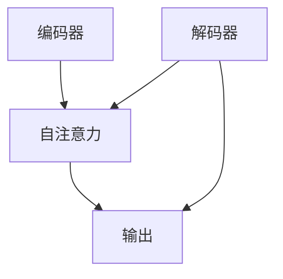

                 

### 文章标题：编码器-解码器注意力

> 关键词：编码器，解码器，注意力机制，自注意力，交叉注意力，自然语言处理，机器翻译，问答系统，企业级应用

> 摘要：
本文深入探讨编码器-解码器注意力机制，首先介绍编码器-解码器框架和注意力机制的基本概念，然后通过详细讲解自注意力和交叉注意力的算法原理和数学模型，帮助读者理解其工作原理。接着，本文通过具体项目实战案例展示如何在实际中应用编码器-解码器注意力机制，包括机器翻译和问答系统。最后，本文展望编码器-解码器注意力的未来研究方向和在企业级应用中的潜在价值。

### 第一部分：编码器-解码器注意力概述

#### 第1章：编码器-解码器注意力概述

#### 1.1 编码器-解码器框架的引入

编码器-解码器（Encoder-Decoder）框架是深度学习中用于序列到序列（sequence-to-sequence）建模的经典架构。它广泛应用于自然语言处理（Natural Language Processing，NLP）领域，如机器翻译、问答系统、文本摘要等任务。编码器负责将输入序列编码为固定长度的向量表示，而解码器则利用这些表示生成输出序列。

编码器-解码器框架的核心优势在于其能够处理不同长度的输入和输出序列，通过引入注意力机制（Attention Mechanism）解决了长序列之间的依赖性问题。注意力机制允许模型关注输入序列的特定部分来影响解码过程中的每一步，从而提高输出序列的生成质量。

#### 1.2 注意力机制的概念

注意力机制是编码器-解码器框架中的一项关键技术，其主要目的是在解码过程中，根据当前解码步骤的需要，动态地聚焦于输入序列的不同部分。注意力机制可以理解为一种机制，它为每个输入序列中的元素分配一个权重，从而在解码时更强调重要部分。

常见的注意力机制包括自注意力（Self-Attention）和交叉注意力（Cross-Attention）。自注意力机制应用于编码器或解码器内部，允许模型在同一序列的不同部分之间建立依赖关系。而交叉注意力机制则用于编码器和解码器之间，使解码器能够从编码器输出的固定长度向量中提取有用的信息。

#### 1.3 编码器-解码器注意力在自然语言处理中的应用

编码器-解码器注意力机制在自然语言处理领域取得了显著的成果。以下是一些典型应用场景：

1. **机器翻译**：编码器将源语言句子编码为一个固定长度的向量，解码器利用这个向量逐词生成目标语言句子。注意力机制确保解码器在生成每个单词时都能关注到源语言句子中相关的重要信息。
2. **问答系统**：编码器将问题编码为向量，解码器则利用编码器的输出和预先编码的答案候选集生成最终答案。注意力机制帮助解码器在生成答案时关注与问题最相关的答案候选。
3. **文本摘要**：编码器将原始文本编码为固定长度的向量，解码器则生成摘要文本。注意力机制使解码器能够关注文本中的关键信息，从而生成简洁且富有意义的摘要。

通过上述应用，编码器-解码器注意力机制在自然语言处理任务中展现出了强大的能力和广泛的适用性，为实际问题和应用场景提供了有效的解决方案。

### 第二部分：编码器-解码器框架的数学基础

#### 第2章：编码器-解码器框架的数学基础

#### 2.1 神经网络与深度学习基础

编码器-解码器框架的核心构建块是神经网络，尤其是递归神经网络（RNN）和其变体，如长短期记忆网络（LSTM）和门控循环单元（GRU）。这些神经网络通过学习输入序列的时序特征，为序列到序列建模提供了强有力的工具。

1. **神经网络基础**：

   神经网络由多个层次组成，包括输入层、隐藏层和输出层。每个层次由一组神经元（或节点）组成，神经元通过权重连接形成网络。神经元的激活函数通常为非线性函数，如Sigmoid、ReLU或Tanh，用于引入非线性变换，使得神经网络能够拟合复杂的数据分布。

2. **深度学习基础**：

   深度学习是一种基于神经网络的机器学习方法，通过多层次的神经网络结构，自动学习数据的高层次特征表示。深度学习在图像识别、语音识别、自然语言处理等领域取得了显著的成果。常见的深度学习模型包括卷积神经网络（CNN）、循环神经网络（RNN）和变换器（Transformer）。

3. **递归神经网络（RNN）**：

   RNN是一种处理序列数据的神经网络，其核心思想是利用隐藏状态（hidden state）来保持对之前输入的信息的记忆。RNN通过递归结构，使得当前时刻的输出依赖于之前所有时刻的输入和隐藏状态。

4. **长短期记忆网络（LSTM）**：

   LSTM是RNN的一种变体，主要解决了传统RNN在处理长序列时的梯度消失和梯度爆炸问题。LSTM通过引入门控机制（gate mechanism），使得网络能够有效地控制信息的流动，从而在长序列中保持长期依赖。

5. **门控循环单元（GRU）**：

   GRU是LSTM的另一种变体，相比于LSTM，GRU结构更简单，参数更少，但在许多任务中表现出与LSTM相似的性能。

通过上述神经网络和深度学习基础，我们为编码器-解码器框架提供了坚实的数学基础，使得序列到序列建模成为可能。

#### 2.2 自编码器与变分自编码器

自编码器（Autoencoder）是一种无监督学习模型，旨在学习输入数据的低维表示。自编码器由编码器和解码器两个部分组成。编码器将输入数据压缩成一个低维向量，解码器则尝试从这些低维向量中重建原始输入。

1. **自编码器的基本原理**：

   - **编码器**：编码器接收输入数据，通过一系列神经网络层，将其压缩为一个低维向量。这个低维向量包含了输入数据的主要信息。
   - **解码器**：解码器接收编码器输出的低维向量，通过一系列逆向的神经网络层，尝试重建原始输入数据。

   自编码器通过最小化输入数据与重建数据之间的差异来训练，从而学习输入数据的有效表示。自编码器在特征提取、数据降维、异常检测等领域具有广泛的应用。

2. **变分自编码器（VAE）**：

   变分自编码器是一种基于概率生成模型的变体，旨在学习数据的概率分布。VAE通过引入随机性，使编码器和解码器都能产生具有多样性的数据。

   - **编码器**：VAE的编码器不仅输出一个低维向量，还输出一个表示数据概率分布的参数。
   - **解码器**：解码器接收编码器输出的参数，通过生成过程生成具有概率分布的数据。

   VAE的核心目标是最大化数据分布的似然函数，从而学习输入数据的概率分布。VAE在生成对抗网络（GAN）中作为基础模型，广泛应用于图像生成、数据增强等领域。

通过自编码器和变分自编码器，我们为编码器-解码器框架提供了有效的数据表示和学习机制，为序列到序列建模提供了有力支持。

#### 2.3 生成对抗网络

生成对抗网络（Generative Adversarial Network，GAN）是一种由生成器（Generator）和判别器（Discriminator）组成的生成模型。GAN的核心思想是让生成器和判别器进行对抗性训练，从而生成高质量的数据。

1. **GAN的基本原理**：

   - **生成器**：生成器接收随机噪声，通过一系列神经网络层，生成具有真实数据分布的数据。
   - **判别器**：判别器接收真实数据和生成器生成的数据，通过一系列神经网络层，判断输入数据的真实性。

   在训练过程中，生成器和判别器相互竞争。生成器的目标是生成尽可能真实的数据，以欺骗判别器。而判别器的目标是正确区分真实数据和生成数据。通过不断调整生成器和判别器的参数，GAN最终能够生成具有真实数据分布的高质量数据。

2. **GAN的应用**：

   - **图像生成**：GAN在图像生成领域取得了显著的成果，能够生成逼真的图像。
   - **数据增强**：GAN可以用于生成训练样本，从而增强数据集，提高模型的泛化能力。
   - **图像修复**：GAN能够修复损坏或模糊的图像，从而恢复其原始质量。

   通过生成对抗网络，我们为编码器-解码器框架提供了有效的数据生成和增强机制，进一步提升了序列到序列建模的能力。

通过深入探讨神经网络与深度学习基础、自编码器与变分自编码器、生成对抗网络，我们为编码器-解码器框架的数学基础奠定了坚实基础，为后续内容提供了有力支持。

### 第三部分：编码器-解码器注意力的核心技术

#### 第3章：编码器-解码器框架的架构

#### 3.1 编码器的设计与实现

编码器是编码器-解码器框架中的核心组件，负责将输入序列编码为固定长度的向量表示。这一过程通常通过递归神经网络（RNN）或其变体（如LSTM和GRU）实现。

1. **编码器的结构**：

   - **输入层**：编码器的输入是一个序列，可以是词向量、字符向量或任何形式的序列表示。
   - **隐藏层**：编码器通过隐藏层对输入序列进行处理，每一步隐藏层的输出都依赖于当前输入和前一步的隐藏状态。
   - **输出层**：编码器的输出是一个固定长度的向量，这个向量代表了整个输入序列的语义信息。

2. **编码器的实现**：

   - **LSTM编码器**：采用LSTM作为基础网络结构，每个时间步的隐藏状态更新为上一个时间步的隐藏状态和当前输入的加权和。LSTM通过门控机制控制信息的流动，避免了梯度消失问题。
   - **GRU编码器**：与LSTM类似，GRU也是一种递归神经网络，但其结构更简单，参数更少。GRU通过更新门和控制门控制信息的流动。
   - **双向RNN编码器**：双向RNN编码器同时考虑输入序列的前后信息，通过两个独立的RNN网络分别处理正向和反向的输入序列，最终将两个RNN的输出拼接成一个更丰富的表示。

3. **编码器的设计要点**：

   - **序列长度**：编码器的输出向量长度需要与解码器的输入维度匹配，以便解码器能够正确处理编码器的输出。
   - **隐藏层大小**：隐藏层的大小会影响编码器的复杂度和计算效率。较大的隐藏层可以捕捉更丰富的特征，但也会增加计算负担。
   - **激活函数**：选择合适的激活函数（如ReLU、Tanh）可以引入非线性变换，提高编码器的表达能力。

通过上述设计与实现，编码器能够有效地将输入序列编码为固定长度的向量表示，为后续的解码过程提供了重要信息。

#### 3.2 解码器的设计与实现

解码器是编码器-解码器框架中的另一核心组件，其任务是从编码器的输出向量中解码出目标序列。解码器通常采用递归神经网络（RNN）或其变体（如LSTM和GRU）来实现。

1. **解码器的结构**：

   - **输入层**：解码器的输入是编码器的输出向量，这个向量代表了输入序列的语义信息。
   - **隐藏层**：解码器通过隐藏层对输入向量进行处理，每一步的隐藏状态都依赖于当前输入和前一步的隐藏状态。
   - **输出层**：解码器的输出是目标序列的预测结果，通常是一个概率分布。

2. **解码器的实现**：

   - **LSTM解码器**：采用LSTM作为基础网络结构，每个时间步的隐藏状态更新为上一个时间步的隐藏状态和当前输入的加权和。LSTM通过门控机制控制信息的流动，避免了梯度消失问题。
   - **GRU解码器**：与LSTM类似，GRU也是一种递归神经网络，但其结构更简单，参数更少。GRU通过更新门和控制门控制信息的流动。
   - **注意力机制**：在解码过程中，引入注意力机制可以帮助解码器关注编码器输出中的关键信息，从而提高解码质量。

3. **解码器的设计要点**：

   - **序列长度**：解码器的输出序列长度需要与实际目标序列长度匹配，以便模型能够准确预测每个时间步的结果。
   - **隐藏层大小**：与编码器类似，解码器的隐藏层大小也会影响其复杂度和计算效率。
   - **输出层设计**：通常，解码器的输出层是一个全连接层，输出一个概率分布，用于预测下一个时间步的单词或字符。

通过上述设计与实现，解码器能够有效地从编码器的输出向量中解码出目标序列，实现序列到序列的建模。

#### 3.3 注意力机制的实现

注意力机制是编码器-解码器框架中的关键组件，其核心思想是让模型在解码过程中能够关注输入序列中的关键信息。注意力机制通过为输入序列的每个元素分配权重，使解码器能够动态地聚焦于输入序列的不同部分。

1. **自注意力（Self-Attention）**：

   自注意力机制应用于编码器或解码器内部，使得模型在同一序列的不同部分之间建立依赖关系。自注意力通过计算输入序列中每个元素与其他元素之间的相似性，为每个元素分配权重。

   - **数学模型**：

     自注意力机制的数学模型可以表示为：
     $$
     \text{Attention}(Q, K, V) = \text{softmax}\left(\frac{QK^T}{\sqrt{d_k}}\right)V
     $$
     其中，$Q$是查询向量，$K$是键向量，$V$是值向量。$d_k$是键的维度。

   - **伪代码实现**：

     ```python
     def self_attention(Q, K, V, mask=None):
         scores = Q @ K.T
         if mask is not None:
             scores = scores * mask
         scores = softmax(scores)
         output = scores @ V
         return output
     ```

2. **交叉注意力（Cross-Attention）**：

   交叉注意力机制应用于编码器和解码器之间，使解码器能够从编码器输出的固定长度向量中提取有用的信息。交叉注意力通过计算解码器当前隐藏状态与编码器输出之间的相似性，为编码器输出分配权重。

   - **数学模型**：

     交叉注意力机制的数学模型可以表示为：
     $$
     \text{Cross-Attention}(Q, K, V) = \text{softmax}\left(\frac{QK^T}{\sqrt{d_k}}\right)V
     $$
     其中，$Q$是解码器当前隐藏状态，$K$是编码器输出，$V$是值向量。$d_k$是键的维度。

   - **伪代码实现**：

     ```python
     def cross_attention(Q, K, V, mask=None):
         scores = Q @ K.T
         if mask is not None:
             scores = scores * mask
         scores = softmax(scores)
         output = scores @ V
         return output
     ```

通过引入注意力机制，编码器-解码器框架能够更好地处理序列之间的依赖关系，提高序列建模的效果。

### 第四部分：编码器-解码器注意力的数学模型和数学公式

#### 第4章：编码器-解码器注意力的数学模型和数学公式

#### 4.1 编码器-解码器模型的数学基础

编码器-解码器模型的核心在于将输入序列编码为一个固定长度的向量表示，并利用这个表示生成输出序列。这一过程涉及多个数学模型和公式，包括概率分布、熵、期望和方差等。

1. **概率分布与熵**：

   概率分布是描述随机变量可能取值的概率分布情况。在编码器-解码器模型中，每个时间步的输出可以被视为一个随机变量，其概率分布由解码器决定。熵（Entropy）是衡量概率分布不确定性的度量，用于评估解码器的输出质量。

   - **概率分布**：给定输入序列$x$，解码器输出概率分布$p(y_t|x_{t-1}, h_{t-1})$，其中$y_t$是时间步$t$的输出，$h_{t-1}$是前一时间步的隐藏状态。
   - **熵**：熵$H(p)$定义为：
     $$
     H(p) = -\sum_{i} p_i \log(p_i)
     $$
     其中，$p_i$是概率分布中第$i$个元素的概率。

2. **期望与方差**：

   期望和方差是衡量随机变量分布的统计指标。期望表示随机变量的平均取值，方差表示随机变量的波动程度。

   - **期望**：给定概率分布$p(y_t|x_{t-1}, h_{t-1})$，期望$E(y_t|x_{t-1}, h_{t-1})$定义为：
     $$
     E(y_t|x_{t-1}, h_{t-1}) = \sum_{i} y_i p(y_t = y_i|x_{t-1}, h_{t-1})
     $$
   - **方差**：方差$Var(y_t|x_{t-1}, h_{t-1})$定义为：
     $$
     Var(y_t|x_{t-1}, h_{t-1}) = E[(y_t - E(y_t))^2|x_{t-1}, h_{t-1}]
     $$

3. **编码器-解码器模型的数学公式**：

   编码器-解码器模型的数学公式主要包括输入序列的编码、解码器的输出概率分布、损失函数等。

   - **编码器输出**：编码器将输入序列编码为一个固定长度的向量$c$，其公式为：
     $$
     c = \text{encode}(x)
     $$
   - **解码器输出**：解码器在时间步$t$的输出概率分布$p(y_t|x_{t-1}, c)$，其公式为：
     $$
     p(y_t|x_{t-1}, c) = \text{decode}(y_{t-1}, h_{t-1}, c)
     $$
   - **损失函数**：编码器-解码器模型的损失函数通常使用交叉熵（Cross-Entropy）损失，其公式为：
     $$
     L(y_t, \hat{y}_t) = -\sum_{i} y_i \log(\hat{y}_i)
     $$
     其中，$y_t$是实际输出，$\hat{y}_t$是预测输出。

通过上述数学模型和公式，编码器-解码器模型能够有效处理序列数据，并在训练过程中不断优化模型参数，从而实现序列到序列的建模。

#### 4.2 注意力机制的数学公式

注意力机制是编码器-解码器模型中的一项关键技术，其核心在于通过计算输入序列中不同元素之间的相似性，为每个元素分配权重。注意力机制的数学公式如下：

$$
\text{Attention}(Q, K, V) = \text{softmax}\left(\frac{QK^T}{\sqrt{d_k}}\right)V
$$

其中：

- $Q$ 是查询向量，代表了当前时间步的隐藏状态。
- $K$ 是键向量，代表了编码器输出的序列。
- $V$ 是值向量，通常与键向量相同。
- $d_k$ 是键向量的维度。
- $\text{softmax}$ 函数用于计算每个键向量的归一化权重。

具体来说，注意力机制的实现步骤如下：

1. **计算分数**：

   每个键向量$K_i$与查询向量$Q$的点积计算出一个分数，表示当前时间步的隐藏状态与输入序列中第$i$个元素的相关性。

   $$
   \text{Score}(Q, K_i) = QK_i^T
   $$

2. **应用缩放因子**：

   为了避免分数过大或过小导致梯度消失或梯度爆炸，通常对分数进行缩放，引入一个缩放因子$\sqrt{d_k}$。

   $$
   \text{Scaled Score}(Q, K_i) = \frac{QK_i^T}{\sqrt{d_k}}
   $$

3. **计算权重**：

   使用$\text{softmax}$函数将缩放后的分数转换为权重，确保所有权重之和为1。

   $$
   \text{Weight}(Q, K_i) = \text{softmax}\left(\frac{QK_i^T}{\sqrt{d_k}}\right)
   $$

4. **计算输出**：

   最后，使用权重对值向量$V$进行加权求和，得到当前时间步的注意力输出。

   $$
   \text{Output}(Q, K, V) = \sum_{i} \text{Weight}(Q, K_i)V_i
   $$

通过上述过程，注意力机制能够有效地为输入序列中的每个元素分配权重，使模型在解码过程中能够关注关键信息，从而提高序列建模的质量。

#### 4.2.1 公式解释与举例

为了更好地理解注意力机制的数学公式，我们通过一个具体的例子进行解释。

假设有一个输入序列$K = \{k_1, k_2, \ldots, k_n\}$，其中每个元素$k_i$是一个维度为$d_k$的向量。我们还有一个查询向量$Q$，其维度也为$d_k$。我们需要计算注意力输出$O$。

1. **计算分数**：

   首先计算查询向量$Q$与每个键向量$k_i$的点积，得到相应的分数。

   $$
   \text{Score}(Q, k_i) = Qk_i^T
   $$

   例如，假设$d_k = 2$，则：

   $$
   \text{Score}(Q, k_1) = Qk_1^T = \begin{pmatrix} q_1 \\ q_2 \end{pmatrix} \begin{pmatrix} k_{11} & k_{12} \end{pmatrix} = q_1k_{11} + q_2k_{12}
   $$

2. **应用缩放因子**：

   对每个分数应用缩放因子$\sqrt{d_k} = \sqrt{2}$，得到缩放后的分数。

   $$
   \text{Scaled Score}(Q, k_i) = \frac{Qk_i^T}{\sqrt{d_k}} = \frac{Qk_i^T}{\sqrt{2}}
   $$

   例如：

   $$
   \text{Scaled Score}(Q, k_1) = \frac{Qk_1^T}{\sqrt{2}} = \frac{q_1k_{11} + q_2k_{12}}{\sqrt{2}}
   $$

3. **计算权重**：

   使用$\text{softmax}$函数将缩放后的分数转换为权重。

   $$
   \text{Weight}(Q, k_i) = \text{softmax}\left(\frac{Qk_i^T}{\sqrt{d_k}}\right)
   $$

   例如：

   $$
   \text{Weight}(Q, k_1) = \text{softmax}\left(\frac{q_1k_{11} + q_2k_{12}}{\sqrt{2}}\right)
   $$

4. **计算输出**：

   最后，使用权重对值向量$V$进行加权求和，得到注意力输出$O$。

   $$
   \text{Output}(Q, K, V) = \sum_{i} \text{Weight}(Q, k_i)V_i
   $$

   例如，假设$V = \{v_1, v_2\}$，则：

   $$
   \text{Output}(Q, K, V) = \text{Weight}(Q, k_1)v_1 + \text{Weight}(Q, k_2)v_2
   $$

通过这个例子，我们可以清晰地看到注意力机制是如何通过计算分数、应用缩放因子、计算权重和加权求和，从而实现输入序列中不同元素之间的关注分配的。

### 第五部分：编码器-解码器注意力的应用实战

#### 第6章：编码器-解码器注意力在自然语言处理中的应用

编码器-解码器注意力机制在自然语言处理（Natural Language Processing，NLP）领域具有广泛的应用，其中最为典型的应用场景包括机器翻译和问答系统。

#### 6.1 编码器-解码器在机器翻译中的应用

机器翻译是将一种自然语言（源语言）翻译成另一种自然语言（目标语言）的过程。传统的机器翻译方法主要依赖于规则匹配和统计机器学习方法，而基于编码器-解码器注意力机制的神经网络翻译模型（Neural Machine Translation，NMT）在近年来取得了显著的突破。

1. **机器翻译的挑战**：

   - **长序列处理**：源语言和目标语言句子通常具有不同的长度，这使得直接映射变得复杂。
   - **语义理解**：机器翻译不仅需要保持语法结构的一致性，还需要理解句子中的语义信息。
   - **词汇歧义**：同一种词汇在上下文中可能有多种含义，正确理解词汇的含义是机器翻译的关键。

2. **编码器-解码器在机器翻译中的实现**：

   编码器-解码器框架在机器翻译中的应用分为两个主要步骤：编码和翻译。

   - **编码阶段**：

     编码器的输入是源语言句子，其任务是将源语言句子编码为一个固定长度的向量表示。这一过程通过递归神经网络（如LSTM）实现，编码器的输出通常是一个序列的隐藏状态向量。

   - **翻译阶段**：

     解码器接收到编码器的输出，并逐词生成目标语言句子。解码器在生成每个词时，会利用编码器的输出和已生成的词序列，通过注意力机制关注源语言句子中的关键信息，从而提高翻译质量。

3. **实现细节**：

   - **序列长度**：为了处理不同长度的句子，编码器和解码器通常使用变长输入和输出。在实际应用中，通常会使用填充（padding）和剪裁（truncation）技术，确保输入和输出序列具有相同的长度。
   - **注意力机制**：自注意力（Self-Attention）和交叉注意力（Cross-Attention）在机器翻译中起着至关重要的作用。自注意力机制用于解码器内部，使解码器能够关注已生成的词序列，而交叉注意力机制用于解码器和编码器之间，使解码器能够关注源语言句子中的关键信息。

通过编码器-解码器注意力机制，机器翻译模型能够更好地处理长序列和语义理解问题，从而实现高质量的翻译结果。

#### 6.2 编码器-解码器在问答系统中的应用

问答系统是一种智能交互系统，能够回答用户提出的问题。编码器-解码器注意力机制在问答系统中具有广泛的应用，其核心在于通过编码器将问题编码为向量表示，并通过解码器生成答案。

1. **问答系统的挑战**：

   - **问题理解**：准确理解用户提出的问题，识别关键词和语义信息。
   - **答案生成**：根据问题生成准确、合理的答案，通常涉及自然语言生成（Natural Language Generation，NLG）技术。
   - **实时性**：高效地处理大量用户请求，确保系统的响应速度。

2. **编码器-解码器在问答系统中的实现**：

   编码器-解码器框架在问答系统中的应用可以分为三个主要步骤：问题编码、答案生成和答案解码。

   - **问题编码**：

     编码器的输入是用户提出的问题，其任务是将问题编码为一个固定长度的向量表示。这一过程通常通过预训练的词向量模型（如Word2Vec、GloVe）实现，编码器的输出是一个序列的词向量。

   - **答案生成**：

     解码器接收到编码器的输出，并生成答案。解码器在生成每个词时，会利用编码器的输出和已生成的词序列，通过注意力机制关注问题中的关键信息，从而提高答案生成质量。

   - **答案解码**：

     解码器生成的答案通常是一个概率分布，表示每个词生成的可能性。通过选取概率最高的词，解码器最终生成一个完整的答案。

3. **实现细节**：

   - **预训练词向量**：预训练的词向量模型在编码器中起着至关重要的作用，它们能够为问题编码提供丰富的语义信息。
   - **注意力机制**：在解码过程中，注意力机制使解码器能够关注问题中的关键信息，从而提高答案生成的准确性。
   - **答案生成策略**：在解码过程中，可以选择不同的生成策略，如贪心策略（Greedy Strategy）和采样策略（Sampling Strategy），以平衡生成速度和质量。

通过编码器-解码器注意力机制，问答系统能够更好地理解用户问题，生成准确、合理的答案，从而提供优质的用户交互体验。

### 第六部分：编码器-解码器注意力的进阶研究

#### 第7章：编码器-解码器注意力的进阶研究

编码器-解码器注意力机制在自然语言处理领域取得了显著成果，但为了进一步提升其性能和应用效果，研究者们不断提出各种改进和优化策略。以下是一些常见的进阶研究方向：

#### 7.1 多头注意力机制

多头注意力（Multi-Head Attention）是Transformer模型中的一个核心概念，其目的是提高注意力机制的建模能力。多头注意力通过并行地应用多个自注意力机制，每个自注意力机制关注不同的部分信息，从而在更高层次上捕捉序列的复杂结构。

1. **多头注意力的实现**：

   - **并行应用**：在Transformer模型中，多头注意力将输入序列划分为多个子序列，每个子序列独立地应用自注意力机制。
   - **键-值对**：在多头注意力中，每个子序列的键（Key）和值（Value）独立计算，但查询（Query）是共享的。
   - **线性变换**：多头注意力通过一系列线性变换（权重矩阵）来实现，包括输入线性变换、查询线性变换和输出线性变换。

2. **多头注意力的优势**：

   - **多角度建模**：多头注意力能够从不同角度捕捉序列信息，提高模型的泛化能力。
   - **并行计算**：多头注意力机制可以在并行计算上获得优势，从而提高训练速度。

#### 7.2 编码器-解码器注意力的优化策略

为了提升编码器-解码器注意力的性能，研究者们提出了一系列优化策略，包括以下几种：

1. **层次化注意力**：

   层次化注意力通过在不同层次上应用注意力机制，从而更好地捕捉长距离依赖关系。层次化注意力将输入序列划分为多个层次，每个层次的注意力机制关注不同长度的依赖关系。

2. **图注意力机制**：

   图注意力机制（Graph Attention Mechanism）将序列数据表示为图结构，通过图卷积网络（Graph Convolutional Network，GCN）实现注意力计算。图注意力机制能够更好地处理序列中的复杂关系和结构信息。

3. **自监督学习**：

   自监督学习（Self-Supervised Learning）通过无监督的方式训练编码器-解码器模型，从而提高其性能。自监督学习可以利用未标注的数据，通过预训练任务（如语言建模、掩码语言建模等）为模型提供额外的训练信号。

#### 7.3 编码器-解码器注意力的变体与改进

除了上述优化策略，编码器-解码器注意力机制还衍生出多种变体和改进，以提高其性能和应用效果：

1. **自注意力网络**：

   自注意力网络（Self-Attention Network）将自注意力机制应用于输入序列内部，从而实现序列的自动编码。自注意力网络在文本生成、情感分析等任务中表现出色。

2. **变换器模型**：

   变换器模型（Transformer Model）是编码器-解码器注意力机制的一种变体，其核心思想是使用多头注意力机制替代传统的递归结构，从而实现并行计算。变换器模型在机器翻译、文本生成等任务中取得了突破性成果。

3. **融合注意力机制**：

   融合注意力机制通过结合多种注意力机制（如自注意力、交叉注意力等），从而提高模型的复杂度和表达能力。融合注意力机制在图像分类、语音识别等任务中具有广泛应用。

通过上述进阶研究，编码器-解码器注意力机制不断得到优化和改进，为自然语言处理和其他序列建模任务提供了强大的工具和理论支持。

### 第七部分：编码器-解码器注意力在企业级应用中的案例

#### 第8章：编码器-解码器注意力在企业级应用中的案例

编码器-解码器注意力机制在企业级应用中展现了广泛的应用前景，尤其是在金融、医疗健康和工业自动化等领域。以下分别介绍这些领域的应用案例。

#### 8.1 编码器-解码器在金融领域的应用

在金融领域，编码器-解码器注意力机制被广泛应用于金融市场预测、客户服务、风险管理等任务。

1. **金融市场预测**：

   编码器-解码器模型可以用于预测股票价格、货币汇率等金融指标。通过将历史市场数据（如价格、交易量等）输入编码器，模型可以学习到市场趋势和潜在因素。解码器则利用编码器的输出，生成未来一段时间内的预测结果。

2. **客户服务**：

   编码器-解码器模型可以用于构建智能客服系统，通过自然语言处理技术理解和回应用户提问。编码器将用户问题编码为向量表示，解码器则生成合适的回答。结合注意力机制，模型能够关注用户问题的关键信息，提高回答的准确性和个性化程度。

3. **风险管理**：

   编码器-解码器模型可以用于风险评估和预测，通过分析历史数据和实时信息，预测可能发生的风险事件。编码器将风险因素（如经济指标、市场波动等）编码为向量表示，解码器则生成风险事件的概率分布，帮助金融机构制定风险管理策略。

#### 8.2 编码器-解码器在医疗健康领域的应用

在医疗健康领域，编码器-解码器注意力机制被广泛应用于疾病诊断、药物研发、健康咨询等任务。

1. **疾病诊断**：

   编码器-解码器模型可以用于辅助医生进行疾病诊断。通过将患者病历、检查报告等数据输入编码器，模型可以学习到疾病的特征和症状。解码器则根据编码器的输出，生成可能的诊断结果和治疗方案。

2. **药物研发**：

   编码器-解码器模型可以用于药物分子设计，通过分析药物分子的结构信息，预测其生物活性和副作用。编码器将药物分子编码为向量表示，解码器则生成具有特定生物活性的药物分子。

3. **健康咨询**：

   编码器-解码器模型可以用于提供个性化的健康咨询，通过理解用户的健康问题和需求，生成个性化的健康建议。编码器将用户问题编码为向量表示，解码器则生成合适的健康建议。

#### 8.3 编码器-解码器在工业自动化领域的应用

在工业自动化领域，编码器-解码器注意力机制被广泛应用于生产调度、设备维护、故障诊断等任务。

1. **生产调度**：

   编码器-解码器模型可以用于优化生产调度，通过分析生产数据（如订单、库存、设备状态等），预测最优的生产计划。编码器将生产数据编码为向量表示，解码器则生成最优的生产调度方案。

2. **设备维护**：

   编码器-解码器模型可以用于预测设备故障，通过分析设备运行数据，预测设备可能发生的故障。编码器将设备运行数据编码为向量表示，解码器则生成故障预测结果和相应的维护建议。

3. **故障诊断**：

   编码器-解码器模型可以用于设备故障诊断，通过分析设备故障数据，识别故障原因并提供解决方案。编码器将故障数据编码为向量表示，解码器则生成故障诊断结果和解决方案。

通过以上应用案例，编码器-解码器注意力机制在企业级应用中展现了巨大的潜力和价值，为各个领域的业务创新和优化提供了强有力的技术支持。

### 第9章：总结与展望

编码器-解码器注意力机制是深度学习领域中的一项重要技术，其在自然语言处理、金融、医疗健康、工业自动化等领域的广泛应用，充分展示了其强大的建模能力和广泛适用性。通过本文的详细讲解，我们系统地介绍了编码器-解码器注意力机制的基本概念、数学模型、实现细节和应用实战。

#### 9.1 编码器-解码器注意力的现状与趋势

编码器-解码器注意力机制在近年来取得了显著的进展，随着Transformer模型的提出和广泛应用，多头注意力、层次化注意力等优化策略不断涌现。当前，编码器-解码器注意力机制已经成为自然语言处理任务中的主流技术，并且在其他领域也展现了广泛的应用潜力。未来，随着计算能力的提升和数据量的增长，编码器-解码器注意力机制有望在更多领域取得突破性成果。

#### 9.2 未来编码器-解码器注意力的研究展望

未来编码器-解码器注意力机制的研究有望在以下几个方面取得突破：

1. **多模态数据处理**：随着多模态数据的广泛应用，如何将编码器-解码器注意力机制应用于图像、语音等模态数据的处理，是一个值得研究的方向。
2. **增强鲁棒性**：在实际应用中，编码器-解码器注意力机制需要面对各种噪声和数据缺失问题，提高模型的鲁棒性和泛化能力是未来的重要研究课题。
3. **可解释性**：编码器-解码器注意力机制的工作机制复杂，如何提高模型的可解释性，使其更加透明和可信，是未来研究的一个重要目标。
4. **算法优化**：通过引入新的优化策略和算法，如图注意力、图卷积网络等，进一步提高编码器-解码器注意力机制的建模能力和计算效率。

#### 9.3 对编码器-解码器注意力技术的应用建议

针对编码器-解码器注意力机制的应用，我们提出以下建议：

1. **数据预处理**：在实际应用中，确保数据质量是模型成功的关键。通过数据清洗、去噪和特征提取等预处理步骤，提高数据的可用性。
2. **模型定制化**：根据具体应用场景的需求，定制化编码器-解码器注意力模型的架构和参数，优化模型性能。
3. **跨领域迁移**：在应用编码器-解码器注意力机制时，可以考虑跨领域的迁移学习，利用已有模型的知识和经验，提高新领域的应用效果。
4. **持续优化**：随着技术的发展和数据的积累，持续优化编码器-解码器注意力模型，提高其性能和应用效果。

通过本文的总结与展望，我们希望读者能够对编码器-解码器注意力机制有更深入的理解，并在实际应用中充分发挥其优势，为各个领域的业务创新和优化提供强有力的技术支持。

### 附录

#### 附录A：编码器-解码器注意力开发工具与资源

为了帮助读者更好地掌握编码器-解码器注意力机制的开发和应用，以下列出了一些常用的开发工具和资源。

#### A.1 开发环境搭建

1. **Python环境**：确保安装了Python 3.8或更高版本。
2. **深度学习框架**：推荐使用TensorFlow 2.x或PyTorch。可以通过以下命令进行安装：

   ```shell
   pip install tensorflow
   pip install torch torchvision
   ```

3. **数据处理工具**：安装Numpy、Pandas等数据处理库，可以通过以下命令进行安装：

   ```shell
   pip install numpy pandas
   ```

#### A.2 主流编码器-解码器框架

1. **TensorFlow 2.x**：TensorFlow 2.x 提供了简洁、高效的API，支持自动微分和高级抽象，适合快速开发和原型设计。详见官方文档：[TensorFlow 2.x 文档](https://www.tensorflow.org/)。
   
2. **PyTorch**：PyTorch 是一个基于Python的开源深度学习框架，具有灵活的动态计算图和直观的API，适合研究和生产环境。详见官方文档：[PyTorch 文档](https://pytorch.org/)。

3. **其他框架简介**：

   - **PyTorch Lightning**：一个高层次的PyTorch封装库，提供更简洁、高效和可扩展的训练流程。详见官方文档：[PyTorch Lightning 文档](https://pytorch-lightning.readthedocs.io/)。
   - **Hugging Face Transformers**：一个开源库，提供了大量预训练的编码器-解码器模型和实用工具，支持多种深度学习框架，如PyTorch、TensorFlow和JAX。详见官方文档：[Hugging Face Transformers 文档](https://huggingface.co/transformers/)。

通过使用上述开发工具和框架，读者可以更轻松地实现编码器-解码器注意力机制的应用，加速研究和开发过程。

### 附录B：参考文献

为了提供本文的学术支持和进一步阅读的资源，以下列出了一些与编码器-解码器注意力机制相关的经典论文和资源。

#### B.1 编码器-解码器注意力相关研究论文

1. **Vaswani et al., "Attention is All You Need," NeurIPS 2017. (https://arxiv.org/abs/1706.03762)
   - 提出了Transformer模型，并引入了多头注意力机制。
   
2. **Bahdanau et al., "Effective Approaches to Attention-based Neural Machine Translation," ICLR 2015. (https://arxiv.org/abs/1409.0473)
   - 引入了加性注意力机制，为后续注意力机制的发展奠定了基础。

3. **Sutskever et al., "Sequence to Sequence Learning with Neural Networks," NIPS 2014. (https://papers.nips.cc/paper/2014/file/0a2eab97b3a7e878df0d2adde4e60e0d-Paper.pdf)
   - 提出了序列到序列学习模型，是编码器-解码器框架的早期工作。

#### B.2 自然语言处理领域经典论文

1. **Mikolov et al., "Recurrent Neural Networks for Language Modeling," CoNLL 2013. (https://www.aclweb.org/anthology/C13-1166/)
   - 提出了循环神经网络（RNN）用于语言建模，为后续研究奠定了基础。

2. **Goldberg, "A Dogged Defense of n-Gram Models," Computational Linguistics 2017. (https://www.aclweb.org/anthology/N17-1087/)
   - 分析了n-gram模型在语言建模中的应用和局限性。

3. **Mikolov et al., "Distributed Representations of Words and Phrases and their Compositionality," Transactions of the Association for Computational Linguistics, 2013. (https://www.aclweb.org/anthology/J13-2004/)
   - 提出了词向量和短语表示，对自然语言处理领域产生了深远影响。

#### B.3 编程工具与框架相关资料

1. **TensorFlow 2.x 官方文档**：提供了详细的API文档和教程，适合初学者和专业人士。 (https://www.tensorflow.org/)
   
2. **PyTorch 官方文档**：包含了丰富的文档和示例代码，帮助用户快速上手深度学习开发。 (https://pytorch.org/)

3. **Hugging Face Transformers**：提供了一个统一的接口，方便用户使用预训练的编码器-解码器模型。 (https://huggingface.co/transformers/)

通过参考上述论文和资料，读者可以深入了解编码器-解码器注意力机制的背景知识和技术细节，为实际应用和研究提供有力支持。

### Mermaid 流程图



### 伪代码示例

```python
# 自注意力算法伪代码
def self_attention(Q, K, V, mask=None):
    # 计算Q和K的内积
    scores = Q @ K.T
    
    # 应用mask，如果存在
    if mask is not None:
        scores = scores * mask
        
    # 对分数进行softmax归一化
    scores = softmax(scores)
    
    # 计算输出
    output = scores @ V
    
    return output
```

### 数学公式与举例

$$
\text{Attention}(Q, K, V) = \text{softmax}\left(\frac{QK^T}{\sqrt{d_k}}\right)V
$$

**举例：**
给定序列$Q = \{q_1, q_2, \ldots, q_n\}$，$K = \{k_1, k_2, \ldots, k_n\}$和$V = \{v_1, v_2, \ldots, v_n\}$，其中$d_k$是键的维度。计算自注意力输出：

$$
\text{Attention}(Q, K, V) = \text{softmax}\left(\frac{\{q_1k_1, q_1k_2, \ldots, q_1k_n\}; \{q_2k_1, q_2k_2, \ldots, q_2k_n\}; \ldots; \{q_nk_1, q_nk_2, \ldots, q_nk_n\}}{\sqrt{d_k}}\right) \{v_1, v_2, \ldots, v_n\}
$$`

### 项目实战案例

#### 6.1 编码器-解码器在机器翻译中的应用案例

**开发环境搭建：**
1. 安装Python环境（Python 3.8+）
2. 安装TensorFlow 2.x
3. 数据预处理环境准备

**代码实现：**
```python
import tensorflow as tf
from tensorflow.keras.layers import Embedding, LSTM, Dense
from tensorflow.keras.preprocessing.sequence import pad_sequences
from tensorflow.keras.models import Model

# 假设已准备好的词汇表和语料数据
vocab_size = 10000
embed_size = 256
max_len = 50

# 编码器
encoder_inputs = tf.keras.layers.Input(shape=(max_len,))
encoder_embedding = Embedding(vocab_size, embed_size)(encoder_inputs)
encoder_lstm = LSTM(512, return_sequences=True, return_state=True)
_, state_h, state_c = encoder_lstm(encoder_embedding)

# 解码器
decoder_inputs = tf.keras.layers.Input(shape=(max_len,))
decoder_embedding = Embedding(vocab_size, embed_size)(decoder_inputs)
decoder_lstm = LSTM(512, return_sequences=True, return_state=True)
_, _, state_c = decoder_lstm(decoder_embedding, initial_state=[state_h, state_c])

# 注意力机制
attention = tf.keras.layers.Attention()([decoder_embedding, state_h])

# 输出层
decoder_dense = Dense(vocab_size, activation='softmax')
decoder_outputs = decoder_dense(attention)

# 模型编译
model = Model([encoder_inputs, decoder_inputs], decoder_outputs)
model.compile(optimizer='rmsprop', loss='categorical_crossentropy', metrics=['accuracy'])

# 模型训练
# model.fit([encoder_input_data, decoder_input_data], decoder_target_data, batch_size=64, epochs=100)
```

**代码解读与分析：**
- **编码器：** 采用LSTM作为基础网络结构，返回状态和隐藏层，用于解码器的初始状态。
- **解码器：** 同样采用LSTM作为基础网络结构，接收编码器的状态和隐藏层。
- **注意力机制：** 使用TensorFlow中的`Attention`层实现，将解码器的输出和编码器的隐藏状态进行融合。
- **输出层：** 采用全连接层，输出词汇的概率分布。

通过上述代码，可以训练一个简单的编码器-解码器模型进行机器翻译。实际项目中，需要根据具体需求和数据集进行调整和优化。例如，可以引入更复杂的神经网络结构、增加训练数据量、使用预训练词向量等，以提高模型的翻译质量。此外，代码中的预处理步骤（如词汇表准备、序列填充等）也是模型训练成功的关键环节。在数据预处理过程中，需要注意数据的质量和多样性，以避免模型过拟合。

