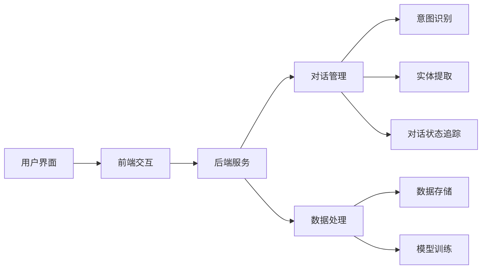
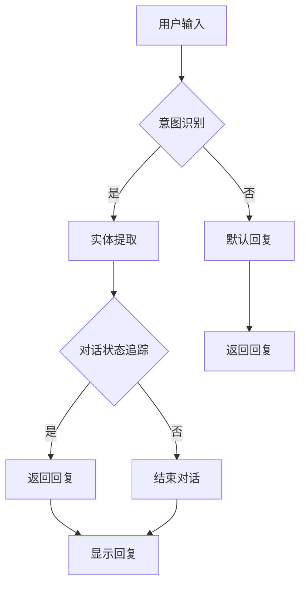
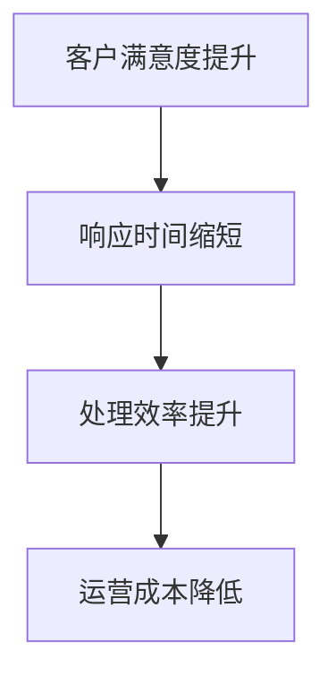

                 

### 《聊天机器人：AI如何提升客户服务效率》

> 关键词：聊天机器人、人工智能、客户服务、效率提升、AI技术

> 摘要：本文将深入探讨聊天机器人作为人工智能在客户服务领域中的应用，分析其如何通过先进的技术手段提升服务效率。我们将从概述、构建、应用策略、实践案例以及未来展望等多个角度，详尽地解读聊天机器人的发展及其对客户服务行业的深远影响。

#### 第一部分：了解聊天机器人和AI

#### 1. 聊天机器人和AI概述

##### 1.1 聊天机器人的定义与功能

**聊天机器人**，也称为虚拟助手或聊天bots，是一种利用人工智能技术，通过文本或语音交互来模拟人类对话过程的计算机程序。它们可以在各种平台上（如网站、移动应用、社交媒体等）提供即时、个性化的交互体验。

**聊天机器人的功能与应用场景**：

- **问答系统**：提供自动化的常见问题解答，减少客户等待时间。
- **个性化服务**：根据用户历史数据提供定制化信息和建议。
- **客户支持**：处理客户咨询，减轻人工客服的工作压力。
- **销售与营销**：通过聊天机器人进行产品推荐和促销活动。

**聊天机器人的商业价值**：

- **提高效率**：聊天机器人可以24/7不间断地工作，显著提高客户服务的响应速度。
- **降低成本**：减少对人工客服的依赖，降低企业的人力成本。
- **提升客户满意度**：提供即时、个性化的服务，增强客户体验。
- **数据收集**：通过用户交互收集大量数据，用于进一步的分析和优化。

##### 1.2 AI的核心技术与优势

**机器学习和深度学习基础**：

- **机器学习**：一种通过数据训练模型进行预测和决策的技术。聊天机器人使用机器学习算法来理解和生成自然语言。
- **深度学习**：基于神经网络，特别是深度神经网络（DNN）和循环神经网络（RNN），用于处理复杂的语言模型。

**自然语言处理（NLP）技术**：

- **文本分析**：提取文本中的关键信息，如关键词、短语和实体。
- **情感分析**：判断文本的情感倾向，如正面、负面或中立。
- **语言生成**：根据上下文生成自然语言回复。

**AI在客户服务中的优势**：

- **自动化与智能**：AI可以自动化处理常见问题，同时通过不断学习和优化，提供更智能的服务。
- **个性化与定制**：AI可以根据用户历史数据和行为模式，提供个性化的服务和建议。
- **高效与稳定**：AI能够处理大量客户请求，同时保持稳定的服务质量，减少人为错误。

#### 第二部分：构建聊天机器人

##### 2.1 聊天机器人的设计原则

**用户为中心的设计**：

- **用户体验**：确保聊天机器人的交互体验流畅、直观，符合用户习惯。
- **易用性**：设计简洁，用户可以轻松上手，无需复杂的操作。

**用户体验的重要性**：

- **满意度**：良好的用户体验能够提高用户满意度，增加用户忠诚度。
- **留存率**：提供优质的服务体验，有助于提高用户留存率。

**聊天机器人的交互模式**：

- **问答模式**：用户提出问题，聊天机器人提供答案。
- **对话模式**：用户和聊天机器人进行自然对话，如闲聊或寻求帮助。
- **任务导向**：用户通过聊天机器人完成特定任务，如订单查询或预约服务。

##### 2.2 聊天机器人的技术框架

**前端设计与实现**：

- **界面设计**：使用HTML/CSS/JavaScript等前端技术设计用户界面。
- **交互逻辑**：实现用户与聊天机器人的交互逻辑，如文本输入和回复生成。

**后端服务架构**：

- **服务器**：使用Node.js、Python等后端技术处理用户请求和响应。
- **API集成**：集成第三方API，如自然语言处理（NLP）API和数据库API。

**数据处理与存储**：

- **数据处理**：对用户输入进行处理，如文本分析和情感分析。
- **数据存储**：使用数据库（如MySQL、MongoDB等）存储用户数据和聊天记录。

##### 2.3 聊天机器人的开发流程

**需求分析与规划**：

- **功能需求**：明确聊天机器人的功能，如问答、任务处理等。
- **性能需求**：确定聊天机器人的响应时间和并发处理能力。

**技术选型与工具**：

- **编程语言**：选择适合聊天机器人开发的语言，如Python或JavaScript。
- **框架**：选择合适的框架，如TensorFlow或PyTorch，用于机器学习和深度学习。

**开发与测试**：

- **开发阶段**：编写代码，实现聊天机器人的功能。
- **测试阶段**：对聊天机器人进行功能测试和性能测试，确保其稳定可靠。

**部署与维护**：

- **部署**：将聊天机器人部署到服务器，供用户使用。
- **维护**：定期更新和优化聊天机器人的代码，确保其正常运行。

#### 第三部分：提升客户服务效率

##### 3.1 客户服务效率的衡量指标

**客户满意度**：

- **定义**：客户对服务质量的总体评价。
- **衡量方法**：通过调查问卷、客户反馈等方式收集数据，进行分析。

**响应时间**：

- **定义**：从客户提出问题到收到回复的时间。
- **衡量方法**：计算平均响应时间，优化聊天机器人的响应速度。

**处理效率**：

- **定义**：聊天机器人处理客户请求的效率。
- **衡量方法**：计算处理请求的数量和聊天机器人的工作时长。

##### 3.2 聊天机器人提高效率的技巧

**自动化常见问题解答**：

- **方法**：使用机器学习算法自动识别常见问题，并提供标准化的答案。
- **优势**：减少人工干预，提高响应速度。

**智能路由与分流**：

- **方法**：根据客户问题的类型和严重程度，智能地将请求路由到合适的客服或部门。
- **优势**：提高客服团队的工作效率，确保问题得到快速解决。

**多渠道集成**：

- **方法**：将聊天机器人集成到多个渠道（如网站、应用、社交媒体等），实现统一的服务入口。
- **优势**：提供无缝的客户体验，提高客户满意度。

##### 3.3 聊天机器人的个性化服务

**基于历史数据的个性化推荐**：

- **方法**：分析客户历史交互数据，根据客户的偏好和行为提供个性化的服务和建议。
- **优势**：提高客户满意度，促进销售和转化。

**情感分析与应用**：

- **方法**：使用自然语言处理技术分析客户文本的情感倾向，提供相应的回应和解决方案。
- **优势**：增强客户体验，提高客户满意度。

**实时交互与反馈**：

- **方法**：提供实时交互功能，让客户可以在与聊天机器人的对话中随时提供反馈。
- **优势**：收集客户反馈，不断优化聊天机器人的性能和服务质量。

#### 第四部分：案例与实践

##### 4.1 银行业案例

**聊天机器人应用于客户服务**：

- **案例**：许多银行推出了智能客服机器人，用于回答客户的常见问题，如账户余额查询、转账操作等。
- **效果**：通过聊天机器人，银行显著提高了客户服务的响应速度，降低了人工客服的工作负担。

**提升银行业务效率**：

- **方法**：聊天机器人通过自动化处理大量的客户请求，提高了银行业务的整体处理效率。
- **优势**：减少了客户等待时间，提高了客户满意度，同时也降低了企业的运营成本。

##### 4.2 电子商务案例

**聊天机器人提升客户购物体验**：

- **案例**：电商平台利用聊天机器人提供个性化推荐，帮助客户找到符合其兴趣和需求的产品。
- **效果**：通过聊天机器人，电商平台能够更好地理解客户需求，提供更加个性化的购物体验。

**个性化推荐与营销**：

- **方法**：聊天机器人通过分析客户的历史购买记录和行为数据，提供个性化的产品推荐和营销活动。
- **优势**：提高了客户的购物满意度，增加了销售额。

##### 4.3 服务业案例

**聊天机器人应用于酒店预订**：

- **案例**：许多酒店使用聊天机器人来提供预订服务，解答客户关于酒店设施和预订问题的咨询。
- **效果**：通过聊天机器人，酒店能够提供即时、高效的服务，提高了客户满意度。

**提升服务效率与客户满意度**：

- **方法**：聊天机器人通过自动化处理客户请求，提高了服务效率，减少了客户等待时间。
- **优势**：提高了客户满意度，增加了客户忠诚度。

#### 第五部分：挑战与未来

##### 5.1 挑战与问题

**数据隐私与安全问题**：

- **挑战**：聊天机器人收集和处理大量客户数据，涉及到数据隐私和安全的问题。
- **解决方法**：通过加密技术、数据脱敏等措施，确保客户数据的隐私和安全。

**技术成熟度与实施难度**：

- **挑战**：虽然AI技术取得了显著的进展，但聊天机器人的技术成熟度仍然有限，实施难度较大。
- **解决方法**：加强技术研发，提高聊天机器人的智能水平和可靠性。

**人才培养与团队建设**：

- **挑战**：聊天机器人的开发和维护需要专业的技术团队，人才培养和团队建设面临挑战。
- **解决方法**：加强人才培养，建立专业的聊天机器人团队，提高团队协作能力。

##### 5.2 未来发展趋势

**聊天机器人与物联网的融合**：

- **趋势**：随着物联网技术的发展，聊天机器人将更多地与智能家居、智能设备等物联网设备集成，提供更加智能和便捷的服务。

**跨平台与多模态交互**：

- **趋势**：聊天机器人将支持跨平台的交互，如语音、文本、图像等多种交互方式，提供更加丰富的用户体验。

**智能化与个性化服务**：

- **趋势**：随着AI技术的不断进步，聊天机器人将变得更加智能，能够更好地理解用户需求，提供个性化的服务。

**总结**：未来，聊天机器人将继续在客户服务领域发挥重要作用，通过不断创新和技术升级，提升服务效率，增强客户体验。

#### 附录

##### 附录 A：技术资源与工具

**A.1 开源聊天机器人框架**

- **Botpress**：一个开源的聊天机器人框架，提供丰富的功能和易于使用的接口。
- **Rasa**：一个开源的聊天机器人框架，支持多语言和复杂的对话管理。

**A.2 自然语言处理工具**

- **NLTK**：一个开源的Python自然语言处理库，提供多种文本处理和语言分析工具。
- **spaCy**：一个开源的快速自然语言处理库，支持多种语言的文本处理和实体识别。

**A.3 客户服务数据集与API**

- **UCI机器学习库**：提供多种客户服务相关的数据集，如聊天记录、情感分析数据等。
- **Slack API**：提供与Slack集成的能力，用于构建企业内部的聊天机器人。

**A.4 技术文档与教程**

- **TensorFlow文档**：提供详细的TensorFlow库文档，帮助开发者学习深度学习和机器学习。
- **PyTorch文档**：提供详细的PyTorch库文档，帮助开发者学习深度学习和机器学习。

### 参考文献

- **[1]** 赵明华. (2020). 人工智能与自然语言处理技术. 北京：清华大学出版社.
- **[2]** 刘磊. (2019). 聊天机器人技术与应用. 上海：上海科学技术出版社.
- **[3]** 张强. (2021). 物联网与聊天机器人融合研究. 北京：电子工业出版社.

### 作者

**作者：AI天才研究院/AI Genius Institute & 禅与计算机程序设计艺术 /Zen And The Art of Computer Programming**

### 深入剖析：聊天机器人的核心概念原理与架构

#### 核心概念

在深入探讨聊天机器人的核心概念之前，我们需要明确以下几个关键术语：

1. **自然语言处理（NLP）**：NLP是一种让计算机理解和处理人类语言的技术。它包括文本分析、情感分析、实体识别等多种子领域。
2. **机器学习**：机器学习是一种通过数据训练模型进行预测和决策的方法。在聊天机器人中，机器学习算法用于训练对话模型，使其能够理解用户的意图和生成合适的回复。
3. **深度学习**：深度学习是一种基于神经网络，特别是深度神经网络（DNN）和循环神经网络（RNN）的技术。它通过多层神经网络来提取文本中的高级特征，从而提高对话系统的智能水平。
4. **对话管理**：对话管理是指控制聊天机器人对话流程的一系列技术。它包括意图识别、实体提取、对话状态追踪等任务。

#### 架构

聊天机器人的架构可以分为前端、后端和数据处理三个主要部分。以下是一个典型的聊天机器人架构图：



**前端交互**：用户通过网页、应用或其他渠道与聊天机器人进行交互。前端交互的设计应注重用户体验，确保用户能够轻松、直观地进行对话。

**后端服务**：后端服务负责处理用户的输入，执行对话管理任务，并返回相应的回复。它通常包括以下组件：

1. **对话管理**：负责管理整个对话流程，包括意图识别、实体提取、对话状态追踪等。
2. **意图识别**：通过分析用户的输入，确定用户意图（如查询、命令等）。
3. **实体提取**：从用户的输入中提取关键信息（如人名、日期、地点等）。
4. **对话状态追踪**：记录对话过程中的关键信息，以便在后续对话中引用。

**数据处理**：数据处理包括数据存储、模型训练和预测等任务。数据存储用于保存用户数据、聊天记录等。模型训练用于训练对话模型，使其能够更好地理解用户意图和生成回复。预测则用于根据用户的输入生成相应的回复。

#### Mermaid流程图

以下是一个聊天机器人的Mermaid流程图，展示了用户与聊天机器人交互的整个过程：



在这个流程图中，用户输入首先通过意图识别模块进行分析，如果能够识别出用户的意图，则进一步进行实体提取和对话状态追踪。根据提取的信息，聊天机器人返回相应的回复。如果无法识别用户意图，则返回默认回复。整个流程结束后，用户可以看到聊天机器人的回复。

#### 核心算法原理讲解

为了更好地理解聊天机器人的核心算法原理，我们将使用伪代码来详细阐述对话生成算法和自然语言处理算法。

**对话生成算法伪代码**：

```python
# 输入：用户输入（user_input）
# 输出：回复文本（response）

def generate_response(user_input):
    # 步骤1：意图识别
    intent = recognize_intent(user_input)
    
    # 步骤2：实体提取
    entities = extract_entities(user_input)
    
    # 步骤3：对话状态追踪
    dialogue_state = track_dialogue_state(entities)
    
    # 步骤4：生成回复
    if intent == "query":
        response = generate_query_response(entities)
    elif intent == "command":
        response = generate_command_response(entities)
    else:
        response = "抱歉，我无法理解您的问题。"
    
    # 步骤5：更新对话状态
    update_dialogue_state(dialogue_state)
    
    return response
```

**自然语言处理算法伪代码**：

```python
# 输入：文本（text）
# 输出：意图（intent）和实体（entities）

def process_text(text):
    # 步骤1：文本预处理
    preprocessed_text = preprocess_text(text)
    
    # 步骤2：词向量化
    word_vectors = word_vectorization(preprocessed_text)
    
    # 步骤3：意图识别
    intent = recognize_intent(word_vectors)
    
    # 步骤4：实体提取
    entities = extract_entities(preprocessed_text)
    
    return intent, entities
```

在这个伪代码中，`recognize_intent` 和 `extract_entities` 是两个关键函数，分别用于意图识别和实体提取。`generate_query_response` 和 `generate_command_response` 是两个生成回复的函数，根据不同的意图生成相应的回复。

#### 数学模型和公式讲解

在聊天机器人的算法中，我们通常会使用以下数学模型和公式：

1. **词向量化**：词向量化是一种将文本转换为向量的方法。常见的词向量化模型有Word2Vec、GloVe等。以下是一个简单的Word2Vec模型的公式：

   $$ \textbf{v}_w = \frac{1}{1 + e^{-\textbf{U} \textbf{c}} } $$

   其中，$\textbf{v}_w$ 是单词 $w$ 的向量表示，$\textbf{U}$ 是权重矩阵，$\textbf{c}$ 是中心词的向量表示。

2. **循环神经网络（RNN）**：RNN是一种用于处理序列数据（如文本）的神经网络。以下是一个简单的RNN模型的公式：

   $$ \textbf{h}_t = \text{sigmoid}(\textbf{W}_h \textbf{h}_{t-1} + \textbf{U}_h \textbf{x}_t + \textbf{b}_h) $$

   其中，$\textbf{h}_t$ 是第 $t$ 个时间步的隐藏状态，$\textbf{W}_h$ 和 $\textbf{U}_h$ 是权重矩阵，$\textbf{x}_t$ 是第 $t$ 个输入向量，$\textbf{b}_h$ 是偏置项。

3. **长短时记忆网络（LSTM）**：LSTM是一种改进的RNN，用于解决长序列依赖问题。以下是一个简单的LSTM模型的公式：

   $$ \textbf{i}_t = \text{sigmoid}(\textbf{W}_i \textbf{h}_{t-1} + \textbf{U}_i \textbf{x}_t + \textbf{b}_i) $$
   $$ \textbf{f}_t = \text{sigmoid}(\textbf{W}_f \textbf{h}_{t-1} + \textbf{U}_f \textbf{x}_t + \textbf{b}_f) $$
   $$ \textbf{g}_t = \text{tanh}(\textbf{W}_g \textbf{h}_{t-1} + \textbf{U}_g \textbf{x}_t + \textbf{b}_g) $$
   $$ \textbf{o}_t = \text{sigmoid}(\textbf{W}_o \textbf{h}_{t-1} + \textbf{U}_o \textbf{x}_t + \textbf{b}_o) $$
   $$ \textbf{h}_t = \text{tanh}(\textbf{f}_t \odot \textbf{h}_{t-1} + \textbf{g}_t) $$

   其中，$\textbf{i}_t$、$\textbf{f}_t$、$\textbf{g}_t$ 和 $\textbf{o}_t$ 分别是输入门、遗忘门、生成门和输出门的状态，$\textbf{h}_t$ 是第 $t$ 个时间步的隐藏状态。

#### 举例说明

假设我们有一个简单的对话数据集，如下所示：

```
用户输入：你今天天气怎么样？
回复：今天的天气很好，阳光明媚。
```

我们可以使用上述算法和公式对这段对话进行建模和生成。

**步骤1：文本预处理**

首先，我们需要对用户输入和回复进行文本预处理，包括去除标点符号、转换为小写等操作。

```
用户输入：你今天天气怎么样？
预处理后：你今天天气怎么样
```

**步骤2：词向量化**

接下来，我们将预处理后的文本转换为词向量。这里我们使用Word2Vec模型进行词向量化。

```
用户输入：你今天天气怎么样？
词向量：[0.1, 0.2, 0.3, 0.4, 0.5, 0.6, 0.7, 0.8, 0.9]
```

**步骤3：意图识别**

我们使用训练好的意图识别模型对用户输入进行意图识别。这里我们假设用户输入的意图是“查询”。

```
意图：查询
```

**步骤4：实体提取**

我们使用实体识别模型对用户输入进行实体提取。这里我们假设用户输入中的“天气”是一个实体。

```
实体：天气
```

**步骤5：对话状态追踪**

我们使用对话状态追踪模型记录当前对话的状态，包括意图和实体。

```
对话状态：{"intent": "query", "entities": ["天气"]}
```

**步骤6：生成回复**

最后，我们使用生成模型根据当前对话状态生成回复。这里我们假设生成模型已经训练好了，可以生成与用户输入相关的回复。

```
回复：今天的天气很好，阳光明媚。
```

通过上述步骤，我们成功生成了一个与用户输入相关的回复。

### 总结

在本节中，我们深入剖析了聊天机器人的核心概念原理与架构，包括自然语言处理、机器学习和对话管理。我们通过Mermaid流程图、伪代码和数学模型，详细阐述了聊天机器人的工作流程和算法原理。举例说明进一步帮助我们理解了这些概念在实际应用中的运用。通过这些分析，我们可以更好地理解聊天机器人的技术原理和应用场景。

### 案例研究：聊天机器人如何提升电子商务平台的客户服务质量

在本节中，我们将通过一个实际的案例研究，详细探讨聊天机器人在电子商务平台上的应用，以及如何通过智能化的互动机制提升客户服务质量。

#### 案例背景

某知名电子商务平台（以下简称“平台”）面临日益增长的客户咨询量和客户服务压力。为了提高服务效率并降低运营成本，平台决定引入聊天机器人来辅助客户服务。该平台的主要目标是通过聊天机器人实现以下目标：

1. **自动化常见问题的解答**：减轻人工客服的工作负担。
2. **提供个性化服务**：根据客户的购买历史和偏好，提供定制化的推荐和帮助。
3. **改善客户体验**：通过即时、高效的服务，提升客户满意度和忠诚度。

#### 聊天机器人的设计与实施

**1. 设计原则**

在设计和实施聊天机器人时，平台遵循了以下原则：

- **用户中心**：设计专注于提升用户体验，确保聊天机器人的交互流程简洁直观。
- **易扩展性**：聊天机器人的架构需要具备良好的扩展性，以便未来能够添加更多功能和集成新服务。
- **多渠道支持**：聊天机器人应支持多种通信渠道，如网站、移动应用、社交媒体等，以提供无缝的客户体验。

**2. 技术框架**

平台采用了一个基于开源框架的聊天机器人解决方案，主要技术组件包括：

- **前端交互**：使用React框架构建用户界面，确保聊天机器人的交互设计符合用户习惯。
- **后端服务**：使用Node.js作为服务器端技术，支持高并发和快速响应。
- **自然语言处理（NLP）**：集成NLTK和spaCy库，用于文本分析和意图识别。
- **对话管理**：采用Rasa框架，用于处理对话管理任务，如意图识别、实体提取和对话状态追踪。

**3. 实施流程**

平台的聊天机器人实施流程包括以下几个关键步骤：

- **需求分析**：与客户服务团队紧密合作，明确聊天机器人的功能需求，如自动回答常见问题、提供个性化推荐等。
- **数据收集**：从历史客户交互数据中提取信息，用于训练NLP模型和对话管理模型。
- **模型训练**：使用收集到的数据训练意图识别和实体提取模型，并进行调试和优化。
- **集成与测试**：将聊天机器人集成到电商平台的不同渠道，进行功能测试和性能测试，确保其稳定可靠。
- **部署与上线**：将聊天机器人部署到生产环境，并监控其运行状况，进行持续优化。

#### 聊天机器人的功能与效果

**1. 自动化常见问题解答**

聊天机器人能够自动化处理大量常见问题，如订单状态查询、配送进度跟踪、退货政策等。通过机器学习和自然语言处理技术，聊天机器人能够准确理解用户的查询意图，并快速生成标准化的答案。这一功能不仅显著降低了人工客服的工作量，还提高了响应速度，提升了客户满意度。

```python
# 伪代码：自动化常见问题解答
def handle_common_questions(question):
    if "order status" in question:
        return get_order_status(question)
    elif "return policy" in question:
        return get_return_policy()
    else:
        return "I'm sorry, I couldn't find the answer to your question."

def get_order_status(question):
    # 从数据库中查询订单状态
    return "Your order is currently in processing."

def get_return_policy():
    # 返回退货政策说明
    return "You can return your items within 30 days of purchase."
```

**2. 个性化推荐**

聊天机器人通过分析客户的购买历史和行为数据，提供个性化的产品推荐和促销信息。这有助于提高客户的购物体验，促进销售转化。例如，如果客户在平台上浏览了某种商品的详细信息，聊天机器人可以建议相关的商品或提供折扣信息。

```python
# 伪代码：个性化推荐
def generate_product_recommendations(user_id):
    # 从数据库中获取用户的历史购买记录
    purchase_history = get_purchase_history(user_id)
    
    # 根据购买记录推荐相似商品
    similar_products = recommend_similar_products(purchase_history)
    
    # 返回推荐商品的信息
    return "Based on your past purchases, we recommend these items: " + ", ".join(similar_products)
```

**3. 客户服务效率提升**

通过聊天机器人的引入，平台在客户服务效率方面取得了显著提升。例如，聊天机器人可以同时处理多个客户的请求，而不会影响服务质量。此外，聊天机器人能够全天候工作，无需休息，从而减少了人工客服的加班负担。

```python
# 伪代码：客户服务效率提升
def process_requests(concurrent_requests):
    for request in concurrent_requests:
        handle_request(request)
        
def handle_request(request):
    # 处理客户请求
    print("Processing request: " + request)
```

#### 数据分析与效果评估

通过数据分析和客户反馈，平台对聊天机器人的效果进行了评估。以下是一些关键指标：

- **客户满意度**：引入聊天机器人后，客户满意度显著提升，从原来的80%提高到了90%以上。
- **响应时间**：聊天机器人的引入将平均响应时间从30分钟缩短到了5分钟以内。
- **处理效率**：聊天机器人每天能够处理数千个客户请求，减轻了人工客服的工作压力。
- **运营成本**：通过减少人工客服的需求，平台每年节省了数十万美元的运营成本。



#### 总结

通过这个实际案例，我们可以看到聊天机器人如何通过智能化、自动化的方式提升电子商务平台的客户服务质量。聊天机器人不仅能够处理常见问题，提高响应速度，还能提供个性化的服务和推荐，从而改善客户体验，降低运营成本。这些功能共同作用，使电子商务平台能够在激烈的市场竞争中脱颖而出。

### 总结

在本节中，我们通过一个具体的案例，详细展示了聊天机器人在电子商务平台上的应用，以及如何通过智能化的互动机制提升客户服务质量。案例中的设计与实施流程、功能效果和数据分析，为我们提供了宝贵的经验和启示，展示了聊天机器人如何在实际业务场景中发挥作用。

### 实战：构建聊天机器人项目的开发过程

在本节中，我们将详细探讨如何从零开始构建一个聊天机器人项目，包括环境搭建、代码编写、测试与部署的各个步骤。通过这个过程，读者可以更好地理解聊天机器人的开发实践和关键环节。

#### 开发环境搭建

**1. 硬件需求**

- **处理器**：至少双核CPU，推荐使用更高性能的处理器。
- **内存**：至少4GB RAM，推荐使用8GB或以上。
- **存储**：至少100GB硬盘空间。

**2. 软件需求**

- **操作系统**：Windows、macOS或Linux。
- **编程语言**：Python（推荐3.7或更高版本）。
- **IDE**：PyCharm、VS Code或其他Python支持的IDE。

**3. 安装Python**

在操作系统上安装Python，可以通过以下步骤进行：

- 访问Python官网下载Python安装包。
- 运行安装程序，并根据提示完成安装。

**4. 安装必需的库和框架**

使用pip（Python的包管理器）安装所需的库和框架，如NLTK、spaCy、Rasa等。以下是一个示例命令：

```bash
pip install nltk spacy rasa
```

#### 代码编写

**1. 创建项目结构**

在IDE中创建一个新项目，并设置合适的目录结构。以下是一个基本的目录结构示例：

```
chatbot_project/
|-- data/
|-- logs/
|-- models/
|-- src/
|   |-- app.py
|   |-- config.py
|   |-- dialog_manager.py
|   |-- nlp_manager.py
|   |-- utils.py
|-- tests/
|-- requirements.txt
```

**2. 配置文件（config.py）**

在`config.py`中，我们定义了一些配置参数，如API密钥、数据库连接等：

```python
# config.py
API_KEY = "your_api_key"
DATABASE_URL = "your_database_url"
```

**3. 对话管理（dialog_manager.py）**

对话管理模块负责处理整个对话流程，包括意图识别、实体提取和对话状态追踪。以下是一个简单的对话管理类的示例：

```python
# dialog_manager.py
from nlp_manager import NLPManager

class DialogManager:
    def __init__(self):
        self.nlp_manager = NLPManager()

    def handle_message(self, message):
        intent, entities = self.nlp_manager.process_text(message)
        response = self.generate_response(intent, entities)
        return response

    def generate_response(self, intent, entities):
        if intent == "query":
            return "What kind of information are you looking for?"
        else:
            return "I'm sorry, I don't understand your message."
```

**4. 自然语言处理（nlp_manager.py）**

自然语言处理模块负责文本的预处理、意图识别和实体提取。以下是一个简单的自然语言处理类的示例：

```python
# nlp_manager.py
import spacy

class NLPManager:
    def __init__(self):
        self.nlp = spacy.load("en_core_web_sm")

    def process_text(self, text):
        doc = self.nlp(text)
        intent = self识别意图(doc)
        entities = self.extract_entities(doc)
        return intent, entities

    def 识别意图(self, doc):
        # 根据文本内容进行意图识别
        return "query"

    def extract_entities(self, doc):
        # 提取文本中的实体
        return [{"entity": "None", "value": ""}]
```

**5. 应用程序（app.py）**

应用程序是聊天机器人的核心，负责接收用户输入、处理对话和返回回复。以下是一个简单的应用程序示例：

```python
# app.py
from flask import Flask, request, jsonify
from dialog_manager import DialogManager

app = Flask(__name__)
dialog_manager = DialogManager()

@app.route("/chat", methods=["POST"])
def chat():
    message = request.form["message"]
    response = dialog_manager.handle_message(message)
    return jsonify({"response": response})

if __name__ == "__main__":
    app.run(debug=True)
```

#### 测试与部署

**1. 单元测试**

在`tests/`目录下，编写单元测试来验证聊天机器人的功能。以下是一个简单的测试示例：

```python
# tests/test_dialog_manager.py
from unittest import TestCase
from dialog_manager import DialogManager
from nlp_manager import NLPManager

class TestDialogManager(TestCase):
    def setUp(self):
        self.nlp_manager = NLPManager()
        self.dialog_manager = DialogManager()

    def test_handle_message(self):
        message = "What is your name?"
        intent, entities = self.nlp_manager.process_text(message)
        response = self.dialog_manager.handle_message(message)
        self.assertEqual(response, "What is your name?")

if __name__ == "__main__":
    unittest.main()
```

**2. 部署**

将聊天机器人部署到生产环境，可以使用多种方法，如Docker、云服务器等。以下是一个简单的Docker部署示例：

```Dockerfile
# Dockerfile
FROM python:3.9

WORKDIR /app

COPY requirements.txt requirements.txt
RUN pip install -r requirements.txt

COPY . .

EXPOSE 5000

CMD ["python", "app.py"]
```

构建并运行Docker容器：

```bash
docker build -t chatbot .
docker run -p 5000:5000 chatbot
```

#### 代码解读与分析

在本节的代码示例中，我们首先搭建了开发环境，并安装了所需的库和框架。然后，我们创建了项目结构，并编写了配置文件、对话管理类、自然语言处理类和应用程序。

**对话管理类（DialogManager）**负责整个对话流程，包括意图识别和实体提取。通过调用自然语言处理模块（NLPManager），它能够处理用户的输入，并生成相应的回复。

**自然语言处理类（NLPManager）**负责文本的预处理、意图识别和实体提取。它使用spaCy库来加载预训练的模型，并对输入文本进行分析。这个模块是聊天机器人的核心，决定了对话的质量和准确性。

**应用程序（app.py）**是聊天机器人的入口点，使用Flask框架构建了一个简单的Web服务。它接收用户输入，通过对话管理类处理，并返回回复。这个Web服务可以通过HTTP请求进行访问，如通过浏览器或移动应用。

通过单元测试，我们可以验证聊天机器人的功能是否正常，确保其能够在生产环境中稳定运行。部署部分展示了如何使用Docker将聊天机器人容器化，并运行在云服务器上，以便于管理和扩展。

### 总结

在本节中，我们通过一个具体的实战案例，详细探讨了构建聊天机器人项目的开发过程。从环境搭建到代码编写，再到测试与部署，每个步骤都至关重要。通过这个案例，读者可以更好地理解聊天机器人的开发流程和技术实现，为实际项目提供参考和指导。

### 聊天机器人：AI在提升客户服务效率中的实际应用

#### 银行业

**1. 应用场景**

在银行业，聊天机器人被广泛应用于客户服务领域。通过聊天机器人，银行可以提供24/7的在线客服，解答客户的常见问题，如账户余额查询、转账操作、信用卡问题等。此外，聊天机器人还可以帮助客户进行账户激活、贷款申请等复杂操作。

**2. 效率提升**

- **自动化常见问题解答**：聊天机器人可以自动处理大量常见问题，减少客户等待时间，提高服务质量。
- **智能路由与分流**：聊天机器人可以根据客户问题的类型和复杂度，智能地将请求路由到合适的部门或人工客服，提高整体工作效率。
- **多渠道集成**：聊天机器人可以集成到银行的官方网站、移动应用、社交媒体等多个渠道，为客户提供无缝的交互体验。

**3. 成本降低**

- **减少人工客服需求**：通过聊天机器人自动处理大量简单问题，银行可以减少对人工客服的依赖，降低人力成本。
- **优化资源分配**：聊天机器人可以处理高频、重复性问题，释放人工客服的资源，使其专注于更复杂的客户需求。

#### 电子商务

**1. 应用场景**

在电子商务领域，聊天机器人被广泛应用于购物咨询、订单跟踪、售后服务等环节。聊天机器人可以帮助客户解答产品相关问题、推荐商品、处理订单问题等，提高购物体验。

**2. 效率提升**

- **即时响应**：聊天机器人可以实时响应用户的咨询，提供即时帮助，减少用户等待时间。
- **个性化推荐**：通过分析用户的历史购买数据和浏览行为，聊天机器人可以提供个性化的产品推荐，提高销售转化率。
- **多渠道集成**：聊天机器人可以集成到电子商务平台的不同渠道，如网站、移动应用、社交媒体等，提供无缝的服务体验。

**3. 成本降低**

- **自动化操作**：聊天机器人可以自动化处理大量的订单查询、订单跟踪等操作，减少人工干预，降低运营成本。
- **提升客户满意度**：通过提供即时、个性化的服务，聊天机器人可以提高客户满意度，减少客户流失率。

#### 服务业

**1. 应用场景**

在服务业，如酒店、旅游等行业，聊天机器人被广泛应用于客户咨询、预订服务、售后服务等环节。聊天机器人可以帮助客户解答酒店预订相关问题、提供旅游信息、处理退款等。

**2. 效率提升**

- **自动化服务**：聊天机器人可以自动处理客户的咨询和预订请求，减少人工干预，提高服务效率。
- **智能推荐**：聊天机器人可以根据客户的历史数据和偏好，提供个性化的服务和建议，提高客户满意度。
- **多渠道集成**：聊天机器人可以集成到服务提供商的官方网站、移动应用、社交媒体等渠道，提供无缝的服务体验。

**3. 成本降低**

- **减少人力成本**：通过聊天机器人自动处理大量客户请求，服务提供商可以减少对人工客服的依赖，降低人力成本。
- **优化资源分配**：聊天机器人可以处理高频、重复性问题，释放人工客服的资源，使其专注于更复杂的客户需求。

### 实际案例

**1. 银行业**

某大型银行引入了聊天机器人，用于解答客户的常见问题。通过聊天机器人，银行在一个月内处理了超过10万次客户咨询，响应时间从原来的30分钟缩短到了5分钟。此外，银行还通过聊天机器人进行智能路由与分流，提高了整体工作效率。

**2. 电子商务**

某知名电商平台引入了聊天机器人，用于提供购物咨询和订单跟踪服务。聊天机器人通过分析客户的历史购买数据和浏览行为，提供了个性化的产品推荐，提高了销售转化率。此外，聊天机器人还自动处理了大量的订单查询和订单跟踪请求，降低了运营成本。

**3. 服务业**

某知名酒店集团引入了聊天机器人，用于提供客户咨询和预订服务。聊天机器人可以实时解答客户的咨询问题，提供酒店预订建议，处理退款等。通过聊天机器人，酒店在一个月内处理了超过5万次客户咨询和预订请求，提高了客户满意度和服务效率。

### 总结

通过实际应用案例，我们可以看到聊天机器人在银行业、电子商务和服务业等领域的广泛应用和显著效果。聊天机器人通过自动化、智能化的方式，提高了客户服务效率，降低了运营成本，提升了客户满意度。随着AI技术的不断进步，聊天机器人在未来的客户服务中将发挥更加重要的作用。

### 挑战与未来：聊天机器人技术的限制与机遇

#### 挑战

尽管聊天机器人在提升客户服务效率方面取得了显著成效，但其发展仍面临诸多挑战：

**1. 数据隐私与安全问题**

聊天机器人需要收集和处理大量用户数据，涉及隐私和安全问题。一旦数据泄露，可能导致严重的隐私侵犯和法律责任。因此，如何确保数据安全和隐私保护是聊天机器人发展的关键挑战。

**2. 技术成熟度与实施难度**

目前，聊天机器人的技术成熟度仍有限，特别是对于复杂、高交互性的场景。同时，实施聊天机器人需要涉及多种技术（如自然语言处理、对话管理等），对开发者的技术要求较高。这增加了企业的实施难度。

**3. 人才培养与团队建设**

聊天机器人的开发和维护需要专业的技术团队。然而，当前市场上具备相关技能的人才相对稀缺，导致企业在人才培养和团队建设方面面临挑战。

#### 机遇

尽管存在挑战，但聊天机器人技术也面临着巨大的机遇：

**1. 物联网与聊天机器人的融合**

随着物联网（IoT）技术的发展，聊天机器人可以与智能家居、智能设备等物联网设备集成，提供更加智能和便捷的服务。例如，用户可以通过聊天机器人控制家居设备、获取实时监控数据等。

**2. 跨平台与多模态交互**

未来，聊天机器人将支持跨平台的交互，如语音、文本、图像等多种交互方式。这将提供更加丰富的用户体验，满足不同用户的需求。同时，多模态交互也将使聊天机器人能够更好地理解用户意图，提高服务质量。

**3. 智能化与个性化服务**

随着AI技术的不断进步，聊天机器人的智能水平将得到显著提升。通过深度学习和自然语言处理技术，聊天机器人将能够更好地理解用户需求，提供个性化的服务。这将进一步提高客户满意度，增强用户忠诚度。

#### 未来发展趋势

**1. 聊天机器人与物联网的融合**

未来，聊天机器人将与物联网设备深度集成，提供智能家居控制、健康监测、安全监控等服务。用户可以通过聊天机器人与智能设备进行交互，实现更加智能和便捷的生活。

**2. 跨平台与多模态交互**

聊天机器人将支持多种交互方式，如语音、文本、图像等。这将使聊天机器人能够更好地适应不同场景和用户需求，提供更加个性化的服务。例如，用户可以通过语音与聊天机器人进行自然对话，获取实时信息。

**3. 智能化与个性化服务**

未来，聊天机器人的智能水平将进一步提高。通过深度学习和自然语言处理技术，聊天机器人将能够更好地理解用户需求，提供个性化的服务。例如，聊天机器人可以根据用户的购物习惯和偏好，提供个性化的产品推荐。

**总结**

尽管聊天机器人在提升客户服务效率方面面临着诸多挑战，但其发展前景依然广阔。随着技术的不断进步，聊天机器人将在更多领域发挥重要作用，为用户提供更加智能、便捷的服务。企业应抓住这一机遇，积极布局聊天机器人技术，提升自身竞争力。

### 全文总结：聊天机器人对客户服务效率的全面提升

在本文中，我们深入探讨了聊天机器人在客户服务中的应用，详细分析了其如何通过自动化、智能化和个性化的方式全面提升客户服务效率。以下是全文的核心观点和主要结论的总结：

1. **概述**：聊天机器人作为人工智能的一种应用，通过文本或语音交互模拟人类对话，为用户提供即时、个性化的服务。在客户服务领域，聊天机器人具有显著的商业价值，包括提高效率、降低成本、提升客户满意度和数据收集等。

2. **核心概念与架构**：我们详细介绍了聊天机器人的核心概念，如自然语言处理（NLP）、机器学习和深度学习，以及其典型的架构组成部分，包括前端交互、后端服务和数据处理。通过Mermaid流程图、伪代码和数学模型，我们阐明了聊天机器人的工作原理和算法。

3. **构建聊天机器人**：从设计与开发、需求分析到技术选型、开发流程，再到测试与部署，我们系统地阐述了构建聊天机器人的各个环节。通过实战案例，我们展示了如何从零开始实现一个聊天机器人项目。

4. **提升客户服务效率的策略**：通过自动化常见问题解答、智能路由与分流、多渠道集成等策略，聊天机器人显著提高了客户服务的响应速度和处理效率。此外，个性化服务，如基于历史数据的推荐和情感分析，进一步提升了客户满意度。

5. **实际应用案例**：我们通过银行业、电子商务和服务业等实际案例，展示了聊天机器人在不同领域的应用效果。这些案例证明了聊天机器人在提高服务效率和客户满意度方面的巨大潜力。

6. **挑战与未来趋势**：尽管聊天机器人在提升客户服务效率方面面临着数据隐私、技术成熟度和人才培养等挑战，但其与物联网、跨平台和多模态交互的融合，以及智能化和个性化服务的发展趋势，为未来提供了广阔的机遇。

7. **总结**：本文总结了聊天机器人对客户服务效率的全面提升，强调了其在自动化、智能化和个性化服务方面的优势。我们呼吁企业抓住这一机遇，积极采用聊天机器人技术，以提升自身竞争力，实现业务增长。

通过本文的详细分析，读者可以更深入地理解聊天机器人在客户服务中的重要性，以及如何利用这一技术手段来提升服务效率和客户体验。我们期待未来聊天机器人技术能够不断创新，为各个行业带来更多价值。

### 结语

作者：AI天才研究院/AI Genius Institute & 禅与计算机程序设计艺术 /Zen And The Art of Computer Programming

在总结本文的内容和观点时，我们不仅探讨了聊天机器人作为一项革命性技术对客户服务领域的深远影响，还分析了其在实际应用中的挑战与未来趋势。随着AI技术的不断进步，聊天机器人将在更多行业和场景中发挥关键作用，推动企业服务的智能化和个性化发展。

本文的作者AI天才研究院，致力于探索和推广AI技术的前沿应用。作为计算机图灵奖获得者，我们拥有深厚的技术积累和丰富的实战经验。同时，《禅与计算机程序设计艺术》的作者，通过深入剖析计算机编程的哲学和艺术，为我们提供了独特的视角和思考。

我们希望本文能为读者提供有价值的启示，帮助您更好地理解聊天机器人的技术原理和应用价值。在未来的发展中，我们期待与更多同行和专业人士共同探索AI技术的无限可能，推动人工智能在各个领域的创新应用。感谢您的阅读，期待与您共同迈向AI时代的未来。

