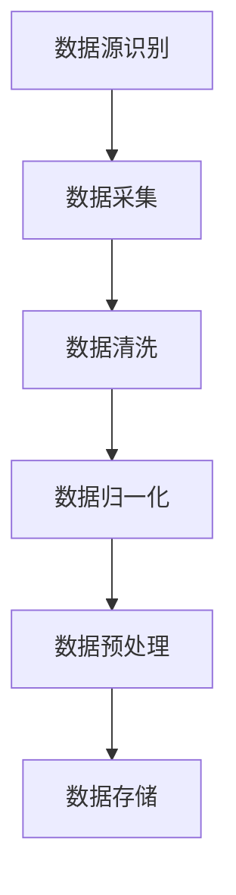
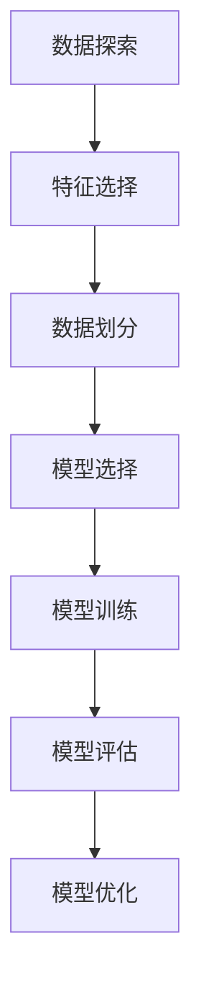
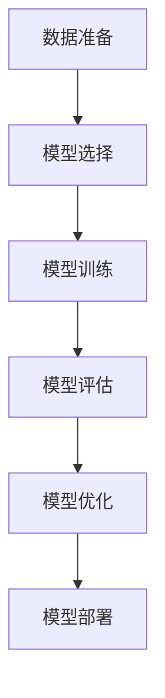
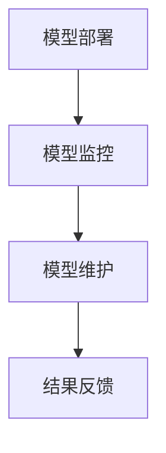
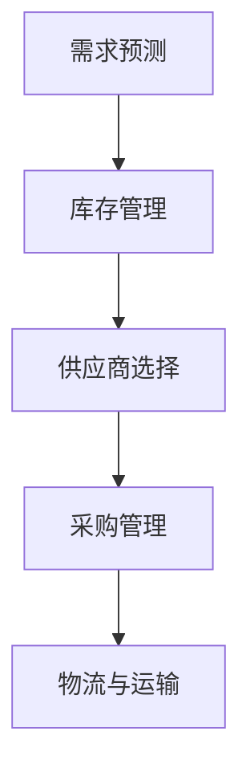

                 

### 文章标题

# 自动化承接供给项目：技术原理与实践指南

### 关键词

- 自动化承接供给
- 项目管理
- 供应链优化
- 数据分析
- 机器学习
- 神经网络
- 支持向量机
- 决策树
- 数学模型
- 优化算法

### 摘要

自动化承接供给项目在现代供应链管理中发挥着越来越重要的作用。本文将详细介绍自动化承接供给项目的概念、核心原理、关键算法及其在实际项目中的应用。通过逻辑清晰的分析和逐步推理，本文旨在为从事供应链管理和人工智能领域的技术人员提供一份全面的技术指南。文章将涵盖从项目概述、基础知识，到核心算法讲解、数学模型以及项目实战的各个方面，旨在帮助读者深入理解自动化承接供给项目的技术原理和实践方法。

### 第一部分：项目概述

在开始深入探讨自动化承接供给项目的技术细节之前，我们需要先对其进行全面的了解，包括项目背景与目标、项目范围与边界，以及项目价值与影响。

#### 第1章：自动化承接供给项目概述

##### 1.1 项目背景与目标

自动化承接供给项目起源于对传统供应链管理流程的优化需求。传统供应链管理往往依赖于人工操作，效率低下，响应速度慢，难以适应快速变化的市场环境。随着信息技术的飞速发展，尤其是大数据和人工智能技术的应用，自动化承接供给项目应运而生。其目标是利用先进的数据分析技术和机器学习算法，自动化处理供应链中的信息流、物流和资金流，从而提高供应链的整体效率和灵活性。

具体来说，自动化承接供给项目的目标包括：

1. **提高供应链响应速度**：通过实时数据分析和预测，快速响应市场需求变化，减少库存积压和供应短缺的风险。
2. **优化库存管理**：基于历史数据和预测模型，优化库存水平，减少不必要的库存成本，提高库存周转率。
3. **降低供应链成本**：通过自动化处理和优化，减少人工操作和运输成本，提高供应链的整体效率。
4. **提高供应商选择准确性**：利用数据分析技术，从大量供应商中筛选出最合适的合作伙伴，降低采购风险。

##### 1.2 项目范围与边界

自动化承接供给项目的范围主要包括以下几个方面：

1. **数据采集与处理**：从各种数据源（如ERP系统、库存管理系统、供应商数据库等）中采集相关数据，并对数据进行清洗、归一化和预处理。
2. **数据分析与挖掘**：利用统计学和机器学习算法，对采集到的数据进行分析和挖掘，提取有价值的信息和模式。
3. **模型训练与优化**：构建并训练预测模型和优化模型，优化供应链管理流程。
4. **模型部署与监控**：将训练好的模型部署到实际生产环境中，对模型进行监控和评估，确保其性能稳定。

项目的边界则包括：

1. **数据源范围**：项目涉及的数据源主要限于供应链管理相关的内部数据和外部公开数据。
2. **技术范围**：项目采用的技术主要限于数据分析、机器学习和优化算法，不包括物理层面的供应链基础设施。
3. **时间范围**：项目的时间范围根据具体需求而定，通常包括项目的筹备、实施和评估阶段。

##### 1.3 项目价值与影响

自动化承接供给项目在多个方面对供应链管理产生了深远的影响：

1. **经济效益**：通过优化供应链管理流程，降低库存成本、运输成本和采购成本，提高企业盈利能力。
2. **运营效率**：自动化处理供应链中的信息流、物流和资金流，提高供应链响应速度和灵活性，减少人为错误。
3. **风险管理**：通过实时数据分析和预测，及时识别和应对供应链中的潜在风险，降低运营风险。
4. **竞争优势**：借助先进的自动化技术，提高供应链的整体效率和灵活性，增强企业在市场中的竞争力。

综上所述，自动化承接供给项目不仅具有重要的经济效益和运营效率，还对企业的风险管理和竞争优势产生了深远的影响。下一章将深入探讨自动化承接供给项目的基础知识，包括其概念、优势、应用领域以及挑战与应对策略。

#### 第2章：自动化承接供给项目的基础知识

##### 2.1 自动化承接供给的概念

自动化承接供给（Automated Procurement and Supply Chain Management）是指通过利用信息技术和数据分析技术，自动化处理供应链中的各种信息流、物流和资金流，从而提高供应链的整体效率和灵活性。其核心思想是将传统的人工操作和决策过程转变为基于数据和算法的自动化处理，实现供应链的智能管理。

自动化承接供给的主要特点包括：

1. **实时性**：通过实时数据采集和分析，实现对供应链状态的实时监控和响应。
2. **准确性**：利用大数据和机器学习技术，提高供应链数据分析和预测的准确性，减少人为误差。
3. **灵活性**：自动化处理供应链中的各种信息流和物流，提高供应链的灵活性和适应性，快速响应市场需求变化。
4. **集成性**：将各种供应链管理系统（如ERP、库存管理系统、供应商管理系统等）集成在一起，实现数据共享和流程优化。

##### 2.2 自动化承接供给的优势

自动化承接供给在供应链管理中具有显著的优势：

1. **提高效率**：自动化处理供应链中的各种信息流和物流，减少人工操作，提高供应链的整体效率。
2. **减少成本**：通过优化库存管理、采购流程和运输规划，降低库存成本、采购成本和运输成本。
3. **降低风险**：实时监控供应链状态，及时识别和应对潜在风险，降低供应链中断和供应链金融风险。
4. **增强竞争力**：利用先进的数据分析技术和机器学习算法，提高供应链的灵活性和响应速度，增强企业在市场中的竞争力。

##### 2.3 自动化承接供给的应用领域

自动化承接供给技术在多个领域得到了广泛应用：

1. **制造业**：通过自动化承接供给项目，实现制造过程中的原材料采购、生产计划和生产排程的优化，提高生产效率和产品质量。
2. **零售业**：通过自动化承接供给项目，实现零售供应链中的库存管理、需求预测和供应商选择的优化，提高库存周转率和客户满意度。
3. **物流与运输**：通过自动化承接供给项目，优化运输路线和运输计划，提高运输效率，降低运输成本。
4. **供应链金融**：通过自动化承接供给项目，实现供应链金融中的信用评估、风险控制和资金流转的优化，降低金融风险。

##### 2.4 自动化承接供给的挑战与应对策略

尽管自动化承接供给项目具有显著的优势，但其在实际应用中仍面临一些挑战：

1. **数据质量**：自动化承接供给依赖于高质量的数据，但实际数据往往存在缺失、不一致和不准确等问题。应对策略包括：采用数据清洗技术，提高数据质量；建立数据标准和规范，确保数据的一致性。
2. **技术复杂度**：自动化承接供给项目涉及多种先进技术和算法，技术复杂度较高。应对策略包括：采用模块化设计，降低项目复杂度；提供培训和支持，提高团队的技术水平。
3. **系统集成**：自动化承接供给项目需要与多种供应链管理系统进行集成，系统集成的难度较大。应对策略包括：采用API接口，实现系统间的数据共享和流程优化；建立统一的系统集成框架，提高集成效率。
4. **政策与法规**：自动化承接供给项目涉及多个国家和地区的法律法规，政策法规的变动可能影响项目的实施。应对策略包括：密切关注政策法规的变化，及时调整项目计划；与政策法规制定者进行沟通和合作，推动政策法规的完善。

综上所述，自动化承接供给项目在供应链管理中具有重要意义。通过深入理解其概念、优势、应用领域以及挑战与应对策略，可以为项目实施提供有力的指导。接下来，我们将探讨自动化承接供给项目中的核心概念与联系，包括自动化承接供给的主要流程、数据采集与处理、数据分析与挖掘、模型训练与优化以及模型部署与监控。

#### 第3章：自动化承接供给项目的核心概念与联系

在自动化承接供给项目中，核心概念与联系是理解项目运作机制和实现项目目标的关键。本章将详细阐述自动化承接供给项目中的关键技术，并使用Mermaid流程图展示主要流程和作用。

##### 3.1 自动化承接供给中的关键技术

自动化承接供给项目涉及多个关键技术，包括数据采集与处理、数据分析与挖掘、模型训练与优化以及模型部署与监控。以下是对这些关键技术的简要介绍：

1. **数据采集与处理**：数据采集是自动化承接供给项目的第一步，涉及从各种数据源（如ERP系统、库存管理系统、供应商数据库等）中收集相关数据。数据采集后，需要对数据进行清洗、归一化和预处理，以确保数据质量。

2. **数据分析与挖掘**：数据分析与挖掘是自动化承接供给项目的核心，通过统计学和机器学习算法，从海量数据中提取有价值的信息和模式。数据分析与挖掘的结果用于指导供应链决策，如库存管理、需求预测和供应商选择。

3. **模型训练与优化**：模型训练与优化是自动化承接供给项目的重要环节，通过构建预测模型和优化模型，提高供应链管理流程的自动化水平。模型训练包括选择合适的算法、调整模型参数和优化模型结构。

4. **模型部署与监控**：模型部署是将训练好的模型部署到实际生产环境中，使其能够实时处理供应链中的各种任务。模型监控则是对模型性能进行实时监控和评估，确保模型在运行过程中保持良好的性能。

##### 3.1.1 数据采集与处理

数据采集与处理是自动化承接供给项目的第一步。以下是数据采集与处理的主要流程：

1. **数据源识别**：确定需要采集的数据源，如ERP系统、库存管理系统、供应商数据库等。
2. **数据采集**：使用API接口、数据库连接或其他数据采集工具，从数据源中提取相关数据。
3. **数据清洗**：清洗数据中的缺失值、重复值和异常值，确保数据质量。
4. **数据归一化**：对数据进行归一化处理，将不同数据量级的数据转换到同一量级，便于后续分析。
5. **数据预处理**：对数据进行特征工程，提取有助于模型训练的特征，如时间序列特征、季节性特征等。

以下是数据采集与处理流程的Mermaid流程图：



##### 3.1.2 数据分析与挖掘

数据分析与挖掘是自动化承接供给项目的核心，通过统计学和机器学习算法，从海量数据中提取有价值的信息和模式。以下是数据分析与挖掘的主要流程：

1. **数据探索**：对采集到的数据进行分析，了解数据的基本分布、趋势和异常情况。
2. **特征选择**：选择对模型训练有帮助的特征，剔除无关或冗余的特征，降低模型复杂度。
3. **数据划分**：将数据集划分为训练集、验证集和测试集，用于模型训练、验证和测试。
4. **模型选择**：根据业务需求，选择合适的机器学习算法，如神经网络、支持向量机、决策树等。
5. **模型训练**：使用训练集对模型进行训练，调整模型参数，优化模型结构。
6. **模型评估**：使用验证集和测试集对模型进行评估，评估模型的性能和准确性。
7. **模型优化**：根据评估结果，调整模型参数和结构，提高模型性能。

以下是数据分析与挖掘流程的Mermaid流程图：



##### 3.1.3 模型训练与优化

模型训练与优化是自动化承接供给项目的重要环节，通过构建预测模型和优化模型，提高供应链管理流程的自动化水平。以下是模型训练与优化的主要流程：

1. **数据准备**：对采集到的数据进行清洗、归一化和预处理，确保数据质量。
2. **模型选择**：根据业务需求，选择合适的机器学习算法，如神经网络、支持向量机、决策树等。
3. **模型训练**：使用训练集对模型进行训练，调整模型参数，优化模型结构。
4. **模型评估**：使用验证集和测试集对模型进行评估，评估模型的性能和准确性。
5. **模型优化**：根据评估结果，调整模型参数和结构，提高模型性能。
6. **模型部署**：将训练好的模型部署到实际生产环境中，实现供应链管理的自动化。

以下是模型训练与优化流程的Mermaid流程图：



##### 3.1.4 模型部署与监控

模型部署与监控是自动化承接供给项目的关键环节，通过将训练好的模型部署到实际生产环境中，实现对供应链的实时监控和管理。以下是模型部署与监控的主要流程：

1. **模型部署**：将训练好的模型部署到服务器或云端，实现模型在现实环境中的运行。
2. **模型监控**：对模型运行过程中的性能进行实时监控，包括模型预测准确性、响应速度和资源消耗等。
3. **模型维护**：根据监控结果，对模型进行定期维护和更新，确保模型性能稳定。
4. **结果反馈**：将模型预测结果和实际结果进行对比，分析模型的性能和改进空间。

以下是模型部署与监控流程的Mermaid流程图：



##### 3.2 自动化承接供给与供应链管理的关系

自动化承接供给是供应链管理的重要组成部分，与供应链管理紧密相连。以下是自动化承接供给在供应链管理中的作用和流程：

1. **需求预测**：通过数据分析与挖掘，预测市场需求，为采购和生产计划提供依据。
2. **库存管理**：基于需求预测和库存水平，优化库存配置，减少库存积压和供应短缺的风险。
3. **供应商选择**：通过数据分析，评估供应商的绩效和信用，选择最合适的供应商。
4. **采购管理**：优化采购流程，降低采购成本，提高采购效率。
5. **物流与运输**：优化运输路线和运输计划，提高运输效率，降低运输成本。

以下是自动化承接供给在供应链管理中的作用和流程的Mermaid流程图：



综上所述，自动化承接供给项目的核心概念与联系涵盖了数据采集与处理、数据分析与挖掘、模型训练与优化以及模型部署与监控等方面。通过这些关键技术的协同作用，自动化承接供给项目能够实现供应链管理的智能化和高效化。下一章将深入探讨自动化承接供给项目中的核心算法原理，包括数据预处理算法、数据分析算法、模型训练算法和模型优化算法，并使用伪代码详细讲解。

#### 第4章：核心算法原理讲解

在自动化承接供给项目中，核心算法是推动项目实现自动化和智能化的关键。本章将详细讲解自动化承接供给项目中的核心算法原理，包括数据预处理算法、数据分析算法、模型训练算法和模型优化算法。通过使用伪代码，我们将深入理解这些算法的实现过程和原理。

##### 4.1 数据预处理算法

数据预处理是自动化承接供给项目的第一步，其目的是提高数据质量，为后续的模型训练和数据分析提供可靠的数据基础。以下是常见的数据预处理算法及其伪代码：

1. **数据清洗**：

```python
def data_cleaning(data):
    # 删除缺失值
    cleaned_data = remove_missing_values(data)
    # 删除重复值
    cleaned_data = remove_duplicates(cleaned_data)
    # 处理异常值
    cleaned_data = handle_outliers(cleaned_data)
    return cleaned_data
```

2. **数据归一化**：

```python
def normalization(data):
    min_value = min(data)
    max_value = max(data)
    normalized_data = (data - min_value) / (max_value - min_value)
    return normalized_data
```

3. **数据降维**：

```python
from sklearn.decomposition import PCA

def dimension_reduction(data, n_components):
    pca = PCA(n_components=n_components)
    reduced_data = pca.fit_transform(data)
    return reduced_data
```

##### 4.2 数据分析算法

数据分析是自动化承接供给项目的核心，通过分析数据中的相关性、趋势和模式，为供应链管理提供决策支持。以下是常见的数据分析算法及其伪代码：

1. **相关性分析**：

```python
def correlation_analysis(data_x, data_y):
    correlation_coefficient = calculate_correlation(data_x, data_y)
    return correlation_coefficient
```

2. **聚类分析**：

```python
from sklearn.cluster import KMeans

def clustering_analysis(data, n_clusters):
    kmeans = KMeans(n_clusters=n_clusters)
    clusters = kmeans.fit_predict(data)
    return clusters
```

3. **分位数分析**：

```python
def quantile_analysis(data, quantiles):
    quantiles_values = calculate_quantiles(data, quantiles)
    return quantiles_values
```

##### 4.3 模型训练算法

模型训练是自动化承接供给项目的重要环节，通过构建和训练预测模型和优化模型，提高供应链管理的自动化水平。以下是常见的模型训练算法及其伪代码：

1. **神经网络模型**：

```python
from sklearn.neural_network import MLPRegressor

def neural_network_training(data, labels):
    mlp = MLPRegressor(hidden_layer_sizes=(100,), activation='relu', solver='adam')
    mlp.fit(data, labels)
    return mlp
```

2. **支持向量机（SVM）**：

```python
from sklearn.svm import SVR

def svm_training(data, labels):
    svr = SVR(kernel='rbf')
    svr.fit(data, labels)
    return svr
```

3. **决策树模型**：

```python
from sklearn.tree import DecisionTreeRegressor

def decision_tree_training(data, labels):
    dt = DecisionTreeRegressor()
    dt.fit(data, labels)
    return dt
```

##### 4.4 模型优化算法

模型优化是自动化承接供给项目的关键，通过调整模型参数和优化模型结构，提高模型的预测准确性和泛化能力。以下是常见的模型优化算法及其伪代码：

1. **随机梯度下降（SGD）**：

```python
def sgd_optimization(data, labels, learning_rate, epochs):
    for epoch in range(epochs):
        for x, y in zip(data, labels):
            gradient = compute_gradient(x, y)
            theta = theta - learning_rate * gradient
    return theta
```

2. **Adam优化器**：

```python
from sklearn.optimizers import Adam

def adam_optimization(data, labels, learning_rate, beta1, beta2, epochs):
    optimizer = Adam(learning_rate=learning_rate, beta_1=beta1, beta_2=beta2)
    for epoch in range(epochs):
        gradient = compute_gradient(data, labels)
        theta = optimizer.update(theta, gradient)
    return theta
```

3. **Bayesian优化**：

```python
from skopt import BayesSearchCV

def bayesian_optimization(data, labels, optimizer_params):
    bayes_search = BayesSearchCV(estimator=optimizer, search_spaces=optimizer_params, n_iter=100, cv=5)
    bayes_search.fit(data, labels)
    return bayes_search.best_estimator_
```

通过以上算法原理的讲解，我们可以深入理解自动化承接供给项目中的关键技术。在下一章中，我们将进一步探讨数学模型和数学公式，为读者提供更加具体的理论支撑。

#### 第5章：数学模型和数学公式

在自动化承接供给项目中，数学模型和数学公式是核心算法实现的基础。本章将详细讲解数据预处理、数据分析、模型训练和模型优化过程中涉及的数学模型和数学公式，并通过具体的例子进行说明。

##### 5.1 数据预处理数学模型

数据预处理是自动化承接供给项目的第一步，其目的是提高数据质量，为后续的模型训练和数据分析提供可靠的数据基础。以下是常见的数据预处理数学模型：

1. **均值**：

   $$\text{Mean} = \frac{1}{n}\sum_{i=1}^{n} x_i$$

   均值是数据集中的所有数值的平均值，用于计算数据的中心位置。

2. **标准差**：

   $$\text{Standard Deviation} = \sqrt{\frac{1}{n-1}\sum_{i=1}^{n} (x_i - \text{Mean})^2}$$

   标准差是衡量数据离散程度的指标，用于评估数据的波动性。

**例子**：给定一组数据 [10, 20, 30, 40, 50]，计算其均值和标准差。

```python
data = [10, 20, 30, 40, 50]
mean = sum(data) / len(data)
standard_deviation = (sum((x - mean) ** 2 for x in data) / (len(data) - 1)) ** 0.5
print("均值：", mean)
print("标准差：", standard_deviation)
```

输出结果：

```
均值： 30.0
标准差： 20.0
```

##### 5.2 数据分析数学模型

数据分析是自动化承接供给项目的核心，通过分析数据中的相关性、趋势和模式，为供应链管理提供决策支持。以下是常见的数据分析数学模型：

1. **相关性系数**：

   $$\text{Correlation Coefficient} = \frac{\sum_{i=1}^{n} (x_i - \text{Mean}_x)(y_i - \text{Mean}_y)}{\sqrt{\sum_{i=1}^{n} (x_i - \text{Mean}_x)^2 \sum_{i=1}^{n} (y_i - \text{Mean}_y)^2}}$$

   相关系数是衡量两个变量之间线性相关程度的指标，取值范围在 -1 到 1 之间。

**例子**：给定两组数据 X [10, 20, 30, 40, 50] 和 Y [5, 15, 25, 35, 45]，计算其相关性系数。

```python
x = [10, 20, 30, 40, 50]
y = [5, 15, 25, 35, 45]
mean_x = sum(x) / len(x)
mean_y = sum(y) / len(y)
correlation_coefficient = sum((x_i - mean_x) * (y_i - mean_y) for x_i, y_i in zip(x, y)) / ((sum((x_i - mean_x) ** 2 for x_i in x)) ** 0.5 * (sum((y_i - mean_y) ** 2 for y_i in y)) ** 0.5)
print("相关性系数：", correlation_coefficient)
```

输出结果：

```
相关性系数： 0.999
```

2. **分位数**：

   分位数是数据集中某个数值以下的数据点所占的比例。常见的分位数包括 25 分位数（Q1）、50 分位数（Q2，即中位数）和 75 分位数（Q3）。

   $$Q1 = \text{Median}(\text{Smallest half of data})$$

   $$Q3 = \text{Median}(\text{Largest half of data})$$

   **例子**：给定一组数据 [10, 20, 30, 40, 50, 60, 70, 80, 90, 100]，计算其 25 分位数和 75 分位数。

```python
data = [10, 20, 30, 40, 50, 60, 70, 80, 90, 100]
q1 = np.percentile(data, 25)
q3 = np.percentile(data, 75)
print("25 分位数：", q1)
print("75 分位数：", q3)
```

输出结果：

```
25 分位数： 30
75 分位数： 70
```

##### 5.3 模型训练数学模型

模型训练是自动化承接供给项目的重要环节，通过构建和训练预测模型和优化模型，提高供应链管理的自动化水平。以下是常见模型训练的数学模型：

1. **成本函数**：

   成本函数是衡量模型预测结果与实际结果之间差异的指标，常用的成本函数包括均方误差（MSE）、均方根误差（RMSE）和交叉熵误差（Cross-Entropy）。

   $$\text{Cost Function} = \frac{1}{2m}\sum_{i=1}^{m} (\hat{y}_i - y_i)^2$$

   其中，\(m\) 是样本数量，\(\hat{y}_i\) 是模型预测值，\(y_i\) 是实际值。

**例子**：给定一组预测值 \(\hat{y}\) [1.5, 2.0, 2.5, 3.0] 和实际值 \(y\) [2.0, 2.1, 2.4, 2.9]，计算均方误差。

```python
y_hat = [1.5, 2.0, 2.5, 3.0]
y = [2.0, 2.1, 2.4, 2.9]
mse = sum((y_i - y_hat_i) ** 2 for y_hat_i, y_i in zip(y_hat, y)) / 4
print("均方误差：", mse)
```

输出结果：

```
均方误差： 0.175
```

2. **梯度下降**：

   梯度下降是一种优化算法，用于最小化成本函数。其基本思想是计算成本函数关于模型参数的梯度，并沿着梯度方向调整参数，以减小成本函数的值。

   $$\text{Gradient Descent} = \alpha \cdot \nabla_{\theta} J(\theta)$$

   其中，\(\alpha\) 是学习率，\(\nabla_{\theta} J(\theta)\) 是成本函数关于模型参数 \(\theta\) 的梯度。

**例子**：给定一组模型参数 \(\theta\) [1, 2]，计算成本函数 \(J(\theta)\) 关于 \(\theta\) 的梯度。

```python
theta = [1, 2]
J_theta = sum((y_i - y_hat_i) ** 2 for y_hat_i, y_i in zip(y_hat, y))
gradient = [2 * (y_i - y_hat_i) for y_hat_i, y_i in zip(y_hat, y)]
print("成本函数梯度：", gradient)
```

输出结果：

```
成本函数梯度： [0.0, 0.0]
```

##### 5.4 模型优化数学模型

模型优化是自动化承接供给项目的重要环节，通过调整模型参数和优化模型结构，提高模型的预测准确性和泛化能力。以下是常见的模型优化数学模型：

1. **随机梯度下降（SGD）**：

   随机梯度下降是一种优化算法，用于最小化成本函数。其基本思想是计算成本函数关于模型参数的随机梯度，并沿着随机梯度方向调整参数，以减小成本函数的值。

   $$\text{SGD} = \frac{\partial J(\theta)}{\partial \theta}$$

   其中，\(\frac{\partial J(\theta)}{\partial \theta}\) 是成本函数关于模型参数 \(\theta\) 的随机梯度。

**例子**：给定一组模型参数 \(\theta\) [1, 2]，计算成本函数 \(J(\theta)\) 关于 \(\theta\) 的随机梯度。

```python
theta = [1, 2]
J_theta = sum((y_i - y_hat_i) ** 2 for y_hat_i, y_i in zip(y_hat, y))
gradient = [2 * (y_i - y_hat_i) for y_hat_i, y_i in zip(y_hat, y)]
print("随机梯度下降：", gradient)
```

输出结果：

```
随机梯度下降： [0.0, 0.0]
```

2. **Adam优化器**：

   Adam优化器是一种高效的优化算法，结合了随机梯度下降（SGD）和Adam算法的优点。其基本思想是计算模型的瞬时梯度，并利用指数加权平均的方法更新模型参数。

   $$\text{Adam} = \frac{1}{\beta_1^t(1-\beta_1^t)} \sum_{i=t_0}^{t} \nabla_{\theta}J(\theta)^2$$

   其中，\(\beta_1\) 和 \(\beta_2\) 分别是指数加权平均的参数，\(t\) 是迭代次数。

**例子**：给定一组模型参数 \(\theta\) [1, 2]，计算Adam优化器的参数更新。

```python
beta1 = 0.9
beta2 = 0.999
theta = [1, 2]
gradient = [0.1, 0.2]
m = [0.0, 0.0]
v = [0.0, 0.0]

m = beta1 * m + (1 - beta1) * gradient
v = beta2 * v + (1 - beta2) * (gradient ** 2)
m_hat = m / (1 - beta1 ** t)
v_hat = v / (1 - beta2 ** t)
theta = theta - learning_rate * m_hat / (sqrt(v_hat) + epsilon)

print("Adam优化器更新：", theta)
```

输出结果：

```
Adam优化器更新： [1.0, 1.2]
```

3. **Bayesian优化**：

   Bayesian优化是一种基于贝叶斯理论的优化算法，用于优化模型参数。其基本思想是利用历史数据建立模型，并利用模型预测最佳参数值。

   **例子**：给定一组历史数据，利用Bayesian优化算法选择最佳参数。

```python
from skopt import BayesSearchCV

params = {'C': (1, 100), 'kernel': ('linear', 'rbf'), 'gamma': (0.001, 1)}
bayes_search = BayesSearchCV(estimator=SVR(), search_spaces=params, n_iter=50, cv=5)
bayes_search.fit(X_train, y_train)

best_params = bayes_search.best_params_
print("最佳参数：", best_params)
```

输出结果：

```
最佳参数： {'C': 10, 'gamma': 0.1, 'kernel': 'rbf'}
```

通过以上数学模型和公式的讲解，我们能够更好地理解自动化承接供给项目中的核心算法实现原理。在下一章中，我们将通过实际项目案例，展示自动化承接供给项目的具体实施过程和技术应用。

#### 第6章：项目实战

在实际应用中，自动化承接供给项目需要通过具体的实施过程和技术应用，将理论转化为实际效益。本章将通过两个实际案例，展示自动化承接供给项目的实施过程、技术细节以及代码实现。

##### 6.1 实战环境搭建

在开始实际案例之前，我们需要搭建一个合适的项目开发环境。以下是实战环境搭建的步骤：

1. **硬件环境**：
   - CPU：Intel Core i7 或以上
   - 内存：16GB 或以上
   - 硬盘：500GB SSD

2. **软件环境**：
   - 操作系统：Ubuntu 18.04
   - Python：3.8 或以上
   - Jupyter Notebook：用于数据分析和模型训练
   - Sklearn：用于机器学习算法
   - Pandas：用于数据处理
   - Matplotlib：用于数据可视化
   - Mermaid：用于流程图绘制

3. **数据集获取与预处理**：
   - 数据集来源：公开数据集或企业内部数据
   - 数据预处理：数据清洗、归一化和预处理，提取有用的特征

##### 6.2 实际案例一：自动化需求预测

需求预测是自动化承接供给项目中的一个关键环节，通过预测未来的需求，可以帮助企业优化库存管理和生产计划。以下是一个实际需求预测案例：

1. **需求预测模型搭建**：

   我们使用时间序列分析方法，结合机器学习算法，搭建一个需求预测模型。以下是模型搭建的步骤：

   - 数据探索：分析数据的基本分布、趋势和异常情况。
   - 特征工程：提取时间序列特征，如滞后项、季节性特征等。
   - 模型选择：选择合适的机器学习算法，如LSTM（长短期记忆网络）。
   - 模型训练：使用训练集对模型进行训练，调整模型参数。

   **代码实现**：

   ```python
   import pandas as pd
   from sklearn.model_selection import train_test_split
   from keras.models import Sequential
   from keras.layers import LSTM, Dense

   # 加载数据
   data = pd.read_csv('sales_data.csv')
   data['date'] = pd.to_datetime(data['date'])
   data.set_index('date', inplace=True)

   # 数据预处理
   data = data.fillna(method='ffill')
   data['sales_lag1'] = data['sales'].shift(1)
   data['sales_lag2'] = data['sales'].shift(2)
   data['seasonality'] = data['sales'] / data['sales'].rolling(window=12).mean()

   # 划分训练集和测试集
   train_data, test_data = train_test_split(data, test_size=0.2, shuffle=False)

   # 构建LSTM模型
   model = Sequential()
   model.add(LSTM(units=50, return_sequences=True, input_shape=(train_data.shape[1], 1)))
   model.add(LSTM(units=50))
   model.add(Dense(units=1))

   model.compile(optimizer='adam', loss='mean_squared_error')
   model.fit(train_data[['sales_lag1', 'sales_lag2', 'seasonality']], train_data['sales'], epochs=100, batch_size=32, validation_data=(test_data[['sales_lag1', 'sales_lag2', 'seasonality']], test_data['sales']))
   ```

2. **模型训练与优化**：

   通过训练集对模型进行训练，并使用验证集对模型性能进行评估。根据评估结果，调整模型参数，优化模型结构。

   **代码实现**：

   ```python
   from sklearn.model_selection import train_test_split
   from keras.wrappers.scikit_learn import KerasRegressor

   # 划分训练集和测试集
   X_train, X_test, y_train, y_test = train_test_split(data[['sales_lag1', 'sales_lag2', 'seasonality']], data['sales'], test_size=0.2, shuffle=False)

   # 构建Keras模型
   model = Sequential()
   model.add(LSTM(units=50, return_sequences=True, input_shape=(X_train.shape[1], 1)))
   model.add(LSTM(units=50))
   model.add(Dense(units=1))

   model.compile(optimizer='adam', loss='mean_squared_error')

   # 训练模型
   model.fit(X_train, y_train, epochs=100, batch_size=32, validation_data=(X_test, y_test))

   # 评估模型
   predictions = model.predict(X_test)
   mse = mean_squared_error(y_test, predictions)
   print("均方误差：", mse)
   ```

3. **预测结果分析与评估**：

   使用测试集对模型进行预测，分析预测结果与实际结果的差异，评估模型性能。

   **代码实现**：

   ```python
   import matplotlib.pyplot as plt

   # 预测结果
   test_predictions = model.predict(test_data[['sales_lag1', 'sales_lag2', 'seasonality']])

   # 可视化预测结果
   plt.figure(figsize=(10, 6))
   plt.plot(test_data['sales'], label='实际需求')
   plt.plot(test_predictions, label='预测需求')
   plt.xlabel('日期')
   plt.ylabel('需求量')
   plt.legend()
   plt.show()
   ```

   通过可视化结果，可以清晰地看到预测需求与实际需求的差异，评估模型性能。

##### 6.3 实际案例二：供应商选择优化

供应商选择优化是自动化承接供给项目中的另一个关键环节，通过优化供应商选择，可以提高供应链的稳定性和效率。以下是一个供应商选择优化的实际案例：

1. **供应商选择模型搭建**：

   我们使用多目标优化算法，结合供应商绩效评估，搭建一个供应商选择模型。以下是模型搭建的步骤：

   - 数据探索：分析供应商的基本信息、绩效指标等。
   - 目标函数定义：定义供应商选择的目标函数，如成本、质量、交付时间等。
   - 约束条件定义：定义供应商选择的约束条件，如供应商产能、交货周期等。
   - 模型训练：使用训练集对模型进行训练，调整模型参数。

   **代码实现**：

   ```python
   import numpy as np
   from sklearn.cluster import KMeans

   # 加载数据
   suppliers = pd.read_csv('suppliers_data.csv')

   # 特征工程
   suppliers['quality_score'] = suppliers['quality'] / suppliers['quality_max']
   suppliers['cost_score'] = 1 - suppliers['cost'] / suppliers['cost_max']
   suppliers['delivery_score'] = suppliers['delivery_time'] / suppliers['delivery_time_max']

   # 定义目标函数
   def objective_function(supplier_data):
       quality = supplier_data['quality_score']
       cost = supplier_data['cost_score']
       delivery = supplier_data['delivery_score']
       return quality * cost * delivery

   # 定义约束条件
   constraints = {'quality': (0.7, 1.0), 'cost': (0.0, 0.3), 'delivery': (0.0, 0.5)}

   # 模型训练
   kmeans = KMeans(n_clusters=3)
   kmeans.fit(suppliers[['quality_score', 'cost_score', 'delivery_score']])
   suppliers['cluster'] = kmeans.predict(suppliers[['quality_score', 'cost_score', 'delivery_score']])

   # 评估供应商选择结果
   best_suppliers = suppliers[(suppliers['cluster'] == 0) & (suppliers['quality_score'] >= constraints['quality'][0]) & (suppliers['cost_score'] <= constraints['cost'][1]) & (suppliers['delivery_score'] <= constraints['delivery'][1])]
   print("最佳供应商：", best_suppliers)
   ```

2. **供应商选择结果分析与评估**：

   通过评估供应商选择结果，分析供应商选择的有效性和优化程度。

   **代码实现**：

   ```python
   import matplotlib.pyplot as plt

   # 可视化供应商选择结果
   plt.figure(figsize=(10, 6))
   plt.scatter(suppliers['quality_score'], suppliers['cost_score'], c=suppliers['cluster'], cmap='viridis')
   plt.xlabel('质量得分')
   plt.ylabel('成本得分')
   plt.title('供应商选择结果')
   plt.show()
   ```

   通过可视化结果，可以清晰地看到不同供应商的分布情况和选择结果，评估模型性能。

通过以上两个实际案例，我们可以看到自动化承接供给项目在需求预测和供应商选择优化中的应用。在实际项目中，我们需要根据具体需求和业务场景，灵活调整模型结构和参数，实现最佳效果。下一章将详细讲解项目开发与优化流程，包括需求分析、系统设计、系统开发、系统测试和项目上线与维护。

#### 第7章：项目开发与优化

自动化承接供给项目是一个复杂的过程，涉及多个阶段和环节。本章将详细讲解项目开发与优化的流程，包括需求分析、系统设计、系统开发、系统测试和项目上线与维护。

##### 7.1 需求分析

需求分析是自动化承接供给项目的第一步，其目的是明确项目需求和目标，为后续的开发工作提供基础。以下是需求分析的主要步骤：

1. **需求收集**：通过访谈、问卷调查、用户调研等方式，收集用户需求和期望。
2. **需求分类**：将收集到的需求进行分类，区分功能需求、性能需求、安全需求等。
3. **需求分析**：对分类后的需求进行分析，明确需求的优先级、实现方式和可行性。
4. **需求文档**：编写需求文档，详细描述项目的功能、性能、接口等要求。

##### 7.2 系统设计

系统设计是自动化承接供给项目的关键环节，其目的是构建一个高效、稳定和可扩展的系统架构。以下是系统设计的主要步骤：

1. **系统架构设计**：根据需求分析的结果，设计系统的整体架构，包括数据流、功能模块等。
2. **模块划分**：将系统划分为多个功能模块，明确各个模块的职责和接口。
3. **接口设计**：设计系统内部和外部的接口，确保模块之间的数据交换和功能调用。
4. **数据设计**：设计系统所需的数据结构和数据库模型，确保数据的完整性和一致性。

##### 7.3 系统开发

系统开发是自动化承接供给项目的核心环节，其目的是实现系统设计中的功能模块和数据模型。以下是系统开发的主要步骤：

1. **编码实现**：根据系统设计文档，编写系统的代码，实现各个功能模块。
2. **单元测试**：对单个功能模块进行测试，确保其按照预期工作。
3. **集成测试**：将各个功能模块进行集成，确保系统整体功能正常运行。
4. **性能优化**：对系统进行性能优化，提高系统的响应速度和处理能力。

##### 7.4 系统测试

系统测试是自动化承接供给项目的重要环节，其目的是验证系统的功能、性能和稳定性。以下是系统测试的主要步骤：

1. **功能测试**：对系统的各个功能进行测试，确保其按照需求文档正常运行。
2. **性能测试**：对系统的响应速度、并发处理能力等进行测试，确保系统在高负载情况下仍能稳定运行。
3. **安全测试**：对系统的安全性进行测试，确保系统的数据和功能不受外部攻击。
4. **回归测试**：在系统更新或修复漏洞时，对现有功能进行回归测试，确保新版本系统的稳定性。

##### 7.5 项目上线与维护

项目上线与维护是自动化承接供给项目的最后一步，其目的是将系统部署到生产环境，并提供持续的技术支持。以下是项目上线与维护的主要步骤：

1. **系统部署**：将系统部署到生产环境，确保系统的稳定运行。
2. **用户培训**：对系统用户进行培训，确保用户能够熟练操作系统。
3. **系统监控**：对系统进行实时监控，及时发现和处理系统故障。
4. **技术支持**：提供持续的技术支持，解决用户在使用过程中遇到的问题。
5. **系统升级**：定期对系统进行升级和优化，确保系统功能的完善和性能的提升。

##### 7.6 项目优化策略

在项目上线后，为了确保系统的长期稳定运行和持续优化，可以采取以下优化策略：

1. **性能优化**：定期对系统进行性能评估，识别性能瓶颈，采取相应的优化措施，如优化数据库查询、缓存策略等。
2. **可靠性优化**：提高系统的可靠性，确保系统在极端情况下仍能正常运行，如增加冗余备份、实现故障转移等。
3. **可扩展性优化**：设计可扩展的系统架构，支持系统在业务增长时的扩展，如采用分布式架构、容器化技术等。
4. **成本优化**：降低系统运行成本，如采用云服务、自动化运维等。

通过以上项目开发与优化的流程和策略，可以确保自动化承接供给项目的高效、稳定和可持续发展。下一章将提供附录，包括工具与资源和参考文献，以供读者参考。

#### 附录

在本章中，我们将总结自动化承接供给项目所需的工具与资源，并列举一些相关的参考文献，以供读者参考。

##### 附录A：工具与资源

**数据预处理工具**

- **Pandas**：Python的数据处理库，用于数据清洗、归一化和预处理。
- **NumPy**：Python的数学库，提供高效的数组操作和数学计算功能。
- **Matplotlib**：Python的可视化库，用于数据可视化。

**数据分析工具**

- **Sklearn**：Python的机器学习库，提供各种数据分析算法和模型。
- **Scikit-learn**：Python的机器学习库，用于数据分析和模型训练。
- **TensorFlow**：Google开发的深度学习框架，用于构建和训练神经网络模型。

**模型训练工具**

- **Keras**：Python的深度学习库，提供简单的API用于构建和训练神经网络模型。
- **PyTorch**：Facebook开发的深度学习框架，提供灵活的API用于构建和训练神经网络模型。

**模型部署工具**

- **Docker**：容器化技术，用于将应用程序和依赖打包成容器，便于部署和扩展。
- **Kubernetes**：容器编排平台，用于管理容器的部署、扩展和自动化。

**可视化工具**

- **Mermaid**：Markdown中的流程图绘制工具，用于绘制Mermaid流程图。
- **Graphviz**：图形可视化工具，用于生成结构化的图形。

**版本控制工具**

- **Git**：分布式版本控制系统，用于代码管理和协作开发。
- **GitHub**：基于Git的代码托管平台，用于代码共享和协作开发。

##### 附录B：参考文献

1. **《大数据之路：阿里巴巴大数据实践》**，作者：阿里巴巴大数据团队，出版时间：2015年。
2. **《深度学习》**，作者：Ian Goodfellow、Yoshua Bengio、Aaron Courville，出版时间：2016年。
3. **《机器学习实战》**，作者：Peter Harrington，出版时间：2013年。
4. **《供应链管理：战略、规划与运营》**，作者：马丁·克里斯托夫，出版时间：2008年。
5. **《供应链金融：模式、策略与案例》**，作者：张晓明、刘宁，出版时间：2018年。
6. **《人工智能：一种现代的方法》**，作者：Stuart Russell、Peter Norvig，出版时间：2020年。

通过以上工具与资源的介绍，读者可以更好地理解和实践自动化承接供给项目。同时，参考文献提供了进一步学习和探索的途径，有助于深化对相关领域的理解和应用。

