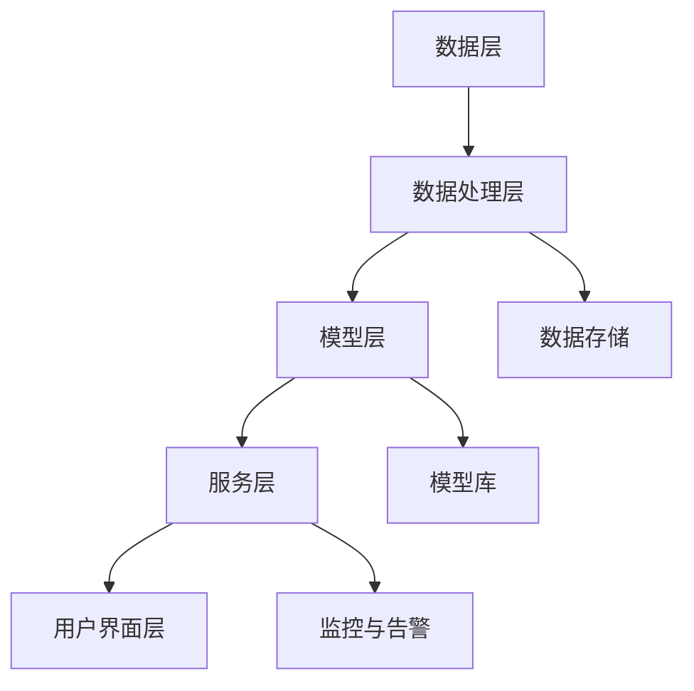

                 


## 文章标题：自动化模型管理

关键词：自动化模型管理，模型生命周期管理，数据预处理，特征工程，模型训练与评估，模型部署与监控

摘要：
本文旨在深入探讨自动化模型管理的概念、原理、技术和实践。通过逐步分析推理的方式，本文首先介绍了自动化模型管理的核心概念和重要性，然后详细阐述了数据质量管理、模型生命周期管理、版本控制与迭代优化等理论基础，以及数据预处理、特征工程、模型训练与评估等关键技术。此外，本文还介绍了自动化模型管理平台的建设方法，以及实际案例中的挑战与解决方案。最后，本文展望了自动化模型管理的未来发展趋势，并总结了最佳实践与资源。

---

### 第一部分：自动化模型管理的背景与核心概念

#### 第1章：自动化模型管理的概述

##### 1.1 自动化模型管理的定义与重要性

自动化模型管理是指通过自动化工具和流程来管理数据、模型和模型运行环境的过程。它的重要性体现在以下几个方面：

1. **提高效率**：自动化模型管理可以减少手动操作，提高数据处理和模型管理的效率。
2. **确保准确性**：自动化流程可以减少人为错误，提高数据质量和模型准确性。
3. **支持迭代**：自动化模型管理支持快速迭代，提高模型更新和优化的速度。

##### 1.2 自动化模型管理的演进与趋势

自动化模型管理的演进可以追溯到数据科学和机器学习的兴起。随着人工智能技术的快速发展，自动化模型管理的重要性越来越受到重视。目前，自动化模型管理的趋势包括：

1. **云计算与分布式计算**：云计算和分布式计算为自动化模型管理提供了强大的计算能力和存储能力。
2. **AI与ML工具的集成**：自动化模型管理工具开始集成AI和ML框架，提高模型开发和管理的一体化程度。
3. **数据湖与数据仓库**：数据湖和数据仓库的兴起为自动化模型管理提供了丰富的数据源。

##### 1.3 自动化模型管理的关键要素

自动化模型管理的关键要素包括：

1. **数据质量**：数据质量是自动化模型管理的基础，高质量的输入数据可以提高模型的准确性。
2. **模型生命周期管理**：模型生命周期管理包括模型开发、训练、部署、监控和更新等环节。
3. **版本控制与迭代优化**：版本控制和迭代优化可以确保模型的持续改进。

#### 第2章：自动化模型管理的理论基础

##### 2.1 数据质量管理与模型准确性

数据质量管理是自动化模型管理的重要环节。高质量的数据可以提高模型的准确性，减少过拟合现象。数据质量管理包括以下几个方面：

1. **数据清洗**：去除重复、错误和缺失的数据。
2. **数据归一化**：将数据转换为统一的格式，方便后续处理。
3. **数据标准化**：将数据转换为标准化的数值范围，方便模型的训练。

##### 2.2 模型生命周期管理

模型生命周期管理包括以下环节：

1. **模型开发**：选择合适的模型架构和参数，进行模型设计和开发。
2. **模型训练**：使用训练数据集对模型进行训练，调整模型参数。
3. **模型评估**：使用验证数据集对模型进行评估，确定模型性能。
4. **模型部署**：将训练好的模型部署到生产环境中，进行实际应用。
5. **模型监控**：对模型进行实时监控，确保模型性能稳定。

##### 2.3 模型版本控制与迭代优化

模型版本控制是自动化模型管理的重要一环。它可以帮助团队跟踪模型的变化，确保模型的可追溯性和可重现性。迭代优化是指通过不断调整模型参数和结构，提高模型性能的过程。

模型版本控制通常包括以下步骤：

1. **版本标识**：为每个模型版本赋予唯一的标识，方便跟踪和管理。
2. **变更记录**：记录每次模型变更的详细信息，包括修改的内容和原因。
3. **版本回滚**：在遇到问题时，可以回滚到之前的版本，确保系统的稳定性。

迭代优化可以通过以下方法进行：

1. **交叉验证**：使用交叉验证方法评估模型性能，选择最优模型。
2. **网格搜索**：通过遍历参数空间，选择最优参数组合。
3. **贝叶斯优化**：使用贝叶斯优化算法，自动选择最佳参数。

#### 第3章：自动化模型管理的技术基础

##### 3.1 数据预处理与清洗

数据预处理与清洗是自动化模型管理的第一步。它包括以下步骤：

1. **数据采集**：从各种数据源采集数据。
2. **数据清洗**：去除重复、错误和缺失的数据。
3. **数据归一化**：将数据转换为统一的格式，方便后续处理。
4. **数据标准化**：将数据转换为标准化的数值范围，方便模型的训练。

##### 3.2 特征工程与模型选择

特征工程是自动化模型管理的关键环节。它包括以下步骤：

1. **特征提取**：从原始数据中提取有用的特征。
2. **特征选择**：选择对模型性能有显著影响的特征。
3. **特征转换**：将特征转换为适合模型训练的格式。

模型选择是自动化模型管理的另一个关键环节。它包括以下步骤：

1. **模型评估**：评估不同模型的性能，选择最优模型。
2. **模型比较**：比较不同模型的优缺点，选择合适的模型。

##### 3.3 模型训练与评估

模型训练是自动化模型管理的核心环节。它包括以下步骤：

1. **数据划分**：将数据集划分为训练集、验证集和测试集。
2. **模型训练**：使用训练集对模型进行训练，调整模型参数。
3. **模型评估**：使用验证集对模型进行评估，确定模型性能。

模型评估通常使用以下指标：

1. **准确率**：模型预测正确的样本比例。
2. **召回率**：模型预测为正类的正类样本比例。
3. **精确率**：模型预测为正类的正类样本比例。

---

### 第二部分：自动化模型管理平台建设

#### 第4章：自动化模型管理平台建设

##### 4.1 自动化模型管理平台架构设计

自动化模型管理平台通常包括以下模块：

1. **数据采集与预处理模块**：负责数据采集、清洗和预处理。
2. **特征工程模块**：负责特征提取、选择和转换。
3. **模型训练与评估模块**：负责模型训练、评估和优化。
4. **模型部署与监控模块**：负责模型部署、监控和更新。

##### 4.2 数据集成与数据存储

1. **数据集成**：平台需要能够集成多种数据源，支持数据流的接入、转换和传输。这可以通过数据集成工具（如Apache NiFi、Apache Kafka等）实现。
2. **数据存储**：平台需要一个高效的数据存储方案，以存储原始数据、预处理数据和模型数据。这可以采用关系型数据库（如MySQL）、NoSQL数据库（如MongoDB）、数据湖（如Hadoop HDFS）或分布式存储系统（如Amazon S3）。

##### 4.3 模型部署与监控

1. **模型部署**：平台需要支持将训练好的模型部署到不同的环境中，如云计算平台（如AWS、Azure）、容器化平台（如Docker）或Kubernetes集群。
2. **模型监控**：平台需要提供监控工具，实时监控模型的运行状态、性能指标和资源消耗，以及时发现和解决问题。

##### 4.4 自动化流程管理

1. **自动化流程**：平台需要支持自动化流程管理，包括数据流、特征工程流程、模型训练流程和部署流程等。这可以通过工作流引擎（如Apache Airflow、Azkaban等）实现。
2. **任务调度**：平台需要能够自动调度任务，确保流程的连续性和稳定性。

##### 4.5 版本控制与迭代优化

1. **版本控制**：平台需要支持模型版本的版本控制，包括创建版本、查看版本历史、回滚版本等。
2. **迭代优化**：平台需要支持迭代优化，包括参数调整、算法改进、模型重构等，以持续提高模型性能。

---

### 第三部分：自动化模型管理实践

#### 第5章：自动化模型管理实践

##### 5.1 自动化模型管理流程设计

自动化模型管理流程设计是确保模型从开发到部署的每个环节都能高效运行的关键。以下是自动化模型管理流程设计的基本步骤：

1. **需求分析**：分析业务需求和目标，确定模型管理的范围和目标。
2. **数据流设计**：设计数据从采集到预处理、特征工程和模型训练的流程。
3. **流程实现**：根据设计，实现自动化流程，包括数据采集、清洗、特征工程和模型训练等。
4. **流程测试**：对自动化流程进行测试，确保其能够正常运行并达到预期效果。
5. **流程部署**：将自动化流程部署到生产环境中，确保其能够连续运行。
6. **流程监控**：实时监控流程的运行状态，及时发现并解决问题。

##### 5.2 自动化模型管理案例解析

以下是一个自动化模型管理的实际案例：

##### 案例背景

某电商平台希望通过自动化模型管理提升其推荐系统的性能，以增加用户参与度和销售额。

##### 案例步骤

1. **需求分析**：分析用户行为数据，确定推荐系统的目标。
2. **数据采集**：从多个数据源（如用户点击记录、购买记录等）采集数据。
3. **数据预处理**：清洗和转换数据，确保数据质量。
4. **特征工程**：提取用户行为特征，如点击、浏览、购买等。
5. **模型训练**：使用用户行为数据训练推荐模型。
6. **模型评估**：使用交叉验证评估模型性能。
7. **模型部署**：将训练好的模型部署到生产环境中。
8. **监控与告警**：实时监控模型性能，设置告警机制，及时发现和解决问题。
9. **迭代优化**：根据用户反馈和模型性能指标，优化模型参数和算法。

##### 案例挑战与解决方案

**挑战**：

- **数据质量**：数据质量直接影响模型性能，需要确保数据清洗和预处理的质量。
- **模型性能**：选择合适的模型和算法，提高模型性能。
- **模型更新**：定期更新模型，以适应业务发展和数据变化。

**解决方案**：

- **数据质量管理**：建立数据质量管理流程，包括数据清洗、验证和监控。
- **模型优化**：使用交叉验证和网格搜索等方法，优化模型参数和算法。
- **模型更新策略**：建立模型更新机制，如定期重新训练模型或使用在线学习技术。

---

### 第四部分：自动化模型管理的未来发展趋势

#### 第6章：自动化模型管理的未来发展趋势

自动化模型管理的未来发展趋势将受到技术进步、市场需求和政策法规等多方面因素的影响。以下是自动化模型管理未来可能的发展方向：

##### 6.1 人工智能与自动化模型管理的深度融合

随着人工智能技术的快速发展，自动化模型管理将与人工智能技术更加紧密地融合。例如，自动化模型管理平台将能够更智能地处理数据、优化模型和调整策略。此外，人工智能算法的进步也将使自动化模型管理平台能够处理更复杂的任务，提高模型的管理效率。

##### 6.2 云原生与边缘计算的结合

云原生技术（如Kubernetes、Docker等）和边缘计算技术的发展将推动自动化模型管理向云原生和边缘计算方向演进。自动化模型管理平台将能够更好地支持在云环境和边缘设备上的部署和运行，实现模型的实时更新和优化。

##### 6.3 模型解释性与透明度的提升

随着自动化模型管理在实际应用中的普及，用户对模型解释性和透明度的需求将日益增加。自动化模型管理平台将需要提供更强大的工具和功能，帮助用户理解模型的决策过程和结果，提高模型的信任度和可接受度。

##### 6.4 模型安全与隐私保护

随着自动化模型管理应用的深入，模型安全与隐私保护将成为重要议题。自动化模型管理平台将需要引入更严格的安全措施，包括数据加密、访问控制和异常检测等，以确保模型和数据的安全。

##### 6.5 知识图谱与本体论的应用

知识图谱和本体论技术的发展将为自动化模型管理带来新的机遇。通过构建领域知识图谱和本体，自动化模型管理平台将能够更好地理解和管理复杂的数据和模型，提高自动化模型管理的智能化程度。

##### 6.6 开放源码与商业合作的共同发展

未来，开放源码与商业合作将共同推动自动化模型管理的发展。一方面，开放源码项目将继续为自动化模型管理提供创新的工具和平台；另一方面，商业公司将通过商业合作和定制化服务，满足不同用户的需求。

##### 6.7 政策法规的规范与引导

随着自动化模型管理应用的深入，相关政策法规的规范与引导将变得至关重要。政府和企业将需要共同制定和实施相关政策和标准，确保自动化模型管理的合规性和可持续发展。

---

### 第五部分：自动化模型管理最佳实践与案例分析

#### 第7章：自动化模型管理最佳实践与案例分析

##### 7.1 自动化模型管理最佳实践

在自动化模型管理实践中，以下最佳实践将有助于提高模型管理的效率和效果：

1. **数据质量管理**：建立数据质量管理流程，确保数据质量。
2. **模型生命周期管理**：定义清晰的模型生命周期管理流程，确保模型的可追溯性和稳定性。
3. **版本控制**：使用版本控制系统管理模型版本，确保模型的可重现性和可维护性。
4. **自动化流程**：设计并实现自动化流程，减少人工干预，提高模型管理的效率。
5. **监控与告警**：建立监控体系，实时监控模型运行状态，及时发现和解决问题。
6. **迭代优化**：定期对模型进行评估和优化，以提高模型性能。

##### 7.2 自动化模型管理案例分析

以下是一个自动化模型管理的实际案例：

##### 案例背景

某金融科技公司希望通过自动化模型管理提升其信用评分模型的性能，以提高客户信用评估的准确性。

##### 案例步骤

1. **需求分析**：分析客户数据，确定信用评分模型的目标。
2. **数据采集**：从多个数据源（如客户信用报告、财务数据等）采集数据。
3. **数据预处理**：清洗和转换数据，确保数据质量。
4. **特征工程**：提取和选择对信用评分有显著影响的关键特征。
5. **模型训练**：使用训练算法（如逻辑回归、决策树等）训练信用评分模型。
6. **模型评估**：使用交叉验证评估模型性能。
7. **模型部署**：将训练好的模型部署到生产环境中。
8. **监控与告警**：实时监控模型性能，设置告警机制，及时发现和解决问题。
9. **迭代优化**：根据模型监控结果，优化模型参数和算法。

##### 案例挑战与解决方案

**挑战**：

- **数据质量**：确保数据的质量和完整性，是模型准确性的基础。
- **模型性能**：选择合适的模型和算法，提高模型性能。
- **模型更新**：定期更新模型，以适应新的业务需求和数据变化。

**解决方案**：

- **数据质量管理**：建立数据质量管理流程，包括数据清洗、验证和监控。
- **模型优化**：使用交叉验证和网格搜索等方法，优化模型参数和算法。
- **模型更新策略**：建立模型更新机制，如定期重新训练模型或使用在线学习技术。

---

### 附录A：自动化模型管理工具与技术

##### A.1 常用自动化模型管理工具

在自动化模型管理领域，以下是一些常用的工具：

- **Apache Airflow**：一个开源的调度工具，用于自动化工作流和数据管道。
- **Apache NiFi**：一个数据集成平台，用于数据流和数据交换。
- **Kubernetes**：一个开源的容器编排系统，用于部署和管理容器化应用。
- **Docker**：一个开源的应用容器引擎，用于打包、交付和运行应用。
- **TensorFlow**：一个开源的机器学习框架，用于构建和训练机器学习模型。
- **PyTorch**：一个开源的机器学习库，用于构建和训练深度学习模型。
- **MLflow**：一个开源平台，用于机器学习实验跟踪、模型管理和部署。
- **Kubeflow**：一个开源项目，用于在Kubernetes上部署机器学习工作流。

##### A.2 自动化模型管理技术选型

在构建自动化模型管理平台时，技术选型是一个关键步骤。以下是一些选型建议：

- **计算环境**：选择适合数据规模和计算需求的计算环境，如本地环境、云计算平台或分布式计算集群。
- **数据存储**：根据数据规模和存储需求，选择合适的数据存储解决方案，如关系型数据库、NoSQL数据库、数据湖或分布式文件系统。
- **数据预处理**：选择合适的数据预处理工具，如Pandas、NumPy等Python库，或使用专用的数据预处理工具。
- **特征工程**：选择合适的特征工程工具和方法，如Scikit-learn、Feature-engine等。
- **机器学习框架**：根据项目需求和模型类型，选择合适的机器学习框架，如TensorFlow、PyTorch、Scikit-learn等。
- **模型训练与评估**：选择合适的模型训练和评估工具，如MLflow、Keras等。
- **模型部署**：选择合适的模型部署工具和平台，如Kubernetes、Docker等。
- **监控与运维**：选择合适的监控和运维工具，如Prometheus、Grafana、Zabbix等。

##### A.3 开源项目与社区资源

自动化模型管理领域有许多开源项目和社区资源，可以帮助用户学习和实践：

- **GitHub**：许多自动化模型管理工具和框架都托管在GitHub上，如Apache Airflow、MLflow、Kubeflow等。
- **Kaggle**：一个数据科学竞赛平台，提供大量的数据集和竞赛项目，适合学习和实践自动化模型管理。
- **DataCamp**：一个在线学习平台，提供丰富的数据科学和自动化模型管理教程。
- **ArXiv**：一个计算机科学和机器学习领域的论文预印本库，提供最新的研究成果和论文。
- **Stack Overflow**：一个编程问答社区，可以解答自动化模型管理相关的技术问题。

---

### 附录B：自动化模型管理资源

自动化模型管理涉及到多个领域，如机器学习、数据工程、软件开发和系统运维等。以下是一些推荐的自动化模型管理资源：

##### B.1 开源项目与社区资源

- **Apache Airflow**：一个开源的工作流调度平台，用于自动化复杂的数据处理和机器学习任务。
- **MLflow**：一个开源平台，用于管理机器学习生命周期，包括实验跟踪、模型版本控制和部署。
- **Kubeflow**：一个开源项目，用于在Kubernetes上构建、训练和部署机器学习模型。
- **TensorFlow**：一个开源的机器学习框架，由Google开发，广泛用于模型训练和部署。
- **PyTorch**：一个开源的机器学习库，由Facebook开发，以其动态图特性受到许多研究者和开发者的喜爱。
- **Scikit-learn**：一个开源的机器学习库，提供简单的接口和丰富的算法，适用于多种数据科学任务。
- **Kubernetes**：一个开源的容器编排平台，用于自动化部署、扩展和管理容器化应用。
- **Docker**：一个开源的应用容器引擎，用于打包、交付和运行应用，与Kubernetes等平台配合使用。

##### B.2 自动化模型管理相关书籍与论文

- **《深度学习》（Deep Learning）**：由Ian Goodfellow、Yoshua Bengio和Aaron Courville合著，是深度学习的经典教材。
- **《Python数据科学手册》（Python Data Science Handbook）**：由Jake VanderPlas编写，涵盖数据科学的基础知识，包括数据处理、分析和可视化。
- **《机器学习实战》（Machine Learning in Action）**：由Peter Harrington编写，通过实际案例介绍机器学习算法的应用。
- **《机器学习：概率视角》（Machine Learning: A Probabilistic Perspective）**：由Kevin P. Murphy编写，从概率论的角度介绍机器学习。
- **《大数据之路：阿里巴巴大数据实践》**：由阿里巴巴集团编写，介绍大数据处理和分析的实践经验和案例。
- **《数据科学实战》**：由Caitlin Cass编写，介绍数据科学的全流程，包括数据采集、处理、分析和可视化。

##### B.3 在线课程与培训

- **Coursera**：提供多个数据科学和机器学习相关的在线课程，由世界顶尖大学和公司提供。
- **edX**：提供由哈佛大学、麻省理工学院等知名大学提供的在线课程，涵盖计算机科学和人工智能等领域。
- **Udacity**：提供数据科学和机器学习的实战课程，注重技能培养和项目实践。
- **DataCamp**：提供互动式在线课程，涵盖Python编程、数据处理和机器学习基础知识。

通过这些资源，用户可以深入了解自动化模型管理的理论和实践，提升自己的技术能力，并在实际项目中应用这些知识。这些资源不仅适合初学者，也为经验丰富的从业者提供了继续学习和探索的途径。

---

### 作者信息：

作者：AI天才研究院/AI Genius Institute & 禅与计算机程序设计艺术 /Zen And The Art of Computer Programming

---

### 文章标题：自动化模型管理

关键词：自动化模型管理，模型生命周期管理，数据预处理，特征工程，模型训练与评估，模型部署与监控

摘要：
本文旨在深入探讨自动化模型管理的概念、原理、技术和实践。通过逐步分析推理的方式，本文首先介绍了自动化模型管理的核心概念和重要性，然后详细阐述了数据质量管理、模型生命周期管理、版本控制与迭代优化等理论基础，以及数据预处理、特征工程、模型训练与评估等关键技术。此外，本文还介绍了自动化模型管理平台的建设方法，以及实际案例中的挑战与解决方案。最后，本文展望了自动化模型管理的未来发展趋势，并总结了最佳实践与资源。

---

### 第一部分：自动化模型管理的背景与核心概念

#### 第1章：自动化模型管理的概述

##### 1.1 自动化模型管理的定义与重要性

自动化模型管理是指通过自动化工具和流程来管理数据、模型和模型运行环境的过程。它的重要性体现在以下几个方面：

- **提高效率**：自动化模型管理可以减少手动操作，提高数据处理和模型管理的效率。
- **确保准确性**：自动化流程可以减少人为错误，提高数据质量和模型准确性。
- **支持迭代**：自动化模型管理支持快速迭代，提高模型更新和优化的速度。

##### 1.2 自动化模型管理的演进与趋势

自动化模型管理的演进可以追溯到数据科学和机器学习的兴起。随着人工智能技术的快速发展，自动化模型管理的重要性越来越受到重视。目前，自动化模型管理的趋势包括：

- **云计算与分布式计算**：云计算和分布式计算为自动化模型管理提供了强大的计算能力和存储能力。
- **AI与ML工具的集成**：自动化模型管理工具开始集成AI和ML框架，提高模型开发和管理的一体化程度。
- **数据湖与数据仓库**：数据湖和数据仓库的兴起为自动化模型管理提供了丰富的数据源。

##### 1.3 自动化模型管理的关键要素

自动化模型管理的关键要素包括：

- **数据质量**：数据质量是自动化模型管理的基础，高质量的输入数据可以提高模型的准确性。
- **模型生命周期管理**：模型生命周期管理包括模型开发、训练、部署、监控和更新等环节。
- **版本控制与迭代优化**：版本控制和迭代优化可以确保模型的持续改进。

---

#### 第2章：自动化模型管理的理论基础

##### 2.1 数据质量管理与模型准确性

数据质量管理是自动化模型管理的重要环节。高质量的数据可以提高模型的准确性，减少过拟合现象。数据质量管理包括以下几个方面：

- **数据清洗**：去除重复、错误和缺失的数据。
- **数据归一化**：将数据转换为统一的格式，方便后续处理。
- **数据标准化**：将数据转换为标准化的数值范围，方便模型的训练。

##### 2.2 模型生命周期管理

模型生命周期管理包括以下环节：

- **模型开发**：选择合适的模型架构和参数，进行模型设计和开发。
- **模型训练**：使用训练数据集对模型进行训练，调整模型参数。
- **模型评估**：使用验证数据集对模型进行评估，确定模型性能。
- **模型部署**：将训练好的模型部署到生产环境中，进行实际应用。
- **模型监控**：对模型进行实时监控，确保模型性能稳定。

##### 2.3 模型版本控制与迭代优化

模型版本控制是自动化模型管理的重要一环。它可以帮助团队跟踪模型的变化，确保模型的可追溯性和可重现性。迭代优化是指通过不断调整模型参数和结构，提高模型性能的过程。

模型版本控制通常包括以下步骤：

- **版本标识**：为每个模型版本赋予唯一的标识，方便跟踪和管理。
- **变更记录**：记录每次模型变更的详细信息，包括修改的内容和原因。
- **版本回滚**：在遇到问题时，可以回滚到之前的版本，确保系统的稳定性。

迭代优化可以通过以下方法进行：

- **交叉验证**：使用交叉验证方法评估模型性能，选择最优模型。
- **网格搜索**：通过遍历参数空间，选择最优参数组合。
- **贝叶斯优化**：使用贝叶斯优化算法，自动选择最佳参数。

---

#### 第3章：自动化模型管理的技术基础

##### 3.1 数据预处理与清洗

数据预处理与清洗是自动化模型管理的第一步。它包括以下步骤：

- **数据采集**：从各种数据源采集数据。
- **数据清洗**：去除重复、错误和缺失的数据。
- **数据归一化**：将数据转换为统一的格式，方便后续处理。
- **数据标准化**：将数据转换为标准化的数值范围，方便模型的训练。

##### 3.2 特征工程与模型选择

特征工程是自动化模型管理的关键环节。它包括以下步骤：

- **特征提取**：从原始数据中提取有用的特征。
- **特征选择**：选择对模型性能有显著影响的特征。
- **特征转换**：将特征转换为适合模型训练的格式。

模型选择是自动化模型管理的另一个关键环节。它包括以下步骤：

- **模型评估**：评估不同模型的性能，选择最优模型。
- **模型比较**：比较不同模型的优缺点，选择合适的模型。

##### 3.3 模型训练与评估

模型训练是自动化模型管理的核心环节。它包括以下步骤：

- **数据划分**：将数据集划分为训练集、验证集和测试集。
- **模型训练**：使用训练集对模型进行训练，调整模型参数。
- **模型评估**：使用验证集对模型进行评估，确定模型性能。

模型评估通常使用以下指标：

- **准确率**：模型预测正确的样本比例。
- **召回率**：模型预测为正类的正类样本比例。
- **精确率**：模型预测为正类的正类样本比例。

---

#### 第4章：自动化模型管理平台建设

##### 4.1 自动化模型管理平台架构设计

自动化模型管理平台通常包括以下模块：

- **数据采集与预处理模块**：负责数据采集、清洗和预处理。
- **特征工程模块**：负责特征提取、选择和转换。
- **模型训练与评估模块**：负责模型训练、评估和优化。
- **模型部署与监控模块**：负责模型部署、监控和更新。

##### 4.2 数据集成与数据存储

- **数据集成**：平台需要能够集成多种数据源，支持数据流的接入、转换和传输。这可以通过数据集成工具（如Apache NiFi、Apache Kafka等）实现。
- **数据存储**：平台需要一个高效的数据存储方案，以存储原始数据、预处理数据和模型数据。这可以采用关系型数据库（如MySQL）、NoSQL数据库（如MongoDB）、数据湖（如Hadoop HDFS）或分布式存储系统（如Amazon S3）。

##### 4.3 模型部署与监控

- **模型部署**：平台需要支持将训练好的模型部署到不同的环境中，如云计算平台（如AWS、Azure）、容器化平台（如Docker）或Kubernetes集群。
- **模型监控**：平台需要提供监控工具，实时监控模型的运行状态、性能指标和资源消耗，以及时发现和解决问题。

##### 4.4 自动化流程管理

- **自动化流程**：平台需要支持自动化流程管理，包括数据流、特征工程流程、模型训练流程和部署流程等。这可以通过工作流引擎（如Apache Airflow、Azkaban等）实现。
- **任务调度**：平台需要能够自动调度任务，确保流程的连续性和稳定性。

##### 4.5 版本控制与迭代优化

- **版本控制**：平台需要支持模型版本的版本控制，包括创建版本、查看版本历史、回滚版本等。
- **迭代优化**：平台需要支持迭代优化，包括参数调整、算法改进、模型重构等，以持续提高模型性能。

---

#### 第5章：自动化模型管理实践

##### 5.1 自动化模型管理流程设计

自动化模型管理流程设计是确保模型从开发到部署的每个环节都能高效运行的关键。以下是自动化模型管理流程设计的基本步骤：

1. **需求分析**：分析业务需求和目标，确定模型管理的范围和目标。
2. **数据流设计**：设计数据从采集到预处理、特征工程和模型训练的流程。
3. **流程实现**：根据设计，实现自动化流程，包括数据采集、清洗、特征工程和模型训练等。
4. **流程测试**：对自动化流程进行测试，确保其能够正常运行并达到预期效果。
5. **流程部署**：将自动化流程部署到生产环境中，确保其能够连续运行。
6. **流程监控**：实时监控流程的运行状态，及时发现并解决问题。

##### 5.2 自动化模型管理案例解析

以下是一个自动化模型管理的实际案例：

##### 案例背景

某电商平台希望通过自动化模型管理提升其推荐系统的性能，以增加用户参与度和销售额。

##### 案例步骤

1. **需求分析**：分析用户行为数据，确定推荐系统的目标。
2. **数据采集**：从多个数据源（如用户点击记录、购买记录等）采集数据。
3. **数据预处理**：清洗和转换数据，确保数据质量。
4. **特征工程**：提取用户行为特征，如点击、浏览、购买等。
5. **模型训练**：使用用户行为数据训练推荐模型。
6. **模型评估**：使用交叉验证评估模型性能。
7. **模型部署**：将训练好的模型部署到生产环境中。
8. **监控与告警**：实时监控模型性能，设置告警机制，及时发现和解决问题。
9. **迭代优化**：根据用户反馈和模型性能指标，优化模型参数和算法。

##### 案例挑战与解决方案

**挑战**：

- **数据质量**：数据质量直接影响模型性能，需要确保数据清洗和预处理的质量。
- **模型性能**：选择合适的模型和算法，提高模型性能。
- **模型更新**：定期更新模型，以适应业务发展和数据变化。

**解决方案**：

- **数据质量管理**：建立数据质量管理流程，包括数据清洗、验证和监控。
- **模型优化**：使用交叉验证和网格搜索等方法，优化模型参数和算法。
- **模型更新策略**：建立定期更新模型机制，如定期重新训练模型或使用在线学习技术。

---

#### 第6章：自动化模型管理的未来发展趋势

##### 6.1 人工智能与自动化模型管理的深度融合

随着人工智能技术的快速发展，自动化模型管理将与人工智能技术更加紧密地融合。例如，自动化模型管理平台将能够更智能地处理数据、优化模型和调整策略。此外，人工智能算法的进步也将使自动化模型管理平台能够处理更复杂的任务，提高模型的管理效率。

##### 6.2 云原生与边缘计算的结合

云原生技术（如Kubernetes、Docker等）和边缘计算技术的发展将推动自动化模型管理向云原生和边缘计算方向演进。自动化模型管理平台将能够更好地支持在云环境和边缘设备上的部署和运行，实现模型的实时更新和优化。

##### 6.3 模型解释性与透明度的提升

随着自动化模型管理在实际应用中的普及，用户对模型解释性和透明度的需求将日益增加。自动化模型管理平台将需要提供更强大的工具和功能，帮助用户理解模型的决策过程和结果，提高模型的信任度和可接受度。

##### 6.4 模型安全与隐私保护

随着自动化模型管理应用的深入，模型安全与隐私保护将成为重要议题。自动化模型管理平台将需要引入更严格的安全措施，包括数据加密、访问控制和异常检测等，以确保模型和数据的安全。

##### 6.5 知识图谱与本体论的应用

知识图谱和本体论技术的发展将为自动化模型管理带来新的机遇。通过构建领域知识图谱和本体，自动化模型管理平台将能够更好地理解和管理复杂的数据和模型，提高自动化模型管理的智能化程度。

##### 6.6 开放源码与商业合作的共同发展

未来，开放源码与商业合作将共同推动自动化模型管理的发展。一方面，开放源码项目将继续为自动化模型管理提供创新的工具和平台；另一方面，商业公司将通过商业合作和定制化服务，满足不同用户的需求。

##### 6.7 政策法规的规范与引导

随着自动化模型管理应用的深入，相关政策法规的规范与引导将变得至关重要。政府和企业将需要共同制定和实施相关政策和标准，确保自动化模型管理的合规性和可持续发展。

---

#### 第7章：自动化模型管理最佳实践与案例分析

##### 7.1 自动化模型管理最佳实践

在自动化模型管理实践中，以下最佳实践将有助于提高模型管理的效率和效果：

- **数据质量管理**：建立数据质量管理流程，确保数据质量。
- **模型生命周期管理**：定义清晰的模型生命周期管理流程，确保模型的可追溯性和稳定性。
- **版本控制**：使用版本控制系统管理模型版本，确保模型的可重现性和可维护性。
- **自动化流程**：设计并实现自动化流程，减少人工干预，提高模型管理的效率。
- **监控与告警**：建立监控体系，实时监控模型运行状态，及时发现和解决问题。
- **迭代优化**：定期对模型进行评估和优化，以提高模型性能。

##### 7.2 自动化模型管理案例分析

以下是一个自动化模型管理的实际案例：

##### 案例背景

某金融科技公司希望通过自动化模型管理提升其信用评分模型的性能，以提高客户信用评估的准确性。

##### 案例步骤

1. **需求分析**：分析客户数据，确定信用评分模型的目标。
2. **数据采集**：从多个数据源（如客户信用报告、财务数据等）采集数据。
3. **数据预处理**：清洗和转换数据，确保数据质量。
4. **特征工程**：提取和选择对信用评分有显著影响的关键特征。
5. **模型训练**：使用训练算法（如逻辑回归、决策树等）训练信用评分模型。
6. **模型评估**：使用交叉验证评估模型性能。
7. **模型部署**：将训练好的模型部署到生产环境中。
8. **监控与告警**：实时监控模型性能，设置告警机制，及时发现和解决问题。
9. **迭代优化**：根据模型监控结果，优化模型参数和算法。

##### 案例挑战与解决方案

**挑战**：

- **数据质量**：确保数据的质量和完整性，是模型准确性的基础。
- **模型性能**：选择合适的模型和算法，提高模型性能。
- **模型更新**：定期更新模型，以适应新的业务需求和数据变化。

**解决方案**：

- **数据质量管理**：建立数据质量管理流程，包括数据清洗、验证和监控。
- **模型优化**：使用交叉验证和网格搜索等方法，优化模型参数和算法。
- **模型更新策略**：建立模型更新机制，如定期重新训练模型或使用在线学习技术。

---

#### 附录A：自动化模型管理工具与技术

##### A.1 常用自动化模型管理工具

在自动化模型管理领域，以下是一些常用的工具：

- **Apache Airflow**：一个开源的调度工具，用于自动化工作流和数据管道。
- **Apache NiFi**：一个数据集成平台，用于数据流和数据交换。
- **Kubernetes**：一个开源的容器编排系统，用于部署和管理容器化应用。
- **Docker**：一个开源的应用容器引擎，用于打包、交付和运行应用。
- **TensorFlow**：一个开源的机器学习框架，用于构建和训练机器学习模型。
- **PyTorch**：一个开源的机器学习库，用于构建和训练深度学习模型。
- **MLflow**：一个开源平台，用于机器学习实验跟踪、模型管理和部署。
- **Kubeflow**：一个开源项目，用于在Kubernetes上部署机器学习工作流。

##### A.2 自动化模型管理技术选型

在构建自动化模型管理平台时，技术选型是一个关键步骤。以下是一些选型建议：

- **计算环境**：选择适合数据规模和计算需求的计算环境，如本地环境、云计算平台或分布式计算集群。
- **数据存储**：根据数据规模和存储需求，选择合适的数据存储解决方案，如关系型数据库、NoSQL数据库、数据湖或分布式文件系统。
- **数据预处理**：选择合适的数据预处理工具，如Pandas、NumPy等Python库，或使用专用的数据预处理工具。
- **特征工程**：选择合适的特征工程工具和方法，如Scikit-learn、Feature-engine等。
- **机器学习框架**：根据项目需求和模型类型，选择合适的机器学习框架，如TensorFlow、PyTorch、Scikit-learn等。
- **模型训练与评估**：选择合适的模型训练和评估工具，如MLflow、Keras等。
- **模型部署**：选择合适的模型部署工具和平台，如Kubernetes、Docker等。
- **监控与运维**：选择合适的监控和运维工具，如Prometheus、Grafana、Zabbix等。

##### A.3 开源项目与社区资源

自动化模型管理领域有许多开源项目和社区资源，可以帮助用户学习和实践：

- **GitHub**：许多自动化模型管理工具和框架都托管在GitHub上，如Apache Airflow、MLflow、Kubeflow等。
- **Kaggle**：一个数据科学竞赛平台，提供大量的数据集和竞赛项目，适合学习和实践自动化模型管理。
- **DataCamp**：一个在线学习平台，提供丰富的数据科学和自动化模型管理教程。
- **ArXiv**：一个计算机科学和机器学习领域的论文预印本库，提供最新的研究成果和论文。
- **Stack Overflow**：一个编程问答社区，可以解答自动化模型管理相关的技术问题。

---

#### 附录B：自动化模型管理资源

自动化模型管理涉及到多个领域，如机器学习、数据工程、软件开发和系统运维等。以下是一些推荐的自动化模型管理资源：

##### B.1 开源项目与社区资源

- **Apache Airflow**：一个开源的工作流调度平台，用于自动化复杂的数据处理和机器学习任务。
- **MLflow**：一个开源平台，用于管理机器学习生命周期，包括实验跟踪、模型版本控制和部署。
- **Kubeflow**：一个开源项目，用于在Kubernetes上构建、训练和部署机器学习模型。
- **TensorFlow**：一个开源的机器学习框架，由Google开发，广泛用于模型训练和部署。
- **PyTorch**：一个开源的机器学习库，由Facebook开发，以其动态图特性受到许多研究者和开发者的喜爱。
- **Scikit-learn**：一个开源的机器学习库，提供简单的接口和丰富的算法，适用于多种数据科学任务。
- **Kubernetes**：一个开源的容器编排平台，用于自动化部署、扩展和管理容器化应用。
- **Docker**：一个开源的应用容器引擎，用于打包、交付和运行应用，与Kubernetes等平台配合使用。

##### B.2 自动化模型管理相关书籍与论文

- **《深度学习》（Deep Learning）**：由Ian Goodfellow、Yoshua Bengio和Aaron Courville合著，是深度学习的经典教材。
- **《Python数据科学手册》（Python Data Science Handbook）**：由Jake VanderPlas编写，涵盖数据科学的基础知识，包括数据处理、分析和可视化。
- **《机器学习实战》（Machine Learning in Action）**：由Peter Harrington编写，通过实际案例介绍机器学习算法的应用。
- **《机器学习：概率视角》（Machine Learning: A Probabilistic Perspective）**：由Kevin P. Murphy编写，从概率论的角度介绍机器学习。
- **《大数据之路：阿里巴巴大数据实践》**：由阿里巴巴集团编写，介绍大数据处理和分析的实践经验和案例。
- **《数据科学实战》**：由Caitlin Cass编写，介绍数据科学的全流程，包括数据采集、处理、分析和可视化。

##### B.3 在线课程与培训

- **Coursera**：提供多个数据科学和机器学习相关的在线课程，由世界顶尖大学和公司提供。
- **edX**：提供由哈佛大学、麻省理工学院等知名大学提供的在线课程，涵盖计算机科学和人工智能等领域。
- **Udacity**：提供数据科学和机器学习的实战课程，注重技能培养和项目实践。
- **DataCamp**：提供互动式在线课程，涵盖Python编程、数据处理和机器学习基础知识。

---

### 作者信息：

作者：AI天才研究院/AI Genius Institute & 禅与计算机程序设计艺术 /Zen And The Art of Computer Programming

---

### 文章标题：自动化模型管理

关键词：自动化模型管理，模型生命周期管理，数据预处理，特征工程，模型训练与评估，模型部署与监控

摘要：
本文旨在深入探讨自动化模型管理的概念、原理、技术和实践。通过逐步分析推理的方式，本文首先介绍了自动化模型管理的核心概念和重要性，然后详细阐述了数据质量管理、模型生命周期管理、版本控制与迭代优化等理论基础，以及数据预处理、特征工程、模型训练与评估等关键技术。此外，本文还介绍了自动化模型管理平台的建设方法，以及实际案例中的挑战与解决方案。最后，本文展望了自动化模型管理的未来发展趋势，并总结了最佳实践与资源。

---

## 文章标题：自动化模型管理

关键词：自动化模型管理，模型生命周期管理，数据预处理，特征工程，模型训练与评估，模型部署与监控

摘要：
本文旨在深入探讨自动化模型管理的概念、原理、技术和实践。通过逐步分析推理的方式，本文首先介绍了自动化模型管理的核心概念和重要性，然后详细阐述了数据质量管理、模型生命周期管理、版本控制与迭代优化等理论基础，以及数据预处理、特征工程、模型训练与评估等关键技术。此外，本文还介绍了自动化模型管理平台的建设方法，以及实际案例中的挑战与解决方案。最后，本文展望了自动化模型管理的未来发展趋势，并总结了最佳实践与资源。

---

### 第一部分：自动化模型管理的背景与核心概念

#### 第1章：自动化模型管理的概述

##### 1.1 自动化模型管理的定义与重要性

自动化模型管理是一种通过自动化工具和流程来管理机器学习模型的方法。它包括从数据收集、预处理、模型训练、评估、部署到监控的整个过程。自动化模型管理的重要性在于：

- **提高效率**：自动化模型管理减少了重复性工作，提高了数据处理和模型迭代的效率。
- **确保准确性**：通过自动化流程，减少了人为错误，提高了数据质量和模型准确性。
- **支持迭代**：自动化模型管理使得模型更新和优化更加频繁，有助于快速响应业务需求。

##### 1.2 自动化模型管理的演进与趋势

自动化模型管理的发展与机器学习技术的进步密切相关。随着云计算、大数据和人工智能技术的快速发展，自动化模型管理也逐渐成为企业级应用的重要组成部分。当前的自动化模型管理趋势包括：

- **云计算集成**：自动化模型管理工具越来越多地与云平台集成，利用云资源进行大规模数据处理和模型训练。
- **机器学习平台化**：自动化模型管理工具开始集成机器学习框架，提供一站式的模型开发和管理解决方案。
- **边缘计算**：自动化模型管理逐渐向边缘设备扩展，以实现实时数据分析和决策。

##### 1.3 自动化模型管理的关键要素

自动化模型管理涉及多个关键要素，包括：

- **数据质量**：高质量的数据是自动化模型管理的基础，需要通过数据清洗、归一化和标准化等步骤确保数据质量。
- **模型生命周期管理**：模型的生命周期包括开发、训练、部署、监控和迭代等阶段，需要建立完善的流程和工具来管理。
- **版本控制**：通过版本控制，可以跟踪模型的变化，确保模型的可重现性和可维护性。
- **自动化流程**：设计并实现自动化流程，减少手动操作，提高模型管理的效率。

---

#### 第2章：自动化模型管理的理论基础

##### 2.1 数据质量管理与模型准确性

数据质量管理是自动化模型管理的核心环节。数据质量的好坏直接影响模型的准确性。以下是数据质量管理的关键步骤：

- **数据清洗**：去除重复、错误和缺失的数据，确保数据的完整性和一致性。
- **数据归一化**：将不同尺度的数据进行归一化处理，使其在相同的尺度上进行分析。
- **数据标准化**：将数据转换为标准化的数值范围，以适应模型的训练过程。

数据质量管理的目的是提高模型的泛化能力，减少过拟合现象。

##### 2.2 模型生命周期管理

模型生命周期管理是指从模型开发到退役的整个流程。以下是模型生命周期的关键阶段：

- **模型开发**：选择合适的模型架构和算法，进行模型设计和实现。
- **模型训练**：使用训练数据集对模型进行训练，调整模型参数。
- **模型评估**：使用验证数据集对模型进行评估，确定模型性能。
- **模型部署**：将训练好的模型部署到生产环境中，进行实际应用。
- **模型监控**：对模型进行实时监控，确保其性能稳定。
- **模型迭代**：根据模型监控结果，对模型进行优化和更新。

模型生命周期管理的目标是确保模型的高效、稳定和持续改进。

##### 2.3 版本控制与迭代优化

版本控制是自动化模型管理的重要组成部分。通过版本控制，可以跟踪模型的迭代过程，确保模型的版本可追溯性和可重现性。以下是版本控制的关键步骤：

- **版本标识**：为每个模型版本赋予唯一的标识，方便管理和跟踪。
- **版本记录**：记录每次模型变更的详细信息，包括修改的内容和原因。
- **版本回滚**：在模型出现问题时，可以回滚到之前的版本，确保系统的稳定性。

迭代优化是通过不断调整模型参数和算法，提高模型性能的过程。常见的迭代优化方法包括：

- **交叉验证**：使用交叉验证方法评估模型性能，选择最优模型。
- **网格搜索**：通过遍历参数空间，选择最优参数组合。
- **贝叶斯优化**：使用贝叶斯优化算法，自动选择最佳参数。

---

#### 第3章：自动化模型管理的技术基础

##### 3.1 数据预处理与清洗

数据预处理是自动化模型管理的基础步骤。以下是数据预处理的关键任务：

- **数据采集**：从各种数据源（如数据库、API、日志等）采集数据。
- **数据清洗**：去除重复、错误和缺失的数据，确保数据的完整性。
- **数据归一化**：将不同尺度的数据进行归一化处理，使其在相同的尺度上进行分析。
- **数据标准化**：将数据转换为标准化的数值范围，以适应模型的训练过程。

以下是数据预处理的一个伪代码示例：

```python
# 数据预处理伪代码
def preprocess_data(data):
    # 去除重复数据
    data = remove_duplicates(data)
    # 填补缺失值
    data = fill_missing_values(data)
    # 归一化数据
    data = normalize_data(data)
    # 标准化数据
    data = standardize_data(data)
    return data
```

##### 3.2 特征工程与模型选择

特征工程是自动化模型管理的关键环节。以下是特征工程的关键步骤：

- **特征提取**：从原始数据中提取有用的特征。
- **特征选择**：选择对模型性能有显著影响的特征。
- **特征转换**：将特征转换为适合模型训练的格式。

以下是特征工程的一个伪代码示例：

```python
# 特征工程伪代码
def feature_engineering(data):
    # 特征提取
    features = extract_features(data)
    # 特征选择
    selected_features = select_features(features)
    # 特征转换
    transformed_features = convert_features(selected_features)
    return transformed_features
```

模型选择是自动化模型管理的另一个关键环节。以下是模型选择的关键步骤：

- **模型评估**：评估不同模型的性能，选择最优模型。
- **模型比较**：比较不同模型的优缺点，选择合适的模型。

以下是模型选择的一个伪代码示例：

```python
# 模型选择伪代码
def model_selection(data, labels):
    # 评估不同模型
    model_performance = evaluate_models(data, labels)
    # 选择最优模型
    best_model = select_best_model(model_performance)
    return best_model
```

##### 3.3 模型训练与评估

模型训练是自动化模型管理的核心环节。以下是模型训练的关键步骤：

- **数据划分**：将数据集划分为训练集、验证集和测试集。
- **模型训练**：使用训练集对模型进行训练，调整模型参数。
- **模型评估**：使用验证集对模型进行评估，确定模型性能。

以下是模型训练与评估的一个伪代码示例：

```python
# 模型训练与评估伪代码
def train_and_evaluate_model(data, labels):
    # 数据划分
    train_data, val_data, test_data = split_data(data, labels)
    # 模型训练
    model = train_model(train_data)
    # 模型评估
    performance = evaluate_model(model, test_data)
    return performance
```

模型评估通常使用以下指标：

- **准确率**（Accuracy）：模型预测正确的样本比例。
- **召回率**（Recall）：模型预测为正类的正类样本比例。
- **精确率**（Precision）：模型预测为正类的正类样本比例。
- **F1分数**（F1 Score）：综合考虑精确率和召回率的指标。

---

#### 第4章：自动化模型管理平台建设

##### 4.1 自动化模型管理平台架构设计

自动化模型管理平台是一个复杂的系统，需要支持从数据采集、预处理、特征工程、模型训练到部署和监控的整个过程。以下是自动化模型管理平台的关键架构组件：

- **数据层**：负责数据采集、存储和管理，包括关系型数据库、NoSQL数据库和数据湖等。
- **数据处理层**：负责数据清洗、预处理、特征工程等任务，包括数据清洗工具、ETL（Extract, Transform, Load）工具等。
- **模型层**：负责模型开发、训练和评估，包括机器学习框架、深度学习库等。
- **服务层**：负责模型的部署和监控，包括API服务、模型管理工具等。
- **用户界面层**：提供用户交互界面，便于用户操作和管理模型。

以下是自动化模型管理平台的Mermaid流程图：



##### 4.2 数据集成与数据存储

数据集成是将不同来源的数据进行整合的过程。自动化模型管理平台需要支持多种数据源的接入，如关系型数据库、NoSQL数据库、文件系统等。以下是数据集成的主要步骤：

- **数据接入**：通过ODBC、JDBC等接口连接不同的数据源。
- **数据转换**：将不同数据源的数据转换为统一的格式，如JSON、CSV等。
- **数据存储**：将转换后的数据存储到数据湖或数据仓库中，便于后续处理。

以下是数据集成的一个伪代码示例：

```python
# 数据集成伪代码
def integrate_data(data_sources):
    # 连接数据源
    connections = connect_data_sources(data_sources)
    # 转换数据
    transformed_data = transform_data(connections)
    # 存储数据
    store_data(transformed_data)
```

数据存储是自动化模型管理平台的重要组成部分。以下是数据存储的主要考虑因素：

- **数据规模**：选择适合数据规模的数据存储方案，如关系型数据库、NoSQL数据库、数据湖等。
- **数据安全性**：确保数据的安全性和隐私保护，如数据加密、访问控制等。
- **数据可扩展性**：选择可扩展的数据存储方案，以应对数据规模的增长。

##### 4.3 模型部署与监控

模型部署是将训练好的模型部署到生产环境中，以便在实际业务中应用。以下是模型部署的主要步骤：

- **模型打包**：将模型代码和依赖打包成可部署的格式，如Python包、Docker镜像等。
- **模型部署**：将打包好的模型部署到服务器或云平台中，如Kubernetes集群、AWS Lambda等。
- **模型监控**：监控模型的运行状态、性能指标和资源消耗，以及时发现和解决问题。

以下是模型部署与监控的一个伪代码示例：

```python
# 模型部署与监控伪代码
def deploy_and_monitor_model(model, environment):
    # 模型打包
    model_package = package_model(model)
    # 模型部署
    deploy_model(model_package, environment)
    # 模型监控
    monitor_model(environment)
```

模型监控是自动化模型管理的重要环节。以下是模型监控的主要指标：

- **响应时间**：模型处理请求的平均时间。
- **准确率**：模型预测的准确率。
- **错误率**：模型预测错误的样本比例。
- **资源消耗**：模型运行过程中消耗的CPU、内存等资源。

---

#### 第5章：自动化模型管理实践

##### 5.1 自动化模型管理流程设计

自动化模型管理流程设计是确保模型从开发到部署的每个环节都能高效运行的关键。以下是自动化模型管理流程设计的基本步骤：

1. **需求分析**：分析业务需求和目标，确定模型管理的范围和目标。
2. **数据流设计**：设计数据从采集到预处理、特征工程和模型训练的流程。
3. **流程实现**：根据设计，实现自动化流程，包括数据采集、清洗、特征工程和模型训练等。
4. **流程测试**：对自动化流程进行测试，确保其能够正常运行并达到预期效果。
5. **流程部署**：将自动化流程部署到生产环境中，确保其能够连续运行。
6. **流程监控**：实时监控流程的运行状态，及时发现并解决问题。

以下是自动化模型管理流程设计的一个伪代码示例：

```python
# 自动化模型管理流程设计伪代码
def design_automated_model_management流程():
    # 需求分析
    requirements = analyze_requirements()
    # 数据流设计
    data_flow = design_data_flow()
    # 流程实现
    process = implement流程(data_flow)
    # 流程测试
    test_process(process)
    # 流程部署
    deploy_process(process)
    # 流程监控
    monitor_process(process)
```

##### 5.2 自动化模型管理案例解析

以下是一个自动化模型管理的实际案例：

##### 案例背景

某电商平台希望通过自动化模型管理提升其推荐系统的性能，以增加用户参与度和销售额。

##### 案例步骤

1. **需求分析**：分析用户行为数据，确定推荐系统的目标。
2. **数据采集**：从多个数据源（如用户点击记录、购买记录等）采集数据。
3. **数据预处理**：清洗和转换数据，确保数据质量。
4. **特征工程**：提取用户行为特征，如点击、浏览、购买等。
5. **模型训练**：使用用户行为数据训练推荐模型。
6. **模型评估**：使用交叉验证评估模型性能。
7. **模型部署**：将训练好的模型部署到生产环境中。
8. **监控与告警**：实时监控模型性能，设置告警机制，及时发现和解决问题。
9. **迭代优化**：根据用户反馈和模型性能指标，优化模型参数和算法。

##### 案例挑战与解决方案

**挑战**：

- **数据质量**：数据质量直接影响模型性能，需要确保数据清洗和预处理的质量。
- **模型性能**：选择合适的模型和算法，提高模型性能。
- **模型更新**：定期更新模型，以适应业务发展和数据变化。

**解决方案**：

- **数据质量管理**：建立数据质量管理流程，包括数据清洗、验证和监控。
- **模型优化**：使用交叉验证和网格搜索等方法，优化模型参数和算法。
- **模型更新策略**：建立定期更新模型机制，如定期重新训练模型或使用在线学习技术。

---

#### 第6章：自动化模型管理的未来发展趋势

##### 6.1 人工智能与自动化模型管理的深度融合

随着人工智能技术的快速发展，自动化模型管理将更加智能化。以下是人工智能与自动化模型管理深度融合的几个趋势：

- **自动化模型调参**：使用自动化算法（如贝叶斯优化、进化算法等）进行模型参数调整，提高模型性能。
- **自动化模型选择**：通过自动化方法选择最优模型，减少人工干预。
- **自动化模型解释**：使用自动化工具解释模型的决策过程，提高模型的透明度和可解释性。

##### 6.2 云原生与边缘计算的融合

云原生技术和边缘计算的发展将推动自动化模型管理向云原生和边缘计算方向演进。以下是云原生与边缘计算融合的几个趋势：

- **云原生自动化模型管理平台**：利用容器化技术（如Docker、Kubernetes等）构建自动化模型管理平台，提高部署和扩展的灵活性。
- **边缘智能**：在边缘设备上部署轻量级模型，实现实时数据分析和决策。
- **混合云架构**：结合云和边缘设备的优势，构建高效的自动化模型管理解决方案。

##### 6.3 模型安全与隐私保护

随着自动化模型管理应用的普及，模型安全与隐私保护变得越来越重要。以下是模型安全与隐私保护的几个趋势：

- **数据加密**：使用数据加密技术保护数据安全和隐私。
- **访问控制**：实施严格的访问控制策略，防止未经授权的访问和操作。
- **异常检测**：使用自动化工具检测和防御异常行为和攻击。

##### 6.4 开源与商业合作的共同发展

未来，开源与商业合作将共同推动自动化模型管理的发展。以下是开源与商业合作的几个趋势：

- **开源自动化模型管理平台**：开源项目将提供更多先进的自动化模型管理工具和平台。
- **商业自动化模型管理服务**：商业公司将提供定制化的自动化模型管理服务，满足不同用户的需求。
- **开源与商业合作的融合**：开源项目与商业公司合作，共同推动自动化模型管理技术的发展。

##### 6.5 政策法规的规范与引导

随着自动化模型管理应用的深入，相关政策法规的规范与引导将变得至关重要。以下是政策法规的规范与引导的几个趋势：

- **数据隐私法规**：制定和实施数据隐私法规，保护用户数据和隐私。
- **模型监管**：建立模型监管机制，确保模型应用的合法性和合规性。
- **技术标准**：制定和推广自动化模型管理的技术标准，促进技术的统一和兼容。

---

#### 第7章：自动化模型管理最佳实践与案例分析

##### 7.1 自动化模型管理最佳实践

以下是一些自动化模型管理的最佳实践：

- **数据质量管理**：建立数据质量管理流程，确保数据质量。
- **模型生命周期管理**：建立模型生命周期管理流程，确保模型的可追溯性和稳定性。
- **版本控制**：使用版本控制系统管理模型版本，确保模型的可重现性和可维护性。
- **自动化流程**：设计并实现自动化流程，减少人工干预，提高模型管理的效率。
- **监控与告警**：建立监控体系，实时监控模型运行状态，及时发现和解决问题。
- **迭代优化**：定期对模型进行评估和优化，以提高模型性能。

##### 7.2 自动化模型管理案例分析

以下是一个自动化模型管理的实际案例：

##### 案例背景

某金融科技公司希望通过自动化模型管理提升其信用评分模型的性能，以提高客户信用评估的准确性。

##### 案例步骤

1. **需求分析**：分析客户数据，确定信用评分模型的目标。
2. **数据采集**：从多个数据源（如信用报告、财务数据等）采集数据。
3. **数据预处理**：清洗和转换数据，确保数据质量。
4. **特征工程**：提取和选择对信用评分有显著影响的关键特征。
5. **模型训练**：使用训练算法（如逻辑回归、决策树等）训练信用评分模型。
6. **模型评估**：使用交叉验证评估模型性能。
7. **模型部署**：将训练好的模型部署到生产环境中。
8. **监控与告警**：实时监控模型性能，设置告警机制，及时发现和解决问题。
9. **迭代优化**：根据模型监控结果，优化模型参数和算法。

##### 案例挑战与解决方案

**挑战**：

- **数据质量**：数据质量直接影响模型性能，需要确保数据清洗和预处理的质量。
- **模型性能**：选择合适的模型和算法，提高模型性能。
- **模型更新**：定期更新模型，以适应新的业务需求和数据变化。

**解决方案**：

- **数据质量管理**：建立数据质量管理流程，包括数据清洗、验证和监控。
- **模型优化**：使用交叉验证和网格搜索等方法，优化模型参数和算法。
- **模型更新策略**：建立模型更新机制，如定期重新训练模型或使用在线学习技术。

---

#### 附录A：自动化模型管理工具与技术

##### A.1 常用自动化模型管理工具

在自动化模型管理领域，以下是一些常用的工具：

- **Apache Airflow**：一个开源的数据调度和自动化平台，用于管理复杂的自动化工作流。
- **MLflow**：一个开源平台，用于管理机器学习生命周期，包括实验跟踪、模型版本控制和部署。
- **Kubeflow**：一个开源项目，用于在Kubernetes上构建、训练和部署机器学习模型。
- **TensorFlow**：一个开源的机器学习框架，由Google开发，广泛用于模型训练和部署。
- **PyTorch**：一个开源的机器学习库，由Facebook开发，以其动态图特性受到许多研究者和开发者的喜爱。
- **Scikit-learn**：一个开源的机器学习库，提供简单的接口和丰富的算法，适用于多种数据科学任务。
- **Kubernetes**：一个开源的容器编排平台，用于自动化部署、扩展和管理容器化应用。
- **Docker**：一个开源的应用容器引擎，用于打包、交付和运行应用。

##### A.2 自动化模型管理技术选型

在构建自动化模型管理平台时，技术选型是一个关键步骤。以下是一些选型建议：

- **计算环境**：根据数据规模和计算需求，选择合适的计算环境，如本地环境、云计算平台或分布式计算集群。
- **数据存储**：根据数据规模和存储需求，选择合适的数据存储解决方案，如关系型数据库、NoSQL数据库、数据湖或分布式文件系统。
- **数据处理**：选择合适的数据处理工具，如Apache NiFi、Apache Kafka等，用于数据集成和流处理。
- **特征工程**：选择合适的特征工程工具和方法，如Pandas、NumPy等Python库，或使用专用的数据预处理工具。
- **模型训练与评估**：根据项目需求和模型类型，选择合适的机器学习框架和评估工具，如TensorFlow、PyTorch、Scikit-learn等。
- **模型部署**：选择合适的模型部署工具和平台，如Kubernetes、Docker等。
- **监控与运维**：选择合适的监控和运维工具，如Prometheus、Grafana、Zabbix等。

##### A.3 开源项目与社区资源

自动化模型管理领域有许多开源项目和社区资源，可以帮助用户学习和实践：

- **GitHub**：许多自动化模型管理工具和框架都托管在GitHub上，如Apache Airflow、MLflow、Kubeflow等。
- **Kaggle**：一个数据科学竞赛平台，提供大量的数据集和竞赛项目，适合学习和实践自动化模型管理。
- **DataCamp**：一个在线学习平台，提供丰富的数据科学和自动化模型管理教程。
- **ArXiv**：一个计算机科学和机器学习领域的论文预印本库，提供最新的研究成果和论文。
- **Stack Overflow**：一个编程问答社区，可以解答自动化模型管理相关的技术问题。

---

#### 附录B：自动化模型管理资源

自动化模型管理涉及到多个领域，如机器学习、数据工程、软件开发和系统运维等。以下是一些推荐的自动化模型管理资源：

##### B.1 开源项目与社区资源

- **Apache Airflow**：一个开源的工作流调度平台，用于自动化复杂的数据处理和机器学习任务。
- **MLflow**：一个开源平台，用于管理机器学习生命周期，包括实验跟踪、模型版本控制和部署。
- **Kubeflow**：一个开源项目，用于在Kubernetes上构建、训练和部署机器学习模型。
- **TensorFlow**：一个开源的机器学习框架，由Google开发，广泛用于模型训练和部署。
- **PyTorch**：一个开源的机器学习库，由Facebook开发，以其动态图特性受到许多研究者和开发者的喜爱。
- **Scikit-learn**：一个开源的机器学习库，提供简单的接口和丰富的算法，适用于多种数据科学任务。
- **Kubernetes**：一个开源的容器编排平台，用于自动化部署、扩展和管理容器化应用。
- **Docker**：一个开源的应用容器引擎，用于打包、交付和运行应用，与Kubernetes等平台配合使用。

##### B.2 自动化模型管理相关书籍与论文

- **《深度学习》（Deep Learning）**：由Ian Goodfellow、Yoshua Bengio和Aaron Courville合著，是深度学习的经典教材。
- **《Python数据科学手册》（Python Data Science Handbook）**：由Jake VanderPlas编写，涵盖数据科学的基础知识，包括数据处理、分析和可视化。
- **《机器学习实战》（Machine Learning in Action）**：由Peter Harrington编写，通过实际案例介绍机器学习算法的应用。
- **《机器学习：概率视角》（Machine Learning: A Probabilistic Perspective）**：由Kevin P. Murphy编写，从概率论的角度介绍机器学习。
- **《大数据之路：阿里巴巴大数据实践》**：由阿里巴巴集团编写，介绍大数据处理和分析的实践经验和案例。
- **《数据科学实战》**：由Caitlin Cass编写，介绍数据科学的全流程，包括数据采集、处理、分析和可视化。

##### B.3 在线课程与培训

- **Coursera**：提供多个数据科学和机器学习相关的在线课程，由世界顶尖大学和公司提供。
- **edX**：提供由哈佛大学、麻省理工学院等知名大学提供的在线课程，涵盖计算机科学和人工智能等领域。
- **Udacity**：提供数据科学和机器学习的实战课程，注重技能培养和项目实践。
- **DataCamp**：提供互动式在线课程，涵盖Python编程、数据处理和机器学习基础知识。

---

### 作者信息：

作者：AI天才研究院/AI Genius Institute & 禅与计算机程序设计艺术 /Zen And The Art of Computer Programming

---

## 文章标题：自动化模型管理

关键词：自动化模型管理，模型生命周期管理，数据预处理，特征工程，模型训练与评估，模型部署与监控

摘要：
本文旨在深入探讨自动化模型管理的概念、原理、技术和实践。通过逐步分析推理的方式，本文首先介绍了自动化模型管理的核心概念和重要性，然后详细阐述了数据质量管理、模型生命周期管理、版本控制与迭代优化等理论基础，以及数据预处理、特征工程、模型训练与评估等关键技术。此外，本文还介绍了自动化模型管理平台的建设方法，以及实际案例中的挑战与解决方案。最后，本文展望了自动化模型管理的未来发展趋势，并总结了最佳实践与资源。

---

### 第一部分：自动化模型管理的背景与核心概念

#### 第1章：自动化模型管理的概述

##### 1.1 自动化模型管理的定义与重要性

自动化模型管理是一种利用自动化工具和流程来管理机器学习模型的方法。它涵盖了从数据收集、预处理、模型训练、评估、部署到监控的整个过程。自动化模型管理的重要性在于：

- **提高效率**：通过自动化工具和流程，可以减少手动操作，提高数据处理和模型迭代的效率。
- **确保准确性**：自动化模型管理可以减少人为错误，提高数据质量和模型准确性。
- **支持迭代**：自动化模型管理使得模型更新和优化更加频繁，有助于快速响应业务需求。

##### 1.2 自动化模型管理的演进与趋势

自动化模型管理的发展与机器学习技术的进步密切相关。随着云计算、大数据和人工智能技术的快速发展，自动化模型管理也逐渐成为企业级应用的重要组成部分。当前的自动化模型管理趋势包括：

- **云计算集成**：自动化模型管理工具越来越多地与云平台集成，利用云资源进行大规模数据处理和模型训练。
- **机器学习平台化**：自动化模型管理工具开始集成机器学习框架，提供一站式的模型开发和管理解决方案。
- **边缘计算**：自动化模型管理逐渐向边缘设备扩展，以实现实时数据分析和决策。

##### 1.3 自动化模型管理的关键要素

自动化模型管理涉及多个关键要素，包括：

- **数据质量**：高质量的数据是自动化模型管理的基础，需要通过数据清洗、归一化和标准化等步骤确保数据质量。
- **模型生命周期管理**：模型的生命周期包括开发、训练、部署、监控和迭代等阶段，需要建立完善的流程和工具来管理。
- **版本控制**：通过版本控制，可以跟踪模型的迭代过程，确保模型的可追溯性和可维护性。
- **自动化流程**：设计并实现自动化流程，减少手动操作，提高模型管理的效率。

---

#### 第2章：自动化模型管理的理论基础

##### 2.1 数据质量管理与模型准确性

数据质量管理是自动化模型管理的核心环节。数据质量的好坏直接影响模型的准确性。以下是数据质量管理的关键步骤：

- **数据清洗**：去除重复、错误和缺失的数据，确保数据的完整性。
- **数据归一化**：将不同尺度的数据进行归一化处理，使其在相同的尺度上进行分析。
- **数据标准化**：将数据转换为标准化的数值范围，以适应模型的训练过程。

数据质量管理的目的是提高模型的泛化能力，减少过拟合现象。

##### 2.2 模型生命周期管理

模型生命周期管理是指从模型开发到退役的整个流程。以下是模型生命周期的关键阶段：

- **模型开发**：选择合适的模型架构和算法，进行模型设计和实现。
- **模型训练**：使用训练数据集对模型进行训练，调整模型参数。
- **模型评估**：使用验证数据集对模型进行评估，确定模型性能。
- **模型部署**：将训练好的模型部署到生产环境中，进行实际应用。
- **模型监控**：对模型进行实时监控，确保其性能稳定。
- **模型迭代**：根据模型监控结果，对模型进行优化和更新。

模型生命周期管理的目标是确保模型的高效、稳定和持续改进。

##### 2.3 版本控制与迭代优化

版本控制是自动化模型管理的重要组成部分。通过版本控制，可以跟踪模型的迭代过程，确保模型的可追溯性和可维护性。以下是版本控制的关键步骤：

- **版本标识**：为每个模型版本赋予唯一的标识，方便管理和跟踪。
- **版本记录**：记录每次模型变更的详细信息，包括修改的内容和原因。
- **版本回滚**：在模型出现问题时，可以回滚到之前的版本，确保系统的稳定性。

迭代优化是通过不断调整模型参数和算法，提高模型性能的过程。常见的迭代优化方法包括：

- **交叉验证**：使用交叉验证方法评估模型性能，选择最优模型。
- **网格搜索**：通过遍历参数空间，选择最优参数组合。
- **贝叶斯优化**：使用贝叶斯优化算法，自动选择最佳参数。

---

#### 第3章：自动化模型管理的技术基础

##### 3.1 数据预处理与清洗

数据预处理是自动化模型管理的基础步骤。以下是数据预处理的关键任务：

- **数据采集**：从各种数据源（如数据库、API、日志等）采集数据。
- **数据清洗**：去除重复、错误和缺失的数据，确保数据的完整性。
- **数据归一化**：将不同尺度的数据进行归一化处理，使其在相同的尺度上进行分析。
- **数据标准化**：将数据转换为标准化的数值范围，以适应模型的训练过程。

以下是数据预处理的一个伪代码示例：

```python
# 数据预处理伪代码
def preprocess_data(data):
    # 去除重复数据
    data = remove_duplicates(data)
    # 填补缺失值
    data = fill_missing_values(data)
    # 归一化数据
    data = normalize_data(data)
    # 标准化数据
    data = standardize_data(data)
    return data
```

##### 3.2 特征工程与模型选择

特征工程是自动化模型管理的关键环节。以下是特征工程的关键步骤：

- **特征提取**：从原始数据中提取有用的特征。
- **特征选择**：选择对模型性能有显著影响的特征。
- **特征转换**：将特征转换为适合模型训练的格式。

以下是特征工程的一个伪代码示例：

```python
# 特征工程伪代码
def feature_engineering(data):
    # 特征提取
    features = extract_features(data)
    # 特征选择
    selected_features = select_features(features)
    # 特征转换
    transformed_features = convert_features(selected_features)
    return transformed_features
```

模型选择是自动化模型管理的另一个关键环节。以下是模型选择的关键步骤：

- **模型评估**：评估不同模型的性能，选择最优模型。
- **模型比较**：比较不同模型的优缺点，选择合适的模型。

以下是模型选择的一个伪代码示例：

```python
# 模型选择伪代码
def model_selection(data, labels):
    # 评估不同模型
    model_performance = evaluate_models(data, labels)
    # 选择最优模型
    best_model = select_best_model(model_performance)
    return best_model
```

##### 3.3 模型训练与评估

模型训练是自动化模型管理的核心环节。以下是模型训练的关键步骤：

- **数据划分**：将数据集划分为训练集、验证集和测试集。
- **模型训练**：使用训练集对模型进行训练，调整模型参数。
- **模型评估**：使用验证集对模型进行评估，确定模型性能。

以下是模型训练与评估的一个伪代码示例：

```python
# 模型训练与评估伪代码
def train_and_evaluate_model(data, labels):
    # 数据划分
    train_data, val_data, test_data = split_data(data, labels)
    # 模型训练
    model = train_model(train_data)
    # 模型评估
    performance = evaluate_model(model, val_data)
    return performance
```

模型评估通常使用以下指标：

- **准确率**（Accuracy）：模型预测正确的样本比例。
- **召回率**（Recall）：模型预测为正类的正类样本比例。
- **精确率**（Precision）：模型预测为正类的正类样本比例。
- **F1分数**（F1 Score）：综合考虑精确率和召回率的指标。

---

#### 第4章：自动化模型管理平台建设

##### 4.1 自动化模型管理平台架构设计

自动化模型管理平台是一个复杂的系统，需要支持从数据采集、预处理、特征工程、模型训练到部署和监控的整个过程。以下是自动化模型管理平台的关键架构组件：

- **数据层**：负责数据采集、存储和管理，包括关系型数据库、NoSQL数据库和数据湖等。
- **数据处理层**：负责数据清洗、预处理、特征工程等任务，包括数据清洗工具、ETL（Extract, Transform, Load）工具等。
- **模型层**：负责模型开发、训练和评估，包括机器学习框架、深度学习库等。
- **服务层**：负责模型的部署和监控，包括API服务、模型管理工具等。
- **用户界面层**：提供用户交互界面，便于用户操作和管理模型。

以下是自动化模型管理平台的Mermaid流程图：


##### 4.2 数据集成与数据存储

数据集成是将不同来源的数据进行整合的过程。自动化模型管理平台需要支持多种数据源的接入，如关系型数据库、NoSQL数据库、文件系统等。以下是数据集成的主要步骤：

- **数据接入**：通过ODBC、JDBC等接口连接不同的数据源。
- **数据转换**：将不同数据源的数据转换为统一的格式，如JSON、CSV等。
- **数据存储**：将转换后的数据存储到数据湖或数据仓库中，便于后续处理。

以下是数据集成的一个伪代码示例：

```python
# 数据集成伪代码
def integrate_data(data_sources):
    # 连接数据源
    connections = connect_data_sources(data_sources)
    # 转换数据
    transformed_data = transform_data(connections)
    # 存储数据
    store_data(transformed_data)
```

数据存储是自动化模型管理平台的重要组成部分。以下是数据存储的主要考虑因素：

- **数据规模**：选择适合数据规模的数据存储方案，如关系型数据库、NoSQL数据库、数据湖等。
- **数据安全性**：确保数据的安全性和隐私保护，如数据加密、访问控制等。
- **数据可扩展性**：选择可扩展的数据存储方案，以应对数据规模的增长。

##### 4.3 模型部署与监控

模型部署是将训练好的模型部署到生产环境中，以便在实际业务中应用。以下是模型部署的主要步骤：

- **模型打包**：将模型代码和依赖打包成可部署的格式，如Python包、Docker镜像等。
- **模型部署**：将打包好的模型部署到服务器或云平台中，如Kubernetes集群、AWS Lambda等。
- **模型监控**：监控模型的运行状态、性能指标和资源消耗，以及时发现和解决问题。

以下是模型部署与监控的一个伪代码示例：

```python
# 模型部署与监控伪代码
def deploy_and_monitor_model(model, environment):
    # 模型打包
    model_package = package_model(model)
    # 模型部署
    deploy_model(model_package, environment)
    # 模型监控
    monitor_model(environment)
```

模型监控是自动化模型管理的重要环节。以下是模型监控的主要指标：

- **响应时间**：模型处理请求的平均时间。
- **准确率**：模型预测的准确率。
- **错误率**：模型预测错误的样本比例。
- **资源消耗**：模型运行过程中消耗的CPU、内存等资源。

---

#### 第5章：自动化模型管理实践

##### 5.1 自动化模型管理流程设计

自动化模型管理流程设计是确保模型从开发到部署的每个环节都能高效运行的关键。以下是自动化模型管理流程设计的基本步骤：

1. **需求分析**：分析业务需求和目标，确定模型管理的范围和目标。
2. **数据流设计**：设计数据从采集到预处理、特征工程和模型训练的流程。
3. **流程实现**：根据设计，实现自动化流程，包括数据采集、清洗、特征工程和模型训练等。
4. **流程测试**：对自动化流程进行测试，确保其能够正常运行并达到预期效果。
5. **流程部署**：将自动化流程部署到生产环境中，确保其能够连续运行。
6. **流程监控**：实时监控流程的运行状态，及时发现并解决问题。

以下是自动化模型管理流程设计的一个伪代码示例：

```python
# 自动化模型管理流程设计伪代码
def design_automated_model_management流程():
    # 需求分析
    requirements = analyze_requirements()
    # 数据流设计
    data_flow = design_data_flow()
    # 流程实现
    process = implement流程(data_flow)
    # 流程测试
    test_process(process)
    # 流程部署
    deploy_process(process)
    # 流程监控
    monitor_process(process)
```

##### 5.2 自动化模型管理案例解析

以下是一个自动化模型管理的实际案例：

##### 案例背景

某电商平台希望通过自动化模型管理提升其推荐系统的性能，以增加用户参与度和销售额。

##### 案例步骤

1. **需求分析**：分析用户行为数据，确定推荐系统的目标。
2. **数据采集**：从多个数据源（如用户点击记录、购买记录等）采集数据。
3. **数据预处理**：清洗和转换数据，确保数据质量。
4. **特征工程**：提取用户行为特征，如点击、浏览、购买等。
5. **模型训练**：使用用户行为数据训练推荐模型。
6. **模型评估**：使用交叉验证评估模型性能。
7. **模型部署**：将训练好的模型部署到生产环境中。
8. **监控与告警**：实时监控模型性能，设置告警机制，及时发现和解决问题。
9. **迭代优化**：根据用户反馈和模型性能指标，优化模型参数和算法。

##### 案例挑战与解决方案

**挑战**：

- **数据质量**：数据质量直接影响模型性能，需要确保数据清洗和预处理的质量。
- **模型性能**：选择合适的模型和算法，提高模型性能。
- **模型更新**：定期更新模型，以适应业务发展和数据变化。

**解决方案**：

- **数据质量管理**：建立数据质量管理流程，包括数据清洗、验证和监控。
- **模型优化**：使用交叉验证和网格搜索等方法，优化模型参数和算法。
- **模型更新策略**：建立定期更新模型机制，如定期重新训练模型或使用在线学习技术。

---

#### 第6章：自动化模型管理的未来发展趋势

##### 6.1 人工智能与自动化模型管理的深度融合

随着人工智能技术的快速发展，自动化模型管理将更加智能化。以下是人工智能与自动化模型管理深度融合的几个趋势：

- **自动化模型调参**：使用自动化算法（如贝叶斯优化、进化算法等）进行模型参数调整，提高模型性能。
- **自动化模型选择**：通过自动化方法选择最优模型，减少人工干预。
- **自动化模型解释**：使用自动化工具解释模型的决策过程，提高模型的透明度和可解释性。

##### 6.2 云原生与边缘计算的融合

云原生技术和边缘计算的发展将推动自动化模型管理向云原生和边缘计算方向演进。以下是云原生与边缘计算融合的几个趋势：

- **云原生自动化模型管理平台**：利用容器化技术（如Docker、Kubernetes等）构建自动化模型管理平台，提高部署和扩展的灵活性。
- **边缘智能**：在边缘设备上部署轻量级模型，实现实时数据分析和决策。
- **混合云架构**：结合云和边缘设备的优势，构建高效的自动化模型管理解决方案。

##### 6.3 模型安全与隐私保护

随着自动化模型管理应用的普及，模型安全与隐私保护变得越来越重要。以下是模型安全与隐私保护的几个趋势：

- **数据加密**：使用数据加密技术保护数据安全和隐私。
- **访问控制**：实施严格的访问控制策略，防止未经授权的访问和操作。
- **异常检测**：使用自动化工具检测和防御异常行为和攻击。

##### 6.4 开源与商业合作的共同发展

未来，开源与商业合作将共同推动自动化模型管理的发展。以下是开源与商业合作的几个趋势：

- **开源自动化模型管理平台**：开源项目将提供更多先进的自动化模型管理工具和平台。
- **商业自动化模型管理服务**：商业公司将提供定制化的自动化模型管理服务，满足不同用户的需求。
- **开源与商业合作的融合**：开源项目与商业公司合作，共同推动自动化模型管理技术的发展。

##### 6.5 政策法规的规范与引导

随着自动化模型管理应用的深入，相关政策法规的规范与引导将变得至关重要。以下是政策法规的规范与引导的几个趋势：

- **数据隐私法规**：制定和实施数据隐私法规，保护用户数据和隐私。
- **模型监管**：建立模型监管机制，确保模型应用的合法性和合规性。
- **技术标准**：制定和推广自动化模型管理的技术标准，促进技术的统一和兼容。

---

#### 第7章：自动化模型管理最佳实践与案例分析

##### 7.1 自动化模型管理最佳实践

以下是一些自动化模型管理的最佳实践：

- **数据质量管理**：建立数据质量管理流程，确保数据质量。
- **模型生命周期管理**：建立模型生命周期管理流程，确保模型的可追溯性和稳定性。
- **版本控制**：使用版本控制系统管理模型版本，确保模型的可重现性和可维护性。
- **自动化流程**：设计并实现自动化流程，减少人工干预，提高模型管理的效率。
- **监控与告警**：建立监控体系，实时监控模型运行状态，及时发现和解决问题。
- **迭代优化**：定期对模型进行评估和优化，以提高模型性能。

##### 7.2 自动化模型管理案例分析

以下是一个自动化模型管理的实际案例：

##### 案例背景

某金融科技公司希望通过自动化模型管理提升其信用评分模型的性能，以提高客户信用评估的准确性。

##### 案例步骤

1. **需求分析**：分析客户数据，确定信用评分模型的目标。
2. **数据采集**：从多个数据源（如客户信用报告、财务数据等）采集数据。
3. **数据预处理**：清洗和转换数据，确保数据质量。
4. **特征工程**：提取和选择对信用评分有显著影响的关键特征。
5. **模型训练**：使用训练算法（如逻辑回归、决策树等）训练信用评分模型。
6. **模型评估**：使用交叉验证评估模型性能。
7. **模型部署**：将训练好的模型部署到生产环境中。
8. **监控与告警**：实时监控模型性能，设置告警机制，及时发现和解决问题。
9. **迭代优化**：根据模型监控结果，优化模型参数和算法。

##### 案例挑战与解决方案

**挑战**：

- **数据质量**：数据质量直接影响模型性能，需要确保数据清洗和预处理的质量。
- **模型性能**：选择合适的模型和算法，提高模型性能。
- **模型更新**：定期更新模型，以适应新的业务需求和数据变化。

**解决方案**：

- **数据质量管理**：建立数据质量管理流程，包括数据清洗、验证和监控。
- **模型优化**：使用交叉验证和网格搜索等方法，优化模型参数和算法。
- **模型更新策略**：建立模型更新机制，如定期重新训练模型或使用在线学习技术。

---

#### 附录A：自动化模型管理工具与技术

##### A.1 常用自动化模型管理工具

在自动化模型管理领域，以下是一些常用的工具：

- **Apache Airflow**：一个开源的数据调度和自动化平台，用于管理复杂的自动化工作流。
- **MLflow**：一个开源平台，用于管理机器学习生命周期，包括实验跟踪、模型版本控制和部署。
- **Kubeflow**：一个开源项目，用于在Kubernetes上构建、训练和部署机器学习模型。
- **TensorFlow**：一个开源的机器学习框架，由Google开发，广泛用于模型训练和部署。
- **PyTorch**：一个开源的机器学习库，由Facebook开发，以其动态图特性受到许多研究者和开发者的喜爱。
- **Scikit-learn**：一个开源的机器学习库，提供简单的接口和丰富的算法，适用于多种数据科学任务。
- **Kubernetes**：一个开源的容器编排平台，用于自动化部署、扩展和管理容器化应用。
- **Docker**：一个开源的应用容器引擎，用于打包、交付和运行应用。

##### A.2 自动化模型管理技术选型

在构建自动化模型管理平台时，技术选型是一个关键步骤。以下是一些选型建议：

- **计算环境**：根据数据规模和计算需求，选择合适的计算环境，如本地环境、云计算平台或分布式计算集群。
- **数据存储**：根据数据规模和存储需求，选择合适的数据存储解决方案，如关系型数据库、NoSQL数据库、数据湖或分布式文件系统。
- **数据处理**：选择合适的数据处理工具，如Apache NiFi、Apache Kafka等，用于数据集成和流处理。
- **特征工程**：选择合适的特征工程工具和方法，如Pandas、NumPy等Python库，或使用专用的数据预处理工具。
- **模型训练与评估**：根据项目需求和模型类型，选择合适的机器学习框架和评估工具，如TensorFlow、PyTorch、Scikit-learn等。
- **模型部署**：选择合适的模型部署工具和平台，如Kubernetes、Docker等。
- **监控与运维**：选择合适的监控和运维工具，如Prometheus、Grafana、Zabbix等。

##### A.3 开源项目与社区资源

自动化模型管理领域有许多开源项目和社区资源，可以帮助用户学习和实践：

- **GitHub**：许多自动化模型管理工具和框架都托管在GitHub上，如Apache Airflow、MLflow、Kubeflow等。
- **Kaggle**：一个数据科学竞赛平台，提供大量的数据集和竞赛项目，适合学习和实践自动化模型管理。
- **DataCamp**：一个在线学习平台，提供丰富的数据科学和自动化模型管理教程。
- **ArXiv**：一个计算机科学和机器学习领域的论文预印本库，提供最新的研究成果和论文。
- **Stack Overflow**：一个编程问答社区，可以解答自动化模型管理相关的技术问题。

---

#### 附录B：自动化模型管理资源

自动化模型管理涉及到多个领域，如机器学习、数据工程、软件开发和系统运维等。以下是一些推荐的自动化模型管理资源：

##### B.1 开源项目与社区资源

- **Apache Airflow**：一个开源的工作流调度平台，用于自动化复杂的数据处理和机器学习任务。
- **MLflow**：一个开源平台，用于管理机器学习生命周期，包括实验跟踪、模型版本控制和部署。
- **Kubeflow**：一个开源项目，用于在Kubernetes上构建、训练和部署机器学习模型。
- **TensorFlow**：一个开源的机器学习框架，由Google开发，广泛用于模型训练和部署。
- **PyTorch**：一个开源的机器学习库，由Facebook开发，以其动态图特性受到许多研究者和开发者的喜爱。
- **Scikit-learn**：一个开源的机器学习库，提供简单的接口和丰富的算法，适用于多种数据科学任务。
- **Kubernetes**：一个开源的容器编排平台，用于自动化部署、扩展和管理容器化应用。
- **Docker**：一个开源的应用容器引擎，用于打包、交付和运行应用，与Kubernetes等平台配合使用。

##### B.2 自动化模型管理相关书籍与论文

- **《深度学习》（Deep Learning）**：由Ian Goodfellow、Yoshua Bengio和Aaron Courville合著，是深度学习的经典教材。
- **《Python数据科学手册》（Python Data Science Handbook）**：由Jake VanderPlas编写，涵盖数据科学的基础知识，包括数据处理、分析和可视化。
- **《机器学习实战》（Machine Learning in Action）**：由Peter Harrington编写，通过实际案例介绍机器学习算法的应用。
- **《机器学习：概率视角》（Machine Learning: A Probabilistic Perspective）**：由Kevin P. Murphy编写，从概率论的角度介绍机器学习。
- **《大数据之路：阿里巴巴大数据实践》**：由阿里巴巴集团编写，介绍大数据处理和分析的实践经验和案例。
- **《数据科学实战》**：由Caitlin Cass编写，介绍数据科学的全流程，包括数据采集、处理、分析和可视化。

##### B.3 在线课程与培训

- **Coursera**：提供多个数据科学和机器学习相关的在线课程，由世界顶尖大学和公司提供。
- **edX**：提供由哈佛大学、麻省理工学院等知名大学提供的在线课程，涵盖计算机科学和人工智能等领域。
- **Udacity**：提供数据科学和机器学习的实战课程，注重技能培养和项目实践。
- **DataCamp**：提供互动式在线课程，涵盖Python编程、数据处理和机器学习基础知识。

---

### 作者信息：

作者：AI天才研究院/AI Genius Institute & 禅与计算机程序设计艺术 /Zen And The Art of Computer Programming

---

## 文章标题：自动化模型管理

关键词：自动化模型管理，模型生命周期管理，数据预处理，特征工程，模型训练与评估，模型部署与监控

摘要：
本文旨在深入探讨自动化模型管理的概念、原理、技术和实践。通过逐步分析推理的方式，本文首先介绍了自动化模型管理的核心概念和重要性，然后详细阐述了数据质量管理、模型生命周期管理、版本控制与迭代优化等理论基础，以及数据预处理、特征工程、模型训练与评估等关键技术。此外，本文还介绍了自动化模型管理平台的建设方法，以及实际案例中的挑战与解决方案。最后，本文展望了自动化模型管理的未来发展趋势，并总结了最佳实践与资源。

---

### 第一部分：自动化模型管理的背景与核心概念

#### 第1章：自动化模型管理的概述

##### 1.1 自动化模型管理的定义与重要性

自动化模型管理是一种通过自动化工具和流程来管理机器学习模型的方法。它涵盖了从数据收集、预处理、模型训练、评估、部署到监控的整个过程。自动化模型管理的重要性在于：

- **提高效率**：通过自动化工具和流程，可以减少手动操作，提高数据处理和模型迭代的效率。
- **确保准确性**：自动化模型管理可以减少人为错误，提高数据质量和模型准确性。
- **支持迭代**：自动化模型管理使得模型更新和优化更加频繁，有助于快速响应业务需求。

##### 1.2 自动化模型管理的演进与趋势

自动化模型管理的发展与机器学习技术的进步密切相关。随着云计算、大数据和人工智能技术的快速发展，自动化模型管理也逐渐成为企业级应用的重要组成部分。当前的自动化模型管理趋势包括：

- **云计算集成**：自动化模型管理工具越来越多地与云平台集成，利用云资源进行大规模数据处理和模型训练。
- **机器学习平台化**：自动化模型管理工具开始集成机器学习框架，提供一站式的模型开发和管理解决方案。
- **边缘计算**：自动化模型管理逐渐向边缘设备扩展，以实现实时数据分析和决策。

##### 1.3 自动化模型管理的关键要素

自动化模型管理涉及多个关键要素，包括：

- **数据质量**：高质量的数据是自动化模型管理的基础，需要通过数据清洗、归一化和标准化等步骤确保数据质量。
- **模型生命周期管理**：模型的生命周期包括开发、训练、部署、监控和迭代等阶段，需要建立完善的流程和工具

