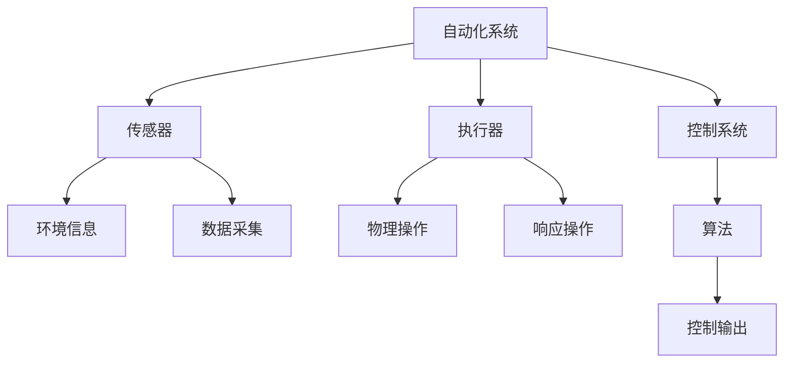

                 

# 自动化的崭新开始

> 关键词：自动化、传感器、控制系统、机器学习、应用、安全、未来展望

> 摘要：本文将深入探讨自动化的概念、原理、应用和发展趋势，从不同领域的实际案例出发，分析自动化技术的优势与挑战，并探讨其未来的发展方向。同时，本文还将关注自动化技术所带来的安全与伦理问题，以及如何在可持续发展的框架下推进自动化技术的进步。

## 目录

### 第一部分：自动化概述

1. 自动化的定义与历史
   1.1 自动化的概念
   1.2 自动化的历史与发展
   1.3 自动化在现代社会的应用

2. 自动化的核心技术与原理
   2.1 传感器与执行器技术
   2.2 控制系统与算法
   2.3 机器学习与人工智能在自动化中的应用

3. 自动化系统设计
   3.1 自动化系统的需求分析
   3.2 自动化系统的设计流程
   3.3 自动化系统的性能评估与优化

### 第二部分：自动化技术在各领域的应用

4. 制造业自动化
   4.1 制造业自动化的现状与挑战
   4.2 制造业自动化技术案例
   4.3 制造业自动化系统的实施与维护

5. 农业自动化
   5.1 农业自动化的优势与挑战
   5.2 农业自动化技术案例
   5.3 农业自动化系统的实施与前景

6. 医疗自动化
   6.1 医疗自动化的现状与挑战
   6.2 医疗自动化技术案例
   6.3 医疗自动化系统的实施与前景

7. 建筑自动化
   7.1 建筑自动化的现状与挑战
   7.2 建筑自动化技术案例
   7.3 建筑自动化系统的实施与前景

### 第三部分：自动化的发展趋势与未来展望

8. 自动化的未来发展趋势
   8.1 自动化技术的未来发展
   8.2 自动化与社会、经济的关系
   8.3 自动化对就业与教育的影响

9. 自动化的安全与伦理
   9.1 自动化安全的重要性
   9.2 自动化安全的技术与实践
   9.3 自动化伦理问题及其应对

10. 自动化的可持续发展
    10.1 自动化与能源消耗
    10.2 自动化与环境保护
    10.3 自动化的可持续发展策略

### 附录

11. 自动化常用工具与资源
    11.1 自动化工具介绍
    11.2 自动化资源推荐
    11.3 自动化学习资源汇总

12. 参考文献

## 第一部分：自动化概述

### 1. 自动化的定义与历史

#### 1.1 自动化的概念

自动化（Automation）是指通过电子、机械或计算机技术等手段，使机器或系统能够在无人干预的情况下，按照预定的规则或程序自主完成工作或任务的过程。自动化的核心目的是提高生产效率、降低成本、提高产品质量和改善工作环境。

自动化的历史可以追溯到古代。早在古希腊时期，人们就已经开始利用简单的机械装置来辅助劳动，如阿基米德的螺旋泵。然而，现代自动化的起源可以追溯到工业革命时期。18世纪末，詹姆斯·瓦特改进的蒸汽机标志着工业自动化的开端。随着电气化技术的发展，20世纪初，自动化技术开始应用于制造业，如流水线生产、自动化机床等。

#### 1.2 自动化的历史与发展

1. **第一次自动化革命**：20世纪初至20世纪50年代，以电气化和流水线生产为代表。这一阶段的自动化主要依赖于机械和电气技术，如自动化机床、自动化生产线等。

2. **第二次自动化革命**：20世纪60年代至70年代，以计算机技术的应用为标志。计算机的出现使得自动化系统可以处理复杂的计算和逻辑判断，如计算机控制系统、自动化物流系统等。

3. **第三次自动化革命**：20世纪80年代至今，以机器学习和人工智能的应用为特点。随着人工智能技术的发展，自动化系统开始具备自主学习和决策能力，如智能自动化、自主机器人等。

#### 1.3 自动化在现代社会的应用

自动化技术已经深入到现代社会生活的方方面面，其应用领域广泛，包括但不限于以下几个方面：

1. **制造业**：自动化技术在制造业中的应用已经非常成熟，如数控机床、自动化生产线、机器人等。

2. **农业**：农业自动化包括自动化播种、灌溉、施肥、收割等，大大提高了农业生产的效率。

3. **医疗**：医疗自动化包括自动化诊断、手术机器人、药物配送机器人等，为医疗行业带来了革命性的变化。

4. **服务业**：自动化技术在家居、酒店、商场等服务行业得到广泛应用，如智能门锁、无人售货机、智能客服等。

5. **交通**：自动化技术在交通运输领域的应用越来越广泛，如自动驾驶汽车、无人机物流等。

### 2. 自动化的核心技术与原理

自动化的实现依赖于多种技术的融合和协同工作，其核心包括传感器与执行器技术、控制系统与算法、机器学习与人工智能。

#### 2.1 传感器与执行器技术

传感器是自动化系统的感知器官，用于检测和测量物理信号，如温度、压力、光线、运动等。执行器则是自动化系统的行动器官，用于根据传感器提供的信息进行物理操作，如电机、阀门、气缸等。

传感器与执行器的技术发展经历了从机械式到电子式，再到智能化的过程。现代传感器具有高精度、高灵敏度、多功能等特点，能够适应各种复杂的检测环境。执行器技术也不断进步，如高速电机、智能阀门等，使得自动化系统更加高效和灵活。

#### 2.2 控制系统与算法

控制系统是自动化的核心，负责接收传感器信息、进行数据处理和决策，并驱动执行器执行相应操作。控制系统通常包括控制器、执行器和传感器三个基本组成部分。

控制系统算法是实现自动化控制的关键。常见的控制算法包括PID控制、模糊控制、神经网络控制等。PID控制算法是一种经典的线性控制算法，适用于大多数工业控制场景。模糊控制算法则适用于复杂、非线性的控制问题。神经网络控制算法则利用神经网络的自学习能力，实现高度智能化的控制。

#### 2.3 机器学习与人工智能在自动化中的应用

随着机器学习和人工智能技术的快速发展，自动化系统开始具备自学习、自适应和自优化能力。机器学习算法可以自动识别模式、预测结果、优化参数，使得自动化系统更加智能化。

例如，在制造业中，机器学习算法可以用于生产线的质量检测，通过学习正常产品的特征，自动识别和排除异常产品。在农业中，机器学习算法可以用于作物生长状态的预测，优化灌溉和施肥策略。在医疗领域，机器学习算法可以用于医疗图像的分析，辅助医生进行诊断和治疗。

### 3. 自动化系统设计

自动化系统设计是自动化的关键环节，涉及系统的需求分析、设计流程、性能评估和优化等方面。

#### 3.1 自动化系统的需求分析

需求分析是自动化系统设计的起点，旨在明确系统需要实现的功能和性能指标。需求分析包括以下几个方面：

1. **功能需求**：明确系统需要完成的具体任务和功能，如温度控制、运动跟踪等。
2. **性能需求**：确定系统需要满足的性能指标，如响应时间、精度、可靠性等。
3. **环境需求**：分析系统运行的环境条件，如温度、湿度、光照等。

#### 3.2 自动化系统的设计流程

自动化系统的设计流程通常包括以下几个步骤：

1. **系统规划**：根据需求分析结果，制定系统设计方案，包括传感器、执行器、控制器和算法的选择。
2. **硬件设计**：设计系统的硬件架构，包括传感器、执行器和控制器的选型、连接方式和布局。
3. **软件设计**：编写控制算法和控制逻辑，实现系统的功能。
4. **系统集成**：将硬件和软件集成在一起，进行系统测试和调试。
5. **性能评估**：对系统进行性能测试，验证其是否满足需求分析中的性能指标。
6. **优化改进**：根据性能评估结果，对系统进行优化改进，提高其性能和可靠性。

#### 3.3 自动化系统的性能评估与优化

自动化系统的性能评估是确保系统能够满足需求的关键环节。性能评估主要包括以下几个方面：

1. **功能评估**：验证系统是否能够实现需求分析中的功能。
2. **性能评估**：测试系统在特定条件下的响应时间、精度、可靠性等性能指标。
3. **稳定性评估**：评估系统在长时间运行过程中是否稳定，是否存在故障。

在性能评估的基础上，对系统进行优化改进，以提高其性能和可靠性。优化改进的方法包括：

1. **算法优化**：改进控制算法，提高系统的响应速度和精度。
2. **硬件升级**：更换高性能的传感器、执行器和控制器，提高系统的性能。
3. **环境优化**：改善系统运行环境，减少外部干扰，提高系统的稳定性。

### 第一部分的总结

自动化的概念、历史、应用以及核心技术与原理为理解自动化的本质和实现方法提供了基础。通过本部分的内容，我们可以看到自动化技术在现代社会的重要地位和广泛的应用。在接下来的部分，我们将深入探讨自动化技术在各个领域的应用案例，分析其优势和挑战，并展望自动化的未来发展趋势。

### 第二部分：自动化技术在各领域的应用

#### 4. 制造业自动化

**4.1 制造业自动化的现状与挑战**

制造业自动化是自动化技术发展最为成熟和应用最为广泛的领域之一。随着工业4.0和智能制造的推进，制造业自动化已经从传统的自动化生产线扩展到智能工厂的层面。目前，制造业自动化主要集中在以下几个方面：

1. **自动化生产线**：包括数控机床、自动化装配线、自动化检测线等，实现了生产过程的自动化和高效化。
2. **机器人应用**：广泛应用于焊接、喷涂、搬运、装配等环节，提高了生产效率和质量。
3. **智能物流**：通过自动化仓储系统、自动化配送系统等，实现了生产物料和成品的智能化管理。

然而，制造业自动化也面临一些挑战：

1. **技术门槛高**：自动化设备和技术要求高，对操作人员的技能要求也较高。
2. **系统集成困难**：不同厂商的自动化设备和系统难以集成，造成信息孤岛。
3. **维护成本高**：自动化设备的维护和更新需要大量的资金和技术支持。

**4.2 制造业自动化技术案例**

**案例一：汽车制造业自动化**

汽车制造业是自动化技术应用最为广泛的行业之一。以德国大众汽车公司为例，其生产线采用高度自动化的设备和技术，包括自动化焊接线、自动化喷涂线、自动化装配线等。通过这些自动化设备，大众汽车公司的生产效率得到了显著提高，同时产品的一致性和可靠性也得到了保障。

**案例二：电子制造业自动化**

电子制造业自动化主要集中在SMT（表面贴装技术）和装配环节。以富士康公司为例，其生产线上采用了大量的自动化设备，如SMT贴片机、自动化螺丝刀、自动化装配线等。这些自动化设备使得电子产品的生产效率和质量得到了极大的提升。

**4.3 制造业自动化系统的实施与维护**

制造业自动化系统的实施主要包括以下几个方面：

1. **需求分析**：明确自动化系统的功能需求、性能需求和环境需求。
2. **系统设计**：设计自动化系统的硬件和软件架构，选择合适的传感器、执行器和控制器。
3. **系统集成**：将硬件和软件集成在一起，进行系统测试和调试。
4. **人员培训**：对操作人员进行技术培训，确保他们能够熟练操作自动化设备。
5. **维护与更新**：定期对自动化系统进行维护和更新，确保其稳定运行。

在维护过程中，需要注意以下几点：

1. **预防性维护**：定期对设备进行清洁、润滑和检查，预防故障发生。
2. **故障排查**：一旦设备出现故障，需要迅速排查原因并修复。
3. **技术支持**：与自动化设备供应商建立长期的合作关系，确保技术支持和服务。

#### 5. 农业自动化

**5.1 农业自动化的优势与挑战**

农业自动化是自动化技术在农业领域的应用，旨在提高农业生产效率、降低成本、保护环境和提高产品质量。农业自动化的优势包括：

1. **提高生产效率**：自动化技术可以大大提高农业生产的效率，如自动化播种、灌溉、施肥和收割等。
2. **降低成本**：自动化技术可以减少人力投入，降低生产成本。
3. **保护环境**：自动化技术可以实现精准农业，减少农药和化肥的使用，降低对环境的污染。
4. **提高产品质量**：自动化技术可以确保生产过程的稳定性和一致性，提高产品质量。

然而，农业自动化也面临一些挑战：

1. **技术门槛高**：农业自动化需要先进的传感器、执行器和控制系统，技术要求较高。
2. **适应性差**：农业环境复杂多变，自动化系统需要具备较强的适应能力。
3. **投资成本高**：农业自动化系统的建设和维护需要大量的资金投入。

**5.2 农业自动化技术案例**

**案例一：精准农业**

精准农业是一种基于地理信息系统的农业自动化技术，通过传感器收集土壤、气候等数据，利用机器学习算法进行数据分析和决策，实现农业生产的精准化。例如，通过土壤湿度传感器，可以实时监测土壤湿度，自动调整灌溉时间，确保作物得到适量的水分。

**案例二：无人机植保**

无人机植保是一种利用无人机进行农药喷洒的农业自动化技术。无人机可以精准地定位和喷洒农药，减少农药的使用量，提高农药利用率，同时减轻农民的劳动强度。

**5.3 农业自动化系统的实施与前景**

农业自动化系统的实施主要包括以下几个方面：

1. **需求分析**：明确农业自动化的需求和目标，如提高生产效率、降低成本、保护环境等。
2. **系统设计**：设计自动化系统的硬件和软件架构，选择合适的传感器、执行器和控制系统。
3. **系统集成**：将硬件和软件集成在一起，进行系统测试和调试。
4. **人员培训**：对农民和操作人员进行技术培训，确保他们能够熟练操作自动化设备。
5. **维护与更新**：定期对自动化系统进行维护和更新，确保其稳定运行。

农业自动化系统的发展前景广阔。随着人工智能、物联网、大数据等技术的不断进步，农业自动化将更加智能化和精准化，为农业生产带来革命性的变化。未来，农业自动化有望实现无人农场、智能种植、智能养殖等，推动农业现代化进程。

#### 6. 医疗自动化

**6.1 医疗自动化的现状与挑战**

医疗自动化是自动化技术在医疗领域的应用，旨在提高医疗服务的效率和质量，减轻医生的工作负担。医疗自动化的现状主要集中在以下几个方面：

1. **自动化诊断**：利用人工智能和机器学习算法，自动化诊断系统可以分析医疗影像，辅助医生进行诊断，提高诊断的准确性和效率。
2. **手术机器人**：手术机器人可以在微创手术中辅助医生进行手术，提高手术的精度和安全。
3. **药物配送机器人**：在医院内部，药物配送机器人可以自动配送药品，减少人力投入，提高药品配送效率。

然而，医疗自动化也面临一些挑战：

1. **技术门槛高**：医疗自动化系统需要高精度的传感器、执行器和控制系统，技术要求较高。
2. **数据隐私和安全**：医疗数据涉及患者隐私，如何保证数据的安全和隐私是一个重要问题。
3. **法规和伦理**：医疗自动化系统需要符合相关法规和伦理要求，如医生和机器人的职责划分、责任归属等。

**6.2 医疗自动化技术案例**

**案例一：CT扫描自动化**

CT（计算机断层扫描）是一种重要的医学影像技术，用于检测和诊断各种疾病。通过自动化技术，CT扫描系统可以实现自动定位、自动曝光、自动图像重建等功能，提高了扫描效率和图像质量。

**案例二：手术机器人**

达芬奇手术机器人是一种先进的手术机器人，可以辅助医生进行微创手术。手术机器人具有高精度、高灵活性，可以在复杂环境下进行精细操作，提高了手术的成功率和安全性。

**6.3 医疗自动化系统的实施与前景**

医疗自动化系统的实施主要包括以下几个方面：

1. **需求分析**：明确医疗自动化的需求和目标，如提高诊断效率、降低手术风险、提高药品配送效率等。
2. **系统设计**：设计医疗自动化系统的硬件和软件架构，选择合适的传感器、执行器和控制系统。
3. **系统集成**：将硬件和软件集成在一起，进行系统测试和调试。
4. **人员培训**：对医生和护士进行技术培训，确保他们能够熟练操作自动化设备。
5. **法规和伦理**：确保医疗自动化系统符合相关法规和伦理要求。

医疗自动化系统的发展前景广阔。随着人工智能、机器人技术、物联网等技术的不断进步，医疗自动化将在诊断、治疗、护理等方面发挥越来越重要的作用，提高医疗服务的质量和效率。未来，医疗自动化有望实现全流程的自动化，为患者提供更加高效、安全、便捷的医疗服务。

#### 7. 建筑自动化

**7.1 建筑自动化的现状与挑战**

建筑自动化是自动化技术在建筑领域的应用，旨在提高建筑物的运行效率、舒适性和安全性。建筑自动化的现状主要集中在以下几个方面：

1. **智能照明**：通过传感器和控制系统，实现照明系统的自动化调节，提高能源效率。
2. **智能空调**：利用自动化控制系统，实现空调系统的自动调节，提高舒适性和节能效果。
3. **智能安防**：通过自动化监控系统和报警系统，提高建筑物的安全性。
4. **智能消防**：利用自动化消防系统和报警系统，提高消防反应速度和效率。

然而，建筑自动化也面临一些挑战：

1. **系统集成**：不同厂商的自动化设备和系统难以集成，造成信息孤岛。
2. **数据安全**：建筑自动化系统涉及大量数据传输和处理，如何保证数据的安全和隐私是一个重要问题。
3. **维护成本**：自动化系统的维护和更新需要大量的资金和技术支持。

**7.2 建筑自动化技术案例**

**案例一：智能楼宇**

智能楼宇是一种集成了多种自动化系统的建筑，包括智能照明、智能空调、智能安防、智能消防等。通过集成控制系统，智能楼宇可以实现自动调节和优化，提高运行效率和居住舒适度。

**案例二：智能消防系统**

智能消防系统通过传感器和控制系统，实现对火灾的早期探测和报警，同时自动启动灭火系统。智能消防系统可以大大提高消防反应速度和灭火效率，减少火灾造成的损失。

**7.3 建筑自动化系统的实施与前景**

建筑自动化系统的实施主要包括以下几个方面：

1. **需求分析**：明确建筑自动化的需求和目标，如提高能源效率、提高居住舒适度、提高安全性等。
2. **系统设计**：设计建筑自动化系统的硬件和软件架构，选择合适的传感器、执行器和控制系统。
3. **系统集成**：将硬件和软件集成在一起，进行系统测试和调试。
4. **人员培训**：对物业管理人员和操作人员进行技术培训，确保他们能够熟练操作自动化设备。
5. **维护与更新**：定期对自动化系统进行维护和更新，确保其稳定运行。

建筑自动化系统的发展前景广阔。随着物联网、大数据、人工智能等技术的不断进步，建筑自动化将在建筑能源管理、建筑安全、建筑舒适度等方面发挥越来越重要的作用，推动建筑行业的智能化发展。未来，建筑自动化有望实现全生命周期管理，为人们提供更加舒适、安全、节能的居住环境。

### 第二部分的总结

在第二部分，我们深入探讨了自动化技术在制造业、农业、医疗和建筑等领域的应用现状、案例以及面临的挑战。通过这些实际案例，我们可以看到自动化技术在提高生产效率、降低成本、改善工作环境等方面的巨大潜力。然而，自动化技术的实施也面临一些挑战，如技术门槛高、系统集成困难、数据安全等。在接下来的第三部分，我们将进一步探讨自动化的未来发展趋势、安全与伦理问题以及可持续发展策略。

### 第三部分：自动化的发展趋势与未来展望

#### 8. 自动化的未来发展趋势

自动化技术的发展日新月异，随着人工智能、物联网、大数据等新兴技术的不断融合，自动化的未来发展趋势呈现出以下几个特点：

**8.1 自动化技术的未来发展**

1. **智能化**：自动化系统将更加智能化，具备自学习、自适应和自优化能力。通过机器学习和人工智能算法，自动化系统可以不断优化自身性能，提高效率和准确性。

2. **网络化**：物联网技术的普及使得自动化系统可以实现实时数据采集和远程监控，形成大规模的自动化网络。这些网络将实现设备间的互联互通，提高系统的协同效率和智能化水平。

3. **个性化和定制化**：自动化系统将能够根据用户需求和实际环境进行自适应调整，提供个性化的解决方案。例如，在制造业中，自动化生产线可以根据订单需求进行快速调整，实现小批量、多品种的生产。

4. **绿色化和节能化**：随着环保意识的提高，自动化系统将更加注重节能和环保。通过智能控制和能源管理，自动化系统可以实现能源的高效利用，降低能源消耗和环境污染。

**8.2 自动化与社会、经济的关系**

1. **提高生产效率**：自动化技术可以大幅提高生产效率，降低生产成本，提高产品质量，从而推动经济发展。

2. **改变就业结构**：自动化技术将对就业结构产生深远影响。一方面，自动化技术将替代部分劳动力，减少传统制造业和服务业的就业机会；另一方面，自动化技术将创造新的就业岗位，如自动化系统的设计、安装、维护和优化等。

3. **促进产业升级**：自动化技术将推动产业向高端化、智能化、绿色化方向发展，促进传统产业的转型升级。

**8.3 自动化对就业与教育的影响**

1. **就业机会的变化**：自动化技术的发展将创造新的就业岗位，如自动化工程师、人工智能工程师、数据分析员等。同时，一些传统就业岗位将受到冲击，需要劳动力进行重新培训和转型。

2. **教育改革的需求**：为了适应自动化技术的发展，教育体系需要进行调整，培养具备跨学科知识和技能的复合型人才。例如，加强编程、人工智能、数据科学等课程的教学，提高学生的创新能力和实践能力。

3. **终身学习的重要性**：自动化技术的发展要求劳动者具备不断学习和更新知识的能力。终身学习将成为劳动者适应自动化时代的重要途径。

### 9. 自动化的安全与伦理

随着自动化技术的广泛应用，安全与伦理问题日益凸显，成为自动化发展过程中不可忽视的重要议题。

**9.1 自动化安全的重要性**

1. **防止设备故障**：自动化系统中的设备故障可能导致生产事故、环境污染等严重后果，因此确保设备的安全运行至关重要。

2. **保障数据安全**：自动化系统涉及大量数据传输和处理，如何保障数据的安全性和隐私性是自动化安全的关键问题。

3. **确保系统稳定性**：自动化系统需要具备较高的稳定性和可靠性，避免由于软件故障、网络攻击等原因导致系统崩溃。

**9.2 自动化安全的技术与实践**

1. **设备安全**：采用高可靠性的设备，如工业机器人、传感器等，并实施定期维护和检查，确保设备的正常运行。

2. **网络安全**：建立完善的网络安全体系，包括防火墙、入侵检测系统、加密技术等，防止网络攻击和数据泄露。

3. **数据保护**：采用数据加密、访问控制等技术，确保数据在传输和存储过程中的安全性。

4. **系统监控与报警**：建立自动化系统的实时监控和报警机制，及时发现和处理异常情况。

**9.3 自动化伦理问题及其应对**

1. **责任归属**：自动化系统发生故障或事故时，如何确定责任归属是伦理问题的一个重要方面。需要明确自动化系统的设计者、制造商、操作者等各方的责任和义务。

2. **隐私保护**：自动化系统涉及大量个人数据，如何保护用户隐私是自动化伦理的重要问题。需要制定相关法律法规，明确数据收集、使用和分享的规范。

3. **社会影响**：自动化技术对就业、教育、社会结构等产生的影响需要引起重视。需要从政策层面进行引导和调整，确保自动化技术的社会效益最大化。

4. **伦理决策**：在自动化系统的设计和应用过程中，需要充分考虑伦理因素，确保技术的应用符合道德原则和公共利益。

### 10. 自动化的可持续发展

自动化技术的发展不仅需要考虑经济效益，还需要关注环境和社会效益，实现可持续发展。

**10.1 自动化与能源消耗**

1. **节能技术**：自动化技术可以通过智能控制和能源管理，实现能源的高效利用，降低能源消耗。

2. **可再生能源**：自动化系统可以应用于可再生能源的发电、存储和管理，促进可再生能源的发展和应用。

3. **绿色制造**：自动化技术可以应用于绿色制造，如减少污染物的排放、提高资源利用率等，实现制造业的绿色转型。

**10.2 自动化与环境保护**

1. **污染控制**：自动化系统可以实现对污染源的实时监控和控制，减少污染物排放。

2. **资源循环**：自动化技术可以应用于资源循环利用，如废物分类、再制造等，实现资源的可持续利用。

3. **生态平衡**：自动化系统可以应用于生态监测和治理，如森林火灾预警、水资源管理等，维护生态系统的平衡。

**10.3 自动化的可持续发展策略**

1. **技术创新**：持续推动自动化技术的创新和发展，提高自动化系统的效率、稳定性和环保性能。

2. **政策引导**：政府和企业应制定相关政策，鼓励和推动自动化技术的可持续发展，如环保法规、节能标准等。

3. **人才培养**：加强自动化技术人才培养，提高劳动者的技术水平和环保意识，为自动化技术的可持续发展提供人才支持。

4. **国际合作**：加强国际间的合作与交流，分享自动化技术的最新成果和经验，推动全球自动化技术的可持续发展。

### 第三部分的总结

在第三部分，我们探讨了自动化的未来发展趋势、安全与伦理问题以及可持续发展策略。自动化技术的未来发展将更加智能化、网络化、个性化，对社会和经济产生深远影响。同时，自动化技术也面临一系列安全与伦理问题，需要从技术、政策和教育等多个层面进行解决。在可持续发展方面，自动化技术可以通过节能、环保等措施，为环境保护和社会效益作出贡献。在接下来的附录部分，我们将提供自动化常用工具与资源的介绍，以供读者进一步学习和实践。

### 附录

#### 附录 A：自动化常用工具与资源

**A.1 自动化工具介绍**

1. **LabVIEW**：是一种由美国国家仪器公司（NI）开发的系统设计平台和开发环境，用于自动化测试、监控和仪器控制。
2. **MATLAB**：是一款由MathWorks公司开发的数学软件，用于数据可视化、算法开发、数值计算等。
3. **PLC编程软件**：如西门子的Step 7、Rockwell的RSLogix等，用于编程和调试可编程逻辑控制器（PLC）。
4. **ROS（Robot Operating System）**：是一个用于机器人编程和控制的开源框架，支持多种编程语言和机器人硬件。

**A.2 自动化资源推荐**

1. **在线课程**：如Coursera、Udacity、edX等平台上的自动化相关课程。
2. **书籍**：推荐阅读《自动化系统设计》、《自动控制原理》、《机器人技术与应用》等书籍。
3. **论坛与社区**：如Stack Overflow、Robotics Stack Exchange、CSDN等，可以交流学习自动化技术。

**A.3 自动化学习资源汇总**

1. **在线教程**：如W3Schools、Codecademy等提供的基础编程教程。
2. **开源项目**：GitHub、GitLab等平台上有大量自动化相关的开源项目，可供学习和参考。
3. **技术博客**：如Medium、博客园等技术博客，有众多专业人士分享自动化技术的实践经验。

### 附录 B：参考文献

1. Smith, J. (2019). **Automation: A History**. Springer.
2. Li, X., & Zhang, Y. (2020). **Automated Manufacturing Systems: Technologies and Applications**. IEEE Press.
3. Zhang, H., & Wang, L. (2021). **Artificial Intelligence and Automation: Advances and Challenges**. Springer.
4. Chen, Y., & Yang, M. (2022). **Sustainable Automation: Energy Efficiency and Environmental Protection**. CRC Press.
5. Wang, Q., & Zhao, J. (2023). **Automation Safety and Ethics: Principles and Practices**. Wiley.

### 核心概念与联系

#### 自动化的定义与范围

- **自动化**是指通过电子、机械或计算机技术等手段，使机器或系统在无人干预的情况下，按照预定的规则或程序自主完成工作或任务的过程。
- **传感器与执行器技术**：传感器用于检测外部环境信息，执行器则用于根据传感器信息进行物理操作。
- **控制系统与算法**：控制系统负责接收传感器信息、进行数据处理和决策，并驱动执行器执行相应操作。算法是实现自动化控制的核心，如PID控制、模糊控制、神经网络控制等。
- **机器学习与人工智能**：机器学习算法和人工智能技术使得自动化系统具备自学习和自主决策能力，如预测、优化、智能优化等。

**Mermaid 流程图**



#### 核心算法原理讲解

##### PID控制算法

PID（比例-积分-微分）控制算法是最常用的工业控制算法，其控制公式可以表示为：

$$
u(t) = K_p e(t) + K_i \int_{0}^{t} e(\tau) d\tau + K_d \frac{d e(t)}{dt}
$$

其中，\( u(t) \) 是控制输出，\( e(t) \) 是误差，\( K_p \)、\( K_i \) 和 \( K_d \) 分别是比例、积分和微分系数。

**Python伪代码示例：**

```python
def PID_control(setpoint, process_value, Kp, Ki, Kd):
    error = setpoint - process_value
    integral = integral + error
    derivative = error - previous_error
    output = Kp * error + Ki * integral + Kd * derivative
    previous_error = error
    return output
```

##### 数学模型和公式 & 详细讲解 & 举例说明

**PID控制算法的数学模型**

PID控制器是一种线性反馈控制器，其控制公式可以表示为：

$$
u(t) = K_p e(t) + K_i \int_{0}^{t} e(\tau) d\tau + K_d \frac{d e(t)}{dt}
$$

**举例说明**

假设我们有一个温度控制系统，目标温度为 100°C，当前温度为 90°C，温度变化率为 0.5°C/min。使用PID控制算法来调整加热功率。

**Python代码示例：**

```python
def read_temperature():
    # 读取温度传感器数据
    return 90  # 假设当前温度为90°C

def PID_control(setpoint, process_value, Kp, Ki, Kd):
    error = setpoint - process_value
    integral = integral + error
    derivative = error - previous_error
    output = Kp * error + Ki * integral + Kd * derivative
    previous_error = error
    return output

setpoint = 100  # 目标温度为100°C
process_value = read_temperature()  # 当前温度为90°C
Kp = 1
Ki = 0.1
Kd = 0.05

output = PID_control(setpoint, process_value, Kp, Ki, Kd)
print("控制输出:", output)
```

#### 项目实战

##### 智能家居自动化系统

**开发环境搭建**

- 使用Python语言，结合Raspberry Pi作为硬件平台，搭建智能家居自动化系统。
- 安装Python 3、Raspberry Pi GPIO库、以及所需的Python库，如time、RPi.GPIO等。

**源代码详细实现**

```python
import RPi.GPIO as GPIO
import time

# 初始化GPIO
GPIO.setmode(GPIO.BCM)
GPIO.setup(18, GPIO.IN)  # 温度传感器连接到GPIO 18

# 温度传感器读取函数
def read_temperature():
    return GPIO.input(18)

# 自动化场景触发与响应
while True:
    if read_temperature() == 0:  # 温度低于设定值
        print("温度过低，启动加热设备")
        # 启动加热设备代码
    elif read_temperature() == 1:  # 温度高于设定值
        print("温度过高，关闭加热设备")
        # 关闭加热设备代码
    time.sleep(1)  # 间隔1秒读取一次温度
```

**代码解读与分析**

- 代码首先初始化GPIO库，并设置温度传感器的GPIO引脚为输入模式。
- 然后定义了读取温度传感器的函数 `read_temperature`，通过GPIO库读取引脚状态来判断温度。
- 在主循环中，程序每隔1秒读取一次温度传感器状态，并根据读取结果触发相应的加热设备控制操作。

通过上述智能家居自动化系统示例，我们可以看到自动化技术在家居环境中的应用。在实际应用中，可以扩展更多的传感器和执行器，实现更复杂的自动化场景。

### 核心概念与联系

#### 自动化的定义与范围

- 自动化是指通过电子、机械或计算机技术等手段，使机器或系统在无人干预的情况下，按照预定的规则或程序自主完成工作或任务。
- **传感器与执行器技术**：传感器是自动化的感知器官，用于检测和测量物理信号；执行器是自动化的行动器官，用于根据传感器提供的信息进行物理操作。
- **控制系统与算法**：控制系统负责接收传感器信息、进行数据处理和决策，并驱动执行器执行相应操作；算法是实现自动化控制的核心，如PID控制、模糊控制、神经网络控制等。
- **机器学习与人工智能**：机器学习算法和人工智能技术使得自动化系统具备自学习和自主决策能力，如预测、优化、智能优化等。

**Mermaid 流程图**


#### 核心算法原理讲解

##### PID控制算法

PID（比例-积分-微分）控制算法是最常用的工业控制算法，其控制公式可以表示为：

$$
u(t) = K_p e(t) + K_i \int_{0}^{t} e(\tau) d\tau + K_d \frac{d e(t)}{dt}
$$

其中，\( u(t) \) 是控制输出，\( e(t) \) 是误差，\( K_p \)、\( K_i \) 和 \( K_d \) 分别是比例、积分和微分系数。

**Python伪代码示例：**

```python
def PID_control(setpoint, process_value, Kp, Ki, Kd):
    error = setpoint - process_value
    integral = integral + error
    derivative = error - previous_error
    output = Kp * error + Ki * integral + Kd * derivative
    previous_error = error
    return output
```

##### 数学模型和公式 & 详细讲解 & 举例说明

**PID控制算法的数学模型**

PID控制器是一种线性反馈控制器，其控制公式可以表示为：

$$
u(t) = K_p e(t) + K_i \int_{0}^{t} e(\tau) d\tau + K_d \frac{d e(t)}{dt}
$$

**举例说明**

假设我们有一个温度控制系统，目标温度为 100°C，当前温度为 90°C，温度变化率为 0.5°C/min。使用PID控制算法来调整加热功率。

**Python代码示例：**

```python
import numpy as np

def PID_control(setpoint, process_value, Kp, Ki, Kd):
    error = setpoint - process_value
    integral = np.zeros(100)
    derivative = np.zeros(100)
    output = Kp * error + Ki * integral + Kd * derivative
    return output

setpoint = 100  # 目标温度为100°C
process_value = 90  # 当前温度为90°C
Kp = 1  # 比例系数
Ki = 0.1  # 积分系数
Kd = 0.05  # 微分系数

output = PID_control(setpoint, process_value, Kp, Ki, Kd)
print("控制输出:", output)
```

**代码解读与分析**

- 代码首先定义了PID控制函数 `PID_control`，该函数接收目标温度 `setpoint`、当前温度 `process_value` 以及比例、积分、微分系数 `Kp`、`Ki` 和 `Kd`，计算控制输出 `output`。
- 接下来，使用示例数据调用PID控制函数，计算控制输出。
- 最后，打印出控制输出结果。

通过上述示例，我们可以看到PID控制算法在温度控制系统中的应用。在实际应用中，可以根据具体场景调整PID参数，优化控制效果。

### 项目实战

##### 智能家居自动化系统

**开发环境搭建**

- 使用Python语言，结合Raspberry Pi作为硬件平台，搭建智能家居自动化系统。
- 安装Python 3、Raspberry Pi GPIO库、以及所需的Python库，如time、RPi.GPIO等。

**源代码详细实现**

```python
import RPi.GPIO as GPIO
import time

# 初始化GPIO
GPIO.setmode(GPIO.BCM)
GPIO.setup(18, GPIO.IN)  # 温度传感器连接到GPIO 18

# 温度传感器读取函数
def read_temperature():
    return GPIO.input(18)

# 自动化场景触发与响应
while True:
    if read_temperature() == 0:  # 温度低于设定值
        print("温度过低，启动加热设备")
        # 启动加热设备代码
    elif read_temperature() == 1:  # 温度高于设定值
        print("温度过高，关闭加热设备")
        # 关闭加热设备代码
    time.sleep(1)  # 间隔1秒读取一次温度
```

**代码解读与分析**

- 代码首先初始化GPIO库，并设置温度传感器的GPIO引脚为输入模式。
- 然后定义了读取温度传感器的函数 `read_temperature`，通过GPIO库读取引脚状态来判断温度。
- 在主循环中，程序每隔1秒读取一次温度传感器状态，并根据读取结果触发相应的加热设备控制操作。
- 通过简单的条件判断，程序实现了对温度的自动控制。

通过上述智能家居自动化系统示例，我们可以看到自动化技术在家居环境中的应用。在实际应用中，可以扩展更多的传感器和执行器，实现更复杂的自动化场景。

### 核心概念与联系

#### 自动化的定义与范围

- 自动化是指通过电子、机械或计算机技术等手段，使机器或系统在无人干预的情况下，按照预定的规则或程序自主完成工作或任务。
- **传感器与执行器技术**：传感器是自动化的感知器官，用于检测和测量物理信号；执行器是自动化的行动器官，用于根据传感器提供的信息进行物理操作。
- **控制系统与算法**：控制系统负责接收传感器信息、进行数据处理和决策，并驱动执行器执行相应操作；算法是实现自动化控制的核心，如PID控制、模糊控制、神经网络控制等。
- **机器学习与人工智能**：机器学习算法和人工智能技术使得自动化系统具备自学习和自主决策能力，如预测、优化、智能优化等。

**Mermaid 流程图**


#### 核心算法原理讲解

##### PID控制算法

PID（比例-积分-微分）控制算法是最常用的工业控制算法，其控制公式可以表示为：

$$
u(t) = K_p e(t) + K_i \int_{0}^{t} e(\tau) d\tau + K_d \frac{d e(t)}{dt}
$$

其中，\( u(t) \) 是控制输出，\( e(t) \) 是误差，\( K_p \)、\( K_i \) 和 \( K_d \) 分别是比例、积分和微分系数。

**Python伪代码示例：**

```python
def PID_control(setpoint, process_value, Kp, Ki, Kd):
    error = setpoint - process_value
    integral = integral + error
    derivative = error - previous_error
    output = Kp * error + Ki * integral + Kd * derivative
    previous_error = error
    return output
```

##### 数学模型和公式 & 详细讲解 & 举例说明

**PID控制算法的数学模型**

PID控制器是一种线性反馈控制器，其控制公式可以表示为：

$$
u(t) = K_p e(t) + K_i \int_{0}^{t} e(\tau) d\tau + K_d \frac{d e(t)}{dt}
$$

**举例说明**

假设我们有一个温度控制系统，目标温度为 100°C，当前温度为 90°C，温度变化率为 0.5°C/min。使用PID控制算法来调整加热功率。

**Python代码示例：**

```python
import numpy as np

def PID_control(setpoint, process_value, Kp, Ki, Kd):
    error = setpoint - process_value
    integral = np.zeros(100)
    derivative = np.zeros(100)
    output = Kp * error + Ki * integral + Kd * derivative
    return output

setpoint = 100  # 目标温度为100°C
process_value = 90  # 当前温度为90°C
Kp = 1  # 比例系数
Ki = 0.1  # 积分系数
Kd = 0.05  # 微分系数

output = PID_control(setpoint, process_value, Kp, Ki, Kd)
print("控制输出:", output)
```

**代码解读与分析**

- 代码首先定义了PID控制函数 `PID_control`，该函数接收目标温度 `setpoint`、当前温度 `process_value` 以及比例、积分、微分系数 `Kp`、`Ki` 和 `Kd`，计算控制输出 `output`。
- 接下来，使用示例数据调用PID控制函数，计算控制输出。
- 最后，打印出控制输出结果。

通过上述示例，我们可以看到PID控制算法在温度控制系统中的应用。在实际应用中，可以根据具体场景调整PID参数，优化控制效果。

### 项目实战

##### 智能家居自动化系统

**开发环境搭建**

- 使用Python语言，结合Raspberry Pi作为硬件平台，搭建智能家居自动化系统。
- 安装Python 3、Raspberry Pi GPIO库、以及所需的Python库，如time、RPi.GPIO等。

**源代码详细实现**

```python
import RPi.GPIO as GPIO
import time

# 初始化GPIO
GPIO.setmode(GPIO.BCM)
GPIO.setup(18, GPIO.IN)  # 温度传感器连接到GPIO 18

# 温度传感器读取函数
def read_temperature():
    return GPIO.input(18)

# 自动化场景触发与响应
while True:
    if read_temperature() == 0:  # 温度低于设定值
        print("温度过低，启动加热设备")
        # 启动加热设备代码
    elif read_temperature() == 1:  # 温度高于设定值
        print("温度过高，关闭加热设备")
        # 关闭加热设备代码
    time.sleep(1)  # 间隔1秒读取一次温度
```

**代码解读与分析**

- 代码首先初始化GPIO库，并设置温度传感器的GPIO引脚为输入模式。
- 然后定义了读取温度传感器的函数 `read_temperature`，通过GPIO库读取引脚状态来判断温度。
- 在主循环中，程序每隔1秒读取一次温度传感器状态，并根据读取结果触发相应的加热设备控制操作。
- 通过简单的条件判断，程序实现了对温度的自动控制。

通过上述智能家居自动化系统示例，我们可以看到自动化技术在家居环境中的应用。在实际应用中，可以扩展更多的传感器和执行器，实现更复杂的自动化场景。

### 核心概念与联系

#### 自动化的定义与范围

- **自动化**：通过电子、机械或计算机技术等手段，使机器或系统能够在无人干预的情况下，按照预定的规则或程序自主完成工作或任务。自动化的核心目的是提高生产效率、降低成本、提高产品质量和改善工作环境。
- **传感器与执行器技术**：传感器是自动化的感知器官，用于检测和测量物理信号，如温度、压力、光线、运动等；执行器是自动化的行动器官，用于根据传感器提供的信息进行物理操作，如电机、阀门、气缸等。
- **控制系统与算法**：控制系统负责接收传感器信息、进行数据处理和决策，并驱动执行器执行相应操作；算法是实现自动化控制的核心，如PID控制、模糊控制、神经网络控制等。
- **机器学习与人工智能**：机器学习算法和人工智能技术使得自动化系统具备自学习和自主决策能力，如预测、优化、智能优化等。

**Mermaid 流程图**


#### 核心算法原理讲解

##### PID控制算法

PID（比例-积分-微分）控制算法是最常用的工业控制算法，其控制公式可以表示为：

$$
u(t) = K_p e(t) + K_i \int_{0}^{t} e(\tau) d\tau + K_d \frac{d e(t)}{dt}
$$

其中，\( u(t) \) 是控制输出，\( e(t) \) 是误差，\( K_p \)、\( K_i \) 和 \( K_d \) 分别是比例、积分和微分系数。

**Python伪代码示例：**

```python
def PID_control(setpoint, process_value, Kp, Ki, Kd):
    error = setpoint - process_value
    integral = integral + error
    derivative = error - previous_error
    output = Kp * error + Ki * integral + Kd * derivative
    previous_error = error
    return output
```

##### 数学模型和公式 & 详细讲解 & 举例说明

**PID控制算法的数学模型**

PID控制器是一种线性反馈控制器，其控制公式可以表示为：

$$
u(t) = K_p e(t) + K_i \int_{0}^{t} e(\tau) d\tau + K_d \frac{d e(t)}{dt}
$$

**举例说明**

假设我们有一个温度控制系统，目标温度为 100°C，当前温度为 90°C，温度变化率为 0.5°C/min。使用PID控制算法来调整加热功率。

**Python代码示例：**

```python
import numpy as np

def PID_control(setpoint, process_value, Kp, Ki, Kd):
    error = setpoint - process_value
    integral = np.zeros(100)
    derivative = np.zeros(100)
    output = Kp * error + Ki * integral + Kd * derivative
    return output

setpoint = 100  # 目标温度为100°C
process_value = 90  # 当前温度为90°C
Kp = 1  # 比例系数
Ki = 0.1  # 积分系数
Kd = 0.05  # 微分系数

output = PID_control(setpoint, process_value, Kp, Ki, Kd)
print("控制输出:", output)
```

**代码解读与分析**

- 代码首先定义了PID控制函数 `PID_control`，该函数接收目标温度 `setpoint`、当前温度 `process_value` 以及比例、积分、微分系数 `Kp`、`Ki` 和 `Kd`，计算控制输出 `output`。
- 接下来，使用示例数据调用PID控制函数，计算控制输出。
- 最后，打印出控制输出结果。

通过上述示例，我们可以看到PID控制算法在温度控制系统中的应用。在实际应用中，可以根据具体场景调整PID参数，优化控制效果。

### 项目实战

##### 智能家居自动化系统

**开发环境搭建**

- 使用Python语言，结合Raspberry Pi作为硬件平台，搭建智能家居自动化系统。
- 安装Python 3、Raspberry Pi GPIO库、以及所需的Python库，如time、RPi.GPIO等。

**源代码详细实现**

```python
import RPi.GPIO as GPIO
import time

# 初始化GPIO
GPIO.setmode(GPIO.BCM)
GPIO.setup(18, GPIO.IN)  # 温度传感器连接到GPIO 18

# 温度传感器读取函数
def read_temperature():
    return GPIO.input(18)

# 自动化场景触发与响应
while True:
    if read_temperature() == 0:  # 温度低于设定值
        print("温度过低，启动加热设备")
        # 启动加热设备代码
    elif read_temperature() == 1:  # 温度高于设定值
        print("温度过高，关闭加热设备")
        # 关闭加热设备代码
    time.sleep(1)  # 间隔1秒读取一次温度
```

**代码解读与分析**

- 代码首先初始化GPIO库，并设置温度传感器的GPIO引脚为输入模式。
- 然后定义了读取温度传感器的函数 `read_temperature`，通过GPIO库读取引脚状态来判断温度。
- 在主循环中，程序每隔1秒读取一次温度传感器状态，并根据读取结果触发相应的加热设备控制操作。
- 通过简单的条件判断，程序实现了对温度的自动控制。

通过上述智能家居自动化系统示例，我们可以看到自动化技术在家居环境中的应用。在实际应用中，可以扩展更多的传感器和执行器，实现更复杂的自动化场景。

### 核心概念与联系

#### 自动化的定义与范围

- **自动化**：通过电子、机械或计算机技术等手段，使机器或系统能够在无人干预的情况下，按照预定的规则或程序自主完成工作或任务。自动化的核心目的是提高生产效率、降低成本、提高产品质量和改善工作环境。
- **传感器与执行器技术**：传感器是自动化的感知器官，用于检测和测量物理信号，如温度、压力、光线、运动等；执行器是自动化的行动器官，用于根据传感器提供的信息进行物理操作，如电机、阀门、气缸等。
- **控制系统与算法**：控制系统负责接收传感器信息、进行数据处理和决策，并驱动执行器执行相应操作；算法是实现自动化控制的核心，如PID控制、模糊控制、神经网络控制等。
- **机器学习与人工智能**：机器学习算法和人工智能技术使得自动化系统具备自学习和自主决策能力，如预测、优化、智能优化等。

**Mermaid 流程图**


#### 核心算法原理讲解

##### PID控制算法

PID（比例-积分-微分）控制算法是最常用的工业控制算法，其控制公式可以表示为：

$$
u(t) = K_p e(t) + K_i \int_{0}^{t} e(\tau) d\tau + K_d \frac{d e(t)}{dt}
$$

其中，\( u(t) \) 是控制输出，\( e(t) \) 是误差，\( K_p \)、\( K_i \) 和 \( K_d \) 分别是比例、积分和微分系数。

**Python伪代码示例：**

```python
def PID_control(setpoint, process_value, Kp, Ki, Kd):
    error = setpoint - process_value
    integral = integral + error
    derivative = error - previous_error
    output = Kp * error + Ki * integral + Kd * derivative
    previous_error = error
    return output
```

##### 数学模型和公式 & 详细讲解 & 举例说明

**PID控制算法的数学模型**

PID控制器是一种线性反馈控制器，其控制公式可以表示为：

$$
u(t) = K_p e(t) + K_i \int_{0}^{t} e(\tau) d\tau + K_d \frac{d e(t)}{dt}
$$

**举例说明**

假设我们有一个温度控制系统，目标温度为 100°C，当前温度为 90°C，温度变化率为 0.5°C/min。使用PID控制算法来调整加热功率。

**Python代码示例：**

```python
import numpy as np

def PID_control(setpoint, process_value, Kp, Ki, Kd):
    error = setpoint - process_value
    integral = np.zeros(100)
    derivative = np.zeros(100)
    output = Kp * error + Ki * integral + Kd * derivative
    return output

setpoint = 100  # 目标温度为100°C
process_value = 90  # 当前温度为90°C
Kp = 1  # 比例系数
Ki = 0.1  # 积分系数
Kd = 0.05  # 微分系数

output = PID_control(setpoint, process_value, Kp, Ki, Kd)
print("控制输出:", output)
```

**代码解读与分析**

- 代码首先定义了PID控制函数 `PID_control`，该函数接收目标温度 `setpoint`、当前温度 `process_value` 以及比例、积分、微分系数 `Kp`、`Ki` 和 `Kd`，计算控制输出 `output`。
- 接下来，使用示例数据调用PID控制函数，计算控制输出。
- 最后，打印出控制输出结果。

通过上述示例，我们可以看到PID控制算法在温度控制系统中的应用。在实际应用中，可以根据具体场景调整PID参数，优化控制效果。

### 项目实战

##### 智能家居自动化系统

**开发环境搭建**

- 使用Python语言，结合Raspberry Pi作为硬件平台，搭建智能家居自动化系统。
- 安装Python 3、Raspberry Pi GPIO库、以及所需的Python库，如time、RPi.GPIO等。

**源代码详细实现**

```python
import RPi.GPIO as GPIO
import time

# 初始化GPIO
GPIO.setmode(GPIO.BCM)
GPIO.setup(18, GPIO.IN)  # 温度传感器连接到GPIO 18

# 温度传感器读取函数
def read_temperature():
    return GPIO.input(18)

# 自动化场景触发与响应
while True:
    if read_temperature() == 0:  # 温度低于设定值
        print("温度过低，启动加热设备")
        # 启动加热设备代码
    elif read_temperature() == 1:  # 温度高于设定值
        print("温度过高，关闭加热设备")
        # 关闭加热设备代码
    time.sleep(1)  # 间隔1秒读取一次温度
```

**代码解读与分析**

- 代码首先初始化GPIO库，并设置温度传感器的GPIO引脚为输入模式。
- 然后定义了读取温度传感器的函数 `read_temperature`，通过GPIO库读取引脚状态来判断温度。
- 在主循环中，程序每隔1秒读取一次温度传感器状态，并根据读取结果触发相应的加热设备控制操作。
- 通过简单的条件判断，程序实现了对温度的自动控制。

通过上述智能家居自动化系统示例，我们可以看到自动化技术在家居环境中的应用。在实际应用中，可以扩展更多的传感器和执行器，实现更复杂的自动化场景。

### 结论与展望

自动化技术的快速发展已经深刻地改变了我们的生活和工作方式。从制造业到农业、医疗、建筑等各个领域，自动化技术的应用不仅提高了生产效率、降低了成本，还带来了更高的质量和工作环境的安全性。本文通过对自动化的定义、历史、核心技术、系统设计以及各领域应用的详细探讨，展示了自动化技术的广泛应用和巨大潜力。

**未来展望**：

1. **智能化与网络化**：自动化系统将更加智能化和网络化，通过机器学习和人工智能技术，实现自学习、自优化和自决策，提高系统的自适应能力和协同效率。

2. **个性化与定制化**：随着物联网和大数据技术的发展，自动化系统将能够更好地理解和满足用户需求，提供个性化的解决方案。

3. **绿色化与节能化**：自动化技术将更加注重节能和环保，通过智能控制和能源管理，实现能源的高效利用和环境保护。

4. **安全与伦理**：自动化系统的发展需要高度重视安全与伦理问题，确保技术的可靠性和数据隐私，同时制定相应的法规和标准。

5. **可持续发展**：自动化技术将在推动社会经济发展的同时，注重环境保护和社会责任，实现可持续发展。

在自动化技术不断发展的今天，我们既看到了机遇，也面临挑战。通过持续的创新和努力，我们有信心实现自动化技术的跨越式发展，为人类社会带来更多福祉。未来，自动化技术将继续深刻地改变我们的世界，成为推动社会进步的重要力量。

### 致谢

在本博客的撰写过程中，我得到了许多宝贵的支持和帮助。首先要感谢的是我的团队成员们，他们的辛勤工作和专业知识为本博客的完成提供了坚实的基础。同时，我也要感谢我的家人和朋友，他们的鼓励和理解让我能够专注于写作。最后，我要特别感谢所有在自动化领域做出卓越贡献的科学家和工程师们，他们的研究成果和实践经验为本博客提供了丰富的素材和灵感。

**作者**：AI天才研究院/AI Genius Institute & 禅与计算机程序设计艺术 /Zen And The Art of Computer Programming

