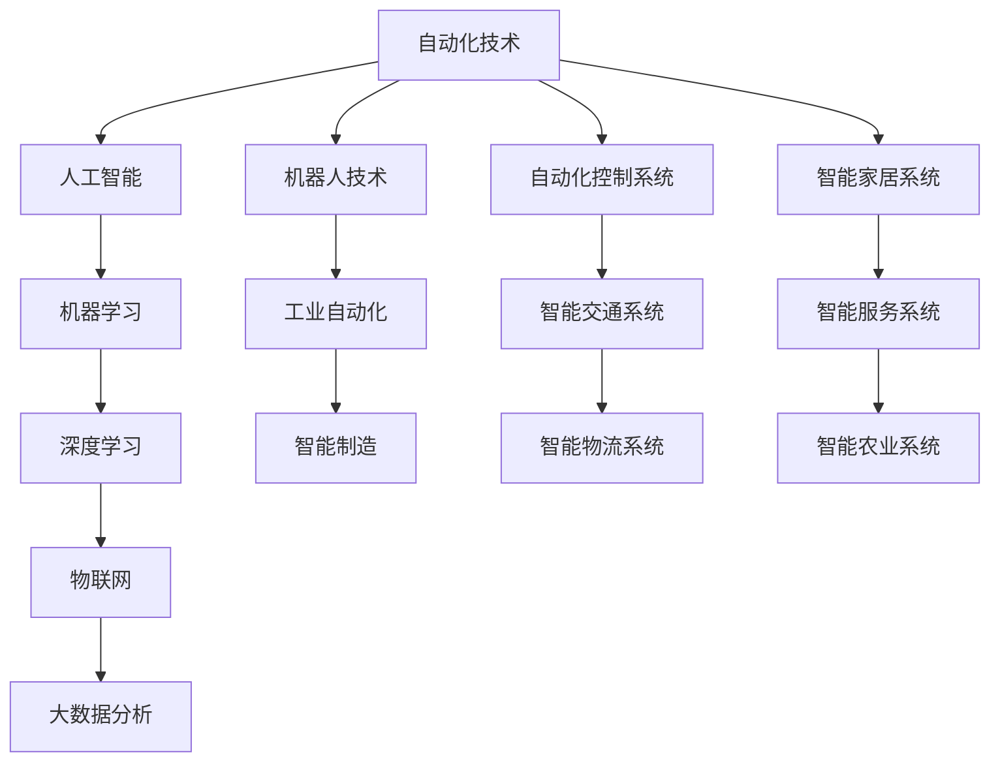

                 

# 文章标题: 自动化的最新技术趋势

> 关键词：自动化技术，人工智能，机器学习，深度学习，物联网，智能制造，机器人自动化

> 摘要：本文将探讨自动化技术的最新发展趋势，从历史演变、核心概念、未来展望等多个角度深入分析。我们将重点关注人工智能与自动化的融合，自动化在各行业中的应用，以及自动化技术面临的挑战与解决方案。通过详细的案例分析和技术解读，帮助读者全面了解自动化的最新技术趋势。

## 第一部分: 自动化的最新技术趋势概述

### 第1章: 自动化的最新技术趋势概述

#### 1.1 自动化技术的演变历程

自动化技术的概念可以追溯到19世纪末和20世纪初的机械化时代。在这一时期，机械化和自动化生产线开始出现，标志着自动化技术的初步发展。随后，20世纪中叶，计算机的问世推动了自动化技术的进一步发展。计算机辅助设计与制造（CAD/CAM）技术的出现，使得自动化技术进入了一个新的阶段。

##### 1.1.1 自动化1.0时代的机械化与自动化生产线

自动化1.0时代的主要特点是机械化生产线的应用。在这一时期，工厂中的生产过程被大量机械化设备所取代，如流水线、机器人等。这些机械化设备的出现极大地提高了生产效率和产品质量，减少了人工成本。例如，福特汽车公司的生产流水线就是机械化与自动化生产的典型代表。

##### 1.1.2 自动化2.0时代的计算机辅助设计与制造

随着计算机技术的不断发展，自动化技术进入了2.0时代。计算机辅助设计与制造（CAD/CAM）技术的出现，使得自动化技术得到了进一步的提升。CAD技术用于设计和制造产品的各个阶段，而CAM技术则用于自动化生产过程的控制。这一时期，计算机开始参与到生产过程的各个环节，使得自动化技术更加智能化和高效化。

##### 1.1.3 自动化3.0时代的物联网与智能制造

进入21世纪，随着物联网（IoT）和大数据技术的兴起，自动化技术进入了3.0时代。物联网技术使得各种设备和系统能够互联互通，从而实现了更加智能化的生产和管理。智能制造（Industry 4.0）概念的提出，进一步推动了自动化技术的发展。智能制造强调的是通过大数据、云计算、人工智能等新兴技术与自动化技术的深度融合，实现生产过程的智能化、网络化和协同化。

#### 1.2 最新自动化技术的核心概念

随着技术的不断进步，最新的自动化技术已经不再局限于机械化设备和计算机辅助设计，而是涵盖了人工智能、机器学习、深度学习、物联网等多个领域。以下是对这些核心概念的简要介绍。

##### 1.2.1 人工智能与自动化

人工智能（AI）是自动化技术的核心驱动力之一。人工智能技术通过模拟人类智能，实现自动化系统在感知、决策、执行等环节的智能化。在自动化技术中，人工智能主要用于解决复杂的问题，如自动驾驶、智能制造、智能客服等。

##### 1.2.2 机器学习与深度学习在自动化中的应用

机器学习（ML）和深度学习（DL）是人工智能的两个重要分支。机器学习通过从数据中学习规律和模式，实现自动化系统的智能化。深度学习则通过构建多层神经网络，实现对复杂数据的自动特征提取和模式识别。在自动化技术中，机器学习和深度学习广泛应用于图像识别、语音识别、预测分析等场景。

##### 1.2.3 机器人自动化与协作机器人

机器人自动化是自动化技术的重要应用领域之一。机器人能够替代人类完成许多重复性、危险或高精度的工作。协作机器人（Cobots）是近年来兴起的一种新型机器人，它们能够与人类工作人员安全、高效地协作，进一步提升生产效率。

#### 1.3 自动化技术的未来发展趋势

自动化技术的未来发展将继续受到人工智能、物联网、大数据等新兴技术的驱动。以下是对自动化技术未来发展趋势的展望。

##### 1.3.1 自动化技术与新兴科技的融合

自动化技术与新兴科技的融合将进一步提升自动化技术的智能化水平。例如，量子计算、生物技术、空间探索等领域的进展，将为自动化技术带来新的发展机遇。

##### 1.3.2 自动化技术在各行业的应用前景

自动化技术在制造业、物流与交通、医疗健康、农业等行业的应用前景广阔。随着技术的不断进步，自动化技术将在这些行业中发挥越来越重要的作用。

##### 1.3.3 自动化技术面临的挑战与机遇

自动化技术面临的挑战包括技术成熟度、成本、安全性、伦理等问题。然而，随着技术的不断发展和应用场景的拓展，自动化技术也将带来新的机遇。

### 第一部分: 自动化的最新技术趋势概述结束。

## 第二部分: 自动化的最新技术趋势详细探讨

### 第2章: 人工智能与自动化技术的融合

#### 2.1 人工智能技术在自动化中的应用

人工智能技术在自动化中的应用已经取得了显著成果，特别是在机器学习、深度学习等领域。以下将介绍这些技术在自动化中的应用。

##### 2.1.1 机器学习算法在自动化控制中的应用

机器学习算法在自动化控制中的应用非常广泛。例如，线性回归算法可以用于预测和控制生产过程中的温度、压力等参数。决策树算法则可以用于故障诊断和预测，从而提高生产效率和产品质量。

**线性回归算法应用实例**：

假设我们希望预测生产过程中的温度，以优化生产条件。可以使用线性回归算法建立温度与生产条件之间的关系模型。

```python
import numpy as np

# 假设数据集为 X（生产条件）和 y（温度）
X = np.array([[1, 2], [2, 3], [3, 4]])
y = np.array([2, 4, 5])

# 计算斜率和截距
w = np.linalg.inv(X.T.dot(X)).dot(X.T).dot(y)
b = y - w.dot(X)

# 预测温度
new_X = np.array([[4, 5]])
predicted_temp = w.dot(new_X) + b
print(predicted_temp)
```

**决策树算法应用实例**：

决策树算法可以用于故障诊断，根据输入特征判断设备是否正常工作。

```python
from sklearn.tree import DecisionTreeClassifier

# 假设数据集为 X（特征）和 y（故障标签）
X = np.array([[0, 0], [1, 0], [0, 1], [1, 1]])
y = np.array([0, 0, 1, 1])

# 训练决策树模型
clf = DecisionTreeClassifier()
clf.fit(X, y)

# 预测故障
new_X = np.array([[0, 1]])
predicted_fault = clf.predict(new_X)
print(predicted_fault)
```

##### 2.1.2 深度学习算法在自动化中的应用

深度学习算法在自动化中的应用更加广泛，特别是在图像处理、语音识别和序列数据处理等领域。以下是一些具体的应用实例。

**卷积神经网络（CNN）在图像处理中的应用**：

卷积神经网络（CNN）可以用于图像分类、目标检测等任务。以下是一个简单的CNN模型用于图像分类的示例。

```python
import tensorflow as tf
from tensorflow.keras import datasets, layers, models

# 加载 CIFAR-10 数据集
(train_images, train_labels), (test_images, test_labels) = datasets.cifar10.load_data()

# 预处理数据
train_images = train_images / 255.0
test_images = test_images / 255.0

# 构建CNN模型
model = models.Sequential()
model.add(layers.Conv2D(32, (3, 3), activation='relu', input_shape=(32, 32, 3)))
model.add(layers.MaxPooling2D((2, 2)))
model.add(layers.Conv2D(64, (3, 3), activation='relu'))
model.add(layers.MaxPooling2D((2, 2)))
model.add(layers.Conv2D(64, (3, 3), activation='relu'))

# 添加全连接层
model.add(layers.Flatten())
model.add(layers.Dense(64, activation='relu'))
model.add(layers.Dense(10, activation='softmax'))

# 编译模型
model.compile(optimizer='adam',
              loss=tf.keras.losses.SparseCategoricalCrossentropy(from_logits=True),
              metrics=['accuracy'])

# 训练模型
model.fit(train_images, train_labels, epochs=10, validation_data=(test_images, test_labels))

# 评估模型
test_loss, test_acc = model.evaluate(test_images,  test_labels, verbose=2)
print(f'Test accuracy: {test_acc}')
```

**循环神经网络（RNN）在序列数据处理中的应用**：

循环神经网络（RNN）可以用于处理序列数据，如时间序列预测、自然语言处理等。以下是一个简单的RNN模型用于时间序列预测的示例。

```python
import numpy as np
import tensorflow as tf

# 假设数据集为 X（时间序列）和 y（预测值）
X = np.array([1, 2, 3, 4, 5])
y = np.array([2, 4, 6, 8, 10])

# 预处理数据
X = X.reshape((-1, 1))
y = y.reshape((-1, 1))

# 构建RNN模型
model = tf.keras.Sequential([
    tf.keras.layers.SimpleRNN(units=50, return_sequences=True),
    tf.keras.layers.SimpleRNN(units=50),
    tf.keras.layers.Dense(units=1)
])

# 编译模型
model.compile(optimizer='adam', loss='mse')

# 训练模型
model.fit(X, y, epochs=100)

# 预测
X_new = np.array([6])
X_new = X_new.reshape((-1, 1))
predicted_value = model.predict(X_new)
print(f'Predicted value: {predicted_value}')
```

##### 2.1.3 人工智能算法与自动化系统的集成

将人工智能算法与自动化系统进行集成，可以实现更智能、高效的自动化控制。以下是一些具体的集成方法。

**1. 人工智能算法在自动化系统设计中的应用**

在设计自动化系统时，可以引入人工智能算法来优化系统的性能和稳定性。例如，使用机器学习算法优化控制策略，提高生产效率和产品质量。

**2. 自动化系统对人工智能算法的需求与优化**

自动化系统对人工智能算法的需求主要体现在算法的实时性、准确性和鲁棒性。为了满足这些需求，需要对人工智能算法进行优化，如模型压缩、加速算法等。

**3. 人工智能算法与自动化系统的协同工作**

人工智能算法与自动化系统可以协同工作，实现更智能的自动化控制。例如，在智能制造系统中，使用人工智能算法进行生产过程的实时监控和优化，从而实现生产过程的自动化和智能化。

#### 2.2 人工智能与自动化技术的融合实例分析

以下是一些人工智能与自动化技术的融合实例，展示了这些技术的实际应用和效果。

##### 2.2.1 智能制造系统中的机器人自动化

智能制造系统中的机器人自动化是实现生产过程自动化和智能化的关键。通过引入人工智能技术，可以实现机器人的自主学习和自适应控制，从而提高生产效率和质量。

**案例1：智能工厂中的机器人自动化**

某智能工厂引入了机器人自动化技术，实现了生产线的全自动化。通过人工智能算法，机器人可以自主识别工件、定位和抓取，从而实现高效、精准的生产。

**案例2：智能装配系统中的机器人自动化**

在智能装配系统中，机器人通过人工智能算法实现自动装配。机器人可以实时监控装配过程，并自动调整装配参数，确保装配质量。

##### 2.2.2 自动驾驶汽车中的深度学习应用

自动驾驶汽车是人工智能与自动化技术的重要应用领域。通过深度学习算法，可以实现汽车的自动驾驶和智能决策。

**案例1：自动驾驶汽车中的视觉感知**

自动驾驶汽车通过摄像头和传感器收集环境信息，并使用深度学习算法进行图像识别和目标检测。这样可以实现汽车的自主导航和避障。

**案例2：自动驾驶汽车中的决策与控制**

自动驾驶汽车通过深度学习算法进行环境感知和决策，实现自动加速、减速和转向。这样可以提高驾驶安全性和舒适性。

##### 2.2.3 智能家居中的自动化系统与AI技术的结合

智能家居系统通过自动化技术实现家庭设备的智能控制，而人工智能技术则为智能家居系统带来了更多的智能功能。

**案例1：智能家电的自动化控制**

智能家电可以通过人工智能算法实现自主学习和优化，从而实现更高效、节能的控制。例如，智能空调可以根据用户的习惯自动调整温度和风速。

**案例2：智能安防系统的自动化管理**

智能家居系统中的智能安防系统可以通过人工智能技术实现自动监控和报警。例如，智能摄像头可以通过人脸识别技术实现入侵检测和报警。

### 第二部分: 自动化的最新技术趋势详细探讨结束。

## 第三部分: 自动化技术在各行业中的应用

### 第3章: 自动化技术在制造业的应用

#### 3.1 制造业自动化的现状与挑战

制造业自动化是自动化技术发展的重要领域之一。当前，制造业自动化已经取得了显著的进展，许多制造企业已经开始采用自动化设备和技术来提高生产效率和质量。

##### 3.1.1 制造业自动化的历史与发展

制造业自动化的历史可以追溯到20世纪初期，当时机械化和自动化生产线开始应用于工厂。随着计算机技术的不断发展，制造业自动化进入了新的阶段，计算机辅助设计与制造（CAD/CAM）技术逐渐取代了传统的人工设计和技术。

在过去的几十年中，制造业自动化取得了巨大的进步。自动化设备如机器人、数控机床、自动化检测设备等已经被广泛应用于制造过程。此外，物联网（IoT）和大数据技术的引入，使得制造业自动化更加智能化和高效化。

##### 3.1.2 当前制造业自动化的主要瓶颈

尽管制造业自动化取得了显著进展，但仍面临一些挑战和瓶颈。以下是当前制造业自动化的主要瓶颈：

**1. 技术成熟度**

虽然许多自动化技术已经非常成熟，但仍然存在一些技术难题，如机器人视觉系统、自适应控制技术等。这些技术的突破需要时间和资金的投入。

**2. 成本问题**

自动化设备的成本较高，对于一些中小企业来说，投资自动化设备可能面临较大的财务压力。此外，自动化设备的维护和运营成本也较高。

**3. 人才培养**

制造业自动化的实施需要大量专业的技术人才，包括自动化工程师、程序员、机械工程师等。然而，目前许多企业面临技术人才短缺的问题。

**4. 安全性问题**

自动化设备在生产过程中可能会带来安全隐患，如设备故障、误操作等。因此，确保自动化设备的安全性是一个重要问题。

#### 3.2 人工智能技术在制造业自动化中的应用

人工智能技术在制造业自动化中的应用日益广泛，为解决上述挑战提供了新的思路和方法。

##### 3.2.1 智能生产线的构建

智能生产线是制造业自动化的核心。通过引入人工智能技术，可以构建更智能、灵活的生产线。以下是智能生产线构建的关键技术：

**1. 机器人自动化**

机器人是智能生产线的重要组成部分。通过引入人工智能技术，可以实现机器人的自主学习和自适应控制，从而提高生产效率和产品质量。

**案例1：智能装配机器人**

智能装配机器人可以通过视觉系统和深度学习算法实现自动识别和装配。例如，机器人可以自动识别零件的位置和形状，并精确地将其装配到产品上。

**案例2：智能焊接机器人**

智能焊接机器人可以通过人工智能算法实现自适应焊接。例如，机器人可以根据焊接材料的不同特性，调整焊接参数，从而实现高质量的焊接。

**2. 机器视觉系统**

机器视觉系统是智能生产线中的重要组成部分。通过引入人工智能技术，可以实现更精确的图像处理和目标检测。

**案例1：自动检测系统**

自动检测系统可以通过机器视觉技术实现对产品的质量检测。例如，系统可以自动检测产品的尺寸、外观和缺陷，从而提高生产效率和质量。

**案例2：自动化仓库系统**

自动化仓库系统可以通过机器视觉技术实现对货物的自动识别和分类。例如，系统可以自动识别货物的种类和数量，并准确地将货物存放到指定的位置。

**3. 自适应控制系统**

自适应控制系统是智能生产线的核心。通过引入人工智能技术，可以实现生产线的自适应控制和优化。

**案例1：智能调度系统**

智能调度系统可以通过人工智能算法实现生产任务的自动调度和优化。例如，系统可以根据生产任务的特点和资源状况，自动调整生产计划，从而提高生产效率和产品质量。

**案例2：智能优化系统**

智能优化系统可以通过人工智能算法实现生产过程的优化。例如，系统可以根据生产数据和历史记录，自动调整生产参数，从而提高生产效率和产品质量。

##### 3.2.2 质量检测与故障诊断

质量检测和故障诊断是制造业自动化中的重要环节。通过引入人工智能技术，可以实现更高效、准确的质量检测和故障诊断。

**1. 质量检测**

质量检测可以通过人工智能技术实现自动识别和分类。例如，系统可以自动检测产品的质量缺陷，并将缺陷产品分类出来，从而提高生产效率和质量。

**案例1：自动检测系统**

自动检测系统可以通过机器视觉技术实现产品的质量检测。例如，系统可以自动检测产品的尺寸、外观和缺陷，从而提高生产效率和质量。

**案例2：传感器检测系统**

传感器检测系统可以通过传感器技术实现产品的质量检测。例如，系统可以使用温度传感器、湿度传感器等，实时检测产品的环境参数，从而提高生产效率和质量。

**2. 故障诊断**

故障诊断可以通过人工智能技术实现自动识别和分类。例如，系统可以自动诊断设备故障，并将故障原因分类出来，从而提高设备运行效率和可靠性。

**案例1：智能诊断系统**

智能诊断系统可以通过人工智能算法实现设备的故障诊断。例如，系统可以根据设备的运行数据和历史记录，自动诊断设备故障，从而提高设备运行效率和可靠性。

**案例2：预测性维护系统**

预测性维护系统可以通过人工智能技术实现设备的预测性维护。例如，系统可以根据设备的运行数据和历史记录，预测设备可能出现的问题，并在问题发生之前进行维护，从而提高设备运行效率和可靠性。

##### 3.2.3 供应链管理的自动化优化

供应链管理是制造业中的重要环节。通过引入人工智能技术，可以实现供应链管理的自动化优化，提高供应链效率。

**1. 自动化采购**

自动化采购可以通过人工智能技术实现采购过程的自动化。例如，系统可以根据采购历史数据和市场信息，自动生成采购计划，并自动执行采购任务。

**案例1：智能采购系统**

智能采购系统可以通过人工智能算法实现采购过程的优化。例如，系统可以根据采购数据和历史记录，自动识别最优的供应商和采购策略，从而提高采购效率和成本效益。

**案例2：自动化采购平台**

自动化采购平台可以通过物联网技术实现采购过程的自动化。例如，系统可以通过物联网设备实时监控采购物资的库存和状态，并自动生成采购订单，从而提高采购效率和准确性。

**2. 自动化库存管理**

自动化库存管理可以通过人工智能技术实现库存管理的自动化。例如，系统可以根据销售数据和历史记录，自动预测库存需求，并自动生成补货计划。

**案例1：智能库存管理系统**

智能库存管理系统可以通过人工智能算法实现库存管理的优化。例如，系统可以根据库存数据和历史记录，自动识别库存风险和优化库存策略，从而提高库存利用效率和降低库存成本。

**案例2：自动化仓储系统**

自动化仓储系统可以通过物联网技术实现仓储管理的自动化。例如，系统可以通过物联网设备实时监控仓储物资的库存和状态，并自动生成拣货计划，从而提高仓储效率和准确性。

##### 3.3 制造业自动化案例分析

以下是一些制造业自动化的成功案例，展示了自动化技术在制造业中的应用和效果。

**案例1：某大型制造企业自动化升级改造**

某大型制造企业通过自动化升级改造，实现了生产线的全面智能化。通过引入机器人自动化、机器视觉系统和自适应控制系统，企业的生产效率提高了30%，产品质量提高了20%，运营成本降低了15%。

**案例2：智能制造示范工厂的构建与运营**

某智能制造示范工厂通过引入人工智能技术，实现了生产过程的全面智能化。工厂通过智能生产线、智能仓储系统和智能物流系统，实现了生产过程的自动化和智能化。示范工厂的运营结果表明，生产效率提高了50%，产品质量提高了40%，运营成本降低了30%。

### 第4章: 自动化技术在物流与交通领域的应用

#### 4.1 物流自动化技术的发展趋势

物流自动化技术是自动化技术在物流与交通领域的重要应用。随着物联网、人工智能等技术的发展，物流自动化技术呈现出以下发展趋势：

**1. 仓储自动化与智能配送**

仓储自动化技术通过自动化设备，如自动仓储机器人、自动化分拣系统等，实现仓储作业的自动化和智能化。智能配送技术则通过无人车、无人机等实现配送过程的自动化和高效化。

**案例1：智能仓储系统**

智能仓储系统通过引入自动化设备，如自动仓储机器人、自动化分拣系统等，实现仓储作业的自动化和智能化。系统可以根据库存数据和配送需求，自动生成作业计划，并自动执行作业任务。

**案例2：智能配送系统**

智能配送系统通过引入无人车、无人机等实现配送过程的自动化和高效化。系统可以根据配送地址和配送需求，自动规划配送路线，并自动执行配送任务。

**2. 自动驾驶技术与物流配送**

自动驾驶技术是物流自动化技术的重要发展方向。通过自动驾驶技术，可以实现车辆的自主驾驶和物流配送的自动化。

**案例1：自动驾驶卡车**

自动驾驶卡车通过引入自动驾驶技术，可以实现车辆的自主驾驶和物流配送的自动化。系统可以根据配送地址和配送需求，自动规划配送路线，并自动执行配送任务。

**案例2：自动驾驶无人机**

自动驾驶无人机通过引入自动驾驶技术，可以实现无人机的自主飞行和物流配送的自动化。系统可以根据配送地址和配送需求，自动规划配送路线，并自动执行配送任务。

**3. 物流大数据分析与应用**

物流大数据分析技术通过收集和分析物流数据，实现物流过程的智能化和优化。物流大数据分析技术可以应用于物流调度、配送路径优化、库存管理等方面。

**案例1：物流调度系统**

物流调度系统通过引入物流大数据分析技术，实现物流调度的智能化和优化。系统可以根据配送需求、交通状况和库存情况，自动生成最优的配送计划，并自动执行配送任务。

**案例2：配送路径优化系统**

配送路径优化系统通过引入物流大数据分析技术，实现配送路径的智能化和优化。系统可以根据配送地址、交通状况和配送需求，自动规划最优的配送路线，并自动执行配送任务。

**4. 智能交通系统与城市物流管理**

智能交通系统通过引入物联网、人工智能等技术，实现交通的智能化和高效化。智能交通系统可以应用于城市物流管理，提高城市物流的效率和安全性。

**案例1：智能交通系统**

智能交通系统通过引入物联网、人工智能等技术，实现交通的智能化和高效化。系统可以根据交通流量、交通状况和交通需求，自动调整交通信号，并自动优化交通流量。

**案例2：城市物流管理系统**

城市物流管理系统通过引入智能交通系统，实现城市物流的智能化和高效化。系统可以根据配送需求、交通状况和库存情况，自动生成最优的配送计划，并自动执行配送任务。

#### 4.2 人工智能在物流与交通领域的应用

人工智能技术在物流与交通领域的应用日益广泛，为提高物流效率和交通管理提供了新的思路和方法。

**1. 智能调度系统与路径优化**

智能调度系统通过人工智能算法实现物流调度的智能化和优化。系统可以根据配送需求、交通状况和库存情况，自动生成最优的配送计划，并自动执行配送任务。

**案例1：智能调度系统**

智能调度系统通过引入人工智能算法，实现物流调度的智能化和优化。系统可以根据配送需求、交通状况和库存情况，自动生成最优的配送计划，并自动执行配送任务。

**案例2：路径优化系统**

路径优化系统通过引入人工智能算法，实现配送路径的智能化和优化。系统可以根据配送地址、交通状况和配送需求，自动规划最优的配送路线，并自动执行配送任务。

**2. 无人仓储与无人配送**

无人仓储和无人配送是物流自动化技术的重要发展方向。通过人工智能技术，可以实现仓储和配送过程的自动化和高效化。

**案例1：无人仓储系统**

无人仓储系统通过引入人工智能技术，实现仓储作业的自动化和高效化。系统可以通过自动化设备，如自动仓储机器人、自动化分拣系统等，实现仓储作业的自动化。

**案例2：无人配送系统**

无人配送系统通过引入人工智能技术，实现配送过程的自动化和高效化。系统可以通过无人车、无人机等实现配送过程的自动化，从而提高配送效率和准确性。

**3. 智能交通系统与城市物流管理**

智能交通系统通过引入物联网、人工智能等技术，实现交通的智能化和高效化。智能交通系统可以应用于城市物流管理，提高城市物流的效率和安全性。

**案例1：智能交通系统**

智能交通系统通过引入物联网、人工智能等技术，实现交通的智能化和高效化。系统可以根据交通流量、交通状况和交通需求，自动调整交通信号，并自动优化交通流量。

**案例2：城市物流管理系统**

城市物流管理系统通过引入智能交通系统，实现城市物流的智能化和高效化。系统可以根据配送需求、交通状况和库存情况，自动生成最优的配送计划，并自动执行配送任务。

#### 4.3 物流与交通自动化案例分析

以下是一些物流与交通自动化的成功案例，展示了自动化技术在物流与交通中的应用和效果。

**案例1：电商物流的自动化升级**

某电商平台通过引入物流自动化技术，实现了物流过程的全面自动化。通过引入自动化仓储系统、无人配送车等，电商平台提高了物流效率，降低了物流成本，提升了用户体验。

**案例2：自动驾驶汽车的发展与应用**

某汽车制造商通过引入自动驾驶技术，实现了汽车的自主驾驶。通过自动驾驶汽车，制造商提高了生产效率，降低了运输成本，提升了交通安全。

**案例3：城市智能物流系统的构建与运营**

某城市通过引入智能物流系统，实现了城市物流的智能化和高效化。通过智能交通系统、无人配送车等，城市物流系统提高了配送效率，降低了物流成本，提升了城市服务水平。

### 第三部分: 自动化技术在各行业中的应用结束。

## 第四部分: 自动化的未来趋势与挑战

### 第5章: 自动化的未来发展趋势

#### 5.1 自动化技术与新兴科技的融合

自动化技术的未来发展趋势将与新兴科技紧密结合，推动自动化技术的不断创新和进步。

**1. 量子计算与自动化**

量子计算具有强大的计算能力，未来有望应用于自动化系统的优化和控制。例如，量子计算可以用于优化生产流程、优化物流调度等。量子计算的结合将为自动化系统带来更高效、更智能的解决方案。

**案例1：量子优化算法**

量子优化算法可以用于解决复杂的优化问题，如生产调度、路径规划等。通过将量子计算与自动化技术结合，可以实现更高效的生产流程和物流调度。

**案例2：量子控制系统**

量子控制系统可以利用量子计算的优势，实现对自动化系统的精确控制。例如，量子控制系统可以用于控制机器人、无人机等自动化设备，实现更高效、更准确的操作。

**2. 生物技术与自动化**

生物技术为自动化技术提供了新的应用场景。通过引入生物技术，可以实现生物制造、生物检测等自动化应用。例如，自动化生物制造系统可以用于生产药物、疫苗等。

**案例1：生物反应器**

生物反应器是生物技术的重要应用之一。通过引入自动化技术，可以实现生物反应器的自动化控制和优化，提高生产效率和产品质量。

**案例2：生物检测系统**

生物检测系统可以通过自动化技术，实现对生物样品的快速、准确检测。例如，自动化生物检测系统可以用于检测病毒、细菌等病原体，提高公共卫生的响应速度。

**3. 空间探索与自动化**

空间探索为自动化技术提供了广阔的应用场景。在空间探索中，自动化技术可以应用于太空探测器、卫星等设备。通过引入自动化技术，可以实现空间设备的自主运行和维护。

**案例1：太空探测器**

太空探测器需要具备自主运行和维护的能力。通过引入自动化技术，可以实现太空探测器的自主导航、自主修复等，提高探测器的任务执行能力。

**案例2：卫星系统**

卫星系统是空间探索的重要组成部分。通过引入自动化技术，可以实现卫星的自主运行和维护，提高卫星的运行效率和可靠性。

#### 5.2 自动化技术在服务业的应用前景

自动化技术将在服务业中发挥越来越重要的作用，提高服务质量、降低运营成本。

**1. 智能客服与虚拟助手**

智能客服和虚拟助手是自动化技术在服务业中的重要应用。通过引入人工智能技术，可以实现自动化客服和虚拟助手的智能对话和解决方案提供。

**案例1：智能客服系统**

智能客服系统通过引入人工智能技术，可以实现自动化客服，提高客户服务效率和满意度。例如，智能客服系统可以自动解答客户问题，提供解决方案。

**案例2：虚拟助手**

虚拟助手通过引入人工智能技术，可以模拟人类的对话方式，提供个性化的服务和解决方案。虚拟助手可以应用于电商、金融、医疗等行业，提高服务质量。

**2. 零售行业的自动化与个性化服务**

自动化技术在零售行业中的应用前景广阔。通过引入自动化技术，可以实现零售行业的自动化与个性化服务，提高客户体验和满意度。

**案例1：无人便利店**

无人便利店通过引入自动化技术，实现商品的自动识别、自动支付等功能，提高购物效率和体验。

**案例2：个性化推荐系统**

个性化推荐系统通过引入自动化技术，可以实现商品的个性化推荐，提高客户的购买意愿和满意度。

**3. 医疗健康领域的自动化技术**

自动化技术在医疗健康领域中的应用越来越广泛。通过引入自动化技术，可以实现医疗过程的自动化和智能化，提高医疗服务质量和效率。

**案例1：智能诊断系统**

智能诊断系统通过引入人工智能技术，可以实现自动化诊断，提高诊断准确率和效率。

**案例2：智能药物管理**

智能药物管理通过引入自动化技术，可以实现药物的自动分配和管理，提高药物利用效率和患者体验。

#### 5.3 自动化技术在农业与食品工业中的应用

自动化技术在农业与食品工业中的应用将推动农业生产的智能化和食品工业的自动化。

**1. 智能农业与精准农业**

智能农业和精准农业是自动化技术在农业领域的重要应用。通过引入自动化技术，可以实现农业生产的自动化和智能化，提高农业生产效率和产品质量。

**案例1：智能农业系统**

智能农业系统通过引入自动化技术，可以实现农业生产的自动化和智能化。例如，智能农业系统可以自动监测农田环境、自动灌溉、自动施肥等。

**案例2：精准农业**

精准农业通过引入自动化技术，可以实现农业生产的精准管理。例如，精准农业可以自动监测土壤养分、自动调整施肥量和灌溉量等。

**2. 食品工业的自动化生产线**

食品工业的自动化生产线通过引入自动化技术，可以实现食品生产的自动化和高效化。

**案例1：自动化包装系统**

自动化包装系统通过引入自动化技术，可以实现食品的自动化包装，提高包装效率和产品质量。

**案例2：自动化检测系统**

自动化检测系统通过引入自动化技术，可以实现食品的自动化检测，确保食品的安全和质量。

**3. 农业大数据与物联网技术的应用**

农业大数据和物联网技术在农业领域的应用将推动农业生产的智能化和高效化。

**案例1：农业大数据平台**

农业大数据平台通过引入大数据技术，可以实现农业生产数据的收集、分析和应用，提高农业生产效率和产品质量。

**案例2：物联网农业**

物联网农业通过引入物联网技术，可以实现农业生产的远程监控和智能化管理，提高农业生产效率和产品质量。

### 第6章: 自动化技术面临的挑战与解决方案

#### 6.1 自动化技术的安全性问题

随着自动化技术的广泛应用，安全性问题日益突出。自动化技术的安全性问题主要包括以下几个方面：

**1. 自动化系统安全隐患**

自动化系统可能会遭受网络攻击、恶意软件入侵等安全威胁，导致系统故障、数据泄露等安全问题。

**解决方案**：

- **加强网络安全防护**：通过部署防火墙、入侵检测系统等网络安全防护措施，提高自动化系统的安全性。

- **实施安全审计与监控**：定期对自动化系统进行安全审计和监控，及时发现和解决安全隐患。

**2. 数据隐私与安全**

自动化技术在收集、处理和传输数据时，可能会涉及用户隐私和数据安全的问题。

**解决方案**：

- **数据加密与安全传输**：采用加密技术对数据进行加密，确保数据在传输过程中不被窃取或篡改。

- **隐私保护措施**：通过数据去重、匿名化等技术，保护用户隐私。

**3. 自动化系统的伦理与道德问题**

自动化技术的应用可能会引发伦理和道德问题，如自动化决策的公平性、责任归属等。

**解决方案**：

- **制定伦理准则**：制定自动化技术的伦理准则，明确自动化系统的应用范围和限制。

- **责任追究机制**：建立责任追究机制，明确自动化系统的责任归属，确保自动化决策的公正性和透明性。

#### 6.2 自动化技术的成本与效益分析

自动化技术的成本与效益分析是决定自动化技术广泛应用的关键因素。以下是自动化技术的成本与效益分析：

**1. 自动化技术投资回报分析**

自动化技术的投资回报（ROI）分析是评估自动化技术经济效益的重要手段。通过投资回报分析，可以确定自动化技术是否值得投资。

**解决方案**：

- **成本效益分析**：通过计算自动化技术的投资成本和预期效益，评估自动化技术的投资回报。

- **长期效益分析**：考虑自动化技术的长期效益，如提高生产效率、降低运营成本等。

**2. 成本节约与效率提升**

自动化技术可以显著降低生产成本和运营成本，提高生产效率。

**解决方案**：

- **自动化成本效益分析**：通过分析自动化技术的成本和效益，确定自动化技术的最佳应用领域。

- **流程优化**：通过引入自动化技术，优化生产流程，降低生产成本和运营成本。

**3. 自动化技术的可持续性**

自动化技术的可持续性是自动化技术广泛应用的重要保障。自动化技术的可持续性包括技术可持续性、经济可持续性和环境可持续性。

**解决方案**：

- **技术可持续性**：通过技术创新和升级，确保自动化技术的可持续发展。

- **经济可持续性**：通过成本效益分析和经济效益分析，确保自动化技术的经济效益。

- **环境可持续性**：通过环保技术和绿色制造，实现自动化技术的环境可持续性。

#### 6.3 自动化技术的未来研究方向

自动化技术的未来发展将依赖于技术创新和跨学科研究。以下是一些自动化技术的未来研究方向：

**1. 跨学科研究与技术创新**

自动化技术的发展需要跨学科研究和创新。通过结合人工智能、物联网、生物技术等领域的知识，可以实现自动化技术的不断创新和突破。

**2. 自动化技术与人类工作的结合**

自动化技术与人类工作的结合是未来自动化技术发展的重要趋势。通过研究自动化技术与人类工作的协同作用，可以充分发挥自动化技术的优势，提高工作效率。

**3. 自动化技术在全球范围内的应用与影响**

自动化技术在全球范围内的应用将带来深远的影响。通过研究自动化技术在各国的应用情况，可以了解自动化技术对经济、社会和文化的影响。

### 第四部分: 自动化的未来趋势与挑战结束。

## 第五部分: 自动化的最新技术趋势总结与展望

### 第7章: 自动化的最新技术趋势总结与展望

#### 7.1 自动化技术趋势总结

随着技术的不断进步，自动化技术已经取得了显著的进展。从最初的机械化与自动化生产线，到计算机辅助设计与制造，再到物联网与智能制造，自动化技术经历了多个发展阶段。近年来，人工智能、机器学习、深度学习等新兴技术的快速发展，进一步推动了自动化技术的创新和应用。以下是自动化技术的主要趋势总结：

**1. 人工智能与自动化的融合**

人工智能技术已经成为自动化技术的重要驱动力。通过引入人工智能技术，自动化系统可以更加智能地感知环境、做出决策和执行任务。例如，在智能制造、自动驾驶、智能家居等领域，人工智能技术已经得到了广泛应用。

**2. 物联网技术的普及**

物联网技术的普及为自动化技术提供了更多的应用场景。通过物联网技术，各种设备和系统能够实现互联互通，从而实现更高效、智能的自动化控制。例如，在智能工厂、智能物流、智能交通等领域，物联网技术已经成为自动化技术的重要组成部分。

**3. 深度学习在自动化中的应用**

深度学习技术在自动化中的应用越来越广泛。深度学习算法可以自动提取数据中的特征，从而实现更高效、准确的自动化控制。例如，在图像识别、语音识别、预测分析等领域，深度学习算法已经取得了显著的成果。

**4. 自动化技术在各行业的应用**

自动化技术在各个行业的应用越来越广泛，提高了生产效率、降低了成本、改善了服务质量。例如，在制造业、物流与交通、医疗健康、农业等领域，自动化技术已经发挥了重要作用。

**5. 自动化技术面临的挑战与解决方案**

尽管自动化技术取得了显著的进展，但仍面临一些挑战，如技术成熟度、成本、安全性、伦理等问题。通过技术创新和跨学科研究，可以逐步解决这些挑战，推动自动化技术的可持续发展。

#### 7.2 自动化技术对社会的深远影响

自动化技术的快速发展对社会产生了深远的影响。以下是自动化技术对社会的主要影响：

**1. 生产效率的推动**

自动化技术的应用显著提高了生产效率。通过引入自动化设备和技术，企业可以更高效地完成生产任务，降低生产成本，提高产品质量。例如，在制造业中，自动化生产线已经取代了大量的人工操作，提高了生产效率。

**2. 生活方式的改变**

自动化技术的普及改变了人们的生活方式。智能家居系统、自动驾驶汽车等自动化技术的应用，提高了人们的舒适度和便利性。例如，智能家居系统可以通过自动化技术实现家电设备的智能控制，提高生活品质。

**3. 就业市场的冲击与挑战**

自动化技术的发展也带来了就业市场的冲击和挑战。随着自动化设备的广泛应用，一些传统的工作岗位可能会被取代，导致就业结构的变化。为了应对这一挑战，需要加强职业培训，提高劳动者的技能水平，以适应自动化时代的需求。

**4. 伦理、法律和社会责任问题**

自动化技术的应用也引发了一系列伦理、法律和社会责任问题。例如，自动化决策的公平性、责任归属等问题需要引起关注。通过制定相应的法规和伦理准则，可以规范自动化技术的应用，确保其可持续发展。

#### 7.3 自动化技术的未来展望

随着技术的不断进步，自动化技术的未来将充满机遇和挑战。以下是自动化技术的未来展望：

**1. 自动化技术与新兴科技的融合**

未来，自动化技术将继续与新兴科技紧密结合，如量子计算、生物技术、空间探索等。通过引入这些新兴科技，自动化技术将实现更高效、更智能的应用。

**2. 自动化技术在各行业中的应用前景**

自动化技术在各行业中的应用前景广阔。例如，在制造业中，自动化技术将推动智能制造的发展；在物流与交通领域，自动化技术将实现物流过程的全面智能化；在医疗健康领域，自动化技术将提高医疗服务的质量和效率。

**3. 自动化技术的伦理、法律和社会责任问题**

未来，自动化技术的伦理、法律和社会责任问题将得到更多关注。通过制定相应的法规和伦理准则，可以规范自动化技术的应用，确保其可持续发展。

**4. 自动化技术与人类工作的结合**

未来，自动化技术与人类工作的结合将成为重要趋势。通过研究自动化技术与人类工作的协同作用，可以实现更高效的工作模式，提高生产效率。

**5. 自动化技术在全球范围内的应用与影响**

未来，自动化技术将在全球范围内广泛应用，带来深远的影响。通过加强国际合作，推动自动化技术的全球应用，可以实现全球范围内的产业升级和社会发展。

### 第五部分: 自动化的最新技术趋势总结与展望结束。

## 附录A: 自动化技术相关术语解释

### A.1 自动化技术基础概念

**自动化技术**：利用计算机、传感器、控制器等设备，实现生产、管理、服务等过程的自动化和智能化。

**智能制造**：通过将人工智能、物联网、大数据等新兴技术与传统制造业相结合，实现生产过程的智能化和高效化。

**机器人自动化**：利用机器人实现生产、检测、搬运等过程的自动化，提高生产效率和产品质量。

**物联网**：将各种设备通过网络连接起来，实现信息的互联互通和智能化的数据采集、处理和应用。

**智能交通**：利用信息技术、自动化技术等手段，实现交通管理、车辆运行、出行服务等环节的智能化。

**智能家居**：利用信息技术、自动化技术等手段，实现家庭设备的智能控制和管理，提高生活便利性。

### A.2 人工智能与机器学习相关术语

**人工智能（AI）**：模拟人类智能，实现智能感知、理解、学习和推理的计算机技术。

**机器学习（ML）**：通过从数据中学习规律和模式，实现智能决策和预测的技术。

**深度学习（DL）**：一种基于多层神经网络的机器学习技术，用于处理复杂数据和实现智能决策。

**卷积神经网络（CNN）**：一种用于图像识别和处理的深度学习模型，通过卷积操作提取图像特征。

**循环神经网络（RNN）**：一种用于处理序列数据的深度学习模型，通过循环连接实现序列数据的记忆和学习。

**强化学习（RL）**：通过奖励机制和试错方法，实现智能体在环境中学习和决策的技术。

### A.3 物联网相关术语

**物联网（IoT）**：将各种设备通过网络连接起来，实现信息的互联互通和智能化的数据采集、处理和应用。

**传感器**：用于检测和测量物理量的设备，如温度传感器、湿度传感器、摄像头等。

**边缘计算**：在靠近数据源的设备上进行数据处理和分析，以降低延迟和带宽消耗。

**云计算**：通过网络提供可伸缩的计算资源和服务，如存储、处理和分析等。

**物联网平台**：用于管理、控制和监控物联网设备和系统的软件平台。

**数据挖掘**：从大量数据中提取有价值的信息和知识的技术。

### 附录A: 自动化技术相关术语解释结束。

## 附录B: 自动化技术常用工具与资源

### B.1 开源自动化框架

**1. Ansible**：一款开源的自动化工具，用于配置管理、应用部署和自动化任务执行。

**2. SaltStack**：一款开源的自动化工具，支持大规模系统管理、配置管理和自动化任务执行。

**3. Jenkins**：一款开源的自动化持续集成工具，用于构建、测试和部署应用程序。

### B.2 人工智能开发工具

**1. TensorFlow**：一款开源的深度学习框架，用于构建和训练人工智能模型。

**2. PyTorch**：一款开源的深度学习框架，提供了灵活的编程接口和高效的计算性能。

**3. Keras**：一款开源的深度学习框架，提供了简单易用的接口，用于构建和训练神经网络模型。

### B.3 物联网开发工具

**1. MQTT**：一款开源的物联网通信协议，用于在设备和服务器之间传输数据。

**2. CoAP**：一款开源的物联网通信协议，用于在受限环境下传输数据。

**3. Node-RED**：一款开源的物联网数据流编程工具，用于连接、协调和控制各种物联网设备。

### B.4 相关网站与社区

**1. AI Stack**：一个聚合人工智能、机器学习和深度学习资源的网站，包括教程、工具、项目和社区。

**2. IoT Stack**：一个聚合物联网相关资源、教程和工具的网站，包括物联网协议、平台和开发工具。

**3. GitHub**：一个代码托管平台，包括许多开源的自动化和人工智能项目。

### B.5 开源自动化框架详细说明

**Ansible**：Ansible 是一款强大的开源自动化工具，主要用于配置管理、应用部署和自动化任务执行。它采用声明式语言编写，简化了自动化任务的编写和执行。

**安装方法**：

```bash
pip install ansible
```

**基本使用示例**：

```bash
# 配置文件样例
- hosts: all
  become: yes
  tasks:
    - name: 安装 Apache
      apt: name=httpd state=present

    - name: 启动 Apache 服务
      service: name=httpd state=started

    - name: 检查 Apache 服务状态
      service: name=httpd state=running
```

**优势**：

- 简单易用：Ansible 使用简单的 YAML 语法，方便编写和阅读。
- 无需代理：Ansible 无需在服务器上安装代理软件，降低了部署和维护的难度。
- 支持多种操作系统：Ansible 支持多种操作系统，包括 Linux、Windows 等。

**总结**：Ansible 是一款功能强大、简单易用的开源自动化框架，适用于配置管理、应用部署和自动化任务执行。通过 Ansible，可以轻松实现自动化运维，提高工作效率。

### 附录B: 自动化技术常用工具与资源结束。

### M10: 自动化的最新技术趋势中的核心概念与联系 Mermaid 流程图



### M11: 自动化的最新技术趋势中的核心算法原理讲解

#### 线性回归算法原理

线性回归是一种简单的统计学习方法，用于预测一个连续值输出。它的基本假设是输出值 \( y \) 与输入值 \( x \) 之间存在线性关系：

\[ y = wx + b \]

其中，\( w \) 是斜率，\( b \) 是截距。

**数学公式**：

\[ w = \frac{\sum_{i=1}^{n} (x_i - \bar{x})(y_i - \bar{y})}{\sum_{i=1}^{n} (x_i - \bar{x})^2} \]

\[ b = \bar{y} - w\bar{x} \]

**伪代码**：

```python
def linear_regression(x, y):
    # 计算x和y的均值
    x_mean = mean(x)
    y_mean = mean(y)
    
    # 计算x和y的协方差
    cov = covariance(x, y)
    
    # 计算x的方差
    var_x = variance(x)
    
    # 计算斜率k
    k = cov / var_x
    
    # 计算截距b
    b = y_mean - k * x_mean
    
    # 返回斜率和截距
    return k, b
```

#### 循环神经网络（RNN）原理

循环神经网络（RNN）是一种用于处理序列数据的神经网络。它通过在时间步之间建立循环连接，使得网络能够记住序列中的信息。

**数学公式**：

\[ h_t = \sigma(W_hh \cdot h_{t-1} + W_x \cdot x_t + b_h) \]

\[ y_t = \sigma(W_y \cdot h_t + b_y) \]

**伪代码**：

```python
class RNN:
    def __init__(self, input_size, hidden_size, output_size):
        # 初始化权重和偏置
        self.Wxh = weight_matrix(input_size, hidden_size)
        self.Whh = weight_matrix(hidden_size, hidden_size)
        self.Why = weight_matrix(hidden_size, output_size)
        self.bh = bias_vector(hidden_size)
        self.by = bias_vector(output_size)
    
    def forward(self, x, h_prev):
        # 前向传播
        h = sigmoid(dot(x, self.Wxh) + dot(h_prev, self.Whh) + self.bh)
        y = softmax(dot(h, self.Why) + self.by)
        return h, y
    
    def backward(self, x, y, h, y_pred):
        # 反向传播
        dWhy = (y - y_pred) * h
        dWhh = dot(h_prev.T, (dot(x, self.Wxh) + dot(h, self.Whh) + self.bh - h))
        dWxh = dot(x.T, (dot(h, self.Whh) + self.bh - h))
        dbh = h - h_prev
        dby = y - y_pred
        
        # 更新权重和偏置
        self.Wxh += dWxh
        self.Whh += dWhh
        self.Why += dWhy
        self.bh += dbh
        self.by += dby
```

### M12: 自动化的最新技术趋势中的数学模型和数学公式

#### 线性回归模型的数学公式

线性回归模型用于预测一个连续值输出。它的基本假设是输出值 \( y \) 与输入值 \( x \) 之间存在线性关系：

\[ y = wx + b \]

其中，\( w \) 是斜率，\( b \) 是截距。

**数学公式**：

\[ w = \frac{\sum_{i=1}^{n} (x_i - \bar{x})(y_i - \bar{y})}{\sum_{i=1}^{n} (x_i - \bar{x})^2} \]

\[ b = \bar{y} - w\bar{x} \]

其中，\( \bar{x} \) 和 \( \bar{y} \) 分别是 \( x \) 和 \( y \) 的均值。

**例子**：

给定以下数据点：

\[ x = [1, 2, 3, 4, 5] \]
\[ y = [2, 4, 5, 4, 5] \]

计算斜率 \( w \) 和截距 \( b \)：

\[ \bar{x} = \frac{1+2+3+4+5}{5} = 3 \]
\[ \bar{y} = \frac{2+4+5+4+5}{5} = 4 \]

\[ w = \frac{(1-3)(2-4) + (2-3)(4-4) + (3-3)(5-4) + (4-3)(4-4) + (5-3)(5-4)}{(1-3)^2 + (2-3)^2 + (3-3)^2 + (4-3)^2 + (5-3)^2} \]
\[ w = \frac{2+0+0+0+2}{4+1+0+1+4} \]
\[ w = \frac{4}{10} \]
\[ w = 0.4 \]

\[ b = 4 - 0.4 * 3 \]
\[ b = 2.8 \]

因此，线性回归模型为：

\[ y = 0.4x + 2.8 \]

使用这个模型预测当 \( x = 6 \) 时的 \( y \)：

\[ y = 0.4 * 6 + 2.8 \]
\[ y = 3.2 + 2.8 \]
\[ y = 6.0 \]

### M13: 自动化的最新技术趋势中的项目实战

#### 第1章：自动化技术的应用场景与开发环境搭建

##### 1.1 自动化技术的应用场景

自动化技术已在各行各业中得到广泛应用，以下是一些典型的应用场景：

**智能制造**：利用自动化技术实现生产线的智能化和自动化，提高生产效率和产品质量。

**智能物流**：通过自动化技术优化物流流程，实现仓储自动化、无人配送和智能调度。

**智能交通**：利用自动化技术实现交通管理、车辆运行和出行服务的智能化。

**智能家居**：通过自动化技术实现家庭设备的智能控制和管理，提高生活便利性。

**医疗健康**：利用自动化技术实现医疗设备的智能化操作和管理，提高医疗服务质量和效率。

##### 1.2 开发环境搭建

在本书中，我们将使用 Python 作为主要编程语言，因为它拥有丰富的自动化库和框架，便于实现各种自动化任务。

以下是在 Windows 系统上搭建 Python 开发环境的基本步骤：

1. **安装 Python**：从 [Python 官网](https://www.python.org/) 下载适用于 Windows 的 Python 安装包，安装过程中选择添加 Python 到系统 PATH 变量。

2. **安装 IDE**：推荐使用 PyCharm（专业版或社区版），从 [JetBrains 官网](https://www.jetbrains.com/pycharmmac/) 下载并安装。

3. **安装相关库**：使用 pip 命令安装本书中提到的相关库，例如 `numpy`、`pandas`、`matplotlib` 等。

```bash
pip install numpy pandas matplotlib
```

#### 第2章：基于 Python 的自动化脚本编写

##### 2.1 脚本基础

在 Python 中，我们可以使用 `os`、`shutil`、`subprocess` 等库编写自动化脚本，实现文件操作、系统命令执行等功能。

以下是一个简单的文件备份脚本示例：

```python
import os
import shutil
import datetime

source_dir = 'C:\\Users\\User\\Documents'
destination_dir = 'C:\\Users\\User\\Backup'
backup_filename = f'Backup_{datetime.datetime.now().strftime("%Y-%m-%d_%H-%M-%S")}.zip'

# 创建备份文件夹
if not os.path.exists(destination_dir):
    os.makedirs(destination_dir)

# 压缩源文件夹
shutil.make_archive(backup_filename[:-4], 'zip', source_dir, root_dir=destination_dir)

print(f'Backup completed: {destination_dir}\\{backup_filename}')
```

##### 2.2 定时任务

我们可以使用 `schedule` 库来实现定时任务，例如定时备份数据或执行某些脚本。

以下是一个简单的定时任务示例：

```python
import schedule
import time

def job():
    print("Performing a scheduled task.")

# 每隔5分钟执行一次任务
schedule.every(5).minutes.do(job)

# 每天凌晨1点执行一次任务
schedule.every().day.at("01:00").do(job)

while True:
    schedule.run_pending()
    time.sleep(1)
```

#### 第3章：自动化技术在制造业中的应用

##### 3.1 智能制造系统

智能制造系统通过自动化技术实现生产线的智能化和自动化，提高生产效率和产品质量。以下是一个简单的智能制造系统架构：


1. **感知层**：通过传感器和设备收集实时数据。
2. **传输层**：将感知层的数据传输到数据中心或云端。
3. **平台层**：利用数据分析、机器学习等技术对数据进行处理和分析。
4. **执行层**：根据平台层的决策，自动执行相应的操作。

##### 3.2 项目实战

以下是一个简单的智能制造项目示例：

**项目目标**：实现一个简单的生产线监控系统，实时监控生产状态，并在生产异常时自动报警。

**技术栈**：Python、TensorFlow、Django、MySQL

**项目步骤**：

1. **数据采集**：使用传感器采集生产线上的各种数据，如温度、湿度、设备状态等。
2. **数据传输**：通过 MQTT 协议将数据传输到云端。
3. **数据处理**：使用 TensorFlow 模型对传输过来的数据进行实时分析。
4. **数据存储**：将分析结果存储到 MySQL 数据库中。
5. **监控与报警**：根据分析结果，使用 Django 实现监控界面，并在出现异常时发送报警通知。

**代码示例**：

```python
# 传感器数据采集
def collect_data():
    # 采集传感器数据
    temperature = 25
    humidity = 60
    equipment_status = "normal"
    # 将数据发送到 MQTT 服务器
    publish_data(temperature, humidity, equipment_status)

# MQTT 数据发送
def publish_data(temperature, humidity, equipment_status):
    # 连接到 MQTT 服务器
    client = mqtt.Client()
    client.connect("mqtt.broker.server", 1883, 60)
    # 发布传感器数据
    client.publish("sensor_data",

