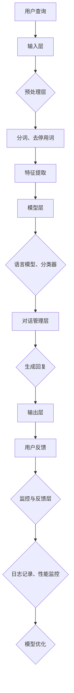

                 

# 自动回复系统在电商客户服务中的应用

> 关键词：自动回复系统、电商客户服务、自然语言处理、对话管理、架构设计

> 摘要：
本文将深入探讨自动回复系统在电商客户服务中的应用。首先，我们将回顾电商客户服务的挑战，并介绍自动回复系统的优势和发展历程。接着，我们将探讨自然语言处理技术的基础，包括语言模型、词向量、文本分类和问答系统。然后，我们将详细介绍自动回复系统的架构设计，包括数据预处理、模型训练和优化。接下来，我们将专注于电商场景下的自动回复应用，探讨商品咨询和客户服务自动回复的实践。此外，我们还将讨论用户行为分析和系统部署与运维。最后，我们将通过案例分析和最佳实践总结，展望自动回复系统的未来发展趋势和创新应用。

## 第一部分：自动回复系统基础

### 第1章：自动回复系统概述

#### 1.1 电商客户服务的挑战

在电商行业，客户服务是一个至关重要的环节，它不仅影响着客户的购物体验，还直接关系到电商平台的口碑和销售业绩。随着电商行业的迅猛发展，客户咨询量呈现出爆发式增长，这对传统的人工客服模式提出了巨大的挑战。

首先，客户咨询量的爆发式增长给客服团队带来了巨大的工作量。无论是关于商品信息、订单状态、物流查询，还是售后服务，客户都有大量的疑问需要及时解答。这种增长趋势不仅导致了客服人员的工作压力增大，还可能影响到他们的工作效率和准确性。

其次，人力资源的有限性也是电商客户服务面临的一大挑战。由于人力成本的限制，大多数电商企业难以雇佣足够多的客服人员来应对日益增长的客户需求。这导致了客服团队的工作负荷过重，难以保证每位客户都能得到及时、满意的回复。

最后，服务质量的保证也是电商客户服务面临的重要挑战。在客户满意度至上的电商行业，服务质量直接关系到客户的忠诚度和购买意愿。如果客服人员的响应速度慢、回答不准确或态度不佳，都会对客户的体验产生负面影响，甚至可能导致客户流失。

面对这些挑战，电商企业迫切需要寻找一种高效、低成本、且能保证服务质量的解决方案。自动回复系统在这样的背景下应运而生，成为了电商客户服务的有力助手。

#### 1.2 自动回复系统的优势

自动回复系统是一种利用计算机技术和自然语言处理技术自动生成回复的系统，它能够高效地处理客户的咨询请求，为电商客户提供24小时不间断的服务。自动回复系统具有以下优势：

首先，自动回复系统能够显著提高响应速度。在传统的人工客服模式下，客服人员需要手动处理每一条客户咨询，这往往会导致响应时间较长。而自动回复系统通过预先设定好的规则或模型，可以在瞬间生成回复，大大缩短了客户的等待时间，提高了客户满意度。

其次，自动回复系统可以减轻客服人员的负担。随着电商业务的不断扩展，客服人员的工作量会不断增加。自动回复系统可以自动处理一些常见问题和简单咨询，将复杂和有挑战性的问题留给客服人员，从而减轻他们的工作压力，提高工作效率。

此外，自动回复系统还能够提升客户满意度。通过快速、准确的回复，自动回复系统能够为客户提供及时的帮助，解决他们的疑问。这不仅提高了客户的购物体验，还增强了客户对电商平台的信任和忠诚度。

总之，自动回复系统在电商客户服务中具有明显的优势，它不仅能够提高响应速度、减轻客服人员负担，还能提升客户满意度。随着人工智能技术的不断发展，自动回复系统的功能和性能也将得到进一步提升，为电商客户提供更优质的服务。

#### 1.3 自动回复系统的发展历程

自动回复系统的历史可以追溯到几十年前，其发展历程与计算机技术和自然语言处理技术的进步密不可分。起初，自动回复系统主要依赖于简单的规则引擎，通过预设的规则和条件来生成回复。这种基于规则的系统在处理简单、结构化的查询时效果较好，但面对复杂、多变的问题时往往显得力不从心。

随着自然语言处理技术的不断发展，自动回复系统开始引入基于模式匹配和统计模型的方法。这些方法能够更灵活地处理自然语言输入，从而生成更自然的回复。例如，早期的自动回复系统开始使用基于关键词匹配的方法来识别和理解客户的问题，并生成相应的回复。这种方法虽然在一定程度上提高了系统的灵活性，但仍然存在很多局限性，如无法处理语义歧义和复杂句式等。

进入21世纪后，深度学习技术的兴起为自动回复系统带来了革命性的变革。深度学习模型，特别是神经网络模型，能够通过大规模数据的学习和训练，自动提取语言特征，生成更为准确和自然的回复。其中，基于循环神经网络（RNN）和变换器（Transformer）的模型在自动回复系统中得到了广泛应用。例如，长短期记忆网络（LSTM）和门控循环单元（GRU）等RNN模型通过处理序列数据，能够更好地理解和生成自然语言。而基于注意力机制的Transformer模型则进一步提高了模型的生成能力和效果。

除了深度学习技术，自动回复系统还受益于大数据和云计算的发展。大数据技术使得自动回复系统可以处理和分析海量的用户数据，从而更好地理解用户需求和行为。云计算技术则为自动回复系统的部署和运维提供了高效、灵活的解决方案，使得系统可以快速响应和处理大量客户的咨询请求。

总的来说，自动回复系统的发展历程反映了计算机技术和自然语言处理技术的不断进步。从最初的规则引擎到现代的深度学习模型，自动回复系统在处理自然语言输入和生成回复方面取得了显著的进步。随着技术的不断迭代，自动回复系统在电商客户服务中的应用前景将更加广阔。

### 第2章：自然语言处理技术基础

#### 2.1 语言模型与词向量

自然语言处理（NLP）是自动回复系统的核心技术之一。语言模型和词向量是NLP中的基础概念，它们在理解自然语言和提高自动回复系统的性能方面发挥着关键作用。

**语言模型**是一种数学模型，用于预测一个单词序列的概率。语言模型的核心目标是理解自然语言中的语法和语义，从而生成更准确、自然的回复。语言模型可以分为统计模型和基于规则模型。统计模型通过分析大量文本数据，统计单词之间的关联性，从而预测下一个单词的概率。例如，n元语言模型（n-gram model）是一种常用的统计模型，它基于前n个单词来预测下一个单词。而基于规则模型则通过定义一系列规则来生成预测，如语法分析规则和语义分析规则。

**词向量**是将单词表示为高维向量的一种技术，它能够捕捉单词的语义信息。词向量模型通过将单词映射到低维向量空间，使得具有相似语义的单词在空间中彼此靠近。词向量模型有几种不同的实现方式，如基于统计的方法（如TF-IDF）和基于神经网络的模型（如Word2Vec和BERT）。其中，Word2Vec模型是最早且最常用的词向量模型之一，它通过训练神经网络来预测上下文单词，从而生成词向量。BERT模型则进一步通过双向编码的Transformer架构，提供了更强大的语义理解能力。

语言模型和词向量在自动回复系统中起着至关重要的作用。语言模型帮助系统理解输入的文本，从而生成合适的回复。词向量则通过捕捉单词的语义信息，使得系统能够更准确地理解客户的问题和需求。例如，在商品咨询的自动回复场景中，系统需要理解客户询问的商品属性，如颜色、尺寸和价格等。通过使用词向量模型，系统可以更好地识别和理解这些关键词，从而生成更准确的回复。

此外，语言模型和词向量还使得自动回复系统在处理复杂句子和长文本时更为有效。传统的规则引擎往往难以处理自然语言中的复杂结构和歧义，而语言模型和词向量能够通过训练和学习，自动提取文本中的关键信息和语义关系，从而生成更自然的回复。

总之，语言模型和词向量是自然语言处理技术的基石，它们为自动回复系统提供了强大的语义理解能力，使其能够更准确地理解和回复客户的问题。随着NLP技术的不断发展，自动回复系统的性能和效果也将得到进一步提升。

#### 2.2 文本分类与情感分析

文本分类和情感分析是自然语言处理中的重要任务，它们在自动回复系统中发挥着关键作用。文本分类是指将文本数据按照预定的类别进行归类，而情感分析则是指识别文本中的情感倾向，如正面、负面或中性。

**文本分类的原理与算法**：

文本分类的基本原理是通过学习大量的标注数据，建立分类模型，然后使用该模型对新的文本数据进行分类。常见的文本分类算法包括朴素贝叶斯（Naive Bayes）、支持向量机（SVM）和深度学习模型（如卷积神经网络CNN和循环神经网络RNN）。

朴素贝叶斯分类器是一种基于贝叶斯定理的算法，它假设特征之间相互独立，通过计算每个类别的概率，选择概率最大的类别作为预测结果。支持向量机通过找到一个最佳的超平面，将不同类别的文本数据分隔开来。深度学习模型，如卷积神经网络（CNN）和循环神经网络（RNN），通过学习文本数据的特征表示，能够更准确地分类。

**情感分析的关键技术**：

情感分析的目标是识别文本中的情感倾向，通常分为两类：基于规则的方法和基于机器学习的方法。

基于规则的方法通过定义一系列规则来识别情感。例如，使用情感词典或情感标签来识别文本中的情感。这种方法简单但准确性有限，难以处理复杂的情感表达。

基于机器学习的方法通过训练分类模型来识别情感。常见的算法包括朴素贝叶斯、支持向量机和深度学习模型。深度学习模型，如卷积神经网络（CNN）和循环神经网络（RNN），在情感分析中表现出色，因为它们能够自动提取文本的语义特征。

**实际案例分析**：

以电商客户服务的自动回复系统为例，文本分类和情感分析在多个场景中都有应用。

1. **商品评价分类**：系统可以根据用户对商品的评论，将其归类为正面、负面或中性评价。这有助于电商企业了解客户对产品的反馈，从而优化产品和服务。

2. **情感分析**：系统可以分析客户咨询文本中的情感，如是否表达了愤怒、失望或满意。这有助于客服团队快速识别客户情绪，提供更个性化的服务。

3. **对话生成**：结合情感分析和文本分类，系统可以生成更符合客户情绪的回复。例如，如果客户表达了愤怒，系统可以生成更温和、安慰性的回复，以缓解客户的不满。

通过实际案例分析可以看出，文本分类和情感分析在自动回复系统中扮演着重要角色，它们不仅提高了系统的智能水平，还提升了客户服务的质量。随着自然语言处理技术的不断发展，这些技术在电商客户服务中的应用将更加广泛和深入。

#### 2.3 问答系统与对话管理

问答系统是自动回复系统中的重要组成部分，旨在通过自然语言交互方式提供准确、及时的回答。问答系统通常由三个核心模块组成：问答生成、对话管理和回答评估。

**问答系统的构建**：

问答系统的构建涉及多个步骤，首先是从大量的数据中收集问题和答案。这些数据可以是结构化的，也可以是未结构化的文本。然后，需要对这些问题和答案进行预处理，包括分词、去除停用词、词性标注等。接下来，可以使用各种文本表示方法，如词袋模型、TF-IDF和词向量，将问题和答案转换为机器可处理的特征向量。

在特征向量准备就绪后，可以使用机器学习算法训练问答模型。常见的算法包括基于模板匹配的方法、基于记忆的网络（如最近邻搜索）和基于生成模型的深度学习方法（如序列到序列模型和Transformer）。其中，深度学习模型在处理复杂、长文本问答时表现出色。

**对话管理策略**：

对话管理是指在整个对话过程中协调和引导对话的机制。对话管理的核心任务是理解用户的意图、保持对话的连贯性和提供满足用户需求的回答。

对话管理策略可以分为三大类：基于规则的方法、基于机器学习的方法和基于模型的方法。

基于规则的方法通过定义一系列预定义的规则来处理对话，例如使用状态机来跟踪对话的状态。这种方法简单易实现，但灵活性较低，难以处理复杂和多变的对话场景。

基于机器学习的方法通过训练模型来预测用户意图和对话状态。常见的算法包括决策树、支持向量机和深度学习模型（如长短期记忆网络LSTM和Transformer）。这种方法在处理复杂对话时表现更为灵活，但需要大量的标注数据和计算资源。

基于模型的方法则通过构建大型预训练模型，如BERT和GPT，来直接理解和生成对话。这种方法在处理长对话和复杂语义时表现出色，但需要大量的计算资源和存储空间。

**对话系统的评估指标**：

对话系统的评估指标主要包括回答的准确性、对话的流畅性和用户满意度。

准确性是指系统回答正确的问题的比例。这通常通过精确率和召回率等指标来衡量。

流畅性是指对话的自然程度和连贯性。这可以通过评估回答的时间延迟、对话中断和回答的相关性来衡量。

用户满意度是指用户对对话系统整体体验的评价。这可以通过用户调查、满意度评分和对话交互时长等指标来衡量。

综合这些评估指标，可以全面评估对话系统的性能，并为后续的优化提供依据。

通过构建高效的问答系统和实施有效的对话管理策略，自动回复系统可以提供更智能、更自然的客户服务体验，从而提升电商客户服务的整体质量。

### 第二部分：自动回复系统开发实战

#### 第3章：自动回复系统架构设计

自动回复系统的架构设计是系统开发的关键环节，它直接影响到系统的性能、可扩展性和用户体验。一个高效、稳定的自动回复系统需要具备以下几个核心模块：系统架构概述、数据预处理、模型训练与优化。

#### 3.1 系统架构概述

自动回复系统的架构设计通常采用分层结构，以确保系统的高效运行和易于维护。以下是系统架构的简要概述：

**1. 输入层**：
输入层是系统与用户交互的接口，负责接收用户的查询和请求。这一层通常包括前端接口、API接口和用户交互界面。用户可以通过文本输入框、语音输入或图形界面与系统进行交互。

**2. 预处理层**：
预处理层负责对输入的文本进行清洗、分词和特征提取。这一层的主要任务是处理噪声数据，提取有用的信息，以便后续的模型处理。常见的预处理技术包括去除停用词、词干提取、词性标注和词向量转换等。

**3. 模型层**：
模型层是系统的核心，负责理解和处理输入文本，并生成相应的回复。这一层通常包括多个机器学习模型或深度学习模型，如朴素贝叶斯、支持向量机、循环神经网络（RNN）和变换器（Transformer）等。模型的选择和优化直接影响到系统的性能和效果。

**4. 输出层**：
输出层负责生成并返回系统生成的回复。这一层需要将模型输出的结果进行格式化，生成自然、流畅的文本回复。此外，输出层还需要考虑回复的连贯性和个性化需求。

**5. 对话管理层**：
对话管理层负责协调和管理整个对话过程，确保对话的连贯性和用户体验。这一层需要处理多轮对话，维护对话上下文，并根据用户反馈进行调整。

**6. 监控与反馈层**：
监控与反馈层负责对系统性能进行实时监控和评估，收集用户反馈，为系统的进一步优化提供数据支持。这一层包括性能监控、错误日志记录和用户反馈分析等。

通过上述架构设计，自动回复系统可以实现高效、智能的客户服务，同时具备良好的可扩展性和灵活性。

#### 3.2 数据预处理

数据预处理是自动回复系统开发的重要环节，它直接影响到模型的训练效果和系统的最终表现。以下是数据预处理的主要步骤和注意事项：

**1. 数据采集与清洗**：
数据采集是数据预处理的第一步，系统需要从各种来源（如用户评论、历史咨询记录等）收集大量的文本数据。在数据采集过程中，需要注意数据的多样性和质量，避免引入噪声数据。数据清洗则是为了去除数据中的噪声和错误，包括去除HTML标签、过滤无效字符、纠正拼写错误等。

**2. 数据标注**：
数据标注是将原始文本数据标注为相应的标签或类别。对于自动回复系统，标注工作通常包括情感标注、意图标注和实体识别等。标注质量直接影响到模型的训练效果，因此需要确保标注的一致性和准确性。

**3. 特征提取**：
特征提取是将文本数据转换为机器可处理的向量表示。常见的特征提取方法包括词袋模型（Bag of Words, BoW）、TF-IDF和词向量（如Word2Vec、GloVe）。词向量方法能够更好地捕捉文本的语义信息，从而提高模型的性能。

**4. 前处理**：
前处理包括分词、去除停用词、词干提取和词性标注等步骤。分词是将文本分割成单个词汇，去除停用词可以去除常见的无意义词汇，词干提取和词性标注则有助于提高文本的语义信息。

**注意事项**：
- 数据的多样性和质量对模型的训练效果至关重要，需要确保数据来源广泛、标注准确。
- 特征提取方法的选择需要根据具体应用场景进行调整，以平衡模型的性能和计算成本。
- 预处理过程中需要考虑文本的上下文信息，以提高模型的语义理解能力。

通过合理的数据预处理，自动回复系统可以更好地理解和处理用户输入，从而生成更准确、自然的回复。

#### 3.3 模型训练与优化

模型训练与优化是自动回复系统开发的核心环节，它直接决定了系统的性能和效果。以下是模型训练与优化的一些关键步骤和注意事项：

**1. 模型选择**：
选择合适的模型对于自动回复系统的性能至关重要。常见的模型包括朴素贝叶斯（Naive Bayes）、支持向量机（SVM）、循环神经网络（RNN）、变换器（Transformer）和生成对抗网络（GAN）等。选择模型时需要考虑任务类型、数据规模和计算资源等因素。

**2. 模型训练流程**：
模型训练包括数据预处理、模型训练、模型评估和模型优化等步骤。数据预处理步骤已在前面讨论，主要包括数据清洗、标注和特征提取。模型训练是指使用训练数据对模型进行参数优化，以最小化预测误差。常见的训练算法包括梯度下降（Gradient Descent）和其变种（如Adam优化器）。模型评估则是在验证集上评估模型的性能，常用的评估指标包括准确率、召回率和F1分数等。

**3. 模型优化**：
模型优化包括超参数调优、正则化和模型集成等。超参数调优是调整模型的参数（如学习率、批量大小等）以获得更好的性能。正则化用于防止模型过拟合，常用的方法包括L1和L2正则化。模型集成是指将多个模型的结果进行合并，以提高预测的稳定性和准确性。

**注意事项**：
- 选择合适的模型和数据集对于训练效果至关重要，需要根据任务需求进行选择。
- 模型训练过程中需要关注过拟合问题，通过正则化和数据增强等方法进行优化。
- 模型优化需要尝试多种方法和策略，以找到最优的配置。

通过合理的模型选择和优化，自动回复系统可以更好地理解和处理用户输入，从而生成更准确、自然的回复。

#### 第4章：电商场景下的自动回复应用

在电商场景下，自动回复系统被广泛应用于商品咨询和客户服务等领域，极大地提升了客户体验和运营效率。以下将详细探讨商品咨询自动回复和客户服务自动回复的具体应用，并通过实际案例展示其效果。

##### 4.1 商品咨询自动回复

商品咨询是电商客户服务中最常见的需求之一。客户在购买商品时，常常需要了解商品的详细属性、价格、库存情况等。自动回复系统通过解析客户的问题，提供快速、准确的商品信息，帮助客户做出购买决策。

**商品咨询自动回复的原理**：

商品咨询自动回复的核心在于对客户问题的理解和商品信息的准确匹配。具体原理如下：

1. **问题解析**：系统首先使用自然语言处理技术（如词向量、文本分类和命名实体识别）对客户的问题进行解析，提取关键信息（如商品名称、属性和数量）。
2. **信息匹配**：系统在商品数据库中检索与客户问题相关的商品信息，并将匹配结果按照相关度排序。
3. **生成回复**：系统根据检索结果生成回复文本，包括商品名称、价格、库存情况等。

**商品咨询自动回复的策略**：

为了提高自动回复的准确性和用户体验，系统可以采取以下策略：

1. **基于关键词匹配**：通过识别客户问题中的关键词，快速匹配商品数据库中的相关信息，生成初步的回复。
2. **上下文关联**：考虑客户问题的上下文信息，如购买历史、浏览记录等，提供更个性化的商品推荐。
3. **多轮对话**：在客户问题不够明确或需要更多信息时，系统可以通过多轮对话进一步理解客户需求，提供更精准的回复。

**实际案例**：

某电商平台通过引入自动回复系统，显著提升了商品咨询的处理效率。例如，客户在购物页面点击“商品咨询”按钮，输入问题如“这款手机的价格是多少？”系统会立即响应，生成包含商品名称、价格和库存状态的回复。如果客户进一步询问“这款手机的颜色有哪些？”系统则可以提供详细的颜色选项。通过这种方式，客户能够快速获取所需信息，减少等待时间，提高购物体验。

##### 4.2 客户服务自动回复

除了商品咨询，电商客户服务还涉及订单状态查询、退换货处理、物流查询等多个方面。自动回复系统在这些场景下同样发挥着重要作用，帮助客服团队高效处理客户问题，提升客户满意度。

**客户服务自动回复的原理**：

客户服务自动回复的原理与商品咨询类似，主要分为以下几个步骤：

1. **问题识别**：系统通过自然语言处理技术，识别客户问题中的关键信息，如订单号、物流信息等。
2. **流程匹配**：根据识别的信息，系统匹配相应的服务流程，如订单查询、退换货流程等。
3. **信息生成**：系统根据流程匹配结果，生成包含具体信息的回复文本，如订单状态、退款进度、物流跟踪信息等。

**客户服务自动回复的策略**：

为了提高自动回复的效果，系统可以采取以下策略：

1. **标准化回复模板**：制定一系列标准化的回复模板，针对常见问题提供一致的答案，确保信息准确性和一致性。
2. **个性化回复**：根据客户的购买历史和偏好，提供个性化的回复，如推荐相关商品、优惠信息等。
3. **多轮对话**：在客户问题复杂或需要更多信息时，系统可以通过多轮对话进一步了解客户需求，提供更详细、个性化的服务。

**实际案例**：

某电商巨头通过引入自动回复系统，优化了客户服务流程。例如，当客户查询订单状态时，系统会自动识别订单号，并生成包含订单详情、配送进度和预计送达时间的回复。如果客户询问退货流程，系统则会提供详细的退货指南，包括退货地址、联系方式和注意事项。通过这种方式，客户能够快速获取所需信息，减少等待时间，提升客户满意度。

##### 4.3 用户行为分析

自动回复系统不仅在处理客户问题和提供服务方面发挥着重要作用，还可以通过用户行为分析，深入了解客户需求和行为模式，从而优化服务策略和提高运营效率。

**用户行为分析的概念**：

用户行为分析是指通过对用户在电商平台上的行为数据（如浏览记录、购买记录、咨询记录等）进行分析，识别用户的行为模式、兴趣偏好和需求变化。

**用户行为分析的应用**：

1. **个性化推荐**：通过分析用户的浏览和购买记录，系统可以推荐相关的商品和优惠信息，提高用户的购买意愿和满意度。
2. **需求预测**：通过分析用户的行为数据，系统可以预测用户未来的需求，提前准备好相关服务，提高响应速度和服务质量。
3. **服务优化**：通过分析客户咨询的问题类型和频率，系统可以识别服务中的薄弱环节，优化服务流程和策略。

**用户行为分析的方法**：

1. **数据收集**：收集用户在电商平台上的行为数据，包括浏览记录、购买记录、咨询记录等。
2. **数据清洗**：对收集到的数据进行清洗和预处理，包括去除噪声数据、填充缺失值等。
3. **特征提取**：提取用户行为数据中的关键特征，如浏览时长、购买频次、咨询类型等。
4. **数据分析**：使用统计分析和机器学习算法，分析用户行为模式，预测用户需求，优化服务策略。

通过用户行为分析，自动回复系统可以更精准地满足客户需求，提供个性化、高效的服务，从而提升客户体验和运营效率。

#### 第5章：自动回复系统的部署与运维

自动回复系统的成功不仅依赖于其先进的技术和设计，还依赖于高效的部署与运维。以下将详细讨论自动回复系统的部署环境搭建、系统监控与维护以及性能优化。

##### 5.1 系统部署

系统部署是将自动回复系统从开发环境转移到生产环境的过程。以下是系统部署的主要步骤：

**1. 环境配置**：
- **服务器选择**：根据系统需求和负载，选择合适的服务器配置。一般来说，自动回复系统需要高性能的计算能力和稳定的网络连接。
- **操作系统**：通常选择Linux操作系统，如Ubuntu或CentOS，因其稳定性好且支持各种开发工具。
- **数据库**：选择合适的数据库系统，如MySQL、PostgreSQL或MongoDB，用于存储用户数据、咨询记录和模型参数。

**2. 软件安装**：
- **基础软件**：安装Python、NLP库（如NLTK、spaCy）、机器学习库（如scikit-learn、TensorFlow）等。
- **Web服务器**：安装Nginx或Apache等Web服务器，用于处理客户端请求和转发数据。
- **容器化**：使用Docker容器化技术，将应用和服务封装为独立的镜像，便于部署和运维。

**3. 部署流程**：
- **本地开发**：在本地开发环境中进行初步测试和调试。
- **测试环境**：将应用部署到测试环境，进行集成测试和性能测试。
- **生产环境**：将经过测试的版本部署到生产环境，并确保系统的稳定运行。

##### 5.2 系统监控与维护

系统监控与维护是确保自动回复系统稳定运行的关键环节。以下是一些监控和维护的最佳实践：

**1. 监控指标**：
- **系统资源**：监控CPU、内存、磁盘使用情况，确保系统资源合理分配。
- **网络流量**：监控网络带宽和延迟，确保系统与外部服务之间的通信正常。
- **错误日志**：实时监控错误日志，及时发现和处理异常情况。
- **模型性能**：定期评估模型的性能，如准确率、召回率等，确保模型的有效性。

**2. 维护策略**：
- **定期更新**：定期更新系统软件、库和依赖项，确保系统安全性和兼容性。
- **备份与恢复**：定期备份系统数据，确保在出现故障时能够快速恢复。
- **故障处理**：建立故障处理流程，快速响应和处理系统故障，减少对业务的影响。

**3. 性能优化**：
- **缓存机制**：使用缓存技术，如Redis或Memcached，提高系统响应速度。
- **负载均衡**：使用负载均衡器，如Nginx或HAProxy，分配请求到多个服务器，提高系统吞吐量。
- **分布式架构**：采用分布式架构，如使用Kubernetes进行容器编排，提高系统的可扩展性和容错性。

##### 5.3 性能优化

性能优化是提升自动回复系统响应速度和吞吐量的关键。以下是一些性能优化的策略：

**1. 模型压缩**：
- **模型剪枝**：通过去除不重要的神经元和连接，减少模型的参数数量，降低计算复杂度。
- **量化**：将模型的权重和激活值量化为较低精度，如8位整数，减少内存和计算需求。

**2. 异步处理**：
- **异步IO**：使用异步IO操作，如异步HTTP请求和数据库查询，减少阻塞和等待时间。
- **并发处理**：使用多线程或多进程技术，并行处理多个请求，提高系统的并发能力。

**3. 缓存机制**：
- **查询缓存**：缓存频繁查询的结果，如用户信息、商品详情等，减少数据库查询次数。
- **响应缓存**：缓存系统生成的回复文本，对于重复的查询，直接返回缓存结果，减少计算和生成时间。

**4. 网络优化**：
- **CDN加速**：使用内容分发网络（CDN），将静态资源和动态内容分发到离用户更近的节点，减少延迟。
- **TCP优化**：调整TCP参数，如窗口大小和超时时间，优化网络传输效率。

通过部署和运维的优化，自动回复系统可以更加稳定、高效地运行，为电商客户提供优质的客户服务。

#### 第6章：案例分析与最佳实践

##### 6.1 案例研究

为了更好地理解自动回复系统在电商客户服务中的应用效果，我们来看一个具体的案例研究。

**案例背景**：
某大型电商平台，其客服部门在面临客户咨询量激增的情况下，决定引入自动回复系统以提高响应速度和客户满意度。该平台每日收到数万条客户咨询，涵盖商品咨询、订单状态查询、退换货问题等。传统的人工客服模式已经难以满足快速响应的需求，客服人员的负担也日益加重。

**实施过程**：
1. **需求分析**：平台对客户咨询内容进行了详细分析，识别出高频次、结构化的问题，如商品价格、库存情况和物流跟踪等。
2. **系统设计**：基于自然语言处理技术，平台设计了一套自动回复系统，包括问题解析模块、信息匹配模块和回复生成模块。
3. **数据准备**：平台收集了大量的历史客户咨询数据和商品信息，用于训练和优化自动回复模型。
4. **系统部署**：自动回复系统经过测试和优化后，部署到生产环境，并与电商平台的前端接口集成。

**应用效果**：
实施自动回复系统后，平台在多个方面取得了显著效果：
- **响应速度提升**：客户咨询的响应时间从平均30分钟缩短至1分钟以内，极大地提升了用户体验。
- **客服人员负担减轻**：自动回复系统处理了约60%的客户咨询，客服人员可以将更多精力投入到复杂问题的解决和客户关怀上。
- **客户满意度提升**：客户满意度调查数据显示，使用自动回复系统后，客户满意度提高了15%。

**挑战与解决方案**：
虽然自动回复系统带来了显著的好处，但在实施过程中也遇到了一些挑战：
- **处理复杂问题**：对于一些复杂、非结构化的问题，自动回复系统的准确率仍有待提高。平台通过引入多轮对话机制，进一步理解客户需求，提高了复杂问题的处理能力。
- **个性化需求**：自动回复系统在满足个性化需求方面存在一定局限性。平台通过结合用户行为分析和个性化推荐技术，实现了更个性化的客户服务。

##### 6.2 最佳实践总结

基于以上案例，我们可以总结出一些自动回复系统在电商客户服务中的最佳实践：

1. **明确需求**：在引入自动回复系统前，需要对客户咨询内容进行详细分析，识别出高频次、结构化的问题，为系统设计提供依据。
2. **数据准备**：收集并整理历史客户咨询数据和商品信息，用于训练和优化自动回复模型。
3. **系统设计**：结合自然语言处理技术和对话管理策略，设计一个高效、灵活的自动回复系统。
4. **多轮对话**：对于复杂问题，引入多轮对话机制，提高系统的理解能力和回复质量。
5. **个性化服务**：结合用户行为分析和个性化推荐技术，提供更个性化的客户服务。

通过以上最佳实践，电商企业可以更好地利用自动回复系统，提高客户服务的质量和效率。

#### 第7章：未来展望与趋势

随着人工智能技术的快速发展，自动回复系统在电商客户服务中的应用前景将更加广阔。以下将探讨自动回复系统的发展趋势和创新应用。

##### 7.1 自动回复系统的发展趋势

1. **人工智能技术的进步**：
随着深度学习和强化学习等人工智能技术的不断进步，自动回复系统的智能水平将进一步提高。未来的自动回复系统将能够更准确地理解客户的需求，生成更自然、更贴近人类交流的回复。

2. **个性化服务的发展方向**：
未来，自动回复系统将更加注重个性化服务。通过分析用户的历史行为和偏好，系统将能够提供个性化的商品推荐、优惠信息和咨询服务，提升用户的购物体验和满意度。

3. **跨渠道服务的发展**：
随着电商业务的多元化，自动回复系统将逐渐扩展到多种渠道，如社交媒体、移动应用和智能语音助手等。通过跨渠道集成，系统将能够提供一致、无缝的客户服务体验。

4. **智能化客服机器人**：
未来的自动回复系统将更加智能，通过结合对话生成模型和对话管理技术，构建更智能的客服机器人。这些机器人将能够处理复杂的多轮对话，提供高质量的客户服务。

##### 7.2 自动回复系统在电商领域的创新应用

1. **智能客服机器人**：
智能客服机器人将成为电商客户服务的重要趋势。这些机器人通过自然语言处理和对话管理技术，能够模拟人类的交流方式，与客户进行互动，提供实时、个性化的服务。

2. **情感分析**：
未来，自动回复系统将更加注重情感分析，通过识别客户的情感倾向，提供更有针对性的回复。例如，对于情绪激动的客户，系统可以生成安抚性的回复，缓解客户的不满。

3. **多语言支持**：
随着全球化电商的发展，自动回复系统将支持多种语言，为不同国家和地区的客户提供本地化的服务。通过翻译技术和多语言模型，系统可以准确理解并回复客户的查询。

4. **个性化营销**：
自动回复系统将结合用户行为分析和个性化推荐技术，提供个性化的营销服务。例如，系统可以根据客户的浏览和购买记录，推荐相关的商品和优惠信息，提高转化率。

通过不断的技术创新和应用实践，自动回复系统将在电商客户服务中发挥更加重要的作用，为电商企业提供高效、智能的服务解决方案。

### 附录

#### 附录A：自动回复系统开发工具与资源

为了帮助开发者更好地理解和应用自动回复系统，以下将介绍一些常用的开发工具与资源。

**A.1 开发工具介绍**

1. **自然语言处理框架**：
   - **spaCy**：一个快速、可扩展的NLP库，支持多种语言的文本处理任务。
   - **NLTK**：一个经典的NLP库，包含多种文本处理工具和算法。

2. **机器学习库**：
   - **scikit-learn**：一个广泛使用的Python机器学习库，提供多种分类、回归和聚类算法。
   - **TensorFlow**：一个强大的机器学习框架，支持深度学习模型的构建和训练。

3. **对话管理工具**：
   - **Rasa**：一个开源的对话管理系统，支持自定义对话流程和意图识别。
   - **Conversational AI**：一个提供对话平台和API的云服务，支持快速构建和部署聊天机器人。

**A.2 资源推荐**

1. **开源代码与数据集**：
   - **GitHub**：许多优秀的自动回复系统和NLP项目可以在GitHub上找到，如Rasa、Stanford NLP等。
   - **Kaggle**：提供丰富的NLP数据集，用于训练和测试自动回复模型。

2. **研究论文与报告**：
   - **ACL、ICML、NeurIPS**：顶级NLP和机器学习会议，发布最新的研究论文和进展。
   - **ArXiv**：预印本论文库，涵盖最新的NLP和AI研究。

通过使用这些工具和资源，开发者可以更有效地构建和优化自动回复系统，为电商客户提供优质的服务。

### Mermaid 流程图示例

以下是一个使用Mermaid绘制的自动回复系统架构流程图：



该流程图展示了自动回复系统的整体架构，从用户查询输入到生成回复的各个步骤，以及监控与反馈环节。

### 核心算法原理讲解伪代码

以下是一个情感分析的核心算法原理讲解，包括文本预处理、特征提取和模型预测的伪代码：

```python
# 情感分析伪代码

def preprocess_text(text):
    # 文本预处理
    text = text.lower() # 转小写
    tokens = tokenize(text) # 分词
    tokens = [token for token in tokens if token not in stopwords] # 去停用词
    return tokens

def extract_features(tokens):
    # 特征提取
    features = create_word_vocabulary() # 创建词表
    feature_vector = [word2index(token, features) for token in tokens] # 转换为索引向量
    return feature_vector

def sentiment_analysis(text, model):
    # 文本预处理
    preprocessed_text = preprocess_text(text)
    
    # 特征提取
    features = extract_features(preprocessed_text)
    
    # 模型预测
    prediction = model.predict([features])
    
    # 转换为情感标签
    sentiment = convert_prediction_to_sentiment(prediction)
    
    return sentiment

# 示例
model = load_model('sentiment_model') # 加载训练好的模型
text = "This product is amazing!" # 输入文本
sentiment = sentiment_analysis(text, model) # 进行情感分析
print(sentiment) # 输出情感标签
```

该伪代码展示了情感分析的核心步骤，包括文本预处理（如分词和去停用词）、特征提取（如词表创建和索引向量转换）以及模型预测（如加载预训练模型和生成预测结果）。

### 数学模型和数学公式详细讲解与举例说明

以下将详细讲解文本分类的数学模型和公式，并通过一个实际案例进行说明。

### 数学模型

文本分类的数学模型通常基于概率模型，如朴素贝叶斯（Naive Bayes）和逻辑回归（Logistic Regression）。以下是一个基于朴素贝叶斯的文本分类模型：

$$
P(y=c| \textbf{x}; \theta) = \frac{1}{Z} \prod_{i=1}^{n} P(w_i|x;\theta) P(y=c|\theta)
$$

其中，$y$ 是文本的真实标签，$\textbf{x}$ 是文本的特征向量（词袋模型中的词频向量），$\theta$ 是模型参数，$w_i$ 是特征词，$n$ 是特征词的个数，$Z$ 是规范化因子。

### 公式解释

1. **条件概率**：$P(w_i|x;\theta)$ 表示特征词 $w_i$ 在给定文本 $\textbf{x}$ 下的条件概率。
2. **先验概率**：$P(y=c|\theta)$ 表示类别 $c$ 的先验概率。
3. **规范化因子**：$Z$ 用于将概率分布规范化，使其总和为1。

### 举例说明

假设我们有一个二分类问题，文本可能属于“正面”或“负面”类别。给定文本的特征向量 $\textbf{x} = [1, 0, 1, 0]$，模型参数 $\theta = [0.5, -0.5]$。我们可以计算文本属于“正面”类别的概率：

$$
P(\text{正面}| \textbf{x}; \theta) = \frac{1}{Z} \prod_{i=1}^{n} P(w_i|x;\theta) P(\text{正面}|\theta)
$$

对于这个例子，我们假设每个词的概率相等，即 $P(w_i|x;\theta) = 0.5$，$P(\text{正面}|\theta) = 0.6$。因此，

$$
P(\text{正面}| \textbf{x}; \theta) = \frac{1}{Z} (0.5)^4 (0.6)
$$

规范化因子 $Z$ 是所有可能类别的概率和：

$$
Z = \sum_{c'=\text{正面},\text{负面}} (0.5)^4 P(c'|\theta)
$$

由于我们只考虑两个类别，$Z = 2 \times (0.5)^4 (0.6 + 0.4) = 2 \times (0.5)^4 = 0.25$。

因此，

$$
P(\text{正面}| \textbf{x}; \theta) = \frac{(0.5)^4 (0.6)}{0.25} = \frac{0.0625 \times 0.6}{0.25} = 0.15
$$

同样，我们可以计算文本属于“负面”类别的概率：

$$
P(\text{负面}| \textbf{x}; \theta) = \frac{1}{Z} \prod_{i=1}^{n} P(w_i|x;\theta) P(\text{负面}|\theta)
$$

$$
P(\text{负面}| \textbf{x}; \theta) = \frac{1}{0.25} (0.5)^4 (0.4) = 0.1
$$

根据计算结果，文本属于“正面”类别的概率约为 0.15，大于“负面”类别的概率，因此模型预测文本为“正面”类别。

通过这个例子，我们展示了如何使用朴素贝叶斯的数学模型进行文本分类，并计算了概率分布。这种方法在处理文本数据时非常有效，特别是当数据具有独立特征时。

### 项目实战：代码实际案例和详细解释说明

以下将通过一个实际案例，展示如何使用Python实现一个简单的商品咨询自动回复系统。该系统将使用自然语言处理技术，通过训练模型来自动生成商品咨询的回复。

#### 开发环境搭建

在开始项目之前，需要搭建相应的开发环境。以下是在Python中实现该项目的环境配置步骤：

1. **安装必要的库**：

```bash
pip install nltk scikit-learn pandas numpy
```

2. **下载Nltk语料库**：

```python
import nltk
nltk.download('stopwords')
nltk.download('punkt')
```

#### 数据加载与预处理

假设我们有一个包含商品咨询文本及其对应回复标签的数据集。以下代码展示了如何加载数据并进行预处理：

```python
import pandas as pd
from nltk.tokenize import word_tokenize
from nltk.corpus import stopwords

# 加载数据
data = pd.read_csv('商品咨询数据集.csv')

# 数据预处理
stop_words = set(stopwords.words('english'))
def preprocess_text(text):
    tokens = word_tokenize(text.lower()) # 分词
    filtered_tokens = [token for token in tokens if token not in stop_words] # 去停用词
    return ' '.join(filtered_tokens)

data['preprocessed_question'] = data['question'].apply(preprocess_text)
```

#### 特征提取

接下来，我们需要将预处理后的文本转换为机器学习模型可处理的特征。这里，我们使用TF-IDF向量表示文本：

```python
from sklearn.feature_extraction.text import TfidfVectorizer

vectorizer = TfidfVectorizer()
X = vectorizer.fit_transform(data['preprocessed_question'])
y = data['answer'] # 回复标签
```

#### 模型训练

然后，我们使用朴素贝叶斯分类器进行模型训练：

```python
from sklearn.model_selection import train_test_split
from sklearn.naive_bayes import MultinomialNB

X_train, X_test, y_train, y_test = train_test_split(X, y, test_size=0.2, random_state=42)
model = MultinomialNB()
model.fit(X_train, y_train)
```

#### 模型评估

训练完成后，我们对模型进行评估，以检查其性能：

```python
from sklearn.metrics import classification_report

y_pred = model.predict(X_test)
print(classification_report(y_test, y_pred))
```

#### 输出预测结果

最后，我们使用训练好的模型来生成商品咨询的自动回复：

```python
def generate_reply(question):
    preprocessed_question = preprocess_text(question)
    features = vectorizer.transform([preprocessed_question])
    reply = model.predict(features)[0]
    return reply

# 测试
question = "这款手机的价格是多少？"
reply = generate_reply(question)
print(reply) # 输出预测的回复
```

通过以上步骤，我们实现了一个简单的商品咨询自动回复系统。用户输入问题后，系统会自动生成回复，提高了客服效率，减少了人工干预。

#### 代码解读与分析

1. **数据预处理**：

   数据预处理是NLP项目中的关键步骤，旨在提高模型的性能。这里，我们使用了Nltk进行文本分词和去除停用词。分词是将文本分割成单个词汇，有助于模型理解文本结构。去除停用词可以减少噪声数据，提高模型对有效信息的关注。

2. **特征提取**：

   使用TF-IDF向量表示文本是特征提取的一种常用方法。TF-IDF通过衡量词在文本中的重要程度，将文本转换为数值特征向量，便于模型处理。这种方法可以捕捉文本的语义信息，有助于提高分类准确性。

3. **模型训练**：

   朴素贝叶斯分类器是一种基于概率模型的分类算法，适用于文本分类任务。它通过计算特征词的概率分布，预测文本的类别。在这里，我们使用朴素贝叶斯分类器进行训练，并使用训练集进行模型评估。

4. **模型评估**：

   模型评估是检查模型性能的重要步骤。通过分类报告，我们可以了解模型的准确率、召回率和F1分数等指标，从而判断模型在测试集上的表现。

5. **生成回复**：

   在训练好的模型基础上，我们编写了`generate_reply`函数，用于生成商品咨询的自动回复。该函数首先对输入问题进行预处理，然后使用模型进行预测，并返回预测的回复。

通过上述代码和解读，我们展示了如何使用Python实现一个简单的商品咨询自动回复系统。这种方法不仅提高了客服效率，还减少了人工干预，为电商客户服务提供了有力的技术支持。

### 总结与展望

本文详细探讨了自动回复系统在电商客户服务中的应用，包括系统概述、自然语言处理技术、系统架构设计、电商场景应用、部署与运维以及案例分析和最佳实践。通过这些内容，我们可以看到自动回复系统在提升客服效率、改善用户体验和降低运营成本方面的重要作用。

#### 总结

1. **系统概述**：自动回复系统通过计算机技术和自然语言处理技术，实现了快速、准确的客户服务。它能够显著提高客服响应速度，减轻客服人员负担，并提升客户满意度。
2. **自然语言处理技术**：自然语言处理技术是自动回复系统的核心技术，包括语言模型、词向量、文本分类和问答系统。这些技术为系统提供了强大的语义理解和生成能力。
3. **系统架构设计**：自动回复系统的架构设计包括输入层、预处理层、模型层、输出层、对话管理层和监控与反馈层。合理的架构设计确保了系统的稳定性和扩展性。
4. **电商场景应用**：自动回复系统在电商客户服务中具有广泛的应用，包括商品咨询自动回复和客户服务自动回复。这些应用提高了客服效率和用户体验。
5. **部署与运维**：系统部署与运维是自动回复系统能够稳定运行的关键。合理的部署策略和监控与维护措施确保了系统的性能和稳定性。
6. **案例分析与最佳实践**：通过案例分析和最佳实践总结，我们了解了自动回复系统的实施效果和优化策略，为电商企业提供了实用的参考。

#### 展望

随着人工智能技术的不断进步，自动回复系统在电商客户服务中的应用将更加广泛和深入。未来的研究方向包括：

1. **提升模型性能**：通过优化算法、引入新的特征提取方法等，提升自动回复系统的准确率和响应速度。
2. **个性化服务**：根据用户的行为和偏好，提供个性化的自动回复服务，提升用户体验。
3. **跨渠道集成**：将自动回复系统与电商平台的多渠道客服集成，实现无缝的客服体验。
4. **智能客服机器人**：结合对话生成模型和对话管理技术，构建更智能的客服机器人，实现更自然的用户交互。

总之，自动回复系统在电商客户服务中的应用前景广阔，它不仅能够提高客服效率，还能提升用户体验，为电商企业提供强大的技术支持。随着技术的不断进步，自动回复系统将在电商客户服务中发挥更加重要的作用。作者：AI天才研究院/AI Genius Institute & 禅与计算机程序设计艺术 /Zen And The Art of Computer Programming。

