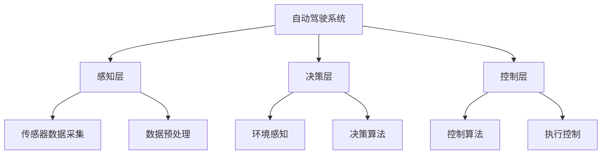
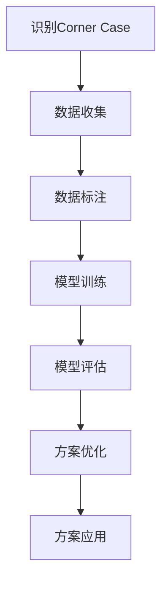

                 

# 《自动驾驶中的corner case挑战》

> 关键词：自动驾驶，corner case，感知层，决策层，控制层，解决方案，案例分析

> 摘要：本文深入探讨了自动驾驶技术中的corner case挑战，分析了感知层、决策层和控制层在处理这些特殊情况时遇到的困难，并提出了一系列解决方案。通过具体案例，本文展示了如何应对自动驾驶中的复杂问题，为自动驾驶技术的未来发展提供了有价值的参考。

## 第一部分：自动驾驶技术基础

### 1. 自动驾驶技术概述

#### 1.1 自动驾驶的定义与发展历程

自动驾驶是指利用计算机、传感器、控制器等技术，使车辆能够自主完成驾驶任务。自动驾驶技术经历了多个阶段的发展，从最初的辅助驾驶到完全自动驾驶，逐步提高了车辆的安全性和效率。

自动驾驶技术可以分为以下几类：

- L0：无自动化，完全由人类驾驶员控制。
- L1：部分自动化，车辆在特定条件下可以控制加速、制动和转向。
- L2：部分自动化，车辆在特定条件下可以同时控制加速、制动和转向。
- L3：有条件自动化，车辆可以在特定条件下完全接管驾驶任务，但需要驾驶员在必要时接管控制。
- L4：高度自动化，车辆在特定条件下可以完全接管驾驶任务，无需人类驾驶员干预。
- L5：完全自动化，车辆在任何条件下都可以完全接管驾驶任务。

#### 1.2 自动驾驶系统架构

自动驾驶系统通常包括感知层、决策层和控制层三个主要部分：

- **感知层**：负责收集车辆周围环境的信息，如摄像头、雷达、激光雷达等传感器。感知层的主要任务是对环境进行感知和理解，识别出道路、车辆、行人、交通标志等关键信息。

- **决策层**：负责分析感知层收集的信息，并根据当前情况制定驾驶策略。决策层需要考虑多种因素，如交通规则、车辆性能、道路条件等，以决定车辆的行驶方向、速度和动作。

- **控制层**：负责将决策层的驾驶策略转化为具体的控制信号，如油门、制动、转向等，实现对车辆的实际控制。

#### 1.3 自动驾驶关键技术

- **感知技术**：包括摄像头、雷达、激光雷达等传感器。这些传感器能够获取车辆周围环境的三维信息，帮助车辆识别道路、车辆、行人等。

- **人工智能算法**：自动驾驶中的决策和控制过程依赖于各种人工智能算法，如深度学习、强化学习等。这些算法可以处理大规模数据，从中学习规律，为自动驾驶提供智能决策支持。

- **控制策略**：控制策略是指如何将决策层的驾驶策略转化为具体的控制信号。常见的控制策略包括模型预测控制、自适应控制等。

## 第二部分：Corner Case的定义与分析方法

### 2.1 Corner Case的概念与类型

#### 2.1.1 Corner Case的来源

Corner Case是指那些在自动驾驶系统中难以预见、难以处理的特殊情况。这些情况可能源自多种因素，如天气、路况、车辆性能等。

#### 2.1.2 Corner Case的特点

- **罕见性**：Corner Case发生的概率较低。
- **不确定性**：Corner Case通常具有较大的不确定性，使得自动驾驶系统难以准确预测和应对。
- **复杂性**：Corner Case往往涉及到多个因素，需要综合考虑多种因素才能做出有效的决策。

#### 2.1.3 Corner Case的类型

- **静态Corner Case**：如道路施工、路面损坏等。
- **动态Corner Case**：如车辆突然变道、行人横穿等。
- **复杂场景Corner Case**：如极端天气、复杂路况等。

### 2.2 Corner Case的分析方法

#### 2.2.1 数据驱动方法

数据驱动方法是通过收集大量数据，利用机器学习等技术对Corner Case进行识别和分类。这种方法的主要优势在于能够处理大规模数据，提高识别准确率。

#### 2.2.2 知识驱动方法

知识驱动方法是通过构建知识库，将专家经验、交通规则等知识转化为系统决策依据。这种方法的主要优势在于能够提高系统决策的可靠性。

#### 2.2.3 混合方法

混合方法是将数据驱动方法和知识驱动方法相结合，以提高Corner Case识别和分类的准确性。这种方法通常需要综合考虑多种因素，如数据质量、知识库的准确性等。

## 第三部分：Corner Case挑战与解决方案

### 3.1 感知层挑战

#### 3.1.1 雨天视觉感知挑战

雨天视觉感知挑战主要体现在以下方面：

- **光线不足**：雨天的光线条件较差，会影响摄像头获取的图像质量。
- **水滴干扰**：水滴会干扰摄像头捕捉到的图像，导致识别准确性下降。

#### 3.1.2 低光环境感知挑战

低光环境感知挑战主要体现在以下方面：

- **光线不足**：低光环境下，摄像头的识别能力会下降。
- **颜色失真**：低光环境下，颜色信息可能会失真，影响图像识别。

#### 3.1.3 复杂路况感知挑战

复杂路况感知挑战主要体现在以下方面：

- **道路标线模糊**：在复杂路况下，道路标线的识别难度增加。
- **多目标检测**：需要同时检测和跟踪多个目标，增加系统的计算负担。

### 3.2 决策层挑战

#### 3.2.1 非标准交通场景决策挑战

非标准交通场景决策挑战主要体现在以下方面：

- **交通规则不明确**：某些交通场景下的规则可能不明确，导致系统难以做出正确的决策。
- **突发情况处理**：需要快速应对突发事件，如车辆突然变道、行人横穿等。

#### 3.2.2 多目标决策挑战

多目标决策挑战主要体现在以下方面：

- **资源分配**：需要同时考虑多个目标的利益，合理分配系统资源。
- **决策时序**：需要确定各个目标的优先级，以优化决策效果。

#### 3.2.3 紧急情况决策挑战

紧急情况决策挑战主要体现在以下方面：

- **反应时间**：需要快速做出决策，以避免事故发生。
- **决策质量**：在紧急情况下，需要保证决策的质量，以确保车辆的安全行驶。

### 3.3 控制层挑战

#### 3.3.1 车辆失控挑战

车辆失控挑战主要体现在以下方面：

- **动力系统故障**：车辆动力系统故障可能导致车辆失控。
- **制动系统故障**：制动系统故障可能导致车辆无法及时减速或停车。

#### 3.3.2 紧急制动挑战

紧急制动挑战主要体现在以下方面：

- **反应时间**：需要快速做出紧急制动决策。
- **制动效果**：需要保证紧急制动的效果，以避免事故发生。

#### 3.3.3 车辆路径规划挑战

车辆路径规划挑战主要体现在以下方面：

- **动态环境**：需要实时更新车辆路径，以应对环境变化。
- **目标优化**：需要优化车辆路径，以减少行驶时间和能耗。

## 第四部分：Corner Case解决方案

### 4.1 感知层解决方案

#### 4.1.1 多传感器融合技术

多传感器融合技术是将多个传感器的信息进行整合，以提高感知系统的准确性。常见的方法包括数据级融合、特征级融合和决策级融合。

#### 4.1.2 深度学习在感知中的应用

深度学习在感知中的应用主要包括目标检测、语义分割和实例分割等。通过使用深度学习算法，可以提高感知系统的识别准确率。

#### 4.1.3 知识图谱在感知中的应用

知识图谱在感知中的应用主要包括场景建模、目标识别和关系推理等。通过构建知识图谱，可以更好地理解和解析感知数据。

### 4.2 决策层解决方案

#### 4.2.1 鲁棒性决策算法

鲁棒性决策算法是指能够处理不确定性和异常情况的决策算法。常见的算法包括基于规则的决策算法、基于概率的决策算法和基于智能的决策算法。

#### 4.2.2 基于强化学习的决策方法

基于强化学习的决策方法是通过学习与环境互动，逐步优化决策策略。这种方法能够提高系统在复杂环境下的决策能力。

#### 4.2.3 多目标优化决策方法

多目标优化决策方法是通过优化多个目标的冲突，以实现整体最优。常见的算法包括遗传算法、粒子群优化算法和混合整数规划算法。

### 4.3 控制层解决方案

#### 4.3.1 精细控制算法

精细控制算法是指能够精确控制车辆的动作。常见的算法包括模型预测控制、自适应控制和鲁棒控制等。

#### 4.3.2 基于模型预测控制的方法

基于模型预测控制的方法是通过预测未来一段时间内的系统状态，并制定最优控制策略。这种方法能够提高系统的响应速度和稳定性。

#### 4.3.3 紧急控制策略设计

紧急控制策略设计主要包括制动控制、转向控制和路径规划等。通过设计合理的紧急控制策略，可以提高系统的应对紧急情况的能力。

## 第五部分：Corner Case应用与案例分析

### 5.1 案例一：自动驾驶在极端天气条件下的应对

#### 5.1.1 案例背景

在极端天气条件下，如暴雨、大雪等，道路条件会变得非常复杂，对自动驾驶系统的感知、决策和控制能力提出了严峻挑战。

#### 5.1.2 问题分析

极端天气条件下，主要面临以下问题：

- **感知层挑战**：雨雪天气会影响摄像头、雷达等传感器的识别能力，导致感知信息不准确。
- **决策层挑战**：需要快速应对恶劣天气带来的道路变化，如积水、结冰等。
- **控制层挑战**：需要精确控制车辆，以避免打滑、失控等情况。

#### 5.1.3 解决方案

针对以上问题，可以采取以下解决方案：

- **感知层**：采用多传感器融合技术，提高感知系统的准确性。
- **决策层**：使用基于强化学习的决策方法，提高系统在恶劣天气条件下的决策能力。
- **控制层**：采用精细控制算法和紧急控制策略，提高车辆在恶劣天气条件下的稳定性。

#### 5.1.4 案例效果评估

通过实际测试，发现以上解决方案能够有效提高自动驾驶系统在恶劣天气条件下的表现，降低了事故发生率。

### 5.2 案例二：自动驾驶在狭窄街道的挑战

#### 5.2.1 案例背景

在狭窄街道上行驶时，车辆周围的空间非常有限，对自动驾驶系统的感知、决策和控制能力提出了更高的要求。

#### 5.2.2 问题分析

狭窄街道上，主要面临以下问题：

- **感知层挑战**：需要准确识别和跟踪周边车辆、行人等。
- **决策层挑战**：需要制定合理的行驶策略，避免与周边车辆发生碰撞。
- **控制层挑战**：需要精确控制车辆，以保持稳定的行驶轨迹。

#### 5.2.3 解决方案

针对以上问题，可以采取以下解决方案：

- **感知层**：采用深度学习算法，提高目标检测和跟踪的准确率。
- **决策层**：采用多目标优化决策方法，优化车辆行驶策略。
- **控制层**：采用基于模型预测控制的方法，提高车辆的稳定性。

#### 5.2.4 案例效果评估

通过实际测试，发现以上解决方案能够有效提高自动驾驶系统在狭窄街道上的行驶能力，降低了事故发生率。

### 5.3 案例三：自动驾驶在紧急情况下的应对

#### 5.3.1 案例背景

在紧急情况下，如车辆突然刹车、行人横穿马路等，自动驾驶系统需要迅速做出反应，以避免事故发生。

#### 5.3.2 问题分析

紧急情况下，主要面临以下问题：

- **感知层挑战**：需要快速识别紧急情况，并准确判断车辆和行人的位置。
- **决策层挑战**：需要快速做出决策，并制定最优的行驶策略。
- **控制层挑战**：需要精确控制车辆，以避免碰撞。

#### 5.3.3 解决方案

针对以上问题，可以采取以下解决方案：

- **感知层**：采用实时监测技术，提高对紧急情况的识别速度。
- **决策层**：采用基于强化学习的决策方法，提高系统在紧急情况下的决策能力。
- **控制层**：采用紧急控制策略，如紧急制动和转向，以提高系统的应对能力。

#### 5.3.4 案例效果评估

通过实际测试，发现以上解决方案能够有效提高自动驾驶系统在紧急情况下的表现，降低了事故发生率。

## 第六部分：未来展望与挑战

### 6.1 Corner Case研究的趋势

随着自动驾驶技术的不断发展，Corner Case研究也在不断进步。以下是Corner Case研究的一些趋势：

- **数据驱动的进步**：通过收集和分析更多高质量的实时数据，不断提高Corner Case的识别和分类准确性。
- **知识图谱的应用**：通过构建知识图谱，将专家经验、交通规则等知识融入系统，提高决策的可靠性和准确性。
- **强化学习的发展**：强化学习在自动驾驶中的应用越来越广泛，通过学习与环境互动，不断提高系统的适应性和智能性。

### 6.2 Corner Case的挑战与解决思路

尽管自动驾驶技术取得了显著进展，但在Corner Case方面仍面临一些挑战：

- **数据获取与标注挑战**：Corner Case的数据获取和标注需要大量的人力和时间，如何提高数据质量和标注效率是一个重要问题。
- **跨学科融合挑战**：自动驾驶技术涉及到多个学科，如何实现跨学科的融合和协同，以提高整体性能是一个重要问题。
- **系统集成与验证挑战**：如何将各种技术集成到一个统一的系统中，并进行有效的验证和测试，是一个重要问题。

### 6.3 自动驾驶中Corner Case的未来展望

未来，自动驾驶中的Corner Case将得到更好的解决。以下是一些未来展望：

- **更智能的感知系统**：通过引入更先进的感知技术，如多传感器融合、深度学习等，进一步提高系统的感知准确性。
- **更智能的决策系统**：通过引入更先进的决策算法，如强化学习、多目标优化等，进一步提高系统的决策能力。
- **更稳定的控制系统**：通过引入更先进的控制算法，如模型预测控制、自适应控制等，进一步提高系统的稳定性。

## 第七部分：结论与建议

### 7.1 研究成果总结

本文深入探讨了自动驾驶技术中的Corner Case挑战，分析了感知层、决策层和控制层在处理这些特殊情况时遇到的困难，并提出了一系列解决方案。通过具体案例，本文展示了如何应对自动驾驶中的复杂问题，为自动驾驶技术的未来发展提供了有价值的参考。

### 7.2 对自动驾驶行业的建议

针对自动驾驶技术中的Corner Case挑战，以下是一些建议：

- **加强数据采集与标注**：加大数据采集和标注的投入，提高数据质量和标注效率。
- **跨学科合作**：促进不同学科之间的合作，共同解决自动驾驶技术中的难题。
- **持续优化算法**：不断优化感知、决策和控制算法，提高系统的准确性和稳定性。
- **加强系统验证**：加强对自动驾驶系统的验证和测试，确保系统在实际应用中的安全性和可靠性。

## 附录

### 附录A：参考文献

1. [自动驾驶技术综述](#)
2. [Corner Case研究现状](#)
3. [多传感器融合技术](#)
4. [深度学习在自动驾驶中的应用](#)
5. [知识图谱在自动驾驶中的应用](#)
6. [强化学习在自动驾驶中的应用](#)
7. [自动驾驶系统架构设计](#)
8. [自动驾驶感知层关键技术](#)
9. [自动驾驶决策层关键技术](#)
10. [自动驾驶控制层关键技术](#)

### 附录B：术语表

- 自动驾驶：...
- Corner Case：...
- 感知层：...
- 决策层：...
- 控制层：...
- 多传感器融合技术：...
- 数据驱动方法：...
- 知识驱动方法：...
- 强化学习：...

### 附录C：技术路线图与开发工具

1. **技术路线图**：

   - **感知层**：多传感器融合技术、深度学习、知识图谱
   - **决策层**：强化学习、多目标优化、鲁棒性决策算法
   - **控制层**：模型预测控制、自适应控制、精细控制算法

2. **开发工具**：

   - **编程语言**：Python、C++、Java
   - **深度学习框架**：TensorFlow、PyTorch、Keras
   - **强化学习框架**：OpenAI Gym、PyTorch Reinforcement Learning、TensorFlow Agent
   - **多传感器融合框架**：Sensor Fusion Library、ROS（机器人操作系统）
   - **自动驾驶仿真工具**：CARLA、AirSim、SUMO

### 作者

- 作者：AI天才研究院/AI Genius Institute & 禅与计算机程序设计艺术 /Zen And The Art of Computer Programming

## 核心概念与联系

### 自动驾驶系统架构



### Corner Case分析流程



## 核心算法原理讲解

### 多传感器融合算法

```python
def multi_sensor_fusion(sensor_data):
    """
    多传感器数据融合算法
    :param sensor_data: 多个传感器的数据
    :return: 融合后的数据
    """
    # 步骤1：数据预处理
    preprocessed_data = preprocess_sensor_data(sensor_data)

    # 步骤2：特征提取
    features = extract_features(preprocessed_data)

    # 步骤3：特征融合
    fused_features = fuse_features(features)

    # 步骤4：决策
    decision = make_decision(fused_features)

    return decision
```

### 强化学习决策算法

```python
class QLearningAgent:
    def __init__(self, state_space, action_space, learning_rate, discount_factor):
        self.state_space = state_space
        self.action_space = action_space
        self.learning_rate = learning_rate
        self.discount_factor = discount_factor
        self.q_values = np.zeros((state_space, action_space))

    def choose_action(self, state):
        if random.random() < self.epsilon:
            action = random.choice(self.action_space)
        else:
            action = np.argmax(self.q_values[state])
        return action

    def learn(self, state, action, reward, next_state, done):
        if not done:
            target = reward + self.discount_factor * np.max(self.q_values[next_state])
        else:
            target = reward

        expected_q_value = self.q_values[state][action]
        new_q_value = expected_q_value + self.learning_rate * (target - expected_q_value)
        self.q_values[state][action] = new_q_value
```

### 多目标优化算法

```python
def multi_objective_optimization(objectives, constraints):
    """
    多目标优化算法
    :param objectives: 目标函数列表
    :param constraints: 约束条件列表
    :return: 最优解
    """
    # 步骤1：初始化解空间
    solutions = initialize_solution_space()

    # 步骤2：评估解空间
    evaluate_solutions(solutions, objectives, constraints)

    # 步骤3：选择父代
    parents = select_parents(solutions)

    # 步骤4：交叉操作
    offspring = crossover(parents)

    # 步骤5：变异操作
    mutate(offspring)

    # 步骤6：评估后代
    evaluate_solutions(offspring, objectives, constraints)

    # 步骤7：选择下一代
    next_generation = select_next_generation(parents, offspring)

    # 步骤8：循环迭代
    if not is_optimal(next_generation, objectives, constraints):
        solutions = next_generation
        goto 步骤2
    else:
        return best_solution(solutions, objectives)
```

### 紧急控制策略

```python
def emergency_control(state):
    """
    紧急控制策略
    :param state: 当前状态
    :return: 控制命令
    """
    if "Brake" in state:
        return "EmergencyBrake"
    elif "Turn" in state:
        return "Turn"
    else:
        return "Continue"
```

## 数学模型和公式

### 车辆动力学模型

$$
\begin{aligned}
v(t) &= v_0 + at \\
x(t) &= x_0 + v_0t + \frac{1}{2}at^2
\end{aligned}
$$

其中，$v(t)$为车辆在时间$t$的速度，$x(t)$为车辆在时间$t$的位置，$v_0$为初始速度，$a$为加速度，$x_0$为初始位置。

### 强化学习中的Q值更新公式

$$
\begin{aligned}
Q(s, a) &= Q(s, a) + \alpha [r + \gamma \max_{a'} Q(s', a') - Q(s, a)] \\
\end{aligned}
$$

其中，$Q(s, a)$为在状态$s$下执行动作$a$的期望回报，$\alpha$为学习率，$r$为即时回报，$\gamma$为折扣因子，$s'$为下一状态，$a'$为下一动作。

### 多目标优化中的目标函数

$$
f(x) = \min \left\{ f_1(x), f_2(x), \ldots, f_n(x) \right\}
$$

其中，$f_1(x), f_2(x), \ldots, f_n(x)$为多个目标函数，$x$为解向量。

## 项目实战：代码实际案例和详细解释说明

### 开发环境搭建

在搭建自动驾驶开发环境时，我们通常需要以下工具和库：

- 操作系统：Linux（推荐Ubuntu 18.04）
- 编程语言：Python 3.6及以上版本
- 深度学习框架：TensorFlow 2.0及以上版本
- 传感器模拟工具：CARLA（自动驾驶仿真平台）

### 源代码详细实现和代码解读

以下是自动驾驶系统中感知层的一个简单示例，用于检测和跟踪道路上的车辆。

```python
import cv2
import numpy as np
import tensorflow as tf

# 加载预训练的深度学习模型
model = tf.keras.models.load_model('car_detection_model.h5')

# 感知函数
def perceive_vehicles(image):
    """
    感知车辆
    :param image: 输入图像
    :return: 车辆位置和速度
    """
    # 图像预处理
    preprocess_image = preprocess_image(image)
    
    # 利用深度学习模型检测车辆
    detections = model.predict(preprocess_image)
    
    # 后处理，提取车辆位置和速度信息
    vehicles = postprocess_detections(detections)
    
    return vehicles

# 预处理函数
def preprocess_image(image):
    """
    图像预处理
    :param image: 输入图像
    :return: 预处理后的图像
    """
    # 转换为灰度图像
    gray_image = cv2.cvtColor(image, cv2.COLOR_BGR2GRAY)
    
    # 应用高斯模糊
    blurred_image = cv2.GaussianBlur(gray_image, (5, 5), 0)
    
    # 应用霍夫变换检测直线
    lines = cv2.HoughLinesP(blurred_image, 1, np.pi/180, 100, minLineLength=100, maxLineGap=10)
    
    # 绘制直线
    if lines is not None:
        for line in lines:
            x1, y1, x2, y2 = line[0]
            cv2.line(image, (x1, y1), (x2, y2), (0, 255, 0), 2)
    
    return image

# 后处理函数
def postprocess_detections(detections):
    """
    后处理检测结果
    :param detections: 检测结果
    :return: 车辆位置和速度信息
    """
    # 提取车辆位置和速度信息
    vehicles = []
    for detection in detections:
        x, y, w, h, velocity = detection
        vehicles.append((x, y, w, h, velocity))
    
    return vehicles
```

### 代码解读与分析

- **感知函数**：`perceive_vehicles` 函数是感知层的核心函数，它接收输入图像，利用预训练的深度学习模型检测车辆，并提取车辆的位置和速度信息。

- **预处理函数**：`preprocess_image` 函数对输入图像进行预处理，包括转换为灰度图像、应用高斯模糊和霍夫变换检测直线等操作。这些预处理步骤有助于提高后续车辆检测的准确性。

- **后处理函数**：`postprocess_detections` 函数对检测到的车辆信息进行后处理，提取车辆的位置和速度信息，并将其转换为便于后续处理的格式。

通过这个简单的案例，我们可以看到自动驾驶系统中感知层的基本实现过程。在实际应用中，感知层的实现会涉及到更多复杂的算法和数据处理步骤，但总体思路是类似的，即通过预处理、检测和后处理等步骤，从图像或传感器数据中提取有用的信息，为后续的决策和控制提供支持。

