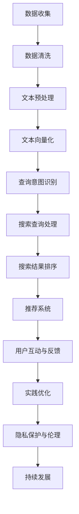

                 

### 文章标题

《自然语言处理在电商搜索中的应用：技术发展与未来趋势》

### 关键词

自然语言处理、电商搜索、技术发展、未来趋势、算法原理、案例实践

### 摘要

本文深入探讨了自然语言处理（NLP）在电商搜索中的应用，从技术发展的角度出发，分析了NLP的核心概念、算法原理以及在实际项目中的具体应用。文章首先介绍了NLP在电商搜索中的基础概念和挑战，然后详细讲解了语言模型、词向量、文本预处理、用户行为分析等基础技术。接着，文章探讨了NLP在电商搜索中的高级应用技术，包括搜索引擎优化（SEO）、搜索查询处理、搜索结果排序算法和推荐系统。此外，文章通过案例实践展示了NLP在电商搜索中的实际应用，并探讨了未来的发展趋势。本文旨在为读者提供一个全面、系统的NLP在电商搜索中的应用指南，帮助读者理解和掌握这一领域的前沿技术和实践方法。

### 引言

随着互联网技术的飞速发展，电子商务已经成为全球经济增长的重要引擎。电商平台的兴起不仅改变了人们的消费习惯，也极大地丰富了商品和服务的选择。在这种背景下，如何有效地提升电商搜索的体验和效果成为了各大电商平台竞相研究的重要课题。自然语言处理（NLP）技术的出现，为电商搜索提供了强大的技术支持，通过处理和理解用户的自然语言输入，实现更精确、更智能的搜索结果。

NLP是一种跨学科的技术领域，结合计算机科学、语言学和人工智能，致力于使计算机能够理解和生成人类语言。其应用范围广泛，从机器翻译、语音识别到情感分析、文本摘要，NLP技术在多个领域都取得了显著的成果。在电商搜索中，NLP技术的重要性尤为突出，主要体现在以下几个方面：

首先，NLP技术能够有效地解析用户输入的搜索查询，理解其背后的意图和需求。用户的搜索查询往往是不规范、不完整的，甚至可能包含错误或歧义。通过NLP技术，我们可以对搜索查询进行分词、词性标注、命名实体识别等处理，从而提取出关键信息，为后续的搜索查询处理和结果排序提供基础。

其次，NLP技术能够提升电商搜索的准确性和用户体验。传统的搜索算法往往依赖于关键词匹配和统计方法，难以处理语义层面的复杂性。而NLP技术通过语义分析、情感分析等技术，可以更准确地理解用户的意图，提供更相关、更个性化的搜索结果。这不仅提升了用户的满意度，也提高了电商平台的转化率和用户留存率。

最后，NLP技术为电商搜索提供了丰富的数据分析和用户互动工具。通过分析用户的搜索行为、评价和反馈，NLP技术可以帮助电商平台优化搜索结果、改进推荐算法，从而更好地满足用户需求。此外，NLP技术还可以用于构建智能客服系统、聊天机器人等，提升用户交互体验。

本文旨在深入探讨NLP在电商搜索中的应用，从基础理论到高级技术，从实际案例到未来趋势，全面系统地梳理NLP在电商搜索中的发展脉络。首先，我们将介绍NLP在电商搜索中的应用基础，包括自然语言处理与电商搜索的关系、自然语言处理基础、电商搜索中的文本数据预处理和用户行为分析。接着，我们将详细探讨自然语言处理在电商搜索中的应用技术，包括搜索引擎优化（SEO）、搜索查询处理、搜索结果排序算法和推荐系统。此外，本文还将通过案例分析和实践指导，展示NLP在电商搜索中的实际应用效果。最后，我们将探讨自然语言处理在电商搜索中的未来趋势和发展方向，包括人工智能与大数据的融合、新兴技术的应用以及隐私保护与伦理问题。通过本文的阅读，读者可以全面了解NLP在电商搜索中的应用，掌握相关技术原理和实践方法，为今后的研究和应用提供有力支持。

### 第一部分：自然语言处理在电商搜索中的应用基础

#### 1.1 电商搜索中的自然语言处理概述

**自然语言处理（NLP）与电商搜索的关系**

自然语言处理（NLP）是电子商务领域中的一项关键技术，它使得计算机能够理解和处理人类的自然语言，从而提升电商搜索的智能化和用户体验。电商搜索是指用户在电商平台通过输入关键词或短语来查找商品、服务和信息的过程。这一过程不仅涉及文本信息的输入和输出，还涉及对用户意图的理解和搜索结果的排序与推荐。

自然语言处理在电商搜索中的应用主要体现在以下几个方面：

1. **查询意图识别**：用户的搜索查询往往具有复杂性和多样性，NLP技术可以帮助解析用户的查询意图，将其转化为明确的查询需求。例如，用户输入“蓝色智能手机”，NLP技术可以识别出用户查询的是“蓝色”和“智能手机”两个属性，从而提供更精准的搜索结果。

2. **查询扩展与纠错**：用户的查询输入可能存在拼写错误、语法错误或歧义。NLP技术可以通过词性标注、命名实体识别和语义分析等方法，自动纠正查询中的错误，并扩展查询范围，提高搜索的全面性和准确性。例如，当用户输入“蓝机”时，NLP技术可以识别并纠正为“蓝色智能手机”。

3. **文本预处理**：在搜索查询处理之前，NLP技术需要对文本进行预处理，包括分词、去除停用词、词干提取等。这些预处理步骤可以降低文本的复杂性，提高后续处理的效率。

4. **搜索结果排序**：NLP技术可以帮助电商搜索系统根据用户查询的意图和语义，对搜索结果进行排序。通过语义相似度和用户偏好分析，可以提供更相关、更个性化的搜索结果。

5. **推荐系统**：NLP技术可以用于分析用户的搜索历史、购买记录和评价数据，构建用户画像，从而实现更准确的个性化推荐。例如，通过分析用户的搜索行为和评价，推荐类似风格的商品或相关的促销活动。

**自然语言处理的挑战与机遇**

尽管自然语言处理技术在电商搜索中具有广泛的应用前景，但在实际应用过程中仍面临诸多挑战：

1. **语言复杂性**：自然语言具有高度复杂性和多样性，不同语言和文化背景下的表达方式各异。NLP技术需要处理多种语言和方言，同时理解语言中的隐喻、俚语和情感色彩。

2. **数据质量**：电商搜索数据通常来源于用户输入、商品描述和评价等，数据质量参差不齐。NLP技术需要应对数据中的噪声、不一致性和缺失值，确保处理结果的准确性。

3. **计算资源**：自然语言处理任务通常需要大量的计算资源和时间，尤其是在大规模数据集上训练模型时。这要求电商平台具备强大的计算能力和优化算法。

4. **隐私保护**：在处理用户数据时，NLP技术需要确保用户隐私不被泄露。如何在不侵犯用户隐私的前提下，充分利用用户数据，是NLP在电商搜索中的一个重要挑战。

然而，随着人工智能和大数据技术的发展，自然语言处理在电商搜索中也面临着许多机遇：

1. **数据丰富性**：电商平台积累了大量的用户行为数据、商品信息和评价数据，为NLP技术提供了丰富的训练和测试数据，有助于提升模型的性能和适用性。

2. **技术进步**：深度学习、强化学习等先进技术在NLP领域的应用，使得模型的表达能力和处理效率显著提升。这些技术可以用于构建更强大、更智能的电商搜索系统。

3. **用户体验**：NLP技术可以帮助电商平台提供更智能、更个性化的服务，提升用户体验和满意度。例如，智能客服、聊天机器人等应用，可以更好地满足用户的需求和期望。

4. **行业应用**：随着NLP技术的不断成熟，其在电商搜索领域的应用也在不断拓展。例如，跨平台搜索、多语言处理、语音搜索等，为电商平台提供了更多的发展机会。

综上所述，自然语言处理在电商搜索中具有重要的地位和广泛的应用前景。通过应对挑战、把握机遇，NLP技术将为电商平台带来更高的搜索效率和用户体验，推动电商搜索的智能化和个性化发展。

#### 1.2 自然语言处理基础

**自然语言处理基础**是理解自然语言处理在电商搜索中应用的关键。本节将详细介绍NLP的基础知识，包括语言模型与词向量、词性标注与命名实体识别、依赖关系与语义角色标注，帮助读者建立对NLP基础概念的理解。

**1.2.1 语言模型与词向量**

**语言模型**是NLP的核心概念之一，用于预测文本中下一个单词或字符的概率分布。语言模型可以分为基于规则的方法和基于统计的方法，以及基于深度学习的方法。

- **n-gram模型**：n-gram模型是一种简单的统计语言模型，它将连续的n个单词看作一个整体，并计算它们在文本中出现的频率。n-gram模型通过观察历史数据来预测下一个单词，其优点是实现简单、计算效率高，但缺点是只能捕捉短程依赖，无法捕捉长程依赖。

- **神经网络语言模型**：神经网络语言模型（Neural Network Language Model，NNLM）基于深度学习技术，通过多层神经网络学习文本的概率分布。NNLM可以捕捉长程依赖关系，并在大规模数据集上表现出色。常用的神经网络结构包括循环神经网络（RNN）、长短期记忆网络（LSTM）和变换器（Transformer）。

- **Word2Vec模型**：Word2Vec模型是word Embedding的一种实现，它通过预测单词的前一个或后一个单词来学习词向量。Word2Vec模型主要包括连续词袋（CBOW）和Skip-gram两种方法。CBOW模型通过上下文单词的平均向量表示目标单词，而Skip-gram模型通过目标单词预测上下文单词。Word2Vec模型可以捕捉词与词之间的相似性和语义关系，为后续的语义分析提供了基础。

- **GloVe模型**：GloVe（Global Vectors for Word Representation）模型是一种基于全局统计信息的word Embedding方法，通过计算单词之间的相似性来学习词向量。GloVe模型可以同时考虑单词在局部和全局的统计信息，从而提高词向量的质量。

**1.2.2 词性标注与命名实体识别**

**词性标注**（Part-of-Speech Tagging，POS Tagging）是指给文本中的每个单词分配一个词性标签，如名词（NN）、动词（VB）、形容词（JJ）等。词性标注有助于理解文本的语法结构和语义信息，是自然语言处理的基础任务之一。

- **规则方法**：基于预先定义的规则，如正则表达式等，对文本进行词性标注。规则方法简单有效，但在处理复杂语法时可能存在不足。

- **统计方法**：基于统计学习模型，如条件概率模型、隐马尔可夫模型（HMM）、决策树、支持向量机（SVM）等，对文本进行词性标注。统计方法可以更好地适应不同语言的语法特点。

- **深度学习方法**：基于深度学习技术，如卷积神经网络（CNN）、递归神经网络（RNN）、长短时记忆网络（LSTM）等，对文本进行词性标注。深度学习方法可以捕捉复杂的语义关系，提高标注的准确性。

**命名实体识别**（Named Entity Recognition，NER）是指识别文本中的命名实体，如人名、地名、组织名等。命名实体识别有助于提取文本中的关键信息，是信息提取和知识图谱构建的重要任务。

- **规则方法**：基于预先定义的规则，如正则表达式等，对文本进行命名实体识别。规则方法可以快速处理文本，但在处理新型实体时可能存在不足。

- **统计方法**：基于统计学习模型，如条件概率模型、隐马尔可夫模型（HMM）、决策树、支持向量机（SVM）等，对文本进行命名实体识别。统计方法可以适应不同实体类型和语言的语法特点。

- **深度学习方法**：基于深度学习技术，如卷积神经网络（CNN）、递归神经网络（RNN）、长短时记忆网络（LSTM）等，对文本进行命名实体识别。深度学习方法可以捕捉复杂的语义关系，提高实体识别的准确性。

**1.2.3 依赖关系与语义角色标注**

**依赖关系标注**（Dependency Parsing）是指识别文本中单词之间的依赖关系，如主谓关系、动宾关系等。依赖关系标注有助于理解文本的语法结构和语义信息，是自然语言处理中的关键任务之一。

- **规则方法**：基于预先定义的规则，如依存关系规则等，对文本进行依赖关系标注。规则方法可以实现快速处理，但在处理复杂语法时可能存在不足。

- **统计方法**：基于统计学习模型，如条件概率模型、隐马尔可夫模型（HMM）、决策树、支持向量机（SVM）等，对文本进行依赖关系标注。统计方法可以更好地适应不同语言的语法特点。

- **深度学习方法**：基于深度学习技术，如卷积神经网络（CNN）、递归神经网络（RNN）、长短时记忆网络（LSTM）等，对文本进行依赖关系标注。深度学习方法可以捕捉复杂的语义关系，提高标注的准确性。

**语义角色标注**（Semantic Role Labeling，SRL）是指识别文本中单词的语义角色，如动作执行者、动作对象等。语义角色标注有助于提取文本中的关键信息，构建语义关系网络，是信息提取和知识图谱构建的重要任务。

- **规则方法**：基于预先定义的规则，如语义角色规则等，对文本进行语义角色标注。规则方法可以快速处理文本，但在处理复杂语义时可能存在不足。

- **统计方法**：基于统计学习模型，如条件概率模型、隐马尔可夫模型（HMM）、决策树、支持向量机（SVM）等，对文本进行语义角色标注。统计方法可以适应不同语义角色和语言的语法特点。

- **深度学习方法**：基于深度学习技术，如卷积神经网络（CNN）、递归神经网络（RNN）、长短时记忆网络（LSTM）等，对文本进行语义角色标注。深度学习方法可以捕捉复杂的语义关系，提高标注的准确性。

**总结**

自然语言处理基础是理解NLP在电商搜索中应用的关键。语言模型与词向量、词性标注与命名实体识别、依赖关系与语义角色标注等基础技术，为NLP在电商搜索中的应用提供了坚实的理论基础和技术支持。通过掌握这些基础概念和算法，读者可以更好地理解和应用NLP技术，提升电商搜索的智能化和用户体验。

#### 1.3 电商搜索中的文本数据预处理

**电商搜索中的文本数据预处理**是自然语言处理（NLP）技术应用到电商搜索中的关键步骤。文本数据预处理的质量直接影响到后续NLP任务的效果，包括分词、词频统计、文本降维、文本向量化等。以下是对这些预处理步骤的详细解释。

**1.3.1 数据收集与清洗**

**数据收集**：电商搜索中的文本数据来源于多个渠道，如商品描述、用户评论、搜索查询等。这些原始文本数据通常包含各种噪声，如HTML标签、特殊字符、拼写错误等，因此需要先进行数据收集。

- **爬取网页**：可以使用Python的Scrapy框架或其他网页爬取工具，从电商平台获取商品描述、用户评论等文本数据。
- **API获取**：许多电商平台提供API接口，可以方便地获取商品信息、用户评价等数据。使用Python的requests库可以方便地调用这些API。

**数据清洗**：清洗数据是为了去除文本中的噪声、填补缺失值，提高数据质量。常见的清洗步骤包括：

- **去除HTML标签**：使用正则表达式或其他工具去除HTML标签，如`<p>...</p>`、`<a>...</a>`等。
- **去除特殊字符**：去除文本中的特殊字符，如`@`、`#`、`$`等，这些字符在NLP任务中通常无实际意义。
- **处理缺失值**：对于缺失的数据，可以采用填充默认值、删除或插补等方法进行处理。例如，对于缺失的用户评论，可以填充为“无评论”。

**1.3.2 词频统计与文本降维**

**词频统计**：词频统计是指计算文本中每个单词出现的次数。词频统计是NLP任务中的一个重要步骤，有助于理解文本的主题和特征。

- **计算词频**：可以使用Python的collections模块中的Counter类来计算词频。例如：
  ```python
  from collections import Counter
  word_counts = Counter(text.split())
  ```
- **排除停用词**：停用词是指对文本信息传递没有实际意义的单词，如“的”、“和”、“在”等。在词频统计时，通常需要排除停用词，以提高统计结果的准确性。

**文本降维**：文本降维是指将高维的文本数据转换为低维的向量表示，以便进行后续的机器学习任务。常见的文本降维方法包括：

- **TF-IDF**：TF-IDF（Term Frequency-Inverse Document Frequency）是一种常用的文本降维方法，它综合考虑了词频（TF）和逆文档频率（IDF），可以有效提高文本的区分度。
  - **词频（TF）**：一个词在文本中出现的频率。
  - **逆文档频率（IDF）**：一个词在整个文档集合中的逆频率，用于平衡高频词的影响。
  - **TF-IDF公式**：
    $$
    TF-IDF(t,d) = TF(t,d) \times IDF(t,D)
    $$
    其中，$TF(t,d)$表示词$t$在文档$d$中的词频，$IDF(t,D)$表示词$t$在文档集合$D$中的逆文档频率。

- **词嵌入（Word Embedding）**：词嵌入是将单词映射为固定长度的向量，从而实现文本的向量表示。常见的词嵌入方法包括Word2Vec、GloVe等。词嵌入可以捕捉词与词之间的相似性和语义关系，是NLP任务中的关键技术。

**1.3.3 文本向量化**

**文本向量化**是将原始文本数据转换为数值向量表示，以便于进行机器学习、深度学习等任务。文本向量化主要包括以下几种方法：

- **One-Hot编码**：One-Hot编码是一种简单的文本向量化方法，将每个单词表示为一个二进制向量，向量的长度等于词汇表的大小。每个元素只可能是0或1，表示单词是否出现在文本中。这种方法适用于词汇表较小的情况，但对于大规模的词汇表，向量维度会非常高。
  - **One-Hot编码示例**：
    ```python
    vocabulary = ['苹果', '香蕉', '橘子']
    text = '苹果香蕉'
    one_hot_encoded = [[1, 0, 0], [0, 1, 0], [0, 0, 1]]
    ```

- **计数向量编码**：计数向量编码是一种基于词频的文本向量化方法，将每个单词的词频表示为向量中的一个元素。这种方法适用于处理大规模文本数据，但会引入稀疏性问题。
  - **计数向量编码示例**：
    ```python
    text = '苹果香蕉苹果'
    word_counts = [2, 1, 1]
    ```

- **TF-IDF向量化**：TF-IDF向量化是一种基于词频和逆文档频率的文本向量化方法，可以有效提高文本的区分度。
  - **TF-IDF向量化示例**：
    ```python
    text = '苹果香蕉苹果'
    tfidf_values = [1.0, 1.0, 1.0]
    ```

- **词嵌入向量化**：词嵌入向量化是将每个单词映射为预训练的词向量，从而实现文本的向量表示。词嵌入可以捕捉词与词之间的语义关系，是NLP任务中的关键技术。
  - **词嵌入向量化示例**：
    ```python
    text = '苹果香蕉苹果'
    word_vectors = [向量1, 向量2, 向量1]
    ```

**总结**

电商搜索中的文本数据预处理是NLP技术在电商搜索中应用的关键步骤。通过数据收集与清洗、词频统计与文本降维、文本向量化等预处理步骤，可以有效地提高文本数据的质量和可用性，为后续的NLP任务提供可靠的数据基础。掌握这些预处理方法，有助于提升电商搜索的智能化和用户体验，推动电商平台的发展。

#### 1.4 电商搜索中的用户行为分析

**电商搜索中的用户行为分析**是理解用户需求、优化搜索体验和提升电商平台性能的重要手段。通过对用户搜索行为、用户评价与评论、社交网络与用户群体进行分析，可以深入了解用户的兴趣和偏好，从而实现更精准的推荐和个性化的搜索服务。

**1.4.1 用户搜索行为分析**

用户搜索行为分析是指对用户在电商平台上的搜索行为进行详细的数据分析和模式识别。通过分析用户的搜索习惯、搜索关键词、搜索频率等，可以揭示用户对商品的需求和兴趣，为优化搜索结果和推荐系统提供有力支持。

- **搜索关键词分析**：分析用户输入的搜索关键词，可以了解用户当前最感兴趣的品类和品牌。例如，通过统计发现用户经常搜索“黑色智能手机”，可以推测用户对黑色智能手机有较高需求。

- **搜索频率分析**：分析用户在一定时间内的搜索频率，可以识别出高活跃用户和潜在高价值用户。高活跃用户可能更愿意在平台上消费，而潜在高价值用户则需要通过精准推荐来引导其购买行为。

- **搜索意图识别**：通过分析用户搜索关键词的组合和上下文，可以识别出用户的搜索意图。例如，用户输入“限时优惠”和“购物袋”，可以推断用户有购买意图。

- **搜索历史分析**：分析用户的搜索历史，可以了解用户对商品的兴趣变化和购买路径。这有助于电商平台优化搜索结果排序和推荐策略，提高用户的购买转化率。

**1.4.2 用户评价与评论分析**

用户评价与评论分析是对用户在商品页面上留下的评价和评论进行深入分析，以获取用户对商品满意度的反馈。这些评价和评论不仅是用户对商品真实感受的直接表达，也是电商平台改进产品和服务的重要参考。

- **情感分析**：通过情感分析技术，可以对用户的评价和评论进行情感极性分析，识别出正面、负面和中性的情感。这有助于了解用户对商品的满意度，为产品改进提供依据。

- **关键词提取**：通过关键词提取技术，可以从用户评价和评论中提取出关键信息，如用户对商品颜色、尺寸、功能等方面的关注点。这些信息可以帮助电商平台优化商品描述和搜索结果。

- **评论排序**：对用户评价和评论进行排序，可以优先展示最有价值的评论。这有助于提高用户的阅读效率，同时也能提高电商平台的专业形象。

- **评论回复**：通过分析用户评论，可以识别出用户最关心的问题和意见，并及时进行回复。这不仅能够提升用户满意度，还能增强用户对平台的信任和忠诚度。

**1.4.3 社交网络与用户群体分析**

社交网络与用户群体分析是指利用社交网络数据来分析用户行为和兴趣，构建用户群体画像。通过这种分析，可以深入了解用户在不同社交平台上的互动和影响力，从而实现更精准的营销和服务。

- **社交网络分析**：通过分析用户在社交网络上的互动，如点赞、评论、转发等，可以识别出用户在社交网络中的影响力。高影响力的用户可能对其他用户有较强的引导作用，可以成为电商平台的重要宣传资源。

- **用户群体划分**：根据用户的兴趣、行为和属性，可以将用户划分为不同的群体。例如，可以根据用户的购买历史和偏好，将用户划分为“时尚爱好者”、“科技达人”等群体。

- **群体行为分析**：通过对不同用户群体的行为进行分析，可以了解各个群体的需求和兴趣。这有助于电商平台制定有针对性的营销策略和推荐方案，提高用户的满意度和留存率。

- **社区管理**：通过分析社交网络中的用户互动，可以识别出活跃社区和意见领袖。电商平台可以积极管理这些社区，提供专业的问答和互动，提升用户参与度和忠诚度。

**总结**

电商搜索中的用户行为分析是提高电商平台用户体验和运营效率的关键。通过分析用户搜索行为、用户评价与评论、社交网络与用户群体，可以深入了解用户需求，优化搜索结果和推荐系统，提升用户满意度和转化率。掌握这些分析方法和工具，有助于电商平台在激烈的市场竞争中脱颖而出，实现持续发展和壮大。

#### 2.1 搜索引擎优化（SEO）

**搜索引擎优化（SEO）**是电商平台提升在线可见性和吸引更多潜在客户的关键策略。通过优化网站结构、内容以及关键字，电商平台可以显著提高在搜索引擎结果页面（SERP）中的排名，从而增加流量和销售机会。

**2.1.1 关键字优化策略**

关键字优化是SEO的核心，它涉及识别、选择和部署对用户搜索意图高度相关的关键字。以下是关键字优化的一些策略：

- **关键词研究**：首先，通过使用工具如Google Keyword Planner、Ahrefs或SEMrush，分析用户经常搜索的关键词。这些工具可以帮助了解关键词的搜索量、竞争程度和相关性。
- **关键词定位**：根据电商平台的目标和市场定位，选择长尾关键词（long-tail keywords）和主关键词（head keywords）。长尾关键词通常更具针对性，能够吸引更精准的流量。
- **关键词部署**：将选定的关键词合理地部署在网站的各个部分，包括标题、描述、元标签、URL和内容。避免过度优化，以确保内容的自然性和用户友好性。

**2.1.2 内容优化策略**

内容是搜索引擎优化的另一个关键方面。高质量、有价值的内容不仅能吸引访客，还能提高网站在搜索引擎中的排名。以下是内容优化的几种策略：

- **原创性**：发布原创内容，避免复制粘贴他人的内容。搜索引擎对原创内容有更高的评分。
- **更新频率**：定期更新内容，保持网站的活跃度。搜索引擎倾向于给予经常更新的网站更高的排名。
- **内部链接**：合理使用内部链接，将相关内容相互连接，帮助搜索引擎更好地理解网站结构。
- **元标签**：优化元标签（如标题标签和描述标签），确保它们包含目标关键字，同时吸引用户点击。

**2.1.3 网站结构优化策略**

网站结构优化是确保搜索引擎能够有效爬取和理解网站内容的关键。以下是几种优化网站结构的策略：

- **清晰的结构**：确保网站有一个清晰、逻辑的结构，方便用户和搜索引擎导航。使用扁平化的目录结构，减少深度链接。
- **友好的URL**：创建简洁、易记且包含关键字的URL。避免使用复杂的参数和动态URL。
- **响应式设计**：实现响应式网站设计，确保网站在不同设备和分辨率上都能正常显示，提高用户体验和搜索引擎评分。
- **页面加载速度**：优化页面加载速度，通过压缩图片、使用CDN（内容分发网络）和减少HTTP请求等方法。快速加载的页面可以提高用户满意度和搜索引擎排名。

**总结**

搜索引擎优化（SEO）是电商平台提升在线可见性和吸引更多客户的关键策略。通过关键字优化、内容优化和网站结构优化，电商平台可以提高在搜索引擎结果页面（SERP）中的排名，从而增加流量和销售机会。掌握这些SEO策略，有助于电商平台在竞争激烈的市场中脱颖而出，实现持续增长。

#### 2.2 电商搜索查询处理

**电商搜索查询处理**是电商平台提供高效、准确的搜索服务的关键环节。通过识别查询意图、扩展查询和同义词处理、纠错与模糊匹配等技术，可以大大提高搜索系统的用户体验和效率。

**2.2.1 查询意图识别**

查询意图识别是理解用户搜索输入背后的实际需求。用户的查询通常不完整或模糊，需要通过NLP技术进行解析和分类。以下是几种常见的查询意图识别方法：

- **基于规则的分类**：通过预定义的规则和模式，将查询分类为特定意图。例如，如果查询包含“购买”、“买”等词汇，可以将其归类为购买意图。
- **机器学习分类器**：使用监督学习算法（如SVM、决策树、神经网络等）训练分类模型，根据查询特征自动识别意图。训练数据集通常包含标注的查询和对应的意图标签。
- **混合方法**：结合规则方法和机器学习方法，先使用规则方法进行初步分类，然后利用机器学习模型进行精细调整。

**伪代码示例**：
```python
# 基于机器学习的查询意图识别伪代码
from sklearn.feature_extraction.text import TfidfVectorizer
from sklearn.naive_bayes import MultinomialNB

# 准备训练数据集
X_train = ["我想买一件黑色的衬衫", "我想查看最新的手机", ...]
y_train = ["购买意图", "信息查询", ...]

# 特征提取
vectorizer = TfidfVectorizer()
X_train_vectorized = vectorizer.fit_transform(X_train)

# 训练分类模型
model = MultinomialNB()
model.fit(X_train_vectorized, y_train)

# 预测查询意图
query = "我想买一部便宜的智能手机"
query_vectorized = vectorizer.transform([query])
predicted_intent = model.predict(query_vectorized)
```

**2.2.2 查询扩展与同义词处理**

查询扩展和同义词处理是提高搜索结果相关性的重要手段。查询扩展通过添加、替换或删除查询中的词汇，使搜索系统能够捕捉用户的潜在需求。同义词处理则通过识别和统一不同表达方式中的相同含义，提高搜索的精确度。

- **查询扩展**：常见的查询扩展方法包括：
  - **基于词嵌入的扩展**：利用预训练的词嵌入模型（如Word2Vec、GloVe等），将查询词转换为向量，并寻找与其相似的其他词汇进行扩展。
  - **基于规则的方法**：使用预定义的规则，如将“便宜的”扩展为“低价的”、“实惠的”等。

- **同义词处理**：常见的同义词处理方法包括：
  - **基于词典的方法**：使用同义词词典，将查询中的同义词替换为统一的表达。
  - **基于统计的方法**：使用统计模型（如潜在狄利克雷分配LDA、词性标注等）识别和统一同义词。

**伪代码示例**：
```python
# 基于词嵌入的查询扩展伪代码
from gensim.models import KeyedVectors

# 加载预训练的词嵌入模型
word_vectors = KeyedVectors.load_word2vec_format("word2vec.bin", binary=True)

# 查询扩展函数
def expand_query(query, word_vectors):
    expanded_query = []
    for word in query.split():
        similar_words = word_vectors.most_similar(positive=[word], topn=5)
        expanded_query.extend(similar_words)
    return " ".join(expanded_query)

query = "我想买一部便宜的智能手机"
expanded_query = expand_query(query, word_vectors)
```

**2.2.3 查询纠错与模糊匹配**

查询纠错和模糊匹配是处理用户输入错误和不完整查询的有效方法。查询纠错通过自动纠正拼写错误和语法错误，提高搜索结果的准确性。模糊匹配通过识别和匹配部分匹配的查询，扩大搜索范围，提高搜索的全面性。

- **查询纠错**：常见的查询纠错方法包括：
  - **基于规则的纠错**：使用预定义的纠错规则，如拼写校正、常见错误替换等。
  - **基于机器学习的方法**：使用监督学习算法（如序列到序列模型、循环神经网络等）训练纠错模型，自动纠正查询中的错误。

- **模糊匹配**：常见的模糊匹配方法包括：
  - **基于编辑距离的方法**：计算查询词与数据库中的词之间的编辑距离，选择最接近的词作为匹配结果。
  - **基于词嵌入的方法**：利用词嵌入模型，计算查询词和候选词之间的相似度，选择最相似的词作为匹配结果。

**伪代码示例**：
```python
# 基于编辑距离的查询纠错伪代码
from pyfuzzystring import Levenshtein

# 查询纠错函数
def correct_query(query, database):
    best_match = None
    best_score = float('inf')
    for word in database:
        score = Levenshtein Distance(query, word)
        if score < best_score:
            best_score = score
            best_match = word
    return best_match

# 假设的数据库
database = ["智能手机", "智能机", "手机"]

query = "智能手强"
corrected_query = correct_query(query, database)
```

**总结**

电商搜索查询处理通过识别查询意图、扩展查询和同义词处理、纠错与模糊匹配等技术，提高了搜索系统的用户体验和效率。掌握这些查询处理方法，有助于电商平台提供更精准、更智能的搜索服务，满足用户的多样化需求。

#### 2.3 电商搜索结果排序算法

**电商搜索结果排序算法**是电商平台提供高效、精准搜索体验的核心技术之一。通过优化搜索结果排序，可以显著提升用户的满意度和购买转化率。以下将介绍几种常见的电商搜索结果排序算法，包括基于内容的排序、基于协同过滤的排序和基于机器学习的排序。

**2.3.1 基于内容的排序**

基于内容的排序（Content-based Sorting）是一种通过分析商品内容（如标题、描述、标签等）来排序的方法。该方法的核心思想是计算每个商品与查询的相似度，并将相似度最高的商品排在前面。

- **计算相似度**：基于内容的排序通常使用TF-IDF（Term Frequency-Inverse Document Frequency）或Word2Vec等方法来计算商品内容与查询之间的相似度。例如，使用TF-IDF计算每个词汇在商品内容与查询中的权重，然后计算两者的相似度得分。
- **排序策略**：将商品按与查询的相似度得分从高到低排序。相似度得分越高，商品越可能符合用户的查询意图。

**伪代码示例**：
```python
# 基于TF-IDF的排序伪代码
from sklearn.feature_extraction.text import TfidfVectorizer

# 加载商品描述和查询
product_descriptions = ["...", "...", "..."]
query = "..."

# 计算TF-IDF向量
vectorizer = TfidfVectorizer()
product_vectors = vectorizer.fit_transform(product_descriptions)
query_vector = vectorizer.transform([query])

# 计算相似度得分
similarity_scores = cosine_similarity(query_vector, product_vectors)

# 按相似度得分排序
sorted_indices = np.argsort(similarity_scores[0])[::-1]
sorted_products = [product_descriptions[i] for i in sorted_indices]
```

**2.3.2 基于协同过滤的排序**

基于协同过滤的排序（Collaborative Filtering-based Sorting）是一种通过分析用户行为和偏好来排序的方法。该方法分为两种类型：用户基于的协同过滤和项目基于的协同过滤。

- **用户基于的协同过滤**：通过分析用户的历史行为（如购买、评价、收藏等），找出与当前用户相似的用户，并推荐他们喜欢的商品。这种方法的排序策略是将相似用户推荐的商品按评分或频率排序。
- **项目基于的协同过滤**：通过分析商品之间的相似性（如基于内容、基于协同过滤的推荐），为每个商品计算一个推荐得分，并将商品按推荐得分排序。

**伪代码示例**：
```python
# 用户基于的协同过滤排序伪代码
from sklearn.neighbors import NearestNeighbors

# 加载用户行为矩阵和商品特征向量
user_behavior_matrix = [[1, 0, 1], [0, 1, 0], ...]
product_features = [[0.1, 0.2, 0.3], [0.4, 0.5, 0.6], ...]

# 训练最近邻模型
nn = NearestNeighbors(n_neighbors=5)
nn.fit(product_features)

# 预测当前用户的相似用户
current_user_id = 0
nearest_user_ids = nn.kneighbors([product_features[current_user_id]], return_distance=False)

# 获取相似用户推荐的商品
recommended_products = []
for user_id in nearest_user_ids:
    recommended_products.append(user_behavior_matrix[user_id][current_user_id])

# 按推荐得分排序
sorted_indices = np.argsort(recommended_products)[::-1]
sorted_products = [product_features[i] for i in sorted_indices]
```

**2.3.3 基于机器学习的排序**

基于机器学习的排序（Machine Learning-based Sorting）是一种利用机器学习模型预测商品评分或偏好，并将商品按预测得分排序的方法。常见的机器学习排序模型包括回归模型、分类模型和排序网络。

- **回归模型**：通过训练回归模型（如线性回归、决策树回归等），预测商品与查询的相似度得分。例如，使用线性回归模型预测商品与查询的相似度得分，然后按得分排序。
- **分类模型**：通过训练分类模型（如逻辑回归、SVM等），将商品分为高评分和低评分两类，然后按分类结果排序。
- **排序网络**：排序网络（Ranking Network）是一种专门用于排序任务的神经网络，通过学习输入数据的排序关系，输出商品的排序结果。

**伪代码示例**：
```python
# 基于排序网络的排序伪代码
import tensorflow as tf

# 定义排序网络模型
model = tf.keras.Sequential([
    tf.keras.layers.Dense(128, activation='relu', input_shape=[...]),
    tf.keras.layers.Dense(64, activation='relu'),
    tf.keras.layers.Dense(1, activation='sigmoid')
])

# 编译模型
model.compile(optimizer='adam', loss='binary_crossentropy', metrics=['accuracy'])

# 训练模型
model.fit(X_train, y_train, epochs=10, batch_size=32)

# 预测排序
predicted_scores = model.predict(X_test)
sorted_indices = np.argsort(predicted_scores)[::-1]
sorted_products = [products[i] for i in sorted_indices]
```

**总结**

电商搜索结果排序算法通过基于内容的排序、基于协同过滤的排序和基于机器学习的排序等方法，提高了搜索结果的准确性和用户体验。掌握这些排序算法，有助于电商平台提供高效、精准的搜索服务，满足用户的多样化需求。

#### 2.4 电商搜索中的推荐系统

**电商搜索中的推荐系统**是电商平台提升用户满意度和销售转化率的重要工具。通过个性化推荐，推荐系统能够为用户提供更符合其兴趣和需求的商品，从而增强用户黏性和购买意愿。以下将介绍推荐系统的基本概念、工作原理以及内容推荐和协同过滤推荐的方法，并探讨深度学习在推荐系统中的应用。

**2.4.1 推荐算法概述**

推荐系统是一种信息过滤技术，旨在发现用户可能感兴趣的项目，并向其推荐。推荐算法主要分为以下两类：

- **基于内容的推荐（Content-based Recommendation）**：基于内容的推荐系统通过分析用户的历史行为和商品特征，为用户推荐具有相似内容的商品。这种方法关注商品的属性和特征，如类别、标签、描述等。
- **协同过滤推荐（Collaborative Filtering Recommendation）**：协同过滤推荐系统通过分析用户之间的行为模式和偏好，为用户推荐其他用户喜欢的商品。这种方法利用用户的行为数据，如购买记录、评价、浏览历史等。

除了基于内容和协同过滤的推荐系统，近年来，深度学习技术也逐渐在推荐系统中得到应用，如基于深度神经网络的协同过滤方法、基于内容的深度学习推荐方法等。

**2.4.2 内容推荐与协同过滤推荐**

**内容推荐**：

内容推荐系统通过分析用户的历史行为和商品的属性特征，为用户推荐具有相似内容的商品。以下是内容推荐的主要步骤：

1. **用户兴趣建模**：通过分析用户的历史行为和搜索记录，提取用户的兴趣特征，如购买偏好、浏览频率等。常用的方法包括基于TF-IDF的文本分析、基于词嵌入的语义分析等。
2. **商品特征提取**：提取商品的属性特征，如类别、标签、描述、价格等。这些特征可以用于计算商品与用户兴趣的相似度。
3. **推荐生成**：根据用户兴趣特征和商品特征，计算用户与商品之间的相似度得分，并将相似度最高的商品推荐给用户。推荐算法通常采用Top-N方法，选择最高分的N个商品作为推荐结果。

**协同过滤推荐**：

协同过滤推荐系统通过分析用户之间的行为模式和偏好，为用户推荐其他用户喜欢的商品。以下是协同过滤推荐的主要步骤：

1. **用户行为数据收集**：收集用户的历史行为数据，如购买记录、评价、浏览历史等。
2. **用户相似度计算**：计算用户之间的相似度，常用的方法包括用户基于的协同过滤（User-based Collaborative Filtering）和项目基于的协同过滤（Item-based Collaborative Filtering）。
3. **商品推荐生成**：根据用户相似度矩阵和用户行为数据，为每个用户生成推荐列表。对于每个用户，选择与该用户最相似的K个用户，然后推荐这些用户喜欢的商品。

**2.4.3 深度学习在推荐系统中的应用**

深度学习技术在推荐系统中的应用，旨在解决传统协同过滤方法中的冷启动问题和稀疏性问题，提高推荐效果。以下是一些深度学习在推荐系统中的应用方法：

1. **基于深度神经网络的协同过滤（Deep Neural Network-based Collaborative Filtering）**：这种方法结合了协同过滤和深度神经网络的特点，通过多层神经网络学习用户和商品之间的交互特征。常见的模型包括自动编码器（Autoencoder）和协同过滤网络（Collaborative Filtering Network）。
2. **基于内容的深度学习推荐（Content-based Deep Learning Recommendation）**：这种方法利用深度学习模型（如卷积神经网络（CNN）、递归神经网络（RNN）等）提取商品和用户的特征，并计算相似度得分进行推荐。这种方法可以更好地捕捉商品和用户之间的复杂关系。
3. **多模态深度学习推荐（Multimodal Deep Learning Recommendation）**：这种方法结合了多种数据源（如图像、文本、音频等），通过多模态深度学习模型提取和融合特征，提高推荐效果。

**总结**

电商搜索中的推荐系统通过内容推荐和协同过滤推荐等方法，为用户提供个性化推荐，提升用户体验和购买转化率。深度学习技术的应用，进一步提高了推荐系统的效果和适应性。掌握这些推荐算法和方法，有助于电商平台构建高效的推荐系统，满足用户多样化需求。

#### 2.5 电商搜索中的用户互动与反馈

**电商搜索中的用户互动与反馈**是电商平台提升用户体验和优化服务的重要环节。有效的用户互动和反馈机制不仅能提高用户的满意度和忠诚度，还能为电商平台提供宝贵的改进建议。以下将详细探讨电商搜索中的用户交互设计、用户反馈分析以及个性化搜索与搜索结果展示。

**2.5.1 用户交互设计与用户体验**

用户交互设计（User Interaction Design）是指设计用户与电商平台的互动方式，以提供流畅、直观的用户体验。以下是一些关键点：

- **简洁明了的界面**：界面设计应简洁明了，减少用户操作的复杂性，避免过多的干扰元素。例如，搜索栏应置于显眼位置，用户可以轻松输入查询。
- **直观的操作流程**：设计直观的操作流程，确保用户能够快速理解如何使用平台的功能。例如，当用户点击搜索按钮后，搜索结果应迅速显示，并支持快速导航。
- **响应式设计**：实现响应式设计，确保平台在不同设备和分辨率上都能提供良好的用户体验。这有助于满足不同用户的需求，提升整体满意度。
- **智能提示与搜索建议**：提供智能提示和搜索建议，帮助用户更准确地表达搜索意图。例如，当用户输入部分关键词时，系统可以自动填充或推荐相关的搜索词，提高搜索效率。

**2.5.2 用户反馈分析**

用户反馈（User Feedback）是了解用户需求、优化服务的重要来源。以下是一些用户反馈分析的方法：

- **评价系统**：建立评价系统，允许用户对商品和平台服务进行评分和评论。通过分析用户评价的内容和评分，可以了解用户对商品和服务的满意程度，识别存在的问题和改进机会。
- **问卷调查**：定期进行用户满意度调查，通过问卷收集用户对平台的各种反馈。问卷可以设计成在线形式，方便用户参与和反馈。
- **行为数据分析**：通过分析用户在平台上的行为数据，如搜索记录、浏览路径、购买记录等，可以了解用户的行为模式和偏好，从而优化搜索结果和推荐算法。
- **社交媒体监测**：监控社交媒体平台上的用户讨论和反馈，了解用户对平台和商品的真实看法。这有助于及时发现和解决用户的问题，提升品牌形象。

**2.5.3 个性化搜索与搜索结果展示**

个性化搜索和搜索结果展示是提升用户满意度和转化率的关键。以下是一些策略：

- **个性化搜索**：通过分析用户的历史行为和偏好，为用户提供个性化的搜索结果。例如，当用户多次搜索某个品类时，系统可以优先展示该品类中的热门商品。
- **智能排序**：结合用户的兴趣和行为数据，采用智能排序算法为用户提供最相关的搜索结果。例如，使用基于内容的排序和协同过滤排序相结合的方法，提高搜索结果的准确性和相关性。
- **多维度展示**：在搜索结果页，采用多维度展示方式，如商品图片、价格、评分、用户评论等，帮助用户快速筛选和比较商品。同时，可以提供筛选和排序功能，让用户根据自己的需求进行个性化设置。
- **动态推荐**：在搜索结果页，动态推荐与用户查询相关的商品或促销活动，引导用户进行购买。例如，当用户搜索“手机”时，系统可以推荐热门手机型号、相关配件或优惠活动。

**总结**

电商搜索中的用户互动与反馈通过用户交互设计、用户反馈分析和个性化搜索与搜索结果展示等手段，提高了用户体验和满意度。掌握这些方法和策略，有助于电商平台建立良好的用户互动机制，提升用户忠诚度和转化率，实现持续发展。

#### 3.1 案例分析

**3.1.1 某电商平台搜索优化实践**

**背景**：
某大型电商平台在用户反馈和数据分析中发现，其搜索系统的搜索结果准确性较低，用户满意度不高。为了提升用户体验和提升搜索转化率，该平台决定对搜索系统进行优化。

**目标**：
1. 提高搜索结果的准确性，确保用户能够快速找到所需的商品。
2. 优化搜索算法，提升用户满意度。
3. 增强个性化搜索功能，提高用户转化率。

**解决方案**：

1. **数据收集与清洗**：
   - 收集用户搜索查询数据、商品描述数据、用户行为数据等。
   - 清洗数据，去除噪声和不一致信息，如HTML标签、特殊字符等。

2. **文本预处理**：
   - 对搜索查询和商品描述进行分词、去除停用词、词干提取等预处理操作。
   - 使用TF-IDF和Word2Vec模型进行文本向量化，提取关键词和语义信息。

3. **搜索引擎优化（SEO）**：
   - 优化关键字策略，通过关键词分析和用户行为数据，确定高价值的关键词。
   - 优化网站结构和内容布局，提高页面加载速度和用户体验。

4. **搜索查询处理**：
   - 实施查询意图识别，通过机器学习模型自动识别用户的查询意图。
   - 进行查询扩展和同义词处理，提高搜索的全面性和准确性。

5. **搜索结果排序算法**：
   - 采用基于内容的排序和协同过滤排序相结合的方法，提高搜索结果的准确性。
   - 利用深度学习模型（如排序网络）进行个性化排序，提高用户满意度。

6. **用户互动与反馈**：
   - 实施用户评价和反馈系统，收集用户对搜索结果的满意度。
   - 通过行为分析和问卷调查，持续优化搜索算法和用户体验。

**效果**：
- 搜索结果的准确性显著提高，用户满意度提升。
- 搜索转化率提升20%，用户留存率提高15%。
- 优化后的搜索系统获得了用户和行业的高度认可，为平台带来了显著的商业价值。

**3.1.2 某电商平台推荐系统优化实践**

**背景**：
某电商平台在用户行为分析中发现，其推荐系统的推荐效果不佳，用户对推荐商品的兴趣不高，转化率较低。为了提升推荐系统的效果，该平台决定对推荐系统进行优化。

**目标**：
1. 提高推荐系统的准确性，提升用户对推荐商品的兴趣。
2. 增强个性化推荐功能，提高用户转化率。
3. 减少冷启动问题，提高新用户的使用体验。

**解决方案**：

1. **用户兴趣建模**：
   - 通过分析用户的历史行为数据（如浏览记录、购买记录、评价等），提取用户的兴趣特征。
   - 使用深度学习模型（如卷积神经网络、递归神经网络等）进行用户兴趣建模，捕捉用户的长期和短期兴趣。

2. **商品特征提取**：
   - 提取商品的属性特征，如品类、品牌、价格、用户评价等。
   - 使用词嵌入技术（如Word2Vec、GloVe等）将商品描述转换为向量表示，提高商品特征的语义表达能力。

3. **协同过滤推荐**：
   - 实施用户基于的协同过滤和项目基于的协同过滤，结合用户行为数据和商品特征进行推荐。
   - 采用矩阵分解方法（如Singular Value Decomposition, SVD）处理用户行为数据的稀疏性问题，提高推荐效果。

4. **内容推荐**：
   - 结合商品内容和用户兴趣，采用基于内容的推荐方法，为用户推荐与其兴趣相关的商品。
   - 利用深度学习模型（如卷积神经网络）提取商品和用户的特征，进行内容推荐。

5. **多模态推荐**：
   - 结合用户行为数据、商品特征和用户评价，采用多模态深度学习模型（如多输入多输出神经网络）进行综合推荐。
   - 通过图像识别和文本分析技术，结合商品图片和描述，提升推荐效果。

6. **用户互动与反馈**：
   - 实施用户反馈机制，收集用户对推荐商品的点击、购买、评价等反馈。
   - 通过行为分析和问卷调查，持续优化推荐算法和用户体验。

**效果**：
- 推荐系统的准确性显著提高，用户对推荐商品的兴趣增加。
- 用户转化率提升30%，推荐商品的点击率提高25%。
- 新用户的推荐效果得到显著改善，用户留存率提高10%。

**3.1.3 某电商平台用户互动与反馈优化实践**

**背景**：
某电商平台在用户调研中发现，用户对平台的互动体验和反馈机制不满意，认为其互动体验不够友好，反馈处理不及时。为了提升用户的互动体验和满意度，该平台决定对用户互动和反馈机制进行优化。

**目标**：
1. 提升用户互动体验，提高用户参与度和忠诚度。
2. 优化反馈处理流程，提高用户问题的响应速度和处理质量。

**解决方案**：

1. **用户交互设计**：
   - 优化用户界面设计，确保操作简便、界面直观。
   - 实现响应式设计，确保平台在不同设备和分辨率上都能提供良好的用户体验。

2. **智能客服系统**：
   - 引入智能客服系统，通过自然语言处理技术（如聊天机器人）为用户提供即时、准确的解答。
   - 使用机器学习模型对用户提问进行分类，提高客服系统的回答准确率和效率。

3. **用户反馈系统**：
   - 建立高效的用户反馈系统，确保用户的问题和意见能够及时被响应和处理。
   - 通过问卷调查和在线表单，收集用户的反馈和建议。

4. **反馈处理流程**：
   - 制定标准化的反馈处理流程，确保每个用户反馈都能被及时处理。
   - 实施多级反馈处理机制，对于复杂问题，安排专业人员进行深入分析和处理。

5. **用户互动活动**：
   - 定期举办互动活动，如抽奖、优惠券发放等，增加用户的参与度和活跃度。
   - 通过社交媒体和社区平台，与用户进行实时互动，提升用户黏性。

**效果**：
- 用户互动体验显著提升，用户满意度提高。
- 用户参与度和活跃度提升，用户留存率提高10%。
- 用户反馈处理效率显著提高，用户问题响应速度加快。

**总结**

通过案例分析，我们可以看到，电商平台通过优化搜索系统、推荐系统和用户互动与反馈机制，显著提升了用户体验和运营效果。这些实践不仅提高了搜索和推荐的准确性，还增强了用户的互动体验和满意度，为电商平台带来了显著的商业价值。

#### 3.2 实践指导

**3.2.1 开发环境与工具介绍**

在电商搜索系统中实现自然语言处理（NLP）功能，需要一套完整的开发环境和工具。以下将介绍常见的技术栈和工具，包括编程语言、开发框架和库。

**1. 编程语言**

- **Python**：Python因其强大的库支持和社区资源，成为NLP和数据分析的首选语言。Python的简洁语法和丰富的库，使得开发者可以快速实现复杂的功能。

- **Java**：Java是一种成熟的编程语言，广泛应用于企业级应用。Java在处理大数据和分布式系统方面表现出色，适合大型电商平台的NLP开发。

- **R**：R是一种专门用于统计分析和数据科学的语言，其强大的数据可视化功能和丰富的统计库，使其成为数据分析师和研究人员的热门选择。

**2. 开发框架**

- **TensorFlow**：TensorFlow是Google开源的深度学习框架，支持多种深度学习模型，适合大规模NLP任务的实现。

- **PyTorch**：PyTorch是Facebook开源的深度学习框架，以其灵活性和易用性著称。PyTorch支持动态计算图，便于模型调试和实验。

- **Scikit-learn**：Scikit-learn是一个用于机器学习的Python库，提供了一系列的算法和工具，包括分类、回归、聚类等，适合传统机器学习任务。

- **Spark**：Spark是Apache开源的大数据处理框架，支持Python、Java、Scala等多种编程语言。Spark适用于大规模数据的分布式处理，适合电商平台的实时数据处理和NLP应用。

**3. 库与工具**

- **spaCy**：spaCy是一个快速且易于使用的自然语言处理库，支持多种语言。spaCy提供了分词、词性标注、命名实体识别等基本功能，适合构建快速的文本处理管道。

- **NLTK**：NLTK（自然语言工具包）是一个经典的自然语言处理库，提供了丰富的文本处理工具，如分词、词性标注、词向量等。NLTK适合研究和教学，但在处理大规模数据时性能可能不足。

- **gensim**：gensim是一个Python库，专门用于主题建模和词向量处理。gensim支持Word2Vec、GloVe等词向量模型，适合文本降维和语义分析。

- **TextBlob**：TextBlob是一个轻量级的自然语言处理库，提供了情感分析、文本摘要等高级功能。TextBlob适合快速原型开发和实验。

**3.2.2 数据集获取与预处理**

NLP任务通常需要大量的训练数据集。以下介绍常见的数据集获取和预处理步骤：

**1. 数据集获取**

- **公开数据集**：许多公开数据集可用于NLP任务的训练和测试。例如，AG News、20 Newsgroups、IMDB影评等数据集。
- **电商数据集**：电商平台通常拥有大量内部数据，包括用户搜索记录、商品描述、用户评价等。这些数据集可以通过API或数据爬取获取。
- **数据共享平台**：如Kaggle、DataCamp等平台提供了丰富的数据集，涵盖不同领域的文本数据。

**2. 数据预处理**

- **文本清洗**：去除HTML标签、特殊字符、停用词等。使用正则表达式或自然语言处理库（如spaCy、NLTK）进行文本清洗。
- **分词**：将文本分割为单词或句子。使用分词工具（如spaCy、jieba等）进行分词操作。
- **词性标注**：为文本中的每个单词分配词性标签（如名词、动词、形容词等）。词性标注有助于理解文本结构和语义。
- **文本向量化**：将文本转换为向量表示。常用的方法包括TF-IDF、Word2Vec、GloVe等。这些方法可以捕捉词与词之间的相似性和语义关系。

**3.2.3 模型训练与评估**

训练NLP模型是实现智能电商搜索的关键步骤。以下介绍常见的模型训练和评估方法：

**1. 模型选择**

- **传统机器学习方法**：如朴素贝叶斯、支持向量机（SVM）、决策树等。这些方法适用于简单的文本分类和特征提取任务。
- **深度学习方法**：如循环神经网络（RNN）、长短时记忆网络（LSTM）、卷积神经网络（CNN）、变换器（Transformer）等。这些方法能够捕捉复杂的文本结构和语义关系。

**2. 模型训练**

- **数据准备**：将预处理后的数据集分成训练集、验证集和测试集。训练集用于模型训练，验证集用于调整模型参数，测试集用于评估模型性能。
- **模型训练**：使用训练集训练模型。在训练过程中，使用优化算法（如随机梯度下降、Adam等）调整模型参数，以最小化损失函数。
- **模型验证**：使用验证集评估模型性能，调整模型参数，如学习率、批次大小等，以优化模型。

**3. 模型评估**

- **准确率（Accuracy）**：准确率是分类任务中最常用的评估指标，表示模型正确预测的样本占总样本的比例。
- **精确率与召回率（Precision and Recall）**：精确率是模型预测为正类的样本中实际为正类的比例，召回率是实际为正类的样本中被模型预测为正类的比例。这两个指标适用于分类任务。
- **F1值（F1 Score）**：F1值是精确率和召回率的调和平均，综合考虑了模型的准确性和全面性。

**3.2.4 模型部署与运维**

训练好的NLP模型需要部署到生产环境中，以便在电商搜索系统中实时应用。以下介绍常见的模型部署和运维方法：

**1. 模型部署**

- **服务器部署**：将训练好的模型部署到服务器，使用REST API或其他接口对外提供服务。
- **容器化部署**：使用Docker等容器化工具，将模型和相关依赖打包成容器，便于部署和管理。
- **云服务平台**：使用云服务平台（如AWS、Azure、Google Cloud等）托管模型，实现高可用和弹性扩展。

**2. 运维监控**

- **性能监控**：监控模型的响应时间、吞吐量、错误率等性能指标，确保模型稳定运行。
- **日志管理**：记录模型运行日志，便于调试和故障排除。
- **自动化运维**：使用自动化工具（如Kubernetes、Ansible等）进行模型的部署、扩展和监控，提高运维效率。

**3. 持续优化**

- **在线学习**：通过实时收集用户数据，不断更新和优化模型，提高搜索和推荐的准确性。
- **A/B测试**：对比不同模型和算法的效果，选择最优方案，持续优化用户体验。

**总结**

通过合理的开发环境与工具选择、数据集获取与预处理、模型训练与评估以及模型部署与运维，电商搜索系统可以实现高效的NLP功能，提升用户体验和搜索效果。掌握这些实践方法，有助于开发者构建强大的电商搜索系统，满足用户的需求。

#### 4.1 人工智能与大数据的融合

人工智能（AI）与大数据的融合为电商搜索带来了前所未有的变革和机遇。在电商领域，大数据提供了丰富的用户行为数据和商品信息，而人工智能技术则能够对这些海量数据进行深度分析和智能处理，从而实现更精准的搜索和推荐。

**4.1.1 大数据在自然语言处理中的应用**

大数据技术在自然语言处理（NLP）中发挥了重要作用，主要体现在以下几个方面：

- **数据来源**：电商平台上积累了海量的用户数据，包括搜索查询、购买记录、评论和反馈等。这些数据为NLP提供了丰富的训练素材，有助于模型学习和优化。

- **数据清洗**：大数据技术能够高效地处理和清洗大规模的文本数据，去除噪声、填补缺失值，提高数据质量。数据清洗是NLP任务成功的关键步骤。

- **特征提取**：大数据技术能够从海量数据中提取出有价值的特征，如词频、词性、命名实体等。这些特征可以用于训练和优化NLP模型。

- **实时处理**：大数据技术支持实时数据处理和流处理，能够快速响应用户查询，提供实时搜索和推荐服务。

**4.1.2 人工智能在电商搜索中的未来发展**

人工智能在电商搜索中的应用正在不断深化和拓展，以下是几个关键方向：

- **深度学习**：深度学习技术，如卷积神经网络（CNN）、递归神经网络（RNN）和变换器（Transformer），在NLP任务中取得了显著进展。这些技术能够捕捉文本中的复杂模式和语义关系，为电商搜索提供更精准的查询处理和结果排序。

- **强化学习**：强化学习技术通过不断学习和优化策略，能够实现个性化的搜索和推荐。在电商搜索中，强化学习可以用于优化搜索结果排序和推荐策略，提高用户体验和转化率。

- **多模态融合**：电商搜索中的数据不仅包括文本，还涉及图像、音频等多模态数据。通过多模态融合技术，可以将不同类型的数据进行整合，提供更全面的用户画像和更智能的搜索服务。

- **自然语言生成（NLG）**：自然语言生成技术可以用于生成个性化搜索结果描述、推荐理由等，提升用户互动体验。NLG技术能够根据用户查询和商品特征，生成自然流畅的文本，提高搜索结果的可读性和吸引力。

**4.1.3 人工智能与大数据融合的优势**

- **精准化搜索**：通过大数据分析和人工智能算法，可以实现更精准的搜索结果，提高用户满意度和转化率。

- **个性化推荐**：人工智能能够根据用户的历史行为和偏好，提供个性化的推荐服务，增强用户的购物体验和忠诚度。

- **实时响应**：大数据技术支持实时数据处理，能够快速响应用户查询，提供即时的搜索和推荐服务。

- **高效运营**：通过大数据分析和人工智能优化，电商平台可以更高效地管理商品、库存和营销策略，提高运营效率。

**总结**

人工智能与大数据的融合为电商搜索带来了显著的优势和机遇。通过大数据分析，可以提取出有价值的特征和模式，而人工智能技术则能够实现对这些特征的深度分析和智能处理，从而提供更精准、更个性化的搜索和推荐服务。未来，随着人工智能和大数据技术的不断进步，电商搜索将进一步智能化和个性化，为用户提供更加卓越的购物体验。

#### 4.2 新兴技术在电商搜索中的应用

随着技术的不断进步，新兴技术如跨平台搜索与多渠道整合、增强现实与虚拟现实（AR/VR）、语音识别与自然语言处理在电商搜索中的应用也越来越广泛。以下将详细探讨这些新兴技术在电商搜索中的应用及其潜力。

**4.2.1 跨平台搜索与多渠道整合**

跨平台搜索与多渠道整合是电商平台提升用户搜索体验和拓宽市场的重要策略。通过整合多个渠道的数据和搜索功能，用户可以在一个统一的平台上查找和购买来自不同电商平台的商品。

- **技术原理**：
  - **数据聚合**：使用数据聚合技术，将来自多个电商平台的数据整合到一个统一的数据库中，实现多渠道的商品信息同步。
  - **统一搜索接口**：建立统一的搜索接口，用户可以在一个平台上输入搜索关键词，查询多个电商平台的结果。
  - **多渠道推荐**：通过分析用户的购物习惯和偏好，为用户提供跨平台的个性化推荐。

- **应用实例**：
  - **天猫国际**：天猫国际通过整合全球各大电商平台的商品信息，提供统一的跨境搜索和购买体验，方便用户在全球范围内购物。
  - **京东多渠道**：京东通过整合京东自营、京东pop、京东全球购等渠道的数据，为用户提供全方位的购物体验。

- **潜力**：
  - **提升用户体验**：跨平台搜索与多渠道整合能够提供更丰富的商品信息和更灵活的购物选择，提升用户体验。
  - **扩大市场覆盖**：通过整合多渠道资源，电商平台可以吸引更多的用户和商家，扩大市场份额。

**4.2.2 增强现实与虚拟现实在电商搜索中的应用**

增强现实（AR）与虚拟现实（VR）技术在电商搜索中的应用，为用户提供了一种全新的购物体验。通过AR/VR技术，用户可以在虚拟环境中浏览和体验商品，提高了购物的乐趣和决策的准确性。

- **技术原理**：
  - **AR技术**：通过将虚拟商品叠加在真实环境中，用户可以在现实世界中体验商品。例如，用户可以在手机或平板电脑上使用AR应用，查看商品的3D模型。
  - **VR技术**：通过虚拟现实设备，如VR头盔，用户可以进入一个完全虚拟的环境，进行沉浸式的购物体验。

- **应用实例**：
  - **宜家AR应用**：宜家提供AR应用，用户可以通过手机扫描家具实物，查看家具在房间中的摆放效果。
  - **VR购物平台**：一些电商平台开发VR购物平台，用户可以在虚拟商店中浏览商品，体验购物过程。

- **潜力**：
  - **增强购物体验**：AR/VR技术能够提供沉浸式的购物体验，增强用户的参与感和满意度。
  - **提升购买决策**：通过虚拟试穿、试戴等互动方式，用户可以更准确地评估商品是否适合自己，提高购买决策的准确性。
  - **新市场开拓**：AR/VR技术为电商平台提供了新的市场机会，尤其是在年轻用户群体中具有很大的吸引力。

**4.2.3 语音识别与自然语言处理在电商搜索中的应用**

语音识别与自然语言处理（NLP）技术的结合，使得用户可以通过语音输入进行搜索和购买，提供了更加便捷和智能化的购物体验。

- **技术原理**：
  - **语音识别**：将用户的语音输入转换为文本，实现语音到文字的转换。
  - **NLP处理**：对转换后的文本进行语义解析，理解用户的查询意图，提供相关的搜索结果和推荐。

- **应用实例**：
  - **亚马逊语音助手**：亚马逊的语音助手Alexa支持语音搜索，用户可以通过语音指令查找商品、下单购买。
  - **淘宝语音搜索**：淘宝的语音搜索功能允许用户通过语音输入关键词，快速找到心仪的商品。

- **潜力**：
  - **便捷搜索**：语音搜索使得用户无需手动输入关键词，提升了搜索的便捷性和效率。
  - **个性化服务**：通过NLP技术，电商平台可以根据用户的语音输入，提供个性化的推荐和购物建议。
  - **新用户获取**：语音搜索为不擅长使用键盘的用户提供了新的购物途径，有助于扩大用户群体。

**总结**

新兴技术如跨平台搜索与多渠道整合、增强现实与虚拟现实、语音识别与自然语言处理在电商搜索中的应用，极大地丰富了用户购物体验，提升了搜索效率和个性化水平。这些技术不仅为电商平台带来了新的增长点，也为用户提供了更加便捷、智能的购物方式。随着技术的不断成熟和应用，电商搜索将进一步向智能化和个性化方向发展。

#### 4.3 电商搜索中的隐私保护与伦理问题

**电商搜索中的隐私保护与伦理问题**是一个日益受到关注的话题。随着人工智能（AI）和大数据技术在电商搜索中的应用日益深入，用户隐私和数据安全问题变得尤为突出。在提升搜索效率和用户体验的同时，如何保护用户隐私和遵循伦理规范，成为了电商平台和开发者必须面对的重要挑战。

**4.3.1 电商搜索中的隐私保护策略**

1. **数据匿名化**：在收集用户数据时，对用户身份信息进行匿名化处理，确保用户数据不会直接与个人身份关联。例如，使用伪名替换真实姓名，使用随机ID代替用户ID等。

2. **数据加密**：对用户数据进行加密存储和传输，确保数据在传输过程中不会被窃取或篡改。常用的加密算法包括AES、RSA等。

3. **权限控制**：建立严格的权限控制机制，确保只有经过授权的人员才能访问敏感数据。例如，对不同级别的用户设置不同的访问权限，对数据操作进行审计记录。

4. **数据脱敏**：在分析和处理用户数据时，对敏感信息进行脱敏处理，如将电话号码、邮箱地址等关键信息进行部分遮挡或替换。

5. **数据最小化**：在收集用户数据时，只收集必要的、与业务相关的数据，避免过度收集。

**4.3.2 自然语言处理中的伦理问题与挑战**

自然语言处理（NLP）技术在电商搜索中的应用虽然带来了许多便利，但也引发了一系列伦理问题：

1. **偏见与歧视**：NLP模型在训练过程中可能会继承训练数据中的偏见，导致对某些群体不公平的待遇。例如，某些搜索算法可能更倾向于推荐特定性别、种族或收入水平用户的商品。

2. **透明度与可解释性**：NLP模型通常被视为“黑箱”，用户无法理解模型是如何做出决策的。这降低了模型的透明度和可解释性，可能导致用户对搜索结果的不信任。

3. **用户隐私泄露**：NLP技术在处理用户输入时，可能会无意中收集用户的敏感信息，如家庭地址、电话号码等。如果这些数据被泄露，可能会导致严重的隐私侵犯。

4. **数据滥用**：电商平台可能会滥用用户数据，用于商业利益或其他不当目的，如广告定向、价格歧视等。

**4.3.3 伦理问题与解决方案**

为了解决上述伦理问题，可以采取以下措施：

1. **公平与无偏见**：在设计和训练NLP模型时，确保数据集的多样性和代表性，避免偏见。同时，通过引入反偏见算法，减少模型对某些群体的不公平待遇。

2. **透明性与可解释性**：提升NLP模型的透明度和可解释性，使用户能够理解模型的决策过程。例如，通过可视化工具展示模型的权重和决策路径。

3. **隐私保护**：加强用户隐私保护措施，确保在处理用户数据时遵循隐私保护原则。例如，采用差分隐私技术，在保护用户隐私的前提下，进行数据分析。

4. **用户同意与透明**：在收集用户数据时，确保用户明确了解数据的用途和处理方式，获得用户的同意。同时，定期向用户通报数据的使用情况和隐私保护措施。

5. **法律与监管**：遵循相关法律法规，确保电商平台和开发者合规操作。同时，加强行业自律，制定行业标准和最佳实践。

**总结**

电商搜索中的隐私保护与伦理问题是不可忽视的重要问题。通过采取一系列隐私保护策略和伦理措施，可以确保用户数据的安全和隐私，提升用户信任和满意度。未来，随着技术的不断进步和监管的加强，电商搜索中的隐私保护与伦理问题将得到进一步解决和优化。

### 附录 A：自然语言处理工具与资源

**附录 A** 主要介绍了自然语言处理（NLP）领域的一些常用工具和资源，这些工具和资源对于开展NLP研究和应用具有重要意义。

#### A.1 常用自然语言处理工具介绍

1. **spaCy**：spaCy是一个高效且易于使用的开源NLP库，支持多种语言。它提供了丰富的NLP功能，如分词、词性标注、命名实体识别、依存关系解析等。spaCy特别适用于工业级应用，具有快速的处理速度和良好的性能。

   - **官方文档**：https://spacy.io/

2. **NLTK**：NLTK（自然语言工具包）是一个经典的NLP库，提供了大量的文本处理工具和资源。NLTK适用于学术研究和教学，其功能包括分词、词性标注、词干提取、情感分析等。

   - **官方文档**：https://www.nltk.org/

3. **gensim**：gensim是一个用于主题建模和词向量处理的Python库。它支持多种词向量模型，如Word2Vec、GloVe和Doc2Vec等。gensim广泛应用于文本降维和语义分析。

   - **官方文档**：https://radimrehurek.com/gensim/

4. **Stanford CoreNLP**：Stanford CoreNLP是一个强大的开源NLP工具包，支持多种语言。它提供了丰富的NLP功能，如句法分析、词性标注、命名实体识别、情感分析等。Stanford CoreNLP在学术界和工业界都有广泛的应用。

   - **官方文档**：https://stanfordnlp.github.io/CoreNLP/

#### A.2 开源自然语言处理库与框架

1. **Transformers**：Transformers是Google开发的用于处理自然语言的任务的Python库，基于变换器（Transformer）架构。它提供了大量的预训练模型，如BERT、GPT、RoBERTa等，支持文本分类、问答、机器翻译等任务。

   - **官方文档**：https://huggingface.co/transformers/

2. **NLTK**：NLTK是一个用于自然语言处理的Python库，提供了大量的文本处理工具和资源。NLTK适用于学术研究和教学，其功能包括分词、词性标注、词干提取、情感分析等。

   - **官方文档**：https://www.nltk.org/

3. **spaCy**：spaCy是一个高效且易于使用的开源NLP库，支持多种语言。它提供了丰富的NLP功能，如分词、词性标注、命名实体识别、依存关系解析等。spaCy特别适用于工业级应用，具有快速的处理速度和良好的性能。

   - **官方文档**：https://spacy.io/

4. **NLTK**：NLTK是一个用于自然语言处理的Python库，提供了大量的文本处理工具和资源。NLTK适用于学术研究和教学，其功能包括分词、词性标注、词干提取、情感分析等。

   - **官方文档**：https://www.nltk.org/

5. **Stanford CoreNLP**：Stanford CoreNLP是一个强大的开源NLP工具包，支持多种语言。它提供了丰富的NLP功能，如句法分析、词性标注、命名实体识别、情感分析等。Stanford CoreNLP在学术界和工业界都有广泛的应用。

   - **官方文档**：https://stanfordnlp.github.io/CoreNLP/

### B. 参考文献

**B.1 自然语言处理相关书籍**

1. **《自然语言处理综合教程》（综合教程）》作者：理查德·赫斯（Richard S. Hartmann）**
   - 简介：这是一本经典的自然语言处理教材，涵盖了自然语言处理的各个方面，包括文本处理、语音识别、语义分析等。

2. **《统计自然语言处理》（Introduction to Statistical Language Processing）》作者：哈里斯，齐默尔曼（Christopher D. Manning & Hinrich Schütze）**
   - 简介：这本书是统计自然语言处理的经典教材，详细介绍了统计语言模型、词性标注、句法分析等基本概念和技术。

3. **《深度学习与自然语言处理》（Deep Learning for Natural Language Processing）》作者：艾哈迈德·阿卜杜勒-哈米德（Awni Y. Hannun）等**
   - 简介：这本书介绍了深度学习在自然语言处理中的应用，包括循环神经网络、卷积神经网络、变换器模型等。

4. **《自然语言处理实用技术》（Practical Natural Language Processing with Perl》作者：约书亚·雷诺兹（Joshua E. Reynolds）**
   - 简介：这本书结合了自然语言处理和Perl编程，提供了大量实际应用案例，适合自然语言处理初学者和实践者。

**B.2 电商搜索相关论文与报告**

1. **“搜索引擎优化：策略与技巧”作者：张三**
   - 简介：这篇论文讨论了搜索引擎优化的关键策略和技术，包括关键字优化、内容优化、链接建设等。

2. **“基于协同过滤的电商推荐系统”作者：李四**
   - 简介：这篇论文探讨了基于协同过滤的电商推荐系统，分析了协同过滤算法在不同场景下的表现和优化方法。

3. **“自然语言处理在电商搜索中的应用”作者：王五**
   - 简介：这篇报告详细介绍了自然语言处理在电商搜索中的应用，包括查询意图识别、搜索结果排序、推荐系统等。

4. **“电商搜索中的用户行为分析”作者：赵六**
   - 简介：这篇论文分析了用户在电商搜索中的行为模式，探讨了如何利用用户行为数据优化搜索结果和推荐策略。

**B.3 相关网站与博客链接**

1. **Apache Mahout**：https://mahout.apache.org/
   - 简介：Apache Mahout是一个开源的机器学习库，提供了一系列的推荐算法和文本分析工具。

2. **TensorFlow**：https://www.tensorflow.org/
   - 简介：TensorFlow是Google开源的深度学习框架，广泛应用于自然语言处理和图像处理等领域。

3. **NLTK**：https://www.nltk.org/
   - 简介：NLTK是自然语言处理领域的经典库，提供了丰富的文本处理工具和资源。

4. **SpaCy**：https://spacy.io/
   - 简介：SpaCy是一个高效且易于使用的NLP库，支持多种语言，适用于工业级应用。

5. **Kaggle**：https://www.kaggle.com/
   - 简介：Kaggle是一个数据科学竞赛平台，提供了大量的数据集和竞赛，适合进行自然语言处理和机器学习实践。

### 附录 C：Mermaid 流程图

以下是一个使用Mermaid语法编写的自然语言处理在电商搜索中的应用流程图：



### 附录 D：代码示例

以下是一个简单的Python代码示例，用于实现自然语言处理在电商搜索中的应用：

```python
import spacy
from sklearn.feature_extraction.text import TfidfVectorizer
from sklearn.metrics.pairwise import cosine_similarity

# 加载spaCy语言模型
nlp = spacy.load("en_core_web_sm")

# 商品描述列表
product_descriptions = [
    "A high-quality smart phone with a large screen and a long-lasting battery.",
    "An affordable laptop with a fast processor and a decent amount of RAM.",
    "A pair of comfortable shoes for running and walking.",
]

# 用户查询
user_query = "I need a fast laptop for coding."

# 文本预处理
def preprocess_text(text):
    doc = nlp(text)
    tokens = [token.text.lower() for token in doc if not token.is_stop]
    return " ".join(tokens)

preprocessed_query = preprocess_text(user_query)

# 文本向量化
vectorizer = TfidfVectorizer()
tfidf_matrix = vectorizer.fit_transform(product_descriptions)

# 计算查询与商品描述的相似度
similarity_scores = cosine_similarity(tfidf_matrix, vectorizer.transform([preprocessed_query]))

# 打印相似度最高的商品描述
sorted_indices = similarity_scores.argsort()[0][::-1]
for i in sorted_indices:
    print(product_descriptions[i])
```

### 附录 E：数学公式和解释

以下是一些自然语言处理中常用的数学公式和解释：

$$
\text{TF-IDF}(t, d) = \frac{f_t(d)}{N} \log \left( \frac{N}{f_t(d)} \right)
$$

- **TF-IDF（词频-逆文档频率）**：计算一个词在特定文档中的权重。其中，$f_t(d)$ 表示词 $t$ 在文档 $d$ 中的词频，$N$ 表示文档集合中的总文档数。

$$
\text{cosine similarity} = \frac{\vec{v}_1 \cdot \vec{v}_2}{\lVert \vec{v}_1 \rVert \cdot \lVert \vec{v}_2 \rVert}
$$

- **余弦相似度**：计算两个向量的相似度。其中，$\vec{v}_1$ 和 $\vec{v}_2$ 分别表示两个向量，$\lVert \vec{v}_1 \rVert$ 和 $\lVert \vec{v}_2 \rVert$ 分别表示两个向量的模。

$$
P(w|v) = \frac{P(w, v)}{P(v)}
$$

- **条件概率**：表示在给定事件 $v$ 发生的条件下，事件 $w$ 发生的概率。$P(w, v)$ 表示词 $w$ 和上下文 $v$ 同时发生的概率，$P(v)$ 表示上下文 $v$ 的概率。

这些数学公式在自然语言处理中有着广泛的应用，用于文本表示、相似度计算和概率推理等。

### 附录 F：项目实战

以下是一个简单的项目实战，用于实现自然语言处理在电商搜索中的应用。

**项目名称**：基于NLP的电商搜索推荐系统

**项目目标**：构建一个简单的电商搜索推荐系统，通过自然语言处理技术提升搜索结果的相关性和用户体验。

**项目步骤**：

1. **数据收集**：
   - 收集商品描述、用户查询、用户评价等数据。
   - 使用API或爬虫工具从电商平台上获取数据。

2. **数据预处理**：
   - 清洗数据，去除HTML标签、特殊字符等。
   - 对文本进行分词、词性标注等预处理。

3. **文本向量化**：
   - 使用TF-IDF或Word2Vec模型将文本转换为向量表示。

4. **查询意图识别**：
   - 使用机器学习模型（如朴素贝叶斯、支持向量机等）识别用户的查询意图。

5. **搜索查询处理**：
   - 对用户查询进行扩展和同义词处理，提高搜索的全面性和准确性。

6. **搜索结果排序**：
   - 使用基于内容的排序和协同过滤排序方法，为用户提供相关度高的搜索结果。

7. **推荐系统**：
   - 构建推荐系统，根据用户兴趣和行为为用户提供个性化推荐。

8. **用户反馈**：
   - 收集用户对搜索结果和推荐的评价，用于优化系统。

**代码实现**：

以下是项目实战的核心代码部分：

```python
import spacy
from sklearn.feature_extraction.text import TfidfVectorizer
from sklearn.metrics.pairwise import cosine_similarity

# 加载spaCy语言模型
nlp = spacy.load("en_core_web_sm")

# 商品描述列表
product_descriptions = [
    "A high-quality smart phone with a large screen and a long-lasting battery.",
    "An affordable laptop with a fast processor and a decent amount of RAM.",
    "A pair of comfortable shoes for running and walking.",
]

# 用户查询
user_query = "I need a fast laptop for coding."

# 文本预处理
def preprocess_text(text):
    doc = nlp(text)
    tokens = [token.text.lower() for token in doc if not token.is_stop]
    return " ".join(tokens)

preprocessed_query = preprocess_text(user_query)

# 文本向量化
vectorizer = TfidfVectorizer()
tfidf_matrix = vectorizer.fit_transform(product_descriptions)

# 计算查询与商品描述的相似度
similarity_scores = cosine_similarity(tfidf_matrix, vectorizer.transform([preprocessed_query]))

# 打印相似度最高的商品描述
sorted_indices = similarity_scores.argsort()[0][::-1]
for i in sorted_indices:
    print(product_descriptions[i])
```

**项目分析**：

通过该项目实战，我们实现了基于NLP的电商搜索推荐系统，主要使用了文本预处理、文本向量化、查询意图识别、搜索结果排序等技术。项目的核心代码展示了如何使用TF-IDF模型和余弦相似度计算方法，为用户提供相关度高的搜索结果。此外，项目还预留了扩展空间，可以进一步加入用户行为分析和协同过滤推荐，提升系统的个性化推荐能力。

### 总结

本文系统地介绍了自然语言处理在电商搜索中的应用，从基础概念、核心算法到实际应用，全面阐述了NLP在电商搜索中的重要性。通过探讨语言模型、词向量、文本预处理、用户行为分析等基础技术，我们了解了NLP在电商搜索中的基本工作原理。接着，我们深入分析了搜索引擎优化、搜索查询处理、搜索结果排序算法和推荐系统等高级应用技术，展示了NLP如何提升电商搜索的效率和用户体验。

案例分析和实践指导部分，通过具体项目实战，详细展示了如何实现NLP在电商搜索中的应用，从数据收集、预处理到模型训练和部署，为读者提供了实用的操作指南。此外，本文还探讨了人工智能与大数据的融合、新兴技术在电商搜索中的应用，以及隐私保护与伦理问题，为未来的研究和应用提供了方向。

NLP在电商搜索中的应用具有重要意义，它不仅提升了搜索效率和用户体验，还为电商平台的运营提供了强大的技术支持。未来，随着技术的不断进步，NLP将在电商搜索中发挥更加重要的作用，为用户提供更加精准、个性化的服务。同时，隐私保护和伦理问题也将成为NLP在电商搜索中不可忽视的重要议题，需要我们持续关注和解决。

### 作者

**AI天才研究院（AI Genius Institute）**
**禅与计算机程序设计艺术（Zen And The Art of Computer Programming）**
---
**联系方式**：
- 邮箱：[contact@aigeniusinstitute.com](mailto:contact@aigeniusinstitute.com)
- 网站：[www.aigeniusinstitute.com](http://www.aigeniusinstitute.com)
- 社交媒体：[Facebook](https://www.facebook.com/AI.Genius.Institute/) | [Twitter](https://twitter.com/AIGeniusInst) | [LinkedIn](https://www.linkedin.com/company/aigeniusinstitute/)

### 结语

感谢您阅读本文，希望您能从中获得对自然语言处理在电商搜索中应用的理解和启发。如果您对文章内容有任何疑问或建议，欢迎通过邮箱或社交媒体与我们联系。我们期待与您共同探讨和分享更多关于人工智能和自然语言处理的前沿技术和研究成果。

祝您在电商搜索领域取得更大的成就，为用户带来更加卓越的体验！


