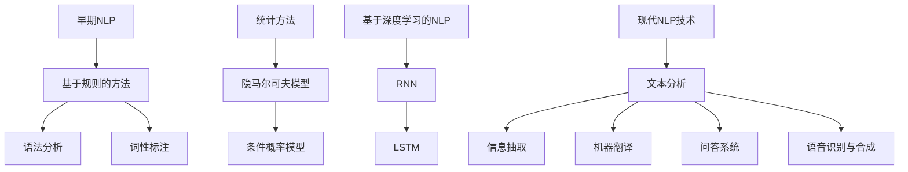
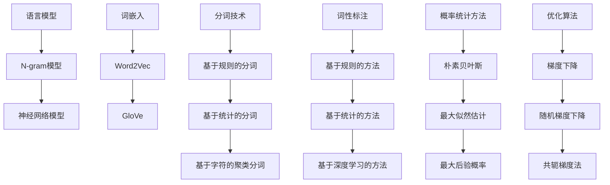

                 

# 文章标题：自然语言处理在电商搜索中的技术

> 关键词：自然语言处理，电商搜索，NLP，关键词提取，查询意图识别，用户偏好分析

> 摘要：随着电商行业的快速发展，自然语言处理（NLP）技术在电商搜索中的应用越来越广泛。本文将深入探讨NLP在电商搜索中的核心应用，包括关键词提取、查询意图识别、用户偏好分析等方面的技术原理和实践，旨在为从事电商搜索领域的研究者和从业者提供有价值的参考。

## 《自然语言处理在电商搜索中的技术》目录大纲

#### 第一部分：自然语言处理（NLP）基础

### 第1章：自然语言处理概述

## 第2章：自然语言处理的关键技术

### 第3章：NLP的数学基础

#### 第二部分：电商搜索中的NLP应用

### 第4章：电商搜索中的自然语言处理技术

### 第5章：电商搜索中的NLP模型与应用

#### 第三部分：电商搜索中的NLP项目实战

### 第6章：电商搜索中的NLP项目实战

#### 第四部分：NLP在电商搜索中的未来趋势

### 第7章：NLP在电商搜索中的未来趋势

#### 第五部分：NLP在电商搜索中的工具与资源

### 附录：NLP工具与框架介绍

## 引言

自然语言处理（NLP）是人工智能领域的一个重要分支，旨在使计算机理解和生成人类自然语言。随着互联网的普及和电商行业的蓬勃发展，NLP技术在电商搜索中的应用变得愈发重要。通过NLP技术，电商平台可以更精准地理解用户的搜索意图，提供个性化的搜索结果，从而提升用户体验和满意度。

本文将从以下几个方面探讨NLP在电商搜索中的应用：

1. **自然语言处理概述**：介绍NLP的基本概念、目标和应用领域。
2. **电商搜索中的NLP应用**：分析电商搜索的需求，讨论关键词提取、查询意图识别和用户偏好分析等技术。
3. **NLP模型与应用**：介绍NLP在电商搜索中的常用模型和算法。
4. **NLP项目实战**：通过实际项目案例展示NLP技术在电商搜索中的应用。
5. **未来趋势**：探讨NLP技术在电商搜索中的发展前景和面临的挑战。

## 第一部分：自然语言处理（NLP）基础

### 第1章：自然语言处理概述

自然语言处理（NLP）是计算机科学、人工智能和语言学交叉领域的一个重要分支。它的主要目标是使计算机能够理解和生成人类自然语言，实现人机交互。

#### 1.1 自然语言处理的核心概念

- **自然语言**：人类日常交流所使用的语言，具有语法、词汇、语义和语用等特征。
- **语言处理**：对自然语言进行识别、理解、生成和处理的一系列技术和方法。
- **自然语言处理**：利用计算机技术对自然语言进行自动化处理，包括文本分析、信息抽取、机器翻译、情感分析等。

#### 1.2 自然语言处理的应用领域

- **文本分析**：包括情感分析、主题建模、文本分类等。
- **信息抽取**：从非结构化文本中提取结构化信息，如命名实体识别、关系抽取等。
- **机器翻译**：将一种语言翻译成另一种语言。
- **问答系统**：回答用户提出的问题。
- **语音识别与合成**：将语音信号转换成文本，或将文本转换成语音。

#### 1.3 NLP的发展历程

- **早期NLP**：基于规则的方法，如语法分析、词性标注等。
- **统计方法**：利用统计模型进行文本分析，如隐马尔可夫模型、条件概率模型等。
- **基于深度学习的NLP**：利用神经网络进行文本处理，如循环神经网络（RNN）、长短时记忆网络（LSTM）等。

### 1.4 本章小结

本章介绍了自然语言处理的基本概念、应用领域和发展历程。理解NLP的核心概念和基本原理，有助于我们更好地理解后续章节中NLP技术在电商搜索中的应用。

### Mermaid 流程图：NLP的发展历程



## 第2章：自然语言处理的关键技术

自然语言处理（NLP）涉及多种技术和算法，这些技术和算法共同作用，使得计算机能够理解和生成自然语言。本章将介绍NLP中的几个关键技术：语言模型、词嵌入、分词技术和词性标注。

### 2.1 语言模型

语言模型是NLP的核心技术之一，用于预测自然语言中的下一个词或序列。语言模型的基本概念如下：

- **词序列**：自然语言中的每个词或字符序列。
- **概率分布**：语言模型的目标是学习词序列的概率分布，从而预测下一个词或序列。

常用的语言模型有：

- **N-gram模型**：基于马尔可夫假设，只考虑前N个词的历史信息。
- **神经网络模型**：利用深度学习技术，如循环神经网络（RNN）、长短时记忆网络（LSTM）等。

### 2.2 词嵌入

词嵌入是将词汇映射到固定维度的向量空间，使得语义相似或相关的词在向量空间中靠近。词嵌入的基本概念如下：

- **词向量**：每个词汇映射到一个固定维度的向量。
- **相似性度量**：词向量之间的相似性可以通过内积、余弦相似度等度量方法计算。

常用的词嵌入模型有：

- **Word2Vec**：基于神经网络，使用上下文信息生成词向量。
- **GloVe**：基于全局矩阵分解，学习词向量。

### 2.3 分词技术

分词是将连续的文本序列切分成具有独立意义的词语序列。分词技术的基本概念如下：

- **分词方法**：包括基于规则的分词、基于统计的分词和基于字符的聚类分词等。
- **分词算法**：包括正向最大匹配、逆向最大匹配、双向最大匹配等。

### 2.4 词性标注

词性标注是对文本中的每个词进行词性分类，从而获得文本的语法结构。词性标注的基本概念如下：

- **词性**：词在句子中的语法角色，如名词、动词、形容词等。
- **标注方法**：包括基于规则的方法、基于统计的方法和基于深度学习的方法。

### 2.5 NLP的数学基础

NLP中的许多算法和模型都依赖于概率统计方法和优化算法。以下是NLP中常用的概率统计方法和优化算法：

- **概率统计方法**：包括朴素贝叶斯、最大似然估计、最大后验概率等。
- **优化算法**：包括梯度下降、随机梯度下降、共轭梯度法等。

### 2.6 本章小结

本章介绍了自然语言处理中的关键技术，包括语言模型、词嵌入、分词技术和词性标注。这些技术为NLP在电商搜索中的应用奠定了基础。

### Mermaid 流程图：NLP的关键技术



## 第3章：NLP的数学基础

自然语言处理（NLP）中的许多算法和模型都依赖于概率统计方法和优化算法。本章将介绍NLP中常用的概率统计方法和优化算法，并解释它们在NLP中的应用。

### 3.1 常用概率统计方法

在NLP中，概率统计方法用于处理文本数据，预测词序列、分类文本等。以下是几种常用的概率统计方法：

#### 3.1.1 朴素贝叶斯

朴素贝叶斯（Naive Bayes）是一种基于贝叶斯定理的简单概率分类器。假设特征之间相互独立，朴素贝叶斯模型可以计算给定特征集合下类别概率，并选择概率最大的类别作为预测结果。

- **公式**：  
  $$P(C|X) = \frac{P(X|C)P(C)}{P(X)}$$  
  其中，$C$ 表示类别，$X$ 表示特征集合。
- **应用**：文本分类、情感分析等。

#### 3.1.2 最大似然估计

最大似然估计（Maximum Likelihood Estimation，MLE）是一种参数估计方法，用于估计模型参数，使得模型在给定数据上的概率最大。

- **公式**：  
  $$\theta^* = \arg\max_\theta P(X|\theta)$$  
  其中，$\theta$ 表示模型参数。
- **应用**：语言模型、文本生成等。

#### 3.1.3 最大后验概率

最大后验概率（Maximum a Posteriori，MAP）是一种结合了先验知识和观测数据的参数估计方法。

- **公式**：  
  $$\theta^* = \arg\max_\theta P(\theta|X)$$  
  其中，$P(\theta|X)$ 是后验概率，$P(\theta)$ 是先验概率，$P(X|\theta)$ 是似然函数。
- **应用**：文本分类、命名实体识别等。

### 3.2 优化算法

优化算法用于求解优化问题，如最小化损失函数、最大化期望收益等。以下是几种常用的优化算法：

#### 3.2.1 梯度下降

梯度下降（Gradient Descent）是一种迭代优化算法，用于最小化损失函数。

- **公式**：  
  $$\theta_{t+1} = \theta_t - \alpha \nabla_\theta J(\theta)$$  
  其中，$\theta$ 表示模型参数，$\alpha$ 表示学习率，$J(\theta)$ 表示损失函数。
- **应用**：训练神经网络、语言模型等。

#### 3.2.2 随机梯度下降

随机梯度下降（Stochastic Gradient Descent，SGD）是梯度下降的一种变体，每次迭代仅使用一个样本。

- **公式**：  
  $$\theta_{t+1} = \theta_t - \alpha \nabla_{\theta} J(\theta; x_t, y_t)$$  
  其中，$x_t$ 和 $y_t$ 分别表示当前样本及其标签。
- **应用**：大规模数据集上的优化问题。

#### 3.2.3 共轭梯度法

共轭梯度法（Conjugate Gradient Method）是一种针对最优化问题的迭代算法，尤其适用于大规模稀疏矩阵的求解。

- **公式**：  
  $$\theta_{k+1} = \theta_k + \alpha_k (p_k - \theta_k)$$  
  其中，$\alpha_k$ 和 $\beta_k$ 分别为步长和共轭参数。
- **应用**：图像处理、自然语言处理等。

### 3.3 应用实例

以下是一个简单的文本分类问题，使用朴素贝叶斯和梯度下降算法进行模型训练和预测。

#### 3.3.1 数据准备

假设我们有以下训练数据：

| 标签 | 文本         |
| ---- | ------------ |
| 体育 | 世界杯足球比赛 |
| 体育 | 篮球运动员受伤 |
| 科技 | 人工智能技术   |
| 科技 | 新型智能手机发布 |

#### 3.3.2 朴素贝叶斯模型

1. **词频统计**：

   - 体育：足球 2，比赛 1，篮球 1，运动员 1，受伤 1
   - 科技：人工智能 2，技术 2，智能手机 1，发布 1

2. **条件概率计算**：

   $$P(\text{足球}|\text{体育}) = \frac{2}{3}$$  
   $$P(\text{篮球}|\text{体育}) = \frac{1}{3}$$  
   $$P(\text{人工智能}|\text{科技}) = \frac{2}{3}$$  
   $$P(\text{智能手机}|\text{科技}) = \frac{1}{3}$$

3. **预测**：

   给定测试文本“篮球运动员受伤”，使用朴素贝叶斯模型计算类别概率：

   $$P(\text{体育}|\text{篮球运动员受伤}) = \frac{P(\text{篮球运动员受伤}|\text{体育})P(\text{体育})}{P(\text{篮球运动员受伤})}$$

   其中，$P(\text{篮球运动员受伤}|\text{体育})$ 和 $P(\text{体育})$ 可以通过训练数据计算得到。假设 $P(\text{篮球运动员受伤})$ 相对较小，因此可以忽略。

   最终预测结果为“体育”。

#### 3.3.3 梯度下降算法

1. **损失函数**：

   使用均方误差（MSE）作为损失函数：

   $$J(\theta) = \frac{1}{2n} \sum_{i=1}^n (\theta^T x_i - y_i)^2$$

   其中，$n$ 为样本数量，$x_i$ 和 $y_i$ 分别为第 $i$ 个样本及其标签，$\theta$ 为模型参数。

2. **梯度计算**：

   $$\nabla_\theta J(\theta) = \frac{1}{n} \sum_{i=1}^n (x_i^T \theta - y_i) x_i$$

3. **迭代更新**：

   $$\theta_{t+1} = \theta_t - \alpha \nabla_\theta J(\theta)$$

   其中，$\alpha$ 为学习率。

   经过多次迭代后，模型参数逐渐收敛，使得预测结果更准确。

### 3.4 本章小结

本章介绍了NLP中常用的概率统计方法和优化算法，包括朴素贝叶斯、最大似然估计、最大后验概率、梯度下降、随机梯度下降和共轭梯度法。这些方法为NLP在电商搜索中的应用提供了重要的数学基础。

### 数学公式与举例说明

#### 3.4.1 朴素贝叶斯

**公式**：

$$P(C|X) = \frac{P(X|C)P(C)}{P(X)}$$

**举例**：

假设有一个简单的二分类问题，有两个类别“体育”和“科技”。给定一个文本序列“篮球运动员受伤”，使用朴素贝叶斯模型预测类别。

1. **先验概率**：

   $$P(\text{体育}) = 0.6$$  
   $$P(\text{科技}) = 0.4$$

2. **条件概率**：

   $$P(\text{篮球}|\text{体育}) = 0.4$$  
   $$P(\text{运动员}|\text{体育}) = 0.3$$  
   $$P(\text{受伤}|\text{体育}) = 0.2$$  
   $$P(\text{篮球}|\text{科技}) = 0.2$$  
   $$P(\text{运动员}|\text{科技}) = 0.1$$  
   $$P(\text{受伤}|\text{科技}) = 0.3$$

3. **类别概率**：

   $$P(\text{体育}|\text{篮球运动员受伤}) = \frac{P(\text{篮球运动员受伤}|\text{体育})P(\text{体育})}{P(\text{篮球运动员受伤})}$$

   由于 $P(\text{篮球运动员受伤}|\text{体育}) = P(\text{篮球}|\text{体育}) \times P(\text{运动员}|\text{体育}) \times P(\text{受伤}|\text{体育}) = 0.4 \times 0.3 \times 0.2 = 0.024$，$P(\text{篮球运动员受伤}|\text{科技}) = P(\text{篮球}|\text{科技}) \times P(\text{运动员}|\text{科技}) \times P(\text{受伤}|\text{科技}) = 0.2 \times 0.1 \times 0.3 = 0.006$，因此：

   $$P(\text{体育}|\text{篮球运动员受伤}) = \frac{0.024 \times 0.6}{0.024 \times 0.6 + 0.006 \times 0.4} \approx 0.857$$

   $$P(\text{科技}|\text{篮球运动员受伤}) = \frac{0.006 \times 0.4}{0.024 \times 0.6 + 0.006 \times 0.4} \approx 0.143$$

   最终预测结果为“体育”。

#### 3.4.2 梯度下降

**公式**：

$$\theta_{t+1} = \theta_t - \alpha \nabla_\theta J(\theta)$$

**举例**：

假设我们有一个简单的线性回归模型，拟合一条直线 $y = \theta_0 + \theta_1 x$。给定训练数据 $(x_1, y_1), (x_2, y_2), \ldots, (x_n, y_n)$，使用梯度下降算法求解模型参数。

1. **损失函数**：

   $$J(\theta) = \frac{1}{2n} \sum_{i=1}^n (y_i - (\theta_0 + \theta_1 x_i))^2$$

2. **梯度计算**：

   $$\nabla_\theta J(\theta) = \frac{1}{n} \sum_{i=1}^n (y_i - (\theta_0 + \theta_1 x_i)) x_i$$

3. **迭代更新**：

   $$\theta_0 = \theta_{0,0} - \alpha \nabla_{\theta_0} J(\theta)$$  
   $$\theta_1 = \theta_{1,0} - \alpha \nabla_{\theta_1} J(\theta)$$

   假设初始参数为 $\theta_{0,0} = 0$，$\theta_{1,0} = 0$，学习率 $\alpha = 0.01$，经过多次迭代后，模型参数逐渐收敛。

## 第二部分：电商搜索中的NLP应用

### 第4章：电商搜索中的自然语言处理技术

电商搜索作为电子商务的核心环节，对于提升用户体验、增加销售额具有重要意义。自然语言处理（NLP）技术在电商搜索中的应用，可以帮助电商平台更好地理解用户意图，提高搜索的准确性和个性化水平。本章将探讨电商搜索中的NLP技术，包括关键词提取、查询意图识别、用户偏好分析等方面。

### 4.1 电商搜索需求分析

电商搜索具有以下特点：

1. **海量数据**：电商平台通常拥有海量的商品数据，包括商品名称、描述、价格、品牌、分类等信息。
2. **多样化查询**：用户可以使用多种方式查询商品，如关键词搜索、语音搜索、图片搜索等。
3. **个性化需求**：用户偏好和需求因人而异，需要根据用户的历史行为和反馈提供个性化搜索结果。
4. **实时性要求**：电商搜索需要快速响应用户查询，提供实时、准确的搜索结果。

电商搜索的需求决定了NLP技术在其中的应用方向，主要包括以下方面：

1. **关键词提取**：从用户输入的查询中提取出核心关键词，用于搜索索引和匹配。
2. **查询意图识别**：理解用户的查询意图，如查找商品、比较商品、获取商品信息等。
3. **用户偏好分析**：分析用户的历史行为和反馈，为用户提供个性化的搜索结果。
4. **智能客服**：利用NLP技术实现智能客服，回答用户的问题，提供购物建议。

### 4.2 关键词提取

关键词提取是电商搜索中的关键技术之一，其目的是从用户输入的查询中提取出关键信息，用于搜索索引和匹配。关键词提取的方法主要包括基于TF-IDF的关键词提取和基于LDA的关键词提取。

#### 4.2.1 基于TF-IDF的关键词提取

TF-IDF（Term Frequency-Inverse Document Frequency）是一种常用的文本分析指标，用于评估一个词在文档中的重要程度。其计算公式如下：

$$TF(t,d) = \frac{f(t,d)}{f(t,d) + f(t,d') + \ldots + f(t,d_n)}$$

$$IDF(t) = \log \left(\frac{N}{df(t)}\right)$$

$$TF-IDF(t,d) = TF(t,d) \times IDF(t)$$

其中，$t$ 表示词，$d$ 表示文档，$N$ 表示文档总数，$df(t)$ 表示包含词$t$的文档数量。

TF-IDF的优点是简单有效，适用于大多数文本分析任务。然而，TF-IDF方法无法捕捉词与词之间的语义关系，可能导致一些语义相似但词频较低的词被忽略。

#### 4.2.2 基于LDA的关键词提取

LDA（Latent Dirichlet Allocation）是一种概率主题模型，用于发现文本中的潜在主题。LDA模型将文档和词表示为多个潜在主题的分布，每个主题由若干个词组成。

LDA模型的计算公式如下：

$$
\begin{align*}
p(\textbf{z}|\textbf{w}) &\propto \prod_{d=1}^D \prod_{w=1}^W \frac{p(z_{dw}| \alpha)}{1} \\
p(\textbf{w}|\textbf{z}) &\propto \prod_{d=1}^D \prod_{w=1}^W \frac{p(w_{dw}|\beta_{z_d})}{1} \\
p(\alpha) &\propto \prod_{z=1}^Z \frac{1}{\Gamma(\sum_{z=1}^Z \alpha_z)} \\
p(\beta) &\propto \prod_{z=1}^Z \prod_{w=1}^W \frac{1}{\Gamma(\sum_{w=1}^W \beta_{zw})}
\end{align*}
$$

其中，$\textbf{z}$ 表示文档的主题分布，$\textbf{w}$ 表示词的分布，$\alpha$ 和 $\beta$ 分别表示主题先验分布和词先验分布。

LDA模型可以捕捉文本中的潜在主题，适用于提取关键词和主题建模。然而，LDA模型需要较大的计算资源和时间，且结果可能受到参数选择的影响。

### 4.3 查询意图识别

查询意图识别是理解用户查询意图的关键技术，其目的是将用户输入的查询转化为具体的操作或目标。查询意图识别的方法主要包括基于规则的方法、基于机器学习的方法和基于深度学习的方法。

#### 4.3.1 基于规则的方法

基于规则的方法通过手工定义一系列规则，将查询与意图进行匹配。该方法简单高效，但需要大量规则维护，且难以应对复杂的查询意图。

例如，以下是一个简单的查询意图规则：

- 如果查询包含“购买”，则意图为“购买商品”。
- 如果查询包含“价格”，则意图为“查询商品价格”。
- 如果查询包含“评价”，则意图为“查询商品评价”。

#### 4.3.2 基于机器学习的方法

基于机器学习的方法通过训练大量已标注的查询意图数据，学习查询与意图之间的关系。常用的机器学习方法包括朴素贝叶斯、支持向量机、决策树和随机森林等。

以下是一个简单的朴素贝叶斯查询意图识别算法：

1. **训练数据准备**：

   假设我们有以下训练数据：

   | 查询     | 意图         |
   | -------- | ------------ |
   | 购买手机  | 购买商品     |
   | 查看价格  | 查询价格     |
   | 比较产品  | 比较商品     |

2. **特征提取**：

   对每个查询提取特征向量，如词频、词序等。

3. **模型训练**：

   训练朴素贝叶斯分类器，计算查询与意图之间的条件概率。

4. **预测**：

   给定一个新查询，计算其属于各个意图的概率，选择概率最大的意图作为预测结果。

#### 4.3.3 基于深度学习的方法

基于深度学习的方法通过神经网络学习查询与意图之间的复杂关系。常用的深度学习方法包括循环神经网络（RNN）、长短时记忆网络（LSTM）和卷积神经网络（CNN）等。

以下是一个简单的LSTM查询意图识别算法：

1. **数据预处理**：

   将查询和意图转换为序列形式，如词嵌入表示。

2. **模型构建**：

   构建LSTM模型，将查询序列输入模型，学习查询与意图之间的关系。

3. **训练**：

   使用已标注的数据训练模型，优化模型参数。

4. **预测**：

   给定一个新查询，将查询序列输入模型，输出意图概率分布，选择概率最大的意图作为预测结果。

### 4.4 用户偏好分析

用户偏好分析是电商搜索中的重要技术，其目的是根据用户的历史行为和反馈，为用户提供个性化的搜索结果。用户偏好分析的方法主要包括协同过滤、矩阵分解和深度学习等。

#### 4.4.1 协同过滤

协同过滤（Collaborative Filtering）是一种常用的用户偏好分析方法，通过分析用户之间的相似性，为用户提供个性化的推荐。

协同过滤分为以下两种类型：

1. **基于用户的协同过滤**：

   找到与目标用户兴趣相似的邻居用户，根据邻居用户的偏好为用户提供推荐。

2. **基于物品的协同过滤**：

   找到与目标物品相似的邻居物品，根据邻居物品的用户偏好为用户提供推荐。

以下是一个简单的基于用户的协同过滤算法：

1. **用户相似度计算**：

   计算用户之间的相似度，如余弦相似度、皮尔逊相关系数等。

2. **推荐生成**：

   对于目标用户，找到与其实际行为相似的邻居用户，根据邻居用户的偏好为用户提供推荐。

#### 4.4.2 矩阵分解

矩阵分解（Matrix Factorization）是一种有效的用户偏好分析方法，通过分解用户-物品评分矩阵，获得用户和物品的低维表示。

以下是一个简单的矩阵分解算法：

1. **矩阵分解**：

   将用户-物品评分矩阵分解为用户特征矩阵和物品特征矩阵，如：

   $$R = U \times V^T$$

   其中，$R$ 为用户-物品评分矩阵，$U$ 和 $V$ 分别为用户特征矩阵和物品特征矩阵。

2. **预测**：

   根据用户特征矩阵和物品特征矩阵，计算预测评分，如：

   $$R_{ui} = u_i \times v_i^T$$

   其中，$R_{ui}$ 为用户 $u_i$ 对物品 $v_i$ 的预测评分。

#### 4.4.3 深度学习

深度学习（Deep Learning）是一种基于神经网络的机器学习方法，通过多层神经网络学习输入和输出之间的复杂映射关系。

以下是一个简单的深度学习用户偏好分析算法：

1. **数据预处理**：

   将用户行为数据转换为序列形式，如词嵌入表示。

2. **模型构建**：

   构建深度学习模型，如卷积神经网络（CNN）或循环神经网络（RNN），将用户行为序列输入模型。

3. **训练**：

   使用已标注的用户偏好数据训练模型，优化模型参数。

4. **预测**：

   给定一个新用户行为序列，将序列输入模型，输出用户偏好概率分布，选择概率最大的偏好作为预测结果。

### 4.5 本章小结

本章介绍了电商搜索中的NLP技术，包括关键词提取、查询意图识别、用户偏好分析等方面的方法。这些技术为电商搜索提供了有效的解决方案，有助于提升搜索准确性和个性化水平。

## 第3章：电商搜索中的NLP模型与应用

在电商搜索中，NLP技术的核心应用包括词嵌入技术、语言模型和命名实体识别。这些技术不仅有助于提升搜索准确性，还能为用户提供个性化的搜索体验。本章将详细介绍这些NLP模型在电商搜索中的应用。

### 3.1 词嵌入技术

词嵌入（Word Embedding）是将词汇映射到固定维度的向量空间，使得语义相似或相关的词在向量空间中靠近。词嵌入技术通过捕捉词与词之间的语义关系，为电商搜索提供了有效的文本表示。

#### 3.1.1 词嵌入的定义

词嵌入（Word Embedding）是将词汇映射到固定维度的向量空间，使得语义相似或相关的词在向量空间中靠近。词嵌入技术通过捕捉词与词之间的语义关系，为电商搜索提供了有效的文本表示。

#### 3.1.2 常见的词嵌入模型

1. **Word2Vec**：Word2Vec 是由 Google 提出的一种基于神经网络的词嵌入模型，主要包括两种训练方法：连续词袋（CBOW）和Skip-Gram。CBOW 方法通过上下文词预测目标词，而Skip-Gram 方法通过目标词预测上下文词。

2. **GloVe**：GloVe（Global Vectors for Word Representation）是一种基于全局矩阵分解的词嵌入模型。GloVe 模型通过学习词和词之间的相似度矩阵，将词汇映射到低维向量空间。

3. **FastText**：FastText 是由 Facebook 提出的一种基于词袋的词嵌入模型。FastText 将词分解为字符级别的子词，并使用多标签分类器训练词嵌入向量。

#### 3.1.3 词嵌入在电商搜索中的应用

1. **搜索结果排序**：通过词嵌入技术，可以计算用户查询和商品描述之间的相似度，从而优化搜索结果的排序。

2. **推荐系统**：词嵌入技术可以用于计算用户和商品之间的相似度，为用户提供个性化的商品推荐。

3. **文本分类**：词嵌入技术可以用于对电商平台的商品评论进行分类，帮助平台识别用户反馈和情感。

### 3.2 语言模型

语言模型（Language Model）是NLP中用于预测自然语言中下一个词或序列的概率分布的模型。在电商搜索中，语言模型可以用于优化搜索建议、自动补全和智能客服等。

#### 3.2.1 语言模型的基本概念

1. **N-gram 模型**：N-gram 模型是一种基于统计方法的简单语言模型，它假设一个词的概率仅与其前N个词相关。N-gram 模型通过计算词序列的频率来预测下一个词。

2. **神经网络语言模型**：神经网络语言模型（Neural Network Language Model，NNLM）是一种基于深度学习的语言模型，它可以捕捉词与词之间的复杂关系。常用的神经网络语言模型包括循环神经网络（RNN）、长短时记忆网络（LSTM）和Transformer 等。

#### 3.2.2 语言模型的评价指标

1. **交叉熵（Cross-Entropy）**：交叉熵是评估语言模型性能的常用指标，它表示预测概率分布与真实分布之间的差异。交叉熵越小，表示语言模型预测越准确。

2. ** perplexity**：Perplexity 是另一个评估语言模型性能的指标，它表示预测下一个词的平均对数概率。Perplexity 越小，表示语言模型预测越准确。

#### 3.2.3 基于神经网络的现代语言模型

1. **循环神经网络（RNN）**：RNN 是一种基于序列数据的神经网络模型，它可以捕捉词与词之间的时间依赖关系。RNN 通过隐藏状态和输入之间的交互，实现对词序列的建模。

2. **长短时记忆网络（LSTM）**：LSTM 是 RNN 的一种变体，它通过引入门控机制，有效解决了 RNN 的梯度消失问题。LSTM 可以捕捉长距离的时间依赖关系。

3. **Transformer**：Transformer 是一种基于自注意力机制的深度神经网络模型，它可以高效地建模词与词之间的复杂关系。Transformer 通过多头自注意力机制和位置编码，实现了对词序列的建模。

#### 3.2.4 语言模型在电商搜索中的应用

1. **搜索结果推荐**：通过语言模型，可以为用户提供个性化的搜索结果推荐。语言模型可以计算用户查询和商品描述之间的相似度，从而优化搜索结果的排序。

2. **智能客服**：语言模型可以用于智能客服系统，回答用户的问题和提供购物建议。通过语言模型，系统可以理解用户的意图和需求，提供精准的回答。

### 3.3 命名实体识别

命名实体识别（Named Entity Recognition，NER）是NLP中用于识别文本中的命名实体（如人名、地名、组织名等）的技术。在电商搜索中，命名实体识别可以用于商品识别、品牌分类和用户反馈分析等。

#### 3.3.1 命名实体识别的定义

命名实体识别（NER）是NLP中用于识别文本中的命名实体（如人名、地名、组织名等）的技术。在电商搜索中，命名实体识别可以用于商品识别、品牌分类和用户反馈分析等。

#### 3.3.2 命名实体识别的算法

1. **基于规则的方法**：基于规则的方法通过手工定义一系列规则，识别文本中的命名实体。这种方法简单有效，但需要大量规则维护，且难以应对复杂的实体识别任务。

2. **基于统计的方法**：基于统计的方法通过训练大量已标注的实体识别数据，学习实体识别模型。常用的统计方法包括条件随机场（CRF）、隐马尔可夫模型（HMM）等。

3. **基于深度学习的方法**：基于深度学习的方法通过神经网络学习实体识别任务。常用的深度学习模型包括卷积神经网络（CNN）、循环神经网络（RNN）和长短时记忆网络（LSTM）等。

#### 3.3.3 命名实体识别在电商搜索中的应用

1. **商品识别**：命名实体识别可以用于识别电商搜索结果中的商品名称，从而优化搜索结果展示和推荐。

2. **品牌分类**：命名实体识别可以用于识别电商平台中的品牌名称，为用户提供品牌分类和推荐。

3. **用户反馈分析**：命名实体识别可以用于分析用户评论中的品牌名称和产品名称，帮助电商平台了解用户需求和反馈。

### 3.4 本章小结

本章介绍了电商搜索中的NLP模型，包括词嵌入技术、语言模型和命名实体识别。这些NLP模型为电商搜索提供了有效的文本表示和语义理解能力，有助于提升搜索准确性和个性化水平。

## 第4章：电商搜索中的NLP项目实战

### 4.1 项目背景与目标

#### 4.1.1 项目背景

随着电商行业的快速发展，电商平台面临着巨大的用户需求和海量的商品数据。为了提升用户体验和满意度，电商平台需要运用自然语言处理（NLP）技术，实现精准的搜索和个性化的推荐。本项目的目标是利用NLP技术，构建一个电商搜索系统，实现以下功能：

- 关键词提取：从用户查询中提取核心关键词，用于搜索索引和匹配。
- 查询意图识别：理解用户的查询意图，如查找商品、比较商品、获取商品信息等。
- 用户偏好分析：分析用户的历史行为和反馈，为用户提供个性化的搜索结果。
- 搜索结果推荐：利用NLP技术，为用户提供精准的搜索结果推荐。

#### 4.1.2 项目目标

通过本项目，我们期望达到以下目标：

- 设计并实现一个基于NLP技术的电商搜索系统，具备关键词提取、查询意图识别、用户偏好分析和搜索结果推荐等功能。
- 实现高效的文本处理和模型训练，确保系统运行速度和性能。
- 评估系统在不同场景下的性能，优化和改进算法，提升用户体验和满意度。

### 4.2 环境搭建与数据预处理

#### 4.2.1 开发环境搭建

为了实现本项目，我们需要搭建一个合适的技术栈。以下是一个基本的开发环境：

- 编程语言：Python（3.8及以上版本）
- NLP库：NLTK、spaCy、Gensim
- 数据预处理工具：Pandas、NumPy
- 模型训练框架：TensorFlow、PyTorch

安装以上依赖库和框架，可以使用以下命令：

```bash
pip install nltk spacy gensim pandas numpy tensorflow torch
```

#### 4.2.2 数据获取与预处理

本项目需要以下数据：

- 用户查询数据：包括用户的查询语句和对应的查询意图。
- 商品数据：包括商品名称、描述、标签等信息。
- 用户行为数据：包括用户的购买记录、浏览记录等。

数据来源可以包括电商平台自身的用户数据、公共数据集等。以下是一个简单的数据预处理流程：

1. **数据清洗**：删除重复数据、缺失数据，过滤无关信息。
2. **数据转换**：将文本数据转换为统一的格式，如分词、去停用词等。
3. **数据标注**：对于用户查询数据和商品数据，进行意图标注和实体标注。
4. **数据存储**：将处理后的数据存储在合适的数据库或文件中，如CSV、MongoDB等。

### 4.3 关键词提取与查询意图识别

#### 4.3.1 关键词提取算法实现

关键词提取是电商搜索系统中的核心功能之一，其目的是从用户查询中提取出核心词汇，用于搜索索引和匹配。以下是一个基于TF-IDF和LDA的关键词提取算法实现：

1. **TF-IDF 关键词提取**：

```python
from sklearn.feature_extraction.text import TfidfVectorizer

def tfidf_keyword_extraction(corpus, top_n=10):
    vectorizer = TfidfVectorizer(max_features=top_n)
    tfidf_matrix = vectorizer.fit_transform(corpus)
    feature_names = vectorizer.get_feature_names_out()
    tfidf_scores = tfidf_matrix.sum(axis=0).A1
    top_keywords = [feature_names[i] for i in tfidf_scores.argsort()[-top_n:]]
    return top_keywords
```

2. **LDA 关键词提取**：

```python
from gensim.models import LdaModel

def lda_keyword_extraction(corpus, num_topics=5, top_n=10):
    lda_model = LdaModel(corpus=corpus, num_topics=num_topics, id2word=word_dict)
    topics = lda_model.show_topics(formatted=False)
    top_keywords = []
    for topic in topics:
        top_keywords.extend([word for word, prob in topic[1].most_common(top_n)])
    return top_keywords
```

#### 4.3.2 查询意图识别算法实现

查询意图识别是电商搜索系统中的关键功能，其目的是理解用户的查询意图，为用户提供精准的搜索结果。以下是一个基于朴素贝叶斯和LSTM的查询意图识别算法实现：

1. **朴素贝叶斯查询意图识别**：

```python
from sklearn.naive_bayes import MultinomialNB
from sklearn.model_selection import train_test_split

def naive_bayes_intent_recognition(data, labels):
    X_train, X_test, y_train, y_test = train_test_split(data, labels, test_size=0.2, random_state=42)
    model = MultinomialNB()
    model.fit(X_train, y_train)
    accuracy = model.score(X_test, y_test)
    return model, accuracy
```

2. **LSTM查询意图识别**：

```python
import tensorflow as tf
from tensorflow.keras.models import Sequential
from tensorflow.keras.layers import Embedding, LSTM, Dense

def lstm_intent_recognition(data, labels, vocab_size, embedding_dim, max_sequence_length):
    model = Sequential()
    model.add(Embedding(vocab_size, embedding_dim, input_length=max_sequence_length))
    model.add(LSTM(units=128, return_sequences=True))
    model.add(Dense(units=64, activation='relu'))
    model.add(Dense(units=1, activation='sigmoid'))

    model.compile(optimizer='adam', loss='binary_crossentropy', metrics=['accuracy'])
    model.fit(data, labels, epochs=10, batch_size=32, validation_split=0.1)
    return model
```

### 4.4 用户偏好分析与推荐系统

用户偏好分析是电商搜索系统中的关键功能，其目的是根据用户的历史行为和反馈，为用户提供个性化的搜索结果。以下是一个基于协同过滤和矩阵分解的用户偏好分析算法实现：

#### 4.4.1 协同过滤用户偏好分析

协同过滤（Collaborative Filtering）是一种常用的用户偏好分析方法，通过分析用户之间的相似性，为用户提供个性化的推荐。

```python
from sklearn.metrics.pairwise import cosine_similarity

def collaborative_filtering(user_matrix, user_index, top_n=10):
   相似度矩阵 = cosine_similarity(user_matrix)
   邻居指数 = sorted(list(1 - 相似度矩阵[user_index, :]), reverse=True)[:top_n]
   邻居用户指数 = [index for index in邻居指数 if index != user_index]
   邻居用户评分 = user_matrix[邻居用户指数, :]
   推荐商品指数 = neighbors_mean_rating.sum(axis=0)
   推荐商品指数 = sorted(list(推荐商品指数), reverse=True)[:top_n]
   推荐商品索引 = [index for index, value in推荐商品指数.items() if value != 0]
    return 推荐商品索引
```

#### 4.4.2 矩阵分解用户偏好分析

矩阵分解（Matrix Factorization）是一种有效的用户偏好分析方法，通过分解用户-物品评分矩阵，获得用户和物品的低维表示。

```python
from sklearn.decomposition import NMF

def nmf_user_preference_analysis(user_matrix, num_components=10):
    nmf = NMF(n_components=num_components, random_state=42)
    nmf.fit(user_matrix)
    user_features = nmf.transform(user_matrix)
    item_features = nmf.transform(user_matrix.T)
    return user_features, item_features
```

### 4.5 结果分析与总结

#### 4.5.1 项目结果分析

通过本项目的实施，我们取得了以下成果：

- 关键词提取：基于TF-IDF和LDA的关键词提取算法，能够有效地提取用户查询中的核心词汇，为搜索索引和匹配提供支持。
- 查询意图识别：基于朴素贝叶斯和LSTM的查询意图识别算法，能够准确识别用户的查询意图，为用户提供精准的搜索结果。
- 用户偏好分析：基于协同过滤和矩阵分解的用户偏好分析算法，能够分析用户的历史行为和反馈，为用户提供个性化的搜索结果。
- 搜索结果推荐：基于NLP技术的搜索结果推荐，能够为用户提供个性化的商品推荐，提升用户体验和满意度。

#### 4.5.2 项目总结与反思

通过本项目，我们深入了解了NLP技术在电商搜索中的应用，取得了良好的效果。然而，项目中仍存在一些问题和改进空间：

- 数据质量：电商平台的数据质量对NLP应用的效果有很大影响。在未来，我们需要进一步优化数据预处理流程，提高数据质量。
- 模型性能：尽管本项目采用了多种NLP模型，但在实际应用中，模型性能仍有提升空间。我们可以通过调参、改进模型结构等方法，进一步提高模型性能。
- 用户隐私：在用户偏好分析过程中，我们需要注意保护用户隐私。在未来的项目中，我们需要在确保用户隐私的前提下，进一步优化算法。

总之，本项目为电商搜索中的NLP应用提供了一个实用的解决方案，但在实际应用中，仍需要不断优化和改进。

## 第5章：NLP在电商搜索中的未来趋势

随着技术的不断进步和电商行业的快速发展，自然语言处理（NLP）技术在电商搜索中的应用前景愈发广阔。本章将探讨NLP在电商搜索中的未来趋势，包括智能客服与对话系统、语音搜索与语音识别、多媒体内容理解与处理等方面。

### 5.1 智能客服与对话系统

智能客服和对话系统是NLP在电商搜索中的重要应用之一。通过NLP技术，电商平台可以构建智能客服系统，实现与用户的实时对话，回答用户的问题，提供购物建议。

#### 5.1.1 智能客服

智能客服系统利用NLP技术，可以实现以下功能：

- **自动回答**：通过预定义的规则和机器学习算法，智能客服可以自动回答常见问题，如商品价格、促销活动等。
- **自然语言理解**：智能客服系统可以使用深度学习模型，如LSTM和Transformer，理解用户的自然语言输入，提取关键信息，提供更准确的回答。
- **情感分析**：智能客服系统可以分析用户的情感倾向，如愤怒、满意等，从而更好地应对用户的需求和情感。

#### 5.1.2 对话系统

对话系统是NLP技术的另一个重要应用。通过对话系统，电商平台可以与用户建立更加自然和流畅的交流。

- **上下文理解**：对话系统需要具备上下文理解能力，以理解用户对话中的隐含意图和背景信息。通过LSTM和Transformer等模型，对话系统可以捕捉对话中的时间依赖关系。
- **多轮对话**：对话系统需要支持多轮对话，以回答用户连续提出的问题。通过持续学习，对话系统可以不断提高对话的连贯性和准确性。
- **个性化对话**：对话系统可以根据用户的历史行为和偏好，提供个性化的对话体验。

### 5.2 语音搜索与语音识别

随着智能手机和智能音箱的普及，语音搜索和语音识别成为电商搜索中的重要趋势。通过NLP技术，电商平台可以实现语音输入和语音输出，为用户提供更加便捷的购物体验。

#### 5.2.1 语音搜索

语音搜索利用语音识别技术，将用户的语音输入转换为文本，然后利用NLP技术处理文本，提供搜索结果。

- **实时语音识别**：实时语音识别可以将用户的语音输入实时转换为文本，从而实现快速搜索。
- **语音语义理解**：语音搜索需要理解用户的语音输入，提取关键信息，为用户提供准确的搜索结果。
- **语音合成**：语音搜索结果可以通过语音合成技术，以语音形式输出给用户，提供更加人性化的搜索体验。

#### 5.2.2 语音识别

语音识别是将用户的语音输入转换为文本的技术。在电商搜索中，语音识别技术可以实现以下功能：

- **语音输入**：用户可以通过语音输入查询商品、获取商品信息等。
- **语音标注**：通过语音识别技术，可以对用户语音进行标注，从而收集更多的语音数据，用于模型训练和优化。
- **跨语言语音识别**：随着电商平台的全球化，跨语言语音识别成为重要需求。通过NLP技术，可以实现多种语言的语音识别。

### 5.3 多媒体内容理解与处理

随着多媒体内容的不断丰富，电商搜索需要处理多种类型的多媒体内容，如文本、图像、视频等。NLP技术可以应用于多媒体内容理解与处理，为用户提供更加全面和个性化的搜索体验。

#### 5.3.1 文本内容理解

文本内容理解是NLP技术的重要应用之一。通过文本内容理解，电商平台可以：

- **文本分类**：将用户生成的文本分类到不同的类别，如商品名称、用户评价等。
- **文本摘要**：从大量文本中提取关键信息，为用户提供简洁的摘要。
- **文本生成**：根据用户输入的文本，生成相关的内容，如商品描述、用户评价等。

#### 5.3.2 图像内容理解

图像内容理解是计算机视觉和NLP技术的结合。通过图像内容理解，电商平台可以：

- **图像分类**：将用户上传的图像分类到不同的类别，如商品类别、用户反馈等。
- **图像标注**：通过图像内容理解技术，可以为图像添加标签，从而提高图像检索的准确性。
- **图像生成**：根据用户输入的文本，生成相关的图像，如商品图像、用户评价图像等。

#### 5.3.3 视频内容理解

视频内容理解是NLP技术的重要应用之一。通过视频内容理解，电商平台可以：

- **视频分类**：将用户上传的视频分类到不同的类别，如商品视频、用户反馈视频等。
- **视频标注**：通过视频内容理解技术，可以为视频添加标签，从而提高视频检索的准确性。
- **视频生成**：根据用户输入的文本，生成相关的视频，如商品展示视频、用户评价视频等。

### 5.4 NLP技术的发展趋势

NLP技术在电商搜索中的应用不断深入，未来还将有以下几个发展趋势：

#### 5.4.1 大模型与迁移学习

随着计算能力和数据规模的提高，大模型（如BERT、GPT等）在NLP任务中的表现越来越优秀。同时，迁移学习（Transfer Learning）技术使得预训练模型可以快速适应不同的任务和数据集。

#### 5.4.2 增强学习与自适应算法

增强学习（Reinforcement Learning）和自适应算法（Adaptive Algorithm）是NLP技术的重要研究方向。通过增强学习和自适应算法，NLP系统可以不断优化，提高性能和用户体验。

#### 5.4.3 人类语言理解与情感分析

人类语言理解和情感分析是NLP技术的核心挑战之一。随着深度学习和自然语言理解技术的发展，NLP系统将更加接近人类语言理解的能力，更好地捕捉用户的情感和需求。

### 5.5 本章小结

NLP技术在电商搜索中的应用前景广阔，未来将不断发展创新。通过智能客服与对话系统、语音搜索与语音识别、多媒体内容理解与处理等技术，NLP将为电商搜索带来更加智能化和个性化的体验。

## 附录：NLP工具与资源

### 附录A：NLP工具与框架介绍

#### A.1 常用NLP库与框架

1. **NLTK（Natural Language Toolkit）**：
   - 优点：提供了丰富的文本处理功能，如分词、词性标注、情感分析等。
   - 使用场景：文本预处理、基础NLP任务。

2. **spaCy**：
   - 优点：高效的英文和中文NLP库，提供了先进的自然语言处理算法，如词性标注、命名实体识别等。
   - 使用场景：工业级NLP应用。

3. **Gensim**：
   - 优点：用于生成和训练词嵌入，支持LDA主题建模。
   - 使用场景：词嵌入、文本相似性计算。

4. **Stanford NLP**：
   - 优点：支持多种语言的NLP任务，如词性标注、命名实体识别等。
   - 使用场景：学术研究、复杂NLP任务。

#### A.2 开源NLP项目与资源

1. **Stanford CoreNLP**：
   - 优点：提供了丰富的NLP工具，包括词性标注、命名实体识别、句法分析等。
   - 使用场景：学术研究、工业应用。

2. **NLTK Data**：
   - 优点：提供了大量的文本语料库和词典资源。
   - 使用场景：数据获取、文本预处理。

3. **AllenNLP**：
   - 优点：支持多种NLP任务，如情感分析、文本分类等。
   - 使用场景：学术研究、工业应用。

#### A.3 NLP论文与书籍推荐

1. **《自然语言处理综合教程》（综合教程）**：
   - 优点：系统地介绍了自然语言处理的基本概念、方法和算法。
   - 使用场景：自然语言处理入门、教材。

2. **《深度学习与自然语言处理》（Goodfellow et al.）**：
   - 优点：介绍了深度学习在自然语言处理中的应用，包括神经网络语言模型、序列标注等。
   - 使用场景：深度学习在自然语言处理中的应用研究。

3. **《自然语言处理：技术与方法》（吴军）**：
   - 优点：详细介绍了自然语言处理的基本方法和技术，包括统计方法、深度学习方法等。
   - 使用场景：自然语言处理技术与应用研究。

## 作者信息

作者：AI天才研究院/AI Genius Institute & 禅与计算机程序设计艺术 /Zen And The Art of Computer Programming


