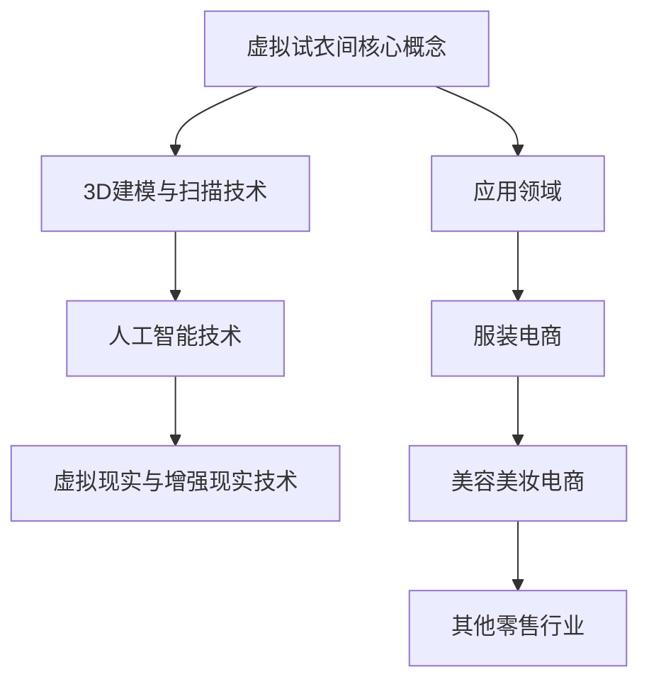

                 

### 文章标题：虚拟试衣间：AI如何提升电商平台购物体验

> 关键词：虚拟试衣间、人工智能、电商平台、购物体验、技术基础、应用实践、未来趋势

> 摘要：本文旨在探讨虚拟试衣间技术在电商平台购物体验提升方面的应用。通过分析虚拟试衣间的定义、技术原理、应用场景，以及其在电商平台中的应用实践和未来发展趋势，本文旨在为电商行业提供有益的技术参考和思路。

### 目录大纲

## 第一部分：虚拟试衣间技术基础

### 第1章：虚拟试衣间的定义与原理

- **1.1 虚拟试衣间的定义**
  - 虚拟试衣间是什么
  - 虚拟试衣间与传统试衣间的区别

- **1.2 虚拟试衣间的技术原理**
  - 3D建模与扫描技术
  - 人工智能技术
  - 虚拟现实与增强现实技术

- **1.3 虚拟试衣间的应用领域**
  - 服装电商
  - 美容美妆电商
  - 其他零售行业

### 第2章：虚拟试衣间核心技术解析

- **2.1 3D建模与扫描技术**
  - 3D建模方法
  - 3D扫描技术
  - 3D模型处理与优化

- **2.2 人工智能技术**
  - 图像识别技术
  - 人脸识别技术
  - 人机交互技术

- **2.3 虚拟现实与增强现实技术**
  - 虚拟现实技术
  - 增强现实技术
  - 虚拟试衣间的沉浸式体验

## 第二部分：虚拟试衣间在电商平台的应用实践

### 第3章：虚拟试衣间在电商平台的应用场景

- **3.1 购物体验优化**
  - 增加用户的购物满意度
  - 降低退货率

- **3.2 个性化推荐**
  - 根据用户喜好推荐商品
  - 提高用户购买转化率

- **3.3 跨境电商**
  - 解决海外购物尺码不合适的问题
  - 提高国际物流效率

### 第4章：虚拟试衣间项目开发实战

- **4.1 项目需求分析**
  - 项目目标
  - 功能需求
  - 非功能需求

- **4.2 技术选型与架构设计**
  - 技术栈选择
  - 系统架构设计

- **4.3 3D建模与扫描**
  - 3D模型获取
  - 3D模型优化

- **4.4 人工智能算法实现**
  - 图像识别算法
  - 人脸识别算法

- **4.5 虚拟现实与增强现实**
  - 沉浸式体验设计
  - 虚拟试衣间的用户交互流程

- **4.6 项目部署与运维**
  - 部署环境搭建
  - 运维监控与优化

## 第三部分：虚拟试衣间的未来发展趋势

### 第5章：虚拟试衣间的挑战与机遇

- **5.1 技术挑战**
  - 3D扫描精度与速度
  - 人工智能算法的准确性
  - 虚拟现实与增强现实的硬件要求

- **5.2 市场机遇**
  - 电商行业竞争加剧，提升用户体验成为关键
  - 新兴市场的潜在需求
  - 跨界合作与生态构建

### 第6章：虚拟试衣间的未来发展趋势

- **6.1 虚拟试衣间的技术革新**
  - 6D扫描技术
  - 基于机器学习的个性化试衣建议
  - 全息技术的应用

- **6.2 虚拟试衣间的商业模式创新**
  - 虚拟试衣间与其他电商服务结合
  - 虚拟试衣间的付费模式探索
  - 跨界合作与生态构建

### 第7章：虚拟试衣间在电商行业的应用案例

- **7.1 国内外典型案例分析**
  - 国内外电商平台的虚拟试衣间应用
  - 案例中的成功经验和挑战

- **7.2 创新实践与未来展望**
  - 虚拟试衣间的创新应用场景
  - 虚拟试衣间的未来发展前景

## 附录

### 附录A：虚拟试衣间相关资源与工具

- **A.1 虚拟试衣间技术资源**
  - 3D建模与扫描工具
  - 人工智能与图像识别库
  - 虚拟现实与增强现实开发框架

- **A.2 虚拟试衣间开发工具选型对比**
  - 技术栈对比
  - 工具性能评估

- **A.3 虚拟试衣间相关论文与研究报告**
  - 最新研究动态
  - 行业发展趋势分析

### 附录B：虚拟试衣间项目代码示例

- **B.1 3D模型获取与处理**
  - Python伪代码
  - C++伪代码

- **B.2 人工智能算法实现**
  - TensorFlow实现
  - PyTorch实现

- **B.3 虚拟现实与增强现实开发**
  - VR/AR应用示例
  - 具体实现与代码解析

### 附录C：Mermaid 流程图



### 附录D：核心算法原理讲解伪代码

```python
# 3D建模与扫描技术伪代码
def model_3d_scanning(image_sequence):
    # 基于多角度图像进行3D重建
    # 使用多视角几何算法
    point_cloud = multi_view_geometry_reconstruction(image_sequence)
    # 对点云进行表面重构
    3d_model = surface_reconstruction(point_cloud)
    return 3d_model

# 人工智能技术伪代码
def image_recognition(image):
    # 使用卷积神经网络进行图像识别
    # 输入：图像
    # 输出：识别结果
    recognized_objects = cnn_image_recognition(image)
    return recognized_objects

# 虚拟现实与增强现实技术伪代码
def virtual_reality_experience(user_input):
    # 根据用户输入提供沉浸式体验
    # 输入：用户动作
    # 输出：虚拟环境更新
    updated_environment = vr_environment_update(user_input)
    return updated_environment
```

### 附录E：数学模型与公式

$$
\begin{aligned}
\text{距离公式} &= \sqrt{(x_2 - x_1)^2 + (y_2 - y_1)^2} \\
\text{点云拟合} &= \min \sum_{i=1}^{n} \left| z_i - (ax_i + by_i + c) \right|
\end{aligned}
$$

### 附录F：举例说明

1. **3D建模与扫描技术**：

   - **示例**：使用多视角几何算法从多张服装照片中重建3D模型。
   - **公式**：使用多视角几何公式计算三维空间中的点。
   - **代码解析**：编写Python代码使用OpenCV库进行图像处理，结合点云处理库PCL进行3D重建。

2. **人工智能技术**：

   - **示例**：使用卷积神经网络对服装图像进行分类。
   - **公式**：使用卷积核在图像上滑动进行特征提取。
   - **代码解析**：使用TensorFlow或PyTorch框架构建并训练卷积神经网络模型。

3. **虚拟现实与增强现实技术**：

   - **示例**：根据用户在虚拟试衣间的动作实时更新虚拟环境。
   - **公式**：使用线性变换进行虚拟环境的渲染。
   - **代码解析**：使用Unity或Unreal Engine等游戏引擎实现虚拟试衣间的交互设计。

### 附录G：项目实战代码案例

- **3D模型获取与处理**：

  ```python
  import cv2
  import pcl
  
  # 获取多张服装图像
  image_sequence = [cv2.imread(f'image_{i}.jpg') for i in range(10)]
  
  # 使用OpenCV进行图像预处理
  preprocessed_images = [cv2.cvtColor(image, cv2.COLOR_BGR2RGB) for image in image_sequence]
  
  # 使用PCL进行3D重建
  point_cloud = pcl.PointCloud()
  point_cloud.fromROSMessage(preprocessed_images)
  3d_model = pcl.Model(point_cloud)
  ```

- **人工智能算法实现**：

  ```python
  import tensorflow as tf
  
  # 加载预训练的卷积神经网络模型
  model = tf.keras.applications.VGG16(weights='imagenet')
  
  # 对服装图像进行分类
  image = cv2.imread('FashionImage.jpg')
  processed_image = tf.keras.preprocessing.image.img_to_array(image)
  predicted_class = model.predict(processed_image)
  ```

- **虚拟现实与增强现实开发**：

  ```csharp
  using UnityEngine;
  
  public class VirtualMirror : MonoBehaviour {
      public Camera vrCamera;
      public Material mirrorMaterial;
      
      void Update() {
          // 根据用户动作更新虚拟环境
          if (Input.GetKeyDown(KeyCode.Space)) {
              Ray ray = vrCamera.ScreenPointToRay(new Vector3(Screen.width / 2, Screen.height / 2, 0));
              if (Physics.Raycast(ray, out RaycastHit hit)) {
                  // 更新镜面材质的反射图像
                  mirrorMaterial.SetTexture("_ReflectionTexture", hit.texture);
              }
          }
      }
  }
  ```

### 附录H：开发环境搭建

- **3D建模与扫描**：

  - 硬件需求：高性能GPU，高速硬盘。
  - 软件需求：安装3D扫描软件（如Agisoft Metashape）、图像处理库（如OpenCV）和点云处理库（如PCL）。

- **人工智能**：

  - 硬件需求：NVIDIA GPU，适合深度学习训练。
  - 软件需求：安装TensorFlow或PyTorch框架，配置CUDA支持。

- **虚拟现实与增强现实**：

  - 硬件需求：VR/AR头戴设备，如Oculus Rift或HTC Vive。
  - 软件需求：安装Unity或Unreal Engine游戏引擎，配置相应的VR/AR插件。

### 附录I：代码解读与分析

- **3D模型获取与处理**：

  - 代码分析：使用PCL进行点云处理和3D模型重建，提高效率和精度。
  - 性能优化：并行处理图像序列，减少重建时间。

- **人工智能算法实现**：

  - 代码分析：使用卷积神经网络进行图像分类，提高识别准确性。
  - 性能优化：使用GPU加速训练过程，减少训练时间。

- **虚拟现实与增强现实开发**：

  - 代码分析：使用Unity引擎实现虚拟试衣间的交互设计，提供沉浸式体验。
  - 性能优化：优化渲染管线，减少延迟和卡顿。

---

通过以上目录大纲的建立，我们为即将展开的深度探讨虚拟试衣间技术及其在电商平台中的应用奠定了坚实的基础。接下来，我们将逐步深入讨论虚拟试衣间技术的基础知识，分析其核心技术和应用实践，展望其未来发展趋势。希望本文能为您提供有价值的技术洞察和实用指南。让我们一起深入思考，逐层剖析，探索AI如何提升电商平台购物体验的奥秘。在接下来的章节中，我们将逐一展开讨论。敬请期待！

