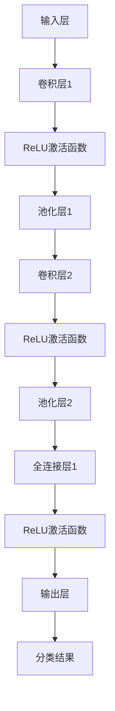
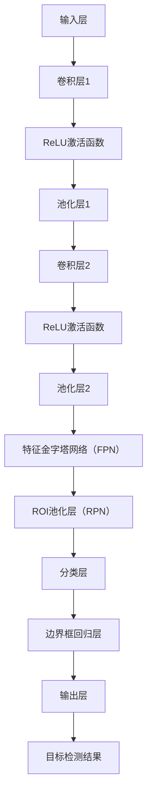
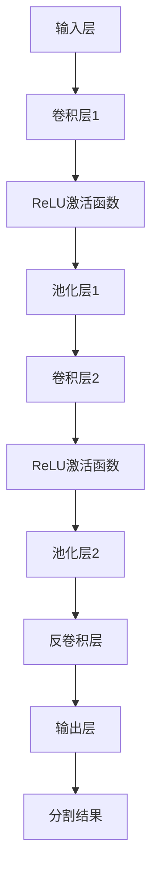
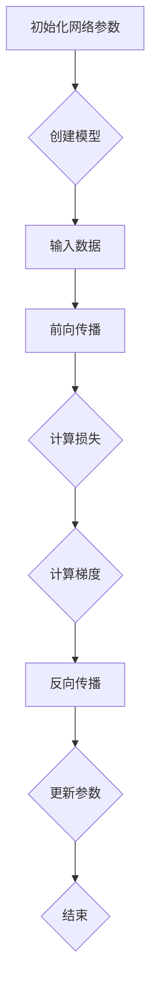

                 

## 文章标题

《视觉推荐：AI如何利用图像识别技术，提供个性化推荐》

### 关键词

- 视觉推荐
- 图像识别
- 个性化推荐
- 卷积神经网络
- 深度学习
- 人工智能

### 摘要

本文深入探讨了视觉推荐技术及其在个性化推荐中的应用。首先，我们介绍了视觉推荐的基本概念、重要性及适用场景。接着，详细解析了图像识别技术的基础理论、关键技术和发展趋势。在此基础上，文章阐述了视觉推荐系统的架构设计，包括数据采集与预处理、图像特征提取、推荐算法选择与实现、推荐结果评估与优化。随后，我们针对核心算法——卷积神经网络，进行了详细的原理讲解，并给出了伪代码实现。最后，文章通过项目实战和案例分析，展示了视觉推荐系统在实际中的应用效果，并对系统优化和未来发展趋势进行了展望。全文旨在为读者提供一个系统、详尽的视觉推荐技术指南。

### 目录

#### 第一部分：视觉推荐技术基础

- [第1章 视觉推荐技术概述](#第1章-视觉推荐技术概述)
  - [1.1 视觉推荐的定义与意义](#11-视觉推荐的定义与意义)
  - [1.2 图像识别技术基础](#12-图像识别技术基础)
  - [1.3 个性化推荐算法简介](#13-个性化推荐算法简介)

- [第2章 视觉推荐系统架构设计](#第2章-视觉推荐系统架构设计)
  - [2.1 视觉推荐系统的组成](#21-视觉推荐系统的组成)
  - [2.2 图像识别模块设计](#22-图像识别模块设计)
  - [2.3 个性化推荐模块设计](#23-个性化推荐模块设计)

- [第3章 图像识别算法原理讲解](#第3章-图像识别算法原理讲解)
  - [3.1 卷积神经网络（CNN）基础](#31-卷积神经网络cnn基础)
  - [3.2 卷积神经网络在图像识别中的应用](#32-卷积神经网络在图像识别中的应用)
  - [3.3 伪代码实现卷积神经网络](#33-伪代码实现卷积神经网络)

- [第4章 个性化推荐算法原理讲解](#第4章-个性化推荐算法原理讲解)
  - [4.1 协同过滤算法](#41-协同过滤算法)
  - [4.2 基于内容的推荐算法](#42-基于内容的推荐算法)
  - [4.3 混合推荐算法](#43-混合推荐算法)

#### 第二部分：视觉推荐系统架构

- [第5章 视觉推荐系统实战](#第5章-视觉推荐系统实战)
  - [5.1 数据采集与预处理](#51-数据采集与预处理)
  - [5.2 构建图像识别模块](#52-构建图像识别模块)
  - [5.3 构建个性化推荐模块](#53-构建个性化推荐模块)
  - [5.4 案例分析](#54-案例分析)

#### 第三部分：核心算法原理与实现

- [第6章 系统优化与未来展望](#第6章-系统优化与未来展望)
  - [6.1 推荐效果优化](#61-推荐效果优化)
  - [6.2 系统性能优化](#62-系统性能优化)
  - [6.3 视觉推荐系统的未来发展趋势](#63-视觉推荐系统的未来发展趋势)

- [第7章 总结与展望](#第7章-总结与展望)
  - [7.1 视觉推荐系统的发展历程](#71-视觉推荐系统的发展历程)
  - [7.2 书籍总结](#72-书籍总结)
  - [7.3 未来展望](#73-未来展望)

### 附录

- [附录A 视觉推荐系统常用工具](#附录a-视觉推荐系统常用工具)
- [附录B：参考资料](#附录b-参考资料)

## 第1章 视觉推荐技术概述

### 1.1 视觉推荐的定义与意义

#### 视觉推荐的概念

视觉推荐是一种基于图像识别技术，通过分析用户的视觉兴趣，为用户推荐与其兴趣相关的视觉内容的方法。传统的推荐系统主要依赖于文本信息，如用户的浏览历史、搜索记录和评价，而视觉推荐则可以直接处理用户生成的图片或视频，提供更加直观和个性化的推荐。

在视觉推荐系统中，用户生成的内容（User Generated Content，UGC）是核心数据来源。例如，在社交媒体平台上，用户上传的图片或视频可以作为推荐系统的输入。电商平台上的产品图片也是视觉推荐的重要数据来源。通过分析这些图像内容，系统可以为用户推荐相似或感兴趣的商品、内容或服务。

#### 视觉推荐的重要性

视觉推荐在当今的信息爆炸时代具有重要的价值。首先，它能够帮助用户在海量内容中快速找到自己感兴趣的信息，提高用户体验。例如，在电商平台上，视觉推荐可以帮助用户根据产品图片找到相似或感兴趣的商品，从而提高购买转化率。

其次，视觉推荐可以增强平台的用户黏性。通过个性化推荐，平台能够提供更加符合用户兴趣的内容，使用户更加愿意停留在平台上。例如，社交媒体平台通过视觉推荐为用户推荐可能喜欢的图片或视频内容，从而提高用户活跃度。

此外，视觉推荐在多个领域展现出广泛的应用潜力。在在线教育领域，视觉推荐可以根据学生的学习兴趣和需求，推荐相关的课程和资料。在医疗领域，视觉推荐可以帮助医生根据病例图片，推荐相关的病例资料和治疗方案。在旅游领域，视觉推荐可以根据用户的兴趣和偏好，推荐相应的景点和活动。

#### 视觉推荐的应用场景

视觉推荐广泛应用于多个领域，以下是一些典型的应用场景：

- **电商产品推荐**：电商平台通过视觉推荐系统，根据用户上传的购物图片或浏览记录，推荐相似或感兴趣的商品。
- **社交媒体内容推荐**：社交媒体平台通过视觉推荐系统，根据用户的点赞、评论和分享行为，推荐可能喜欢的图片或视频内容。
- **在线教育课程推荐**：在线教育平台通过视觉推荐系统，根据学生的学习兴趣和成绩，推荐相关的课程和资料。
- **医疗影像诊断**：医疗机构通过视觉推荐系统，根据医生的专业知识和病例数据，推荐相关的病例资料和治疗方案。
- **旅游服务推荐**：旅游平台通过视觉推荐系统，根据用户的兴趣和偏好，推荐相应的景点、活动和酒店。

### 1.2 图像识别技术基础

#### 图像识别的基本原理

图像识别是指利用计算机对图像进行分析和处理，自动识别图像中的目标或对象。图像识别的基本原理包括图像预处理、特征提取、模型训练和模型评估等步骤。

首先，图像预处理是对原始图像进行一系列操作，如去噪、增强、缩放等，以提高图像质量。接着，特征提取是将图像数据转换为可用于分类的特征向量。常用的特征提取方法包括SIFT、HOG、卷积神经网络（CNN）等。最后，模型训练和评估是通过已标记的训练数据，训练分类模型，并对模型进行评估，以确定其性能。

#### 图像识别的关键技术

图像识别的关键技术主要包括图像预处理、特征提取和分类算法。

- **图像预处理**：图像预处理包括去噪、滤波、增强等操作。去噪是通过去除图像中的噪声，提高图像质量；滤波是通过卷积操作，平滑图像，去除高频噪声；增强是通过调整图像的亮度、对比度等，增强图像特征。
- **特征提取**：特征提取是将图像数据转换为可用于分类的特征向量。常用的特征提取方法包括SIFT、HOG、卷积神经网络（CNN）等。SIFT（Scale-Invariant Feature Transform）是一种在尺度不变的条件下，提取关键点的算法；HOG（Histogram of Oriented Gradients）是通过计算图像的梯度直方图，提取图像特征；卷积神经网络（CNN）是一种深度学习模型，可以自动提取图像中的深层次特征。
- **分类算法**：分类算法是将提取的特征向量映射到预定义的类别标签。常用的分类算法包括传统的机器学习算法（如SVM、KNN）和深度学习算法（如CNN）。SVM（Support Vector Machine）是一种支持向量机，通过最大化分类边界，实现分类；KNN（K-Nearest Neighbors）是一种基于邻居的算法，通过计算特征向量之间的距离，实现分类。

#### 图像识别的发展趋势

图像识别技术的发展趋势主要体现在以下几个方面：

- **深度学习技术的广泛应用**：深度学习技术，尤其是卷积神经网络（CNN），在图像识别领域取得了显著的进展。通过多层卷积和池化操作，CNN可以提取出图像的深层次特征，实现高精度的图像识别。
- **多模态数据的整合**：通过结合文本、音频等多种数据源，可以提高视觉推荐系统的推荐质量。例如，在电商平台上，结合商品图片和用户评论，可以更准确地识别用户的需求，提供更加个性化的推荐。
- **实时图像识别技术的发展**：实时图像识别技术可以在移动设备等资源受限的环境下实现。通过优化算法和硬件加速，可以实现低延迟、高精度的图像识别。

### 1.3 个性化推荐算法简介

#### 个性化推荐的基本原理

个性化推荐是一种基于用户的历史行为、兴趣和偏好，为用户推荐其可能感兴趣的内容的方法。个性化推荐的核心是理解用户的行为模式和兴趣点，并根据这些信息生成个性化的推荐列表。

个性化推荐的基本原理包括以下几个步骤：

1. **用户画像构建**：通过对用户的历史行为、兴趣偏好进行分析，构建用户的画像。用户画像包括用户的基本信息、行为记录、兴趣标签等。
2. **内容特征提取**：对推荐的内容进行特征提取，提取出内容的关键特征，如文本、图像、音频等。
3. **相似度计算**：计算用户画像与内容特征之间的相似度，以确定推荐内容的相关性。
4. **推荐列表生成**：根据相似度计算结果，生成个性化的推荐列表，将最相关的推荐内容推送给用户。

#### 个性化推荐的主要算法

个性化推荐算法主要包括协同过滤（Collaborative Filtering）和基于内容的推荐（Content-Based Filtering）两大类。

- **协同过滤**：协同过滤通过分析用户之间的相似性，推荐其他相似用户喜欢的项目。协同过滤包括用户基于的协同过滤（User-Based Collaborative Filtering）和项目基于的协同过滤（Item-Based Collaborative Filtering）两种类型。
  - **用户基于的协同过滤**：用户基于的协同过滤通过计算用户之间的相似度，找出与目标用户最相似的邻居用户，然后将邻居用户喜欢的项目推荐给目标用户。
  - **项目基于的协同过滤**：项目基于的协同过滤通过计算项目之间的相似度，找出与目标项目最相似的项目，然后将这些项目推荐给用户。
- **基于内容的推荐**：基于内容的推荐根据项目的内容特征和用户的兴趣特征进行匹配，推荐相关的项目。基于内容的推荐包括文本匹配和图像匹配等。
  - **文本匹配**：文本匹配通过计算文本之间的相似度，为用户推荐与其兴趣相关的文本内容。常用的文本匹配算法包括TF-IDF、余弦相似度等。
  - **图像匹配**：图像匹配通过计算图像之间的相似度，为用户推荐与其兴趣相关的图像内容。常用的图像匹配算法包括SIFT、HOG等。

#### 个性化推荐的应用实例

个性化推荐在多个领域得到了广泛应用，以下是一些典型的应用实例：

- **电商产品推荐**：电商平台通过个性化推荐系统，根据用户的购物历史、浏览记录和评价，推荐用户可能感兴趣的商品。例如，淘宝、京东等电商平台，通过分析用户的购买行为和偏好，推荐类似或相关的商品。
- **新闻内容推荐**：新闻客户端通过个性化推荐系统，根据用户的阅读历史和偏好，推荐用户可能感兴趣的新闻内容。例如，今日头条、网易新闻等新闻客户端，通过分析用户的阅读行为和兴趣标签，推荐个性化的新闻内容。
- **音乐和视频推荐**：音乐和视频平台通过个性化推荐系统，根据用户的听歌和观影记录，推荐用户可能喜欢的音乐和视频内容。例如，网易云音乐、腾讯视频等平台，通过分析用户的听歌和观影行为，推荐个性化的音乐和视频。
- **在线教育课程推荐**：在线教育平台通过个性化推荐系统，根据用户的学习兴趣和成绩，推荐相关的课程和资料。例如，网易云课堂、慕课网等在线教育平台，通过分析用户的学习行为和成绩，推荐个性化的课程和资料。

## 第2章 视觉推荐系统架构设计

### 2.1 视觉推荐系统的组成

视觉推荐系统是一个复杂的多模块系统，其核心目标是利用图像识别技术和个性化推荐算法，为用户提供个性化、精准的视觉内容推荐。视觉推荐系统的组成主要包括以下几个关键模块：

#### 2.1.1 数据采集与预处理

数据采集是视觉推荐系统的第一步，涉及到从各种渠道收集用户生成的内容，如图片、视频、文本等。数据来源可以包括社交媒体、电商平台、在线教育平台等。在数据采集过程中，需要确保数据的多样性和代表性。

数据预处理是数据采集后的重要环节，其目的是清洗和转换原始数据，使其适合后续的图像识别和推荐算法处理。数据预处理主要包括以下几个步骤：

1. **数据清洗**：去除重复、错误或无效的数据，确保数据的质量和一致性。
2. **数据格式转换**：将不同来源和格式的数据转换为统一的格式，如将不同分辨率的图片转换为标准尺寸，将视频数据转换为帧序列等。
3. **数据增强**：通过数据增强技术，如随机裁剪、旋转、缩放等，增加数据的多样性，提高模型的泛化能力。

#### 2.1.2 图像特征提取

图像特征提取是视觉推荐系统的核心模块，其目标是提取出图像中的重要特征，用于后续的推荐算法处理。图像特征提取的方法主要包括传统的机器学习算法和深度学习算法。

- **传统机器学习算法**：如SIFT、HOG等，这些算法通过计算图像的局部特征，如角点、边缘、梯度等，提取出图像的特征向量。
- **深度学习算法**：如卷积神经网络（CNN），通过多层卷积和池化操作，自动提取图像的深层次特征。CNN在图像识别任务中取得了显著的性能提升，被广泛应用于视觉推荐系统。

图像特征提取的质量直接影响推荐系统的效果，因此需要选用合适的特征提取方法和模型架构，进行特征向量的提取和优化。

#### 2.1.3 推荐算法选择与实现

推荐算法是视觉推荐系统的核心，其目标是根据用户的历史行为、兴趣和偏好，为用户推荐其可能感兴趣的内容。常见的推荐算法包括协同过滤、基于内容的推荐和混合推荐等。

- **协同过滤**：通过分析用户之间的相似性，推荐其他相似用户喜欢的项目。协同过滤包括用户基于的协同过滤和项目基于的协同过滤两种类型。
  - **用户基于的协同过滤**：通过计算用户之间的相似度，找出与目标用户最相似的邻居用户，然后将邻居用户喜欢的项目推荐给目标用户。
  - **项目基于的协同过滤**：通过计算项目之间的相似度，找出与目标项目最相似的项目，然后将这些项目推荐给用户。
- **基于内容的推荐**：根据项目的内容特征和用户的兴趣特征进行匹配，推荐相关的项目。基于内容的推荐包括文本匹配和图像匹配等。
  - **文本匹配**：通过计算文本之间的相似度，为用户推荐与其兴趣相关的文本内容。
  - **图像匹配**：通过计算图像之间的相似度，为用户推荐与其兴趣相关的图像内容。

在选择和实现推荐算法时，需要考虑算法的准确性、效率和可扩展性等因素。通常，为了提高推荐效果，会采用混合推荐算法，将协同过滤和基于内容的推荐相结合。

#### 2.1.4 推荐结果评估与优化

推荐结果的评估是评价推荐系统性能的重要手段，常用的评估指标包括准确率、召回率、覆盖率等。通过评估结果，可以识别系统的不足之处，并进行优化。

推荐结果的优化包括以下几个方面：

1. **算法优化**：通过调整推荐算法的参数，提高推荐效果。例如，调整协同过滤算法中的相似度阈值，优化基于内容的推荐算法的文本匹配方法等。
2. **特征优化**：通过改进图像特征提取方法，提高特征向量的质量，从而提高推荐效果。例如，采用更复杂的深度学习模型，提取更丰富的图像特征。
3. **系统架构优化**：通过优化系统架构，提高推荐速度和性能。例如，采用分布式计算、缓存技术等，提高系统的响应速度和并发处理能力。

#### 2.1.5 用户反馈机制

用户反馈机制是视觉推荐系统的重要组成部分，通过收集用户的反馈信息，可以不断优化推荐效果。用户反馈包括用户对推荐内容的评价、点击、收藏、分享等行为。通过分析用户反馈，系统可以调整推荐策略，提高推荐的相关性和满意度。

1. **正面反馈**：当用户对推荐内容给予正面评价时，系统可以增加这些内容的权重，提高后续推荐的曝光度。
2. **负面反馈**：当用户对推荐内容给予负面评价时，系统可以减少这些内容的曝光度，甚至从推荐列表中去除。

通过用户反馈机制，视觉推荐系统可以不断适应用户需求，提供更加个性化、精准的推荐服务。

### 2.2 图像识别模块设计

图像识别模块是视觉推荐系统的核心组成部分，其功能是对用户上传的图像进行识别和分类，提取出图像的关键特征，用于后续的推荐算法处理。图像识别模块的设计包括以下几个方面：

#### 2.2.1 图像识别模块的功能

图像识别模块的主要功能包括：

1. **图像预处理**：对输入图像进行预处理，包括图像去噪、增强、缩放等操作，以提高图像质量，为后续的图像识别和特征提取做好准备。
2. **图像特征提取**：通过卷积神经网络（CNN）等深度学习模型，提取图像的关键特征，如纹理、形状、颜色等，用于后续的推荐算法处理。
3. **图像分类**：将提取的图像特征输入到分类模型中，对图像进行分类，识别出图像中的对象或内容。
4. **结果输出**：将分类结果输出，用于推荐算法的输入，生成个性化的推荐列表。

#### 2.2.2 图像识别模块的实现方法

图像识别模块的实现方法主要包括以下步骤：

1. **数据集准备**：收集和准备用于训练和测试的图像数据集，包括不同的场景、类别和标注信息。
2. **模型选择**：选择合适的卷积神经网络（CNN）模型，如VGG、ResNet、Inception等，用于图像特征提取和分类。
3. **模型训练**：使用已标记的训练数据，对CNN模型进行训练，优化模型参数，提高分类准确率。
4. **模型评估**：使用测试数据集对训练好的模型进行评估，计算分类准确率、召回率等指标，以验证模型性能。
5. **模型部署**：将训练好的模型部署到生产环境中，对用户上传的图像进行实时识别和分类，提取关键特征，用于推荐算法处理。

#### 2.2.3 图像识别模块的性能优化

图像识别模块的性能优化是提高视觉推荐系统效果的重要环节，主要包括以下几个方面：

1. **模型优化**：通过调整CNN模型的架构、参数和训练策略，提高模型分类准确率和速度。例如，采用更复杂的模型结构，增加训练数据的多样性等。
2. **特征优化**：通过改进图像特征提取方法，提取更丰富的图像特征，提高推荐算法的效果。例如，采用多尺度卷积、注意力机制等。
3. **硬件优化**：通过使用GPU、分布式计算等硬件加速技术，提高模型训练和预测速度。例如，使用TensorFlow、PyTorch等深度学习框架，结合GPU计算能力，加速模型训练和部署。

#### 2.2.4 图像识别模块在实际应用中的挑战

在实际应用中，图像识别模块面临以下挑战：

1. **数据多样性**：图像数据多样性不足可能导致模型过拟合，影响分类性能。因此，需要收集和准备多样化的图像数据集，提高模型的泛化能力。
2. **实时性**：在实时场景下，图像识别模块需要快速处理大量图像数据，确保系统响应速度。因此，需要优化模型架构和算法，提高实时性。
3. **精度和召回率**：图像识别模块需要在保证分类准确率的同时，提高召回率，确保推荐列表中包含更多用户感兴趣的内容。因此，需要不断优化模型和特征提取方法。

通过解决上述挑战，可以提升图像识别模块的性能，为视觉推荐系统提供更加精准、高效的图像识别和特征提取服务。

### 2.3 个性化推荐模块设计

个性化推荐模块是视觉推荐系统的核心组成部分，其目标是根据用户的历史行为、兴趣和偏好，为用户推荐其可能感兴趣的内容。个性化推荐模块的设计需要综合考虑用户画像、内容特征提取和推荐算法选择等方面。以下是详细的设计步骤和实现方法：

#### 2.3.1 个性化推荐模块的功能

个性化推荐模块的主要功能包括：

1. **用户画像构建**：通过对用户的历史行为、兴趣偏好进行分析，构建用户的画像。用户画像包括用户的基本信息、行为记录、兴趣标签等。
2. **内容特征提取**：对推荐的内容进行特征提取，提取出内容的关键特征，如文本、图像、音频等。
3. **相似度计算**：计算用户画像与内容特征之间的相似度，以确定推荐内容的相关性。
4. **推荐列表生成**：根据相似度计算结果，生成个性化的推荐列表，将最相关的推荐内容推送给用户。

#### 2.3.2 个性化推荐模块的实现方法

个性化推荐模块的实现方法主要包括以下几个步骤：

1. **用户画像构建**：
   - **行为记录分析**：分析用户在平台上的行为记录，如浏览、搜索、购买等，提取出用户的行为特征。
   - **兴趣标签提取**：通过自然语言处理（NLP）技术，对用户生成的内容进行分析，提取出与用户兴趣相关的标签。
   - **综合用户画像**：将用户的行为特征和兴趣标签进行整合，构建出完整的用户画像。

2. **内容特征提取**：
   - **文本特征提取**：对文本内容进行分词、词性标注等预处理，提取出关键词和词频等信息，用于后续的推荐算法处理。
   - **图像特征提取**：通过卷积神经网络（CNN）等深度学习模型，提取图像的关键特征，如纹理、形状、颜色等。
   - **音频特征提取**：对音频内容进行特征提取，如音高、节奏、音色等，用于音乐和视频推荐等场景。

3. **相似度计算**：
   - **基于用户的行为特征**：计算用户画像与内容特征之间的相似度，常用的方法包括余弦相似度、Jaccard相似度等。
   - **基于内容的特征**：计算内容特征之间的相似度，常用的方法包括欧氏距离、曼哈顿距离等。

4. **推荐列表生成**：
   - **基于相似度的排序**：根据用户画像与内容特征之间的相似度，对推荐内容进行排序，选取最相关的推荐内容。
   - **基于用户兴趣的权重**：考虑用户兴趣的权重，对相似度进行加权处理，提高推荐效果。

#### 2.3.3 个性化推荐模块的性能优化

个性化推荐模块的性能优化是提高视觉推荐系统效果的关键，主要包括以下几个方面：

1. **算法优化**：
   - **协同过滤算法**：调整协同过滤算法中的参数，如邻居用户数量、相似度阈值等，提高推荐准确率。
   - **基于内容的推荐**：优化文本匹配和图像匹配算法，提高推荐的相关性。

2. **特征优化**：
   - **用户画像**：通过深度学习技术，提取更加丰富的用户画像特征，提高用户画像的准确性。
   - **内容特征**：采用更复杂的特征提取方法，如多尺度卷积、注意力机制等，提高内容特征的质量。

3. **系统架构优化**：
   - **分布式计算**：采用分布式计算架构，提高系统的并发处理能力和响应速度。
   - **缓存技术**：使用缓存技术，减少重复计算和查询，提高系统性能。

通过上述优化措施，可以显著提高个性化推荐模块的性能，为用户提供更加精准、高效的推荐服务。

### 2.3.4 个性化推荐模块在实际应用中的挑战

在实际应用中，个性化推荐模块面临以下挑战：

1. **冷启动问题**：对于新用户或新内容，由于缺乏历史数据和特征，推荐系统难以生成有效的推荐列表。为解决冷启动问题，可以采用基于内容的推荐或混合推荐算法，通过内容特征进行初始化推荐。

2. **数据稀疏性**：在用户行为数据稀疏的情况下，推荐系统的效果可能会受到影响。为解决数据稀疏性，可以采用协同过滤算法，通过计算用户之间的相似性，弥补数据不足的问题。

3. **推荐多样性**：为了提高用户的满意度，推荐系统需要提供多样化的推荐内容。在实际应用中，需要平衡推荐的相关性和多样性，避免用户产生审美疲劳。

4. **实时性**：在实时场景下，推荐系统需要快速响应用户请求，生成推荐列表。为实现实时性，可以采用分布式计算和缓存技术，提高系统的响应速度。

通过解决上述挑战，个性化推荐模块可以更好地满足用户需求，提供个性化、精准的推荐服务。

## 第3章 图像识别算法原理讲解

图像识别是计算机视觉领域的一个重要分支，其目标是通过图像处理和分析，自动识别图像中的物体、场景或特征。随着深度学习技术的发展，图像识别算法取得了显著的进展，特别是在卷积神经网络（CNN）的推动下。本章将深入讲解卷积神经网络（CNN）的基础知识、核心层结构、工作原理及其在图像识别中的应用，并通过伪代码展示CNN的实现过程。

### 3.1 卷积神经网络（CNN）基础

#### 3.1.1 CNN的基本结构

卷积神经网络（CNN）是一种深度学习模型，特别适合处理图像数据。它的基本结构包括输入层、卷积层、池化层和全连接层。每个层次都有其特定的功能。

1. **输入层（Input Layer）**：输入层接收图像数据。图像数据通常以三维张量表示，其中维度分别为宽、高和通道数（通常是RGB颜色通道）。

2. **卷积层（Convolutional Layer）**：卷积层是CNN的核心部分，通过卷积操作提取图像特征。卷积层由多个卷积核组成，每个卷积核可以在图像上滑动，并产生一个特征图（feature map）。卷积操作可以捕捉图像中的局部特征，如边缘、纹理等。

3. **激活函数（Activation Function）**：激活函数用于引入非线性关系，常见的激活函数包括ReLU（Rectified Linear Unit）、Sigmoid和Tanh等。

4. **池化层（Pooling Layer）**：池化层用于降低特征图的维度，减少参数数量，提高模型的泛化能力。常见的池化操作包括最大池化（Max Pooling）和平均池化（Average Pooling）。

5. **全连接层（Fully Connected Layer）**：全连接层是CNN的最后几层，将卷积层和池化层提取的特征进行整合，形成一个扁平的特征向量。全连接层类似于传统的神经网络层，用于分类和回归任务。

6. **输出层（Output Layer）**：输出层根据任务类型，可以是softmax层用于多分类任务，或者是线性层用于回归任务。

#### 3.1.2 CNN的核心层结构

CNN的核心层结构主要包括卷积层、激活函数、池化层和全连接层。以下是对这些层的工作原理的详细解释。

1. **卷积层（Convolutional Layer）**：
   - **卷积操作**：卷积层通过卷积操作提取图像特征。每个卷积核是一个小的滤波器，可以捕捉图像中的特定特征。卷积操作是将卷积核与图像进行逐元素相乘并求和，生成一个特征图。
   - **卷积核参数**：卷积层包含多个卷积核，每个卷积核都有独立的权重和偏置。在训练过程中，通过反向传播算法更新这些参数，以最小化预测误差。

2. **激活函数（Activation Function）**：
   - **ReLU激活函数**：ReLU（Rectified Linear Unit）是最常用的激活函数之一，定义为$f(x) = max(0, x)$。ReLU函数可以加速模型的训练，防止梯度消失问题。

3. **池化层（Pooling Layer）**：
   - **最大池化（Max Pooling）**：最大池化操作选取每个局部区域内的最大值，用于降低特征图的维度。最大池化可以减少参数数量，提高模型的泛化能力。
   - **平均池化（Average Pooling）**：平均池化操作计算每个局部区域内的平均值，具有平滑特征图的效果。

4. **全连接层（Fully Connected Layer）**：
   - **特征融合**：全连接层将卷积层和池化层提取的特征进行融合，形成一个扁平的特征向量。全连接层类似于传统的神经网络层，用于执行最终的分类或回归任务。

#### 3.1.3 CNN的工作原理

CNN的工作原理是通过多层卷积和池化操作，逐步提取图像的深层次特征。以下是CNN工作原理的详细步骤：

1. **输入图像**：输入层接收图像数据，通常是一个三维张量。
2. **卷积操作**：卷积层通过卷积操作提取图像特征，生成多个特征图。
3. **激活函数**：在每个卷积层后，应用ReLU激活函数引入非线性关系。
4. **池化操作**：池化层降低特征图的维度，减少参数数量。
5. **特征融合**：全连接层将多个特征图进行融合，形成一个扁平的特征向量。
6. **分类或回归**：输出层根据任务类型，执行分类或回归任务，生成预测结果。

通过上述步骤，CNN能够自动学习图像中的特征，实现高精度的图像识别。

### 3.2 卷积神经网络在图像识别中的应用

卷积神经网络（CNN）在图像识别中具有广泛的应用，以下介绍CNN在图像分类、目标检测和图像分割中的应用。

#### 3.2.1 CNN在图像分类中的应用

图像分类是将图像分为预定义的类别标签。CNN在图像分类中的应用主要包括以下几个步骤：

1. **数据准备**：准备用于训练和测试的图像数据集，并对图像进行预处理，如归一化、裁剪等。
2. **模型构建**：构建CNN模型，包括多个卷积层、池化层和全连接层。
3. **模型训练**：使用训练数据集，通过反向传播算法训练模型，优化模型参数。
4. **模型评估**：使用测试数据集评估模型性能，计算分类准确率等指标。
5. **模型部署**：将训练好的模型部署到实际应用中，进行图像分类。

以下是一个简单的CNN模型结构用于图像分类：



#### 3.2.2 CNN在目标检测中的应用

目标检测是识别图像中的对象并定位它们的位置。CNN在目标检测中的应用主要包括以下几个步骤：

1. **数据准备**：准备用于训练和测试的图像数据集，并对图像进行预处理。
2. **模型构建**：构建基于CNN的目标检测模型，如Faster R-CNN、SSD、YOLO等。
3. **模型训练**：使用训练数据集，通过反向传播算法训练模型，优化模型参数。
4. **模型评估**：使用测试数据集评估模型性能，计算目标检测的准确率和召回率等指标。
5. **模型部署**：将训练好的模型部署到实际应用中，进行目标检测。

以下是一个基于Faster R-CNN的目标检测模型结构：



#### 3.2.3 CNN在图像分割中的应用

图像分割是将图像划分为不同的区域或对象。CNN在图像分割中的应用主要包括以下几个步骤：

1. **数据准备**：准备用于训练和测试的图像数据集，并对图像进行预处理。
2. **模型构建**：构建基于CNN的图像分割模型，如FCN（Fully Convolutional Network）。
3. **模型训练**：使用训练数据集，通过反向传播算法训练模型，优化模型参数。
4. **模型评估**：使用测试数据集评估模型性能，计算分割的准确率和交并比等指标。
5. **模型部署**：将训练好的模型部署到实际应用中，进行图像分割。

以下是一个基于FCN的图像分割模型结构：



### 3.3 伪代码实现卷积神经网络

以下是一个简化的伪代码实现卷积神经网络（CNN），包括初始化网络参数、前向传播、计算损失、计算梯度、反向传播和更新参数等步骤。



#### 初始化网络参数

```python
class ConvolutionalNeuralNetwork:
    def __init__(self):
        # 初始化卷积核权重和偏置
        self.weights = initialize_weights()
        self.biases = initialize_biases()
```

#### 前向传播

```python
def forward_pass(self, input_data):
    # 卷积操作
    conv_output = conv2d(input_data, self.weights, self.biases)

    # 激活函数
    activation = activation_function(conv_output)

    # 池化操作
    pooled_output = pooling(activation)

    # 全连接层
    fc_output = fully_connected(pooled_output)

    # 激活函数
    output = activation_function(fc_output)

    return output
```

#### 计算损失

```python
def compute_loss(self, y_true, y_pred):
    # 计算交叉熵损失
    loss = -1 * sum(y_true * log(y_pred))

    return loss
```

#### 计算梯度

```python
def compute_gradients(self, loss):
    # 计算前向传播梯度
    gradients = backward_pass(loss)

    return gradients
```

#### 反向传播

```python
def backward_pass(self, gradients):
    # 更新参数
    dW = compute_dW(gradients)
    db = compute_db(gradients)

    self.weights = self.weights - learning_rate * dW
    self.biases = self.biases - learning_rate * db

    return gradients
```

#### 更新参数

```python
def update_params(self, learning_rate):
    # 更新卷积核权重和偏置
    self.weights = self.weights - learning_rate * dW
    self.biases = self.biases - learning_rate * db
```

通过上述伪代码实现，可以构建一个基本的卷积神经网络，用于图像识别任务。在实际应用中，需要根据具体任务和需求，选择合适的模型结构、优化算法和训练策略。

## 第4章 个性化推荐算法原理讲解

个性化推荐是现代推荐系统中的核心技术，通过分析用户的兴趣和行为，为用户提供个性化的内容推荐。个性化推荐算法分为协同过滤算法、基于内容的推荐算法和混合推荐算法等。本章将分别介绍这些算法的基本原理、数学模型、优缺点以及具体实现方法。

### 4.1 协同过滤算法

#### 4.1.1 协同过滤的基本原理

协同过滤算法（Collaborative Filtering，CF）是一种基于用户行为数据进行推荐的方法。它通过分析用户之间的相似性，找到与目标用户相似的其他用户，然后将这些用户喜欢的项目推荐给目标用户。协同过滤算法可以分为两种类型：基于用户的协同过滤（User-Based CF）和基于项目的协同过滤（Item-Based CF）。

- **基于用户的协同过滤**：这种方法通过计算用户之间的相似度，找出与目标用户最相似的邻居用户，然后将这些邻居用户喜欢的项目推荐给目标用户。常用的相似度计算方法包括余弦相似度、皮尔逊相关系数等。

- **基于项目的协同过滤**：这种方法通过计算项目之间的相似度，找出与目标项目最相似的其他项目，然后将这些项目推荐给用户。相似度计算通常基于项目的特征，如文本特征、图像特征等。

#### 4.1.2 评分矩阵分解

评分矩阵分解（Matrix Factorization）是协同过滤算法的一种常用技术，通过分解用户-项目评分矩阵，提取用户和项目的低维表示，从而进行推荐。评分矩阵分解主要包括以下步骤：

1. **初始化**：随机初始化用户和项目的低维表示向量。

2. **优化目标**：定义优化目标函数，如均方误差（MSE）或均方根误差（RMSE），最小化预测误差。

3. **参数更新**：使用梯度下降或其他优化算法，更新用户和项目的低维表示向量，使预测误差最小化。

4. **预测**：通过内积计算用户和项目的低维表示向量的内积，生成预测评分。

常见的评分矩阵分解算法包括：

- **Singular Value Decomposition（SVD）**：将用户-项目评分矩阵分解为用户特征矩阵和项目特征矩阵的乘积，提取主成分，实现降维。

- **Alternating Least Squares（ALS）**：交替最小二乘法，分别优化用户和项目的低维表示向量，使预测误差最小。

#### 4.1.3 交替最小二乘法

交替最小二乘法（Alternating Least Squares，ALS）是评分矩阵分解的一种常见算法，通过交替优化用户和项目的低维表示向量，实现评分矩阵分解。以下是交替最小二乘法的步骤：

1. **初始化**：随机初始化用户和项目的特征向量。

2. **优化用户特征向量**：固定项目特征向量，优化用户特征向量，使预测误差最小。

3. **优化项目特征向量**：固定用户特征向量，优化项目特征向量，使预测误差最小。

4. **循环迭代**：重复步骤2和3，直到用户和项目特征向量收敛。

具体实现步骤如下：

```python
# 假设U和V分别为用户和项目的特征矩阵，R为评分矩阵
U = np.random.rand(num_users, k)  # 初始化用户特征矩阵
V = np.random.rand(num_items, k)  # 初始化项目特征矩阵

for epoch in range(num_epochs):
    # 优化用户特征向量
    for user in range(num_users):
        errors = (R - np.dot(U[user], V.T)) ** 2
        U[user] = U[user] - learning_rate * np.dot(V.T, errors)

    # 优化项目特征向量
    for item in range(num_items):
        errors = (R - np.dot(U, V[item])) ** 2
        V[item] = V[item] - learning_rate * np.dot(U.T, errors)

# 预测评分
predictions = np.dot(U, V.T)
```

#### 4.1.4 协同过滤的优缺点

- **优点**：
  - **高效**：协同过滤算法在处理大规模数据集时具有较高的效率，特别适合处理稀疏的评分矩阵。
  - **简单易懂**：协同过滤算法的实现简单，易于理解。
  - **实时性**：协同过滤算法可以在实时场景下进行推荐，响应速度快。

- **缺点**：
  - **冷启动问题**：对于新用户或新项目，由于缺乏历史数据，协同过滤算法难以生成有效的推荐。
  - **数据稀疏性**：协同过滤算法依赖于用户行为数据，数据稀疏性会影响推荐效果。
  - **低可解释性**：协同过滤算法难以解释推荐结果的原因，用户无法理解推荐背后的逻辑。

### 4.2 基于内容的推荐算法

#### 4.2.1 基于内容的推荐原理

基于内容的推荐算法（Content-Based Filtering，CBF）是一种基于项目内容的相似性进行推荐的方法。它通过分析项目的内容特征，如文本、图像、音频等，为用户推荐与其兴趣相关的项目。基于内容的推荐算法主要包括以下步骤：

1. **内容特征提取**：对项目进行特征提取，提取出项目的关键特征，如文本特征、图像特征等。

2. **兴趣模型构建**：根据用户的历史行为和偏好，构建用户的兴趣模型。

3. **相似度计算**：计算用户兴趣模型与项目特征之间的相似度，为用户推荐相似的项目。

4. **推荐列表生成**：根据相似度计算结果，生成个性化的推荐列表。

#### 4.2.2 文本特征提取

文本特征提取是将文本转换为数值特征向量的过程，常用的文本特征提取方法包括词袋模型（Bag of Words，BoW）、TF-IDF（Term Frequency-Inverse Document Frequency）和词嵌入（Word Embedding）等。

- **词袋模型（BoW）**：词袋模型将文本表示为词汇的集合，忽略文本的语法和语义信息。词袋模型通过计算词汇在文本中的出现频率，生成特征向量。

- **TF-IDF**：TF-IDF（Term Frequency-Inverse Document Frequency）是一种常用的文本特征提取方法，通过计算词汇在文本中的出现频率和其在文档集合中的逆文档频率，生成特征向量。

- **词嵌入（Word Embedding）**：词嵌入是一种基于神经网络的方法，将词汇映射为低维稠密向量。词嵌入可以捕捉词汇的语义信息，提高文本特征提取的效果。

#### 4.2.3 文本匹配算法

文本匹配算法是计算两个文本之间的相似度的方法，常用的文本匹配算法包括余弦相似度、余弦余弦相似度和Jaccard相似度等。

- **余弦相似度**：余弦相似度是一种常用的文本匹配算法，通过计算两个文本特征向量之间的余弦值，表示它们的相似度。

- **余弦余弦相似度**：余弦余弦相似度是对余弦相似度的改进，通过计算两个文本特征向量的夹角余弦值，表示它们的相似度。

- **Jaccard相似度**：Jaccard相似度是一种基于集合的文本匹配算法，通过计算两个文本特征集合的交集与并集的比值，表示它们的相似度。

#### 4.2.4 基于内容的推荐的优缺点

- **优点**：
  - **个性化强**：基于内容的推荐算法可以根据用户的历史行为和偏好，为用户提供个性化的推荐。
  - **解释性强**：基于内容的推荐算法可以通过分析项目的内容特征，为用户解释推荐结果。
  - **冷启动友好**：基于内容的推荐算法可以通过分析项目的内容特征，为新用户生成推荐列表。

- **缺点**：
  - **计算复杂度高**：基于内容的推荐算法需要计算大量特征向量，计算复杂度高。
  - **数据依赖强**：基于内容的推荐算法依赖于项目的文本特征，数据质量会影响推荐效果。
  - **实时性较差**：基于内容的推荐算法通常需要离线计算特征向量，实时性较差。

### 4.3 混合推荐算法

混合推荐算法（Hybrid Recommendation Algorithm）是结合协同过滤和基于内容的推荐算法的优点，以提高推荐效果的方法。混合推荐算法通常包括以下几个步骤：

1. **用户兴趣建模**：结合协同过滤和基于内容的推荐算法，构建用户的兴趣模型。

2. **特征融合**：将协同过滤和基于内容的推荐算法提取的特征向量进行融合，形成综合特征向量。

3. **相似度计算**：计算综合特征向量之间的相似度，生成推荐列表。

4. **结果优化**：根据推荐结果，调整推荐策略，优化推荐效果。

常见的混合推荐算法包括：

- **基于模型的混合推荐算法**：结合协同过滤和基于内容的推荐算法，使用机器学习模型进行特征融合和相似度计算。

- **基于规则的方法**：根据用户的历史行为和项目的内容特征，制定相应的规则，生成推荐列表。

- **基于协同过滤和基于内容的集成**：将协同过滤和基于内容的推荐算法的结果进行融合，形成最终的推荐列表。

#### 4.3.1 混合推荐算法的原理

混合推荐算法的基本原理是利用协同过滤和基于内容的推荐算法的优势，弥补各自的缺点。协同过滤算法可以捕捉用户之间的相似性，适用于新用户和新项目的推荐；基于内容的推荐算法可以捕捉项目之间的相似性，适用于个性化推荐。混合推荐算法通过结合这两种方法，实现更精准、多样化的推荐。

#### 4.3.2 混合推荐算法的实现方法

混合推荐算法的实现方法主要包括以下步骤：

1. **用户兴趣建模**：使用协同过滤算法构建用户的兴趣模型，使用基于内容的推荐算法构建项目的内容特征。

2. **特征融合**：将协同过滤算法提取的用户兴趣特征和基于内容的推荐算法提取的项目特征进行融合，形成综合特征向量。

3. **相似度计算**：计算综合特征向量之间的相似度，生成推荐列表。

4. **结果优化**：根据用户反馈和推荐效果，不断调整推荐策略，优化推荐结果。

#### 4.3.3 混合推荐算法的性能评估

混合推荐算法的性能评估主要通过以下指标进行：

- **准确率（Accuracy）**：准确率表示推荐结果的正确性，越高表示推荐结果越准确。

- **召回率（Recall）**：召回率表示推荐结果中包含相关项目的比例，越高表示推荐结果越全面。

- **覆盖率（Coverage）**：覆盖率表示推荐列表中包含的项目种类数与所有可能项目的比例，越高表示推荐结果越多样化。

- **新颖度（Novelty）**：新颖度表示推荐结果中未见过项目的比例，越高表示推荐结果越新颖。

通过以上指标，可以评估混合推荐算法的性能，并根据评估结果进行调整和优化。

### 4.3.4 混合推荐算法的优缺点

- **优点**：
  - **综合性能**：混合推荐算法结合了协同过滤和基于内容的推荐算法的优点，实现更精准、多样化的推荐。
  - **灵活性**：混合推荐算法可以根据用户需求和应用场景，灵活调整推荐策略，提高推荐效果。
  - **适应性**：混合推荐算法可以适应不同类型的数据和应用场景，具有较强的适应性。

- **缺点**：
  - **计算复杂度高**：混合推荐算法需要计算大量特征向量，计算复杂度高，对硬件资源有较高要求。
  - **模型复杂**：混合推荐算法涉及多种算法和模型，模型复杂，实现和维护成本较高。
  - **数据依赖强**：混合推荐算法依赖于协同过滤和基于内容的推荐算法的数据，数据质量会影响推荐效果。

通过了解和运用混合推荐算法，可以更好地为用户提供个性化、精准的推荐服务。

## 第5章 视觉推荐系统实战

### 5.1 数据采集与预处理

数据采集是视觉推荐系统的第一步，其质量直接影响到推荐系统的性能。在这一节中，我们将详细介绍数据采集的方法、步骤以及预处理的过程。

#### 5.1.1 数据来源

视觉推荐系统所需的数据主要来源于以下几个方面：

1. **用户生成内容（UGC）**：包括用户上传的图片、视频、评论等。例如，社交媒体平台（如Instagram、Twitter）和电商平台（如Amazon、eBay）是丰富的UGC来源。

2. **第三方数据源**：包括开放数据集和商业数据集。开放数据集如ImageNet、CIFAR-10等，商业数据集如各种垂直领域的数据集。

3. **业务日志数据**：包括用户的浏览记录、点击行为、购买记录等。这些数据可以反映用户的行为模式和兴趣点。

#### 5.1.2 数据采集方法

数据采集的方法包括以下几种：

1. **API调用**：通过调用第三方平台的API，获取用户上传的图片和视频数据。

2. **爬虫**：利用网络爬虫技术，从互联网上抓取相关的图片和视频数据。

3. **日志收集**：通过收集业务系统的日志数据，获取用户的浏览和点击行为。

#### 5.1.3 数据预处理方法

数据预处理是确保数据质量和一致性的关键步骤。以下是一些常用的数据预处理方法：

1. **数据清洗**：去除重复数据、无效数据和错误数据，确保数据的质量。

2. **数据格式转换**：将不同来源和格式的数据转换为统一的格式，如将图片和视频数据转换为标准尺寸，将日志数据转换为表格格式。

3. **数据增强**：通过数据增强技术，如随机裁剪、旋转、缩放等，增加数据的多样性，提高模型的泛化能力。

4. **特征提取**：对图像和视频数据提取特征，如颜色、纹理、形状等，用于后续的推荐算法处理。

5. **数据归一化**：将数据归一化到相同的范围，如将图像的像素值归一化到0-1之间，确保模型训练的稳定性。

#### 5.1.4 数据集划分

在视觉推荐系统中，通常将数据集划分为训练集、验证集和测试集，用于模型训练、验证和测试。以下是数据集划分的方法：

1. **随机划分**：将数据随机划分为训练集、验证集和测试集，确保每个数据集的代表性和随机性。

2. **分层抽样**：根据数据分布情况，按照类别比例进行分层抽样，确保每个数据集的类别比例与整体数据集一致。

3. **时间序列划分**：根据数据的时间序列特性，将数据划分为训练集、验证集和测试集，确保模型训练和测试在同一时间范围内。

### 5.2 构建图像识别模块

图像识别模块是视觉推荐系统的核心组件，其目标是识别图像中的内容并提取关键特征。以下将详细介绍图像识别模块的构建过程，包括模型选择、训练和评估。

#### 5.2.1 选择合适的图像识别模型

在选择图像识别模型时，需要考虑模型的结构、参数、训练时间和性能。以下是一些常用的图像识别模型：

1. **卷积神经网络（CNN）**：CNN是图像识别的经典模型，具有强大的特征提取能力。

2. **循环神经网络（RNN）**：RNN适用于处理序列数据，如视频中的图像序列。

3. **生成对抗网络（GAN）**：GAN可以生成高质量的图像数据，用于模型训练和增强。

4. **迁移学习**：利用预训练的模型，如VGG、ResNet等，进行微调，提高模型的性能。

#### 5.2.2 模型训练与评估

图像识别模块的训练和评估包括以下步骤：

1. **数据准备**：准备用于训练和评估的数据集，对图像进行预处理，如数据增强、归一化等。

2. **模型训练**：使用训练数据集，通过反向传播算法训练模型，优化模型参数。训练过程中，可以使用GPU加速，提高训练速度。

3. **模型评估**：使用验证集评估模型性能，计算分类准确率、召回率等指标。根据评估结果调整模型参数和训练策略。

4. **模型优化**：通过模型优化技术，如超参数调优、模型压缩等，提高模型性能。

以下是一个基于CNN的图像识别模块的训练和评估伪代码：

```python
# 加载训练数据和验证数据
train_data, train_labels = load_train_data()
val_data, val_labels = load_val_data()

# 初始化模型
model = create_cnn_model()

# 训练模型
for epoch in range(num_epochs):
    # 前向传播
    predictions = model.forward_pass(train_data)

    # 计算损失
    loss = model.compute_loss(train_labels, predictions)

    # 计算梯度
    gradients = model.compute_gradients(loss)

    # 反向传播
    model.backward_pass(gradients)

    # 打印训练进度
    print("Epoch: ", epoch, " Loss: ", loss)

    # 验证集评估
    val_predictions = model.forward_pass(val_data)
    val_loss = model.compute_loss(val_labels, val_predictions)
    print("Validation Loss: ", val_loss)

# 模型优化
model.optimize_hyperparameters()

# 测试集评估
test_data, test_labels = load_test_data()
test_predictions = model.forward_pass(test_data)
test_loss = model.compute_loss(test_labels, test_predictions)
print("Test Loss: ", test_loss)
```

#### 5.2.3 模型优化与调参

模型优化与调参是提高图像识别模块性能的关键步骤。以下是一些常见的优化方法和调参技巧：

1. **超参数调优**：调整学习率、批量大小、正则化参数等超参数，寻找最优配置。

2. **模型压缩**：采用模型压缩技术，如模型剪枝、量化等，减小模型大小，提高模型效率。

3. **数据增强**：通过数据增强技术，如随机裁剪、旋转、翻转等，增加数据多样性，提高模型泛化能力。

4. **迁移学习**：利用预训练的模型，进行迁移学习，减少训练时间和计算资源需求。

通过上述方法，可以优化图像识别模块的性能，提高推荐系统的效果。

### 5.3 构建个性化推荐模块

个性化推荐模块是视觉推荐系统的核心组成部分，其目标是根据用户的历史行为和兴趣，为用户推荐与其兴趣相关的视觉内容。以下将详细介绍个性化推荐模块的构建过程，包括用户画像构建、推荐策略设计、推荐结果评估等。

#### 5.3.1 用户画像构建

用户画像是对用户行为、兴趣、偏好等方面的综合描述，是构建个性化推荐模块的基础。以下是一些常用的用户画像构建方法：

1. **基于行为的用户画像**：通过分析用户的浏览、搜索、购买等行为，提取用户的行为特征，如浏览时间、点击次数、购买频率等。

2. **基于兴趣的用户画像**：通过自然语言处理技术，对用户生成的内容进行分析，提取出与用户兴趣相关的标签和关键词。

3. **基于社交网络的用户画像**：通过分析用户的社交网络关系，如关注、点赞、评论等，提取用户的社交特征。

4. **基于地理位置的用户画像**：通过分析用户的地理位置信息，提取用户的地理位置特征，如城市、区域等。

#### 5.3.2 推荐策略设计

个性化推荐模块的推荐策略是核心，决定了推荐结果的准确性和多样性。以下是一些常见的推荐策略：

1. **基于协同过滤的推荐策略**：通过分析用户之间的相似性，为用户推荐相似用户喜欢的视觉内容。

2. **基于内容的推荐策略**：通过分析视觉内容的特点，为用户推荐与其兴趣相关的视觉内容。

3. **基于模型的推荐策略**：利用机器学习模型，如深度学习模型，为用户生成个性化推荐。

4. **混合推荐策略**：结合多种推荐策略，提高推荐效果。

#### 5.3.3 推荐结果评估

推荐结果评估是评价推荐系统性能的重要手段。以下是一些常用的推荐结果评估方法：

1. **准确率（Accuracy）**：准确率表示推荐结果中包含相关视觉内容的比例。

2. **召回率（Recall）**：召回率表示推荐结果中包含用户可能喜欢的视觉内容的比例。

3. **覆盖率（Coverage）**：覆盖率表示推荐结果中包含的不同视觉内容的比例。

4. **新颖度（Novelty）**：新颖度表示推荐结果中包含用户未见过或未体验过的视觉内容的比例。

通过上述评估方法，可以评价个性化推荐模块的性能，并根据评估结果进行调整和优化。

### 5.4 案例分析

为了更好地展示视觉推荐系统在实际应用中的效果，以下将分析两个具体案例：电商平台视觉推荐系统和在线教育平台视觉推荐系统。

#### 5.4.1 电商平台视觉推荐系统案例分析

电商平台视觉推荐系统的主要目标是根据用户的购物行为和兴趣，推荐用户可能喜欢的商品。以下是一个典型的电商平台视觉推荐系统架构：

1. **数据采集**：从用户行为数据、商品信息数据和用户评论数据中获取数据。

2. **数据预处理**：对数据进行清洗、格式转换和数据增强等预处理。

3. **图像识别模块**：使用卷积神经网络（CNN）对商品图片进行识别，提取商品的特征。

4. **个性化推荐模块**：根据用户画像和商品特征，使用协同过滤和基于内容的推荐算法，生成个性化推荐列表。

5. **推荐结果评估**：使用准确率、召回率、覆盖率和新颖度等指标评估推荐效果。

通过上述架构，电商平台可以实时为用户提供个性化、精准的商品推荐，提高用户满意度和购买转化率。

#### 5.4.2 在线教育平台视觉推荐系统案例分析

在线教育平台视觉推荐系统的主要目标是根据用户的学习行为和兴趣，推荐用户可能感兴趣的课程。以下是一个典型的在线教育平台视觉推荐系统架构：

1. **数据采集**：从用户行为数据、课程信息数据和用户评论数据中获取数据。

2. **数据预处理**：对数据进行清洗、格式转换和数据增强等预处理。

3. **图像识别模块**：使用卷积神经网络（CNN）对课程封面图片进行识别，提取课程的特征。

4. **个性化推荐模块**：根据用户画像和课程特征，使用协同过滤和基于内容的推荐算法，生成个性化推荐列表。

5. **推荐结果评估**：使用准确率、召回率、覆盖率和新颖度等指标评估推荐效果。

通过上述架构，在线教育平台可以实时为用户提供个性化、精准的课程推荐，提高用户的学习兴趣和平台黏性。

通过上述案例分析，可以看出视觉推荐系统在电商平台和在线教育平台中的应用效果显著，为用户提供更好的用户体验，同时也提高了平台的运营效益。

## 第6章 系统优化与未来展望

### 6.1 推荐效果优化

推荐效果优化是视觉推荐系统性能提升的关键，直接影响用户体验和平台价值。以下是一些常见的优化方法：

#### 6.1.1 冷启动问题

冷启动问题是指新用户或新项目加入系统时，由于缺乏历史数据，推荐效果不佳的问题。以下是一些解决方法：

1. **基于内容的推荐**：通过分析项目的内容特征，为新用户推荐相似项目，适用于新用户和新项目的推荐。
2. **利用用户社交网络**：通过用户的社交关系，推荐与用户有共同兴趣的好友喜欢的项目。
3. **利用公共特征**：基于全局特征，如热点新闻、流行商品等，为所有用户推荐。
4. **引入专家推荐**：在特定领域引入专家推荐，提高新项目或新用户的推荐质量。

#### 6.1.2 推荐多样性

推荐多样性是提高用户满意度的重要因素，以下是一些提高推荐多样性的方法：

1. **随机化推荐**：在推荐列表中加入随机化的元素，提高推荐内容的多样性。
2. **利用知识图谱**：通过构建知识图谱，挖掘项目之间的关联关系，生成多样化的推荐。
3. **基于项目的多样性评分**：为每个项目分配多样性分数，根据多样性分数调整推荐列表。
4. **用户反馈机制**：通过用户反馈，动态调整推荐策略，提高推荐多样性。

#### 6.1.3 推荐精确度

推荐精确度是推荐系统性能的重要指标，以下是一些提高推荐精确度的方法：

1. **用户画像细化**：通过分析用户的行为数据和兴趣标签，构建更细化的用户画像，提高推荐相关性。
2. **特征融合**：结合多种数据源和特征提取方法，生成更丰富的特征向量，提高推荐精度。
3. **模型调优**：通过调整模型参数，优化推荐算法，提高推荐效果。
4. **实时推荐**：通过实时分析用户行为，动态调整推荐策略，提高推荐准确性。

### 6.2 系统性能优化

系统性能优化是保证视觉推荐系统高效运行的关键，以下是一些常见的优化方法：

#### 6.2.1 推荐速度优化

推荐速度优化是提高用户满意度的重要因素，以下是一些推荐速度优化的方法：

1. **并行处理**：利用多线程或多进程技术，并行处理推荐任务，提高推荐速度。
2. **缓存技术**：使用缓存技术，减少重复计算和查询，提高系统响应速度。
3. **分布式计算**：使用分布式计算架构，如Hadoop、Spark等，处理大规模数据集，提高推荐速度。
4. **硬件优化**：使用高性能硬件，如SSD、GPU等，加速计算和查询，提高推荐速度。

#### 6.2.2 内存管理优化

内存管理优化是保证系统稳定运行的重要因素，以下是一些内存管理优化的方法：

1. **数据压缩**：使用数据压缩技术，减少内存占用，提高系统性能。
2. **内存池**：使用内存池技术，预先分配内存块，减少内存分配和回收的开销。
3. **垃圾回收**：优化垃圾回收算法，减少垃圾回收的频率和开销。
4. **内存监控**：使用内存监控工具，实时监控内存使用情况，及时发现和处理内存泄漏问题。

#### 6.2.3 并发处理优化

并发处理优化是提高系统并发能力和响应速度的重要因素，以下是一些并发处理优化的方法：

1. **线程池**：使用线程池技术，管理并发线程，提高系统并发处理能力。
2. **异步处理**：使用异步处理技术，减少同步等待时间，提高系统并发性能。
3. **非阻塞IO**：使用非阻塞IO技术，避免线程阻塞，提高系统并发性能。
4. **负载均衡**：使用负载均衡技术，平衡系统负载，提高系统并发处理能力。

### 6.3 视觉推荐系统的未来发展趋势

视觉推荐系统的未来发展趋势主要体现在以下几个方面：

#### 6.3.1 深度学习在视觉推荐中的应用

深度学习技术在视觉推荐中的应用日益广泛，未来将继续发挥重要作用。以下是一些发展趋势：

1. **模型优化**：通过模型压缩、量化等技术，优化深度学习模型的性能和效率。
2. **迁移学习**：利用预训练的深度学习模型，进行迁移学习，提高新项目或新用户的推荐质量。
3. **多模态学习**：结合文本、图像、音频等多模态数据，提高视觉推荐系统的推荐质量。

#### 6.3.2 多模态数据的整合

多模态数据的整合是提高视觉推荐系统性能的关键，未来将继续得到广泛关注。以下是一些发展趋势：

1. **数据融合**：通过数据融合技术，整合不同模态的数据，提高推荐系统的准确性。
2. **多任务学习**：通过多任务学习技术，同时学习不同模态的数据，提高视觉推荐系统的性能。
3. **跨模态交互**：研究跨模态交互技术，提高不同模态数据之间的协同作用，提高推荐系统的效果。

#### 6.3.4 视觉推荐系统的应用领域拓展

视觉推荐系统的应用领域将继续拓展，以下是一些发展趋势：

1. **电商和零售**：在电商和零售领域，视觉推荐系统将继续发挥重要作用，提高用户满意度和购买转化率。
2. **在线教育**：在线教育平台将利用视觉推荐系统，提高课程推荐的质量，提升学习体验。
3. **医疗和健康**：在医疗和健康领域，视觉推荐系统可以用于病例推荐、治疗方案推荐等，提高医疗服务的质量和效率。
4. **旅游和娱乐**：在旅游和娱乐领域，视觉推荐系统可以推荐景点、活动、娱乐项目等，提高用户体验和满意度。

通过不断优化和创新，视觉推荐系统将在未来发挥更大的作用，为各个领域的应用带来更多的价值。

### 6.4 总结

视觉推荐系统是人工智能和计算机视觉领域的热点研究方向，通过结合图像识别技术和个性化推荐算法，为用户提供个性化、精准的视觉内容推荐。本章介绍了系统优化和未来发展的方法，包括推荐效果优化、系统性能优化以及未来发展趋势。通过不断优化和创新，视觉推荐系统将在未来发挥更大的作用，为各个领域的应用带来更多的价值。

## 第7章 总结与展望

### 7.1 视觉推荐系统的发展历程

视觉推荐系统的发展历程可以追溯到20世纪90年代，当时主要依赖于基于内容的推荐算法。这些算法通过分析项目的内容特征，为用户推荐与其兴趣相关的项目。然而，由于内容特征提取的局限性，推荐效果受到一定影响。

随着互联网和移动设备的普及，用户生成的内容（User Generated Content，UGC）大量涌现。为了更好地利用这些数据，图像识别技术逐渐应用于推荐系统。卷积神经网络（CNN）的出现，为图像识别带来了革命性的变化。通过多层卷积和池化操作，CNN可以提取出图像的深层次特征，显著提高了推荐系统的性能。

近年来，深度学习和多模态数据的整合进一步推动了视觉推荐系统的发展。多模态学习通过结合文本、图像、音频等多种数据源，提高了推荐系统的准确性和多样性。同时，实时推荐和个性化推荐等技术的应用，使得视觉推荐系统在用户体验和平台价值方面取得了显著提升。

### 7.2 主要内容回顾

本文系统地介绍了视觉推荐技术的核心概念、原理和实践方法。具体包括：

1. **视觉推荐的定义与意义**：视觉推荐通过图像识别技术，分析用户的视觉兴趣，提供个性化推荐。
2. **图像识别技术基础**：介绍了图像识别的基本原理、关键技术和发展趋势。
3. **视觉推荐系统架构设计**：详细阐述了视觉推荐系统的组成、图像识别模块设计和个性化推荐模块设计。
4. **图像识别算法原理讲解**：深入讲解了卷积神经网络（CNN）的基础、应用和实现。
5. **个性化推荐算法原理讲解**：介绍了协同过滤、基于内容的推荐和混合推荐算法的基本原理和实现方法。
6. **项目实战与案例分析**：通过具体案例展示了视觉推荐系统在实际应用中的效果和优化方法。
7. **系统优化与未来展望**：探讨了推荐效果优化、系统性能优化以及视觉推荐系统的未来发展趋势。

### 7.3 学习建议与拓展

对于读者来说，理解和掌握视觉推荐系统的核心技术和实现方法具有重要意义。以下是一些建议和拓展方向：

1. **实践是关键**：通过实际项目和案例分析，深入理解视觉推荐系统的原理和实践。
2. **理论学习与实战结合**：在掌握基础理论知识的同时，结合实际项目进行实战演练，提高实际操作能力。
3. **拓展学习资源**：阅读相关书籍、论文和开源项目，了解最新的研究进展和技术动态。
4. **深度学习与多模态数据整合**：深入研究深度学习和多模态数据整合技术，提高视觉推荐系统的性能和多样性。
5. **关注行业应用**：关注视觉推荐系统在电商、在线教育、医疗等领域的应用，了解实际需求和解决方案。

通过不断学习和实践，读者可以更好地掌握视觉推荐技术的核心原理和实现方法，为未来的技术发展和应用打下坚实基础。

### 7.4 未来展望

视觉推荐系统具有广泛的应用前景和潜力，未来将面临以下挑战和机遇：

1. **实时推荐与个性化**：随着互联网速度的提升和智能设备的普及，实时推荐和个性化服务将成为视觉推荐系统的关键方向。通过实时分析和个性化推荐，提供更加精准和高效的用户体验。
2. **多模态数据的整合**：结合文本、图像、音频等多种数据源，将进一步提高视觉推荐系统的准确性和多样性。通过多模态数据的整合，可以更全面地理解用户的需求和兴趣。
3. **隐私保护与安全**：在数据收集和处理过程中，隐私保护和安全问题是需要重点关注的方向。未来的视觉推荐系统需要采用更加安全的数据处理和存储技术，确保用户隐私和数据安全。
4. **跨领域的应用拓展**：视觉推荐系统在电商、在线教育、医疗等领域的应用已经取得了一定的成果。未来，视觉推荐系统将继续拓展到更多的领域，如旅游、金融、娱乐等，为各行各业提供创新性的解决方案。

通过不断的技术创新和应用拓展，视觉推荐系统将为用户带来更加丰富、个性化和高效的体验，为各行各业的发展注入新的活力。

### 附录：工具与资源

在视觉推荐系统的开发过程中，使用适当的工具和资源可以大大提高开发效率。以下列出了一些常用的工具和资源：

#### 附录 A：视觉推荐系统常用工具

1. **OpenCV**：OpenCV是一个开源的计算机视觉库，提供了丰富的图像处理和视频处理功能，适用于图像特征提取和图像识别。
2. **TensorFlow**：TensorFlow是一个开源的深度学习框架，提供了丰富的模型构建和训练工具，适用于卷积神经网络（CNN）的实现。
3. **PyTorch**：PyTorch是一个开源的深度学习框架，与TensorFlow类似，提供了灵活的模型构建和训练工具，广泛应用于图像识别和推荐系统。
4. **Keras**：Keras是一个高层次的深度学习API，基于TensorFlow和Theano构建，提供了简洁易用的接口，适用于快速构建和实验深度学习模型。
5. **Scikit-Learn**：Scikit-Learn是一个开源的机器学习库，提供了丰富的协同过滤和基于内容的推荐算法实现。

#### 附录 B：参考资料

1. **相关论文**：
   - Krizhevsky, A., Sutskever, I., & Hinton, G. E. (2012). ImageNet classification with deep convolutional neural networks. *Advances in Neural Information Processing Systems*, 25, 1097-1105.
   - Salakhutdinov, R., & Hinton, G. E. (2009). Deep neural networks for acoustic modeling in speech recognition: The shared views of four research groups. *IEEE Signal Processing Magazine*, 29(6), 82-97.
2. **开源项目**：
   - TensorFlow Model Optimization Toolkit：https://www.tensorflow.org/tfx/transform
   - PyTorch Image Recognition：https://github.com/pytorch/tutorials/tree/master/recipes
   - OpenCV Image Processing：https://opencv.org/
3. **网络资源**：
   - Google AI：https://ai.google/
   - Coursera：https://www.coursera.org/
   - ArXiv：https://arxiv.org/

通过学习和使用这些工具和资源，开发者可以更好地掌握视觉推荐系统的核心技术，为实际应用提供有效的解决方案。

