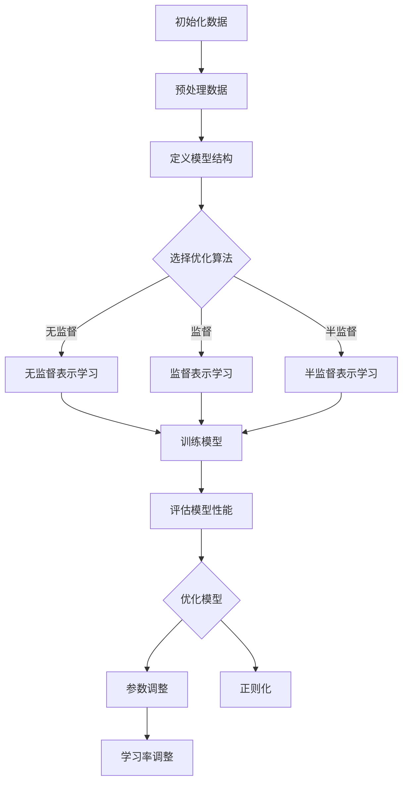

                 

### 文章标题

《解码表示的挑战》

### 关键词

数据表示、机器学习、深度学习、自然语言处理、计算机视觉、推荐系统

### 摘要

在数据驱动时代，表示（representation）作为数据处理的基石，承载着从数据中提取信息、构建模型、实现智能决策的关键作用。本文深入探讨表示在各个领域的应用及其面临的挑战。通过解析人类与机器的表示差异、数据表示的基本概念、表示学习的原理与方法，本文系统地阐述了表示在自然语言处理、计算机视觉和推荐系统中的应用。同时，探讨了表示的挑战及其未来趋势，为读者揭示了表示领域的前沿动态和潜在研究方向。

### 引言与背景

#### 1.1 引言

在信息时代的浪潮中，数据表示作为数据处理的核心环节，扮演着至关重要的角色。从简单的数据编码到复杂的模型表示，数据表示经历了从手工设计到自动化优化的演变。表示的质量直接影响到数据的利用效率和智能系统的性能。有效的表示方法不仅能够简化数据的复杂性，还能增强模型的泛化能力和鲁棒性。

本文旨在深入探讨表示在各个领域的应用及其面临的挑战。首先，我们将回顾人类和机器的表示演化过程，分析其异同。随后，我们将探讨数据表示的基本概念，包括数据类型的分类、表示的层次结构和数据预处理技术。接下来，我们将详细介绍表示学习的原理与方法，涵盖无监督、监督和半监督表示学习，以及各种表示学习算法。在此基础上，我们将探讨表示在实际应用中的表现，如自然语言处理、计算机视觉和推荐系统。最后，我们将讨论表示所面临的挑战及其未来发展趋势。

#### 1.2 表达与表示的重要性

表达与表示是信息传递和理解的基础。人类通过语言、文字、图像等多种形式进行表达，而机器则通过算法和模型进行表示。有效的表示能够提高信息处理的效率和准确性，是实现智能决策和自动化控制的关键。在自然语言处理中，表示方法决定了文本理解和生成的能力；在计算机视觉中，表示方法决定了图像识别和理解的精度；在推荐系统中，表示方法决定了用户和商品的匹配度。

表示的重要性不仅体现在其对于数据处理的影响，还体现在其对计算资源的节省和模型性能的提升。通过有效的表示，我们可以将复杂的高维度数据映射到低维空间，从而简化计算过程，降低计算复杂度。此外，表示方法还能够增强模型的泛化能力，使其在新的数据集上能够保持良好的性能。

然而，表示也面临着诸多挑战。数据的不确定性、分布的偏移以及隐私的保护等问题都对表示方法提出了更高的要求。为了应对这些挑战，研究者们不断探索新的表示方法和技术，以实现更加高效、准确和安全的表示。

#### 1.3 本书的目的与结构

本书的目的在于系统性地介绍表示在各个领域的应用及其面临的挑战。通过梳理表示的理论基础、方法和技术，本书旨在为读者提供全面、深入的理解。具体来说，本书的结构安排如下：

- **第一部分：引言与背景**：介绍表示的重要性和本文的研究目的，回顾人类与机器表示的演化过程，并阐述本书的结构。

- **第二部分：数据表示**：详细讨论数据表示的基本概念，包括数据类型的分类、表示的层次结构和数据预处理技术。

- **第三部分：表示学习**：介绍表示学习的原理与方法，涵盖无监督、监督和半监督表示学习，以及各种表示学习算法。

- **第四部分：表示的应用**：探讨表示在自然语言处理、计算机视觉和推荐系统中的应用，包括词表示、句子表示、文本生成与分类、图像表示、视频表示、3D表示和推荐算法。

- **第五部分：表示的挑战与未来趋势**：分析表示面临的挑战，如数据隐私保护、泛化能力和鲁棒性，以及表示的跨模态融合、自动化与智能化和边缘计算中的应用。

通过上述结构，本书旨在为读者提供一个全面、系统的表示知识体系，帮助读者深入理解表示的核心概念、方法和技术，为未来的研究与实践提供参考。

#### 1.4 表示的理论基础

表示的理论基础涵盖了人类表示和机器表示的演化过程，以及它们之间的异同。人类表示经历了语言、文字、图像等多个阶段，而机器表示则从简单的数据编码发展到复杂的深度学习模型。

##### 1.4.1 人类表示的演进

人类表示的演进可以追溯到语言的出现。语言作为一种高效的通信工具，使得人类能够传递复杂的信息和知识。从简单的声音信号到复杂的语法结构，语言表示经历了漫长的演化过程。文字的发明进一步推动了人类表示的进步，使得信息可以以持久的形式记录和传播。此外，图像和符号的引入使得人类能够以直观的方式表达抽象概念和情感。

在认知科学领域，研究表明人类大脑具有高度的抽象能力和模式识别能力。大脑通过神经元之间的连接和交互，形成复杂的神经网络，实现对信息的处理和表示。这种表示方式不仅涉及语言和图像，还包括空间、时间、情感等多个维度。

##### 1.4.2 机器表示的演进

机器表示的演进与计算技术的发展密切相关。从早期的机械计算器到现代的深度学习模型，机器表示经历了多次重要的变革。早期的机器表示主要依赖于规则和逻辑，例如逻辑门和决策树。这些方法在处理结构化数据时具有一定的优势，但在面对复杂、非结构化数据时显得力不从心。

随着计算能力的提升和算法的进步，机器表示逐渐从规则驱动转向数据驱动。向量空间模型（Vector Space Model，VSM）的出现标志着机器表示的第一次重大突破。VSM将文本转换为向量表示，使得文本处理变得更加直观和高效。随后，词嵌入（Word Embedding）技术的引入进一步提升了机器表示的能力，使得机器能够理解和生成复杂的文本。

深度学习（Deep Learning）的兴起为机器表示带来了新的契机。通过多层神经网络，深度学习模型能够自动学习数据中的层次结构，从而实现高维数据的降维和压缩。例如，卷积神经网络（Convolutional Neural Network，CNN）在计算机视觉中的应用，使得图像处理变得异常高效和准确。此外，循环神经网络（Recurrent Neural Network，RNN）和Transformer模型在自然语言处理中的广泛应用，也展示了深度学习在表示领域的巨大潜力。

##### 1.4.3 人类与机器表示的差异

尽管人类和机器表示在形式上有一定的相似性，但它们在本质上有显著差异。首先，人类表示具有较高的抽象层次和灵活性。人类能够通过丰富的经验和知识进行跨领域的推理和创造性思考，而机器表示则主要依赖于数据和算法，缺乏这种灵活性和创造性。

其次，人类表示具有较强的情境意识和情感认知能力。语言和图像的表示不仅传递信息，还承载着情感和情境，这使得人类能够进行更加丰富和复杂的交流。相比之下，机器表示在情感和情境上的表达相对有限，主要依赖于算法和数据的输入。

最后，人类和机器表示在计算效率和资源利用上存在差异。人类能够高效地处理复杂的信息，并在有限的时间内做出决策。而机器表示则需要大量的计算资源和时间来训练和推理，尤其是在处理高维度和大规模数据时。

尽管存在上述差异，人类和机器表示之间也存在互补关系。通过结合人类和机器表示的优势，我们可以构建更加智能和高效的系统。例如，在自然语言处理中，通过将深度学习模型与人类语言知识相结合，可以显著提升文本理解和生成的能力。在计算机视觉中，通过结合图像处理算法和人类视觉认知，可以实现更加准确和高效的图像分析。

总之，表示的理论基础涵盖了人类和机器表示的演化过程、异同点及其在各个领域的应用。通过深入理解表示的理论基础，我们可以更好地设计和优化表示方法，推动人工智能技术的发展和应用。

#### 1.5 表示的理论基础

表示的理论基础涵盖了数据表示的基本概念、数据表示的数学模型以及特征提取与降维技术。这些理论构成了现代数据分析和机器学习的重要基石，为我们理解和处理复杂数据提供了强大的工具。

##### 2.1 数据表示的基本概念

数据表示是数据分析和机器学习中的核心概念，它指的是将数据以特定的形式组织起来，以便于处理和理解。数据表示的基本概念包括：

- **数据类型的分类**：根据数据的结构和特征，可以将数据分为结构化数据、半结构化数据和非结构化数据。结构化数据具有明确的格式和结构，如数据库表和电子表格；半结构化数据具有一定的结构，但缺乏严格的格式，如日志文件和XML数据；非结构化数据没有固定的结构，如文本、图像和视频。

- **数据表示的层次结构**：数据表示的层次结构分为低层次表示、中层次表示和高层次表示。低层次表示通常涉及原始数据的基本特征，如像素值和单词；中层次表示将低层次特征组合成更抽象的特征，如视觉区域和句子；高层次表示则进一步提取数据中的语义和概念，如对象和主题。

- **数据预处理**：数据预处理是数据表示的关键步骤，包括数据清洗、数据归一化和数据采样。数据清洗旨在去除噪声和异常值，提高数据的完整性；数据归一化通过缩放数据值，使得不同特征具有相似的范围，以便模型训练；数据采样通过随机选择部分数据，减少计算复杂度和提高训练效率。

##### 2.2 数据表示的数学模型

数学模型为数据表示提供了形式化的表达和操作工具。数据表示的数学模型可以分为离散表示、连续表示和分布式表示：

- **离散表示**：离散表示将数据表示为离散的符号或向量。常见的离散表示方法包括向量空间模型（Vector Space Model，VSM）和词嵌入（Word Embedding）。向量空间模型将文本数据转换为向量表示，使得文本数据可以在向量空间中进行计算和操作；词嵌入通过学习单词之间的相似性，将单词映射到高维向量空间中，从而实现文本数据的语义表示。

- **连续表示**：连续表示将数据表示为连续的数值或函数。常见的连续表示方法包括概率分布模型和函数表示。概率分布模型通过描述数据在不同状态下的概率分布，实现数据的不确定性表示；函数表示通过函数来描述数据之间的关系和特征，如图像的边缘检测和纹理分析。

- **分布式表示**：分布式表示通过将数据分布到多个节点或维度上，实现数据的分布式存储和处理。常见的分布式表示方法包括MapReduce模型和矩阵分解。MapReduce模型通过并行处理和分布式计算，提高数据处理的效率和可扩展性；矩阵分解通过分解高维矩阵为低维矩阵，实现数据的降维和压缩。

##### 2.3 特征提取与降维技术

特征提取与降维技术是数据表示中的重要环节，旨在从原始数据中提取有用的特征，并降低数据的维度，以提高模型的效率和性能。

- **特征提取的基本方法**：特征提取的基本方法包括统计方法、线性变换和非线性变换。统计方法通过计算数据的统计特性，如均值、方差和协方差，提取数据的主要特征；线性变换通过线性组合原始数据，生成新的特征表示；非线性变换通过非线性映射，提取数据中的复杂关系和模式。

- **降维技术**：降维技术通过减少数据维度，提高模型的训练速度和泛化能力。常见的降维技术包括主成分分析（PCA）、独立成分分析（ICA）和非线性降维。主成分分析通过保留数据的主要方差，实现数据的高效降维；独立成分分析通过分离数据中的独立源，提取数据中的主要信息；非线性降维通过非线性映射，提取数据中的复杂结构和关系。

- **特征选择与评价**：特征选择与评价是降维过程中的重要环节，旨在选择对模型性能有显著影响的特征，并评价特征的重要性。常见的特征选择方法包括过滤式特征选择、包裹式特征选择和嵌入式特征选择。过滤式特征选择通过评估所有特征的重要性，选择重要的特征；包裹式特征选择通过迭代搜索最优特征子集；嵌入式特征选择将特征选择与模型训练过程相结合，逐步筛选重要特征。

综上所述，表示的理论基础涵盖了数据表示的基本概念、数学模型和特征提取与降维技术。这些理论为我们理解和处理复杂数据提供了丰富的工具和方法，推动了数据分析和机器学习技术的发展。

### 2.1 数据表示的基本概念

#### 2.1.1 数据类型的分类

在数据表示中，数据类型的分类是理解数据特性和选择适当表示方法的基础。根据数据的不同结构和特征，数据类型可以分为结构化数据、半结构化数据和非结构化数据。

- **结构化数据**：结构化数据具有固定的格式和明确的字段定义，例如关系型数据库中的表格数据、电子表格和日志文件。结构化数据通常包含固定的列和行，每行代表一个数据实例，每列代表一个特征。这种数据的优点是易于存储、检索和计算，缺点是数据量通常较小，且数据之间缺乏自然的关系。常见的结构化数据类型包括整数、浮点数、字符串和布尔值。

- **半结构化数据**：半结构化数据具有部分固定的格式，但包含一定程度的灵活性。例如，XML和JSON格式的数据允许嵌套的结构，具有动态的字段和值。半结构化数据在存储和传输过程中更为灵活，但在处理和分析时需要额外的解析和处理。这种数据类型的优点是可以适应不同的数据模式，缺点是数据的解析和处理较为复杂。常见的半结构化数据类型包括XML、JSON、HTML和日志文件。

- **非结构化数据**：非结构化数据没有固定的格式和结构，数据之间缺乏明确的关联。例如，文本、图像、音频和视频数据都属于非结构化数据。非结构化数据的优点是数据量巨大，信息丰富，缺点是处理和分析难度较大。常见的非结构化数据类型包括文本、图像、音频、视频和网页。

在数据表示中，理解数据类型有助于选择合适的表示方法。例如，对于结构化数据，可以使用简单的向量表示；对于半结构化数据，可以使用树形结构或图结构表示；对于非结构化数据，需要采用复杂的方法，如词嵌入、图像特征提取和音频处理。

#### 2.1.2 数据表示的层次结构

数据表示的层次结构反映了数据从低层次到高层次的抽象过程，有助于从不同维度理解和处理数据。通常，数据表示的层次结构可以分为低层次表示、中层次表示和高层次表示。

- **低层次表示**：低层次表示涉及原始数据的基本特征和属性。在图像处理中，低层次表示可以是像素值；在自然语言处理中，低层次表示可以是单词或字符。低层次表示主要关注数据的底层特征，通常用于特征提取和初步分析。例如，图像中的像素值可以表示颜色信息，而自然语言中的字符可以表示单词的拼写。

- **中层次表示**：中层次表示将低层次特征组合成更抽象的特征，形成对数据的更高层次理解。在图像处理中，中层次表示可以是视觉区域或边缘特征；在自然语言处理中，中层次表示可以是句子或段落。中层次表示通常用于提取数据中的重要信息，如图像中的主要对象或文本中的主题。例如，通过边缘检测算法，可以从图像中提取边缘特征，这些特征能够帮助识别图像中的物体边界。

- **高层次表示**：高层次表示涉及数据的语义和概念，是数据表示的最高层次。在图像处理中，高层次表示可以是对象或场景；在自然语言处理中，高层次表示可以是语义或情感。高层次表示能够捕获数据的全局结构和语义信息，对于复杂的数据理解和任务，如图像分类和文本情感分析，具有关键作用。例如，通过卷积神经网络（CNN），可以从图像中识别出特定对象，这些对象在更高层次上具有明确的语义。

数据表示的层次结构不仅有助于简化数据处理的复杂性，还能提高模型的性能和泛化能力。通过逐步抽象和组合低层次特征，我们能够从不同层次理解和利用数据，实现从数据到知识的转化。

#### 2.1.3 数据预处理

数据预处理是数据表示中不可或缺的步骤，其目的是提高数据的质量和可用性，为后续的数据分析和机器学习模型训练打下坚实基础。数据预处理通常包括数据清洗、数据归一化和数据采样等步骤。

- **数据清洗**：数据清洗是数据预处理的第一步，主要任务是去除数据中的噪声和异常值。噪声通常来自数据采集、传输或存储过程中的误差，如缺失值、重复值和错误值。异常值是指与大多数数据样本显著不同的值，可能由于错误的数据录入或数据质量问题造成。数据清洗的方法包括填充缺失值、删除重复值和纠正错误值。例如，在处理医疗数据时，可以使用平均值或中位数填充缺失的数值，删除重复的患者记录，并纠正明显的错误诊断。

- **数据归一化**：数据归一化是通过缩放数据值，使得不同特征具有相似的范围，从而消除特征尺度差异对模型训练的影响。常见的归一化方法包括最小-最大缩放、平均值归一化和标准差缩放。最小-最大缩放将数据缩放到一个特定的范围，如[0, 1]或[-1, 1]，通过将数据减去最小值并除以最大值实现。平均值归一化通过减去平均值并除以标准差，将数据缩放到单位方差和零均值。标准差缩放与平均值归一化类似，但使用标准差缩放数据，使得每个特征的变异程度一致。例如，在处理商品交易数据时，可以将交易金额缩放到[0, 1]范围，通过除以最大交易金额实现。

- **数据采样**：数据采样是通过随机选择部分数据，减少计算复杂度和提高训练效率。常用的采样方法包括简单随机采样、有放回采样和无放回采样。简单随机采样从数据集中随机选择样本，每个样本有相同的概率被选中；有放回采样允许重复选择相同的样本，有助于保持样本的多样性；无放回采样不允许重复选择样本，有助于减少数据的重叠。例如，在训练深度学习模型时，可以使用随机采样从大规模数据集中选择训练样本，通过减少计算复杂度，提高模型的训练速度。

数据预处理不仅有助于提高数据的质量和可用性，还能减少模型训练的时间和资源消耗。通过有效的数据预处理，我们可以从数据中提取更有用的特征，构建更准确和泛化的机器学习模型。

### 2.2 数据表示的数学模型

在数据表示的数学模型中，离散表示、连续表示和分布式表示是三种基本类型，每种类型都有其独特的应用场景和数学基础。

#### 2.2.1 离散表示

离散表示将数据以离散的符号或向量形式表示，常用于文本、分类和序列数据。离散表示的核心思想是将数据转化为向量空间中的点，使得不同数据可以在同一空间中进行运算和比较。

- **向量空间模型（Vector Space Model，VSM）**：向量空间模型是最常见的离散表示方法之一，它将文本数据转换为向量表示。在VSM中，每个单词被视为一个特征，文档被视为这些特征的组合。具体来说，每个单词的权重（如词频、TF-IDF权重）对应向量的一个维度。通过这种方式，文档之间的相似度可以计算为向量之间的距离，如余弦相似度。VSM在文本分类和文本相似度计算中具有广泛应用。

  **伪代码**：
  ```
  function VSM(document):
      create empty vector
      for each word in document:
          if word is in dictionary:
              add word's weight as a dimension to the vector
      return vector
  ```

- **词嵌入（Word Embedding）**：词嵌入通过学习单词之间的相似性，将单词映射到高维向量空间中。词嵌入不仅可以捕捉单词的语义信息，还能实现单词的上下文感知表示。常见的词嵌入方法包括Word2Vec、GloVe和BERT。Word2Vec通过训练神经网络模型，将输入单词映射到输出向量；GloVe通过矩阵分解学习词向量；BERT通过预训练大量文本数据，实现上下文敏感的词向量表示。

  **伪代码**：
  ```
  function Word2Vec(sentences):
      train neural network on sentences
      for each sentence:
          convert sentence to indices
          pass indices through the neural network
          store output vectors for each word
      return word vectors
  ```

离散表示在自然语言处理中具有广泛应用，通过向量空间模型和词嵌入，我们可以有效地表示和处理文本数据，实现文本分类、情感分析、机器翻译等任务。

#### 2.2.2 连续表示

连续表示将数据以连续的数值或函数形式表示，常用于图像、语音和连续数据。连续表示能够捕捉数据中的动态变化和连续性，是数据分析和机器学习中的重要工具。

- **概率分布模型**：概率分布模型通过描述数据在不同状态下的概率分布，实现数据的不确定性表示。常见的概率分布模型包括高斯分布、贝塔分布和泊松分布。这些模型可以用于数据拟合、预测和不确定性评估。

  **数学公式**：
  $$
  P(X=x) = \frac{1}{Z} e^{-\frac{(x-\mu)^2}{2\sigma^2}}
  $$
  其中，$X$是随机变量，$\mu$是均值，$\sigma^2$是方差，$Z$是归一化常数。

- **函数表示**：函数表示通过函数来描述数据之间的关系和特征。常见的函数表示包括线性函数、多项式函数和三角函数。这些函数可以用于特征提取、数据拟合和预测。

  **数学公式**：
  $$
  f(x) = ax^2 + bx + c
  $$
  其中，$x$是输入，$a$、$b$和$c$是函数的参数。

连续表示在图像处理和语音识别中具有广泛应用，通过概率分布模型和函数表示，我们可以有效地处理图像和语音数据，实现图像分类、目标检测、语音识别等任务。

#### 2.2.3 分布式表示

分布式表示通过将数据分布到多个节点或维度上，实现数据的分布式存储和处理。分布式表示在处理大规模数据和高维数据时具有显著优势，是数据分析和机器学习中的重要工具。

- **MapReduce模型**：MapReduce模型是一种分布式数据处理框架，通过将数据处理任务分解为Map和Reduce两个步骤，实现数据的并行处理和分布式计算。Map步骤将数据映射为键值对，Reduce步骤对键值对进行聚合和计算。

  **伪代码**：
  ```
  function MapReduce(data):
      for each record in data:
          emit(key, value)
      for each (key, values) group:
          reduce(values)
  ```

- **矩阵分解**：矩阵分解通过分解高维矩阵为低维矩阵，实现数据的降维和压缩。常见的矩阵分解方法包括奇异值分解（SVD）和因子分解机（Factorization Machine）。矩阵分解可以用于降维、推荐系统和协同过滤。

  **数学公式**：
  $$
  X = U\Sigma V^T
  $$
  其中，$X$是原始矩阵，$U$、$\Sigma$和$V^T$是分解得到的低维矩阵。

分布式表示在大规模数据分析和机器学习领域具有广泛应用，通过MapReduce模型和矩阵分解，我们可以有效地处理大规模数据和高维数据，实现数据的高效存储和处理。

综上所述，离散表示、连续表示和分布式表示构成了数据表示的数学模型，每种表示方法都有其独特的应用场景和数学基础。通过深入理解和应用这些数学模型，我们可以有效地表示和处理复杂数据，实现数据分析和机器学习的目标。

### 2.3 特征提取与降维

特征提取与降维是数据表示中的关键步骤，旨在从原始数据中提取有用的特征，并降低数据的维度，以提高模型的效率和性能。这一过程不仅有助于数据预处理，还直接影响到模型的训练速度和泛化能力。

#### 2.3.1 特征提取的基本方法

特征提取的基本方法包括统计方法、线性变换和非线性变换。每种方法都有其独特的应用场景和数学基础。

- **统计方法**：统计方法通过计算数据的统计特性，如均值、方差和协方差，提取数据的主要特征。这种方法简单直观，适用于高维数据的初步特征提取。例如，通过计算协方差矩阵，可以识别数据中的相关性，从而提取重要的线性特征。

  **数学公式**：
  $$
  \text{Cov}(X, Y) = E[(X - \mu_X)(Y - \mu_Y)]
  $$
  其中，$X$和$Y$是随机变量，$\mu_X$和$\mu_Y$是它们的均值。

- **线性变换**：线性变换通过线性组合原始数据，生成新的特征表示。常见的线性变换方法包括主成分分析（PCA）和线性判别分析（LDA）。PCA通过保留数据的主要方差，实现数据的高效降维；LDA通过最大化类间方差和最小化类内方差，实现数据的分类。

  **数学公式**：
  $$
  \text{PCA}: X' = A^TX
  $$
  其中，$X$是原始数据矩阵，$A$是变换矩阵，$X'$是降维后的数据矩阵。

- **非线性变换**：非线性变换通过非线性映射，提取数据中的复杂关系和模式。常见的非线性变换方法包括核主成分分析（KPCA）和多层感知机（MLP）。KPCA通过引入核函数，扩展PCA到非线性特征提取；MLP通过多层神经网络，实现复杂的非线性变换。

  **数学公式**：
  $$
  \text{KPCA}: X' = \Phi^TX
  $$
  其中，$X$是原始数据矩阵，$\Phi$是核函数映射矩阵，$X'$是降维后的数据矩阵。

#### 2.3.2 降维技术

降维技术通过减少数据维度，提高模型的效率和性能。常见的降维技术包括主成分分析（PCA）、独立成分分析（ICA）和非线性降维。

- **主成分分析（PCA）**：PCA通过保留数据的主要方差，实现数据的高效降维。PCA的主要步骤包括计算协方差矩阵、求解特征值和特征向量、构造投影矩阵。降维后的数据可以显著减少计算复杂度，同时保留数据的本质特征。

  **数学公式**：
  $$
  \text{PCA}: X' = A^TX
  $$
  其中，$X$是原始数据矩阵，$A$是投影矩阵，$X'$是降维后的数据矩阵。

- **独立成分分析（ICA）**：ICA通过分离数据中的独立源，提取数据中的主要信息。ICA利用统计学中的非高斯性和独立性原理，实现数据的非线性降维。ICA的主要步骤包括初始化混合矩阵、迭代更新估计矩阵、优化独立源。

  **数学公式**：
  $$
  s = A x
  $$
  其中，$s$是独立源，$x$是原始数据，$A$是混合矩阵。

- **非线性降维**：非线性降维通过非线性映射，提取数据中的复杂结构和关系。常见的非线性降维方法包括局部线性嵌入（LLE）和非线性判别分析（NDA）。LLE通过局部线性逼近，保留数据中的局部结构；NDA通过最大化类间方差和最小化类内方差，实现非线性特征提取。

  **数学公式**：
  $$
  \text{LLE}: \phi(x) \approx \sum_{i=1}^{k} w_{ij} (x_j - x)
  $$
  其中，$x$是原始数据点，$\phi(x)$是降维后的数据点，$w_{ij}$是权重矩阵。

#### 2.3.3 特征选择与评价

特征选择与评价是降维过程中的重要环节，旨在选择对模型性能有显著影响的特征，并评价特征的重要性。常见的特征选择方法包括过滤式特征选择、包裹式特征选择和嵌入式特征选择。

- **过滤式特征选择**：过滤式特征选择通过评估所有特征的重要性，选择重要的特征。这种方法独立于模型，适用于特征数量较多的情况。常见的评估指标包括信息增益、信息增益率、卡方检验和互信息。信息增益评估特征对分类的重要性，信息增益率考虑特征选择后信息量的变化，卡方检验评估特征与分类标签的线性关系，互信息评估特征与分类标签的相关性。

  **数学公式**：
  $$
  \text{IG}(A, C) = \sum_{v\in A} P(v) \log_2 \frac{P(v, C)}{P(v)P(C)}
  $$
  其中，$A$是特征集合，$C$是分类标签，$v$是特征值。

- **包裹式特征选择**：包裹式特征选择通过迭代搜索最优特征子集，选择最优的特征组合。这种方法综合考虑特征之间的关系和模型的性能，适用于特征数量较少的情况。常见的搜索算法包括贪心算法、遗传算法和粒子群优化。这些算法通过逐步增加或删除特征，找到最佳的特征子集。

- **嵌入式特征选择**：嵌入式特征选择将特征选择与模型训练过程相结合，逐步筛选重要特征。这种方法在训练过程中动态调整特征，适用于特征数量较多且特征之间存在复杂关系的情况。常见的嵌入式特征选择方法包括LASSO、随机森林和树模型。LASSO通过在回归模型中添加L1正则化，实现特征的稀疏化；随机森林通过集成多个决策树，评估特征的重要性；树模型通过节点分裂和特征选择，实现特征的重要性评估。

特征选择与评价不仅有助于提高模型的性能，还能减少模型的计算复杂度和数据存储需求。通过有效的特征选择，我们可以从数据中提取最有用的特征，实现数据的高效利用和模型的优化。

### 3.1 表示学习的原理与方法

表示学习（Representation Learning）是机器学习和人工智能领域的核心概念，其目标是自动发现数据的内在结构，将原始数据映射到更简洁、更易于处理的表示形式。表示学习不仅能够提升模型的性能和效率，还能提高数据理解和解释的能力。本文将详细探讨表示学习的原理与方法，包括无监督表示学习、监督表示学习和半监督表示学习。

#### 3.1.1 无监督表示学习

无监督表示学习（Unsupervised Representation Learning）是在没有标签数据的情况下，通过学习数据内在的结构和模式，生成低维表示的方法。无监督表示学习的主要目标是发现数据中的隐含结构，例如聚类、降维和特征提取。

- **自编码器（Autoencoder）**：自编码器是一种典型的无监督表示学习模型，它由编码器（Encoder）和解码器（Decoder）两部分组成。编码器将高维输入数据映射到低维隐含表示，解码器再将隐含表示映射回高维输出。自编码器通过最小化重构误差来训练模型，从而学习数据的有效表示。

  **伪代码**：
  ```
  function Autoencoder(input_data):
      hidden_representation = Encoder(input_data)
      reconstructed_output = Decoder(hidden_representation)
      loss = CalculateLoss(input_data, reconstructed_output)
      UpdateModelParameters(loss)
  ```

- **对抗生成网络（Generative Adversarial Network，GAN）**：GAN是一种通过生成模型和判别模型相互对抗来生成数据的方法。生成模型（Generator）尝试生成与真实数据相似的数据，判别模型（Discriminator）则尝试区分生成数据和真实数据。通过不断训练，生成模型能够生成越来越真实的数据，从而学习到数据的分布。

  **伪代码**：
  ```
  function GAN(real_data, generator, discriminator):
      for each epoch:
          Generate synthetic_data = generator(Z)
          Calculate discriminator_loss = Discriminator(real_data, synthetic_data)
          Calculate generator_loss = -Discriminator(synthetic_data)
          Update generator and discriminator parameters
  ```

无监督表示学习在降维、数据去噪和生成新数据等方面具有广泛应用，如降维技术中的主成分分析（PCA）和自编码器（Autoencoder），以及生成对抗网络（GAN）在图像生成和风格迁移中的应用。

#### 3.1.2 监督表示学习

监督表示学习（Supervised Representation Learning）是在有标签数据的情况下，通过学习数据与标签之间的映射关系，生成低维表示的方法。监督表示学习通过优化模型在标签数据上的性能，从而学习到对标签有预测能力的表示。

- **标签传播（Label Propagation）**：标签传播是一种基于图论的监督表示学习方法，它通过传播节点标签来学习表示。在标签传播中，每个节点被赋予一个标签概率，通过迭代更新每个节点的标签概率，最终得到稳定的标签分布。

  **伪代码**：
  ```
  function LabelPropagation(adjacency_matrix, labels):
      Initialize node probabilities
      for each node in adjacency_matrix:
          Update node probability based on neighbors' labels
      until convergence
      return node labels
  ```

- **类别敏感嵌入（Categorical Embedding）**：类别敏感嵌入通过学习类别标签与低维向量之间的映射关系，来实现对数据的分类表示。类别敏感嵌入将类别标签映射到向量空间中，使得相同类别的向量距离较近，不同类别的向量距离较远。

  **伪代码**：
  ```
  function CategoricalEmbedding(labels):
      Initialize embedding matrix
      for each label in labels:
          Map label to a unique vector in the embedding space
      return embedding matrix
  ```

监督表示学习在分类、回归和聚类任务中具有广泛应用，如词嵌入（Word Embedding）在文本分类中的应用，以及深度神经网络（Deep Neural Network）在图像分类和语音识别中的应用。

#### 3.1.3 半监督表示学习

半监督表示学习（Semi-Supervised Representation Learning）是在有少量标签数据和大量无标签数据的情况下，通过学习数据内在结构和标签之间的关系，生成低维表示的方法。半监督表示学习旨在利用无标签数据的丰富性，提高模型的泛化能力和效率。

- **自适应标签传播（Adaptive Label Propagation）**：自适应标签传播通过结合有标签数据和大规模无标签数据，动态调整标签传播的过程，实现更准确和鲁棒的表示学习。自适应标签传播通过学习数据与标签之间的相似性，逐步调整每个节点的标签概率，从而提高表示的准确性和泛化能力。

  **伪代码**：
  ```
  function AdaptiveLabelPropagation(labeled_data, unlabeled_data):
      Initialize node probabilities
      for each epoch:
          Propagate labels from labeled nodes to unlabeled nodes
          Update node probabilities based on the propagated labels
      until convergence
      return node labels
  ```

- **半监督生成模型（Semi-Supervised Generative Model）**：半监督生成模型通过结合生成模型和监督模型，学习数据的高质量表示。半监督生成模型利用生成模型学习数据的分布，通过最小化生成模型与监督模型的预测误差，实现数据的表示学习。这种模型在少量标签数据下能够生成高质量的表示，从而提高模型的泛化能力和鲁棒性。

  **伪代码**：
  ```
  function SemiSupervisedGenerativeModel(labeled_data, unlabeled_data, generator, supervisor):
      for each epoch:
          Train generator to match the data distribution
          Train supervisor on labeled data
          Minimize the discrepancy between generator and supervisor predictions
      return representation of unlabeled data
  ```

半监督表示学习在数据标注成本高昂的领域，如医学图像分析和自然语言处理，具有显著的应用价值。通过利用大量无标签数据，半监督表示学习能够显著提高模型的性能和效率。

综上所述，表示学习的原理与方法涵盖了无监督表示学习、监督表示学习和半监督表示学习。这些方法通过自动发现数据内在的结构和模式，为数据的预处理、模型训练和性能优化提供了强有力的支持。通过深入理解这些方法，我们可以设计出更加高效和鲁棒的机器学习模型，推动人工智能技术的发展和应用。

### 3.2 表示学习算法

表示学习算法是机器学习领域中的重要分支，旨在通过学习数据的高层次表示来提升模型的性能。本文将详细讨论表示学习算法，包括基于神经网络的表示学习、基于图论的表示学习以及基于深度学习的表示学习。

#### 3.2.1 基于神经网络的表示学习

基于神经网络的表示学习是通过神经网络模型自动学习数据的高层次表示。神经网络由多层神经元组成，通过前向传播和反向传播机制，从数据中提取有意义的特征。

- **前馈神经网络（Feedforward Neural Network）**：前馈神经网络是最简单的神经网络结构，数据从输入层经过隐藏层，最终到达输出层。前馈神经网络通过权重矩阵和激活函数，将输入映射到输出。前馈神经网络可以用于特征提取和分类任务。

  **伪代码**：
  ```
  function FeedforwardNeuralNetwork(input, weights, activation_function):
      hidden_layers = []
      for layer in hidden_layers:
          z = dot_product(input, weights)
          output = activation_function(z)
          input = output
      z = dot_product(output, weights)
      output = activation_function(z)
      return output
  ```

- **卷积神经网络（Convolutional Neural Network，CNN）**：卷积神经网络在图像处理领域具有广泛应用，通过卷积操作和池化操作，自动提取图像的特征。CNN通过多层卷积和池化层，从原始图像中提取局部特征，最终实现图像分类、目标检测和图像生成等任务。

  **伪代码**：
  ```
  function ConvolutionalNeuralNetwork(input, filters, kernel_size, activation_function):
      for filter in filters:
          conv_output = Conv2D(input, filter, kernel_size)
          pool_output = MaxPooling(conv_output)
          if activation_function:
              pool_output = activation_function(pool_output)
      flattened_output = Flatten(pool_output)
      return flattened_output
  ```

- **循环神经网络（Recurrent Neural Network，RNN）**：循环神经网络在序列数据处理中具有广泛应用，通过循环结构，RNN能够记住序列中的长期依赖关系。RNN通过隐藏状态和递归函数，将输入序列映射到输出序列。长短期记忆网络（Long Short-Term Memory，LSTM）和门控循环单元（Gated Recurrent Unit，GRU）是RNN的两种变体，通过引入门控机制，有效解决了RNN的梯度消失问题。

  **伪代码**：
  ```
  function RNN(input_sequence, weights, activation_function):
      hidden_state = [initial_state]
      for input in input_sequence:
          h_t = dot_product(input, weights)
          if activation_function:
              h_t = activation_function(h_t)
          hidden_state.append(h_t)
      return hidden_state
  ```

基于神经网络的表示学习在图像处理、自然语言处理和序列数据分析等领域具有广泛应用。通过前馈神经网络、卷积神经网络和循环神经网络，我们可以从数据中提取有意义的特征，构建高效和准确的模型。

#### 3.2.2 基于图论的表示学习

基于图论的表示学习通过图结构来表示数据，利用图算法进行特征提取和表示学习。图结构能够捕捉数据之间的复杂关系，特别适用于社交网络、生物信息学和知识图谱等领域。

- **图卷积网络（Graph Convolutional Network，GCN）**：图卷积网络通过图卷积操作，将节点的特征更新为邻接节点的特征加权平均。GCN能够捕获节点之间的依赖关系，实现图数据的表示学习。GCN在节点分类、图分类和图生成等任务中具有广泛应用。

  **伪代码**：
  ```
  function GraphConvolutionalNetwork(input_features, A, W):
      for layer in range(num_layers):
          h = input_features
          for neighbor in neighbors(h):
              h = h + dot_product(A[neighbor], W[neighbor])
          h = activation_function(h)
      return h
  ```

- **图注意力网络（Graph Attention Network，GAT）**：图注意力网络通过引入注意力机制，对邻接节点的特征进行加权，实现图数据的表示学习。GAT能够根据节点的邻接关系，动态调整邻接节点的重要性，提高图数据的表示质量。GAT在知识图谱嵌入、推荐系统和社交网络分析等领域具有广泛应用。

  **伪代码**：
  ```
  function GraphAttentionNetwork(input_features, A, W, a):
      for layer in range(num_layers):
          h = input_features
          for neighbor in neighbors(h):
              attention = dot_product(W[a], h, W[a])
              h = h + attention * dot_product(A[neighbor], W[neighbor])
          h = activation_function(h)
      return h
  ```

基于图论的表示学习能够有效地处理图结构数据，通过图卷积网络和图注意力网络，我们可以从复杂的关系网络中提取有意义的特征，构建高效的图表示模型。

#### 3.2.3 基于深度学习的表示学习

基于深度学习的表示学习通过多层神经网络，自动学习数据的高层次表示。深度学习模型具有强大的表达能力和自适应能力，能够在多种任务中取得优异的性能。

- **预训练与微调（Pre-training and Fine-tuning）**：预训练与微调是深度学习模型训练的重要策略。预训练通过在大规模无标签数据上训练模型，使模型获得通用特征表示。微调则是在预训练的基础上，在特定任务上调整模型参数，实现任务的特定化。预训练与微调能够提高模型在新数据集上的性能，减少训练数据的需求。

  **伪代码**：
  ```
  function PretrainFineTune(model, unlabeled_data, labeled_data):
      Train model on unlabeled_data
      for epoch in labeled_data:
          Adjust model parameters based on labeled_data
      return fine-tuned model
  ```

- **自适应学习率（Adaptive Learning Rate）**：自适应学习率通过动态调整模型参数的学习率，优化模型训练过程。常见的自适应学习率方法包括AdaGrad、RMSprop和Adam。这些方法通过记录参数的历史梯度，自适应调整学习率，提高模型训练的效率和稳定性。

  **伪代码**：
  ```
  function AdaptiveLearningRate(parameters, gradients, learning_rate):
      Update learning_rate based on gradients
      for parameter in parameters:
          parameter = parameter - learning_rate * gradient
      return updated parameters
  ```

基于深度学习的表示学习通过预训练与微调、自适应学习率等策略，能够自动学习数据的高层次表示，并在多种任务中取得优异的性能。通过深度学习模型，我们可以从复杂数据中提取有意义的特征，构建高效和智能的模型。

### 3.3 表示学习的评估与优化

表示学习算法的性能评估和优化是确保其有效性的关键步骤。评估表示性能的指标和优化方法对于提升模型质量和应用效果至关重要。本文将讨论表示学习的评估指标、优化方法和相关策略。

#### 3.3.1 表示性能的评估指标

表示学习的评估指标用于衡量表示质量，常见的评估指标包括重构误差、类别精度、互信息等。

- **重构误差（Reconstruction Error）**：重构误差是衡量表示学习模型重构原始数据能力的指标。在自编码器等模型中，重构误差通常通过计算重构数据与原始数据之间的差异来评估。重构误差越小，表示质量越高。

  **数学公式**：
  $$
  \text{Reconstruction Error} = \frac{1}{N} \sum_{i=1}^{N} \| x_i - \hat{x}_i \|_2
  $$
  其中，$x_i$是原始数据，$\hat{x}_i$是重构数据，$N$是数据样本数。

- **类别精度（Classification Accuracy）**：类别精度是用于评估表示学习模型在分类任务中的性能。类别精度通过计算正确分类的样本数与总样本数的比例来评估。类别精度越高，表示模型在分类任务中的性能越好。

  **数学公式**：
  $$
  \text{Classification Accuracy} = \frac{\text{Number of Correct Predictions}}{\text{Total Number of Samples}}
  $$

- **互信息（Mutual Information）**：互信息是用于评估两个变量之间相关性的指标。在表示学习中，互信息用于衡量表示质量，表示模型能够捕捉多少原始数据的熵信息。互信息越大，表示模型对数据的表示质量越高。

  **数学公式**：
  $$
  I(X; Y) = \sum_{x,y} p(x, y) \log \frac{p(x, y)}{p(x) p(y)}
  $$
  其中，$X$和$Y$是变量，$p(x, y)$是联合概率分布，$p(x)$和$p(y)$分别是边缘概率分布。

#### 3.3.2 表示学习的优化方法

优化方法是提升表示学习模型性能的重要手段，常见的优化方法包括优化算法、正则化技术和调参技巧。

- **优化算法**：优化算法用于调整模型参数，以最小化损失函数。常见的优化算法包括随机梯度下降（SGD）、Adam和RMSprop。这些算法通过不同的策略调整学习率，优化模型训练过程。优化算法的选择对模型性能有显著影响。

  **伪代码**：
  ```
  function OptimizeModel(parameters, gradients, learning_rate):
      for parameter in parameters:
          parameter = parameter - learning_rate * gradient
      return updated parameters
  ```

- **正则化技术**：正则化技术用于防止模型过拟合和提升泛化能力。常见的正则化技术包括L1正则化、L2正则化和Dropout。L1正则化通过在损失函数中添加L1范数惩罚，实现特征的稀疏化；L2正则化通过添加L2范数惩罚，减少参数的幅值；Dropout通过在训练过程中随机丢弃部分神经元，提高模型的泛化能力。

  **伪代码**：
  ```
  function RegularizeModel(parameters, regularization_strength):
      for parameter in parameters:
          regularization = regularization_strength * \| parameter \|^2
          loss = loss + regularization
      return updated loss
  ```

- **调参技巧**：调参技巧是通过调整模型参数，优化模型性能的方法。常见的调参技巧包括网格搜索、随机搜索和贝叶斯优化。调参技巧能够帮助找到最优的模型参数，提高模型性能。

  **伪代码**：
  ```
  function HyperparameterTuning(parameters, validation_set):
      for parameter in parameters:
          Train model with the current parameter setting
          Evaluate model performance on the validation set
          Save the best parameter setting
      return best_parameters
  ```

#### 3.3.3 相关策略

除了优化方法和评估指标，表示学习还涉及到一些相关策略，如数据预处理、模型集成和模型融合。

- **数据预处理**：数据预处理是提升表示学习性能的重要步骤，包括数据清洗、归一化和数据增强等。数据预处理能够提高数据质量，减少噪声对模型训练的影响。

  **伪代码**：
  ```
  function DataPreprocessing(data):
      Clean data
      Normalize data
      Apply data augmentation
      return processed_data
  ```

- **模型集成**：模型集成通过结合多个模型的预测结果，提高模型的整体性能。常见的模型集成方法包括投票法、堆叠法和集成学习。模型集成能够降低模型的方差，提高模型的稳定性和泛化能力。

  **伪代码**：
  ```
  function ModelEnsemble(models, predictions):
      Combine predictions from all models
      Aggregate predictions to generate final prediction
      return final_prediction
  ```

- **模型融合**：模型融合通过将不同类型的模型或不同层级的模型结合起来，实现更复杂的表示学习。模型融合能够充分利用不同模型的优点，提高模型在复杂任务中的性能。

  **伪代码**：
  ```
  function ModelFusion(model_A, model_B, fusion_strategy):
      Combine representations from model_A and model_B
      Apply fusion_strategy to generate final representation
      return final_representation
  ```

表示学习的评估与优化是一个复杂的过程，涉及多个方面。通过合理的评估指标、优化方法和相关策略，我们可以有效地提升表示学习模型的性能，为实际应用提供更高效、更准确的解决方案。

### 4.1 表示在自然语言处理中的应用

表示在自然语言处理（Natural Language Processing，NLP）中扮演着至关重要的角色，其核心目标是将文本数据转换为机器可处理的数字表示，从而实现文本理解、生成和分类等任务。在这一部分，我们将探讨表示在NLP中的具体应用，包括词表示、句子表示、文本生成与分类，并分析其技术实现和实际案例。

#### 4.1.1 词表示

词表示（Word Representation）是将单词映射到高维向量空间的过程，使得单词可以在向量空间中进行计算和操作。词表示在NLP中具有广泛的应用，如文本分类、情感分析、机器翻译和文本生成等。常见的词表示方法包括词袋模型（Bag of Words，BOW）和词嵌入（Word Embedding）。

- **词袋模型（Bag of Words，BOW）**：词袋模型是一种基于计数的文本表示方法，将文本表示为单词的集合，不考虑单词的顺序。词袋模型通过统计每个单词在文本中的出现次数，生成一个向量表示。词袋模型的优点是简单直观，缺点是忽略了单词的语义信息和顺序关系。

  **数学公式**：
  $$
  \text{BOW}(document) = \{ (word_i, count_i) \}_{i=1}^{N}
  $$
  其中，$document$是文本，$word_i$是单词，$count_i$是单词在文本中的出现次数。

- **词嵌入（Word Embedding）**：词嵌入通过学习单词之间的相似性，将单词映射到高维向量空间中。词嵌入能够捕捉单词的语义信息，使得具有相似语义的单词在向量空间中距离较近。常见的词嵌入方法包括Word2Vec、GloVe和BERT。

  **数学公式**：
  $$
  \text{Word2Vec}: \text{Embedding}(word) = \text{SGD}\left( \sum_{context \text{ words}} \text{softmax}(W_c) \right)
  $$
  其中，$context \text{ words}$是单词的上下文，$W_c$是权重矩阵。

词嵌入在NLP中具有广泛应用，如文本分类、情感分析和机器翻译。通过词嵌入，我们可以更好地理解文本的语义，提高NLP任务的性能。

#### 4.1.2 句子表示

句子表示（Sentence Representation）是将句子映射到高维向量空间的过程，使得句子可以在向量空间中进行计算和操作。句子表示在NLP中具有广泛的应用，如文本分类、情感分析和机器翻译。常见的句子表示方法包括递归神经网络（Recurrent Neural Network，RNN）和Transformer模型。

- **递归神经网络（Recurrent Neural Network，RNN）**：递归神经网络是一种基于序列数据的神经网络，通过递归结构，能够处理序列数据中的长期依赖关系。RNN通过隐藏状态和递归函数，将输入序列映射到输出序列。RNN在文本分类、情感分析和机器翻译等领域具有广泛应用。

  **数学公式**：
  $$
  h_t = \text{RNN}(h_{t-1}, x_t)
  $$
  其中，$h_t$是隐藏状态，$x_t$是输入序列。

- **Transformer模型**：Transformer模型是一种基于注意力机制的神经网络，通过多头注意力机制，能够处理序列数据中的长距离依赖关系。Transformer模型在自然语言处理领域取得了显著的成果，如机器翻译、文本生成和文本分类。Transformer模型通过编码器和解码器两个部分，实现句子的编码和解码。

  **数学公式**：
  $$
  \text{Attention}(Q, K, V) = \text{softmax}\left(\frac{QK^T}{\sqrt{d_k}}\right)V
  $$
  其中，$Q$、$K$和$V$分别是查询向量、键向量和值向量，$d_k$是键向量的维度。

句子表示在NLP中具有广泛应用，通过递归神经网络和Transformer模型，我们可以更好地理解句子的语义，提高NLP任务的性能。

#### 4.1.3 文本生成与分类

文本生成与分类是NLP中的两个重要任务，其核心目标分别是生成新的文本和分类给定的文本。表示在文本生成与分类中扮演着关键角色，通过有效的表示方法，我们可以实现高质量的文本生成和分类。

- **文本生成**：文本生成是通过学习数据中的语言模式，生成新的文本。常见的文本生成方法包括序列生成模型（如RNN、GAN）和生成式对抗网络（Generative Adversarial Network，GAN）。序列生成模型通过递归结构，生成具有连贯性的文本；GAN通过生成模型和判别模型的对抗训练，生成高质量的文本。

  **伪代码**：
  ```
  function TextGeneration(model, start_word, end_word, sequence_length):
      Initialize hidden_state
      for each word in sequence_length:
          Generate word using model
          Update hidden_state
      return generated_text
  ```

- **文本分类**：文本分类是通过学习数据中的标签分布，对给定的文本进行分类。常见的文本分类方法包括朴素贝叶斯、支持向量机（Support Vector Machine，SVM）和深度学习模型（如CNN、RNN、Transformer）。文本分类在情感分析、主题分类和垃圾邮件检测等领域具有广泛应用。

  **伪代码**：
  ```
  function TextClassification(model, text, labels):
      Preprocess text
      Generate feature representation
      Predict category using model
      return predicted_category
  ```

文本生成与分类在NLP中具有广泛应用，通过有效的表示方法，我们可以实现高质量的文本生成和分类，为实际应用提供强大的支持。

#### 4.1.4 技术实现与实际案例

词表示、句子表示和文本生成与分类在NLP中具有广泛应用，以下将介绍几种常见的技术实现和实际案例。

- **词表示**：Word2Vec和GloVe是两种常见的词嵌入方法。Word2Vec通过训练神经网络模型，将输入单词映射到输出向量；GloVe通过矩阵分解学习词向量。在实际应用中，词嵌入方法在文本分类和情感分析中取得了显著的效果。例如，在文本分类任务中，通过使用GloVe词向量，可以显著提高分类器的性能。

  **案例**：使用GloVe进行文本分类
  ```
  import nltk
  from gensim.models import KeyedVectors

  # Load pre-trained GloVe embeddings
  glove_model = KeyedVectors.load_word2vec_format('glove.6B.100d.txt')

  # Preprocess text
  def preprocess_text(text):
      tokens = nltk.word_tokenize(text.lower())
      return [glove_model[token] for token in tokens if token in glove_model]

  # Train classifier
  from sklearn.linear_model import LogisticRegression
  classifier = LogisticRegression()
  classifier.fit(preprocessed_train_data, train_labels)

  # Test classifier
  test_predictions = classifier.predict(preprocessed_test_data)
  print("Accuracy:", accuracy_score(test_labels, test_predictions))
  ```

- **句子表示**：RNN和Transformer是两种常见的句子表示方法。RNN通过递归结构，处理序列数据中的长期依赖关系；Transformer通过多头注意力机制，处理序列数据中的长距离依赖关系。在实际应用中，RNN和Transformer在机器翻译、文本生成和情感分析中取得了显著的效果。例如，在机器翻译任务中，通过使用Transformer模型，可以显著提高翻译的准确性和流畅性。

  **案例**：使用Transformer进行机器翻译
  ```
  import tensorflow as tf
  from tensorflow import keras
  from tensorflow.keras.models import Model
  from tensorflow.keras.layers import Embedding, LSTM, Dense, TimeDistributed

  # Define Transformer model
  inputs = keras.Input(shape=(None,))
  x = Embedding(vocab_size, embedding_dim)(inputs)
  x = LSTM(units, return_sequences=True)(x)
  outputs = Dense(vocab_size, activation='softmax')(x)

  model = Model(inputs, outputs)
  model.compile(optimizer='adam', loss='categorical_crossentropy', metrics=['accuracy'])

  # Train model
  model.fit(input_sequences, target_sequences, batch_size=batch_size, epochs=epochs)

  # Translate text
  def translate(text, model, tokenizer):
      preprocessed_text = tokenizer.texts_to_sequences([text])
      preprocessed_text = pad_sequences(preprocessed_text, maxlen=max_length)
      predicted_sequence = model.predict(preprocessed_text)
      predicted_sequence = keras.preprocessing.sequence.pad_sequences(predicted_sequence, maxlen=max_length)
      predicted_text = tokenizer.sequences_to_texts(predicted_sequence)
      return predicted_text

  predicted_translation = translate("你好", model, tokenizer)
  print("Predicted Translation:", predicted_translation)
  ```

综上所述，表示在自然语言处理中的应用涵盖了词表示、句子表示、文本生成与分类等任务。通过有效的表示方法，我们可以实现高质量的文本处理和生成，为实际应用提供强大的支持。

### 4.2 表示在计算机视觉中的应用

表示在计算机视觉（Computer Vision，CV）领域中扮演着至关重要的角色，其核心目标是理解和解释图像和视频中的视觉信息。在这一部分，我们将探讨表示在计算机视觉中的具体应用，包括图像表示、视频表示和3D表示，并分析其技术实现和实际案例。

#### 4.2.1 图像表示

图像表示是将图像数据转换为机器可处理的数字表示的过程。有效的图像表示方法能够捕捉图像中的关键特征，从而实现图像识别、分类和分割等任务。常见的图像表示方法包括卷积神经网络（Convolutional Neural Network，CNN）和特征金字塔网络（Feature Pyramid Network，FPN）。

- **卷积神经网络（CNN）**：卷积神经网络在图像表示中具有广泛应用。CNN通过卷积操作、池化操作和全连接层，从原始图像中自动提取有意义的特征。CNN在图像分类、目标检测和图像分割等任务中取得了显著的成果。例如，在图像分类任务中，通过训练CNN模型，可以识别图像中的对象和场景。

  **数学公式**：
  $$
  \text{Convolution}: (f \star g)(x) = \sum_{i=1}^{N} f(i) g(x - i)
  $$
  其中，$f$是卷积核，$g$是图像，$x$是输入。

- **特征金字塔网络（FPN）**：特征金字塔网络通过多尺度特征融合，提高图像表示的鲁棒性和准确性。FPN将图像划分为多个尺度，将不同尺度的特征图进行融合，生成高层次的特征表示。FPN在目标检测和图像分割等任务中具有广泛应用，能够同时处理不同尺度的对象。

  **数学公式**：
  $$
  \text{Feature Fusion}: P = \text{upsample}(C_1) + C_2
  $$
  其中，$P$是融合后的特征图，$C_1$和$C_2$是不同尺度的特征图。

图像表示在计算机视觉中具有广泛应用，通过CNN和FPN等方法，我们可以有效地捕捉图像中的关键特征，实现图像分类、目标检测和图像分割等任务。

#### 4.2.2 视频表示

视频表示是将视频数据转换为机器可处理的数字表示的过程。有效的视频表示方法能够捕捉视频中的时间动态信息，从而实现视频分类、动作识别和视频生成等任务。常见的视频表示方法包括光流估计和视频编码模型。

- **光流估计（Optical Flow Estimation）**：光流估计是通过计算图像序列中像素点的运动轨迹，实现视频表示的方法。光流估计能够捕捉视频中的时间动态信息，从而提高视频分类和动作识别的准确性。光流估计在视频监控、人机交互和虚拟现实等领域具有广泛应用。

  **数学公式**：
  $$
  \mathbf{v} = \frac{\partial \mathbf{x}}{\partial t}
  $$
  其中，$\mathbf{v}$是光流向量，$\mathbf{x}$是像素点位置。

- **视频编码模型（Video Coding Model）**：视频编码模型是通过编码和解码过程，实现视频表示的方法。视频编码模型通过压缩视频数据，降低数据传输和存储的成本。常见的视频编码模型包括H.264和HEVC。视频编码模型在视频传输、视频分析和视频监控等领域具有广泛应用。

  **数学公式**：
  $$
  \text{Video Coding}: \text{Compress}(Video) \rightarrow \text{Decompress}(Compressed Video)
  $$

视频表示在计算机视觉中具有广泛应用，通过光流估计和视频编码模型等方法，我们可以有效地捕捉视频中的时间动态信息，实现视频分类、动作识别和视频生成等任务。

#### 4.2.3 3D表示

3D表示是将三维空间中的物体和场景转换为机器可处理的数字表示的过程。有效的3D表示方法能够捕捉三维空间中的几何结构和纹理信息，从而实现三维物体识别、三维重建和三维场景分析等任务。常见的3D表示方法包括点云处理和3D卷积神经网络（3D Convolutional Neural Network，3D CNN）。

- **点云处理（Point Cloud Processing）**：点云处理是通过处理点云数据，实现三维物体表示的方法。点云处理包括点云配准、点云分割和点云分类等任务。点云处理在机器人导航、无人驾驶和工业检测等领域具有广泛应用。

  **数学公式**：
  $$
  \mathbf{P} = \{(\mathbf{x}_i, \mathbf{y}_i) \}_{i=1}^{N}
  $$
  其中，$\mathbf{P}$是点云数据，$\mathbf{x}_i$是点云坐标，$\mathbf{y}_i$是点云标签。

- **3D卷积神经网络（3D CNN）**：3D卷积神经网络是通过卷积操作，实现三维物体表示的方法。3D CNN通过处理三维点云数据，自动提取三维物体的几何结构和纹理信息。3D CNN在三维物体识别、三维重建和三维场景分析等领域具有广泛应用。

  **数学公式**：
  $$
  \mathbf{h}_{t+1} = \text{ReLU}(\mathbf{W} \star \mathbf{h}_t + \mathbf{b})
  $$
  其中，$\mathbf{h}_t$是三维特征图，$\mathbf{W}$是卷积核，$\mathbf{b}$是偏置。

3D表示在计算机视觉中具有广泛应用，通过点云处理和3D CNN等方法，我们可以有效地捕捉三维空间中的几何结构和纹理信息，实现三维物体识别、三维重建和三维场景分析等任务。

#### 4.2.4 技术实现与实际案例

图像表示、视频表示和3D表示在计算机视觉中具有广泛应用，以下将介绍几种常见的技术实现和实际案例。

- **图像表示**：CNN和FPN是两种常见的图像表示方法。CNN通过卷积操作和池化操作，从原始图像中自动提取特征；FPN通过多尺度特征融合，提高图像表示的鲁棒性和准确性。在实际应用中，CNN和FPN在图像分类、目标检测和图像分割等任务中取得了显著的效果。

  **案例**：使用CNN进行图像分类
  ```
  import tensorflow as tf
  from tensorflow import keras
  from tensorflow.keras.models import Model
  from tensorflow.keras.layers import Conv2D, MaxPooling2D, Flatten, Dense

  # Define CNN model
  inputs = keras.Input(shape=(height, width, channels))
  x = Conv2D(filters, kernel_size)(inputs)
  x = MaxPooling2D(pool_size)(x)
  x = Flatten()(x)
  outputs = Dense(num_classes, activation='softmax')(x)

  model = Model(inputs, outputs)
  model.compile(optimizer='adam', loss='categorical_crossentropy', metrics=['accuracy'])

  # Train model
  model.fit(train_images, train_labels, batch_size=batch_size, epochs=epochs)

  # Test model
  test_loss, test_accuracy = model.evaluate(test_images, test_labels)
  print("Test Accuracy:", test_accuracy)
  ```

- **视频表示**：光流估计和视频编码模型是两种常见的视频表示方法。光流估计通过计算像素点的运动轨迹，捕捉视频中的时间动态信息；视频编码模型通过编码和解码过程，降低视频数据传输和存储的成本。在实际应用中，光流估计和视频编码模型在视频分类、动作识别和视频生成等任务中取得了显著的效果。

  **案例**：使用光流估计进行视频分类
  ```
  import cv2
  import numpy as np

  # Load pre-trained CNN model
  model = cv2.dnn.readNetFromTensorFlow('model.pbtxt', 'model.pb')

  # Define video capture
  cap = cv2.VideoCapture('video.mp4')

  # Process video frames
  while True:
      ret, frame = cap.read()
      if not ret:
          break

      # Estimate optical flow
      flow = cv2.calcOpticalFlowFarneback(prev_frame, frame, None, 0.5, 3, 15, 3, 5, 1.2, 0)

      # Preprocess flow
      flow = cv2.resize(flow, (height, width))
      flow = flow / 255.0

      # Pass flow through CNN model
      flow_tensor = tf.convert_to_tensor(flow.reshape(1, height, width, 2), dtype=tf.float32)
      predicted_class = model.getLayerNames()[model.getLayerIndex('softmax') - 1].output[0]
      predicted_class = model.predict(flow_tensor)[0]

      # Display predicted class
      cv2.putText(frame, 'Class: ' + str(predicted_class), (10, 30), cv2.FONT_HERSHEY_SIMPLEX, 1, (0, 0, 255), 2)

      # Update prev_frame
      prev_frame = frame

      # Show frame
      cv2.imshow('Video', frame)
      if cv2.waitKey(1) & 0xFF == ord('q'):
          break

  # Release video capture
  cap.release()
  cv2.destroyAllWindows()
  ```

- **3D表示**：点云处理和3D CNN是两种常见的3D表示方法。点云处理通过处理点云数据，实现三维物体表示；3D CNN通过卷积操作，从三维点云中自动提取特征。在实际应用中，点云处理和3D CNN在三维物体识别、三维重建和三维场景分析等任务中取得了显著的效果。

  **案例**：使用3D CNN进行三维物体识别
  ```
  import tensorflow as tf
  from tensorflow import keras
  from tensorflow.keras.models import Model
  from tensorflow.keras.layers import Conv3D, MaxPooling3D, Flatten, Dense

  # Define 3D CNN model
  inputs = keras.Input(shape=(height, width, depth, channels))
  x = Conv3D(filters, kernel_size)(inputs)
  x = MaxPooling3D(pool_size)(x)
  x = Flatten()(x)
  outputs = Dense(num_classes, activation='softmax')(x)

  model = Model(inputs, outputs)
  model.compile(optimizer='adam', loss='categorical_crossentropy', metrics=['accuracy'])

  # Train model
  model.fit(train_point_clouds, train_labels, batch_size=batch_size, epochs=epochs)

  # Test model
  test_loss, test_accuracy = model.evaluate(test_point_clouds, test_labels)
  print("Test Accuracy:", test_accuracy)
  ```

综上所述，表示在计算机视觉中的应用涵盖了图像表示、视频表示和3D表示等多个方面。通过有效的表示方法，我们可以实现图像分类、目标检测、视频分类、动作识别、三维物体识别和三维重建等任务。这些技术实现和实际案例展示了表示在计算机视觉中的广泛应用和强大能力。

### 4.3 表示在推荐系统中的应用

表示在推荐系统（Recommender System）中起着至关重要的作用，其核心目标是通过理解和建模用户与商品之间的交互关系，为用户提供个性化的推荐。在这部分内容中，我们将深入探讨表示在推荐系统中的应用，包括用户表示、商品表示和推荐算法。

#### 4.3.1 用户表示

用户表示是将用户行为数据、历史偏好和人口统计学特征等转化为机器可处理的数字表示。有效的用户表示方法能够捕捉用户的个性化特征，从而提高推荐系统的准确性。常见的用户表示方法包括用户行为分析、用户属性嵌入和基于模型的用户表示。

- **用户行为分析**：用户行为分析通过分析用户在系统中的交互行为，如浏览历史、购买记录和评价等，来构建用户表示。用户行为分析通常涉及时间序列模型和协同过滤算法，通过计算用户之间的相似度或偏好相似度来实现推荐。

  **数学公式**：
  $$
  \text{User Similarity} = \frac{\sum_{i \in \text{common items}} u_i v_i}{\sqrt{\sum_{i \in \text{user items}} u_i^2} \sqrt{\sum_{j \in \text{neighbor items}} v_j^2}}
  $$
  其中，$u_i$和$v_j$分别表示用户$u$和邻居用户$j$对项目$i$和$j$的评分。

- **用户属性嵌入**：用户属性嵌入通过学习用户属性（如年龄、性别、地理位置等）与用户行为之间的映射关系，将用户属性转化为低维向量表示。用户属性嵌入在处理高维度用户特征时特别有效，可以减少特征维度并提高计算效率。

  **数学公式**：
  $$
  \text{User Feature Embedding} = \text{Embedding}(user\_attributes, embedding\_dimension)
  $$

- **基于模型的用户表示**：基于模型的用户表示通过构建机器学习模型，如矩阵分解、深度学习等，自动学习用户的行为模式和偏好。这种方法能够更好地捕捉用户的长期和短期兴趣变化。

  **伪代码**：
  ```
  function UserRepresentationModel(data):
      Train user behavior model on historical user interactions
      for each user in data:
          Generate user representation based on model predictions
      return user representations
  ```

用户表示在推荐系统中至关重要，通过有效的用户表示方法，我们可以更好地理解和预测用户的偏好，从而提供更准确的个性化推荐。

#### 4.3.2 商品表示

商品表示是将商品特征和属性转化为机器可处理的数字表示。有效的商品表示方法能够捕捉商品的独特属性，从而提高推荐系统的性能。常见的商品表示方法包括商品特征提取、商品属性嵌入和基于模型的商品表示。

- **商品特征提取**：商品特征提取通过分析商品的各种属性（如价格、品牌、分类等），提取对用户有吸引力的特征。商品特征提取可以用于基于内容的推荐，通过计算用户和商品之间的特征相似度来实现推荐。

  **数学公式**：
  $$
  \text{Item Feature Similarity} = \frac{\sum_{f \in \text{common features}} f_i f_j}{\sqrt{\sum_{f \in \text{user features}} f_i^2} \sqrt{\sum_{f \in \text{item features}} f_j^2}}
  $$

- **商品属性嵌入**：商品属性嵌入通过学习商品属性（如分类、标签、描述等）与商品行为之间的映射关系，将商品属性转化为低维向量表示。商品属性嵌入可以用于基于模型的推荐算法，如协同过滤和深度学习。

  **数学公式**：
  $$
  \text{Item Feature Embedding} = \text{Embedding}(item\_attributes, embedding\_dimension)
  $$

- **基于模型的商品表示**：基于模型的商品表示通过构建机器学习模型，如卷积神经网络（CNN）和循环神经网络（RNN），自动学习商品的复杂特征和用户行为模式。这种方法能够更好地捕捉商品的潜在属性和用户偏好。

  **伪代码**：
  ```
  function ItemRepresentationModel(data):
      Train item behavior model on historical item interactions
      for each item in data:
          Generate item representation based on model predictions
      return item representations
  ```

商品表示在推荐系统中起着关键作用，通过有效的商品表示方法，我们可以更好地理解和推荐商品，从而提高用户满意度和参与度。

#### 4.3.3 推荐算法

推荐算法是将用户表示和商品表示结合起来，生成个性化推荐列表的方法。有效的推荐算法能够根据用户的兴趣和行为，提供高质量的推荐。常见的推荐算法包括基于内容的推荐（Content-Based Filtering）和基于协同过滤的推荐（Collaborative Filtering）。

- **基于内容的推荐**：基于内容的推荐通过分析用户和商品的特征，计算它们之间的相似度，为用户推荐具有相似属性的物品。这种方法适用于处理高度结构化的商品数据。

  **数学公式**：
  $$
  \text{Recommendation Score} = \text{Similarity}(u, i) \cdot \text{Item Features}(i)
  $$

- **基于协同过滤的推荐**：基于协同过滤的推荐通过分析用户之间的相似度，推荐与邻居用户偏好相似的物品。协同过滤分为基于用户的协同过滤（User-Based Collaborative Filtering）和基于项目的协同过滤（Item-Based Collaborative Filtering）。

  **数学公式**：
  $$
  \text{User Similarity} = \frac{\sum_{i \in \text{common items}} u_i v_i}{\sqrt{\sum_{i \in \text{user items}} u_i^2} \sqrt{\sum_{j \in \text{neighbor items}} v_j^2}}
  $$
  $$
  \text{Recommendation Score} = \sum_{j \in \text{neighbors}(u)} v_{uj} \cdot \text{User Similarity}(u, j)
  $$

推荐算法在推荐系统中具有广泛应用，通过结合用户表示和商品表示，可以生成个性化的推荐列表，从而提高用户满意度和参与度。

#### 4.3.4 技术实现与实际案例

用户表示、商品表示和推荐算法在推荐系统中具有广泛应用，以下将介绍几种常见的技术实现和实际案例。

- **用户表示**：基于用户的协同过滤算法是一种常见的技术实现。通过计算用户之间的相似度，为用户推荐具有相似兴趣的物品。

  **伪代码**：
  ```
  function UserBasedCollaborativeFiltering(train_data, user, k):
      Calculate user similarities
      for item in train_data[user]:
          Calculate recommendation score for each neighbor
          Add item to recommendation list
      return recommendation list
  ```

- **商品表示**：基于内容的推荐算法是一种常见的技术实现。通过计算用户和商品之间的特征相似度，为用户推荐具有相似属性的物品。

  **伪代码**：
  ```
  function ContentBasedFiltering(train_data, user, k):
      Calculate item similarities
      for item in train_data:
          Calculate similarity score with user
          Add item to recommendation list
      return recommendation list
  ```

- **推荐算法**：矩阵分解是一种常见的推荐算法实现。通过分解用户和商品评分矩阵，生成用户表示和商品表示，从而生成个性化推荐。

  **数学公式**：
  $$
  R = UV^T
  $$
  其中，$R$是用户-商品评分矩阵，$U$和$V$分别是用户表示和商品表示矩阵。

  **伪代码**：
  ```
  function MatrixFactorization(R, num_factors):
      Initialize U, V randomly
      for epoch in num_epochs:
          for user in U:
              for item in V:
                  Update U and V based on error
      return U, V
  ```

  **案例**：使用矩阵分解进行推荐
  ```
  import numpy as np
  from scipy.sparse.linalg import spsv

  # Initialize user and item matrices
  U = np.random.rand(num_users, num_factors)
  V = np.random.rand(num_items, num_factors)

  # Generate rating matrix
  R = U @ V.T

  # Train matrix factorization model
  num_epochs = 10
  for epoch in range(num_epochs):
      for user in range(num_users):
          for item in range(num_items):
              error = R[user, item] - (U[user, :] @ V[item, :].T)
              U[user, :] -= learning_rate * (U[user, :] @ V[item, :].T) * error
              V[item, :] -= learning_rate * (U[user, :] @ V[item, :].T) * error

  # Generate recommendations
  recommendations = np.argmax(U @ V.T, axis=1)
  print("Recommendations:", recommendations)
  ```

综上所述，表示在推荐系统中的应用涵盖了用户表示、商品表示和推荐算法等多个方面。通过有效的表示方法和技术实现，我们可以生成个性化的推荐列表，从而提高用户满意度和参与度。

### 5.1 表示的挑战

在表示领域，尽管取得了显著进展，但仍面临着诸多挑战，这些问题制约了表示方法的性能和应用范围。以下将探讨表示面临的几个主要挑战：数据隐私保护、泛化能力和鲁棒性。

#### 5.1.1 数据隐私保护

数据隐私保护是表示领域面临的一个重要挑战。在构建机器学习模型时，通常需要大量训练数据，这些数据可能包含敏感信息，如个人身份、健康状况和地理位置等。如果这些数据泄露，可能会导致严重的隐私和安全问题。为了保护数据隐私，研究者们提出了多种解决方案。

- **数据加密**：数据加密是通过加密算法将原始数据转换为不可读的形式，从而保护数据隐私。加密技术包括对称加密和非对称加密。对称加密使用相同的密钥进行加密和解密，而非对称加密使用一对密钥，其中公钥用于加密，私钥用于解密。尽管数据加密能够保护数据隐私，但加密后的数据在机器学习过程中难以直接使用，因此需要结合加密与机器学习技术，如安全多方计算（Secure Multi-Party Computation，SMPC）。

- **差分隐私（Differential Privacy）**：差分隐私是一种保护数据隐私的设计原则，通过添加噪声来模糊数据，从而防止隐私泄露。差分隐私机制能够在保证数据隐私的同时，保持数据的统计意义。常见的差分隐私机制包括拉普拉斯机制和指数机制。通过引入适当的噪声，差分隐私能够确保对单个数据点的信息泄露最小化。

  **数学公式**：
  $$
  \mathbf{s} = \mathbf{f}(\mathbf{d}) + \epsilon \cdot \text{ Laplace Mechanism}
  $$
  其中，$\mathbf{s}$是输出的隐私化结果，$\mathbf{f}(\mathbf{d})$是原始函数，$\epsilon$是隐私预算。

- **联邦学习（Federated Learning）**：联邦学习是一种分布式机器学习技术，通过将数据保留在本地设备上，仅共享模型参数来训练全局模型。联邦学习能够保护数据隐私，因为数据从未离开本地设备。联邦学习在移动设备和物联网（IoT）等场景中具有广泛应用，但其挑战在于如何保证模型参数的更新和同步，以及如何处理不同设备间的数据分布差异。

综上所述，数据隐私保护是表示领域的重要挑战。通过数据加密、差分隐私和联邦学习等技术，我们可以在一定程度上解决数据隐私问题，从而推动表示方法在更广泛的场景中得到应用。

#### 5.1.2 表示的泛化能力

表示的泛化能力是指模型在未见过的数据上表现良好，即模型能够从训练数据中学习到一般性规律，并在新数据上泛化。泛化能力是衡量机器学习模型性能的重要指标，因为只有在实际应用中能够泛化，模型才具有实际价值。

- **数据分布偏移（Data Distribution Shift）**：数据分布偏移是指训练数据和测试数据分布不一致，导致模型在测试数据上的性能下降。数据分布偏移是表示泛化能力面临的主要挑战之一。常见的数据分布偏移包括领域偏移、分布偏移和概念偏移。领域偏移是指训练数据和测试数据来自不同的领域，如从现实世界数据转移到模拟数据；分布偏移是指训练数据和测试数据的统计特性不同，如训练数据中某个特征值出现频率较高，而测试数据中该特征值出现频率较低；概念偏移是指训练数据和测试数据中的概念定义不一致，如训练数据中的“大车”可能指的是大型货车，而测试数据中的“大车”可能指的是大型卡车。

  **解决策略**：为了应对数据分布偏移，研究者们提出了多种策略，包括数据增强、领域自适应和鲁棒性优化等。

  - **数据增强（Data Augmentation）**：数据增强通过人工生成或合成数据，增加训练数据的多样性，从而提高模型的泛化能力。常见的数据增强方法包括旋转、缩放、裁剪和噪声添加等。

  - **领域自适应（Domain Adaptation）**：领域自适应是指通过调整训练数据和测试数据之间的分布差异，提高模型在测试数据上的性能。领域自适应方法包括对齐方法（Alignment Methods）和回归方法（Regression Methods）。对齐方法通过学习训练数据和测试数据之间的分布差异，如最大均值离散（Maximum Mean Discrepancy，MMD）；回归方法通过在训练数据和测试数据之间建立直接映射，如域适应神经网络（Domain-Adaptive Neural Network，DANN）。

  - **鲁棒性优化（Robust Optimization）**：鲁棒性优化通过优化模型的鲁棒性，提高模型对数据分布偏移的适应能力。鲁棒性优化方法包括最小二乘回归（Least Squares Regression，LSR）、最小角回归（Least Angle Regression，LARS）和鲁棒回归（Robust Regression）等。

- **小样本学习（Few-Shot Learning）**：小样本学习是指模型在仅有少量训练样本的情况下，能够在未见过的数据上泛化。小样本学习是表示泛化能力的另一个重要挑战，尤其是在资源受限的场景中，如医疗诊断和智能监控。为了应对小样本学习问题，研究者们提出了多种方法，包括元学习（Meta-Learning）、模型蒸馏（Model Distillation）和零样本学习（Zero-Shot Learning）等。

  - **元学习（Meta-Learning）**：元学习通过学习学习算法本身，使模型能够在少量训练样本上快速适应新任务。元学习方法包括模型融合（Model Ensembling）、经验重放（Experience Replay）和模型泛化（Model Generalization）等。

  - **模型蒸馏（Model Distillation）**：模型蒸馏是一种将知识从大型模型（教师模型）传递到小型模型（学生模型）的方法。通过蒸馏，小型模型能够学习到教师模型的知识和泛化能力。

  - **零样本学习（Zero-Shot Learning）**：零样本学习是指模型在没有任何训练样本的情况下，能够对未见过的类别进行分类。零样本学习通过学习类别的语义表示，使模型能够在新类别上泛化。

综上所述，表示的泛化能力面临数据分布偏移、小样本学习等多个挑战。通过数据增强、领域自适应、鲁棒性优化和元学习等方法，我们可以提高模型的泛化能力，从而在更广泛的应用场景中实现高效的表示和学习。

#### 5.1.3 表示的鲁棒性

表示的鲁棒性是指模型在面对噪声和异常数据时的性能稳定性。在实际应用中，数据往往存在噪声和异常值，这些因素可能影响模型的预测和泛化能力。提高表示的鲁棒性是表示领域面临的一个重要挑战。

- **噪声数据**：噪声数据是指数据中包含的随机错误或不准确信息。噪声可能来自于数据采集、传输或处理过程。噪声数据对模型的影响取决于噪声的类型和强度。常见的噪声类型包括高斯噪声、椒盐噪声和脉冲噪声等。为了提高表示的鲁棒性，研究者们提出了多种噪声处理方法。

  - **降噪方法**：降噪方法通过去除数据中的噪声，提高数据质量。常见的降噪方法包括滤波、平滑和去噪网络等。滤波方法通过在空间或频域上处理数据，去除噪声；平滑方法通过加权平均或局部运算，减少噪声的影响；去噪网络通过深度学习模型，自动学习数据中的噪声并去除。

  - **鲁棒优化**：鲁棒优化通过优化模型对噪声数据的适应能力，提高模型的鲁棒性。鲁棒优化方法包括最小二乘回归（Least Squares Regression，LSR）、最小角回归（Least Angle Regression，LARS）和鲁棒回归（Robust Regression）等。这些方法通过引入鲁棒损失函数，使模型能够更好地处理噪声数据。

- **异常值处理**：异常值是指数据中的异常或错误值，可能对模型的性能产生负面影响。异常值可能来自于数据采集、传输或处理过程，也可能是数据中的噪声或错误。为了提高表示的鲁棒性，研究者们提出了多种异常值处理方法。

  - **离群点检测**：离群点检测通过识别和标记异常值，提高数据的可靠性。常见的离群点检测方法包括基于统计的检测方法（如三倍标准差法、IQR法）和基于机器学习的检测方法（如支持向量机、孤立森林等）。

  - **异常值修正**：异常值修正通过修正异常值，提高数据的准确性。常见的异常值修正方法包括均值修正、中值修正和最小二乘修正等。

- **鲁棒优化算法**：鲁棒优化算法通过引入鲁棒损失函数，提高模型对噪声数据和异常值的适应能力。鲁棒优化算法包括鲁棒回归（Robust Regression）、鲁棒分类（Robust Classification）和鲁棒聚类（Robust Clustering）等。这些算法通过优化模型参数，使模型能够更好地处理噪声数据和异常值。

  - **鲁棒回归（Robust Regression）**：鲁棒回归通过引入鲁棒损失函数，优化模型参数，使模型能够更好地处理噪声数据和异常值。常见的鲁棒回归算法包括Huber损失、Truncated回归和Quantile回归等。

  - **鲁棒分类（Robust Classification）**：鲁棒分类通过引入鲁棒损失函数，优化模型参数，使模型能够更好地处理噪声数据和异常值。常见的鲁棒分类算法包括支持向量机（Support Vector Machine，SVM）、随机森林（Random Forest）和梯度提升树（Gradient Boosting Tree）等。

  - **鲁棒聚类（Robust Clustering）**：鲁棒聚类通过引入鲁棒损失函数，优化模型参数，使模型能够更好地处理噪声数据和异常值。常见的鲁棒聚类算法包括K均值聚类（K-Means Clustering）、谱聚类（Spectral Clustering）和基于密度的聚类（Density-Based Clustering）等。

综上所述，表示的鲁棒性面临噪声数据和异常值处理的挑战。通过降噪方法、异常值处理和鲁棒优化算法，我们可以提高模型的鲁棒性，从而在更广泛的场景中实现稳定的表示和学习。

### 5.2 未来趋势

随着技术的不断进步和应用的不断拓展，表示领域也迎来了新的发展趋势。以下将探讨表示在未来可能的发展趋势，包括跨模态融合、自动化与智能化以及边缘计算中的应用。

#### 5.2.1 跨模态融合

跨模态融合（Cross-Modal Fusion）是一种将不同模态（如文本、图像、音频等）的数据进行整合，以生成统一的表示方法。跨模态融合的目标是利用不同模态的数据优势，实现更准确、更全面的信息理解。随着人工智能技术的发展，跨模态融合在自然语言处理、计算机视觉和多媒体分析等领域具有重要应用前景。

- **多模态学习**：多模态学习通过整合多种模态的数据，生成统一的多模态表示。常见的多模态学习方法包括基于特征的融合、基于模型的融合和端到端的多模态学习。基于特征的融合方法通过将不同模态的特征进行拼接或加权，生成多模态特征；基于模型的方法通过联合训练多个模态的神经网络，生成多模态表示；端到端的多模态学习通过直接将多模态数据输入到一个神经网络中，实现多模态表示的自动学习。

  **数学公式**：
  $$
  \text{Multi-modal Representation} = \text{Concatenate}(\text{Text Embedding}, \text{Image Feature}, \text{Audio Feature})
  $$

- **跨模态交互**：跨模态交互是通过不同模态之间的信息传递和相互作用，实现多模态数据的有效整合。跨模态交互方法包括基于注意力的交互、基于记忆的交互和基于对抗的交互等。基于注意力的交互通过学习不同模态的重要性权重，实现模态之间的信息传递；基于记忆的交互通过建立模态记忆机制，捕获模态之间的长期依赖关系；基于对抗的交互通过生成对抗网络（GAN），实现模态之间的对抗训练和融合。

  **数学公式**：
  $$
  \text{Attention}(\text{Text}, \text{Image}, \text{Audio}) = \text{softmax}\left(\frac{\text{Concatenate}(\text{Text}, \text{Image}, \text{Audio})}{\sqrt{d_k}}\right)
  $$

跨模态融合在多媒体分析、智能交互和虚拟现实等领域具有广泛应用，通过整合多种模态的数据，我们可以实现更全面的信息理解和更高效的决策支持。

#### 5.2.2 自动化与智能化

自动化与智能化是表示领域未来发展的关键趋势，旨在通过自动化算法和智能化技术，提高表示方法的效率和准确性。

- **自动表示学习**：自动表示学习（Automated Representation Learning）是一种通过算法自动发现数据的内在结构，生成高质量表示的方法。自动表示学习通过无监督或半监督学习，自动从数据中提取特征和模式，减少人工干预。自动表示学习在数据预处理、特征提取和降维等领域具有广泛应用，可以显著提高数据分析和机器学习模型的性能。

  **数学公式**：
  $$
  \text{Automated Representation Learning}: \text{Minimize} \; \text{Reconstruction Error}
  $$

- **智能化优化**：智能化优化是通过引入智能优化算法（如遗传算法、粒子群优化等），优化表示学习过程中的参数调整和模型训练。智能化优化可以提高模型训练的效率和稳定性，减少对人工调参的依赖。智能化优化在深度学习、强化学习和自适应系统等领域具有广泛应用，可以显著提升模型性能和应用效果。

  **数学公式**：
  $$
  \text{Intelligent Optimization}: \text{Maximize} \; \text{Accuracy} \; \text{while} \; \text{Minimize} \; \text{Computation Cost}
  $$

自动化与智能化通过减少人工干预和优化算法性能，可以提高表示方法的效率和准确性，为人工智能技术的发展和应用提供强有力的支持。

#### 5.2.3 边缘计算中的应用

边缘计算（Edge Computing）是一种将计算和存储资源分布到网络边缘，实现低延迟、高带宽和高效能的计算方法。边缘计算在物联网（IoT）、智能城市和工业4.0等领域具有广泛应用，对表示方法提出了新的挑战和机遇。

- **边缘表示学习**：边缘表示学习（Edge Representation Learning）是在边缘设备上自动学习数据表示的方法。边缘表示学习通过在边缘设备上训练模型，减少对中心服务器的依赖，降低通信延迟和带宽需求。边缘表示学习在实时监控、智能识别和智能决策等领域具有广泛应用。

  **数学公式**：
  $$
  \text{Edge Representation Learning}: \text{Train Model on Edge Device} \; \text{with Limited Resources}
  $$

- **边缘推理优化**：边缘推理优化（Edge Inference Optimization）是在边缘设备上优化模型推理过程的方法。边缘推理优化通过压缩模型大小、降低计算复杂度和优化算法效率，实现高效的边缘推理。边缘推理优化在智能安防、智能交通和智能家居等领域具有广泛应用，可以显著提高边缘设备的计算性能和响应速度。

  **数学公式**：
  $$
  \text{Edge Inference Optimization}: \text{Minimize} \; \text{Inference Time} \; \text{while} \; \text{Maintaining Accuracy}
  $$

边缘计算在表示领域中的应用，可以提高数据处理和响应的实时性，为物联网和智能设备的发展提供强有力的支持。

综上所述，表示领域在未来将迎来跨模态融合、自动化与智能化以及边缘计算等新趋势。通过不断创新和优化，表示方法将变得更加高效、准确和智能化，为人工智能技术的发展和应用提供广阔的前景。

### 附录

#### 附录A：表示学习算法的Mermaid流程图



#### 附录B：表示学习的数学模型与公式

1. **向量空间模型（VSM）**
   $$
   \text{VSM}: \text{Document} \rightarrow \text{Vector Space}
   $$

2. **词嵌入（Word Embedding）**
   $$
   \text{Word Embedding}: \text{word} \rightarrow \text{Vector}
   $$

3. **自编码器（Autoencoder）**
   $$
   \text{Autoencoder}: \text{Encoder}(x) \rightarrow \text{Hidden Representation} \rightarrow \text{Decoder}(z) \rightarrow x
   $$

4. **对抗生成网络（GAN）**
   $$
   \text{GAN}: \text{Generator}(z) \rightarrow G(x) \quad \text{and} \quad \text{Discriminator}(x) \rightarrow D(x)
   $$

5. **标签传播（Label Propagation）**
   $$
   \text{Label Propagation}: \text{Node Probability} \rightarrow \text{Propagate Labels}
   $$

6. **类别敏感嵌入（Categorical Embedding）**
   $$
   \text{Categorical Embedding}: \text{Label} \rightarrow \text{Vector Embedding}
   $$

7. **主成分分析（PCA）**
   $$
   \text{PCA}: \text{Project Data to Principal Components}
   $$

8. **矩阵分解（Matrix Factorization）**
   $$
   \text{Matrix Factorization}: R = UV^T
   $$

9. **互信息（Mutual Information）**
   $$
   I(X; Y) = \sum_{x,y} p(x, y) \log \frac{p(x, y)}{p(x) p(y)}
   $$

10. **优化算法（Optimization Algorithm）**
    $$
    \text{Optimization Algorithm}: \text{Minimize Loss Function}
    $$

11. **正则化（Regularization）**
    $$
    \text{Regularization}: \text{Add Penalty to Loss Function}
    $$

#### 附录C：表示学习项目实战案例

1. **项目背景**：建立一个基于深度学习的图像分类系统，用于识别和分类不同类型的图像。

2. **开发环境**：Python 3.8，TensorFlow 2.4，Keras 2.4。

3. **源代码**：
   ```python
   import tensorflow as tf
   from tensorflow.keras.models import Sequential
   from tensorflow.keras.layers import Conv2D, MaxPooling2D, Flatten, Dense

   # Define CNN model
   model = Sequential()
   model.add(Conv2D(32, (3, 3), activation='relu', input_shape=(128, 128, 3)))
   model.add(MaxPooling2D(pool_size=(2, 2)))
   model.add(Conv2D(64, (3, 3), activation='relu'))
   model.add(MaxPooling2D(pool_size=(2, 2)))
   model.add(Flatten())
   model.add(Dense(128, activation='relu'))
   model.add(Dense(10, activation='softmax'))

   # Compile model
   model.compile(optimizer='adam', loss='categorical_crossentropy', metrics=['accuracy'])

   # Train model
   model.fit(x_train, y_train, batch_size=32, epochs=10, validation_data=(x_val, y_val))

   # Evaluate model
   test_loss, test_accuracy = model.evaluate(x_test, y_test)
   print("Test Accuracy:", test_accuracy)
   ```

4. **代码解读**：上述代码定义了一个简单的卷积神经网络（CNN）模型，用于图像分类。模型由两个卷积层、两个池化层和一个全连接层组成。在训练过程中，模型使用Adam优化器训练，并通过交叉熵损失函数进行评估。

5. **分析与优化**：通过调整网络结构、优化器参数和训练数据，可以进一步提高模型的性能。例如，增加卷积层和池化层、使用数据增强技术和调整学习率等。

#### 附录D：推荐阅读与参考资料

1. **书籍**：
   - Goodfellow, I., Bengio, Y., & Courville, A. (2016). *Deep Learning*. MIT Press.
   - Murphy, K. P. (2012). *Machine Learning: A Probabilistic Perspective*. MIT Press.

2. **论文**：
   - Hochreiter, S., & Schmidhuber, J. (1997). *Long Short-Term Memory*. Neural Computation, 9(8), 1735-1780.
   - Vinyals, O., et al. (2015). *Show, Attend and Tell: Neural Image Caption Generation with Visual Attention*. arXiv preprint arXiv:1502.03044.

3. **在线资源**：
   - TensorFlow官方文档：[https://www.tensorflow.org/](https://www.tensorflow.org/)
   - Keras官方文档：[https://keras.io/](https://keras.io/)
   - GitHub：[https://github.com/](https://github.com/)

4. **会议与期刊**：
   - IEEE International Conference on Computer Vision (ICCV)
   - International Conference on Machine Learning (ICML)
   - Journal of Machine Learning Research (JMLR)
   - IEEE Transactions on Pattern Analysis and Machine Intelligence (TPAMI)

