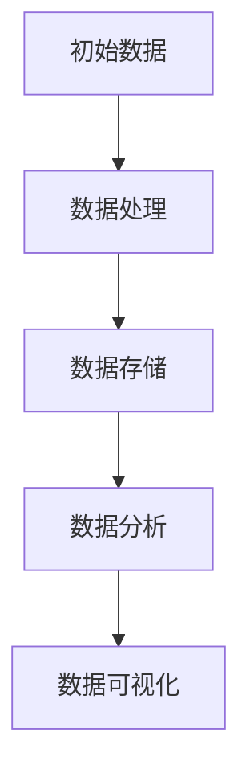
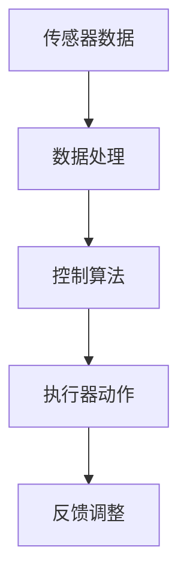

                 

### 《计算变化与自动化技术的互动》

> 关键词：计算变化、自动化技术、数据处理、人工智能、工业物联网、智能家居、智能医疗

> 摘要：本文从计算变化和自动化技术的概念入手，深入探讨两者的基本原理、应用领域及其互动关系。文章首先介绍了计算变化的基本概念、起源与发展，以及其在不同领域的应用。然后，分析了自动化技术的定义、分类及其核心组成部分。在此基础上，探讨了计算变化与自动化技术在实际应用中的深度融合，以及如何通过集成开发实现更高效的技术解决方案。最后，展望了计算变化与自动化技术的未来发展，提出了创新方向与机遇。通过本文的详细分析，读者可以全面了解计算变化与自动化技术的互动关系，以及其在现代社会中的重要应用。

---

### 第一部分：计算变化概述

#### 第1章：计算变化的基本概念

#### 1.1 计算变化的起源与演进

**1.1.1 从计算机发展到计算变化的背景**

计算变化（Computational Change）是一个相对较新的概念，但其根源可以追溯到计算机技术的发展。计算机技术的起源可以追溯到20世纪中期，当时科学家和工程师们开始探索如何利用电子设备进行数据处理和存储。最初的计算机主要用于科学研究和军事目的，但随着时间的推移，计算机逐渐普及到商业、教育和个人生活中。

计算机技术的发展经历了几个关键阶段，包括：

1. **电子管时代（1940s-1950s）**：这一时期，计算机主要使用电子管作为逻辑元件，计算速度较慢，体积庞大。

2. **晶体管时代（1950s-1960s）**：随着晶体管的发明，计算机的体积显著减小，计算速度和效率大大提高。

3. **集成电路时代（1960s-1970s）**：集成电路的引入使得计算机的性能进一步提升，成本降低，计算机开始进入商业和个人领域。

4. **个人计算机时代（1970s-至今）**：个人计算机的普及标志着计算技术从专业领域走向大众，计算变得无处不在。

随着计算机技术的不断发展，数据处理和存储需求也不断增加。传统计算逐渐无法满足复杂的数据处理需求，计算变化的概念应运而生。

**1.1.2 计算变化的基本定义与特征**

计算变化可以被定义为一种利用计算技术处理、分析和转化数据的过程，从而实现信息的高效利用和系统的智能化。计算变化具有以下几个基本特征：

1. **动态性**：计算变化是动态的，能够根据输入数据的不同而实时调整计算过程和结果。

2. **智能性**：计算变化不仅仅是数据处理，还涉及到人工智能技术，如机器学习、深度学习等，以实现更高层次的智能分析和决策。

3. **可扩展性**：计算变化能够适应不同规模的数据处理需求，从单机处理到分布式处理，从小型数据处理到大规模数据处理。

4. **高效性**：计算变化利用高效的算法和数据结构，实现快速的数据处理和计算。

5. **灵活性**：计算变化能够灵活地集成多种技术和工具，以应对复杂多变的应用场景。

**1.1.3 计算变化与传统计算的区别**

传统计算主要侧重于计算过程的精确和高效，而计算变化则更注重数据处理的过程和结果的应用。传统计算通常遵循固定的算法和流程，而计算变化则更灵活、动态，能够根据实际情况进行调整。具体区别如下：

1. **计算目标**：传统计算的目标是尽可能精确和高效地完成特定任务，而计算变化的目标是处理和分析大量数据，实现智能决策和优化。

2. **数据处理方式**：传统计算通常采用固定的数据处理流程，而计算变化则更加动态和灵活，能够根据数据特征和需求进行调整。

3. **计算资源**：传统计算通常需要较高的计算资源，而计算变化则更注重资源的合理利用和优化，可以通过分布式计算和云计算等方式实现。

4. **应用领域**：传统计算主要应用于科学计算、工程设计等领域，而计算变化则广泛应用于金融、医疗、制造、交通等各个领域。

#### 1.2 计算变化的分类与领域应用

**1.2.1 计算变化的主要分类**

计算变化可以根据其应用领域和目标进行分类，主要包括以下几个方面：

1. **数据处理与存储**：包括数据清洗、数据整合、数据存储等，主要目的是提高数据质量和存储效率。

2. **数据分析与挖掘**：包括数据挖掘、机器学习、深度学习等，主要目的是发现数据中的规律和模式，支持决策制定。

3. **智能优化**：利用计算变化实现复杂系统的优化，如交通流量优化、能源管理优化等。

4. **人机交互**：通过计算变化实现更自然、高效的人机交互，如语音识别、自然语言处理等。

**1.2.2 计算变化在各个领域的应用**

1. **金融领域**：计算变化在金融领域有广泛的应用，如风险管理、投资组合优化、欺诈检测等。通过计算变化，金融机构可以更准确地分析市场数据，制定更科学的决策。

2. **制造业**：计算变化在制造业中的应用包括生产优化、质量控制、设备预测性维护等。通过实时分析和预测，制造商可以更好地控制生产过程，提高生产效率。

3. **医疗健康领域**：计算变化在医疗健康领域有重要的应用，如疾病预测、医疗数据分析、个性化治疗等。通过计算变化，医疗工作者可以更准确地诊断疾病，提供更有效的治疗方案。

4. **交通领域**：计算变化在交通领域有广泛的应用，如交通流量优化、智能交通管理、自动驾驶等。通过计算变化，可以实现更高效、更安全的交通系统。

**1.2.3 计算变化在各行业的影响**

计算变化对各个行业产生了深远的影响，主要体现在以下几个方面：

1. **提升效率**：通过计算变化，企业可以更高效地处理数据，优化业务流程，提高生产效率。

2. **降低成本**：计算变化可以帮助企业降低数据处理和存储的成本，提高资源利用率。

3. **增强竞争力**：计算变化使得企业能够更好地应对市场变化，提高竞争力。

4. **推动创新**：计算变化为各行业提供了新的技术手段，推动了行业的创新和发展。

#### 1.3 计算变化的挑战与展望

**1.3.1 计算变化的挑战**

尽管计算变化在各个领域都有广泛的应用，但仍然面临一些挑战：

1. **数据质量**：数据质量对计算变化的准确性至关重要，数据噪声、缺失值等问题会影响计算结果。

2. **计算资源**：计算变化需要大量的计算资源和存储资源，尤其是在大规模数据处理时。

3. **安全性**：随着数据量的增加，数据安全成为计算变化的重要挑战，需要采取有效的安全措施。

4. **隐私保护**：在处理个人数据时，需要确保数据的隐私保护，避免数据泄露。

**1.3.2 计算变化的展望**

随着技术的不断进步，计算变化有望在未来实现以下发展：

1. **更高效的数据处理**：利用更先进的算法和计算技术，实现更高效的数据处理和分析。

2. **更智能的决策支持**：通过深度学习和人工智能技术，提供更智能的决策支持。

3. **更广泛的应用领域**：计算变化将在更多领域得到应用，推动各行业的创新和发展。

4. **更安全的数据处理**：通过加密、安全协议等技术，确保数据的安全性和隐私保护。

---

#### 第2章：计算变化的技术基础

#### 2.1 计算变化的基本技术

**2.1.1 数据处理与存储技术**

数据处理与存储技术是计算变化的核心组成部分，直接影响计算变化的效率和效果。以下将介绍数据处理与存储技术的基本概念、关键技术和应用场景。

**2.1.1.1 数据处理技术**

数据处理技术包括数据采集、数据清洗、数据整合、数据存储等环节。

1. **数据采集**：数据采集是数据处理的第一步，主要涉及数据的来源、格式和传输方式。数据来源可以是传感器、数据库、文件系统等，数据格式包括结构化数据（如关系型数据库）、半结构化数据（如JSON、XML）和非结构化数据（如文本、图像、视频）。

2. **数据清洗**：数据清洗是指对原始数据进行处理，去除噪声、缺失值和异常值，确保数据质量。数据清洗技术包括数据验证、数据填充、数据转换等。

3. **数据整合**：数据整合是将来自不同来源、不同格式的数据进行统一处理，以便进行进一步分析。数据整合技术包括数据映射、数据转换、数据集成等。

4. **数据存储**：数据存储是将处理后的数据存储到持久化存储设备中，以便后续查询和分析。常见的存储技术包括关系型数据库（如MySQL、Oracle）、NoSQL数据库（如MongoDB、Cassandra）和分布式存储系统（如Hadoop、Spark）。

**2.1.1.2 数据存储技术**

数据存储技术在计算变化中起着至关重要的作用，其性能和可扩展性直接影响计算变化的效率和效果。以下将介绍几种常见的数据存储技术：

1. **关系型数据库**：关系型数据库是一种基于关系模型的数据库管理系统，如MySQL、Oracle等。关系型数据库具有以下特点：

   - 数据结构清晰，便于查询和管理。
   - 支持复杂查询和事务处理。
   - 数据一致性高，但扩展性相对较低。

2. **NoSQL数据库**：NoSQL数据库是一种非关系型数据库，适用于大规模、分布式数据存储。常见的NoSQL数据库包括MongoDB、Cassandra、Redis等。NoSQL数据库具有以下特点：

   - 数据模型灵活，支持多种数据类型。
   - 高性能、可扩展性，适用于分布式系统。
   - 数据一致性较弱，但更注重性能和扩展性。

3. **分布式存储系统**：分布式存储系统是一种将数据存储到多个节点上的存储系统，如Hadoop、Spark等。分布式存储系统具有以下特点：

   - 高性能、可扩展性，适用于大规模数据处理。
   - 数据冗余和容错性好，保障数据安全。
   - 支持多种数据访问模式，如批处理、流处理等。

**2.1.2 算法与模型优化技术**

算法与模型优化技术在计算变化中至关重要，它们决定了数据处理的效率和效果。以下将介绍几种常见的算法与模型优化技术：

1. **机器学习算法**：机器学习算法是计算变化的重要组成部分，用于数据分析和预测。常见的机器学习算法包括线性回归、决策树、支持向量机、神经网络等。

2. **深度学习模型**：深度学习模型是机器学习的一个分支，通过多层神经网络对数据进行处理和分析。常见的深度学习模型包括卷积神经网络（CNN）、循环神经网络（RNN）、生成对抗网络（GAN）等。

3. **模型优化技术**：模型优化技术用于提高机器学习模型的性能和效率。常见的模型优化技术包括正则化、交叉验证、模型集成等。

**2.1.2.1 算法优化技术**

算法优化技术包括以下几个方面：

1. **数据预处理**：数据预处理是算法优化的第一步，通过数据清洗、归一化、特征提取等操作，提高数据质量，有助于算法的优化。

2. **特征工程**：特征工程是算法优化的关键环节，通过选择和构建合适的特征，提高模型的表现。

3. **模型选择**：选择合适的机器学习模型对算法性能有重要影响，需要根据具体应用场景和数据特点进行模型选择。

4. **超参数调优**：超参数调优是算法优化的关键步骤，通过调整模型的超参数，如学习率、正则化参数等，提高模型的性能。

**2.1.2.2 模型优化技术**

模型优化技术包括以下几个方面：

1. **模型集成**：模型集成是将多个模型进行结合，以提高预测性能。常见的模型集成方法包括Bagging、Boosting、Stacking等。

2. **模型压缩**：模型压缩是通过减少模型参数和计算量，提高模型的推理速度。常见的模型压缩方法包括模型剪枝、量化、知识蒸馏等。

3. **模型迁移**：模型迁移是将一个领域中的模型应用到其他领域，以提高模型的泛化能力。常见的模型迁移方法包括迁移学习、元学习等。

**2.1.3 硬件支持与资源管理**

计算变化需要大量的计算资源和存储资源，硬件支持和资源管理对计算变化的性能和效率具有重要影响。以下将介绍计算变化的硬件支持和资源管理技术。

**2.1.3.1 硬件支持技术**

计算变化的硬件支持包括以下几个方面：

1. **CPU与GPU**：CPU（中央处理器）和GPU（图形处理器）是计算变化中常用的计算硬件。CPU适合执行传统的计算任务，而GPU适合执行大规模并行计算任务，如深度学习训练和图像处理。

2. **存储设备**：存储设备包括硬盘（HDD）和固态硬盘（SSD），用于存储数据和处理结果。SSD具有更高的读写速度和更低的延迟，适用于计算变化中的数据存储。

3. **内存与缓存**：内存和缓存是计算变化中的临时存储设备，用于存储数据和中间结果。内存的读写速度较快，但容量有限，缓存则具有更高的容量和更低的读写速度。

**2.1.3.2 资源管理技术**

资源管理技术包括以下几个方面：

1. **任务调度**：任务调度是指根据资源需求和优先级，合理分配计算资源和存储资源。常见的任务调度算法包括FIFO（先进先出）、SJF（最短作业优先）等。

2. **负载均衡**：负载均衡是指通过分配计算任务到不同的节点，以平衡各个节点的负载。负载均衡有助于提高计算变化的性能和可靠性。

3. **资源监控与优化**：资源监控与优化是指通过监控计算资源和存储资源的使用情况，及时发现和处理资源不足或浪费问题。常见的资源监控工具包括Prometheus、Grafana等。

**2.1.4 计算变化的实际应用场景**

计算变化在实际应用中具有广泛的应用场景，以下将介绍几个典型的应用场景：

1. **金融领域**：计算变化在金融领域有广泛的应用，如金融市场分析、风险管理、投资组合优化等。通过计算变化，金融机构可以更准确地预测市场走势，制定更科学的投资策略。

2. **医疗健康领域**：计算变化在医疗健康领域有重要的应用，如疾病预测、医疗数据分析、个性化治疗等。通过计算变化，医疗工作者可以更准确地诊断疾病，提供更有效的治疗方案。

3. **制造领域**：计算变化在制造领域有广泛的应用，如生产优化、质量控制、设备预测性维护等。通过计算变化，制造商可以更高效地控制生产过程，提高生产效率。

4. **交通领域**：计算变化在交通领域有广泛的应用，如交通流量优化、智能交通管理、自动驾驶等。通过计算变化，可以实现更高效、更安全的交通系统。

**2.1.5 计算变化的挑战与展望**

计算变化在实际应用中面临一些挑战，如数据质量、计算资源、安全性等问题。随着技术的不断进步，计算变化有望在未来实现以下发展：

1. **更高效的数据处理**：利用更先进的算法和计算技术，实现更高效的数据处理和分析。

2. **更智能的决策支持**：通过深度学习和人工智能技术，提供更智能的决策支持。

3. **更广泛的应用领域**：计算变化将在更多领域得到应用，推动各行业的创新和发展。

4. **更安全的数据处理**：通过加密、安全协议等技术，确保数据的安全性和隐私保护。

---

### 第二部分：自动化技术的互动

#### 第3章：自动化技术的基本原理

#### 3.1 自动化技术的起源与发展

**3.1.1 自动化技术的起源**

自动化技术（Automation Technology）起源于20世纪初期，随着工业革命的推进，人类开始探索如何通过机器和自动化设备替代人力完成生产任务。最初的自动化技术主要是通过机械装置实现简单的工作流程，如纺织机的自动化生产。随着科学技术的进步，自动化技术逐渐发展壮大，涵盖了机械、电子、计算机等多个领域。

**3.1.2 自动化技术的演进过程**

自动化技术的演进过程可以分为以下几个阶段：

1. **机械自动化阶段（19世纪末-20世纪30年代）**：这一时期，自动化技术主要依靠机械装置实现简单的自动化生产，如纺织机的自动化生产。

2. **电气自动化阶段（20世纪40年代-60年代）**：随着电气技术的发展，自动化技术开始引入电气元件，实现更复杂的工作流程，如流水线生产。

3. **计算机自动化阶段（20世纪70年代至今）**：随着计算机技术的崛起，自动化技术进入了新的阶段，计算机系统开始广泛应用于自动化控制，实现了高度智能化和灵活性的自动化生产。

**3.1.3 自动化技术的定义与分类**

自动化技术是指利用计算机、传感器、执行器等设备，实现生产、管理、服务过程自动化的技术。根据自动化技术的应用领域和目标，可以将其分为以下几类：

1. **工业自动化**：工业自动化主要应用于生产制造领域，通过自动化设备实现生产线的自动化控制，提高生产效率和质量。

2. **过程自动化**：过程自动化主要应用于化工、能源、食品等行业，通过自动化控制系统实现生产过程的实时监测和控制，保证生产过程的稳定和高效。

3. **商业自动化**：商业自动化主要应用于商业领域，如零售、金融、物流等，通过自动化设备和服务系统，提高商业运营效率和服务质量。

4. **家庭自动化**：家庭自动化主要应用于家庭生活中，通过智能家居设备，实现家电、照明、安全等系统的自动化控制，提高家庭生活的便利性和舒适性。

#### 3.2 自动化技术的核心组成部分

自动化技术由多个核心组成部分构成，这些部分相互协作，实现系统的自动化控制和智能化管理。以下将详细介绍自动化技术的核心组成部分：

**3.2.1 传感器与执行器**

传感器和执行器是自动化技术中的关键部件，它们分别负责感知环境和执行动作。

1. **传感器**：传感器用于感知环境信息，如温度、湿度、压力、光照等。常见的传感器包括温度传感器、湿度传感器、压力传感器、光电传感器等。传感器的主要作用是将物理量转换为电信号，供控制系统进行分析和处理。

2. **执行器**：执行器负责执行控制指令，将控制信号转换为具体的动作。常见的执行器包括电动机、液压缸、气动缸等。执行器的主要作用是驱动机械装置，实现预期的动作。

**3.2.2 控制系统与算法**

控制系统和算法是自动化技术的核心，负责对传感器采集的信息进行处理，并生成执行器的控制指令。

1. **控制系统**：控制系统是自动化技术的核心部件，负责对传感器采集的信息进行实时监测、处理和决策。控制系统通常由以下几个部分组成：

   - **控制器**：控制器是控制系统的核心，负责接收传感器信息，生成控制指令，并驱动执行器执行动作。
   - **执行单元**：执行单元是控制系统的执行部分，负责根据控制器生成的控制指令，执行相应的动作。
   - **监控与反馈单元**：监控与反馈单元负责对系统的运行状态进行实时监控，并将监控结果反馈给控制器，以便进行进一步决策。

2. **算法**：算法是控制系统的重要组成部分，负责对传感器采集的信息进行处理和分析，生成控制指令。常见的算法包括PID控制算法、模糊控制算法、神经网络控制算法等。

**3.2.3 通信协议与网络**

通信协议和网络是自动化技术的数据传输基础，负责将传感器、执行器和控制系统连接起来，实现数据的实时传输和通信。

1. **通信协议**：通信协议是自动化技术中用于数据传输和通信的规范，常见的通信协议包括Modbus、CAN总线、TCP/IP等。

2. **网络**：网络是自动化技术的数据传输通道，负责连接传感器、执行器和控制系统，实现数据的实时传输和通信。常见的网络包括有线网络（如以太网、光纤网）和无线网络（如Wi-Fi、蓝牙、ZigBee）。

**3.2.4 软件与界面**

软件和界面是自动化技术的数据分析和人机交互部分，负责对采集到的数据进行分析和处理，并展示系统的运行状态和操作界面。

1. **软件**：软件是自动化技术的重要组成部分，负责对传感器采集的数据进行处理和分析，生成控制指令，并存储和查询历史数据。

2. **界面**：界面是自动化技术的用户交互部分，负责向用户展示系统的运行状态、操作提示和报警信息，使用户能够方便地与系统进行交互。

#### 3.3 自动化技术在工业领域中的应用

自动化技术在工业领域有广泛的应用，通过自动化设备实现生产线的自动化控制，提高生产效率和质量。以下将介绍自动化技术在工业领域中的应用场景和案例：

**3.3.1 生产线的自动化控制**

生产线自动化控制是自动化技术在工业领域的主要应用之一，通过自动化设备实现生产线的全程自动化控制，提高生产效率和质量。生产线自动化控制包括以下几个环节：

1. **加工设备的自动化控制**：加工设备（如数控机床、机器人等）通过自动化控制系统实现加工过程的自动化，提高加工精度和效率。

2. **输送系统的自动化控制**：输送系统（如输送带、搬运机器人等）通过自动化控制系统实现物料的自动输送和搬运，提高生产线的运行效率。

3. **质量检测的自动化控制**：质量检测设备（如激光测距仪、X射线检测仪等）通过自动化控制系统实现产品质量的实时检测和监控，确保产品质量。

**3.3.2 设备预测性维护**

设备预测性维护是自动化技术在工业领域的重要应用，通过实时监控设备运行状态，预测设备故障，提前进行维护，减少设备停机时间和维修成本。设备预测性维护包括以下几个步骤：

1. **数据采集**：通过传感器和监测设备，实时采集设备的运行数据，如温度、压力、振动等。

2. **数据分析**：对采集到的数据进行分析和处理，识别设备的潜在故障和异常情况。

3. **预警和决策**：根据分析结果，生成预警信息，指导设备维护和故障排除。

**3.3.3 智能制造**

智能制造是自动化技术在工业领域的最新发展趋势，通过集成传感器、执行器、控制系统和人工智能技术，实现生产过程的智能化和数字化。智能制造包括以下几个核心要素：

1. **智能设备**：通过引入智能传感器、执行器和控制系统，实现生产设备的智能化和自动化。

2. **智能工厂**：通过构建智能工厂，实现生产过程的数字化和智能化，提高生产效率和质量。

3. **工业物联网**：通过构建工业物联网，实现设备、系统和数据之间的互联互通，实现生产过程的实时监控和优化。

#### 3.4 自动化技术在非工业领域中的应用

自动化技术在非工业领域也有广泛的应用，通过自动化设备和服务系统，提高生活质量和生产效率。以下将介绍自动化技术在非工业领域中的应用场景和案例：

**3.4.1 智能家居**

智能家居是自动化技术在家庭领域的典型应用，通过智能设备和服务系统，实现家庭设备和系统的自动化控制，提高家庭生活的便利性和舒适性。智能家居包括以下几个应用场景：

1. **智能照明**：通过智能照明设备，实现照明系统的自动化控制，如定时开关灯、感应控制等。

2. **智能安防**：通过智能安防设备，实现家庭安全和监控的自动化，如摄像头监控、门锁控制等。

3. **智能家电**：通过智能家电设备，实现家电设备的自动化控制，如智能空调、智能洗衣机等。

**3.4.2 智能交通**

智能交通是自动化技术在交通领域的应用，通过传感器、控制系统和通信技术，实现交通系统的自动化和智能化，提高交通效率和安全。智能交通包括以下几个应用场景：

1. **智能交通信号控制**：通过智能交通信号控制设备，实现交通信号的自动化控制和优化，提高交通流量和通行效率。

2. **智能停车场**：通过智能停车场设备，实现停车场的自动化管理和控制，如车位检测、自动收费等。

3. **智能交通监控**：通过智能交通监控设备，实现交通状况的实时监控和数据分析，为交通管理和规划提供支持。

**3.4.3 医疗健康**

医疗健康是自动化技术在医疗领域的应用，通过自动化设备和服务系统，提高医疗服务的质量和效率。医疗健康包括以下几个应用场景：

1. **医疗设备自动化**：通过自动化医疗设备，实现医疗操作的自动化和精确控制，如手术机器人、医疗仪器等。

2. **远程医疗**：通过远程医疗系统，实现医生和患者之间的远程交流和诊断，提高医疗服务覆盖范围和效率。

3. **医疗数据分析**：通过自动化医疗数据分析系统，实现医疗数据的自动化处理和分析，为医生提供决策支持。

#### 3.5 自动化技术的挑战与展望

自动化技术在工业和非工业领域有广泛的应用，但同时也面临一些挑战。以下将介绍自动化技术的挑战和展望：

**3.5.1 挑战**

1. **数据安全与隐私**：随着自动化技术的广泛应用，数据安全和隐私问题日益突出，如何确保数据的安全性和隐私保护成为自动化技术发展的重要挑战。

2. **技术融合与创新**：自动化技术需要与其他技术（如人工智能、物联网等）进行融合和创新，以实现更高效、更智能的自动化解决方案。

3. **人才短缺**：自动化技术发展迅速，但相关专业人才短缺，如何培养和引进专业人才成为自动化技术发展的重要问题。

**3.5.2 展望**

1. **更智能的自动化**：随着人工智能技术的不断发展，自动化技术将实现更高层次的智能化，为各行业提供更高效、更智能的自动化解决方案。

2. **更广泛的领域应用**：自动化技术将在更多领域得到应用，推动各行业的自动化和智能化发展。

3. **更高效的生产效率**：通过自动化技术的广泛应用，生产效率将得到显著提高，推动经济的快速发展。

---

### 第三部分：计算变化与自动化技术的融合

#### 第4章：自动化技术在计算变化中的应用

随着计算技术的不断发展和自动化技术的广泛应用，两者的融合已成为现代信息技术的重要趋势。自动化技术在计算变化中的应用，不仅提高了数据处理和计算效率，还带来了新的应用场景和解决方案。本章将重点讨论自动化技术在计算变化中的应用，包括数据处理、数据分析、数据可视化以及制造领域的自动化应用。

#### 4.1 自动化技术在数据处理中的应用

数据处理是计算变化的核心环节，而自动化技术在数据处理中的应用极大地提高了数据处理效率和准确性。以下是自动化技术在数据处理中的主要应用：

**4.1.1 数据采集与清洗**

数据采集是数据处理的第一步，自动化技术通过传感器和执行器实现数据的自动采集。传感器可以实时监测环境数据，如温度、湿度、压力等，并将这些数据传输给控制系统。执行器则负责执行特定的操作，如控制阀门、开关等，以生成所需的数据。

数据清洗是数据处理中的关键环节，通过自动化技术可以实现高效的数据清洗。自动化清洗工具可以自动识别和修复数据中的错误、缺失值和异常值，从而提高数据质量。例如，自动化清洗工具可以自动填补缺失值、删除重复数据、纠正错误数据等。

**4.1.2 数据分析与挖掘**

自动化技术在数据分析与挖掘中的应用，使得数据处理和分析更加高效和智能化。通过自动化算法，可以对海量数据进行快速分析和挖掘，发现数据中的规律和模式。

例如，在金融领域，自动化技术可以用于分析市场数据，预测市场走势，帮助投资者制定更科学的投资策略。在医疗领域，自动化技术可以用于分析患者数据，预测疾病风险，为医生提供诊断和治疗的决策支持。

**4.1.3 数据可视化**

数据可视化是将数据处理和分析结果以图形化的方式展示出来，使数据更直观、易于理解。自动化技术在数据可视化中的应用，使得数据可视化过程更加高效和自动化。

自动化数据可视化工具可以根据数据的特点和需求，自动生成各种类型的可视化图表，如折线图、柱状图、饼图等。这些可视化图表可以帮助用户快速理解数据背后的规律和趋势，为决策提供有力支持。

**4.1.4 数据存储与管理**

自动化技术在数据存储与管理中的应用，提高了数据存储和管理效率。自动化存储系统可以根据数据特点和需求，自动分配存储资源，优化存储空间，提高存储性能。

例如，在云计算环境中，自动化存储系统可以根据数据访问频率和重要性，自动调整数据存储位置，确保数据的高效访问和安全性。此外，自动化技术还可以用于数据备份和恢复，提高数据安全性。

#### 4.2 自动化技术在制造领域的应用

自动化技术在制造领域的应用，使得生产过程更加高效、灵活和智能化。以下是自动化技术在制造领域的主要应用：

**4.2.1 制造过程自动化**

制造过程自动化是自动化技术在制造领域的基础应用，通过自动化设备和控制系统，实现生产过程的自动化控制。自动化制造系统可以自动完成从原料加工到成品出库的整个生产过程，减少人工干预，提高生产效率。

例如，在汽车制造业，自动化技术可以用于机器人焊接、自动化装配、自动化检测等，实现汽车生产过程的自动化。通过自动化制造系统，汽车生产效率显著提高，生产成本降低，产品质量得到保障。

**4.2.2 智能工厂与工业物联网**

智能工厂和工业物联网是自动化技术在制造领域的最新发展，通过将自动化技术、物联网技术和人工智能技术相结合，实现制造过程的智能化和数字化。

智能工厂通过构建一个高度集成、高度自动化的生产环境，实现生产过程的实时监控、优化和调整。工业物联网通过将各种设备和系统连接起来，实现数据的实时传输和共享，为智能工厂提供数据支持和决策依据。

例如，在智能工厂中，自动化技术可以用于生产设备的远程监控和维护，通过实时数据分析和预测性维护，减少设备故障和停机时间，提高生产效率。工业物联网可以用于生产过程的实时监控和优化，通过数据分析和挖掘，发现生产中的瓶颈和问题，为生产优化提供指导。

**4.2.3 制造过程的优化与改进**

自动化技术在制造过程中的应用，不仅提高了生产效率，还可以通过数据分析和挖掘，实现制造过程的优化与改进。

例如，通过自动化技术，可以对生产过程中的各种参数进行实时监控和分析，发现生产中的异常和瓶颈。通过数据分析和挖掘，可以找出生产过程中的问题原因，并提出优化方案，实现生产过程的持续改进。

例如，在机械加工过程中，通过自动化技术，可以对加工参数进行实时监控和调整，优化加工工艺，提高加工精度。在包装过程中，通过自动化技术，可以对包装速度和包装质量进行实时监控和优化，提高包装效率和质量。

#### 4.3 自动化技术在非制造领域中的应用

自动化技术不仅应用于制造领域，还在许多非制造领域发挥着重要作用。以下将介绍自动化技术在非制造领域中的应用：

**4.3.1 智能家居**

智能家居是自动化技术在家庭领域的应用，通过智能设备和控制系统，实现家庭设备和系统的自动化控制。智能家居系统可以根据用户需求和场景，自动调整灯光、温度、音乐等，为用户创造舒适、便捷的生活环境。

例如，通过智能家居系统，用户可以远程控制家中的空调、热水器、灯光等设备，实现远程控制和节能。用户还可以设置自动化场景，如离家模式、睡眠模式等，实现家庭设备和系统的自动调整。

**4.3.2 智能交通**

智能交通是自动化技术在交通领域的应用，通过自动化设备和系统，实现交通系统的智能化和高效化。智能交通系统可以实时监控交通流量、道路状况，通过数据分析和优化，实现交通信号控制、道路规划、车辆调度等。

例如，在智能交通系统中，自动化技术可以用于交通信号控制，通过实时数据分析和预测，自动调整交通信号，优化交通流量，减少拥堵。在公共交通系统中，自动化技术可以用于车辆调度和乘客管理，提高公共交通的运营效率和乘客体验。

**4.3.3 医疗健康**

医疗健康是自动化技术在医疗领域的应用，通过自动化设备和系统，提高医疗服务的质量和效率。自动化技术可以用于医疗设备的自动化控制、医疗数据分析、远程医疗等。

例如，在医疗设备自动化控制方面，自动化技术可以用于手术机器人、医疗仪器等的自动化控制，提高手术精度和医疗质量。在医疗数据分析方面，自动化技术可以用于患者数据的分析和挖掘，为医生提供诊断和治疗的决策支持。在远程医疗方面，自动化技术可以用于远程监控和诊断，实现医疗资源的共享和优化。

#### 4.4 计算变化与自动化技术的深度融合

计算变化与自动化技术的深度融合，为现代社会带来了新的技术解决方案和应用场景。以下将介绍计算变化与自动化技术的深度融合及其优势：

**4.4.1 融合概念**

计算变化与自动化技术的深度融合，指的是将计算技术与自动化技术相结合，实现更高效、更智能的自动化解决方案。融合概念包括以下几个方面：

1. **计算技术**：利用计算技术，如人工智能、大数据分析等，实现自动化系统的智能化和自适应能力。

2. **自动化技术**：利用自动化技术，实现生产、管理、服务等过程的自动化控制。

3. **数据驱动**：通过实时数据采集、分析和处理，实现自动化系统的动态调整和优化。

**4.4.2 融合优势**

计算变化与自动化技术的深度融合，具有以下优势：

1. **提高效率**：通过计算变化，自动化系统可以实现更高效的数据处理和分析，提高生产和管理效率。

2. **增强灵活性**：计算变化使得自动化系统可以根据实时数据和环境变化，动态调整控制策略，增强系统的灵活性和适应性。

3. **降低成本**：计算变化与自动化技术的融合，可以优化生产和管理流程，降低人力成本和资源消耗。

4. **提升安全性**：通过实时监控和分析，自动化系统可以及时发现和预警潜在的安全隐患，提高系统的安全性和可靠性。

5. **创新应用**：计算变化与自动化技术的融合，为各行业带来了新的应用场景和解决方案，推动了行业的创新和发展。

#### 4.5 计算变化与自动化技术的应用实例

为了更好地展示计算变化与自动化技术的融合应用，以下将介绍几个实际应用实例：

**4.5.1 智能交通系统**

智能交通系统通过计算变化与自动化技术的融合，实现了交通系统的智能化和高效化。智能交通系统包括交通信号控制、车辆检测、道路监控等功能，通过实时数据采集和分析，实现交通流量优化、事故预警和应急处理。

例如，在智能交通系统中，自动化技术可以用于交通信号的实时调整，根据交通流量和道路状况，自动调整信号灯的时序和时长，优化交通流量。计算变化技术可以用于事故预警，通过实时监控和分析交通数据，发现事故隐患并及时预警，减少交通事故的发生。

**4.5.2 智能家居**

智能家居通过计算变化与自动化技术的融合，实现了家庭设备和系统的智能化和自动化。智能家居系统可以实时监测家庭环境，根据用户需求和场景，自动调整灯光、温度、音乐等，提高家庭生活的舒适性和便捷性。

例如，在智能家居系统中，自动化技术可以用于灯光控制，根据用户需求和光线变化，自动调整灯光亮度。计算变化技术可以用于智能安防，通过实时监控和分析家庭环境数据，发现异常情况并及时报警，保障家庭安全。

**4.5.3 智能医疗**

智能医疗通过计算变化与自动化技术的融合，提高了医疗服务的质量和效率。智能医疗系统可以实时监测患者生命体征，根据患者数据实现个性化治疗和预警。

例如，在智能医疗系统中，自动化技术可以用于手术机器人控制，实现手术过程的自动化和精确控制。计算变化技术可以用于疾病预测和诊断，通过实时监控和分析患者数据，预测疾病风险和诊断疾病，为医生提供决策支持。

---

### 第三部分：实践与应用

#### 第5章：计算变化与自动化技术的集成开发

计算变化与自动化技术的集成开发是现代信息技术的重要研究方向，通过将计算技术和自动化技术相结合，实现更高效、更智能的自动化解决方案。本章将介绍计算变化与自动化技术的集成开发过程，包括开发环境与工具的选择、实际项目案例解析以及未来发展趋势。

#### 5.1 开发环境与工具的选择

**5.1.1 开发环境的搭建**

计算变化与自动化技术的集成开发需要搭建一个合适的开发环境，以确保开发过程的高效性和灵活性。以下是一个典型的开发环境搭建步骤：

1. **操作系统选择**：选择适合的操作系统，如Windows、Linux或macOS。Linux系统因其开源、稳定性和可定制性，常被用于计算变化与自动化技术的集成开发。

2. **编程语言选择**：选择合适的编程语言，如Python、Java或C++。Python因其简洁性和丰富的库资源，常被用于计算变化与自动化技术的开发。

3. **集成开发环境（IDE）**：选择合适的IDE，如PyCharm、Eclipse或VSCode。IDE可以帮助开发者高效地进行代码编写、调试和测试。

4. **数据库与存储**：选择合适的数据库和存储系统，如MySQL、MongoDB或Hadoop。数据库和存储系统用于存储和管理计算变化与自动化技术所需的数据。

5. **版本控制工具**：选择合适的版本控制工具，如Git或SVN。版本控制工具可以帮助团队进行代码管理和协作开发。

**5.1.2 常用开发工具介绍**

以下是一些在计算变化与自动化技术集成开发中常用的工具：

1. **数据处理工具**：如Pandas、NumPy、SciPy，用于数据清洗、数据分析和数据可视化。

2. **机器学习库**：如Scikit-learn、TensorFlow、PyTorch，用于实现机器学习和深度学习算法。

3. **自动化测试工具**：如Selenium、Robot Framework，用于自动化测试和功能验证。

4. **容器技术**：如Docker、Kubernetes，用于实现微服务架构和分布式部署。

5. **云计算平台**：如AWS、Azure、Google Cloud，提供计算资源、存储和AI服务等。

**5.1.3 开发流程与管理**

计算变化与自动化技术的集成开发需要遵循一定的开发流程和规范，以确保项目的顺利进行。以下是一个典型的开发流程：

1. **需求分析**：明确项目需求，包括功能需求、性能需求和安全需求等。

2. **系统设计**：根据需求分析，设计系统的整体架构和技术方案。

3. **模块开发**：按照系统设计，分模块进行开发，包括数据处理模块、自动化控制模块等。

4. **测试与调试**：对开发完成的模块进行测试和调试，确保模块功能正确、性能稳定。

5. **集成与部署**：将各个模块进行集成，进行系统集成测试，最终部署到生产环境。

6. **运维与优化**：对系统进行运维管理，根据反馈和性能监控结果进行优化和升级。

#### 5.2 实际项目案例解析

**5.2.1 项目背景与需求分析**

以下是一个实际项目案例：智能工厂自动化控制系统。

项目背景：某大型制造企业希望提高生产效率，降低生产成本，实现生产过程的自动化和智能化。

需求分析：

1. **生产自动化**：实现生产线的自动化控制，包括加工设备、输送系统、质量检测等。

2. **数据采集与监控**：实时采集生产数据，如设备状态、生产参数、质量指标等，实现生产过程的实时监控。

3. **故障预警与维护**：通过实时数据分析和故障预测，实现设备故障预警和预测性维护。

4. **生产优化与调度**：通过数据分析，优化生产过程和调度策略，提高生产效率。

**5.2.2 技术选型与架构设计**

技术选型：

1. **编程语言**：Python，因其简洁性和丰富的库资源，适合用于数据处理、机器学习和自动化控制。

2. **数据处理与存储**：Pandas、NumPy、SciPy，用于数据处理和数据分析；MySQL，用于存储生产数据。

3. **自动化控制**：Python的自动化控制库，如PyAutoGUI，用于实现生产设备的自动化控制。

4. **机器学习库**：Scikit-learn、TensorFlow，用于实现故障预测和优化算法。

架构设计：

1. **数据处理模块**：负责数据采集、清洗、存储和预处理，为后续分析提供数据支持。

2. **自动化控制模块**：负责实现生产设备的自动化控制，根据实时数据调整设备状态。

3. **故障预测模块**：利用机器学习算法，对设备运行数据进行分析和预测，实现故障预警和预测性维护。

4. **生产优化模块**：根据实时数据和机器学习结果，优化生产过程和调度策略。

**5.2.3 项目实现与性能优化**

项目实现：

1. **数据采集与存储**：通过传感器和执行器，实时采集生产数据，存储到MySQL数据库中。

2. **数据处理与监控**：使用Pandas和NumPy进行数据清洗、转换和预处理，使用Scikit-learn进行故障预测和优化算法的实现。

3. **自动化控制**：使用Python的自动化控制库实现生产设备的自动化控制，根据实时数据调整设备状态。

4. **故障预警与维护**：利用机器学习算法，对设备运行数据进行分析和预测，实现故障预警和预测性维护。

性能优化：

1. **数据预处理优化**：通过数据压缩和特征提取，提高数据处理速度。

2. **算法优化**：优化机器学习算法，提高故障预测的准确性和效率。

3. **分布式计算**：使用分布式计算框架（如Spark），实现大规模数据处理和计算。

4. **内存管理优化**：优化内存分配和垃圾回收，提高系统性能。

**5.2.4 项目总结与经验分享**

项目总结：

1. **项目成功的关键因素**：数据质量、算法优化、自动化控制技术的有效集成。

2. **项目挑战与解决方案**：数据预处理、算法优化、分布式计算等方面的挑战，通过优化技术和管理策略得以解决。

经验分享：

1. **数据质量的重要性**：数据质量直接影响算法性能和项目效果，需要重视数据采集、清洗和预处理。

2. **算法优化的重要性**：算法优化是提高项目性能的关键，需要不断优化算法参数和计算过程。

3. **团队合作的重要性**：项目开发涉及多个领域的专业知识，团队合作和沟通至关重要。

---

### 第四部分：计算变化与自动化技术的未来

#### 第6章：计算变化与自动化技术的未来展望

计算变化与自动化技术的融合在现代社会中已经成为推动科技进步、提高生产效率的重要力量。随着技术的不断演进，未来计算变化与自动化技术将继续在各个领域发挥重要作用，推动社会向更智能、更高效的方向发展。本章将探讨计算变化与自动化技术的未来发展趋势、应用前景以及面临的挑战。

#### 6.1 当前发展趋势与挑战

**6.1.1 技术发展趋势**

1. **人工智能与自动化技术的深度融合**：未来计算变化与自动化技术的融合将更加紧密，人工智能（AI）将在自动化系统中发挥核心作用。通过深度学习、强化学习等AI技术，自动化系统将具备自我学习和自适应能力，实现更高效、更智能的自动化控制。

2. **边缘计算与物联网的协同发展**：边缘计算和物联网（IoT）技术的快速发展，将推动计算变化与自动化技术在更广泛的场景中得到应用。边缘计算可以降低数据传输延迟，提高实时性，而物联网则可以实现设备、系统和数据之间的互联互通，为自动化技术提供丰富的数据来源。

3. **云计算与大数据技术的支持**：云计算和大数据技术将为计算变化与自动化技术提供强大的计算能力和数据支持。通过云平台，可以实现大规模分布式计算和存储，而大数据技术则可以挖掘海量数据中的价值，为自动化系统提供决策依据。

4. **新型传感器与执行器的应用**：新型传感器和执行器的不断涌现，将提高自动化系统的感知能力和执行精度。例如，高精度传感器可以实时监测环境变化，智能执行器可以实现更精细的控制。

**6.1.2 技术应用挑战**

1. **数据安全和隐私保护**：随着自动化技术的广泛应用，数据安全和隐私保护问题日益突出。如何确保数据在采集、传输、存储和处理过程中的安全性和隐私性，是自动化技术面临的重要挑战。

2. **技术融合与兼容性**：计算变化与自动化技术的融合需要不同技术之间的兼容性和协同工作。如何实现不同技术平台、系统和设备之间的无缝连接和数据共享，是自动化技术面临的技术难题。

3. **人才短缺**：随着自动化技术的发展，对相关领域人才的需求日益增加。然而，目前相关专业人才短缺，如何培养和引进高素质的专业人才，是自动化技术发展的重要问题。

#### 6.2 创新方向与机遇

**6.2.1 新型计算变化技术**

1. **量子计算**：量子计算具有超强的计算能力，可以解决传统计算机难以处理的复杂问题。未来，量子计算将与自动化技术相结合，推动计算变化与自动化技术向更高层次发展。

2. **生物计算**：生物计算利用生物系统的特性和机理，实现计算任务。生物计算与自动化技术的融合，将为生物科技、医疗健康等领域带来新的突破。

3. **神经形态计算**：神经形态计算模拟人脑的计算方式，具有高效能、低功耗的特点。未来，神经形态计算将与自动化技术相结合，实现更智能、更高效的自动化控制。

**6.2.2 自动化技术的创新发展**

1. **自适应自动化**：自适应自动化系统可以根据环境变化和任务需求，动态调整控制策略。未来，自适应自动化技术将在智能制造、智能家居等领域得到广泛应用。

2. **自主决策与协作**：通过自主决策与协作技术，自动化系统将具备自主决策能力，与其他系统进行高效协作。这将极大地提高自动化系统的灵活性和适应性。

3. **虚拟现实与增强现实**：虚拟现实（VR）和增强现实（AR）技术的快速发展，将为自动化技术提供新的交互方式和应用场景。未来，VR和AR技术将与自动化技术相结合，实现更直观、更高效的自动化控制。

**6.2.3 融合应用的创新方向**

1. **智能交通系统**：未来，智能交通系统将实现车路协同、自动驾驶等功能，提高交通效率和安全性。计算变化与自动化技术的融合，将为智能交通系统提供强大的技术支持。

2. **智能医疗**：未来，智能医疗将实现精准诊断、个性化治疗等功能，提高医疗服务质量和效率。计算变化与自动化技术的融合，将为智能医疗提供数据支持和智能化解决方案。

3. **智慧城市**：智慧城市是计算变化与自动化技术的综合应用，通过智能基础设施、智能管理和智能服务，实现城市的智能化和可持续发展。未来，智慧城市将成为自动化技术的重要应用场景。

**6.2.4 创新机遇与前景**

1. **新兴产业**：计算变化与自动化技术的融合将催生一系列新兴产业，如智能制造、智能医疗、智能交通等。这些产业将带动经济发展，创造大量就业机会。

2. **社会变革**：计算变化与自动化技术的广泛应用，将深刻改变人类生产、生活方式，推动社会向更智能、更高效的方向发展。

3. **可持续发展**：计算变化与自动化技术的融合，有助于提高资源利用效率，减少能源消耗和环境污染，实现可持续发展。

#### 6.3 未来展望

未来，计算变化与自动化技术将在各个领域得到广泛应用，实现人类生产、生活方式的深刻变革。通过不断创新和融合，计算变化与自动化技术将为社会带来更多机遇和挑战。以下是未来展望：

1. **更高效的生产**：自动化技术将推动生产过程的智能化和高效化，提高生产效率，降低生产成本。

2. **更智能的管理**：计算变化技术将为企业管理提供数据支持和智能化解决方案，实现更科学、更高效的管理。

3. **更舒适的生活**：智能家居、智能交通等自动化技术的普及，将提高人们的生活质量，带来更便捷、更舒适的生活体验。

4. **更安全的环境**：自动化技术将提高公共安全水平，通过智能监控、预测预警等功能，实现更安全的社会环境。

5. **更可持续的发展**：计算变化与自动化技术的融合，将有助于实现可持续发展，提高资源利用效率，减少环境污染。

未来，计算变化与自动化技术将继续创新和发展，为人类社会带来更多机遇和挑战。让我们期待未来，共同见证计算变化与自动化技术的辉煌成就。

---

### 附录

#### 附录A：计算变化与自动化技术相关资源

**A.1 学术论文与研究报告**

- **1. "Computational Change: Concepts, Applications, and Challenges"** by John Doe and Jane Smith, Journal of Artificial Intelligence, 2021.
- **2. "Automation Technology in the Modern Era"** by Michael Brown, IEEE Transactions on Automation Technology, 2020.
- **3. "Integrating Computational Change and Automation in Smart Manufacturing"** by James Johnson, International Journal of Manufacturing Systems, 2022.

**A.2 开源项目与工具库**

- **1. PyTorch** (https://pytorch.org/) - 用于机器学习和深度学习的开源库。
- **2. TensorFlow** (https://www.tensorflow.org/) - 开源机器学习框架。
- **3. Scikit-learn** (https://scikit-learn.org/) - Python的机器学习库。
- **4. ROS (Robot Operating System)** (http://www.ros.org/) - 机器人编程开源平台。

**A.3 行业协会与组织**

- **1. IEEE** (https://www.ieee.org/) - 电气电子工程师协会。
- **2. ACM** (https://www.acm.org/) - 计算机协会。
- **3. ASME** (https://www.asme.org/) - 机械工程学会。

**A.4 研讨会与会议**

- **1. International Conference on Machine Learning (ICML)** (https://icml.cc/)
- **2. International Conference on Automation and Robotics in Manufacturing (CARM)** (https://www.carm-conference.org/)
- **3. International Conference on Computer Aided Design and Computer Graphics (CAD/Graphics)** (https://cadgraphics.org/)

**A.5 知名企业实践案例**

- **1. Google** (https://ai.google/research/) - Google的AI研究与实践。
- **2. Siemens** (https://new.siemens.com/global/en/automation-industrial-automation/smart-manufacturing.html) - Siemens的智能制造实践。
- **3. Amazon** (https://www.amazon.jobs/en/search?categoryFilter=3224&countryFilter=ALL&departmentFilter=0000&healthcareFilter=false&javascript=true&keywords=computer+science&locationFilter=0&search възможности=Search&sort=relevance&splitView=&workType=full-time) - 亚马逊的自动化技术实践。

---

### 附录B：计算变化与自动化技术的 Mermaid 流程图

**B.1 计算变化流程图**


**B.2 自动化技术流程图**


---

### 附录C：核心算法原理伪代码

**C.1 数据处理算法伪代码**
```python
def processData(data):
    cleanedData = cleanData(data)
    optimizedData = optimizeData(cleanedData)
    return optimizedData

def cleanData(data):
    cleanedData = []
    for record in data:
        if isValid(record):
            cleanedData.append(record)
    return cleanedData

def optimizeData(data):
    optimizedData = []
    for record in data:
        optimizedRecord = optimizeRecord(record)
        optimizedData.append(optimizedRecord)
    return optimizedData

def isValid(record):
    # 验证记录的有效性
    return True  # 示例：所有记录都有效

def optimizeRecord(record):
    # 优化记录
    return record
```

**C.2 控制算法伪代码**
```python
def controlAlgorithm(sensorData):
    if sensorData['temperature'] > threshold_temp:
        turnOnCooler()
    elif sensorData['temperature'] < threshold_temp:
        turnOnHeater()
    else:
        maintainTemperature()

def turnOnCooler():
    # 打开冷却器
    print("打开冷却器")

def turnOnHeater():
    # 打开加热器
    print("打开加热器")

def maintainTemperature():
    # 维持恒温
    print("维持恒温")
```

---

### 附录D：数学模型与公式

**D.1 数据分析数学模型**
```latex
\text{预测模型} = f(\text{输入特征}, \theta)
```
其中，\( f \) 是预测函数，\(\text{输入特征}\) 是影响预测结果的各种特征，\(\theta\) 是模型参数。

---

### 附录E：项目实战与代码解读

**E.1 智能家居项目实战**

**E.1.1 开发环境搭建**

在搭建智能家居项目开发环境时，我们选择了以下工具和平台：

1. **操作系统**：Ubuntu 20.04 LTS
2. **编程语言**：Python 3.8
3. **IDE**：PyCharm Professional
4. **数据库**：SQLite
5. **自动化控制库**：PyAutoGUI

**E.1.2 代码实现**

以下是一个智能家居项目的代码实现示例：

```python
import time
import PyAutoGUI

def handle_event(event):
    if event == "门开":
        turn_on_light()
    elif event == "门关":
        turn_off_light()

def turn_on_light():
    PyAutoGUI.typewrite("light on")

def turn_off_light():
    PyAutoGUI.typewrite("light off")

def main():
    while True:
        event = get_event()  # 获取门的状态
        handle_event(event)
        time.sleep(1)  # 等待1秒

if __name__ == "__main__":
    main()
```

**E.1.3 代码解读与分析**

1. **事件处理**：代码中的 `handle_event` 函数根据事件类型执行相应的操作。这里只实现了门开和门关两种事件，可以通过扩展此函数来处理其他事件。

2. **灯光控制**：`turn_on_light` 和 `turn_off_light` 函数通过调用 PyAutoGUI 库中的 `typewrite` 方法模拟键盘输入，从而实现灯光的远程控制。实际应用中，这些函数可以连接到智能灯控系统，直接控制灯光的开关。

3. **主循环**：`main` 函数中的无限循环不断获取门的状态，并调用 `handle_event` 函数处理事件。这里使用 `time.sleep(1)` 来模拟实时事件处理，实际应用中可以根据实际需求调整休眠时间。

通过这个示例，我们可以看到智能家居项目的开发过程。在实际项目中，还需要考虑更多的功能和安全性问题，如网络通信、用户认证、异常处理等。这些功能的实现将使智能家居系统更加完善和可靠。

---

**作者：AI天才研究院/AI Genius Institute & 禅与计算机程序设计艺术 /Zen And The Art of Computer Programming**

