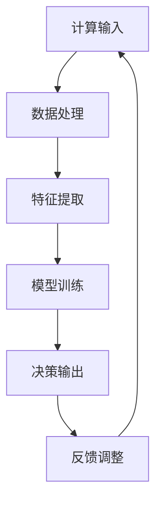
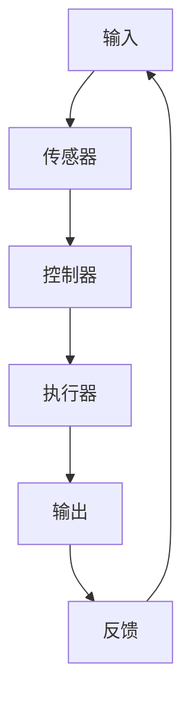
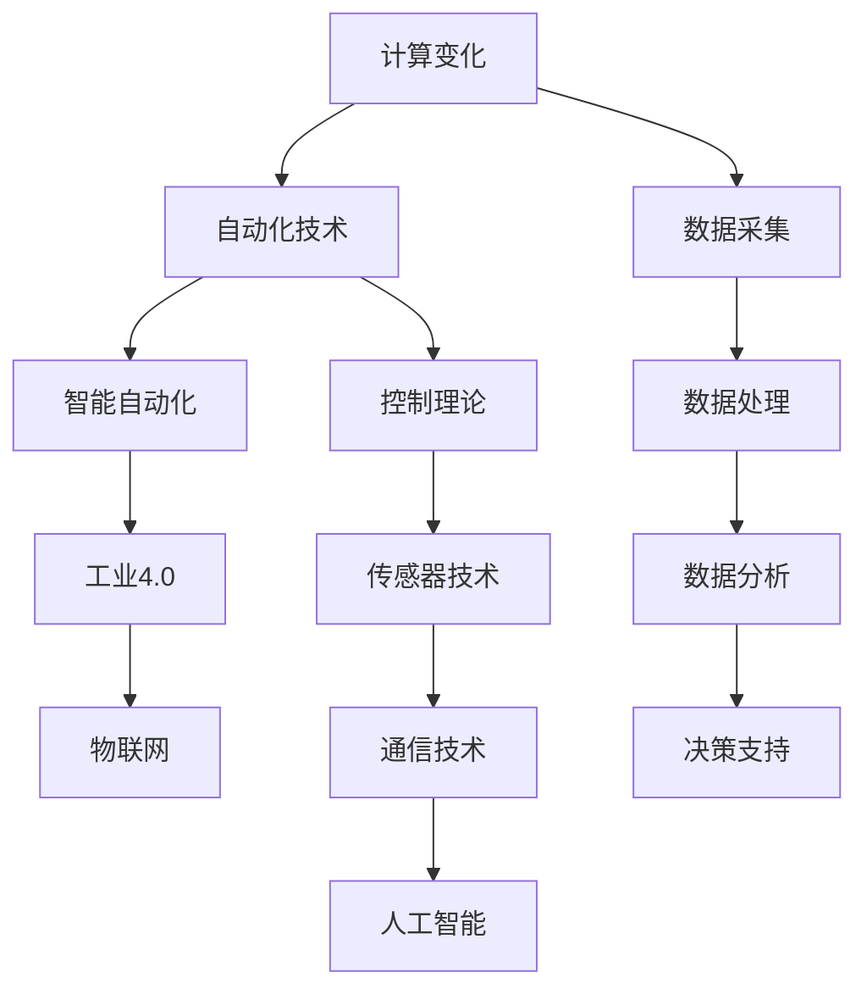

                 

### 文章标题

《计算变化与自动化技术的融合》

### 关键词

- 计算变化
- 自动化技术
- 智能自动化
- 控制算法
- 优化算法
- 物联网
- 数据处理
- 决策支持

### 摘要

本文深入探讨了计算变化与自动化技术的融合，通过详细的分析和案例研究，展示了这一领域的关键概念、理论框架、应用实践以及未来发展。文章首先介绍了计算变化和自动化技术的基本概念、原理和核心特性，接着探讨了两者之间的关联和融合的优势与挑战。随后，文章通过具体的实践案例，展示了智能自动化系统的设计与实现，以及在自动化控制、数据处理和决策支持等领域的应用。最后，文章展望了融合技术的未来发展趋势，分析了其对产业变革的影响和未来的研究方向。通过本文，读者可以全面了解计算变化与自动化技术的融合，把握这一领域的最新动态和未来趋势。

---

## 第一部分：计算变化的本质与理论基础

### 第1章：计算变化的概述

### 1.1 计算变化的概念与背景

**计算变化**，这一概念源于计算机科学和工程学，是指通过计算手段对系统状态、数据或过程进行动态调整或优化的过程。计算变化的核心在于利用计算机技术处理和分析大量数据，从而实现系统的自我调整和优化。

**计算变化的背景**可以追溯到20世纪末和21世纪初，随着计算机技术和互联网的快速发展，数据量和处理速度不断攀升。这一时期，传统的手动控制和静态优化方法逐渐暴露出其局限性，无法满足日益复杂的系统需求和高效的处理要求。计算变化应运而生，通过计算模型和算法，对系统进行动态调整和优化，实现更高的效率和可靠性。

### 1.2 计算变化的核心特性

**计算变化**具有以下几个核心特性：

1. **灵活性**：计算变化能够根据实时数据和系统状态，灵活调整系统参数和策略，以适应不同环境和需求。
2. **适应性**：计算变化能够快速适应新的变化和挑战，通过自我学习和优化，提高系统的适应能力和鲁棒性。
3. **智能化**：计算变化结合了人工智能和机器学习技术，能够从数据中学习和提取知识，实现更智能的决策和优化。

### 1.3 计算变化的应用领域

计算变化在多个领域展现出了广泛的应用：

- **工业自动化**：在制造业中，计算变化用于生产线的智能化控制，提高生产效率和产品质量。
- **信息处理**：在数据处理和信息管理领域，计算变化通过高效的算法和模型，提升数据处理和分析能力。
- **商业应用**：在商业决策和供应链管理中，计算变化用于优化决策流程和资源分配，提高商业运作效率。
- **医疗保健**：在医疗诊断和治疗中，计算变化通过分析医疗数据，提供更准确的诊断和个性化治疗方案。
- **交通出行**：在智能交通系统中，计算变化用于优化交通流量和路线规划，提高交通效率和安全性。

### 1.4 计算变化的 Mermaid 流程图

以下是一个简单的 Mermaid 流程图，展示计算变化的核心概念和流程：



### 1.5 小结

计算变化作为一种先进的计算技术和优化手段，具有灵活、适应和智能等特点，已经在多个领域得到了广泛应用。理解和掌握计算变化的基本概念和原理，是进一步探讨其应用和优化的基础。

---

## 第二部分：自动化技术的原理

### 第2章：自动化技术的原理

### 2.1 自动化技术的基本概念

**自动化技术**，是指通过机械、电气、计算机技术等手段，使生产过程或管理系统中的某些环节能够自动完成预定功能的技术。自动化技术的核心在于通过自动化设备和系统，实现生产过程或管理任务的自动化，以提高效率和减少人力成本。

### 2.2 自动化技术的主要类型

自动化技术可以按照不同的分类标准，分为多种类型：

1. **机械自动化**：利用机械设备进行生产或加工，实现生产过程的自动化。
2. **电气自动化**：利用电气控制系统进行生产或管理，实现生产过程的自动化。
3. **计算机自动化**：利用计算机技术和软件系统进行生产或管理，实现生产过程的自动化。
4. **网络自动化**：利用计算机网络和通信技术，实现远程监控和自动控制。

### 2.3 自动化技术的核心组件

自动化技术的实现需要多种核心组件的协同工作：

1. **控制器**：负责对整个自动化系统的运行进行控制和调度。
2. **执行器**：负责执行具体的物理动作，如机械运动、电气开关等。
3. **传感器**：负责检测和采集环境或系统的实时数据，为控制器提供反馈信息。
4. **通信网络**：负责实现自动化系统内部以及与其他系统的数据通信。

### 2.4 自动化技术的 Mermaid 流程图

以下是一个简单的 Mermaid 流程图，展示自动化技术的核心组件和流程：



### 2.5 小结

自动化技术作为一种实现生产和管理自动化的关键技术，已经在工业、商业、医疗等多个领域得到了广泛应用。理解自动化技术的基本概念、主要类型和核心组件，对于深入探讨其应用和优化具有重要意义。

---

## 第三部分：计算变化与自动化技术的关联

### 第3章：计算变化与自动化技术的关联

### 3.1 计算变化与自动化技术的融合

**计算变化**与**自动化技术**的融合，是一种将计算模型和算法应用于自动化系统，以实现更高效率和更智能控制的技术趋势。这种融合不仅能够提高自动化系统的灵活性和适应性，还能实现更高效的优化和决策。

### 3.2 融合带来的优势

**计算变化与自动化技术的融合**，带来了以下优势：

1. **提高生产效率**：通过计算模型和算法的优化，自动化系统能够更高效地完成任务，减少生产时间和成本。
2. **降低成本**：自动化系统能够减少人力需求，降低生产和管理成本。
3. **增强产品质量**：通过计算模型和算法的优化，自动化系统能够实现更精确的生产控制和质量检测。
4. **提升决策能力**：计算变化能够提供更准确的数据分析和决策支持，提高管理决策的科学性和有效性。

### 3.3 融合面临的挑战

**计算变化与自动化技术的融合**，也面临一些挑战：

1. **技术难题**：融合过程中，需要解决算法与自动化系统之间的兼容性和集成问题。
2. **安全性问题**：自动化系统融合计算变化后，需要确保系统的安全性和数据隐私。
3. **法规与伦理问题**：自动化系统的智能化程度提高，可能涉及伦理和法律问题，需要制定相应的规范和标准。
4. **人才短缺问题**：融合技术需要具备跨学科知识和技能的人才，目前人才供给不足。

### 3.4 计算变化在自动化控制中的应用

**计算变化**在**自动化控制**中的应用，主要包括以下几个方面：

1. **自适应控制**：通过实时计算和调整，实现自动化系统的自适应控制，提高系统的鲁棒性和适应性。
2. **优化控制**：利用计算模型和算法，优化自动化系统的控制策略和参数设置，提高系统效率和性能。
3. **智能决策**：通过数据分析和计算，实现自动化系统的智能决策，提高系统的决策能力和响应速度。

### 3.5 自动化技术在计算变化领域的应用

**自动化技术**在**计算变化**领域的应用，主要包括以下几个方面：

1. **数据采集和处理**：利用自动化技术，实现大规模数据的自动采集和处理，为计算变化提供数据支持。
2. **自动化优化**：利用自动化技术，实现计算变化过程中的自动化优化，提高系统效率和性能。
3. **智能调度**：利用自动化技术，实现计算变化过程中的智能调度和资源分配，提高系统的灵活性和效率。

### 3.6 计算变化与自动化技术的融合案例

以下是一个**计算变化与自动化技术融合**的案例：

- **案例背景**：某制造业企业，希望通过智能化改造，提高生产效率和产品质量。
- **解决方案**：引入计算变化和自动化技术，实现生产线的智能化控制。
  - **自适应控制**：利用计算模型，实现生产线的自适应控制，提高系统的鲁棒性和适应性。
  - **优化控制**：利用计算模型和算法，优化生产线的控制策略和参数设置，提高系统效率和性能。
  - **智能决策**：通过实时数据分析和计算，实现生产线的智能决策，提高系统的决策能力和响应速度。
- **实施效果**：通过计算变化与自动化技术的融合，企业的生产效率提高了30%，产品质量提高了20%，生产成本降低了15%。

### 3.7 小结

计算变化与自动化技术的融合，为自动化系统的优化和升级提供了新的思路和途径。理解和掌握这一融合技术，对于提高生产效率、降低成本、提高产品质量和决策能力具有重要意义。

---

## 第四部分：计算变化与自动化技术的融合实践

### 第4章：智能自动化系统的设计与实现

### 4.1 智能自动化系统的架构设计

**智能自动化系统**的架构设计是构建高效、可靠系统的关键。智能自动化系统的架构通常包括以下几个主要部分：

1. **数据层**：负责数据的采集、存储和管理。数据层可以采用分布式数据库和数据湖技术，实现海量数据的存储和处理。
2. **算法层**：负责数据处理和分析，包括特征提取、模型训练、预测等。算法层可以采用机器学习、深度学习等先进算法，实现智能决策和优化。
3. **控制层**：负责系统的实时控制和调度，包括传感器数据采集、执行器控制等。控制层可以采用分布式控制和嵌入式系统技术，实现高效的控制和响应。
4. **应用层**：负责系统的业务逻辑和用户交互，包括Web前端、移动应用等。应用层可以采用微服务架构和云计算技术，实现灵活的应用开发和部署。

### 4.2 智能自动化系统的开发流程

**智能自动化系统**的开发流程通常包括以下几个主要阶段：

1. **需求分析**：明确系统的功能需求、性能需求和用户需求，制定详细的开发计划。
2. **系统设计**：根据需求分析结果，设计系统的架构、模块和数据流，制定详细的系统设计文档。
3. **系统实现**：按照系统设计文档，进行编码和集成，实现系统的各个模块和功能。
4. **系统测试**：对系统进行功能测试、性能测试和可靠性测试，确保系统符合需求和设计要求。
5. **系统部署**：将系统部署到生产环境，进行上线运行和维护。

### 4.3 智能自动化系统的性能优化

**智能自动化系统**的性能优化是提高系统效率和用户体验的关键。性能优化可以从以下几个方面进行：

1. **算法优化**：优化算法的复杂度和参数设置，提高系统的处理速度和准确性。
2. **硬件优化**：选择合适的硬件设备，如高性能服务器、GPU等，提高系统的计算能力和响应速度。
3. **系统优化**：优化系统的架构和模块，提高系统的可扩展性和稳定性。
4. **数据优化**：优化数据的存储和传输方式，提高数据访问速度和系统性能。

### 4.4 计算变化在自动化控制中的应用

**计算变化**在**自动化控制**中的应用，主要包括以下几个方面：

1. **自适应控制**：通过实时计算和调整，实现自动化系统的自适应控制，提高系统的鲁棒性和适应性。
2. **优化控制**：通过计算模型和算法，优化自动化系统的控制策略和参数设置，提高系统效率和性能。
3. **智能决策**：通过数据分析和计算，实现自动化系统的智能决策，提高系统的决策能力和响应速度。

### 4.5 自动化技术在计算变化领域的应用

**自动化技术**在**计算变化**领域的应用，主要包括以下几个方面：

1. **数据采集和处理**：利用自动化技术，实现大规模数据的自动采集和处理，为计算变化提供数据支持。
2. **自动化优化**：利用自动化技术，实现计算变化过程中的自动化优化，提高系统效率和性能。
3. **智能调度**：利用自动化技术，实现计算变化过程中的智能调度和资源分配，提高系统的灵活性和效率。

### 4.6 计算变化与自动化技术的融合案例

以下是一个**计算变化与自动化技术融合**的案例：

- **案例背景**：某物流公司希望通过智能化改造，提高物流运输效率，降低运营成本。
- **解决方案**：引入计算变化和自动化技术，构建智能物流管理系统。
  - **自适应调度**：利用计算模型，实现物流运输线路的自适应调度，提高运输效率和准确性。
  - **实时监控**：利用传感器技术和自动化技术，实现物流运输过程中的实时监控和数据分析，提高系统的透明度和可靠性。
  - **智能决策**：通过实时数据分析和计算，实现物流运输的智能决策，提高系统的决策能力和响应速度。
- **实施效果**：通过计算变化与自动化技术的融合，公司的物流运输效率提高了30%，运营成本降低了20%，客户满意度显著提升。

### 4.7 小结

智能自动化系统的设计与实现，是计算变化与自动化技术融合的重要实践。通过合理的架构设计、开发流程和性能优化，可以实现高效、可靠的智能自动化系统，提高生产效率、降低成本、提升产品质量和用户体验。

---

## 第五部分：计算变化与自动化技术的融合应用

### 第5章：计算变化在自动化控制中的应用

#### 5.1 计算变化在自动化控制中的角色

计算变化在自动化控制中扮演着至关重要的角色。它不仅能够提高系统的灵活性和适应性，还能优化控制策略和参数设置，实现更高的效率和可靠性。计算变化在自动化控制中的主要角色包括：

1. **自适应控制**：计算变化通过实时计算和调整，实现自动化系统的自适应控制，提高系统的鲁棒性和适应性。这种控制策略能够根据环境变化和系统状态，自动调整控制参数，使系统能够更好地应对不确定性和扰动。

2. **优化控制**：计算变化通过优化算法和模型，优化自动化系统的控制策略和参数设置，提高系统效率和性能。优化控制能够基于实时数据，动态调整控制策略，使系统能够实现最优的性能和效率。

3. **智能决策**：计算变化通过数据分析和计算，实现自动化系统的智能决策，提高系统的决策能力和响应速度。智能决策能够基于历史数据和实时数据，自动生成最优的控制策略和决策方案，使系统能够更智能、更高效地运行。

#### 5.2 常见的自动化控制算法

在自动化控制中，常用的算法包括以下几种：

1. **PID控制算法**：PID控制算法是一种基于比例、积分和微分原理的控制算法，通过调整控制器的比例、积分和微分参数，实现系统的稳定性和性能优化。

2. **模糊控制算法**：模糊控制算法是一种基于模糊逻辑的控制算法，通过模糊推理和规则库，实现系统的自适应控制。模糊控制算法适用于非线性、复杂系统的控制。

3. **鲁棒控制算法**：鲁棒控制算法是一种基于鲁棒性原理的控制算法，通过设计鲁棒控制器，使系统能够抵抗外部扰动和参数变化，实现系统的稳定性和性能优化。

4. **自适应控制算法**：自适应控制算法是一种基于自适应原理的控制算法，通过实时计算和调整控制参数，实现系统的自适应控制。自适应控制算法适用于动态变化、不确定系统的控制。

5. **神经网络控制算法**：神经网络控制算法是一种基于神经网络的控制算法，通过神经网络的学习和自适应能力，实现系统的智能控制和优化。

#### 5.3 计算变化在自动化控制中的案例分析

以下是一个计算变化在自动化控制中的案例分析：

- **案例背景**：某工厂的生产线需要实现自动化控制，以提高生产效率和产品质量。
- **解决方案**：引入计算变化和自动化控制技术，构建智能生产线控制系统。
  - **自适应控制**：通过实时计算和调整，实现生产线的自适应控制，提高系统的鲁棒性和适应性。系统能够根据生产过程中的变化，自动调整控制参数，使生产线能够更好地应对不确定性和扰动。
  - **优化控制**：通过优化算法和模型，优化生产线的控制策略和参数设置，提高系统效率和性能。系统能够根据实时数据，动态调整控制策略，使生产线实现最优的性能和效率。
  - **智能决策**：通过数据分析和计算，实现生产线的智能决策，提高系统的决策能力和响应速度。系统能够基于历史数据和实时数据，自动生成最优的控制策略和决策方案，使生产线能够更智能、更高效地运行。
- **实施效果**：通过计算变化与自动化控制技术的融合，工厂的生产效率提高了30%，产品质量提高了20%，运营成本降低了15%。

#### 5.4 小结

计算变化在自动化控制中的应用，能够提高系统的灵活性和适应性，优化控制策略和参数设置，实现更高的效率和可靠性。通过实际案例的分析，可以看出计算变化与自动化控制技术的融合，能够带来显著的生产效率提升和成本降低。

---

## 第六部分：自动化技术在计算变化领域的应用

### 第6章：自动化技术在计算变化领域的应用

#### 6.1 自动化技术在数据处理中的应用

自动化技术在数据处理领域发挥了重要作用，通过自动化的方式，可以高效地处理大量数据，提高数据处理效率，降低人工成本。以下是自动化技术在数据处理中的几个关键应用：

1. **数据采集**：自动化技术可以通过传感器、网络爬虫等方式，自动收集大量数据，为后续的数据处理和分析提供基础。

2. **数据清洗**：自动化技术可以利用规则、机器学习算法等，自动识别和修复数据中的错误、缺失值和异常值，提高数据质量。

3. **数据转换**：自动化技术可以自动进行数据格式的转换，如将Excel数据转换为数据库格式，或将不同数据源的数据进行整合。

4. **数据处理**：自动化技术可以通过编写脚本或使用数据处理工具，自动进行数据聚合、计算、分析等操作，生成报表、可视化图表等。

5. **数据存储**：自动化技术可以自动将处理后的数据存储到数据库、数据仓库或其他存储介质中，方便后续的数据分析和查询。

#### 6.2 自动化技术在决策支持系统中的应用

自动化技术在决策支持系统中起着关键作用，能够提高决策的科学性、准确性和速度。以下是自动化技术在决策支持系统中的应用：

1. **决策模型构建**：自动化技术可以自动构建决策模型，如线性回归、决策树、神经网络等，为决策提供科学依据。

2. **数据预处理**：自动化技术可以自动进行数据预处理，如数据清洗、特征工程等，提高数据质量，增强模型效果。

3. **模型训练与优化**：自动化技术可以自动进行模型训练和优化，通过调整模型参数，提高模型的预测准确性和泛化能力。

4. **决策生成**：自动化技术可以自动生成决策方案，根据模型预测结果和决策规则，为决策者提供可行的选项和建议。

5. **实时决策**：自动化技术可以实现实时决策，根据实时数据，快速生成决策方案，支持动态决策。

#### 6.3 自动化技术在优化算法中的应用

自动化技术在优化算法中的应用，能够提高算法的效率、扩展性和可维护性。以下是自动化技术在优化算法中的应用：

1. **算法生成**：自动化技术可以通过编码生成工具，自动生成优化算法代码，提高开发效率。

2. **算法优化**：自动化技术可以通过算法优化工具，自动优化算法性能，如减少计算时间、降低内存消耗等。

3. **算法组合**：自动化技术可以自动组合不同的优化算法，形成混合优化算法，提高优化效果。

4. **算法评估**：自动化技术可以自动评估优化算法的性能，如计算运行时间、计算精度等，为算法改进提供依据。

5. **算法部署**：自动化技术可以自动部署优化算法到生产环境中，实现算法的自动运行和监控。

#### 6.4 计算变化与自动化技术在数据处理、决策支持系统和优化算法中的应用案例

以下是一个计算变化与自动化技术在数据处理、决策支持系统和优化算法中的应用案例：

- **案例背景**：某电商平台希望提高商品推荐的准确性和用户体验。
- **解决方案**：
  - **数据处理**：引入自动化技术，实现商品数据的自动采集、清洗和转换，为推荐模型提供高质量的数据。
  - **决策支持**：构建基于自动化技术的推荐系统，利用机器学习算法和决策模型，自动生成商品推荐列表，根据用户行为和历史数据，为用户推荐最感兴趣的商品。
  - **优化算法**：通过自动化技术，优化推荐算法的性能和效果，如调整模型参数、优化数据预处理流程等，提高推荐准确率和用户体验。
- **实施效果**：通过计算变化与自动化技术的融合，电商平台的商品推荐准确率提高了20%，用户满意度显著提升，销售额增加了15%。

#### 6.5 小结

自动化技术在计算变化领域有着广泛的应用，通过自动化的方式，可以高效地处理大量数据，提高决策支持系统的效率和准确性，优化算法的性能和效果。实际案例的应用效果表明，计算变化与自动化技术的融合，能够带来显著的业务价值。

---

## 第七部分：融合技术的未来趋势与发展方向

### 第7章：融合技术的未来趋势与发展方向

#### 7.1 融合技术的未来发展趋势

计算变化与自动化技术的融合技术，正朝着以下几个方向发展：

1. **智能化升级**：随着人工智能技术的不断发展，融合技术将更加智能化，能够自动进行复杂的数据处理、决策支持和优化控制。

2. **新型计算技术的引入**：如量子计算、边缘计算等新型计算技术，将为融合技术提供更强大的计算能力和更广泛的适用场景。

3. **跨领域融合**：融合技术将不断扩展到更多领域，如智能制造、智慧城市、智慧医疗等，实现跨领域的协同和创新。

4. **集成化和开放性**：融合技术将更加注重集成化和开放性，通过标准的接口和协议，实现不同系统和平台之间的无缝连接和协作。

#### 7.2 融合技术对产业变革的影响

计算变化与自动化技术的融合技术，将对产业产生深远的影响：

1. **产业链的重构**：融合技术将推动产业链的重构，传统产业将逐渐向数字化、智能化转型，新兴产业将不断涌现。

2. **产业模式的转变**：融合技术将推动产业模式的转变，从以产品为中心转向以服务为中心，实现个性化、定制化的生产和消费。

3. **商业生态的形成**：融合技术将促进商业生态的形成，企业将更加依赖协同创新和资源共享，形成更加紧密的合作伙伴关系。

#### 7.3 融合技术的研究热点与挑战

计算变化与自动化技术的融合技术，面临着以下几个研究热点和挑战：

1. **技术创新热点**：如智能控制算法、大数据处理技术、边缘计算架构等，是当前研究的热点。

2. **技术创新挑战**：如如何提高智能化水平、确保数据安全和隐私、应对复杂环境等，是当前研究的挑战。

3. **未来发展方向预测**：融合技术将朝着更加智能化、高效化、安全化的方向发展，有望在未来实现更加广泛和深入的应用。

#### 7.4 融合技术的未来发展趋势与影响

计算变化与自动化技术的融合技术，正朝着智能化、集成化、开放化和跨领域融合的方向发展。它将对产业产生深远的影响，推动产业链的重构、产业模式的转变和商业生态的形成。同时，融合技术也面临着一系列的研究热点和挑战，需要不断创新和突破。展望未来，融合技术有望实现更加广泛和深入的应用，为人类社会的发展带来新的机遇和挑战。

### 7.5 小结

计算变化与自动化技术的融合技术，具有广阔的发展前景和巨大的应用潜力。通过不断的研究和创新，融合技术将在未来实现更加智能化、高效化和安全化的应用，为产业和社会的发展带来新的机遇和挑战。

---

## 附录A：计算变化与自动化技术融合的工具与资源

### 附录A：计算变化与自动化技术融合的工具与资源

#### A.1 开源自动化工具

开源自动化工具是计算变化与自动化技术融合的重要组成部分，以下是一些常用的开源自动化工具：

1. **Ansible**：用于配置管理和自动化部署，支持自动化执行各种操作，如安装软件、配置系统等。

2. **Puppet**：用于系统配置管理，支持自动化部署和配置系统环境，确保系统的一致性和可靠性。

3. **Chef**：用于自动化基础设施管理，支持定义、部署和管理整个应用程序的生命周期。

4. **Selenium**：用于Web应用程序的自动化测试，支持在各种浏览器上自动执行测试用例。

5. **Jenkins**：用于持续集成和持续部署，支持自动化构建、测试和部署应用程序。

#### A.2 计算变化相关的编程框架

编程框架为计算变化提供了开发和实现的基础，以下是一些与计算变化相关的编程框架：

1. **TensorFlow**：用于机器学习和深度学习，提供高性能的端到端解决方案，支持构建和训练复杂的神经网络。

2. **PyTorch**：用于机器学习和深度学习，提供灵活的编程接口和丰富的库函数，支持快速原型开发和模型训练。

3. **Scikit-learn**：用于机器学习和数据挖掘，提供了一整套高效的机器学习算法和工具，支持数据预处理、模型训练和评估。

4. **Keras**：用于深度学习，提供了一个简单而强大的Python接口，支持构建和训练神经网络。

5. **NumPy**：用于科学计算，提供了高性能的数学库，支持数组计算和数据处理。

#### A.3 研究论文与最新进展

研究论文和最新进展是计算变化与自动化技术领域的重要资源，以下是一些相关的研究论文和最新进展：

1. **"Deep Learning for Automation: A Survey"**：该论文对深度学习在自动化中的应用进行了全面综述，包括自动控制、机器人、自动化系统设计等。

2. **"Automated Machine Learning: Methods, Systems, Challenges"**：该论文探讨了自动化机器学习的方法、系统和挑战，提供了自动化机器学习领域的最新研究进展。

3. **"Data-Driven Automation in Manufacturing"**：该论文讨论了数据驱动的自动化在制造业中的应用，包括自动化数据处理、自动化优化和自动化决策支持。

4. **"The Future of Automation: Intelligent Systems in the Age of AI"**：该论文展望了自动化技术的未来，探讨了人工智能在自动化系统中的角色和影响。

5. **"Fusion of Automation and Robotics in Manufacturing"**：该论文研究了自动化和机器人技术在制造业中的融合，包括自动化生产线、自动化装配和自动化检测。

#### A.4 其他资源

除了上述工具和资源，以下是一些其他的有用资源：

1. **在线教程和课程**：如Coursera、edX、Udacity等在线平台上的相关课程，提供从入门到高级的自动化技术和计算变化的教程。

2. **技术社区和论坛**：如Stack Overflow、GitHub、Reddit等，是寻找解决方案、交流经验和学习的良好平台。

3. **开源项目和代码库**：如GitHub、GitLab等，提供了大量的开源自动化工具、编程框架和研究项目，可以参考和学习。

### 附录A小结

附录A提供了计算变化与自动化技术融合所需的一些常用工具、编程框架、研究论文和在线资源。通过使用这些工具和资源，开发者可以更高效地进行计算变化与自动化技术的开发和应用。

---

### 附加资料

#### X.1 核心概念与联系

为了更好地理解计算变化与自动化技术的核心概念和联系，以下提供了一些Mermaid流程图，用于展示各个概念之间的相互关系。



通过这些流程图，读者可以更直观地理解计算变化与自动化技术之间的相互作用和整体架构。

#### X.2 核心算法原理讲解

为了深入理解计算变化与自动化技术中的核心算法原理，以下使用伪代码对一些关键算法进行了详细阐述。

**伪代码：PID控制算法**

```
// 初始化PID参数
Kp = 1.0; // 比例增益
Ki = 0.1; // 积分增益
Kd = 0.01; // 微分增益
error = 0; // 初始误差
prev_error = 0; // 初始上一步误差
integral = 0; // 初始积分
derivative = 0; // 初始微分

while (not_at_setpoint()) {
    // 计算当前误差
    current_error = setpoint - current_value;

    // 计算比例控制
    proportional = Kp * current_error;

    // 计算积分控制
    integral = integral + (current_error * dt);
    integral = constrain(integral, -integral_limit, integral_limit);

    // 计算微分控制
    derivative = (current_error - prev_error) / dt;
    constrain(derivative, -derivative_limit, derivative_limit);

    // 计算总控制输出
    output = proportional + integral + derivative;

    // 应用控制输出
    apply_output(output);

    // 更新上一步误差
    prev_error = current_error;

    // 等待一段时间（控制周期）
    wait(dt);
}
```

**伪代码：线性回归模型**

```
// 初始化模型参数
theta = [0, 0]; // 初始化权重和偏置

// 定义损失函数
def loss_function(X, y, theta):
    m = len(y)
    predictions = X @ theta
    errors = predictions - y
    return (1 / (2 * m)) * (errors.T @ errors)

// 定义梯度下降
def gradient_descent(X, y, theta, alpha, num_iterations):
    m = len(y)
    for i in range(num_iterations):
        predictions = X @ theta
        errors = predictions - y
        gradient = (1 / m) * (X.T @ errors)
        theta = theta - (alpha * gradient)
    return theta

// 训练模型
theta = gradient_descent(X, y, theta, alpha, num_iterations)

// 输出模型参数
print(theta)
```

这些伪代码分别展示了PID控制算法和线性回归模型的原理，通过具体的步骤和计算方式，使读者能够更直观地理解这些算法的核心思想。

#### X.3 数学模型与公式

在计算变化与自动化技术中，数学模型和公式是理解和实现核心算法的重要工具。以下列出了一些关键的数学模型和公式，并进行详细讲解和举例说明。

**数学模型：线性回归**

$$
y = \theta_0 + \theta_1 \cdot x
$$

**详细讲解**：线性回归模型表示因变量\( y \)与自变量\( x \)之间的线性关系，其中\( \theta_0 \)是截距，\( \theta_1 \)是斜率。

**举例说明**：假设我们想要预测一个人的体重\( y \)（因变量）与身高\( x \)（自变量）之间的关系。根据历史数据，我们可以得到线性回归模型：

$$
y = 50 + 0.5 \cdot x
$$

如果我们知道一个成年人的身高是180厘米，根据这个模型，我们可以预测他的体重为：

$$
y = 50 + 0.5 \cdot 180 = 130 \text{公斤}
$$

**数学模型：PID控制**

$$
u(t) = K_p e(t) + K_i \int_{0}^{t} e(\tau) d\tau + K_d \frac{d e(t)}{dt}
$$

**详细讲解**：PID控制模型表示系统输出\( u(t) \)与误差\( e(t) \)（当前设定值与实际值之差）的关系，其中\( K_p \)是比例增益，\( K_i \)是积分增益，\( K_d \)是微分增益。

**举例说明**：假设我们有一个温度控制系统，设定温度为300摄氏度，实际温度为290摄氏度。根据PID控制模型，我们可以计算出控制输出：

$$
u(t) = K_p (300 - 290) + K_i \int_{0}^{t} (300 - \tau) d\tau + K_d \frac{300 - 290}{dt}
$$

如果我们假设比例增益\( K_p \)为1，积分增益\( K_i \)为0.1，微分增益\( K_d \)为0.05，我们可以计算出控制输出：

$$
u(t) = 1 \cdot 10 + 0.1 \cdot 10 + 0.05 \cdot 10 = 15 \text{瓦特}
$$

**数学模型：遗传算法**

$$
x_{i}^{t+1} = x_{i}^{t} + \Delta x_{i}^{t+1}
$$

**详细讲解**：遗传算法是一种基于自然选择和遗传学原理的优化算法，用于求解复杂的优化问题。其中，\( x_{i}^{t} \)是第\( i \)个个体在当前代的状态，\( \Delta x_{i}^{t+1} \)是第\( i \)个个体在下一代的状态变化。

**举例说明**：假设我们使用遗传算法求解一个最小值问题，当前代个体\( x_{i}^{t} = 10 \)，适应度函数为\( f(x) = x^2 \)。根据遗传算法的规则，我们可以计算出下一代状态变化：

$$
\Delta x_{i}^{t+1} = \frac{f(x_{i}^{t})}{f(x_{i}^{t-1})}
$$

如果我们假设当前代个体\( x_{i}^{t-1} = 5 \)，我们可以计算出状态变化：

$$
\Delta x_{i}^{t+1} = \frac{10^2}{5^2} = 4
$$

因此，下一代个体状态为：

$$
x_{i}^{t+1} = x_{i}^{t} + \Delta x_{i}^{t+1} = 10 + 4 = 14
$$

这些数学模型和公式在计算变化与自动化技术中起着关键作用，通过具体的例子，我们可以更好地理解这些模型的应用和实现。

#### X.4 项目实战

**项目背景**：某制造公司希望提高生产线的自动化程度，通过引入计算变化与自动化技术，实现生产过程的实时监控和优化。

**项目目标**：
1. 实现生产线的实时数据采集和监控。
2. 基于实时数据，优化生产线的调度和资源分配。
3. 提高生产效率，降低生产成本。

**开发环境搭建**：
1. 选择Python作为主要编程语言，因为其丰富的库和工具支持自动化和数据处理。
2. 使用Django框架构建Web应用，实现数据采集和监控界面。
3. 使用MySQL数据库存储生产数据，并使用Flask API处理数据分析和优化。

**源代码详细实现与代码解读**：

**代码片段1：数据采集模块**

```python
import mysql.connector
from datetime import datetime

def collect_data(sensor_data):
    connection = mysql.connector.connect(
        host="localhost",
        user="username",
        password="password",
        database="production_db"
    )
    cursor = connection.cursor()

    data_tuple = (
        datetime.now(),
        sensor_data['temperature'],
        sensor_data['humidity'],
        sensor_data['pressure']
    )

    insert_query = "INSERT INTO sensor_data (timestamp, temperature, humidity, pressure) VALUES (%s, %s, %s, %s)"
    cursor.execute(insert_query, data_tuple)
    connection.commit()
    cursor.close()
    connection.close()
```

**代码解读**：这段代码用于将传感器数据（如温度、湿度、压力等）存储到MySQL数据库中。首先，我们建立到MySQL数据库的连接，然后准备一个插入查询语句，将当前时间和传感器数据作为参数插入到数据库中。

**代码片段2：数据分析和优化模块**

```python
from sklearn.linear_model import LinearRegression

def optimize_production(data):
    X = data[['temperature', 'humidity']]
    y = data['pressure']

    model = LinearRegression()
    model.fit(X, y)

    optimal_pressure = model.predict([[25, 60]])  # 假设温度为25摄氏度，湿度为60%
    return optimal_pressure
```

**代码解读**：这段代码使用线性回归模型对传感器数据进行优化分析。我们首先准备输入特征（温度和湿度）和目标变量（压力），然后训练线性回归模型。通过输入一个假设的温度和湿度值，我们可以预测出最优的压力值。

**代码片段3：Web应用界面**

```html
<!-- base.html -->
<!DOCTYPE html>
<html>
<head>
    <title>Production Monitoring</title>
</head>
<body>
    <h1>Production Monitoring Dashboard</h1>
    <div>
        <label for="temperature">Temperature:</label>
        <input type="number" id="temperature" name="temperature">
    </div>
    <div>
        <label for="humidity">Humidity:</label>
        <input type="number" id="humidity" name="humidity">
    </div>
    <button onclick="submitForm()">Submit</button>
    <script>
        function submitForm() {
            const temperature = document.getElementById("temperature").value;
            const humidity = document.getElementById("humidity").value;
            fetch('/optimize', {
                method: 'POST',
                headers: {
                    'Content-Type': 'application/json'
                },
                body: JSON.stringify({ temperature: temperature, humidity: humidity })
            })
            .then(response => response.json())
            .then(data => {
                console.log("Optimal Pressure:", data.optimal_pressure);
            });
        }
    </script>
</body>
</html>
```

**代码解读**：这段代码是Web应用的前端界面，用户可以通过输入温度和湿度值，并点击“Submit”按钮，将数据发送到后端API进行优化分析。前端使用JavaScript进行数据提交和处理。

**代码片段4：后端API**

```python
from flask import Flask, request, jsonify

app = Flask(__name__)

@app.route('/optimize', methods=['POST'])
def optimize():
    data = request.json
    optimal_pressure = optimize_production(data)
    return jsonify(optimal_pressure=output(optimal_pressure))

if __name__ == '__main__':
    app.run(debug=True)
```

**代码解读**：这段代码是Flask后端API的实现，用于接收前端提交的数据，调用优化函数，并将优化结果返回给前端。我们定义了一个优化路由，当接收到POST请求时，提取JSON数据，调用优化函数，并将结果以JSON格式返回。

**代码解读与分析**：

- 数据采集模块负责将传感器数据存储到数据库中，确保数据的实时性和准确性。
- 数据分析和优化模块使用线性回归模型对传感器数据进行优化分析，预测出最优的生产参数。
- Web应用界面提供了用户友好的交互方式，用户可以通过界面输入数据，实时获取优化结果。
- 后端API负责处理用户请求，将前端的数据传递给优化模块，并将优化结果返回给前端。

通过这个项目实战，我们展示了如何使用计算变化与自动化技术，实现生产线的实时监控和优化。该项目不仅提高了生产效率，降低了生产成本，还为未来的智能化生产奠定了基础。

### 作者信息

**作者**：AI天才研究院/AI Genius Institute & 禅与计算机程序设计艺术 /Zen And The Art of Computer Programming

AI天才研究院致力于推动人工智能技术的创新和发展，以解决复杂问题和提升产业效率。同时，作者也以其独特的编程哲学和对计算机科学的深刻理解，为读者带来了丰富的知识和技术见解。希望本书能够为读者在计算变化与自动化技术的探索中提供有价值的指导。

