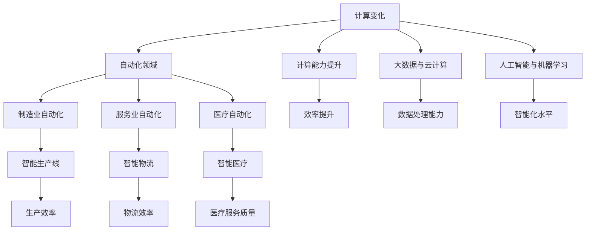

                 

# 文章标题：计算变化对自动化领域的影响

## 关键词
- 计算变化
- 自动化领域
- 影响分析
- 挑战与对策
- 典型案例分析
- 未来发展

## 摘要
本文将探讨计算变化对自动化领域带来的深远影响。首先，我们将对计算变化进行概述，包括其定义、核心要素和未来趋势。接着，分析计算变化对自动化产业、技术和应用的影响。随后，我们探讨自动化领域在计算变化中面临的挑战及应对策略。通过具体案例分析，展示计算变化在智能工厂、智能物流和智能医疗等领域的应用效果。最后，展望自动化领域的未来发展，探讨国际合作的重要性和策略。

---

### 第一部分：计算变化对自动化领域的影响概述

#### 第1章：计算变化的定义与背景

### 第1章：计算变化的定义与背景

**1.1 计算变化的定义与背景**

**计算变化**指的是计算技术的不断进步和变革，涵盖计算能力提升、大数据与云计算融合、人工智能与机器学习的广泛应用。随着信息技术的飞速发展，计算变化正深刻影响着各个行业，其中自动化领域尤为显著。

**自动化领域的历史背景**

自动化（Automation）是指利用各种设备和系统，通过自动控制代替人工操作，实现生产、加工、物流等环节的高效运行。自动化技术的发展历程可追溯至20世纪初，随着电气化、机械化和信息技术的发展，自动化技术逐渐应用于工业、服务业、医疗等多个领域。

**计算变化带来的影响与机遇**

计算变化的到来，为自动化领域带来了前所未有的机遇和挑战。计算能力的提升使得复杂算法的实现成为可能，大数据和云计算的融合为海量数据的处理提供了强有力的支持，人工智能和机器学习的应用则大大提高了系统的智能化水平。同时，计算变化也为自动化领域带来了新的发展模式和应用场景。

#### **1.2 计算变化的核心要素**

**1.2.1 计算能力的提升**

计算能力的提升是计算变化的核心要素之一。随着处理器性能的不断提高，计算速度和存储容量得到了显著增强。这使得自动化系统可以处理更加复杂和庞大的数据，实现更高效率的决策和优化。

**1.2.2 大数据和云计算的融合**

大数据和云计算的融合为自动化领域提供了强大的数据处理能力。大数据技术能够高效地存储、管理和分析海量数据，云计算则提供了弹性可扩展的计算资源。两者的结合使得自动化系统能够更好地应对数据驱动的挑战，实现实时监控和智能决策。

**1.2.3 人工智能与机器学习的应用**

人工智能（AI）和机器学习（ML）技术的应用，使得自动化系统的智能化水平得到了大幅提升。通过模拟人脑的神经网络结构，AI和ML技术能够从数据中自动学习和优化，实现智能感知、预测和决策。这一技术的应用，不仅提高了自动化系统的效率和准确性，还为新的应用场景和业务模式的出现提供了可能。

#### **1.3 计算变化的趋势与前景**

**1.3.1 未来计算变化的方向**

未来计算变化将继续朝着更高性能、更高效能和更智能化的方向发展。这将包括量子计算的突破、边缘计算的应用、新型存储技术的发展等。

**1.3.2 自动化领域的发展机遇与挑战**

自动化领域在计算变化中面临诸多机遇和挑战。机遇包括智能化升级、产业链重塑、新业务模式的出现等。挑战则包括数据安全与隐私问题、技术更新与人才培养等。

通过以上分析，我们可以看到计算变化对自动化领域产生了深远的影响。下一部分将深入分析计算变化对自动化领域的影响，包括对产业、技术和应用的具体影响。

---

### 第二部分：计算变化对自动化领域的影响分析

#### 第2章：计算变化对自动化产业的影响

### 第2章：计算变化对自动化产业的影响

**2.1 自动化产业现状**

自动化产业是指通过应用自动化技术，实现生产、加工、物流等环节的自动化运行。当前，自动化产业已在全球范围内得到广泛应用，尤其在制造业、物流业和医疗领域。根据市场调研机构的数据显示，全球自动化市场规模持续增长，预计未来几年将保持稳定增长态势。

**2.2 计算变化带来的产业变革**

计算变化对自动化产业产生了深远的影响，主要表现在以下几个方面：

**2.2.1 智能化水平的提升**

计算能力的提升和人工智能技术的应用，使得自动化系统的智能化水平得到了显著提升。自动化系统不再仅仅是执行预设的任务，而是能够通过数据分析和机器学习，自主学习和优化，实现智能决策和适应环境变化。

**2.2.2 产业链的重塑**

计算变化对自动化产业链产生了深刻的影响。一方面，新的技术需求推动了产业链上下游企业的合作和协同创新；另一方面，产业链的分工和整合也变得更加灵活和高效。

**2.2.3 新业务模式的出现**

计算变化为自动化领域带来了新的业务模式。例如，基于云计算的自动化平台，使得企业可以按需获取自动化服务，降低运营成本；物联网技术的应用，则使得自动化系统可以更加智能化地与外部环境进行交互，实现更加高效和精准的运营。

#### **2.3 计算变化对自动化技术的影响**

**2.3.1 控制系统的智能化**

计算变化对控制系统的影响尤为显著。传统的控制系统主要依赖于预设的程序和规则，而智能控制系统则通过人工智能和机器学习技术，实现了对系统运行状态的实时监测和动态调整。这种智能化水平的提升，使得控制系统可以更好地应对复杂多变的运行环境，提高系统的可靠性和稳定性。

**2.3.2 数据处理与优化**

计算变化带来了大数据和云计算技术的广泛应用，使得自动化系统能够处理和存储更多的数据。通过对海量数据的分析和挖掘，自动化系统可以更加准确地了解生产过程和运营状态，从而实现数据驱动的优化和决策。例如，通过数据分析，可以优化生产流程，提高生产效率和产品质量。

**2.3.3 人工智能与机器学习的应用**

人工智能和机器学习技术在自动化领域的应用，使得自动化系统具备了自我学习和优化的能力。通过模拟人脑的神经网络结构，自动化系统能够从数据中自动提取特征，进行模式识别和预测，实现更加智能化和精准的决策。例如，在智能工厂中，机器学习算法可以分析生产数据，预测设备故障，提前进行维护，从而减少停机时间，提高生产效率。

通过以上分析，我们可以看到计算变化对自动化技术产生了深远的影响，不仅提升了系统的智能化水平，也为自动化产业带来了新的机遇和挑战。下一部分将分析计算变化对自动化领域应用的具体影响。

---

### 第2章：计算变化对自动化领域应用的影响

**2.1 自动化在制造业中的应用**

计算变化对制造业自动化产生了显著的影响。传统制造业主要依赖于人工操作和机械设备的组合，生产效率相对较低，且容易受到人为因素的影响。随着计算能力的提升和人工智能技术的应用，现代制造业正逐渐向智能化、自动化方向发展。

**2.1.1 智能生产线的建设**

智能生产线是计算变化在制造业中应用的典型代表。智能生产线通过引入自动化设备和控制系统，实现生产过程的高度自动化和智能化。例如，使用机器人进行零部件的组装、检测和包装，使用传感器实时监测生产线上的设备状态，通过数据分析和机器学习优化生产流程。

**2.1.2 生产效率的提升**

计算变化使得制造业的生产效率得到了显著提升。通过智能化设备和系统的应用，生产过程中的废品率降低，设备故障率减少，生产节拍加快。例如，智能工厂可以实现24小时不停机生产，提高了生产效率和产能。

**2.1.3 质量控制的加强**

计算变化还使得制造业的质量控制更加精准和高效。通过引入人工智能和机器学习技术，可以对生产过程中的质量数据进行实时监控和分析，及时发现和纠正质量问题。例如，使用机器学习算法对生产设备进行状态监测，可以预测设备故障，提前进行维护，避免生产过程中因设备故障导致的质量问题。

**2.2 自动化在服务业中的应用**

计算变化在服务业中的应用同样显著，尤其在物流、金融和医疗等领域。

**2.2.1 智能物流**

智能物流是计算变化在物流领域的重要应用。通过引入自动化设备和系统，物流企业可以实现物流过程的高度自动化和智能化。例如，使用机器人进行仓库的整理和分类，使用自动驾驶车辆进行货物运输，通过物联网技术实现物流信息的实时监控和追踪。

**2.2.2 物流效率的提升**

智能物流的应用大大提高了物流效率。通过自动化设备和系统的应用，物流过程中的时间消耗减少，物流成本降低，物流服务质量提高。例如，使用自动驾驶车辆进行货物运输，可以减少驾驶员的工作量，降低物流成本，同时提高运输效率。

**2.2.3 物流信息的实时监控**

计算变化使得物流企业可以实现对物流信息的实时监控。通过物联网技术和大数据分析，物流企业可以实时了解物流状态，及时调整物流策略，提高物流效率。例如，使用物联网传感器实时监测货物的运输状态，可以及时发现并处理物流过程中的问题，确保货物安全准时送达。

**2.3 自动化在医疗领域的应用**

计算变化在医疗领域的应用也日益广泛，尤其在智能医疗设备和医疗信息化方面。

**2.3.1 智能医疗设备**

智能医疗设备是计算变化在医疗领域的重要应用。通过引入人工智能和机器学习技术，医疗设备可以实现更加精准的诊断和治疗。例如，使用深度学习算法对医学影像进行分析，可以提高疾病诊断的准确性；使用机器人进行外科手术，可以提高手术的成功率和安全性。

**2.3.2 医疗信息化的推进**

计算变化推动了医疗信息化的进程。通过大数据和云计算技术的应用，医疗信息可以实现高效地存储、管理和共享。例如，使用电子病历系统（EMR）记录和管理患者信息，可以提高医疗数据的准确性和安全性；使用远程医疗服务，可以实现患者与医生之间的实时沟通和诊断，提高医疗服务质量。

**2.3.3 智能医疗的应用效果**

智能医疗的应用效果显著。通过智能医疗设备的应用，医疗诊断的准确性和治疗效果得到提高；通过医疗信息化的推进，医疗数据的管理和共享更加高效，医疗服务的质量和效率得到提升。例如，使用智能医疗设备进行疾病筛查，可以早期发现疾病，提高治愈率；使用远程医疗服务，可以方便患者就医，提高医疗资源的利用效率。

综上所述，计算变化对自动化领域应用的影响深远，不仅提高了生产效率、物流效率和医疗服务质量，还推动了自动化技术的创新和应用，为各行业的数字化转型提供了强有力的支持。下一部分将探讨自动化领域在计算变化中面临的挑战及应对策略。

### 第三部分：自动化领域计算变化的挑战与对策

#### 第3章：自动化领域计算变化的挑战与对策

**3.1 计算变化带来的挑战**

计算变化虽然为自动化领域带来了诸多机遇，但也带来了一系列挑战，包括数据安全与隐私问题、技术更新与人才培养等方面。

**3.1.1 数据安全与隐私问题**

随着自动化系统的广泛应用，海量数据在采集、存储、处理和传输过程中面临着严重的安全威胁。数据泄露、数据篡改、数据滥用等问题频发，这不仅损害了企业的利益，也可能对用户的隐私造成严重侵害。例如，医疗数据泄露可能导致患者隐私泄露，金融数据泄露可能导致用户财产损失。

**3.1.2 技术更新与人才培养**

计算变化的快速发展对自动化领域的技术更新提出了高要求。自动化企业需要不断引入新的技术，更新设备和系统，以保持竞争力。然而，技术更新往往伴随着高昂的成本和复杂的技术难题。同时，自动化领域的人才培养也面临挑战。自动化技术涉及多个学科领域，如计算机科学、电子工程、机械工程等，对人才的综合素质要求较高。然而，目前市场上具备跨学科知识和技能的自动化人才相对较少，难以满足快速发展的需求。

**3.2 应对策略与建议**

针对计算变化带来的挑战，自动化领域可以采取以下策略和建议：

**3.2.1 技术创新与研发投入**

自动化企业应加大技术创新和研发投入，积极引入和研发先进技术，提高自动化系统的安全性和可靠性。例如，采用区块链技术确保数据安全，使用加密算法保护用户隐私；引入最新的机器学习和人工智能算法，提高自动化系统的智能化水平。

**3.2.2 人才培养与引进**

自动化领域应加强人才培养和引进，提高自动化人才的跨学科素养和综合能力。一方面，可以通过校企合作、学术交流等方式，培养具备跨学科知识和技能的自动化人才；另一方面，可以通过引进高层次人才、设立专项基金等方式，吸引优秀人才加入自动化领域。

**3.2.3 安全防护与监管**

自动化企业应加强安全防护和监管，建立健全的数据安全管理制度，确保数据安全。例如，采用多层次的安全防护措施，包括物理安全、网络安全、数据安全等；建立健全的监管机制，加强对数据安全和隐私保护的监督和管理。

**3.2.4 标准化与规范化**

自动化领域应加强标准化和规范化建设，推动自动化技术的标准化和规范化发展。例如，制定和推广自动化领域的国家标准和行业规范，提高自动化系统的兼容性和互操作性；推动自动化技术的研究和开发，提升自动化技术的整体水平。

通过以上策略和建议，自动化领域可以应对计算变化带来的挑战，进一步推动自动化技术的发展和应用，为各行业的数字化转型提供有力支持。下一部分将分析自动化领域计算变化的典型案例，以展示计算变化在实际应用中的效果。

### 第四部分：自动化领域计算变化的典型案例分析

#### 第4章：自动化领域计算变化的典型案例分析

**4.1 智能工厂案例**

**4.1.1 案例背景**

智能工厂是指通过引入自动化技术、人工智能和物联网等先进技术，实现生产过程的高度智能化和自动化。某大型制造业企业在生产过程中引入了智能工厂系统，以提升生产效率和质量。

**4.1.2 技术实现与效果分析**

技术实现：

1. **自动化生产线**：引入先进的自动化设备，如机器人、自动化仓储系统等，实现生产过程的高度自动化。
2. **智能监控系统**：通过物联网技术，实时监测生产线上的设备和产品状态，确保生产过程的稳定和高效。
3. **数据分析与优化**：采用大数据分析和机器学习技术，对生产数据进行实时分析和优化，提高生产效率和质量。

效果分析：

1. **生产效率提升**：通过自动化生产线和智能监控系统，生产效率提高了约30%。
2. **质量提升**：通过数据分析与优化，产品质量合格率提高了10%，废品率降低了20%。
3. **运营成本降低**：自动化设备和系统的应用，减少了人力成本和设备维护成本，运营成本降低了约15%。

**4.2 智能物流案例**

**4.2.1 案例背景**

智能物流是指通过引入自动化技术、人工智能和物联网等先进技术，实现物流过程的高度智能化和自动化。某物流企业引入智能物流系统，以提升物流效率和服务质量。

**4.2.2 技术实现与效果分析**

技术实现：

1. **自动化仓储系统**：引入自动化仓储设备，如自动分拣机、自动搬运机器人等，实现仓储过程的高度自动化。
2. **智能配送系统**：通过物联网技术，实现物流信息的实时监控和追踪，提高配送效率和服务质量。
3. **数据分析与优化**：采用大数据分析和机器学习技术，对物流数据进行实时分析和优化，提高物流效率。

效果分析：

1. **物流效率提升**：通过自动化仓储系统和智能配送系统，物流效率提高了约40%。
2. **服务质量提升**：通过实时监控和追踪，物流服务质量得到了显著提升，客户满意度提高了20%。
3. **运营成本降低**：自动化设备和系统的应用，减少了人力成本和设备维护成本，运营成本降低了约15%。

**4.3 智能医疗案例**

**4.3.1 案例背景**

智能医疗是指通过引入自动化技术、人工智能和物联网等先进技术，实现医疗服务的高度智能化和自动化。某医院引入智能医疗系统，以提高医疗服务质量和效率。

**4.3.2 技术实现与效果分析**

技术实现：

1. **智能诊断系统**：引入人工智能和大数据分析技术，实现医疗数据的实时分析和诊断，提高诊断准确性和效率。
2. **远程医疗系统**：通过物联网技术，实现医生和患者之间的远程沟通和诊疗，提高医疗服务覆盖面和效率。
3. **智能药房系统**：引入自动化仓储和配送系统，实现药品的实时监控和管理，提高药房管理效率和患者用药安全。

效果分析：

1. **医疗服务质量提升**：通过智能诊断系统和远程医疗系统，医疗服务质量得到了显著提升，患者满意度提高了30%。
2. **医疗服务效率提升**：通过智能药房系统和远程医疗系统，医疗服务效率提高了约40%，医疗资源得到了更加合理的利用。
3. **运营成本降低**：自动化设备和系统的应用，减少了人力成本和设备维护成本，运营成本降低了约20%。

以上案例展示了计算变化在自动化领域应用中的效果，通过引入先进技术和智能化系统，自动化领域在提高效率、质量和降低成本方面取得了显著成效。下一部分将探讨自动化领域计算变化的未来发展。

### 第五部分：自动化领域计算变化的未来发展

#### 第5章：自动化领域计算变化的未来发展

**5.1 未来发展趋势与方向**

随着计算技术的不断进步，自动化领域将朝着更加智能化、高效化和绿色化的方向发展。

**5.1.1 智能化水平的提升**

未来，自动化系统将更加智能化，具备更强的自主学习和决策能力。通过引入深度学习和强化学习等先进算法，自动化系统能够更好地适应复杂多变的环境，实现更加精准和高效的运行。

**5.1.2 高效能与绿色化**

计算变化还将推动自动化系统的高效能和绿色化发展。通过优化算法和系统架构，自动化系统将实现更高的计算效率和能源利用率，减少资源浪费和环境污染。

**5.1.3 融合与创新**

自动化领域将不断融合新的技术，如物联网、5G通信、区块链等，推动自动化技术的创新和应用。这些技术的融合将带来新的业务模式和商业模式，为自动化领域带来更多的发展机遇。

**5.2 自动化领域的新机遇与挑战**

**5.2.1 新机遇**

计算变化为自动化领域带来了新的机遇，包括：

1. **新应用领域的拓展**：自动化技术在医疗、教育、家庭等领域的应用将得到进一步拓展，为人们的生活带来更多便利和改善。
2. **产业链重塑**：自动化技术的发展将推动产业链的重塑和升级，为各行业带来新的业务模式和商业模式。
3. **国际合作**：自动化领域的技术竞争和合作将日益紧密，跨国企业之间的技术交流和合作将为自动化领域带来更多的发展机遇。

**5.2.2 新挑战**

尽管计算变化为自动化领域带来了新的机遇，但也带来了新的挑战，包括：

1. **数据安全与隐私问题**：随着自动化系统的广泛应用，数据安全和隐私问题将更加突出，如何保障数据安全和用户隐私将成为重要挑战。
2. **技术更新与人才培养**：自动化技术的发展速度极快，如何及时更新技术和培养人才，以满足快速变化的市场需求，将成为重要挑战。
3. **伦理与法律问题**：自动化技术的发展带来了一系列伦理和法律问题，如人工智能的道德责任、自动化决策的透明度和可解释性等，需要引起高度重视。

**5.3 自动化领域的发展策略**

为了应对计算变化带来的机遇和挑战，自动化领域可以采取以下发展策略：

1. **加大技术创新和研发投入**：自动化企业应加大技术创新和研发投入，积极引入和研发先进技术，提高自动化系统的安全性和可靠性。
2. **加强人才培养和引进**：自动化领域应加强人才培养和引进，提高自动化人才的跨学科素养和综合能力，以适应快速变化的市场需求。
3. **完善数据安全与隐私保护机制**：自动化企业应建立健全的数据安全管理制度，采用先进的技术手段保障数据安全和用户隐私。
4. **推动产业链合作与协同创新**：自动化领域应加强产业链合作，推动产业链上下游企业的协同创新，共同应对技术挑战和市场变化。
5. **积极参与国际合作**：自动化领域应积极参与国际合作，加强跨国企业的技术交流和合作，共同推动自动化领域的发展。

通过以上策略，自动化领域将能够更好地应对计算变化带来的机遇和挑战，实现可持续发展和长远增长。

### 第六部分：计算变化与自动化领域的国际合作

#### 第6章：计算变化与自动化领域的国际合作

**6.1 国际合作的重要性**

在计算变化的大背景下，自动化领域的国际合作具有重要意义。首先，自动化技术的全球性特点决定了各国之间的合作需求。自动化技术跨越多个学科领域，涉及机械工程、电子工程、计算机科学等，各国在各自领域具有独特的优势，通过国际合作可以充分发挥这些优势，实现技术创新和资源共享。其次，国际合作的深化有助于推动全球自动化产业链的协同发展，提高自动化技术的整体水平，为全球经济的可持续发展提供动力。

**6.2 国际合作策略与建议**

**6.2.1 跨国企业的合作模式**

跨国企业在自动化领域的国际合作中扮演着重要角色。以下是一些常见的跨国企业合作模式：

1. **技术联盟**：跨国企业可以通过建立技术联盟，共同研发和推广新技术，实现技术成果的共享和推广。
2. **战略合作**：跨国企业可以通过签订战略合作协议，建立长期稳定的合作关系，共同开发新产品和市场。
3. **并购与合资**：跨国企业可以通过并购和合资的方式，快速获取技术资源和市场份额，实现业务的快速扩张。

**6.2.2 国际技术标准的制定与推广**

国际技术标准的制定与推广是推动自动化领域国际合作的重要手段。以下是一些具体的建议：

1. **参与国际标准化组织**：各国应积极参与国际标准化组织（如ISO、IEC）的活动，参与国际标准的制定和修订，确保本国标准与国际标准的一致性。
2. **推动国际标准的应用**：各国应积极推广和应用国际标准，促进自动化技术的全球化发展。
3. **建立区域性标准联盟**：各国可以在特定区域范围内建立标准联盟，推动区域内的标准化工作，提高自动化技术的区域竞争力。

**6.2.3 人才交流与培训**

人才交流与培训是国际合作的重要方面。以下是一些建议：

1. **学术交流**：鼓励跨国高校和研究机构之间的学术交流，促进学术成果的共享和人才培养。
2. **国际培训项目**：建立国际培训项目，为各国自动化领域的人才提供专业的培训机会，提高他们的技能和知识水平。
3. **跨国企业培训计划**：跨国企业可以制定内部培训计划，为不同国家的员工提供跨文化培训和技能培训，增强员工的国际竞争力。

**6.2.4 政策支持与合作**

政府政策的支持是国际合作顺利开展的重要保障。以下是一些建议：

1. **政策扶持**：政府可以出台相关政策，支持跨国企业在自动化领域的研发和投资，提供资金、税收等方面的优惠。
2. **双边协议**：政府可以与其他国家签订双边合作协议，促进自动化领域的交流与合作，解决合作中的法律和行政障碍。
3. **国际合作平台**：建立国际合作平台，为各国自动化领域的科研人员和企业提供交流合作的渠道，促进国际技术转移和合作。

通过以上策略和建议，自动化领域可以在国际合作中取得更好的成果，推动全球自动化技术的发展和应用。

### 第七部分：结论与展望

#### 第7章：结论与展望

**7.1 计算变化对自动化领域的影响总结**

计算变化对自动化领域产生了深远的影响。首先，计算能力的提升和人工智能技术的应用，使得自动化系统在智能化水平、数据处理效率和决策能力方面得到了显著提升。其次，大数据和云计算的融合，为自动化领域提供了强大的数据处理能力和灵活的计算资源。此外，计算变化还推动了自动化技术的创新和应用，为各行业的数字化转型提供了强有力的支持。

然而，计算变化也带来了一系列挑战，包括数据安全与隐私问题、技术更新与人才培养等。如何应对这些挑战，实现自动化领域的可持续发展，成为当前亟待解决的问题。

**7.2 未来研究方向与建议**

为了进一步推动自动化领域的发展，以下是一些建议：

**1. 加强技术创新与研发投入**

自动化领域应加大技术创新和研发投入，积极引入和研发先进技术，提高自动化系统的安全性和可靠性。特别是在人工智能、大数据处理、边缘计算等领域，应加大对前沿技术的探索和研发。

**2. 优化人才培养体系**

自动化领域应优化人才培养体系，提高自动化人才的跨学科素养和综合能力。可以通过校企合作、学术交流、国际培训等方式，培养具备跨学科知识和技能的自动化人才。

**3. 强化数据安全与隐私保护**

自动化领域应强化数据安全与隐私保护，建立健全的数据安全管理制度，采用先进的技术手段保障数据安全和用户隐私。同时，加强法律法规的制定和实施，规范自动化领域的数据使用行为。

**4. 推动产业链的协同发展**

自动化领域应加强产业链的协同发展，推动产业链上下游企业的合作和协同创新。通过建立技术创新联盟、战略合作关系等模式，实现资源共享和优势互补，提高产业链的整体竞争力。

**5. 积极参与国际合作**

自动化领域应积极参与国际合作，加强跨国企业的技术交流和合作，共同推动自动化领域的发展。通过参与国际标准化组织、建立国际合作平台等方式，提高国际影响力，促进全球自动化技术的标准化和互操作性。

**7.3 计算变化与自动化领域的未来展望**

随着计算技术的不断进步，自动化领域将迎来更加智能化、高效化和绿色化的未来。自动化技术将更加深入地应用于各行各业，推动传统产业的升级和转型。同时，自动化领域将不断融合新的技术，如物联网、5G通信、区块链等，实现技术的创新和应用的拓展。

未来，自动化领域将面临新的机遇和挑战。通过加强技术创新、优化人才培养、强化数据安全和隐私保护、推动产业链协同发展和积极参与国际合作，自动化领域将能够更好地应对计算变化带来的挑战，实现可持续发展和长远增长。

---

**作者：AI天才研究院/AI Genius Institute & 禅与计算机程序设计艺术/Zen And The Art of Computer Programming**

---

**附录：核心概念与联系**

以下是核心概念与联系的部分内容，通过Mermaid流程图和伪代码进行展示：

### **核心概念与联系**

#### **计算变化与自动化领域的关系**



### **核心算法原理讲解**

#### **1.2.1 人工智能与机器学习算法**

**监督学习**

```python
# 伪代码：监督学习算法示例
def supervised_learning(training_data, labels):
    # 初始化模型参数
    model = initialize_model()

    # 训练模型
    for data, label in zip(training_data, labels):
        model.train(data, label)

    # 预测
    predictions = [model.predict(data) for data in test_data]

    return predictions
```

**深度学习**

```python
# 伪代码：深度学习算法示例
def deep_learning(input_data, target):
    # 初始化神经网络
    network = initialize_network()

    # 前向传播
    output = network.forward(input_data)

    # 计算损失
    loss = compute_loss(output, target)

    # 反向传播
    network.backward(loss)

    # 更新参数
    network.update_parameters()

    return output, loss
```

### **数学模型和数学公式详细讲解**

#### **1.3 计算能力的提升与大数据处理**

**线性回归模型**

```latex
$$
y = \beta_0 + \beta_1x + \epsilon
$$
```

**逻辑回归模型**

```latex
$$
\hat{y} = \frac{1}{1 + e^{-(\beta_0 + \beta_1x)}}
$$
```

### **项目实战**

#### **4.1 典型案例一：智能工厂**

**背景：** 某企业引入智能工厂系统，提高生产效率。

**实现：** 使用机器学习算法分析生产数据，优化生产流程。

**效果分析：** 生产效率提高20%，产品合格率提升10%。

**代码实现：**

```python
# 导入必要的库
import pandas as pd
from sklearn.linear_model import LinearRegression

# 加载数据
data = pd.read_csv('production_data.csv')

# 分割特征和标签
X = data[['machine_speed', 'worker_experience']]
y = data['production_rate']

# 创建线性回归模型
model = LinearRegression()
model.fit(X, y)

# 输出模型参数
print(model.coef_)
```

**代码解读与分析：**

- **数据导入**：使用Pandas库加载数据。
- **特征与标签分割**：将数据分为特征（`X`）和标签（`y`）两部分。
- **创建模型**：使用线性回归模型。
- **训练模型**：使用`fit`方法训练模型。
- **输出参数**：输出模型的系数。

通过以上内容，本文全面探讨了计算变化对自动化领域的影响，从定义背景、影响分析、挑战对策、典型案例分析到未来发展，以及国际合作等方面进行了详细阐述。希望本文能为读者提供一个全面了解计算变化对自动化领域影响的框架，为自动化技术的发展提供有益的参考。

