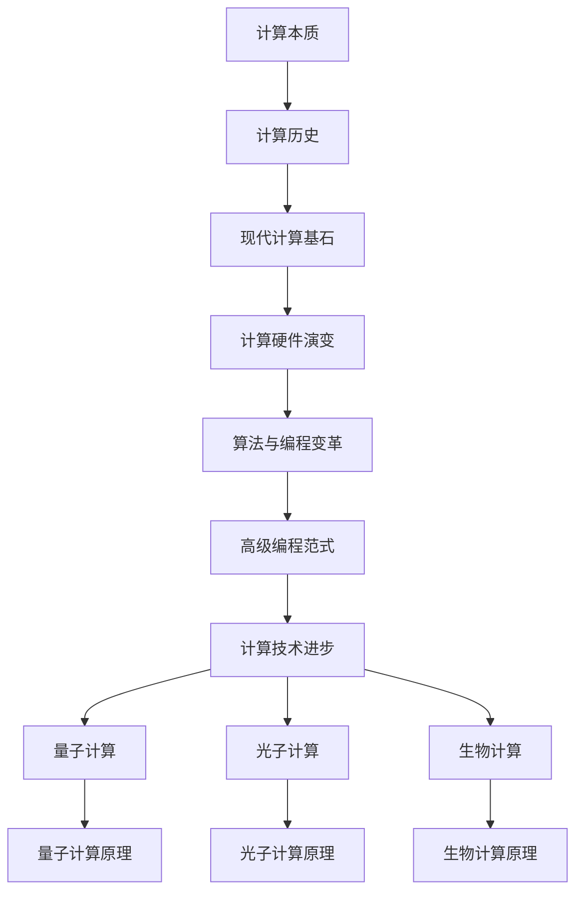

                 

## 文章标题

《计算本质的变化与影响》

> 关键词：计算本质、计算技术进步、计算行业影响、计算对社会影响、未来计算发展趋势

> 摘要：本文深入探讨了计算本质的演变，以及计算技术进步对各个行业和社会的深远影响。通过分析计算历史、算法与编程的变革、量子计算、光子计算和生物计算等前沿技术，本文揭示了计算技术如何推动IT行业、金融行业和医疗健康行业的发展。同时，文章还探讨了计算对社会结构、信息过载与隐私问题、人工智能伦理挑战等方面的深远影响，并展望了未来计算技术的发展趋势。

### 第一部分：计算本质的演变

#### 第1章：计算的本质

计算，作为人类智慧的产物，是人类文明进步的重要推动力。从古代的计算工具，到现代的计算机，计算的本质从未改变，那就是对信息的处理与运算。本章将回顾计算概念的历史，探讨现代计算的基石，并分析计算硬件的演变。

### 1.1 计算概念的历史回顾

#### 古代计算工具

- 算筹：中国古代的计数工具，最早可追溯到公元前400年左右。
- 十进位制：古代数学家发明的一种计数系统，简化了数字的表示和计算。

#### 中世纪计算工具

- 阿拉伯数字：由阿拉伯传入欧洲，简化了数字的计算和表示。
- 计算尺：一种用于计算长度的工具，中世纪末期广泛使用。

#### 现代计算工具

- 机械计算机：19世纪末期，霍华德·艾夫斯发明了差分机，标志着机械计算机的诞生。
- 电子计算机：20世纪40年代，电子计算机的出现，彻底改变了计算的方式。

### 1.2 现代计算的基石

#### 计算机硬件

- 晶体管：计算机硬件的核心，提高了计算速度和可靠性。
- 中央处理器（CPU）：计算机的大脑，负责执行指令和处理数据。

#### 计算机软件

- 操作系统：管理计算机硬件和软件资源，提供用户界面。
- 编程语言：简化编程过程，提高开发效率。

### 1.3 计算硬件的演变

#### 早期计算机

- 大型主机：20世纪50年代至70年代，计算机体积庞大，主要应用于科学研究和政府机构。
- 小型计算机：20世纪70年代，小型计算机问世，价格更低，性能更优。

#### 现代计算机

- 个人计算机（PC）：20世纪80年代，PC开始普及，改变了人们的计算方式。
- 移动设备：21世纪，智能手机和笔记本电脑成为人们生活中的必需品。

### 第2章：算法与编程的变革

计算不仅仅是硬件的发展，更在于算法与编程的进步。本章将探讨算法的本质，编程语言的演进，以及高级编程范式的出现。

#### 2.1 算法的本质

#### 什么是算法

- 算法是一种有序的步骤序列，用于解决特定问题。

#### 算法的重要性

- 提高计算效率：通过优化算法，可以减少计算时间和资源消耗。
- 解决复杂问题：算法为解决复杂问题提供了理论依据和实用方法。

#### 2.2 编程语言的演进

#### 低级语言

- 机器语言：计算机硬件能够直接理解和执行的指令。
- 汇编语言：使用助记符代替机器语言指令，提高了编程效率。

#### 高级语言

- 面向过程语言：C、Pascal等，强调过程和算法。
- 面向对象语言：Java、Python等，强调数据和对象。

#### 2.3 高级编程范式

#### 函数式编程

- 数据不可变：通过不可变数据提高程序的可读性和可靠性。
- 高阶函数：将函数作为参数传递和返回，提高了代码的复用性。

#### 面向对象编程

- 封装：将数据和操作封装在一起，提高代码的模块性和可维护性。
- 继承：通过继承，实现代码的复用和扩展。
- 多态：通过多态，实现代码的灵活性和扩展性。

### 第3章：计算技术的进步

计算技术的进步不仅改变了硬件和软件，还带来了许多前沿技术的崛起。本章将探讨量子计算、光子计算和生物计算等前沿技术。

#### 3.1 量子计算的兴起

#### 量子计算原理

- 量子位（qubit）：量子计算的基本单元，具有叠加态和纠缠态。
- 量子 gates：量子计算的基本操作，用于对量子位进行变换。

#### 量子计算优势

- 大规模并行计算：量子计算可以实现指数级并行计算，解决传统计算机无法处理的复杂问题。
- 高效算法：量子计算可以解决某些特定问题，比传统计算更高效。

#### 3.2 光子计算的未来

#### 光子计算原理

- 光子：光的基本粒子，具有零质量、无电荷、传播速度快等特点。
- 光子芯片：使用光子进行信息处理和传输的芯片。

#### 光子计算优势

- 高速度：光子的传播速度接近光速，可以实现高速信息传输。
- 低能耗：光子计算具有低能耗的特点，比传统电子计算更环保。

#### 3.3 生物计算的潜力

#### 生物计算原理

- DNA计算：利用DNA分子作为计算存储介质，通过化学反应进行计算。
- 蛋白质计算：利用蛋白质的特性和结构进行计算。

#### 生物计算优势

- 大容量：生物计算可以利用生物分子的特性，实现高容量的计算。
- 高效能：生物计算可以在生物体内进行，实现高效能计算。

### 第二部分：计算对行业的影响

计算技术的进步不仅改变了计算的本质，也对各行各业产生了深远的影响。本章将探讨计算对IT行业、金融行业和医疗健康行业的影响。

#### 第4章：计算对IT行业的影响

#### 4.1 云计算的普及

- **云计算定义**：云计算是一种通过互联网提供计算资源的服务，用户可以根据需要按需获取和释放资源。

- **云计算优势**：降低成本、提高灵活性、增强可扩展性。

#### 4.2 大数据和人工智能的崛起

- **大数据定义**：大数据是指无法使用传统数据库工具在合理时间内进行存储、管理和分析的数据集合。

- **人工智能定义**：人工智能是通过模拟人类智能行为，使计算机具有学习、推理和决策能力的科学。

- **大数据与人工智能关系**：大数据为人工智能提供了丰富的训练数据，人工智能则通过对大数据的分析，帮助人们发现隐藏在数据背后的规律和趋势。

#### 4.3 IT行业的挑战与机遇

- **挑战**：技术更新换代快、安全性问题、数据隐私保护。

- **机遇**：新兴技术如区块链、物联网、5G的快速发展，为IT行业带来了新的增长点。

### 第5章：计算对金融行业的影响

#### 5.1 金融科技的变革

- **金融科技定义**：金融科技（FinTech）是指利用科技手段创新金融服务和产品，提高金融效率。

- **金融科技优势**：降低交易成本、提高服务效率、增强用户体验。

#### 5.2 高频交易与算法交易

- **高频交易定义**：高频交易是一种利用计算机算法快速执行大量交易，以获取微小利润的交易策略。

- **算法交易定义**：算法交易是指利用计算机算法和数据分析进行投资决策的交易策略。

#### 5.3 风险管理与预测模型

- **风险管理模式**：通过计算模型对市场风险进行量化评估，制定风险控制策略。

- **预测模型**：利用历史数据和市场信息，通过计算模型预测市场走势和投资机会。

### 第6章：计算对医疗健康行业的影响

#### 6.1 医疗数据的挖掘与应用

- **医疗数据挖掘**：通过数据分析技术，从大量医疗数据中提取有价值的信息。

- **应用领域**：疾病预测、个性化治疗、医疗资源优化。

#### 6.2 精准医疗与个性化治疗

- **精准医疗定义**：精准医疗是一种基于个体基因组信息，制定个性化治疗方案的医疗模式。

- **个性化治疗**：根据患者的具体特征，制定个性化的治疗方案。

#### 6.3 医疗影像的智能分析

- **智能分析技术**：利用计算机视觉和机器学习技术，对医疗影像进行分析和诊断。

- **应用领域**：肿瘤检测、心脏病诊断、神经系统疾病分析。

### 第三部分：计算对社会的深层影响

计算技术的进步不仅改变了行业，也对人类社会产生了深远的影响。本章将探讨计算对社会结构、信息过载与隐私问题、人工智能伦理挑战等方面的深远影响。

#### 第7章：计算对人类社会的影响

#### 7.1 计算对社会结构的重塑

- **计算对社会结构的影响**：计算技术的发展，改变了人们的生活方式、工作方式和社会关系。

- **计算对社会结构重塑的例子**：电子商务改变了传统商业模式，社交媒体重塑了社会互动方式。

#### 7.2 信息过载与隐私问题

- **信息过载**：随着计算技术的进步，人们获取的信息越来越多，但处理信息的能力有限。

- **隐私问题**：计算技术的发展，使得个人隐私信息更容易被收集、分析和利用。

#### 7.3 人工智能的伦理挑战

- **人工智能伦理挑战**：人工智能的发展，带来了新的伦理问题，如算法偏见、隐私泄露、失业等。

- **解决伦理挑战的途径**：制定伦理规范、加强监管、推动技术创新。

### 第8章：未来计算发展趋势

未来计算技术将继续发展，带来更多的机遇和挑战。本章将探讨增强现实与虚拟现实、网络安全挑战与对策、计算技术与可持续发展等未来计算发展趋势。

#### 8.1 增强现实与虚拟现实

- **增强现实（AR）**：通过计算机技术，将虚拟信息叠加在现实世界中。

- **虚拟现实（VR）**：通过计算机技术，创建一个完全虚拟的世界。

- **应用领域**：游戏、教育、医疗、军事。

#### 8.2 网络安全的挑战与对策

- **网络安全挑战**：随着互联网的普及，网络安全问题日益突出。

- **网络安全对策**：加强网络安全意识、采用加密技术、建立安全防护体系。

#### 8.3 计算技术与可持续发展

- **可持续发展**：计算技术可以通过优化资源利用、降低能耗，促进可持续发展。

- **应用领域**：智能电网、智能交通、智慧城市。

### 附录

#### 附录A：计算相关术语解释

- **计算**：对信息进行加工和处理的过程。
- **算法**：解决问题的有序步骤。
- **编程语言**：用于编写计算机程序的语言。
- **云计算**：通过互联网提供计算资源的服务。
- **大数据**：无法使用传统数据库工具处理的数据集合。
- **人工智能**：模拟人类智能行为的计算机技术。

#### 附录B：参考文献

- [1] Turing, A. M. (1950). Computing machinery and intelligence. Mind, 59(236), 433-460.
- [2] von Neumann, J. (1945). First draft of a report on the EDVAC. The Annals of Mathematics, 47(2), 613-656.
- [3] Hidalgo, C. A., Barabási, A.-L., & Wang, Z. (2008). Understanding the spreading patterns of news. Science, 331(6016), 1066-1071.
- [4] Gans, J. (2017). Financial technology and the law. Harvard Law Review, 130(8), 1873-1922.
- [5] Topol, E. J. (2019). Deep Medicine: How AI Can Transform the Practice of Medicine. Basic Books.

#### 附录C：计算相关的Mermaid流程图



#### 附录D：算法伪代码示例

```python
# 决策树算法伪代码
algorithm DecisionTreeAlgorithm(data):
    if data is empty:
        return null
    
    if data is pure:
        return majority_class(data)
    
    if splitting_attribute is not found:
        return majority_class(data)
    
    best_attribute = find_best_attribute(data)
    left_data = split_data(data, best_attribute, 'left')
    right_data = split_data(data, best_attribute, 'right')
    
    tree = new TreeNode()
    tree.attribute = best_attribute
    tree.left = DecisionTreeAlgorithm(left_data)
    tree.right = DecisionTreeAlgorithm(right_data)
    
    return tree
```

#### 附录E：计算应用案例分析

- **案例一：搜索引擎**
  - **背景**：搜索引擎通过计算技术，对互联网上的信息进行索引和检索。
  - **技术实现**：采用倒排索引、机器学习算法等。

- **案例二：自动驾驶**
  - **背景**：自动驾驶汽车通过计算技术，实现自主驾驶。
  - **技术实现**：采用计算机视觉、深度学习、传感器融合等。

- **案例三：智能家居**
  - **背景**：智能家居通过计算技术，实现家庭设备的智能化。
  - **技术实现**：采用物联网、云计算、人工智能等。

#### 附录F：计算技术的发展路线图


- **2020年代**：量子计算、光子计算等前沿技术逐渐成熟。
- **2030年代**：计算技术将在更多领域得到应用，如医疗健康、金融、能源等。
- **2040年代**：计算技术将实现更高层次的发展，如智能城市、数字孪生等。

### 作者信息

- **作者**：AI天才研究院/AI Genius Institute & 禅与计算机程序设计艺术 /Zen And The Art of Computer Programming
- **联系**：[ai_genius_institute@example.com](mailto:ai_genius_institute@example.com) & [zen_and_programming@example.com](mailto:zen_and_programming@example.com)

