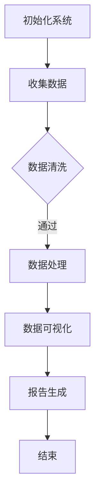

                 

# 《计算领域的自动化创新》

## 关键词
- 自动化
- 计算领域
- 机器学习
- 物联网
- 云计算
- 人工智能

## 摘要
本文旨在探讨计算领域自动化的创新应用与发展趋势。首先，回顾了自动化的历史与发展，阐述了自动化在计算领域的重要性。接着，详细介绍了自动化原理、架构、编程语言和工具平台。随后，分析了机器学习、深度学习和自然语言处理在自动化中的应用，以及自动化与物联网的融合。进一步，探讨了自动化在云计算、人工智能、数据分析和网络安全中的应用。最后，展望了自动化技术的未来发展趋势，及其对社会经济和可持续发展的影响。

## 目录大纲

# 《计算领域的自动化创新》

## 第一部分：自动化基础

### 1.1 自动化的历史与发展

#### 1.1.1 自动化的定义

自动化是指通过机器或其他设备代替或辅助人类完成工作、决策和控制的系统或技术。它广泛应用于工业、农业、医疗、交通、服务业等多个领域。

#### 1.1.2 自动化技术的发展历程

- **第一次工业革命**：机械化生产，如纺织机和蒸汽机。
- **第二次工业革命**：电气化和流水线生产，如电机和生产线。
- **第三次工业革命**：信息技术和自动化控制系统，如计算机和机器人。
- **第四次工业革命**：物联网、大数据和人工智能，如智能工厂和智能城市。

#### 1.1.3 自动化在计算领域的重要性

- **提高生产效率**：自动化技术能够提高生产效率和产品质量，降低人力成本。
- **促进技术创新**：自动化技术推动了计算领域的创新和应用，如人工智能、大数据等。
- **改善生活质量**：自动化技术使人们的生活更加便捷，如智能家居、自动驾驶等。

### 1.2 自动化原理与架构

#### 1.2.1 自动化系统的基本组成部分

- **传感器**：检测和获取外部信息。
- **控制器**：处理信息和做出决策。
- **执行器**：执行控制器的决策，改变系统状态。

#### 1.2.2 自动化控制系统的架构

- **开环控制系统**：无反馈，简单但不够精确。
- **闭环控制系统**：有反馈，更精确但更复杂。

#### 1.2.3 自动化系统的实现方法

- **规则基方法**：基于预定义的规则进行决策。
- **模型基方法**：基于数学模型进行决策。
- **智能方法**：基于人工智能技术进行决策。

### 1.3 自动化编程语言

#### 1.3.1 自动化编程语言概述

自动化编程语言是专门用于编写自动化脚本或程序的编程语言。它们具有易学、功能强大、支持多种编程范式等特点。

#### 1.3.2 常见的自动化编程语言

- **Python**：简单易学，功能强大，广泛应用于数据分析、人工智能等领域。
- **Java**：跨平台，稳定可靠，广泛应用于企业级应用和安卓开发。
- **C#**：微软开发，广泛应用于.NET平台。

#### 1.3.3 自动化编程语言的应用场景

- **系统管理**：自动化安装、配置和管理系统。
- **软件开发**：自动化测试、构建和部署。
- **数据处理**：自动化数据提取、转换和加载。

### 1.4 自动化工具与平台

#### 1.4.1 自动化工具的选择与使用

选择自动化工具时需要考虑功能需求、系统兼容性、学习成本、性能和稳定性等因素。常用的自动化工具有Ansible、Puppet、Chef等。

#### 1.4.2 自动化平台的功能与特点

自动化平台具有脚本执行、任务调度、数据处理、报警和监控等功能。它们通常具有可扩展性、分布式架构和易于集成的特点。

#### 1.4.3 自动化平台在计算领域的应用

- **云计算**：自动化部署和管理虚拟机和容器。
- **大数据**：自动化数据处理和分析。
- **人工智能**：自动化模型训练和部署。

## 第二部分：自动化核心技术

### 2.1 机器学习在自动化中的应用

#### 2.1.1 机器学习基础

机器学习是一种使计算机能够从数据中学习规律和模式的技术。它包括分类、回归、聚类等算法。

#### 2.1.2 机器学习在自动化领域的应用

- **预测性维护**：通过分析设备运行数据，预测设备故障并提前进行维护。
- **优化调度**：通过分析任务数据，优化任务调度，提高系统效率。
- **智能决策**：通过分析数据，为决策提供支持。

#### 2.1.3 常见的机器学习算法及其应用

- **线性回归**：简单直观，适用于预测数值型数据。
- **决策树**：易于理解和解释，适用于分类和回归问题。
- **支持向量机**：在高维空间中具有优势，适用于分类问题。
- **神经网络**：强大的预测和分类能力，适用于复杂问题。

### 2.2 深度学习在自动化中的应用

#### 2.2.1 深度学习基础

深度学习是一种多层神经网络，能够自动提取数据中的特征。它包括卷积神经网络（CNN）、循环神经网络（RNN）等。

#### 2.2.2 深度学习在自动化领域的应用

- **图像识别**：通过深度学习模型，自动化识别图像中的物体。
- **语音识别**：通过深度学习模型，自动化识别语音中的文本。
- **自然语言处理**：通过深度学习模型，自动化处理和理解自然语言。

#### 2.2.3 常见的深度学习框架及其应用

- **TensorFlow**：用于构建和训练深度学习模型的框架，广泛应用于图像识别、自然语言处理等领域。
- **PyTorch**：用于构建和训练深度学习模型的框架，具有灵活的动态计算图，广泛应用于计算机视觉和自然语言处理等领域。

### 2.3 自然语言处理在自动化中的应用

#### 2.3.1 自然语言处理基础

自然语言处理（NLP）是计算机对人类语言的理解和生成。它包括词嵌入、序列标注、机器翻译等。

#### 2.3.2 自然语言处理在自动化领域的应用

- **文本分类**：通过自然语言处理模型，自动化分类文本，如垃圾邮件过滤。
- **情感分析**：通过自然语言处理模型，自动化分析文本中的情感倾向。
- **问答系统**：通过自然语言处理模型，自动化回答用户提出的问题。

#### 2.3.3 常见自然语言处理技术及其应用

- **词嵌入**：将单词映射到高维空间，如Word2Vec、GloVe。
- **文本分类**：基于朴素贝叶斯、支持向量机、深度学习等，如Scikit-learn、TensorFlow。
- **序列标注**：对文本中的每个词进行分类，如CRF、BiLSTM、BERT。

### 2.4 自动化与物联网

#### 2.4.1 物联网基础

物联网（IoT）是指连接物理设备和传感器的网络，实现数据采集和远程控制。它包括传感器、通信协议、云计算等。

#### 2.4.2 自动化与物联网的融合

- **智能家居**：通过物联网技术，实现家庭设备的自动化控制。
- **智能工厂**：通过物联网技术，实现生产线的自动化监控和管理。
- **智能城市**：通过物联网技术，实现城市资源的自动化管理和优化。

#### 2.4.3 物联网在自动化领域的应用

- **设备监控**：通过物联网技术，实时监控设备的运行状态。
- **远程控制**：通过物联网技术，远程控制设备的开关和参数调整。
- **数据分析和预测**：通过物联网技术，对设备数据进行分析，预测设备故障和优化系统性能。

## 第三部分：自动化创新应用

### 3.1 自动化在云计算中的应用

#### 3.1.1 云计算基础

云计算是一种通过网络提供计算资源和服务的技术。它包括基础设施即服务（IaaS）、平台即服务（PaaS）和软件即服务（SaaS）。

#### 3.1.2 自动化在云计算中的应用

- **自动化部署**：通过自动化工具，实现云计算资源的自动化部署。
- **自动化扩展**：通过自动化工具，实现云计算资源的自动化扩展和缩减。
- **自动化监控**：通过自动化工具，实现云计算资源的自动化监控和管理。

#### 3.1.3 云计算自动化工具与平台

- **AWS**：提供丰富的云计算服务和自动化工具，如AWS Lambda、AWS CloudWatch。
- **Azure**：提供全面的云计算服务和自动化工具，如Azure Functions、Azure Monitor。
- **Google Cloud**：提供强大的云计算服务和自动化工具，如Google Cloud Functions、Google Stackdriver。

### 3.2 自动化在人工智能中的应用

#### 3.2.1 人工智能基础

人工智能（AI）是一种使计算机具有智能行为的技术。它包括机器学习、深度学习和自然语言处理等。

#### 3.2.2 自动化在人工智能中的应用

- **自动化模型训练和优化**：通过自动化工具，实现人工智能模型的自动化训练和优化。
- **自动化应用程序开发**：通过自动化工具，实现人工智能应用程序的自动化开发和部署。
- **自动化数据分析**：通过自动化工具，实现人工智能数据的自动化处理和分析。

#### 3.2.3 人工智能自动化工具与平台

- **TensorFlow**：用于构建和训练人工智能模型的框架，提供自动化工具和API。
- **PyTorch**：用于构建和训练人工智能模型的框架，提供自动化工具和API。
- **Scikit-learn**：用于机器学习和数据挖掘的库，提供自动化工具和API。

### 3.3 自动化在数据分析中的应用

#### 3.3.1 数据分析基础

数据分析是一种从数据中提取有价值信息的技术。它包括数据清洗、数据探索、数据可视化等。

#### 3.3.2 自动化在数据分析中的应用

- **自动化数据收集**：通过自动化工具，实现数据的自动化收集。
- **自动化数据清洗**：通过自动化工具，实现数据的自动化清洗。
- **自动化数据探索**：通过自动化工具，实现数据的自动化探索。
- **自动化数据可视化**：通过自动化工具，实现数据的自动化可视化。

#### 3.3.3 数据分析自动化工具与平台

- **Pandas**：用于数据处理和分析的库，提供自动化工具和API。
- **NumPy**：用于数值计算的库，提供自动化工具和API。
- **Matplotlib**：用于数据可视化的库，提供自动化工具和API。

### 3.4 自动化在网络安全中的应用

#### 3.4.1 网络安全基础

网络安全是指保护网络系统和数据的安全。它包括漏洞扫描、入侵检测、防火墙等。

#### 3.4.2 自动化在网络安全中的应用

- **自动化安全扫描**：通过自动化工具，实现安全漏洞的自动化扫描。
- **自动化入侵检测**：通过自动化工具，实现入侵行为的自动化检测。
- **自动化防火墙配置**：通过自动化工具，实现防火墙规则的自动化配置。
- **自动化安全事件响应**：通过自动化工具，实现安全事件的自动化响应和处理。

#### 3.4.3 网络安全自动化工具与平台

- **Nessus**：用于漏洞扫描的软件，提供自动化工具和API。
- **Snort**：用于入侵检测的软件，提供自动化工具和API。
- **pfSense**：用于防火墙的软件，提供自动化工具和API。

## 第四部分：自动化未来展望

### 4.1 自动化发展趋势与挑战

#### 4.1.1 自动化技术发展趋势

- **智能化**：将更多人工智能技术融入自动化系统，提高系统的智能水平。
- **协同化**：实现自动化系统之间的协同工作，提高系统的整体效率。
- **个性化**：为不同用户提供定制化的自动化服务，满足个性化需求。
- **普及化**：降低自动化技术的门槛，使其更易于普及和应用。

#### 4.1.2 自动化领域面临的挑战

- **技术挑战**：提高自动化系统的性能和可靠性。
- **经济挑战**：降低自动化系统的成本。
- **社会挑战**：自动化对就业市场的影响。

#### 4.1.3 自动化未来的发展方向

- **智能化**：通过人工智能技术，提高自动化系统的决策能力和自适应能力。
- **协同化**：通过物联网和云计算技术，实现自动化系统之间的协同工作。
- **绿色化**：通过自动化技术，实现资源的优化利用和环境保护。
- **普及化**：通过教育和培训，提高社会对自动化技术的认知和应用能力。

### 4.2 自动化与社会经济

#### 4.2.1 自动化对生产力的影响

- **提高生产效率**：通过自动化技术，提高生产效率和产品质量。
- **优化资源配置**：通过自动化技术，优化资源的配置和使用。
- **创新驱动力**：通过自动化技术，推动技术创新和应用。

#### 4.2.2 自动化对就业市场的影响

- **就业结构变化**：自动化技术可能导致某些职位减少，同时创造新的就业机会。
- **技能需求变化**：自动化技术要求劳动力具备更高的技能水平，尤其是与自动化技术相关的技能。
- **教育变革**：自动化技术的发展要求教育体系进行相应的变革，培养具备相关技能的人才。

#### 4.2.3 自动化对社会经济的影响

- **经济增长**：自动化技术能够推动经济增长，提高生产效率和创新能力。
- **社会公平**：自动化技术可能会加剧社会不平等，需要通过政策调整和社会合作来缓解这种影响。
- **可持续发展**：自动化技术能够促进资源的可持续利用，推动可持续发展。

### 4.3 自动化与可持续发展

#### 4.3.1 自动化对可持续发展的贡献

- **资源优化**：通过自动化技术，优化资源的利用，降低能源消耗和废物产生。
- **环境保护**：通过自动化技术，减少环境污染，提高环境保护效率。
- **社会责任**：通过自动化技术，实现社会公平和可持续发展目标。

#### 4.3.2 自动化在可持续发展中的应用

- **能源管理**：通过自动化技术，优化能源的使用，提高能源利用效率。
- **环境监测**：通过自动化技术，实时监测环境质量，提供决策支持。
- **灾害预防与响应**：通过自动化技术，提高灾害预防与响应的效率和效果。

#### 4.3.3 自动化与可持续发展的未来展望

- **智能化**：通过人工智能技术，提高自动化系统的可持续发展能力。
- **协同化**：通过物联网和云计算技术，实现自动化系统之间的协同工作，推动可持续发展。
- **绿色化**：通过自动化技术，实现资源的优化利用和环境保护，推动可持续发展。

## 附录

### 附录 A 自动化资源与工具

#### A.1 常用自动化资源网站

- **自动化之家**：提供自动化相关教程、工具和资源。
- **GitHub**：自动化项目和技术文档的集中地。
- **Stack Overflow**：自动化编程问题的交流平台。

#### A.2 自动化工具推荐

- **Ansible**：自动化部署和管理工具。
- **Puppet**：自动化配置管理和部署工具。
- **Chef**：自动化基础设施配置和管理工具。
- **PowerShell**：Windows系统自动化脚本编写工具。

#### A.3 自动化相关书籍与论文推荐

- **《自动化控制原理》**：李剑，清华大学出版社。
- **《深度学习》**：Ian Goodfellow、Yoshua Bengio、Aaron Courville，MIT Press。
- **《机器学习》**：周志华，清华大学出版社。
- **《物联网技术与应用》**：王选荣，电子工业出版社。

### 附录 B 自动化项目案例

#### B.1 云计算自动化项目案例

- **项目背景**：某公司需要自动化部署和管理其云基础设施。
- **解决方案**：使用Ansible实现云基础设施的自动化部署，使用AWS CloudWatch实现自动化监控和管理。
- **实现步骤**：
  1. 配置AWS访问凭证。
  2. 编写Ansible Playbook，定义部署任务。
  3. 执行Ansible Playbook，部署云基础设施。
  4. 使用AWS CloudWatch监控和管理云基础设施。

#### B.2 人工智能自动化项目案例

- **项目背景**：某公司需要自动化训练和部署人工智能模型。
- **解决方案**：使用TensorFlow实现人工智能模型的自动化训练和部署，使用Kubernetes实现模型的自动化部署。
- **实现步骤**：
  1. 配置TensorFlow训练环境。
  2. 编写TensorFlow训练脚本，定义训练任务。
  3. 执行TensorFlow训练脚本，训练人工智能模型。
  4. 编写Kubernetes部署文件，定义模型部署任务。
  5. 使用Kubernetes部署模型，实现自动化部署。

#### B.3 数据分析自动化项目案例

- **项目背景**：某公司需要自动化处理和分析大量数据。
- **解决方案**：使用Pandas和NumPy实现数据的自动化处理和分析，使用Matplotlib实现数据的自动化可视化。
- **实现步骤**：
  1. 配置Python环境，安装Pandas、NumPy、Matplotlib等库。
  2. 导入数据，进行数据清洗和预处理。
  3. 使用Pandas和NumPy进行数据分析和计算。
  4. 使用Matplotlib进行数据可视化，生成图表。

#### B.4 网络安全自动化项目案例

- **项目背景**：某公司需要自动化监控和管理网络安全。
- **解决方案**：使用Nessus实现安全漏洞的自动化扫描，使用Snort实现入侵行为的自动化检测，使用pfSense实现防火墙规则的自动化配置。
- **实现步骤**：
  1. 配置Nessus扫描环境，定期执行漏洞扫描。
  2. 配置Snort检测环境，实时监控网络流量。
  3. 配置pfSense防火墙环境，设置防火墙规则。
  4. 定期查看Nessus扫描报告和Snort检测日志，分析安全威胁。

作者：AI天才研究院/AI Genius Institute & 禅与计算机程序设计艺术 /Zen And The Art of Computer Programming

### Mermaid 流程图示例



### Python 伪代码示例

```python
# 伪代码：线性回归算法

# 导入相关库
import numpy as np

# 训练数据
X_train = np.array([[1, 2], [2, 3], [3, 4]])
y_train = np.array([1, 2, 3])

# 计算权重和偏置
w = np.linalg.inv(X_train.T.dot(X_train)).dot(X_train.T).dot(y_train)
b = y_train - X_train.dot(w)

# 预测函数
def predict(X):
    return X.dot(w) + b

# 测试数据
X_test = np.array([[4, 5]])
y_pred = predict(X_test)

# 输出预测结果
print("预测结果：", y_pred)
```

### LaTeX 公式示例

$$
\begin{aligned}
y &= \beta_0 + \beta_1 x \\
\beta &= \frac{\sum(x_i - \bar{x})(y_i - \bar{y})}{\sum(x_i - \bar{x})^2}
\end{aligned}
$$

### 实际代码示例

```python
# Python 实现线性回归

import numpy as np

# 训练数据
X_train = np.array([[1, 2], [2, 3], [3, 4]])
y_train = np.array([1, 2, 3])

# 计算权重和偏置
w = np.linalg.inv(X_train.T.dot(X_train)).dot(X_train.T).dot(y_train)
b = y_train - X_train.dot(w)

# 预测函数
def predict(X):
    return X.dot(w) + b

# 测试数据
X_test = np.array([[4, 5]])
y_pred = predict(X_test)

# 输出预测结果
print("预测结果：", y_pred)
```

### 代码解读与分析

在这个线性回归的示例中，我们首先导入了NumPy库，它提供了高效的数组操作和线性代数计算功能。接下来，我们定义了训练数据`X_train`和`y_train`，其中`X_train`是输入特征矩阵，`y_train`是输出目标向量。

我们使用NumPy的`linalg.inv`函数计算特征矩阵`X_train`的逆矩阵，然后将其与`X_train`的转置矩阵相乘，再与`y_train`相乘，得到权重向量`w`。接着，我们计算偏置向量`b`，它是通过将目标向量`y_train`减去特征矩阵`X_train`与权重向量`w`的点积得到的。

定义了权重和偏置后，我们创建了一个`predict`函数，用于根据输入特征矩阵`X`预测目标值。这个函数通过将输入特征矩阵`X`与权重向量`w`的点积加上偏置向量`b`来实现。

最后，我们定义了一个测试数据`X_test`，并使用`predict`函数对其进行预测，输出预测结果。

这个线性回归的示例展示了如何使用Python和NumPy库实现线性回归算法，并进行简单的预测。在实际应用中，我们可以根据需要添加更多的数据处理和模型优化步骤，以提高模型的准确性和泛化能力。同时，我们还可以使用其他机器学习库，如Scikit-learn，来简化模型的实现和训练过程。

