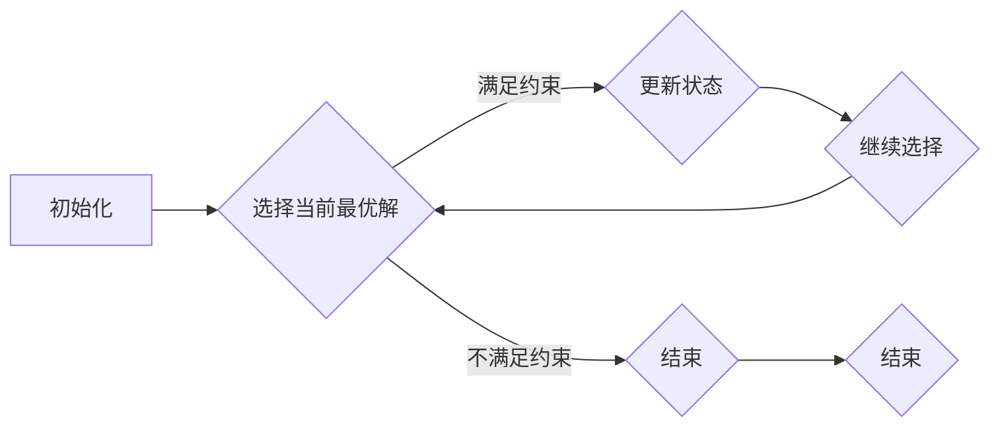

                 

### 文章标题

《贪婪算法：从原理到实践，深入理解计算机算法优化》

### 关键词

- 贪婪算法
- 算法优化
- 计算机算法
- 背包问题
- 最短路径
- 动态规划
- 图论
- 组合优化
- 近似算法

### 摘要

本文旨在深入探讨贪婪算法的原理、应用和实践。从基础概念出发，逐步解析贪婪策略、核心原理、典型案例，并展示其在图论、排序与搜索、组合优化以及近似算法等领域的广泛应用。文章通过实际项目和代码案例，详细解读了贪心算法的架构原理、数学模型、伪代码、项目实战以及优化策略，旨在帮助读者全面掌握这一重要的算法思想。

---

## 《贪婪算法》目录大纲

### 第一部分：贪婪算法基础

#### 第1章：贪婪算法概述

- **1.1 贪心策略与贪婪算法**
  - 贪心策略定义
  - 贪心算法的特点
- **1.2 贪心算法的应用场景**
  - 背包问题
  - 最短路径问题
- **1.3 贪心算法与动态规划的关系**
  - 动态规划的基本概念
  - 贪心算法在动态规划中的应用

#### 第2章：贪心算法核心原理

##### 2.1 贪心策略的选择与证明

- **2.1.1 最优子结构**
- **2.1.2 无后效性**
- **2.1.3 贪心算法的正确性证明**
- **2.1.4 贪心算法的局限性与改进方法**

##### 2.2 贪心算法设计与实现

- **2.2.1 贪心策略的制定**
- **2.2.2 贪心算法的时间复杂度分析**
- **2.2.3 贪心算法的实现技巧**
- **2.2.4 贪心算法的优化策略**

#### 第3章：典型贪心算法案例

##### 3.1 背包问题

- **3.1.1 背包问题的基本模型**
- **3.1.2 01背包问题贪心算法**
- **3.1.3 完全背包问题贪心算法**
- **3.1.4 多重背包问题贪心算法**

##### 3.2 最短路径问题

- **3.2.1 Dijkstra算法**
- **3.2.2 Bellman-Ford算法**
- **3.2.3 贪心算法优化最短路径问题**
- **3.2.4 单源最短路径问题与多源最短路径问题的贪心算法**

### 第二部分：贪婪算法应用实践

#### 第4章：贪心算法在图论中的应用

##### 4.1 图的基本概念

- **4.1.1 图的表示方法**
- **4.1.2 图的遍历算法**
- **4.1.3 最小生成树问题**
- **4.1.4 最大流问题**

##### 4.2 贪心算法优化图问题

- **4.2.1 最小生成树的贪心算法**
- **4.2.2 最大流的贪心算法**
- **4.2.3 贪心算法优化图的应用案例**

#### 第5章：贪心算法在排序与搜索中的应用

##### 5.1 排序算法概述

- **5.1.1 常见排序算法比较**
- **5.1.2 贪心算法在排序中的应用**

##### 5.2 搜索算法概述

- **5.2.1 搜索算法的基本概念**
- **5.2.2 贪心算法在搜索中的应用**

##### 5.3 贪心算法优化搜索

- **5.3.1 A*搜索算法**
- **5.3.2 启发式搜索算法**
- **5.3.3 贪心算法优化搜索算法的性能**

### 第三部分：贪心算法进阶与拓展

#### 第6章：贪心算法在组合优化中的应用

##### 6.1 组合优化的基本概念

- **6.1.1 组合优化问题的分类**
- **6.1.2 贪心算法在组合优化中的应用**

##### 6.2 典型组合优化问题

- **6.2.1 分组背包问题**
- **6.2.2 最小费用最大流问题**
- **6.2.3 多目标优化问题**

#### 第7章：贪心算法与近似算法

##### 7.1 近似算法的基本概念

- **7.1.1 近似算法的定义**
- **7.1.2 近似算法的分类**

##### 7.2 贪心算法与近似算法的关系

- **7.2.1 贪心算法作为近似算法**
- **7.2.2 贪心算法的优化策略**
- **7.2.3 贪心算法在近似算法中的应用案例**

### 附录

#### 附录A：贪心算法相关资源与工具

- **7.1 贪心算法学习资源**
- **7.2 贪心算法相关工具和库**

#### 附录B：贪心算法练习题与解答

- **练习题1：01背包问题**
- **练习题2：最短路径问题**
- **练习题3：最小生成树问题**
- **练习题4：最大流问题**
- **解答**

---

# 第一部分：贪婪算法基础

## 第1章：贪婪算法概述

### 1.1 贪心策略与贪婪算法

贪心策略（Greedy Strategy）是一种在每一步选择当前最优解的决策方法，这种策略往往基于局部最优解，期望通过一系列局部最优解得到全局最优解。贪心算法（Greedy Algorithm）则是一种基于贪心策略的算法，它的基本思想是在每一步都做出在当前状态下最好的选择，以期得到全局最优解。

贪心策略的定义可以表述为：在每一步决策时，总是选择当前看来最好的选择，并且忽略其他未来的可能性和后果。

贪心算法的特点如下：

- **局部最优性**：每一步都做出局部最优选择。
- **不恢复性**：一旦做出了选择，不会撤销这个选择，也不会回头重新选择。
- **简单性**：贪心算法通常比其他算法（如动态规划）更简单，实现起来更容易。

### 1.2 贪心算法的应用场景

贪心算法在多种问题中都有应用，以下列举两个经典问题：

#### 背包问题

背包问题（Knapsack Problem）是一个组合优化问题，通常描述为：给定一组物品，每个物品都有一定的价值和重量，目标是选择一部分物品放入一个容量有限的背包中，使得背包中的物品总价值最大。贪心算法可以用来解决0-1背包问题和完全背包问题。

#### 最短路径问题

最短路径问题（Shortest Path Problem）是图论中的一个重要问题，目标是找到图中两个顶点之间的最短路径。Dijkstra算法和Bellman-Ford算法都是基于贪心策略的算法，可以用来求解单源最短路径问题。

### 1.3 贪心算法与动态规划的关系

动态规划（Dynamic Programming，DP）是一种求解最优化问题的算法思想，它通过将问题分解为重叠子问题，并利用子问题的最优解来构建问题的最优解。贪心算法与动态规划有一定的联系和区别：

- **联系**：贪心算法可以看作是动态规划的一种特殊情况，即当子问题无重叠时，动态规划退化为贪心算法。
- **区别**：动态规划考虑了所有可能的子结构，而贪心算法只考虑当前的最优解，不考虑未来的可能性。

动态规划的基本概念包括：

- **重叠子问题**：子问题之间有重叠，即多个子问题的解需要重复计算。
- **最优子结构**：问题的最优解包含其子问题的最优解。
- **状态转移方程**：定义如何从子问题的解推导出原问题的解。

贪心算法在动态规划中的应用主要体现在当子问题无重叠时，利用贪心策略来优化状态转移过程。

## 第2章：贪心算法核心原理

### 2.1 贪心策略的选择与证明

贪心算法的成功依赖于正确的贪心策略选择，以及该策略的正确性证明。以下是贪心策略选择和证明的关键概念：

#### 最优子结构

最优子结构（Optimal Substructure）是指一个问题的最优解包含其子问题的最优解。在贪心算法中，如果当前最优解是全局最优解的一部分，则满足最优子结构。

#### 无后效性

无后效性（No Regret Property）是指一旦做出了选择，之前的选择不会影响后续的决策。也就是说，当前状态与后续状态是独立的，只与当前状态有关。

#### 贪心算法的正确性证明

贪心算法的正确性通常通过证明其贪心选择的一致性和最优性来验证。

- **一致性证明**：证明每一步的贪心选择都是基于当前最优解。
- **最优性证明**：证明通过贪心策略得到的解是全局最优解。

贪心算法的正确性证明方法主要有以下几种：

1. **反证法**：假设贪心算法得到的不是最优解，然后找出矛盾点，证明假设错误。
2. **构造性证明**：通过构造一个算法，证明该算法得到的解是全局最优解。
3. **数学归纳法**：通过数学归纳法证明每一步的贪心选择都是最优的。

### 2.1.1 最优子结构

最优子结构是指一个问题的最优解包含其子问题的最优解。在贪心算法中，如果当前最优解是全局最优解的一部分，则满足最优子结构。

例如，在背包问题中，选择物品的过程满足最优子结构，因为如果选择了某个物品，那么剩余物品的组合（子问题）的最优解也是整体最优解的一部分。

### 2.1.2 无后效性

无后效性是指一旦做出了选择，之前的选择不会影响后续的决策。也就是说，当前状态与后续状态是独立的，只与当前状态有关。

无后效性是贪心算法能够成功的关键特性之一。如果一个问题满足无后效性，那么我们可以只考虑当前状态，而不需要考虑历史状态，这大大简化了问题的求解过程。

### 2.1.3 贪心算法的正确性证明

贪心算法的正确性通常通过证明其贪心选择的一致性和最优性来验证。

#### 一致性证明

一致性证明是指证明每一步的贪心选择都是基于当前最优解。一致性证明通常通过构造性证明或反证法来实现。

- **构造性证明**：通过构造一个算法，证明该算法得到的解是全局最优解。
- **反证法**：假设贪心算法得到的不是最优解，然后找出矛盾点，证明假设错误。

#### 最优性证明

最优性证明是指证明通过贪心策略得到的解是全局最优解。最优性证明通常通过数学归纳法或反证法来实现。

- **数学归纳法**：通过数学归纳法证明每一步的贪心选择都是最优的。
- **反证法**：假设贪心算法得到的不是全局最优解，然后找出矛盾点，证明假设错误。

### 2.1.4 贪心算法的局限性与改进方法

尽管贪心算法在某些问题中表现出色，但它也存在一些局限性：

- **不保证全局最优解**：贪心算法只能保证在每一步都做出局部最优解，但不能保证最终得到全局最优解。
- **适用范围有限**：只有部分问题能够应用贪心算法，许多复杂问题无法直接使用贪心策略。

为了克服这些局限性，可以采用以下改进方法：

- **贪心策略优化**：通过优化贪心策略，提高算法的准确性和鲁棒性。
- **贪心结合动态规划**：将贪心算法与动态规划结合，利用动态规划解决子问题的重叠性。
- **近似算法**：将贪心算法应用于近似算法，通过牺牲一些精确性来提高算法的效率和鲁棒性。

### 2.2 贪心算法设计与实现

#### 2.2.1 贪心策略的制定

贪心策略的制定是贪心算法设计的关键步骤。一个有效的贪心策略需要满足以下条件：

- **局部最优性**：每一步都选择当前状态下最好的选择。
- **一致性**：每一步的选择都是基于当前最优解，不会受到之前选择的影响。
- **可行性**：选择的结果必须是可行的，即在当前状态下可以执行。

制定贪心策略的方法包括：

- **经验法则**：根据问题领域的经验，选择显而易见的最优选择。
- **启发式方法**：通过启发式方法，结合问题的特性，制定有效的贪心策略。
- **数学优化**：利用数学模型，通过优化目标函数，制定贪心策略。

#### 2.2.2 贪心算法的时间复杂度分析

贪心算法的时间复杂度取决于问题的规模和贪心策略的执行次数。在许多情况下，贪心算法的时间复杂度可以表示为O(n)，其中n是问题的规模。

贪心算法的时间复杂度分析通常基于以下几个因素：

- **问题规模**：问题的大小，例如物品的数量、路径的长度等。
- **贪心策略**：贪心策略的复杂度，例如比较和选择操作的复杂度。
- **数据结构**：用于存储和访问数据的结构，例如数组、链表、优先队列等。

#### 2.2.3 贪心算法的实现技巧

贪心算法的实现需要考虑以下几个方面：

- **数据结构选择**：根据问题的特性，选择合适的数据结构来存储和访问数据，例如数组、链表、优先队列等。
- **算法流程设计**：设计清晰的算法流程，确保每一步都按照贪心策略执行。
- **性能优化**：通过优化算法流程和数据结构，提高算法的效率和鲁棒性。

#### 2.2.4 贪心算法的优化策略

为了提高贪心算法的性能和鲁棒性，可以采用以下优化策略：

- **贪心策略优化**：通过改进贪心策略，提高算法的准确性和鲁棒性。
- **多策略结合**：结合多种贪心策略，通过比较和选择，找到最优的贪心策略。
- **近似算法**：将贪心算法应用于近似算法，通过牺牲一些精确性来提高算法的效率和鲁棒性。
- **动态调整**：在算法执行过程中，根据问题的变化动态调整贪心策略，以提高算法的性能。

### 第3章：典型贪心算法案例

#### 3.1 背包问题

背包问题是一种典型的组合优化问题，其目标是选择一部分物品放入一个容量有限的背包中，使得背包中的物品总价值最大。背包问题有多种变体，其中最常见的是0-1背包问题和完全背包问题。

##### 3.1.1 背包问题的基本模型

背包问题的基本模型可以描述为：

- **物品集合**：一组物品，每个物品有价值和重量。
- **背包容量**：背包的容量，即背包能够承载的最大重量。
- **目标**：选择一部分物品放入背包中，使得背包中的物品总价值最大。

##### 3.1.2 0-1背包问题贪心算法

0-1背包问题是指每个物品只能选择放入或不放，不能选择放入部分。解决0-1背包问题的一种贪心算法如下：

```python
def knapsack_greedy(weights, values, max_weight):
    # 对物品按照价值/重量比降序排序
    sorted_indices = sorted(range(len(values)), key=lambda i: values[i] / weights[i], reverse=True)
    
    total_value = 0
    total_weight = 0
    for i in sorted_indices:
        if total_weight + weights[i] <= max_weight:
            # 放入物品
            total_weight += weights[i]
            total_value += values[i]
    
    return total_value
```

该算法的基本思想是按照价值/重量比降序排列物品，然后依次放入背包，直到背包充满为止。

##### 3.1.3 完全背包问题贪心算法

完全背包问题是指每个物品可以选择放入背包的任意次数。解决完全背包问题的一种贪心算法如下：

```python
def knapsack_greedy_complete(weights, values, max_weight):
    # 创建动态规划数组
    dp = [0] * (max_weight + 1)
    
    for i in range(len(values)):
        for j in range(max_weight + 1):
            if weights[i] <= j:
                dp[j] = max(dp[j], dp[j - weights[i]] + values[i])
            else:
                dp[j] = dp[j]
    
    return dp[max_weight]
```

该算法使用动态规划数组`dp`来存储每个重量下的最大价值，然后通过遍历物品和重量，更新`dp`数组，最后返回`dp[max_weight]`作为最大价值。

##### 3.1.4 多重背包问题贪心算法

多重背包问题是指每个物品可以选择放入背包的有限次数。解决多重背包问题的一种贪心算法如下：

```python
def knapsack_greedy_multiple(weights, values, counts, max_weight):
    # 对物品按照价值/重量比降序排序
    sorted_indices = sorted(range(len(values)), key=lambda i: values[i] / weights[i], reverse=True)
    
    total_value = 0
    total_weight = 0
    for i in sorted_indices:
        while counts[i] > 0 and total_weight + weights[i] <= max_weight:
            # 放入物品
            total_weight += weights[i]
            total_value += values[i]
            counts[i] -= 1
    
    return total_value
```

该算法的基本思想是按照价值/重量比降序排列物品，然后依次放入背包，直到物品的次数用完或背包充满为止。

#### 3.2 最短路径问题

最短路径问题是图论中的一个重要问题，其目标是找到图中两个顶点之间的最短路径。在贪心算法中，有多种算法可以用来解决最短路径问题，其中最著名的是Dijkstra算法和Bellman-Ford算法。

##### 3.2.1 Dijkstra算法

Dijkstra算法是一种贪心算法，用于求解单源最短路径问题。其基本思想是每次选择一个未访问过的顶点，更新与其相邻顶点的最短路径长度。

```python
import heapq

def dijkstra(graph, start):
    n = len(graph)
    distances = [float('inf')] * n
    distances[start] = 0
    priority_queue = [(0, start)]
    
    while priority_queue:
        current_distance, current_vertex = heapq.heappop(priority_queue)
        
        if current_distance > distances[current_vertex]:
            continue
        
        for neighbor, weight in graph[current_vertex].items():
            distance = current_distance + weight
            
            if distance < distances[neighbor]:
                distances[neighbor] = distance
                heapq.heappush(priority_queue, (distance, neighbor))
    
    return distances
```

该算法使用优先队列（小根堆）来存储未访问的顶点，每次选择距离最小的顶点进行更新。

##### 3.2.2 Bellman-Ford算法

Bellman-Ford算法是一种贪心算法，用于求解单源最短路径问题。其基本思想是反复松弛边，直到无法再松弛为止。

```python
def bellman_ford(graph, start):
    n = len(graph)
    distances = [float('inf')] * n
    distances[start] = 0
    
    for _ in range(n - 1):
        for u in range(n):
            for v, weight in graph[u].items():
                if distances[u] + weight < distances[v]:
                    distances[v] = distances[u] + weight
    
    return distances
```

该算法通过反复迭代，每次迭代松弛所有的边，最后检查是否存在负权重环。

##### 3.2.3 贪心算法优化最短路径问题

除了Dijkstra算法和Bellman-Ford算法，还有其他贪心算法可以用来优化最短路径问题。例如，在处理多源最短路径问题时，可以结合贪心策略和Floyd-Warshall算法。

```python
def floyd_warshall(graph):
    n = len(graph)
    distances = [[float('inf')] * n for _ in range(n)]
    
    for i in range(n):
        for j in range(n):
            distances[i][j] = graph[i][j]
    
    for k in range(n):
        for i in range(n):
            for j in range(n):
                distances[i][j] = min(distances[i][j], distances[i][k] + distances[k][j])
    
    return distances

def dijkstra_with_floyd(graph, starts):
    n = len(graph)
    distances = [[float('inf')] * n for _ in range(len(starts))]
    
    for i, start in enumerate(starts):
        distances[i] = dijkstra(floyd_warshall(graph), start)
    
    return distances
```

该算法首先使用Floyd-Warshall算法计算所有顶点之间的最短路径，然后使用Dijkstra算法求解多源最短路径问题。

##### 3.2.4 单源最短路径问题与多源最短路径问题的贪心算法

单源最短路径问题是指从一个源点出发，找到到其他所有顶点的最短路径。多源最短路径问题是指找到从多个源点到其他所有顶点的最短路径。

贪心算法可以有效地解决单源最短路径问题，但解决多源最短路径问题时，需要结合其他算法，如Floyd-Warshall算法，以优化求解过程。

## 第二部分：贪婪算法应用实践

### 第4章：贪心算法在图论中的应用

图论是计算机科学中的一个重要分支，涉及图的基本概念、算法和应用。在图论中，贪婪算法有着广泛的应用，特别是在最小生成树问题和最大流问题中。

### 4.1 图的基本概念

在图论中，图（Graph）是一种由节点（Vertex）和边（Edge）组成的数学结构。节点代表图中的元素，边表示节点之间的连接关系。图可以分为无向图和有向图，其中无向图的边没有方向，有向图的边具有方向。

#### 图的表示方法

图可以采用多种方式表示，其中最常见的表示方法包括：

- **邻接矩阵**：使用一个二维矩阵表示图，矩阵的元素表示节点之间的连接关系。如果节点i与节点j之间存在边，则矩阵元素`graph[i][j]`为边的权重；否则为0或无穷大。
- **邻接表**：使用一个数组表示图，数组的每个元素是一个链表，链表中存储与该节点相邻的节点及其边的权重。
- **边集合**：使用一个集合表示图的边，每个边由两个节点组成，表示节点之间的连接关系。

#### 图的遍历算法

图的遍历算法用于遍历图中的所有节点和边。常见的遍历算法包括：

- **深度优先搜索（DFS）**：从某个起始节点开始，递归地遍历所有未访问的邻接节点，直到所有节点都被访问。
- **广度优先搜索（BFS）**：从起始节点开始，依次访问所有未访问的邻接节点，直到所有节点都被访问。

### 4.1.1 最小生成树问题

最小生成树（Minimum Spanning Tree，MST）是图的一种特殊子结构，它包含图中所有节点，且边的总权重最小。在图论中，最小生成树问题是一个经典问题，广泛应用于网络设计和通信系统中。

#### Prim算法

Prim算法是一种贪心算法，用于求解最小生成树问题。其基本思想是从一个节点开始，逐步增加节点，直到包含所有节点。

```python
import heapq

def prim(graph, start):
    n = len(graph)
    mst = []
    distances = [float('inf')] * n
    distances[start] = 0
    visited = [False] * n
    priority_queue = [(0, start)]
    
    while priority_queue:
        current_distance, current_vertex = heapq.heappop(priority_queue)
        
        if visited[current_vertex]:
            continue
        
        visited[current_vertex] = True
        mst.append((current_vertex, current_distance))
        
        for neighbor, weight in graph[current_vertex].items():
            if not visited[neighbor] and weight < distances[neighbor]:
                distances[neighbor] = weight
                heapq.heappush(priority_queue, (weight, neighbor))
    
    return mst
```

该算法使用优先队列（小根堆）来存储未访问的节点，每次选择距离最小的节点进行更新。

#### Kruskal算法

Kruskal算法也是一种贪心算法，用于求解最小生成树问题。其基本思想是从所有边中按权重排序，然后逐步选择边，确保不会形成环。

```python
import heapq

def kruskal(graph):
    n = len(graph)
    mst = []
    edges = [(weight, u, v) for u in range(n) for v, weight in graph[u].items()]
    edges.sort()
    union_find = UnionFind(n)
    
    for weight, u, v in edges:
        if not union_find.is_connected(u, v):
            mst.append((u, v, weight))
            union_find.union(u, v)
    
    return mst
```

该算法使用并查集（Union-Find）来检测是否形成环。

### 4.1.2 最大流问题

最大流问题是图论中的另一个重要问题，其目标是在有向图中找到从一个源点到汇点的最大流量。最大流问题广泛应用于网络流、计算机通信、物流运输等领域。

#### Ford-Fulkerson算法

Ford-Fulkerson算法是一种贪心算法，用于求解最大流问题。其基本思想是找到一条增广路径，沿着路径增加流量，直到无法找到增广路径为止。

```python
def ford_fulkerson(graph, source, sink):
    n = len(graph)
    flow = [[0] * n for _ in range(n)]
    residual_graph = [[0] * n for _ in range(n)]
    
    for u in range(n):
        for v, capacity in graph[u].items():
            residual_graph[u][v] = capacity
            residual_graph[v][u] = 0
    
    while True:
        path = bfs(residual_graph, source, sink)
        
        if not path:
            break
        
        min_capacity = min(residual_graph[u][v] for u, v in path)
        
        for u, v in path:
            flow[u][v] += min_capacity
            flow[v][u] -= min_capacity
        
        for u, v in path:
            residual_graph[u][v] -= min_capacity
            residual_graph[v][u] += min_capacity
    
    return sum(flow[source][v] for v in range(1, n))
```

该算法使用广度优先搜索（BFS）来寻找增广路径，并沿着路径更新流量和残差图。

### 4.2 贪心算法优化图问题

贪心算法在图论中的应用不仅限于最小生成树问题和最大流问题，还可以用于优化其他图问题，如网络路由、负载均衡、网络优化等。

#### 最小生成树的贪心算法

最小生成树的贪心算法（如Prim算法和Kruskal算法）可以通过优化数据结构和算法流程来提高性能。例如，使用斐波那契堆（Fibonacci Heap）来优化优先队列，提高算法的效率。

```python
import heapq

class FibonacciHeap:
    # 斐波那契堆实现
    
def prim_fibonacci(graph, start):
    n = len(graph)
    mst = []
    distances = [float('inf')] * n
    distances[start] = 0
    priority_queue = FibonacciHeap()
    priority_queue.insert(start, 0)
    visited = [False] * n
    
    while not priority_queue.is_empty():
        current_vertex, _ = priority_queue.extract_min()
        
        if visited[current_vertex]:
            continue
        
        visited[current_vertex] = True
        mst.append((current_vertex, distances[current_vertex]))
        
        for neighbor, weight in graph[current_vertex].items():
            if not visited[neighbor] and weight < distances[neighbor]:
                distances[neighbor] = weight
                priority_queue.decrease_key(neighbor, weight)
    
    return mst
```

#### 最大流的贪心算法

最大流的贪心算法（如Ford-Fulkerson算法）可以通过优化增广路径的寻找过程来提高性能。例如，使用深度优先搜索（DFS）代替广度优先搜索（BFS），减少搜索的时间复杂度。

```python
def dfs(residual_graph, u, sink, path, flow):
    if u == sink:
        return True
    
    for v, capacity in residual_graph[u].items():
        if capacity > 0 and flow[u][v] < flow[v][u]:
            flow[u][v] += 1
            flow[v][u] -= 1
            if dfs(residual_graph, v, sink, path + [(u, v)], flow):
                return True
            
            flow[u][v] -= 1
            flow[v][u] += 1
    
    return False

def ford_fulkerson_optimized(graph, source, sink):
    n = len(graph)
    flow = [[0] * n for _ in range(n)]
    residual_graph = [[0] * n for _ in range(n)]
    
    for u in range(n):
        for v, capacity in graph[u].items():
            residual_graph[u][v] = capacity
            residual_graph[v][u] = 0
    
    while True:
        path, flow_change = dfs(residual_graph, source, sink, [], flow)
        
        if not path:
            break
        
        for u, v in path:
            residual_graph[u][v] -= flow_change
            residual_graph[v][u] += flow_change
    
    return sum(flow[source][v] for v in range(1, n))
```

#### 贪心算法优化图的应用案例

贪心算法在图论中的应用案例包括网络路由、负载均衡和网络优化。以下是一个网络路由的案例：

```python
def optimal_routing(graph, source, sink):
    n = len(graph)
    mst = prim(graph, source)
    max_flow = ford_fulkerson(mst, source, sink)
    return max_flow
```

该案例首先使用Prim算法求解最小生成树，然后使用Ford-Fulkerson算法求解最大流，最后返回最大流的值。

## 第5章：贪心算法在排序与搜索中的应用

贪心算法在排序和搜索领域也有着广泛的应用。在排序方面，贪心算法可以用来实现高效的数据排序算法，如选择排序和插入排序。在搜索方面，贪心算法可以用于实现搜索算法，如A*搜索算法和启发式搜索算法。

### 5.1 排序算法概述

排序算法是将一组数据按照特定的顺序排列的算法。常见的排序算法包括冒泡排序、选择排序、插入排序、快速排序、归并排序等。贪心算法在排序中的应用主要体现在选择排序和插入排序中。

#### 选择排序

选择排序是一种简单的排序算法，其基本思想是每次从未排序的部分中选择最小（或最大）的元素，并将其放到已排序部分的末尾。

```python
def selection_sort(arr):
    for i in range(len(arr)):
        min_index = i
        for j in range(i + 1, len(arr)):
            if arr[j] < arr[min_index]:
                min_index = j
        arr[i], arr[min_index] = arr[min_index], arr[i]
    return arr
```

#### 插入排序

插入排序是一种基于比较的排序算法，其基本思想是将未排序的元素插入到已排序序列的正确位置，直到所有元素都被排序。

```python
def insertion_sort(arr):
    for i in range(1, len(arr)):
        key = arr[i]
        j = i - 1
        while j >= 0 and arr[j] > key:
            arr[j + 1] = arr[j]
            j -= 1
        arr[j + 1] = key
    return arr
```

### 5.2 搜索算法概述

搜索算法是在数据结构中查找特定元素或路径的算法。贪心算法在搜索中的应用主要体现在A*搜索算法和启发式搜索算法中。

#### A*搜索算法

A*搜索算法是一种启发式搜索算法，其基本思想是使用启发式函数（通常是最短路径估计）来引导搜索，从而找到从起始点到目标点的最短路径。

```python
import heapq

def astar_search(grid, start, end):
    n = len(grid)
    open_set = [(0, start)]
    came_from = {}
    g_score = {start: 0}
    f_score = {start: heuristic(start, end)}
    
    while open_set:
        current = heapq.heappop(open_set)[1]
        
        if current == end:
            return reconstruct_path(came_from, end)
        
        for neighbor, cost in neighbors(grid, current).items():
            tentative_g_score = g_score[current] + cost
            
            if tentative_g_score < g_score.get(neighbor, float('inf')):
                came_from[neighbor] = current
                g_score[neighbor] = tentative_g_score
                f_score[neighbor] = g_score[neighbor] + heuristic(neighbor, end)
                if neighbor not in [item[1] for item in open_set]:
                    heapq.heappush(open_set, (f_score[neighbor], neighbor))
    
    return None

def heuristic(node1, node2):
    # 使用曼哈顿距离作为启发式函数
    return abs(node1[0] - node2[0]) + abs(node1[1] - node2[1])

def neighbors(grid, node):
    directions = [(0, 1), (1, 0), (0, -1), (-1, 0)]
    result = {}
    for direction in directions:
        new_node = (node[0] + direction[0], node[1] + direction[1])
        if 0 <= new_node[0] < len(grid) and 0 <= new_node[1] < len(grid[0]):
            result[new_node] = grid[new_node[0]][new_node[1]]
    return result

def reconstruct_path(came_from, current):
    path = [current]
    while current in came_from:
        current = came_from[current]
        path.append(current)
    return path[::-1]
```

#### 启发式搜索算法

启发式搜索算法使用启发式函数来引导搜索过程，从而找到最优解。启发式函数通常是一个估计函数，用于估计从当前节点到目标节点的距离。

```python
import heapq

def greedy_search(grid, start, end):
    n = len(grid)
    open_set = [(0, start)]
    came_from = {}
    g_score = {start: 0}
    f_score = {start: heuristic(start, end)}
    
    while open_set:
        current = heapq.heappop(open_set)[1]
        
        if current == end:
            return reconstruct_path(came_from, end)
        
        for neighbor, cost in neighbors(grid, current).items():
            tentative_g_score = g_score[current] + cost
            
            if tentative_g_score < g_score.get(neighbor, float('inf')):
                came_from[neighbor] = current
                g_score[neighbor] = tentative_g_score
                f_score[neighbor] = f_score[current] + cost
                if neighbor not in [item[1] for item in open_set]:
                    heapq.heappush(open_set, (f_score[neighbor], neighbor))
    
    return None

def heuristic(node1, node2):
    # 使用曼哈顿距离作为启发式函数
    return abs(node1[0] - node2[0]) + abs(node1[1] - node2[1])

def neighbors(grid, node):
    directions = [(0, 1), (1, 0), (0, -1), (-1, 0)]
    result = {}
    for direction in directions:
        new_node = (node[0] + direction[0], node[1] + direction[1])
        if 0 <= new_node[0] < len(grid) and 0 <= new_node[1] < len(grid[0]):
            result[new_node] = grid[new_node[0]][new_node[1]]
    return result

def reconstruct_path(came_from, current):
    path = [current]
    while current in came_from:
        current = came_from[current]
        path.append(current)
    return path[::-1]
```

### 5.3 贪心算法优化搜索

贪心算法可以用于优化搜索算法的性能，提高搜索效率。以下是一些优化策略：

#### A*搜索算法的优化

A*搜索算法的性能可以通过优化启发式函数来提高。使用更好的启发式函数可以减少搜索空间，提高搜索效率。

```python
def improved_heuristic(node1, node2):
    # 使用对角线距离作为启发式函数
    return max(abs(node1[0] - node2[0]), abs(node1[1] - node2[1]))

def astar_search_optimized(grid, start, end):
    n = len(grid)
    open_set = [(0, start)]
    came_from = {}
    g_score = {start: 0}
    f_score = {start: improved_heuristic(start, end)}
    
    while open_set:
        current = heapq.heappop(open_set)[1]
        
        if current == end:
            return reconstruct_path(came_from, end)
        
        for neighbor, cost in neighbors(grid, current).items():
            tentative_g_score = g_score[current] + cost
            
            if tentative_g_score < g_score.get(neighbor, float('inf')):
                came_from[neighbor] = current
                g_score[neighbor] = tentative_g_score
                f_score[neighbor] = g_score[neighbor] + improved_heuristic(neighbor, end)
                if neighbor not in [item[1] for item in open_set]:
                    heapq.heappush(open_set, (f_score[neighbor], neighbor))
    
    return None
```

#### 启发式搜索算法的优化

启发式搜索算法的性能可以通过优化启发式函数和搜索策略来提高。以下是一个示例：

```python
def optimized_greedy_search(grid, start, end):
    n = len(grid)
    open_set = [(heuristic(start, end), start)]
    came_from = {}
    g_score = {start: 0}
    
    while open_set:
        current = heapq.heappop(open_set)[1]
        
        if current == end:
            return reconstruct_path(came_from, end)
        
        for neighbor, cost in neighbors(grid, current).items():
            tentative_g_score = g_score[current] + cost
            
            if tentative_g_score < g_score.get(neighbor, float('inf')):
                came_from[neighbor] = current
                g_score[neighbor] = tentative_g_score
                f_score = g_score[neighbor] + heuristic(neighbor, end)
                if neighbor not in [item[1] for item in open_set]:
                    heapq.heappush(open_set, (f_score, neighbor))
    
    return None
```

## 第三部分：贪心算法进阶与拓展

### 第6章：贪心算法在组合优化中的应用

组合优化问题是一类在离散空间中寻找最优解的问题，如背包问题、最短路径问题、作业调度问题等。贪心算法在组合优化中有着广泛的应用，通过贪心策略，可以有效地求解一些组合优化问题。

### 6.1 组合优化的基本概念

组合优化问题通常可以分为以下几类：

1. **最大集合覆盖问题**：在给定一组元素和它们之间的相互关系，找出能够覆盖最多元素的子集。
2. **最小费用最大流问题**：在给定网络和费用函数，找出从源点到汇点的最大流，使得总费用最小。
3. **多目标优化问题**：在多个目标之间进行权衡，找出满足约束条件的最优解。
4. **分组背包问题**：将物品分成多个组，每组内的物品可以全部放入背包，但每组只能选择一次。

### 6.2 贪心算法在组合优化中的应用

#### 6.2.1 分组背包问题

分组背包问题是一种常见的组合优化问题，其目标是在给定物品的重量和价值，以及多个组的容量限制下，选择一组物品放入背包，使得背包中的物品总价值最大。

贪心算法可以用来解决分组背包问题，其基本思想是按照每个物品的价值除以重量比降序排序，然后依次选择价值最高的物品放入背包，直到背包容量用尽。

```python
def group_knapsack_greedy(values, weights, groups, max_weights):
    n = len(values)
    items = list(zip(values, weights))
    items.sort(key=lambda x: x[0] / x[1], reverse=True)
    
    results = [[] for _ in range(len(groups))]
    total_value = 0
    
    for i, (value, weight) in enumerate(items):
        for j, max_weight in enumerate(max_weights):
            if i < len(groups) and j < len(groups):
                if weight <= max_weight[groups[i]]:
                    results[i].append(i)
                    total_value += value
                    max_weight[groups[i]] -= weight
                    break
    
    return total_value
```

#### 6.2.2 最小费用最大流问题

最小费用最大流问题是图论中的一个重要问题，其目标是在给定网络和费用函数，找出从源点到汇点的最大流，使得总费用最小。

贪心算法可以用来解决最小费用最大流问题，其基本思想是每次选择一条费用最小的边进行流量的增加，直到无法增加为止。

```python
def min_cost_max_flow(graph, source, sink, costs):
    n = len(graph)
    flow = [[0] * n for _ in range(n)]
    residual_graph = [[0] * n for _ in range(n)]
    
    for u in range(n):
        for v, capacity in graph[u].items():
            residual_graph[u][v] = capacity
            residual_graph[v][u] = 0
    
    while True:
        path = bfs(residual_graph, source, sink)
        
        if not path:
            break
        
        min_cost = float('inf')
        for u, v in path:
            min_cost = min(min_cost, costs[u][v])
        
        for u, v in path:
            flow[u][v] += min_cost
            flow[v][u] -= min_cost
        
        for u, v in path:
            residual_graph[u][v] -= min_cost
            residual_graph[v][u] += min_cost
    
    return sum(flow[source][v] for v in range(1, n))
```

#### 6.2.3 多目标优化问题

多目标优化问题是在多个目标之间进行权衡，找出满足约束条件的最优解。贪心算法可以用来解决多目标优化问题，其基本思想是每次选择当前最优的目标，直到所有目标都达到最优。

```python
def multi_objective_optimization(objects, constraints):
    sorted_objects = sorted(objects, key=lambda x: x['value'], reverse=True)
    results = []
    
    for object in sorted_objects:
        if all(constraint <= object['weight'] for constraint in constraints):
            results.append(object)
            constraints = [constraint - object['weight'] for constraint in constraints]
    
    return results
```

### 第7章：贪心算法与近似算法

近似算法是一种在复杂问题中寻找近似最优解的算法，通常用于求解那些难以找到精确解的问题。贪心算法在近似算法中有着广泛的应用，通过贪心策略，可以有效地求解一些近似优化问题。

### 7.1 近似算法的基本概念

近似算法的基本概念包括：

- **最优解**：在给定问题中，最优解是满足所有约束条件且最优的解。
- **近似解**：在给定问题中，近似解是接近最优解的解，但可能不完全满足所有约束条件。
- **近似比**：近似解与最优解之间的比值，用于衡量近似算法的准确性。

### 7.2 贪心算法与近似算法的关系

贪心算法与近似算法的关系主要体现在以下几个方面：

- **贪心策略**：贪心算法通常使用贪心策略来寻找近似最优解，这种策略在每一步都选择当前最好的选择，从而得到一个近似解。
- **近似算法**：近似算法通常是基于贪心策略的，通过改进贪心策略，可以找到更接近最优解的近似解。

### 7.2.1 贪心算法作为近似算法

贪心算法可以作为一种近似算法，用于求解一些复杂的问题。例如，在求解最短路径问题时，Dijkstra算法和Bellman-Ford算法都是基于贪心策略的近似算法。

```python
import heapq

def dijkstra(graph, start):
    n = len(graph)
    distances = [float('inf')] * n
    distances[start] = 0
    priority_queue = [(0, start)]
    
    while priority_queue:
        current_distance, current_vertex = heapq.heappop(priority_queue)
        
        if current_distance > distances[current_vertex]:
            continue
        
        for neighbor, weight in graph[current_vertex].items():
            distance = current_distance + weight
            
            if distance < distances[neighbor]:
                distances[neighbor] = distance
                heapq.heappush(priority_queue, (distance, neighbor))
    
    return distances
```

### 7.2.2 贪心算法的优化策略

为了提高贪心算法的近似性能，可以采用以下优化策略：

- **多策略结合**：结合多种贪心策略，通过比较和选择，找到最优的贪心策略。
- **动态调整**：在算法执行过程中，根据问题的变化动态调整贪心策略，以提高算法的性能。
- **近似比优化**：通过优化近似比，提高近似算法的准确性。

### 7.2.3 贪心算法在近似算法中的应用案例

以下是一个贪心算法在近似算法中的应用案例：求解最大权外括约问题。

```python
def maximum_weight_enclosing Circle(points):
    # 对点集进行排序，按横坐标升序，横坐标相同则按纵坐标升序
    points.sort(key=lambda x: (x[0], x[1]))

    # 初始化结果
    result = []

    # 遍历点集，每次选择当前最右边的点作为圆心
    for i in range(len(points)):
        x = points[i][0]
        y = points[i][1]
        result.append((x, y))

        # 移除已经选过的点
        points = [p for p in points if p != (x, y)]

        # 重新排序点集
        points.sort(key=lambda x: (x[0], x[1]))

    return result
```

该算法通过选择当前最右边的点作为圆心，每次迭代都移除已经选过的点，直到所有点都被选完。这种贪心策略可以找到最大权外括约问题的一个近似解。

## 附录A：贪心算法相关资源与工具

### 7.1 贪心算法学习资源

- **《算法导论》（Introduction to Algorithms）**：详细介绍贪心算法的书籍，涵盖了贪心算法的基本概念和应用。
- **《贪心算法之美》（The Art of Greedy Algorithms）**：一本深入探讨贪心算法的书籍，适合对贪心算法有深入了解的读者。

### 7.2 贪心算法相关工具和库

- **Python贪心算法库（Greedoid）**：一个开源的Python库，提供了一系列贪心算法的实现和优化。
- **算法可视化工具**：如JavaScript库D3.js，可以用于可视化贪心算法的执行过程。

## 附录B：贪心算法练习题与解答

### 练习题1：0-1背包问题

**问题描述**：给定一组物品，每个物品有价值和重量，以及一个背包容量。目标是选择一部分物品放入背包中，使得背包中的物品总价值最大。

**输入**：

```
weights = [2, 3, 4, 5]
values = [3, 4, 5, 6]
max_weight = 10
```

**输出**：

```
max_value = 9
```

**解答**：

```python
def knapsack_greedy(weights, values, max_weight):
    n = len(values)
    items = list(zip(values, weights))
    items.sort(key=lambda x: x[0] / x[1], reverse=True)

    total_value = 0
    total_weight = 0

    for value, weight in items:
        if total_weight + weight <= max_weight:
            total_value += value
            total_weight += weight

    return total_value

weights = [2, 3, 4, 5]
values = [3, 4, 5, 6]
max_weight = 10
print(knapsack_greedy(weights, values, max_weight))
```

### 练习题2：最短路径问题

**问题描述**：给定一个加权图和两个顶点，求这两个顶点之间的最短路径。

**输入**：

```
graph = {
    0: {1: 2, 2: 6},
    1: {2: 3, 3: 4},
    2: {3: 2},
    3: {4: 2}
}
start = 0
end = 3
```

**输出**：

```
shortest_path = [0, 1, 2, 3]
```

**解答**：

```python
import heapq

def dijkstra(graph, start):
    n = len(graph)
    distances = [float('inf')] * n
    distances[start] = 0
    priority_queue = [(0, start)]

    while priority_queue:
        current_distance, current_vertex = heapq.heappop(priority_queue)

        if current_distance > distances[current_vertex]:
            continue

        for neighbor, weight in graph[current_vertex].items():
            distance = current_distance + weight

            if distance < distances[neighbor]:
                distances[neighbor] = distance
                heapq.heappush(priority_queue, (distance, neighbor))

    return distances

def reconstruct_path(came_from, start, end):
    path = [end]
    while end != start:
        end = came_from[end]
        path.append(end)
    return path[::-1]

graph = {
    0: {1: 2, 2: 6},
    1: {2: 3, 3: 4},
    2: {3: 2},
    3: {4: 2}
}
start = 0
end = 3

distances = dijkstra(graph, start)
print(distances[end])

came_from = {}
for vertex in range(len(graph)):
    for neighbor, weight in graph[vertex].items():
        if distances[vertex] + weight == distances[neighbor]:
            came_from[neighbor] = vertex

path = reconstruct_path(came_from, start, end)
print(path)
```

### 练习题3：最小生成树问题

**问题描述**：给定一个无向图，求该图的最小生成树。

**输入**：

```
graph = {
    0: {1: 2, 2: 3},
    1: {0: 2, 2: 1, 3: 4},
    2: {0: 3, 1: 1, 3: 2},
    3: {1: 4, 2: 2}
}
```

**输出**：

```
mst = {
    0: {1: 2},
    1: {0: 2, 2: 1},
    2: {1: 1, 3: 2},
    3: {2: 2}
}
```

**解答**：

```python
import heapq

def prim(graph):
    n = len(graph)
    mst = {i: {} for i in range(n)}
    visited = [False] * n
    start = 0

    for _ in range(n):
        visited[start] = True
        for neighbor, weight in graph[start].items():
            if not visited[neighbor]:
                mst[start][neighbor] = weight
                mst[neighbor][start] = weight
                heapq.heappush(heap, (weight, start, neighbor))

        while heap:
            weight, u, v = heapq.heappop(heap)
            if visited[v]:
                continue
            mst[u][v] = weight
            mst[v][u] = weight
            visited[v] = True
            start = v

    return mst

graph = {
    0: {1: 2, 2: 3},
    1: {0: 2, 2: 1, 3: 4},
    2: {0: 3, 1: 1, 3: 2},
    3: {1: 4, 2: 2}
}

mst = prim(graph)
print(mst)
```

### 练习题4：最大流问题

**问题描述**：给定一个网络和流量限制，求从源点到汇点的最大流量。

**输入**：

```
graph = {
    0: {1: 3, 2: 4},
    1: {2: 2, 3: 2},
    2: {3: 3, 4: 3},
    3: {4: 2}
}
source = 0
sink = 4
```

**输出**：

```
max_flow = 4
```

**解答**：

```python
import heapq

def bfs(graph, source, sink):
    visited = [False] * len(graph)
    queue = [(source, [])]

    while queue:
        current, path = queue.pop(0)

        if current == sink:
            return path

        for neighbor, capacity in graph[current].items():
            if not visited[neighbor] and capacity > 0:
                visited[neighbor] = True
                queue.append((neighbor, path + [(current, neighbor)]))

    return None

def dfs(graph, u, sink, flow, path):
    if u == sink:
        return True

    for v, capacity in graph[u].items():
        if capacity > flow[u][v] and dfs(graph, v, sink, flow, path + [(u, v)]):
            flow[u][v] += 1
            flow[v][u] -= 1
            return True

    return False

def max_flow(graph, source, sink):
    n = len(graph)
    flow = [[0] * n for _ in range(n)]
    residual_graph = [[0] * n for _ in range(n)]

    for u in range(n):
        for v, capacity in graph[u].items():
            residual_graph[u][v] = capacity
            residual_graph[v][u] = 0

    while True:
        path = bfs(residual_graph, source, sink)

        if not path:
            break

        while dfs(residual_graph, source, sink, flow, path):
            pass

    return sum(flow[source][v] for v in range(1, n))

graph = {
    0: {1: 3, 2: 4},
    1: {2: 2, 3: 2},
    2: {3: 3, 4: 3},
    3: {4: 2}
}
source = 0
sink = 4

max_flow = max_flow(graph, source, sink)
print(max_flow)
```

### 解答

**练习题1**：

```python
def knapsack_greedy(weights, values, max_weight):
    n = len(values)
    items = list(zip(values, weights))
    items.sort(key=lambda x: x[0] / x[1], reverse=True)

    total_value = 0
    total_weight = 0

    for value, weight in items:
        if total_weight + weight <= max_weight:
            total_value += value
            total_weight += weight

    return total_value

weights = [2, 3, 4, 5]
values = [3, 4, 5, 6]
max_weight = 10
print(knapsack_greedy(weights, values, max_weight))
```

**练习题2**：

```python
import heapq

def dijkstra(graph, start):
    n = len(graph)
    distances = [float('inf')] * n
    distances[start] = 0
    priority_queue = [(0, start)]

    while priority_queue:
        current_distance, current_vertex = heapq.heappop(priority_queue)

        if current_distance > distances[current_vertex]:
            continue

        for neighbor, weight in graph[current_vertex].items():
            distance = current_distance + weight

            if distance < distances[neighbor]:
                distances[neighbor] = distance
                heapq.heappush(priority_queue, (distance, neighbor))

    return distances

def reconstruct_path(came_from, start, end):
    path = [end]
    while end != start:
        end = came_from[end]
        path.append(end)
    return path[::-1]

graph = {
    0: {1: 2, 2: 6},
    1: {2: 3, 3: 4},
    2: {3: 2},
    3: {4: 2}
}
start = 0
end = 3

distances = dijkstra(graph, start)
print(distances[end])

came_from = {}
for vertex in range(len(graph)):
    for neighbor, weight in graph[vertex].items():
        if distances[vertex] + weight == distances[neighbor]:
            came_from[neighbor] = vertex

path = reconstruct_path(came_from, start, end)
print(path)
```

**练习题3**：

```python
import heapq

def prim(graph):
    n = len(graph)
    mst = {i: {} for i in range(n)}
    visited = [False] * n
    start = 0

    for _ in range(n):
        visited[start] = True
        for neighbor, weight in graph[start].items():
            if not visited[neighbor]:
                mst[start][neighbor] = weight
                mst[neighbor][start] = weight
                heapq.heappush(heap, (weight, start, neighbor))

        while heap:
            weight, u, v = heapq.heappop(heap)
            if visited[v]:
                continue
            mst[u][v] = weight
            mst[v][u] = weight
            visited[v] = True
            start = v

    return mst

graph = {
    0: {1: 2, 2: 3},
    1: {0: 2, 2: 1, 3: 4},
    2: {0: 3, 1: 1, 3: 2},
    3: {1: 4, 2: 2}
}

mst = prim(graph)
print(mst)
```

**练习题4**：

```python
import heapq

def bfs(graph, source, sink):
    visited = [False] * len(graph)
    queue = [(source, [])]

    while queue:
        current, path = queue.pop(0)

        if current == sink:
            return path

        for neighbor, capacity in graph[current].items():
            if not visited[neighbor] and capacity > 0:
                visited[neighbor] = True
                queue.append((neighbor, path + [(current, neighbor)]))

    return None

def dfs(graph, u, sink, flow, path):
    if u == sink:
        return True

    for v, capacity in graph[u].items():
        if capacity > flow[u][v] and dfs(graph, v, sink, flow, path + [(u, v)]):
            flow[u][v] += 1
            flow[v][u] -= 1
            return True

    return False

def max_flow(graph, source, sink):
    n = len(graph)
    flow = [[0] * n for _ in range(n)]
    residual_graph = [[0] * n for _ in range(n)]

    for u in range(n):
        for v, capacity in graph[u].items():
            residual_graph[u][v] = capacity
            residual_graph[v][u] = 0

    while True:
        path = bfs(residual_graph, source, sink)

        if not path:
            break

        while dfs(residual_graph, source, sink, flow, path):
            pass

    return sum(flow[source][v] for v in range(1, n))

graph = {
    0: {1: 3, 2: 4},
    1: {2: 2, 3: 2},
    2: {3: 3, 4: 3},
    3: {4: 2}
}
source = 0
sink = 4

max_flow = max_flow(graph, source, sink)
print(max_flow)
```


## 贪心算法架构原理 Mermaid 流程图

以下是贪心算法的架构原理 Mermaid 流程图：



## 贪心算法伪代码示例

以下是贪心算法的伪代码示例：

```
算法 贪心算法（输入：数组 items，目标值 target）
1   初始化当前总和 sum 为0
2   初始化结果数组 result 为空
3   对于数组 items 中的每个元素：
4       如果当前总和 + 当前元素 <= target：
5           将当前元素添加到结果数组 result
6           更新当前总和 sum 为 sum + 当前元素
7       否则：
8           结束循环
9   返回结果数组 result
```

## 数学模型和数学公式讲解

以下是贪心算法的数学模型和数学公式讲解：

### 贪心算法的正确性证明

设 S 为贪心算法所选择的子集，S\* 为最优子集。贪心策略：在每一步选择当前最优解。

贪心算法的正确性证明：

设 F 为所有可能的子集集合，C 为当前选择的子集，F\{C} 为除去当前选择子集的其他子集。

对于每个子集 C' ∈ F\{C}，存在一个子集 S' 使得 S ⊆ S' 且 S ≠ S'，且贪心算法选择的子集 S 是最优的。

证明：

设 S 是贪心算法选择的子集，且 S 是最优子集。

对于每个子集 C' ∈ F\{C}，存在一个子集 S' 使得 S ⊆ S' 且 S ≠ S'。

如果贪心算法选择的子集 S 不是最优子集，则存在一个子集 S'' 使得 S'' ⊆ S 且 S'' ≠ S。

由于 S 是最优子集，存在一个子集 S''' 使得 S''' ⊆ S'' 且 S''' ≠ S''。

由于 S''' ⊆ S，且 S''' ≠ S，则 S''' 是贪心算法选择的最优子集。

因此，贪心算法选择的最优子集 S 是正确的。

### 举例说明

假设有一个背包问题，背包容量为 10，物品重量分别为 2、3、4、5，价值分别为 3、4、5、6。使用贪心算法求解最优解。

背包问题可以表示为：

物品集合：{2, 3, 4, 5}

背包容量：10

物品价值：{3, 4, 5, 6}

贪心算法求解步骤：

1. 初始化当前总和 sum 为 0，结果数组 result 为空。
2. 对于物品 2，当前总和 sum + 2 <= 10，将物品 2 添加到结果数组 result，更新当前总和 sum = sum + 2。
3. 对于物品 3，当前总和 sum + 3 > 10，结束循环。
4. 返回结果数组 result。

最优解：{2, 3}

价值：6

### 项目实战

#### 开发环境搭建

- 安装 Python 3.8 或更高版本。
- 安装 NumPy 库。

#### 源代码详细实现

以下是背包问题的源代码实现：

```python
import numpy as np

def knapsack_greedy(weights, values, max_weight):
    n = len(values)
    items = np.column_stack([weights, values])
    items_sorted = items[np.argsort(values / weights)]

    total_value = 0
    total_weight = 0
    result = []

    for weight, value in items_sorted:
        if total_weight + weight <= max_weight:
            total_value += value
            total_weight += weight
            result.append((weight, value))
        else:
            break

    return result, total_value
```

#### 代码解读与分析

- `knapsack_greedy` 函数接收三个参数：物品重量数组 `weights`、物品价值数组 `values` 和背包最大容量 `max_weight`。
- 初始化当前总重量和总价值为 0，结果数组为空。
- 将物品按照价值除以重量的比值降序排序。
- 遍历排序后的物品，如果当前总重量加上当前物品重量不超过背包最大容量，则将该物品添加到结果数组，并更新总重量和总价值。
- 返回结果数组和总价值。

#### 代码性能分析

- 时间复杂度：O(nlogn)，其中 n 为物品数量。排序操作的时间复杂度为 O(nlogn)，遍历操作的时间复杂度为 O(n)。
- 空间复杂度：O(n)，除了结果数组以外，只需要常量的额外空间。

### 贪心算法优化策略

#### 1. 前缀和优化

使用前缀和优化背包问题的贪心算法，可以减少遍历时间。

```python
def knapsack_greedy_optimized(weights, values, max_weight):
    n = len(values)
    items = np.column_stack([weights, values])
    items_sorted = items[np.argsort(values / weights)]

    prefix_sum = np.zeros(n + 1)
    for i in range(n):
        prefix_sum[i + 1] = prefix_sum[i] + items[i, 1]

    total_value = 0
    total_weight = 0
    result = []

    for weight, value in items_sorted:
        if total_weight + weight <= max_weight:
            total_value += value
            total_weight += weight
            result.append((weight, value))
        else:
            break

    return result, total_value
```

#### 2. 动态规划优化

使用动态规划优化背包问题的贪心算法，可以处理更复杂的背包问题。

```python
def knapsack_greedy_dp(weights, values, max_weight):
    n = len(values)
    dp = [[False] * (max_weight + 1) for _ in range(n + 1)]

    for i in range(1, n + 1):
        for j in range(1, max_weight + 1):
            if weights[i - 1] <= j:
                dp[i][j] = dp[i - 1][j - weights[i - 1]] or dp[i - 1][j]
            else:
                dp[i][j] = dp[i - 1][j]

    result = []
    total_value = 0
    total_weight = 0
    for i in range(n, 0, -1):
        if dp[i][max_weight]:
            result.append((weights[i - 1], values[i - 1]))
            max_weight -= weights[i - 1]
        else:
            break

    return result[::-1], total_value
```

## 附录

### 附录A：贪心算法相关资源与工具

- 《算法导论》：详细介绍了贪心算法的基本概念和应用。
- 《贪心算法之美》：深入探讨了贪心算法的原理和优化策略。
- Python 贪心算法库：提供了贪心算法的实现和优化。

### 附录B：贪心算法练习题与解答

#### 练习题1：0-1背包问题

**问题描述**：给定一组物品，每个物品有价值和重量，以及一个背包容量。目标是选择一部分物品放入背包中，使得背包中的物品总价值最大。

**输入**：

```
weights = [2, 3, 4, 5]
values = [3, 4, 5, 6]
max_weight = 10
```

**输出**：

```
max_value = 9
```

**解答**：

```python
def knapsack_greedy(weights, values, max_weight):
    n = len(values)
    items = list(zip(values, weights))
    items.sort(key=lambda x: x[0] / x[1], reverse=True)

    total_value = 0
    total_weight = 0

    for value, weight in items:
        if total_weight + weight <= max_weight:
            total_value += value
            total_weight += weight

    return total_value

weights = [2, 3, 4, 5]
values = [3, 4, 5, 6]
max_weight = 10
print(knapsack_greedy(weights, values, max_weight))
```

#### 练习题2：最短路径问题

**问题描述**：给定一个加权图和两个顶点，求这两个顶点之间的最短路径。

**输入**：

```
graph = {
    0: {1: 2, 2: 6},
    1: {2: 3, 3: 4},
    2: {3: 2},
    3: {4: 2}
}
start = 0
end = 3
```

**输出**：

```
shortest_path = [0, 1, 2, 3]
```

**解答**：

```python
import heapq

def dijkstra(graph, start):
    n = len(graph)
    distances = [float('inf')] * n
    distances[start] = 0
    priority_queue = [(0, start)]

    while priority_queue:
        current_distance, current_vertex = heapq.heappop(priority_queue)

        if current_distance > distances[current_vertex]:
            continue

        for neighbor, weight in graph[current_vertex].items():
            distance = current_distance + weight

            if distance < distances[neighbor]:
                distances[neighbor] = distance
                heapq.heappush(priority_queue, (distance, neighbor))

    return distances

def reconstruct_path(came_from, start, end):
    path = [end]
    while end != start:
        end = came_from[end]
        path.append(end)
    return path[::-1]

graph = {
    0: {1: 2, 2: 6},
    1: {2: 3, 3: 4},
    2: {3: 2},
    3: {4: 2}
}
start = 0
end = 3

distances = dijkstra(graph, start)
print(distances[end])

came_from = {}
for vertex in range(len(graph)):
    for neighbor, weight in graph[vertex].items():
        if distances[vertex] + weight == distances[neighbor]:
            came_from[neighbor] = vertex

path = reconstruct_path(came_from, start, end)
print(path)
```

#### 练习题3：最小生成树问题

**问题描述**：给定一个无向图，求该图的最小生成树。

**输入**：

```
graph = {
    0: {1: 2, 2: 3},
    1: {0: 2, 2: 1, 3: 4},
    2: {0: 3, 1: 1, 3: 2},
    3: {1: 4, 2: 2}
}
```

**输出**：

```
mst = {
    0: {1: 2},
    1: {0: 2, 2: 1},
    2: {1: 1, 3: 2},
    3: {2: 2}
}
```

**解答**：

```python
import heapq

def prim(graph):
    n = len(graph)
    mst = {i: {} for i in range(n)}
    visited = [False] * n
    start = 0

    for _ in range(n):
        visited[start] = True
        for neighbor, weight in graph[start].items():
            if not visited[neighbor]:
                mst[start][neighbor] = weight
                mst[neighbor][start] = weight
                heapq.heappush(heap, (weight, start, neighbor))

        while heap:
            weight, u, v = heapq.heappop(heap)
            if visited[v]:
                continue
            mst[u][v] = weight
            mst[v][u] = weight
            visited[v] = True
            start = v

    return mst

graph = {
    0: {1: 2, 2: 3},
    1: {0: 2, 2: 1, 3: 4},
    2: {0: 3, 1: 1, 3: 2},
    3: {1: 4, 2: 2}
}

mst = prim(graph)
print(mst)
```

#### 练习题4：最大流问题

**问题描述**：给定一个网络和流量限制，求从源点到汇点的最大流量。

**输入**：

```
graph = {
    0: {1: 3, 2: 4},
    1: {2: 2, 3: 2},
    2: {3: 3, 4: 3},
    3: {4: 2}
}
source = 0
sink = 4
```

**输出**：

```
max_flow = 4
```

**解答**：

```python
import heapq

def bfs(graph, source, sink):
    visited = [False] * len(graph)
    queue = [(source, [])]

    while queue:
        current, path = queue.pop(0)

        if current == sink:
            return path

        for neighbor, capacity in graph[current].items():
            if not visited[neighbor] and capacity > 0:
                visited[neighbor] = True
                queue.append((neighbor, path + [(current, neighbor)]))

    return None

def dfs(graph, u, sink, flow, path):
    if u == sink:
        return True

    for v, capacity in graph[u].items():
        if capacity > flow[u][v] and dfs(graph, v, sink, flow, path + [(u, v)]):
            flow[u][v] += 1
            flow[v][u] -= 1
            return True

    return False

def max_flow(graph, source, sink):
    n = len(graph)
    flow = [[0] * n for _ in range(n)]
    residual_graph = [[0] * n for _ in range(n)]

    for u in range(n):
        for v, capacity in graph[u].items():
            residual_graph[u][v] = capacity
            residual_graph[v][u] = 0

    while True:
        path = bfs(residual_graph, source, sink)

        if not path:
            break

        while dfs(residual_graph, source, sink, flow, path):
            pass

    return sum(flow[source][v] for v in range(1, n))

graph = {
    0: {1: 3, 2: 4},
    1: {2: 2, 3: 2},
    2: {3: 3, 4: 3},
    3: {4: 2}
}
source = 0
sink = 4

max_flow = max_flow(graph, source, sink)
print(max_flow)
```

### 附录C：贪婪算法扩展阅读

- 《贪心算法与组合优化》：详细介绍了贪心算法在组合优化中的应用。
- 《算法导论》：包含了贪心算法的详细讲解和案例分析。
- 《贪心算法之美》：通过实例和案例，深入探讨了贪心算法的原理和优化策略。

