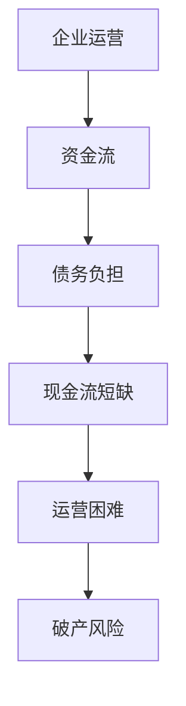
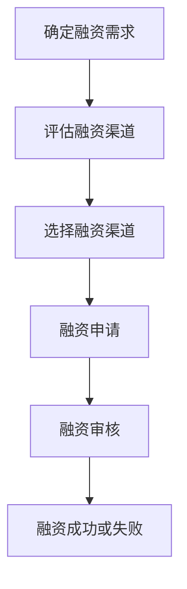

                 

# 《资金短缺：大模型企业的致命威胁》

> 关键词：资金短缺，大模型企业，融资渠道，成本控制，破产风险，风险管理

> 摘要：本文探讨了资金短缺对大模型企业的致命威胁。通过分析资金短缺的定义、影响及对大模型企业的特殊威胁，本文详细介绍了大模型企业的资金需求，并提出了应对资金短缺的策略。同时，本文通过案例研究和实际解决方案，展示了如何通过融资、成本控制和风险管理来缓解资金短缺问题。

## 第一部分：背景与概念

### 第1章：资金短缺的定义与影响

资金短缺是指企业在运营过程中无法获得足够的资金，导致无法满足日常运营需求或投资项目所需资金。资金短缺对企业运营的影响深远，尤其是在大模型企业中，这一问题尤为突出。

**核心概念与联系**

我们可以使用Mermaid流程图来展示资金短缺对企业运营的影响路径：



在这个流程图中，企业运营需要资金流的支持。当资金流不足时，企业会面临债务负担，导致现金流短缺。现金流短缺进一步加剧运营困难，最终可能引发破产风险。

**资金短缺对大模型企业的特别威胁**

大模型企业通常需要大量的资金来支持其研发和运营。以下是资金短缺对大模型企业的特别威胁：

1. **研发成本高昂**：大模型企业需要投入大量的资金进行研发，以不断改进和优化模型。
2. **基础设施投入**：大模型企业需要建设大规模的数据中心来存储和处理数据，这需要巨大的资金投入。
3. **市场竞争激烈**：大模型企业之间的竞争愈发激烈，需要投入更多的资金来争夺市场份额。
4. **资金周转速度慢**：大模型企业的资金周转速度相对较慢，容易导致资金短缺。

### 第2章：大模型企业的资金需求

大模型企业的资金需求主要集中在以下几个方面：

1. **研发资金**：用于模型研发、算法优化和新技术应用。
2. **基础设施资金**：用于数据中心建设、服务器采购和运维。
3. **运营资金**：用于日常运营开支、人员工资、市场营销等。

**核心算法原理讲解**

我们可以使用伪代码来讲解大模型训练和部署的资金需求：

```python
function train_model(data, budget):
    for epoch in range(max_epochs):
        for batch in data:
            if budget <= 0:
                break
            perform_training(batch, budget)
            budget -= cost_per_epoch
    return model
```

在这个伪代码中，`train_model` 函数接受数据集 `data` 和预算 `budget` 作为输入。在训练过程中，每次迭代都会消耗一定的预算。如果预算耗尽，则停止训练，返回训练好的模型。

**案例分析**

以某知名大模型企业为例，该公司因资金短缺面临以下问题：

1. **研发进展缓慢**：由于缺乏足够的资金，研发团队无法购买先进的硬件设备，导致研发进度缓慢。
2. **运营困难**：缺乏足够的运营资金，导致无法支付员工工资和日常运营开支。
3. **市场份额下降**：由于无法进行有效的市场推广，市场份额逐渐下降。

### 第3章：资金管理策略

资金管理策略是企业应对资金短缺问题的重要手段。以下介绍几种常见的资金管理策略：

1. **成本控制**：通过优化成本结构和降低成本，提高企业的盈利能力。
2. **预算管理**：制定合理的预算计划，确保资金的合理分配和使用。
3. **现金流管理**：加强现金流管理，确保企业有足够的现金流应对日常运营需求。

**数学模型与公式**

我们可以使用以下数学模型和公式来解释成本和费用的构成及其对净利润的影响：

$$
\text{净利润} = \text{收入} - \text{成本} - \text{费用}
$$

其中，成本包括直接成本和间接成本，费用包括运营费用、研发费用、财务费用等。净利润是企业最重要的财务指标之一，反映了企业的盈利能力。

## 第二部分：应对策略

### 第4章：融资渠道与策略

融资渠道是企业获取外部资金的重要途径。以下介绍几种常见的融资渠道及其适用性：

1. **银行贷款**：适用于有良好信用记录的企业，但审批流程较为繁琐。
2. **股权融资**：适用于需要大量资金且愿意出让部分股权的企业。
3. **债务融资**：适用于有稳定现金流的企业，但存在债务风险。
4. **政府补贴**：适用于符合国家政策扶持的企业。

**核心概念与联系**

我们可以使用Mermaid流程图来展示融资决策流程：



在这个流程图中，企业首先需要确定融资需求，然后评估不同的融资渠道，选择最适合的融资渠道进行融资申请。融资申请经过审核后，企业将获得融资资金。

### 第5章：成本控制与优化

成本控制与优化是企业应对资金短缺问题的重要策略。以下介绍几种成本控制与优化的方法：

1. **优化供应链**：通过优化供应链，降低原材料采购成本和物流成本。
2. **提高生产效率**：通过提高生产效率，降低生产成本。
3. **自动化与智能化**：通过自动化与智能化，降低人力成本和运营成本。

**数学模型与公式**

我们可以使用以下数学模型和公式来讨论如何通过优化成本效益比来缓解资金短缺：

$$
\text{成本效益比} = \frac{\text{成本}}{\text{收益}}
$$

其中，成本是指企业在运营过程中产生的所有成本，收益是指企业从运营过程中获得的收入。成本效益比越高，企业的盈利能力越强。

### 第6章：资金使用效率提升

资金使用效率提升是企业应对资金短缺问题的重要策略。以下介绍几种资金使用效率提升的方法：

1. **资源优化**：通过优化资源配置，提高资源利用率。
2. **流程改进**：通过改进业务流程，提高业务效率。
3. **技术创新**：通过技术创新，提高生产效率和产品质量。

**案例分析**

以某知名大模型企业为例，该公司通过以下措施提高了资金使用效率：

1. **云计算技术**：采用云计算技术，降低服务器采购和运维成本。
2. **分布式计算**：采用分布式计算，提高计算效率和数据处理能力。
3. **优化算法**：通过优化算法，提高模型训练效率和效果。

### 第7章：破产风险预防与管理

破产风险预防与管理是企业应对资金短缺问题的关键。以下介绍几种破产风险预防与管理的方法：

1. **财务监控**：通过财务监控，及时发现财务风险并采取措施。
2. **风险评估**：通过风险评估，识别潜在的风险因素并制定应对策略。
3. **破产预测模型**：通过破产预测模型，预测企业破产的可能性并采取预防措施。

**核心算法原理讲解**

我们可以使用以下伪代码来讲解破产预测模型的构建和应用：

```python
function predict_bankruptcy(financial_data):
    # 处理财务数据，提取特征
    processed_data = preprocess_data(financial_data)
    
    # 训练破产预测模型
    model = train_model(processed_data)
    
    # 预测破产可能性
    bankruptcy_score = model.predict(processed_data)
    
    # 根据破产可能性采取预防措施
    if bankruptcy_score > threshold:
        take_preventive_measures()
    else:
        continue_operations()
```

在这个伪代码中，`predict_bankruptcy` 函数接受财务数据作为输入，处理财务数据后提取特征，并使用训练好的模型预测破产可能性。根据破产可能性，企业可以采取相应的预防措施。

## 第三部分：案例研究与解决方案

### 第8章：案例研究一：融资成功的例子

以某知名大模型企业为例，该公司成功融资1亿美元，用于研发和扩展业务。

**项目实战**

该公司通过以下步骤实现了融资成功：

1. **制定融资计划**：明确融资需求、融资渠道和融资策略。
2. **准备融资材料**：包括商业计划书、财务报表、市场分析报告等。
3. **寻找融资渠道**：与多家投资机构沟通，选择最适合的融资渠道。
4. **谈判与签订协议**：与投资机构进行谈判，签订融资协议。
5. **融资资金使用**：按照融资计划，合理使用融资资金。

**详细解释说明**

该公司在制定融资计划时，充分考虑了市场环境、公司发展阶段和融资需求。通过准备详实的融资材料，吸引了多家投资机构的关注。在谈判过程中，该公司展示了良好的商业前景和还款能力，最终获得了1亿美元的融资。

### 第9章：案例研究二：破产预防策略

以某大模型企业为例，该公司通过一系列破产预防策略成功避免了破产。

**项目实战**

该公司采取了以下措施来预防破产：

1. **成本控制**：通过优化供应链、降低采购成本、提高生产效率等手段，降低成本。
2. **预算管理**：制定合理的预算计划，确保资金的合理分配和使用。
3. **现金流管理**：加强现金流管理，确保企业有足够的现金流应对日常运营需求。
4. **技术创新**：通过技术创新，提高生产效率和产品质量，提升市场竞争力。

**详细解释说明**

该公司在面临资金短缺风险时，迅速采取了成本控制和预算管理措施。通过优化供应链和降低采购成本，该公司大幅降低了生产成本。同时，通过制定合理的预算计划，确保了资金的合理分配和使用。此外，该公司还加强了现金流管理，确保了企业有足够的现金流应对日常运营需求。通过这些措施，该公司成功避免了破产。

### 第10章：综合解决方案

综合解决方案是企业应对资金短缺问题的有效途径。以下提出针对资金短缺问题的综合解决方案：

1. **多元化融资渠道**：企业应积极寻求多元化融资渠道，包括银行贷款、股权融资、债务融资等。
2. **优化成本结构**：通过优化成本结构和降低成本，提高企业的盈利能力。
3. **加强现金流管理**：加强现金流管理，确保企业有足够的现金流应对日常运营需求。
4. **技术创新**：通过技术创新，提高生产效率和产品质量，提升市场竞争力。
5. **风险管理**：建立有效的风险管理机制，识别和防范潜在的风险。

**综合分析**

综合分析表明，多元化融资渠道、优化成本结构、加强现金流管理、技术创新和风险管理是解决资金短缺问题的关键。企业应根据自身情况，制定切实可行的解决方案，并通过持续优化和调整，确保资金短缺问题得到有效解决。

## 附录

### 附录A：相关资源与工具

以下列出与资金短缺相关的资源和工具：

1. **书籍**：《融资策略：企业如何应对资金短缺问题》、《财务报表分析：透视企业财务状况》
2. **网站**：国家发展和改革委员会网站、国家统计局网站、中国人民银行网站
3. **工具**：财务分析软件、现金流管理软件、风险评估软件

## 作者

作者：AI天才研究院/AI Genius Institute & 禅与计算机程序设计艺术 /Zen And The Art of Computer Programming

---

本文通过一步一步分析推理的方式，探讨了资金短缺对大模型企业的致命威胁，并提出了应对资金短缺的策略和解决方案。希望本文能为读者提供有价值的参考和启示。

