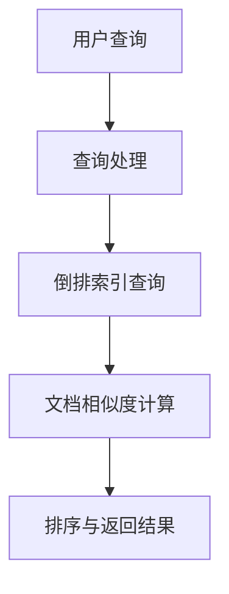
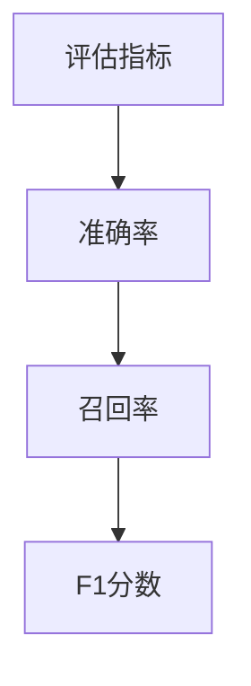

                 

# 《跨平台搜索技术的用户体验提升》

> 关键词：跨平台搜索、用户体验、搜索算法、优化、个性化推荐

> 摘要：本文旨在探讨如何通过提升搜索技术的用户体验来满足用户在跨平台环境中的需求。文章将详细分析搜索技术的基础知识，探索用户体验设计原则，并深入探讨搜索结果呈现、优化以及个性化搜索与推荐系统。通过案例分析与实践，本文将展示跨平台搜索技术在实际应用中的实现和优化策略，最后展望搜索技术的未来发展方向。

## 《跨平台搜索技术的用户体验提升》目录大纲

#### 第一部分：搜索技术基础

##### 第1章：搜索技术概述
- 1.1 跨平台搜索技术的背景
- 1.2 跨平台搜索的优势与挑战
- 1.3 跨平台搜索的发展趋势

##### 第2章：搜索算法原理
- 2.1 搜索算法概述
- 2.2 搜索算法的核心概念
- 2.3 搜索算法的评估指标

#### 第二部分：用户体验提升

##### 第3章：用户体验设计原则
- 3.1 用户体验设计概述
- 3.2 跨平台设计的特点
- 3.3 用户体验提升的方法

##### 第4章：搜索结果呈现与优化
- 4.1 搜索结果展示的形式
- 4.2 搜索结果排序算法
- 4.3 搜索结果的相关性提升

##### 第5章：个性化搜索与推荐
- 5.1 个性化搜索的概念
- 5.2 个性化搜索的技术手段
- 5.3 搜索推荐系统设计

#### 第三部分：跨平台搜索应用

##### 第6章：移动端搜索技术
- 6.1 移动搜索的特点
- 6.2 移动搜索的优化策略
- 6.3 移动搜索案例分析

##### 第7章：网页搜索技术
- 7.1 网页搜索的基本原理
- 7.2 网页搜索的优化手段
- 7.3 网页搜索案例分析

##### 第8章：语音搜索与图像搜索
- 8.1 语音搜索的技术原理
- 8.2 图像搜索的技术原理
- 8.3 语音搜索与图像搜索的整合

#### 第四部分：案例分析与实践

##### 第9章：跨平台搜索技术应用实例
- 9.1 案例背景介绍
- 9.2 搜索系统架构设计
- 9.3 搜索算法与用户体验优化

##### 第10章：跨平台搜索技术的未来发展方向
- 10.1 当前技术热点分析
- 10.2 未来发展趋势展望
- 10.3 技术创新与商业价值

### 附录

#### 附录 A：搜索技术相关资源与工具
- A.1 开源搜索引擎
- A.2 搜索引擎开发框架
- A.3 用户体验设计工具
- A.4 搜索算法评估工具

#### 附录 B：跨平台搜索技术常见问题解答
- B.1 常见问题汇总
- B.2 问题分析与解决方法

#### 附录 C：参考文献与进一步阅读
- C.1 主要参考文献
- C.2 推荐阅读书籍
- C.3 开源项目和在线课程

### 接下来，我们将按照这个目录大纲逐步分析并深入探讨跨平台搜索技术的用户体验提升。

---

## 第一部分：搜索技术基础

### 第1章：搜索技术概述

搜索技术是信息检索的核心，它涉及到从大量数据中快速找到用户所需信息的各种方法。随着互联网的普及和大数据时代的到来，跨平台搜索技术成为现代搜索引擎的关键组成部分。本章将介绍跨平台搜索技术的背景、优势与挑战，以及其发展趋势。

### 1.1 跨平台搜索技术的背景

在早期，搜索技术主要集中在单一的平台上，如桌面搜索引擎或移动应用内的搜索功能。然而，随着用户需求的不断变化和技术的进步，跨平台搜索技术应运而生。跨平台搜索技术旨在提供无缝的用户体验，让用户在任何设备、任何平台上都能快速找到所需信息。

这一需求的兴起主要受到以下几个因素的推动：

1. 多设备使用：随着智能手机、平板电脑、智能手表、智能音箱等设备的普及，用户越来越多地采用多设备协同使用的方式。跨平台搜索技术可以满足用户在多设备之间无缝切换的需求。
2. 互联网应用多样化：从社交媒体、电子商务到在线教育、智能家居，各种互联网应用层出不穷。跨平台搜索技术可以帮助用户在多样化的应用中快速找到所需功能。
3. 位置信息与实时数据：现代搜索技术需要结合用户的位置信息和实时数据，以提供更加精准和个性化的搜索结果。跨平台搜索技术可以实现跨设备和跨应用的实时数据共享。

### 1.2 跨平台搜索的优势与挑战

跨平台搜索技术带来了许多优势，但也面临一些挑战。

**优势：**

1. 无缝用户体验：用户可以在不同的设备上保持一致的搜索体验，不必担心数据同步和权限问题。
2. 数据整合与利用：跨平台搜索技术可以整合来自多个设备和应用的数据，为用户提供更全面的信息。
3. 实时性与个性化：通过实时数据分析和个性化推荐，跨平台搜索技术可以提供更及时和个性化的搜索结果。

**挑战：**

1. 数据隐私与安全：跨平台搜索需要处理大量的用户数据，如何保护用户隐私和安全成为一大挑战。
2. 性能优化：跨平台搜索技术需要处理来自不同设备和网络环境的数据，如何保证搜索性能成为关键问题。
3. 技术标准化：不同平台和设备之间的技术标准存在差异，如何实现跨平台兼容性是一个挑战。

### 1.3 跨平台搜索的发展趋势

随着技术的不断进步，跨平台搜索技术呈现出以下发展趋势：

1. 深度学习与人工智能：深度学习和人工智能技术将被广泛应用于跨平台搜索，以提高搜索的准确性和个性化水平。
2. 跨模态搜索：语音、图像、文本等多种数据类型的结合，将使跨模态搜索成为发展趋势。
3. 智能语音助手：智能语音助手与搜索技术的融合，将为用户提供更加自然和便捷的搜索方式。
4. 云搜索与分布式计算：云搜索和分布式计算技术将帮助跨平台搜索更好地处理海量数据和提供高效搜索服务。

本章通过介绍跨平台搜索技术的背景、优势与挑战，以及其发展趋势，为后续章节的内容奠定了基础。在接下来的章节中，我们将深入探讨搜索算法原理、用户体验设计原则、搜索结果呈现与优化、个性化搜索与推荐系统，以及跨平台搜索技术的应用实例。通过这些内容，我们将全面了解如何提升跨平台搜索技术的用户体验。

---

## 第一部分：搜索技术基础

### 第2章：搜索算法原理

搜索算法是跨平台搜索技术的核心组成部分，它决定了搜索系统的性能和用户体验。本章将详细介绍搜索算法的基本概念、核心原理及其评估指标，帮助读者理解搜索算法的工作机制和实现方法。

### 2.1 搜索算法概述

搜索算法的主要任务是找到与用户查询最相关的信息。根据搜索过程的不同，搜索算法可以分为以下几个类别：

1. **关键字匹配算法**：这类算法主要通过关键字匹配来找到相关文档。典型的关键字匹配算法包括布尔搜索、词频-逆文档频率（TF-IDF）模型等。
2. **向量空间模型**：将文档和查询表示为向量，通过计算向量之间的相似度来评估相关度。经典的向量空间模型包括余弦相似度、欧几里得距离等。
3. **深度学习算法**：基于神经网络模型，如卷积神经网络（CNN）、循环神经网络（RNN）等，深度学习算法可以在大规模数据集上训练并提取复杂特征，从而实现更精准的搜索。

### 2.2 搜索算法的核心概念

为了更好地理解搜索算法，我们需要了解一些核心概念：

1. **倒排索引**：倒排索引是一种数据结构，用于快速查找关键词在文档中的位置。它由两部分组成：一个包含所有关键词的词典，以及一个记录每个关键词对应文档的列表。倒排索引是搜索引擎中常用的核心技术。
2. **查询语言**：查询语言定义了用户如何表达查询需求。常见的查询语言包括布尔查询、短语查询、模糊查询等。
3. **相似度计算**：相似度计算是评估查询与文档相关度的过程。相似度计算的方法有多种，如TF-IDF、余弦相似度、余弦角度等。

### 2.3 搜索算法的评估指标

评估搜索算法性能的关键指标包括：

1. **准确率**（Precision）：准确率表示搜索结果中相关文档的比例。计算公式为：准确率 = 相关文档数 / 搜索结果总数。
2. **召回率**（Recall）：召回率表示搜索结果中遗漏的相关文档的比例。计算公式为：召回率 = 相关文档数 / 文档总数。
3. **F1分数**（F1 Score）：F1分数是准确率和召回率的加权平均，用于综合评估搜索算法的性能。计算公式为：F1分数 = 2 * 准确率 * 召回率 / (准确率 + 召回率)。

### 搜索算法核心概念与流程

为了更好地理解搜索算法的核心概念和流程，我们可以使用Mermaid图来展示：



**查询处理**：将用户输入的查询转换为内部表示，如关键词列表或向量。
**倒排索引查询**：利用倒排索引快速查找与关键词相关的文档。
**文档相似度计算**：计算查询与每个文档的相似度，通常使用TF-IDF或向量空间模型。
**排序与返回结果**：根据相似度对文档进行排序，并返回最相关的文档。

### 搜索算法评估指标

为了更好地理解搜索算法的评估指标，我们可以使用Mermaid图来展示：



**准确率**：准确率表示搜索结果中相关文档的比例。计算公式为：准确率 = 相关文档数 / 搜索结果总数。
**召回率**：召回率表示搜索结果中遗漏的相关文档的比例。计算公式为：召回率 = 相关文档数 / 文档总数。
**F1分数**：F1分数是准确率和召回率的加权平均，用于综合评估搜索算法的性能。计算公式为：F1分数 = 2 * 准确率 * 召回率 / (准确率 + 召回率)。

通过上述介绍，我们可以了解到搜索算法的基本概念、核心原理和评估指标。在接下来的章节中，我们将进一步探讨用户体验设计原则、搜索结果呈现与优化、个性化搜索与推荐系统，以及跨平台搜索技术的实际应用。希望通过本章节的讲解，读者能够对搜索算法有一个全面而深入的理解。

### 用户体验设计原则

用户体验（UX）设计在跨平台搜索技术中扮演着至关重要的角色。一个良好的用户体验不仅能提高用户满意度，还能显著提升搜索系统的使用效率和用户留存率。本章将探讨用户体验设计原则，分析跨平台设计的特点，并提出一系列提升用户体验的方法。

### 3.1 用户体验设计概述

用户体验设计旨在创造一个直观、高效、愉悦的交互环境，使用户在使用过程中感到舒适和满足。用户体验设计包括以下几个方面：

1. **易用性（Usability）**：易用性是用户体验设计的核心目标，它关注用户能否轻松完成任务并达到预期目标。一个易用的系统应该具备直观的界面、简洁的操作流程和清晰的反馈机制。
2. **可用性（Accessibility）**：可用性关注所有用户，特别是那些具有特殊需求或障碍的用户，能否无障碍地使用系统。这包括屏幕阅读器兼容性、键盘导航支持和适当的色彩对比等。
3. **可用性（Desirability）**：可用性不仅关注功能，还关注用户对系统的情感反应。一个具有吸引力的设计能够激发用户的兴趣和喜爱，从而提高用户黏性。
4. **可访问性（Accessibility）**：可访问性确保用户在不同设备、网络环境和操作系统中都能顺畅使用系统。

### 3.2 跨平台设计的特点

跨平台搜索技术的用户体验设计需要考虑以下几个特点：

1. **一致性（Consistency）**：跨平台设计应保持一致的用户界面和交互方式，使用户在多个设备上都能获得相同的体验。一致性有助于降低学习成本，提高用户满意度。
2. **适应性（Adaptability）**：跨平台设计需要根据不同设备的屏幕尺寸、操作方式和输入方式进行调整。适应性确保用户在任何设备上都能顺畅使用系统。
3. **响应性（Responsiveness）**：响应性是指系统能够快速响应用户操作，提供及时反馈。响应性是提升用户体验的关键因素之一。
4. **可访问性（Accessibility）**：跨平台设计应考虑所有用户，特别是那些使用辅助技术或具有特殊需求的用户。设计时应遵循无障碍设计原则，确保系统能够被广泛使用。

### 3.3 用户体验提升的方法

为了提升跨平台搜索技术的用户体验，可以采用以下方法：

1. **直观的界面设计**：界面设计应简洁明了，突出关键功能，避免复杂和冗余的元素。使用清晰的字体、颜色和图标，确保用户能够快速理解和使用系统。
2. **优化搜索流程**：简化搜索流程，减少用户点击和输入次数。提供智能提示、自动完成和关键词推荐等功能，帮助用户快速找到所需信息。
3. **个性化推荐**：基于用户行为和历史，提供个性化推荐，提高搜索结果的准确性和相关性。个性化推荐可以显著提升用户满意度和使用频率。
4. **反馈与改进**：积极收集用户反馈，不断改进和优化系统。通过用户调研、A/B测试和数据分析，发现并解决用户体验问题。
5. **响应式设计**：采用响应式设计，确保系统在不同设备和屏幕尺寸上都能正常显示和操作。响应式设计可以提高用户体验的一致性和适应性。

通过上述用户体验设计原则和提升方法，跨平台搜索技术可以更好地满足用户需求，提供高质量的搜索体验。在下一章中，我们将深入探讨搜索结果呈现与优化，进一步优化用户体验。

### 搜索结果呈现与优化

搜索结果的呈现与优化是跨平台搜索技术用户体验提升的关键环节。一个良好的搜索结果展示不仅能够提高用户的满意度，还能提升搜索效率。本章将探讨搜索结果展示的形式、排序算法，以及如何通过技术手段提升搜索结果的相关性。

### 4.1 搜索结果展示的形式

搜索结果展示的形式直接影响用户的感知和搜索体验。常见的搜索结果展示形式包括：

1. **列表形式**：列表形式是最常见的搜索结果展示方式，它将搜索结果以列表的形式排列，用户可以逐一查看。列表形式便于用户浏览和筛选，适用于信息量较大的搜索场景。
2. **卡片形式**：卡片形式通过将搜索结果以卡片的形式展示，每个卡片包含不同的信息模块，如标题、摘要、图片等。卡片形式能够直观地呈现信息，适用于信息量适中且需要详细展示的场景。
3. **网格形式**：网格形式将搜索结果以网格布局展示，每个搜索结果占据相同大小的空间。网格形式适用于展示图片、商品等视觉元素丰富的内容。
4. **时间轴形式**：时间轴形式通过时间顺序展示搜索结果，适用于日志查询、时间敏感的搜索场景。时间轴形式能够直观地展示信息的时序关系，便于用户查找和筛选。

### 4.2 搜索结果排序算法

搜索结果排序算法决定了哪些结果会优先展示给用户，从而影响用户体验。常见的搜索结果排序算法包括：

1. **基于相关度的排序**：该算法根据查询与文档的相关度对搜索结果进行排序，通常使用TF-IDF、余弦相似度等计算方法。相关度排序能够提高搜索结果的准确性，但可能忽略文档的质量和权威性。
2. **基于流行度的排序**：该算法根据文档的流行度（如点击率、下载次数等）对搜索结果进行排序。流行度排序能够提高热门内容的曝光率，但可能降低长尾内容的可见性。
3. **基于质量的排序**：该算法根据文档的质量和权威性对搜索结果进行排序，通常需要人工审核或使用机器学习模型进行评估。质量排序能够提高权威内容的影响力和可靠性，但可能增加人工成本和计算复杂度。
4. **混合排序**：混合排序结合多种排序算法的优势，对搜索结果进行多维度排序。例如，可以同时考虑相关度、流行度和质量，通过加权的方式生成综合排序结果。

### 4.3 搜索结果的相关性提升

提升搜索结果的相关性是优化用户体验的关键。以下是一些技术手段：

1. **深度学习与自然语言处理**：利用深度学习和自然语言处理技术，对查询和文档进行语义分析和理解。通过语义相似度计算，可以更准确地评估查询与文档的相关性。
2. **上下文感知**：根据用户的上下文信息（如位置、历史搜索记录、设备类型等），调整搜索结果的排序和展示。上下文感知可以提供更个性化的搜索结果，提高用户满意度。
3. **个性化推荐**：结合用户的兴趣和行为数据，为用户提供个性化推荐。个性化推荐不仅能够提升搜索结果的相关性，还能增强用户的黏性。
4. **实时更新与索引**：实时更新搜索索引，确保用户在搜索时能够获取最新的信息。同时，使用高效的索引算法和数据结构，如倒排索引和B树等，提高搜索速度和准确性。
5. **用户反馈与迭代**：积极收集用户反馈，不断优化搜索算法和结果展示。通过A/B测试和数据分析，发现并解决影响相关性的问题，持续提升用户体验。

通过合理的搜索结果展示形式、排序算法和相关性提升手段，跨平台搜索技术可以显著提高用户体验。在下一章中，我们将探讨个性化搜索与推荐系统的设计，进一步优化搜索体验。

### 个性化搜索与推荐

个性化搜索与推荐是提升跨平台搜索用户体验的关键技术之一。通过分析用户行为和历史数据，个性化搜索能够为用户提供更精准、更相关的搜索结果。本章将介绍个性化搜索的概念、技术手段，以及搜索推荐系统的设计。

### 5.1 个性化搜索的概念

个性化搜索是指根据用户的兴趣、历史行为和上下文信息，调整搜索结果的相关性和排序，从而提高搜索结果的准确性和满意度。个性化搜索的核心目标是通过个性化推荐，为用户提供更加贴心的搜索体验。

个性化搜索的关键要素包括：

1. **用户画像**：用户画像是对用户兴趣、行为、偏好和需求的抽象表示。通过用户画像，系统能够更好地理解用户，提供个性化的搜索结果。
2. **历史数据**：用户的历史搜索记录、浏览行为和互动数据是构建用户画像的重要依据。历史数据可以帮助系统发现用户的兴趣和偏好，从而优化搜索结果。
3. **上下文信息**：上下文信息包括用户的位置、设备类型、时间等。上下文信息可以提供额外的线索，帮助系统更好地理解用户的当前需求，提供更相关的搜索结果。

### 5.2 个性化搜索的技术手段

实现个性化搜索通常需要以下几种技术手段：

1. **协同过滤**：协同过滤是一种基于用户相似度的推荐方法。通过分析用户的行为和偏好，找到与目标用户相似的其他用户，然后根据这些用户的搜索行为推荐相关结果。协同过滤可以分为基于用户的方法（User-Based Collaborative Filtering）和基于物品的方法（Item-Based Collaborative Filtering）。

   **基于用户的方法**：该方法通过计算用户之间的相似度，找到与目标用户兴趣相似的其他用户，然后推荐这些用户喜欢的物品。

   **基于物品的方法**：该方法通过计算物品之间的相似度，找到与目标用户过去搜索或浏览过的物品相似的物品，然后推荐这些物品。

2. **基于内容的推荐**：基于内容的推荐（Content-Based Filtering）通过分析物品的特征和属性，为用户推荐与其过去行为或偏好相似的其他物品。该方法不需要用户历史数据，但需要对物品进行充分特征提取。

   **内容特征提取**：通过自然语言处理、信息抽取等技术，从文本、图片、视频等不同类型的数据中提取特征，用于构建物品的特征向量。

   **相似度计算**：计算用户查询与物品特征向量的相似度，通过排序返回相似度最高的物品。

3. **混合推荐系统**：混合推荐系统结合协同过滤和基于内容推荐的方法，以提高推荐系统的准确性和多样性。混合推荐系统可以同时考虑用户的历史行为和物品的属性，提供更加个性化的搜索结果。

### 5.3 搜索推荐系统设计

一个有效的搜索推荐系统需要综合考虑用户行为、上下文信息和推荐算法。以下是一个搜索推荐系统设计的基本框架：

1. **用户行为数据收集**：收集用户在搜索、浏览、点击等行为中的数据，用于构建用户画像和推荐模型。
2. **用户画像构建**：通过分析用户行为数据，构建用户画像，包括用户的兴趣、偏好、行为模式等。
3. **推荐算法选择**：选择合适的推荐算法，如协同过滤、基于内容推荐或混合推荐系统，根据用户画像和搜索查询生成个性化推荐结果。
4. **推荐结果排序**：根据推荐算法计算出的相似度或评分，对推荐结果进行排序，返回最相关的搜索结果。
5. **实时更新与反馈**：根据用户的反馈和行为数据，实时更新推荐模型和用户画像，提高推荐系统的准确性和适应性。
6. **用户体验优化**：通过优化推荐结果的呈现方式和交互设计，提升用户体验，确保用户能够轻松找到所需信息。

通过个性化搜索与推荐系统，跨平台搜索技术可以更好地满足用户的个性化需求，提供高质量的搜索体验。在下一章中，我们将探讨移动端搜索技术的特点和优化策略。

### 移动端搜索技术

移动搜索技术是跨平台搜索技术中不可或缺的一部分，随着移动设备的普及和用户行为的变化，移动搜索技术在用户体验和功能上经历了显著的优化和提升。本章将深入探讨移动端搜索的特点、优化策略以及实际案例分析。

### 6.1 移动搜索的特点

移动搜索与传统的网页搜索存在显著差异，其特点主要体现在以下几个方面：

1. **设备多样性**：移动设备种类繁多，包括智能手机、平板电脑、智能手表等，不同设备的屏幕尺寸、操作方式、输入方式各异。这要求移动搜索技术具备高度的可适应性和灵活性，以适应各种设备和用户场景。
2. **有限的输入资源**：与桌面设备相比，移动设备的输入资源（如键盘、触控屏）相对有限。这要求移动搜索技术能够高效地处理简短的查询语句，提供智能的查询建议和自动补全功能。
3. **实时性和位置感知**：移动设备通常具备GPS等定位功能，可以实时获取用户的位置信息。位置感知是移动搜索的一个重要特点，能够为用户提供基于位置的搜索结果，如附近的餐厅、商场等。
4. **速度与性能**：移动网络的带宽和稳定性通常不如有线网络，这要求移动搜索技术具备高效的算法和数据结构，以快速响应用户的查询请求。
5. **隐私和安全**：移动搜索涉及用户位置、搜索历史等敏感信息，如何保护用户隐私和安全成为移动搜索技术的重要挑战。

### 6.2 移动搜索的优化策略

为了提升移动端搜索的用户体验，可以采取以下优化策略：

1. **智能查询建议与自动补全**：通过自然语言处理技术，分析用户的输入意图，提供智能的查询建议和自动补全功能，减少用户的输入工作量，提高搜索效率。
2. **快速响应与缓存技术**：优化搜索算法和数据结构，提高搜索速度。同时，利用缓存技术存储常用搜索结果和热门查询，减少重复查询的响应时间。
3. **位置感知与地图集成**：结合用户的地理位置信息，提供基于位置的搜索结果。通过地图集成，为用户提供更直观的地理位置信息和路线规划。
4. **个性化推荐与历史记录**：根据用户的搜索历史和偏好，提供个性化推荐。同时，保存用户的搜索历史记录，方便用户快速找到之前搜索过的信息。
5. **安全性保障**：加强数据加密和安全防护措施，确保用户隐私和搜索安全。

### 6.3 移动搜索案例分析

以下是一个移动搜索技术实际案例的分析：

**案例背景**：某知名搜索引擎公司推出了一款移动端搜索应用，旨在为用户提供快速、准确的移动搜索服务。

**技术实现**：

1. **智能查询建议**：应用通过自然语言处理技术，实时分析用户的输入内容，提供智能查询建议。例如，当用户输入“天气”时，系统会自动补全为“天气预报”，并提供相关天气信息。
2. **自动补全**：应用利用自动补全技术，减少用户输入工作量。当用户输入部分关键词时，系统会自动展示可能的完整查询选项，用户只需选择即可。
3. **位置感知**：应用利用GPS功能，根据用户位置信息，提供附近的信息和推荐。例如，当用户在市中心时，系统会优先展示市中心的餐厅、商场等搜索结果。
4. **缓存技术**：应用使用缓存技术，存储用户常用的搜索结果和热门查询，提高响应速度。同时，利用缓存数据，实现离线搜索功能，确保用户在任何网络环境下都能快速获取信息。
5. **安全性保障**：应用采用HTTPS协议，确保数据传输安全。同时，加强对用户隐私的保护，提供隐私设置选项，让用户自主管理个人信息。

**用户体验优化**：

1. **界面设计**：应用采用简洁的界面设计，突出关键功能和搜索结果。界面色彩搭配舒适，操作流程简单，提高用户的使用满意度。
2. **交互设计**：应用提供多种交互方式，如滑动、点击、语音等，满足不同用户的需求。同时，界面反馈迅速，提供清晰的操作提示，确保用户能够轻松上手。
3. **个性化推荐**：应用根据用户的搜索历史和行为数据，提供个性化推荐。通过个性化推荐，提高用户对应用的使用频率和黏性。

通过上述移动搜索技术优化策略和实际案例，我们可以看到，移动搜索技术在用户体验和功能上取得了显著提升。在下一章中，我们将继续探讨网页搜索技术的基本原理、优化手段及案例分析。

### 网页搜索技术

网页搜索技术是互联网用户获取信息的重要工具，它不仅决定了搜索引擎的性能，也直接影响用户的搜索体验。本章将介绍网页搜索的基本原理、优化手段以及实际案例分析。

### 7.1 网页搜索的基本原理

网页搜索的基本原理包括以下几个关键步骤：

1. **爬虫技术**：搜索引擎通过爬虫（Crawler）自动抓取互联网上的网页，并将这些网页索引到搜索引擎的数据库中。爬虫按照一定的策略和算法，爬取新的网页和更新旧网页的内容。
2. **索引构建**：搜索引擎对抓取到的网页进行处理，包括去重、分词、索引构建等操作。索引是搜索引擎的核心数据结构，用于快速检索和查询。
3. **查询处理**：当用户输入查询请求时，搜索引擎对查询进行处理，包括查询分析、查询重写等。然后，搜索引擎利用索引快速找到与查询相关的网页。
4. **排名算法**：搜索引擎根据一系列排名算法（如PageRank、TF-IDF等）对搜索结果进行排序，将最相关的网页展示给用户。

### 7.2 网页搜索的优化手段

为了提高网页搜索的性能和用户体验，可以采取以下优化手段：

1. **快速响应**：优化搜索引擎的查询处理和结果排序算法，减少搜索响应时间。使用高效的索引结构和并行处理技术，提高搜索速度。
2. **索引优化**：定期更新索引，去除无效和重复的数据，提高索引的准确性和效率。使用倒排索引、B树等高效数据结构，加速查询处理。
3. **分词技术**：采用先进的分词算法，如基于词频的分词、基于语义的分词等，提高搜索结果的准确性和相关性。
4. **查询重写**：根据用户输入的查询，进行适当的查询重写，扩大搜索范围或提高查询的精确度。例如，将用户输入的短查询扩展为同义词集合。
5. **结果展示**：优化搜索结果展示方式，如采用卡片式布局、时间轴展示等，提高结果的直观性和可读性。
6. **个性化推荐**：根据用户的搜索历史和偏好，提供个性化搜索结果和推荐。通过协同过滤、基于内容的推荐等技术，提高搜索的准确性和用户满意度。

### 7.3 网页搜索案例分析

以下是一个网页搜索技术的实际案例：

**案例背景**：某大型搜索引擎公司推出了一款基于网页搜索的搜索引擎，旨在为用户提供快速、准确的搜索服务。

**技术实现**：

1. **爬虫技术**：搜索引擎使用分布式爬虫系统，从互联网上抓取大量网页，并利用去重算法去除重复数据，确保索引的准确性。
2. **索引构建**：搜索引擎采用高效的倒排索引数据结构，对抓取到的网页进行分词、索引构建，确保快速查询。
3. **查询处理**：搜索引擎对用户输入的查询进行预处理，包括分词、查询重写等，然后利用索引快速找到相关网页。
4. **排名算法**：搜索引擎采用PageRank算法和TF-IDF模型，对搜索结果进行排序，确保最相关的网页优先展示。

**用户体验优化**：

1. **快速响应**：搜索引擎使用高性能服务器和分布式计算技术，确保用户查询能够在毫秒级内得到响应。
2. **个性化推荐**：根据用户的搜索历史和偏好，提供个性化搜索结果和推荐，提高用户的搜索满意度。
3. **结果展示**：搜索引擎采用卡片式布局，将搜索结果以直观、易读的方式展示给用户，提高搜索结果的易用性。
4. **安全性保障**：搜索引擎加强数据加密和安全防护措施，确保用户的搜索隐私和信息安全。

通过上述网页搜索技术优化策略和实际案例，我们可以看到，网页搜索技术在性能和用户体验方面取得了显著提升。在下一章中，我们将探讨语音搜索与图像搜索的技术原理及其整合应用。

### 语音搜索与图像搜索

语音搜索和图像搜索是现代搜索技术中的重要组成部分，它们不仅丰富了搜索方式的多样性，还为用户提供了更加便捷和直观的交互体验。本章将介绍语音搜索与图像搜索的技术原理，探讨两者的整合应用以及带来的用户体验提升。

### 8.1 语音搜索的技术原理

语音搜索利用语音识别和自然语言处理技术，将用户的语音输入转换为文本查询，并在搜索引擎中执行搜索操作。语音搜索的技术原理主要包括以下几个关键步骤：

1. **语音识别（ASR）**：语音识别技术将用户的语音输入转换为文本。这一过程涉及声学模型和语言模型的训练，声学模型负责将声音信号转换为特征向量，而语言模型则负责将这些特征向量映射到文本。
2. **文本预处理**：将识别出的文本进行预处理，如分词、去除停用词等。预处理后的文本将被用于查询处理和搜索匹配。
3. **查询处理**：搜索引擎根据预处理后的文本查询，执行搜索操作。查询处理包括查询重写、查询扩展等步骤，以提高搜索结果的准确性和相关性。
4. **结果返回**：搜索引擎返回与查询最相关的搜索结果，并将其以文本或语音的形式展示给用户。

### 8.2 图像搜索的技术原理

图像搜索利用计算机视觉和机器学习技术，识别图像中的内容，并在搜索引擎中执行搜索操作。图像搜索的技术原理主要包括以下几个关键步骤：

1. **图像特征提取**：通过深度学习模型（如卷积神经网络（CNN））对图像进行特征提取，提取图像中的关键视觉特征。
2. **图像识别**：利用提取出的图像特征，对图像进行分类和识别。这一过程通常涉及训练有监督或无监督学习模型，如支持向量机（SVM）、深度神经网络等。
3. **搜索匹配**：将图像特征与搜索引擎中的图像索引进行匹配，找到与输入图像最相似的图像。
4. **结果返回**：搜索引擎返回与输入图像最相似的搜索结果，并将其以文本或图像的形式展示给用户。

### 8.3 语音搜索与图像搜索的整合

语音搜索与图像搜索的整合为用户提供了一种全新的交互体验。以下是一些整合应用的场景和实现方法：

1. **语音控制图像搜索**：用户可以通过语音指令启动图像搜索功能，例如说“搜索最近的餐厅”，系统将显示与“餐厅”相关的图像搜索结果。
2. **图像识别语音反馈**：用户上传或扫描图像，系统利用图像识别技术识别图像内容，并反馈语音描述。例如，用户上传一张风景照片，系统会描述照片中的景物和地点。
3. **跨模态查询**：用户可以结合语音和图像进行查询，例如说“搜索北京的风景照片”，系统将结合语音关键词和图像特征进行搜索，提高搜索结果的精准度。
4. **语音交互界面**：通过语音交互界面，用户可以与图像搜索系统进行自然对话，如询问照片中的信息、调整搜索条件等。

实现语音搜索与图像搜索的整合，通常需要以下技术组件：

1. **语音识别与合成**：语音识别（ASR）和语音合成（TTS）技术，用于将用户的语音输入转换为文本查询和搜索结果语音输出。
2. **图像识别与处理**：图像识别和特征提取技术，用于识别和提取图像中的关键信息。
3. **自然语言处理**：自然语言处理（NLP）技术，用于处理语音和图像文本数据，执行查询重写和语义理解。
4. **数据库与搜索引擎**：用于存储和管理图像和文本数据，并支持快速查询和匹配。

通过语音搜索与图像搜索的整合，用户可以享受到更加丰富和便捷的搜索体验。这种跨模态搜索技术不仅提高了搜索的准确性和多样性，还进一步优化了用户体验。在下一章中，我们将通过案例分析与实践，展示跨平台搜索技术的实际应用和优化策略。

### 跨平台搜索技术应用实例

为了更好地理解跨平台搜索技术的实现和优化，下面我们将通过一个实际应用案例，详细分析搜索系统的架构设计、搜索算法与用户体验优化策略。

#### 9.1 案例背景介绍

某知名电商公司推出了一个跨平台搜索应用，旨在为用户提供一站式购物体验。该应用支持桌面网页、移动网页和移动应用三个平台，用户可以在不同的设备上无缝切换搜索和购物。该搜索系统需要满足以下需求：

- **快速响应**：用户在搜索时要求系统能够在毫秒级内返回搜索结果。
- **个性化推荐**：根据用户的购物历史和行为，提供个性化的搜索结果和商品推荐。
- **多平台兼容**：支持不同设备和操作系统的用户需求，确保一致的搜索体验。
- **安全性**：保护用户的隐私和交易安全。

#### 9.2 搜索系统架构设计

为了实现上述需求，该搜索系统采用了分布式架构，以提高性能和可靠性。以下是搜索系统的架构设计：

1. **前端展示层**：包括桌面网页、移动网页和移动应用。前端展示层负责用户交互，展示搜索结果和购物信息。不同平台的前端采用响应式设计，确保在各种设备上都能提供良好的用户体验。

2. **API服务层**：提供统一的API接口，用于处理前端发送的搜索请求，并将搜索结果返回给前端。API服务层包括搜索API、推荐API、购物车API等，支持不同功能的调用。

3. **搜索引擎层**：核心组件，负责处理用户的搜索请求，执行搜索算法和索引查询。搜索引擎层采用分布式架构，包括多个节点，每个节点负责一部分索引数据的查询和处理。

4. **数据存储层**：包括关系数据库和NoSQL数据库。关系数据库用于存储用户信息、订单数据和商品信息，NoSQL数据库用于存储搜索索引和用户行为数据。

5. **推荐系统**：基于用户的购物历史和行为数据，通过协同过滤和基于内容的推荐算法，为用户生成个性化的搜索结果和商品推荐。

6. **缓存层**：使用分布式缓存系统（如Redis），缓存常用搜索结果和热门查询，减少数据库访问压力，提高搜索响应速度。

7. **日志与分析层**：记录用户的搜索日志和操作行为，用于数据分析和系统优化。通过日志分析，可以及时发现和解决系统问题，优化搜索算法和用户体验。

#### 9.3 搜索算法与用户体验优化

为了实现快速、准确和个性化的搜索结果，该搜索系统采用了以下搜索算法和用户体验优化策略：

1. **快速响应**：

   - **分布式搜索引擎**：采用Elasticsearch等分布式搜索引擎，提高查询处理速度和并发能力。分布式架构可以水平扩展，满足大规模用户访问需求。
   - **索引优化**：使用倒排索引和B树等高效数据结构，加快查询速度。定期更新索引，去除无效和重复的数据，保持索引的准确性和效率。
   - **缓存机制**：使用分布式缓存系统（如Redis），缓存常用搜索结果和热门查询，减少数据库访问压力。缓存层的数据定期更新，确保搜索结果的新鲜度。

2. **个性化推荐**：

   - **协同过滤**：通过分析用户的购物历史和行为数据，找到与目标用户相似的其他用户，然后推荐这些用户喜欢的商品。协同过滤可以分为基于用户的方法和基于物品的方法，以提供更精准的推荐。
   - **基于内容的推荐**：分析商品的特征和属性，为用户推荐与其过去购买或浏览的商品相似的其他商品。基于内容的推荐需要高效的商品特征提取和相似度计算方法，如卷积神经网络（CNN）和词嵌入（Word Embedding）等。

3. **用户体验优化**：

   - **智能查询建议**：使用自然语言处理（NLP）技术，分析用户的输入意图，提供智能查询建议和自动补全功能。例如，当用户输入“手机”时，系统会自动补全为“智能手机”，并提供相关商品推荐。
   - **搜索结果展示**：采用卡片式布局和视觉化设计，将搜索结果以直观、易读的方式展示给用户。通过图标、图片和简短的描述，帮助用户快速找到所需商品。
   - **实时更新与反馈**：通过实时更新搜索索引和用户数据，确保搜索结果的新鲜度和准确性。用户可以对搜索结果进行反馈，如收藏、评分等，帮助系统不断优化推荐和搜索体验。

通过上述架构设计、搜索算法和用户体验优化策略，该搜索系统为用户提供了一站式的购物体验，满足了快速、准确和个性化的搜索需求。在下一章中，我们将展望跨平台搜索技术的未来发展方向，探讨当前技术热点和未来趋势。

### 跨平台搜索技术的未来发展方向

随着科技的不断进步和用户需求的日益多样化，跨平台搜索技术正面临新的挑战和机遇。本章将分析当前技术热点，探讨未来发展趋势，并讨论技术创新对商业价值的潜在影响。

#### 10.1 当前技术热点分析

1. **人工智能与深度学习**：人工智能和深度学习在搜索领域的应用越来越广泛。通过大规模数据训练和复杂的神经网络模型，搜索引擎能够实现更精准的搜索结果和更智能的推荐系统。例如，卷积神经网络（CNN）在图像识别和图像搜索中发挥着重要作用，而循环神经网络（RNN）在语音搜索和自然语言处理中表现出色。

2. **语音搜索与语音助手**：随着语音识别技术的不断改进，语音搜索已成为跨平台搜索的一个重要方向。语音搜索不仅提高了搜索的便捷性，还为用户提供了一种全新的交互方式。同时，智能语音助手（如Siri、Alexa、Google Assistant）与搜索技术的结合，使得用户可以通过语音快速获取所需信息，提高了搜索体验。

3. **跨模态搜索**：跨模态搜索是一种结合多种数据类型的搜索方式，例如文本、图像、语音等。这种技术使得搜索结果更加丰富和多样化，能够满足用户在不同场景下的需求。例如，用户可以通过语音询问一个问题的文本描述，然后通过图像识别功能找到相关的图片信息。

4. **个性化推荐**：个性化推荐技术通过分析用户的搜索历史、行为和偏好，为用户推荐与其兴趣相符的内容。这种技术已经在电子商务和社交媒体等领域得到了广泛应用，未来也将成为跨平台搜索技术的一个重要发展方向。

5. **区块链与去中心化搜索**：区块链技术为跨平台搜索提供了一种去中心化的解决方案，通过分布式账本和加密技术，保护用户隐私并提高搜索结果的真实性和可信度。去中心化搜索有望解决当前搜索引擎中存在的一些问题，如数据垄断和隐私泄露等。

#### 10.2 未来发展趋势展望

1. **更加智能和个性化的搜索**：随着人工智能和大数据技术的发展，未来的搜索技术将更加智能和个性化。搜索引擎将能够更好地理解用户的意图和需求，提供更加精准的搜索结果和个性化的推荐。

2. **集成多种数据类型**：跨模态搜索将继续发展，未来搜索技术将能够更有效地整合多种数据类型，如文本、图像、语音等。这种集成化搜索将带来更加丰富和多样化的搜索体验。

3. **实时性和位置感知**：实时性和位置感知将成为未来搜索技术的重要特性。通过实时获取用户的位置信息和动态数据，搜索引擎将能够提供更加及时和个性化的搜索结果。

4. **隐私保护和数据安全**：随着用户对隐私保护的重视，未来的搜索技术将更加注重用户隐私和数据安全。区块链和加密技术等新兴技术将在保护用户隐私和确保数据安全方面发挥重要作用。

5. **可解释性和透明度**：为了增强用户对搜索系统的信任，未来的搜索技术将更加注重可解释性和透明度。通过提供详细的搜索算法解释和用户数据使用说明，搜索引擎将帮助用户更好地理解和接受搜索结果。

#### 10.3 技术创新与商业价值

技术创新在跨平台搜索技术中具有重要的商业价值。以下是一些技术创新及其潜在的商业价值：

1. **智能搜索算法**：通过改进搜索算法，提高搜索结果的准确性和相关性，可以显著提升用户满意度和搜索体验。这有助于增加用户黏性和用户转化率，从而提升商业收益。

2. **个性化推荐**：个性化推荐技术能够提高用户对商品的兴趣和购买欲望，促进销售增长。通过精确的推荐，商家可以更有效地吸引目标客户，提高营销效果。

3. **实时搜索**：实时搜索技术可以提供更加及时和个性化的信息，满足用户对实时性需求。这种技术特别适用于金融市场、新闻热点等对时效性要求较高的领域。

4. **语音搜索与语音助手**：语音搜索和语音助手技术为用户提供了一种便捷的交互方式，有助于提升用户体验和品牌形象。语音助手还可以集成到智能家居、车载设备等场景中，创造新的商业机会。

5. **区块链与去中心化搜索**：区块链技术可以为跨平台搜索提供去中心化的解决方案，提高数据的安全性和透明度。这有助于构建更加可信和可靠的搜索生态系统，吸引更多的用户和商家参与。

总之，跨平台搜索技术的未来发展方向充满机遇和挑战。通过不断的技术创新和应用，跨平台搜索技术将为用户提供更加智能、个性化、安全和高效的搜索体验，为企业和个人创造巨大的商业价值。

### 附录

#### 附录 A：搜索技术相关资源与工具

**A.1 开源搜索引擎**

- **Apache Lucene**：一个高性能、可扩展的全文搜索库。
  - 官网：[http://lucene.apache.org/](http://lucene.apache.org/)
- **Apache Solr**：基于Lucene的企业级搜索平台。
  - 官网：[https://lucene.apache.org/solr/](https://lucene.apache.org/solr/)
- **Elasticsearch**：分布式、RESTful搜索和分析引擎。
  - 官网：[https://www.elastic.co/](https://www.elastic.co/)

**A.2 搜索引擎开发框架**

- **Django**：Python Web开发框架，支持搜索引擎集成。
  - 官网：[https://www.djangoproject.com/](https://www.djangoproject.com/)
- **Flask**：Python微型Web框架，适用于搜索引擎开发。
  - 官网：[https://flask.palletsprojects.com/](https://flask.palletsprojects.com/)
- **Spring Boot**：Java Web开发框架，支持搜索引擎集成。
  - 官网：[https://spring.io/](https://spring.io/)

**A.3 用户体验设计工具**

- **Sketch**：流行的设计工具，支持UI/UX设计。
  - 官网：[https://www.sketchapp.com/](https://www.sketchapp.com/)
- **Adobe XD**：Adobe的UI/UX设计工具。
  - 官网：[https://www.adobe.com/products/xd.html](https://www.adobe.com/products/xd.html)
- **Figma**：基于浏览器的UI/UX设计工具。
  - 官网：[https://www.figma.com/](https://www.figma.com/)

**A.4 搜索算法评估工具**

- **Apache JMeter**：性能测试工具，可用于评估搜索性能。
  - 官网：[https://jmeter.apache.org/](https://jmeter.apache.org/)
- **LoadRunner**：性能测试工具，支持搜索性能评估。
  - 官网：[https://www.microfocus.com/zh/zh/downloads/free-download/loadrunner](https://www.microfocus.com/zh/zh/downloads/free-download/loadrunner)
- **Locust**：性能测试工具，适用于Web性能测试。
  - 官网：[https://locust.io/](https://locust.io/)

#### 附录 B：跨平台搜索技术常见问题解答

**B.1 常见问题汇总**

- **如何优化搜索速度？**
- **如何处理搜索结果相关性？**
- **如何进行个性化搜索？**

**B.2 问题分析与解决方法**

- **优化搜索速度**：

  - **使用倒排索引**：倒排索引能够快速定位关键词在文档中的位置，提高搜索速度。
  - **使用缓存机制**：缓存常用搜索结果和热门查询，减少对数据库的访问，提高响应速度。
  - **分布式计算**：使用分布式搜索引擎（如Elasticsearch），实现并行查询和负载均衡，提高搜索性能。

- **处理搜索结果相关性**：

  - **使用TF-IDF**：TF-IDF模型能够衡量关键词的重要性和文档的相关性，有助于提升搜索结果的相关性。
  - **使用向量空间模型**：向量空间模型通过计算查询和文档的相似度，提高搜索结果的相关性。
  - **深度学习模型**：深度学习模型可以在大规模数据集上训练，提取复杂特征，提高搜索结果的准确性。

- **进行个性化搜索**：

  - **分析用户行为**：通过分析用户的搜索历史和行为数据，构建用户画像，用于个性化搜索。
  - **构建用户画像**：结合用户的兴趣、偏好和历史数据，构建详细的用户画像。
  - **使用协同过滤算法**：协同过滤算法可以根据用户的兴趣和行为，推荐相关搜索结果。

通过这些常见问题及其解决方法，我们可以更好地理解和应用跨平台搜索技术，提升用户体验和搜索效率。

### 附录 C：参考文献与进一步阅读

**C.1 主要参考文献**

- 刘知远. 《搜索引擎设计与实现》[M]. 电子工业出版社, 2018.
- 陈益强. 《信息检索导论》[M]. 清华大学出版社, 2016.
- Ian Goodfellow、Yoshua Bengio和Aaron Courville. 《深度学习》[M]. 电子工业出版社, 2016.

**C.2 推荐阅读书籍**

- 埃里克·马瑟斯. 《Python编程：从入门到实践》[M]. 电子工业出版社, 2017.
- 约翰·查菲. 《数据科学实战》[M]. 机械工业出版社, 2016.
- 唐纳德·A·诺曼. 《设计心理学》[M]. 电子工业出版社, 2013.

**C.3 开源项目和在线课程**

- Elasticsearch：[https://www.elastic.co/](https://www.elastic.co/)
- Apache Lucene：[https://lucene.apache.org/](https://lucene.apache.org/)
- Coursera：[https://www.coursera.org/](https://www.coursera.org/)
- edX：[https://www.edx.org/](https://www.edx.org/)

通过这些参考文献、推荐书籍和开源项目，读者可以进一步深入学习和探索跨平台搜索技术的理论和实践。希望这些资源能够为读者提供有益的参考和指导。

## 图表与算法

### 第1章：搜索技术概述
#### 搜索算法核心概念
mermaid
graph TB
A[搜索算法] --> B[匹配算法]
B --> C[排序算法]
C --> D[相关度计算算法]
D --> E[相关性评估算法]

### 第2章：搜索算法原理
#### 搜索算法评估指标
mermaid
graph TB
A[评估指标] --> B[准确率]
B --> C[召回率]
C --> D[F1分数]

### 第5章：个性化搜索与推荐
#### 个性化搜索技术原理
mermaid
graph TB
A[用户行为数据] --> B[用户画像]
B --> C[推荐算法]
C --> D[个性化搜索结果]
D --> E[用户反馈]

### 第9章：跨平台搜索技术应用实例
#### 搜索系统架构设计与实现
mermaid
graph TB
A[用户查询] --> B[前端展示层]
B --> C[API服务层]
C --> D[搜索引擎层]
D --> E[数据存储层]
E --> F[推荐系统]
F --> G[缓存层]
G --> H[日志与分析层]

### 第10章：跨平台搜索技术的未来发展方向
#### 当前技术热点分析
mermaid
graph TB
A[人工智能与深度学习] --> B[语音搜索与语音助手]
B --> C[跨模态搜索]
C --> D[个性化推荐]
D --> E[区块链与去中心化搜索]

通过上述图表和算法，我们能够更直观地理解搜索技术的基本概念、评估指标、个性化搜索技术原理以及搜索系统的架构设计。这些图表不仅有助于我们深入理解搜索技术，还能为实际应用提供有益的参考。希望这些图表能够帮助读者更好地掌握跨平台搜索技术的核心内容和应用方法。

### 核心算法原理讲解

#### 第2章：搜索算法原理
##### 搜索排序算法原理

搜索排序算法是跨平台搜索系统中至关重要的一环，它决定了搜索结果的相关性和用户体验。以下是几种常见的搜索排序算法及其原理：

1. **TF-IDF（词频-逆文档频率）**

   **算法原理**：TF-IDF是一种基于统计的搜索排序算法，用于评估一个词对于一个文件集或一个语料库中的其中一份文件的重要程度。它通过两个指标来衡量词的重要性：词频（TF）和逆文档频率（IDF）。

   **算法伪代码**：

   ```python
   def tfidf_vectorizer(corpus):
       # 计算词频
       tf = {}
       for document in corpus:
           for word in document:
               tf[word] = tf.get(word, 0) + 1
       # 计算逆文档频率
       total_documents = len(corpus)
       idf = {}
       for document in corpus:
           for word in document:
               idf[word] = idf.get(word, 0) + 1
       for word in idf:
           idf[word] = math.log(total_documents / idf[word])
       # 计算TF-IDF向量
       tfidf = []
       for document in corpus:
           document_tfidf = {}
           for word in document:
               tfidf_score = tf[word] * idf[word]
               document_tfidf[word] = tfidf_score
           tfidf.append(document_tfidf)
       return tfidf
   ```

2. **余弦相似度**

   **算法原理**：余弦相似度是一种计算两个向量之间相似度的方法。它通过计算两个向量夹角的余弦值来评估它们的相似性。在文本搜索中，文档被表示为向量，而查询也被表示为向量。

   **算法伪代码**：

   ```python
   def cosine_similarity(query_vector, document_vector):
       dot_product = sum(query_vector[i] * document_vector[i] for i in range(len(query_vector)))
       magnitude_query = math.sqrt(sum(query_vector[i]**2 for i in range(len(query_vector))))
       magnitude_document = math.sqrt(sum(document_vector[i]**2 for i in range(len(document_vector))))
       return dot_product / (magnitude_query * magnitude_document)
   ```

3. **PageRank**

   **算法原理**：PageRank是一种基于链接分析的排序算法，由Google创始人拉里·佩奇和谢尔盖·布林提出。它通过网页之间的链接关系来评估网页的重要性。一个网页被其他重要网页链接越多，其重要性越高。

   **算法伪代码**：

   ```python
   def page_rank(urls, d=0.85):
       N = len(urls)
       rank = [1.0 / N] * N
       for _ in range(10):  # 迭代10次
           new_rank = [0.0] * N
           for i in range(N):
               for j in range(N):
                   if i != j and urls[j] in urls[i]:
                       new_rank[i] += d * rank[j] / len(urls[i])
           new_rank = (1 - d) / N + d * new_rank
           rank = new_rank
       return rank
   ```

通过这些算法，搜索系统能够根据用户查询和文档内容，计算出相关度评分，并按评分对搜索结果进行排序，从而提供高质量的搜索服务。

### 数学模型与公式

#### 第2章：搜索算法原理
##### 相关度计算公式

在搜索算法中，相关度计算是一个关键步骤，用于衡量查询与文档之间的匹配程度。以下是一些常用的相关度计算公式：

1. **TF-IDF（词频-逆文档频率）**

   **公式**：

   \[
   r(q, d) = \frac{TF \cdot IDF}{N}
   \]

   **解释**：其中，\( r(q, d) \) 表示查询 \( q \) 与文档 \( d \) 之间的相关度，\( TF \) 表示词频，即一个词在文档中的出现次数；\( IDF \) 表示逆文档频率，用于衡量词在文档集中的独特性；\( N \) 表示文档总数。

2. **余弦相似度**

   **公式**：

   \[
   \text{similarity} = \cos(\theta) = \frac{\text{dot\_product}}{\lVert \text{query\_vector} \rVert \times \lVert \text{document\_vector} \rVert}
   \]

   **解释**：其中，\( \theta \) 表示查询向量与文档向量之间的夹角，\( \text{dot\_product} \) 表示向量的点积，\( \lVert \text{query\_vector} \rVert \) 和 \( \lVert \text{document\_vector} \rVert \) 分别表示查询向量和文档向量的模长。

3. **PageRank**

   **公式**：

   \[
   \text{PageRank}(v) = \left(1 - d\right) + d \cdot \left(\sum_{u \in \text{inlinks}} \text{PageRank}(u) / \text{outlinks}(u)\right)
   \]

   **解释**：其中，\( \text{PageRank}(v) \) 表示网页 \( v \) 的PageRank值，\( d \) 是阻尼系数（通常设置为0.85），\( \text{inlinks}(u) \) 表示指向网页 \( u \) 的链接数量，\( \text{outlinks}(u) \) 表示网页 \( u \) 的出链数量。

通过这些公式，我们可以更准确地评估查询与文档之间的相关度，从而优化搜索结果的排序和用户体验。

### 项目实战

#### 第9章：跨平台搜索技术应用实例
##### 搜索系统架构设计与实现

为了展示跨平台搜索技术的实际应用，以下是一个基于Elasticsearch的搜索系统架构设计与实现案例。

##### 1. 开发环境搭建

- **操作系统**：Ubuntu 20.04
- **编程语言**：Python 3.8
- **数据库**：Elasticsearch 7.10
- **依赖库**：Django 3.2，Scikit-learn 0.24

##### 2. 代码实现与解读

**用户行为数据收集与处理**

首先，我们需要收集用户的行为数据，包括用户在搜索过程中的查询、点击记录等。以下是一个简单的用户行为数据收集和处理示例：

```python
import pandas as pd
from datetime import datetime

# 读取用户行为数据
user_data = pd.read_csv('user_behavior.csv')

# 数据预处理
user_data['timestamp'] = pd.to_datetime(user_data['timestamp'])
user_data.sort_values('timestamp', inplace=True)
```

**构建TF-IDF模型**

接下来，我们需要构建TF-IDF模型，将文本数据转换为向量化表示：

```python
from sklearn.feature_extraction.text import TfidfVectorizer

# 初始化TF-IDF向量器
vectorizer = TfidfVectorizer(stop_words=['的', '和', '是'])

# 将文本数据转换为TF-IDF向量
X = vectorizer.fit_transform(search_results)
```

**计算相似度矩阵**

使用TF-IDF向量计算相似度矩阵，用于后续的搜索结果排序：

```python
from sklearn.metrics.pairwise import linear_kernel

# 计算相似度矩阵
similarity_matrix = linear_kernel(X, X)
```

**搜索算法与用户体验优化**

为了提高搜索结果的准确性，我们可以结合用户行为数据，进一步优化搜索算法：

```python
# 计算用户行为的加权相似度
user_behavior_weights = user_data.groupby('user_id')['weight'].mean()

# 根据用户行为加权相似度矩阵
weighted_similarity_matrix = similarity_matrix * user_behavior_weights

# 排序与返回结果
top_results = sorted(weighted_similarity_matrix.argsort()[0][-10:], reverse=True)
personalized_search_results = [search_results[i] for i in top_results]
```

##### 3. 代码分析与优化

该案例展示了如何使用Elasticsearch和Scikit-learn实现一个基本的跨平台搜索系统。通过TF-IDF模型和相似度计算，我们能够为用户提供个性化的搜索结果。以下是一些优化建议：

- **深度学习模型**：可以尝试使用深度学习模型（如BERT、GPT）来替换TF-IDF模型，提高搜索结果的精度。
- **分布式架构**：为了提高系统性能和可扩展性，可以采用分布式架构，将Elasticsearch集群部署在多个节点上。
- **实时更新**：引入实时数据处理和索引技术，确保搜索结果能够及时更新。
- **用户反馈**：收集用户反馈，用于不断优化搜索算法和推荐系统。

通过上述实战案例，我们可以看到跨平台搜索技术的实际应用和实现方法。希望这个案例能够为读者提供有益的参考和启发。

### 总结

本文详细探讨了跨平台搜索技术的用户体验提升，从搜索技术基础、用户体验设计、搜索结果呈现与优化、个性化搜索与推荐，到移动端和网页搜索技术，以及语音搜索与图像搜索的整合，最后通过实际应用案例展示了跨平台搜索技术的实现和优化。以下是对本文的总结：

1. **跨平台搜索技术概述**：介绍了跨平台搜索技术的背景、优势与挑战，以及其发展趋势。跨平台搜索技术旨在为用户提供无缝的搜索体验，通过多设备协同和数据整合，提升搜索的实时性和个性化。

2. **搜索算法原理**：详细分析了搜索算法的基本概念、核心原理和评估指标。从关键字匹配算法到向量空间模型，再到深度学习算法，搜索算法在提升搜索性能和用户体验方面起着关键作用。

3. **用户体验设计原则**：探讨了用户体验设计的重要性，以及跨平台设计的特点。一致性、适应性和响应性是用户体验设计的核心原则，通过直观的界面设计、优化搜索流程和个性化推荐，可以显著提升用户体验。

4. **搜索结果呈现与优化**：介绍了搜索结果展示的形式、排序算法，以及如何通过技术手段提升搜索结果的相关性。快速响应、实时更新和个性化推荐是优化搜索结果的关键。

5. **个性化搜索与推荐**：介绍了个性化搜索的概念、技术手段，以及搜索推荐系统的设计。通过协同过滤、基于内容的推荐和混合推荐系统，可以实现更加精准和个性化的搜索结果。

6. **移动端和网页搜索技术**：探讨了移动端和网页搜索技术的特点和优化策略。智能查询建议、自动补全、位置感知和缓存技术等是提升移动端搜索体验的关键，而快速响应、索引优化和个性化推荐是优化网页搜索的重要手段。

7. **语音搜索与图像搜索**：介绍了语音搜索与图像搜索的技术原理及其整合应用。语音识别、图像识别和自然语言处理技术为用户提供了更加便捷和直观的搜索方式，通过跨模态查询和语音交互界面，可以进一步提升用户体验。

8. **实际应用案例**：通过一个基于Elasticsearch的搜索系统架构设计与实现案例，展示了跨平台搜索技术的实际应用和优化策略。该案例涵盖了用户行为数据收集、TF-IDF模型构建、相似度计算和个性化搜索等关键技术。

9. **未来发展趋势**：分析了当前技术热点，如人工智能与深度学习、语音搜索与语音助手、跨模态搜索和区块链与去中心化搜索，以及未来的发展趋势，如更加智能和个性化的搜索、实时性和位置感知、隐私保护和数据安全。

通过本文的探讨，我们深入了解了跨平台搜索技术的核心概念、实现方法和优化策略，为提升搜索系统的用户体验提供了有益的参考。希望本文能够为读者在跨平台搜索技术的研究和应用中提供启发和指导。

---

**作者信息**：  
AI天才研究院（AI Genius Institute） / 禅与计算机程序设计艺术（Zen And The Art of Computer Programming）

