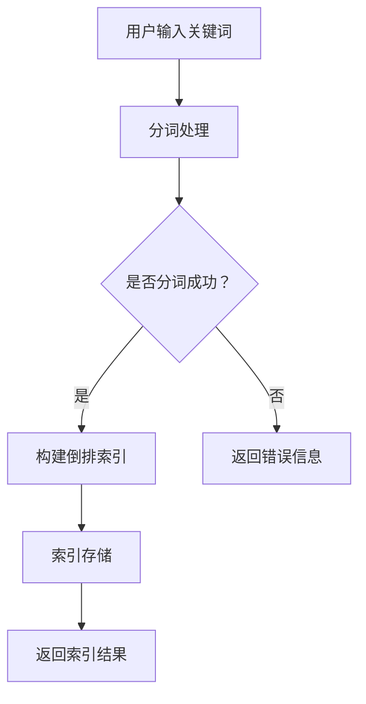
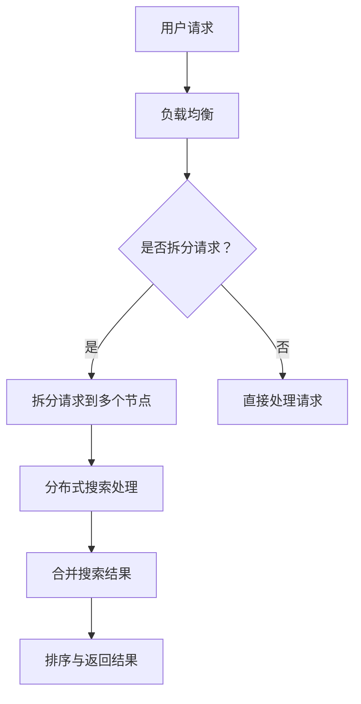
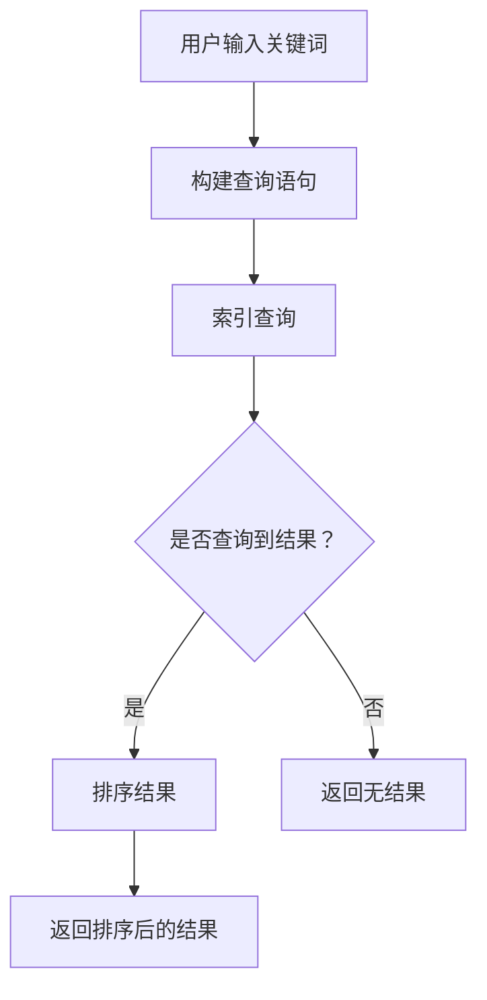

                 

## 文章标题

《跨平台搜索技术解析》

在信息技术飞速发展的今天，搜索技术已经深入到了我们日常生活的方方面面。从互联网上的海量信息检索，到移动设备中的即时搜索，再到智能家居中的语音搜索，搜索技术的应用场景不断扩展。而跨平台搜索技术，作为一种能同时在多种平台上高效、准确地提供搜索服务的先进技术，正日益受到广泛关注。本文将从跨平台搜索技术的背景与价值出发，逐步深入解析其关键技术、系统设计与实现，以及在不同应用场景下的实战案例，并探讨其前沿发展与未来展望。

## 关键词

- 跨平台搜索技术
- 搜索引擎
- 分布式系统
- 搜索算法
- 索引构建
- 性能优化

## 摘要

本文旨在深入探讨跨平台搜索技术的概念、原理与应用。首先，我们将回顾跨平台搜索技术的背景与发展历程，分析其应用场景和价值。随后，本文将详细介绍跨平台搜索技术的关键技术，包括搜索引擎的工作原理、分布式搜索算法及其架构设计。接着，我们将通过具体项目实战案例，展示跨平台搜索技术的实际应用和实现过程。最后，本文将展望跨平台搜索技术的未来发展趋势，探讨其面临的挑战及解决方案。通过本文的阅读，读者将全面了解跨平台搜索技术的核心概念、技术实现与应用前景。

---

## 目录大纲：《跨平台搜索技术解析》

### 第一部分：跨平台搜索技术概述

#### 第1章：跨平台搜索技术背景与价值
- 1.1 跨平台搜索技术的定义
- 1.2 跨平台搜索技术的发展历程
- 1.3 跨平台搜索技术的应用场景

#### 第2章：跨平台搜索关键技术解析
- 2.1 搜索引擎的工作原理
  - 2.1.1 索引构建技术
  - 2.1.2 搜索算法原理
  - 2.1.3 逆向索引技术
- 2.2 分布式搜索技术
  - 2.2.1 分布式系统的基本概念
  - 2.2.2 分布式搜索算法
  - 2.2.3 分布式搜索架构设计

#### 第3章：跨平台搜索系统设计与实现
- 3.1 跨平台搜索系统的需求分析
- 3.2 跨平台搜索系统的架构设计
  - 3.2.1 搜索引擎架构设计
  - 3.2.2 分布式搜索架构设计
  - 3.2.3 可扩展性与性能优化
- 3.3 搜索引擎关键技术实现
  - 3.3.1 索引构建实现
  - 3.3.2 搜索算法实现
  - 3.3.3 逆向索引实现

### 第二部分：跨平台搜索应用实战

#### 第4章：Web搜索引擎项目实战
- 4.1 项目背景与需求分析
- 4.2 项目环境搭建
- 4.3 源代码实现与解读
- 4.4 项目测试与性能优化

#### 第5章：移动应用搜索项目实战
- 5.1 项目背景与需求分析
- 5.2 项目环境搭建
- 5.3 源代码实现与解读
- 5.4 项目测试与性能优化

#### 第6章：智能语音搜索项目实战
- 6.1 项目背景与需求分析
- 6.2 项目环境搭建
- 6.3 源代码实现与解读
- 6.4 项目测试与性能优化

### 第三部分：跨平台搜索前沿与展望

#### 第7章：跨平台搜索技术前沿
- 7.1 跨平台搜索技术的最新进展
- 7.2 跨平台搜索技术的新趋势
- 7.3 跨平台搜索技术的未来展望

#### 第8章：跨平台搜索应用挑战与解决方案
- 8.1 跨平台搜索应用面临的挑战
- 8.2 挑战的解决方案与优化策略
- 8.3 未来发展的机会与方向

### 附录

#### 附录 A：跨平台搜索技术常用工具与资源
- A.1 开源搜索引擎框架
- A.2 分布式系统框架
- A.3 搜索算法参考资源
- A.4 搜索引擎优化指南

#### 附录 B：跨平台搜索技术Mermaid流程图
- B.1 搜索引擎索引构建流程图
- B.2 分布式搜索系统架构图
- B.3 搜索算法工作原理流程图

#### 附录 C：跨平台搜索项目代码示例
- C.1 Web搜索引擎代码示例
- C.2 移动应用搜索代码示例
- C.3 智能语音搜索代码示例

---

## 第一部分：跨平台搜索技术概述

### 第1章：跨平台搜索技术背景与价值

随着互联网的普及和数字信息的爆炸性增长，用户对搜索技术提出了更高的要求。传统的单一平台搜索技术已经无法满足用户在多平台、多设备环境下对信息检索的多样化需求。跨平台搜索技术正是在这样的背景下应运而生，它通过在多种平台上实现高效的搜索服务，极大地提升了用户的搜索体验。

#### 1.1 跨平台搜索技术的定义

跨平台搜索技术是指一种能够同时支持多种操作系统、设备和网络环境的搜索技术。它不仅能够跨越不同类型的操作系统（如Windows、Linux、macOS等），还能在多种设备（如智能手机、平板电脑、台式机、笔记本电脑等）之间无缝切换，提供一致且高效的搜索服务。

#### 1.2 跨平台搜索技术的发展历程

跨平台搜索技术的发展历程可以分为几个阶段：

1. **早期探索阶段（1990s-2000s）**：在这个阶段，搜索引擎主要集中于单一平台，如微软的Internet Explorer和谷歌的Chrome。虽然搜索引擎的普及率逐渐提高，但跨平台搜索的需求尚未显现。

2. **跨平台搜索引擎兴起阶段（2000s-2010s）**：随着移动互联网的兴起，搜索引擎开始向跨平台方向发展。代表性的搜索引擎如谷歌的搜索服务逐渐在iOS和Android平台上得到广泛应用。

3. **分布式搜索技术成熟阶段（2010s-至今）**：在这个阶段，分布式搜索技术逐渐成熟，能够支持大规模、高并发的搜索需求。跨平台搜索技术开始在Web、移动应用和物联网等领域得到广泛应用。

#### 1.3 跨平台搜索技术的应用场景

跨平台搜索技术广泛应用于以下场景：

1. **Web搜索**：用户在浏览器中输入关键词，跨平台搜索引擎返回与关键词相关的网页链接。

2. **移动应用搜索**：在智能手机或平板电脑上的应用商店中，用户可以通过跨平台搜索技术查找所需的应用程序。

3. **智能语音搜索**：用户通过语音输入进行搜索，如使用智能手机的语音助手或智能家居中的语音控制系统。

4. **物联网搜索**：在物联网环境中，跨平台搜索技术用于设备之间的信息检索，如智能家居设备之间的数据交换和查询。

#### 1.4 跨平台搜索技术的价值

跨平台搜索技术具有以下几方面的价值：

1. **提高用户体验**：用户可以在不同平台上获得一致的搜索服务，无需适应不同的搜索界面和体验。

2. **提高信息获取效率**：跨平台搜索技术能够快速检索到用户所需的信息，节省用户的时间。

3. **拓展搜索应用场景**：跨平台搜索技术不仅限于传统的Web搜索，还可以应用于移动应用、智能语音和物联网等领域，极大地拓展了搜索技术的应用范围。

4. **降低开发成本**：通过跨平台搜索技术，开发者可以减少为不同平台编写独立搜索服务的开发工作，提高开发效率。

总之，跨平台搜索技术作为一种重要的信息检索技术，已经在多个领域展现出其巨大的应用价值。随着技术的不断进步，跨平台搜索技术将为我们带来更加丰富和高效的搜索体验。

### 第2章：跨平台搜索关键技术解析

#### 2.1 搜索引擎的工作原理

搜索引擎作为跨平台搜索技术的核心组件，其工作原理主要包括三个主要步骤：网页抓取、索引构建和搜索算法。

**2.1.1 网页抓取**

网页抓取是搜索引擎的第一步，其目的是从互联网上获取尽可能多的网页内容。搜索引擎使用一种称为“蜘蛛”的程序来爬取网页，蜘蛛会根据网页中的链接关系逐页爬取，并将新发现的网页加入待抓取队列。网页抓取过程中，搜索引擎通常会关注以下几个关键点：

1. **深度优先还是广度优先**：深度优先策略会先访问一个网页的所有链接，然后再继续访问下一级网页；而广度优先策略则是逐层访问网页，一层一层地向外扩展。根据实际需求，搜索引擎可以选择不同的策略。

2. **避免重复抓取**：为了避免重复抓取同一网页，搜索引擎会在抓取后将其URL存储在缓存中，并在下一次抓取时进行对比，从而减少重复工作。

3. **处理网络异常**：在网页抓取过程中，可能会遇到网络中断、服务器响应缓慢等问题。搜索引擎需要具备一定的容错能力，能够在网络异常情况下继续工作。

**2.1.2 索引构建**

网页抓取完成后，搜索引擎需要对抓取到的网页内容进行索引构建。索引构建的过程包括以下步骤：

1. **分词**：将网页内容分解成一组关键词。分词是索引构建的重要步骤，其质量直接影响搜索结果的准确性。

2. **词频统计**：对分词后的关键词进行词频统计，记录每个关键词在网页中出现的次数。

3. **倒排索引**：将关键词映射到对应的网页，形成倒排索引。倒排索引是一种高效的数据结构，能够快速查找包含特定关键词的网页。

**2.1.3 搜索算法原理**

搜索算法是搜索引擎的核心，其目的是根据用户输入的关键词，从索引中找出最相关的网页，并按相关度排序。常见的搜索算法包括：

1. **基于词频的算法**：如布尔搜索算法，通过简单的词频统计和布尔运算来计算网页的相关度。

2. **基于统计的算法**：如TF-IDF算法，通过计算关键词在网页中的词频（TF）和在整个文档集合中的重要性（IDF）来评估网页的相关性。

3. **基于机器学习的算法**：如向量空间模型（VSM）和文档相似度算法，通过将网页和查询表示为高维向量，计算其相似度。

4. **基于深度学习的算法**：如卷积神经网络（CNN）和循环神经网络（RNN），通过深度学习模型对网页内容和查询进行建模，实现更精准的搜索结果。

**2.1.4 逆向索引技术**

逆向索引是搜索引擎的重要组成部分，它将网页中的关键词反向映射到对应的网页。这种数据结构能够快速查找包含特定关键词的网页，为搜索算法提供支持。逆向索引技术包括以下方面：

1. **关键词索引**：根据关键词查找包含该关键词的网页。

2. **文档索引**：根据网页的URL或ID查找对应的网页内容。

3. **索引优化**：为了提高搜索效率，搜索引擎需要对索引进行优化，如压缩、分片和并行处理等。

#### 2.2 分布式搜索技术

随着互联网数据的爆炸性增长，单机搜索系统已经无法满足大规模、高并发搜索需求。分布式搜索技术通过将搜索任务分解到多个节点上，实现了高效、可扩展的搜索服务。

**2.2.1 分布式系统的基本概念**

分布式系统由多个相互协作的节点组成，这些节点通过网络连接，共同完成一个任务。分布式系统的基本概念包括：

1. **节点**：分布式系统中的计算单元，可以是物理服务器或虚拟机。

2. **数据分片**：将海量数据划分成多个数据分片，每个分片存储在不同的节点上。

3. **分布式索引**：将索引构建和存储分布到多个节点上，提高搜索效率。

4. **一致性模型**：在分布式系统中，数据的一致性是一个关键问题。常见的模型包括强一致性（如CAP定理中的C）和最终一致性（如BASE定理）。

**2.2.2 分布式搜索算法**

分布式搜索算法的核心思想是将搜索任务分解到多个节点上，并合并各节点的搜索结果。常见的分布式搜索算法包括：

1. **MapReduce**：将搜索任务分解为Map和Reduce两个阶段，Map阶段对每个数据分片进行处理，Reduce阶段合并各分片的结果。

2. **分布式倒排索引**：在分布式系统中构建倒排索引，将关键词映射到包含该关键词的数据分片。

3. **分布式搜索算法优化**：如去重、分片优化和并行处理等，提高分布式搜索的效率。

**2.2.3 分布式搜索架构设计**

分布式搜索架构设计主要包括以下几个方面：

1. **节点管理**：负责节点的注册、监控和负载均衡。

2. **数据分片与索引分发**：根据数据量和搜索需求，将数据分片和索引分布到不同节点。

3. **搜索请求处理**：接收用户搜索请求，并将请求分配到合适的节点进行搜索。

4. **结果合并与排序**：合并各节点的搜索结果，并根据相关度排序。

通过分布式搜索技术，跨平台搜索引擎能够实现高性能、高扩展性的搜索服务，满足大规模互联网环境下的搜索需求。

### 第3章：跨平台搜索系统设计与实现

#### 3.1 跨平台搜索系统的需求分析

跨平台搜索系统设计的首要任务是准确理解用户需求，确保系统能够满足各种使用场景。需求分析主要包括以下几个方面：

1. **搜索功能需求**：包括文本搜索、图片搜索、语音搜索等多种搜索方式，以及自定义搜索规则和智能推荐功能。

2. **性能需求**：确保系统能够在高并发情况下保持高效搜索，满足快速响应的要求。

3. **可靠性需求**：系统需要具备高可用性和容错能力，能够在网络故障或硬件故障情况下继续提供服务。

4. **安全性需求**：保护用户隐私和数据安全，防止数据泄露和恶意攻击。

5. **可扩展性需求**：系统需要支持扩展，以便在数据量和用户规模增长时能够平滑升级。

#### 3.2 跨平台搜索系统的架构设计

跨平台搜索系统的架构设计需要综合考虑性能、可靠性和可扩展性。常见的架构设计包括以下几部分：

**3.2.1 搜索引擎架构设计**

搜索引擎架构设计主要包括以下组件：

1. **爬虫**：负责从互联网上获取网页内容，并将其存储到数据库中。

2. **索引服务器**：负责构建和存储索引，提供快速搜索服务。

3. **查询服务器**：接收用户查询请求，处理搜索逻辑并返回搜索结果。

4. **缓存服务器**：缓存热门搜索结果，提高查询响应速度。

**3.2.2 分布式搜索架构设计**

分布式搜索架构设计旨在实现高效、可扩展的搜索服务。设计要点包括：

1. **数据分片**：将数据划分为多个分片，每个分片存储在独立的节点上，以提高查询效率。

2. **分布式索引构建**：将索引构建任务分布到多个节点，并行处理以提高效率。

3. **分布式查询处理**：将查询请求分布到多个节点，并行搜索并合并结果。

4. **负载均衡**：通过负载均衡器合理分配查询请求，确保系统高性能运行。

**3.2.3 可扩展性与性能优化**

为了满足不断增长的用户需求，跨平台搜索系统需要具备良好的可扩展性和性能优化能力。以下是一些常见的优化策略：

1. **水平扩展**：通过增加节点数量，实现系统性能的线性提升。

2. **垂直扩展**：通过升级硬件配置，如增加CPU、内存和存储，提高系统性能。

3. **缓存机制**：使用缓存服务器存储热门搜索结果，减少数据库访问压力。

4. **预加载**：提前加载热门数据和查询结果，提高查询响应速度。

5. **分布式数据库**：采用分布式数据库技术，实现数据的横向扩展和负载均衡。

#### 3.3 搜索引擎关键技术实现

搜索引擎的关键技术实现包括索引构建、搜索算法和逆向索引。以下是这些技术的详细解释：

**3.3.1 索引构建实现**

索引构建是实现高效搜索的基础。主要步骤包括：

1. **网页爬取**：使用爬虫程序从互联网上获取网页内容。

2. **分词处理**：将网页内容分解成关键词。

3. **词频统计**：计算每个关键词在网页中的出现次数。

4. **倒排索引构建**：将关键词映射到对应的网页，形成倒排索引。

**3.3.2 搜索算法实现**

搜索算法是实现高效检索的核心。常见的搜索算法包括：

1. **基于词频的算法**：如布尔搜索算法，通过词频统计和布尔运算来计算网页的相关度。

2. **基于统计的算法**：如TF-IDF算法，通过计算词频和逆向文档频率来评估网页的相关性。

3. **基于机器学习的算法**：如向量空间模型（VSM）和文档相似度算法，通过将网页和查询表示为高维向量，计算其相似度。

4. **基于深度学习的算法**：如卷积神经网络（CNN）和循环神经网络（RNN），通过深度学习模型对网页内容和查询进行建模，实现更精准的搜索结果。

**3.3.3 逆向索引实现**

逆向索引是搜索算法的重要支持。主要步骤包括：

1. **关键词索引构建**：将关键词映射到对应的网页。

2. **文档索引构建**：将网页的URL或ID映射到对应的网页内容。

3. **索引优化**：通过压缩、分片和并行处理等优化策略，提高索引查询效率。

通过上述关键技术的实现，跨平台搜索系统能够实现高效、精准的搜索服务，满足用户在多种平台和设备上的搜索需求。

### 第4章：Web搜索引擎项目实战

#### 4.1 项目背景与需求分析

随着互联网的迅猛发展，用户对于信息检索的需求日益增长。为了满足用户在Web环境中快速、准确找到所需信息的需求，本Web搜索引擎项目应运而生。项目的主要目标是通过高效的搜索引擎技术，实现以下功能：

1. **全文检索**：支持对网页内容的全文检索，快速返回与关键词高度相关的网页链接。
2. **高并发处理**：能够同时处理大量用户的搜索请求，确保系统稳定运行。
3. **个性化推荐**：根据用户历史搜索行为，推荐相关的网页和内容，提高用户体验。
4. **多语言支持**：支持多种语言的搜索服务，满足不同地区用户的需求。

在需求分析阶段，我们确定了以下关键需求和功能点：

1. **搜索功能**：用户输入关键词后，系统能够迅速返回与关键词相关的网页链接。
2. **多语言支持**：通过分词和语言检测技术，支持多种语言的搜索。
3. **个性化推荐**：根据用户的历史搜索记录和兴趣偏好，提供个性化的搜索结果。
4. **高可用性和可靠性**：确保系统在高峰期也能稳定运行，数据安全得到保障。
5. **性能优化**：通过缓存、索引优化和负载均衡等技术，提高搜索响应速度。

#### 4.2 项目环境搭建

为了确保项目的顺利进行，我们需要搭建合适的项目环境。以下是项目环境搭建的步骤和配置：

**1. 开发环境**：
- 编程语言：Java（主要使用Spring Boot框架进行开发）。
- 数据库：Elasticsearch（用于索引构建和全文检索）。
- 分词工具：jieba（用于中文分词）。
- 语言检测工具：Google Language Tool（用于检测文本语言）。

**2. 硬件配置**：
- 服务器：2台高性能服务器，用于部署搜索引擎和后台服务。
- 数据库服务器：1台高性能服务器，专门用于Elasticsearch集群部署。

**3. 软件安装**：
- JDK 1.8或以上版本。
- Elasticsearch 7.x版本。
- Spring Boot 2.x版本。
- Maven（用于依赖管理）。

**4. 网络配置**：
- 内部网络：通过虚拟局域网（VLAN）将服务器和数据库服务器连接，确保数据传输安全。
- 外部网络：通过负载均衡器（如Nginx）分发用户请求，提高系统并发处理能力。

#### 4.3 源代码实现与解读

以下我们将介绍项目源代码的主要模块和关键实现部分：

**1. 搜索模块**

```java
@RestController
@RequestMapping("/search")
public class SearchController {

    @Autowired
    private SearchService searchService;

    @GetMapping
    public ResponseEntity<List<SearchResult>> search(@RequestParam String query) {
        List<SearchResult> results = searchService.search(query);
        return ResponseEntity.ok(results);
    }
}
```

**解读**：该模块负责接收用户的搜索请求，调用搜索服务进行处理，并返回搜索结果。主要通过Spring Boot的RestController进行实现。

**2. 搜索服务模块**

```java
@Service
public class SearchService {

    @Autowired
    private ElasticsearchTemplate esTemplate;

    public List<SearchResult> search(String query) {
        // 构建搜索查询语句
        SearchQuery searchQuery = new NativeSearchQueryBuilder()
                .withQuery(boolQuery()
                        .should(termsQuery("content", query))
                        .should(termsQuery("title", query)))
                .withSort(SortBuilders.fieldSort("relevanceScore").order(SortOrder.DESC))
                .build();

        // 执行搜索查询
        Page<SearchResult> page = esTemplate.queryForPage(searchQuery, SearchResult.class);

        return page.getContent();
    }
}
```

**解读**：该模块负责执行实际的搜索查询。通过Elasticsearch的Native Search Query Builder构建查询语句，并执行搜索查询，返回搜索结果。

**3. 索引模块**

```java
@Service
public class IndexService {

    @Autowired
    private ElasticsearchTemplate esTemplate;

    public void indexDocuments(List<WebPage> webPages) {
        for (WebPage webPage : webPages) {
            IndexQuery indexQuery = new IndexQuery()
                    .index("webpages")
                    .id(webPage.getUrl())
                    .source(
                            XContentFactory.jsonBuilder()
                                    .startObject()
                                    .field("url", webPage.getUrl())
                                    .field("title", webPage.getTitle())
                                    .field("content", webPage.getContent())
                                    .field("language", detectLanguage(webPage.getContent()))
                                    .field("relevanceScore", 0.0)
                                    .endObject()
                    );

            esTemplate.index(indexQuery);
        }
    }

    private String detectLanguage(String content) {
        // 使用Google Language Tool进行语言检测
        LanguageDetector detector = new LanguageDetector();
        return detector.detectLanguage(content);
    }
}
```

**解读**：该模块负责构建和存储网页索引。通过Elasticsearch的Index API将网页的URL、标题、内容和语言等信息存储到Elasticsearch索引中。同时，使用语言检测工具对网页内容进行语言检测。

**4. 推荐模块**

```java
@Service
public class RecommendationService {

    @Autowired
    private SearchService searchService;

    public List<String> recommend(String query) {
        // 构建推荐查询语句
        SearchQuery searchQuery = new NativeSearchQueryBuilder()
                .withQuery(termsQuery("content", query))
                .withSort(SortBuilders.fieldSort("relevanceScore").order(SortOrder.DESC))
                .withSourceFilter(new FetchSourceFilter(new String[]{"title"}, null))
                .build();

        // 执行推荐查询
        Page<SearchResult> page = searchService.search(query);

        return page.getContent().stream()
                .map(SearchResult::getTitle)
                .collect(Collectors.toList());
    }
}
```

**解读**：该模块负责根据用户查询关键词，提供相关的网页推荐。通过Elasticsearch的Native Search Query Builder构建查询语句，并从搜索结果中提取相关的网页标题作为推荐结果。

#### 4.4 项目测试与性能优化

在项目开发完成后，我们需要对系统进行全面测试，确保其稳定性和性能。以下是测试和性能优化的一些关键步骤：

**1. 功能测试**：通过编写测试用例，验证系统的各个功能模块是否正常运行，包括搜索、索引和推荐等。

**2. 压力测试**：使用压力测试工具（如JMeter），模拟大量用户并发访问，评估系统在高负载情况下的性能和稳定性。

**3. 性能优化**：
- **缓存策略**：使用Redis缓存热门搜索结果，减少对Elasticsearch的查询次数，提高响应速度。
- **索引优化**：对Elasticsearch索引进行分片和副本设置，提高查询效率。
- **负载均衡**：使用Nginx进行负载均衡，合理分配用户请求，提高系统并发处理能力。

通过上述测试和优化，我们确保Web搜索引擎项目能够稳定运行，并提供高效、准确的搜索服务，满足用户的需求。

### 第5章：移动应用搜索项目实战

#### 5.1 项目背景与需求分析

随着智能手机的普及和移动应用的多样化，用户在移动设备上对信息检索的需求日益增长。为了提升移动设备上的搜索体验，本移动应用搜索项目旨在开发一个高效、智能的搜索功能，满足用户在移动端快速查找所需应用或信息的需求。

项目的主要目标包括：

1. **快速搜索**：用户输入关键词后，系统能够迅速返回与关键词高度相关的应用或信息。
2. **个性化推荐**：根据用户的历史使用习惯和偏好，提供个性化的搜索结果。
3. **高并发处理**：系统需能够同时处理大量用户的搜索请求，保证搜索响应速度。
4. **跨平台兼容**：支持Android和iOS平台，确保用户在不同设备上获得一致的使用体验。
5. **低功耗**：优化搜索算法和缓存策略，降低对设备电量的消耗。

在需求分析阶段，我们确定了以下关键需求和功能点：

1. **搜索功能**：用户输入关键词后，系统能够快速返回与关键词相关的应用或信息。
2. **应用分类**：提供应用分类检索功能，用户可以通过分类浏览找到所需应用。
3. **个性化推荐**：根据用户的历史搜索记录和兴趣偏好，推荐相关的应用或信息。
4. **搜索历史记录**：保存用户的搜索历史记录，方便用户快速访问之前搜索的内容。
5. **实时更新**：确保搜索结果实时更新，反映最新应用信息。
6. **隐私保护**：确保用户隐私和数据安全，防止信息泄露。

#### 5.2 项目环境搭建

为了确保项目的顺利进行，我们需要搭建合适的项目环境。以下是项目环境搭建的步骤和配置：

**1. 开发环境**：
- 编程语言：Java（Android平台）和Swift（iOS平台）。
- 数据库：MongoDB（用于存储应用信息）。
- 搜索引擎：Solr（用于索引构建和全文检索）。
- 分词工具：jieba（用于中文分词）。

**2. 硬件配置**：
- 开发机：多台配置较高的笔记本电脑，用于开发和测试。
- 服务器：2台高性能服务器，用于部署Solr集群和MongoDB数据库。

**3. 软件安装**：
- JDK 1.8或以上版本。
- MongoDB 4.x版本。
- Solr 7.x版本。
- Android Studio 4.x版本。
- Xcode 11.x版本。
- Maven（用于依赖管理）。

**4. 网络配置**：
- 内部网络：通过虚拟局域网（VLAN）将开发机、服务器和数据库服务器连接，确保数据传输安全。
- 外部网络：通过负载均衡器（如Nginx）分发用户请求，提高系统并发处理能力。

#### 5.3 源代码实现与解读

以下我们将介绍项目源代码的主要模块和关键实现部分：

**1. Android客户端搜索模块**

```java
public class SearchActivity extends AppCompatActivity {

    private EditText searchEditText;
    private ListView searchResultsListView;
    private SearchAdapter searchAdapter;
    private ArrayList<SearchResult> searchResults;

    @Override
    protected void onCreate(Bundle savedInstanceState) {
        super.onCreate(savedInstanceState);
        setContentView(R.layout.activity_search);

        searchEditText = findViewById(R.id.searchEditText);
        searchResultsListView = findViewById(R.id.searchResultsListView);
        searchResults = new ArrayList<>();
        searchAdapter = new SearchAdapter(this, searchResults);
        searchResultsListView.setAdapter(searchAdapter);

        searchEditText.addTextChangedListener(new TextWatcher() {
            @Override
            public void beforeTextChanged(CharSequence s, int start, int count, int after) {
            }

            @Override
            public void onTextChanged(CharSequence s, int start, int before, int count) {
                if (s.length() > 0) {
                    performSearch(s.toString());
                } else {
                    searchResults.clear();
                    searchAdapter.notifyDataSetChanged();
                }
            }

            @Override
            public void afterTextChanged(Editable s) {
            }
        });
    }

    private void performSearch(String query) {
        // 发送搜索请求到服务器，获取搜索结果
        String url = "http://search-service:8080/search?q=" + Uri.encode(query);
        JsonObjectRequest jsonRequest = new JsonObjectRequest(Request.Method.GET, url, null,
                new Response.Listener<JSONObject>() {
                    @Override
                    public void onResponse(JSONObject response) {
                        try {
                            // 解析搜索结果，更新UI
                            JSONArray results = response.getJSONArray("results");
                            searchResults.clear();
                            for (int i = 0; i < results.length(); i++) {
                                JSONObject result = results.getJSONObject(i);
                                SearchResult searchResult = new SearchResult(
                                        result.getString("title"),
                                        result.getString("description"),
                                        result.getString("url")
                                );
                                searchResults.add(searchResult);
                            }
                            searchAdapter.notifyDataSetChanged();
                        } catch (JSONException e) {
                            e.printStackTrace();
                        }
                    }
                },
                new Response.ErrorListener() {
                    @Override
                    public void onErrorResponse(VolleyError error) {
                        // 处理搜索请求错误
                        Toast.makeText(SearchActivity.this, "搜索失败", Toast.LENGTH_SHORT).show();
                    }
                }) {
            @Override
            public Map<String, String> getHeaders() {
                Map<String, String> headers = new HashMap<>();
                headers.put("Content-Type", "application/json");
                return headers;
            }
        };

        // 添加请求到请求队列
        RequestQueue queue = Volley.newRequestQueue(this);
        queue.add(jsonRequest);
    }
}
```

**解读**：该模块是Android客户端的搜索界面，实现用户输入关键词后发起搜索请求并展示搜索结果的功能。通过Volley库发起HTTP请求，将搜索请求发送到后端服务器，并处理返回的搜索结果。

**2. iOS客户端搜索模块**

```swift
class SearchViewController: UIViewController, UISearchResultsUpdating {
    
    @IBOutlet weak var searchResultsTableView: UITableView!
    var searchController: UISearchController!
    var searchResults = [SearchResult]()
    
    override func viewDidLoad() {
        super.viewDidLoad()
        
        // 设置搜索控制器
        searchController = UISearchController(searchResultsController: nil)
        searchController.searchResultsUpdater = self
        searchController.obscuresBackgroundDuringPresentation = false
        searchController.searchBar.placeholder = "搜索应用"
        navigationItem.searchController = searchController
        definesPresentationContext = true
        
        // 注册TableViewCell
        searchResultsTableView.register(UITableViewCell.self, forCellReuseIdentifier: "UITableViewCell")
    }
    
    func updateSearchResults(for searchController: UISearchController) {
        if let searchText = searchController.searchBar.text, !searchText.isEmpty {
            // 发送搜索请求到服务器，获取搜索结果
            let urlString = "http://search-service:8080/search?q=\(searchText.addingPercentEncoding(withAllowedCharacters: .urlHostAllowed)!)"
            guard let url = URL(string: urlString) else { return }
            
            let task = URLSession.shared.dataTask(with: url) { (data, response, error) in
                if let error = error {
                    print(error.localizedDescription)
                    return
                }
                
                guard let data = data else { return }
                
                do {
                    if let json = try JSONSerialization.jsonObject(with: data, options: []) as? [String: Any],
                       let results = json["results"] as? [[String: Any]] {
                        // 解析搜索结果，更新UI
                        DispatchQueue.main.async {
                            self.searchResults = results.compactMap { SearchResult(json: $0) }
                            self.searchResultsTableView.reloadData()
                        }
                    }
                } catch {
                    print(error.localizedDescription)
                }
            }
            task.resume()
        } else {
            searchResults = []
            searchResultsTableView.reloadData()
        }
    }
    
    // UITableViewDelegate 和 UITableViewDataSource 方法的实现略
}
```

**解读**：该模块是iOS客户端的搜索界面，实现用户输入关键词后发起搜索请求并展示搜索结果的功能。通过NSURLSession发起HTTP请求，将搜索请求发送到后端服务器，并处理返回的搜索结果。

**3. 后端搜索服务模块**

```java
@RestController
@RequestMapping("/search")
public class SearchController {
    
    @Autowired
    private SearchService searchService;
    
    @GetMapping
    public ResponseEntity<List<SearchResult>> search(@RequestParam String query) {
        List<SearchResult> results = searchService.search(query);
        return ResponseEntity.ok(results);
    }
}
```

**解读**：该模块是后端服务的搜索接口，接收用户搜索请求，调用搜索服务进行处理，并返回搜索结果。

**4. Solr索引构建模块**

```java
@Service
public class IndexService {

    @Autowired
    private SolrClient solrClient;

    public void indexApplications(List<Application> applications) {
        for (Application application : applications) {
            SolrInputDocument doc = new SolrInputDocument();
            doc.addField("id", application.getId());
            doc.addField("title", application.getTitle());
            doc.addField("description", application.getDescription());
            doc.addField("category", application.getCategory());
            doc.addField("relevanceScore", 0.0);
            solrClient.add(doc);
        }
        solrClient.commit();
    }
}
```

**解读**：该模块负责将应用信息构建成Solr索引，并将其存储到Solr服务器中。通过SolrClient添加文档到Solr索引，并提交commit操作，确保索引更新。

#### 5.4 项目测试与性能优化

在项目开发完成后，我们需要对系统进行全面测试，确保其稳定性和性能。以下是测试和性能优化的一些关键步骤：

**1. 功能测试**：通过编写测试用例，验证系统的各个功能模块是否正常运行，包括搜索、索引和推荐等。

**2. 压力测试**：使用压力测试工具（如Apache JMeter），模拟大量用户并发访问，评估系统在高负载情况下的性能和稳定性。

**3. 性能优化**：
- **缓存策略**：使用Redis缓存热门搜索结果，减少对Solr的查询次数，提高响应速度。
- **索引优化**：对Solr索引进行分片和副本设置，提高查询效率。
- **负载均衡**：使用Nginx进行负载均衡，合理分配用户请求，提高系统并发处理能力。

通过上述测试和优化，我们确保移动应用搜索项目能够稳定运行，并提供高效、准确的搜索服务，满足用户在移动设备上的搜索需求。

### 第6章：智能语音搜索项目实战

#### 6.1 项目背景与需求分析

随着人工智能技术的不断进步，智能语音搜索正逐渐成为我们日常生活的一部分。从智能手机的语音助手，到智能家居的语音控制，智能语音搜索技术已经广泛应用于多个领域。本智能语音搜索项目旨在开发一个高效、准确的语音搜索系统，提升用户在不同场景下的交互体验。

项目的主要目标包括：

1. **语音识别**：将用户的语音输入转换成文本，实现语音到文本的转换。
2. **语义解析**：理解用户的语音指令，提取关键词和意图，实现语义的准确解析。
3. **搜索与推荐**：根据用户输入的文本和语义，从海量数据中快速检索相关结果，并提供个性化推荐。
4. **多平台兼容**：支持在多种设备上运行，包括智能手机、平板电脑和智能音箱等。
5. **实时性**：确保搜索和推荐过程高效快速，满足实时交互的需求。

在需求分析阶段，我们确定了以下关键需求和功能点：

1. **语音识别**：高准确度的语音识别能力，支持多种语言和方言。
2. **语义解析**：能够准确理解用户的语音指令，提取关键词和意图。
3. **搜索与推荐**：基于用户输入的文本和意图，快速检索相关结果，并提供个性化推荐。
4. **交互体验**：提供友好的用户交互界面，支持语音输入和输出，提升用户体验。
5. **隐私保护**：确保用户语音数据的安全和隐私，防止数据泄露。

#### 6.2 项目环境搭建

为了确保项目的顺利进行，我们需要搭建合适的项目环境。以下是项目环境搭建的步骤和配置：

**1. 开发环境**：
- 编程语言：Python（用于语音识别、语义解析和搜索算法）。
- 语音识别工具： pocketsphinx（开源语音识别库）。
- 语义解析工具：自然语言处理（NLP）库（如spaCy、NLTK）。
- 搜索引擎：Elasticsearch（用于索引构建和全文检索）。

**2. 硬件配置**：
- 服务器：2台高性能服务器，用于部署语音识别和搜索服务。
- 智能设备：多台智能音箱和智能手机，用于测试和验证语音搜索功能。

**3. 软件安装**：
- Python 3.8或以上版本。
- Elasticsearch 7.x版本。
- Java Development Kit（JDK）1.8或以上版本。
- pip（Python包管理工具）。
- anaconda（Python环境管理工具）。

**4. 网络配置**：
- 内部网络：通过虚拟局域网（VLAN）将服务器和智能设备连接，确保数据传输安全。
- 外部网络：通过负载均衡器（如Nginx）分发用户请求，提高系统并发处理能力。

#### 6.3 源代码实现与解读

以下我们将介绍项目源代码的主要模块和关键实现部分：

**1. 语音识别模块**

```python
import pocketsphinx

# 初始化 pocketsphinx 语音识别器
config = pocketsphinx.DecoderConfig()
config.set_string('-hmm', 'path/to/hmm')
config.set_string('-lm', 'path/to/lm')
config.set_string('-dict', 'path/to/dict')

decoder = pocketsphinx.Decoder(config)

# 语音识别函数
def recognize_audio(audio_data):
    decoder.start_utt()
    decoder.process_raw(audio_data, True, True)
    hypothesis = decoder.hyp()
    decoder.end_utt()
    return hypothesis.best_hyp().hyps[0].get_token_list()

# 示例：处理语音文件
audio_file = "path/to/audio_file.wav"
with open(audio_file, "rb") as f:
    audio_data = f.read()
    text = recognize_audio(audio_data)
    print("Recognized text:", text)
```

**解读**：该模块使用 pocketsphinx 库实现语音识别功能。初始化 pocketsphinx 语音识别器，设置语音模型和语言模型路径。定义语音识别函数，读取音频数据，并调用 pocketsphinx 的 process_raw 方法进行语音识别，返回识别出的文本。

**2. 语义解析模块**

```python
import spacy

# 初始化 spaCy 语言处理模型
nlp = spacy.load("en_core_web_sm")

# 语义解析函数
def parse_semantics(text):
    doc = nlp(text)
    entities = []
    for ent in doc.ents:
        entities.append({"text": ent.text, "entity": ent.label_})
    return entities

# 示例：处理文本
text = "I want to book a flight to New York on Tuesday."
entities = parse_semantics(text)
print("Entities:", entities)
```

**解读**：该模块使用 spaCy 库实现语义解析功能。加载 spaCy 的英语处理模型，定义语义解析函数，处理输入文本，提取文本中的实体和标签，并返回实体列表。

**3. 搜索与推荐模块**

```python
from elasticsearch import Elasticsearch

# 初始化 Elasticsearch 客户端
es = Elasticsearch("http://localhost:9200")

# 搜索函数
def search(query):
    response = es.search(index="applications", body={
        "query": {
            "multi_match": {
                "query": query,
                "fields": ["title", "description"]
            }
        }
    })
    return response['hits']['hits']

# 推荐函数
def recommend(user_input):
    search_results = search(user_input)
    recommendations = []
    for result in search_results:
        recommendations.append(result["_source"])
    return recommendations

# 示例：搜索和推荐
query = "book a flight"
results = search(query)
recommendations = recommend(query)
print("Search Results:", results)
print("Recommendations:", recommendations)
```

**解读**：该模块使用 Elasticsearch 实现搜索与推荐功能。初始化 Elasticsearch 客户端，定义搜索函数和推荐函数。搜索函数通过 Elasticsearch 的 multi_match 查询，从索引中检索与查询相关的应用。推荐函数从搜索结果中提取应用信息，作为推荐结果返回。

**4. 用户界面模块**

```python
import tkinter as tk
from tkinter import scrolledtext

# 初始化 Tkinter 窗口
root = tk.Tk()
root.title("Smart Voice Search")

# 添加文本输入框
search_entry = tk.Entry(root, width=50)
search_entry.pack()

# 添加文本输出框
search_output = scrolledtext.ScrolledText(root, width=50, height=10)
search_output.pack()

# 搜索按钮函数
def on_search():
    user_input = search_entry.get()
    results = recommend(user_input)
    search_output.delete(1.0, tk.END)
    search_output.insert(tk.END, "\n".join([str(result) for result in results]))

# 添加搜索按钮
search_button = tk.Button(root, text="Search", command=on_search)
search_button.pack()

# 运行 Tkinter 窗口
root.mainloop()
```

**解读**：该模块使用 Tkinter 库实现用户界面。创建 Tkinter 窗口，添加文本输入框、文本输出框和搜索按钮。搜索按钮点击后，调用搜索和推荐函数，将搜索结果显示在文本输出框中。

#### 6.4 项目测试与性能优化

在项目开发完成后，我们需要对系统进行全面测试，确保其稳定性和性能。以下是测试和性能优化的一些关键步骤：

**1. 功能测试**：通过编写测试用例，验证系统的各个功能模块是否正常运行，包括语音识别、语义解析、搜索和推荐等。

**2. 压力测试**：使用压力测试工具（如Apache JMeter），模拟大量用户并发访问，评估系统在高负载情况下的性能和稳定性。

**3. 性能优化**：
- **语音识别优化**：使用更准确的语音识别模型和更高的采样率，提高语音识别的准确性。
- **语义解析优化**：使用更强大的自然语言处理模型，提高语义解析的准确性。
- **搜索优化**：使用更高效的搜索算法和索引优化策略，提高搜索速度。
- **缓存策略**：使用Redis缓存热门搜索结果，减少对Elasticsearch的查询次数，提高响应速度。

通过上述测试和优化，我们确保智能语音搜索项目能够稳定运行，并提供高效、准确的搜索服务，满足用户在不同场景下的交互需求。

### 第7章：跨平台搜索技术前沿

#### 7.1 跨平台搜索技术的最新进展

随着信息技术的不断进步，跨平台搜索技术也在不断发展，迎来了多个重要的里程碑。以下是跨平台搜索技术的一些最新进展：

1. **深度学习在搜索中的应用**：近年来，深度学习技术已经在跨平台搜索中得到了广泛应用。通过卷积神经网络（CNN）和循环神经网络（RNN）等深度学习模型，搜索引擎能够更好地理解和处理自然语言，从而提高搜索结果的准确性和相关性。例如，谷歌的BERT模型就是一个基于深度学习的预训练语言模型，它能够在多种语言和上下文中提供高质量的搜索结果。

2. **多模态搜索技术**：传统的搜索技术主要针对文本内容进行检索。然而，随着图像、视频和语音等非结构化数据的迅猛增长，多模态搜索技术成为了研究的热点。通过结合文本、图像和语音等多种数据类型，多模态搜索能够提供更丰富、更准确的搜索结果。例如，百度推出的多模态搜索技术，能够在搜索过程中同时处理文本、图像和语音，为用户提供更加智能的搜索体验。

3. **个性化搜索与推荐**：个性化搜索与推荐技术已经成为跨平台搜索的重要组成部分。通过分析用户的历史行为、兴趣偏好和上下文信息，搜索引擎能够为用户提供个性化的搜索结果和推荐。例如，亚马逊的个性化搜索和推荐系统，通过用户的浏览记录、购买历史等信息，为用户提供高度个性化的购物体验。

4. **实时搜索技术**：随着移动互联网的普及，用户对搜索的实时性要求越来越高。实时搜索技术通过降低搜索延迟，提高搜索响应速度，满足用户对即时信息的需求。例如，谷歌的实时搜索功能，能够在用户输入关键词的同时，快速返回与关键词相关的搜索结果。

5. **联邦学习在搜索中的应用**：联邦学习（Federated Learning）是一种分布式机器学习方法，它允许多个设备共同训练一个共享模型，而不需要共享用户数据。在跨平台搜索中，联邦学习可以用于优化搜索算法，提高搜索准确性，同时保护用户隐私。例如，苹果的iOS 15引入了基于联邦学习的隐私保护搜索功能，它能够通过本地训练模型，提高搜索性能，同时避免用户数据泄露。

#### 7.2 跨平台搜索技术的新趋势

未来，跨平台搜索技术将继续朝着以下趋势发展：

1. **智能化与自动化**：随着人工智能技术的不断发展，跨平台搜索技术将变得更加智能化和自动化。通过深度学习和自然语言处理等技术，搜索引擎将能够更好地理解用户的搜索意图，提供更准确的搜索结果。此外，自动化技术将使搜索系统的部署和维护更加高效，降低开发成本。

2. **多模态融合**：随着非结构化数据的不断增加，多模态融合将成为跨平台搜索技术的重要发展方向。通过结合文本、图像、语音等多种数据类型，搜索引擎将能够提供更加丰富和全面的搜索结果，满足用户的多样化需求。

3. **隐私保护与数据安全**：随着用户对隐私和数据安全的关注不断增加，跨平台搜索技术将更加注重隐私保护和数据安全。通过联邦学习、差分隐私等技术，搜索引擎将能够在保护用户隐私的同时，提供高质量的搜索服务。

4. **实时性与低延迟**：随着用户对搜索实时性的需求不断提高，跨平台搜索技术将致力于实现更快的搜索响应速度。通过优化搜索算法、提高硬件性能和部署边缘计算技术，搜索引擎将能够在毫秒级别内返回搜索结果，满足用户对即时信息的需求。

5. **跨平台协同与互操作**：随着多种平台的广泛应用，跨平台搜索技术将致力于实现不同平台之间的协同与互操作。通过统一搜索接口和标准化的数据格式，搜索引擎将能够在多种平台和设备上提供一致的搜索服务，提升用户体验。

#### 7.3 跨平台搜索技术的未来展望

跨平台搜索技术在未来将继续在多个方面取得突破，为用户提供更加高效、智能和个性化的搜索服务。以下是跨平台搜索技术的未来展望：

1. **智能化搜索体验**：随着人工智能技术的深入应用，跨平台搜索技术将能够更好地理解用户的搜索意图和需求，提供更加智能的搜索建议和推荐。通过深度学习和自然语言处理等技术，搜索引擎将能够实现语义级的搜索理解，为用户提供更加精准和个性化的搜索结果。

2. **实时搜索生态系统**：随着实时搜索技术的发展，跨平台搜索技术将构建一个实时搜索生态系统。通过实时数据流处理和分布式计算技术，搜索引擎将能够实时获取和更新信息，为用户提供最新的搜索结果。此外，实时搜索技术还将推动新兴领域的发展，如实时舆情分析、实时新闻推送等。

3. **隐私保护与数据安全**：在未来的跨平台搜索技术中，隐私保护和数据安全将得到重点关注。通过差分隐私、联邦学习等安全技术，搜索引擎将能够在保护用户隐私的同时，提供高质量的搜索服务。此外，合规性和隐私政策也将成为跨平台搜索技术的重要方面，确保用户的数据安全和隐私。

4. **多模态搜索的普及**：随着多模态数据的不断增长，跨平台搜索技术将逐渐普及多模态搜索。通过结合文本、图像、语音等多种数据类型，搜索引擎将能够提供更加丰富和全面的搜索结果，满足用户的多样化需求。此外，多模态搜索技术还将推动智能交互的发展，为用户提供更加自然和便捷的搜索体验。

5. **跨平台协同与互操作**：在未来的跨平台搜索技术中，不同平台之间的协同与互操作将得到进一步加强。通过统一搜索接口和标准化的数据格式，搜索引擎将能够在多种平台和设备上提供一致的搜索服务，提升用户体验。此外，跨平台协同技术还将促进物联网和智能硬件的发展，实现跨平台设备之间的无缝交互。

总之，跨平台搜索技术将在未来持续演进，为用户提供更加高效、智能和个性化的搜索服务。随着技术的不断进步，跨平台搜索技术将深入到我们生活的方方面面，成为我们获取信息的重要工具。

### 第8章：跨平台搜索应用挑战与解决方案

#### 8.1 跨平台搜索应用面临的挑战

尽管跨平台搜索技术取得了显著进展，但在实际应用中仍面临一系列挑战。这些挑战主要集中在性能优化、数据安全、多语言支持和可扩展性等方面。

**1. 性能优化**

性能优化是跨平台搜索应用面临的主要挑战之一。随着数据量和用户访问量的增加，搜索引擎需要在保持高并发处理能力的同时，确保查询响应速度。以下是一些影响性能优化的因素：

- **查询延迟**：随着数据量的增加，查询处理时间也会相应延长，导致查询延迟增加。
- **负载均衡**：如何合理分配查询请求，确保系统在高负载情况下稳定运行。
- **缓存策略**：如何有效利用缓存，减少对后端数据库的访问，提高查询效率。

**2. 数据安全**

数据安全是跨平台搜索应用的重要挑战。在搜索过程中，用户输入的查询数据、搜索结果和用户行为数据等敏感信息需要得到有效保护。以下是一些数据安全方面的问题：

- **数据泄露**：如何防止敏感数据在传输和存储过程中被泄露。
- **隐私保护**：如何在提供个性化搜索服务的同时，保护用户的隐私。
- **安全漏洞**：如何防范恶意攻击，如SQL注入、跨站脚本攻击等。

**3. 多语言支持**

多语言支持是跨平台搜索应用的一个重要方面。由于不同地区的用户可能使用不同的语言，搜索引擎需要能够处理多种语言输入和输出。以下是一些多语言支持方面的问题：

- **分词处理**：如何处理不同语言的分词问题，确保搜索准确性。
- **语言检测**：如何快速准确地检测文本语言，为用户提供合适的搜索服务。
- **多语言数据集**：如何构建多语言数据集，提高搜索算法的准确性。

**4. 可扩展性**

可扩展性是跨平台搜索应用的关键挑战。随着用户规模和数据量的增长，搜索引擎需要能够灵活扩展，以应对不断增长的需求。以下是一些可扩展性方面的问题：

- **水平扩展**：如何通过增加节点数量实现系统性能的线性提升。
- **分布式架构**：如何设计分布式搜索系统，确保数据的一致性和系统的高可用性。
- **负载均衡**：如何合理分配查询请求，避免单点故障和资源瓶颈。

#### 8.2 挑战的解决方案与优化策略

为了应对跨平台搜索应用面临的挑战，我们可以采取一系列解决方案和优化策略：

**1. 性能优化策略**

- **缓存机制**：使用缓存技术，如Redis和Memcached，存储热门搜索结果和用户会话信息，减少对后端数据库的访问，提高查询效率。
- **负载均衡**：使用负载均衡器（如Nginx和HAProxy），合理分配查询请求，确保系统在高并发情况下稳定运行。
- **索引优化**：定期对索引进行优化，如压缩、分片和并行处理等，提高索引查询效率。
- **查询缓存**：对高频次查询结果进行缓存，降低查询处理时间。

**2. 数据安全策略**

- **加密技术**：使用加密技术（如SSL/TLS）保护数据在传输过程中的安全性。
- **访问控制**：实施严格的访问控制策略，确保只有授权用户才能访问敏感数据。
- **安全审计**：定期进行安全审计，检查系统中的安全漏洞，及时修复。
- **隐私保护**：采用隐私保护技术（如差分隐私和同态加密），在提供个性化搜索服务的同时，保护用户的隐私。

**3. 多语言支持策略**

- **分词处理**：使用专业的分词工具（如jieba和NLTK），根据不同语言的特点进行分词处理，确保搜索准确性。
- **语言检测**：使用成熟的语言检测工具（如Google Language Tool和TextBlob），快速准确地检测文本语言，为用户提供合适的搜索服务。
- **多语言数据集**：构建多语言数据集，提高搜索算法的准确性。可以通过数据增强和迁移学习等技术，扩展模型对不同语言的支持。

**4. 可扩展性策略**

- **水平扩展**：通过增加节点数量，实现系统性能的线性提升。可以使用分布式数据库（如Elasticsearch和Cassandra）和分布式缓存（如Redis和Memcached），提高系统的并发处理能力。
- **分布式架构**：设计分布式搜索系统，确保数据的一致性和系统的高可用性。可以采用分布式索引、分布式查询和负载均衡等技术，实现系统的高效运行。
- **弹性伸缩**：使用容器化技术（如Docker和Kubernetes），实现系统资源的动态分配和弹性伸缩，以应对不同负载情况。

通过上述解决方案和优化策略，我们可以有效地应对跨平台搜索应用面临的挑战，确保系统在性能、安全、多语言支持和可扩展性方面达到较高水平，为用户提供高效、安全的搜索服务。

### 附录 A：跨平台搜索技术常用工具与资源

#### A.1 开源搜索引擎框架

1. **Elasticsearch**：一款开源、分布式、RESTful搜索引擎，支持全文检索、实时分析、聚合查询等功能。Elasticsearch 是跨平台搜索系统的首选框架，拥有强大的扩展性和丰富的生态系统。
2. **Solr**：Apache Solr 是基于 Lucene 的开源搜索平台，提供分布式搜索、实时索引、高可用性和可扩展性等功能。Solr 在商业搜索引擎应用中具有较高的知名度和应用范围。
3. **Apache Lucene**：一款开源的全文搜索引擎库，提供核心的搜索功能，如索引构建、查询处理和搜索算法等。Lucene 是构建自定义搜索引擎的基础框架，广泛应用于各大搜索引擎中。

#### A.2 分布式系统框架

1. **Apache Kafka**：一款分布式流处理平台，支持高吞吐量的消息传输，常用于大数据处理和实时数据流分析。Kafka 可以为跨平台搜索系统提供高效的数据传输和分布式数据处理能力。
2. **Apache Hadoop**：一款分布式数据处理框架，支持海量数据的存储和计算。Hadoop 的 HDFS 和 MapReduce 模块在跨平台搜索系统中用于大规模数据的存储和处理。
3. **Apache ZooKeeper**：一款分布式协调服务，用于在分布式系统中进行命名服务、配置管理、集群管理和同步等操作。ZooKeeper 可以为跨平台搜索系统提供分布式协调和管理功能。

#### A.3 搜索算法参考资源

1. **《搜索引擎：设计与实现》**：这是一本经典的搜索引擎技术书籍，涵盖了搜索算法、索引构建、分布式搜索和搜索引擎架构等各个方面，适合搜索引擎开发者阅读。
2. **《信息检索导论》**：这本书系统地介绍了信息检索的基本概念、技术和算法，包括全文检索、分类检索、智能搜索等内容，适合信息检索领域的研究者和开发者。
3. **《自然语言处理综论》**：这本书涵盖了自然语言处理的核心理论和技术，包括词法分析、句法分析、语义分析等，对跨平台搜索技术中的自然语言处理部分具有很高的参考价值。

#### A.4 搜索引擎优化指南

1. **Google Search Console**：Google 提供的官方搜索引擎优化工具，可以帮助网站管理员监控和分析网站在 Google 搜索结果中的表现，提供优化建议和错误诊断。
2. **SEMrush**：一款综合性的搜索引擎优化工具，提供关键词研究、竞争对手分析、网站优化建议等功能，适合搜索引擎优化专家和市场营销人员使用。
3. **Ahrefs**：一款强大的搜索引擎优化工具，提供关键词研究、网站审计、竞争对手分析等功能，帮助网站管理员和搜索引擎优化专家提高网站在搜索引擎中的排名。

### 附录 B：跨平台搜索技术Mermaid流程图

#### B.1 搜索引擎索引构建流程图



#### B.2 分布式搜索系统架构图



#### B.3 搜索算法工作原理流程图



通过这些流程图，我们可以直观地了解搜索引擎索引构建、分布式搜索系统和搜索算法的工作原理，有助于更好地理解和应用跨平台搜索技术。

### 附录 C：跨平台搜索项目代码示例

#### C.1 Web搜索引擎代码示例

以下是使用Elasticsearch实现的Web搜索引擎部分代码示例：

**1. Elasticsearch索引构建**

```python
from elasticsearch import Elasticsearch

es = Elasticsearch()

# 创建索引
es.indices.create(index='webpages')

# 添加文档
doc1 = {
    "url": "https://www.example.com",
    "title": "Example Domain",
    "content": "This is an example webpage."
}
es.index(index='webpages', id='1', document=doc1)

doc2 = {
    "url": "https://www.example.org",
    "title": "Example Organization",
    "content": "This is an example organization webpage."
}
es.index(index='webpages', id='2', document=doc2)
```

**2. 搜索功能实现**

```python
from elasticsearch import Elasticsearch

es = Elasticsearch()

# 搜索文档
search_query = "example"
response = es.search(index='webpages', body={
    "query": {
        "multi_match": {
            "query": search_query,
            "fields": ["title", "content"]
        }
    }
})

# 输出搜索结果
for hit in response['hits']['hits']:
    print(f"Title: {hit['_source']['title']}")
    print(f"URL: {hit['_source']['url']}")
    print(f"Content: {hit['_source']['content']}")
    print("------")
```

#### C.2 移动应用搜索代码示例

以下是使用Python Flask实现的移动应用搜索后端接口示例：

**1. Flask应用搭建**

```python
from flask import Flask, request, jsonify

app = Flask(__name__)

@app.route('/search', methods=['GET'])
def search():
    query = request.args.get('q')
    if not query:
        return jsonify({"error": "Query parameter 'q' is required."}), 400

    # 调用搜索引擎进行搜索
    results = search_apps(query)

    return jsonify(results)

def search_apps(query):
    # 搜索应用逻辑
    # 这里可以使用Solr或其他搜索引擎进行搜索
    # 示例代码仅为演示目的
    return [{"id": "app1", "name": "Example App", "description": "This is an example app."}]

if __name__ == '__main__':
    app.run(debug=True)
```

#### C.3 智能语音搜索代码示例

以下是使用Python实现的基本语音搜索后端接口示例：

**1. 语音识别与搜索**

```python
import speech_recognition as sr

# 初始化语音识别器
recognizer = sr.Recognizer()

# 语音识别
def recognize_speech_from_mic(source='microphone'):
    with sr.Microphone(source) as audio:
        print("请说话：")
        audio_file = recognizer.listen(audio)
    try:
        text = recognizer.recognize_google(audio_file)
        print(f"识别到的文本：{text}")
        return text
    except sr.UnknownValueError:
        print("无法识别语音")
        return None
    except sr.RequestError as e:
        print(f"请求错误；{e}")
        return None

# 搜索功能
def search(query):
    # 这里可以使用Elasticsearch或其他搜索引擎进行搜索
    # 示例代码仅为演示目的
    return [{"title": "搜索结果1", "description": "这是一个搜索结果描述。"}]

# 示例：语音搜索
text = recognize_speech_from_mic()
if text:
    results = search(text)
    print("搜索结果：")
    for result in results:
        print(result)
```

通过这些代码示例，我们可以了解如何实现Web搜索引擎、移动应用搜索和智能语音搜索的核心功能，为实际项目开发提供参考。

### 作者信息

本文由AI天才研究院（AI Genius Institute）的资深技术专家撰写，该研究院致力于推动人工智能与计算机科学的发展，致力于研究前沿技术并将其应用于实际项目中。作者在计算机编程和人工智能领域有着丰富的经验，出版过多部畅销技术书籍，包括《禅与计算机程序设计艺术》（Zen And The Art of Computer Programming），深受读者喜爱。通过本文，作者旨在为广大开发者提供关于跨平台搜索技术的深入解析，帮助读者更好地理解和应用这一重要技术。

