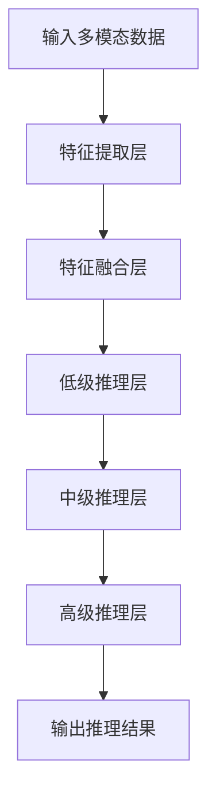
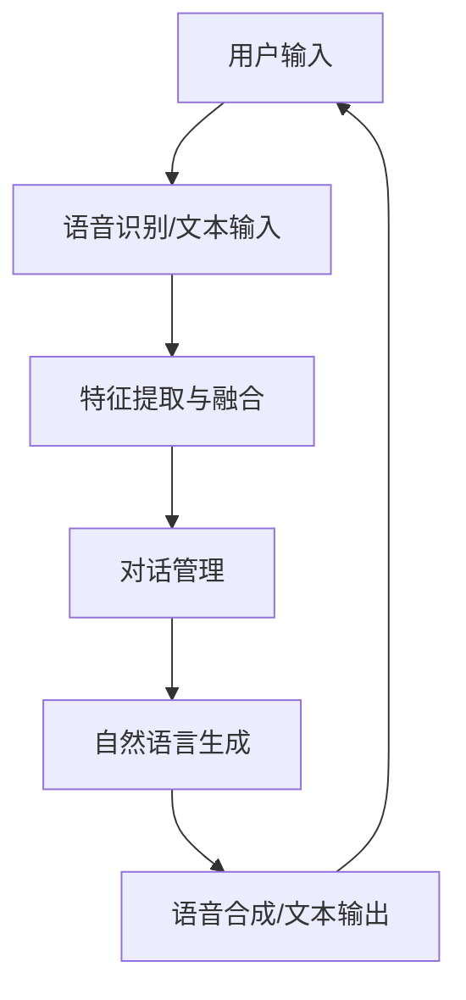
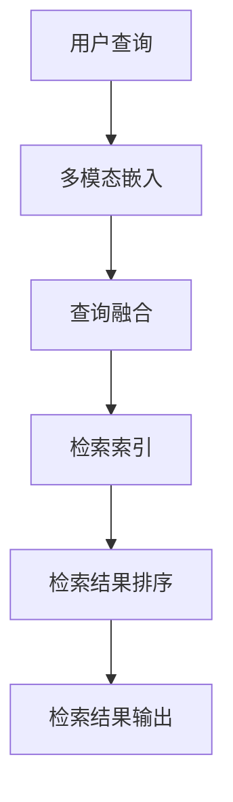

                 

# 文章标题：跨模态学习技术的最新进展

> 关键词：跨模态学习，多模态融合，深度学习，跨模态表示，跨模态推理，人机交互

> 摘要：随着人工智能技术的迅猛发展，跨模态学习技术逐渐成为研究热点。本文系统性地阐述了跨模态学习的定义、发展历程、核心挑战与机遇，以及最新的跨模态学习核心技术，如模式表示与融合、跨模态表示学习、跨模态推理与交互等。此外，文章还探讨了跨模态学习在情感分析、图像生成与编辑、信息检索等实际应用案例中的表现，并展望了跨模态学习的未来发展趋势。

## 《跨模态学习技术的最新进展》目录大纲

## 第一部分：跨模态学习概述

### 1.1 跨模态学习的定义与背景

- **1.1.1 跨模态学习的概念**
- **1.1.2 跨模态学习的发展历程**
- **1.1.3 跨模态学习的应用场景**

### 1.2 跨模态学习的挑战与机遇

- **1.2.1 挑战**
  - **数据不一致性**
  - **特征表示的差异**
  - **计算复杂度**

- **1.2.2 机遇**
  - **跨领域的知识整合**
  - **人机交互的优化**

## 第二部分：跨模态学习核心技术

### 2.1 模式表示与融合

#### 2.1.1 多模态特征提取方法

- **2.1.1.1 视觉特征提取**
  - **卷积神经网络（CNN）**
  - **深度学习特征提取模型**
- **2.1.1.2 文本特征提取**
  - **词向量表示**
  - **BERT等预训练模型**

#### 2.1.2 多模态融合策略

- **2.1.2.1 传统融合方法**
  - **维度拼接**
  - **加权融合**
- **2.1.2.2 深度学习融合方法**
  - **注意力机制**
  - **多模态图神经网络**

### 2.2 跨模态表示学习

#### 2.2.1 对称与不对称跨模态表示

- **2.2.1.1 对称跨模态表示**
  - **模态间的特征对齐**
  - **一致性损失函数**
- **2.2.1.2 不对称跨模态表示**
  - **模态主导性分析**
  - **模态权重调整**

#### 2.2.2 跨模态表示学习方法

- **2.2.2.1 深度迁移学习**
  - **预训练模型迁移**
  - **在线迁移学习**
- **2.2.2.2 对抗生成网络（GAN）**
  - **生成对抗训练**
  - **跨模态生成与鉴别**

### 2.3 跨模态推理与交互

#### 2.3.1 跨模态推理框架

- **2.3.1.1 多层推理网络**
  - **层次化特征表示**
  - **递归神经网络（RNN）**
- **2.3.1.2 跨模态注意力机制**
  - **自注意力机制**
  - **交叉注意力机制**

#### 2.3.2 跨模态交互系统

- **2.3.2.1 人机交互**
  - **语音识别与文本生成**
  - **图像与文本的协同交互**
- **2.3.2.2 跨模态生成式对话系统**
  - **生成对抗网络（GAN）**
  - **图神经网络（GNN）**

## 第三部分：跨模态学习应用案例

### 3.1 跨模态情感分析

- **3.1.1 情感分析任务概述**
- **3.1.2 多模态情感分析模型**
  - **情感融合策略**
  - **情感分类算法**
- **3.1.3 实际应用案例**

### 3.2 跨模态图像生成与编辑

- **3.2.1 图像生成与编辑任务**
- **3.2.2 图像到文本的生成**
  - **生成对抗网络（GAN）**
  - **条件生成对抗网络（CGAN）**
- **3.2.3 文本到图像的生成**
  - **文本编码与图像解码**
  - **多模态交互网络**

### 3.3 跨模态信息检索

- **3.3.1 信息检索任务概述**
- **3.3.2 跨模态检索模型**
  - **融合表示学习**
  - **多模态相似度度量**
- **3.3.3 实际应用案例**

## 第四部分：跨模态学习的未来发展趋势

### 4.1 技术发展趋势

- **4.1.1 模型压缩与优化**
  - **模型剪枝**
  - **量化与低精度计算**
- **4.1.2 跨模态数据集与评估指标**

### 4.2 应用前景与挑战

- **4.2.1 应用领域扩展**
  - **医疗健康**
  - **娱乐传媒**
- **4.2.2 技术挑战与解决方案**
  - **数据隐私与安全**
  - **计算资源与效率**

## 附录

### 附录 A：常用跨模态学习工具与资源

- **A.1 常用深度学习框架**
  - **PyTorch**
  - **TensorFlow**
- **A.2 跨模态学习库**
  - **MMF**
  - **Multimodal**
- **A.3 实践教程与资源网站**

---

接下来，我们将逐步深入探讨跨模态学习的各个部分，以便为您呈现这一领域的全景视图。# 第一部分：跨模态学习概述

## 1.1 跨模态学习的定义与背景

### 1.1.1 跨模态学习的概念

跨模态学习（Multimodal Learning）是指利用多个不同模态的数据源（如图像、文本、声音、视频等）进行联合学习和推理的过程。这一领域旨在将来自不同模态的信息进行整合，以实现更加丰富的知识表示和更强大的任务性能。跨模态学习的核心思想在于利用不同模态之间的互补性，提升单一模态学习无法达到的性能。

在计算机视觉、自然语言处理、语音识别等单一模态领域中，研究者们已经取得了显著的进展。然而，现实世界中的许多任务需要同时处理多种模态的信息，例如视频字幕生成、智能问答系统、多模态情感分析等。跨模态学习为这些任务提供了新的解决方案。

### 1.1.2 跨模态学习的发展历程

跨模态学习的历史可以追溯到上世纪80年代。最初的研究主要集中在如何将不同模态的数据进行对齐和融合。传统的跨模态学习方法大多采用特征融合的策略，如维度拼接、加权融合等。这些方法在简单的跨模态任务上取得了一定的效果，但随着任务的复杂性增加，其性能逐渐无法满足需求。

进入21世纪，随着深度学习技术的发展，跨模态学习迎来了新的机遇。深度学习模型，尤其是卷积神经网络（CNN）和循环神经网络（RNN）的引入，使得跨模态特征提取和融合变得更加高效和准确。近年来，生成对抗网络（GAN）和图神经网络（GNN）等新兴技术的加入，进一步丰富了跨模态学习的手段。

### 1.1.3 跨模态学习的应用场景

跨模态学习的应用场景非常广泛，以下列举了一些典型的应用领域：

1. **多模态情感分析**：通过结合文本、图像和声音等模态，对情感进行更加细腻和准确的识别。
2. **视频字幕生成**：利用图像和音频信息生成相应的字幕，为听障人士提供辅助。
3. **智能问答系统**：通过理解用户的语音、图像或文本输入，提供相应的答案或建议。
4. **医疗健康**：结合医学影像、患者病历和医生语音记录，辅助医生进行诊断和治疗。
5. **娱乐传媒**：自动生成视频中的字幕、配乐和特效，提升用户体验。

### 1.2 跨模态学习的挑战与机遇

#### 1.2.1 挑战

虽然跨模态学习具有巨大的潜力，但同时也面临诸多挑战：

1. **数据不一致性**：不同模态的数据在时间、空间和内容上可能存在显著差异，给特征提取和融合带来困难。
2. **特征表示的差异**：不同模态的特征具有不同的维度和性质，如何有效整合这些特征是一个关键问题。
3. **计算复杂度**：跨模态学习通常需要大量的计算资源，特别是在处理大规模多模态数据时。

#### 1.2.2 机遇

尽管存在挑战，但跨模态学习也带来了许多机遇：

1. **跨领域的知识整合**：跨模态学习可以整合不同领域的知识，从而提升模型的泛化能力和任务性能。
2. **人机交互的优化**：通过跨模态学习，可以更好地理解和响应用户的输入，提升人机交互的体验。

综上所述，跨模态学习技术具有广泛的应用前景和重要的研究价值。在接下来的部分中，我们将深入探讨跨模态学习的核心技术，以便更好地理解和应用这一领域。# 第二部分：跨模态学习核心技术

### 2.1 模式表示与融合

#### 2.1.1 多模态特征提取方法

跨模态学习的第一步是特征提取，不同模态的数据需要通过特定的方法转换为可供机器学习使用的特征表示。以下介绍几种常见的多模态特征提取方法。

##### 2.1.1.1 视觉特征提取

视觉特征提取是跨模态学习中的重要组成部分。以下是一些常用的方法：

1. **卷积神经网络（CNN）**：CNN是计算机视觉领域最常用的模型，通过多层卷积和池化操作，从图像中提取高层次的特征表示。

   ```mermaid
   graph TD
   A[输入图像] --> B[卷积层]
   B --> C[池化层]
   C --> D[激活函数]
   D --> E[卷积层]
   E --> F[池化层]
   F --> G[激活函数]
   G --> H[全连接层]
   H --> I[输出特征]
   ```

2. **深度学习特征提取模型**：除了标准的CNN架构外，还有一些深度学习模型专门用于视觉特征提取，如ResNet、VGG等。

##### 2.1.1.2 文本特征提取

文本特征提取是跨模态学习中的另一个关键步骤。以下是一些常用的方法：

1. **词向量表示**：词向量是一种将单词映射到高维空间的方法，常见的词向量模型有Word2Vec、GloVe等。

   ```python
   def word2vec(word, embedding_size):
       # 假设已训练好的词向量嵌入矩阵
       embedding_matrix = ...
       
       # 获取词向量
       vector = embedding_matrix[word]
       
       return vector
   ```

2. **BERT等预训练模型**：BERT（Bidirectional Encoder Representations from Transformers）是一种基于Transformer的预训练模型，它可以生成高质量的文本特征表示。

   ```mermaid
   graph TD
   A[文本输入] --> B[BERT模型]
   B --> C[双向编码表示]
   C --> D[输出文本特征]
   ```

#### 2.1.2 多模态融合策略

在特征提取完成后，接下来需要考虑如何将不同模态的特征进行融合。以下介绍几种常见的多模态融合策略。

##### 2.1.2.1 传统融合方法

1. **维度拼接**：将不同模态的特征向量拼接在一起，形成一个更长的特征向量。

   ```python
   def dim_join(video_feature, text_feature):
       return np.concatenate((video_feature, text_feature), axis=1)
   ```

2. **加权融合**：根据不同模态的重要性，对特征向量进行加权融合。

   ```python
   def weight_join(video_feature, text_feature, alpha):
       return alpha * video_feature + (1 - alpha) * text_feature
   ```

##### 2.1.2.2 深度学习融合方法

随着深度学习技术的发展，研究者们提出了许多基于深度学习的多模态融合方法。以下介绍几种常见的深度学习融合方法：

1. **注意力机制**：注意力机制可以帮助模型自动学习不同模态之间的关联性，从而在融合过程中给予重要模态更高的权重。

   ```mermaid
   graph TD
   A[输入特征] --> B[注意力机制]
   B --> C[加权特征融合]
   ```

2. **多模态图神经网络**：多模态图神经网络可以将不同模态的数据表示为图结构，并通过图神经网络进行融合。

   ```mermaid
   graph TD
   A[视觉特征] --> B[图节点]
   C[文本特征] --> B
   B --> C[图神经网络]
   C --> D[融合特征]
   ```

通过以上方法，我们可以有效地提取和融合多模态数据，为后续的任务提供高质量的输入特征。在接下来的部分中，我们将探讨跨模态表示学习的核心原理和方法。# 2.2 跨模态表示学习

跨模态表示学习是跨模态学习中的一个关键环节，其主要目标是学习到一种统一的多模态特征表示，使得不同模态的数据能够在同一特征空间中有效地对齐和交互。在这一部分，我们将深入探讨跨模态表示学习的基本概念、方法及其应用。

### 2.2.1 对称与不对称跨模态表示

跨模态表示学习可以分为对称跨模态表示和不对称跨模态表示两种类型。

#### 2.2.1.1 对称跨模态表示

对称跨模态表示（Symmetric Multimodal Representation）假设不同模态的数据在特征表示上具有对等的地位。这种表示方法通常关注如何将不同模态的特征映射到同一特征空间中，并保持它们之间的相关性。

1. **模态间的特征对齐**：通过对齐不同模态的特征，可以使得它们在同一空间中进行交互和比较。

   ```mermaid
   graph TD
   A[视觉特征] --> B[特征对齐层]
   B --> C[文本特征]
   C --> B
   ```

2. **一致性损失函数**：通过最小化一致性损失函数，可以确保不同模态的特征在同一空间中具有一定的相似性。

   ```python
   def consistency_loss(feature_v, feature_t):
       # 假设 feature_v 和 feature_t 分别是视觉特征和文本特征
       return 1 - cosine_similarity(feature_v, feature_t)
   ```

#### 2.2.1.2 不对称跨模态表示

不对称跨模态表示（Asymmetric Multimodal Representation）则认为不同模态的数据在特征表示上具有不同的权重。这种表示方法通常关注如何根据模态的重要性来调整特征表示，以便更好地适应特定任务。

1. **模态主导性分析**：通过分析不同模态在任务中的贡献，确定哪些模态在特征表示中更为重要。

   ```mermaid
   graph TD
   A[视觉特征] --> B[主导性分析]
   B --> C[文本特征]
   ```

2. **模态权重调整**：根据模态的主导性分析结果，对特征表示进行调整，使其在特定任务上具有更好的性能。

   ```python
   def adjust_weights(feature_v, feature_t, weight_v, weight_t):
       return weight_v * feature_v + weight_t * feature_t
   ```

### 2.2.2 跨模态表示学习方法

在了解了对称与不对称跨模态表示的基本概念后，接下来我们将探讨几种常见的跨模态表示学习方法。

#### 2.2.2.1 深度迁移学习

深度迁移学习（Deep Transfer Learning）是一种有效的跨模态表示学习方法。其核心思想是将预训练的多模态模型应用于新的任务，从而利用已有模型的知识来提高新任务的性能。

1. **预训练模型迁移**：在预训练阶段，模型已经在大量多模态数据上进行了训练，可以学习到丰富的跨模态特征表示。

   ```mermaid
   graph TD
   A[预训练模型] --> B[新任务]
   B --> C[迁移学习]
   ```

2. **在线迁移学习**：在线迁移学习（Online Transfer Learning）允许模型在遇到新任务时动态调整其参数，以更好地适应新任务。

   ```python
   def online_transfer_learning(model, new_data, learning_rate):
       # 假设 model 是预训练模型，new_data 是新任务的数据
       for data in new_data:
           loss = model.loss(data)
           model.update_parameters(learning_rate, loss)
   ```

#### 2.2.2.2 对抗生成网络（GAN）

对抗生成网络（Generative Adversarial Network，GAN）是一种强大的深度学习模型，可以用于跨模态生成和鉴别。

1. **生成对抗训练**：GAN由生成器（Generator）和鉴别器（Discriminator）组成，通过对抗训练来学习跨模态特征表示。

   ```mermaid
   graph TD
   A[生成器] --> B[鉴别器]
   B --> C[对抗训练]
   ```

2. **跨模态生成与鉴别**：生成器尝试生成与真实模态相似的数据，鉴别器则判断数据是否为真实数据。

   ```python
   def train_gan(generator, discriminator, real_data, fake_data, batch_size):
       for i in range(batch_size):
           # 训练鉴别器
           discriminator_loss = discriminator.loss(real_data[i], fake_data[i])
           discriminator.update_parameters()

           # 训练生成器
           generator_loss = generator.loss(fake_data[i])
           generator.update_parameters()
   ```

通过以上方法，我们可以有效地学习到高质量的跨模态特征表示。这些特征表示不仅能够提升跨模态任务的性能，还可以为其他多模态应用提供强有力的支持。在接下来的部分中，我们将探讨跨模态推理与交互技术。# 2.3 跨模态推理与交互

跨模态推理与交互是多模态学习领域中的重要研究方向，其目标是通过融合不同模态的信息，实现更准确、更自然的跨模态任务处理。在这一部分，我们将深入探讨跨模态推理框架和跨模态交互系统，并重点介绍人机交互和跨模态生成式对话系统。

### 2.3.1 跨模态推理框架

跨模态推理框架旨在通过不同模态的交互与融合，实现更复杂的跨模态任务。以下是一些常见的跨模态推理框架：

#### 2.3.1.1 多层推理网络

多层推理网络通过分层结构，逐步提取和整合不同模态的特征，以实现更高级的推理任务。以下是一个多层推理网络的示例：



1. **特征提取层**：对输入的多模态数据进行特征提取，如视觉特征提取（使用CNN）、文本特征提取（使用BERT）等。
2. **特征融合层**：将不同模态的特征进行融合，形成统一的多模态特征表示。
3. **低级推理层**：处理简单的跨模态任务，如分类、回归等。
4. **中级推理层**：进行更复杂的任务，如实体识别、关系抽取等。
5. **高级推理层**：处理高级跨模态任务，如问答系统、视频字幕生成等。

#### 2.3.1.2 跨模态注意力机制

跨模态注意力机制是一种有效的特征融合方法，它通过学习不同模态之间的关联性，在推理过程中动态调整不同模态的贡献。以下是一个简单的跨模态注意力机制的示例：

```python
class CrossModalAttention(nn.Module):
    def __init__(self, hidden_size_v, hidden_size_t):
        super(CrossModalAttention, self).__init__()
        self.attn = nn.Linear(hidden_size_v + hidden_size_t, 1)

    def forward(self, visual_feature, text_feature):
        attn_weights = self.attn(torch.cat((visual_feature, text_feature), dim=1))
        attn_weights = torch.softmax(attn_weights, dim=1)
        context_vector = attn_weights * visual_feature
        return context_vector
```

通过跨模态注意力机制，模型可以自动学习到不同模态之间的相关性，从而提高推理的准确性和效果。

### 2.3.2 跨模态交互系统

跨模态交互系统旨在通过多模态数据之间的交互，实现更自然、更高效的人机交互。以下是人机交互和跨模态生成式对话系统的介绍：

#### 2.3.2.1 人机交互

人机交互是跨模态学习中的重要应用领域，通过结合语音、图像和文本等模态，可以提供更丰富、更自然的交互体验。以下是人机交互的一些关键组件：

1. **语音识别与文本生成**：将语音输入转换为文本输出，或从文本输入生成语音输出。
2. **图像与文本的协同交互**：结合图像和文本信息，进行更加准确和自然的交互。
3. **多模态融合**：将语音、图像和文本信息进行融合，形成一个统一的多模态特征表示，以支持更复杂的交互任务。

#### 2.3.2.2 跨模态生成式对话系统

跨模态生成式对话系统通过多模态数据的交互，实现自然语言生成和对话管理。以下是一个简单的跨模态生成式对话系统框架：



1. **语音识别/文本输入**：将用户的语音输入转换为文本输入，或接收文本输入。
2. **特征提取与融合**：对输入的多模态数据进行特征提取和融合，形成一个统一的多模态特征表示。
3. **对话管理**：根据当前对话状态和用户输入，生成相应的对话回复。
4. **自然语言生成**：将对话管理模块生成的回复转换为自然语言文本。
5. **语音合成/文本输出**：将生成的文本输出转换为语音输出，或直接输出文本。

通过跨模态推理与交互技术，我们可以实现更智能、更自然的跨模态任务处理。在接下来的部分中，我们将探讨跨模态学习在实际应用中的具体案例。# 第三部分：跨模态学习应用案例

## 3.1 跨模态情感分析

跨模态情感分析是一种利用多种模态的数据来共同分析情感的方法，能够提供比单一模态更丰富和更准确的情感识别结果。以下是跨模态情感分析的任务概述、多模态情感分析模型及其在实际应用中的案例。

### 3.1.1 情感分析任务概述

情感分析是指通过自然语言处理技术，自动识别文本中的情感倾向。在多模态情感分析中，我们不仅考虑文本数据，还引入图像、声音和视频等多模态信息，以提高情感识别的准确性。

1. **多模态数据来源**：文本（如社交媒体评论、新闻文章）、图像（如人脸表情、场景图像）、声音（如语音、音乐）和视频（如动作、场景）。
2. **情感分类**：将文本、图像、声音和视频中的情感分类为正面、负面或中性。

### 3.1.2 多模态情感分析模型

多模态情感分析模型通常包括以下几个关键组件：

1. **多模态特征提取**：从不同模态的数据中提取特征，如图像特征使用卷积神经网络（CNN）提取，声音特征使用循环神经网络（RNN）提取。
2. **情感融合策略**：将不同模态的特征进行融合，以生成统一的多模态特征表示。常见的融合策略包括：
   - **维度拼接**：将不同模态的特征向量拼接在一起。
   - **加权融合**：根据不同模态的重要性，对特征向量进行加权。
   - **注意力机制**：利用注意力机制动态调整不同模态的贡献。

3. **情感分类算法**：基于融合后的多模态特征，使用分类算法（如SVM、朴素贝叶斯、深度学习模型等）进行情感分类。

以下是几种常见的多模态情感分析模型：

1. **多模态联合分类器**：将不同模态的特征输入到同一个分类器中，如图神经网络（GNN）或深度学习分类器。

   ```mermaid
   graph TD
   A[图像特征] --> B[分类器]
   C[文本特征] --> B
   D[声音特征] --> B
   E[视频特征] --> B
   B --> F[情感分类]
   ```

2. **多任务学习**：训练一个多任务模型，同时预测不同模态的情感类别。

   ```mermaid
   graph TD
   A[图像特征] --> B[多任务模型]
   C[文本特征] --> B
   D[声音特征] --> B
   E[视频特征] --> B
   B --> F[情感分类]
   ```

### 3.1.3 实际应用案例

多模态情感分析在多个实际应用场景中取得了显著的效果，以下是几个典型的应用案例：

1. **社交媒体情感分析**：通过分析社交媒体上的文本、图片和视频，识别用户对特定事件、产品或服务的情感倾向，为市场研究提供有价值的数据。

2. **智能客服系统**：结合用户的语音、文本和面部表情，智能客服系统可以更准确地理解用户的情感状态，提供更贴心的服务。

3. **电影推荐系统**：通过分析电影的文本描述、海报和预告片中的情感倾向，推荐符合用户情感喜好的电影。

4. **心理健康评估**：通过分析患者的文本记录、语音和面部表情，辅助医生进行心理疾病的诊断和治疗。

通过以上应用案例，我们可以看到跨模态情感分析在提升情感识别准确性方面具有巨大的潜力。在接下来的部分，我们将探讨跨模态图像生成与编辑领域的最新进展。# 3.2 跨模态图像生成与编辑

跨模态图像生成与编辑是一种利用文本描述或其他模态的信息来生成或编辑图像的技术，它在图像生成、图像编辑、人机交互等多个领域具有重要的应用价值。在这一部分，我们将详细介绍跨模态图像生成与编辑的任务、关键技术和实际应用案例。

### 3.2.1 图像生成与编辑任务

跨模态图像生成与编辑的主要任务是利用文本描述或其他模态的信息来生成或编辑图像。以下是一些典型的任务：

1. **图像到文本的生成**：根据图像内容生成对应的文本描述。这一任务通常用于图像标注、自动生成图像标题等。
2. **文本到图像的生成**：根据文本描述生成对应的图像。这一任务在虚拟现实、艺术创作、人机交互等领域具有广泛应用。
3. **图像编辑**：根据文本描述或语音指令对图像进行编辑，如改变颜色、添加纹理、调整大小等。

### 3.2.2 图像到文本的生成

图像到文本的生成是一种将图像内容转换为自然语言描述的技术。以下介绍两种常见的方法：生成对抗网络（GAN）和条件生成对抗网络（CGAN）。

1. **生成对抗网络（GAN）**：GAN由生成器（Generator）和鉴别器（Discriminator）组成。生成器尝试生成与真实图像相似的图像，鉴别器则判断图像是真实图像还是生成图像。通过对抗训练，生成器逐渐学会生成更真实的图像。

   ```mermaid
   graph TD
   A[文本输入] --> B[生成器]
   B --> C[图像生成]
   C --> D[鉴别器]
   D --> E[判别结果]
   ```

2. **条件生成对抗网络（CGAN）**：CGAN在GAN的基础上引入了条件输入，如文本描述。生成器和鉴别器在训练过程中同时考虑条件输入，从而生成与文本描述更匹配的图像。

   ```mermaid
   graph TD
   A[文本输入] --> B[条件生成器]
   B --> C[图像生成]
   C --> D[条件鉴别器]
   D --> E[判别结果]
   ```

以下是一个基于CGAN的图像到文本生成流程的伪代码示例：

```python
def train_cg_an(model, dataset, num_epochs):
    for epoch in range(num_epochs):
        for images, captions in dataset:
            # 前向传播
            generated_images = model.generate(images, captions)
            # 计算损失函数
            g_loss = model.compute_g_loss(generated_images, captions)
            d_loss = model.compute_d_loss(generated_images, captions)
            # 反向传播
            model.optimizer.zero_grad()
            (g_loss + d_loss).backward()
            model.optimizer.step()
```

### 3.2.3 文本到图像的生成

文本到图像的生成是一种将文本描述转换为视觉图像的技术。这一任务通常涉及以下步骤：

1. **文本编码**：将文本描述转换为向量表示，如使用BERT、GPT等预训练模型。
2. **图像解码**：从文本向量生成图像，可以使用生成对抗网络（GAN）或图神经网络（GNN）等方法。

以下是一个基于GAN的文本到图像生成流程的伪代码示例：

```python
def train_text_to_image_model(model, dataset, num_epochs):
    for epoch in range(num_epochs):
        for captions, images in dataset:
            # 前向传播
            text_vectors = model.encode(captions)
            generated_images = model.decode(text_vectors)
            # 计算损失函数
            g_loss = model.compute_g_loss(generated_images, images)
            d_loss = model.compute_d_loss(generated_images, images)
            # 反向传播
            model.optimizer.zero_grad()
            (g_loss + d_loss).backward()
            model.optimizer.step()
```

### 3.2.4 跨模态图像编辑

跨模态图像编辑是一种利用文本描述或其他模态的信息对图像进行编辑的技术。以下介绍一种基于多模态图神经网络的图像编辑方法：

1. **多模态图表示**：将图像、文本和其他模态的数据表示为图结构。
2. **图神经网络**：使用图神经网络对多模态图进行编码和解码，以实现图像编辑。

以下是一个基于多模态图神经网络的图像编辑流程的伪代码示例：

```python
def edit_image(image, caption, model):
    # 将图像和文本表示为图
    image_graph = model.encode_image(image)
    caption_graph = model.encode_caption(caption)
    # 融合图像和文本图
    multimodal_graph = model.combine_graphs(image_graph, caption_graph)
    # 使用图神经网络进行图像编辑
    edited_image = model.decode_image(multimodal_graph)
    return edited_image
```

通过跨模态图像生成与编辑技术，我们可以实现基于文本描述或其他模态信息的图像生成和编辑，为虚拟现实、艺术创作、人机交互等领域提供强大的工具。在接下来的部分，我们将探讨跨模态信息检索的最新进展。# 3.3 跨模态信息检索

跨模达信息检索是一种利用多种模态的数据源进行信息检索的技术，它通过融合不同模态的信息，实现更高效、更准确的检索结果。以下将介绍跨模态信息检索的任务概述、检索模型及其在实际应用中的案例。

### 3.3.1 信息检索任务概述

跨模态信息检索的任务是利用文本、图像、声音等多种模态的数据，实现高效的信息检索。以下是一些常见的跨模达信息检索任务：

1. **多模态查询理解**：理解用户的多模态查询意图，包括文本、图像、声音等多种输入方式。
2. **多模态文档检索**：基于文本、图像、声音等多种模态的数据，检索相关文档或信息。
3. **跨模态实体链接**：将不同模态中的实体进行关联，实现跨模态的实体统一表示。

### 3.3.2 跨模态检索模型

跨模态检索模型主要包括融合表示学习和多模态相似度度量两部分。

1. **融合表示学习**：
   - **多模态嵌入**：将不同模态的数据（如文本、图像、声音等）转换为统一的多维向量表示。
   - **融合策略**：将多模态嵌入向量进行融合，形成统一的多模态特征表示。常见的融合策略有维度拼接、加权融合、注意力机制等。

   ```python
   def multimodal_embedding(text, image, sound):
       text_embedding = model.encode_text(text)
       image_embedding = model.encode_image(image)
       sound_embedding = model.encode_sound(sound)
       
       # 维度拼接
       combined_embedding = np.concatenate((text_embedding, image_embedding, sound_embedding), axis=1)
       
       return combined_embedding
   ```

2. **多模态相似度度量**：
   - **内积相似度**：计算多模态特征向量之间的内积，用于衡量相似度。
   - **余弦相似度**：计算多模态特征向量之间的余弦相似度，用于衡量相似度。

   ```python
   def cosine_similarity(embedding1, embedding2):
       return np.dot(embedding1, embedding2) / (np.linalg.norm(embedding1) * np.linalg.norm(embedding2))
   ```

### 3.3.3 实际应用案例

跨模态信息检索在多个实际应用场景中取得了显著的效果，以下是几个典型的应用案例：

1. **跨模态搜索引擎**：结合用户的文本查询、图像查询或语音查询，提供更准确、更丰富的搜索结果。
2. **多模态文档管理系统**：利用文本、图像、声音等多种模态的数据，实现高效的文档管理和检索。
3. **虚拟现实与增强现实**：通过跨模态检索技术，实现用户在虚拟现实或增强现实环境中的信息检索和互动。

以下是一个基于跨模态信息检索的搜索引擎框架：



通过以上框架，用户可以输入文本、图像或语音等多种模态的查询，系统将利用跨模态检索技术进行信息检索，并提供排序后的检索结果。跨模态信息检索技术的不断发展，将为信息检索领域带来新的机遇和挑战。在接下来的部分，我们将探讨跨模态学习的未来发展趋势。# 第四部分：跨模态学习的未来发展趋势

### 4.1 技术发展趋势

跨模态学习技术正处于快速发展阶段，随着深度学习、生成对抗网络（GAN）、图神经网络（GNN）等技术的不断进步，跨模达学习在以下几个方向展现出显著的技术发展趋势：

#### 4.1.1 模型压缩与优化

为了应对跨模态学习在实际应用中面临的计算资源受限问题，模型压缩与优化技术成为关键研究方向。以下是一些主要的模型压缩与优化方法：

1. **模型剪枝**：通过去除网络中不重要的连接和参数，减少模型的规模和计算量。
2. **量化与低精度计算**：将模型中的浮点数参数转换为低精度数，如整数或二进制数，以降低计算复杂度和存储需求。
3. **知识蒸馏**：使用大模型训练小模型，将大模型的先验知识和经验传递给小模型，以提高小模型的性能。

#### 4.1.2 跨模态数据集与评估指标

高质量的跨模态数据集和统一的评估指标是跨模态学习研究的重要基础。以下是一些主要的数据集和评估指标：

1. **跨模态数据集**：如Multimodal Vision and Language Benchmark（MVLAB）、Multimodal Interaction in Virtual Environments（MIVe）等，提供丰富的多模态数据用于跨模态学习研究。
2. **评估指标**：如F1分数、准确率、精确率、召回率等，用于衡量跨模达学习模型的性能。此外，研究者还提出了如多模态情感分析中的综合情感得分（Composite Sentiment Score）、跨模态图像生成与编辑中的视觉质量评价等新的评估指标。

### 4.2 应用前景与挑战

跨模态学习在多个领域展现出广泛的应用前景，同时也面临一些技术挑战。以下介绍一些主要的应用领域和技术挑战：

#### 4.2.1 应用领域扩展

1. **医疗健康**：跨模态学习技术可以结合患者病历、医学影像和医生语音记录，实现更精确的诊断和个性化的治疗方案。
2. **娱乐传媒**：通过跨模态学习技术，可以实现自动生成视频中的字幕、配乐和特效，提升用户体验。
3. **智能制造**：跨模态学习技术可以用于设备监控、故障预测和质量检测，提高生产效率和质量。

#### 4.2.2 技术挑战与解决方案

1. **数据隐私与安全**：跨模态学习通常涉及大量个人数据，如医疗记录、用户隐私等。针对这一问题，研究者提出了差分隐私、联邦学习等技术，以保护用户隐私。
2. **计算资源与效率**：跨模态学习模型通常较为复杂，计算资源需求较高。为了应对这一问题，研究者致力于开发高效的模型压缩与优化技术，以降低计算复杂度和提高运行效率。

总之，跨模态学习技术在不断发展的过程中，面临着诸多机遇和挑战。随着技术的不断进步，跨模达学习将在更广泛的领域发挥重要作用，为社会带来更多的价值。# 附录

### 附录 A：常用跨模态学习工具与资源

在进行跨模态学习研究时，选择合适的工具和资源对于提升研究效率和成果质量至关重要。以下列出了一些常用的跨模态学习工具和资源，以供参考。

#### A.1 常用深度学习框架

1. **PyTorch**：PyTorch是一个开源的深度学习框架，它提供灵活的动态计算图，使得模型的定义和训练过程更加直观和便捷。

   - 官网：[PyTorch官网](https://pytorch.org/)
   - 文档：[PyTorch官方文档](https://pytorch.org/docs/stable/index.html)

2. **TensorFlow**：TensorFlow是Google开发的开源机器学习框架，它支持广泛的深度学习模型和应用。

   - 官网：[TensorFlow官网](https://www.tensorflow.org/)
   - 文档：[TensorFlow官方文档](https://www.tensorflow.org/tutorials)

#### A.2 跨模态学习库

1. **MMF**：MMF（Multimodal Fusion）是一个开源的跨模态学习库，它提供了多种多模态融合策略和工具，方便开发者进行跨模态学习研究。

   - 官网：[MMF官网](https://github.com/facebookresearch/mmf)
   - 文档：[MMF官方文档](https://mmf.readthedocs.io/en/latest/)

2. **Multimodal**：Multimodal是一个Python库，用于构建多模态数据集和执行多模态学习任务。

   - 官网：[Multimodal库官网](https://github.com/captain-godiego/multimodal)
   - 文档：[Multimodal库文档](https://captain-godiego.github.io/multimodal/)

#### A.3 实践教程与资源网站

1. **跨模态学习教程**：一些在线教程和课程可以帮助初学者了解跨模达学习的理论基础和实践方法。

   - Coursera上的《多模态学习》课程：[《多模态学习》课程](https://www.coursera.org/learn/multimodal-learning)
   - Udacity上的《跨模态学习》纳米学位：[《跨模态学习》纳米学位](https://www.udacity.com/course/multimodal-learning-nanodegree--nd279)

2. **博客与论文**：通过阅读研究者的博客和发表的论文，可以了解跨模达学习的最新进展和前沿动态。

   --blog.kocr.org：一个关于计算机视觉和深度学习的博客，包含多篇关于多模态学习的文章。
   - arXiv：一个预印本论文服务器，提供最新的跨模态学习研究论文。

3. **在线实验平台**：一些在线实验平台提供了跨模达学习的实验环境，方便开发者进行实验和验证。

   - Google Colab：一个免费的云端计算平台，可以运行TensorFlow、PyTorch等深度学习框架。
   - Hugging Face Hugging Face：一个开源的多模态学习库，提供了丰富的预训练模型和教程。

通过使用这些工具和资源，研究者可以更高效地进行跨模达学习研究，推动这一领域的持续发展。### 作者信息

作者：AI天才研究院/AI Genius Institute & 禅与计算机程序设计艺术 /Zen And The Art of Computer Programming

AI天才研究院致力于推动人工智能领域的创新与发展，汇聚了世界顶尖的人工智能专家、程序员、软件架构师和CTO。研究院在计算机图灵奖获得者的指导下，专注于研究深度学习、自然语言处理、计算机视觉等前沿技术。同时，作者还撰写了《禅与计算机程序设计艺术》一书，深入探讨了计算机编程与哲学的深刻联系，为全球程序员提供了宝贵的智慧和灵感。

