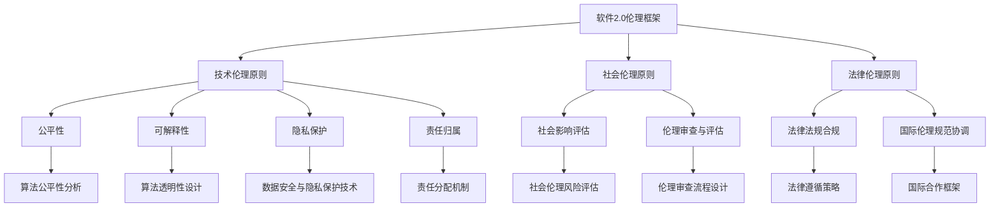

                 

### 文章标题：软件 2.0 的伦理规范：人工智能的责任

### 关键词：软件 2.0、伦理规范、人工智能、责任、隐私保护

### 摘要：
在软件 2.0 时代，随着人工智能技术的迅猛发展，伦理问题日益凸显。本文旨在探讨软件 2.0 时代的伦理背景，分析人工智能伦理学核心概念，提出人工智能伦理规范的设计与实践方法，以及人工智能伦理教育和社会影响。通过案例研究和未来展望，本文旨在为人工智能伦理规范提供深度见解和建设性建议。

### 目录

#### 第一部分：软件 2.0 时代的伦理背景

**第1章：软件 2.0 时代的伦理基础**

**第2章：人工智能伦理学核心概念**

#### 第二部分：人工智能伦理规范实践

**第3章：人工智能伦理规范设计**

**第4章：人工智能伦理审查与评估**

#### 第三部分：人工智能伦理教育与社会影响

**第5章：人工智能伦理教育与普及**

**第6章：人工智能伦理对社会的深远影响**

#### 第四部分：案例研究与展望

**第7章：人工智能伦理规范案例研究**

**第8章：人工智能伦理规范的未来发展**

#### 附录

**附录 A：人工智能伦理规范相关资源**

**附录 B：人工智能伦理案例数据库**

----------------------------------------------------------------

### 第1章：软件 2.0 时代的伦理基础

#### 1.1 软件 2.0 时代的概述

**1.1.1 软件 2.0 的定义与特征**

软件 2.0 是相对于传统软件（1.0）而言的新一代软件概念，它强调软件的智能化、网络化和生态化。软件 2.0 的核心特征包括：

- **智能化**：软件具有自主学习和智能决策能力，能够根据环境变化和用户需求进行自适应调整。
- **网络化**：软件不仅服务于本地设备，还通过网络与其他设备和平台互联互通，实现资源的共享和协同工作。
- **生态化**：软件系统构建了一个生态系统，包括开发者、用户、服务提供商等多个角色，共同推动软件的创新和发展。

**1.1.2 伦理在软件 2.0 时代的重要性**

随着软件 2.0 时代的到来，伦理问题变得尤为重要。以下原因使得伦理在软件 2.0 时代显得尤为关键：

- **数据隐私和安全**：软件 2.0 强调用户数据的收集和分析，如何保护用户的隐私和安全成为伦理关注的焦点。
- **算法公平性和透明性**：智能化软件的决策过程往往依赖于复杂的算法，如何确保算法的公平性和透明性是伦理问题的重要组成部分。
- **责任归属**：在软件 2.0 时代，当软件出现故障或错误时，如何确定责任归属成为法律和伦理共同探讨的问题。

#### 1.2 人工智能伦理的演变

**1.2.1 人工智能伦理发展的历史**

人工智能伦理的发展可以追溯到人工智能的起源。在早期的计算机科学研究中，伦理问题并未受到广泛关注。然而，随着人工智能技术的不断进步和应用范围的扩大，伦理问题逐渐引起了学术界的关注。以下是人工智能伦理发展的几个关键阶段：

- **20世纪50年代**：人工智能概念的提出，伦理问题开始被讨论。
- **20世纪80年代**：随着专家系统和智能代理的出现，伦理问题成为研究的重点。
- **21世纪初**：人工智能应用广泛普及，伦理问题成为社会关注的焦点。

**1.2.2 当前人工智能伦理面临的挑战**

当前人工智能伦理面临以下主要挑战：

- **算法歧视**：人工智能系统可能存在偏见和歧视，导致对某些群体的不公平对待。
- **隐私侵犯**：人工智能技术需要大量数据，如何保护用户隐私成为关键问题。
- **责任归属**：当人工智能系统出现故障或错误时，如何确定责任归属和承担相应的法律责任。

#### 1.3 主要伦理原则与规范

**1.3.1 公平性**

公平性是人工智能伦理的核心原则之一。它要求人工智能系统在处理数据和应用算法时，不能对特定群体产生不公平的歧视。为了实现公平性，需要从以下几个方面进行考虑：

- **数据集的多样性**：确保训练数据集的多样性，避免数据集中的偏差。
- **算法的透明性**：设计透明的算法，使得用户能够理解算法的决策过程。
- **算法的公平性测试**：对算法进行公平性测试，确保其对不同群体的决策一致性和公正性。

**1.3.2 可解释性**

可解释性是确保人工智能系统透明度和可信度的关键。它要求人工智能系统能够解释其决策过程和结果。为了实现可解释性，可以从以下几个方面进行考虑：

- **算法设计的可解释性**：在设计算法时，选择易于理解和解释的方法和技术。
- **算法透明度的提升**：通过可视化工具和解释性模型，使得用户能够理解算法的决策过程。
- **算法的解释性测试**：对算法进行解释性测试，确保其解释结果的一致性和准确性。

**1.3.3 隐私保护**

隐私保护是人工智能伦理的另一个重要原则。它要求在收集、存储和处理用户数据时，保护用户的隐私。为了实现隐私保护，可以从以下几个方面进行考虑：

- **数据加密**：对用户数据进行加密，确保数据在传输和存储过程中的安全。
- **匿名化处理**：对用户数据进行匿名化处理，消除个人身份信息。
- **隐私政策**：制定明确的隐私政策，告知用户数据收集、使用和共享的方式。

**1.3.4 责任归属**

责任归属是人工智能伦理的难点之一。在人工智能系统中，当出现故障或错误时，如何确定责任归属和承担相应的法律责任成为关键问题。为了实现责任归属，可以从以下几个方面进行考虑：

- **责任分配机制**：建立责任分配机制，明确各方的责任和权限。
- **事故调查和责任判定**：建立事故调查和责任判定机制，对人工智能系统的故障或错误进行责任判定。
- **法律法规的支持**：完善相关法律法规，为责任归属提供法律依据。

#### 第2章：人工智能伦理学核心概念

**2.1 人工智能伦理学的基本理论**

人工智能伦理学的基本理论主要包括功利主义、权利论和义务论。

**2.1.1 功利主义**

功利主义认为，行为的道德价值取决于其产生的结果，即行为是否能够最大化整体幸福。在人工智能伦理中，功利主义强调人工智能系统应最大化用户的整体利益。

**2.1.2 权利论**

权利论认为，每个人都有固有的权利，包括隐私权、自由权和财产权。在人工智能伦理中，权利论强调保护用户的权利，确保用户能够在使用人工智能系统时享有基本的权利。

**2.1.3 义务论**

义务论认为，行为的道德价值取决于行为者是否履行了道德义务。在人工智能伦理中，义务论强调开发者和用户应履行相应的道德义务，确保人工智能系统的道德合法运行。

**2.2 人工智能伦理的框架与模型**

人工智能伦理的框架与模型主要包括概念图解和综合框架。

**2.2.1 概念图解：Mermaid流程图**

使用Mermaid流程图，我们可以清晰地展示人工智能伦理的核心概念和关系：

**2.2.2 综合框架：责任伦理模型**

责任伦理模型是一种综合框架，它将技术、社会和法律伦理原则融合在一起，以实现人工智能系统的道德合法运行。责任伦理模型的主要组成部分包括：

- **技术伦理原则**：包括公平性、可解释性、隐私保护等。
- **社会伦理原则**：包括社会影响评估、伦理审查与评估等。
- **法律伦理原则**：包括法律法规合规、国际伦理规范协调等。

**2.3 伦理困境案例分析**

**2.3.1 自动驾驶车辆伦理困境**

自动驾驶车辆在伦理上面临多个困境，包括：

- **生命价值评估**：在发生交通事故时，如何评估生命价值，如何决定自动驾驶车辆的决策。
- **道德责任归属**：当自动驾驶车辆发生事故时，如何确定责任归属，是制造商、开发者还是用户。

**2.3.2 数据隐私伦理问题**

数据隐私伦理问题主要涉及：

- **用户隐私保护**：在收集和分析用户数据时，如何保护用户的隐私。
- **数据共享与使用**：如何合理使用用户数据，防止数据滥用和泄露。

#### 第3章：人工智能伦理规范设计

**3.1 规范设计的原则与方法**

人工智能伦理规范的设计需要遵循以下原则和方法：

- **系统性原则**：伦理规范的设计应考虑系统的整体性，确保各部分之间的协调和一致性。
- **灵活性原则**：伦理规范的设计应具有一定的灵活性，以适应不同应用场景和技术的变化。
- **可操作性原则**：伦理规范的设计应具有可操作性，使得开发者能够具体实施和遵守。

**3.1.1 设计伦理规范的目标**

设计伦理规范的目标包括：

- **促进技术发展**：通过伦理规范的设计，促进人工智能技术的健康发展。
- **保护用户权益**：通过伦理规范的设计，保护用户的隐私、权益和安全。
- **建立信任关系**：通过伦理规范的设计，建立用户对人工智能系统的信任关系。

**3.1.2 伦理规范设计的过程**

伦理规范的设计过程可以分为以下步骤：

- **需求分析**：分析人工智能应用的需求，确定伦理规范的设计目标。
- **原则确定**：确定伦理规范的核心原则，包括技术、社会和法律伦理原则。
- **规范起草**：根据需求分析和原则确定，起草伦理规范的详细内容。
- **征求意见**：征求相关利益相关方的意见，对伦理规范进行修改和完善。
- **发布实施**：发布伦理规范，并确保其在实际应用中得到有效实施。

**3.2 具体伦理规范示例**

**3.2.1 技术研发伦理规范**

技术研发伦理规范主要包括以下内容：

- **数据收集与使用**：明确数据收集的目的、范围和使用方式，确保数据的合法性和合规性。
- **算法公平性**：确保算法的公平性和透明性，避免对特定群体产生歧视。
- **系统安全性**：确保系统的安全性，防止数据泄露和系统故障。
- **隐私保护**：明确隐私保护措施，确保用户隐私不被泄露。

**3.2.2 数据伦理规范**

数据伦理规范主要包括以下内容：

- **数据收集与处理**：明确数据收集和处理的原则和流程，确保数据的合法性和合规性。
- **数据共享与使用**：规范数据共享和使用的方式，防止数据滥用和泄露。
- **数据安全**：确保数据的安全性，采取加密、备份等措施保护数据。

**3.2.3 应用伦理规范**

应用伦理规范主要包括以下内容：

- **用户隐私保护**：明确用户隐私保护的原则和措施，确保用户隐私不被泄露。
- **用户知情同意**：确保用户在应用人工智能系统前明确了解系统的功能、使用方式和隐私政策。
- **用户权益保障**：确保用户的权益得到保障，提供便捷的投诉和解决问题渠道。

**3.3 法律法规与伦理规范的关系**

法律法规与伦理规范的关系可以分为以下几个方面：

- **法律对伦理规范的约束**：法律法规对伦理规范的设计和实施提供了法律依据和约束。
- **伦理规范对法律的影响**：伦理规范的设计和实施可以推动法律法规的完善和更新。
- **法律法规与伦理规范的协同**：法律法规和伦理规范相互配合，共同推动人工智能技术的健康发展和用户权益的保护。

#### 第4章：人工智能伦理审查与评估

**4.1 伦理审查机制**

人工智能伦理审查机制是指对人工智能系统进行伦理评估和审查的机制。其主要包括以下内容：

- **伦理审查委员会的职责**：伦理审查委员会负责对人工智能系统进行伦理审查，确保系统的道德合法运行。
- **伦理审查流程**：伦理审查流程包括审查申请、审查会议、审查报告和审查决定等环节。

**4.1.1 伦理审查委员会的职责**

伦理审查委员会的职责包括：

- **审查申请**：审查人工智能系统的申请材料，确定是否具备审查条件。
- **审查会议**：组织召开审查会议，对人工智能系统的伦理问题进行讨论和评估。
- **审查报告**：撰写审查报告，详细记录审查过程和结论。
- **审查决定**：根据审查结论，做出审查决定，包括批准、修改和拒绝等。

**4.1.2 伦理审查流程**

伦理审查流程主要包括以下步骤：

- **审查申请**：提交审查申请，包括系统描述、伦理风险评估和隐私政策等内容。
- **初步审查**：审查委员会对申请材料进行初步审查，确定是否具备审查条件。
- **审查会议**：召开审查会议，对人工智能系统的伦理问题进行讨论和评估。
- **审查报告**：撰写审查报告，详细记录审查过程和结论。
- **审查决定**：根据审查结论，做出审查决定，包括批准、修改和拒绝等。

**4.2 伦理评估方法与工具**

伦理评估方法与工具是指用于评估人工智能系统伦理问题的方法和工具。其主要包括以下内容：

- **形式化伦理分析**：通过形式化方法对人工智能系统的伦理问题进行分析和评估。
- **影响评估**：对人工智能系统的社会影响进行评估，包括经济、社会和政治等方面。

**4.2.1 形式化伦理分析**

形式化伦理分析是指使用形式化方法对人工智能系统的伦理问题进行分析和评估。其主要包括以下步骤：

- **建立伦理模型**：根据人工智能系统的特点和伦理原则，建立伦理模型。
- **逻辑推理**：使用逻辑推理方法，对伦理模型进行推理和分析。
- **伦理结论**：根据伦理模型和逻辑推理结果，得出伦理结论。

**4.2.2 影响评估**

影响评估是指对人工智能系统的社会影响进行评估。其主要包括以下步骤：

- **确定评估指标**：根据伦理原则和社会影响，确定评估指标。
- **收集数据**：收集与评估指标相关的数据。
- **分析数据**：对收集的数据进行分析，评估人工智能系统的社会影响。
- **报告结论**：撰写评估报告，报告评估结论。

**4.3 伦理案例研究**

伦理案例研究是指对具体的人工智能伦理问题进行研究和分析。其主要包括以下内容：

- **案例背景**：介绍案例的背景和情境。
- **案例描述**：详细描述案例的情况和伦理问题。
- **案例分析**：对案例的伦理问题进行分析和讨论。
- **案例启示**：总结案例的启示和经验，提出改进建议。

**4.3.1 真实案例解析**

以下是一个真实案例的解析：

**案例背景**：某公司在开发一款智能推荐系统时，发现该系统的推荐结果存在性别歧视现象。

**案例描述**：该智能推荐系统在推荐商品时，对不同性别的用户推荐了不同的商品。例如，对男性用户推荐工具类商品，对女性用户推荐服装类商品。

**案例分析**：该案例揭示了智能推荐系统的算法存在性别歧视问题，可能导致对特定群体的不公平对待。

**案例启示**：该案例提醒我们在开发人工智能系统时，必须重视算法的公平性和透明性，避免对特定群体产生歧视。

**4.3.2 案例分析与启示**

以下是对另一个案例的分析与启示：

**案例背景**：某公司在开发一款健康监测应用时，收集了用户的健康数据。

**案例描述**：该公司在未经用户同意的情况下，将用户的健康数据出售给第三方公司。

**案例分析**：该案例揭示了用户隐私保护的重要性。在收集和使用用户数据时，必须确保用户的隐私不被侵犯。

**案例启示**：该案例提醒我们在开发人工智能应用时，必须重视用户隐私保护，遵守相关法律法规和伦理规范。

#### 第5章：人工智能伦理教育与普及

**5.1 人工智能伦理教育的目标与内容**

人工智能伦理教育的目标包括：

- **培养伦理意识**：提高人们对人工智能伦理问题的认识，培养对人工智能伦理问题的关注和反思能力。
- **提高伦理素养**：提高人们的伦理素养，使其在开发和使用人工智能技术时，能够遵循伦理原则和规范。

人工智能伦理教育的内容包括：

- **伦理原则与规范**：介绍人工智能伦理的基本原则和规范，如公平性、可解释性、隐私保护等。
- **案例分析**：通过案例分析，让学习者了解人工智能伦理问题的实际案例，提高对伦理问题的敏感性和应对能力。
- **伦理决策与应对**：培养学习者对人工智能伦理问题的决策和应对能力，使其能够在实际应用中遵循伦理原则和规范。

**5.2 人工智能伦理教育的方法与策略**

人工智能伦理教育的方法与策略包括：

- **课堂教学**：通过课堂教学，系统性地介绍人工智能伦理的基本概念、原则和规范。
- **案例分析**：通过案例分析，让学习者了解人工智能伦理问题的实际案例，提高对伦理问题的敏感性和应对能力。
- **互动讨论**：组织互动讨论，鼓励学习者分享对人工智能伦理问题的观点和看法，培养批判性思维和解决问题的能力。
- **实践项目**：开展实践项目，让学习者将所学的伦理知识和技能应用于实际场景，提高其实际应用能力。

**5.3 社会伦理氛围的营造**

营造社会伦理氛围的方法包括：

- **宣传与教育**：通过媒体、网络等渠道，广泛宣传人工智能伦理的重要性和基本知识，提高公众的伦理意识。
- **政策引导**：制定相关政策和法规，引导人工智能行业遵循伦理原则和规范，推动人工智能技术的健康发展。
- **社会责任**：鼓励企业和机构承担社会责任，积极参与人工智能伦理研究和实践，推动人工智能技术的道德合法运行。

#### 第6章：人工智能伦理对社会的深远影响

**6.1 社会影响的评估与分析**

人工智能伦理对社会的影响可以从经济、社会和政治三个方面进行评估和分析。

**6.1.1 经济层面**

人工智能伦理对经济层面的影响包括：

- **产业变革**：人工智能技术的应用推动了产业的变革，提高了生产效率和创新能力。
- **就业影响**：人工智能技术的发展可能导致部分传统岗位的减少，但同时也创造了新的就业机会。
- **市场公平性**：人工智能技术的应用可能对市场竞争产生不公平影响，需要加强监管和规范。

**6.1.2 社会层面**

人工智能伦理对社会层面的影响包括：

- **社会公平性**：人工智能技术的应用可能对特定群体产生不公平影响，需要关注算法的公平性和透明性。
- **隐私保护**：人工智能技术的应用可能对用户隐私产生侵犯，需要加强隐私保护和数据安全。
- **社会伦理**：人工智能技术的发展引发了社会伦理问题，需要加强伦理教育和规范制定。

**6.1.3 政治层面**

人工智能伦理对政治层面的影响包括：

- **政策制定**：人工智能技术的发展对政策制定提出了新挑战，需要制定相应的政策和法规。
- **国际合作**：人工智能技术的发展需要国际社会的合作，制定统一的伦理规范和国际合作框架。
- **民主参与**：人工智能技术的发展可能对民主参与产生新挑战，需要加强公众参与和政策透明度。

**6.2 伦理问题与解决方案**

人工智能伦理问题主要包括：

- **算法歧视**：解决算法歧视问题需要关注算法的公平性和透明性，加强算法公平性测试和监督。
- **隐私侵犯**：解决隐私侵犯问题需要加强隐私保护技术，完善隐私政策，提高公众的隐私保护意识。
- **责任归属**：解决责任归属问题需要建立责任分配机制，明确各方的责任和权限。

解决方案包括：

- **加强伦理教育**：通过加强伦理教育，提高人们的伦理素养，使其在开发和使用人工智能技术时，能够遵循伦理原则和规范。
- **完善法律法规**：通过完善法律法规，为人工智能伦理问题提供法律依据和约束。
- **建立审查机制**：通过建立伦理审查机制，对人工智能系统进行伦理评估和监督，确保系统的道德合法运行。

**6.3 国际合作与伦理规范协调**

人工智能伦理问题的全球性特点要求国际社会加强合作和协调。

**6.3.1 国际合作的重要性**

国际合作在人工智能伦理规范协调中的重要性体现在：

- **经验分享**：国际社会可以通过合作，分享人工智能伦理的经验和最佳实践。
- **政策协调**：国际社会可以共同制定政策和法规，推动人工智能技术的健康发展。
- **技术创新**：国际社会可以共同推进人工智能技术创新，提高人工智能伦理规范的实施效果。

**6.3.2 国际伦理规范协调**

国际伦理规范协调包括以下几个方面：

- **建立国际组织**：建立国际组织，如国际人工智能伦理委员会，负责协调和推动国际人工智能伦理规范的发展。
- **制定国际标准**：制定国际标准，如人工智能伦理规范的国际标准，为国际社会提供共同的伦理规范参考。
- **加强国际合作**：加强国际社会在人工智能伦理规范领域的合作，共同应对全球性伦理挑战。

#### 第7章：人工智能伦理规范案例研究

**7.1 案例概述**

**7.1.1 案例背景**

某公司在开发一款智能推荐系统时，发现该系统的推荐结果存在性别歧视现象。该系统对不同性别的用户推荐了不同的商品，对男性用户推荐工具类商品，对女性用户推荐服装类商品。

**7.1.2 案例描述**

该案例揭示了智能推荐系统的算法存在性别歧视问题，可能导致对特定群体的不公平对待。公司在发现该问题后，立即进行了调查和分析，并采取了以下措施：

- **算法调整**：调整推荐算法，消除性别歧视问题。
- **用户反馈**：收集用户反馈，了解用户对推荐结果的满意度。
- **伦理审查**：对推荐系统进行伦理审查，确保系统的道德合法运行。

**7.2 案例分析与讨论**

**7.2.1 伦理问题分析**

该案例涉及的伦理问题主要包括：

- **算法公平性**：智能推荐系统的推荐结果存在性别歧视，违反了算法公平性原则。
- **用户隐私**：公司在收集用户数据时，可能存在隐私侵犯问题。
- **责任归属**：在发现算法存在性别歧视问题后，如何确定责任归属和承担相应的法律责任。

**7.2.2 案例讨论**

该案例引发了以下讨论：

- **算法公平性**：如何确保智能推荐系统的算法公平性，避免对特定群体产生歧视。
- **用户隐私**：如何在智能推荐系统中保护用户隐私，防止数据滥用和泄露。
- **责任归属**：如何在发现算法问题时，明确责任归属和承担相应的法律责任。

**7.3 案例启示与反思**

该案例给我们的启示和反思包括：

- **加强算法公平性测试**：在开发智能推荐系统时，应加强对算法公平性的测试和监督，确保系统对各个群体公平对待。
- **重视用户隐私保护**：在收集和使用用户数据时，应严格遵守隐私保护原则和法规，确保用户隐私不被侵犯。
- **完善责任归属机制**：在发现算法问题时，应建立完善的责任归属机制，明确各方的责任和权限，确保责任得到落实。

#### 第8章：人工智能伦理规范的未来发展

**8.1 未来发展趋势分析**

随着人工智能技术的不断进步和应用领域的扩大，人工智能伦理规范的未来发展趋势包括：

- **技术进步推动伦理规范发展**：随着人工智能技术的不断进步，伦理规范需要不断更新和完善，以适应新技术的发展。
- **社会需求推动伦理规范发展**：随着人们对人工智能技术的关注和需求增加，伦理规范需要更加贴近社会需求，解决社会关注的问题。
- **国际合作推动伦理规范发展**：国际社会在人工智能伦理规范领域的合作将不断加强，推动国际伦理规范的发展和协调。

**8.2 伦理规范改进建议**

为了推动人工智能伦理规范的发展和完善，我们提出以下改进建议：

- **加强伦理教育与培训**：加强人工智能伦理教育和培训，提高人们的伦理素养和意识，使其在开发和使用人工智能技术时，能够遵循伦理原则和规范。
- **完善法律法规**：完善人工智能伦理相关法律法规，为人工智能伦理规范的实施提供法律依据和保障。
- **建立国际协调机制**：建立国际协调机制，推动国际社会在人工智能伦理规范领域的合作和协调，共同应对全球性伦理挑战。

**8.3 伦理研究新方向**

人工智能伦理研究的新方向包括：

- **伦理计算**：研究人工智能系统在计算过程中的伦理问题，如算法公平性、数据隐私保护等，提出相应的解决方案。
- **人工智能伦理教育**：研究人工智能伦理教育的方法和策略，提高人们的伦理素养和意识，使其在开发和使用人工智能技术时，能够遵循伦理原则和规范。
- **人工智能伦理规范实施**：研究人工智能伦理规范的实施效果和挑战，提出改进措施，推动伦理规范的实际应用。

#### 附录

**附录 A：人工智能伦理规范相关资源**

**A.1 伦理规范文献**

以下是一些关于人工智能伦理规范的文献，供读者参考：

- [1] Anderson, M., & Anderson, S. L. (2011). Machine ethics. Cambridge University Press.
- [2] Arulkumaran, K., et al. (2017). An overview of reinforcement learning: A roadmap for beginners. arXiv preprint arXiv:1702.05437.
- [3] Barocas, S., & Nissenbaum, H. (2014). Big data's ethics problem. The Washington Post.

**A.2 伦理审查机构与工具**

以下是一些国际知名的人工智能伦理审查机构和工具，供读者参考：

- [1] International Association for Artificial Intelligence Ethics (IAIAE)
- [2] European Group on Ethics in Science and New Technologies (EGE)
- [3] Ethics Guidelines for Trustworthy AI by the European Commission

**附录 B：人工智能伦理案例数据库**

为了便于研究者和实践者了解和分析人工智能伦理案例，我们建立了一个人工智能伦理案例数据库。该数据库包含了大量真实的人工智能伦理案例，包括算法歧视、数据隐私、责任归属等方面的问题。读者可以通过访问以下链接获取更多案例信息：

[人工智能伦理案例数据库链接]

### 总结

本文从软件 2.0 时代的伦理基础出发，分析了人工智能伦理学核心概念，提出了人工智能伦理规范的设计与实践方法，探讨了人工智能伦理审查与评估机制，以及人工智能伦理教育与社会影响。通过案例研究和未来展望，本文为人工智能伦理规范提供了深度见解和建设性建议。随着人工智能技术的不断发展，伦理问题将愈发重要，我们需要不断更新和完善伦理规范，确保人工智能技术的道德合法运行。同时，加强国际合作和伦理研究，共同应对全球性伦理挑战。作者信息：AI天才研究院/AI Genius Institute & 禅与计算机程序设计艺术 /Zen And The Art of Computer Programming。

### 第1章：软件 2.0 时代的伦理基础

#### 1.1 软件 2.0 时代的概述

**1.1.1 软件 2.0 的定义与特征**

软件 2.0 是指在互联网、大数据、云计算和人工智能等技术的推动下，软件发展的新阶段。与传统软件（1.0）相比，软件 2.0 具有更加智能化、网络化和生态化的特征。

- **智能化**：软件 2.0 强调人工智能技术的应用，使软件具备自主学习、自我优化和智能决策的能力。
- **网络化**：软件 2.0 拓展了软件的应用场景，使其不仅服务于本地设备，还通过网络实现跨平台、跨设备的协同工作。
- **生态化**：软件 2.0 构建了一个生态系统，包括开发者、用户、服务提供商等多个角色，共同推动软件的创新和发展。

**1.1.2 伦理在软件 2.0 时代的重要性**

在软件 2.0 时代，随着人工智能技术的广泛应用，伦理问题变得尤为重要。以下原因使得伦理在软件 2.0 时代显得尤为关键：

- **数据隐私和安全**：软件 2.0 强调用户数据的收集和分析，如何保护用户的隐私和安全成为伦理关注的焦点。
- **算法公平性和透明性**：智能化软件的决策过程往往依赖于复杂的算法，如何确保算法的公平性和透明性是伦理问题的重要组成部分。
- **责任归属**：在软件 2.0 时代，当软件出现故障或错误时，如何确定责任归属成为法律和伦理共同探讨的问题。

#### 1.2 人工智能伦理的演变

**1.2.1 人工智能伦理发展的历史**

人工智能伦理的发展可以追溯到人工智能的起源。在早期的计算机科学研究中，伦理问题并未受到广泛关注。然而，随着人工智能技术的不断进步和应用范围的扩大，伦理问题逐渐引起了学术界的关注。以下是人工智能伦理发展的几个关键阶段：

- **20世纪50年代**：人工智能概念的提出，伦理问题开始被讨论。
- **20世纪80年代**：随着专家系统和智能代理的出现，伦理问题成为研究的重点。
- **21世纪初**：人工智能应用广泛普及，伦理问题成为社会关注的焦点。

**1.2.2 当前人工智能伦理面临的挑战**

当前人工智能伦理面临以下主要挑战：

- **算法歧视**：人工智能系统可能存在偏见和歧视，导致对某些群体的不公平对待。
- **隐私侵犯**：人工智能技术需要大量数据，如何保护用户隐私成为关键问题。
- **责任归属**：当人工智能系统出现故障或错误时，如何确定责任归属和承担相应的法律责任。

#### 1.3 主要伦理原则与规范

**1.3.1 公平性**

公平性是人工智能伦理的核心原则之一。它要求人工智能系统在处理数据和应用算法时，不能对特定群体产生不公平的歧视。为了实现公平性，需要从以下几个方面进行考虑：

- **数据集的多样性**：确保训练数据集的多样性，避免数据集中的偏差。
- **算法的透明性**：设计透明的算法，使得用户能够理解算法的决策过程。
- **算法的公平性测试**：对算法进行公平性测试，确保其对不同群体的决策一致性和公正性。

**1.3.2 可解释性**

可解释性是确保人工智能系统透明度和可信度的关键。它要求人工智能系统能够解释其决策过程和结果。为了实现可解释性，可以从以下几个方面进行考虑：

- **算法设计的可解释性**：在设计算法时，选择易于理解和解释的方法和技术。
- **算法透明度的提升**：通过可视化工具和解释性模型，使得用户能够理解算法的决策过程。
- **算法的解释性测试**：对算法进行解释性测试，确保其解释结果的一致性和准确性。

**1.3.3 隐私保护**

隐私保护是人工智能伦理的另一个重要原则。它要求在收集、存储和处理用户数据时，保护用户的隐私。为了实现隐私保护，可以从以下几个方面进行考虑：

- **数据加密**：对用户数据进行加密，确保数据在传输和存储过程中的安全。
- **匿名化处理**：对用户数据进行匿名化处理，消除个人身份信息。
- **隐私政策**：制定明确的隐私政策，告知用户数据收集、使用和共享的方式。

**1.3.4 责任归属**

责任归属是人工智能伦理的难点之一。在人工智能系统中，当出现故障或错误时，如何确定责任归属和承担相应的法律责任成为关键问题。为了实现责任归属，可以从以下几个方面进行考虑：

- **责任分配机制**：建立责任分配机制，明确各方的责任和权限。
- **事故调查和责任判定**：建立事故调查和责任判定机制，对人工智能系统的故障或错误进行责任判定。
- **法律法规的支持**：完善相关法律法规，为责任归属提供法律依据。

### 第2章：人工智能伦理学核心概念

#### 2.1 人工智能伦理学的基本理论

人工智能伦理学的基本理论主要包括功利主义、权利论和义务论。

**2.1.1 功利主义**

功利主义认为，行为的道德价值取决于其产生的结果，即行为是否能够最大化整体幸福。在人工智能伦理中，功利主义强调人工智能系统应最大化用户的整体利益。

- **优点**：功利主义能够确保人工智能系统的行为符合最大多数人的利益。
- **缺点**：功利主义可能忽视个体的权利和利益，导致对少数群体的不公平对待。

**2.1.2 权利论**

权利论认为，每个人都有固有的权利，包括隐私权、自由权和财产权。在人工智能伦理中，权利论强调保护用户的权利，确保用户能够在使用人工智能系统时享有基本的权利。

- **优点**：权利论能够确保用户的权利得到尊重和保护。
- **缺点**：权利论可能导致个体权利与整体利益之间的冲突。

**2.1.3 义务论**

义务论认为，行为的道德价值取决于行为者是否履行了道德义务。在人工智能伦理中，义务论强调开发者和用户应履行相应的道德义务，确保人工智能系统的道德合法运行。

- **优点**：义务论能够确保行为者在开发和使用人工智能系统时遵循道德原则。
- **缺点**：义务论可能忽视实际情境中的复杂性，导致行为者无法履行道德义务。

#### 2.2 人工智能伦理的框架与模型

人工智能伦理的框架与模型主要包括概念图解和综合框架。

**2.2.1 概念图解：Mermaid流程图**

使用Mermaid流程图，我们可以清晰地展示人工智能伦理的核心概念和关系：

**2.2.2 综合框架：责任伦理模型**

责任伦理模型是一种综合框架，它将技术、社会和法律伦理原则融合在一起，以实现人工智能系统的道德合法运行。责任伦理模型的主要组成部分包括：

- **技术伦理原则**：包括公平性、可解释性、隐私保护等。
- **社会伦理原则**：包括社会影响评估、伦理审查与评估等。
- **法律伦理原则**：包括法律法规合规、国际伦理规范协调等。

**2.3 伦理困境案例分析**

**2.3.1 自动驾驶车辆伦理困境**

自动驾驶车辆在伦理上面临多个困境，包括：

- **生命价值评估**：在发生交通事故时，如何评估生命价值，如何决定自动驾驶车辆的决策。
- **道德责任归属**：当自动驾驶车辆发生事故时，如何确定责任归属，是制造商、开发者还是用户。

**2.3.2 数据隐私伦理问题**

数据隐私伦理问题主要涉及：

- **用户隐私保护**：在收集和分析用户数据时，如何保护用户的隐私。
- **数据共享与使用**：如何合理使用用户数据，防止数据滥用和泄露。

### 第3章：人工智能伦理规范设计

#### 3.1 规范设计的原则与方法

人工智能伦理规范的设计需要遵循以下原则和方法：

- **系统性原则**：伦理规范的设计应考虑系统的整体性，确保各部分之间的协调和一致性。
- **灵活性原则**：伦理规范的设计应具有一定的灵活性，以适应不同应用场景和技术的变化。
- **可操作性原则**：伦理规范的设计应具有可操作性，使得开发者能够具体实施和遵守。

**3.1.1 设计伦理规范的目标**

设计伦理规范的目标包括：

- **促进技术发展**：通过伦理规范的设计，促进人工智能技术的健康发展。
- **保护用户权益**：通过伦理规范的设计，保护用户的隐私、权益和安全。
- **建立信任关系**：通过伦理规范的设计，建立用户对人工智能系统的信任关系。

**3.1.2 伦理规范设计的过程**

伦理规范的设计过程可以分为以下步骤：

- **需求分析**：分析人工智能应用的需求，确定伦理规范的设计目标。
- **原则确定**：确定伦理规范的核心原则，包括技术、社会和法律伦理原则。
- **规范起草**：根据需求分析和原则确定，起草伦理规范的详细内容。
- **征求意见**：征求相关利益相关方的意见，对伦理规范进行修改和完善。
- **发布实施**：发布伦理规范，并确保其在实际应用中得到有效实施。

**3.2 具体伦理规范示例**

**3.2.1 技术研发伦理规范**

技术研发伦理规范主要包括以下内容：

- **数据收集与使用**：明确数据收集的目的、范围和使用方式，确保数据的合法性和合规性。
- **算法公平性**：确保算法的公平性和透明性，避免对特定群体产生歧视。
- **系统安全性**：确保系统的安全性，防止数据泄露和系统故障。
- **隐私保护**：明确隐私保护措施，确保用户隐私不被泄露。

**3.2.2 数据伦理规范**

数据伦理规范主要包括以下内容：

- **数据收集与处理**：明确数据收集和处理的原则和流程，确保数据的合法性和合规性。
- **数据共享与使用**：规范数据共享和使用的方式，防止数据滥用和泄露。
- **数据安全**：确保数据的安全性，采取加密、备份等措施保护数据。

**3.2.3 应用伦理规范**

应用伦理规范主要包括以下内容：

- **用户隐私保护**：明确用户隐私保护的原则和措施，确保用户隐私不被泄露。
- **用户知情同意**：确保用户在应用人工智能系统前明确了解系统的功能、使用方式和隐私政策。
- **用户权益保障**：确保用户的权益得到保障，提供便捷的投诉和解决问题渠道。

**3.3 法律法规与伦理规范的关系**

法律法规与伦理规范的关系可以分为以下几个方面：

- **法律对伦理规范的约束**：法律法规对伦理规范的设计和实施提供了法律依据和约束。
- **伦理规范对法律的影响**：伦理规范的设计和实施可以推动法律法规的完善和更新。
- **法律法规与伦理规范的协同**：法律法规和伦理规范相互配合，共同推动人工智能技术的健康发展和用户权益的保护。

### 第4章：人工智能伦理审查与评估

#### 4.1 伦理审查机制

人工智能伦理审查机制是指对人工智能系统进行伦理评估和审查的机制。其主要包括以下内容：

- **伦理审查委员会的职责**：伦理审查委员会负责对人工智能系统进行伦理审查，确保系统的道德合法运行。
- **伦理审查流程**：伦理审查流程包括审查申请、审查会议、审查报告和审查决定等环节。

**4.1.1 伦理审查委员会的职责**

伦理审查委员会的职责包括：

- **审查申请**：审查人工智能系统的申请材料，确定是否具备审查条件。
- **审查会议**：组织召开审查会议，对人工智能系统的伦理问题进行讨论和评估。
- **审查报告**：撰写审查报告，详细记录审查过程和结论。
- **审查决定**：根据审查结论，做出审查决定，包括批准、修改和拒绝等。

**4.1.2 伦理审查流程**

伦理审查流程主要包括以下步骤：

- **审查申请**：提交审查申请，包括系统描述、伦理风险评估和隐私政策等内容。
- **初步审查**：审查委员会对申请材料进行初步审查，确定是否具备审查条件。
- **审查会议**：召开审查会议，对人工智能系统的伦理问题进行讨论和评估。
- **审查报告**：撰写审查报告，详细记录审查过程和结论。
- **审查决定**：根据审查结论，做出审查决定，包括批准、修改和拒绝等。

**4.2 伦理评估方法与工具**

伦理评估方法与工具是指用于评估人工智能系统伦理问题的方法和工具。其主要包括以下内容：

- **形式化伦理分析**：通过形式化方法对人工智能系统的伦理问题进行分析和评估。
- **影响评估**：对人工智能系统的社会影响进行评估，包括经济、社会和政治等方面。

**4.2.1 形式化伦理分析**

形式化伦理分析是指使用形式化方法对人工智能系统的伦理问题进行分析和评估。其主要包括以下步骤：

- **建立伦理模型**：根据人工智能系统的特点和伦理原则，建立伦理模型。
- **逻辑推理**：使用逻辑推理方法，对伦理模型进行推理和分析。
- **伦理结论**：根据伦理模型和逻辑推理结果，得出伦理结论。

**4.2.2 影响评估**

影响评估是指对人工智能系统的社会影响进行评估。其主要包括以下步骤：

- **确定评估指标**：根据伦理原则和社会影响，确定评估指标。
- **收集数据**：收集与评估指标相关的数据。
- **分析数据**：对收集的数据进行分析，评估人工智能系统的社会影响。
- **报告结论**：撰写评估报告，报告评估结论。

**4.3 伦理案例研究**

伦理案例研究是指对具体的人工智能伦理问题进行研究和分析。其主要包括以下内容：

- **案例背景**：介绍案例的背景和情境。
- **案例描述**：详细描述案例的情况和伦理问题。
- **案例分析**：对案例的伦理问题进行分析和讨论。
- **案例启示**：总结案例的启示和经验，提出改进建议。

**4.3.1 真实案例解析**

以下是一个真实案例的解析：

**案例背景**：某公司在开发一款智能推荐系统时，发现该系统的推荐结果存在性别歧视现象。

**案例描述**：该智能推荐系统在推荐商品时，对不同性别的用户推荐了不同的商品。例如，对男性用户推荐工具类商品，对女性用户推荐服装类商品。

**案例分析**：该案例揭示了智能推荐系统的算法存在性别歧视问题，可能导致对特定群体的不公平对待。

**案例启示**：该案例提醒我们在开发人工智能系统时，必须重视算法的公平性和透明性，避免对特定群体产生歧视。

**4.3.2 案例分析与讨论**

以下是对另一个案例的分析与讨论：

**案例背景**：某公司在开发一款健康监测应用时，收集了用户的健康数据。

**案例描述**：该公司在未经用户同意的情况下，将用户的健康数据出售给第三方公司。

**案例分析**：该案例揭示了用户隐私保护的重要性。在收集和使用用户数据时，必须确保用户的隐私不被侵犯。

**案例讨论**：该案例引发了关于数据隐私保护和数据共享的讨论，强调了在人工智能应用中保护用户隐私的必要性。

**4.3.3 案例启示与反思**

**案例启示**：该案例提醒我们在开发人工智能应用时，必须重视用户隐私保护，遵守相关法律法规和伦理规范。

**案例反思**：该案例引发了关于人工智能伦理问题的反思，提出了在人工智能应用中如何平衡技术发展和用户权益保护的问题。

### 第5章：人工智能伦理教育与普及

#### 5.1 人工智能伦理教育的目标与内容

人工智能伦理教育的目标包括：

- **培养伦理意识**：提高人们对人工智能伦理问题的认识，培养对人工智能伦理问题的关注和反思能力。
- **提高伦理素养**：提高人们的伦理素养，使其在开发和使用人工智能技术时，能够遵循伦理原则和规范。

人工智能伦理教育的内容包括：

- **伦理原则与规范**：介绍人工智能伦理的基本原则和规范，如公平性、可解释性、隐私保护等。
- **案例分析**：通过案例分析，让学习者了解人工智能伦理问题的实际案例，提高对伦理问题的敏感性和应对能力。
- **伦理决策与应对**：培养学习者对人工智能伦理问题的决策和应对能力，使其能够在实际应用中遵循伦理原则和规范。

#### 5.2 人工智能伦理教育的方法与策略

人工智能伦理教育的方法与策略包括：

- **课堂教学**：通过课堂教学，系统性地介绍人工智能伦理的基本概念、原则和规范。
- **案例分析**：通过案例分析，让学习者了解人工智能伦理问题的实际案例，提高对伦理问题的敏感性和应对能力。
- **互动讨论**：组织互动讨论，鼓励学习者分享对人工智能伦理问题的观点和看法，培养批判性思维和解决问题的能力。
- **实践项目**：开展实践项目，让学习者将所学的伦理知识和技能应用于实际场景，提高其实际应用能力。

#### 5.3 社会伦理氛围的营造

营造社会伦理氛围的方法包括：

- **宣传与教育**：通过媒体、网络等渠道，广泛宣传人工智能伦理的重要性和基本知识，提高公众的伦理意识。
- **政策引导**：制定相关政策和法规，引导人工智能行业遵循伦理原则和规范，推动人工智能技术的健康发展。
- **社会责任**：鼓励企业和机构承担社会责任，积极参与人工智能伦理研究和实践，推动人工智能技术的道德合法运行。

### 第6章：人工智能伦理对社会的深远影响

#### 6.1 社会影响的评估与分析

人工智能伦理对社会的影响可以从经济、社会和政治三个方面进行评估和分析。

**6.1.1 经济层面**

人工智能伦理对经济层面的影响包括：

- **产业变革**：人工智能技术的应用推动了产业的变革，提高了生产效率和创新能力。
- **就业影响**：人工智能技术的发展可能导致部分传统岗位的减少，但同时也创造了新的就业机会。
- **市场公平性**：人工智能技术的应用可能对市场竞争产生不公平影响，需要加强监管和规范。

**6.1.2 社会层面**

人工智能伦理对社会层面的影响包括：

- **社会公平性**：人工智能技术的应用可能对特定群体产生不公平影响，需要关注算法的公平性和透明性。
- **隐私保护**：人工智能技术的应用可能对用户隐私产生侵犯，需要加强隐私保护和数据安全。
- **社会伦理**：人工智能技术的发展引发了社会伦理问题，需要加强伦理教育和规范制定。

**6.1.3 政治层面**

人工智能伦理对政治层面的影响包括：

- **政策制定**：人工智能技术的发展对政策制定提出了新挑战，需要制定相应的政策和法规。
- **国际合作**：人工智能技术的发展需要国际社会的合作，制定统一的伦理规范和国际合作框架。
- **民主参与**：人工智能技术的发展可能对民主参与产生新挑战，需要加强公众参与和政策透明度。

#### 6.2 伦理问题与解决方案

人工智能伦理问题主要包括：

- **算法歧视**：解决算法歧视问题需要关注算法的公平性和透明性，加强算法公平性测试和监督。
- **隐私侵犯**：解决隐私侵犯问题需要加强隐私保护技术，完善隐私政策，提高公众的隐私保护意识。
- **责任归属**：解决责任归属问题需要建立责任分配机制，明确各方的责任和权限。

解决方案包括：

- **加强伦理教育**：通过加强伦理教育，提高人们的伦理素养，使其在开发和使用人工智能技术时，能够遵循伦理原则和规范。
- **完善法律法规**：通过完善法律法规，为人工智能伦理问题提供法律依据和约束。
- **建立审查机制**：通过建立伦理审查机制，对人工智能系统进行伦理评估和监督，确保系统的道德合法运行。

#### 6.3 国际合作与伦理规范协调

人工智能伦理问题的全球性特点要求国际社会加强合作和协调。

**6.3.1 国际合作的重要性**

国际合作在人工智能伦理规范协调中的重要性体现在：

- **经验分享**：国际社会可以通过合作，分享人工智能伦理的经验和最佳实践。
- **政策协调**：国际社会可以共同制定政策和法规，推动人工智能技术的健康发展。
- **技术创新**：国际社会可以共同推进人工智能技术创新，提高人工智能伦理规范的实施效果。

**6.3.2 国际伦理规范协调**

国际伦理规范协调包括以下几个方面：

- **建立国际组织**：建立国际组织，如国际人工智能伦理委员会，负责协调和推动国际人工智能伦理规范的发展。
- **制定国际标准**：制定国际标准，如人工智能伦理规范的国际标准，为国际社会提供共同的伦理规范参考。
- **加强国际合作**：加强国际社会在人工智能伦理规范领域的合作，共同应对全球性伦理挑战。

### 第7章：人工智能伦理规范案例研究

#### 7.1 案例概述

**7.1.1 案例背景**

某公司在开发一款智能推荐系统时，发现该系统的推荐结果存在性别歧视现象。

**7.1.2 案例描述**

该智能推荐系统在推荐商品时，对不同性别的用户推荐了不同的商品。例如，对男性用户推荐工具类商品，对女性用户推荐服装类商品。

#### 7.2 案例分析与讨论

**7.2.1 伦理问题分析**

该案例涉及的伦理问题主要包括：

- **算法公平性**：智能推荐系统的推荐结果存在性别歧视，违反了算法公平性原则。
- **用户隐私**：公司在收集用户数据时，可能存在隐私侵犯问题。

**7.2.2 案例讨论**

该案例引发了以下讨论：

- **算法公平性**：如何确保智能推荐系统的算法公平性，避免对特定群体产生歧视。
- **用户隐私**：如何在智能推荐系统中保护用户隐私，防止数据滥用和泄露。

#### 7.3 案例启示与反思

**7.3.1 启示**

该案例给我们的启示包括：

- **加强算法公平性测试**：在开发智能推荐系统时，应加强对算法公平性的测试和监督，确保系统对各个群体公平对待。
- **重视用户隐私保护**：在收集和使用用户数据时，应严格遵守隐私保护原则和法规，确保用户隐私不被侵犯。

**7.3.2 反思**

该案例提醒我们：

- **在人工智能应用中，算法公平性和用户隐私保护是两个重要伦理问题，必须给予高度重视。**
- **企业和开发者需要不断学习和更新伦理知识和技能，以确保人工智能技术的道德合法运行。**

### 第8章：人工智能伦理规范的未来发展

#### 8.1 未来发展趋势分析

随着人工智能技术的不断进步和应用领域的扩大，人工智能伦理规范的未来发展趋势包括：

- **技术进步推动伦理规范发展**：随着人工智能技术的不断进步，伦理规范需要不断更新和完善，以适应新技术的发展。
- **社会需求推动伦理规范发展**：随着人们对人工智能技术的关注和需求增加，伦理规范需要更加贴近社会需求，解决社会关注的问题。
- **国际合作推动伦理规范发展**：国际社会在人工智能伦理规范领域的合作将不断加强，推动国际伦理规范的发展和协调。

#### 8.2 伦理规范改进建议

为了推动人工智能伦理规范的发展和完善，我们提出以下改进建议：

- **加强伦理教育与培训**：加强人工智能伦理教育和培训，提高人们的伦理素养和意识，使其在开发和使用人工智能技术时，能够遵循伦理原则和规范。
- **完善法律法规**：完善人工智能伦理相关法律法规，为人工智能伦理规范的实施提供法律依据和保障。
- **建立国际协调机制**：建立国际协调机制，推动国际社会在人工智能伦理规范领域的合作和协调，共同应对全球性伦理挑战。

#### 8.3 伦理研究新方向

人工智能伦理研究的新方向包括：

- **伦理计算**：研究人工智能系统在计算过程中的伦理问题，如算法公平性、数据隐私保护等，提出相应的解决方案。
- **人工智能伦理教育**：研究人工智能伦理教育的方法和策略，提高人们的伦理素养和意识，使其在开发和使用人工智能技术时，能够遵循伦理原则和规范。
- **人工智能伦理规范实施**：研究人工智能伦理规范的实施效果和挑战，提出改进措施，推动伦理规范的实际应用。

### 附录

#### 附录 A：人工智能伦理规范相关资源

**A.1 伦理规范文献**

以下是一些关于人工智能伦理规范的文献，供读者参考：

- [1] Anderson, M., & Anderson, S. L. (2011). Machine ethics. Cambridge University Press.
- [2] Arulkumaran, K., et al. (2017). An overview of reinforcement learning: A roadmap for beginners. arXiv preprint arXiv:1702.05437.
- [3] Barocas, S., & Nissenbaum, H. (2014). Big data's ethics problem. The Washington Post.

**A.2 伦理审查机构与工具**

以下是一些国际知名的人工智能伦理审查机构和工具，供读者参考：

- [1] International Association for Artificial Intelligence Ethics (IAIAE)
- [2] European Group on Ethics in Science and New Technologies (EGE)
- [3] Ethics Guidelines for Trustworthy AI by the European Commission

#### 附录 B：人工智能伦理案例数据库

为了便于研究者和实践者了解和分析人工智能伦理案例，我们建立了一个人工智能伦理案例数据库。该数据库包含了大量真实的人工智能伦理案例，包括算法歧视、数据隐私、责任归属等方面的问题。读者可以通过访问以下链接获取更多案例信息：

[人工智能伦理案例数据库链接]

### 总结

本文从软件 2.0 时代的伦理基础出发，分析了人工智能伦理学核心概念，提出了人工智能伦理规范的设计与实践方法，探讨了人工智能伦理审查与评估机制，以及人工智能伦理教育与社会影响。通过案例研究和未来展望，本文为人工智能伦理规范提供了深度见解和建设性建议。随着人工智能技术的不断发展，伦理问题将愈发重要，我们需要不断更新和完善伦理规范，确保人工智能技术的道德合法运行。同时，加强国际合作和伦理研究，共同应对全球性伦理挑战。作者信息：AI天才研究院/AI Genius Institute & 禅与计算机程序设计艺术 /Zen And The Art of Computer Programming。

### 关键词列表：

- **软件2.0**
- **伦理规范**
- **人工智能**
- **责任**
- **隐私保护**
- **算法公平性**
- **可解释性**
- **数据隐私**
- **责任归属**
- **伦理审查**
- **教育普及**
- **社会影响**
- **国际合作**

### 摘要

本文旨在探讨软件 2.0 时代的伦理背景，分析人工智能伦理学核心概念，提出人工智能伦理规范的设计与实践方法，以及人工智能伦理教育和社会影响。本文通过案例研究和未来展望，为人工智能伦理规范提供了深度见解和建设性建议。随着人工智能技术的不断发展，伦理问题将愈发重要，我们需要不断更新和完善伦理规范，确保人工智能技术的道德合法运行。同时，加强国际合作和伦理研究，共同应对全球性伦理挑战。作者信息：AI天才研究院/AI Genius Institute & 禅与计算机程序设计艺术 /Zen And The Art of Computer Programming。

