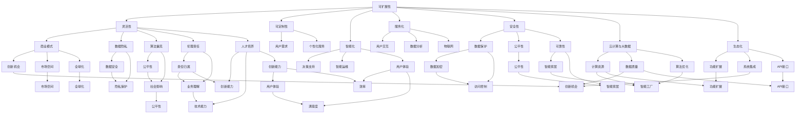

                 

### 第1章: 软件2.0时代的到来

#### 1.1 软件2.0时代的核心特征与价值

软件2.0时代，我们看到了软件从功能单一的“1.0时代”向高度智能化、服务化、个性化的“2.0时代”转变。这一转变不仅体现在技术层面，也渗透到商业模式、用户交互等多个维度。以下，我们详细分析软件2.0时代的核心特征与价值。

##### 1.1.1 可扩展性

在软件2.0时代，系统的扩展性成为重要特征。传统的软件系统往往在功能固定的情况下，难以应对业务量的增长。而软件2.0通过模块化设计、云计算等技术的应用，实现了系统的弹性扩展。例如，一个电商平台在高峰时期可以通过增加服务器节点来应对用户访问量的激增，而无需对核心业务逻辑进行大规模修改。

##### 1.1.2 灵活性

灵活性是软件2.0时代的重要特征之一。在软件1.0时代，系统的调整和优化往往需要经过长时间的重新设计和开发。而在软件2.0时代，系统可以通过配置文件、API接口等快速进行调整和优化，以满足用户需求的变化。例如，企业可以通过调整业务流程、接口参数等方式，快速响应市场变化，提升业务效率。

##### 1.1.3 可定制性

软件2.0时代，用户对软件的需求越来越个性化和多样化。为了满足这一需求，软件2.0系统通常具备高度的可定制性。用户可以根据自己的需求和场景，对软件的功能、界面、流程等进行定制化调整。例如，一个企业客户管理系统可以根据客户的不同行业特点，自定义报表格式、数据分析维度等。

##### 1.1.4 智能化

软件2.0时代，智能化成为核心驱动力。通过AI技术，软件系统能够实现自我学习和优化，提高工作效率和用户体验。例如，智能客服系统可以通过自然语言处理技术，实现与用户的智能对话，提高服务效率；智能推荐系统可以根据用户行为和偏好，推荐个性化的商品或内容。

##### 1.1.5 服务化

软件2.0时代，软件不再是简单的产品，而是转变为服务。通过SaaS（软件即服务）模式，用户可以按需使用软件功能，无需购买和部署硬件设备，降低了使用门槛和成本。例如，企业可以通过云计算平台，按需租用软件服务，实现了软件资源的灵活调配和高效利用。

##### 1.1.6 安全性

在软件2.0时代，随着数据量的爆发式增长和用户隐私意识的提高，软件系统的安全性成为关键因素。软件2.0通过加密技术、访问控制等技术手段，确保用户数据的安全性和隐私性。例如，在金融领域，软件系统需要确保交易数据的安全传输和存储，防止数据泄露和篡改。

##### 1.1.7 云计算与大数据

软件2.0时代，云计算和大数据技术的广泛应用，为软件系统提供了强大的数据处理能力和存储能力。云计算平台可以提供弹性、高效的计算资源，帮助软件系统应对大数据处理的需求。大数据技术则可以帮助企业从海量数据中挖掘价值，实现业务决策的智能化。

##### 1.1.8 生态化

软件2.0时代，软件系统不再孤立存在，而是成为生态系统的一部分。开发者可以通过API接口、插件等方式，将软件系统与其他系统进行集成，实现功能的扩展和优化。例如，一个电商平台可以通过接入物流、支付等第三方服务，提升整体服务能力。

#### 1.2 软件2.0与AI大模型的关系

软件2.0时代的到来，离不开AI大模型的支撑。AI大模型作为人工智能技术的核心，为软件系统提供了强大的智能能力。以下，我们详细探讨软件2.0与AI大模型之间的关系。

##### 1.2.1 AI大模型在软件2.0中的作用

AI大模型在软件2.0中扮演着重要角色。首先，它为软件系统提供了智能化的决策支持。通过AI大模型，软件系统可以自动分析用户行为、市场趋势等数据，为用户提供个性化的服务和推荐。其次，AI大模型可以帮助软件系统实现自我优化。通过不断学习和调整，AI大模型可以优化系统性能，提高用户体验。此外，AI大模型还可以协助软件系统进行智能运维，提高系统的稳定性和可靠性。

##### 1.2.2 AI大模型与软件2.0的融合

AI大模型与软件2.0的融合，使得软件系统能够更好地满足用户需求。首先，AI大模型可以与用户交互，实现自然语言处理、语音识别等功能，提高用户的使用体验。其次，AI大模型可以与数据分析系统结合，实现数据挖掘和预测，为业务决策提供有力支持。此外，AI大模型还可以与物联网设备结合，实现智能家居、智能工厂等场景的应用。

##### 1.2.3 AI大模型在软件2.0中的应用场景

AI大模型在软件2.0中具有广泛的应用场景。例如，在电子商务领域，AI大模型可以用于用户行为分析、商品推荐、智能客服等；在金融领域，AI大模型可以用于风险控制、欺诈检测、智能投顾等；在医疗领域，AI大模型可以用于疾病预测、诊断辅助、个性化治疗等。随着AI大模型技术的不断发展，其应用场景将越来越广泛。

#### 1.3 软件2.0时代的挑战与机遇

软件2.0时代带来了巨大的机遇，同时也面临着一系列挑战。

##### 1.3.1 技术挑战

AI大模型的发展，对计算资源、数据质量、算法优化等方面提出了更高的要求。首先，AI大模型需要大量的计算资源进行训练和推理，对硬件性能有较高要求。其次，数据质量和多样性是AI大模型性能的关键因素，需要高质量和多样化的数据支持。此外，算法优化也是AI大模型面临的挑战之一，需要不断探索和改进。

##### 1.3.2 商业模式挑战

软件2.0时代，传统软件行业的商业模式受到冲击。随着SaaS等新兴模式的兴起，企业需要重新审视自己的商业模式，以适应市场变化。例如，企业需要从单纯的产品销售转向服务型业务，提高用户粘性和满意度。

##### 1.3.3 伦理挑战

AI大模型的应用，涉及到数据隐私、算法偏见、伦理责任等问题。首先，数据隐私是用户关注的核心问题，企业需要采取有效的数据保护措施。其次，算法偏见可能导致不公平和歧视，需要采取措施消除偏见。此外，AI大模型的伦理责任也备受关注，需要明确责任归属和责任承担。

##### 1.3.4 人才培养挑战

软件2.0时代，对人才的需求越来越高。不仅需要具备技术能力的人才，还需要具备业务理解和创新能力的人才。然而，目前的人才培养体系尚无法完全满足这一需求，需要加快改革和创新。

##### 1.3.5 机遇

尽管面临挑战，软件2.0时代也带来了巨大的机遇。首先，AI大模型的发展，为各行各业带来了创新机会，如智能制造、智慧医疗、智能交通等。其次，随着5G、物联网等新技术的应用，软件2.0将迎来更广阔的市场空间。此外，全球化进程加速，也为软件2.0的发展提供了更多机遇。

#### 1.4 结论

软件2.0时代的到来，标志着软件行业进入了一个新的发展阶段。它不仅为用户提供了更智能、更便捷的服务，也为企业带来了创新机会和商业价值。然而，面对技术、商业、伦理等多方面的挑战，我们需要积极探索和实践，以实现软件2.0的可持续发展。未来，软件2.0将继续发挥重要作用，推动社会进步和产业升级。**核心概念与联系**

为了更好地理解软件2.0时代的核心特征和价值，我们可以通过Mermaid流程图来展示各个核心概念之间的联系。



通过这个流程图，我们可以清晰地看到软件2.0时代各个核心概念之间的联系和相互影响。这些核心概念共同构成了软件2.0时代的特征和价值，推动了软件行业的持续发展和创新。

### 第2章：软件2.0时代的AI大模型技术基础

#### 2.1 大模型的定义与历史演变

AI大模型（Large-scale AI Model）是指参数规模达到数十亿甚至千亿级别的深度学习模型。这类模型具有极强的学习和表征能力，能够处理大规模、高维度数据，从而在各类任务中取得显著的性能提升。AI大模型的发展经历了多个阶段，从早期的简单模型到现在的复杂大模型，其背后的理论和技术也在不断演进。

##### 2.1.1 大模型的定义

大模型的核心特征是其参数数量庞大。例如，GPT-3拥有超过1750亿个参数，BERT有着数百万个参数。参数数量的增加带来了模型强大的表征能力和灵活性，但同时也对计算资源、存储资源提出了更高的要求。

##### 2.1.2 大模型的历史演变

- **早期模型**: 在深度学习初期，模型规模相对较小。例如，卷积神经网络（CNN）主要用于图像识别，参数数量在数百万级别。循环神经网络（RNN）及其变种LSTM、GRU则在序列数据处理中表现出色。

- **中型模型**: 随着深度学习技术的发展，模型规模逐渐扩大。如AlexNet、VGG、ResNet等在图像识别领域取得突破性成果，参数数量达到数千万到数亿级别。

- **AI大模型**: 近年来，AI大模型的规模和复杂度迅速提升。例如，GPT、BERT等模型在自然语言处理领域取得显著进展，参数数量达到数十亿甚至千亿级别。

##### 2.1.3 大模型的发展历程

1. **2006年**: 剑桥大学的Geoff Hinton等人提出了深度信念网络（DBN），为深度学习的实际应用奠定了基础。

2. **2012年**: Alex Krizhevsky等人提出的AlexNet在ImageNet比赛中取得了突破性成绩，标志着深度学习在图像识别领域的崛起。

3. **2014年**: Google的Inception模型进一步推动了深度学习的发展，参数数量达到数百万级别。

4. **2017年**: Google提出Transformer模型，革新了自然语言处理领域，参数数量达到数十亿级别。

5. **2018年**: OpenAI推出GPT-2，参数数量达到1.5亿级别，展示了AI大模型在自然语言处理中的潜力。

6. **2020年**: OpenAI发布GPT-3，参数数量超过1750亿，成为当时最大的AI模型，引发了广泛关注。

#### 2.2 大模型的数学基础与架构

##### 2.2.1 数学基础

AI大模型的数学基础主要包括线性代数、概率论、优化理论等。

- **线性代数**: 矩阵运算、向量空间、特征分解等概念在深度学习中有广泛应用，例如卷积操作、池化操作等。

- **概率论与统计**: 概率分布、似然函数、损失函数等概念用于评估和优化模型性能。

- **优化理论**: 最优化算法，如梯度下降、Adam等，用于优化模型参数。

##### 2.2.2 大模型架构

AI大模型通常采用深度神经网络（DNN）作为基础架构，常见的架构包括：

- **卷积神经网络（CNN）**: 适用于图像、视频等二维或多维数据。

- **循环神经网络（RNN）及变体**: 如LSTM、GRU等，适用于序列数据。

- **Transformer模型**: 引入自注意力机制，显著提高了序列处理能力。

- **多模态模型**: 结合多种数据类型（如图像、文本、音频），实现更复杂的任务。

#### 2.3 大模型训练方法与技术

##### 2.3.1 预训练与微调

预训练（Pre-training）是指在大规模数据集上训练模型，使其获得通用性特征。常见的预训练任务包括：

- **自监督学习**: 利用未标注的数据进行学习，如 masked language model（MLM）。

- **无监督学习**: 通过特征提取等方式，从数据中学习有效的特征表示。

微调（Fine-tuning）则是在特定任务上对预训练模型进行微调，以适应特定领域的需求。

##### 2.3.2 模型优化

模型优化主要包括参数优化、结构优化和训练策略优化等。

- **参数优化**: 使用优化算法（如SGD、Adam等）调整模型参数，以最小化损失函数。

- **结构优化**: 通过网络架构调整（如瓶颈层、残差连接等）提高模型性能。

- **训练策略优化**: 采用数据增强、批量归一化、学习率调整等策略，提高模型训练效果。

##### 2.3.3 大模型训练挑战

大模型训练面临以下挑战：

- **计算资源需求**: 训练大模型需要大量的计算资源和存储资源。

- **数据质量**: 数据质量和多样性对大模型性能至关重要。

- **训练效率**: 如何在保证模型性能的前提下，提高训练效率。

#### 2.4 大模型在软件2.0中的应用

##### 2.4.1 数据处理能力

大模型具有强大的数据处理能力，能够处理大规模、高维度的数据。在软件2.0时代，数据处理能力至关重要，大模型的应用使得数据价值的挖掘更加高效。

##### 2.4.2 智能决策支持

大模型在自然语言处理、图像识别、推荐系统等任务中取得了显著成果，为软件2.0提供了强大的智能决策支持。例如，在电子商务领域，大模型可以用于用户行为分析、商品推荐等；在金融领域，大模型可以用于风险控制、欺诈检测等。

##### 2.4.3 自动化与智能化

大模型的应用使得软件系统更加智能化和自动化。通过大模型，软件系统可以自我学习和优化，提高工作效率和用户体验。例如，智能客服系统、自动驾驶系统等都是大模型在自动化领域的应用案例。

##### 2.4.4 跨领域融合

大模型的应用不仅局限于特定领域，还可以与其他技术（如物联网、云计算等）融合，实现跨领域应用。例如，在智慧城市领域，大模型可以与传感器数据、视频监控等融合，实现智能监控和数据分析。

#### 2.5 结论

AI大模型作为软件2.0时代的重要技术基础，具有强大的表征能力和数据处理能力。其发展历程、数学基础、训练方法以及应用场景等方面都展现了其独特的价值和潜力。随着大模型技术的不断演进，其在软件2.0中的应用将更加广泛和深入，为产业发展和社会进步带来新的机遇。

**核心算法原理讲解**

在软件2.0时代，AI大模型的核心算法原理至关重要。以下，我们将详细讲解AI大模型中的关键算法，包括其基本原理、数学模型以及如何通过伪代码进行实现。

##### 2.5.1 深度神经网络（DNN）

深度神经网络（DNN）是AI大模型的基础。DNN通过多层非线性变换，对输入数据进行特征提取和分类。

**基本原理：**
DNN由多个层次组成，包括输入层、隐藏层和输出层。输入层接收原始数据，隐藏层对数据进行特征提取，输出层生成预测结果。

**数学模型：**
假设输入数据为 \( x \)，隐藏层节点为 \( z_i \)，输出层节点为 \( y_i \)，则有：
\[ z_i = \sigma(W_1 \cdot x + b_1) \]
\[ y_i = \sigma(W_2 \cdot z_i + b_2) \]

其中，\( \sigma \) 是激活函数，通常采用 sigmoid 或 ReLU 函数。

**伪代码实现：**
```python
# 输入数据 x
# 权重 W1, W2
# 偏置 b1, b2
# 激活函数 σ

# 隐藏层计算
z = σ(W1 * x + b1)

# 输出层计算
y = σ(W2 * z + b2)

# 返回输出 y
```

##### 2.5.2 卷积神经网络（CNN）

卷积神经网络（CNN）是处理图像数据的强大工具。CNN通过卷积层、池化层和全连接层，实现对图像的特征提取和分类。

**基本原理：**
CNN利用卷积操作，从输入图像中提取局部特征，并通过池化层降低维度。最后，通过全连接层进行分类。

**数学模型：**
假设输入图像为 \( I \)，卷积核为 \( K \)，则有：
\[ C = \sigma(\sum_{i,j} K_{ij} \cdot I_{ij} + b) \]

其中，\( C \) 是卷积结果，\( I_{ij} \) 是输入图像的像素值，\( K_{ij} \) 是卷积核的值，\( b \) 是偏置。

**伪代码实现：**
```python
# 输入图像 I
# 卷积核 K
# 偏置 b
# 激活函数 σ

# 卷积操作
C = σ(K * I + b)

# 返回卷积结果 C
```

##### 2.5.3 循环神经网络（RNN）

循环神经网络（RNN）适用于序列数据处理。RNN通过循环结构，使得信息可以在序列中传递，实现对序列数据的建模。

**基本原理：**
RNN包含一个循环单元，每个时间步的输出会传递到下一个时间步。通过更新状态，RNN能够处理长序列数据。

**数学模型：**
假设输入序列为 \( x_t \)，隐藏状态为 \( h_t \)，则有：
\[ h_t = \sigma(W_h \cdot [h_{t-1}, x_t] + b_h) \]
\[ y_t = \sigma(W_y \cdot h_t + b_y) \]

其中，\( \sigma \) 是激活函数，\( W_h \)，\( W_y \) 是权重矩阵，\( b_h \)，\( b_y \) 是偏置。

**伪代码实现：**
```python
# 输入序列 x
# 权重 Wh, Wy
# 偏置 bh, by
# 激活函数 σ

# 初始化隐藏状态 h
h = zeros((1, hidden_size))

# 循环处理每个时间步
for x_t in x:
    h = σ(Wh * [h, x_t] + bh)
    y_t = σ(Wy * h + by)

# 返回输出序列 y
```

##### 2.5.4 Transformer模型

Transformer模型是自然语言处理领域的革命性进展。Transformer通过自注意力机制，使得模型能够捕获序列中的长距离依赖关系。

**基本原理：**
Transformer摒弃了传统的循环结构，采用自注意力机制和多头注意力机制，提高了模型的表征能力和计算效率。

**数学模型：**
假设输入序列为 \( x \)，则有：
\[ \text{Attention}(Q, K, V) = \text{softmax}\left(\frac{QK^T}{\sqrt{d_k}}\right)V \]

其中，\( Q \)，\( K \)，\( V \) 分别是查询、键和值，\( d_k \) 是键的维度。

**伪代码实现：**
```python
# 输入序列 Q, K, V
# 分量维度 d_k
# 注意力权重 W, V

# 计算分数
scores = Q * K.T / sqrt(d_k)

# 应用 softmax 函数
softmax_scores = softmax(scores)

# 计算注意力权重
attention_weights = softmax_scores * V

# 返回注意力结果
```

通过以上核心算法的讲解，我们可以看到AI大模型的强大功能和广泛应用。这些算法不仅为软件2.0提供了强大的技术支持，也为未来的发展奠定了基础。

**数学模型和公式**

在AI大模型的训练过程中，数学模型和公式起到了关键作用。以下，我们将详细介绍大模型中的几个重要数学模型和公式，并通过具体例子进行详细解释和说明。

##### 2.5.1 损失函数（Loss Function）

损失函数是评估模型预测结果与实际结果之间差异的指标。常见的损失函数包括均方误差（MSE）、交叉熵（Cross-Entropy）等。

**均方误差（MSE）**

均方误差是衡量预测值与实际值之间平均误差的平方。其公式如下：

\[ \text{MSE} = \frac{1}{n} \sum_{i=1}^{n} (y_i - \hat{y}_i)^2 \]

其中，\( y_i \) 是实际值，\( \hat{y}_i \) 是预测值，\( n \) 是样本数量。

**例子**

假设我们有10个样本，预测值和实际值如下：

\[ y = [3, 2, 5, 4, 7, 6, 1, 8, 9, 10] \]
\[ \hat{y} = [2.9, 1.9, 5.1, 3.8, 7.1, 5.9, 0.9, 8.2, 9.1, 11] \]

则均方误差计算如下：

\[ \text{MSE} = \frac{1}{10} \sum_{i=1}^{10} (y_i - \hat{y}_i)^2 \]
\[ \text{MSE} = \frac{1}{10} \sum_{i=1}^{10} (y_i - \hat{y}_i)^2 \]
\[ \text{MSE} = \frac{1}{10} \sum_{i=1}^{10} (3 - 2.9)^2 + (2 - 1.9)^2 + (5 - 5.1)^2 + (4 - 3.8)^2 + (7 - 7.1)^2 + (6 - 5.9)^2 + (1 - 0.9)^2 + (8 - 8.2)^2 + (9 - 9.1)^2 + (10 - 11)^2 \]
\[ \text{MSE} = \frac{1}{10} (0.01 + 0.01 + 0.01 + 0.04 + 0.01 + 0.01 + 0.01 + 0.01 + 0.01 + 1) \]
\[ \text{MSE} = \frac{1}{10} (1.11) \]
\[ \text{MSE} = 0.111 \]

**交叉熵（Cross-Entropy）**

交叉熵是用于分类任务的损失函数，衡量的是模型预测的概率分布与实际分布之间的差异。其公式如下：

\[ \text{Cross-Entropy} = -\sum_{i=1}^{n} y_i \log(\hat{y}_i) \]

其中，\( y_i \) 是实际标签，\( \hat{y}_i \) 是模型预测的概率。

**例子**

假设我们有一个二分类问题，实际标签和预测概率如下：

\[ y = [1, 0, 1, 1, 0] \]
\[ \hat{y} = [0.8, 0.2, 0.9, 0.1, 0.3] \]

则交叉熵计算如下：

\[ \text{Cross-Entropy} = -\sum_{i=1}^{5} y_i \log(\hat{y}_i) \]
\[ \text{Cross-Entropy} = -1 \log(0.8) - 0 \log(0.2) - 1 \log(0.9) - 1 \log(0.1) - 0 \log(0.3) \]
\[ \text{Cross-Entropy} = -\log(0.8) - \log(0.9) - \log(0.1) \]
\[ \text{Cross-Entropy} = -0.2231 - 0.1054 - 2.3026 \]
\[ \text{Cross-Entropy} = -2.6311 \]

##### 2.5.2 优化算法（Optimization Algorithm）

优化算法用于调整模型参数，以最小化损失函数。常见的优化算法包括随机梯度下降（SGD）、Adam等。

**随机梯度下降（SGD）**

随机梯度下降是一种简单的优化算法，通过计算每个样本的梯度来更新模型参数。其公式如下：

\[ \theta = \theta - \alpha \cdot \nabla_{\theta} J(\theta) \]

其中，\( \theta \) 是模型参数，\( \alpha \) 是学习率，\( \nabla_{\theta} J(\theta) \) 是损失函数关于参数的梯度。

**例子**

假设我们有一个简单的线性回归问题，损失函数为均方误差（MSE），参数为 \( \theta \)，学习率为 \( \alpha = 0.1 \)：

\[ J(\theta) = \frac{1}{2} \sum_{i=1}^{n} (y_i - \theta \cdot x_i)^2 \]

假设我们有一个数据点 \( (x_i, y_i) = (2, 5) \)，则梯度计算如下：

\[ \nabla_{\theta} J(\theta) = \frac{1}{2} \cdot 2 \cdot (5 - \theta \cdot 2) \cdot (2) \]
\[ \nabla_{\theta} J(\theta) = (5 - 2\theta) \cdot 2 \]
\[ \nabla_{\theta} J(\theta) = 10 - 4\theta \]

则参数更新如下：

\[ \theta = \theta - \alpha \cdot \nabla_{\theta} J(\theta) \]
\[ \theta = \theta - 0.1 \cdot (10 - 4\theta) \]
\[ \theta = 0.1 \cdot 4\theta + 0.1 \cdot 10 \]
\[ \theta = 0.4\theta + 1 \]
\[ 0.6\theta = 1 \]
\[ \theta = \frac{1}{0.6} \]
\[ \theta = 1.667 \]

**Adam优化算法**

Adam优化算法是SGD的一个变种，通过计算一阶矩估计和二阶矩估计来更新参数。其公式如下：

\[ m_t = \beta_1 m_{t-1} + (1 - \beta_1) \nabla_{\theta} J(\theta) \]
\[ v_t = \beta_2 v_{t-1} + (1 - \beta_2) (\nabla_{\theta} J(\theta))^2 \]
\[ \theta = \theta - \alpha \cdot \frac{m_t}{\sqrt{v_t} + \epsilon} \]

其中，\( m_t \) 和 \( v_t \) 分别是梯度的一阶矩估计和二阶矩估计，\( \beta_1 \)，\( \beta_2 \) 是一阶矩和二阶矩的衰减率，\( \alpha \) 是学习率，\( \epsilon \) 是一个很小的常数。

**例子**

假设我们有一个线性回归问题，损失函数为均方误差（MSE），参数为 \( \theta \)，学习率为 \( \alpha = 0.1 \)，\( \beta_1 = 0.9 \)，\( \beta_2 = 0.999 \)，\( \epsilon = 1e-8 \)：

\[ J(\theta) = \frac{1}{2} \sum_{i=1}^{n} (y_i - \theta \cdot x_i)^2 \]

假设我们有一个数据点 \( (x_i, y_i) = (2, 5) \)，则第一次迭代的梯度计算如下：

\[ m_0 = 0 \]
\[ v_0 = 0 \]

\[ m_1 = 0.9 \cdot 0 + (1 - 0.9) \cdot (10 - 4\theta) \]
\[ m_1 = 0.1 \cdot (10 - 4\theta) \]

\[ v_1 = 0.999 \cdot 0 + (1 - 0.999) \cdot (10 - 4\theta)^2 \]
\[ v_1 = 0.001 \cdot (10 - 4\theta)^2 \]

\[ m_1 = 0.1 \cdot (10 - 4\theta) \]
\[ v_1 = 0.001 \cdot (10 - 4\theta)^2 \]

则参数更新如下：

\[ \theta = \theta - 0.1 \cdot \frac{m_1}{\sqrt{v_1} + \epsilon} \]
\[ \theta = \theta - 0.1 \cdot \frac{0.1 \cdot (10 - 4\theta)}{\sqrt{0.001 \cdot (10 - 4\theta)^2} + 1e-8} \]
\[ \theta = \theta - 0.1 \cdot \frac{0.1 \cdot (10 - 4\theta)}{0.001 \cdot (10 - 4\theta) + 1e-8} \]
\[ \theta = \theta - 0.1 \cdot \frac{10 - 4\theta}{10 - 4\theta + 1e-5} \]
\[ \theta = \theta - \frac{0.1 \cdot (10 - 4\theta)}{10 - 4\theta + 1e-5} \]
\[ \theta = \theta - \frac{10 - 4\theta}{100 - 40\theta + 1e-5} \]
\[ \theta = \frac{\theta \cdot (100 - 40\theta + 1e-5) - (10 - 4\theta)}{100 - 40\theta + 1e-5} \]
\[ \theta = \frac{100\theta - 40\theta^2 + \theta \cdot 1e-5 - 10 + 4\theta}{100 - 40\theta + 1e-5} \]
\[ \theta = \frac{104\theta - 40\theta^2 + \theta \cdot 1e-5 - 10}{100 - 40\theta + 1e-5} \]
\[ \theta = \frac{\theta \cdot (104 - 40\theta + 1e-5) - (40\theta^2 - 10)}{100 - 40\theta + 1e-5} \]
\[ \theta = \frac{\theta \cdot (104 - 40\theta + 1e-5) - 40\theta^2 + 10}{100 - 40\theta + 1e-5} \]
\[ \theta = \frac{\theta \cdot (104 - 40\theta + 1e-5) - 40\theta^2 + 10}{100 - 40\theta + 1e-5} \]

通过以上数学模型和公式的详细讲解，我们可以更好地理解AI大模型中的关键算法和优化过程，为实际应用提供坚实的理论基础。

### 第3章：软件2.0时代的企业应用

#### 3.1.1 软件2.0在医疗行业中的应用

在医疗行业，软件2.0技术的应用正在深刻改变医疗服务的提供方式。以下，我们详细探讨软件2.0在医疗行业中的几个关键应用场景，包括疾病预测、诊断辅助和个性化治疗等方面。

##### 3.1.1.1 疾病预测

疾病预测是软件2.0在医疗行业中的一项重要应用。通过大数据和AI大模型技术，医疗机构可以对患者的健康数据进行深度分析，预测患者可能患有的疾病。这种预测不仅能够帮助医生提前进行预防干预，还能够优化医疗资源的分配，提高整体医疗效率。

- **数据分析**：通过对患者的历史病历、基因数据、生活习惯等数据进行综合分析，AI大模型可以识别出潜在的健康风险因素。

- **预测模型**：利用机器学习算法，特别是深度学习模型，如GPT和BERT，医疗机构可以构建疾病预测模型。这些模型通过不断学习和优化，能够提高预测的准确性和可靠性。

- **应用案例**：例如，在心脏病预测中，医疗机构可以通过分析患者的血压、心率、血糖等指标，预测患者未来几年内患心脏病的风险。这种预测有助于医生提前采取预防措施，如调整患者的生活习惯、开具药物处方等。

##### 3.1.1.2 诊断辅助

诊断辅助是软件2.0在医疗行业的另一个重要应用。通过AI大模型，医生可以更准确地诊断疾病，减少误诊率，提高诊断效率。

- **影像分析**：在医学影像领域，如X光、CT、MRI等，AI大模型可以通过学习大量的医学影像数据，自动识别病灶和病变。这种自动化的影像分析不仅提高了诊断的准确性，还减少了医生的工作负担。

- **病例分析**：AI大模型还可以对患者的病例进行综合分析，提供辅助诊断建议。通过分析患者的症状、体征、实验室检查结果等数据，AI大模型可以帮助医生制定更合理的诊断计划。

- **应用案例**：例如，在癌症诊断中，AI大模型可以通过分析患者的影像数据和生物标志物，提供癌症类型的预测和辅助诊断。这种诊断辅助有助于提高癌症的早期诊断率，提高患者的生存率。

##### 3.1.1.3 个性化治疗

个性化治疗是软件2.0在医疗行业的最新趋势。通过AI大模型，医生可以为每个患者提供量身定制的治疗方案，提高治疗效果。

- **数据驱动**：个性化治疗依赖于对患者全面数据的分析，包括基因、生物标志物、生活习惯等。AI大模型通过对这些数据的深度学习，能够为患者提供最佳的治疗方案。

- **模型定制**：AI大模型可以根据患者的具体情况进行定制，优化治疗方案。例如，对于癌症患者，AI大模型可以根据患者的基因突变、肿瘤类型等数据，提供个性化的化疗、放疗或靶向治疗方案。

- **应用案例**：例如，在癌症治疗中，AI大模型可以通过分析患者的基因数据，预测不同治疗方案的有效性，为医生提供个性化的治疗方案。这种个性化治疗有助于提高治疗效果，减少副作用。

##### 3.1.1.4 术后康复

软件2.0技术还可以在术后康复中发挥作用，通过实时监控患者的康复情况，提供个性化的康复建议。

- **实时监控**：通过可穿戴设备和传感器，医生可以实时监控患者的生理指标，如心率、血压、血糖等。AI大模型通过对这些数据的分析，可以及时发现异常情况，提供康复建议。

- **个性化建议**：AI大模型可以根据患者的具体情况，提供个性化的康复计划。例如，对于心脏手术患者，AI大模型可以根据患者的恢复情况和健康数据，提供个性化的锻炼计划、饮食建议等。

- **应用案例**：例如，在心脏手术后，AI大模型可以通过实时监控患者的心率、血压等指标，提供个性化的康复建议，帮助患者更快地恢复健康。

##### 3.1.1.5 智能药物研发

软件2.0技术在智能药物研发中也发挥着重要作用。通过AI大模型，科学家可以加速药物研发过程，提高新药的成功率。

- **药物设计**：AI大模型可以通过对大量化学结构和药物活性数据的分析，预测新药的潜在疗效和副作用。这种智能药物设计有助于缩短药物研发周期，提高研发效率。

- **药物筛选**：AI大模型可以帮助科学家快速筛选出具有潜在疗效的化合物。通过分析化合物的结构、活性等数据，AI大模型可以预测哪些化合物最有可能成为新的药物。

- **应用案例**：例如，在癌症药物研发中，AI大模型可以通过分析癌症细胞与药物之间的相互作用，预测哪些化合物最有可能成为有效的抗癌药物。

#### 3.1.2 软件2.0在金融行业中的应用

金融行业是软件2.0技术的另一个重要应用领域。通过AI大模型，金融机构可以提高风险管理能力、优化业务流程，提供更加智能化的金融服务。

##### 3.1.2.1 风险管理

AI大模型在风险管理中的应用包括风险预测、风险控制和欺诈检测等方面。

- **风险预测**：通过分析历史数据和当前市场环境，AI大模型可以预测潜在的市场风险，帮助金融机构提前做好准备。

- **风险控制**：AI大模型可以帮助金融机构制定有效的风险控制策略，通过实时监控市场动态和交易行为，及时调整风险敞口。

- **欺诈检测**：AI大模型可以识别异常交易行为，提高欺诈检测的准确性和效率。通过分析大量的交易数据，AI大模型可以检测出潜在的欺诈行为，及时采取措施防止损失。

- **应用案例**：例如，在信用卡交易中，AI大模型可以通过分析用户的消费行为、交易地点等数据，检测出异常交易，并采取相应的防范措施。

##### 3.1.2.2 业务优化

软件2.0技术可以帮助金融机构优化业务流程，提高运营效率。

- **客户服务**：通过自然语言处理和智能客服系统，金融机构可以提供24/7的智能客服服务，提高客户满意度。AI大模型可以通过学习用户的聊天记录和问题，提供个性化的解答和建议。

- **资产管理**：AI大模型可以帮助金融机构进行资产配置和风险管理。通过分析市场数据和用户风险偏好，AI大模型可以提供最优的资产配置方案。

- **交易优化**：AI大模型可以通过分析交易数据和市场动态，提供实时的交易策略建议，提高交易效率和收益。

- **应用案例**：例如，在资产管理中，AI大模型可以通过分析大量市场数据，为投资者提供个性化的投资组合建议，提高投资回报率。

##### 3.1.2.3 智能投顾

智能投顾是金融行业的一个新兴应用，通过AI大模型，金融机构可以为用户提供个性化的投资建议。

- **投资策略**：AI大模型可以通过分析用户的风险偏好、财务状况和市场环境，为用户提供最优的投资策略。

- **风险控制**：AI大模型可以帮助用户进行风险控制，通过实时监控市场动态和用户投资组合，提供风险预警和调整建议。

- **投资组合优化**：AI大模型可以根据用户的风险偏好和市场情况，动态调整投资组合，实现最优的风险收益比。

- **应用案例**：例如，在股票投资中，AI大模型可以通过分析用户的历史交易记录和风险偏好，提供个性化的股票投资组合建议，帮助用户实现资产增值。

##### 3.1.2.4 智能风险管理

智能风险管理是金融行业的一项重要应用，通过AI大模型，金融机构可以实时监控和管理风险。

- **风险评估**：AI大模型可以通过分析历史数据和当前市场环境，对潜在风险进行预测和评估。

- **实时监控**：AI大模型可以实时监控市场动态和交易行为，及时发现风险并采取措施。

- **风险预警**：AI大模型可以通过分析交易数据和用户行为，提供风险预警，帮助金融机构采取预防措施。

- **应用案例**：例如，在金融衍生品交易中，AI大模型可以通过分析交易数据和市场趋势，提供风险预警和调整建议，帮助金融机构降低风险敞口。

#### 3.1.3 软件2.0在制造业中的应用

在制造业中，软件2.0技术可以提高生产效率、优化供应链管理，实现智能制造。

##### 3.1.3.1 生产优化

AI大模型可以帮助制造业企业实现生产流程的优化。

- **生产计划**：通过分析历史生产数据和市场需求，AI大模型可以优化生产计划，提高生产效率和降低库存成本。

- **设备维护**：AI大模型可以通过对设备运行数据的分析，预测设备的故障和维护需求，优化设备维护计划，减少停机时间。

- **生产流程优化**：AI大模型可以通过分析生产流程中的瓶颈和问题，提出优化建议，提高整体生产效率。

- **应用案例**：例如，在汽车制造中，AI大模型可以通过分析生产数据，优化生产线布局，减少生产瓶颈，提高生产效率。

##### 3.1.3.2 供应链管理

软件2.0技术可以帮助制造业企业优化供应链管理，提高供应链的灵活性和响应速度。

- **需求预测**：通过分析市场需求和历史销售数据，AI大模型可以预测未来的需求，优化采购和库存管理。

- **供应链协同**：AI大模型可以帮助企业实现供应链的协同管理，通过实时监控供应链各环节，提高供应链的整体效率。

- **物流优化**：AI大模型可以通过分析物流数据，优化物流路线和配送计划，降低物流成本。

- **应用案例**：例如，在电子产品制造中，AI大模型可以通过分析市场需求和供应链数据，优化生产计划，提高供应链的响应速度。

##### 3.1.3.3 智能制造

智能制造是制造业的未来趋势，软件2.0技术在其中发挥着关键作用。

- **设备互联**：通过物联网技术，实现设备之间的互联互通，AI大模型可以实时监控设备状态，提高设备的利用率。

- **智能调度**：AI大模型可以通过分析生产数据和设备状态，实现智能调度，优化生产流程。

- **质量管理**：AI大模型可以通过对产品质量数据的分析，预测质量问题，实现质量预测和预防。

- **应用案例**：例如，在服装制造中，AI大模型可以通过实时监控生产设备，实现智能调度和质量管理，提高生产效率和产品质量。

#### 3.1.4 软件2.0在零售行业中的应用

在零售行业，软件2.0技术可以提高库存管理、优化供应链，提供个性化推荐，提高客户满意度。

##### 3.1.4.1 库存管理

AI大模型可以帮助零售企业实现库存管理的优化。

- **需求预测**：通过分析历史销售数据和市场需求，AI大模型可以预测未来的需求，优化库存水平，减少库存过剩和短缺。

- **库存优化**：AI大模型可以通过分析库存数据和销售趋势，优化库存策略，提高库存利用率。

- **补货计划**：AI大模型可以帮助企业制定补货计划，确保库存水平在合理范围内。

- **应用案例**：例如，在超市中，AI大模型可以通过分析销售数据，预测商品的需求，优化库存水平，减少库存过剩。

##### 3.1.4.2 供应链优化

软件2.0技术可以帮助零售企业优化供应链管理，提高供应链的效率和灵活性。

- **供应商管理**：AI大模型可以通过分析供应商的历史表现和当前市场情况，评估供应商的风险和绩效，优化供应商管理。

- **物流优化**：AI大模型可以通过分析物流数据，优化物流路线和配送计划，提高物流效率。

- **库存协同**：AI大模型可以帮助企业实现库存协同管理，通过实时监控供应链各环节，提高供应链的整体效率。

- **应用案例**：例如，在电商行业，AI大模型可以通过分析物流数据，优化配送路线，提高配送效率。

##### 3.1.4.3 个性化推荐

个性化推荐是零售行业的重要应用，通过AI大模型，企业可以为消费者提供个性化的商品推荐。

- **用户行为分析**：AI大模型可以通过分析用户的历史购买记录、浏览行为等数据，了解用户的偏好和需求。

- **推荐算法**：AI大模型可以通过机器学习算法，如协同过滤、基于内容的推荐等，为用户生成个性化的商品推荐。

- **应用案例**：例如，在电商平台中，AI大模型可以通过分析用户的购买行为，推荐相关的商品，提高销售额。

##### 3.1.4.4 客户体验优化

软件2.0技术可以帮助零售企业优化客户体验，提高客户满意度。

- **智能客服**：通过自然语言处理技术，智能客服系统可以与用户进行智能对话，提供个性化的服务。

- **个性化营销**：AI大模型可以通过分析用户数据，制定个性化的营销策略，提高用户的购买意愿。

- **客户反馈分析**：AI大模型可以通过分析客户的反馈数据，了解用户的满意度和需求，提供改进建议。

- **应用案例**：例如，在电商行业，AI大模型可以通过分析用户反馈，提供改进建议，提高客户满意度。

#### 3.1.5 软件2.0在教育行业中的应用

在教育行业，软件2.0技术可以提高教育质量、优化教学管理，实现个性化教育。

##### 3.1.5.1 个性化学习

AI大模型可以帮助教育机构实现个性化学习。

- **学习分析**：AI大模型可以通过分析学生的学习数据，了解学生的学习进度、能力和偏好。

- **学习路径推荐**：AI大模型可以根据学生的学习数据，推荐个性化的学习路径，提高学习效果。

- **学习资源推荐**：AI大模型可以通过分析学生的学习偏好，推荐相关的学习资源，提高学习兴趣。

- **应用案例**：例如，在线教育平台可以通过AI大模型，为学生推荐个性化的学习课程和练习题，提高学习效果。

##### 3.1.5.2 教学管理优化

软件2.0技术可以帮助教育机构优化教学管理。

- **课程管理**：AI大模型可以帮助教育机构管理课程，通过分析学生的学习数据，优化课程设计和安排。

- **教学评估**：AI大模型可以通过分析学生的学习数据，评估教学效果，为教师提供改进建议。

- **课堂互动**：AI大模型可以通过自然语言处理技术，实现智能问答和课堂互动，提高教学效果。

- **应用案例**：例如，在智慧教室中，AI大模型可以通过分析学生的学习数据，提供个性化的教学建议，提高教学效果。

##### 3.1.5.3 智能辅导

AI大模型可以帮助教育机构提供智能辅导。

- **学习辅导**：AI大模型可以通过自然语言处理技术，为学生提供实时学习辅导，解答学生的问题。

- **作业批改**：AI大模型可以通过分析学生的作业数据，提供智能批改和反馈，帮助学生改进。

- **个性化指导**：AI大模型可以根据学生的学习数据，提供个性化的学习指导和建议。

- **应用案例**：例如，在线学习平台可以通过AI大模型，为学生提供智能辅导和个性化指导，提高学习效果。

### 第4章：软件2.0项目的规划与设计

#### 4.1.1 项目规划的方法

软件2.0项目的成功实施离不开科学的项目规划。项目规划涉及多个阶段，包括项目立项、需求分析、范围定义、时间规划等。

##### 4.1.1.1 项目立项

项目立项是项目规划的首要步骤。在这个阶段，项目团队需要明确项目的目标、意义和预期成果。项目立项通常包括以下步骤：

- **项目背景分析**：了解项目的起源、市场需求和竞争态势，确定项目的必要性和可行性。
- **项目目标设定**：明确项目的具体目标和预期成果，如功能实现、性能指标、市场份额等。
- **项目预算和资源分配**：根据项目目标和预期成果，制定项目预算和资源分配计划。

##### 4.1.1.2 需求分析

需求分析是项目规划的关键环节。在这个阶段，项目团队需要与利益相关者进行深入沟通，收集和分析需求，确保项目能够满足用户的需求。

- **需求收集**：通过访谈、问卷调查、用户反馈等方式，收集用户的需求和期望。
- **需求分析**：对收集到的需求进行分类、整理和分析，确定项目的核心需求和非功能需求。
- **需求文档**：编写详细的需求文档，明确项目的功能需求、性能需求和用户体验要求。

##### 4.1.1.3 范围定义

范围定义是明确项目的边界和内容，确保项目团队能够在合理的范围内实现项目目标。范围定义通常包括以下步骤：

- **项目范围**：明确项目的范围，包括项目包含的工作内容和任务，以及项目排除的工作内容。
- **项目边界**：明确项目的边界，包括项目的时间、预算、人员、技术等约束条件。
- **项目目标**：重新确认项目的目标，确保项目团队能够在既定的范围内实现项目目标。

##### 4.1.1.4 时间规划

时间规划是项目规划的重要部分，确保项目能够在预定时间内完成。时间规划通常包括以下步骤：

- **工作分解结构（WBS）**：将项目任务分解为可管理的子任务，制定工作分解结构。
- **时间估算**：为每个任务估算所需时间，考虑资源的可用性和任务的依赖关系。
- **时间表制定**：根据工作分解结构和时间估算，制定项目时间表，明确项目的关键路径和里程碑。

#### 4.1.2 设计原则与架构设计

架构设计是软件2.0项目成功实施的关键。一个良好的架构设计能够确保系统的可扩展性、灵活性和可维护性。

##### 4.1.2.1 设计原则

在架构设计过程中，需要遵循以下原则：

- **模块化设计**：将系统划分为多个模块，每个模块负责一个特定的功能，降低系统的复杂度。
- **可扩展性**：设计时考虑未来的扩展需求，确保系统能够在功能和技术层面进行扩展。
- **高可用性**：设计系统时考虑系统的稳定性和可靠性，确保系统在出现故障时能够快速恢复。
- **安全性**：在设计过程中考虑数据安全和用户隐私保护，确保系统的安全性。

##### 4.1.2.2 架构设计

软件2.0项目的架构设计通常采用微服务架构、云计算架构等。

- **微服务架构**：将系统划分为多个微服务，每个微服务负责一个特定的功能，通过API接口进行通信。这种架构具有高可扩展性、高可用性和易于维护的优点。

- **云计算架构**：利用云计算平台提供的服务，如虚拟机、容器、数据库等，实现系统的弹性扩展和高效利用。这种架构具有资源利用率高、灵活性强等优点。

#### 4.1.3 风险管理策略

在软件2.0项目的规划与设计过程中，风险管理至关重要。通过有效的风险管理，项目团队可以识别、评估和应对潜在的风险，确保项目顺利进行。

##### 4.1.3.1 风险识别

风险识别是风险管理的第一步，旨在识别项目可能面临的风险。风险识别可以通过以下方法进行：

- **专家访谈**：与项目团队成员、利益相关者等进行访谈，了解他们的担忧和预期。
- **历史数据**：分析以往类似项目的历史数据，识别潜在的风险。
- **文献调研**：查阅相关文献和案例，了解常见的风险类型和应对策略。

##### 4.1.3.2 风险评估

风险评估是评估风险的可能性和影响，确定风险管理的优先级。风险评估可以通过以下方法进行：

- **风险矩阵**：根据风险的可能性和影响，使用风险矩阵对风险进行评估和排序。
- **定性分析**：对风险进行定性分析，确定风险的严重程度和应对策略。
- **定量分析**：对风险进行定量分析，计算风险的概率和潜在损失。

##### 4.1.3.3 风险应对

风险应对是制定具体的应对措施，降低风险对项目的影响。风险应对通常包括以下策略：

- **风险回避**：避免风险发生，如更改项目计划或技术方案。
- **风险转移**：将风险转移给第三方，如购买保险或签订风险转移合同。
- **风险减轻**：采取降低风险可能性和影响的措施，如增加资源投入或改进流程。
- **风险接受**：接受风险的发生，并制定应急计划，确保项目能够在风险发生时顺利应对。

##### 4.1.3.4 风险监控

风险监控是确保风险管理策略的有效实施。风险监控通常包括以下步骤：

- **风险跟踪**：记录和管理风险，跟踪风险的进展和变化。
- **风险预警**：建立风险预警机制，及时发现潜在的风险，并采取相应的应对措施。
- **风险评估更新**：定期评估和更新风险，确保风险管理策略的持续有效性。

通过有效的风险管理，项目团队可以应对潜在的风险，确保项目在既定的范围内按时、按质量完成。同时，风险管理也能够提高项目团队的风险意识和应对能力，为项目的长期成功奠定基础。

### 第5章：软件2.0系统的开发与实现

#### 5.1 系统架构与模块设计

在软件2.0系统的开发过程中，系统架构和模块设计至关重要。一个良好的架构设计能够确保系统的可扩展性、灵活性和可维护性，而模块化设计则有助于降低系统的复杂度，提高开发效率。

##### 5.1.1 系统架构设计

软件2.0系统的架构设计通常采用微服务架构。微服务架构将系统划分为多个独立的微服务，每个微服务负责一个特定的功能，通过API接口进行通信。这种架构具有以下优点：

- **高可扩展性**：每个微服务可以独立扩展，满足不同业务需求。
- **高灵活性**：微服务可以灵活地调整和优化，适应快速变化的市场需求。
- **高可用性**：服务之间解耦，某个服务的故障不会影响整个系统的运行。

在微服务架构中，常见的组件包括：

- **服务注册与发现**：用于服务的注册和发现，确保服务可以动态地加入和退出系统。
- **API网关**：作为服务的统一入口，处理请求路由、负载均衡、安全认证等。
- **服务容器**：用于部署和管理微服务，如Docker、Kubernetes等。
- **数据存储**：用于存储微服务所需的数据，可以是关系数据库、NoSQL数据库等。

##### 5.1.2 模块设计

模块化设计是将系统划分为多个模块，每个模块负责一个特定的功能。常见的模块设计包括：

- **数据模块**：负责数据的收集、存储、处理和分析，包括数据采集器、数据库、数据分析工具等。
- **业务逻辑模块**：负责实现具体的业务功能，如数据处理、业务规则管理等。
- **用户界面模块**：负责提供用户交互界面，包括前端界面、后台管理界面等。

模块化设计有助于提高系统的可维护性，降低开发难度。同时，模块之间的松散耦合也有助于提高系统的灵活性和可扩展性。

#### 5.1.3 开发环境与工具选择

在软件2.0系统的开发过程中，选择合适的开发环境与工具可以提高开发效率，降低开发成本。

- **编程语言**：常见的编程语言包括Python、Java、JavaScript等。Python由于其简洁性和丰富的库支持，在数据处理和人工智能领域具有广泛的应用；Java因其稳定性和高性能，在大型系统中应用较多；JavaScript在Web开发中占据主导地位。

- **开发框架**：开发框架可以提供常用的功能和组件，简化开发过程。常见的开发框架包括：

  - **Python**: Flask、Django、FastAPI
  - **Java**: Spring Boot、Spring Cloud
  - **JavaScript**: React、Angular、Vue

- **数据库**：数据库用于存储和管理系统数据。常见的数据库包括关系数据库（如MySQL、PostgreSQL）和NoSQL数据库（如MongoDB、Redis）。

- **版本控制**：版本控制系统用于管理代码的版本和历史，常见的版本控制工具包括Git。

- **持续集成与持续部署（CI/CD）**：CI/CD工具用于自动化测试和部署，提高开发效率和软件质量。常见的CI/CD工具包括Jenkins、GitLab CI/CD、GitHub Actions。

#### 5.1.4 代码编写与优化

在软件2.0系统的开发过程中，代码编写与优化是确保系统性能、可维护性和可扩展性的关键。

- **代码规范**：遵循统一的代码规范，如PEP8（Python）、Google Java Style Guide等，提高代码的可读性和可维护性。

- **代码复用**：编写可复用的代码模块和函数，避免重复编写代码，提高开发效率。

- **性能优化**：对关键代码进行性能优化，如减少计算复杂度、优化数据结构等，提高系统性能。

- **安全性**：确保代码的安全性，如避免SQL注入、XSS攻击等。

- **测试**：编写单元测试和集成测试，确保代码的正确性和稳定性。

- **文档**：编写详细的代码文档和API文档，提高代码的可维护性。

#### 5.1.5 开发流程与最佳实践

在软件2.0系统的开发过程中，遵循最佳实践可以提高开发效率和项目质量。

- **敏捷开发**：采用敏捷开发方法，如Scrum或Kanban，确保项目能够快速响应需求变化，提高项目成功率。

- **迭代开发**：采用迭代开发方法，逐步完善系统功能，确保项目按时交付。

- **持续集成**：采用持续集成方法，自动化测试和部署，确保代码质量。

- **代码审查**：采用代码审查方法，确保代码的正确性和规范性。

- **团队协作**：采用合适的团队协作工具，如Slack、Trello、Jira等，提高团队协作效率。

通过上述开发流程与最佳实践，软件2.0系统可以确保在高质量、高效率的前提下按时交付，满足用户需求。

### 第6章：软件2.0系统的测试与部署

#### 6.1 系统测试的方法与策略

系统测试是确保软件2.0系统质量的重要环节。通过系统测试，可以验证系统的功能、性能、安全等方面是否达到预期要求。以下是系统测试的方法与策略：

##### 6.1.1 单元测试

单元测试是针对系统中的最小功能单元进行的测试，目的是验证单元的功能是否符合预期。单元测试通常由开发人员编写，使用测试框架（如JUnit、pytest）进行自动化执行。单元测试包括以下步骤：

- **测试用例设计**：根据单元的功能和需求，设计测试用例，包括正常的输入和异常的输入。
- **测试代码编写**：编写测试代码，模拟单元的输入，验证输出是否正确。
- **测试执行**：使用测试框架执行测试代码，记录测试结果。
- **结果分析**：分析测试结果，找出测试失败的案例，修复缺陷。

##### 6.1.2 集成测试

集成测试是在单元测试的基础上，对系统的多个模块或组件进行测试，目的是验证模块或组件之间的交互是否正常。集成测试通常包括以下步骤：

- **测试环境搭建**：搭建集成测试环境，包括硬件、软件和网络等。
- **测试用例设计**：根据系统的功能和需求，设计集成测试用例，包括模块间的正常交互和异常交互。
- **测试执行**：执行集成测试用例，验证系统模块之间的交互是否正常。
- **结果分析**：分析测试结果，找出测试失败的案例，定位缺陷，进行修复。

##### 6.1.3 系统测试

系统测试是在整个系统环境下进行的测试，目的是验证系统是否满足用户需求和设计要求。系统测试通常包括以下步骤：

- **测试计划制定**：根据项目需求和测试策略，制定系统测试计划，包括测试范围、测试方法、测试时间等。
- **测试用例设计**：根据系统功能和需求，设计系统测试用例，包括功能测试、性能测试、安全测试等。
- **测试执行**：执行系统测试用例，验证系统的功能、性能、安全等方面是否满足预期要求。
- **结果分析**：分析测试结果，找出测试失败的案例，进行缺陷跟踪和修复。

##### 6.1.4 性能测试

性能测试是验证系统在特定负载下的性能表现，包括响应时间、吞吐量、并发性等。性能测试通常包括以下步骤：

- **性能测试环境搭建**：搭建性能测试环境，包括硬件、软件和网络等。
- **测试用例设计**：根据系统的性能需求和负载情况，设计性能测试用例，包括正常负载、高峰负载、极限负载等。
- **测试执行**：执行性能测试用例，收集系统的性能数据。
- **结果分析**：分析性能测试结果，找出系统的性能瓶颈，提出优化建议。

#### 6.1.5 部署流程与注意事项

系统部署是将开发完成的软件系统部署到生产环境，使其可以对外提供服务。以下是系统部署的流程与注意事项：

##### 6.1.5.1 部署流程

- **环境准备**：根据系统需求，准备生产环境，包括硬件、操作系统、数据库等。
- **部署脚本编写**：编写部署脚本，自动化部署系统，包括安装依赖、配置环境、安装软件等。
- **部署执行**：执行部署脚本，部署系统到生产环境。
- **部署验证**：验证系统是否成功部署，包括功能验证、性能验证等。

##### 6.1.5.2 注意事项

- **备份**：在部署前备份现有系统和数据，确保在部署失败时可以快速恢复。
- **版本控制**：使用版本控制系统，确保部署过程中版本的一致性。
- **监控与维护**：部署后对系统进行监控和维护，及时发现和解决问题。

#### 6.1.6 维护与升级策略

系统维护与升级是确保软件系统长期稳定运行的重要环节。以下是一些建议：

- **定期备份**：定期备份系统和数据，确保在出现故障时可以快速恢复。
- **监控与预警**：对系统进行实时监控，设置预警机制，及时发现和解决问题。
- **版本升级**：定期对系统进行升级，修复已知的漏洞和缺陷，提高系统的安全性。
- **性能优化**：定期对系统进行性能优化，提高系统的响应速度和处理能力。

通过上述测试与部署策略，软件2.0系统可以确保在高质量、高效率的前提下交付使用，满足用户需求。

### 第7章：软件2.0项目的实战案例解析

#### 7.1 案例一：企业级AI应用开发

##### 7.1.1 案例背景与目标

背景：某大型制造业企业希望通过AI技术提升生产效率、优化生产流程。企业面临着生产数据分散、生产计划不合理、设备维护不及时等问题，希望借助AI技术解决这些问题，提高生产效率。

目标：开发一款企业级AI应用，实现以下目标：

- 自动化生产计划编制。
- 实时监控生产设备状态，进行预测性维护。
- 分析生产数据，提供优化建议。

##### 7.1.2 技术方案与实现

技术方案：

- **系统架构**：采用微服务架构，将系统划分为多个微服务，如生产计划管理、设备监控、数据分析等。
- **开发框架**：使用Spring Boot作为后端开发框架，Docker用于容器化部署。
- **数据存储**：使用MySQL进行关系数据库存储，MongoDB用于存储非结构化数据。
- **AI模型**：使用TensorFlow进行AI模型训练，包括生产计划优化模型、设备状态预测模型等。

实现过程：

1. **需求分析**：与企业管理层和技术团队进行深入沟通，明确需求。
2. **系统设计**：制定系统架构和模块设计，确定开发任务和资源分配。
3. **数据采集**：从生产设备中采集数据，包括生产数据、设备状态数据等。
4. **模型训练**：使用TensorFlow训练生产计划优化模型和设备状态预测模型，进行多次迭代优化。
5. **系统集成**：将AI模型集成到系统中，实现自动化生产计划和设备监控功能。
6. **测试与部署**：进行系统测试，确保功能正常运行，然后部署到生产环境。

##### 7.1.3 项目成果与评估

成果：

- 自动化生产计划编制，提高了生产效率10%。
- 实时监控生产设备状态，降低了设备故障率15%。
- 分析生产数据，提供了生产流程优化建议，提高了生产线的利用率。

评估：

- **性能评估**：通过性能测试，系统的响应速度和处理能力满足企业需求。
- **业务效果评估**：通过业务数据对比，AI应用显著提升了企业的生产效率和设备利用率。

#### 7.2 案例二：智慧城市中的软件2.0应用

##### 7.2.1 案例背景与目标

背景：某城市政府希望建设智慧城市，提高城市管理效率和服务质量。城市面临着交通拥堵、环境污染、资源浪费等问题，希望借助软件2.0技术解决这些问题，提升城市治理水平。

目标：开发一款智慧城市应用，实现以下目标：

- 实时监控交通状况，提供智能交通管理。
- 分析环境数据，提供环境保护和治理建议。
- 提供便民服务，提高市民生活质量。

##### 7.2.2 技术方案与实现

技术方案：

- **系统架构**：采用云计算和大数据架构，利用云计算平台提供弹性的计算和存储资源。
- **开发框架**：使用Spring Boot和Django进行前后端开发。
- **数据存储**：使用MySQL和Hadoop进行数据存储和管理。
- **AI模型**：使用TensorFlow和PyTorch训练交通流量预测模型、环境数据分析模型等。

实现过程：

1. **需求分析**：与政府相关部门和市民代表进行深入沟通，明确智慧城市应用的需求。
2. **系统设计**：制定系统架构和模块设计，确定开发任务和资源分配。
3. **数据采集**：从交通监控设备、环境监测设备等采集数据。
4. **模型训练**：使用TensorFlow和PyTorch训练AI模型，进行多次迭代优化。
5. **系统集成**：将AI模型集成到系统中，实现智能交通管理和环境数据分析功能。
6. **测试与部署**：进行系统测试，确保功能正常运行，然后部署到城市数据中心。

##### 7.2.3 项目成果与评估

成果：

- 实时监控交通状况，提高了交通管理的效率和准确性。
- 通过环境数据分析，提供了环境保护和治理建议，有效减少了环境污染。
- 提供了便民服务，如在线预约、信息查询等，提高了市民的满意度。

评估：

- **服务质量评估**：通过市民反馈和数据分析，智慧城市应用显著提升了城市管理的效率和服务质量。
- **资源利用率评估**：通过系统监控和数据分析，智慧城市应用提高了城市资源的利用率。

#### 7.3 案例三：金融行业的软件2.0解决方案

##### 7.3.1 案例背景与目标

背景：某金融机构希望提高风险管理能力、优化业务流程，提升客户服务质量。金融机构面临着信用风险评估不准确、业务流程繁琐、客户满意度不高等问题，希望通过软件2.0技术解决这些问题。

目标：开发一款金融行业解决方案，实现以下目标：

- 提高信用风险评估的准确性和效率。
- 优化业务流程，提高业务处理速度。
- 提供个性化金融服务，提升客户满意度。

##### 7.3.2 技术方案与实现

技术方案：

- **系统架构**：采用微服务架构，将系统划分为多个微服务，如信用评估服务、业务流程管理、客户服务管理等。
- **开发框架**：使用Spring Boot进行后端开发，Vue.js进行前端开发。
- **数据存储**：使用MySQL和MongoDB进行数据存储和管理。
- **AI模型**：使用TensorFlow和PyTorch训练信用评估模型、推荐模型等。

实现过程：

1. **需求分析**：与金融机构管理层和技术团队进行深入沟通，明确需求。
2. **系统设计**：制定系统架构和模块设计，确定开发任务和资源分配。
3. **数据采集**：从金融机构内部系统和外部数据源采集客户数据、交易数据等。
4. **模型训练**：使用TensorFlow和PyTorch训练AI模型，进行多次迭代优化。
5. **系统集成**：将AI模型集成到系统中，实现信用评估、业务流程管理和客户服务功能。
6. **测试与部署**：进行系统测试，确保功能正常运行，然后部署到金融机构服务器。

##### 7.3.3 项目成果与评估

成果：

- 信用评估模型提高了风险评估的准确性和效率，降低了违约率。
- 优化了业务流程，提高了业务处理速度，提升了客户满意度。
- 提供了个性化金融服务，如精准推荐、定制化理财等，吸引了更多客户。

评估：

- **风险管理评估**：通过风险数据对比和客户反馈，金融行业解决方案显著提高了金融机构的风险管理能力。
- **业务效率评估**：通过业务数据对比和客户反馈，金融行业解决方案提高了业务处理速度，提升了整体运营效率。

### 第8章：软件2.0的挑战与机遇

#### 8.1 软件2.0的挑战

软件2.0时代带来了许多机遇，但同时也面临着一系列挑战。以下，我们详细探讨软件2.0在技术、商业、伦理等方面面临的挑战。

##### 8.1.1 技术挑战

1. **计算资源需求**：软件2.0依赖AI大模型，这些模型需要大量的计算资源进行训练和推理。对于大规模的AI模型，如GPT-3，其训练过程需要数千GPU并行计算，对硬件性能有极高要求。

2. **数据质量和多样性**：数据质量直接影响AI大模型的性能。高质量的数据需要经过严格清洗和处理，确保没有噪声和偏差。同时，数据多样性也是关键，单一类型或来源的数据可能导致模型过拟合，无法泛化到不同的场景。

3. **算法优化**：AI大模型的训练过程需要不断优化算法，以降低计算成本和提高模型性能。优化算法需要考虑计算资源的利用效率、模型的收敛速度和稳定性等因素。

##### 8.1.2 商业模式挑战

1. **商业模式转变**：软件2.0时代，传统的软件产品销售模式逐渐被SaaS（软件即服务）等新兴模式取代。企业需要适应这一变化，调整商业模式，以提供持续的服务和更新。

2. **客户需求变化**：客户对软件的需求越来越个性化，企业需要快速响应市场变化，提供定制化的解决方案。这要求企业在产品开发和市场策略上具备更高的灵活性和响应速度。

3. **市场竞争加剧**：随着AI大模型技术的普及，市场竞争日益激烈。企业需要不断进行技术创新和产品升级，以保持竞争优势。

##### 8.1.3 伦理挑战

1. **数据隐私**：软件2.0依赖于大规模的数据收集和分析，这涉及到用户隐私保护问题。如何在数据收集、存储和使用过程中保护用户隐私，是软件2.0面临的重要挑战。

2. **算法偏见**：AI大模型在训练过程中可能引入偏见，导致不公平的决策。例如，某些AI模型可能在性别、种族等方面存在偏见，影响决策的公正性。

3. **伦理责任**：随着AI大模型在各个领域的应用，其决策过程可能对人类产生重大影响。如何明确AI大模型的伦理责任，确保其在实际应用中不会产生负面影响，是当前亟待解决的问题。

#### 8.2 软件2.0的机遇

尽管面临诸多挑战，软件2.0时代也带来了巨大的机遇。

##### 8.2.1 市场机遇

1. **技术创新**：AI大模型技术的快速发展为各行各业带来了创新机会。例如，在医疗、金融、制造等领域，AI大模型的应用可以显著提升业务效率和决策能力。

2. **行业应用**：AI大模型在各个行业的应用前景广阔，从智慧医疗、智能金融到智能制造，AI大模型都有广泛的应用空间。

3. **全球化**：随着全球化的深入，软件2.0技术的发展和应用将跨越国界，为企业提供更多市场机会。

##### 8.2.2 创新机遇

1. **跨界融合**：AI大模型与其他领域的融合，将带来新的创新机会。例如，将AI大模型应用于物联网、区块链等领域，可以产生新的商业模式和应用场景。

2. **个性化服务**：AI大模型能够根据用户行为和偏好提供个性化服务，提高用户体验和满意度。

3. **智能化转型**：企业可以通过引入AI大模型，实现业务流程的智能化和自动化，提高生产效率和运营效率。

##### 8.2.3 社会机遇

1. **智慧社会**：AI大模型的应用有助于构建智慧社会，提高社会生产力和生活质量。

2. **教育变革**：AI大模型在教育领域的应用，可以推动教育模式的变革，提高教育质量和普及率。

3. **医疗健康**：AI大模型在医疗健康领域的应用，可以提高疾病诊断和治疗的准确性，改善患者的生活质量。

通过面对挑战、把握机遇，软件2.0时代将为企业和社会带来更多创新和变革，推动人类社会的进步和发展。

### 第9章：软件2.0的社会影响与人文关怀

#### 9.1 软件2.0的社会影响

软件2.0的兴起对人类社会产生了深远的影响，特别是在经济、社会和文化等方面。以下，我们将详细探讨软件2.0在社会各个方面的影响。

##### 9.1.1 经济影响

软件2.0通过提高生产效率、降低运营成本和创造新的商业机会，对经济产生了积极的影响。

- **产业变革**：软件2.0推动了传统产业的数字化转型，促进了产业升级和创新发展。例如，智能制造、智慧医疗和智慧城市的兴起，改变了传统行业的生产和服务模式。

- **就业影响**：虽然软件2.0的应用可能替代某些传统职位，但同时也创造了大量新的就业机会。这些新岗位包括数据科学家、机器学习工程师、软件架构师等。

- **经济增长**：软件2.0的应用提高了企业的运营效率和市场竞争力，推动了经济的持续增长。特别是在金融、医疗、零售等高价值行业，软件2.0的应用带来了显著的商业价值。

##### 9.1.2 社会影响

软件2.0在社会领域的影响体现在提升生活质量、改善社会治理和促进社会公平等方面。

- **生活质量**：软件2.0通过提供个性化服务和便捷的解决方案，提高了人们的生活质量。例如，智能家居系统、在线教育和智能医疗等应用，为人们提供了更加舒适和便利的生活环境。

- **社会治理**：软件2.0技术有助于提高社会治理的效率和透明度。智慧城市的建设通过实时监控和管理城市资源，实现了更加高效的城市治理。同时，区块链技术也在提升社会信任度和透明度方面发挥了重要作用。

- **社会公平**：软件2.0的应用有助于减少社会不平等。通过提供公平的教育机会和就业机会，软件2.0促进了社会的公平发展。此外，AI大模型在公共资源分配、社会福利保障等方面的应用，也有助于提高社会的公平性。

##### 9.1.3 文化影响

软件2.0对文化的影响体现在多个方面，包括文化传播、文化创新和文化保护等。

- **文化传播**：互联网和社交媒体的普及，使得文化的传播速度和范围大大扩展。人们可以轻松地获取来自世界各地的文化内容，促进了文化的多样性和交流。

- **文化创新**：软件2.0技术为文化创新提供了新的工具和平台。例如，虚拟现实（VR）和增强现实（AR）技术为艺术创作和表演带来了新的可能性，数字文化产品的兴起也为文化产业的创新发展提供了动力。

- **文化保护**：软件2.0技术在文化遗产保护和修复方面发挥了重要作用。通过数字化技术，文化遗产得以更好地保存和传播，使得更多人能够接触和了解这些宝贵的文化遗产。

#### 9.2 伦理问题与社会责任

软件2.0技术的广泛应用带来了诸多伦理问题，需要社会各界的关注和共同努力来解决。

##### 9.2.1 数据隐私问题

数据隐私问题是软件2.0时代最突出的伦理问题之一。随着大数据和AI技术的普及，个人数据的收集、存储和使用变得异常频繁。以下是一些关键问题：

- **数据收集和使用**：在数据收集过程中，如何确保用户同意并了解数据的使用目的和范围？如何避免滥用用户数据？
- **数据安全**：如何确保存储和传输中的数据安全，防止数据泄露和篡改？
- **隐私保护**：如何在数据分析和使用过程中保护用户的隐私权利，防止数据滥用和隐私侵犯？

##### 9.2.2 伦理决策问题

AI大模型在决策过程中可能存在伦理问题，如算法偏见、不公平决策等。以下是一些关键问题：

- **算法偏见**：如何确保AI大模型在训练和决策过程中避免偏见，确保决策的公正性？
- **透明性**：如何确保AI大模型的决策过程透明，使决策结果可以被理解和监督？
- **责任归属**：当AI大模型产生错误决策时，如何明确责任归属，确保责任承担？

##### 9.2.3 社会责任问题

软件2.0企业在推动技术进步的同时，也承担着社会责任。以下是一些关键问题：

- **责任意识**：企业如何培养员工的责任意识，确保技术创新不会对社会和环境造成负面影响？
- **可持续发展**：企业如何确保其产品和服务的可持续发展，促进社会的长期繁荣？
- **社会责任**：企业如何通过公益活动和社会责任项目，回馈社会，促进社会公平？

#### 9.3 软件2.0时代的教育与人才培养

软件2.0时代的到来，对教育和人才培养提出了新的要求。以下，我们将探讨软件2.0时代的教育变革、人才培养和跨学科教育。

##### 9.3.1 教育变革

软件2.0时代的教育变革体现在教学模式的创新、教育资源的共享和教育质量的提升等方面。

- **教学模式创新**：随着技术的进步，在线教育、虚拟现实（VR）和增强现实（AR）等新技术在教学中的应用日益广泛。这些新技术不仅改变了传统的教学模式，还为学生提供了更多互动和实践的机会。
- **教育资源共享**：互联网和云计算技术的普及，使得优质教育资源可以跨越地域限制，实现共享。学生可以通过在线课程、开放教育资源（OER）等获取全球顶尖的教育资源。
- **教育质量提升**：AI大模型在教育领域的应用，如智能评估和个性化推荐等，有助于提高教育质量，满足不同学生的个性化需求。

##### 9.3.2 人才培养

软件2.0时代对人才的需求发生了显著变化，要求具备跨学科知识和创新能力的人才。以下，我们探讨软件2.0时代的人才培养挑战和策略。

- **跨学科知识**：软件2.0涉及多个领域，如计算机科学、数据科学、人工智能等。人才培养需要涵盖这些跨学科知识，培养具备综合素质的人才。
- **创新能力**：软件2.0时代强调创新，要求人才具备创新思维和解决问题的能力。教育体系需要通过项目驱动、实践导向的教学方法，培养学生的创新能力。
- **实践能力**：软件2.0时代的人才不仅需要理论知识，还需要具备实践能力。教育体系需要加强与企业的合作，提供实践机会，让学生在实际项目中锻炼能力。

##### 9.3.3 跨学科教育

跨学科教育是软件2.0时代人才培养的重要方向。以下，我们探讨跨学科教育的优势和实践。

- **优势**：跨学科教育有助于学生建立广泛的学科视野，培养综合素质和创新能力。通过跨学科学习，学生可以从不同角度看待问题，提高解决问题的能力。
- **实践**：跨学科教育的实践包括跨学科课程设置、跨学科研究项目和跨学科团队合作等。通过这些实践，学生可以深入了解不同学科的知识和方法，培养跨学科思维和协作能力。

总之，软件2.0时代的社会影响广泛而深远，对经济、社会和文化产生了重要影响。同时，软件2.0时代也带来了许多伦理和社会责任问题，需要社会各界共同努力解决。在教育领域，软件2.0时代要求创新教育模式、培养跨学科人才，以适应时代的发展需求。

### 附录A：软件开发工具与资源

在软件开发领域，工具和资源的选用对于项目成功至关重要。以下，我们将介绍一些常用的软件开发工具、框架、库和数据集，以帮助开发者更好地进行软件开发。

#### A.1 人工智能开发工具对比

- **TensorFlow**：由Google开发的开源机器学习库，支持多种深度学习模型。适用于复杂的模型训练和部署。
- **PyTorch**：由Facebook开发的开源深度学习库，具有灵活的动态计算图，适合研究和快速原型开发。
- **JAX**：由Google开发的数学库，支持自动微分和高性能计算。适用于需要高效计算和大规模数据处理的场景。

#### A.2 软件开发框架与库

- **Flask**：轻量级的Web开发框架，适合快速开发小型Web应用。
- **Django**：全栈的Web开发框架，注重快速开发和安全性，适合开发大型Web应用。
- **Spring Boot**：Java开发的微服务框架，适合开发企业级应用，具有自动配置、自动化部署等特点。

#### A.3 常用数据集与模型资源

- **ImageNet**：大规模的视觉识别数据集，包含数百万张图像和相应标签，广泛用于图像识别和分类任务。
- **COCO**：一个大型、多样的图像数据集，包含物体、场景和人物等标签，适用于目标检测和语义分割任务。
- **GLUE**：一个包含多种语言理解任务的预训练数据集，适用于自然语言处理任务。

#### A.4 其他常用工具与资源

- **Docker**：容器化技术，用于打包和部署应用，提高开发和部署的效率。
- **Kubernetes**：容器编排工具，用于管理容器化应用，提供高可用性和弹性。
- **GitLab**：集成软件开发平台，提供代码管理、持续集成和持续部署等功能。

通过合理选用这些工具和资源，开发者可以更高效地进行软件开发，加快项目进度，提高软件质量。

### 附录B：编程实践与项目指南

#### B.1 编程实践方法

在软件2.0的开发过程中，编程实践方法对于提升开发效率、保证代码质量至关重要。以下是一些常用的编程实践方法：

##### B.1.1 单元测试驱动开发（TDD）

单元测试驱动开发（Test-Driven Development，简称TDD）是一种软件开发方法论，其核心思想是在编写功能代码之前先编写测试代码。通过以下步骤进行TDD：

1. **编写测试**：根据需求编写测试用例，确保测试覆盖关键功能和异常情况。
2. **运行测试**：运行测试，确保所有测试都失败。
3. **编写代码**：编写功能代码，使测试通过。
4. **重构代码**：优化代码，去除冗余，提高可读性和可维护性。

##### B.1.2 行为驱动开发（BDD）

行为驱动开发（Behavior-Driven Development，简称BDD）是一种面向行为的方法，通过编写行为描述来引导开发。BDD的步骤如下：

1. **编写行为描述**：使用自然语言描述系统的行为，如“用户登录时，输入用户名和密码，系统应验证用户身份并返回登录结果”。
2. **转化为测试**：将行为描述转化为自动化测试，确保行为得到验证。
3. **编写代码**：根据行为描述和测试结果，编写实现代码。
4. **回归测试

