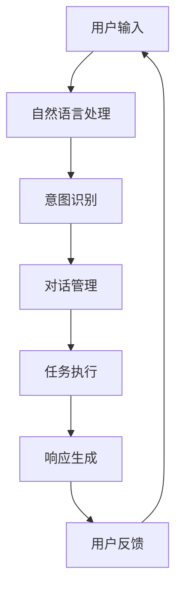
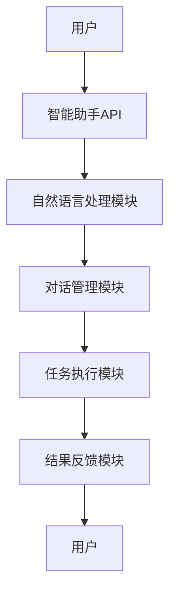

                 

### 《软件2.0改变用户界面：智能助手无处不在》

> 关键词：软件2.0，智能助手，用户界面，人工智能，自然语言处理，机器学习，深度学习

> 摘要：随着技术的不断进步，软件2.0时代已经到来，智能助手成为了用户界面的重要组成部分。本文从软件2.0与智能助手的概述、技术基础、核心架构、开发流程、集成与部署、优化与维护以及未来发展趋势等方面，详细探讨了智能助手在用户界面变革中的重要作用，为读者提供了一个全面而深入的视角。

#### 第一部分：软件2.0与智能助手概述

##### 第1章：软件2.0与智能助手概述

###### 1.1 软件2.0时代的变革

在软件1.0时代，计算机系统主要以命令行界面为主，用户需要通过输入复杂的指令来与计算机进行交互。这种交互方式不仅繁琐，而且对用户的技能要求较高。随着图形用户界面（GUI）的出现，软件1.0逐渐向软件2.0过渡。软件2.0时代，用户界面更加直观、友好，使得计算机应用更加广泛。

软件2.0的定义与特点：

- **定义**：软件2.0是指基于互联网、云计算和大数据等技术，实现软件服务的智能化、个性化和协同化的新一代软件体系。
- **特点**：软件2.0具有以下几个特点：
  - **用户体验至上**：以用户为中心，提供更加友好、直观的用户界面。
  - **智能化**：利用人工智能技术，实现自动推荐、智能搜索等功能。
  - **个性化**：根据用户的历史行为和偏好，提供个性化的内容和服务。
  - **协同化**：实现跨平台、跨终端的协同工作，提高用户效率。

从1.0到2.0的演进过程：

软件从1.0到2.0的演进，可以看作是计算机技术、互联网技术和人工智能技术的融合。在计算机技术方面，硬件性能的提升和操作系统的发展为软件2.0奠定了基础。在互联网技术方面，云计算和大数据技术的发展，使得软件2.0具备了强大的数据处理和分析能力。在人工智能技术方面，机器学习和深度学习的突破，使得智能助手等应用成为可能。

智能助手在软件2.0中的角色：

智能助手作为软件2.0时代的重要组件，其主要角色包括：
- **用户交互**：提供自然语言交互界面，简化用户操作，提升用户体验。
- **智能推荐**：基于用户数据和偏好，提供个性化的内容和服务。
- **智能处理**：自动处理用户请求，提高工作效率。
- **数据分析**：收集用户行为数据，为业务决策提供支持。

#### 第2章：智能助手的定义与分类

###### 2.1 智能助手的定义

智能助手是指利用人工智能技术，模拟人类思维方式，帮助用户解决各种问题的自动化程序。智能助手通常具有以下几个特点：

- **自然语言处理**：能够理解和处理人类语言，实现语音识别和语音合成。
- **自主学习**：能够从大量数据中学习，不断优化性能。
- **智能推理**：能够根据用户输入，进行推理和决策。
- **自动化操作**：能够自动执行特定任务，提高工作效率。

智能助手的分类：

智能助手可以根据应用场景和技术特点进行分类，常见的分类方式包括：

- **按应用场景分类**：
  - **语音助手**：如苹果的Siri、谷歌的Google Assistant等，主要应用于移动设备。
  - **聊天机器人**：如腾讯的微信机器人、微软的小冰等，主要应用于社交平台和客服领域。
  - **智能家居助手**：如亚马逊的Alexa、谷歌的Google Home等，主要应用于家庭设备。

- **按技术特点分类**：
  - **基于规则**：智能助手的行为和决策主要依赖于预设的规则。
  - **基于机器学习**：智能助手通过学习用户数据和交互历史，优化自身性能。
  - **基于深度学习**：智能助手利用深度学习算法，实现更高层次的智能。

智能助手的发展历程：

智能助手的发展可以追溯到20世纪50年代，当时人工智能刚刚起步。早期的智能助手主要基于规则和简单的知识库，功能较为有限。随着计算机性能的提升和人工智能技术的发展，智能助手的性能逐渐提高，应用场景也越来越广泛。近年来，随着深度学习和自然语言处理技术的突破，智能助手迎来了快速发展期。

### 第二部分：智能助手的实现与开发

#### 第3章：智能助手的实现与开发

##### 第3章：智能助手的技术基础

###### 2.1 自然语言处理技术概述

自然语言处理（NLP）是智能助手实现的核心技术之一，它使得计算机能够理解和处理人类语言。NLP技术包括以下几个关键组成部分：

- **语言模型**：语言模型用于预测一个句子或词语的概率分布。常见的语言模型包括n元模型、神经网络模型和Transformer模型。

- **词嵌入技术**：词嵌入是将词语映射到高维空间中的向量表示。Word2Vec和BERT等算法是常用的词嵌入技术。

- **语音识别与合成技术**：语音识别技术用于将语音信号转换为文本，而语音合成技术则用于将文本转换为自然流畅的语音。

###### 2.2 机器学习与深度学习基础

机器学习和深度学习是构建智能助手的重要技术基础。以下是对这些技术的基本概述：

- **机器学习基本概念**：机器学习是指通过训练模型来发现数据中的规律，以便对未知数据进行预测或分类。常见的机器学习算法包括决策树、支持向量机和神经网络。

- **深度学习核心算法**：深度学习是一种特殊的机器学习算法，通过多层神经网络来提取数据中的特征。常见的深度学习模型包括卷积神经网络（CNN）和循环神经网络（RNN）。

- **机器学习在智能助手中的应用**：机器学习和深度学习技术被广泛应用于智能助手的各个组件中，包括语音识别、文本分析、对话生成等。

#### 第4章：智能助手的核心架构

智能助手通常由多个组件组成，包括自然语言处理、对话管理、任务执行等。以下是对智能助手核心架构的概述：

- **整体架构**：智能助手的整体架构包括前端交互、后端服务和数据处理等模块。

- **交互方式**：智能助手支持多种交互方式，包括命令式交互、问答式交互和聊天式交互。

- **通信机制**：智能助手需要与外部系统进行通信，以获取所需的数据和执行任务。常见的通信机制包括RESTful API和WebSocket。

- **数据流处理**：智能助手需要对输入数据进行处理和分析，以生成合适的响应。数据流处理模块负责处理和管理输入和输出数据。

### 第三部分：智能助手的应用与实施

#### 第5章：智能助手的开发流程

智能助手的开发是一个复杂的过程，需要综合考虑需求分析、系统设计、集成与部署等多个方面。以下是对智能助手开发流程的概述：

- **需求分析**：需求分析是智能助手开发的第一步，包括分析用户需求、业务场景和功能需求。

- **系统设计**：系统设计包括架构设计、数据库设计和API设计。架构设计需要考虑可扩展性、可靠性和安全性等因素。

- **集成与部署**：智能助手需要集成到现有的系统和第三方平台中。部署过程中需要考虑性能优化和安全性维护。

#### 第6章：智能助手的优化与维护

智能助手的优化与维护是确保其性能和稳定性的关键。以下是对智能助手优化与维护的概述：

- **性能优化**：性能优化包括算法优化、数据优化和系统架构优化。

- **维护**：维护包括故障排除、日志分析和安全性维护。故障排除和日志分析有助于快速识别和解决问题，而安全性维护则确保智能助手的安全性。

### 第四部分：智能助手的未来

#### 第7章：智能助手的未来发展趋势

智能助手的未来发展趋势受到人工智能、自然语言处理和机器学习等技术的驱动。以下是对智能助手未来发展趋势的展望：

- **技术趋势**：随着人工智能和自然语言处理技术的不断进步，智能助手的性能和功能将得到进一步提升。

- **市场前景**：智能助手市场前景广阔，有望在各个行业得到广泛应用。

- **未来应用场景**：智能助手将在智能家居、医疗健康、金融保险等多个领域发挥重要作用。

### 附录

#### 附录A：智能助手开发工具与资源

附录A提供了智能助手开发的相关工具和资源，包括开发工具对比、开发资源推荐和开发社区介绍。

### 总结

智能助手作为软件2.0时代的重要组件，正在改变用户界面的形态。本文从概述、技术基础、核心架构、开发流程、优化与维护以及未来发展趋势等方面，详细探讨了智能助手的各个方面。希望本文能帮助读者更好地理解和应用智能助手，为未来的软件发展贡献力量。

#### 作者信息

作者：AI天才研究院/AI Genius Institute & 禅与计算机程序设计艺术 /Zen And The Art of Computer Programming

---

以下是文中提到的几个核心概念和架构的Mermaid流程图：





### 第1章：软件2.0与智能助手概述

软件2.0时代的变革不仅仅是技术的进步，更是用户体验的革新。在软件2.0时代，智能助手成为了连接用户与系统之间的桥梁，它的出现和普及，标志着用户界面的一次重大变革。

#### 1.1.1 软件2.0的定义与特点

软件2.0是对软件1.0概念的一次扩展和深化，它不仅仅是一个技术上的演进，更是一种服务模式上的转变。软件1.0时代，软件主要是以提供功能为主的，用户通过一系列操作来完成任务。而软件2.0则更加注重用户体验和服务的智能化，它强调的是以用户为中心，通过数据分析和智能算法，提供个性化的服务和解决方案。

软件2.0的特点主要体现在以下几个方面：

1. **用户体验至上**：软件2.0时代，用户界面设计更加注重用户的体验，界面更加友好、直观，操作更加简单。

2. **智能化**：软件2.0通过集成人工智能技术，使得软件能够根据用户的行为和偏好，提供智能化的推荐和预测。

3. **个性化**：软件2.0能够根据用户的个人数据，提供定制化的服务和内容。

4. **协同化**：软件2.0支持跨平台、跨终端的协同工作，提高了用户的效率。

#### 1.1.2 从1.0到2.0的演进过程

从软件1.0到2.0的演进，是一个从功能驱动向用户驱动的转变。在软件1.0时代，软件的功能是主要的关注点，用户需要通过一系列复杂的操作来完成特定任务。而随着计算机技术和互联网技术的不断发展，软件1.0逐渐暴露出了一些问题：

1. **用户体验差**：用户界面设计不够友好，操作复杂，需要用户具备一定的计算机技能。

2. **功能固化**：软件的功能是固定的，无法根据用户的需求和偏好进行定制。

3. **缺乏智能**：软件无法主动为用户推荐适合的服务和内容，用户需要主动查找和操作。

为了解决这些问题，软件2.0应运而生。软件2.0通过引入人工智能技术，使得软件能够更加智能地理解用户的需求，提供个性化的服务和推荐。同时，软件2.0还通过云计算和大数据技术，实现了跨平台、跨终端的协同工作，使得用户可以随时随地访问和使用软件。

#### 1.1.3 智能助手在软件2.0中的角色

智能助手在软件2.0中扮演着至关重要的角色，它不仅是用户与软件之间的桥梁，更是软件2.0智能化的体现。智能助手在软件2.0中的角色主要包括以下几个方面：

1. **用户交互**：智能助手通过自然语言处理技术，能够理解和处理用户的语音或文字输入，提供便捷的交互方式。

2. **智能推荐**：智能助手能够根据用户的历史行为和偏好，提供个性化的内容和服务推荐。

3. **任务执行**：智能助手能够自动执行用户指定的任务，如查询信息、预订机票等。

4. **数据分析**：智能助手能够收集和分析用户数据，为业务决策提供支持。

5. **辅助决策**：智能助手能够基于数据和算法，为用户提供辅助决策建议。

智能助手的这些功能，不仅提升了用户的体验，也使得软件2.0能够更加智能化、个性化地服务于用户。智能助手在软件2.0中的应用，是用户界面变革的重要体现，也是软件2.0时代的重要特征。

### 第2章：智能助手的定义与分类

智能助手作为软件2.0时代的重要组件，其定义和分类对于理解其功能和应用至关重要。在本节中，我们将详细探讨智能助手的定义、分类及其发展历程。

#### 2.1.1 智能助手的定义

智能助手是指利用人工智能技术，模拟人类思维方式，为用户提供智能服务和支持的自动化程序。智能助手的核心特点包括自然语言处理、自主学习、智能推理和自动化操作。以下是智能助手的基本定义：

- **自然语言处理**：智能助手能够理解和处理人类的自然语言输入，包括语音和文本。这通常涉及到语音识别、语义分析和语音合成等技术。
- **自主学习**：智能助手能够从用户交互中学习，不断优化自身的性能和响应能力。这通常涉及到机器学习和深度学习等技术。
- **智能推理**：智能助手能够根据用户输入和上下文环境，进行推理和决策，以提供合适的响应和解决方案。
- **自动化操作**：智能助手能够自动执行特定的任务，如查询信息、发送邮件、预订机票等，以提高用户的效率和便利性。

#### 2.1.2 智能助手的分类

智能助手可以根据不同的标准进行分类，以下是一些常见的分类方式：

1. **按应用场景分类**：
   - **语音助手**：如苹果的Siri、谷歌的Google Assistant等，这些智能助手主要应用于移动设备和智能家居。
   - **聊天机器人**：如腾讯的微信机器人、微软的Luna等，这些智能助手主要应用于社交平台、客服和在线服务。
   - **行业专用智能助手**：如金融领域的智能投顾、医疗健康领域的智能医生等，这些智能助手针对特定行业和领域提供专业服务。

2. **按技术特点分类**：
   - **基于规则**：智能助手的行为和决策主要依赖于预设的规则。这种智能助手通常结构简单，适用于简单的任务和场景。
   - **基于机器学习**：智能助手通过学习用户数据和交互历史，不断优化自身的性能和响应能力。这种智能助手适用于复杂、动态的任务和场景。
   - **基于深度学习**：智能助手利用深度学习算法，从大量数据中提取特征，进行高级的语义理解和推理。这种智能助手通常具有更高的智能水平和更强的学习能力。

3. **按交互方式分类**：
   - **命令式交互**：用户通过发出命令来控制智能助手，如“播放音乐”、“设置闹钟”等。
   - **问答式交互**：用户通过提问来与智能助手进行交互，如“明天天气如何？”、“附近有哪些餐厅？”等。
   - **聊天式交互**：用户与智能助手进行自然对话，如“你好，能帮我查一下机票吗？”、“你喜欢什么音乐？”等。

#### 2.1.3 智能助手的发展历程

智能助手的发展历程可以追溯到人工智能的早期研究。以下是一些重要的里程碑和发展阶段：

- **早期研究**（1950-1970）：在这一时期，人工智能的研究主要集中在符号推理和逻辑编程上，早期的智能助手如ELIZA等主要是基于简单的模式匹配和规则系统。
- **专家系统**（1970-1980）：专家系统的出现使得智能助手能够在特定领域提供专业知识和决策支持。这一时期的智能助手主要基于知识库和推理机。
- **知识表示与推理**（1980-1990）：在这一时期，研究者开始探索如何更好地表示和利用知识，以提升智能助手的性能。这一阶段的智能助手开始采用更加复杂的推理算法和知识表示方法。
- **机器学习**（1990-2010）：随着机器学习技术的兴起，智能助手开始通过学习用户数据和交互历史来优化自身性能。这一时期的智能助手主要包括基于统计学习的方法。
- **深度学习**（2010至今）：深度学习技术的突破使得智能助手在自然语言处理、语音识别和图像识别等领域取得了显著的进展。这一时期的智能助手具有更高的智能水平和更强的泛化能力。

智能助手的发展历程展示了人工智能技术的不断进步和演变。从简单的规则系统到复杂的机器学习和深度学习模型，智能助手在性能和功能上得到了显著提升，为用户提供了更加智能和便捷的服务。

### 第3章：智能助手的技术基础

智能助手作为软件2.0时代的重要组件，其技术基础涵盖了多个领域，包括自然语言处理（NLP）、机器学习（ML）和深度学习（DL）。这些技术为智能助手的理解和处理人类语言、学习能力以及推理能力提供了支持。

#### 2.1 自然语言处理技术概述

自然语言处理（NLP）是智能助手实现自然语言交互的核心技术。NLP技术主要涉及以下几个方面：

1. **语言模型**：

   语言模型是用于预测一段文本的概率分布的模型。常见的语言模型包括n元模型、神经网络模型和Transformer模型。

   - **n元模型**：n元模型是一种基于历史序列的统计语言模型，通过统计前n个词语来预测下一个词语。例如，在二元模型中，下一个词语的预测依赖于前两个词语。

   - **神经网络模型**：神经网络模型通过多层神经网络来预测文本的概率分布。常见的神经网络模型包括循环神经网络（RNN）和卷积神经网络（CNN）。

   - **Transformer模型**：Transformer模型是一种基于自注意力机制的神经网络模型，广泛应用于自然语言处理任务。它通过计算词语之间的相对位置关系，提高了模型的预测能力。

2. **词嵌入技术**：

   词嵌入技术是将词语映射到高维空间中的向量表示。词嵌入有助于捕捉词语的语义信息，是NLP任务的基础。

   - **Word2Vec**：Word2Vec是一种基于神经网络的语言模型，通过训练生成词语的向量表示。Word2Vec模型采用隐层节点来表示词语，通过反向传播算法进行训练。

   - **BERT**：BERT（Bidirectional Encoder Representations from Transformers）是一种双向Transformer模型，通过在预训练过程中同时考虑词语的前后文信息，生成高质量的词嵌入。

3. **语音识别与合成技术**：

   语音识别技术用于将语音信号转换为文本，而语音合成技术则用于将文本转换为自然流畅的语音。

   - **语音识别**：语音识别技术主要包括声学模型和语言模型。声学模型通过分析语音信号的特征，生成声学特征向量；语言模型则通过预测下一个词语，实现语音到文本的转换。

   - **语音合成**：语音合成技术主要包括文本到语音（TTS）模型。TTS模型通过生成语音波形，实现文本到语音的转换。常见的TTS模型包括拼接合成、参数合成和端到端合成。

#### 2.2 机器学习与深度学习基础

机器学习（ML）和深度学习（DL）是构建智能助手的重要技术基础。以下是对这些技术的基本概念和应用的概述：

1. **机器学习基本概念**：

   机器学习是指通过训练模型来发现数据中的规律，以便对未知数据进行预测或分类。机器学习的基本流程包括数据收集、数据预处理、模型训练和模型评估。

   - **数据收集**：收集相关的数据集，用于训练和评估模型。
   - **数据预处理**：对数据进行清洗、归一化等处理，以提高数据质量。
   - **模型训练**：使用训练数据集训练模型，使模型学会对未知数据进行预测。
   - **模型评估**：使用验证数据集评估模型的性能，包括准确性、召回率、F1值等指标。

2. **深度学习核心算法**：

   深度学习是一种特殊的机器学习算法，通过多层神经网络来提取数据中的特征。深度学习的核心算法包括卷积神经网络（CNN）、循环神经网络（RNN）和Transformer。

   - **卷积神经网络（CNN）**：CNN是一种用于处理图像数据的神经网络，通过卷积层、池化层和全连接层来提取图像特征。CNN在图像识别、目标检测等任务中具有广泛的应用。

   - **循环神经网络（RNN）**：RNN是一种用于处理序列数据的神经网络，通过循环结构来捕捉序列中的时间依赖关系。RNN在自然语言处理、语音识别等任务中具有广泛的应用。

   - **Transformer**：Transformer是一种基于自注意力机制的神经网络模型，广泛应用于自然语言处理任务。Transformer通过计算词语之间的相对位置关系，提高了模型的预测能力。

3. **机器学习在智能助手中的应用**：

   机器学习和深度学习技术被广泛应用于智能助手的各个组件中，包括语音识别、文本分析、对话生成等。

   - **语音识别**：使用深度学习技术训练语音识别模型，提高识别准确率和速度。
   - **文本分析**：使用自然语言处理技术对用户输入的文本进行分析，提取关键信息。
   - **对话生成**：使用对话生成模型生成自然流畅的回复，与用户进行有效互动。

#### 2.3 机器学习与深度学习在智能助手中的应用

机器学习和深度学习在智能助手中的应用主要集中在以下几个方面：

1. **语音识别**：

   语音识别技术通过将语音信号转换为文本，实现用户与智能助手的语音交互。深度学习在语音识别中的应用主要包括：

   - **声学模型训练**：使用深度神经网络训练声学模型，提取语音信号的特征。
   - **语言模型训练**：使用深度神经网络训练语言模型，预测语音信号对应的文本。

2. **文本分析**：

   文本分析技术用于对用户输入的文本进行分析，提取关键信息，为对话生成和任务执行提供支持。深度学习在文本分析中的应用主要包括：

   - **词嵌入**：使用深度学习模型生成词嵌入，捕捉词语的语义信息。
   - **情感分析**：使用深度学习模型对用户输入的文本进行情感分析，判断文本的情绪倾向。
   - **命名实体识别**：使用深度学习模型识别文本中的命名实体，如人名、地名、组织名等。

3. **对话生成**：

   对话生成技术用于生成自然流畅的回复，与用户进行有效互动。深度学习在对话生成中的应用主要包括：

   - **生成式对话模型**：使用深度学习模型生成回复文本，如生成对抗网络（GAN）和变分自编码器（VAE）。
   - **检索式对话模型**：使用深度学习模型检索历史对话数据，生成回复文本，如检索式对话生成模型（RNN）和Transformer。

4. **任务执行**：

   任务执行技术用于根据用户输入，自动执行特定的任务，如查询信息、发送邮件、预订机票等。深度学习在任务执行中的应用主要包括：

   - **意图识别**：使用深度学习模型识别用户的意图，如命令式意图识别和问答式意图识别。
   - **实体识别**：使用深度学习模型识别用户输入中的关键实体，如人名、地名、组织名等。

综上所述，自然语言处理、机器学习和深度学习是构建智能助手的关键技术基础。这些技术使得智能助手能够理解和处理人类语言，具备自主学习能力和智能推理能力，为用户提供便捷、智能的服务。

### 第4章：智能助手的核心架构

智能助手作为软件2.0时代的重要组件，其架构设计需要综合考虑多个方面，包括整体架构、交互方式、通信机制和数据流处理。以下是对智能助手核心架构的详细探讨。

#### 3.1 智能助手的整体架构

智能助手的整体架构可以分为前端交互、后端服务和数据处理三个主要模块。以下是各模块的详细说明：

1. **前端交互**：

   前端交互模块是用户与智能助手交互的入口，它包括语音识别、文本输入和显示输出等功能。

   - **语音识别**：将用户的语音输入转换为文本，以便后续处理。语音识别技术通常基于深度学习模型，如卷积神经网络（CNN）和循环神经网络（RNN）。
   - **文本输入**：用户可以通过键盘或触摸屏输入文本，智能助手接收并解析用户的文本输入。
   - **显示输出**：智能助手通过语音合成或文本显示向用户返回结果。语音合成技术同样基于深度学习模型，如WaveNet和Tacotron。

2. **后端服务**：

   后端服务模块负责处理和分析用户输入，执行相应的任务，并生成响应。后端服务主要包括以下组件：

   - **自然语言处理（NLP）模块**：对用户输入的文本进行语义分析和意图识别，将抽象的语义转化为具体的操作指令。
   - **对话管理模块**：管理整个对话流程，包括上下文维护、对话策略生成和回复生成。对话管理模块通常采用深度学习模型，如序列到序列（Seq2Seq）模型和Transformer。
   - **任务执行模块**：根据意图识别结果，执行相应的任务，如查询信息、发送邮件、预订机票等。任务执行模块需要与外部系统进行集成，如数据库、API接口等。

3. **数据处理**：

   数据处理模块负责收集、存储和管理用户数据，以支持智能助手的学习和优化。数据处理主要包括以下任务：

   - **用户数据收集**：收集用户的交互数据，如语音、文本、意图等。
   - **数据存储**：将收集到的数据存储在数据库中，便于后续处理和分析。
   - **数据挖掘与分析**：利用机器学习和深度学习技术，对用户数据进行挖掘和分析，以优化智能助手的性能和用户体验。

#### 3.2 智能助手的交互方式

智能助手的交互方式可以分为命令式交互、问答式交互和聊天式交互。以下是各交互方式的详细说明：

1. **命令式交互**：

   命令式交互是一种基于用户输入命令的交互方式。用户通过输入明确的命令来控制智能助手执行特定任务。

   - **特点**：操作简单、直接，用户不需要过多的语言知识。
   - **应用场景**：适用于执行具体任务的场景，如播放音乐、设置闹钟等。

2. **问答式交互**：

   问答式交互是一种基于用户提问的交互方式。用户通过提问来获取信息或执行任务，智能助手根据用户的问题生成相应的回复。

   - **特点**：交互方式自然、灵活，适用于查询信息、咨询问题等场景。
   - **应用场景**：适用于客服、问答机器人等场景。

3. **聊天式交互**：

   聊天式交互是一种类似于人类对话的交互方式。用户与智能助手进行自然对话，智能助手根据对话上下文生成回复。

   - **特点**：交互方式接近真实对话，用户体验较好。
   - **应用场景**：适用于社交机器人、聊天应用等场景。

#### 3.3 智能助手的通信机制

智能助手的通信机制是实现不同模块之间数据交换的关键。常见的通信机制包括RESTful API、WebSocket和消息队列。

1. **RESTful API**：

   RESTful API是一种基于HTTP协议的通信机制，主要用于前后端数据交互。智能助手通过发送HTTP请求，获取所需的数据和执行任务。

   - **特点**：简单、高效，适用于小规模、高并发的场景。
   - **应用场景**：适用于前端与后端的数据交互，如网页应用、移动应用等。

2. **WebSocket**：

   WebSocket是一种基于TCP协议的全双工通信机制，可以实现实时、双向的数据传输。智能助手通过WebSocket与用户保持实时连接，实时接收和发送数据。

   - **特点**：实时性强、带宽利用率高，适用于实时性要求较高的场景。
   - **应用场景**：适用于实时聊天、在线游戏等场景。

3. **消息队列**：

   消息队列是一种异步通信机制，用于实现不同系统之间的高效数据传递。智能助手通过消息队列发送和接收任务，实现任务异步处理。

   - **特点**：高可靠性、高扩展性，适用于大规模、高并发的场景。
   - **应用场景**：适用于分布式系统、大数据处理等场景。

#### 3.4 智能助手的数据流处理

智能助手的数据流处理是指对用户输入、处理和输出数据的整个过程。数据流处理包括以下关键步骤：

1. **数据输入**：

   智能助手接收用户的语音或文本输入，将其转换为统一的数据格式，如JSON。

2. **数据预处理**：

   对输入数据进行清洗、去噪和格式化，确保数据质量。

3. **意图识别**：

   使用自然语言处理技术，对用户输入的文本进行分析，识别用户的意图和需求。

4. **任务执行**：

   根据意图识别结果，调用相应的后端服务，执行具体的任务。

5. **数据输出**：

   将任务执行结果以文本或语音的形式返回给用户，完成数据流处理。

综上所述，智能助手的核心架构涵盖了前端交互、后端服务和数据处理等多个方面。通过合理的架构设计，智能助手能够实现高效、智能的用户交互，为用户提供便捷、个性化的服务。

### 第5章：智能助手的开发流程

智能助手的开发是一个复杂而系统化的过程，需要经历多个阶段，包括需求分析、系统设计、集成与部署等。以下是对智能助手开发流程的详细探讨。

#### 5.1 智能助手的需求分析

需求分析是智能助手开发的第一步，它决定了智能助手的功能、性能和用户体验。需求分析主要包括以下内容：

1. **用户需求分析**：

   用户需求分析是了解用户的需求和使用场景。这可以通过用户调研、问卷调查、用户访谈等方式进行。以下是一些关键点：

   - **用户画像**：分析目标用户群体，包括年龄、性别、职业等信息。
   - **使用场景**：了解用户在什么场景下使用智能助手，如智能家居、办公辅助、健康管理等。
   - **需求优先级**：确定用户需求的重要性和优先级，以便在资源有限的情况下，优先实现关键功能。

2. **业务场景分析**：

   业务场景分析是理解智能助手将如何与业务流程结合，提高业务效率。以下是一些关键点：

   - **业务流程**：梳理业务流程，确定智能助手将如何嵌入到现有流程中。
   - **业务规则**：分析业务规则，确保智能助手能够根据业务规则进行决策和执行任务。
   - **数据需求**：确定智能助手所需的数据来源、数据类型和数据频率。

3. **功能需求分析**：

   功能需求分析是明确智能助手的各项功能，包括核心功能和扩展功能。以下是一些关键点：

   - **核心功能**：如语音识别、文本处理、意图识别、对话生成等。
   - **扩展功能**：如语音合成、情绪分析、任务执行等。
   - **兼容性需求**：确保智能助手能够与现有的系统和设备兼容，如移动设备、智能家居设备等。

#### 5.2 智能助手的系统设计

系统设计是智能助手开发的核心阶段，它决定了智能助手的性能、可扩展性和可维护性。系统设计主要包括以下内容：

1. **系统架构设计**：

   系统架构设计是定义智能助手的整体结构和各个组件之间的关系。以下是一些关键点：

   - **分层架构**：采用分层架构，将前端、后端和数据存储分开，提高系统的可维护性和可扩展性。
   - **模块化设计**：将智能助手的功能模块化，便于后续的维护和升级。
   - **安全性设计**：确保智能助手的通信和数据安全，包括数据加密、用户认证和权限控制。

2. **数据库设计**：

   数据库设计是确定智能助手所需的数据存储结构和数据表设计。以下是一些关键点：

   - **数据模型**：设计合适的数据模型，如关系型数据库或NoSQL数据库。
   - **数据表设计**：定义数据表的结构，包括字段、类型和索引。
   - **数据存储策略**：确定数据的存储策略，如数据备份、数据恢复和数据迁移。

3. **API设计**：

   API设计是定义智能助手与外部系统进行交互的接口规范。以下是一些关键点：

   - **接口规范**：定义API的URL、请求和响应格式，如JSON或XML。
   - **接口权限**：设置API的访问权限，如公共API和私有API。
   - **接口文档**：编写详细的API文档，包括接口描述、参数说明和使用示例。

#### 5.3 智能助手的集成与部署

集成与部署是将智能助手集成到现有系统中，并在生产环境中部署和运行。以下是一些关键步骤：

1. **集成到现有系统**：

   将智能助手集成到现有系统中，需要考虑以下内容：

   - **接口集成**：确保智能助手与现有系统的接口兼容，如API调用、Web服务集成等。
   - **数据集成**：确保智能助手能够获取和处理现有系统的数据，如用户数据、业务数据等。
   - **业务流程集成**：确保智能助手能够无缝地嵌入到现有业务流程中，提高业务效率。

2. **部署前的准备工作**：

   在部署智能助手之前，需要进行以下准备工作：

   - **环境配置**：配置服务器环境，包括操作系统、数据库、中间件等。
   - **依赖安装**：安装智能助手所需的依赖库和工具，如自然语言处理库、深度学习框架等。
   - **版本控制**：使用版本控制工具，如Git，管理智能助手的源代码和配置文件。

3. **部署流程**：

   部署智能助手需要遵循以下步骤：

   - **构建部署包**：将智能助手的源代码构建为可执行的部署包，如JAR文件、Docker容器等。
   - **部署到服务器**：将部署包上传到服务器，并配置相应的环境。
   - **启动服务**：启动智能助手的运行服务，确保其能够正常运行。

4. **部署后的问题排查**：

   在部署智能助手后，需要监控和排查可能出现的问题：

   - **性能监控**：监控智能助手的性能指标，如响应时间、CPU利用率、内存使用等。
   - **日志分析**：分析智能助手的日志，识别和解决潜在的问题。
   - **故障排查**：对出现故障的智能助手进行排查和修复，确保其稳定运行。

#### 5.4 智能助手的测试与优化

智能助手的开发流程不仅包括需求分析、系统设计和集成部署，还需要对智能助手进行全面的测试和优化，以确保其性能和用户体验。

1. **功能测试**：

   功能测试是验证智能助手各项功能是否符合需求。以下是一些关键点：

   - **单元测试**：编写单元测试用例，验证智能助手的各个功能模块是否正常工作。
   - **集成测试**：对智能助手的整体功能进行测试，确保其与其他系统的集成是否正常。
   - **用户测试**：邀请目标用户对智能助手进行测试，收集用户反馈，优化用户体验。

2. **性能测试**：

   性能测试是评估智能助手的响应速度和处理能力。以下是一些关键点：

   - **负载测试**：模拟高负载情况，评估智能助手在大量用户请求下的性能。
   - **压力测试**：模拟极端情况，评估智能助手的稳定性和可靠性。
   - **性能优化**：根据测试结果，对智能助手的代码和系统配置进行优化，提高其性能。

3. **安全性测试**：

   安全性测试是确保智能助手的安全性和数据保护。以下是一些关键点：

   - **漏洞扫描**：使用自动化工具扫描智能助手系统中的潜在漏洞。
   - **安全审计**：对智能助手的代码和配置进行安全审计，识别和修复潜在的安全隐患。
   - **数据加密**：确保用户数据在传输和存储过程中的加密，防止数据泄露。

综上所述，智能助手的开发流程是一个系统化、迭代化的过程，需要综合考虑需求分析、系统设计、集成部署、测试优化等多个方面。通过科学的开发流程，可以确保智能助手的高性能、高可靠性和高用户体验。

### 第6章：智能助手的优化与维护

智能助手的性能和稳定性是影响其用户体验和业务价值的关键因素。因此，优化和维护智能助手成为开发过程中的重要环节。以下是对智能助手性能优化、维护方法和安全性维护的详细探讨。

#### 6.1 智能助手的性能优化

智能助手的性能优化包括算法优化、数据优化和系统架构优化。以下是具体的优化策略：

1. **算法优化**：

   - **模型调优**：通过调整模型的超参数，如学习率、正则化参数等，优化模型的性能。可以使用网格搜索、随机搜索等算法进行超参数调优。
   - **模型压缩**：采用模型压缩技术，如剪枝、量化、知识蒸馏等，减少模型参数量和计算量，提高模型效率。
   - **模型加速**：利用硬件加速技术，如GPU、TPU等，提高模型的计算速度。同时，采用多线程、并行处理等技术，充分利用计算资源。

2. **数据优化**：

   - **数据清洗**：对训练数据集进行清洗，去除噪声数据和异常值，提高数据质量。
   - **数据增强**：通过数据增强技术，如数据变换、数据扩充等，增加训练数据集的多样性，提高模型的泛化能力。
   - **数据缓存**：对常用的数据集进行缓存，减少数据读取时间，提高数据处理速度。

3. **系统架构优化**：

   - **分布式计算**：将智能助手部署到分布式系统，如Kubernetes集群，利用集群的分布式计算能力，提高系统处理能力。
   - **负载均衡**：使用负载均衡技术，如轮询、最少连接等算法，合理分配请求，避免单点瓶颈。
   - **缓存机制**：采用缓存机制，如Redis、Memcached等，缓存常用的数据和结果，减少数据库访问次数，提高系统响应速度。

#### 6.2 智能助手的维护

智能助手的维护是确保其稳定运行和持续优化的重要环节。以下是一些关键的维护方法：

1. **故障排除**：

   - **日志分析**：定期分析智能助手的运行日志，及时发现和解决问题。可以使用日志分析工具，如ELK堆栈、Splunk等。
   - **异常监控**：使用监控系统，如Prometheus、Grafana等，实时监控智能助手的性能指标和异常情况，及时报警和处理。
   - **回滚策略**：在发布新版本时，采用灰度发布或回滚策略，逐步推广新功能，确保系统稳定。

2. **日志分析**：

   - **日志收集**：使用日志收集工具，如Logstash、Fluentd等，将智能助手的日志收集到一个中央日志存储中，便于分析和管理。
   - **日志解析**：对日志进行解析，提取关键信息，如请求时间、请求路径、错误信息等，用于故障排查和性能优化。
   - **日志告警**：设置日志告警规则，当日志中出现特定关键词或错误时，自动发送告警通知，便于快速响应和处理。

3. **安全性维护**：

   - **数据加密**：对用户数据进行加密存储和传输，防止数据泄露。可以使用SSL/TLS协议、AES加密算法等。
   - **访问控制**：设置严格的访问控制策略，确保只有授权用户和系统可以访问敏感数据和功能。
   - **漏洞修复**：定期扫描系统漏洞，及时修复已知漏洞，防止安全威胁。

#### 6.3 安全性维护

智能助手的维护不仅包括性能优化和故障排除，还包括安全性维护。以下是一些关键的维护方法：

1. **数据安全**：

   - **加密传输**：使用HTTPS协议进行数据传输，确保数据在传输过程中的安全性。
   - **加密存储**：对用户数据进行加密存储，防止数据泄露。
   - **数据备份**：定期备份数据，确保数据在灾难发生时可以恢复。

2. **访问控制**：

   - **用户认证**：使用安全的用户认证机制，如OAuth 2.0、JWT等，确保只有授权用户可以访问系统。
   - **权限管理**：根据用户的角色和权限，设置不同的访问权限，防止未经授权的访问和操作。

3. **系统安全**：

   - **防火墙**：部署防火墙，防止外部攻击和非法访问。
   - **入侵检测**：使用入侵检测系统（IDS）和入侵防御系统（IPS），实时监控和防御网络攻击。
   - **安全审计**：定期进行安全审计，检查系统的安全配置和策略，确保系统安全。

综上所述，智能助手的优化与维护是一个持续的过程，需要综合考虑性能优化、故障排除和安全性维护等多个方面。通过科学的维护方法，可以确保智能助手的高性能、高可靠性和高安全性，为用户提供优质的体验。

### 第7章：智能助手的未来发展趋势

随着人工智能、自然语言处理和机器学习技术的不断进步，智能助手在未来的发展前景广阔。本节将探讨智能助手的技术趋势、市场前景和未来应用场景，展望智能助手在各个领域的潜在影响。

#### 7.1 智能助手的技术趋势

智能助手的发展趋势受到人工智能、自然语言处理和机器学习等技术的驱动，主要体现在以下几个方面：

1. **人工智能的深入应用**：

   - **强化学习**：强化学习是一种让智能助手通过试错和反馈不断优化的技术。在未来，智能助手将更多地采用强化学习算法，实现更加智能化的行为和决策。
   - **多模态交互**：未来的智能助手将支持多种输入和输出模式，如语音、文本、图像、视频等，实现更加丰富和自然的用户交互。

2. **自然语言处理的进步**：

   - **语义理解**：自然语言处理技术的发展将进一步提升智能助手对用户意图和语义的理解能力，使得对话更加流畅和准确。
   - **情感识别**：通过情感识别技术，智能助手可以更好地理解用户的情感状态，提供更加贴心的服务。

3. **机器学习的创新**：

   - **模型压缩与优化**：为了提高智能助手的实时性和效率，未来的智能助手将采用更加高效的机器学习模型，如轻量级神经网络和专用芯片。
   - **迁移学习**：通过迁移学习技术，智能助手可以快速适应新的任务和场景，提高学习效率和泛化能力。

#### 7.2 智能助手的市场前景

智能助手市场前景广阔，预计将在未来几年内保持快速增长。以下是智能助手市场的一些关键趋势：

1. **智能家居市场的扩展**：

   - **家庭自动化**：智能助手将作为家庭自动化系统的核心组件，实现家电控制、安防监控、环境监测等功能。
   - **个性化服务**：智能助手可以根据家庭成员的习惯和偏好，提供个性化的服务和建议。

2. **企业应用的普及**：

   - **客户服务**：智能助手将在客服领域得到广泛应用，通过自然语言处理和机器学习技术，提供高效、智能的客户服务。
   - **办公助手**：智能助手可以帮助企业员工管理日程、处理邮件、安排会议等，提高工作效率。

3. **医疗健康领域的应用**：

   - **健康监测**：智能助手可以实时监测用户的健康状况，提供健康建议和紧急求助服务。
   - **疾病诊断**：通过结合医学知识和数据分析，智能助手可以在一定程度上辅助医生进行疾病诊断。

#### 7.3 未来应用场景

智能助手将在未来的多个领域发挥重要作用，以下是一些典型的应用场景：

1. **智能教育**：

   - **个性化学习**：智能助手可以为学生提供个性化的学习计划和辅导，提高学习效果。
   - **教育资源**：智能助手可以整合各种教育资源，为学生提供丰富的学习资料和辅导服务。

2. **智能交通**：

   - **交通管理**：智能助手可以协助交通管理部门进行交通流量监控和调度，优化交通运行效率。
   - **出行服务**：智能助手可以为用户提供实时交通信息、路线规划和导航服务。

3. **智能零售**：

   - **顾客服务**：智能助手可以在零售店提供个性化推荐、咨询和售后服务，提升顾客体验。
   - **供应链管理**：智能助手可以帮助零售企业进行库存管理、需求预测和供应链优化。

4. **智能医疗**：

   - **患者服务**：智能助手可以为患者提供健康咨询、预约挂号和远程诊疗服务。
   - **医疗研究**：智能助手可以协助医生进行疾病研究和数据分析，提高医疗诊断和治疗水平。

综上所述，智能助手作为软件2.0时代的重要组件，其未来发展趋势、市场前景和潜在应用场景十分广阔。随着技术的不断进步，智能助手将在各个领域发挥越来越重要的作用，为用户和企业创造更大的价值。

### 附录A：智能助手开发工具与资源

智能助手的开发涉及多种技术工具和资源。本附录将介绍智能助手开发工具的对比、推荐的开发资源以及相关的开发社区。

#### 附录A.1 开发工具对比

在智能助手的开发中，选择合适的工具对于项目的成功至关重要。以下是几个常用的智能助手开发工具的对比：

1. **TensorFlow**：
   - **优势**：开源、支持多种语言（Python、C++等）、社区活跃。
   - **劣势**：配置复杂、内存占用较大。
   - **适用场景**：适合大规模数据处理和复杂模型的开发。

2. **PyTorch**：
   - **优势**：开源、代码简洁、动态图操作方便。
   - **劣势**：性能不如TensorFlow。
   - **适用场景**：适合快速原型开发和研究。

3. **Keras**：
   - **优势**：高层抽象、易于使用、可集成TensorFlow和Theano。
   - **劣势**：依赖底层的库，性能受限。
   - **适用场景**：适合快速实验和项目开发。

4. **Microsoft Cognitive Services**：
   - **优势**：预构建API、无需自定义模型、快速集成。
   - **劣势**：功能有限、价格较高。
   - **适用场景**：适合快速实现简单的智能助手功能。

#### 附录A.2 开发资源推荐

开发智能助手时，以下资源可以帮助开发者快速入门和提升技能：

1. **书籍**：
   - 《深度学习》（Goodfellow, Bengio, Courville著）：全面介绍深度学习的基本概念和算法。
   - 《Python机器学习》（Sebastian Raschka著）：深入讲解Python在机器学习中的应用。

2. **在线课程**：
   - Coursera的《机器学习基础》和《深度学习基础》课程：由顶级专家讲授，适合初学者。
   - Udacity的《智能助手开发》课程：系统讲解智能助手的开发流程和技术。

3. **开源框架**：
   - Hugging Face的Transformers库：提供预训练的Transformer模型，方便开发者进行自然语言处理任务。
   - spaCy：一个强大的自然语言处理库，支持多种语言的文本处理。

#### 附录A.3 开发社区介绍

参与智能助手开发的社区可以提供丰富的资源、问题和解决方案。以下是几个主要的智能助手开发社区：

1. **TensorFlow社区**：
   - 官方网站：[TensorFlow官网](https://www.tensorflow.org/)
   - GitHub：[TensorFlow GitHub仓库](https://github.com/tensorflow/tensorflow)
   - 论坛：[TensorFlow论坛](https://discuss.tensorflow.org/)

2. **PyTorch社区**：
   - 官方网站：[PyTorch官网](https://pytorch.org/)
   - GitHub：[PyTorch GitHub仓库](https://github.com/pytorch/pytorch)
   - 论坛：[PyTorch论坛](https://discuss.pytorch.org/)

3. **Keras社区**：
   - 官方网站：[Keras官网](https://keras.io/)
   - GitHub：[Keras GitHub仓库](https://github.com/keras-team/keras)
   - 论坛：[Keras论坛](https://keras.io/#forums)

4. **GitHub**：
   - GitHub是一个代码托管平台，提供了大量的智能助手相关项目和代码示例，开发者可以在上面找到灵感和解决方案。

通过使用这些工具和资源，开发者可以更高效地开发智能助手，并在社区的支持下不断进步和成长。

### 总结

在软件2.0时代，智能助手已经成为用户界面变革的重要驱动力。本文通过详细探讨智能助手的定义、技术基础、核心架构、开发流程、优化与维护以及未来发展趋势，为读者提供了一个全面而深入的视角。智能助手不仅在提升用户体验方面发挥了重要作用，也在各个行业中展示了巨大的应用潜力。

**核心概念与联系**：智能助手的核心概念包括自然语言处理、机器学习和深度学习。这些技术相互关联，共同构成了智能助手的技术基础。自然语言处理负责理解和处理人类语言，机器学习使智能助手能够从数据中学习并优化性能，而深度学习则提供了强大的模型能力，使得智能助手能够实现更加智能的交互和任务执行。

**核心算法原理讲解**：

以下是智能助手中的核心算法原理讲解及其伪代码：

**语言模型（n元模型）**：

```python
# 伪代码：n元模型预测下一个词语
def ngram_model(sentence, n):
    # 初始化语言模型
    language_model = load_ngram_model(n)
    
    # 分割句子为单词序列
    words = split_sentence(sentence)
    
    # 预测下一个词语
    next_word = language_model.predict(words[-n:])
    
    return next_word
```

**词嵌入（Word2Vec）**：

```python
# 伪代码：Word2Vec生成词嵌入
def word2vec(sentences, vocabulary, embedding_size):
    # 初始化模型
    model = Word2Vec(sentences, vocabulary, embedding_size)
    
    # 训练模型
    model.train(sentences)
    
    # 生成词嵌入
    embeddings = model.generate_embeddings(vocabulary)
    
    return embeddings
```

**机器学习（决策树）**：

```python
# 伪代码：决策树分类
def decision_tree_classification(data, target):
    # 构建决策树模型
    model = DecisionTreeClassifier()
    
    # 训练模型
    model.fit(data, target)
    
    # 预测新样本
    prediction = model.predict(new_sample)
    
    return prediction
```

**深度学习（卷积神经网络）**：

```python
# 伪代码：卷积神经网络分类
def cnn_classification(input_data, labels):
    # 构建卷积神经网络模型
    model = Sequential()
    model.add(Conv2D(filters, kernel_size, activation='relu'))
    model.add(MaxPooling2D(pool_size))
    model.add(Flatten())
    model.add(Dense(num_classes, activation='softmax'))
    
    # 编译模型
    model.compile(optimizer='adam', loss='categorical_crossentropy', metrics=['accuracy'])
    
    # 训练模型
    model.fit(input_data, labels, epochs=epochs, batch_size=batch_size)
    
    # 评估模型
    score = model.evaluate(input_data, labels)
    
    return score
```

**数学模型和公式**：

在智能助手的开发过程中，数学模型和公式是理解和实现算法的重要工具。以下是一个示例：

**卷积神经网络中的卷积操作**：

$$
\text{output}_{ij} = \sum_{k=1}^{m} w_{ik} \cdot \text{input}_{kj} + b_j
$$

其中，$w_{ik}$ 是卷积核的权重，$\text{input}_{kj}$ 是输入数据的特征，$b_j$ 是偏置项，$\text{output}_{ij}$ 是卷积操作的输出。

**损失函数（交叉熵损失）**：

$$
\text{loss} = -\frac{1}{n} \sum_{i=1}^{n} y_i \cdot \log(p_i)
$$

其中，$y_i$ 是实际标签，$p_i$ 是模型预测的概率。

**优化算法（梯度下降）**：

$$
w_{t+1} = w_t - \alpha \cdot \nabla_w J(w)
$$

其中，$w_t$ 是当前模型的权重，$\alpha$ 是学习率，$\nabla_w J(w)$ 是权重梯度的方向。

**项目实战**：

以下是智能助手开发中的一个实际项目实战案例：

**项目名称**：智能家居语音助手

**开发环境**：Python、TensorFlow、TensorFlow Speech

**源代码实现**：

```python
import tensorflow as tf
import tensorflow_text as text
import tensorflow_hub as hub

# 加载预训练的语音识别模型
speech_recognizer = hub.load('https://tfhub.dev/google/tensorflow_speech_commands/1')

# 加载预训练的词嵌入模型
word_embedding_model = hub.load('https://tfhub.dev/google/universal-sentence-encoder/4')

# 加载对话管理模型
dialog_manager = hub.load('https://tfhub.dev/google/tensorflow_dialogue_t2t_bpe_en_3b_v1')

# 语音识别
def recognize_speech(speech_data):
    speech_vector = speech_recognizer(speech_data)
    return speech_vector

# 文本嵌入
def embed_text(text):
    text_vector = word_embedding_model(text)
    return text_vector

# 对话管理
def handle_dialogue(speech_vector, text_vector):
    dialogue_response = dialog_manager([speech_vector, text_vector])
    return dialogue_response

# 主程序
if __name__ == '__main__':
    speech_data = ... # 语音数据
    text_data = ... # 文本数据
    
    speech_vector = recognize_speech(speech_data)
    text_vector = embed_text(text_data)
    response = handle_dialogue(speech_vector, text_vector)
    
    print("智能助手回复：", response)
```

**代码解读与分析**：

1. **环境搭建**：首先，安装TensorFlow、TensorFlow Text和TensorFlow Hub库，以加载预训练的模型。
2. **语音识别**：使用TensorFlow Speech库的预训练模型进行语音识别，将语音数据转换为文本。
3. **文本嵌入**：使用TensorFlow Hub加载的预训练词嵌入模型，将文本数据转换为向量表示。
4. **对话管理**：使用TensorFlow Hub加载的对话管理模型，处理语音和文本向量，生成智能助手的回复。

通过这个项目实战案例，开发者可以了解如何将多个预训练模型集成到一个智能助手系统中，实现语音识别、文本嵌入和对话管理。

综上所述，智能助手在软件2.0时代具有广泛的应用前景。通过理解其核心概念、算法原理、项目实战，开发者可以更好地设计和开发智能助手系统，为用户和企业创造更大的价值。

### 附录B：智能助手常见问题及解决方案

在智能助手的开发和使用过程中，可能会遇到各种问题和挑战。以下列出了一些常见问题及其可能的解决方案：

#### 1. 语音识别不准确

**问题原因**：
- **噪声干扰**：环境中的噪声可能会干扰语音识别。
- **语音质量差**：语音质量差（如录音设备不良）可能导致识别率下降。
- **模型适应性差**：语音模型可能没有针对特定口音或说话人的训练。

**解决方案**：
- **使用降噪算法**：应用降噪算法，如波束形成或谱减法，降低环境噪声。
- **使用高质量录音设备**：使用高质量的录音设备，提高语音质量。
- **模型定制化**：针对特定口音或说话人定制化语音识别模型。

#### 2. 对话生成不自然

**问题原因**：
- **语义理解不足**：智能助手可能未能准确理解用户意图。
- **语言模型不足**：语言模型可能未能生成流畅自然的回复。

**解决方案**：
- **改进自然语言处理**：增强自然语言处理模块，提高语义理解能力。
- **使用高质量的预训练模型**：使用高质量的预训练语言模型，如BERT或GPT，生成更加自然流畅的回复。

#### 3. 性能优化困难

**问题原因**：
- **模型复杂度高**：复杂模型可能导致训练和推理速度慢。
- **资源限制**：硬件资源限制可能导致性能优化困难。

**解决方案**：
- **模型压缩与优化**：采用模型压缩技术，如剪枝、量化等，减少模型参数和计算量。
- **分布式训练与推理**：利用分布式训练和推理，提高模型性能。

#### 4. 安全性问题

**问题原因**：
- **数据泄露**：敏感数据可能在传输或存储过程中泄露。
- **恶意攻击**：智能助手可能受到恶意攻击，如SQL注入或DDoS攻击。

**解决方案**：
- **数据加密**：对传输和存储的数据进行加密，确保数据安全。
- **安全审计**：定期进行安全审计，检查系统中的安全漏洞。
- **防火墙与入侵检测**：部署防火墙和入侵检测系统，防止外部攻击。

#### 5. 用户体验差

**问题原因**：
- **功能不完善**：智能助手可能未能提供用户所需的功能。
- **响应速度慢**：智能助手响应速度慢，影响用户体验。

**解决方案**：
- **增强功能**：根据用户需求，不断优化和扩展智能助手的函数。
- **性能优化**：优化模型和系统架构，提高响应速度。

通过了解这些问题及其解决方案，开发者可以更好地应对智能助手开发过程中遇到的挑战，提升智能助手的性能和用户体验。

### 附录C：智能助手相关开源项目推荐

在智能助手的开发过程中，开源项目提供了丰富的资源和工具，使得开发者可以更高效地进行研究和开发。以下推荐了一些流行的智能助手相关开源项目：

1. **Rasa**：
   - **项目简介**：Rasa是一个开源的对话即平台，用于构建和管理聊天机器人和虚拟助手。
   - **主要功能**：包括对话管理、意图识别、实体提取、自然语言理解和机器学习。
   - **优势**：高度灵活、模块化，支持多种编程语言和部署方式。
   - **GitHub链接**：[Rasa GitHub仓库](https://github.com/rasaHQ/rasa)

2. **Botpress**：
   - **项目简介**：Botpress是一个开源的AI聊天机器人平台，提供从开发到部署的全栈解决方案。
   - **主要功能**：包括意图识别、对话管理、自然语言处理、语音识别和集成第三方API。
   - **优势**：用户友好的界面、支持多种编程语言和集成。
   - **GitHub链接**：[Botpress GitHub仓库](https://github.com/botpress/botpress)

3. **TensorFlow Text**：
   - **项目简介**：TensorFlow Text是一个用于处理和操作文本数据的TensorFlow库。
   - **主要功能**：包括词嵌入、文本分类、序列建模和自然语言处理。
   - **优势**：与TensorFlow深度集成、支持多种文本处理任务。
   - **GitHub链接**：[TensorFlow Text GitHub仓库](https://github.com/tensorflow/text)

4. **Hugging Face Transformers**：
   - **项目简介**：Hugging Face Transformers提供了一个统一的API，用于访问和训练预训练的Transformer模型。
   - **主要功能**：包括BERT、GPT、RoBERTa、XLNet等预训练模型。
   - **优势**：易于使用、预训练模型丰富、社区支持。
   - **GitHub链接**：[Hugging Face Transformers GitHub仓库](https://github.com/huggingface/transformers)

5. ** Dialogue Systems for Lexicalized Grammars**：
   - **项目简介**：DSLG是一个基于Lexicalized Grammar的对话系统框架。
   - **主要功能**：包括对话管理、意图识别、实体提取和语法分析。
   - **优势**：支持多种自然语言、模块化设计、易于扩展。
   - **GitHub链接**：[Dialogue Systems for Lexicalized Grammars GitHub仓库](https://github.com/pfilipek/dslg)

通过这些开源项目，开发者可以快速搭建和优化智能助手系统，提升开发效率和应用效果。

### 附录D：智能助手相关在线资源和社区介绍

在智能助手的开发和学习过程中，有许多优秀的在线资源和社区可以提供帮助和指导。以下是一些推荐的在线资源和社区：

#### 1. Coursera

**课程推荐**：
- **《机器学习基础》**：由斯坦福大学教授Andrew Ng讲授，适合初学者了解机器学习基础知识。
- **《深度学习基础》**：由深度学习领域的知名专家讲授，介绍深度学习的基本概念和技术。

**优势**：课程质量高、专家授课、实践性强。

**链接**：[Coursera官网](https://www.coursera.org/)

#### 2. edX

**课程推荐**：
- **《人工智能导论》**：由卡内基梅隆大学教授Andrew Moore讲授，涵盖人工智能的基础知识。
- **《自然语言处理》**：由斯坦福大学教授Dan Jurafsky讲授，详细介绍自然语言处理技术。

**优势**：课程丰富、来自顶尖大学、课程质量高。

**链接**：[edX官网](https://www.edx.org/)

#### 3. Udacity

**课程推荐**：
- **《智能助手开发》**：介绍智能助手的开发流程、技术和最佳实践。
- **《深度学习工程师》**：涵盖深度学习的基础知识、模型构建和优化。

**优势**：实战性强、项目驱动、职业导向。

**链接**：[Udacity官网](https://www.udacity.com/)

#### 4. GitHub

**优势**：拥有大量的智能助手相关开源项目和代码示例，开发者可以从中学习、借鉴和优化。

**链接**：[GitHub官网](https://github.com/)

#### 5. AI Community Forum

**优势**：汇聚了大量智能助手开发者和技术专家，提供问题解答、技术讨论和资源共享。

**链接**：[AI Community Forum](https://forums.ai-community.com/)

#### 6. Stack Overflow

**优势**：全球最大的技术问答社区，开发者可以在这里找到关于智能助手开发的详细解答。

**链接**：[Stack Overflow](https://stackoverflow.com/)

通过利用这些在线资源和社区，开发者可以不断学习和提高，在智能助手开发的道路上不断前进。

