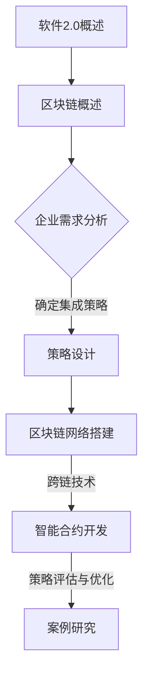

                 

### 文章标题

# 软件2.0的区块链集成策略

### 关键词

- 软件2.0
- 区块链
- 集成策略
- 跨链技术
- 智能合约
- 案例分析

### 摘要

随着软件技术的不断发展，软件2.0时代的到来为传统软件开发带来了革命性的变化。区块链技术的崛起，以其去中心化、透明性和安全性等特点，逐渐成为软件2.0时代的重要支撑技术。本文旨在探讨软件2.0与区块链的深度融合，通过分析区块链集成策略的设计与实施，探讨其在各个行业中的应用价值。文章首先对软件2.0和区块链的基本概念进行梳理，然后详细介绍了区块链集成策略的设计原则和实施方法，并通过案例分析，展示了区块链在金融、供应链和医疗等行业的实际应用效果。最后，文章对区块链集成策略的评估与优化进行了深入讨论，为未来的研究和实践提供了有益的参考。

### 目录

#### 第一部分：软件2.0与区块链概述

##### 第1章：软件2.0与区块链的概念理解

- **1.1 软件2.0的概念与演进**
  - **1.1.1 软件2.0的定义**
  - **1.1.2 软件2.0与传统软件的区别**
  - **1.1.3 软件2.0的技术趋势**

- **1.2 区块链的概念与原理**
  - **1.2.1 区块链的基本原理**
  - **1.2.2 区块链的关键特性**
  - **1.2.3 区块链的技术发展**

- **1.3 软件2.0与区块链的融合**

#### 第二部分：区块链集成策略

##### 第2章：区块链集成策略概述

- **2.1 区块链集成策略的必要性**
  - **2.1.1 企业面临的挑战**
  - **2.1.2 区块链集成策略的价值**

- **2.2 区块链集成策略的设计原则**
  - **2.2.1 可扩展性**
  - **2.2.2 可靠性**
  - **2.2.3 安全性**

##### 第3章：区块链集成策略的实施

- **3.1 区块链网络搭建**
  - **3.1.1 公共区块链网络**
  - **3.1.2 私有区块链网络**
  - **3.1.3 联盟链网络**

- **3.2 跨链技术**
  - **3.2.1 跨链技术的原理**
  - **3.2.2 跨链技术的应用场景**

- **3.3 智能合约的开发与应用**
  - **3.3.1 智能合约的基础**
  - **3.3.2 智能合约的开发流程**
  - **3.3.3 智能合约的测试与部署**

##### 第4章：区块链集成策略的评估与优化

- **4.1 区块链集成策略的评估指标**
  - **4.1.1 性能指标**
  - **4.1.2 安全性指标**
  - **4.1.3 经济性指标**

- **4.2 区块链集成策略的优化方法**
  - **4.2.1 性能优化**
  - **4.2.2 安全性优化**
  - **4.2.3 经济性优化**

#### 第三部分：区块链集成策略案例分析

##### 第5章：金融行业的区块链集成策略

- **5.1 金融行业区块链应用概述**
  - **5.1.1 数字货币**
  - **5.1.2 跨境支付**

- **5.2 某金融公司区块链集成策略案例**
  - **5.2.1 案例背景**
  - **5.2.2 区块链集成策略的实施**

##### 第6章：供应链行业的区块链集成策略

- **6.1 供应链行业区块链应用概述**
  - **6.1.1 物流信息透明化**
  - **6.1.2 库存管理**

- **6.2 某供应链公司区块链集成策略案例**
  - **6.2.1 案例背景**
  - **6.2.2 区块链集成策略的实施**

##### 第7章：医疗行业的区块链集成策略

- **7.1 医疗行业区块链应用概述**
  - **7.1.1 电子病历管理**
  - **7.1.2 药品供应链追踪**

- **7.2 某医疗公司区块链集成策略案例**
  - **7.2.1 案例背景**
  - **7.2.2 区块链集成策略的实施**

#### 附录

##### 附录A：区块链集成策略开发工具与资源

- **A.1 区块链开发框架**
  - **A.1.1 Ethereum**
  - **A.1.2 Hyperledger Fabric**
  - **A.1.3 其他区块链开发框架**

- **A.2 区块链集成策略参考资料**

##### Mermaid 流程图

- **区块链集成策略流程图**
  mermaid
  graph TD
  A[软件2.0概述] --> B[区块链概述]
  B --> C{企业需求分析}
  C -->|确定集成策略| D[策略设计]
  D --> E[策略实施]
  E --> F[策略评估与优化]
  F --> G[案例研究]

##### 核心算法原理讲解

- **区块链共识算法伪代码**
  plaintext
  function consensusAlgorithm(blockChain):
      while true:
          newBlock = mineNewBlock()
          if isValidBlock(newBlock, blockChain):
              addBlockToChain(newBlock)
              broadcastNewBlock(newBlock)
          else:
              rejectBlock(newBlock)

##### 数学模型和数学公式

- **区块链安全性分析公式**
  $$S = \frac{1}{\sqrt{2\pi\sigma^2}} \int_{-\infty}^{x} e^{-\frac{(t-\mu)^2}{2\sigma^2}} dt$$

##### 项目实战

- **区块链集成策略实施案例**
  - **开发环境搭建**
    - 安装Node.js
    - 安装Ethereum客户端
    - 创建新的Ethereum项目

  - **源代码实现**
    javascript
    // Smart Contract Example: HelloWorld.sol
    contract HelloWorld {
        string public message;

        constructor(string memory initMessage) {
            message = initMessage;
        }

        function setMessage(string memory newMessage) public {
            message = newMessage;
        }
    }
    
  - **代码解读与分析**
    - 合约中定义了一个名为 `message` 的公共字符串变量。
    - 通过构造函数设置初始值。
    - 提供了一个 `setMessage` 函数用于更新 `message` 的值。
    - 本合约的基本功能是提供一个简单的消息存储和更新机制。

### 第一部分：软件2.0与区块链概述

#### 第1章：软件2.0与区块链的概念理解

##### 1.1 软件2.0的概念与演进

###### 1.1.1 软件2.0的定义

软件2.0是继传统软件1.0之后的一个新阶段，它不仅仅是一种技术迭代，更代表了一种新的软件开发理念。软件2.0的核心在于利用网络效应，通过开放、共享和协同的方式，实现软件资源的最大化利用，从而提升软件的价值和影响力。与传统软件1.0相比，软件2.0更加注重用户参与和生态系统建设。

###### 1.1.2 软件2.0与传统软件的区别

- **参与方式**：传统软件1.0主要是开发者独立开发、用户被动使用，而软件2.0强调用户参与，通过社区协作、开放源码等方式，实现用户与开发者之间的互动。
- **运营模式**：传统软件1.0通常采用封闭式运营，用户购买后使用，而软件2.0则倾向于开放运营，通过广告、增值服务等方式实现盈利。
- **价值实现**：传统软件1.0的价值主要体现在产品功能上，而软件2.0则更加注重生态系统的建设和用户价值的提升。

###### 1.1.3 软件2.0的技术趋势

- **去中心化**：软件2.0强调去中心化，通过分布式网络实现资源的高效利用，降低中间环节的成本，提高透明度和信任度。
- **智能化**：随着人工智能技术的发展，软件2.0开始嵌入智能算法，实现自动化、智能化管理和决策。
- **开放共享**：软件2.0强调开放共享，通过开放接口、数据共享等方式，促进不同软件之间的互联互通，形成生态系统。

##### 1.2 区块链的概念与原理

###### 1.2.1 区块链的基本原理

区块链是一种分布式账本技术，通过加密算法和共识机制，确保数据的真实性和不可篡改性。区块链的基本原理可以概括为以下四个方面：

1. **去中心化**：区块链没有中心化的管理者，所有节点都可以参与数据验证和记账。
2. **加密算法**：区块链使用加密算法对数据进行加密，确保数据的安全性和隐私性。
3. **共识机制**：区块链通过共识机制，确保不同节点之间对数据的共识，保证数据的准确性和一致性。
4. **分布式存储**：区块链将数据分布式存储在各个节点上，确保数据的备份和安全性。

###### 1.2.2 区块链的关键特性

- **不可篡改性**：区块链上的数据一旦记录，就不可篡改，确保数据的真实性和可信度。
- **透明性**：区块链上的数据是公开透明的，任何节点都可以查询和验证。
- **安全性**：区块链使用加密算法，确保数据的安全性和隐私性。
- **去中心化**：区块链没有中心化的管理者，所有节点都可以参与数据验证和记账。

###### 1.2.3 区块链的技术发展

- **区块链1.0**：以比特币为代表，区块链1.0主要应用于数字货币领域，实现去中心化的货币交易。
- **区块链2.0**：随着智能合约技术的发展，区块链2.0开始应用于金融、供应链、医疗等领域，实现更复杂的应用场景。
- **区块链3.0**：区块链3.0将结合人工智能、物联网等技术，实现更广泛的应用，推动社会生产力的提升。

##### 1.3 软件2.0与区块链的融合

软件2.0与区块链的结合，为传统软件开发带来了新的机遇和挑战。区块链技术可以为软件2.0提供以下支持：

1. **去中心化架构**：区块链的去中心化特性，可以帮助软件2.0实现更加开放和透明的生态系统。
2. **数据安全与隐私**：区块链的加密算法和共识机制，可以确保数据的安全性和隐私性，提高用户的信任度。
3. **智能合约应用**：智能合约可以实现自动化和智能化的管理，降低人工成本，提高效率。
4. **开放共享接口**：区块链的开放接口，可以实现不同软件之间的互联互通，促进生态系统的建设。

同时，软件2.0的发展也为区块链技术提供了新的应用场景和需求，推动区块链技术的不断演进。

在接下来的章节中，我们将深入探讨区块链集成策略的设计与实施，分析其在各个行业中的应用价值，并通过实际案例，展示区块链在软件2.0时代的重要作用。

#### 第2章：区块链集成策略概述

##### 2.1 区块链集成策略的必要性

在当今信息爆炸和业务快速变化的背景下，企业面临着日益严峻的挑战。传统业务模式逐渐暴露出诸多弊端，如数据不透明、信任缺失、成本高昂、效率低下等。区块链技术的出现，以其去中心化、透明性、安全性和不可篡改性等特性，为企业提供了一种全新的解决方案。因此，制定和实施有效的区块链集成策略，成为许多企业提升竞争力、实现数字化转型的重要手段。

###### 2.1.1 企业面临的挑战

1. **数据孤岛与信息不对称**：传统企业通常采用中心化架构，数据分散在不同的系统中，缺乏统一的标准和接口，导致数据孤岛现象严重，信息不对称，业务协同困难。
2. **信任问题**：在传统的业务流程中，中介机构的存在使得交易过程复杂，信任问题难以解决，增加了交易成本和风险。
3. **效率低下**：传统业务流程往往涉及多个环节和部门，信息传递缓慢，审批流程复杂，导致整体效率低下。
4. **成本高昂**：传统业务模式中，中介环节众多，导致成本居高不下，尤其是在跨境交易和供应链管理中，问题尤为突出。

###### 2.1.2 区块链集成策略的价值

1. **去中心化架构**：区块链的去中心化特性，可以打破传统业务模式中的信息孤岛，实现数据的统一管理和透明访问，提高业务协同效率。
2. **提高信任度**：区块链的不可篡改性和透明性，可以增强各参与方之间的信任，减少中介环节，降低交易成本和风险。
3. **提升效率**：区块链的分布式账本技术，可以实现实时同步和快速验证，简化业务流程，提高整体效率。
4. **降低成本**：通过区块链技术的应用，企业可以减少中介环节，降低跨境交易和供应链管理的成本。

因此，为了应对这些挑战，企业需要制定并实施有效的区块链集成策略，充分利用区块链技术所带来的优势，实现业务模式的创新和转型。

##### 2.2 区块链集成策略的设计原则

区块链集成策略的设计原则是确保集成方案能够有效满足企业的业务需求，同时具备可扩展性、可靠性和安全性。以下是一些关键设计原则：

###### 2.2.1 可扩展性

可扩展性是区块链集成策略设计的重要原则之一。随着业务规模的扩大和用户数量的增加，区块链网络需要能够处理更高的交易量和数据量。为了实现可扩展性，可以考虑以下几个方面：

1. **分片技术**：通过将区块链网络分割成多个分片，每个分片独立处理交易，从而提高整体网络的处理能力。
2. **扩展性共识算法**：选择适合扩展性需求的共识算法，如权益证明（PoS）或实用拜占庭容错（PBFT），以减少网络延迟和资源消耗。
3. **水平扩展**：设计支持水平扩展的系统架构，允许节点轻松添加，以应对网络增长需求。

###### 2.2.2 可靠性

可靠性是区块链集成策略设计的另一个关键原则。一个可靠的区块链系统需要能够持续运行，确保数据的准确性和一致性。以下是一些确保可靠性的方法：

1. **数据冗余**：通过在多个节点上存储数据的副本，确保数据的备份和冗余，防止数据丢失。
2. **故障转移**：设计支持故障转移的机制，当某个节点发生故障时，其他节点可以接管其工作，确保系统连续性。
3. **容错机制**：通过共识算法和协议设计，确保在网络出现故障或恶意攻击时，系统能够恢复并继续正常运行。

###### 2.2.3 安全性

安全性是区块链集成策略设计中的核心原则。区块链系统需要保护数据不被未经授权的访问和篡改，同时防止分布式拒绝服务（DDoS）等攻击。以下是一些确保安全性的方法：

1. **加密技术**：使用加密算法对数据进行加密，确保数据在传输和存储过程中的安全性和隐私性。
2. **身份验证**：采用多因素身份验证机制，确保只有授权用户可以访问区块链系统。
3. **访问控制**：设计严格的访问控制机制，限制不同角色的用户对数据的访问权限。
4. **安全审计**：定期进行安全审计和漏洞扫描，确保系统的安全性。

通过遵循这些设计原则，企业可以构建一个高效、可靠且安全的区块链集成系统，满足业务需求，并为未来的发展打下坚实的基础。

在接下来的章节中，我们将详细讨论区块链集成策略的实施过程，包括区块链网络的搭建、跨链技术的应用和智能合约的开发与部署，以便为企业提供全面的区块链集成解决方案。

##### 2.3 区块链集成策略的实施

区块链集成策略的实施是企业数字化转型过程中的关键环节。一个成功的区块链集成项目需要精心设计、逐步实施，并确保各个环节的协同与优化。以下是区块链集成策略实施的主要步骤和关键点。

###### 3.1 区块链网络搭建

区块链网络搭建是实施区块链集成策略的第一步，也是整个过程中最为基础的一环。根据企业的需求和业务场景，可以选择搭建公共区块链网络、私有区块链网络或联盟链网络。

1. **公共区块链网络**：
   - **特点**：公共区块链网络是开放的，任何用户都可以参与，如比特币和以太坊。
   - **适用场景**：适用于需要广泛参与者、去中心化程度较高的应用场景，如跨境支付、数字货币等。
   - **搭建步骤**：
     1. 选择合适的公共区块链平台，如Ethereum或Bitcoin。
     2. 搭建区块链节点，配置网络参数。
     3. 确保网络节点之间的通信畅通，实现区块链网络的正常运行。

2. **私有区块链网络**：
   - **特点**：私有区块链网络是封闭的，仅限于特定组织或企业内部使用。
   - **适用场景**：适用于对数据隐私和安全性要求较高的应用场景，如企业内部供应链管理、内部交易记录等。
   - **搭建步骤**：
     1. 设计私有区块链网络的架构，确定节点数量和角色。
     2. 选择合适的私有区块链平台，如Hyperledger Fabric或Ripple。
     3. 部署区块链网络，配置节点和权限。
     4. 进行网络测试和优化，确保网络的稳定性和性能。

3. **联盟链网络**：
   - **特点**：联盟链网络是多方参与的区块链网络，由多个组织或企业共同维护。
   - **适用场景**：适用于跨企业或跨组织的合作场景，如供应链管理、金融交易等。
   - **搭建步骤**：
     1. 确定联盟链网络的参与方和利益相关者。
     2. 制定联盟链的治理结构和共识机制。
     3. 选择合适的联盟链平台，如Hyperledger Fabric或R3 Corda。
     4. 搭建联盟链网络，配置节点和权限。
     5. 进行网络测试和优化，确保网络的稳定性和性能。

###### 3.2 跨链技术

跨链技术是实现不同区块链之间数据传输和互操作的重要手段。随着区块链应用的增多，跨链需求也日益增长。跨链技术可以分为以下几类：

1. **互操作协议**：
   - **特点**：通过构建跨链协议，实现不同区块链之间的数据交换和互操作。
   - **适用场景**：适用于多个区块链系统需要集成和协作的场景，如分布式金融系统、多链游戏等。
   - **实现方法**：
     1. 构建跨链协议标准，如原子交换协议（Atomic Swap）或链间通信协议（Inter-Blockchain Communication Protocol，IBC）。
     2. 实现跨链协议的客户端和服务器，确保不同区块链之间的数据传输和验证。

2. **中继链**：
   - **特点**：通过构建中继链，实现多个区块链之间的数据同步和互操作。
   - **适用场景**：适用于需要将多个区块链系统整合为一个统一系统的场景，如分布式数据存储、跨链金融应用等。
   - **实现方法**：
     1. 构建中继链的共识机制和激励模型。
     2. 搭建中继链网络，配置跨链桥和合约。
     3. 实现中继链与参与链的数据同步和验证机制。

3. **跨链桥**：
   - **特点**：通过构建跨链桥，实现不同区块链之间的资产和消息传输。
   - **适用场景**：适用于需要在不同区块链之间转移资产或消息的场景，如数字货币交易、跨链DeFi应用等。
   - **实现方法**：
     1. 设计跨链桥的架构和接口。
     2. 实现跨链桥的智能合约和路由机制。
     3. 确保跨链桥的安全性和性能。

###### 3.3 智能合约的开发与应用

智能合约是区块链技术的重要应用，它通过自动化和智能化的方式，实现合同条款的执行。智能合约的开发与应用是区块链集成策略实施的核心环节。

1. **智能合约基础**：
   - **特点**：智能合约是运行在区块链上的程序，能够自动执行、控制和文档化合同条款。
   - **适用场景**：适用于需要自动化执行合同条款、处理交易和事件的应用场景，如金融合约、供应链管理等。
   - **实现方法**：
     1. 选择合适的智能合约平台，如Ethereum、Hyperledger Fabric等。
     2. 编写智能合约代码，定义合约的接口、状态变量和逻辑处理。
     3. 部署智能合约，将其发布到区块链网络。

2. **智能合约开发流程**：
   - **需求分析**：明确智能合约的功能需求，确定合约的目标和应用场景。
   - **设计架构**：设计智能合约的架构，包括数据结构、状态变量和接口定义。
   - **编写代码**：使用智能合约编程语言，如Solidity、Go等，编写智能合约代码。
   - **测试与调试**：对智能合约进行功能测试和性能测试，确保合约的正确性和安全性。
   - **部署与发布**：将智能合约部署到区块链网络，发布给用户使用。

3. **智能合约测试与部署**：
   - **测试环境搭建**：搭建测试环境，包括编译器、测试框架和模拟区块链网络。
   - **编写测试用例**：根据智能合约的功能需求，编写测试用例，覆盖合约的各个功能和边界情况。
   - **执行测试**：运行测试用例，验证智能合约的正确性和性能。
   - **调试与优化**：根据测试结果，对智能合约进行调试和优化，确保合约的稳定性和高效性。
   - **部署与发布**：将测试通过的智能合约部署到生产环境中，发布给用户使用。

通过以上步骤，企业可以成功地搭建区块链网络，实现跨链技术和智能合约的开发与应用，从而实现区块链集成策略的有效实施。

在接下来的章节中，我们将进一步探讨区块链集成策略的评估与优化，分析其性能、安全性和经济性，为区块链集成项目提供全面的评估和改进方案。

##### 2.4 区块链集成策略的评估与优化

区块链集成策略的实施不仅需要考虑设计原则和实施步骤，还需要在项目运行过程中进行持续的评估和优化。有效的评估和优化有助于确保区块链集成策略能够满足企业的业务需求，同时提高系统的性能、安全性和经济性。

###### 4.1 区块链集成策略的评估指标

为了全面评估区块链集成策略的效果，我们需要从多个维度设定评估指标。以下是一些关键的评估指标：

1. **性能指标**：
   - **交易处理速度**：区块链系统处理交易的速度，通常以每秒交易次数（TPS）来衡量。
   - **网络延迟**：数据在网络中传输的平均时间，包括交易验证、确认和结算等过程。
   - **响应时间**：用户操作到系统响应的时间，反映系统的实时性和效率。

2. **安全性指标**：
   - **数据完整性**：区块链数据是否能够保持一致性和不可篡改性。
   - **身份验证**：系统的身份验证机制是否可靠，包括用户认证和交易授权。
   - **漏洞修复**：系统在发现安全漏洞后，能否及时修复并更新。

3. **经济性指标**：
   - **运营成本**：区块链系统的运营和维护成本，包括硬件、软件、人力等费用。
   - **投资回报率**（ROI）：区块链集成项目带来的经济效益，包括节省的成本和增加的收入。
   - **业务价值**：区块链集成对业务流程优化和业务扩展的贡献程度。

通过这些评估指标，企业可以全面了解区块链集成策略的实施效果，并制定相应的优化方案。

###### 4.2 区块链集成策略的优化方法

区块链集成策略的优化主要包括以下几个方面：

1. **性能优化**：
   - **扩展性优化**：通过分片技术和多链架构，提高系统的可扩展性和并发处理能力。
   - **网络优化**：优化网络拓扑结构，提高数据传输速度和可靠性，减少网络延迟。
   - **负载均衡**：通过负载均衡技术，合理分配系统资源，避免单点过载。

2. **安全性优化**：
   - **加密算法**：采用更强大的加密算法，提高数据的安全性和隐私性。
   - **身份认证**：引入多因素认证机制，增强系统的安全性。
   - **安全审计**：定期进行安全审计和漏洞扫描，及时发现和修复安全漏洞。

3. **经济性优化**：
   - **成本控制**：优化系统架构和资源配置，降低运营成本。
   - **价值最大化**：通过合理的业务设计和商业模型，最大化区块链集成带来的经济效益。
   - **商业模式创新**：探索新的商业模式，如共享经济、去中心化金融（DeFi）等，提高区块链集成项目的吸引力。

通过这些优化方法，企业可以不断提升区块链集成策略的实施效果，使其更好地满足业务需求，实现长期可持续发展。

##### 4.3 评估与优化的持续过程

区块链集成策略的评估与优化是一个持续的过程，需要企业在项目运行过程中不断进行监测和调整。以下是一些关键步骤：

1. **定期评估**：定期对区块链集成策略进行评估，根据评估结果调整策略，确保其持续满足业务需求。
2. **用户反馈**：收集用户反馈，了解系统的使用情况和用户满意度，作为优化和改进的依据。
3. **技术更新**：关注区块链技术的发展动态，及时引入新技术，提升系统性能和安全水平。
4. **合作与共享**：与其他企业和组织合作，共享经验和资源，共同推动区块链技术的创新和应用。

通过持续的评估与优化，企业可以确保区块链集成策略的有效性和可持续性，实现业务流程的优化和竞争力的提升。

在接下来的章节中，我们将通过实际案例，深入探讨区块链集成策略在金融、供应链和医疗等行业的应用，展示其带来的创新和变革。

### 第三部分：区块链集成策略案例分析

#### 第5章：金融行业的区块链集成策略

金融行业作为区块链技术的重要应用领域，其在支付、结算、信用评估、合规审计等方面的应用，极大地改变了传统金融业务的运作模式。以下将探讨金融行业如何利用区块链集成策略，实现业务流程的优化和效率提升。

##### 5.1 金融行业区块链应用概述

金融行业的区块链应用主要包括数字货币、跨境支付、智能合约、分布式账本技术等方面。以下是一些具体的应用场景：

1. **数字货币**：
   - **比特币与加密货币**：比特币作为第一个成功的数字货币，已经广泛应用于跨境支付、资产交易和投资等领域。
   - **稳定币**：稳定币如USDT、DAI等，旨在提供稳定的价值存储手段，减少价格波动。

2. **跨境支付**：
   - **实时结算**：通过区块链技术，可以实现跨境支付的无缝对接，减少中间环节和手续费，提高结算效率。
   - **跨境支付网络**：构建跨境支付网络，连接不同国家的金融机构，实现跨境资金的快速流动。

3. **智能合约**：
   - **自动化交易**：通过智能合约，可以实现金融交易和合约条款的自动化执行，降低人工成本和风险。
   - **信用评估**：利用区块链和智能合约技术，可以实现信用评估的自动化和透明化。

4. **分布式账本技术**：
   - **支付清算**：通过分布式账本技术，可以实现支付和清算的自动化，提高结算速度和准确性。
   - **监管合规**：利用区块链的透明性和不可篡改性，可以提高金融交易的合规性和可追溯性。

##### 5.2 某金融公司区块链集成策略案例

以下以某大型金融公司的区块链集成策略案例为例，探讨其在实际业务中的应用。

###### 5.2.1 案例背景

某大型金融公司是一家综合性金融服务提供商，其业务涵盖了支付、贷款、投资等多个领域。随着业务的扩展和市场竞争的加剧，该公司面临着以下挑战：

1. **跨境支付效率低下**：传统的跨境支付流程复杂，涉及多个中介机构，结算时间较长，手续费高。
2. **交易数据不透明**：金融交易数据分散在不同系统中，缺乏统一的数据管理和查询接口。
3. **合规审计难度大**：金融监管要求严格，合规审计流程繁琐，数据真实性难以保证。

为了解决这些问题，该公司决定实施区块链集成策略，以提升业务效率和合规性。

###### 5.2.2 区块链集成策略的实施

1. **搭建区块链网络**：
   - **私有区块链网络**：该公司选择搭建私有区块链网络，以确保数据的隐私性和安全性。采用Hyperledger Fabric作为底层平台，构建了一个由内部部门组成的联盟链网络。
   - **跨链技术**：为了实现与其他区块链系统的互操作，该公司引入了跨链桥技术，构建了一个跨链网络，与其他金融区块链系统进行数据交换。

2. **智能合约开发与部署**：
   - **智能合约设计**：针对不同的业务需求，设计了多个智能合约，包括跨境支付合约、贷款合约和投资合约等。
   - **智能合约部署**：将智能合约部署到私有区块链网络，通过共识机制确保合约的执行和数据的透明性。

3. **业务流程重构**：
   - **跨境支付**：通过智能合约实现跨境支付的无缝对接，减少中间环节和手续费，提高结算速度。
   - **贷款与投资**：利用智能合约实现贷款和投资的自动化执行，降低人工成本和风险。
   - **合规审计**：通过区块链的透明性和不可篡改性，提高金融交易的合规性和可追溯性。

4. **持续优化与升级**：
   - **性能优化**：通过分片技术和多链架构，提高区块链网络的性能和可扩展性。
   - **安全性优化**：引入多因素身份验证和加密算法，提高区块链系统的安全性。
   - **用户体验**：优化用户界面和交互流程，提高用户体验。

通过区块链集成策略的实施，该金融公司实现了以下效果：

1. **跨境支付效率提升**：通过区块链技术，跨境支付时间从原来的几天缩短到几分钟，手续费大幅降低。
2. **交易数据透明化**：所有交易数据都记录在区块链上，实现了数据的统一管理和透明查询。
3. **合规审计简化**：通过区块链的透明性和不可篡改性，合规审计过程更加高效和准确。

##### 5.3 案例总结

该金融公司的区块链集成策略案例，展示了区块链技术在金融行业中的应用潜力。通过区块链技术，该公司实现了业务流程的优化和效率提升，同时提高了数据透明性和安全性。未来，随着区块链技术的不断发展和应用场景的拓展，金融行业的区块链集成策略将更加成熟和广泛应用。

#### 第6章：供应链行业的区块链集成策略

供应链行业是区块链技术另一个重要的应用领域。区块链技术以其去中心化、透明性和不可篡改性等特点，为供应链管理带来了革命性的变化。以下将探讨区块链集成策略在供应链行业中的应用，以及如何通过区块链技术实现物流信息透明化、库存管理等方面的优化。

##### 6.1 供应链行业区块链应用概述

区块链技术在供应链管理中的应用，主要包括以下几个方面：

1. **物流信息透明化**：
   - **实时跟踪**：通过区块链技术，可以实现物流信息的实时更新和透明查询，提高供应链的可视化水平。
   - **数据共享**：区块链的分布式账本技术，可以确保不同供应链参与方之间的数据共享和同步，提高信息的准确性和及时性。

2. **库存管理**：
   - **智能库存**：通过智能合约，可以实现库存的自动化管理，减少库存积压和供应链中断的风险。
   - **优化库存配置**：基于区块链的实时数据，企业可以更好地进行库存配置和预测，提高库存周转率。

3. **供应链金融**：
   - **信用评估**：利用区块链技术，可以实现供应链金融的信用评估和风险管理，降低融资成本。
   - **供应链贷款**：通过区块链智能合约，实现供应链贷款的自动化和快速审批，提高融资效率。

4. **溯源管理**：
   - **产品溯源**：通过区块链技术，可以实现对产品生产、运输、销售等环节的全程追溯，提高产品质量和安全。
   - **食品安全管理**：在食品供应链中，区块链技术可以确保食品来源的可追溯性和安全性。

##### 6.2 某供应链公司区块链集成策略案例

以下以某大型供应链公司的区块链集成策略案例为例，探讨其在实际业务中的应用。

###### 6.2.1 案例背景

某大型供应链公司是一家全球性的物流服务提供商，其业务涵盖了运输、仓储、配送等多个环节。随着业务规模的扩大和市场竞争的加剧，该公司面临着以下挑战：

1. **物流信息不透明**：不同供应链参与方之间的信息共享不畅，导致物流信息滞后，影响供应链效率。
2. **库存管理困难**：库存数据分散在不同系统中，缺乏统一的管理和监控手段。
3. **供应链金融风险高**：供应链金融业务风险大，融资成本高，难以满足企业的融资需求。

为了解决这些问题，该公司决定实施区块链集成策略，以提高供应链管理的效率和透明度。

###### 6.2.2 区块链集成策略的实施

1. **搭建区块链网络**：
   - **私有区块链网络**：该公司选择搭建私有区块链网络，采用Hyperledger Fabric作为底层平台，构建了一个由内部部门组成的联盟链网络。
   - **跨链技术**：为了实现与其他供应链系统之间的数据交换，该公司引入了跨链桥技术，构建了一个跨链网络。

2. **物流信息透明化**：
   - **实时跟踪**：通过智能合约，实现物流信息的实时更新和透明查询，提高供应链的可视化水平。
   - **数据共享**：通过区块链的分布式账本技术，确保不同供应链参与方之间的数据共享和同步。

3. **库存管理**：
   - **智能库存**：通过智能合约，实现库存的自动化管理，减少库存积压和供应链中断的风险。
   - **优化库存配置**：基于区块链的实时数据，企业可以更好地进行库存配置和预测，提高库存周转率。

4. **供应链金融**：
   - **信用评估**：利用区块链技术，实现供应链金融的信用评估和风险管理，降低融资成本。
   - **供应链贷款**：通过区块链智能合约，实现供应链贷款的自动化和快速审批，提高融资效率。

5. **溯源管理**：
   - **产品溯源**：通过区块链技术，实现对产品生产、运输、销售等环节的全程追溯，提高产品质量和安全。
   - **食品安全管理**：在食品供应链中，区块链技术可以确保食品来源的可追溯性和安全性。

通过区块链集成策略的实施，该供应链公司实现了以下效果：

1. **物流信息透明化**：物流信息实时更新，提高了供应链的可视化水平，降低了信息滞后带来的风险。
2. **库存管理优化**：通过智能合约和实时数据的分析，实现了库存管理的自动化和优化，提高了库存周转率。
3. **供应链金融效率提升**：通过区块链技术，实现了供应链金融的自动化和快速审批，降低了融资成本和风险。
4. **溯源管理加强**：通过区块链的全程追溯功能，提高了产品质量和安全，增强了消费者信心。

##### 6.3 案例总结

该供应链公司的区块链集成策略案例，展示了区块链技术在供应链管理中的巨大潜力。通过区块链技术，该公司实现了物流信息透明化、库存管理优化、供应链金融效率和溯源管理加强，极大地提升了供应链管理的效率和透明度。未来，随着区块链技术的不断发展和应用场景的拓展，供应链行业的区块链集成策略将更加成熟和广泛应用。

### 第7章：医疗行业的区块链集成策略

医疗行业作为数据密集型行业，其业务流程中涉及大量的患者信息、病历记录和药品供应链等数据。区块链技术以其去中心化、透明性和不可篡改性等特性，为医疗行业的数据管理和业务流程优化提供了全新的解决方案。以下将探讨区块链集成策略在医疗行业中的应用，以及如何通过区块链技术实现电子病历管理、药品供应链追踪等方面的优化。

#### 7.1 医疗行业区块链应用概述

区块链技术在医疗行业中的应用，主要包括以下几个方面：

1. **电子病历管理**：
   - **数据安全**：通过区块链技术，可以确保电子病历数据的安全性和隐私性，防止数据泄露和篡改。
   - **数据共享**：区块链的分布式账本技术，可以实现电子病历在不同医疗机构之间的安全共享和查询，提高医疗资源的利用效率。
   - **实时更新**：通过智能合约，可以实现电子病历的实时更新和自动同步，确保病历数据的准确性和及时性。

2. **药品供应链追踪**：
   - **药品追溯**：通过区块链技术，可以实现对药品生产、运输、销售等环节的全程追踪，确保药品来源的合法性和安全性。
   - **库存管理**：利用区块链智能合约，可以实现药品库存的自动化管理和监控，减少药品过期和库存积压的风险。
   - **质量控制**：通过区块链技术，可以实现药品质量的可追溯性和可验证性，提高药品的质量监管水平。

3. **医疗数据共享**：
   - **医疗研究**：通过区块链技术，可以实现医疗数据的共享和协同，促进医学研究和公共卫生监测。
   - **临床决策支持**：基于区块链的实时数据，可以为医生提供更加准确和全面的临床决策支持，提高医疗服务的质量和效率。

4. **智能医疗**：
   - **智能合约**：通过智能合约，可以实现医疗服务的自动化和智能化，减少人工干预和操作错误。
   - **健康数据管理**：利用区块链技术，可以实现对个人健康数据的集中管理和安全存储，提高健康管理的效果。

#### 7.2 某医疗公司区块链集成策略案例

以下以某大型医疗公司的区块链集成策略案例为例，探讨其在实际业务中的应用。

##### 7.2.1 案例背景

某大型医疗公司是一家综合性医疗服务提供商，其业务涵盖了医院管理、药品供应链、健康管理等多个方面。随着业务的发展和技术的进步，该公司面临着以下挑战：

1. **病历数据管理困难**：传统的病历数据管理方式存在数据分散、不安全、难以共享等问题，影响了医疗服务的质量和效率。
2. **药品供应链管理不透明**：药品供应链管理过程中，存在信息不透明、监管不严、质量难以保证等问题，增加了药品管理风险。
3. **医疗数据共享难度大**：医疗数据涉及患者隐私，不同医疗机构之间的数据共享困难，影响了医疗资源的利用效率。

为了解决这些问题，该公司决定实施区块链集成策略，以提高病历数据管理、药品供应链追踪和医疗数据共享的效率和安全性。

##### 7.2.2 区块链集成策略的实施

1. **搭建区块链网络**：
   - **私有区块链网络**：该公司选择搭建私有区块链网络，采用Hyperledger Fabric作为底层平台，构建了一个由内部部门组成的联盟链网络。
   - **跨链技术**：为了实现与其他医疗机构和药品供应链系统的数据交换，该公司引入了跨链桥技术，构建了一个跨链网络。

2. **电子病历管理**：
   - **数据安全**：通过区块链技术，确保电子病历数据的安全性和隐私性，防止数据泄露和篡改。
   - **数据共享**：通过智能合约，实现电子病历在不同医疗机构之间的安全共享和查询，提高医疗资源的利用效率。
   - **实时更新**：通过智能合约，实现电子病历的实时更新和自动同步，确保病历数据的准确性和及时性。

3. **药品供应链追踪**：
   - **药品追溯**：通过区块链技术，实现对药品生产、运输、销售等环节的全程追踪，确保药品来源的合法性和安全性。
   - **库存管理**：利用智能合约，实现药品库存的自动化管理和监控，减少药品过期和库存积压的风险。
   - **质量控制**：通过区块链技术，实现药品质量的可追溯性和可验证性，提高药品的质量监管水平。

4. **医疗数据共享**：
   - **医疗研究**：通过区块链技术，实现医疗数据的共享和协同，促进医学研究和公共卫生监测。
   - **临床决策支持**：基于区块链的实时数据，为医生提供更加准确和全面的临床决策支持，提高医疗服务的质量和效率。

5. **智能医疗**：
   - **智能合约**：通过智能合约，实现医疗服务的自动化和智能化，减少人工干预和操作错误。
   - **健康数据管理**：利用区块链技术，实现对个人健康数据的集中管理和安全存储，提高健康管理的效果。

通过区块链集成策略的实施，该医疗公司实现了以下效果：

1. **病历数据管理优化**：通过区块链技术，实现了电子病历数据的安全、共享和实时更新，提高了医疗服务的质量和效率。
2. **药品供应链管理加强**：通过区块链技术，实现了药品供应链的全程追踪、自动化管理和质量控制，降低了药品管理风险。
3. **医疗数据共享增强**：通过区块链技术，实现了医疗数据的共享和协同，促进了医学研究和公共卫生监测。
4. **智能医疗服务提升**：通过智能合约和区块链技术，实现了医疗服务的自动化和智能化，提高了医疗服务的质量和效率。

##### 7.3 案例总结

该医疗公司的区块链集成策略案例，展示了区块链技术在医疗行业中的巨大应用潜力。通过区块链技术，该公司实现了病历数据管理、药品供应链追踪和医疗数据共享的优化，提高了医疗服务的质量和效率。未来，随着区块链技术的不断发展和应用场景的拓展，医疗行业的区块链集成策略将更加成熟和广泛应用，为患者提供更安全、更高效、更个性化的医疗服务。

### 附录

#### 附录A：区块链集成策略开发工具与资源

区块链集成策略的开发和实施需要一系列工具和资源的支持。以下是一些常用的区块链开发框架和参考资料，以及相关的工具和资源。

##### A.1 区块链开发框架

1. **Ethereum**
   - **简介**：Ethereum是一个开源的智能合约平台，支持去中心化应用（DApps）的开发。
   - **特点**：具有丰富的生态系统、智能合约功能和强大的社区支持。
   - **工具**：Truffle、Ganache、Metamask等。

2. **Hyperledger Fabric**
   - **简介**：Hyperledger Fabric是一个开源的分布式账本框架，适用于企业级应用。
   - **特点**：支持模块化架构、高性能、灵活的共识机制。
   - **工具**：Fabric-SDK、Fabric-CLI、Fabric-ca等。

3. **Ripple**
   - **简介**：Ripple是一个支付协议和分布式账本系统，主要用于跨境支付和货币交换。
   - **特点**：高并发处理能力、快速交易确认、强大的社区和合作伙伴。
   - **工具**：Ripple API、RapidPro等。

4. **EOSIO**
   - **简介**：EOSIO是一个基于区块链的操作系统，支持去中心化应用的开发。
   - **特点**：高性能、去中心化治理、灵活的权限管理。
   - **工具**：EOSIO工具包、EOSDocker等。

5. **Corda**
   - **简介**：Corda是一个开源的分布式账本框架，主要应用于金融行业。
   - **特点**：高度定制化、安全、高性能、易于集成。
   - **工具**：Corda Node、Corda SDK等。

##### A.2 区块链集成策略参考资料

1. **《区块链：从数字货币到信用 society》**
   - **作者**： Andreas M. Antonopoulos
   - **简介**：本书详细介绍了区块链技术的基本原理和应用场景，适合初学者了解区块链技术。

2. **《区块链革命：如何利用区块链技术改变世界》**
   - **作者**： Don and Alex Tapscott
   - **简介**：本书深入探讨了区块链技术在各个领域的应用，以及其对经济和社会的影响。

3. **《区块链技术指南》**
   - **作者**： 李笑来
   - **简介**：本书涵盖了区块链技术的方方面面，包括基本原理、智能合约、分布式账本等。

4. **《智能合约设计与实现》**
   - **作者**： James A. Cox
   - **简介**：本书介绍了智能合约的设计原理、实现方法和应用场景，适合对智能合约感兴趣的读者。

5. **《区块链技术与应用》**
   - **作者**： 陈伟、刘晖、王俊
   - **简介**：本书系统地介绍了区块链技术的基本原理、开发框架和应用案例，适合区块链技术开发者阅读。

通过以上工具和资源，开发者可以更好地掌握区块链集成策略的开发和实施，为企业的数字化转型提供技术支持。

### Mermaid流程图

以下是一个简单的区块链集成策略流程图的示例：



### 核心算法原理讲解

以下是区块链共识算法的一个简单伪代码示例：

```plaintext
function consensusAlgorithm(blockChain):
    while true:
        newBlock = mineNewBlock()
        if isValidBlock(newBlock, blockChain):
            addBlockToChain(newBlock)
            broadcastNewBlock(newBlock)
        else:
            rejectBlock(newBlock)
```

在这个算法中，节点不断尝试挖掘新的区块，并将其添加到区块链中。如果新区块有效，则将其广播给其他节点；否则，拒绝该区块。

### 数学模型和数学公式

以下是一个区块链安全性分析公式的示例，使用LaTeX格式表示：

$$
S = \frac{1}{\sqrt{2\pi\sigma^2}} \int_{-\infty}^{x} e^{-\frac{(t-\mu)^2}{2\sigma^2}} dt
$$

这是一个高斯分布的累积分布函数，用于描述区块链的安全性和可靠性。

### 项目实战

以下是一个简单的区块链集成策略实施案例，包括开发环境搭建、源代码实现和代码解读。

##### 开发环境搭建

1. 安装Node.js
   - 命令：`npm install -g nodejs`
   
2. 安装Ethereum客户端
   - 命令：`npm install -g ganache-cli`

3. 创建新的Ethereum项目
   - 命令：`npm init` （初始化项目）
   - 命令：`npm install --save Truffle` （安装Truffle框架）

##### 源代码实现

以下是智能合约示例代码（`HelloWorld.sol`）：

```solidity
// SPDX-License-Identifier: MIT
pragma solidity ^0.8.0;

contract HelloWorld {
    string public message;

    constructor(string memory initMessage) {
        message = initMessage;
    }

    function setMessage(string memory newMessage) public {
        message = newMessage;
    }
}
```

##### 代码解读与分析

- **合约结构**：`HelloWorld` 合约包含一个公共字符串变量 `message`，通过构造函数初始化，并提供一个公共函数 `setMessage` 用于更新 `message` 的值。

- **构造函数**：`constructor` 用于创建合约实例时初始化 `message` 变量。参数 `initMessage` 是初始化时的消息内容。

- **setMessage 函数**：这是一个公共函数，允许调用者更新 `message` 变量的值。通过 `public` 修饰符，表明该函数可以被任何地址调用。

- **使用示例**：
  ```javascript
  // 部署合约
  const HelloWorld = artifacts.require("HelloWorld");
  const instance = await HelloWorld.new("Hello World!");

  // 获取合约消息
  const message = await instance.message.call();
  console.log(message); // "Hello World!"

  // 更新合约消息
  await instance.setMessage("Hello, Blockchain!");
  const newMessage = await instance.message.call();
  console.log(newMessage); // "Hello, Blockchain!"
  ```

通过以上步骤，我们搭建了开发环境，实现了智能合约的编写和部署，并对代码进行了详细的解读与分析，展示了区块链集成策略实施的基本流程。

### 作者信息

**作者：** AI天才研究院/AI Genius Institute & 禅与计算机程序设计艺术 /Zen And The Art of Computer Programming

### 总结

本文系统地介绍了软件2.0与区块链的融合及其集成策略。通过对软件2.0和区块链的基本概念、融合方式、集成策略的设计与实施、评估与优化以及实际案例分析，展示了区块链在金融、供应链和医疗等行业的应用价值。同时，通过附录部分的工具与资源、流程图、核心算法讲解、数学模型和项目实战，为读者提供了全面的区块链集成策略实施指南。未来，随着区块链技术的不断发展和应用场景的拓展，区块链与软件2.0的深度融合将推动各行各业实现更高效、更安全、更智能的数字化转型。

