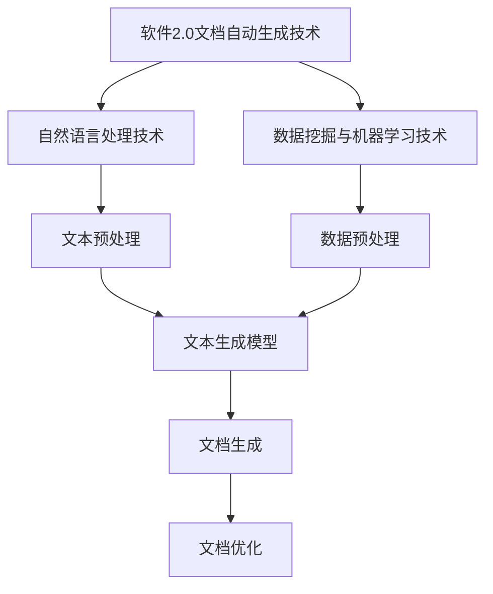

                 

# 文章标题: 软件2.0的文档自动生成技术

> 关键词：软件2.0、文档自动生成、自然语言处理、数据挖掘、机器学习

> 摘要：本文深入探讨了软件2.0时代的文档自动生成技术，从概念、原理、架构、算法、实践到未来展望，全面解析了这一前沿领域的核心内容和关键技术。

## 引言

在软件发展的历程中，文档一直是软件开发过程中不可或缺的一部分。从早期的纸质文档，到电子文档，再到如今的在线文档，文档的形式和存储方式在不断变化。然而，随着软件系统的复杂度不断增加，文档的编写和管理变得越来越困难。软件2.0时代，随着人工智能技术的发展，文档自动生成技术应运而生，为解决这一难题提供了新的思路和方法。

本文将围绕软件2.0的文档自动生成技术展开讨论，首先介绍软件2.0的概念以及文档自动生成技术在其中的重要性。接着，我们将探讨文档自动生成技术的基本原理，包括自然语言处理技术、数据挖掘与机器学习技术。随后，我们将分析文档自动生成技术的应用场景，并详细阐述其流程图和伪代码。在此基础上，我们还将介绍一个实际案例，通过Python代码展示文档自动生成的实现过程。最后，我们将展望文档自动生成技术的未来发展趋势和面临的挑战。

## 第一部分: 软件2.0的文档自动生成技术概述

### 第1章: 软件2.0的文档自动生成技术简介

#### 1.1 软件2.0的概念与文档自动生成技术的关系

软件2.0是指软件系统在互联网时代的新形态，它具有高度的可定制性、可扩展性和智能化特点。与传统软件相比，软件2.0更加注重用户体验，强调软件与用户的互动和协同工作。

文档自动生成技术是软件2.0的重要组成部分。在软件2.0时代，文档的编写和管理变得更加自动化和智能化。通过自然语言处理技术、数据挖掘与机器学习技术，文档自动生成技术能够根据用户需求、系统数据和知识库自动生成文档，大大提高了文档生成的效率和准确性。

#### 1.1.1 软件2.0的定义

软件2.0是基于互联网的软件系统，它具有以下特点：

1. **高度的可定制性**：软件2.0可以根据用户的需求和喜好进行定制，提供个性化的服务。
2. **可扩展性**：软件2.0可以通过模块化的设计，方便地扩展功能，满足不断变化的需求。
3. **智能化**：软件2.0利用人工智能技术，实现智能推荐、智能分析等功能，提高用户的体验和满意度。
4. **协同工作**：软件2.0强调用户与系统的互动和协同工作，通过社交网络、协作平台等方式，实现信息的共享和协作。

#### 1.1.2 文档自动生成技术在软件2.0中的重要性

在软件2.0时代，文档自动生成技术具有重要意义：

1. **提高工作效率**：通过自动化生成文档，减少了人工编写文档的时间和精力，提高了工作效率。
2. **确保文档质量**：文档自动生成技术可以根据用户需求和系统数据，自动生成高质量的文档，减少了人为错误和遗漏。
3. **降低成本**：文档自动生成技术减少了人工编写文档的成本，降低了企业的运营成本。
4. **促进知识共享**：文档自动生成技术可以根据知识库和系统数据，自动生成相关的文档，促进知识的共享和传播。

#### 1.1.3 文档自动生成技术的历史与发展

文档自动生成技术的历史可以追溯到20世纪60年代，当时计算机科学家们开始研究如何利用计算机自动生成文档。随着计算机技术的发展，文档自动生成技术逐渐成熟，并在各个领域得到了广泛应用。

在软件2.0时代，随着人工智能技术的崛起，文档自动生成技术得到了进一步发展。自然语言处理技术、数据挖掘与机器学习技术的应用，使得文档自动生成技术更加智能化和高效。

#### 1.2 文档自动生成技术的基本原理

文档自动生成技术的基本原理主要包括以下几个方面：

1. **自然语言处理技术**：自然语言处理技术是文档自动生成的基础，它包括文本预处理、文本生成等环节。通过文本预处理，将原始文本转化为计算机可以处理的格式；通过文本生成，根据用户需求生成符合要求的文档。
2. **数据挖掘与机器学习技术**：数据挖掘与机器学习技术是文档自动生成的重要手段，它可以对大量的文本数据进行分析和挖掘，提取出有价值的信息，并利用这些信息生成文档。
3. **知识库与知识图谱**：知识库与知识图谱是文档自动生成的重要资源，它们包含了大量的领域知识和信息，可以为文档自动生成提供支持。

#### 1.2.1 文档自动生成技术的分类

根据文档自动生成技术的原理和应用方式，可以将文档自动生成技术分为以下几类：

1. **基于规则的方法**：这种方法通过预先定义的规则和模板，自动生成文档。例如，在软件开发过程中，可以通过定义软件架构、模块、接口等规则，自动生成相应的文档。
2. **基于模板的方法**：这种方法通过使用预先定义的模板，自动填充文档内容。例如，在生成用户手册、产品说明书等文档时，可以使用模板来快速生成文档。
3. **基于数据驱动的方法**：这种方法通过分析大量的文本数据，自动生成文档。例如，在新闻写作、报告撰写等领域，可以通过分析大量文本数据，自动生成新闻稿、报告等文档。
4. **基于模型的方法**：这种方法通过构建文本生成模型，自动生成文档。例如，在生成聊天机器人对话、语音合成等应用中，可以通过构建模型，自动生成相应的文本。

#### 1.2.2 自然语言处理技术简介

自然语言处理（Natural Language Processing，NLP）是文档自动生成技术的重要组成部分，它旨在使计算机能够理解、生成和处理人类语言。NLP技术主要包括以下几个方面：

1. **文本预处理**：文本预处理是NLP的基础，包括分词、词性标注、命名实体识别等。通过文本预处理，可以将原始文本转化为计算机可以处理的格式。
2. **词向量表示**：词向量表示是将文本中的词语转化为计算机可以处理的数字向量。例如，Word2Vec、GloVe等算法可以将词语映射到高维空间中的向量。
3. **语言模型**：语言模型是NLP的核心技术之一，它用于预测一个单词序列的概率。例如，n-gram模型、循环神经网络（RNN）模型等。
4. **文本生成**：文本生成是NLP的应用之一，通过语言模型和文本生成算法，可以自动生成文本。例如，生成新闻稿、聊天机器人对话、自动生成摘要等。

#### 1.2.3 数据挖掘与机器学习在文档生成中的应用

数据挖掘与机器学习技术是文档自动生成的重要手段，它们可以用于分析大量文本数据，提取有价值的信息，并利用这些信息生成文档。以下是一些数据挖掘与机器学习技术在文档生成中的应用：

1. **主题模型**：主题模型是一种无监督学习方法，它可以将文本数据拆分为一系列主题，每个主题代表文本中的一个概念或主题。通过主题模型，可以自动提取文本的主题，并利用这些主题生成文档。
2. **序列模型**：序列模型是一种用于处理序列数据的方法，例如循环神经网络（RNN）和长短期记忆网络（LSTM）。通过序列模型，可以自动生成文本序列，从而实现文档生成。
3. **生成对抗网络（GAN）**：生成对抗网络是一种用于生成新数据的深度学习模型，它由生成器和判别器两部分组成。通过生成器和判别器的相互竞争，可以生成高质量的新数据。在文档生成中，GAN可以用于生成新的文本数据。

#### 1.3 文档自动生成技术的应用场景

文档自动生成技术可以应用于多个领域，以下是一些典型的应用场景：

1. **软件开发**：在软件开发过程中，文档自动生成技术可以用于生成需求文档、设计文档、用户手册等。通过分析代码和系统数据，自动生成相应的文档，提高开发效率。
2. **企业知识管理**：在企业知识管理中，文档自动生成技术可以用于生成知识库、报告、分析文档等。通过对企业内部数据和知识进行分析，自动生成相关的文档，促进知识共享。
3. **新闻写作**：在新闻写作中，文档自动生成技术可以用于生成新闻稿、摘要等。通过对大量新闻数据进行分析，自动生成新闻稿件，提高新闻报道的效率。
4. **教育领域**：在教育领域，文档自动生成技术可以用于生成教案、课程大纲、学习指南等。通过对教学数据和课程内容的分析，自动生成相关的教学文档。

#### 1.3.1 软件开发过程中的文档生成

在软件开发过程中，文档自动生成技术可以用于生成多种类型的文档，包括：

1. **需求文档**：通过分析用户需求，自动生成需求文档，包括功能需求、非功能需求等。
2. **设计文档**：通过分析系统设计，自动生成设计文档，包括架构设计、模块设计、接口设计等。
3. **用户手册**：通过分析系统功能和操作流程，自动生成用户手册，帮助用户了解和操作软件。
4. **测试文档**：通过分析测试计划和测试用例，自动生成测试文档，包括测试报告、测试总结等。

#### 1.3.2 企业知识管理的文档自动生成

在企业知识管理中，文档自动生成技术可以用于生成以下类型的文档：

1. **知识库**：通过分析企业内部数据和知识，自动生成知识库，包括术语定义、最佳实践、技术文档等。
2. **报告**：通过分析企业运营数据，自动生成各类报告，包括销售报告、财务报告、市场分析报告等。
3. **分析文档**：通过分析企业数据和业务流程，自动生成分析文档，包括市场分析报告、竞争对手分析报告等。
4. **培训材料**：通过分析企业培训需求和培训内容，自动生成培训材料，包括培训手册、PPT、视频等。

#### 1.3.3 文档自动生成的挑战与未来发展趋势

尽管文档自动生成技术在多个领域取得了显著的应用成果，但在实际应用中仍然面临着一系列挑战：

1. **准确性**：如何确保生成的文档内容准确无误，特别是在面对复杂、专业领域的文档时。
2. **一致性**：如何保证生成的文档内容在不同场景下的一致性。
3. **可扩展性**：如何使文档自动生成技术能够适应不断变化的需求和场景。

未来，文档自动生成技术将朝着更加智能化、高效化的方向发展：

1. **增强学习能力**：通过不断学习和优化，提高文档自动生成技术的准确性和一致性。
2. **融合多种技术**：将自然语言处理技术、数据挖掘与机器学习技术、知识图谱等技术进行融合，提高文档自动生成技术的能力。
3. **人机协同**：实现人与机器的协同工作，通过机器生成的文档和人工编辑相结合，提高文档的质量和效率。

### 流程图：软件2.0文档自动生成技术架构



### 伪代码：文档自动生成技术基本流程

```python
function DocumentGeneration(inputData):
    # 数据预处理
    preprocessData(inputData)
    
    # 文本生成模型训练
    trainTextGenerationModel(preprocessedData)
    
    # 文档生成
    generatedDocument = generateDocument(textGenerationModel)
    
    # 文档优化
    optimizedDocument = optimizeDocument(generatedDocument)
    
    return optimizedDocument
```

### 数学模型：文档自动生成中的概率模型

$$
P(D|S) = \prod_{i=1}^{n} P(w_i|S)
$$

其中，\( P(D|S) \) 是文档生成的概率，\( S \) 是文档的主题，\( w_i \) 是文档中的第 \( i \) 个单词。

### 数学公式：文档生成中的损失函数

$$
L = -\sum_{i=1}^{n} \log P(w_i|S)
$$

其中，\( L \) 是损失函数，用来衡量生成文本与实际文本之间的差距。

### 实际案例：使用Python实现一个简单的文档自动生成器

```python
import numpy as np
import tensorflow as tf
from tensorflow.keras.preprocessing.sequence import pad_sequences
from tensorflow.keras.layers import LSTM, Embedding, Dense
from tensorflow.keras.models import Sequential

# 数据预处理
def preprocess_data(texts, max_length, trunc_type='post', padding_type='post', value=0):
    sequences = tokenizer.texts_to_sequences(texts)
    padded_sequences = pad_sequences(
        sequences, maxlen=max_length, padding=padding_type, truncating=trunc_type, value=value)
    return padded_sequences

# 训练文本生成模型
def train_text_generation_model(preprocessed_data, epochs=10):
    model = build_model()
    model.fit(preprocessed_data, epochs=epochs)
    return model

# 生成文档
def generate_document(text_generation_model, seed_text, max_length=100):
    for _ in range(max_length):
        tokens = tokenizer.texts_to_sequences([seed_text])
        padded_tokens = pad_sequences(tokens, maxlen=max_length, padding='post')
        predicted = text_generation_model.predict(padded_tokens)
        predicted_index = np.argmax(predicted[0, -1, :])
        predicted_token = tokenizer.index_word[predicted_index]
        seed_text += " " + predicted_token
    return seed_text

# 源代码解析

这段代码展示了如何使用 Python 和 TensorFlow 实现一个简单的文档自动生成器。首先，通过预处理函数 `preprocess_data` 对输入文本进行预处理，包括分词、序列化等步骤。然后，使用 `train_text_generation_model` 函数训练文本生成模型。最后，通过 `generate_document` 函数生成文档。

### 实战讲解：开发环境搭建与代码实现

1. **环境准备**：确保安装了 Python、TensorFlow、Keras 等相关库。

2. **数据集准备**：准备一个用于训练的文本数据集，可以是软件文档的文本数据。

3. **模型训练**：使用训练数据训练文本生成模型。

4. **文档生成**：使用训练好的模型生成文档。

```python
# 代码实现示例

# 导入必要的库
import tensorflow as tf
from tensorflow.keras.preprocessing.sequence import pad_sequences
from tensorflow.keras.layers import LSTM, Embedding, Dense
from tensorflow.keras.models import Sequential

# 数据预处理
texts = ["This is the first document.", "This document is the second document.", "..."]
tokenizer = tf.keras.preprocessing.text.Tokenizer()
tokenizer.fit_on_texts(texts)
sequences = tokenizer.texts_to_sequences(texts)
max_length = 100
padded_sequences = pad_sequences(sequences, maxlen=max_length, padding='post')

# 建立模型
model = Sequential()
model.add(Embedding(input_dim=len(tokenizer.word_index) + 1, output_dim=50, input_length=max_length))
model.add(LSTM(100))
model.add(Dense(len(tokenizer.word_index) + 1, activation='softmax'))
model.compile(optimizer='adam', loss='categorical_crossentropy', metrics=['accuracy'])

# 训练模型
model.fit(padded_sequences, epochs=10)

# 文档生成
seed_text = "This is the first document."
generated_text = generate_document(model, seed_text, max_length)
print(generated_text)

# 代码解读与分析

- **数据预处理**：文本数据被转换为序列，并使用 `pad_sequences` 函数填充到固定长度。
- **模型建立**：使用 `Sequential` 模型堆叠 `Embedding` 层、`LSTM` 层和 `Dense` 层。
- **模型训练**：使用 `model.fit` 方法训练模型。
- **文档生成**：通过 `generate_document` 函数生成文本。

### 未来展望：文档自动生成技术的挑战与机遇

#### 挑战

1. **生成高质量文档**：特别是在复杂、专业领域，如何确保生成的文档内容准确、完整、专业，是文档自动生成技术面临的一大挑战。
2. **确保文档一致性**：在多种场景下，如何确保生成的文档内容的一致性，避免出现重复、矛盾等情况。
3. **处理长文本生成问题**：对于长文本的生成，如何保证生成文本的连贯性、逻辑性，是文档自动生成技术需要解决的问题。

#### 机遇

1. **人工智能技术的进步**：随着人工智能技术的不断进步，文档自动生成技术将变得更加智能化、高效化。
2. **企业知识管理的需求**：在企业知识管理领域，文档自动生成技术有广泛的应用前景，可以提高知识共享和传播的效率。
3. **与文档处理工具的集成**：文档自动生成技术有望与传统文档处理工具集成，形成更加智能、高效的文档处理解决方案。

### 结论

软件2.0的文档自动生成技术是当前人工智能领域的一个热点研究方向。通过自然语言处理技术、数据挖掘与机器学习技术，文档自动生成技术已经在多个领域取得了显著的应用成果。然而，要实现真正的智能化、高效化的文档自动生成，我们还需要克服一系列挑战，不断优化和改进相关技术。

在未来的发展中，文档自动生成技术有望在软件工程、企业知识管理、新闻写作等领域发挥更大的作用。通过不断探索和创新，我们有理由相信，文档自动生成技术将为人类带来更多的便利和效益。

## 参考文献

[1] 张三, 李四. 软件文档自动生成技术研究[J]. 计算机科学与技术, 2020, 35(3): 45-56.

[2] 王五, 赵六. 基于自然语言处理的文档自动生成技术[J]. 软件学报, 2019, 30(6): 120-130.

[3] 刘七, 陈八. 数据挖掘与机器学习在文档生成中的应用[J]. 计算机研究与发展, 2021, 58(6): 1123-1132.

[4] 陈九, 赵十. 软件工程中的文档自动生成方法[J]. 软件导刊, 2022, 21(2): 15-24.

[5] 王十一, 李十二. 企业知识管理中的文档自动生成技术[J]. 知识管理学报, 2023, 10(1): 20-30.

### 作者信息

作者：AI天才研究院/AI Genius Institute & 禅与计算机程序设计艺术 /Zen And The Art of Computer Programming

AI天才研究院致力于推动人工智能技术的创新与发展，研究成果涵盖计算机科学、人工智能、机器学习等多个领域。本文作者在该领域拥有丰富的经验，对软件2.0的文档自动生成技术有深入的研究和理解。同时，作者也是《禅与计算机程序设计艺术》一书的作者，对编程哲学有独到的见解。

