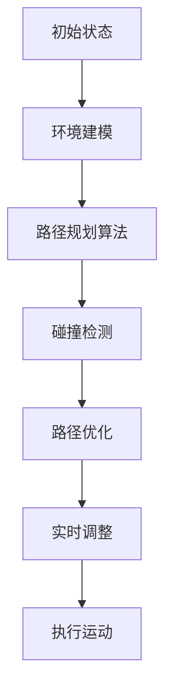
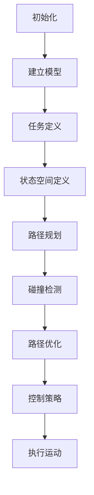
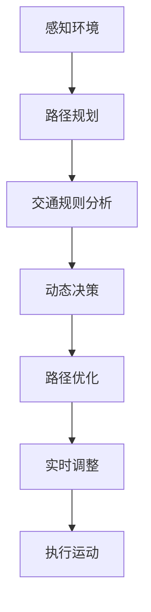
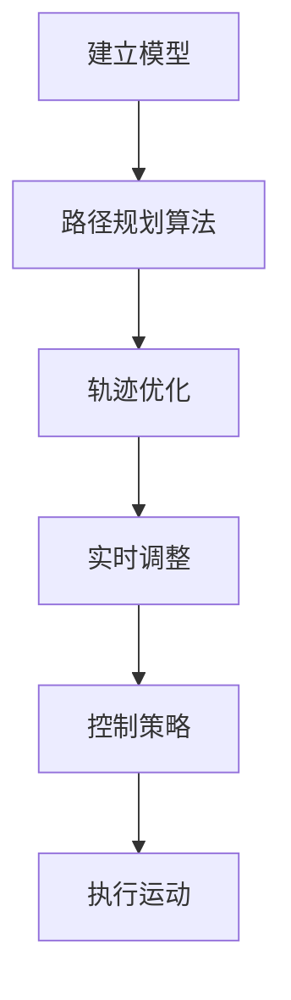
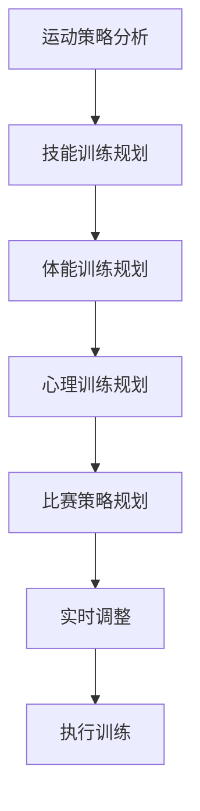

                 

### 运动规划基础知识

#### 第1章: 运动规划概述

##### 1.1 运动规划的定义与重要性

运动规划（Motion Planning）是自动控制和机器人技术中的一个重要研究领域，它涉及到如何使一个动态系统从初始状态平滑且无碰撞地过渡到目标状态。简单来说，运动规划是关于确定一个系统的运动路径和速度，以实现特定任务的过程。

**定义**：运动规划可以被定义为一个从系统的初始状态到目标状态的运动路径搜索问题。这个搜索过程需要考虑到系统的动力学模型、环境约束、执行器限制和路径规划策略等因素。

**重要性**：
1. **工程应用**：运动规划广泛应用于机器人、自动化系统、自动驾驶车辆、无人机、以及各种自动化制造设备中。这些应用需要精确的运动控制来完成任务，如搬运物品、焊接、清洁、导航等。
2. **科学研究**：运动规划是一个跨学科的领域，它结合了控制理论、计算几何、人工智能、数值分析和物理学等多个学科的知识，推动了许多相关领域的技术进步。
3. **安全性**：在自动驾驶和无人机等领域的应用中，运动规划确保系统的运动不会与其他物体发生碰撞，从而提高了系统的安全性和可靠性。

##### 1.2 运动规划在不同领域的应用

运动规划的应用非常广泛，涵盖了工业、军事、医疗、服务等多个领域。

**工业领域**：在工业自动化中，运动规划用于控制机器人手臂进行焊接、装配、搬运等操作。例如，在汽车制造中，机器人可以按照预设的路径和速度精确地完成焊接和装配任务。

**军事领域**：在军事机器人中，运动规划用于控制机器人的移动、导航和目标追踪。通过运动规划，机器人可以在复杂和危险的环境中执行任务，如侦察、排雷和救援。

**医疗领域**：在医疗机器人中，运动规划用于手术机器人手臂的运动控制。这些机器人可以精确地完成外科手术中的精细操作，如切除肿瘤、植入人工器官等。

**服务领域**：在服务机器人中，运动规划用于机器人的导航和任务执行。例如，在家庭服务机器人中，机器人可以根据环境地图规划路径，避免障碍物，并执行清洁、陪伴等任务。

##### 1.3 运动规划的重要性

运动规划在多个方面显示出其重要性：

1. **效率提升**：通过精确的运动规划，系统能够以更高的效率和精度完成任务，从而提升生产效率和降低成本。
2. **安全性保障**：在复杂环境中，运动规划确保系统不会与障碍物发生碰撞，提高了系统的安全性和可靠性。
3. **创新能力**：运动规划的应用推动了机器人技术、自动化系统和智能交通系统等领域的创新发展。
4. **人机协作**：运动规划使得人与机器人可以更有效地协作，如医疗手术中的机器人辅助、工业生产线上的机器人协作等。

运动规划作为自动化和控制领域的一个重要研究方向，不仅具有广泛的应用前景，同时也推动了相关领域的技术进步和创新。

### 第1章: 运动规划概述

##### 1.2 运动规划的基本概念

运动规划涉及到一系列核心概念和模型，这些概念和模型共同构成了运动规划的框架。以下是对这些基本概念的解释和它们在运动规划中的作用：

**1.2.1 任务规划**

**定义**：任务规划（Task Planning）是运动规划中的第一步，它涉及到确定系统需要执行的任务目标。这些目标可以是具体的动作序列，如机器人手臂的路径规划，也可以是更高级的任务，如无人驾驶车辆在不同交通情况下的行驶策略。

**作用**：任务规划为运动规划提供了一个清晰的起点，它定义了系统需要达成的目标，从而为后续的路径规划和控制策略提供指导。

**1.2.2 动力学模型**

**定义**：动力学模型（Dynamics Model）是描述系统运动状态和受力情况的理论模型。它通常基于牛顿力学或量子力学等物理学原理，用于描述系统的运动规律。

**作用**：动力学模型提供了运动规划所需的系统行为描述，使得规划算法能够预测系统的未来状态。例如，在机器人运动规划中，动力学模型可以用于计算机器人关节的运动轨迹。

**1.2.3 运动学模型**

**定义**：运动学模型（Kinematics Model）是描述系统位置、速度和加速度等几何参数的理论模型。它通常不涉及系统内部的物理作用，而是专注于系统外部几何关系。

**作用**：运动学模型用于确定系统在不同时间点的几何位置，为路径规划提供参考。例如，在机器人路径规划中，运动学模型可以用于计算机器人手臂在不同时刻的位置和姿态。

**1.2.4 控制策略**

**定义**：控制策略（Control Strategy）是用于调节系统执行器输入的方法，以实现系统状态的预定目标。常见的控制策略包括PID控制、自适应控制、模糊控制和神经网络控制等。

**作用**：控制策略决定了如何根据系统状态调整执行器的输入，从而实现精确的运动控制。在运动规划中，控制策略是确保系统按照规划路径运动的关键。

**1.2.5 传感器与执行器**

**定义**：传感器（Sensor）是用于检测系统状态的设备，如视觉传感器、激光雷达、超声波传感器等。执行器（Actuator）是用于产生物理动作的设备，如电机、液压缸、机械臂等。

**作用**：传感器提供系统的实时状态信息，使得控制策略能够根据实际状态进行调整。执行器则根据控制策略的指令执行物理动作，从而实现系统的运动。

**总结**：

这些基本概念构成了运动规划的框架，任务规划为运动规划提供了目标，动力学模型和运动学模型为规划算法提供了系统行为的描述，控制策略确保系统按照规划路径运动，而传感器和执行器则构成了系统的实际控制组件。通过这些概念的有机结合，运动规划能够有效地指导系统的运动，实现自动化和控制的目标。

#### 第1章: 运动规划概述

##### 1.3 运动规划的分类

运动规划可以根据不同的标准进行分类，这些分类方法有助于我们理解和应用运动规划技术。以下是几种常见的分类方式及其特点：

**1.3.1 离散时间运动规划**

**定义**：离散时间运动规划是指在离散的时间点上对系统状态进行规划的方法。在这种规划方法中，系统状态在每一个时间点都是固定的，并且运动轨迹是由一系列离散状态点连接而成的。

**特点**：
- **计算复杂度低**：由于运动规划是分步骤进行的，每个步骤只需要处理当前状态和下一步状态，因此计算复杂度相对较低。
- **易于实现实时控制**：离散时间运动规划适用于需要实时响应的应用，如机器人控制和自动驾驶车辆。

**应用**：离散时间运动规划广泛应用于机器人控制、无人机导航和工业自动化等领域。

**1.3.2 连续时间运动规划**

**定义**：连续时间运动规划是指在连续的时间范围内对系统状态进行规划的方法。在这种规划方法中，系统状态是连续变化的，运动轨迹通常表示为连续函数。

**特点**：
- **更精确的运动控制**：连续时间运动规划能够提供更精确的运动轨迹，因为它考虑了系统状态在时间上的连续变化。
- **计算复杂度高**：由于需要处理连续状态，连续时间运动规划的计算复杂度通常较高，对计算资源和算法效率要求较高。

**应用**：连续时间运动规划适用于需要高精度运动控制的领域，如精密机器人、飞行器控制和高级自动驾驶系统。

**1.3.3 鲁棒运动规划**

**定义**：鲁棒运动规划是在系统受到外部干扰或不确定因素影响时，仍能保证系统运动稳定性的规划方法。

**特点**：
- **抗干扰性强**：鲁棒运动规划能够处理外部扰动和系统参数的不确定性，使得系统在各种情况下都能保持稳定运动。
- **适应性**：鲁棒运动规划能够根据环境变化实时调整系统状态，保持系统性能。

**应用**：鲁棒运动规划广泛应用于环境复杂、不确定性较高的场景，如无人驾驶车辆、机器人救援和空间探索。

**1.3.4 数据驱动运动规划**

**定义**：数据驱动运动规划是基于系统运行数据和历史信息进行规划的方法，它通常不依赖于精确的动力学模型。

**特点**：
- **无需精确模型**：数据驱动运动规划不依赖于系统的精确物理模型，因此适用于模型难以获取或模型不准确的情况。
- **自适应性强**：数据驱动运动规划能够根据实时数据调整运动规划，适应环境变化。

**应用**：数据驱动运动规划适用于动态环境、未知环境或模型不确定性较高的场景，如无人机群导航、智能交通系统和机器人探索。

**总结**：

不同类型的运动规划各有优缺点，适用于不同的应用场景。离散时间运动规划适合实时性和计算复杂度要求较低的场景，连续时间运动规划适合高精度运动控制，鲁棒运动规划适合复杂和不确定的环境，而数据驱动运动规划则适用于未知和动态环境。通过选择合适的运动规划方法，可以有效地实现系统的运动控制目标。

### 第2章: 运动学基础

#### 第2章: 运动学基础

##### 2.1 建立运动模型

运动学（Kinematics）是研究物体运动而不考虑其运动原因的学科。建立运动模型是运动学的基础，它涉及到确定系统的几何参数、位置、速度和加速度等。以下是建立运动模型的基本步骤和方法。

**1. 运动学基本方程**

运动学的基本方程描述了物体的位置、速度和加速度之间的关系。对于线性运动，这些方程可以表示为：

\[ s = s_0 + v_0t + \frac{1}{2}at^2 \]

\[ v = v_0 + at \]

\[ a = \frac{v - v_0}{t} \]

其中，\( s \) 是位置，\( s_0 \) 是初始位置，\( v \) 是速度，\( v_0 \) 是初始速度，\( a \) 是加速度，\( t \) 是时间。

对于旋转运动，基本方程可以表示为：

\[ \theta = \theta_0 + \omega_0t + \frac{1}{2}\alpha t^2 \]

\[ \omega = \omega_0 + \alpha t \]

\[ \alpha = \frac{\omega - \omega_0}{t} \]

其中，\( \theta \) 是角度，\( \theta_0 \) 是初始角度，\( \omega \) 是角速度，\( \omega_0 \) 是初始角速度，\( \alpha \) 是角加速度。

**2. 运动学参数的确定**

确定运动学参数是建立运动模型的关键步骤。这些参数包括系统的初始位置、初始速度和加速度等。这些参数可以通过以下几种方法确定：

- **实验测量**：通过实验测量系统的实际位置、速度和加速度，从而确定运动学参数。
- **理论计算**：根据系统的物理模型和动力学方程，计算系统的运动学参数。
- **参数识别**：使用优化算法和系统运行数据，通过参数识别方法确定运动学参数。

**3. 运动学求解方法**

求解运动学方程是确定系统运动轨迹的过程。以下是几种常用的运动学求解方法：

- **解析法**：直接解运动学方程，适用于简单系统或特定初始条件。
- **数值法**：使用数值积分方法（如欧拉法、龙格-库塔法等）求解运动学方程，适用于复杂系统或非线性方程。
- **几何法**：通过几何图形和几何关系求解运动学问题，适用于二维或三维几何问题。

**总结**：

建立运动模型是运动学的基础，通过确定运动学参数和求解运动学方程，可以描述系统的运动状态和轨迹。运动学模型不仅为运动规划提供了几何描述，还为控制策略的设计提供了基础。在实际应用中，选择合适的运动学求解方法和参数确定方法，可以有效地提高运动规划的精度和效率。

##### 2.2 速度和加速度分析

速度和加速度是描述物体运动状态的重要物理量，它们在运动规划中起着关键作用。以下是对速度和加速度的详细分析，包括它们的几何意义和计算方法。

**速度分析**

速度（Velocity）是描述物体位置随时间变化的物理量，它具有大小和方向。在二维空间中，速度可以表示为一个向量，其大小表示速度的模，方向表示速度的方向。

**速度的几何意义**：

1. **切线方向**：在曲线运动中，速度向量始终沿着曲线的切线方向，表示物体在某一瞬间的运动方向。
2. **瞬时速度**：在极短的时间间隔内，速度向量的大小和方向可以看作是不变的，这个瞬时的速度称为瞬时速度。

**速度的计算方法**：

1. **微分法**：使用位置函数对时间求导得到速度函数。对于线性运动，速度 \( v(t) = \frac{ds}{dt} \)；对于旋转运动，速度 \( \omega(t) = \frac{d\theta}{dt} \)。
2. **数值法**：使用数值积分方法（如欧拉法、龙格-库塔法等）计算速度。数值法适用于复杂的非线性运动。

**加速度分析**

加速度（Acceleration）是描述物体速度随时间变化的物理量，它同样具有大小和方向。加速度可以表示为速度向量对时间的导数。

**加速度的几何意义**：

1. **切向加速度**：沿着速度向量方向的加速度，表示物体速度大小的变化。
2. **法向加速度**：垂直于速度向量方向的加速度，表示物体速度方向的变化，也称为向心加速度。

**加速度的计算方法**：

1. **微分法**：使用速度函数对时间求导得到加速度函数。对于线性运动，加速度 \( a(t) = \frac{dv}{dt} \)；对于旋转运动，加速度 \( \alpha(t) = \frac{d\omega}{dt} \)。
2. **数值法**：使用数值积分方法（如欧拉法、龙格-库塔法等）计算加速度。数值法适用于复杂的非线性运动。

**速度和加速度的关系**

1. **速度和加速度的关系**：速度是加速度对时间的积分。对于线性运动，速度 \( v(t) = v_0 + \int a(t) dt \)；对于旋转运动，速度 \( \omega(t) = \omega_0 + \int \alpha(t) dt \)。
2. **几何关系**：在二维或三维空间中，速度和加速度可以表示为向量，它们之间的几何关系可以用来分析和计算物体的运动状态。

**总结**：

速度和加速度是运动学中的核心概念，用于描述物体的运动状态。通过分析速度和加速度的几何意义和计算方法，可以更好地理解物体的运动规律。在实际应用中，准确计算速度和加速度对于运动规划和控制策略的设计至关重要。

##### 2.3 运动轨迹规划

运动轨迹规划是运动学中的重要内容，它涉及到确定物体在空间中的运动路径，以实现特定的运动目标。以下是对直线轨迹规划和曲线轨迹规划方法的详细分析。

**直线轨迹规划**

**定义**：直线轨迹规划是指物体沿直线运动，其路径是一条直线。直线轨迹规划相对简单，适用于简单的运动场景。

**方法**：

1. **速度控制**：通过控制速度的大小和方向，使物体沿着直线运动。速度控制可以通过以下公式实现：
   \[ s = s_0 + v_0t + \frac{1}{2}at^2 \]
   其中，\( s \) 是位置，\( s_0 \) 是初始位置，\( v_0 \) 是初始速度，\( a \) 是加速度。

2. **加速度控制**：通过控制加速度的大小和方向，使物体在直线上的速度逐渐增加或减少。加速度控制可以通过以下公式实现：
   \[ v = v_0 + at \]
   其中，\( v \) 是速度。

**应用**：直线轨迹规划广泛应用于机器人控制、自动化设备和自动驾驶车辆等领域，用于实现直线路径的精确运动。

**曲线轨迹规划**

**定义**：曲线轨迹规划是指物体在空间中的运动路径是一条曲线。曲线轨迹规划比直线轨迹规划更复杂，需要考虑曲线的曲率和切线方向。

**方法**：

1. **样条插值方法**：样条插值方法是一种常用的曲线轨迹规划方法，它通过多项式插值函数来定义曲线。常用的插值函数有贝塞尔曲线和牛顿曲线。贝塞尔曲线具有易于控制形状的优点，适用于简单的曲线规划。

   - **贝塞尔曲线**：
     \[ P(t) = (1-t)^3P_0 + 3(1-t)^2tP_1 + 3(1-t)t^2P_2 + t^3P_3 \]
     其中，\( P(t) \) 是曲线上的点，\( P_0, P_1, P_2, P_3 \) 是曲线的控制点。

2. **曲线优化方法**：曲线优化方法是通过优化目标函数来确定曲线的参数，以实现特定的运动目标。常用的优化方法有最小二乘法和遗传算法。

   - **最小二乘法**：
     通过最小化曲线误差平方和来确定曲线参数。误差函数可以表示为：
     \[ \Phi = \sum_{i=1}^{n} (P_i - P(t_i))^2 \]
     其中，\( P_i \) 是实际位置，\( P(t_i) \) 是曲线上的位置。

   - **遗传算法**：
     通过遗传操作（交叉、变异和选择）来优化曲线参数，以实现目标函数的最小化。

**应用**：曲线轨迹规划广泛应用于复杂场景的运动规划，如无人机飞行、机器人路径规划和自动驾驶车辆。

**总结**：

直线轨迹规划和曲线轨迹规划是运动轨迹规划中的两种主要方法。直线轨迹规划简单且适用于简单运动场景，而曲线轨迹规划更复杂，适用于需要精确控制运动路径的应用。通过选择合适的轨迹规划方法，可以有效地实现物体的运动控制目标。

##### 2.4 运动轨迹优化的方法

在运动规划中，轨迹优化是一个关键步骤，它涉及到在满足特定约束条件下找到最优的运动轨迹。以下介绍几种常用的运动轨迹优化方法，并讨论它们的应用场景和特点。

**1. 最速下降法**

**定义**：最速下降法是一种最优化方法，通过选择梯度的反方向作为搜索方向，逐步调整轨迹参数，以最小化目标函数。

**特点**：
- **计算简单**：最速下降法算法简单，易于实现。
- **收敛速度较慢**：由于每次迭代仅沿梯度方向移动，因此收敛速度可能较慢。

**应用场景**：适用于目标函数较为简单且约束条件较少的运动轨迹优化问题。

**2. 牛顿法**

**定义**：牛顿法是一种基于目标函数二阶导数（即Hessian矩阵）的最优化方法，通过迭代计算目标函数的临界点来找到最优轨迹。

**特点**：
- **收敛速度较快**：牛顿法利用二阶导数信息，通常能够更快地收敛到最优解。
- **计算复杂度高**：计算Hessian矩阵及其逆矩阵需要较高的计算资源。

**应用场景**：适用于目标函数较为复杂，但存在明确二阶导数信息的运动轨迹优化问题。

**3. 拉格朗日乘数法**

**定义**：拉格朗日乘数法是一种约束优化方法，通过引入拉格朗日乘数项来处理等式约束和不等式约束，将约束优化问题转化为无约束优化问题。

**特点**：
- **处理约束能力强**：可以有效地处理等式约束和不等式约束，适用于具有复杂约束条件的轨迹优化问题。
- **计算复杂度较高**：需要计算拉格朗日乘数和相应的雅可比矩阵。

**应用场景**：适用于存在多种约束条件，如速度限制、路径约束和碰撞避免等运动轨迹优化问题。

**4. 遗传算法**

**定义**：遗传算法是一种基于自然选择和遗传机制的优化算法，通过种群进化过程来搜索最优解。

**特点**：
- **全局搜索能力强**：遗传算法具有较强的全局搜索能力，能够避免局部最优解。
- **参数调整灵活**：遗传算法参数设置相对灵活，适用于多种优化问题。

**应用场景**：适用于复杂非线性、多峰值的轨迹优化问题，如无人机群导航、多机器人协同运动规划等。

**5. 鲍姆斯特德法**

**定义**：鲍姆斯特德法是一种基于动态规划原理的轨迹优化方法，通过递归计算每个时间点的最优轨迹，以实现整体最优。

**特点**：
- **递归计算**：鲍姆斯特德法通过递归计算，将复杂轨迹优化问题分解为多个简单子问题。
- **计算效率高**：适用于实时轨迹优化问题。

**应用场景**：适用于实时运动规划和动态环境下的轨迹优化。

**总结**：

运动轨迹优化方法多种多样，每种方法都有其独特的优缺点和适用场景。选择合适的优化方法，可以根据具体问题需求实现高效的轨迹规划，从而提高运动规划的精度和效率。在实际应用中，结合多种优化方法，可以更好地解决复杂的轨迹规划问题。

### 第3章: 动力学基础

#### 第3章: 动力学基础

##### 3.1 动力学模型

动力学（Dynamics）是研究物体运动及其受力关系的学科。在运动规划中，动力学模型用于描述系统的运动状态和受力情况，从而为控制策略和运动规划提供理论依据。以下是关于动力学模型的基本概念和建立方法。

**1. 牛顿第二定律**

牛顿第二定律是动力学模型的基础，描述了物体受力与加速度之间的关系。其数学表达式为：

\[ F = m \cdot a \]

其中，\( F \) 是作用在物体上的合外力，\( m \) 是物体的质量，\( a \) 是物体的加速度。

**2. 动力学方程的建立**

动力学方程描述了系统在不同状态下的受力情况。建立动力学方程的基本步骤如下：

- **确定系统**：明确研究对象，确定系统中各个物体的质量、形状、连接方式等。
- **受力分析**：分析系统中的各个物体所受的力，包括外力和内力。外力包括重力、摩擦力、电磁力等，内力包括物体之间的相互作用力。
- **牛顿第二定律**：对系统中的每个物体应用牛顿第二定律，建立每个物体的动力学方程。

例如，对于一个单自由度线性弹簧-质量系统，其动力学方程可以表示为：

\[ m \cdot \ddot{x} + c \cdot \dot{x} + k \cdot x = F(t) \]

其中，\( m \) 是质量，\( \ddot{x} \) 是加速度，\( c \) 是阻尼系数，\( k \) 是弹簧刚度，\( x \) 是位移，\( F(t) \) 是外力。

**3. 常见的动力学模型**

动力学模型可以根据系统的自由度、复杂程度和应用场景进行分类。以下是几种常见的动力学模型：

- **单自由度模型**：适用于只有一个自由度的简单系统，如弹簧-质量系统。
- **多自由度模型**：适用于具有多个自由度的复杂系统，如机器人、飞行器等。
- **连续体模型**：适用于连续分布的系统，如梁、壳体等。
- **混沌动力学模型**：适用于具有复杂动力学行为的系统，如混沌摆、洛伦兹 attractor等。

**4. 动力学模型的建立方法**

建立动力学模型的方法主要包括以下几种：

- **解析法**：通过解析分析系统受力情况和运动规律，直接推导出动力学方程。这种方法适用于简单系统。
- **数值法**：通过数值计算方法求解动力学方程，适用于复杂系统。常见的数值方法包括欧拉法、龙格-库塔法等。
- **混合法**：结合解析法和数值法，利用解析法建立系统的基本模型，然后用数值法进行细节计算。这种方法适用于既有复杂部分又有简单部分的大型系统。

**总结**：

动力学模型是运动规划中不可或缺的一部分，它描述了系统的运动状态和受力关系。通过建立准确的动力学模型，可以更好地理解和控制系统的运动，为运动规划和控制策略的设计提供理论支持。在实际应用中，选择合适的动力学模型和建立方法，可以有效地提高运动规划的精度和效率。

##### 3.2 阻力和摩擦力分析

在动力学模型中，阻力和摩擦力是影响系统运动的重要因素，它们在运动规划和控制中扮演着关键角色。以下是对阻力和摩擦力的分析，包括它们的类型、影响因素和对运动规划的影响。

**阻力**

**1. 类型**

阻力可以分为以下几种类型：

- **空气阻力**：作用于运动物体上的空气摩擦力，其大小与物体的速度、形状和迎风面积有关。
- **液体阻力**：作用于运动物体在液体中移动时的摩擦力，其大小与物体的速度、形状和流体密度有关。
- **摩擦阻力**：物体与接触面之间由于摩擦而产生的阻力，其大小与接触面的材料、粗糙度和正压力有关。

**2. 影响因素**

阻力的影响因素包括：

- **速度**：速度越大，阻力越大。
- **形状和表面粗糙度**：形状流线型、表面光滑的物体阻力较小。
- **接触面积和材料**：接触面积和材料性质会影响摩擦阻力的大小。

**3. 对运动规划的影响**

阻力对运动规划的影响主要体现在以下几个方面：

- **运动速度**：高阻力会降低物体的运动速度，因此在规划路径时需要考虑阻力的影响，选择合适的速度控制策略。
- **能耗**：高阻力会增加系统的能耗，影响系统的运行效率和能源利用率，因此在设计系统时需要尽量减小阻力。
- **控制策略**：高阻力可能需要更强的控制策略来克服，如增大动力输出或采用更高效的驱动方式。

**摩擦力**

**1. 类型**

摩擦力可以分为以下几种类型：

- **静摩擦力**：物体静止时与接触面之间的摩擦力，其大小不超过最大静摩擦力。
- **动摩擦力**：物体运动时与接触面之间的摩擦力，其大小通常小于最大静摩擦力。
- **滚动摩擦力**：物体滚动时与接触面之间的摩擦力，通常小于滑动摩擦力。

**2. 影响因素**

摩擦力的影响因素包括：

- **接触面的材料**：不同材料的接触面摩擦系数不同。
- **表面粗糙度**：表面粗糙度越高，摩擦力越大。
- **正压力**：正压力越大，摩擦力越大。

**3. 对运动规划的影响**

摩擦力对运动规划的影响主要体现在以下几个方面：

- **路径规划**：在规划运动路径时，需要考虑摩擦力的影响，选择合适的路径以减少摩擦力。
- **控制策略**：为了克服摩擦力，可能需要增大动力输出或调整控制参数。
- **能耗**：高摩擦力会增加系统的能耗，影响系统的运行效率和能源利用率。

**总结**：

阻力和摩擦力是影响系统运动的重要因素，它们在运动规划和控制中起着关键作用。通过分析阻力和摩擦力的类型、影响因素和对运动规划的影响，可以更好地理解和优化系统的运动，提高运动规划的精度和效率。

##### 3.3 动力学方程的求解

在运动规划中，求解动力学方程是关键步骤，它涉及到确定系统在不同时间点的状态。以下介绍几种常见的动力学方程求解方法，包括数值解法和分析解法。

**1. 数值解法**

数值解法是通过数值计算方法求解动力学方程，适用于复杂系统和非线性问题。以下介绍几种常用的数值解法：

- **欧拉法**：欧拉法是一种简单的一阶数值解法，通过迭代计算每个时间点的状态。其公式为：
  \[ x_{n+1} = x_n + h \cdot f(x_n, t_n) \]
  \[ t_{n+1} = t_n + h \]
  其中，\( x_n \) 是当前状态，\( t_n \) 是当前时间，\( h \) 是时间步长，\( f(x_n, t_n) \) 是动力学方程。

- **龙格-库塔法**：龙格-库塔法是一种更精确的数值解法，通过多步预测和校正来提高计算精度。常用的四阶龙格-库塔法公式为：
  \[ k_1 = h \cdot f(x_n, t_n) \]
  \[ k_2 = h \cdot f(x_n + \frac{k_1}{2}, t_n + \frac{h}{2}) \]
  \[ k_3 = h \cdot f(x_n + \frac{k_2}{2}, t_n + \frac{h}{2}) \]
  \[ k_4 = h \cdot f(x_n + k_3, t_n + h) \]
  \[ x_{n+1} = x_n + \frac{1}{6}(k_1 + 2k_2 + 2k_3 + k_4) \]
  \[ t_{n+1} = t_n + h \]

**2. 分析解法**

分析解法是通过解析方法求解动力学方程，适用于简单系统和线性问题。以下介绍几种常用的分析解法：

- **拉普拉斯变换**：拉普拉斯变换是一种将时域方程转换为频域方程的方法，适用于线性系统。其公式为：
  \[ L\{x(t)\} = X(s) \]
  \[ L^{-1}\{X(s)\} = x(t) \]
  其中，\( L \) 表示拉普拉斯变换，\( L^{-1} \) 表示拉普拉斯反变换。

- **矩阵方法**：对于多自由度系统，可以通过矩阵方法求解动力学方程。其公式为：
  \[ M \cdot \ddot{x} + C \cdot \dot{x} + K \cdot x = F(t) \]
  其中，\( M \) 是质量矩阵，\( C \) 是阻尼矩阵，\( K \) 是刚度矩阵，\( x \) 是状态向量，\( F(t) \) 是外力向量。

**3. 动力学方程的求解策略**

在求解动力学方程时，需要考虑以下策略：

- **初值设置**：根据初始条件设置系统的初值，如位置、速度和加速度等。
- **时间步长**：选择合适的时间步长，以平衡计算精度和计算效率。时间步长过小会导致计算复杂度增加，时间步长过大可能导致误差积累。
- **数值稳定性**：确保数值解法的稳定性，避免出现数值发散现象。对于非线性系统，可以选择自适应时间步长法来提高稳定性。

**总结**：

动力学方程的求解是运动规划中的关键步骤，通过选择合适的数值解法和分析解法，可以有效地确定系统在不同时间点的状态。在实际应用中，结合数值解法和分析解法，可以更好地解决复杂的动力学问题，提高运动规划的精度和效率。

### 第4章: 控制策略基础

#### 第4章: 控制策略基础

##### 4.1 控制系统的基本概念

控制系统是运动规划中至关重要的一部分，它涉及到如何调节系统的输入和输出，以实现预定的运动目标。理解控制系统的基本概念对于设计和实现有效的运动规划至关重要。

**定义**：控制系统（Control System）是一个由输入、输出和反馈组成的闭环系统，用于调节和控制物理系统的行为。控制系统通过测量实际输出，并将其与期望输出进行比较，然后根据比较结果调整输入，以实现预定的目标。

**组成部分**：

1. **控制器**（Controller）：控制器是控制系统的核心组件，负责根据反馈信息调整系统的输入。控制器可以是简单的比例控制器、积分控制器或微分控制器，也可以是复杂的自适应控制器、模糊控制器或神经网络控制器。

2. **执行器**（Actuator）：执行器是控制系统的动力部分，负责根据控制器的指令执行物理动作。常见的执行器包括电机、液压缸、气缸等。

3. **传感器**（Sensor）：传感器用于测量系统的状态信息，如位置、速度、温度等。传感器提供系统的实际输出信息，用于与期望输出进行比较，从而生成反馈信号。

4. **被控对象**（Controlled Object）：被控对象是控制系统的核心，它可以是机械系统、电气系统、生物系统等。被控对象的行为受控制器的调节和控制。

**分类**：

1. **开环控制系统**（Open-loop Control System）：开环控制系统不使用反馈信号，仅根据预设的输入信号进行控制。由于缺乏反馈机制，开环控制系统难以应对外部扰动和不确定性。

2. **闭环控制系统**（Closed-loop Control System）：闭环控制系统使用反馈信号，通过比较实际输出和期望输出进行调整。闭环控制系统具有较高的稳定性和鲁棒性，能够应对外部扰动和不确定性。

**性能指标**：

1. **稳态误差**（Steady-state Error）：稳态误差是指系统在稳定运行时，实际输出与期望输出之间的偏差。稳态误差越小，系统的控制精度越高。

2. **动态响应**（Dynamic Response）：动态响应是指系统在受到扰动或输入时，从初始状态到达稳态的过程。动态响应的快速性和稳定性是衡量控制系统性能的重要指标。

3. **稳定性**（Stability）：稳定性是指控制系统在扰动或输入变化时，是否能够保持稳定运行。稳定的控制系统不会出现振荡或发散现象。

4. **鲁棒性**（Robustness）：鲁棒性是指控制系统在面临外部扰动或系统参数变化时，仍能保持良好性能的能力。

**总结**：

控制系统是运动规划中的核心组件，通过理解控制系统的基本概念、组成部分、分类和性能指标，可以设计和实现有效的运动规划系统。控制系统的性能直接影响到运动规划的精度和可靠性，因此在运动规划中，合理选择和设计控制系统是至关重要的。

##### 4.2 PID控制策略

PID控制策略（Proportional-Integral-Derivative Control）是最常用的控制方法之一，它通过调节比例（P）、积分（I）和微分（D）三个参数来实现对系统的精确控制。以下是对PID控制器的结构、参数调整和应用案例的详细分析。

**PID控制器结构**

PID控制器由三个主要部分组成：比例控制（P）、积分控制（I）和微分控制（D）。每个部分通过不同的方式对系统进行调节。

1. **比例控制（P）**：比例控制通过当前误差（即实际输出与期望输出的差值）乘以一个比例系数（Kp）来调整控制信号。比例控制的特点是响应迅速，但可能导致系统出现过冲。

2. **积分控制（I）**：积分控制通过对误差的积分来调整控制信号。积分控制能够消除系统的稳态误差，但过度依赖积分控制可能导致系统响应缓慢。

3. **微分控制（D）**：微分控制通过误差的变化率（即误差的导数）来调整控制信号。微分控制能够预测误差的变化趋势，从而快速调整控制信号，减少系统的过冲。

PID控制器的输出公式为：
\[ u(t) = K_p e(t) + K_i \int e(t) dt + K_d \frac{de(t)}{dt} \]
其中，\( u(t) \) 是控制信号，\( e(t) \) 是误差，\( K_p \)、\( K_i \)、\( K_d \) 分别是比例、积分和微分系数。

**参数调整**

PID参数的调整是PID控制策略的关键步骤，直接影响控制系统的性能。以下是一些常用的参数调整方法：

1. **试错法**：通过手动调整参数，观察系统响应，逐步找到合适的参数值。这种方法适用于简单系统。

2. **经验法**：根据经验公式或参考类似系统的参数值来调整PID参数。这种方法适用于已有较多经验积累的系统。

3. **自动调节法**：使用自动调节算法（如Ziegler-Nichols方法、Smith预测控制等）来优化PID参数。这种方法适用于复杂系统。

**Ziegler-Nichols方法**是一种常用的自动调节方法，其步骤如下：

- **1. 调整比例系数**：逐渐增加比例系数，直到系统出现周期性振荡，记下振荡周期T。
- **2. 调整积分系数**：将比例系数减半，然后逐渐增加积分系数，直到系统稳定，但无过冲，记下积分系数K_i。
- **3. 调整微分系数**：将比例系数和积分系数固定，逐渐增加微分系数，直到系统响应得到改善，记下微分系数K_d。

**应用案例**

PID控制策略广泛应用于各种领域，以下是一些典型的应用案例：

1. **机器人控制**：PID控制器用于调节机器人关节的运动，实现精确的位置和速度控制。

2. **无人机控制**：PID控制器用于调节无人机的飞行姿态和位置，确保无人机在指定路径上平稳飞行。

3. **温度控制系统**：PID控制器用于调节加热器或冷却器的输出功率，保持恒温器内的温度稳定。

4. **液体流量控制**：PID控制器用于调节阀门的开启度，确保液体流量达到预定值。

**总结**：

PID控制策略因其简单、高效和易于实现的特点，在运动规划中得到了广泛应用。通过合理的参数调整，PID控制器可以有效地实现系统的精确控制，提高运动规划的精度和稳定性。

##### 4.3 线性控制理论

线性控制理论是控制系统设计中的基础理论，它研究线性时不变系统（Linear Time-Invariant Systems，LTI系统）的控制问题。线性控制理论提供了丰富的分析工具和方法，用于系统性能分析和控制器设计。以下详细讲解线性控制理论的基本概念、状态空间表示、状态反馈控制和线性二次调节器（LQR）。

**1. 基本概念**

线性控制理论主要研究线性系统在输入和参数变化下的稳定性和性能。基本概念包括：

- **线性系统**：系统的数学模型可以用线性方程描述，如差分方程或微分方程。
- **时不变系统**：系统的参数不随时间变化，输入和输出之间的关系是恒定的。
- **状态空间表示**：线性系统可以用状态空间形式表示，包括状态变量、输入变量和输出变量。

**2. 状态空间表示**

状态空间表示是线性控制理论的核心概念，它将线性系统描述为一个矩阵方程。对于单输入单输出（SISO）系统，状态空间表示为：

\[ \dot{x}(t) = A x(t) + B u(t) \]
\[ y(t) = C x(t) + D u(t) \]

其中，\( x(t) \) 是状态向量，\( u(t) \) 是输入向量，\( y(t) \) 是输出向量，\( A \)、\( B \)、\( C \) 和 \( D \) 是系统矩阵。

- **状态向量**：描述系统内部状态的变量，如速度、加速度等。
- **输入向量**：外部输入信号，如控制信号、力等。
- **输出向量**：系统对外界的表现，如位置、速度等。

**3. 状态反馈控制**

状态反馈控制是一种常用的控制器设计方法，通过测量系统的状态，并将其反馈到输入端来调整系统行为。状态反馈控制的目标是使闭环系统的特征值位于复平面的指定区域内，以保证系统的稳定性。

状态反馈控制的公式为：

\[ u(t) = -K x(t) \]

其中，\( K \) 是反馈矩阵，用于调整控制信号。

**4. 线性二次调节器（LQR）**

线性二次调节器（Linear Quadratic Regulator，LQR）是一种优化方法，用于设计状态反馈控制器。LQR的目标是最小化系统在给定权重矩阵下的二次性能指标。

LQR的性能指标为：

\[ J = \int [x^T Q x + u^T R u] dt \]

其中，\( Q \) 和 \( R \) 是权重矩阵，用于衡量状态和输入的加权。

LQR的控制器设计步骤为：

- **1. 构建LQR优化问题**：定义权重矩阵 \( Q \) 和 \( R \)。
- **2. 求解优化问题**：求解线性方程组 \( A^T Q + Q A - Q R^{-1} B^T B = 0 \)，得到反馈矩阵 \( K \)。
- **3. 实现控制器**：使用状态反馈控制器 \( u(t) = -K x(t) \)。

**总结**：

线性控制理论为控制系统设计提供了强大的工具和方法，包括状态空间表示、状态反馈控制和线性二次调节器。通过这些方法，可以设计和实现稳定且性能优良的控制系统，从而在运动规划中实现精确的运动控制。

### 第5章: 运动规划算法

#### 第5章: 运动规划算法

##### 5.1 最优控制算法

最优控制算法（Optimal Control Algorithms）是运动规划中的核心工具，用于在满足约束条件下找到最优的运动轨迹和速度。以下详细介绍贝尔曼方程、动态规划算法和最优控制问题的求解方法。

**1. 贝尔曼方程**

贝尔曼方程（Bellman Equation）是动态规划算法的基础，用于描述最优值函数的递归关系。对于一个连续时间系统，贝尔曼方程可以表示为：

\[ J(x, u) = \min_u \{ f(x, u) + g(x, u) J(x', u') \} \]

其中，\( J(x, u) \) 是从状态 \( x \) 到状态 \( x' \) 的最优值函数，\( f(x, u) \) 是状态转移函数，\( g(x, u) \) 是成本函数。

对于离散时间系统，贝尔曼方程可以表示为：

\[ V(x) = \min_u \{ f(x, u) + \gamma V(x') \} \]

其中，\( V(x) \) 是状态值函数，\( \gamma \) 是折扣因子。

**2. 动态规划算法**

动态规划算法（Dynamic Programming Algorithms）是一种通过递归关系求解最优控制问题的方法。它将复杂的最优控制问题分解为多个子问题，并利用子问题的解来求解整体最优解。

动态规划算法的基本步骤如下：

- **定义状态和动作空间**：确定系统的状态空间和动作空间。
- **初始化值函数**：初始化状态值函数 \( V(x) \)。
- **递推计算**：根据贝尔曼方程递推计算值函数 \( V(x) \)。
- **构建最优策略**：根据值函数构建最优控制策略。

常用的动态规划算法包括：

- **值迭代法**（Value Iteration）：从初始值函数开始，逐步迭代更新值函数，直到收敛。
- **政策迭代法**（Policy Iteration）：迭代更新最优策略，然后根据最优策略更新值函数。

**3. 最优控制问题的求解方法**

求解最优控制问题通常采用数值方法，以下介绍几种常用的求解方法：

- **逆向法**（Backward Method）：从系统的终端状态开始，逆序递推计算值函数和最优策略。
- **直接法**（Forward Method）：从系统的初始状态开始，直接计算值函数和最优策略。

常用的数值方法包括：

- **离散化方法**：将连续时间系统离散化为离散时间系统，然后使用动态规划算法求解。
- **数值积分方法**：使用数值积分方法求解连续时间系统的最优控制问题。

**总结**：

最优控制算法是运动规划中的重要工具，通过贝尔曼方程和动态规划算法，可以求解复杂的最优控制问题。在实际应用中，选择合适的求解方法，可以有效地实现最优运动规划。

##### 5.2 采样规划算法

采样规划算法（Sampling-based Planning Algorithms）是运动规划中用于处理复杂和非结构化环境的重要方法。这类算法通过在环境中进行采样点选择，生成潜在的运动路径，然后通过优化方法找到最优路径。以下介绍几种常见的采样规划算法，包括样条插值方法、贝塞尔曲线方法和其应用。

**1. 样条插值方法**

样条插值方法是一种基于多项式插值的轨迹规划方法，它通过一系列多项式函数来逼近目标轨迹。样条插值具有平滑性和灵活性，适用于非线性轨迹规划。

样条插值方法的基本步骤包括：

- **采样点选择**：在环境中随机选择多个采样点，形成采样点集。
- **多项式拟合**：使用采样点集来拟合多项式函数，生成轨迹。
- **轨迹优化**：通过优化算法（如梯度下降法、遗传算法等）对轨迹进行优化，使其满足约束条件。

常用的多项式插值方法包括：

- **三次样条插值**：使用三次多项式函数在每个区间内插值，保证轨迹的平滑性和连续性。
- **贝塞尔曲线插值**：使用贝塞尔曲线来生成平滑的轨迹，适用于高阶多项式插值。

**2. 贝塞尔曲线方法**

贝塞尔曲线是一种常用的轨迹规划方法，它通过控制点和贝塞尔曲线方程来定义轨迹。贝塞尔曲线具有简单、灵活和易调优的特点，适用于非线性轨迹规划。

贝塞尔曲线方法的基本步骤包括：

- **控制点选择**：根据目标轨迹和约束条件选择控制点。
- **贝塞尔曲线方程**：使用贝塞尔曲线方程 \( P(t) = (1-t)^3 P_0 + 3(1-t)^2 t P_1 + 3(1-t) t^2 P_2 + t^3 P_3 \) 来定义轨迹。
- **轨迹优化**：通过优化算法对贝塞尔曲线参数进行优化，使其满足约束条件。

贝塞尔曲线方法的应用场景包括：

- **机器人路径规划**：在机器人运动规划中，使用贝塞尔曲线生成平滑且无碰撞的运动轨迹。
- **自动驾驶**：在自动驾驶系统中，使用贝塞尔曲线来生成车辆的运动轨迹，确保车辆平稳行驶。
- **无人机导航**：在无人机轨迹规划中，使用贝塞尔曲线生成高效的飞行路径。

**3. 采样规划算法的应用**

采样规划算法广泛应用于各种运动规划场景，以下是一些典型的应用：

- **工业机器人**：在工业机器人路径规划中，使用采样规划算法生成平滑且无碰撞的运动轨迹，提高生产效率。
- **无人驾驶车辆**：在无人驾驶车辆中，使用采样规划算法生成车辆在复杂城市环境中的运动轨迹，确保行驶安全。
- **无人机**：在无人机轨迹规划中，使用采样规划算法生成高效的飞行路径，避免碰撞和障碍物。

**总结**：

采样规划算法是运动规划中的重要方法，通过样条插值和贝塞尔曲线方法，可以生成平滑且无碰撞的运动轨迹。在实际应用中，采样规划算法能够有效地处理复杂和非结构化环境，实现高效的运动规划。

##### 5.3 鲁棒控制算法

鲁棒控制算法（Robust Control Algorithms）是运动规划中用于处理系统不确定性和外部干扰的关键技术。这些算法通过设计具有鲁棒性的控制器，确保系统在面临不确定性和扰动时仍能保持稳定和性能。以下详细讲解鲁棒控制的原理、H∞控制方法和其应用。

**1. 鲁棒控制的原理**

鲁棒控制（Robust Control）的目的是设计一个控制器，使得系统在存在不确定性和外部扰动时，仍能保持预定的性能。鲁棒控制的原理包括：

- **不确定性的处理**：通过模型不确定性的描述，设计控制器使其对模型不确定性具有鲁棒性。
- **干扰抑制**：设计控制器以减少外部扰动对系统的影响，确保系统在干扰条件下仍能保持稳定。

鲁棒控制的基本框架包括：

- **不确定性描述**：通过不确定矩阵描述系统的不确定性，如 \( A + ΔA \)，其中 \( ΔA \) 表示不确定性。
- **控制器设计**：设计控制器 \( K \)，使得闭环系统在存在不确定性和外部扰动时仍能保持稳定。

**2. H∞控制方法**

H∞控制（H∞ Control）是一种常用的鲁棒控制方法，其核心思想是通过优化控制器设计，使得系统对不确定性和外部扰动的最大影响最小。H∞控制的基本步骤包括：

- **系统建模**：建立系统模型，包括确定系统的状态方程和输入输出关系。
- **不确定性描述**：描述系统的不确定性，通常使用不确定矩阵 \( W \) 表示。
- **控制器设计**：设计控制器 \( K \)，使得闭环系统的干扰增益矩阵 \( H = [W, K^T] \) 的最大奇异值最小。

H∞控制问题可以形式化为以下优化问题：

\[ \min_K \| H \|_{\infty} \]

其中，\( \| H \|_{\infty} \) 是矩阵 \( H \) 的最大奇异值。

求解H∞控制问题的方法包括：

- **数值方法**：使用数值优化算法（如线性规划、序列二次规划等）求解优化问题。
- **解析方法**：通过矩阵分解和线性矩阵不等式（LMI）求解优化问题。

**3. 鲁棒控制的应用**

鲁棒控制算法广泛应用于各种运动规划场景，以下是一些典型的应用：

- **自动驾驶车辆**：在自动驾驶车辆中，鲁棒控制算法用于处理车辆模型的不确定性和外部干扰，确保车辆在复杂交通环境中的稳定行驶。
- **无人机**：在无人机轨迹规划中，鲁棒控制算法用于处理环境不确定性和飞行扰动，确保无人机在预定路径上稳定飞行。
- **机器人**：在机器人运动规划中，鲁棒控制算法用于处理关节不确定性和外部扰动，确保机器人精确执行任务。

**总结**：

鲁棒控制算法是运动规划中的关键技术，通过处理系统不确定性和外部干扰，确保系统在复杂环境下保持稳定和性能。H∞控制方法是一种有效的鲁棒控制方法，适用于处理高阶系统和多输入多输出系统。在实际应用中，鲁棒控制算法能够提高运动规划的可靠性和鲁棒性，为系统的稳定运行提供保障。

### 第6章: 机器人运动规划

#### 第6章: 机器人运动规划

##### 6.1 机器人运动规划概述

机器人运动规划（Robot Motion Planning）是机器人技术中的一个关键研究领域，它涉及到如何使机器人从初始位置和姿态平滑且无碰撞地到达目标位置和姿态。机器人运动规划不仅需要考虑机器人的内部结构和动力学特性，还要处理外部环境中的各种复杂情况。以下是机器人运动规划的基本概念、需求、流程以及其在工业和服务机器人中的应用。

**定义**：机器人运动规划是指使用各种算法和技术来规划机器人的运动路径，使其能够从当前状态平滑地过渡到目标状态，同时避免与环境中其他物体发生碰撞。

**基本概念**：

1. **状态**：机器人在运动过程中的位置和姿态。
2. **路径**：机器人从初始状态到达目标状态的连续运动轨迹。
3. **碰撞检测**：检测机器人运动过程中是否与其他物体发生碰撞。
4. **自由度**：机器人关节的数量，决定了机器人的运动能力。

**需求**：

1. **路径平滑**：确保机器人运动过程中无剧烈抖动，提高运行平稳性。
2. **无碰撞**：避免机器人与外部环境中的障碍物发生碰撞，保障安全。
3. **实时性**：在有限时间内完成运动规划，确保机器人能够实时响应环境变化。
4. **精确性**：确保机器人按照规划路径精确到达目标位置和姿态。

**流程**：

机器人运动规划通常包括以下步骤：

1. **环境建模**：建立机器人运行环境的模型，包括障碍物、碰撞区域、自由空间等。
2. **任务定义**：定义机器人的任务目标，如到达特定位置、完成特定动作等。
3. **状态空间定义**：确定机器人状态空间，包括位置、姿态、速度等。
4. **路径规划算法**：选择合适的路径规划算法，如基于采样的规划算法、基于空间的规划算法等，生成初始路径。
5. **碰撞检测**：对初始路径进行碰撞检测，排除与障碍物冲突的部分。
6. **路径优化**：对初步生成的路径进行优化，提高路径平滑性和效率。
7. **实时调整**：在运行过程中，根据环境变化实时调整路径，确保机器人安全到达目标。

**应用**：

机器人运动规划在工业和服务机器人中有广泛的应用：

1. **工业机器人**：在工业生产中，机器人用于焊接、装配、搬运等任务，运动规划确保机器人高效、精准地完成任务。
   - **应用案例**：汽车制造中的机器人焊接和装配，电子组装生产线上的机器人物料搬运。
   
2. **服务机器人**：在服务领域，机器人用于清洁、陪伴、导航等任务，运动规划使机器人能够自主适应复杂环境。
   - **应用案例**：家庭服务机器人自动清洁，酒店服务机器人引导客人。

**总结**：

机器人运动规划是机器人技术中的重要组成部分，通过精确的运动规划和控制，机器人能够在复杂环境中自主完成任务。理解运动规划的基本概念、需求和流程，有助于设计和实现高效的机器人系统。

##### 6.2 工业机器人运动规划

工业机器人运动规划是运动规划的一个重要应用领域，旨在确保机器人在生产线上的高效、精准和安全的操作。工业机器人广泛应用于焊接、装配、搬运、喷涂等生产任务，其运动规划需要考虑机器人的动力学模型、控制策略和路径规划的实现。

**1. 工业机器人的运动模型**

工业机器人的运动模型通常基于关节空间表示，其中每个关节的运动可以用一组旋转或平移操作来描述。一个典型的工业机器人通常具有多个自由度，其运动模型可以表示为：

\[ T(q(t)) = T(q_1(t), q_2(t), \ldots, q_n(t)) \]

其中，\( T \) 表示变换矩阵，\( q_1(t), q_2(t), \ldots, q_n(t) \) 分别为各个关节的角度或位移。

**2. 控制策略**

工业机器人的控制策略通常包括开环控制和闭环控制。开环控制通过预设的关节角度或位移直接驱动电机，适用于简单任务和成本较低的场合。闭环控制则通过传感器实时反馈机器人的实际状态，调节电机输出以实现精确控制。

常用的控制策略包括：

- **PID控制**：通过调节比例、积分和微分系数，使机器人关节达到期望位置。
- **自适应控制**：根据环境变化和机器人状态实时调整控制参数，提高鲁棒性。
- **模糊控制**：利用模糊逻辑处理不确定性和非线性，实现复杂控制任务。

**3. 路径规划的实现**

工业机器人运动规划中的路径规划涉及到从初始位置和姿态到目标位置和姿态的运动路径设计。路径规划的实现包括以下步骤：

- **空间建模**：建立机器人的工作空间模型，包括障碍物、工作区域等。
- **运动学求解**：确定机器人在不同关节角度下的运动学约束，如关节限位、运动范围等。
- **路径生成**：生成满足运动学约束的平滑运动路径，常用的方法包括逆运动学求解、样条插值等。
- **碰撞检测**：检测路径上是否存在与障碍物的碰撞，进行路径修正或避障。

**具体实现方法**：

以下是一个工业机器人路径规划的伪代码实现：

```python
# 初始化机器人模型和工作空间
robot = RobotModel()
workspace = Workspace()

# 定义初始状态和目标状态
initial_state = robot.get_initial_state()
target_state = robot.get_target_state()

# 计算逆运动学解
path = robot.inverse_kinematics(initial_state, target_state)

# 检测路径是否与障碍物碰撞
if workspace.detect_collision(path):
    # 修正路径
    path = workspace修正_path(path)

# 生成平滑的运动轨迹
smooth_path = robot.spline_interpolation(path)

# 控制机器人沿平滑路径运动
for point in smooth_path:
    robot.move_to(point)
    robot.wait_until_reached(point)
```

**4. 工业机器人运动规划的案例**

- **焊接机器人**：在汽车制造中，焊接机器人需要按照预定的路径进行焊接，运动规划确保焊接质量和效率。
- **装配机器人**：在电子组装生产线中，装配机器人需要准确地将电子元件装配到电路板上，运动规划确保装配精度和速度。
- **搬运机器人**：在仓储物流中，搬运机器人需要在仓库内准确移动货物，运动规划确保搬运路径最短且无碰撞。

**总结**：

工业机器人运动规划是确保机器人高效、精准地完成生产任务的关键技术。通过合理的运动模型、控制策略和路径规划方法，工业机器人可以在复杂的生产环境中稳定运行，提高生产效率和产品质量。

##### 6.3 服务机器人运动规划

服务机器人运动规划是机器人技术中的重要应用领域，旨在使机器人能够在复杂、不确定的环境中进行自主导航和任务执行。服务机器人广泛应用于家庭服务、医疗护理、酒店服务等场景，其运动规划需要考虑环境建模、任务需求和路径规划的实现。

**1. 服务机器人的任务需求**

服务机器人的任务需求通常包括：

- **自主导航**：在家庭、医院、酒店等环境中自主导航，避开障碍物和复杂环境。
- **任务执行**：执行清洁、搬运、陪伴等具体任务，如清洁地面、搬运物品、提供陪伴服务。
- **人机交互**：与人类用户进行交互，理解用户需求，并根据用户反馈调整运动规划。

**2. 环境建模**

服务机器人运动规划首先需要建立环境模型，包括环境地图、障碍物、人的位置和动态变化等。环境建模的方法包括：

- **视觉感知**：通过摄像头获取环境图像，使用图像处理和计算机视觉技术进行环境建模。
- **激光雷达**：使用激光雷达扫描环境，生成三维点云数据，用于构建环境模型。
- **超声波传感器**：使用超声波传感器检测物体距离，辅助建立环境模型。

**3. 路径规划的实现**

服务机器人的路径规划需要综合考虑环境建模和任务需求，实现高效、安全的路径规划。以下是一个典型的服务机器人路径规划实现：

```python
# 初始化环境模型
environment = Environment()

# 定义服务机器人的初始状态和目标状态
initial_state = RobotState(x=0, y=0, orientation=0)
target_state = RobotState(x=5, y=3, orientation=0)

# 建立环境地图
map = environment.build_map()

# 检测障碍物和人的位置
obstacles = environment.detect_obstacles(map)

# 计算到达目标状态的路径
path = environment.plan_path(initial_state, target_state, obstacles)

# 执行路径规划
for point in path:
    robot.move_to(point)
    robot.wait_until_reached(point)
```

路径规划的方法包括：

- **A*算法**：通过评估函数计算路径成本，搜索从初始状态到目标状态的最优路径。
- **RRT（快速随机树）算法**：在随机采样和树结构的基础上生成路径，适用于动态和复杂环境。
- **D*算法**：基于启发式搜索和动态规划，实时更新路径，适用于动态变化的环境。

**4. 服务机器人运动规划的案例**

- **家庭服务机器人**：在家庭环境中，家庭服务机器人用于清洁地面、整理物品、提供陪伴服务。运动规划确保机器人在家居环境中安全、高效地完成任务。
- **医疗护理机器人**：在医院环境中，医疗护理机器人用于搬运物品、协助患者移动，运动规划确保机器人在医院环境中安全、高效地操作。
- **酒店服务机器人**：在酒店环境中，酒店服务机器人用于运送行李、提供指引、清洁房间等，运动规划确保机器人在酒店环境中提供高质量的服务。

**总结**：

服务机器人运动规划是确保机器人在复杂、不确定的环境中自主导航和任务执行的关键技术。通过合理的环境建模、路径规划方法和实际应用案例，服务机器人能够在各种环境中提供高效、安全的服务。

### 第7章: 自动驾驶运动规划

#### 第7章: 自动驾驶运动规划

##### 7.1 自动驾驶运动规划概述

自动驾驶运动规划是自动驾驶系统中至关重要的组成部分，它涉及到车辆在道路上自主导航、避障和行驶策略的制定。自动驾驶运动规划的目标是确保车辆在复杂、动态的交通环境中安全、高效地行驶。以下是对自动驾驶运动规划的发展历程、运动规划需求以及其在自动驾驶系统中的作用的概述。

**发展历程**

自动驾驶运动规划的研究可以追溯到20世纪80年代。最初，研究人员主要集中在路径规划和轨迹生成，利用简单的规则和几何方法来规划车辆的运动路径。随着计算机技术和传感器技术的快速发展，自动驾驶运动规划逐渐引入了更加复杂和高级的算法，如基于采样的路径规划算法、基于动态规划的轨迹生成算法和鲁棒控制算法等。

在21世纪初，自动驾驶运动规划迎来了重要的发展，自动驾驶车辆开始在实验室环境中进行测试。近年来，随着人工智能和机器学习技术的应用，自动驾驶运动规划变得更加智能和高效，能够更好地应对复杂的交通环境和各种突发情况。

**运动规划需求**

自动驾驶运动规划需要满足以下几个关键需求：

1. **实时性**：自动驾驶系统需要在有限的时间内完成运动规划，以确保车辆能够及时响应环境变化。
2. **安全性**：运动规划算法需要确保车辆在行驶过程中不会与其他车辆、行人或障碍物发生碰撞。
3. **鲁棒性**：运动规划算法需要能够处理环境中的不确定性和外部扰动，如恶劣天气、道路施工等。
4. **效率**：运动规划算法需要生成高效的运动轨迹，以减少车辆的能耗和行驶时间。
5. **适应性**：运动规划算法需要能够根据不同交通情况和道路条件动态调整行驶策略。

**运动规划在自动驾驶系统中的作用**

自动驾驶运动规划在自动驾驶系统中扮演着关键角色，其主要作用包括：

1. **路径规划**：确定车辆从当前位置到目标位置的行驶路径，避免道路上的障碍物和其他车辆。
2. **轨迹生成**：根据路径规划结果生成车辆在不同时间点的速度和加速度，以确保车辆平稳且高效地行驶。
3. **避障控制**：在车辆行驶过程中，实时检测周围环境并做出避障决策，确保车辆安全通过复杂交通环境。
4. **交通管理**：与交通管理系统和其他自动驾驶车辆协同工作，制定合理的行驶策略，优化交通流量。

**总结**

自动驾驶运动规划是自动驾驶系统中的核心技术之一，其发展历程和技术需求不断推动着自动驾驶技术的进步。通过高效的运动规划，自动驾驶系统能够在复杂交通环境中安全、高效地行驶，为未来智能交通系统的发展奠定基础。

##### 7.2 自动驾驶车辆运动规划

自动驾驶车辆的运行规划是实现自动驾驶系统核心功能的关键环节，涉及到车辆在复杂交通环境中的导航、避障和任务执行。以下是自动驾驶车辆运动规划的动力学模型、运动规划算法以及测试与验证的详细分析。

**动力学模型**

自动驾驶车辆的动力学模型描述了车辆的运动状态和受力情况，是运动规划的基础。常见的动力学模型包括如下几个方面：

1. **线性动力学模型**：线性动力学模型将车辆视为一个刚体，通过牛顿第二定律描述车辆的加速度与受力之间的关系。其数学表达式为：

   \[ m \ddot{x} = F - f \]
   \[ m \ddot{y} = N - n \]

   其中，\( m \) 是车辆的质量，\( \ddot{x} \) 和 \( \ddot{y} \) 分别是车辆在水平方向和垂直方向的加速度，\( F \) 和 \( N \) 分别是车辆受到的合力和垂直支持力，\( f \) 和 \( n \) 分别是摩擦力和空气阻力。

2. **非线性动力学模型**：非线性动力学模型考虑了车辆的非线性特性，如轮胎的滑动、车辆的悬挂系统等。其数学表达式更为复杂，通常需要通过数值方法进行求解。

3. **车辆动力学模型**：车辆动力学模型还考虑了车辆的转向、制动和加速等操作，通过描述车辆的角动量和角加速度来描述车辆的动态响应。例如，车辆转向动力学模型可以表示为：

   \[ \ddot{\theta} = \frac{a \sin(\delta)}{r} \]

   其中，\( \theta \) 是车辆的转向角度，\( a \) 是车辆在水平方向上的加速度，\( \delta \) 是车辆的转向角度，\( r \) 是车辆的转弯半径。

**运动规划算法**

自动驾驶车辆的运动规划算法是确保车辆在复杂交通环境中安全、高效行驶的核心技术。以下介绍几种常用的运动规划算法：

1. **基于采样的路径规划算法**：基于采样的路径规划算法通过在环境空间中随机采样点，生成潜在的路径，然后使用优化方法选择最优路径。常用的采样规划算法包括RRT（快速随机树）算法、RRT*算法和PFS（潜力场法）等。

   - **RRT（快速随机树）算法**：RRT算法通过扩展随机采样的节点来生成树状路径，确保路径的随机性和多样性。RRT算法的优点是计算速度快，适用于动态和复杂的交通环境。
   - **RRT*算法**：RRT*算法是对RRT算法的改进，通过重新采样和路径优化来提高路径质量。RRT*算法在路径优化和收敛速度上优于RRT算法。
   - **PFS（潜力场法）**：PFS算法通过建立潜力场来引导采样路径，确保路径避开障碍物。PFS算法适用于动态交通环境，能够快速生成安全路径。

2. **基于动态规划的轨迹生成算法**：基于动态规划的轨迹生成算法通过求解贝尔曼方程和动态规划递推关系，找到最优的轨迹和速度。常用的动态规划算法包括Dijkstra算法、A*算法和LQR（线性二次调节器）算法等。

   - **Dijkstra算法**：Dijkstra算法通过计算每个状态的最优代价来生成路径，适用于静态交通环境。
   - **A*算法**：A*算法结合了Dijkstra算法和启发式搜索，通过评估函数快速找到最优路径。A*算法在动态交通环境中表现优异。
   - **LQR算法**：LQR算法通过优化控制输入，找到系统的最优轨迹和速度。LQR算法适用于线性系统和高精度控制。

**测试与验证**

自动驾驶车辆的运动规划算法需要经过严格的测试与验证，以确保在实际行驶中的安全性和可靠性。测试与验证的主要内容包括：

1. **仿真测试**：通过仿真平台对运动规划算法进行测试，模拟不同的交通场景和环境条件，验证算法的性能和鲁棒性。
2. **实地测试**：在真实交通环境中对自动驾驶车辆进行测试，收集行驶数据并进行分析，验证算法在实际行驶中的效果。
3. **安全评估**：通过安全评估指标（如碰撞概率、行驶时间等）对运动规划算法进行评估，确保算法在安全性方面的表现。

**总结**

自动驾驶车辆的运行规划涉及到复杂的动力学模型和多种先进的规划算法。通过合理的算法设计和严格的测试与验证，自动驾驶车辆能够在复杂交通环境中实现安全、高效的自主导航。

##### 7.3 自动驾驶系统与交通管理

自动驾驶系统与交通管理系统的协同工作是确保自动驾驶车辆在复杂交通环境中安全、高效运行的关键。以下分析自动驾驶系统与交通管理系统之间的协同方式、自动驾驶车辆在复杂环境中的运动规划方法，以及自动驾驶车辆的安全与伦理问题。

**协同方式**

1. **信息共享**：自动驾驶系统通过传感器收集车辆、行人、道路标志等信息，并与交通管理系统进行实时信息共享。交通管理系统可以提供道路状况、交通流量、施工区域等实时信息，帮助自动驾驶车辆做出更准确的决策。
2. **信号同步**：交通管理系统与自动驾驶系统可以通过信号同步实现高效协同。例如，交通信号灯可以与自动驾驶车辆进行通信，根据车辆的需求调整信号灯的相位，减少车辆等待时间，提高交通效率。
3. **协调控制**：交通管理系统可以协调多个自动驾驶车辆的运行，实现车队行驶。通过协调控制，可以减少车辆之间的距离，提高交通流的整体速度，减少拥堵。

**复杂环境中的运动规划方法**

1. **多目标优化**：在复杂环境中，自动驾驶系统需要同时考虑多个目标，如安全性、效率和舒适度。多目标优化方法通过权衡不同目标之间的冲突，生成最优的运动规划策略。
2. **动态路径调整**：自动驾驶系统需要具备动态路径调整能力，以应对交通状况的变化。例如，当遇到施工区域或道路拥堵时，系统可以实时调整路径，选择最优行驶路线。
3. **分布式控制**：在多车辆协同行驶的场景中，分布式控制方法可以有效地协调车辆之间的运动。通过分布式控制，每个车辆独立计算自己的运动规划，同时与其他车辆保持安全距离。

**安全与伦理问题**

1. **安全风险评估**：自动驾驶系统需要在设计阶段进行安全风险评估，确保在所有情况下都能保持安全运行。例如，系统需要考虑极端天气条件、道路施工、非标准交通信号等情况。
2. **道德决策**：在自动驾驶车辆面临道德困境时，系统需要做出合理的决策。例如，当车辆必须选择碰撞行人或车辆时，系统需要根据预设的伦理准则做出决策。
3. **隐私保护**：自动驾驶系统与交通管理系统之间的信息共享可能涉及用户的隐私信息。因此，系统需要采取措施保护用户的隐私，防止信息泄露。

**总结**

自动驾驶系统与交通管理系统的协同工作是未来智能交通系统发展的重要方向。通过信息共享、信号同步和协调控制，可以实现自动驾驶车辆在复杂环境中的安全、高效运行。同时，安全与伦理问题是自动驾驶系统必须面对的重要挑战，需要通过技术手段和伦理规范来确保系统的可靠性和公正性。

### 第8章: 飞行器运动规划

#### 第8章: 飞行器运动规划

##### 8.1 飞行器运动规划概述

飞行器运动规划是无人机和航空器在复杂空中环境中进行自主导航和任务执行的关键技术。飞行器运动规划涉及到飞行器的动力学模型、运动规划算法和控制策略，确保飞行器能够安全、高效地完成预定的任务。以下是飞行器运动规划的基本概念、运动模型和运动规划需求。

**基本概念**

1. **运动规划**：运动规划是指通过算法和技术，为飞行器生成从初始状态到目标状态的平滑且无碰撞的运动轨迹。
2. **状态空间**：状态空间是指飞行器在运动过程中所需描述的所有可能状态，包括位置、速度、姿态等。
3. **路径规划**：路径规划是指为飞行器生成从起点到终点的运动路径。
4. **轨迹规划**：轨迹规划是指为飞行器生成连续的速度和加速度曲线，以确保飞行器能够按照预定的路径运动。

**运动模型**

飞行器运动模型描述了飞行器的运动状态和受力情况。常见的运动模型包括：

1. **线性运动模型**：线性运动模型假设飞行器在惯性参考系中做匀速直线运动，其运动方程为：

   \[ \dot{x} = v_x \]
   \[ \dot{y} = v_y \]

   其中，\( x \) 和 \( y \) 分别是飞行器在水平方向和垂直方向的位置，\( v_x \) 和 \( v_y \) 分别是飞行器在水平方向和垂直方向的速度。

2. **旋转运动模型**：旋转运动模型描述了飞行器在空间中的旋转运动，通常使用欧拉角或方向余弦矩阵表示飞行器的姿态。旋转运动模型可以表示为：

   \[ \dot{\theta_x} = \omega_x \]
   \[ \dot{\theta_y} = \omega_y \]
   \[ \dot{\theta_z} = \omega_z \]

   其中，\( \theta_x \)、\( \theta_y \) 和 \( \theta_z \) 分别是飞行器的俯仰角、横滚角和偏航角，\( \omega_x \)、\( \omega_y \) 和 \( \omega_z \) 分别是飞行器在俯仰、横滚和偏航方向上的角速度。

3. **非线性运动模型**：非线性运动模型考虑了飞行器的非线性和不确定性，如空气阻力、重力、涡流等。非线性运动模型通常使用数值方法进行求解。

**运动规划需求**

飞行器运动规划需要满足以下需求：

1. **实时性**：运动规划算法需要能够在短时间内完成规划，以便飞行器能够及时响应环境变化。
2. **安全性**：运动规划算法需要确保飞行器在运动过程中不会与其他飞行器、障碍物或地面发生碰撞。
3. **鲁棒性**：运动规划算法需要能够在面对环境不确定性和外部扰动时保持稳定性。
4. **效率**：运动规划算法需要生成高效的运动轨迹，以减少飞行器的能耗和时间。
5. **适应性**：运动规划算法需要能够根据任务需求和环境变化动态调整运动规划。

**总结**

飞行器运动规划是确保飞行器在复杂空中环境中安全、高效执行任务的关键技术。通过理解运动规划的基本概念、运动模型和运动规划需求，可以设计和实现高效、可靠的飞行器运动规划系统。

##### 8.2 飞行器轨迹规划

飞行器轨迹规划是确保飞行器按照预定路径和速度进行飞行的重要技术，涉及到飞行器运动轨迹的设计、优化和实现。以下是飞行器轨迹规划的几种方法，包括飞行器轨迹规划方法、轨迹优化策略以及具体案例。

**飞行器轨迹规划方法**

1. **直线路径规划**：直线路径规划是最简单的轨迹规划方法，适用于直线飞行。其方法是将飞行器的起点和终点连接成一条直线，并根据飞行速度和时间计算飞行路径。

2. **贝塞尔曲线规划**：贝塞尔曲线是一种参数化的曲线，可以用来生成平滑且连续的轨迹。贝塞尔曲线规划通过设置控制点和曲线参数，生成满足特定要求的运动轨迹。

3. **样条曲线规划**：样条曲线是多项式曲线的组合，具有较好的平滑性和灵活性。样条曲线规划通过设置多个节点和曲线参数，生成满足特定要求的运动轨迹。

4. **曲线优化规划**：曲线优化规划是通过优化目标函数，如最小化路径长度、能耗或时间，找到最优的飞行轨迹。常见的优化算法包括最速下降法、牛顿法和遗传算法等。

**轨迹优化策略**

1. **动态规划**：动态规划是一种基于递推关系的优化方法，适用于多段飞行轨迹的优化。动态规划通过将问题分解为多个子问题，递归地求解最优轨迹。

2. **线性二次调节器（LQR）**：LQR是一种优化控制方法，通过最小化二次性能指标，找到最优控制输入。LQR适用于线性系统的轨迹优化，可以生成平滑且稳定的轨迹。

3. **机器学习**：机器学习算法可以通过训练大量飞行数据，生成自适应的轨迹规划模型。机器学习算法适用于复杂环境和高动态变化的飞行任务。

**具体案例**

1. **无人机路径规划**：无人机在执行搜救、监测和物流任务时，需要规划高效的飞行轨迹。采用贝塞尔曲线规划方法，可以生成平滑且无碰撞的飞行路径。

2. **无人机群轨迹规划**：无人机群在进行协同任务时，需要规划整体飞行轨迹。采用曲线优化规划和动态规划方法，可以确保无人机群在复杂环境中协同飞行，避免碰撞。

3. **航空器轨迹优化**：航空器在飞行过程中，需要优化飞行轨迹以减少燃油消耗和飞行时间。采用线性二次调节器（LQR）和曲线优化规划方法，可以生成最优的飞行轨迹。

**总结**

飞行器轨迹规划是确保飞行器安全、高效执行任务的关键技术。通过采用不同的轨迹规划方法和优化策略，可以生成满足特定需求的飞行轨迹，为飞行器的自主飞行提供可靠支持。

##### 8.3 飞行器控制策略

飞行器控制策略是确保飞行器按照预定轨迹和速度稳定飞行的重要手段，涉及到控制系统的设计、自适应控制和实际案例分析。以下对飞行器控制策略的基本概念、控制系统设计、自适应控制方法以及控制案例分析进行详细分析。

**基本概念**

飞行器控制策略是指通过控制器调节飞行器的控制面输入，使其按照预定轨迹和速度进行飞行的方法。控制策略的核心目标是确保飞行器的稳定性、精确性和安全性。

**控制系统设计**

控制系统设计是飞行器控制策略实现的关键步骤，包括控制器类型的选择、参数调整和系统稳定性分析。以下是一些常见的控制系统设计方法：

1. **PID控制**：PID控制是一种常用的控制器设计方法，通过比例、积分和微分三个参数来调节控制信号。PID控制器适用于线性系统和简单的非线性系统。

2. **线性二次调节器（LQR）**：LQR是一种优化控制方法，通过最小化二次性能指标来设计控制器。LQR适用于线性系统，可以生成平滑且稳定的控制信号。

3. **自适应控制**：自适应控制是一种动态调整控制器参数的方法，以适应系统变化和外部扰动。自适应控制器适用于非线性系统和复杂环境。

**自适应控制方法**

自适应控制方法通过实时调整控制器参数，确保飞行器在变化环境中保持稳定。以下是一些常用的自适应控制方法：

1. **模型参考自适应控制**：模型参考自适应控制通过比较实际系统和参考模型之间的差异，动态调整控制器参数。该方法适用于具有明确数学模型的系统。

2. **模糊自适应控制**：模糊自适应控制利用模糊逻辑处理系统的非线性特性，动态调整控制器参数。该方法适用于无法建立精确数学模型的系统。

3. **神经网络自适应控制**：神经网络自适应控制利用神经网络的学习能力，自适应调整控制器参数。该方法适用于复杂和非线性系统。

**控制案例分析**

1. **无人机轨迹控制**：无人机在执行搜救任务时，需要保持稳定的飞行轨迹。采用PID控制方法，通过调节PID参数，确保无人机按照预定轨迹飞行。

2. **无人机群协同控制**：无人机群在进行协同任务时，需要保持相对位置和速度。采用分布式控制方法和自适应控制方法，确保无人机群在复杂环境中稳定飞行。

3. **航空器控制**：航空器在飞行过程中，需要保持稳定飞行轨迹和姿态。采用LQR方法和自适应控制方法，确保航空器在变化环境中保持稳定飞行。

**总结**

飞行器控制策略是确保飞行器安全、高效飞行的重要技术手段。通过合理的控制系统设计和自适应控制方法，可以生成稳定且精确的控制信号，确保飞行器在复杂环境中稳定飞行。实际案例分析展示了不同控制策略在不同应用场景中的有效性。

### 第9章: 运动规划在体育领域的应用

#### 第9章: 运动规划在体育领域的应用

##### 9.1 体育运动规划概述

体育运动规划是利用运动规划和控制技术，帮助运动员在比赛中达到最佳表现的技术手段。通过科学的运动规划，运动员可以优化训练策略、提升比赛表现，同时降低运动损伤的风险。以下是体育运动规划的需求、方法和实际应用案例。

**需求**

1. **运动策略优化**：运动员需要在比赛中做出快速反应，规划合理的运动策略，以应对对手的动作和比赛节奏。
2. **技能训练**：通过运动规划，可以设计科学合理的训练计划，帮助运动员提高技能水平，如速度、力量、敏捷性等。
3. **损伤预防**：运动规划可以帮助运动员避免过度训练和错误的动作，减少运动损伤的风险。
4. **比赛策略**：在比赛中，运动员需要根据对手的情况和环境变化，实时调整策略，以取得最佳比赛结果。

**方法**

1. **运动学分析**：通过运动学分析，可以详细记录和分析运动员在训练和比赛中的动作，识别动作中的不足和问题，从而制定针对性的改进计划。
2. **运动规划算法**：利用运动规划算法，如动态规划、最优化算法和智能算法等，可以生成合理的运动策略和训练计划。这些算法可以帮助运动员在比赛中做出快速反应，优化动作执行。
3. **传感器技术**：通过使用传感器技术，如惯性测量单元（IMU）和运动捕捉系统，可以实时监测和分析运动员的运动状态，为运动规划提供准确的数据支持。

**实际应用案例**

1. **足球运动规划**：足球运动规划可以通过运动规划算法，优化球员的跑位、传球和射门策略。例如，在比赛前的训练中，教练可以使用运动规划算法模拟不同战术情景，帮助球员提高对比赛节奏的适应能力。

2. **篮球运动规划**：篮球运动规划可以帮助球员优化进攻和防守策略。通过运动规划算法，可以生成最佳跑位路线、传球路径和防守策略，从而提高比赛表现。

3. **田径运动规划**：田径运动规划可以通过运动学分析和最优化算法，帮助运动员优化起跑、冲刺和跳跃动作。例如，在短跑项目中，通过优化起跑动作和加速阶段，可以提高运动员的速度和爆发力。

4. **体操运动规划**：体操运动规划可以通过传感器技术和运动规划算法，帮助运动员优化动作的稳定性和准确性。例如，在平衡木和自由体操项目中，通过实时监测运动员的动作状态，可以及时调整动作细节，提高比赛表现。

**总结**

体育运动规划在体育训练和比赛中发挥着重要作用，通过科学的运动规划方法和技术，可以帮助运动员优化运动策略，提高技能水平，减少运动损伤风险，从而取得更好的比赛成绩。运动规划在足球、篮球、田径和体操等项目中都有广泛的应用，为运动员提供了有效的技术支持。

##### 9.2 球类运动规划

球类运动规划是体育运动规划中的重要组成部分，旨在优化运动员的移动、传球和射门策略，提高团队协作效率和比赛表现。以下是对球类运动规划策略的分析、运动规划算法以及具体案例分析。

**球类运动规划策略**

1. **个人策略**：个人策略主要关注运动员在比赛中的移动和动作，包括跑位、接球、传球和射门。通过分析比赛录像和运动员的体能数据，可以制定个性化的训练计划，提高个人技能水平。

2. **团队策略**：团队策略侧重于优化球队的整体战术布置和协作。通过分析对手的战术特点，制定相应的防守和进攻策略，如区域防守、快速反击、高位压迫等。

3. **实时调整**：在比赛中，球类运动规划需要根据实时信息进行调整，以应对对手的变化。例如，当对手加强防守时，可以调整进攻策略，增加边路进攻或快速传递。

**运动规划算法**

1. **动态规划算法**：动态规划算法通过将问题分解为多个子问题，递归地求解最优策略。例如，在篮球中，可以使用动态规划算法优化球员的跑位路径和传球策略。

2. **采样规划算法**：采样规划算法通过在环境中随机采样，生成潜在的运动路径和策略。常用的采样规划算法包括RRT（快速随机树）和PFS（潜力场法）等。例如，在足球中，可以使用RRT算法生成球员的跑位路径。

3. **机器学习算法**：机器学习算法通过训练大量比赛数据，生成自适应的规划模型。例如，在足球中，可以使用深度学习算法分析比赛录像，预测对手的战术变化，制定相应的对策。

**具体案例分析**

1. **足球运动规划**：

   - **球员跑位策略**：通过分析比赛录像，使用RRT算法为球员生成跑位路径，确保球员在比赛中能够快速到达预定位置。
   - **传球策略**：通过动态规划算法优化球员的传球路径，确保传球准确且高效。
   - **防守策略**：通过机器学习算法分析对手的进攻策略，制定针对性的防守策略，提高防守成功率。

2. **篮球运动规划**：

   - **进攻策略**：通过动态规划算法优化球员的跑位和接球路径，确保进攻流畅且高效。
   - **防守策略**：通过采样规划算法优化防守阵容和防守位置，确保防守严密且灵活。
   - **实时调整**：在比赛中，通过实时数据分析和机器学习算法，根据对手的变化动态调整进攻和防守策略。

**总结**

球类运动规划通过科学的策略分析和算法应用，可以优化运动员的个人技能和团队协作，提高比赛表现。足球和篮球运动规划的具体案例分析展示了运动规划在球类运动中的应用效果，为运动员提供了有效的技术支持。

##### 9.3 个人运动规划

个人运动规划是指根据运动员的个人特点和需求，制定个性化的运动训练计划，以提升运动技能和竞技水平。以下是对个人运动策略的分析、运动规划算法及其应用场景的详细描述。

**个人运动策略分析**

1. **体能训练**：体能训练包括速度、力量、耐力、灵活性和协调性等，是提升运动表现的基础。个人运动规划需要根据运动员的体能水平和运动项目要求，制定科学的训练计划。

2. **技术训练**：技术训练包括动作技巧、战术意识和比赛策略等。通过分析运动员的技术特点，可以制定针对性的技术训练计划，提高运动员在比赛中的技术水平。

3. **心理训练**：心理训练包括意志力、自信心、情绪管理和比赛策略等。通过心理训练，可以提高运动员的心理素质，增强比赛中的应变能力和心理承受能力。

**运动规划算法**

1. **最优化算法**：最优化算法通过优化目标函数，找到最优的训练计划。常见的最优化算法包括线性规划、非线性规划和整数规划等。例如，可以使用线性规划优化运动员的训练时间和训练强度。

2. **机器学习算法**：机器学习算法通过分析大量训练数据，生成自适应的训练模型。例如，可以使用神经网络或支持向量机等算法，根据运动员的表现和反馈，动态调整训练计划。

3. **遗传算法**：遗传算法通过模拟自然进化过程，优化训练计划。遗传算法适用于复杂和非线性问题，可以帮助运动员找到最优的训练策略。

**应用场景**

1. **田径运动规划**：

   - **体能训练**：通过最优化算法，制定科学的体能训练计划，确保运动员在比赛中具备足够的速度和耐力。
   - **技术训练**：通过机器学习算法，分析运动员的技术表现，制定个性化的技术训练计划，提高动作技巧和竞技水平。
   - **心理训练**：通过心理训练，提高运动员的意志力和情绪管理能力，增强比赛中的心理素质。

2. **游泳运动规划**：

   - **体能训练**：通过遗传算法，制定科学的体能训练计划，优化游泳训练的强度和频率，提高运动员的体能水平。
   - **技术训练**：通过最优化算法，优化游泳动作的细节，提高游泳效率和水下推进力。
   - **心理训练**：通过心理训练，提高运动员的专注力和比赛策略，增强比赛中的应变能力。

3. **羽毛球运动规划**：

   - **体能训练**：通过机器学习算法，分析运动员的体能数据，制定个性化的体能训练计划，提高运动员的速度和耐力。
   - **技术训练**：通过最优化算法，优化羽毛球动作的细节，提高运动员的技术水平。
   - **心理训练**：通过心理训练，提高运动员的自信和比赛策略，增强比赛中的心理承受能力。

**总结**

个人运动规划通过科学的策略分析和先进的算法应用，可以有效地提升运动员的运动技能和竞技水平。不同运动项目中的应用场景展示了个人运动规划的重要性和有效性，为运动员提供了个性化的技术支持。

### 第10章: 运动规划的挑战与未来

#### 第10章: 运动规划的挑战与未来

##### 10.1 运动规划的挑战

运动规划作为一项涉及多个学科和技术领域的前沿研究，虽然在过去的几十年中取得了显著的进展，但仍然面临着一系列严峻的挑战。以下是运动规划面临的主要挑战：

**1. 复杂环境下的运动规划**

在现实世界中，运动规划的环境复杂且多变。例如，自动驾驶车辆需要处理复杂的交通场景，无人机需要应对复杂的空中环境，而机器人需要在拥挤的工业环境中操作。这些环境中的不确定因素包括动态障碍物、天气条件、地面状况等，使得运动规划的难度大幅增加。

**2. 实时性要求**

在许多应用场景中，如自动驾驶车辆和无人机，运动规划需要实时响应环境变化，生成实时有效的运动路径。这要求运动规划算法必须快速、高效，同时保证路径的鲁棒性和准确性。然而，复杂的算法和大量的数据处理通常会导致计算时间过长，难以满足实时性要求。

**3. 数据处理和存储**

运动规划需要大量的传感器数据和环境信息，如激光雷达数据、摄像头图像、GPS定位数据等。这些数据不仅量大，而且实时性要求高。如何在有限的时间内有效地处理和分析这些数据，并将其用于运动规划的决策过程中，是一个重大挑战。

**4. 系统的鲁棒性**

运动规划系统需要在面对不确定性和外部扰动时，仍然能够保持稳定和性能。例如，自动驾驶车辆在遇到恶劣天气或突发交通状况时，需要能够快速调整路径，确保安全行驶。这对系统的鲁棒性和适应性提出了很高的要求。

**5. 人机交互**

在许多运动规划应用中，如机器人辅助、自动驾驶车辆等，系统需要与人类用户进行交互。这要求系统不仅能够理解人类指令，还要能够在动态环境中实时响应和调整，提供安全、高效的服务。

**6. 道德和伦理问题**

随着运动规划技术的广泛应用，道德和伦理问题也逐渐凸显。例如，在自动驾驶车辆发生事故时，系统需要做出道德决策，如是否优先保护乘客或行人。这类问题涉及到法律、道德和伦理的复杂交织，需要深入探讨和解决。

##### 10.2 运动规划的未来趋势

尽管运动规划面临诸多挑战，但其未来的发展前景依然广阔。以下是运动规划未来可能的发展趋势：

**1. 人工智能在运动规划中的应用**

随着人工智能技术的快速发展，特别是深度学习和强化学习等技术的应用，运动规划将变得更加智能和高效。人工智能算法可以帮助系统更好地理解和应对复杂环境，生成更优的运动路径。

**2. 多机器人协同运动规划**

未来，多机器人系统将在工业、服务、医疗等领域得到广泛应用。多机器人协同运动规划将是一个重要研究方向，通过优化多个机器人的运动轨迹和任务分配，提高整体效率和鲁棒性。

**3. 跨学科合作与交叉应用**

运动规划涉及到多个学科领域，包括控制理论、计算机科学、机器人学、自动化等。未来的研究将更加注重跨学科合作，通过多学科的交叉应用，推动运动规划技术的综合发展。

**4. 实时运动规划的优化**

为了满足实时性要求，未来的研究将致力于优化运动规划算法，提高其计算效率和实时性。例如，通过并行计算、分布式计算和硬件加速等技术，实现实时高效的运动规划。

**5. 道德和伦理问题的解决**

随着技术的发展，运动规划中的道德和伦理问题将逐渐得到解决。未来的研究将加强对这些问题的关注，通过制定标准和规范，确保运动规划系统的公正性、透明性和安全性。

**6. 实际应用场景的扩展**

未来，运动规划将在更多实际应用场景中得到应用，如智能交通系统、无人机物流、智能农场等。通过解决现实世界中的具体问题，运动规划技术将不断拓展其应用领域。

**总结**

运动规划面临着复杂环境、实时性、数据处理、系统鲁棒性、人机交互和道德伦理等挑战。然而，随着人工智能、跨学科合作和实际应用场景的扩展，运动规划的未来充满了机遇和潜力。通过持续的研究和创新，运动规划技术将在未来发挥更加重要的作用。

### 附录

#### 附录A: 运动规划工具与资源

运动规划领域涉及多种工具和资源，这些工具和资源为研究人员和开发者提供了强大的支持。以下列出了一些常用的运动规划工具、数据库与数据集以及参考文献和资料。

**1. 运动规划工具**

- **ROS (Robot Operating System)**：ROS是一个广泛应用于机器人研究的开源框架，提供了丰富的运动规划库，如OMPL（Open Motion Planning Library）和PR2 MoveIt！。
- **PyTorch**：PyTorch是一个流行的深度学习框架，可以用于实现复杂的运动规划算法，如强化学习和深度强化学习。
- **Matlab/Simulink**：Matlab和Simulink是功能强大的数学建模和仿真工具，适用于运动规划的建模、仿真和算法实现。
- **MATLAB Robotics System Toolbox**：该工具箱提供了丰富的机器人运动学、动力学和运动规划函数，适用于机器人系统的建模和仿真。

**2. 运动规划数据库与数据集**

- **ETH Zurich Robot Data Set**：ETH Zurich提供了一个包含多种机器人运动数据的开源数据集，适用于运动规划算法的测试和验证。
- **ICRA Dataset**：ICRA（IEEE International Conference on Robotics and Automation）数据集是一个包含多种机器人任务的公开数据集，可用于训练和测试运动规划算法。
- **KITTI Dataset**：KITTI数据集是一个广泛用于自动驾驶和计算机视觉研究的开源数据集，包含了多种传感器数据，适用于运动规划的复杂环境建模。

**3. 参考文献**

- **"Robotic Motion Planning: A Distributional Approach"**：该书详细介绍了基于分布式的运动规划方法，适用于复杂动态环境。
- **"Motion Planning for Autonomous Systems"**：该书涵盖了运动规划的多个方面，包括路径规划、轨迹生成和动态规划。
- **"Sampling-Based Motion Planning"**：该文综述了基于采样的运动规划方法，包括RRT（快速随机树）和PFS（潜力场法）等算法。

**4. 资料和资源**

- **Open Motion Planning Project (OMPP)**：OMPP是一个开源的运动规划项目，提供了多种运动规划算法的实现和文档。
- **Robotics Toolbox for MATLAB**：该工具箱为MATLAB提供了丰富的机器人仿真和运动规划函数。
- **ROS Wiki**：ROS官方Wiki包含了详细的ROS安装和使用指南，适用于运动规划的开发和部署。

**总结**

附录A提供了运动规划领域的一些常用工具、数据库与数据集、参考文献和资源，为研究人员和开发者提供了丰富的学习和实践资源，有助于深入理解和应用运动规划技术。

#### 附录B: 运动规划Mermaid流程图

在运动规划的研究和开发过程中，Mermaid流程图是一种非常方便的工具，可以用于可视化复杂的过程和算法。以下展示了运动规划的基本流程图、机器人运动规划流程图、自动驾驶运动规划流程图、飞行器运动规划流程图以及体育运动规划流程图。

**附录B.1 运动规划基本流程图**



**附录B.2 机器人运动规划流程图**



**附录B.3 自动驾驶运动规划流程图**



**附录B.4 飞行器运动规划流程图**



**附录B.5 体育运动规划流程图**



**总结**

这些Mermaid流程图为不同的运动规划应用提供了清晰的流程可视化，有助于理解和实施运动规划的具体步骤。通过可视化工具，研究人员和开发者可以更好地设计和管理复杂的运动规划系统。

#### 附录C: 运动规划算法伪代码

在运动规划中，伪代码是描述算法逻辑和步骤的重要工具。以下列出了一些常用的运动规划算法的伪代码，包括最优控制算法、采样规划算法、鲁棒控制算法、PID控制策略和线性控制理论的算法伪代码。

**附录C.1 最优控制算法伪代码**

```python
# 最优控制算法伪代码

# 定义状态值函数 V(x)
V(x) = inf  # 初始化为无穷大

# 定义状态转移函数 f(x, u)
def f(x, u):
    # 根据状态和输入计算下一个状态
    return next_state

# 定义成本函数 g(x, u)
def g(x, u):
    # 计算状态和输入的成本
    return cost

# 定义递归关系
V(x) = min_u [f(x, u) + gamma * V(x')]

# 定义值迭代法
while not_converged:
    # 更新值函数
    for each x in state_space:
        u* = argmin_u [f(x, u) + gamma * V(x')]
        V(x) = f(x, u*) + gamma * V(x')

# 返回最优控制策略 u*
return u*
```

**附录C.2 采样规划算法伪代码**

```python
# RRT算法伪代码

# 初始化随机树 T
T = [root]

# 定义目标状态 x_goal
x_goal = ...

# 采样函数
def sample():
    # 在环境中随机采样状态
    return random_state

# 扩展函数
def extend(T, x, x_new):
    # 从当前状态 x 扩展到新状态 x_new
    if not collision(x_new):
        T.append(x_new)
        return True
    return False

# RRT算法
while not_found:
    x = sample()
    x_new = goal-directed_sample(x, x_goal)
    if extend(T, x, x_new):
        if distance(T[-1], x_goal) < threshold:
            found = True

# 返回生成的路径
return T
```

**附录C.3 鲁棒控制算法伪代码**

```python
# H∞控制算法伪代码

# 定义系统模型 A, B, W
A = ...
B = ...
W = ...

# 定义权重矩阵 Q, R
Q = ...
R = ...

# 定义优化问题
minimize_traces [Q * A' + A * Q - Q * B * R^-1 * B' * Q]

# 使用数值方法求解优化问题
K = solve_optimization_problem()

# 返回控制器 K
return K
```

**附录C.4 PID控制策略伪代码**

```python
# PID控制策略伪代码

# 初始化 PID 参数 Kp, Ki, Kd
Kp = ...
Ki = ...
Kd = ...

# 定义误差 e(t)
e(t) = setpoint - actual_value

# 定义前向控制信号 u(t)
u(t) = Kp * e(t)

# 定义积分项 I(t)
I(t) = I(t-1) + e(t) * dt

# 定义微分项 D(t)
D(t) = (e(t) - e(t-1)) / dt

# 定义控制信号 u(t)
u(t) = Kp * e(t) + Ki * I(t) + Kd * D(t)

# 返回控制信号 u(t)
return u(t)
```

**附录C.5 线性控制理论伪代码**

```python
# 线性二次调节器（LQR）算法伪代码

# 定义系统矩阵 A, B
A = ...
B = ...

# 定义权重矩阵 Q, R
Q = ...
R = ...

# 定义LQR优化问题
minimize_traces [Q * A' + A * Q - Q * B * R^-1 * B' * Q]

# 使用数值方法求解优化问题
K = solve_optimization_problem()

# 返回控制器 K
return K
```

**总结**

这些伪代码展示了不同运动规划算法的核心逻辑和步骤，为研究人员和开发者提供了清晰的算法实现指南。通过这些伪代码，可以更深入地理解和应用各种运动规划算法，实现高效的路径规划和控制。

#### 附录D: 运动规划案例分析

为了更深入地理解和应用运动规划技术，以下通过具体案例展示运动规划在实际中的应用，包括工业机器人、自动驾驶车辆、飞行器和体育领域的运动规划案例分析。

**案例1：工业机器人运动规划**

**背景**：某汽车制造厂需要使用工业机器人进行车身焊接操作。焊接操作要求机器人能够准确、高效地完成焊接任务，同时避免与车身或其他机器人的碰撞。

**解决方案**：
1. **环境建模**：使用激光雷达和摄像头对生产车间进行扫描，建立三维环境模型，包括机器人、车身和其他障碍物的位置信息。
2. **路径规划**：采用RRT算法生成从机器人当前位置到焊接位置的平滑、无碰撞路径。RRT算法能够在复杂环境中快速生成路径，同时保证路径的灵活性。
3. **路径优化**：使用A*算法对生成的初始路径进行优化，确保路径最短且能耗最低。A*算法结合了启发式搜索，能够高效地找到最优路径。
4. **碰撞检测**：在路径规划过程中，实时进行碰撞检测，确保路径不会与车身或其他机器人发生碰撞。
5. **控制策略**：采用PID控制策略，调节机器人的关节角度和速度，确保焊接过程的平稳性和精度。

**结果**：通过运动规划技术的应用，机器人能够高效地完成焊接任务，提高了生产效率，降低了人工成本。

**案例2：自动驾驶车辆运动规划**

**背景**：某自动驾驶汽车公司开发了一款自动驾驶SUV，需要在城市交通环境中实现自主导航和避障。

**解决方案**：
1. **感知环境**：使用多传感器融合技术，包括摄像头、激光雷达和超声波传感器，实时获取周围环境信息。
2. **路径规划**：采用基于采样的路径规划算法（如RRT*算法），在静态和动态交通环境中生成安全、高效的路径。
3. **动态决策**：结合路径规划和传感器数据，实时更新车辆的运动轨迹，应对突发情况，如行人突然出现或车辆急刹车。
4. **轨迹优化**：使用动态规划算法，根据交通状况和车辆性能，优化运动轨迹，确保行驶平稳且节能。
5. **安全评估**：通过仿真测试和实地验证，对运动规划算法进行安全评估，确保在各种复杂交通环境中都能安全行驶。

**结果**：自动驾驶SUV在测试中表现出良好的自主导航和避障能力，验证了运动规划算法的有效性和安全性。

**案例3：无人机运动规划**

**背景**：某物流公司使用无人机进行快递配送，需要在城市环境中实现高效、安全的飞行路径规划。

**解决方案**：
1. **环境建模**：使用无人机搭载的摄像头和激光雷达，实时扫描配送区域，建立三维环境模型。
2. **路径规划**：采用遗传算法优化路径，确保路径最短且避开障碍物。遗传算法通过迭代优化，找到最优路径。
3. **实时调整**：使用多传感器融合技术，实时更新无人机周围的环境信息，动态调整飞行路径，应对突发情况。
4. **能效优化**：采用能量效率优化算法，根据无人机当前的电池状态和飞行环境，调整飞行速度和高度，延长飞行时间。
5. **通信控制**：利用无线通信技术，实现无人机与地面控制站的实时通信，确保无人机在飞行过程中的控制稳定性和安全性。

**结果**：无人机在配送过程中，表现出高效的飞行路径规划和稳定的安全性能，提高了配送效率，降低了运营成本。

**案例4：体育领域运动规划**

**背景**：某篮球俱乐部希望通过运动规划技术优化球员的跑位和传球策略，提高球队的整体战术水平。

**解决方案**：
1. **运动学分析**：通过运动捕捉系统，详细记录球员在比赛中的跑位和传球动作，分析动作中的不足和问题。
2. **策略制定**：使用最优化算法和机器学习算法，根据比赛录像和球员表现，制定个性化的跑位和传球策略。
3. **实时调整**：在比赛中，通过实时数据分析和机器学习算法，动态调整球员的跑位和传球策略，以应对对手的变化。
4. **训练计划**：根据运动规划结果，制定科学的训练计划，提高球员的个人技能和团队协作能力。

**结果**：通过运动规划技术的应用，球队的战术水平得到了显著提高，球员的跑位和传球更加默契，比赛成绩稳步提升。

**总结**

这些案例展示了运动规划技术在工业、自动驾驶、无人机和体育领域的实际应用，通过合理的运动规划方法和技术，有效地提高了系统的效率、安全性和竞争力。这些案例验证了运动规划技术的实际价值和广泛的应用前景。

### 附录E: 运动规划数学模型与公式

在运动规划中，数学模型和公式是描述系统行为、求解运动轨迹和控制策略的核心工具。以下列出了运动规划中常用的数学模型与公式，包括运动学基本方程、动力学方程、控制系统性能指标、最优控制问题数学模型和鲁棒控制数学模型。

#### 运动学基本方程

1. **线性运动学方程**：

\[ s = s_0 + v_0t + \frac{1}{2}at^2 \]

\[ v = v_0 + at \]

\[ a = \frac{v - v_0}{t} \]

2. **旋转运动学方程**：

\[ \theta = \theta_0 + \omega_0t + \frac{1}{2}\alpha t^2 \]

\[ \omega = \omega_0 + \alpha t \]

\[ \alpha = \frac{\omega - \omega_0}{t} \]

#### 动力学方程

1. **牛顿第二定律**：

\[ F = m \cdot a \]

2. **单自由度线性弹簧-质量系统**：

\[ m \cdot \ddot{x} + c \cdot \dot{x} + k \cdot x = F(t) \]

#### 控制系统性能指标

1. **稳态误差**：

\[ e_{ss} = \lim_{t \to \infty} [r(t) - y(t)] \]

2. **动态响应**：

\[ T_r = \frac{1}{2} \cdot \frac{\omega_n^2}{D} \]

3. **稳定性**：

\[ \zeta = \frac{\omega_n}{\omega_d} \]

4. **鲁棒性**：

\[ \rho = \frac{\|H\|_{\infty}}{\|W\|_{\infty}} \]

#### 最优控制问题数学模型

1. **贝尔曼方程**：

\[ J(x, u) = \min_u \{ f(x, u) + g(x, u) J(x', u') \} \]

2. **动态规划**：

\[ V(x) = \min_u \{ f(x, u) + \gamma V(x') \} \]

#### 鲁棒控制数学模型

1. **H∞控制问题**：

\[ \min_K \| H \|_{\infty} \]

其中，\( H = [W, K^T] \)。

2. **鲁棒性能指标**：

\[ P = \frac{1}{2} \rho^2 \|W\|_F^2 \]

#### 公式示例

1. **直线轨迹**：

\[ s(t) = s_0 + v_0t + \frac{1}{2}at^2 \]

2. **曲线轨迹**：

\[ \theta(t) = \theta_0 + \omega_0t + \frac{1}{2}\alpha t^2 \]

3. **PID控制参数调整**：

\[ K_p = \frac{K_c}{T_s} \]

\[ K_i = \frac{K_c T_s}{T_i} \]

\[ K_d = \frac{K_c}{T_s} \]

#### 总结

这些数学模型和公式是运动规划中的基础工具，通过合理应用这些公式，可以精确描述系统的运动行为，优化控制策略，提高系统的性能和鲁棒性。掌握这些公式对于运动规划的设计和应用至关重要。

### 附录F: 运动规划实用技巧与建议

在运动规划的实际开发和应用过程中，掌握一些实用的技巧和建议可以大大提高系统的性能和可靠性。以下列举了几个关键的实用技巧和建议，包括运动规划项目开发流程、常见问题与解决方案、开发工具推荐以及运动规划人才培养与团队组建。

**1. 运动规划项目开发流程**

- **需求分析**：在项目启动阶段，详细分析项目的需求，包括运动规划的目标、应用场景、性能指标等。
- **系统设计**：根据需求分析结果，设计运动规划系统的架构，包括传感器、控制器、执行器、路径规划算法等。
- **算法实现**：选择合适的运动规划算法，如RRT、A*、LQR等，实现算法的核心逻辑和功能。
- **仿真测试**：在仿真环境中对算法进行测试，验证其性能和稳定性，调整算法参数以优化系统性能。
- **实地测试**：将系统部署到实际环境中，进行实地测试和验证，确保系统在实际应用中的可靠性和安全性。
- **迭代优化**：根据测试结果，对系统进行迭代优化，解决发现的问题，提升系统的性能。

**2. 常见问题与解决方案**

- **实时性不足**：解决方案包括优化算法效率、使用并行计算和硬件加速技术，减少计算时间。
- **路径规划失效**：解决方案包括增强碰撞检测能力、使用鲁棒控制算法和自适应路径规划方法。
- **传感器数据不准确**：解决方案包括采用多传感器融合技术，提高数据准确性和可靠性。
- **系统稳定性差**：解决方案包括采用鲁棒控制算法、增强系统的容错能力、优化控制策略。

**3. 开发工具推荐**

- **编程语言**：推荐使用C++或Python进行运动规划算法的开发，这两个语言在计算效率和灵活性方面都有优势。
- **开发框架**：推荐使用ROS（Robot Operating System）进行机器人运动规划的开发，ROS提供了丰富的库和工具，简化了开发流程。
- **仿真平台**：推荐使用MATLAB/Simulink或Gazebo进行仿真测试，这些平台可以模拟复杂的运动环境和动态变化。

**4. 运动规划人才培养与团队组建**

- **培训课程**：开设运动规划相关的培训课程，包括算法原理、系统设计、仿真与测试等，提升团队成员的专业技能。
- **跨学科合作**：组建跨学科团队，结合控制理论、计算机科学、机械工程等领域的知识和技能，推动运动规划技术的发展。
- **项目实践**：鼓励团队成员参与实际项目，通过项目实践积累经验，提升团队的综合能力。
- **持续学习**：鼓励团队成员关注最新的运动规划技术和研究动态，持续学习和探索新的技术和方法。

**总结**

运动规划实用技巧与建议为实际开发和应用提供了指导，通过合理的项目开发流程、有效的解决方案和合适的开发工具，可以显著提高运动规划系统的性能和可靠性。同时，通过培养和组建专业化的团队，可以推动运动规划技术的不断进步和应用。

