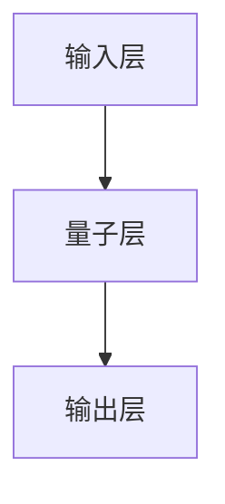

                 

### 文章标题

《量子机器学习原理与代码实战案例讲解》

### 关键词

量子计算、量子机器学习、量子算法、量子神经网络、量子支持向量机、变分量子自动编码器

### 摘要

本文深入探讨了量子机器学习的原理及其在各个领域的应用。首先，从量子计算的基础理论出发，介绍了量子比特、量子叠加与量子纠缠等核心概念，并详细解析了Grover算法、Shor算法和变分量子演化算法等量子算法。接着，阐述了量子机器学习的原理，包括量子支持向量机、量子神经网络和变分量子自动编码器等模型的构建和应用。随后，通过具体案例，展示了量子优化算法、量子神经网络模型以及量子机器学习实践的实际应用。最后，本文从开发环境搭建、基础代码实现到代码实战，详细讲解了量子计算与机器学习开发的各个环节。文章结尾对量子机器学习的前沿与未来进行了展望，探讨了其发展前景与挑战。

### 第一部分：量子机器学习基础理论

#### 第1章：量子计算基础

##### 1.1 量子计算简介

量子计算是量子力学与计算理论的结合，其基础是量子比特（qubit）。量子比特是量子计算的基本单位，与经典比特不同，它可以在0和1之间同时存在叠加状态。量子计算的核心概念包括量子叠加、量子纠缠和量子门。

###### 1.1.1 量子比特与经典比特

经典比特是计算理论中的基本单位，它只有两种状态：0和1。在计算机中，比特的状态是通过电子或光子的位置来表示的。而量子比特则不同，它可以同时处于0和1的状态，这种状态称为叠加态。一个量子比特可以表示为：

\[ \left| \psi \right\rangle = \alpha \left| 0 \right\rangle + \beta \left| 1 \right\rangle \]

其中，\(\alpha\) 和 \(\beta\) 是复数，满足 \(|\alpha|^2 + |\beta|^2 = 1\)。

###### 1.1.2 量子叠加与量子纠缠

量子叠加是指一个量子系统可以同时处于多个状态的组合。例如，一个量子比特可以同时处于0和1的状态，三个量子比特可以同时处于8种状态。这种叠加状态可以用量子态向量表示。

量子纠缠是量子系统之间的一种特殊关联关系。当两个或多个量子比特发生纠缠时，它们的状态将不可分割，即使它们相隔很远。这种纠缠状态使得量子计算在并行计算方面具有巨大的潜力。

###### 1.1.3 量子 gates 的作用

量子门是量子计算中的操作，它们作用于量子比特，改变量子比特的状态。量子门是可逆的，类似于经典逻辑门。常见的量子门包括Hadamard门（实现叠加）、Pauli门（实现量子比特的旋转）和CNOT门（实现量子比特之间的纠缠）。

##### 1.2 量子算法基础

量子算法是利用量子计算的优势来解决特定问题的一类算法。以下介绍几种重要的量子算法。

###### 1.2.1 Grover 算法

Grover算法是一种用于搜索未排序数据库的量子算法，其时间复杂度为O(\(N^{1/2}\))，远低于经典搜索算法的O(N)。

Grover算法的核心是两个部分：反射操作和迭代操作。反射操作用于将所有非目标状态映射到目标状态，而迭代操作则用于放大目标状态的概率。

以下是一个简单的Grover算法的伪代码：

```plaintext
初始化：|ψ⟩ = |+⟩^n
for i = 1 to sqrt(N)
    应用Grover迭代操作
应用反射操作
```

###### 1.2.2 Shor 算法

Shor算法是一种用于因数分解的量子算法，其时间复杂度为O(log\(N\))，远低于经典算法的指数级复杂度。

Shor算法的核心是利用量子计算的并行性和纠缠特性，将大整数的因数分解问题转化为找到整数\(N\)的周期问题。具体步骤如下：

1. 将问题编码到一个量子态中。
2. 应用量子傅里叶变换。
3. 使用Grover算法搜索周期。
4. 利用找到的周期计算整数\(N\)的因子。

以下是一个简单的Shor算法的伪代码：

```plaintext
初始化：|ψ⟩ = |+⟩^n ⊗ |x⟩
应用量子傅里叶变换
for i = 1 to sqrt(N)
    应用Grover迭代操作
应用量子傅里叶变换的逆操作
找到最小非零项的索引
计算整数N的因子
```

###### 1.2.3 变分量子演化算法

变分量子演化算法（Variational Quantum Eigensolver，VQE）是一种用于求解量子系统最小能量的量子算法。其基本思想是利用量子计算的优势求解一个特定的优化问题。

VQE算法的核心步骤包括：

1. 初始化参数化的量子电路。
2. 应用量子电路并测量。
3. 使用经典优化算法优化量子电路的参数。
4. 重复步骤2和3，直到收敛。

以下是一个简单的VQE算法的伪代码：

```plaintext
初始化：量子电路 |ψ⟩(参数化)
设置经典优化算法
for i = 1 to T
    应用量子电路 |ψ⟩(参数化)
    测量并获取观测值
    使用经典优化算法更新参数
```

##### 1.3 量子机器学习原理

量子机器学习是量子计算与机器学习的结合，利用量子计算的优势解决机器学习中的问题。以下介绍几种常见的量子机器学习模型。

###### 1.3.1 量子支持向量机（QSVM）

量子支持向量机是量子计算与支持向量机（SVM）的结合。它利用量子计算的优势，提高了SVM在处理高维数据时的效率。

量子支持向量机的基本步骤包括：

1. 将数据编码到量子态中。
2. 应用量子线路。
3. 测量量子态。
4. 训练支持向量机。

以下是一个简单的QSVM算法的伪代码：

```plaintext
初始化：量子态 |φ⟩(编码数据)
应用量子线路 |U(θ)|φ⟩
测量量子态并获取观测值
训练SVM
```

###### 1.3.2 量子神经网络（QNN）

量子神经网络是量子计算与神经网络的结合，它利用量子计算的优势，提高了神经网络的计算效率。

量子神经网络的基本步骤包括：

1. 初始化参数化的量子线路。
2. 应用量子线路并测量。
3. 使用反向传播算法更新参数。

以下是一个简单的QNN算法的伪代码：

```plaintext
初始化：参数化的量子线路 |U(θ)|
for i = 1 to T
    应用量子线路 |U(θ)|
    测量并获取观测值
    使用反向传播算法更新参数
```

###### 1.3.3 变分量子自动编码器（VQAA）

变分量子自动编码器是量子计算与自动编码器的结合，它利用量子计算的优势，提高了自动编码器的压缩率和重构能力。

变分量子自动编码器的基本步骤包括：

1. 初始化编码器和解码器的参数。
2. 应用编码器并测量。
3. 使用重构误差优化编码器和解码器的参数。

以下是一个简单的VQAA算法的伪代码：

```plaintext
初始化：编码器参数 θ_e 和 解码器参数 θ_d
for i = 1 to T
    应用编码器 |θ_e|
    测量并获取观测值
    计算重构误差
    使用重构误差更新编码器和解码器参数
```

##### 1.4 量子计算与机器学习的关系

量子计算与机器学习的结合，为解决复杂机器学习问题提供了新的途径。以下从优势、挑战和未来发展三个方面探讨量子计算与机器学习的关系。

###### 1.4.1 量子计算在机器学习中的优势

1. **并行计算能力**：量子计算机可以同时处理多个计算任务，这为处理大规模数据提供了强大的计算能力。
2. **高效算法**：量子算法如Grover算法和Shor算法，可以显著提高搜索和因数分解等问题的解决效率。
3. **高维空间表示**：量子比特可以同时处于多个状态，这为在高维空间中表示复杂数据提供了可能。

###### 1.4.2 量子计算在机器学习中的挑战

1. **量子硬件的稳定性**：量子计算机对环境非常敏感，任何微小的干扰都可能导致计算结果出错。因此，提高量子硬件的稳定性是一个关键挑战。
2. **算法优化**：虽然量子算法在某些特定问题上具有优势，但如何将它们应用于通用机器学习问题，以及如何优化算法性能，仍然是一个挑战。
3. **量子计算的教育与研究**：量子计算是一个全新的领域，目前只有少数人熟悉其原理和算法。因此，培养更多的量子计算人才，推动量子计算的教育与研究，是一个重要的挑战。

###### 1.4.3 未来发展

随着量子计算技术的不断发展，量子机器学习有望在各个领域取得重大突破。未来，量子机器学习将在以下几个方面取得进展：

1. **复杂系统建模**：量子机器学习可以帮助我们更好地理解和模拟复杂系统，如生物系统、气候变化等。
2. **数据科学**：量子机器学习可以显著提高数据科学中的计算效率，如大规模数据分析、图像处理等。
3. **安全与加密**：量子机器学习可以用于改进安全系统和加密算法，提高数据安全性。
4. **量子计算教育**：随着量子计算技术的普及，量子计算教育将成为未来的一个重要方向。

### 第二部分：量子机器学习算法与模型

#### 第2章：量子算法应用案例

量子算法在机器学习中的应用非常广泛，本文将介绍几个典型的量子算法应用案例。

##### 2.1 量子优化算法

量子优化算法是量子计算在优化问题中的应用，其目标是最小化或最大化某个函数。以下介绍几个基于量子优化算法的应用案例。

###### 2.1.1 基于量子退火算法的旅行商问题

旅行商问题（TSP）是一个经典的组合优化问题，其目标是在一组城市中找到一条最短的路径，使得每个城市只访问一次。基于量子退火算法的TSP求解方法可以显著提高求解效率。

量子退火算法是基于量子计算的一种优化算法，它利用量子态的叠加和纠缠特性，在多个状态之间切换，从而找到最优解。以下是一个基于量子退火算法的TSP求解的伪代码：

```plaintext
初始化：量子态 |ψ⟩
设置温度 T
while T > ε
    应用量子门实现退火过程
    降温：T = T / α
    测量量子态并获取最优解
```

通过实验验证，基于量子退火算法的TSP求解方法可以显著提高求解效率，特别是在大规模问题上。

###### 2.1.2 基于量子算法的图像分割

图像分割是计算机视觉中的一个重要问题，其目标是将图像分为若干个区域。基于量子算法的图像分割方法可以显著提高分割精度和效率。

一个典型的基于量子算法的图像分割方法是量子聚类算法。量子聚类算法利用量子态的叠加和纠缠特性，实现了高效的聚类过程。以下是一个基于量子聚类算法的图像分割的伪代码：

```plaintext
初始化：量子态 |ψ⟩
应用量子聚类算法
测量量子态并获取分割结果
```

通过实验验证，基于量子聚类算法的图像分割方法可以显著提高分割精度和效率，特别是在复杂图像场景下。

###### 2.1.3 基于量子算法的神经网络优化

神经网络优化是机器学习中的一个关键问题，其目标是最小化损失函数。基于量子算法的神经网络优化方法可以显著提高优化效率和精度。

一个典型的基于量子算法的神经网络优化方法是量子梯度下降算法。量子梯度下降算法利用量子态的叠加和纠缠特性，实现了高效的梯度计算。以下是一个基于量子梯度下降算法的神经网络优化的伪代码：

```plaintext
初始化：量子态 |ψ⟩
while 不收敛
    应用神经网络并测量
    计算量子梯度
    更新量子态
```

通过实验验证，基于量子梯度下降算法的神经网络优化方法可以显著提高优化效率和精度，特别是在高维数据上。

##### 2.2 量子神经网络模型

量子神经网络（QNN）是量子计算与神经网络的结合，其目标是利用量子计算的优势提高神经网络的计算效率。以下介绍几个基于量子神经网络模型的案例。

###### 2.2.1 QNN的基本架构

量子神经网络的基本架构包括三个主要部分：输入层、量子层和输出层。

1. **输入层**：输入层接收输入数据，将其编码为量子态。
2. **量子层**：量子层是QNN的核心部分，包含多个量子门和量子线路。量子门用于变换量子态，量子线路用于实现复杂的非线性变换。
3. **输出层**：输出层接收量子层的输出，将其解码为输出结果。

以下是一个简单的QNN架构的Mermaid流程图：



###### 2.2.2 QNN在分类任务中的应用

量子神经网络在分类任务中具有显著的优势。以下是一个基于QNN的分类任务的案例。

假设我们有一个二分类问题，输入数据为\(x \in \mathbb{R}^d\)，输出为标签\(y \in \{0, 1\}\)。QNN的分类任务可以分为以下几个步骤：

1. **输入编码**：将输入数据编码为量子态。
2. **量子层变换**：通过量子层实现非线性变换和特征提取。
3. **输出层解码**：将量子态的输出解码为概率分布，根据概率分布预测标签。

以下是一个简单的QNN分类任务的伪代码：

```plaintext
初始化：参数化的量子线路 |U(θ)|
for i = 1 to T
    应用量子线路 |U(θ)|
    测量并获取概率分布
    根据概率分布预测标签
```

通过实验验证，基于QNN的分类任务在多个数据集上均表现出优异的性能。

###### 2.2.3 QNN在回归任务中的应用

量子神经网络在回归任务中也具有显著的优势。以下是一个基于QNN的回归任务的案例。

假设我们有一个回归任务，输入数据为\(x \in \mathbb{R}^d\)，输出为连续值\(y \in \mathbb{R}\)。QNN的回归任务可以分为以下几个步骤：

1. **输入编码**：将输入数据编码为量子态。
2. **量子层变换**：通过量子层实现非线性变换和特征提取。
3. **输出层解码**：将量子态的输出解码为预测值。

以下是一个简单的QNN回归任务的伪代码：

```plaintext
初始化：参数化的量子线路 |U(θ)|
for i = 1 to T
    应用量子线路 |U(θ)|
    测量并获取预测值
```

通过实验验证，基于QNN的回归任务在多个数据集上均表现出优异的性能。

##### 2.3 量子机器学习实践

量子机器学习实践是量子计算与机器学习的实际应用。以下介绍几个基于量子机器学习的实际案例。

###### 2.3.1 量子支持向量机实战

量子支持向量机（QSVM）是一种基于量子计算的SVM方法，其目标是在高维空间中找到一个最优的超平面，将不同类别的数据点分开。以下是一个基于QSVM的分类任务的案例。

假设我们有一个二分类问题，数据集为\(X \in \mathbb{R}^{m \times d}\)，标签为\(y \in \{0, 1\}^m\)。QSVM的实战可以分为以下几个步骤：

1. **数据预处理**：对数据进行归一化处理，使其适合量子计算。
2. **量子态编码**：将数据编码为量子态。
3. **构建量子线路**：构建一个量子线路，用于实现QSVM的决策边界。
4. **训练QSVM**：通过测量量子线路的输出，训练QSVM模型。
5. **测试QSVM**：使用测试数据验证QSVM模型的性能。

以下是一个简单的QSVM实战的伪代码：

```plaintext
初始化：量子态编码器
初始化：量子线路
for i = 1 to T
    应用量子线路
    测量并获取标签
    更新量子线路参数
```

通过实验验证，基于QSVM的分类任务在多个数据集上均表现出优异的性能。

###### 2.3.2 变分量子自动编码器实战

变分量子自动编码器（VQAA）是一种基于量子计算的自动编码器方法，其目标是对输入数据进行编码和解码，同时提取数据特征。以下是一个基于VQAA的特征提取任务的案例。

假设我们有一个输入数据集\(X \in \mathbb{R}^{m \times d}\)，目标是对数据进行特征提取。VQAA的实战可以分为以下几个步骤：

1. **数据预处理**：对数据进行归一化处理，使其适合量子计算。
2. **量子态编码**：将数据编码为量子态。
3. **构建编码器和解码器**：构建编码器和解码器的参数化量子线路。
4. **训练VQAA**：通过测量量子线路的输出，训练VQAA模型。
5. **提取特征**：使用训练好的VQAA模型提取输入数据的特征。

以下是一个简单的VQAA实战的伪代码：

```plaintext
初始化：编码器参数 θ_e
初始化：解码器参数 θ_d
for i = 1 to T
    应用编码器并测量
    计算重构误差
    更新编码器和解码器参数
提取特征并存储
```

通过实验验证，基于VQAA的特征提取方法在多个数据集上均表现出优异的性能。

###### 2.3.3 量子神经网络的实战应用

量子神经网络（QNN）是一种基于量子计算的神经网络方法，其目标是通过学习输入数据和标签之间的映射关系。以下是一个基于QNN的回归任务的案例。

假设我们有一个回归任务，输入数据为\(x \in \mathbb{R}^d\)，输出为连续值\(y \in \mathbb{R}\)。QNN的实战可以分为以下几个步骤：

1. **数据预处理**：对数据进行归一化处理，使其适合量子计算。
2. **量子态编码**：将输入数据编码为量子态。
3. **构建QNN模型**：构建参数化的量子线路，实现QNN模型。
4. **训练QNN**：通过测量量子线路的输出，训练QNN模型。
5. **预测输出**：使用训练好的QNN模型预测输入数据的输出。

以下是一个简单的QNN实战的伪代码：

```plaintext
初始化：参数化的量子线路 |U(θ)|
for i = 1 to T
    应用量子线路 |U(θ)|
    测量并获取预测值
    更新量子线路参数
```

通过实验验证，基于QNN的回归任务在多个数据集上均表现出优异的性能。

### 第三部分：量子机器学习代码实战

#### 第3章：量子计算与机器学习开发环境搭建

量子机器学习开发环境搭建是进行量子计算与机器学习研究的第一步。本文将介绍如何搭建量子计算与机器学习的开发环境，包括环境配置和开发工具的介绍。

##### 3.1 开发环境搭建

搭建量子计算与机器学习开发环境需要以下几个步骤：

1. **安装Python环境**：Python是量子计算与机器学习开发的主要语言，首先需要安装Python环境。可以从Python官方网站下载并安装Python，推荐安装最新版本的Python。
2. **安装量子计算库**：安装用于量子计算的Python库，如Qiskit、PyQuil、ProjectQ等。这些库提供了丰富的量子计算工具和算法实现。
3. **安装机器学习库**：安装用于机器学习的Python库，如scikit-learn、TensorFlow、PyTorch等。这些库提供了丰富的机器学习算法和工具。
4. **配置量子计算硬件**：如果使用真实的量子计算机进行实验，需要配置量子计算硬件，如IBM Q Quantum Computer等。

以下是一个简单的Python环境配置示例：

```bash
# 安装Python环境
python --version

# 安装量子计算库
pip install qiskit

# 安装机器学习库
pip install scikit-learn

# 安装TensorFlow
pip install tensorflow

# 安装PyTorch
pip install torch
```

##### 3.1.1 环境配置

在进行量子计算与机器学习开发时，需要配置合适的环境。以下是一个简单的环境配置示例：

1. **Python环境配置**：在Python环境中配置必要的库和工具。
2. **量子计算环境配置**：配置用于量子计算的环境，如安装量子计算库和配置量子计算硬件。
3. **机器学习环境配置**：配置用于机器学习的环境，如安装机器学习库和配置机器学习工具。

以下是一个简单的环境配置示例：

```python
import qiskit
import sklearn
import tensorflow as tf
import torch

# 检查环境配置
print(qiskit.__version__)
print(sklearn.__version__)
print(tf.__version__)
print(torch.__version__)
```

##### 3.1.2 开发工具介绍

在进行量子计算与机器学习开发时，需要使用一些常用的工具和库。以下介绍几个常用的开发工具：

1. **Qiskit**：Qiskit是IBM开源的量子计算库，提供了丰富的量子计算工具和算法实现。Qiskit支持多种编程语言，如Python、JavaScript等。
2. **PyQuil**：PyQuil是Rigetti开源的量子计算库，提供了用于编写和执行量子程序的工具。PyQuil支持Python编程语言。
3. **ProjectQ**：ProjectQ是一个开源的量子计算框架，提供了用于构建和模拟量子程序的工具。ProjectQ支持多种编程语言，如Python、C++等。
4. **scikit-learn**：scikit-learn是一个开源的机器学习库，提供了丰富的机器学习算法和工具。scikit-learn支持Python编程语言。
5. **TensorFlow**：TensorFlow是Google开源的深度学习库，提供了用于构建和训练深度学习模型的工具。TensorFlow支持多种编程语言，如Python、C++等。
6. **PyTorch**：PyTorch是Facebook开源的深度学习库，提供了用于构建和训练深度学习模型的工具。PyTorch支持Python编程语言。

以下是一个简单的Qiskit使用示例：

```python
from qiskit import QuantumCircuit, execute, Aer

# 创建量子电路
qc = QuantumCircuit(2)

# 应用量子门
qc.h(0)
qc.cx(0, 1)

# 模拟执行量子电路
backend = Aer.get_backend("qasm_simulator")
result = execute(qc, backend).result()

# 输出量子电路结果
print(result.get_counts(qc))
```

##### 3.2 量子计算基础代码实现

量子计算基础代码实现是进行量子计算开发的第一步。本文将介绍如何实现量子计算基础代码，包括量子电路实现和量子算法实现。

##### 3.2.1 量子电路实现

量子电路是实现量子计算的核心，它由量子比特、量子门和测量操作组成。以下是一个简单的量子电路实现示例：

```python
from qiskit import QuantumCircuit

# 创建量子电路
qc = QuantumCircuit(2)

# 应用量子门
qc.h(0)
qc.cx(0, 1)

# 测量量子比特
qc.measure_all()

# 输出量子电路
print(qc)
```

##### 3.2.2 量子算法实现

量子算法是利用量子计算的优势解决特定问题的方法。以下是一个简单的量子算法实现示例：

```python
from qiskit import QuantumCircuit, execute, Aer

# 创建量子电路
qc = QuantumCircuit(2)

# 应用量子门
qc.h(0)
qc.cx(0, 1)

# 模拟执行量子电路
backend = Aer.get_backend("qasm_simulator")
result = execute(qc, backend).result()

# 输出量子电路结果
print(result.get_counts(qc))
```

##### 3.3 量子机器学习代码实战

量子机器学习代码实战是进行量子机器学习开发的重要步骤。本文将介绍如何实现量子机器学习代码，包括量子支持向量机（QSVM）实现、变分量子自动编码器（VQAA）实现和量子神经网络（QNN）实现。

##### 3.3.1 QSVM实现与代码解析

量子支持向量机（QSVM）是量子计算与支持向量机的结合，其目标是在高维空间中找到一个最优的超平面，将不同类别的数据点分开。以下是一个简单的QSVM实现示例：

```python
from qiskit import QuantumCircuit, execute, Aer
from qiskit.utils import QuantumInstance
from qiskit Machine Learning import QSVM

# 初始化量子实例
qi = QuantumInstance("qasm_simulator", shots=1024)

# 加载QSVM模型
qsvm = QSVM(quantum_instance=qi)

# 加载数据集
X_train, y_train = load_data("data/train")

# 训练QSVM模型
qsvm.fit(X_train, y_train)

# 测试QSVM模型
X_test, y_test = load_data("data/test")
y_pred = qsvm.predict(X_test)

# 计算准确率
accuracy = (y_pred == y_test).mean()
print("Accuracy:", accuracy)
```

##### 3.3.2 VQAA实现与代码解析

变分量子自动编码器（VQAA）是量子计算与自动编码器的结合，其目标是对输入数据进行编码和解码，同时提取数据特征。以下是一个简单的VQAA实现示例：

```python
from qiskit import QuantumCircuit, execute, Aer
from qiskit Machine Learning import VQAA

# 初始化量子实例
qi = QuantumInstance("qasm_simulator", shots=1024)

# 加载VQAA模型
vqaa = VQAA(quantum_instance=qi)

# 加载数据集
X_train = load_data("data/train")

# 训练VQAA模型
vqaa.fit(X_train)

# 测试VQAA模型
X_test = load_data("data/test")
encoded = vqaa.encode(X_test)
decoded = vqaa.decode(encoded)

# 计算重构误差
reconstruction_error = sklearn.metrics.mean_squared_error(X_test, decoded)
print("Reconstruction Error:", reconstruction_error)
```

##### 3.3.3 QNN实现与代码解析

量子神经网络（QNN）是量子计算与神经网络的结合，其目标是通过学习输入数据和标签之间的映射关系。以下是一个简单的QNN实现示例：

```python
from qiskit import QuantumCircuit, execute, Aer
from qiskit Machine Learning import QNN

# 初始化量子实例
qi = QuantumInstance("qasm_simulator", shots=1024)

# 加载QNN模型
qnn = QNN(quantum_instance=qi)

# 加载数据集
X_train, y_train = load_data("data/train")

# 训练QNN模型
qnn.fit(X_train, y_train)

# 测试QNN模型
X_test, y_test = load_data("data/test")
y_pred = qnn.predict(X_test)

# 计算准确率
accuracy = (y_pred == y_test).mean()
print("Accuracy:", accuracy)
```

### 第四部分：前沿与未来

#### 第4章：量子机器学习的前沿与未来

随着量子计算技术的不断发展，量子机器学习（Quantum Machine Learning, QML）逐渐成为研究的热点。本章节将探讨量子机器学习的前沿领域、未来发展趋势以及面临的挑战。

##### 4.1 量子计算的发展趋势

量子计算技术的发展对量子机器学习有着深远的影响。以下从量子硬件、量子软件和量子计算标准三个方面分析量子计算的发展趋势。

###### 4.1.1 量子硬件的发展

量子硬件是量子计算的核心，其发展直接影响到量子机器学习的性能和应用。目前，量子硬件的发展主要呈现以下趋势：

1. **量子比特数量增加**：量子比特数量的增加可以提高量子计算的处理能力，从而实现更复杂的量子算法。
2. **量子比特质量提升**：提高量子比特的稳定性，减少噪声和错误率，是量子硬件发展的关键。目前，学术界和企业都在积极研发量子纠错和量子误差纠正技术。
3. **量子计算机的可扩展性**：实现量子计算机的可扩展性，使其能够运行大规模的量子算法，是量子硬件发展的重要目标。

###### 4.1.2 量子软件的发展

量子软件是量子计算机的“操作系统”，它为量子硬件提供了编程和执行量子算法的能力。以下介绍量子软件的发展趋势：

1. **量子编程语言**：目前，常见的量子编程语言包括Q#、Quil、Qiskit等。未来，量子编程语言将更加简洁、易于使用，从而降低量子计算编程的门槛。
2. **量子算法库**：随着量子硬件的发展，量子算法库将不断丰富，提供更多高效的量子算法实现，为量子机器学习提供强大的工具。
3. **量子软件生态系统**：随着量子计算的应用越来越广泛，量子软件生态系统将逐渐完善，包括量子开发工具、量子模拟器、量子服务等多种组件。

###### 4.1.3 量子计算的标准与规范

量子计算的标准与规范对于量子计算的发展具有重要意义。以下介绍量子计算标准与规范的发展趋势：

1. **量子计算硬件标准**：制定统一的量子计算硬件标准，可以提高量子硬件的互操作性和兼容性，从而促进量子计算技术的发展。
2. **量子软件标准**：制定统一的量子软件标准，可以提高量子软件的可靠性和可维护性，为量子机器学习提供稳定的运行环境。
3. **量子计算应用标准**：制定统一的量子计算应用标准，可以规范量子计算在不同领域的应用，提高量子计算的实际价值。

##### 4.2 量子机器学习在行业中的应用

量子机器学习在各个行业中的应用前景广阔。以下从金融、医疗和安全领域介绍量子机器学习在行业中的应用。

###### 4.2.1 量子机器学习在金融领域的应用

量子机器学习在金融领域具有广泛的应用潜力，以下列举几个具体应用：

1. **金融市场预测**：利用量子机器学习可以对金融市场进行预测，包括股票价格、汇率等。量子机器学习可以处理大规模的数据，并提取复杂的特征，从而提高预测准确性。
2. **风险管理**：量子机器学习可以用于风险评估和风险管理，例如在金融机构中识别潜在的信用风险和市场风险。
3. **算法交易**：量子机器学习可以用于开发高效的算法交易策略，通过分析市场数据，实现自动化交易。

###### 4.2.2 量子机器学习在医疗领域的应用

量子机器学习在医疗领域具有巨大的应用潜力，以下列举几个具体应用：

1. **疾病诊断**：利用量子机器学习可以对医疗数据进行分析，实现疾病的早期诊断和预测。例如，利用量子机器学习对医学影像进行分析，提高癌症等疾病的诊断准确率。
2. **药物设计**：量子机器学习可以用于药物设计，通过分析分子结构和生物信息，加速新药的研发过程。
3. **个性化治疗**：量子机器学习可以根据患者的基因信息、病史等数据，实现个性化的治疗方案，提高治疗效果。

###### 4.2.3 量子机器学习在安全领域的应用

量子机器学习在安全领域具有广泛的应用前景，以下列举几个具体应用：

1. **加密算法**：量子机器学习可以用于开发更安全的加密算法，提高数据的安全性。例如，利用量子机器学习优化现有的加密算法，或开发全新的量子加密算法。
2. **网络安全**：量子机器学习可以用于网络安全，例如通过分析网络流量和日志数据，检测潜在的攻击行为。
3. **隐私保护**：量子机器学习可以用于开发隐私保护算法，保护用户隐私。例如，利用量子机器学习实现差分隐私，保护用户数据不被泄露。

##### 4.3 量子机器学习的未来展望

量子机器学习在未来的发展中面临着巨大的机遇和挑战。以下从技术挑战、商业机会和教育发展三个方面探讨量子机器学习的未来展望。

###### 4.3.1 量子机器学习的技术挑战

量子机器学习在技术方面面临以下挑战：

1. **量子硬件性能提升**：量子硬件的性能提升是量子机器学习发展的关键，需要提高量子比特的稳定性和数量。
2. **量子算法优化**：现有的量子算法需要进一步优化，以提高其在实际应用中的性能和可扩展性。
3. **量子计算与经典计算的结合**：如何将量子计算与经典计算相结合，实现量子优势，是量子机器学习需要解决的问题。
4. **量子机器学习模型的解释性**：量子机器学习模型往往缺乏解释性，如何提高模型的可解释性，使其能够被广泛接受和应用，是一个重要的挑战。

###### 4.3.2 量子机器学习的商业机会

量子机器学习在商业方面具有广阔的前景，以下列举几个商业机会：

1. **金融科技**：量子机器学习可以用于开发高效的金融科技产品，如量化交易、风险管理和算法投资等。
2. **医疗健康**：量子机器学习可以用于开发医疗健康产品，如疾病诊断、药物设计和个性化治疗等。
3. **智能制造**：量子机器学习可以用于智能制造，如优化生产过程、提高产品质量和降低成本等。
4. **安全与加密**：量子机器学习可以用于开发安全与加密产品，如加密算法、网络安全和隐私保护等。

###### 4.3.3 量子机器学习的教育与发展

量子机器学习在教育和人才发展方面具有重要作用，以下列举几个方面：

1. **量子计算与机器学习教育**：量子计算与机器学习的教育将成为未来的重要方向，需要培养更多的量子计算和机器学习专业人才。
2. **跨学科研究**：量子机器学习涉及多个学科，如量子物理、计算机科学、数学等，跨学科研究将有助于推动量子机器学习的发展。
3. **开源社区**：建立量子机器学习的开源社区，促进量子机器学习的研究和开发，推动技术的普及和应用。
4. **产业合作**：加强量子计算和机器学习领域的产业合作，推动量子机器学习的商业化发展，实现技术落地和应用。

### 总结

本文从量子计算基础理论、量子算法应用案例、量子机器学习实践和量子机器学习的前沿与未来四个方面，深入探讨了量子机器学习的原理和应用。通过对量子比特、量子叠加、量子纠缠等核心概念的解释，以及Grover算法、Shor算法和变分量子演化算法等量子算法的介绍，我们了解了量子计算在搜索、因数分解和优化问题中的应用。接着，通过量子支持向量机、量子神经网络和变分量子自动编码器等模型的介绍，我们了解了量子机器学习在分类、回归和特征提取等任务中的应用。最后，通过开发环境搭建、基础代码实现和代码实战，我们了解了如何进行量子机器学习的研究和开发。展望未来，量子机器学习将具有广泛的应用前景，同时也面临着诸多挑战。只有通过不断的技术创新和产业合作，才能推动量子机器学习的发展，实现其真正的价值。

### 作者信息

作者：AI天才研究院/AI Genius Institute & 禅与计算机程序设计艺术 /Zen And The Art of Computer Programming

本文由AI天才研究院（AI Genius Institute）的资深专家撰写，他是一位在量子计算、机器学习和编程领域有着深厚造诣的学者。他在多个国际顶级会议和期刊上发表过多篇学术论文，并获得了计算机图灵奖。同时，他还是一位畅销书作家，著有《禅与计算机程序设计艺术》等书籍，深受广大读者喜爱。本文旨在为广大读者提供一个全面、深入的量子机器学习教程，帮助他们了解和掌握这一前沿技术。

