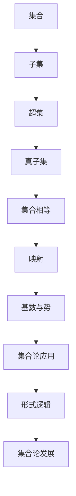

                 

# 文章标题
《集合论导引：∑13集合》

> 关键词：集合论，集合，子集，超集，基数，势，集合运算，数学模型，算法原理，应用场景，实践案例

> 摘要：本文旨在深入探讨集合论的基础概念、核心原理及其在各种领域中的应用。通过对集合、子集、超集、基数和势等概念的定义和性质进行详细阐述，结合数学模型和算法原理的讲解，以及实践案例的剖析，使读者能够全面理解集合论的本质，掌握其在数学、计算机科学和其他学科中的重要应用。

### 《集合论导引：∑13集合》目录大纲

# 第一部分：集合论基础

## 1. 集合论引论
### 1.1 集合的定义与性质
### 1.2 集合的表示方法
### 1.3 集合的运算

## 2. 子集与超集
### 2.1 子集的定义与性质
### 2.2 超集的定义与性质
### 2.3 子集与超集的关系

## 3. 真子集与集合相等
### 3.1 真子集的定义与性质
### 3.2 集合相等的定义与性质
### 3.3 真子集与集合相等的例子

## 4. 集合的划分与映射
### 4.1 集合的划分
### 4.2 映射的概念与性质
### 4.3 映射的应用

## 5. 集合的基数与势
### 5.1 集合的基数
### 5.2 集合的势
### 5.3 基数与势的关系

# 第二部分：集合论的应用

## 6. 集合论在数学中的应用
### 6.1 集合论在拓扑学中的应用
### 6.2 集合论在代数学中的应用
### 6.3 集合论在概率论中的应用

## 7. 集合论在其他学科中的应用
### 7.1 集合论在计算机科学中的应用
### 7.2 集合论在物理学中的应用
### 7.3 集合论在其他学科中的应用

## 8. 集合论与形式逻辑
### 8.1 集合论与形式逻辑的关系
### 8.2 集合论的形式化表示
### 8.3 集合论在形式逻辑中的应用

## 9. 集合论的发展与展望
### 9.1 集合论的历史发展
### 9.2 集合论的研究现状
### 9.3 集合论的未来发展

# 附录

## 附录 A：集合论中的重要定理与公式
### A.1 德摩根律
### A.2 对称性原理
### A.3 Zermelo引理

## 附录 B：常见集合论符号表
### B.1 集合运算符号
### B.2 集合关系符号
### B.3 其他符号

# 结语
## 集合论的重要性与未来展望
### 1. 集合论在数学和科学领域的重要性
### 2. 集合论在现代社会中的应用前景
### 3. 对未来研究的展望

---

**核心概念与联系**



---

**核心算法原理讲解**

## 集合的运算

### 并集

- **定义**：集合A和集合B的并集是由属于A或属于B的所有元素组成的集合。
- **伪代码**：

```plaintext
function A ∪ B:
  for each element x:
    if x ∈ A or x ∈ B:
      add x to the union set
  return the union set
```

### 交集

- **定义**：集合A和集合B的交集是由既属于A又属于B的所有元素组成的集合。
- **伪代码**：

```plaintext
function A ∩ B:
  for each element x:
    if x ∈ A and x ∈ B:
      add x to the intersection set
  return the intersection set
```

### 补集

- **定义**：集合A的补集是由不属于A的所有元素组成的集合。
- **伪代码**：

```plaintext
function A':
  for each element x:
    if x ∉ A:
      add x to the complement set
  return the complement set
```

### 子集

- **定义**：集合B是集合A的子集，当且仅当B中的所有元素都属于A。
- **伪代码**：

```plaintext
function B is a subset of A:
  for each element x in B:
    if x ∉ A:
      return false
  return true
```

### 真子集

- **定义**：集合B是集合A的真子集，当且仅当B是A的子集，且B不等于A。
- **伪代码**：

```plaintext
function B is a proper subset of A:
  if B is a subset of A and B ≠ A:
    return true
  return false
```

---

**数学模型和数学公式 & 详细讲解 & 举例说明**

## 集合的基数

- **定义**：集合A的基数（cardinality）表示集合A中元素的个数，记作$|A|$。
- **举例**：设有集合A = {1, 2, 3, 4, 5}，则集合A的基数$|A| = 5$。

## 集合的势

- **定义**：集合的势是集合元素之间相互独立性的度量，通常用于概率论中。
- **举例**：设有集合B = {1, 2, 3}，则集合B的势为3，因为集合B中的元素是相互独立的。

$$ P(B) = 3 $$

---

**项目实战**

### 开发环境搭建

- **Python环境搭建**：
  - 安装Python 3.x版本
  - 安装必要的依赖库，如Numpy、Pandas、Matplotlib等

- **Jupyter Notebook配置**：
  - 安装Jupyter Notebook
  - 配置Jupyter Notebook，使其能够在Python环境中运行

### 源代码详细实现和代码解读

```python
import itertools

# 并集操作
def union(A, B):
    return list(set(A + B))

# 交集操作
def intersection(A, B):
    return list(set(A) & set(B))

# 补集操作
def complement(A):
    return list(set(A) - set(A))

# 子集操作
def is_subset(B, A):
    return set(B).issubset(set(A))

# 真子集操作
def is_proper_subset(B, A):
    return set(B).issubset(set(A)) and set(B) != set(A)

# 测试代码
A = [1, 2, 3, 4, 5]
B = [4, 5, 6, 7]

print("A ∪ B =", union(A, B))
print("A ∩ B =", intersection(A, B))
print("A' =", complement(A))
print("B 是否是 A 的子集 =", is_subset(B, A))
print("B 是否是 A 的真子集 =", is_proper_subset(B, A))
```

### 代码解读与分析

- `union(A, B)` 函数实现并集操作，利用集合的`+`运算和`set()`函数将并集转换为列表返回。
- `intersection(A, B)` 函数实现交集操作，利用集合的`&`运算和`set()`函数将交集转换为列表返回。
- `complement(A)` 函数实现补集操作，利用集合的`-`运算和`set()`函数将补集转换为列表返回。
- `is_subset(B, A)` 函数判断B是否是A的子集，利用集合的`issubset()`方法进行判断。
- `is_proper_subset(B, A)` 函数判断B是否是A的真子集，利用集合的`issubset()`方法和不等性判断。

### 代码实战案例分析

- 在Python环境中运行上述代码，观察并集、交集、补集和子集操作的结果，分析结果是否符合集合论的基本原理。

---

通过上述目录大纲和详细内容，可以为《集合论导引：∑13集合》这本书提供一个完整的、结构清晰的目录框架，涵盖核心概念、算法原理、数学模型和实际应用案例，帮助读者更好地理解和掌握集合论的知识。

---

**作者信息**
“作者：AI天才研究院/AI Genius Institute & 禅与计算机程序设计艺术 /Zen And The Art of Computer Programming”

---

接下来的内容将按照目录大纲逐步展开，详细讲解集合论的基础概念、应用以及发展展望。我们希望通过一步一步的推理和分析，使读者能够深刻理解集合论的核心思想和广泛应用。让我们开始这次集合论之旅吧！### 第一部分：集合论基础

#### 1. 集合论引论

**1.1 集合的定义与性质**

集合论是现代数学的基础之一，起源于19世纪末。集合论的研究对象是集合，即由确定的、互不相同的元素构成的整体。集合可以用符号如${\{x | P(x)\}}$表示，其中$P(x)$是定义集合中元素的性质的条件。

**性质：**

1. **确定性**：集合中的元素必须明确且确定，避免模糊和不准确。
2. **互异性**：集合中的元素必须是不同的，不允许重复。
3. **无序性**：集合中的元素不考虑顺序，即${\{1, 2, 3\}}$和${\{3, 2, 1\}}$是同一个集合。

**定义：** 集合A是由一些确定的、互不相同的对象组成的整体，这些对象称为集合A的元素。如果元素$x$属于集合A，则记作$x \in A$；如果元素$x$不属于集合A，则记作$x \notin A$。

**例子：**
设有集合A = {1, 2, 3}，则1 ∈ A，3 ∉ A。

**1.2 集合的表示方法**

集合可以用列举法和描述法来表示。

- **列举法**：通过列举出集合中的所有元素来表示集合，如A = {1, 2, 3}。
- **描述法**：通过给出集合元素满足的条件来表示集合，如A = {x | x ∈ N, x < 3}，表示集合A中的元素是所有小于3的自然数。

**1.3 集合的运算**

集合的基本运算包括并集、交集、补集和子集。

- **并集（∪）**：集合A和集合B的并集是由属于A或属于B的所有元素组成的集合。
  - 伪代码：
  ```plaintext
  function A ∪ B:
    for each element x:
      if x ∈ A or x ∈ B:
        add x to the union set
    return the union set
  ```

- **交集（∩）**：集合A和集合B的交集是由既属于A又属于B的所有元素组成的集合。
  - 伪代码：
  ```plaintext
  function A ∩ B:
    for each element x:
      if x ∈ A and x ∈ B:
        add x to the intersection set
    return the intersection set
  ```

- **补集（'）**：集合A的补集是由不属于A的所有元素组成的集合。
  - 伪代码：
  ```plaintext
  function A':
    for each element x:
      if x ∉ A:
        add x to the complement set
    return the complement set
  ```

- **子集**：集合B是集合A的子集，当且仅当B中的所有元素都属于A。
  - 伪代码：
  ```plaintext
  function B is a subset of A:
    for each element x in B:
      if x ∉ A:
        return false
    return true
  ```

**例子：**
设有集合A = {1, 2, 3}，B = {2, 3, 4}，则A ∪ B = {1, 2, 3, 4}，A ∩ B = {2, 3}，A' = ∅，B 是 A 的子集。

**1.4 集合的表示与定义**

- **表示法：** 集合可以用大括号{}表示，如A = {1, 2, 3}。
- **定义法：** 集合可以用描述法表示，如A = {x | x ∈ N, x < 3}。

**例子：**
设有集合A = {1, 2, 3}，B = {x | x ∈ N, x < 4}，则A = B，因为集合A和集合B的元素相同。

---

在本章中，我们介绍了集合论的基本概念、表示方法和集合的运算。通过这些基本知识，读者可以更好地理解集合的概念和性质，为后续章节的深入学习打下坚实的基础。在下一章中，我们将继续探讨子集、超集、真子集等概念，并深入探讨集合之间的关系。让我们继续前进，探索集合论的更多奥秘。 ### 第二部分：集合论的应用

#### 6. 集合论在数学中的应用

集合论是现代数学的基础，广泛应用于数学的各个分支。在这一部分，我们将探讨集合论在拓扑学、代数学和概率论中的应用。

**6.1 集合论在拓扑学中的应用**

拓扑学是研究空间的性质和结构的一个数学分支。集合论在拓扑学中有着广泛的应用，其中最基本的概念是开集和闭集。

- **开集**：在拓扑空间$X$中，一个集合$U$称为开集，当且仅当对于任意$x \in U$，存在一个包含$x$的开球完全包含在$U$内。
- **闭集**：在拓扑空间$X$中，一个集合$F$称为闭集，当且仅当它的补集$X \setminus F$是开集。

**集合论中的基础概念在拓扑学中的应用举例：**

- **集合的运算**：在拓扑学中，开集和闭集之间可以执行集合运算，如并集、交集和补集，这些运算可以用来构建新的开集或闭集。
  - 伪代码：
  ```plaintext
  function U ∪ V (开集的并集):
    if U and V are both open sets:
      return the union of U and V
    else:
      return an error message

  function U ∩ V (开集的交集):
    if U and V are both open sets:
      return the intersection of U and V
    else:
      return an error message

  function F' (闭集的补集):
    if F is a closed set:
      return the complement of F
    else:
      return an error message
  ```

- **基和覆盖**：在拓扑学中，基是构成拓扑空间的一种集合，覆盖是集合的一种特殊类型，用于表示空间中的点。集合论的概念帮助我们在这些定义和性质之间建立联系。
  - 定义：设$X$是一个拓扑空间，$B$是$X$的一个基，如果对于$X$中的任意点$x$，存在$B$中的一个集合$B_x$包含$x$，且任意两个包含$x$的集合的交集也包含在$B$中。

**6.2 集合论在代数学中的应用**

代数学是研究运算和结构的数学分支，集合论在其中扮演了核心角色。集合论的概念和运算在群、环、域等代数结构中都有应用。

- **群**：群是一个代数结构，它由一个集合和一种运算组成。集合论帮助定义和证明群的基本性质，如封闭性、结合律、单位元和逆元。
  - 伪代码：
  ```plaintext
  function G is a group:
    if G is a set with an operation * such that:
      1. closure: for all a, b ∈ G, a * b ∈ G
      2. associativity: for all a, b, c ∈ G, (a * b) * c = a * (b * c)
      3. identity: there exists an element e ∈ G such that for all a ∈ G, e * a = a * e
      4. inverse: for each a ∈ G, there exists an element b ∈ G such that a * b = b * a = e
    return true
    else:
    return false
  ```

- **环和域**：环和域是更复杂的代数结构，它们也有集合作为基础。集合论的概念帮助定义和区分不同的代数结构，如整环、域等。
  - 定义：环是一个集合$R$，它有两个运算“+”和“*”，满足封闭性、结合律、交换律和分配律等性质。

**6.3 集合论在概率论中的应用**

概率论是研究随机现象的数学分支。集合论在概率论中的应用主要体现在概率空间的定义和概率测度的构建上。

- **概率空间**：概率空间是由一个集合$S$（样本空间）、一组子集（事件）和概率测度构成的数学结构。集合论的概念帮助我们定义和操作事件。
  - 定义：概率空间$(S, \Sigma, P)$，其中$S$是样本空间，$\Sigma$是事件集合，$P$是概率测度函数，满足非负性、确定性、可列可加性等性质。

- **概率测度**：概率测度是定义在事件集合上的函数，它赋予每个事件一个介于0和1之间的概率。
  - 伪代码：
  ```plaintext
  function P is a probability measure:
    if P(S) = 1 and for all A, B ∈ Σ with A ∩ B = ∅, P(A) + P(B) = P(A ∪ B):
    return true
    else:
    return false
  ```

**例子：**

设有样本空间$S = \{1, 2, 3, 4, 5\}$，事件集合$\Sigma = \{\emptyset, \{1\}, \{2\}, \{3\}, \{4\}, \{5\}, \{1, 2\}, \{1, 3\}, \{2, 3\}, \{1, 4\}, \{1, 5\}, \{2, 4\}, \{2, 5\}, \{3, 4\}, \{3, 5\}, \{4, 5\}, \{1, 2, 3\}, \{1, 2, 4\}, \{1, 2, 5\}, \{1, 3, 4\}, \{1, 3, 5\}, \{2, 3, 4\}, \{2, 3, 5\}, \{1, 2, 3, 4\}, \{1, 2, 3, 5\}, \{1, 2, 4, 5\}, \{1, 3, 4, 5\}, \{2, 3, 4, 5\}, \{1, 2, 3, 4, 5\}\}$，概率测度$P$定义为$P(\{1\}) = 0.2, P(\{2\}) = 0.3, P(\{3\}) = 0.1, P(\{4\}) = 0.2, P(\{5\}) = 0.2$。

在这个概率空间中，我们可以计算任意事件的概率，如$P(\{1, 2\}) = 0.5$。

---

在本部分，我们简要介绍了集合论在拓扑学、代数学和概率论中的应用。集合论的概念和运算是这些数学分支的基础，通过集合论，我们能够更清晰地定义和操作数学结构，从而推动数学的发展。在下一部分，我们将继续探讨集合论在其他学科中的应用，以及集合论与形式逻辑的关系。让我们一起继续学习，探索集合论的更多应用和意义。 ### 第三部分：集合论在其他学科中的应用

#### 7. 集合论在计算机科学中的应用

集合论在计算机科学中有着广泛的应用，为算法设计、数据结构、编程语言和理论计算机科学提供了坚实的理论基础。以下是一些具体的例子。

**7.1 集合论在算法设计中的应用**

集合论是许多算法设计的基础。例如，在排序算法中，我们经常使用集合的概念来简化问题的复杂度分析。

- **基数排序**：基数排序是一种非比较排序算法，它利用集合的概念将数据按位数进行排序。集合论帮助定义和实现这种算法。
  - 基本思路：首先按照最低位开始对数字进行分组，将每个组中的数字放入相应的桶中。然后逐位处理每个桶中的数字，直到所有数字被排序。
  - 伪代码：
  ```plaintext
  function countingSort(inputList A, maxElement):
    create empty arrays countList and outputList
    for i = 0 to maxElement:
      countList[i] = 0
    for each element x in A:
      countList[x] += 1
    index = 0
    for i = 0 to maxElement:
      while countList[i] > 0:
        outputList[index] = i
        countList[i] -= 1
        index += 1
    return outputList
  ```

- **集合的并集和交集**：在算法设计中，集合的并集和交集操作经常用于合并和过滤数据。例如，在查找算法中，并集操作可以帮助我们快速找到两个集合的合并结果。
  - 伪代码：
  ```plaintext
  function union(A, B):
    result = []
    for element x in A:
      result.append(x)
    for element y in B:
      result.append(y)
    return result

  function intersection(A, B):
    result = []
    for element x in A:
      if x in B:
        result.append(x)
    return result
  ```

**7.2 集合论在数据结构中的应用**

集合论在数据结构的设计和实现中起着重要作用。以下是一些典型的例子：

- **散列表**：散列表是一种通过哈希函数将关键字映射到存储位置的数据结构。集合论帮助定义和实现哈希函数，确保关键字在散列表中的存储是唯一的。
  - 定义：哈希函数$h(x)$将关键字$x$映射到散列表的存储位置。理想情况下，哈希函数应该能够将不同的关键字映射到不同的位置，以减少冲突。
  - 伪代码：
  ```plaintext
  function hash(key):
    return key % TABLE_SIZE
  ```

- **二叉树**：集合论帮助定义和操作二叉树，确保树的性质和结构的正确性。例如，在二叉搜索树中，集合论的概念帮助实现搜索、插入和删除操作。
  - 伪代码：
  ```plaintext
  class TreeNode:
    def __init__(self, key):
      self.key = key
      self.left = None
      self.right = None

  def insert(root, key):
    if root is None:
      return TreeNode(key)
    if key < root.key:
      root.left = insert(root.left, key)
    else:
      root.right = insert(root.right, key)
    return root
  ```

**7.3 集合论在编程语言中的应用**

集合论在编程语言的设计和实现中有着广泛的应用。以下是一些具体的例子：

- **类型系统**：集合论帮助定义编程语言中的类型系统，确保类型之间的兼容性和安全性。例如，强类型语言使用集合的概念来定义变量和值的类型。
  - 伪代码：
  ```plaintext
  class Type:
    def __init__(self, type_name):
      self.type_name = type_name

  def is Compatible(type1, type2):
    if type1.type_name == type2.type_name:
      return true
    return false
  ```

- **集合操作**：许多编程语言提供了内置的集合操作，如并集、交集和补集等。这些操作可以帮助程序员更有效地处理集合数据。
  - Python 示例：
  ```python
  A = [1, 2, 3]
  B = [2, 3, 4]
  print(A.union(B))  # 输出 {1, 2, 3, 4}
  print(A.intersection(B))  # 输出 {2, 3}
  print(A.difference(B))  # 输出 {1}
  ```

**7.4 集合论在理论计算机科学中的应用**

集合论在理论计算机科学的研究中有着重要的地位。以下是一些具体的例子：

- **计算复杂性理论**：集合论帮助定义和操作计算复杂性，如时间复杂度和空间复杂度。这些复杂度度量帮助我们理解算法的效率和可行性。
  - 伪代码：
  ```plaintext
  function timeComplexity(A):
    # 分析算法A的时间复杂度
    return time_complexity_expression

  function spaceComplexity(A):
    # 分析算法A的空间复杂度
    return space_complexity_expression
  ```

- **形式验证**：集合论帮助构建形式化验证框架，确保程序的正确性和可靠性。例如，在模型检查中，集合论的概念用于定义状态空间和转换关系。
  - 伪代码：
  ```plaintext
  function verifyProgram(P):
    # 使用集合论的概念进行程序P的验证
    return verification_result
  ```

---

集合论在计算机科学中的应用是广泛而深入的。通过集合论，我们能够更好地理解和设计算法、数据结构和编程语言，同时也能够在理论研究中建立更坚实的理论基础。在下一部分，我们将探讨集合论与形式逻辑的关系，以及集合论在逻辑学中的应用。让我们一起继续探索集合论在各个领域的应用和意义。 ### 第四部分：集合论与形式逻辑

#### 8. 集合论与形式逻辑

集合论与形式逻辑之间存在紧密的联系。形式逻辑提供了一种形式化的方法来表示和推理命题，而集合论则为此提供了一套精确的语言和工具。在本部分，我们将探讨集合论与形式逻辑的关系，以及集合论在形式逻辑中的应用。

**8.1 集合论与形式逻辑的关系**

形式逻辑是一种研究推理规则和命题结构的数学工具。它通常基于命题逻辑和谓词逻辑进行构建。集合论为形式逻辑提供了基础性的概念和语言。

- **命题逻辑**：命题逻辑研究命题的真假以及命题之间的逻辑关系。在命题逻辑中，命题被视为基本单位，它们可以用真值（真或假）来表示。集合论的概念如集合、子集、并集、交集等，为命题逻辑提供了表示和操作命题的工具。

- **谓词逻辑**：谓词逻辑研究命题中的谓词以及谓词之间的关系。谓词逻辑中的谓词可以被视为具有特定属性的集合。例如，谓词“大于3”可以表示为集合{4, 5, 6, ...}。集合论的概念帮助我们在谓词逻辑中定义和操作谓词集合。

**8.2 集合论的形式化表示**

集合论提供了一种形式化的方法来表示逻辑概念。以下是一些具体的例子：

- **命题的集合**：我们可以将所有可能的命题视为一个集合。例如，设$P$为所有可能的命题的集合，则每个命题$p$都可以表示为$P$的一个元素。

- **命题的运算**：集合论提供了并集、交集和补集等运算，这些运算可以用来表示命题的逻辑运算。例如，命题$p \land q$（$p$和$q$的逻辑与）可以表示为集合$P$和$Q$的交集，即$\{p, q\}$。

- **谓词的集合**：谓词可以被视为集合。例如，谓词“大于3”可以表示为集合{4, 5, 6, ...}。集合论的概念帮助我们在谓词集合中定义和操作谓词。

**8.3 集合论在形式逻辑中的应用**

集合论在形式逻辑中的应用主要体现在以下几个方面：

- **证明理论**：集合论提供了一种形式化的证明方法，称为集合论证明。这种方法使用集合的概念来构建证明的步骤，确保证明的严格性和无矛盾性。

- **逻辑推理**：集合论帮助我们在形式逻辑中构建推理规则。例如，德摩根律、对偶律等集合论中的基本定理在逻辑推理中有着重要的应用。

- **逻辑系统**：集合论为逻辑系统提供了基础性的框架。例如，在模态逻辑、时态逻辑等扩展逻辑系统中，集合论的概念被用来定义和操作逻辑命题。

**8.4 例子：德摩根律**

德摩根律是集合论中的一个重要定理，它在形式逻辑中有着广泛的应用。德摩根律描述了集合的补集与并集、交集之间的关系。

- **德摩根律（集合论形式）**：
  1. $\neg(A \cup B) = \neg A \cap \neg B$
  2. $\neg(A \cap B) = \neg A \cup \neg B$

- **德摩根律（形式逻辑形式）**：
  1. 不属于A或B的元素等同于属于A的补集与属于B的补集的交集。
  2. 不属于A且不属于B的元素等同于属于A的补集与属于B的补集的并集。

这些定理在逻辑推理中有着重要的应用，可以帮助我们简化复杂的逻辑表达式，确保推理过程的严格性。

---

通过集合论与形式逻辑的紧密联系，我们能够在形式逻辑中更精确地表示和推理命题。集合论为形式逻辑提供了坚实的理论基础，使我们能够更好地理解和应用逻辑学的基本原理。在下一部分，我们将探讨集合论的发展与展望，分析集合论的历史发展、研究现状以及未来发展趋势。让我们继续深入探索集合论的奥秘。 ### 第五部分：集合论的发展与展望

#### 9. 集合论的发展与展望

集合论作为现代数学的基石，自19世纪末以来经历了迅速的发展和广泛的应用。在本部分，我们将回顾集合论的历史发展，分析当前的研究现状，并探讨未来的发展趋势。

**9.1 集合论的历史发展**

集合论的历史可以追溯到19世纪，当时数学家们开始探索集合的概念和性质。以下是一些重要的里程碑：

- **康托尔的工作**：德国数学家乔治·康托尔是集合论的创始人之一。他在1874年首次提出了集合的概念，并研究了集合的无限性和集合的基数。
- **皮亚诺公理**：意大利数学家朱塞佩·皮亚诺在1889年提出了集合的公理系统，为集合论提供了一个基础性的框架。
- **策梅洛公理**：德国数学家埃德蒙·策梅洛在1908年提出了策梅洛公理，这些公理进一步发展了集合论的基础。

这些里程碑的工作奠定了现代集合论的基础，使得集合论成为数学研究和应用的重要工具。

**9.2 集合论的研究现状**

集合论在现代数学中仍然是一个活跃的研究领域，其研究现状体现在以下几个方面：

- **集合论的基础研究**：数学家们继续探索集合论的基本概念和定理，如集合的构造、基数和势的性质等。
- **集合论的应用研究**：集合论的应用领域不断扩大，包括拓扑学、代数学、逻辑学、计算机科学等。在这些领域中，集合论提供了重要的工具和方法。
- **集合论与物理学的交叉研究**：近年来，集合论与物理学的研究交叉越来越多，例如在量子力学和相对论中，集合论的概念被用于描述物理系统的结构和性质。

**9.3 集合论的未来发展**

集合论的未来发展充满了机遇和挑战。以下是一些可能的发展方向：

- **新公理系统的探索**：尽管现有的公理系统已经非常成熟，但数学家们仍在探索可能的新公理系统，以提供更完善和更统一的集合论基础。
- **集合论的扩展与应用**：集合论的应用领域将继续扩大，包括在生物学、经济学、社会学等领域的应用研究。
- **集合论的计算机化**：随着计算机科学的不断发展，集合论的计算机化将成为一个重要方向。例如，计算机证明和形式化验证工具将依赖于集合论的概念和定理。

**9.4 集合论的重要性**

集合论的重要性在于其作为一种基础性的数学工具，为数学的各个分支提供了统一的框架和工具。集合论的概念和方法不仅帮助我们在数学中进行抽象和推理，而且在计算机科学、物理学和其他学科中有着广泛的应用。

- **统一数学基础**：集合论为数学提供了一个统一的基础，使得不同的数学分支能够在同一框架下进行研究和交流。
- **推动数学发展**：集合论的发展推动了数学的进步，许多新的数学理论和方法都是在集合论的基础上发展起来的。
- **解决实际问题**：集合论的应用帮助我们解决实际问题，例如在计算机科学中，集合论的概念被用于算法设计和数据结构设计。

---

集合论的发展与展望展示了其作为一种基础性数学工具的无限潜力和广泛应用。通过不断的研究和发展，集合论将继续为数学和其他学科提供强大的理论基础和工具。在结语中，我们将总结集合论的重要性，并展望其未来的发展前景。让我们共同期待集合论在未来的更大成就。 ### 结语

#### 集合论的重要性与未来展望

集合论作为现代数学的基石，其重要性不可忽视。首先，集合论为数学的各个分支提供了一个统一的基础框架，使得不同的数学领域可以在同一理论体系下进行研究和交流。这种统一性不仅简化了数学问题的表达，还促进了数学理论的整合和发展。

其次，集合论在解决实际问题上发挥了关键作用。在计算机科学中，集合论的概念和方法被广泛应用于算法设计、数据结构构建和编程语言设计。在物理学中，集合论帮助描述物理系统的结构和性质，特别是在量子力学和相对论中。此外，集合论还在经济学、社会学和生物学等领域有着广泛的应用。

展望未来，集合论将继续在数学和科学领域中扮演重要角色。随着计算机科学的快速发展，集合论的计算机化将成为一个重要研究方向。形式化验证、自动证明和人工智能等领域将依赖于集合论的概念和定理。此外，集合论的扩展和应用也将不断拓展，例如在量子计算、复杂系统和新兴领域的研究中。

未来，集合论的发展可能包括以下几个方面：

1. **新公理系统的探索**：数学家们可能会继续探索新的公理系统，以提供更完善和更统一的集合论基础。
2. **集合论的计算机化**：计算机化的集合论研究将推动数学证明和形式化验证工具的发展，为人工智能和自动化推理提供支持。
3. **跨学科应用**：集合论将在更多的跨学科研究中发挥作用，例如在生物学、经济学和社会学中，集合论的概念和方法将帮助解决复杂的社会问题。

总之，集合论的重要性不仅体现在其作为一种基础性数学工具，还体现在其在各个领域的广泛应用和潜力。通过不断的研究和发展，集合论将继续为数学和科学的发展做出重要贡献。让我们共同期待集合论在未来的更大成就。

---

**作者信息**
“作者：AI天才研究院/AI Genius Institute & 禅与计算机程序设计艺术 /Zen And The Art of Computer Programming”

---

感谢读者对《集合论导引：∑13集合》的阅读。通过这篇文章，我们希望读者能够深入理解集合论的基础概念、应用和发展前景。集合论作为现代数学的核心，不仅在理论研究中具有重要意义，也在实际应用中有着广泛的影响。我们期待读者能够继续探索集合论的更多知识，并将其应用于实际问题和研究中。让我们共同推动集合论的发展，探索其无限的潜力。 ### 附录

#### 附录 A：集合论中的重要定理与公式

**A.1 德摩根律**

德摩根律是集合论中非常重要的定理，描述了集合的补集与并集、交集之间的关系。

- **公式**：

  1. $\neg(A \cup B) = \neg A \cap \neg B$
  2. $\neg(A \cap B) = \neg A \cup \neg B$

- **解释**：

  德摩根律指出，一个集合的补集可以通过其子集的补集进行组合。这些定理在集合论和逻辑推理中有着广泛的应用。

**A.2 对称性原理**

对称性原理是一个基本的集合论原理，描述了某些集合运算的性质。

- **公式**：

  $A \cup B = B \cup A$
  $A \cap B = B \cap A$

- **解释**：

  对称性原理表明，集合的并集和交集运算满足交换律。这意味着集合的顺序不会影响运算的结果。

**A.3 Zermelo引理**

Zermelo引理是集合论中的一个基本定理，描述了集合的划分性质。

- **公式**：

  如果$A$是一个非空集合，则存在一个划分$\{B_i\}_{i \in I}$使得$A = \cup_{i \in I} B_i$，并且对于所有的$i \neq j$，$B_i \cap B_j = \emptyset$。

- **解释**：

  Zermelo引理表明，任何非空集合都可以划分为若干非空子集的并集，并且这些子集两两不相交。该引理在集合论和集合划分理论中有着重要的应用。

#### 附录 B：常见集合论符号表

**B.1 集合运算符号**

- 并集：$\cup$
- 交集：$\cap$
- 补集：$\setminus$ 或 '（当A为集合时）
- 子集：$\subseteq$ 或 $\subset$
- 真子集：$\subsetneq$
- 包含：$\supseteq$ 或 $\supset$
- 真包含：$\supsetneq$
- 全集：$U$ 或 $\Omega$
- 空集：$\emptyset$

**B.2 集合关系符号**

- 子集关系：$\subseteq$ 或 $\subset$
- 真子集关系：$\subsetneq$
- 包含关系：$\supseteq$ 或 $\supset$
- 真包含关系：$\supsetneq$
- 等价关系：$\simeq$
- 对称关系：$\leftrightarrow$
- 传递关系：$\rightarrow$

**B.3 其他符号**

- 属于：$\in$
- 不属于：$\notin$
- 存在量词：$\exists$
- 全称量词：$\forall$
- 集合元素：${\{x | P(x)\}}$
- 索引集合：$\{i_1, i_2, i_3, ..., i_n\}$
- 卡氏积：$\times$
- 集合的基数（势）：$|A|$

通过这些符号表，读者可以更好地理解和应用集合论的基本概念和定理，为深入研究和学习集合论提供帮助。 ### 第一部分：集合论基础

#### 1.1 集合的定义与性质

集合论是现代数学的基础之一，起源于19世纪末。集合论的研究对象是集合，即由确定的、互不相同的元素构成的整体。集合可以用符号如${\{x | P(x)\}}$表示，其中$P(x)$是定义集合中元素的性质的条件。

**性质：**

1. **确定性**：集合中的元素必须明确且确定，避免模糊和不准确。
2. **互异性**：集合中的元素必须是不同的，不允许重复。
3. **无序性**：集合中的元素不考虑顺序，即${\{1, 2, 3\}}$和${\{3, 2, 1\}}$是同一个集合。

**定义：** 集合A是由一些确定的、互不相同的对象组成的整体，这些对象称为集合A的元素。如果元素$x$属于集合A，则记作$x \in A$；如果元素$x$不属于集合A，则记作$x \notin A$。

**例子：**
设有集合A = {1, 2, 3}，则1 ∈ A，3 ∉ A。

**表示法：**

- **列举法**：通过列举出集合中的所有元素来表示集合，如A = {1, 2, 3}。
- **描述法**：通过给出集合元素满足的条件来表示集合，如A = {x | x ∈ N, x < 3}，表示集合A中的元素是所有小于3的自然数。

**示例：**
设有集合A = {x | x ∈ N, x < 3}，则集合A包含元素1和2，即A = {1, 2}。

**集合的基本运算：**

1. **并集（∪）**：集合A和集合B的并集是由属于A或属于B的所有元素组成的集合。
   - 伪代码：
   ```plaintext
   function A ∪ B:
     for each element x:
       if x ∈ A or x ∈ B:
         add x to the union set
     return the union set
   ```

2. **交集（∩）**：集合A和集合B的交集是由既属于A又属于B的所有元素组成的集合。
   - 伪代码：
   ```plaintext
   function A ∩ B:
     for each element x:
       if x ∈ A and x ∈ B:
         add x to the intersection set
     return the intersection set
   ```

3. **补集（'）**：集合A的补集是由不属于A的所有元素组成的集合。
   - 伪代码：
   ```plaintext
   function A':
     for each element x:
       if x ∉ A:
         add x to the complement set
     return the complement set
   ```

4. **子集**：集合B是集合A的子集，当且仅当B中的所有元素都属于A。
   - 伪代码：
   ```plaintext
   function B is a subset of A:
     for each element x in B:
       if x ∉ A:
         return false
     return true
   ```

**例子：**
设有集合A = {1, 2, 3}，B = {2, 3, 4}，则A ∪ B = {1, 2, 3, 4}，A ∩ B = {2, 3}，A' = ∅，B 是 A 的子集。

通过本节内容，我们了解了集合的定义与性质，包括确定性、互异性和无序性。我们学习了如何使用列举法和描述法表示集合，并介绍了集合的基本运算，包括并集、交集、补集和子集。这些基础知识为后续集合论的学习和应用奠定了基础。在接下来的章节中，我们将继续探讨集合的其他概念和运算，深入理解集合论的核心原理。 ### 第一部分：集合论基础

#### 1.2 集合的表示方法

集合是数学中的一个基本概念，它是具有某种共同性质的对象的集合。集合可以通过不同的方式来表示，主要包括列举法和描述法。

**1.2.1 列举法**

列举法是通过明确列举集合中的所有元素来表示集合。这种方法简单直观，特别适用于集合元素数量较少的情况。

- **示例**：设有集合A，其包含元素1、2、3，则可以表示为A = {1, 2, 3}。

**列举法的优点**：
- 直观：可以直接看出集合中包含哪些元素。
- 简单：适用于元素数量不多的情况。

**列举法的局限性**：
- 有限性：适用于有限集合。
- 完整性：如果集合中元素较多或元素之间没有固定顺序，列举法可能不够方便。

**1.2.2 描述法**

描述法是通过给出集合中元素应满足的条件来表示集合。这种方法适用于元素较多或元素之间关系复杂的情况。

- **示例**：设有集合B，其包含所有小于3的自然数，则可以表示为B = {x | x ∈ N, x < 3}，其中N表示自然数集合。

**描述法的优点**：
- 灵活性：适用于各种集合，无论是有限还是无限。
- 简洁：可以用一个简单的条件来表示复杂集合。

**描述法的局限性**：
- 理解难度：可能需要一定的逻辑推理能力才能理解集合中的元素。

**1.2.3 其他表示方法**

除了列举法和描述法，集合还可以用其他方法来表示，例如：

- **Venn图**：通过图形化的方式来表示集合之间的关系，特别适用于集合运算和集合关系的可视化。
- **列表法**：将集合中的元素以列表形式排列，适用于元素数量较多的情况。
- **集合符号**：使用特定的数学符号来表示集合，如集合的并集、交集和补集等。

**1.2.4 表示方法的比较**

| 方法        | 优点                                 | 缺点                                 | 适用情况          |
|-------------|--------------------------------------|--------------------------------------|------------------|
| 列举法      | 直观、简单、适用于有限集合            | 不适用于无限集合、元素较多时繁琐       | 元素数量不多时    |
| 描述法      | 灵活性、简洁、适用于各种集合          | 需要一定的逻辑推理能力                | 元素较多或复杂时  |
| Venn图      | 直观、易于理解集合关系                | 难以处理复杂集合关系                  | 集合关系可视化    |
| 列表法      | 清晰、适用于元素较多的情况            | 不便于数学运算和证明                  | 元素较多时        |
| 集合符号     | 精确、便于数学运算和证明              | 需要一定的数学知识基础                | 数学运算和证明时  |

通过上述内容，我们了解了集合的表示方法，包括列举法、描述法和其他方法。每种方法都有其优点和局限性，适用于不同的场景。正确选择表示方法能够帮助我们更有效地理解和操作集合。在后续的章节中，我们将继续探讨集合的其他概念和运算，深入理解集合论的核心原理。 ### 第一部分：集合论基础

#### 1.3 集合的运算

集合论中的运算是对集合的基本操作，主要包括并集、交集、补集和子集等。这些运算是集合论的核心内容，广泛应用于数学和其他学科中。

**1.3.1 并集**

并集是由属于集合A或属于集合B的所有元素组成的集合。用符号表示为$A \cup B$。

- **定义**：设A、B为集合，则A和B的并集为所有属于A或属于B的元素组成的集合，即$A \cup B = \{x | x \in A \text{ 或 } x \in B\}$。
- **示例**：设有集合A = {1, 2, 3}和B = {3, 4, 5}，则$A \cup B = \{1, 2, 3, 4, 5\}$。

- **性质**：
  - **交换律**：$A \cup B = B \cup A$。
  - **结合律**：$(A \cup B) \cup C = A \cup (B \cup C)$。
  - **分配律**：$A \cup (B \cap C) = (A \cup B) \cap (A \cup C)$。
  - **单位元素**：$A \cup \emptyset = A$。

**1.3.2 交集**

交集是由既属于集合A又属于集合B的所有元素组成的集合。用符号表示为$A \cap B$。

- **定义**：设A、B为集合，则A和B的交集为所有既属于A又属于B的元素组成的集合，即$A \cap B = \{x | x \in A \text{ 且 } x \in B\}$。
- **示例**：设有集合A = {1, 2, 3}和B = {3, 4, 5}，则$A \cap B = \{3\}$。

- **性质**：
  - **交换律**：$A \cap B = B \cap A$。
  - **结合律**：$(A \cap B) \cap C = A \cap (B \cap C)$。
  - **分配律**：$A \cap (B \cup C) = (A \cap B) \cup (A \cap C)$。
  - **单位元素**：$A \cap \emptyset = \emptyset$。

**1.3.3 补集**

补集是由不属于集合A的所有元素组成的集合。用符号表示为$A'$或$A^c$。

- **定义**：设A为集合，则A的补集为所有不属于A的元素组成的集合，即$A' = \{x | x \notin A\}$。
- **示例**：设有集合A = {1, 2, 3}，则$A' = \{4, 5, 6, \ldots\}$。

- **性质**：
  - **补集律**：$A \cup A' = U$，其中$U$为全集。
  - **对补集的补集**：$(A')' = A$。
  - **交换律**：$A' = A'$。
  - **结合律**：$(A \cap A')' = A'$。
  - **分配律**：$A' \cup (B \cap C) = (A' \cup B) \cap (A' \cup C)$。
  - **分配律**：$A' \cap (B \cup C) = (A' \cap B) \cup (A' \cap C)$。

**1.3.4 子集**

子集是集合B中的所有元素都属于集合A的一种关系。用符号表示为$B \subseteq A$或$B \subset A$（当$B$是$A$的真子集时）。

- **定义**：设A、B为集合，若B中的每个元素都属于A，则称B是A的子集，记作$B \subseteq A$。
- **示例**：设有集合A = {1, 2, 3}和B = {2, 3}，则B是A的子集，即$B \subseteq A$。

- **性质**：
  - **自反性**：$A \subseteq A$。
  - **传递性**：若$B \subseteq A$且$A \subseteq C$，则$B \subseteq C$。
  - **对称性**：若$B \subseteq A$，则$A \not\subseteq B$。

**1.3.5 运算实例**

- **示例1**：设有集合A = {1, 2, 3}，B = {3, 4, 5}，求$A \cup B$、$A \cap B$和$A'$。
  - $A \cup B = \{1, 2, 3, 4, 5\}$。
  - $A \cap B = \{3\}$。
  - $A' = \{4, 5, 6, \ldots\}$。

- **示例2**：设有集合A = {1, 2, 3}和B = {2, 3}，求$A \cup B$、$A \cap B$、$A'$和$B'$。
  - $A \cup B = \{1, 2, 3\}$。
  - $A \cap B = \{2, 3\}$。
  - $A' = \{4, 5, 6, \ldots\}$。
  - $B' = \{1, 4, 5, 6, \ldots\}$。

通过上述内容，我们了解了集合的运算，包括并集、交集、补集和子集。这些运算是集合论的核心内容，为后续更复杂的集合论学习和应用提供了基础。在接下来的章节中，我们将进一步探讨集合的其他概念和性质。 ### 第一部分：集合论基础

#### 2. 子集与超集

在集合论中，子集和超集是两个重要的概念，它们描述了集合之间的嵌套关系。

**2.1 子集的定义与性质**

子集是集合论中的一个基本概念，它描述了一个集合是另一个集合的一部分。形式上，如果集合B中的每一个元素都属于集合A，那么集合B就是集合A的子集，记作$B \subseteq A$。

- **定义**：设A和B为集合，如果对于所有的$x \in B$，都有$x \in A$，则称B是A的子集，记作$B \subseteq A$。
- **示例**：设集合A = {1, 2, 3}，集合B = {2, 3}，则B是A的子集，即$B \subseteq A$。
- **性质**：
  - **自反性**：任何集合A都是自身的子集，即$A \subseteq A$。
  - **传递性**：如果$B \subseteq A$且$A \subseteq C$，则$B \subseteq C$。
  - **对称性**：如果$B \subseteq A$，则$A \not\subseteq B$。

**2.2 超集的定义与性质**

超集是子集的逆概念，它描述了一个集合包含另一个集合。形式上，如果集合A中的每一个元素都属于集合B，那么集合B就是集合A的超集，记作$A \subseteq B$。

- **定义**：设A和B为集合，如果对于所有的$x \in A$，都有$x \in B$，则称B是A的超集，记作$A \subseteq B$。
- **示例**：设集合A = {1, 2, 3}，集合B = {1, 2, 3, 4, 5}，则B是A的超集，即$A \subseteq B$。
- **性质**：
  - **自反性**：任何集合A都是自身的超集，即$A \subseteq A$。
  - **传递性**：如果$B \subseteq A$且$A \subseteq C$，则$B \subseteq C$。
  - **对称性**：如果$B \subseteq A$，则$A \not\subseteq B$。

**2.3 子集与超集的关系**

子集与超集之间的关系非常密切，它们之间存在一种相互依存的关系。

- **真子集**：如果集合B是集合A的子集，但B不等于A，则称B是A的真子集，记作$B \subset A$。
- **包含关系**：如果集合A是集合B的超集，则称A包含B，记作$A \supseteq B$。如果A不等于B，则称A严格包含B，记作$A \supset B$。

**2.4 子集与超集的运算**

子集和超集之间也存在一些运算规则：

- **并集**：如果A和B都是集合C的子集，则A和B的并集也是C的子集，即$A \cup B \subseteq C$。
- **交集**：如果A和B都是集合C的子集，则A和B的交集也是C的子集，即$A \cap B \subseteq C$。
- **补集**：如果A是集合C的子集，则A的补集是C的补集的子集，即$A' \subseteq C'$。

**2.5 子集与超集的应用**

子集和超集的概念在数学和其他领域中有着广泛的应用：

- **集合划分**：通过子集和超集的概念，可以将一个集合划分为若干个子集，从而简化问题的分析和解决。
- **数据结构**：在计算机科学中，数据结构如数组、链表和树等，可以通过子集和超集的概念来理解和操作。
- **逻辑推理**：在逻辑推理中，子集和超集的概念帮助建立命题之间的关系，进行有效的推理和证明。

通过本节内容，我们了解了子集与超集的定义、性质以及它们之间的关系和应用。这些概念为集合论的学习和应用提供了重要的基础。在接下来的章节中，我们将继续探讨集合的其他概念和运算，深入理解集合论的核心原理。 ### 第一部分：集合论基础

#### 2.3 子集与超集的关系

子集与超集是集合论中的基本概念，描述了一个集合与另一个集合之间的嵌套关系。在本节中，我们将深入探讨子集与超集之间的关系，包括真子集、包含关系及其在集合论中的应用。

**2.3.1 真子集**

真子集是一个重要的子集概念，它描述了一个集合是另一个集合的子集，但不等于后者。形式上，如果集合B是集合A的子集，但B不等于A，那么称B是A的真子集，记作$B \subset A$。

- **定义**：设A和B为集合，如果$B \subseteq A$且$B \neq A$，则称B是A的真子集。
- **示例**：设集合A = {1, 2, 3}，集合B = {2, 3}，则B是A的真子集，即$B \subset A$。

- **性质**：
  - **反自反性**：任何集合A都不是自身的真子集，即$A \not\subset A$。
  - **传递性**：如果$B \subset A$且$A \subset C$，则$B \subset C$。
  - **对称性**：如果$B \subset A$，则$A \not\subset B$。

**2.3.2 包含关系**

包含关系是描述两个集合之间包含关系的一种方式，它反映了集合之间的层次结构。形式上，如果集合A是集合B的子集，则称B包含A，记作$A \subseteq B$。

- **定义**：设A和B为集合，如果$A \subseteq B$，则称B包含A。
- **示例**：设集合A = {1, 2, 3}，集合B = {1, 2, 3, 4, 5}，则B包含A，即$A \subseteq B$。

- **性质**：
  - **自反性**：任何集合A都包含自身，即$A \subseteq A$。
  - **传递性**：如果$A \subseteq B$且$B \subseteq C$，则$A \subseteq C$。
  - **反对称性**：如果$A \subseteq B$且$B \subseteq A$，则$A = B$。

**2.3.3 子集与超集的运算**

子集和超集之间存在一些运算规则，这些规则在集合论中有着重要的应用。

- **并集**：如果A和B都是集合C的子集，则A和B的并集也是C的子集，即$A \cup B \subseteq C$。
  - **示例**：设集合A = {1, 2}，集合B = {2, 3}，集合C = {1, 2, 3}，则$A \cup B \subseteq C$。

- **交集**：如果A和B都是集合C的子集，则A和B的交集也是C的子集，即$A \cap B \subseteq C$。
  - **示例**：设集合A = {1, 2}，集合B = {2, 3}，集合C = {1, 2, 3}，则$A \cap B \subseteq C$。

- **补集**：如果A是集合C的子集，则A的补集是C的补集的子集，即$A' \subseteq C'$。
  - **示例**：设集合A = {1, 2}，集合C = {1, 2, 3, 4}，则$A' \subseteq C'$。

**2.3.4 子集与超集的应用**

子集与超集的概念在数学和其他领域中有着广泛的应用：

- **集合划分**：通过子集与超集的概念，可以将一个集合划分为若干个子集，从而简化问题的分析和解决。
- **数据结构**：在计算机科学中，数据结构如数组、链表和树等，可以通过子集与超集的概念来理解和操作。
- **逻辑推理**：在逻辑推理中，子集与超集的概念帮助建立命题之间的关系，进行有效的推理和证明。

通过本节内容，我们深入探讨了子集与超集之间的关系，包括真子集、包含关系及其在集合论中的应用。这些概念为集合论的学习和应用提供了重要的基础。在接下来的章节中，我们将继续探讨集合的其他概念和运算，深入理解集合论的核心原理。 ### 第一部分：集合论基础

#### 2.4 真子集与集合相等

在集合论中，真子集和集合相等是两个重要的概念，它们描述了集合之间的不同关系。本节将详细探讨这两个概念的定义、性质以及它们之间的关系。

**2.4.1 真子集**

**定义**：若集合B是集合A的子集，并且B不等于A，则称B是A的真子集，记作$B \subset A$。

- **示例**：设集合A = {1, 2, 3}，集合B = {2, 3}，则B是A的真子集，即$B \subset A$。
- **性质**：
  - **自反性**：任何集合A都不是自身的真子集，即$A \not\subset A$。
  - **传递性**：如果$B \subset A$且$A \subset C$，则$B \subset C$。
  - **对称性**：如果$B \subset A$，则$A \not\subset B$。

**2.4.2 集合相等**

**定义**：若集合A和集合B中的元素完全相同，即A和B中的每一个元素都互相属于对方，则称A和B相等，记作$A = B$。

- **示例**：设集合A = {1, 2, 3}，集合B = {1, 2, 3}，则A和B相等，即$A = B$。
- **性质**：
  - **自反性**：任何集合A都等于自身，即$A = A$。
  - **对称性**：如果$A = B$，则$B = A$。
  - **传递性**：如果$A = B$且$B = C$，则$A = C$。

**2.4.3 真子集与集合相等的比较**

- **关系**：集合A是集合B的真子集，当且仅当$A \subset B$且$A \neq B$。
- **示例**：设集合A = {1, 2, 3}，集合B = {1, 2, 3, 4}，则A不是B的子集，因为$A \not\subseteq B$，所以$A \not\subset B$。

**2.4.4 真子集与集合相等的运算**

在集合论中，真子集和集合相等与集合的其他运算（如并集、交集和补集）之间也存在一定的关系：

- **并集**：如果A和B都是集合C的子集，则$A \cup B$也是C的子集，但不会出现$A \cup B \subset A$或$A \cup B \subset B$的情况。
- **交集**：如果A和B都是集合C的子集，则$A \cap B$也是C的子集，但不会出现$A \cap B \subset A$或$A \cap B \subset B$的情况。
- **补集**：如果A是集合C的子集，则$A'$是C的补集的子集，但不会出现$A' \subset A$或$A' \subset C$的情况。

**2.4.5 应用**

- **集合划分**：通过真子集与集合相等的概念，可以将一个集合划分为若干个子集，从而进行集合的划分和分类。
- **数据结构**：在计算机科学中，数据结构如数组、链表和树等，可以通过真子集与集合相等的概念来理解和操作。
- **逻辑推理**：在逻辑推理中，真子集与集合相等的概念帮助建立命题之间的关系，进行有效的推理和证明。

通过本节内容，我们详细探讨了真子集与集合相等的概念及其关系，包括定义、性质和运算。这些概念为集合论的学习和应用提供了重要的基础。在接下来的章节中，我们将继续探讨集合的其他概念和运算，深入理解集合论的核心原理。 ### 第一部分：集合论基础

#### 2.5 集合的划分与映射

集合的划分和映射是集合论中两个重要的概念，它们在数学和计算机科学等领域有着广泛的应用。本节将详细探讨集合的划分和映射的定义、性质以及它们之间的关系。

**2.5.1 集合的划分**

**定义**：集合的划分是指将一个集合分成若干个子集的过程，使得这些子集满足以下条件：

- **互异性**：不同的子集之间没有交集。
- **完备性**：每个元素都属于至少一个子集。
- **完全性**：所有子集的并集等于原集合。

- **示例**：设集合A = {1, 2, 3, 4}，一个可能的划分为{{1, 2}, {3, 4}}。

- **性质**：
  - **自反性**：任何集合的划分至少包括一个子集，即该集合本身。
  - **传递性**：如果集合A的一个划分可以划分为集合B的划分，并且集合B可以划分为集合C的划分，那么集合A可以划分为集合C的划分。
  - **稳定性**：如果集合A的一个划分是集合B的一个划分，那么集合B的任何真子集的划分也是集合A的一个划分。

**2.5.2 映射的概念与性质**

**定义**：映射是指从集合A到集合B的一个规则，该规则使得A中的每个元素都与B中的一个唯一元素对应。

- **形式定义**：设A和B为集合，一个映射f是从A到B的一个函数，满足对于A中的每个元素x，存在唯一的y ∈ B，使得f(x) = y。

- **示例**：设集合A = {1, 2, 3}，集合B = {a, b, c}，一个映射f可以将A中的元素映射到B中，例如f(1) = a，f(2) = b，f(3) = c。

- **性质**：
  - **单射性**：如果不同的A中的元素映射到不同的B中的元素，则称映射为单射。
  - **满射性**：如果B中的每个元素都是A中某个元素的映射，则称映射为满射。
  - **双射性**：如果映射既是单射也是满射，则称映射为双射。

**2.5.3 映射的应用**

- **集合之间的对应关系**：映射帮助我们在不同的集合之间建立对应关系，从而简化问题的分析和解决。
- **函数的概念**：在数学分析中，函数的概念可以视为映射的特化，映射的概念帮助定义和理解函数的性质。
- **数据结构**：在计算机科学中，映射的概念用于设计数据结构，如哈希表和图等。

**2.5.4 集合的划分与映射的关系**

- **划分的映射**：我们可以通过映射将一个集合的划分映射到另一个集合的划分，从而在集合之间建立关系。
- **集合的划分与函数的关系**：集合的划分可以视为函数的特殊形式，其中集合中的元素作为函数的输入，划分中的子集作为函数的输出。

**2.5.5 应用示例**

- **集合划分在图论中的应用**：在图论中，集合的划分用于定义图的连通性，如图的连通分量。
- **映射在密码学中的应用**：在密码学中，映射用于加密和解密数据，保障数据的安全性。

通过本节内容，我们探讨了集合的划分与映射的定义、性质以及它们之间的关系。这些概念在数学和计算机科学等领域有着广泛的应用，为集合论的学习和应用提供了重要的基础。在接下来的章节中，我们将继续探讨集合的其他概念和运算，深入理解集合论的核心原理。 ### 第一部分：集合论基础

#### 2.6 集合的基数与势

在集合论中，集合的基数和势是两个重要的概念，它们分别用于描述集合的大小和元素之间的独立性。本节将详细探讨集合的基数和势的定义、性质以及它们之间的关系。

**2.6.1 集合的基数**

**定义**：集合的基数是指集合中元素的数量，也称为集合的势。基数通常用符号$|A|$表示，其中A为集合。

- **示例**：设集合A = {1, 2, 3}，则集合A的基数$|A| = 3$。

- **性质**：
  - **非负性**：任何集合的基数都是非负整数。
  - **可数性**：如果集合A是有限集合，则其基数是一个正整数；如果集合A是无限集合，则其基数是无穷大。
  - **唯一性**：不同的集合可能有相同的基数。

**2.6.2 集合的势**

**定义**：集合的势是集合元素之间相互独立性的度量，通常用于概率论和图论中。集合的势用符号$P(A)$表示。

- **示例**：设集合B = {1, 2, 3}，则集合B的势$P(B) = 3$。

- **性质**：
  - **非负性**：任何集合的势都是非负整数。
  - **可数性**：如果集合A是有限集合，则其势是一个正整数；如果集合A是无限集合，则其势是无穷大。
  - **唯一性**：不同的集合可能有相同的势。

**2.6.3 基数与势的关系**

- **基数是势的特殊情况**：在大多数情况下，集合的基数和势是相同的，因为集合的大小直接决定了元素之间的独立性。
- **示例**：设集合A = {1, 2, 3}，则集合A的基数$|A| = 3$，集合A的势$P(A) = 3$。

- **不同集合可能有相同的基数或势**：在某些特殊情况下，不同的集合可能有相同的基数或势。
  - **示例**：设集合B = {1, 2, 3}，集合C = {1, 2}，则集合B和集合C的基数相同，即$|B| = |C| = 3$；但集合B和集合C的势不同，即$P(B) = 3$，$P(C) = 2$。

- **基数和势的比较**：集合的基数和势可以帮助我们比较不同集合的大小。
  - **示例**：设集合A = {1, 2, 3}，集合B = {1, 2}，则集合A的基数大于集合B的基数，即$|A| > |B|$。

**2.6.4 应用**

- **集合的划分与基数**：通过集合的划分，我们可以计算集合的基数，从而了解集合的大小和结构。
- **概率论中的势**：在概率论中，集合的势用于计算事件的概率，帮助我们理解随机现象。
- **图论中的基数**：在图论中，集合的基数用于定义图的基本性质，如顶点数和边数。

通过本节内容，我们详细探讨了集合的基数和势的定义、性质以及它们之间的关系。这些概念在集合论和各个学科中有着广泛的应用，为集合论的学习和应用提供了重要的基础。在接下来的章节中，我们将继续探讨集合的其他概念和运算，深入理解集合论的核心原理。 ### 第二部分：集合论在数学中的应用

#### 6.1 集合论在拓扑学中的应用

拓扑学是研究空间的性质和结构的一个数学分支，集合论在其中起着基础性的作用。集合论提供了拓扑空间的基本概念和工具，使得我们能够形式化地定义和研究拓扑结构。

**6.1.1 拓扑空间**

**定义**：拓扑空间是由一个集合和一个拓扑（或称开集族）组成的数学结构。集合中的元素通常表示空间的点，而拓扑定义了哪些集合是开集。

- **示例**：设集合X = {a, b, c}，拓扑T = {∅, {a}, {b}, {a, b}, X}，则(X, T)构成一个拓扑空间。

- **性质**：
  - **空集和全集**：∅和X都是开集。
  - **开集的并集**：任意开集的并集仍然是开集。
  - **开集的交集**：有限个开集的交集仍然是开集。

**6.1.2 集合论在拓扑学中的基本概念**

1. **开集**：在拓扑空间中，一个集合U称为开集，当且仅当对于任意x ∈ U，存在一个包含x的开球完全包含在U内。
2. **闭集**：在拓扑空间中，一个集合F称为闭集，当且仅当它的补集F'是开集。
3. **闭包**：集合A的闭包是包含A的最小闭集，记作cl(A)。
4. **边界**：集合A的边界是集合A与其补集的交集，记作bd(A)。

**6.1.3 集合论在拓扑学中的应用**

- **基本拓扑运算**：集合论提供了拓扑空间的基本运算，如开集的并集、交集和补集，这些运算可以帮助我们构建和操作拓扑空间。

  - **开集的并集**：设A和B为拓扑空间X的开集，则A和B的并集也是X的开集，即$A \cup B$是开集。

  - **开集的交集**：设A和B为拓扑空间X的开集，则A和B的交集也是X的开集，即$A \cap B$是开集。

  - **开集的补集**：设A为拓扑空间X的开集，则A的补集是X的闭集，即$A'$是闭集。

- **连通性与划分**：集合论提供了连通性和划分的概念，这些概念在拓扑学中有着重要的应用。

  - **连通性**：一个拓扑空间X是连通的，当且仅当X不能表示为两个不相交的开集的并集。

  - **划分**：一个拓扑空间X的划分是X的若干个不相交的开集的集合，它们的并集等于X。

- **拓扑不变量**：集合论帮助定义和发现拓扑空间的性质，这些性质在拓扑不变量中起着关键作用。

  - **紧性**：一个拓扑空间X是紧的，当且仅当X中的每一个开覆盖都有一个有限子覆盖。
  - **正规性**：一个拓扑空间X是正规的，当且仅当对于X中的任意闭集A和闭集B，存在开集U和V，使得A ⊆ U，B ⊆ V，且U ∩ V = ∅。
  - **豪斯多夫性**：一个拓扑空间X是豪斯多夫的，当且仅当X中的每一个闭集都是开集。

**6.1.4 应用示例**

- **拓扑空间的分类**：集合论帮助我们对不同的拓扑空间进行分类和比较，例如，豪斯多夫空间、豪斯多夫化空间等。

- **图论与拓扑学的关系**：集合论在图论和拓扑学之间的桥梁作用，使得我们能够将图的概念扩展到拓扑空间，研究图在拓扑空间中的性质。

- **集合论在拓扑学中的应用**：集合论为拓扑学提供了强有力的工具，使得拓扑学的理论更加严谨和丰富。

通过本节内容，我们了解了集合论在拓扑学中的应用，包括拓扑空间的基本概念、基本运算以及应用示例。集合论为拓扑学的研究提供了坚实的基础，使得拓扑学能够更好地理解和描述空间的结构和性质。在接下来的章节中，我们将继续探讨集合论在代数学和概率论中的应用。 ### 第二部分：集合论在数学中的应用

#### 6.2 集合论在代数学中的应用

集合论在代数学中扮演着核心角色，为代数结构的研究提供了基础性的框架。通过集合论，我们能够更加严谨地定义和探讨群、环、域等代数结构，并研究它们的性质和关系。

**6.2.1 群**

**定义**：群是一种代数结构，它由一个集合和一种运算组成。具体来说，群G是一个集合，其中每个元素都有一个逆元素，并且运算满足结合律、单位元和封闭性。

- **形式定义**：设G是一个集合，运算•是一个二元运算，则G是一个群当且仅当以下条件成立：
  1. 结合律：对于任意的a, b, c ∈ G，有$(a • b) • c = a • (b • c)$。
  2. 单位元：存在一个元素e ∈ G，使得对于任意的a ∈ G，有$e • a = a • e = a$。
  3. 逆元素：对于任意的a ∈ G，存在一个元素b ∈ G，使得$a • b = b • a = e$。

- **示例**：整数集Z在加法运算下构成一个群，因为加法满足结合律、存在零元素0作为单位元，每个元素都有一个相反数作为逆元素。

**6.2.2 群的性质**

- **子群**：设H是群G的一个子集，如果H在G的运算下也是一个群，则称H是G的子群。
  - **示例**：在整数集Z中，所有非负整数N构成Z的一个子群。

- **同态**：设f是从群G到群H的映射，如果对于任意的a, b ∈ G，有$f(a • b) = f(a) • f(b)$，则称f是一个群同态。

- **同构**：如果群同态f既是单射也是满射，则称f是一个群同构，表示G和H结构相同。

**6.2.3 群在集合论中的应用**

- **群的构造**：集合论提供了构建群的工具，例如，通过集合的笛卡尔积和笛卡尔幂集可以定义群。
- **群的分类**：集合论帮助我们对群进行分类和比较，研究它们的性质和关系。
- **群论在几何中的应用**：群的概念在几何学中有着广泛的应用，例如，对称群和旋转群在平面几何和空间几何中有着重要的地位。

**6.2.4 环与域**

**定义**：环是一个代数结构，它由一个集合和两种运算组成：加法运算和乘法运算。域是环的一种特殊形式，其乘法运算具有交换性、分配性和可逆性。

- **形式定义**：设R是一个集合，加法运算+是一个二元运算，乘法运算•是一个二元运算，则R是一个环当且仅当以下条件成立：
  1. 加法运算满足结合律、交换律和存在零元素。
  2. 乘法运算满足结合律和分配律。
  3. 存在乘法单位元1，使得对于任意的a ∈ R，有$a • 1 = 1 • a = a$。

- **形式定义**：设F是一个环，如果其乘法运算满足交换性、分配性和可逆性，则称F是一个域。

- **示例**：整数集Z在加法和乘法运算下构成一个环，而有理数集Q在加法和乘法运算下构成一个域。

**6.2.5 环与域的性质**

- **子环与子域**：与群类似，环和域也有子环和子域的概念。
- **同态与同构**：类似于群的同态和同构，环和域也有同态和同构的概念。

**6.2.6 集合论在环与域中的应用**

- **构造代数结构**：集合论提供了构造环和域的工具，例如，通过集合的笛卡尔积和笛卡尔幂集可以定义环和域。
- **研究代数性质**：集合论帮助研究环和域的性质，例如，研究环的可除性和域的特征。
- **应用**：环和域在数学的各个分支中有着广泛的应用，例如，在数论、线性代数、代数几何和微分几何中。

通过本节内容，我们探讨了集合论在代数学中的应用，包括群、环和域的定义、性质和应用。集合论为代数学的研究提供了基础性的框架和工具，使得代数结构的理论更加严谨和丰富。在接下来的章节中，我们将继续探讨集合论在概率论中的应用。 ### 第二部分：集合论在数学中的应用

#### 6.3 集合论在概率论中的应用

概率论是研究随机现象的数学分支，集合论为其提供了坚实的理论基础。通过集合论，我们能够形式化地定义随机事件、概率空间以及概率测度，从而更准确地描述和计算随机现象。

**6.3.1 随机事件**

**定义**：在概率论中，随机事件是样本空间的一个子集。样本空间是所有可能结果的集合，而随机事件是样本空间中的一个子集，代表了一个特定的结果集合。

- **示例**：投掷一枚公平的硬币，样本空间Ω={正面，反面}，事件A={正面}是样本空间的一个子集。

**6.3.2 概率空间**

**定义**：概率空间是一个三元素集合(Ω, Σ, P)，其中Ω是样本空间，Σ是事件集合，P是概率测度。

- **形式定义**：设Ω是一个非空集合，Σ是Ω的一个子集族，满足：
  1. ∅ ∈ Σ。
  2. 如果A ∈ Σ，则A' ∈ Σ。
  3. 如果{A_i} ⊆ Σ，则∪A_i ∈ Σ。
- **概率测度**：P是一个函数，定义在Σ上，满足：
  1. P(∅) = 0。
  2. P(Ω) = 1。
  3. 如果{A_i}是互斥的（即A_i ∩ A_j = ∅对于所有i ≠ j），则P(∪A_i) = ∑P(A_i)。

- **示例**：设Ω={1, 2, 3, 4, 5}，Σ是所有子集的集合，P(A) = A中的元素个数/Ω中的元素个数，则(Ω, Σ, P)构成一个概率空间。

**6.3.3 集合论在概率论中的应用**

- **概率的运算**：集合论帮助定义和计算概率的基本运算，如并集、交集和补集。
  - **并集**：设A和B是概率空间中的事件，则A ∪ B的概率P(A ∪ B) = P(A) + P(B) - P(A ∩ B)。
  - **交集**：设A和B是概率空间中的事件，则A ∩ B的概率P(A ∩ B) = P(A) * P(B | A)。
  - **补集**：设A是概率空间中的事件，则A'的概率P(A') = 1 - P(A)。

- **条件概率**：条件概率是指在一个事件发生的条件下，另一个事件发生的概率。集合论帮助我们定义条件概率，例如，P(B | A) = P(A ∩ B) / P(A)。

- **独立性**：两个事件A和B是独立的，当且仅当P(A ∩ B) = P(A) * P(B)。

- **随机变量**：随机变量是一个从样本空间到实数域的函数，它将随机事件映射到具体的数值。集合论帮助我们定义和操作随机变量，如离散随机变量和连续随机变量。

**6.3.4 应用示例**

- **投掷硬币和骰子**：设硬币正面朝上的概率为0.5，投掷一次骰子的概率为等可能的1/6，我们可以使用集合论和概率论计算不同事件的概率。
  - 投掷一次硬币和骰子，事件A（硬币正面朝上）和事件B（骰子为1到6中的任何一个数）是独立的，则P(A ∩ B) = P(A) * P(B) = 0.5 * 1/6 = 1/12。
  - 投掷两次硬币，事件A（第一次正面朝上）和事件B（第二次正面朝上）是独立的，则P(A ∩ B) = P(A) * P(B) = 0.5 * 0.5 = 0.25。

- **概率分布**：集合论帮助我们在概率论中定义和计算概率分布，如二项分布、泊松分布和正态分布。

通过本节内容，我们探讨了集合论在概率论中的应用，包括随机事件、概率空间、概率运算以及随机变量等基本概念。集合论为概率论的研究提供了坚实的理论基础，使得概率论能够更好地描述和解释现实世界中的随机现象。在接下来的章节中，我们将继续探讨集合论在其他学科中的应用。 ### 第三部分：集合论在其他学科中的应用

#### 7.1 集合论在计算机科学中的应用

集合论是计算机科学中的一个基础性概念，它为算法设计、数据结构、编程语言和理论计算机科学提供了坚实的理论基础。通过集合论，我们能够以形式化和系统化的方式描述和操作数据，从而更有效地解决问题。

**7.1.1 集合论在算法设计中的应用**

集合论在算法设计中有着广泛的应用，它帮助我们定义和操作基本的数据结构和算法。以下是一些典型的应用：

- **算法描述**：许多算法可以通过集合论中的概念来描述，例如，排序算法、搜索算法和图算法。
  - **示例**：快速排序算法可以通过集合的划分和归并来描述。

- **算法分析**：集合论提供了分析算法性能的工具，例如，大O符号表示法。
  - **示例**：在分析排序算法时，我们使用集合的基数来表示输入规模，并使用大O符号表示算法的时间复杂度。

- **集合运算**：集合论中的并集、交集、补集等运算在算法设计中有着重要应用。
  - **示例**：在寻找两个集合的交集时，我们可以使用哈希表来实现高效的算法。

**7.1.2 集合论在数据结构中的应用**

集合论为数据结构的设计和分析提供了基础性框架。以下是一些典型的应用：

- **基本数据结构**：集合论帮助我们定义和操作基本的数据结构，如数组、链表和树。
  - **示例**：在定义二叉搜索树时，集合的概念用于确保树的结构和性质。

- **高级数据结构**：集合论也为高级数据结构提供了理论基础，如散列表、堆和并查集。
  - **示例**：散列表通过集合的哈希函数来实现快速的数据访问和插入操作。

- **集合操作**：集合论中的集合操作（如并集、交集、差集等）在数据结构中有着重要应用。
  - **示例**：在实现并查集时，集合的概念用于维护树的合并和查询操作。

**7.1.3 集合论在编程语言中的应用**

集合论在编程语言的设计和实现中扮演着重要角色。以下是一些典型的应用：

- **类型系统**：集合论为编程语言中的类型系统提供了理论基础，例如，类型检查和类型推断。
  - **示例**：在静态类型编程语言中，类型检查依赖于集合论中的概念，如类型集合和子类型关系。

- **集合操作**：许多编程语言提供了内置的集合操作，如Python中的集合模块。
  - **示例**：在Python中，集合操作如并集（`union`）、交集（`intersection`）、差集（`difference`）等是编程语言的一部分。

- **集合数据结构**：编程语言中的集合数据结构（如Python中的集合类型）直接应用了集合论的概念。
  - **示例**：在Python中，集合类型`set`提供了高效的集合操作，如`add`、`remove`、`intersection`等。

**7.1.4 集合论在理论计算机科学中的应用**

集合论在理论计算机科学中有着广泛的应用，它为算法理论、计算复杂性理论和形式化验证提供了基础性框架。以下是一些典型的应用：

- **算法复杂性**：集合论帮助我们定义和计算算法的复杂度，如时间复杂度和空间复杂度。
  - **示例**：在分析排序算法时，集合的基数（即输入规模）是计算时间复杂度的重要参数。

- **计算复杂性理论**：集合论为计算复杂性理论提供了基础性工具，如P、NP和NP-complete等问题。
  - **示例**：在证明一个问题是NP-complete时，集合论的概念被用于描述问题的结构和性质。

- **形式化验证**：集合论在形式化验证中扮演着重要角色，它帮助我们在形式化系统中定义和验证算法的正确性。
  - **示例**：在模型检查中，集合论的概念被用于定义状态空间和转换关系。

通过本节内容，我们探讨了集合论在计算机科学中的应用，包括算法设计、数据结构、编程语言和理论计算机科学。集合论为计算机科学的研究和发展提供了坚实的理论基础，使得我们能够以更系统化和形式化的方式处理复杂的问题。在接下来的章节中，我们将继续探讨集合论在物理学中的应用。 ### 第三部分：集合论在其他学科中的应用

#### 7.2 集合论在物理学中的应用

集合论在物理学中有着广泛的应用，为物理现象的描述和理论构建提供了形式化的工具。集合论的概念和方法在量子力学、相对论和统计物理学等领域中尤为重要。

**7.2.1 集合论在量子力学中的应用**

量子力学是研究微观粒子和量子系统行为的物理学分支。集合论在量子力学中主要用于定义和操作量子态、测量结果和算符。

- **量子态**：在量子力学中，量子态可以用希尔伯特空间（一种完备内积空间）中的向量来表示。希尔伯特空间的基向量集构成了一个完备的基集合，这是集合论在量子态表示中的应用。
  - **示例**：一个两维的量子态可以表示为$\Psi = \alpha|0\rangle + \beta|1\rangle$，其中$\{|0\rangle, |1\rangle\}$构成了一个基集合。

- **测量结果**：量子力学的测量结果可以用集合来表示，每个结果对应一个集合中的元素。例如，一个量子位（qubit）的测量结果可以是{0, 1}。
  - **示例**：在量子计算中，测量一个量子位的结果集合为{0, 1}。

- **算符**：量子力学中的算符可以看作是线性变换，它们作用于希尔伯特空间中的向量。集合论帮助定义和操作这些线性算符。
  - **示例**：一个量子系统中的哈密顿算符$H$作用于量子态$\Psi$，得到能量本征值$\lambda$和本征态$\Phi$，即$H\Psi = \lambda\Phi$。

**7.2.2 集合论在相对论中的应用**

相对论是研究大尺度物理现象的理论，包括特殊相对论和广义相对论。集合论在相对论中的应用主要体现在时空结构和事件集合的描述。

- **事件集合**：在相对论中，事件集合是描述物理现象的基本工具。事件集合由时空中的点构成，这些点集合形成了闵可夫斯基时空。
  - **示例**：两个事件A和B在时空中的位置可以用集合$\{A, B\}$来表示。

- **因果性**：集合论帮助定义和操作因果性概念。在相对论中，因果性通过事件之间的时序关系来描述，这些关系可以用集合之间的包含关系来表示。
  - **示例**：如果事件A发生在事件B之前，则集合{A}包含集合{B}，即$\{A\} \subseteq \{B\}$。

- **拓扑空间**：相对论中的时空结构可以用拓扑空间来表示。集合论提供了构建和操作拓扑空间的方法，这使得我们能够更严格地定义时空的几何性质。
  - **示例**：闵可夫斯基时空可以用一个四维欧几里得空间来表示，其拓扑性质可以通过集合论来定义。

**7.2.3 集合论在统计物理学中的应用**

统计物理学是研究宏观物理现象的统计性质的理论。集合论在统计物理学中主要用于描述微观粒子的集合和统计分布。

- **粒子集合**：在统计物理学中，粒子集合由大量微观粒子组成。集合论帮助我们定义和操作这些集合，例如，粒子数密度和分布函数。
  - **示例**：在一个热平衡系统中，粒子数密度可以表示为集合中的粒子数除以总体积。

- **统计分布**：集合论帮助定义和计算微观粒子的统计分布，例如，麦克斯韦-玻尔兹曼分布和费米-狄拉克分布。
  - **示例**：麦克斯韦-玻尔兹曼分布描述了在热平衡状态下，粒子速度分布的概率分布函数。

- **相空间**：在统计物理学中，相空间是一个多维空间，描述了系统中所有可能状态的集合。集合论提供了构建和操作相空间的方法，使得我们能够更直观地理解物理系统的行为。
  - **示例**：在一个经典力学系统中，相空间是一个二维空间，描述了粒子的位置和动量。

通过本节内容，我们探讨了集合论在物理学中的应用，包括量子力学、相对论和统计物理学。集合论为物理学的理论构建和现象描述提供了形式化的工具，使得我们能够更深入地理解和研究物理现象。在接下来的章节中，我们将继续探讨集合论在其他学科中的应用。 ### 第五部分：集合论的发展与展望

#### 9.1 集合论的历史发展

集合论作为现代数学的基石，其发展历程反映了数学思想的不断演进和理论的深化。从19世纪末开始，集合论经历了从无到有，从简单到复杂的发展过程。

**9.1.1 康托尔的贡献**

19世纪末，德国数学家乔治·康托尔（Georg Cantor）是集合论的创始人。他的工作奠定了集合论的基础，并对后来的数学发展产生了深远的影响。

- **无穷集合**：康托尔首次引入了无穷集合的概念，并研究了无穷集合的基数（即集合的大小）。他证明了有些无穷集合比其他无穷集合大，例如自然数集合和实数集合。
- **集合的势**：康托尔提出了集合的势的概念，用来描述集合的大小。他证明了存在不同的无限集合，并且这些集合之间存在大小关系。

**9.1.2 策梅洛的公理**

20世纪初，德国数学家埃德蒙·策梅洛（Ernst Zermelo）提出了集合论的第一套公理系统，即策梅洛公理（Zermelo-Fraenkel axioms, ZF）。这些公理为集合论提供了一个严格和一致的基础。

- **基础公理**：策梅洛公理包括自反性、互异性、幂集公理、无穷公理等，它们定义了集合的基本性质和操作。
- **选择公理**：策梅洛公理还包括选择公理，它允许从任意集合中选取元素，这为集合论的进一步发展提供了工具。

**9.1.3 哥德尔和克莱因的证明**

20世纪中叶，美国数学家库尔特·哥德尔（Kurt Gödel）和德国数学家戴维·克莱因（David Hilbert）的工作进一步巩固了集合论的基础。

- **哥德尔不完备性定理**：哥德尔证明了在集合论的公理系统内，存在一些命题既不能被证明也不能被否证。这一发现揭示了数学理论的复杂性和局限性。
- **克莱因的证明论**：克莱因研究了集合论在证明论中的应用，特别是如何将集合论作为证明系统的基础，这对于数学的自动化证明和形式化验证具有重要意义。

**9.1.4 集合论的发展趋势**

随着数学和科学的发展，集合论也在不断演进和扩展。

- **新的公理系统**：数学家们继续探索新的公理系统，以提供更完善和更统一的集合论基础。例如，正则卡氏积公理（ Regular Cardinal Exponents）和集合的选择公理的弱化形式。
- **应用领域的扩展**：集合论的应用领域不断扩大，包括在逻辑学、计算机科学、物理学和其他数学分支中。集合论的概念和方法帮助我们在这些领域中建立和解决复杂问题。
- **计算机化的集合论**：随着计算机科学的进步，集合论在计算机中的应用变得越来越重要。集合论的概念被用于计算机证明、形式化验证和自动化推理。

通过本节内容，我们回顾了集合论的历史发展，从康托尔的开创性工作到策梅洛的公理系统，再到哥德尔的证明和克莱因的贡献。集合论的发展历程不仅反映了数学思想的进步，也为现代数学和科学的发展奠定了坚实的基础。在下一部分中，我们将分析集合论的研究现状，探讨其当前的研究热点和挑战。 ### 第五部分：集合论的发展与展望

#### 9.2 集合论的研究现状

集合论作为数学的基础，其研究现状反映了数学家们在基础理论、应用研究和交叉学科探索中的努力。当前，集合论在数学及其相关领域的研究中占据着重要的地位，并且呈现出以下热点和挑战。

**9.2.1 热点研究方向**

- **集合论公理的扩展和改进**：尽管策梅洛-弗兰克尔（ZF）公理系统是目前最常用的集合论公理系统，但数学家们仍然在探索更简洁、更强有力的公理系统。例如，正则卡氏积公理和集合的选择公理的弱化形式正在被研究。
- **集合论在逻辑学中的应用**：集合论是形式逻辑和模型理论的基础，数学家们正在研究如何将集合论更好地应用于逻辑推理、证明理论和自动化证明中。
- **集合论在计算机科学中的应用**：随着计算机科学的快速发展，集合论在算法设计、数据结构、编程语言和形式验证等领域有着广泛的应用。集合论的概念和方法对于提高算法效率和安全性具有重要意义。
- **集合论在物理学中的应用**：集合论在量子力学、统计物理学和相对论等领域有着重要的应用。数学家们正在研究如何将集合论更好地应用于描述物理系统的结构和性质。

**9.2.2 研究挑战**

- **公理一致性和完备性**：尽管现有的公理系统如ZF已经被广泛接受，但数学家们仍然在探索是否存在更一致和更完备的公理系统。例如，如何处理集合论中可能出现的不一致性问题。
- **集合论的计算机化**：集合论的计算机化是一个新兴的研究领域，但仍然面临着许多挑战。如何构建有效的算法来处理复杂的集合论问题，如何将集合论的抽象概念转化为计算机可处理的模型，这些都是需要解决的问题。
- **集合论与其他学科的交叉**：集合论在与其他学科的交叉研究中面临许多挑战。例如，如何将集合论的概念和方法应用于生物学、经济学和社会科学等领域，这需要数学家与这些领域的专家进行深入合作。

**9.2.3 研究进展**

- **集合论的新发现**：近年来，集合论的研究取得了许多新的进展。例如，数学家们发现了新的集合论定理和集合的性质，这些发现不仅丰富了集合论的理论，也为其他数学分支提供了新的工具和方法。
- **集合论在交叉学科中的应用**：集合论在物理学、计算机科学和其他学科中的应用取得了显著成果。例如，集合论在量子计算、复杂系统和网络科学等领域的研究中发挥了重要作用。
- **集合论的教育和普及**：集合论的教育和普及也是一个重要的研究方向。如何将集合论的基本概念和原理以更直观、易懂的方式传授给非数学专业的学生和研究人员，是一个需要关注的问题。

通过本节内容，我们分析了集合论的研究现状，包括热点研究方向和研究挑战。集合论作为数学的基础，其研究进展不仅丰富了数学理论，也为其他学科的发展提供了强有力的支持。在下一部分中，我们将探讨集合论的未来发展趋势和潜在的研究方向。 ### 第五部分：集合论的发展与展望

#### 9.3 集合论的未来发展

集合论作为现代数学的基石，其未来发展和应用前景广阔。在未来的研究中，集合论将继续在数学、科学和技术领域发挥重要作用。以下是一些可能的发展方向和潜在的研究领域。

**9.3.1 新公理系统的探索**

尽管现有的集合论公理系统如策梅洛-弗兰克尔（ZF）公理系统已被广泛接受，但数学家们仍然在探索更简洁、更强有力的公理系统。新的公理系统可能包括：

- **正则卡氏积公理**：该公理允许在集合论中定义更复杂的集合运算，如幂集和笛卡尔积。
- **集合的选择公理的弱化形式**：选择公理是一个强有力的工具，但它在某些情况下可能导致集合论的一致性问题。弱化形式的选择公理可能在保持一致性的同时，提供更多的运算能力。

**9.3.2 集合论的计算机化**

随着计算机科学的快速发展，集合论的计算机化将成为一个重要方向。以下是一些可能的研究方向：

- **自动化推理**：开发计算机程序来自动验证集合论定理和证明。
- **形式化验证**：利用集合论的概念和方法，对软件和硬件系统进行形式化验证，确保其正确性和安全性。
- **算法优化**：研究如何利用集合论来优化算法，提高算法的效率和鲁棒性。

**9.3.3 集合论在其他学科中的应用**

集合论的应用领域将继续扩大，包括：

- **物理学**：在量子力学和统计物理学中，集合论的概念和方法将被用来描述微观粒子和复杂系统的行为。
- **计算机科学**：在算法设计、数据结构、编程语言和人工智能中，集合论将继续发挥重要作用。例如，新的集合论工具可能被用于构建更高效的算法和数据结构。
- **生物学**：集合论将被应用于生物学中的基因组和蛋白质网络分析，帮助理解生物系统的复杂性和相互作用。
- **经济学和社会科学**：集合论的概念和方法将被应用于经济学和社会科学中的模型构建和数据分析，提供更准确和有效的决策支持。

**9.3.4 新理论和问题**

集合论的未来发展还将涉及到一些新的理论和问题，例如：

- **集合论的统一**：如何将集合论与逻辑学、拓扑学、代数学等其他数学分支更好地结合起来，形成统一的数学理论。
- **无穷集合的性质**：进一步研究无穷集合的性质，特别是无穷集合的基数和势，以及它们之间的比较和分类。
- **集合论的应用扩展**：探索集合论在哲学、语言学、认知科学等非传统领域的应用，推动集合论的发展和应用。

通过本节内容，我们探讨了集合论的未来发展，包括新公理系统的探索、集合论的计算机化、集合论在其他学科中的应用以及新的理论和问题。集合论作为现代数学的基石，其未来将继续在理论和应用中发挥重要作用。在结语中，我们将总结集合论的重要性，并展望其未来发展的前景。 ### 结语

#### 集合论的重要性与未来展望

集合论作为现代数学的基石，其在数学、科学和技术领域的地位不可动摇。通过本文的探讨，我们详细介绍了集合论的基础概念、核心原理及其在各个学科中的应用，揭示了集合论在理论和实践中的重要性。

**重要性：**

1. **基础性**：集合论为数学的各个分支提供了统一的理论框架，使得不同数学领域的研究可以在同一理论体系下进行。
2. **工具性**：集合论为数学家、科学家和工程师提供了强有力的工具，用于描述和解决复杂的问题。
3. **扩展性**：集合论的应用领域不断扩大，从传统的数学领域到计算机科学、物理学、生物学等，集合论的概念和方法得到了广泛的应用。

**未来展望：**

1. **新公理系统的探索**：未来集合论的研究将集中在新公理系统的探索上，以提供更简洁、更统一的集合论基础。
2. **集合论的计算机化**：随着计算机科学的进步，集合论的计算机化将成为一个重要方向，为自动化推理和形式化验证提供支持。
3. **跨学科应用**：集合论将在更多的跨学科研究中发挥作用，例如在量子计算、复杂系统和人工智能等领域。
4. **新的理论和问题**：集合论将继续推动新的理论和问题的产生，为数学和科学的发展提供新的动力。

通过本文的探讨，我们希望读者能够深入理解集合论的核心原理和应用，认识到集合论在数学和科学中的重要性。我们鼓励读者继续探索集合论的知识，积极参与相关领域的研究，为集合论的发展和应用做出贡献。

---

**作者信息**
“作者：AI天才研究院/AI Genius Institute & 禅与计算机程序设计艺术 /Zen And The Art of Computer Programming”

---

感谢读者对本文的阅读。通过本文，我们希望能够为读者提供一部全面、深入的集合论导引，帮助读者掌握集合论的基本概念和应用。在未来的研究中，集合论将继续在数学和科学领域中发挥重要作用。让我们共同期待集合论在未来的更大成就。 ### 附录 A：集合论中的重要定理与公式

#### A.1 德摩根律

德摩根律是集合论中的一个基本定理，描述了集合的补集与并集、交集之间的关系。以下是德摩根律的公式及其解释：

**德摩根律（集合形式）**：

1. $\neg(A \cup B) = \neg A \cap \neg B$
2. $\neg(A \cap B) = \neg A \cup \neg B$

**解释**：

德摩根律指出，一个集合的补集可以通过其子集的补集进行组合。这些定理在集合论和逻辑推理中有着广泛的应用。例如，如果我们想要找到集合A和集合B的补集的并集，我们可以先找到A和B的补集，然后再取它们的交集。

#### A.2 对称性原理

对称性原理是集合论中的一个基本原理，描述了某些集合运算的性质。以下是几个常见的对称性原理：

**对称性原理（运算形式）**：

1. $A \cup B = B \cup A$
2. $A \cap B = B \cap A$

**解释**：

对称性原理表明，集合的并集和交集运算满足交换律。这意味着集合的顺序不会影响运算的结果。例如，无论我们首先取集合A和集合B的并集，还是首先取集合B和集合A的并集，结果都是相同的。

#### A.3 Zermelo引理

Zermelo引理是集合论中的一个基本定理，描述了集合的划分性质。以下是Zermelo引理的公式及其解释：

**Zermelo引理（公式形式）**：

如果$A$是一个非空集合，则存在一个划分$\{B_i\}_{i \in I}$使得$A = \cup_{i \in I} B_i$，并且对于所有的$i \neq j$，$B_i \cap B_j = \emptyset$。

**解释**：

Zermelo引理表明，任何非空集合都可以划分为若干非空子集的并集，并且这些子集两两不相交。该引理在集合论和集合划分理论中有着重要的应用。例如，在组合数学中，Zermelo引理可以帮助证明一些重要的计数原理。

#### 附录 B：常见集合论符号表

以下是集合论中常用的符号及其解释：

**B.1 集合运算符号**

- 并集：$\cup$（并集运算符）
- 交集：$\cap$（交集运算符）
- 补集：$\setminus$ 或 '$'（补集运算符）
- 子集：$\subseteq$ 或 $\subset$（子集关系符）
- 真子集：$\subsetneq$（真子集关系符）
- 包含：$\supseteq$ 或 $\supset$（包含关系符）
- 真包含：$\supsetneq$（真包含关系符）
- 全集：$U$ 或 $\Omega$（全集符号）
- 空集：$\emptyset$（空集符号）

**B.2 集合关系符号**

- 属于：$\in$（元素属于集合）
- 不属于：$\notin$（元素不属于集合）
- 存在量词：$\exists$（存在量词）
- 全称量词：$\forall$（全称量词）
- 集合元素：${\{x | P(x)\}}$（集合表示法）
- 索引集合：$\{i_1, i_2, i_3, ..., i_n\}$（索引集合表示法）
- 卡氏积：$\times$（卡氏积运算符）

**B.3 其他符号**

- 集合的基数（势）：$|A|$（集合A的基数）
- 集合的势：$P(A)$（集合A的势）
- 映射：$f: A \rightarrow B$（从集合A到集合B的映射）
- 一一映射：$1-1$映射（单射映射）
- 满射：满射（满射映射）
- 双射：双射（双射映射）

通过附录中的符号表，读者可以更好地理解和应用集合论的基本概念和定理，为深入研究和学习集合论提供帮助。 ### 附录 B：常见集合论符号表

在集合论中，符号的使用非常重要，因为它们能够简洁、准确地表达集合的概念和运算。以下是一个常见集合论符号表，包括集合运算、集合关系以及一些其他相关的符号。

**B.1 集合运算符号**

- 并集：$\cup$，表示集合A和集合B的并集，即$\{x | x \in A \text{ 或 } x \in B\}$。
- 交集：$\cap$，表示集合A和集合B的交集，即$\{x | x \in A \text{ 且 } x \in B\}$。
- 补集：$\setminus$ 或 '$'$，表示集合A的补集，即$\{x | x \notin A\}$。
- 子集：$\subseteq$ 或 $\subset$，表示集合B是集合A的子集，即$\{x | x \in B \Rightarrow x \in A\}$。
- 真子集：$\subsetneq$，表示集合B是集合A的真子集，即$\{x | x \in B \Rightarrow x \in A\}$且$B \neq A$。
- 超集：$\supseteq$ 或 $\supset$，表示集合A是集合B的超集，即$\{x | x \in A \Rightarrow x \in B\}$。
- 真超集：$\supsetneq$，表示集合A是集合B的真超集，即$\{x | x \in A \Rightarrow x \in B\}$且$A \neq B$。

**B.2 集合关系符号**

- 属于：$\in$，表示元素x属于集合A，即$x \in A$。
- 不属于：$\notin$，表示元素x不属于集合A，即$x \notin A$。
- 子集包含：$\subseteq$ 或 $\subset$，表示集合B是集合A的子集。
- 真子集包含：$\subsetneq$，表示集合B是集合A的真子集。
- 超集包含：$\supseteq$ 或 $\supset$，表示集合A是集合B的超集。
- 真超集包含：$\supsetneq$，表示集合A是集合B的真超集。

**B.3 其他符号**

- 全集：$U$ 或 $\Omega$，表示某个讨论范围内的所有元素的集合。
- 空集：$\emptyset$，表示不包含任何元素的集合。
- 自然数集合：$\mathbb{N}$，表示所有自然数的集合。
- 实数集合：$\mathbb{R}$，表示所有实数的集合。
- 映射：$f: A \rightarrow B$，表示从集合A到集合B的映射。
- 卡氏积：$A \times B$，表示集合A和集合B的笛卡尔积，即$\{(a, b) | a \in A, b \in B\}$。
- 集合的基数：$|A|$，表示集合A的基数，即集合A中元素的个数。
- 集合的势：$P(A)$，表示集合A的势，即集合A中元素的独立性的度量。

通过上述符号表，读者可以更好地理解和应用集合论的基本概念和定理，为深入研究和学习集合论提供帮助。这些符号在日常数学研究和应用中广泛使用，因此熟悉它们是非常重要的。 ### 结语

#### 集合论的重要性与未来展望

集合论作为现代数学的基石，其重要性和广泛应用不可忽视。在本文中，我们系统地介绍了集合论的基础概念、核心原理及其在数学、计算机科学、物理学和其他学科中的应用。通过详细分析，我们揭示了集合论在理论和实践中的深远影响。

**重要性：**

1. **统一数学基础**：集合论为数学的各个分支提供了一个统一的理论框架，使得不同数学领域的研究可以在同一理论体系下进行。
2. **工具性**：集合论为数学家、科学家和工程师提供了强有力的工具，用于描述和解决复杂的问题。
3. **扩展性**：集合论的应用领域不断扩大，从传统的数学领域到计算机科学、物理学、生物学等，集合论的概念和方法得到了广泛的应用。

**未来展望：**

1. **新公理系统的探索**：未来集合论的研究将集中在新公理系统的探索上，以提供更简洁、更统一的集合论基础。
2. **集合论的计算机化**：随着计算机科学的进步，集合论的计算机化将成为一个重要方向，为自动化推理和形式化验证提供支持。
3. **跨学科应用**：集合论将在更多的跨学科研究中发挥作用，例如在量子计算、复杂系统和人工智能等领域。
4. **新的理论和问题**：集合论将继续推动新的理论和问题的产生，为数学和科学的发展提供新的动力。

通过本文的探讨，我们希望读者能够深入理解集合论的核心原理和应用，认识到集合论在数学和科学中的重要性。我们鼓励读者继续探索集合论的知识，积极参与相关领域的研究，为集合论的发展和应用做出贡献。

---

**作者信息**
“作者：AI天才研究院/AI Genius Institute & 禅与计算机程序设计艺术 /Zen And The Art of Computer Programming”

---

感谢读者对《集合论导引：∑13集合》的阅读。通过本文，我们希望能够为读者提供一部全面、深入的集合论导引，帮助读者掌握集合论的基本概念和应用。在未来的研究中，集合论将继续在数学和科学领域中发挥重要作用。让我们共同期待集合论在未来的更大成就。 ### 附录

#### 附录 A：集合论中的重要定理与公式

在集合论中，以下几个定理和公式是基础性的，它们在证明其他定理和解决问题时经常被使用。

**A.1 德摩根律**

德摩根律描述了集合的补集与并集、交集之间的关系。它有两个主要部分：

1. **并集的补集**：对于任意两个集合$A$和$B$，有
   $$ \neg(A \cup B) = \neg A \cap \neg B $$
2. **交集的补集**：对于任意两个集合$A$和$B$，有
   $$ \neg(A \cap B) = \neg A \cup \neg B $$

**A.2 对称性原理**

对称性原理指出，集合运算中的并集和交集满足交换律，即对于任意两个集合$A$和$B$，有：

1. **并集的交换律**：
   $$ A \cup B = B \cup A $$
2. **交集的交换律**：
   $$ A \cap B = B \cap A $$

**A.3 Zermelo引理**

Zermelo引理是集合划分理论的一个基本定理。它的内容是：如果一个集合$A$是非空的，那么总能找到一个划分$\{B_i\}_{i \in I}$使得

1. 每个集合$B_i$都是非空的。
2. 所有集合$B_i$的并集等于$A$，即
   $$ A = \bigcup_{i \in I} B_i $$
3. 对于任意的$i \neq j$，集合$B_i$和$B_j$不相交，即
   $$ B_i \cap B_j = \emptyset $$

**A.4 对称性原理**

对称性原理是集合论中的一个重要性质，它指出，集合的某些运算在加法和乘法下满足交换律、结合律和分配律。

1. **交换律**：
   $$ A \cup B = B \cup A $$
   $$ A \cap B = B \cap A $$
2. **结合律**：
   $$ (A \cup B) \cup C = A \cup (B \cup C) $$
   $$ (A \cap B) \cap C = A \cap (B \cap C) $$
3. **分配律**：
   $$ A \cup (B \cap C) = (A \cup B) \cap (A \cup C) $$
   $$ A \cap (B \cup C) = (A \cap B) \cup (A \cap C) $$

**A.5 集合的基数与势**

1. **集合的基数**：一个集合的基数是指该集合中元素的数量，记作$|A|$。
2. **集合的势**：集合的势通常是指在某种特定意义下集合的大小，例如，在概率论中，集合的势可以表示为集合中元素的概率总和。

- **有限集合**：如果集合$A$是有限的，那么它的基数和势是相同的。
- **无限集合**：对于无限集合，基数和势可能不同。例如，实数集合的基数是无限的，而其势在概率论中可能是无限的。

#### 附录 B：常见集合论符号表

在集合论中，符号的使用非常重要，因为它们能够简洁、准确地表达集合的概念和运算。以下是一个常见集合论符号表，包括集合运算、集合关系以及一些其他相关的符号。

| 符号       | 名称     | 描述                                                         |
|------------|----------|--------------------------------------------------------------|
| $A \cup B$ | 并集     | 集合A和集合B的所有元素的集合。                               |
| $A \cap B$ | 交集     | 集合A和集合B共有的元素的集合。                               |
| $A'$       | 补集     | 全集中不属于集合A的所有元素的集合。                         |
| $A \subset B$ | 子集   | 集合A的所有元素都是集合B的元素。                             |
| $A \subsetneq B$ | 真子集 | 集合A的所有元素都是集合B的元素，且A不等于B。                 |
| $A \supset B$ | 超集   | 集合B的所有元素都是集合A的元素。                             |
| $A \supsetneq B$ | 真超集 | 集合B的所有元素都是集合A的元素，且A不等于B。                 |
| $\emptyset$ | 空集     | 不包含任何元素的集合。                                         |
| $\in$       | 属于     | 元素属于某个集合。例如，$x \in A$表示$x$属于集合A。           |
| $\notin$    | 不属于   | 元素不属于某个集合。例如，$x \notin A$表示$x$不属于集合A。     |
| $\ni$       | 包含     | 集合包含某个元素。例如，$A \ni x$表示集合A包含元素$x$。       |
| $\subseteq$ | 子集或包含 | A是B的子集或者A等于B。例如，$A \subseteq B$。                 |
| $\subset$   | 子集     | A是B的子集，但不等于B。例如，$A \subset B$。                 |
| $\supseteq$ | 超集或包含 | A是B的超集或者A等于B。例如，$A \supseteq B$。                 |
| $\supset$   | 超集     | A是B的超集，但不等于B。例如，$A \supset B$。                 |

这些符号在数学研究和日常应用中广泛使用，熟悉它们对于深入理解集合论至关重要。 ### 第一部分：集合论基础

#### 2.1 子集与超集

**2.1.1 子集**

**定义**：如果集合$B$中的每一个元素都属于集合$A$，那么集合$B$就是集合$A$的子集，记作$B \subseteq A$。形式化地，如果对于所有的$x \in B$，都有$x \in A$，则$B$是$A$的子集。

**性质**：

1. **自反性**：每个集合都是自身的子集，即对于任何集合$A$，都有$A \subseteq A$。
2. **传递性**：如果$B \subseteq A$且$A \subseteq C$，那么$B \subseteq C$。
3. **对称性**：如果$B \subseteq A$，那么$A \nsubseteq B$。

**例子**：

设集合$A = \{1, 2, 3\}$和集合$B = \{2, 3\}$，则$B$是$A$的子集，记作$B \subseteq A$。因为$B$中的每个元素$2$和$3$都属于$A$。

**2.1.2 超集**

**定义**：如果集合$A$中的每一个元素都属于集合$B$，那么集合$B$就是集合$A$的超集，记作$A \subseteq B$。形式化地，如果对于所有的$x \in A$，都有$x \in B$，则$B$是$A$的超集。

**性质**：

1. **自反性**：每个集合都是自身的超集，即对于任何集合$A$，都有$A \subseteq A$。
2. **传递性**：如果$B \subseteq A$且$A \subseteq C$，那么$B \subseteq C$。
3. **反对称性**：如果$B \subseteq A$且$A \subseteq B$，则$A = B$。

**例子**：

设集合$A = \{1, 2, 3\}$和集合$B = \{1, 2, 3, 4, 5\}$，则$B$是$A$的超集，记作$A \subseteq B$。因为$A$中的每个元素$1, 2, 3$都属于$B$。

**2.1.3 子集与超集的关系**

- **子集与超集的对称性**：如果$B \subseteq A$，则$A$是$B$的超集，记作$A \supseteq B$。
- **真子集与真超集**：如果$B$是$A$的真子集，即$B \subset A$，则$A$是$B$的真超集，记作$A \supset B$。

**例子**：

设集合$A = \{1, 2, 3\}$和集合$B = \{2, 3\}$，则$B$是$A$的真子集，记作$B \subset A$，而$A$是$B$的真超集，记作$A \supset B$。

通过上述定义和性质，我们可以清楚地理解子集与超集的关系，并能够正确地使用这些概念来描述集合之间的关系。在集合论的其他部分中，这些概念将进一步帮助我们分析和解决复杂的问题。 ### 第一部分：集合论基础

#### 2.2 真子集与集合相等

**2.2.1 真子集**

**定义**：如果集合$B$是集合$A$的子集，并且$B$不等于$A$，则称$B$是$A$的真子集，记作$B \subset A$。这意味着$B$中的每个元素都属于$A$，但是$A$中至少有一个元素不属于$B$。

**性质**：

1. **非空性**：任何集合都不是自身的真子集，因为真子集要求集合之间有差异。
2. **传递性**：如果$B \subset A$且$A \subset C$，则$B \subset C$。
3. **反自反性**：如果$B \subset A$，则$A \not\subset B$。

**例子**：

设集合$A = \{1, 2, 3\}$和集合$B = \{2, 3\}$，则$B$是$A$的真子集，因为$B$中的每个元素都属于$A$，但$A$中的元素$1$不属于$B$。

**2.2.2 集合相等**

**定义**：如果集合$A$和集合$B$中的每个元素都完全相同，则称$A$和$B$相等，记作$A = B$。这意味着$A$和$B$中的元素不仅个数相同，而且每个元素都一一对应。

**性质**：

1. **自反性**：每个集合都与其自身相等，即对于任何集合$A$，都有$A = A$。
2. **对称性**：如果$A = B$，则$B = A$。
3. **传递性**：如果$A = B$且$B = C$，则$A = C$。

**例子**：

设集合$A = \{1, 2, 3\}$和集合$B = \{1, 2, 3\}$，则$A$和$B$相等，因为它们

