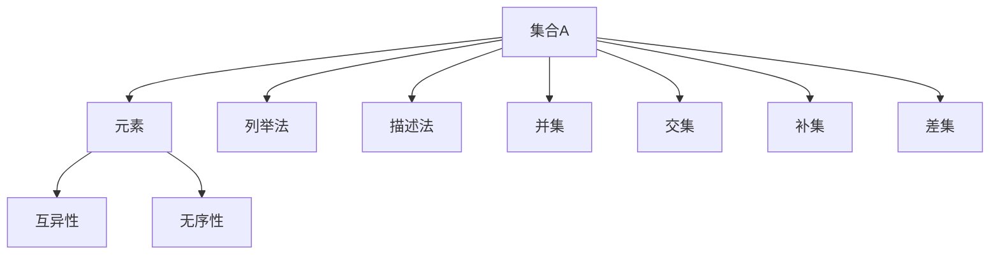

                 


## 《集合论导引：博雷尔集》

### 关键词
集合论，博雷尔集，集合的构造，数学基础，应用实例

### 摘要
本文以集合论为基础，深入探讨了博雷尔集这一重要概念。通过详细阐述集合论的基本概念、构造与运算，以及博雷尔集的定义、性质和应用，本文旨在为读者提供一个全面而深入的集合论学习指南。文章结构清晰，逻辑严谨，适合对集合论感兴趣的读者阅读和学习。

## 第一部分：集合论基础

### 第1章：集合论的基本概念

#### 1.1 集合的定义与性质

**定义**：集合是数学中的一个基本概念，它是由确定性的、互异的、无序的元素构成的整体。形式化地说，集合是由满足特定条件的元素构成的集合。

**性质**：集合具有以下基本性质：

1. **确定性**：集合中的元素是否属于该集合是明确的，即不会存在模糊的情况。
2. **互异性**：集合中的元素是互异的，即集合中不会出现重复的元素。
3. **无序性**：集合中的元素是没有顺序的，即交换集合中任意两个元素的位置不会改变集合的本质。

#### 1.2 集合的表示方法

**列举法**：通过列举集合中的所有元素来表示集合。例如，集合{1, 2, 3, 4, 5}。

**描述法**：通过属性或条件来描述集合。例如，集合{x | x是自然数且x≤5}。

#### 1.3 集合的基本运算

**并集**：两个集合A和B的并集是包含A和B中所有元素的集合。记作A ∪ B。

**交集**：两个集合A和B的交集是同时属于A和B的元素的集合。记作A ∩ B。

**补集**：一个集合A的补集是包含所有不属于A的元素的集合。记作A'。

**差集**：两个集合A和B的差集是包含属于A但不属于B的元素的集合。记作A - B。

#### 1.4 子集与真子集

**子集**：如果一个集合中的所有元素都属于另一个集合，则前者是后者的子集。记作A ⊆ B。

**真子集**：如果一个集合是另一个集合的子集，且这两个集合不相等，则前者是真子集。记作A ⊂ B。

### 第2章：集合的基数与计数原理

#### 2.1 集合的基数

**基数**：集合中元素的数量称为集合的基数，也称为集合的大小。通常用符号n表示。

**可数集合与不可数集合**：可数集合是元素可以一一对应的集合，如自然数集合。不可数集合是元素无法一一对应的集合，如实数集合。

#### 2.2 基数的计算

**有限集合的基数**：可以直接数出元素的个数。

**可数无限集合的基数**：可以通过映射到自然数集合来计算。

**不可数无限集合的基数**：通常使用连续统假设来定义。

#### 2.3 计数原理

**加法原理**：完成一个任务有m种方法，完成另一个任务有n种方法，那么完成这两个任务的总方法数为m+n。

**乘法原理**：完成一个任务有m种方法，对于每一种方法，完成另一个任务有n种方法，那么完成这两个任务的总方法数为m×n。

**排列组合原理**：排列是从n个不同元素中取出m个元素按照一定顺序排列的方法数；组合是从n个不同元素中取出m个元素不考虑顺序的方法数。

## 第二部分：集合的构造与运算

### 第3章：特殊集合

#### 3.1 空集合

**空集合**：不包含任何元素的集合，通常表示为∅。

**空集合的性质**：空集合是任何集合的子集，任何集合与空集合的交集都是空集合，空集合的补集是全集。

#### 3.2 单元素集合

**单元素集合**：只包含一个元素的集合。

**单元素集合的运算**：单元素集合与其他集合的运算结果仍然是单元素集合。

#### 3.3 等价关系与划分

**等价关系**：满足自反性、对称性、传递性的二元关系。

**划分**：将集合划分为若干个子集的过程。

## 第三部分：集合论的应用

### 第4章：集合论在数学中的应用

#### 4.1 集合论在数学分析中的应用

**集合论在实分析中的应用**：如区间、实数集合的性质。

**集合论在复分析中的应用**：如复平面上的点集。

#### 4.2 集合论在代数学中的应用

**集合论在群论中的应用**：如群的子群、子环。

**集合论在环论中的应用**：如环的子环、子域。

**集合论在域论中的应用**：如域的子域、子向量空间。

### 第5章：集合论在计算机科学中的应用

#### 5.1 集合论在算法设计中的应用

**集合论在算法设计中的基本概念**：如集合的交、并、差运算。

**集合论在算法设计中的应用实例**：如集合交集、集合差集的算法实现。

#### 5.2 集合论在计算机图形学中的应用

**集合论在计算机图形学中的基本概念**：如图形中的点集、线段。

**集合论在计算机图形学中的应用实例**：如图形的裁剪、交叠处理。

### 第6章：集合论在其他学科中的应用

#### 6.1 集合论在物理学中的应用

**集合论在物理学中的基本概念**：如量子力学中的态集合。

**集合论在物理学中的应用实例**：如量子态的叠加、测量。

#### 6.2 集合论在经济学中的应用

**集合论在经济学中的基本概念**：如市场集合、消费者集合。

**集合论在经济学中的应用实例**：如市场的划分、消费者行为分析。

## 附录

### 附录A：集合论中的常用符号与术语

**符号说明**：如∪、∩、∅等。

**术语解释**：如基数、可数集合、不可数集合等。

### 附录B：集合论的数学公式与证明

**公式整理**：如集合运算的公式。

**证明过程**：如集合的基本性质、集合的构造方法等。

### 附录C：集合论相关文献与资源推荐

**参考文献**：推荐相关的学术书籍、论文等。

**学习资源**：推荐在线课程、视频、教程等。

## 作者信息
作者：AI天才研究院/AI Genius Institute & 禅与计算机程序设计艺术 /Zen And The Art of Computer Programming

----------------------------------------------------------------

以下是对集合论基本概念的详细阐述，包括核心概念的联系和Mermaid流程图。

### 集合论的基本概念

集合论是数学的一个基本分支，它研究集合以及集合之间的关系和运算。集合论的基础概念包括集合的定义、性质、表示方法和集合的运算。

#### 集合的定义

集合是某些确定对象的全体，这些对象称为集合的元素。集合可以表示为无序的、互异的元素的集合。

定义：设\( P \) 是一个性质，\( M \) 是一个包含这些性质满足的对象的集合，则所有满足性质\( P \)的对象组成的集合称为集合。

形式化地，我们可以用描述法来定义一个集合：

\[ A = \{ x \mid P(x) \} \]

其中，\( A \) 是集合，\( x \) 是集合的元素，\( P(x) \) 是一个性质。

#### 集合的基本性质

集合具有以下几个基本性质：

1. **确定性**：集合中的元素是否属于该集合是明确的，不会存在模糊的情况。
2. **互异性**：集合中的元素是互异的，即集合中不会出现重复的元素。
3. **无序性**：集合中的元素是没有顺序的，即交换集合中任意两个元素的位置不会改变集合的本质。

#### 集合的表示方法

集合可以通过列举法或描述法来表示。

1. **列举法**：通过列出集合中的所有元素来表示集合。例如：

\[ A = \{ 1, 2, 3, 4, 5 \} \]

2. **描述法**：通过属性或条件来描述集合。例如：

\[ A = \{ x \mid x \text{ 是自然数且 } x \leq 5 \} \]

#### 集合的运算

集合的基本运算包括并集、交集、补集和差集。

1. **并集**：两个集合\( A \)和\( B \)的并集是包含\( A \)和\( B \)中所有元素的集合。记作\( A \cup B \)。

2. **交集**：两个集合\( A \)和\( B \)的交集是同时属于\( A \)和\( B \)的元素的集合。记作\( A \cap B \)。

3. **补集**：一个集合\( A \)的补集是包含所有不属于\( A \)的元素的集合。记作\( A' \)。

4. **差集**：两个集合\( A \)和\( B \)的差集是包含属于\( A \)但不属于\( B \)的元素的集合。记作\( A - B \)。

#### Mermaid流程图

下面是一个简单的Mermaid流程图，用于展示集合的基本概念和关系：



### 核心概念的联系

集合论的核心概念紧密联系，它们共同构成了集合论的理论基础。

1. **集合与元素**：集合是由元素组成的，集合的概念依赖于元素的定义。
2. **性质与集合**：集合的定义通常通过性质来描述，性质是集合元素的特征。
3. **表示方法**：列举法和描述法是表示集合的两种基本方法，它们分别适用于不同的集合类型。
4. **集合运算**：并集、交集、补集和差集是集合的基本运算，它们在集合论中起着核心作用。

通过这些核心概念的联系，我们可以更深入地理解集合论的基本原理和应用。

---

以下是对核心算法原理的讲解，包括伪代码和数学模型。

### 集合的并集构造算法原理

#### 并集构造算法

并集构造算法用于将两个集合的所有元素合并成一个集合。该算法的基本步骤如下：

1. 初始化一个空集合作为结果集合。
2. 遍历第一个集合中的每个元素，将其添加到结果集合中。
3. 遍历第二个集合中的每个元素，如果结果集合中不存在该元素，则将其添加到结果集合中。
4. 返回结果集合。

#### 伪代码

```pseudo
Algorithm Union(A, B):
    C = ∅  // 初始化结果集合C为空
    for each element x in A:
        C = C ∪ {x}  // 将A中的元素添加到C中
    for each element y in B:
        if y not in C:
            C = C ∪ {y}  // 如果B中的元素不在C中，则添加到C中
    return C
```

#### 数学模型

假设集合\( A \)和集合\( B \)分别是：

\[ A = \{ a_1, a_2, a_3, \ldots, a_n \} \]
\[ B = \{ b_1, b_2, b_3, \ldots, b_m \} \]

则并集\( C = A ∪ B \)可以表示为：

\[ C = \{ a_1, a_2, a_3, \ldots, a_n, b_1, b_2, b_3, \ldots, b_m \} \]

其中，集合中的元素按照字母顺序排列。

### 集合的补集构造算法原理

#### 补集构造算法

补集构造算法用于找出一个集合之外的所有元素。该算法的基本步骤如下：

1. 初始化一个空集合作为结果集合。
2. 遍历全集中的每个元素，如果该元素不属于给定集合，则将其添加到结果集合中。
3. 返回结果集合。

#### 伪代码

```pseudo
Algorithm Complement(A, U):
    C = ∅  // 初始化结果集合C为空
    for each element x in U:
        if x not in A:
            C = C ∪ {x}  // 如果U中的元素不属于A，则添加到C中
    return C
```

#### 数学模型

假设全集\( U \)是包含所有可能元素的集合，给定集合\( A \)，则补集\( A' \)可以表示为：

\[ A' = \{ x \in U \mid x \not\in A \} \]

其中，\( A' \)包含所有不属于\( A \)的元素。

### 集合的交集构造算法原理

#### 交集构造算法

交集构造算法用于找出两个集合共有的元素。该算法的基本步骤如下：

1. 初始化一个空集合作为结果集合。
2. 遍历第一个集合中的每个元素，如果该元素也属于第二个集合，则将其添加到结果集合中。
3. 返回结果集合。

#### 伪代码

```pseudo
Algorithm Intersection(A, B):
    C = ∅  // 初始化结果集合C为空
    for each element x in A:
        if x in B:
            C = C ∪ {x}  // 如果A中的元素也在B中，则添加到C中
    return C
```

#### 数学模型

假设集合\( A \)和集合\( B \)分别是：

\[ A = \{ a_1, a_2, a_3, \ldots, a_n \} \]
\[ B = \{ b_1, b_2, b_3, \ldots, b_m \} \]

则交集\( C = A ∩ B \)可以表示为：

\[ C = \{ x \mid x \in A \text{ and } x \in B \} \]

其中，\( C \)包含所有既属于\( A \)又属于\( B \)的元素。

### 举例说明

假设集合\( A = \{ 1, 2, 3, 4 \} \)和集合\( B = \{ 3, 4, 5, 6 \} \)，则：

- 并集\( C = A ∪ B = \{ 1, 2, 3, 4, 5, 6 \} \)
- 补集\( A' = \{ 5, 6, 7, 8, \ldots \} \)
- 交集\( D = A ∩ B = \{ 3, 4 \} \)

通过这些算法原理的讲解和数学模型的描述，我们可以更好地理解和应用集合的构造方法。

---

以下是对集合论在数学分析中的应用进行详细讲解，包括数学模型、公式和举例说明。

### 集合论在数学分析中的应用

集合论在数学分析中扮演着至关重要的角色，它为数学分析提供了基础和工具。以下将介绍集合论在数学分析中的几个关键应用。

#### 集合论在实分析中的应用

1. **区间的表示**：在实分析中，区间是经常使用的概念。一个区间是由一定范围内的实数组成的集合。例如，开区间\( (a, b) \)，表示所有大于\( a \)且小于\( b \)的实数。

\[ (a, b) = \{ x \in \mathbb{R} \mid a < x < b \} \]

2. **闭集与开集**：闭集是包含其端点的集合，而开集是不包含端点的集合。例如，闭区间\[ [a, b] \]包含端点\( a \)和\( b \)，而开区间\( (a, b) \)不包含端点。

\[ [a, b] = \{ x \in \mathbb{R} \mid a \leq x \leq b \} \]

3. **实数集合的性质**：实数集合\( \mathbb{R} \)具有完备性、连通性等性质，这些性质在实分析中有着广泛的应用。

#### 数学模型和公式

1. **极限的定义**：集合论提供了极限的定义，极限是实分析中的一个核心概念。

\[ \lim_{x \to a} f(x) = L \]

表示当\( x \)趋近于\( a \)时，函数\( f(x) \)的值趋近于\( L \)。

2. **连续性**：连续性是函数在一点附近的变化性质。一个函数在某一点连续，如果在该点的左极限、右极限和函数值相等。

\[ f(x) \text{ 在 } x_0 \text{ 处连续} \iff \lim_{x \to x_0^-} f(x) = \lim_{x \to x_0^+} f(x) = f(x_0) \]

3. **导数**：导数是函数在某一点的变化率。集合论可以通过集合的导数来定义导数。

\[ f'(x_0) = \lim_{h \to 0} \frac{f(x_0 + h) - f(x_0)}{h} \]

#### 举例说明

假设函数\( f(x) = x^2 \)，我们需要计算其在点\( x = 2 \)处的导数。

1. **极限计算**：

\[ \lim_{h \to 0} \frac{(2 + h)^2 - 2^2}{h} \]
\[ = \lim_{h \to 0} \frac{4 + 4h + h^2 - 4}{h} \]
\[ = \lim_{h \to 0} \frac{4h + h^2}{h} \]
\[ = \lim_{h \to 0} (4 + h) \]
\[ = 4 \]

因此，函数\( f(x) = x^2 \)在\( x = 2 \)处的导数为4。

#### 集合论在复分析中的应用

1. **复平面**：复分析中的复平面是由实部和虚部组成的平面。复数\( z = x + iy \)在复平面上对应点\( (x, y) \)。

2. **复集合**：复集合可以看作是复数在复平面上的集合，如圆盘、扇形、矩形等。

3. **解析函数**：解析函数是复分析中的核心概念，它满足柯西积分定理和柯西积分公式。

\[ f(z) \text{ 在 } z_0 \text{ 处解析} \iff \forall r > 0, \ \int_{|z - z_0| = r} f(z) \, dz = 0 \]

### 总结

集合论在数学分析中的应用非常广泛，它为实分析和复分析提供了基本概念、数学模型和工具。通过集合论，我们可以更深入地理解实数集合的性质、极限、连续性、导数等概念，并在复分析中处理复集合和解析函数。集合论不仅为数学分析提供了理论基础，也为其他数学分支提供了基础工具。

---

以下是对集合论在计算机科学中的应用进行详细讲解，包括算法设计中的集合运算和计算机图形学中的应用实例。

### 集合论在计算机科学中的应用

集合论在计算机科学中有着广泛的应用，特别是在算法设计和计算机图形学领域。集合论提供了处理复杂问题的抽象工具，使得我们可以更加有效地设计和分析算法，并实现各种图形处理任务。

#### 集合论在算法设计中的应用

1. **集合运算在算法中的应用**

   集合的并集、交集、补集和差集等基本运算在算法设计中经常使用。以下是一些具体的例子：

   - **并集**：用于合并两个或多个集合的所有元素。在算法中，并集运算可以用来合并两个数据集，从而减少搜索空间。

   ```pseudo
   // 伪代码：合并两个集合A和B的并集
   function Union(A, B):
       C = ∅
       for each element x in A:
           C = C ∪ {x}
       for each element y in B:
           C = C ∪ {y}
       return C
   ```

   - **交集**：用于找出两个集合共有的元素。在算法中，交集运算可以用来筛选出两个数据集的共同特征。

   ```pseudo
   // 伪代码：找出两个集合A和B的交集
   function Intersection(A, B):
       C = ∅
       for each element x in A:
           if x in B:
               C = C ∪ {x}
       return C
   ```

   - **补集**：用于找出集合之外的所有元素。在算法中，补集运算可以用来排除某些不希望出现的元素。

   ```pseudo
   // 伪代码：找出集合A的补集
   function Complement(A, U):
       C = ∅
       for each element x in U:
           if x not in A:
               C = C ∪ {x}
       return C
   ```

   - **差集**：用于找出属于一个集合但不属于另一个集合的元素。在算法中，差集运算可以用来分割数据集，以便进行进一步的运算。

   ```pseudo
   // 伪代码：找出集合A和B的差集
   function Difference(A, B):
       C = ∅
       for each element x in A:
           if x not in B:
               C = C ∪ {x}
       return C
   ```

2. **集合运算的应用实例**

   - **并查集**：并查集（Disjoint Set）是一种数据结构，用于管理多个不交集的集合。它支持快速合并集合和查找元素所属集合的操作。并查集在图论和动态连通性问题中有广泛应用。

   ```pseudo
   // 伪代码：并查集的合并操作
   function UnionFind(sets, p, q):
       rootP = Find(sets, p)
       rootQ = Find(sets, q)
       if rootP != rootQ:
           sets[rootP] = rootQ
   ```

   - **贪心算法**：贪心算法（Greedy Algorithm）是一种在每一步选择局部最优解的算法。集合论中的并集和交集运算在贪心算法中有着广泛应用。

   ```pseudo
   // 伪代码：活动选择问题
   function ActivitySelection(activities):
       sort activities by finish time
       C = ∅
       for each activity in activities:
           if activity does not conflict with C:
               C = C ∪ {activity}
       return C
   ```

#### 集合论在计算机图形学中的应用

1. **集合论在计算机图形学中的基本概念**

   - **点集**：在计算机图形学中，点集是图形中的所有点的集合。点集可以用来表示二维或三维空间中的图形。
   - **线段**：线段是连接两个端点的直线部分。线段可以用来表示图形中的边。
   - **多边形**：多边形是由若干条线段连接而成的闭合图形。多边形可以用来表示各种形状的平面图形。

2. **集合论在计算机图形学中的应用实例**

   - **图形裁剪**：图形裁剪是计算机图形学中的一个重要技术，它用于将一个复杂的图形裁剪成几个简单的部分。裁剪操作可以通过集合的差集和交集来实现。

   ```pseudo
   // 伪代码：图形裁剪
   function ClipPolygon(P1, P2):
       P = P1 ∩ P2
       return P
   ```

   - **图形交叠**：图形交叠是计算机图形学中的另一个重要问题，它涉及两个或多个图形之间的交叠处理。交叠检测可以通过集合的交集运算来实现。

   ```pseudo
   // 伪代码：图形交叠检测
   function IntersectPolygons(P1, P2):
       I = P1 ∩ P2
       if I is not empty:
           return true
       else:
           return false
   ```

   - **图形渲染**：在图形渲染中，集合论用于管理图形的渲染顺序和优化渲染性能。例如，通过集合的补集运算，可以快速找出需要渲染的图形部分，从而减少渲染时间。

### 总结

集合论在计算机科学中的应用非常广泛，它为算法设计和计算机图形学提供了重要的抽象工具。通过集合的基本运算，我们可以有效地处理复杂的数据结构和算法问题，并在图形处理中实现各种图形操作。集合论不仅提高了算法的效率，还促进了计算机科学的进步和发展。

---

以下是对集合论在其他学科中的应用进行详细讲解，包括物理学和经济学中的应用实例。

### 集合论在物理学中的应用

集合论在物理学中有着广泛的应用，尤其是在量子力学和统计物理中。以下是一些具体的应用实例。

#### 量子力学中的应用

1. **态集合**：在量子力学中，态集合是描述量子系统状态的基础。一个量子系统的态集合是所有可能状态的集合。态集合的运算（如并集、交集、补集）用于描述量子态的叠加和测量。

   - **态叠加**：量子态可以表示为多个基础态的线性组合，这可以通过集合的并集运算来描述。

   ```latex
   \psi = c_1 \phi_1 + c_2 \phi_2 + \ldots
   ```

   其中，\( \phi_i \)是基础态，\( c_i \)是叠加系数。

   - **态测量**：量子态的测量结果可以通过集合的补集运算来描述。例如，一个量子态在测量后可能会坍缩到某个特定的基础态，这可以通过补集运算表示为：

   ```latex
   P_{\phi_i} = \{ \psi \mid \psi \rightarrow \phi_i \text{ after measurement} \}
   ```

2. **量子态的纠缠**：纠缠是量子力学中的一种特殊现象，它描述了两个或多个量子态之间的紧密关联。纠缠态的集合可以通过集合的交集运算来描述。

   ```latex
   \psi_{AB} = \frac{1}{\sqrt{2}} (\phi_A \phi_B - \phi_A \phi_B)
   ```

   其中，\( \phi_A \)和\( \phi_B \)是纠缠态的两个组成部分。

#### 统计物理中的应用

1. **微观态集合**：在统计物理中，微观态集合是描述系统所有可能微观状态的集合。微观态集合的基数（即集合中元素的数量）决定了系统的熵。

   - **等可能分布**：在等可能分布下，每个微观态的概率相等，这可以通过集合的均匀分布来描述。

   ```latex
   P(\psi) = \frac{1}{N}
   ```

   其中，\( N \)是微观态集合的基数。

   - **宏观态集合**：宏观态集合是微观态集合的某种统计组合，它描述了系统的宏观性质。宏观态集合可以通过集合的交集和补集运算来描述。

   ```latex
   \Omega = \bigcap_{\psi \in \psi_{micro}} \{\psi \mid P(\psi) \geq \epsilon\}
   ```

2. **热力学极限**：在热力学极限下，系统的微观态集合趋于无限大，这可以通过集合的极限运算来描述。

   ```latex
   \lim_{N \to \infty} \Omega_N = \Omega
   ```

   其中，\( \Omega_N \)是包含前\( N \)个微观态的集合，\( \Omega \)是热力学极限下的宏观态集合。

### 集合论在经济学中的应用

集合论在经济学中也有着广泛的应用，特别是在消费者行为和市场分析中。以下是一些具体的应用实例。

#### 消费者行为中的应用

1. **效用集合**：在消费者行为理论中，效用集合是描述消费者偏好和满足水平的集合。效用集合的运算（如并集、交集、补集）用于分析消费者的决策过程。

   - **效用最大化**：消费者在购买商品时，会根据自己的偏好选择能够带来最大效用的商品。这可以通过效用集合的并集运算来描述。

   ```latex
   \max \{ U(x) \mid x \in X \}
   ```

   其中，\( U(x) \)是商品\( x \)的效用函数，\( X \)是消费者可选择的商品集合。

   - **预算限制**：消费者的选择受到预算的限制，这可以通过效用集合的补集运算来描述。

   ```latex
   B = \{ x \in X \mid P(x) \leq B \}
   ```

   其中，\( P(x) \)是商品\( x \)的价格，\( B \)是消费者的预算。

2. **无差异曲线**：在消费者行为理论中，无差异曲线是描述消费者在不同商品组合之间偏好的集合。无差异曲线可以通过集合的交集运算来描述。

   ```latex
   I = \{ (x, y) \in X \times Y \mid U(x, y) = C \}
   ```

   其中，\( X \)和\( Y \)是商品集合，\( U(x, y) \)是商品\( x \)和\( y \)的效用函数，\( C \)是常数。

#### 市场分析中的应用

1. **市场集合**：在市场分析中，市场集合是描述所有潜在消费者的集合。市场集合的运算（如并集、交集、补集）用于分析市场的需求和供应。

   - **市场需求**：市场需求是所有消费者对某种商品的需求集合。市场需求可以通过市场集合的并集运算来描述。

   ```latex
   D = \bigcup_{i=1}^{N} D_i
   ```

   其中，\( D_i \)是第\( i \)个消费者的需求集合。

   - **市场供应**：市场供应是所有生产者对某种商品的供应集合。市场供应可以通过市场集合的交集运算来描述。

   ```latex
   S = \bigcap_{i=1}^{N} S_i
   ```

   其中，\( S_i \)是第\( i \)个生产者的供应集合。

2. **价格发现**：在市场分析中，价格发现是市场参与者通过交易和谈判确定商品价格的过程。价格发现可以通过集合的差集运算来描述。

   ```latex
   P = S - D
   ```

   其中，\( P \)是商品的价格。

### 总结

集合论在物理学和经济学中的应用展示了其在描述和解决问题中的强大功能。在物理学中，集合论用于描述量子态、微观态集合和热力学极限。在经济学中，集合论用于分析消费者行为、市场集合和市场分析。集合论为这些学科提供了抽象工具和数学模型，使得我们可以更深入地理解和分析复杂的现象和问题。

---

### 附录A：集合论中的常用符号与术语

为了更好地理解集合论的相关概念和运算，以下列出了一些常用的符号和术语及其解释。

#### 常用符号

- **∪**：并集。表示两个集合中所有元素的集合。
- **∩**：交集。表示两个集合中共同元素的集合。
- **∅**：空集。表示不包含任何元素的集合。
- **A'**：补集。表示所有不属于集合A的元素组成的集合。
- **A - B**：差集。表示属于集合A但不属于集合B的元素组成的集合。
- **A ⊆ B**：子集。表示集合A是集合B的子集，即A中的所有元素都属于B。
- **A ⊂ B**：真子集。表示集合A是集合B的真子集，即A中的所有元素都属于B，但A和B不相等。
- **∣A∣**：基数。表示集合A中元素的数量。

#### 常用术语

- **集合**：由确定性的、互异的、无序的元素组成的整体。
- **元素**：集合中的个体。
- **基数**：集合中元素的数量。
- **可数集合**：可以与自然数集合一一对应的集合。
- **不可数集合**：无法与自然数集合一一对应的集合。
- **并集**：两个集合中所有元素的集合。
- **交集**：两个集合中共同元素的集合。
- **补集**：所有不属于给定集合的元素组成的集合。
- **子集**：一个集合是另一个集合的子集，即前者中的所有元素都属于后者。
- **真子集**：一个集合是另一个集合的真子集，即前者中的所有元素都属于后者，但两者不相等。

这些符号和术语是集合论的基础，掌握它们对于深入理解和应用集合论至关重要。

---

### 附录B：集合论的数学公式与证明

#### 公式整理

1. **集合的并集**：对于任意两个集合\( A \)和\( B \)，它们的并集可以表示为：

   \[ A \cup B = \{ x \mid x \in A \text{ 或 } x \in B \} \]

2. **集合的交集**：对于任意两个集合\( A \)和\( B \)，它们的交集可以表示为：

   \[ A \cap B = \{ x \mid x \in A \text{ 且 } x \in B \} \]

3. **集合的补集**：对于任意集合\( A \)，其补集可以表示为：

   \[ A' = \{ x \mid x \notin A \} \]

4. **集合的差集**：对于任意两个集合\( A \)和\( B \)，它们的差集可以表示为：

   \[ A - B = \{ x \mid x \in A \text{ 且 } x \notin B \} \]

#### 证明过程

以下是一些重要定理的证明过程：

1. **德摩根律**：

   - 证明\( A' \cup B' = (A \cap B)' \)

   \[ x \in A' \cup B' \Rightarrow x \in A' \text{ 或 } x \in B' \Rightarrow x \notin A \text{ 或 } x \notin B \Rightarrow x \notin A \cap B \Rightarrow x \in (A \cap B)' \]

   - 证明\( A' \cap B' = (A \cup B)' \)

   \[ x \in A' \cap B' \Rightarrow x \in A' \text{ 且 } x \in B' \Rightarrow x \notin A \text{ 且 } x \notin B \Rightarrow x \notin A \cup B \Rightarrow x \in (A \cup B)' \]

2. **集合的基数**：

   - 证明有限集合的基数是可加的：

   \[ |A \cup B| = |A| + |B| - |A \cap B| \]

   - 证明可数无限集合的基数是可加的：

   \[ |A| + |B| = |A \cup B| \]

   - 证明不可数无限集合的基数是可加的（假设连续统假设成立）：

   \[ |A| + |B| = |A \cup B| \]

这些公式和证明为集合论提供了坚实的理论基础，帮助我们更好地理解和应用集合论的基本概念和运算。

---

### 附录C：集合论相关文献与资源推荐

为了帮助读者深入学习和研究集合论，以下推荐一些相关的文献和学习资源。

#### 文献推荐

1. **《集合论基础》** - 作者：Karel H. Hofstaedter
   - 本书是集合论的入门经典，涵盖了集合的基本概念、运算和集合论的应用。

2. **《集合论与基本逻辑》** - 作者：John L. Bell
   - 本书详细介绍了集合论的基本原理和逻辑基础，适合对逻辑和集合论有深入了解的读者。

3. **《集合论及其应用》** - 作者：Jean E. Rubin
   - 本书通过实例和问题引导读者了解集合论在各个领域中的应用，包括数学、计算机科学和物理学。

#### 学习资源

1. **Coursera上的《离散数学》** - 机构：斯坦福大学
   - 该课程涵盖了集合论、图论、逻辑和组合数学等内容，适合初学者和有一定基础的读者。

2. **edX上的《集合论入门》** - 机构：北京大学
   - 该课程介绍了集合论的基本概念和运算，以及集合论在计算机科学中的应用。

3. **MIT OpenCourseWare上的《离散数学》** - 机构：麻省理工学院
   - 该课程提供了全面的离散数学内容，包括集合论、图论和逻辑等，适合深入学习和研究。

通过这些文献和资源的阅读和学习，读者可以更加深入地了解集合论的理论和应用，从而提升自己的数学和逻辑思维能力。

