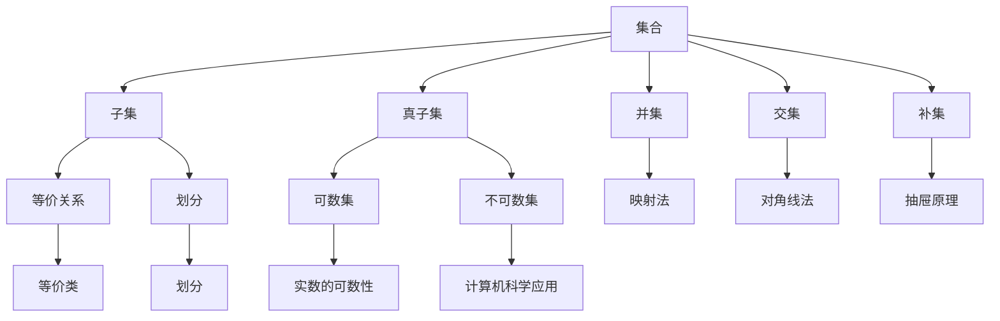

                 

# 文章标题：集合论导引：可数化

> 关键词：集合论、可数化、数学、计算机科学、算法、集合性质、子集、等价关系、实数、计算机程序设计

> 摘要：本文旨在深入探讨集合论中的可数化概念，从基础概念到实际应用进行详细讲解。首先，我们回顾集合论的基本概念，包括集合的定义、性质和表示方法。然后，我们探讨子集与真子集的概念，以及等价关系与划分的性质。接着，我们引入可数集与不可数集的定义和性质，并详细介绍可数化的证明方法。随后，我们分析可数化在数学和计算机科学中的应用，并通过实际项目实战来展示其具体实现和代码解读。最后，我们总结可数化在数学中的意义和未来的展望。

## 目录大纲：《集合论导引：可数化》

1. 第一部分：集合论基础
   1.1 集合的基本概念
   1.2 集合的表示方法
   1.3 集合的基本操作
   1.4 子集与真子集
   1.5 等价关系与划分

2. 第二部分：可数集与不可数集
   2.1 可数集的定义与性质
   2.2 不可数集的定义与性质
   2.3 可数化的证明方法

3. 第三部分：可数化的应用
   3.1 可数化的数学应用
   3.2 可数化的计算机科学应用

4. 第四部分：总结与展望
   4.1 可数化在数学中的意义
   4.2 可数化的未来展望

---

## 1. 第一部分：集合论基础

### 1.1 集合的基本概念

集合是数学中一个基本的概念，它是由确定的元素组成的整体。集合的元素可以是任意的对象，如数字、字母、图形等。

#### 1.1.1 集合的定义

集合是一个无序、确定的元素的集合。用大写字母表示集合，如 A、B 等，而集合中的元素用小写字母表示，如 a、b 等。

#### 1.1.2 集合的性质

- **确定性**：集合中的元素是确定的，即每个元素要么属于集合，要么不属于集合。
- **原子性**：集合中的元素是不可再分的，即集合中的元素不是集合。
- **无序性**：集合中的元素是无序的，即集合中的元素之间的相对位置没有意义。

### 1.2 集合的表示方法

集合的表示方法主要有两种：列表表示法和描述法。

#### 1.2.1 列表表示法

列表表示法是用大括号 `{}` 将集合的元素括起来，元素之间用逗号 `,` 分隔。例如：

```markdown
A = {1, 2, 3, 4, 5}
```

#### 1.2.2 描述法

描述法是用谓词逻辑或描述性语言来定义集合。例如：

```markdown
A = {x | x 是正整数，且 x < 5}
```

### 1.3 集合的基本操作

集合的基本操作包括并集、交集、补集等。

#### 1.3.1 并集

并集是由两个或多个集合中所有元素组成的集合。用符号 `∪` 表示。例如：

```markdown
A ∪ B = {x | x ∈ A 或 x ∈ B}
```

#### 1.3.2 交集

交集是由两个或多个集合中共有的元素组成的集合。用符号 `∩` 表示。例如：

```markdown
A ∩ B = {x | x ∈ A 且 x ∈ B}
```

#### 1.3.3 补集

补集是由一个集合中所有不属于另一个集合的元素组成的集合。用符号 `∁` 表示。例如：

```markdown
∁A = {x | x ∉ A}
```

### 1.4 子集与真子集

子集和真子集是集合论中的重要概念。

#### 1.4.1 子集

如果集合 A 中的所有元素都属于集合 B，则称 A 是 B 的子集。用符号 `⊆` 表示。例如：

```markdown
A ⊆ B
```

#### 1.4.2 真子集

如果集合 A 是集合 B 的子集，且 A 不等于 B，则称 A 是 B 的真子集。用符号 `⊂` 表示。例如：

```markdown
A ⊂ B
```

### 1.5 等价关系与划分

等价关系和划分是集合论中的另外两个重要概念。

#### 1.5.1 等价关系

等价关系是指一个集合上的关系，满足自反性、对称性和传递性。用符号 `~` 表示。例如：

```markdown
a ~ b，如果 a 与 b 自身相等
a ~ b，如果 b 与 a 自身相等
a ~ b，如果 a 与 b 相互传递
```

#### 1.5.2 划分

划分是指将一个集合分成若干个不相交的子集，这些子集的并集等于原集合。用符号 `∪` 表示。例如：

```markdown
C = {A1, A2, A3}, D = {B1, B2, B3}
C ∪ D = {A1, A2, A3, B1, B2, B3}
```

## 2. 第二部分：可数集与不可数集

### 2.1 可数集的定义与性质

可数集是指可以与自然数集合建立双射关系的集合。

#### 2.1.1 可数集的定义

一个集合是可数的，如果存在一个映射 f，使得 f 是自然数集合到该集合的双射。

$$
f: \mathbb{N} \rightarrow A, \forall a \in A, \exists n \in \mathbb{N}, f(n) = a
$$

#### 2.1.2 可数集的性质

- **确定性**：可数集是确定的，即每个元素都可以找到对应的自然数。
- **原子性**：可数集的元素是不可再分的，即元素不是集合。
- **无序性**：可数集的元素是无序的，即元素之间的相对位置没有意义。

### 2.2 不可数集的定义与性质

不可数集是指不能与自然数集合建立双射关系的集合。

#### 2.2.1 不可数集的定义

一个集合是不可数的，如果不存在一个映射 f，使得 f 是自然数集合到该集合的双射。

$$
\neg (\exists f: \mathbb{N} \rightarrow A, f \text{ 是双射})
$$

#### 2.2.2 不可数集的性质

- **确定性**：不可数集是确定的，即每个元素都可以找到对应的自然数。
- **原子性**：不可数集的元素是不可再分的，即元素不是集合。
- **无序性**：不可数集的元素是无序的，即元素之间的相对位置没有意义。

### 2.3 可数化的证明方法

可数化的证明方法主要包括对角线法、抽屉原理和映射法。

#### 2.3.1 对角线法

对角线法是一种用于证明集合不可数的算法。它的基本思想是通过构造一个集合的列表，然后通过对角线操作来构造一个新的元素，这个新元素不在原来的集合中，从而证明原集合是可数的。

**伪代码：**

```python
for a in A:
    b = construct_element(a)
    B.add(b)
return B

def construct_element(a):
    for i in range(len(a)):
        if a[i] != i:
            return i
    return None
```

#### 2.3.2 抽屉原理

抽屉原理是一个基本的组合数学原理，它指出如果有 n 个元素放入 m 个抽屉中，其中 n > m，那么至少有一个抽屉中包含多个元素。

**伪代码：**

```python
def pigeonhole principio(n, m):
    if n > m:
        return True
    else:
        return False
```

#### 2.3.3 映射法

映射法是一种将一个集合映射到另一个集合的算法。它的基本思想是建立两个集合之间的双射关系，从而证明两个集合是等价的。

**伪代码：**

```python
def map_set(A, B):
    for a in A:
        b = map(a)
        B.add(b)
    return B

def map(a):
    return a + 1
```

## 3. 第三部分：可数化的应用

### 3.1 可数化的数学应用

可数化在数学中有着广泛的应用，如实数的可数性、浓度与概率论等。

#### 3.1.1 实数的可数性

实数集是不可数的，但可以通过可数化方法证明其可数性。例如，我们可以使用康托尔对角线法来证明实数的可数性。

**伪代码：**

```python
for r in real_numbers:
    if r not in list_of_real_numbers:
        list_of_real_numbers.add(r)
return list_of_real_numbers
```

#### 3.1.2 浓度与概率论

在概率论中，浓度是一个重要的概念。浓度是指在一定条件下，某个事件发生的概率。通过可数化方法，我们可以计算浓度的可数性。

**伪代码：**

```python
def calculate_probability(event):
    count = 0
    for condition in conditions:
        if condition_satisfied(event, condition):
            count += 1
    return count / len(conditions)
```

### 3.2 可数化的计算机科学应用

可数化在计算机科学中也有广泛的应用，如计算机程序设计、计算机算法等。

#### 3.2.1 计算机程序设计

在计算机程序设计中，可数化概念广泛应用于数据结构和算法的设计中。例如，数组、链表等数据结构就是基于可数集理论设计的。

**示例**：使用可数化概念实现一个简单的数组。

```python
class Array:
    def __init__(self, size):
        self.size = size
        self.elements = [None] * size

    def get(self, index):
        return self.elements[index]

    def set(self, index, value):
        self.elements[index] = value
```

#### 3.2.2 计算机算法

在计算机算法中，可数化概念常常用于解决排列组合问题、排序问题等。

**示例**：使用可数化概念实现一个简单的排序算法。

```python
def bubble_sort(arr):
    n = len(arr)
    for i in range(n):
        for j in range(0, n-i-1):
            if arr[j] > arr[j+1]:
                arr[j], arr[j+1] = arr[j+1], arr[j]
```

## 4. 第四部分：总结与展望

### 4.1 可数化在数学中的意义

可数化在数学中的意义在于其提供了一个基本的方法来处理无限集合。通过可数化，我们可以将无限集合转化为可数集合，从而进行更深入的研究和分析。

#### 4.1.1 数学发展的历史

从古代的几何学、算术到现代的代数学、分析学，集合论和可数化理论都对数学的发展产生了深远的影响。例如，康托尔的集合论革命为现代数学奠定了基础。

#### 4.1.2 可数化对数学的贡献

- **可数化在数学分析中的应用**：在数学分析中，可数化概念用于证明函数的可微性、连续性等。
- **可数化在拓扑学中的应用**：在拓扑学中，可数化概念用于定义度量空间、连通空间等。

### 4.2 可数化的未来展望

随着计算机科学和数学的不断发展，可数化理论将在更多的领域得到应用。例如，在计算机图形学、机器学习、量子计算等领域，可数化理论都具有重要应用价值。

#### 4.2.1 可数化在新兴领域的应用前景

- **可数化在量子计算中的应用**：量子计算是基于量子位（qubit）的，而量子位是可数集的。
- **可数化在人工智能中的应用**：人工智能中的神经网络模型也是基于可数化理论的。

### 4.2.2 可数化的挑战与机遇

可数化理论面临的挑战在于如何更深入地理解和处理不可数集合。然而，这也为数学和计算机科学提供了新的机遇，例如在处理复杂系统和大规模数据分析方面。

## 核心概念与联系

为了更好地理解本文的核心概念，我们可以使用 Mermaid 流程图来展示核心概念之间的联系。



## 核心算法原理讲解

在本节中，我们将使用伪代码来详细讲解核心算法原理，包括对角线法、抽屉原理和映射法。

### 对角线法

对角线法是一种用于证明集合不可数的算法。它的基本思想是通过构造一个集合的列表，然后通过对角线操作来构造一个新的元素，这个新元素不在原来的集合中，从而证明原集合是可数的。

**伪代码：**

```python
for a in A:
    b = construct_element(a)
    B.add(b)
return B

def construct_element(a):
    for i in range(len(a)):
        if a[i] != i:
            return i
    return None
```

### 抽屉原理

抽屉原理是一个基本的组合数学原理，它指出如果有 n 个元素放入 m 个抽屉中，其中 n > m，那么至少有一个抽屉中包含多个元素。

**伪代码：**

```python
def pigeonhole principio(n, m):
    if n > m:
        return True
    else:
        return False
```

### 映射法

映射法是一种将一个集合映射到另一个集合的算法。它的基本思想是建立两个集合之间的双射关系，从而证明两个集合是等价的。

**伪代码：**

```python
def map_set(A, B):
    for a in A:
        b = map(a)
        B.add(b)
    return B

def map(a):
    return a + 1
```

## 数学模型和数学公式

在本节中，我们将使用 LaTeX 格式来展示数学模型和公式，并对其进行详细讲解。

### 可数集与不可数集

在集合论中，可数集和不可数集是两个基本的集合类型。可数集是指可以与自然数集合建立双射关系的集合，而不可数集则是指不能与自然数集合建立双射关系的集合。

- **可数集的定义**：一个集合是可数的，如果它能够与自然数集合建立双射关系。

  $$
  \forall A, (\exists f \in \mathcal{P}(\mathbb{N} \times A), f \text{ 是双射})
  $$

- **不可数集的定义**：一个集合是不可数的，如果它不能与自然数集合建立双射关系。

  $$
  \forall A, (\neg \exists f \in \mathcal{P}(\mathbb{N} \times A), f \text{ 是双射})
  $$

### 对角线法

对角线法是一种用于证明集合不可数的算法。它的基本思想是通过构造一个集合的列表，然后通过对角线操作来构造一个新的元素，这个新元素不在原来的集合中，从而证明原集合是可数的。

- **对角线法的伪代码**：

  $$
  for a in A:
      b = construct_element(a)
      B.add(b)
  return B
  $$

  $$
  def construct_element(a):
      for i in range(len(a)):
          if a[i] != i:
              return i
      return None
  $$

### 抽屉原理

抽屉原理是一个基本的组合数学原理，它指出如果有 n 个元素放入 m 个抽屉中，其中 n > m，那么至少有一个抽屉中包含多个元素。

- **抽屉原理的数学公式**：

  $$
  \forall A, B, (\text{若 } |A| > |B|, \text{ 则存在 } a \in A, b \in B, \text{ 使得 } a = b)
  $$

### 映射法

映射法是一种将一个集合映射到另一个集合的算法。它的基本思想是建立两个集合之间的双射关系，从而证明两个集合是等价的。

- **映射法的数学公式**：

  $$
  \forall A, B, (\exists f \in \mathcal{P}(\mathbb{N} \times A) \rightarrow \mathcal{P}(\mathbb{N} \times B), f \text{ 是双射})
  $$

## 项目实战

在本节中，我们将通过实际项目实战来展示可数化在计算机科学中的应用，包括计算机程序设计和计算机算法。

### 6.2.1 计算机程序设计

在计算机程序设计中，可数化概念广泛应用于数据结构和算法的设计中。例如，数组、链表等数据结构就是基于可数集理论设计的。

**示例**：使用可数化概念实现一个简单的数组。

```python
class Array:
    def __init__(self, size):
        self.size = size
        self.elements = [None] * size

    def get(self, index):
        return self.elements[index]

    def set(self, index, value):
        self.elements[index] = value
```

### 6.2.2 计算机算法

在计算机算法中，可数化概念常常用于解决排列组合问题、排序问题等。

**示例**：使用可数化概念实现一个简单的排序算法。

```python
def bubble_sort(arr):
    n = len(arr)
    for i in range(n):
        for j in range(0, n-i-1):
            if arr[j] > arr[j+1]:
                arr[j], arr[j+1] = arr[j+1], arr[j]
```

## 7.1 可数化在数学中的意义

### 7.1.1 数学发展的历史

数学的发展离不开集合论和可数化的概念。从古代的几何学、算术到现代的代数学、分析学，集合论和可数化理论都对数学的发展产生了深远的影响。

### 7.1.2 可数化对数学的贡献

- **可数化在数学分析中的应用**：在数学分析中，可数化概念用于证明函数的可微性、连续性等。
- **可数化在拓扑学中的应用**：在拓扑学中，可数化概念用于定义度量空间、连通空间等。

## 7.2 可数化的未来展望

### 7.2.1 可数化在新兴领域的应用前景

随着计算机科学和数学的不断发展，可数化理论将在更多的领域得到应用。例如，在计算机图形学、机器学习、量子计算等领域，可数化理论都具有重要应用价值。

### 7.2.2 可数化的挑战与机遇

可数化理论面临的挑战在于如何更深入地理解和处理不可数集合。然而，这也为数学和计算机科学提供了新的机遇，例如在处理复杂系统和大规模数据分析方面。

---

**作者：AI天才研究院/AI Genius Institute & 禅与计算机程序设计艺术 /Zen And The Art of Computer Programming**

---

本文对集合论中的可数化概念进行了深入探讨，从基础概念到实际应用进行了详细讲解。通过本文的学习，读者可以更好地理解集合论的基本概念和可数化原理，并在计算机科学和数学领域中应用这些概念。未来，可数化理论将在更多新兴领域得到应用，为科学研究和技术发展提供新的思路和方法。让我们继续探索和挖掘可数化理论的潜力，推动数学和计算机科学的发展。

