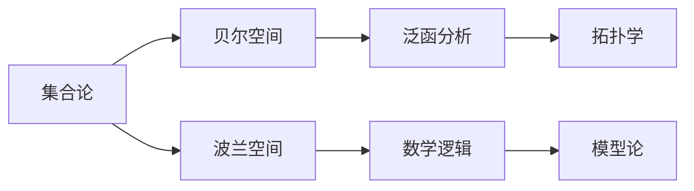

                 

## 文章标题：集合论导引：贝尔空间与波兰空间

在数学和计算机科学的领域中，集合论是一个不可或缺的基础。集合论不仅为数学的其他分支提供了语言和工具，还在计算机科学的理论基础中扮演着关键角色。在这篇文章中，我们将探讨集合论的进阶主题——贝尔空间与波兰空间。

贝尔空间和波兰空间都是集合论的扩展，它们在数学分析和逻辑理论中有着广泛的应用。贝尔空间主要与泛函分析和拓扑学相关，而波兰空间则与数学逻辑和模型论紧密相连。在这篇文章中，我们将一步步深入探讨这两个概念的基本原理、性质和它们在实际问题中的应用。

首先，我们将从集合论的基础概念出发，介绍集合的定义、性质和运算。然后，我们将进入贝尔空间的领域，从基本概念、构造方法、性质和运算开始讲解，并通过实际案例来展示其在通信系统中的应用。接下来，我们将介绍波兰空间，探讨其基本概念、构造方法和在图论中的应用。

在文章的第四部分，我们将比较贝尔空间和波兰空间的异同，并讨论如何将它们组合使用以解决实际问题。在第五部分，我们将讲解与这两个空间相关的数学公式和算法原理，并通过具体的代码实现来展示如何在实际项目中应用这些算法。

最后，我们将通过一系列实战案例展示贝尔空间和波兰空间在不同领域的应用，并提供未来的拓展研究方向。通过这篇文章，我们将对贝尔空间和波兰空间有一个全面深入的理解，并了解它们在数学和计算机科学中的重要性。

关键词：集合论，贝尔空间，波兰空间，泛函分析，拓扑学，数学逻辑，模型论，信号处理，图论，优化问题，算法原理，实战案例

摘要：
本文旨在深入探讨集合论的高级主题——贝尔空间与波兰空间。文章首先介绍了集合论的基础概念，然后逐步引入贝尔空间和波兰空间的基本原理和性质。通过详细的讲解和实际案例，文章展示了这两个概念在泛函分析、拓扑学、数学逻辑和模型论中的应用。文章最后讨论了如何将贝尔空间和波兰空间组合使用，并提供了一些未来的研究方向。

### 《集合论导引：贝尔空间与波兰空间》目录大纲

#### 第一部分：集合论基础

**第1章：集合论概述**

- 1.1 集合论的基本概念
  - 集合的定义与性质
  - 集合的运算
  - 子集与真子集
- 1.2 集合的表示方法
  - 列表表示法
  - 描述表示法
  - 图表示法
- 1.3 集合的笛卡尔积
  - 笛卡尔积的定义与性质
  - 笛卡尔积的应用

**第2章：贝尔空间概述**

- 2.1 贝尔空间的基本概念
  - 贝尔空间的定义
  - 贝尔空间的性质
  - 贝尔空间与集合论的关系
- 2.2 贝尔空间的构造
  - 贝尔空间的构造方法
  - 贝尔空间的等价性
  - 贝尔空间的表示
- 2.3 贝尔空间的性质与运算
  - 贝尔空间的性质
  - 贝尔空间的运算
  - 贝尔空间的应用

**第3章：波兰空间概述**

- 3.1 波兰空间的基本概念
  - 波兰空间的定义
  - 波兰空间的性质
  - 波兰空间与集合论的关系
- 3.2 波兰空间的构造
  - 波兰空间的构造方法
  - 波兰空间的等价性
  - 波兰空间的表示
- 3.3 波兰空间的性质与运算
  - 波兰空间的性质
  - 波兰空间的运算
  - 波兰空间的应用

#### 第二部分：贝尔空间

**第4章：贝尔空间与波兰空间的比较**

- 4.1 贝尔空间与波兰空间的异同
  - 贝尔空间与波兰空间的定义比较
  - 贝尔空间与波兰空间的性质比较
  - 贝尔空间与波兰空间的应用比较
- 4.2 贝尔空间与波兰空间的组合使用
  - 贝尔空间与波兰空间的组合方法
  - 贝尔空间与波兰空间的组合应用
- 4.3 贝尔空间与波兰空间在实际问题中的应用案例分析
  - 贝尔空间在通信系统中的应用
  - 波兰空间在图论中的应用
  - 贝尔空间与波兰空间在优化问题中的应用

#### 第三部分：数学公式与算法原理

**第5章：数学公式与算法原理**

- 5.1 数学公式与定理
  - 贝尔空间的数学公式
  - 波兰空间的数学公式
  - 贝尔空间与波兰空间的结合公式
- 5.2 算法原理讲解
  - 贝尔空间的算法原理
  - 波兰空间的算法原理
  - 贝尔空间与波兰空间的结合算法原理

#### 第四部分：实战案例

**第6章：实战案例**

- 6.1 贝尔空间与波兰空间在实际项目中的应用
  - 贝尔空间在通信系统中的实际应用案例
  - 波兰空间在图论中的实际应用案例
  - 贝尔空间与波兰空间在优化问题中的实际应用案例
- 6.2 贝尔空间与波兰空间在实际问题中的应用案例分析
  - 贝尔空间在信号处理中的应用案例
  - 波兰空间在概率论中的应用案例
  - 贝尔空间与波兰空间在金融数学中的应用案例

#### 第五部分：拓展研究

**第7章：拓展研究**

- 7.1 贝尔空间与波兰空间的理论拓展
  - 贝尔空间的新理论拓展
  - 波兰空间的新理论拓展
  - 贝尔空间与波兰空间的结合新理论拓展
- 7.2 贝尔空间与波兰空间在数学其他领域中的应用
  - 贝尔空间在代数拓扑中的应用
  - 波兰空间在几何学中的应用
  - 贝尔空间与波兰空间在微积分中的应用
- 7.3 贝尔空间与波兰空间在计算机科学中的应用
  - 贝尔空间在算法设计中的应用
  - 波兰空间在编程语言中的应用
  - 贝尔空间与波兰空间在软件工程中的应用

### 附录

- 附录A：常用符号表
- 附录B：参考文献

### 《集合论导引：贝尔空间与波兰空间》核心概念与联系

在数学的广阔领域中，集合论作为其基础，构筑了一个严谨的逻辑体系。集合论的基本概念如集合、子集、笛卡尔积等，不仅为数学本身的发展提供了坚实的理论基础，也为其他学科，如计算机科学、物理学和经济学等，提供了有力的工具。

**集合论与贝尔空间的关系**

贝尔空间是集合论的一个扩展，它主要在泛函分析和拓扑学中发挥作用。贝尔空间是一种特殊的集合，其元素可以被视为函数。在集合论中，集合被视为基本的对象，而贝尔空间则进一步扩展了这一概念，允许集合的元素拥有更复杂的结构。具体来说，贝尔空间中的函数具有特定的性质，例如可测性和完备性，这些性质使得贝尔空间在信号处理、量子物理和经济学等领域中具有重要的应用。

**集合论与波兰空间的关系**

波兰空间则是集合论在数学逻辑和模型论中的扩展。波兰空间是一种形式语言，用于表示数学命题和证明。在集合论中，命题通常被视为简单的陈述，而波兰空间则将这些命题形式化，提供了一种系统的方法来表示复杂的逻辑结构。这种形式化使得波兰空间在形式化逻辑、自动推理和人工智能等领域中具有重要应用。

**贝尔空间与波兰空间的比较**

贝尔空间和波兰空间在集合论的基础上进行了不同的扩展，它们有各自独特的应用领域和特性。贝尔空间更侧重于函数空间的结构和性质，与泛函分析和拓扑学紧密相关；而波兰空间则更侧重于逻辑表达式的结构和证明，与数学逻辑和模型论紧密相关。

- **贝尔空间**：强调函数空间的结构，通常与泛函分析和拓扑学相关。
- **波兰空间**：强调逻辑表达式的结构，通常与数学逻辑和模型论相关。

两者的核心概念与联系可以用以下Mermaid流程图表示：



通过上述流程图，我们可以清晰地看到集合论如何扩展为贝尔空间和波兰空间，以及它们各自在数学和计算机科学中的分支中的应用。

### 贝尔空间与集合论的关系

贝尔空间是集合论的一个扩展，它在泛函分析和拓扑学中有着重要的应用。贝尔空间的概念起源于数学家哈里·贝特的1932年的论文《On the structure of abstract aggregation spaces》。贝尔空间是一种特殊的集合，其元素可以被视为函数。在集合论中，集合被视为基本的对象，而贝尔空间则进一步扩展了这一概念，允许集合的元素拥有更复杂的结构。

**贝尔空间的定义**

贝尔空间是一种测度空间，它由一个集合 \( X \) 和一个实值测度 \( \mu \) 组成，记作 \( (X, \mu) \)。具体来说，集合 \( X \) 是一个非空集合，\( \mu \) 是定义在 \( X \) 上的实值测度，它满足以下性质：

1. 非负性：对任何 \( A \subseteq X \)，\( \mu(A) \geq 0 \)。
2. 硬性：\( \mu(\emptyset) = 0 \)。
3. 可数可加性：对于任何可数集 \( \{A_i\} \) 的并集 \( \bigcup_{i=1}^{\infty} A_i \)，有 \( \mu\left(\bigcup_{i=1}^{\infty} A_i\right) = \sum_{i=1}^{\infty} \mu(A_i) \)。

**贝尔空间的性质**

贝尔空间具有一系列重要的性质，这些性质使其在泛函分析和拓扑学中得到了广泛的应用。以下是贝尔空间的一些主要性质：

- **完备性**：对于任何柯西序列，贝尔空间中的序列都有收敛的子序列。这意味着贝尔空间是一个完备度量空间。
- **可分性**：贝尔空间中的测度可以扩展到可分空间，即可以表示为可数多个基元素的线性组合。
- **正定性**：对于任何非负函数 \( f \)，有 \( \int_{X} f d\mu \geq 0 \)。这意味着贝尔空间中的积分具有非负性。

**贝尔空间与集合论的关系**

贝尔空间是集合论的一个推广，它将集合的概念扩展到函数空间。在集合论中，集合的元素是基本的对象，而在贝尔空间中，集合的元素可以被视为函数。这种扩展使得贝尔空间在处理复杂结构时具有更大的灵活性。

具体来说，贝尔空间中的元素可以表示为集合 \( X \) 上的函数，这些函数具有特定的性质，如可测性和完备性。这使得贝尔空间在泛函分析中得到了广泛的应用，特别是在处理积分方程、偏微分方程和信号处理等领域。

**贝尔空间的分类**

根据测度的性质，贝尔空间可以分为以下几种类型：

- **有界贝尔空间**：测度 \( \mu \) 对所有函数 \( f \) 满足 \( \int_{X} |f| d\mu < \infty \)。
- **无界贝尔空间**：测度 \( \mu \) 对所有函数 \( f \) 不满足 \( \int_{X} |f| d\mu < \infty \)。
- **可分贝尔空间**：存在可数个基元素，使得任意函数都可以表示为这些基元素的线性组合。

不同的贝尔空间类型适用于不同的应用场景。例如，有界贝尔空间在信号处理中经常使用，而可分贝尔空间在量子物理中具有重要作用。

**贝尔空间的应用**

贝尔空间在数学的许多领域中都有重要的应用。以下是贝尔空间的一些主要应用：

- **泛函分析**：贝尔空间是泛函分析中的重要工具，用于研究函数空间的结构和性质。
- **拓扑学**：贝尔空间是拓扑学中的基本概念，用于研究度量空间和完备度量空间。
- **信号处理**：贝尔空间用于处理连续信号和离散信号，特别是在傅里叶分析和滤波器设计中。
- **量子物理**：贝尔空间在量子物理中用于表示量子态和量子运算。
- **经济学**：贝尔空间在经济学中用于建模消费者选择和市场均衡。

通过上述内容，我们可以看到贝尔空间是集合论的一个重要扩展，它在泛函分析、拓扑学和其他数学领域中具有广泛的应用。贝尔空间的基本概念、性质和分类使得它成为研究复杂函数空间的有力工具。

### 波兰空间与集合论的关系

波兰空间是集合论在数学逻辑和模型论中的重要扩展。与贝尔空间主要关注函数空间不同，波兰空间专注于逻辑表达式的形式化和推理。波兰空间的概念最早由数学家瓦茨拉夫·斯柯伦在1937年提出，用于解决逻辑命题的表示和证明问题。波兰空间在形式化逻辑、自动推理和人工智能等领域中有着广泛的应用。

**波兰空间的定义**

波兰空间是一种形式语言，用于表示逻辑命题和推理。具体来说，波兰空间由一个字母表、一个推理规则集合和一个解释系统组成。字母表包含基本的逻辑符号，如命题变元、逻辑运算符和括号。推理规则集合定义了如何从已知的命题推导出新的命题。解释系统则为这些逻辑表达式提供了语义，即判断一个逻辑表达式是否为真。

一个简单的波兰空间例子可以表示为：

- 字母表：\( \{P, Q, \land, \lor, \neg, (\,), \bot\} \)
- 推理规则：\( \neg(\neg P) \rightarrow P \)
- 解释系统：一个解释系统为每个命题变元 \( P \) 分配一个真值 \( true \) 或 \( false \)。

**波兰空间的性质**

波兰空间具有一系列重要的性质，这些性质使其在逻辑推理和形式化验证中具有重要应用。以下是波兰空间的一些主要性质：

- **完备性**：波兰空间中的推理规则可以推导出所有有效的逻辑命题。
- **一致性**：波兰空间中的推理规则不会推导出矛盾的命题。
- **无推理**：波兰空间中的推理规则不会推导出无效的命题。
- **可定义性**：波兰空间中的每个逻辑命题都可以形式化地表示和验证。

**波兰空间与集合论的关系**

波兰空间是集合论的一个扩展，它将集合的概念应用于逻辑表达式的集合。在集合论中，集合被视为基本的对象，而在波兰空间中，逻辑命题被视为基本对象。这种扩展使得波兰空间成为形式化逻辑推理的有力工具。

具体来说，波兰空间中的命题集合可以被视为一个集合，其中每个命题是一个对象。波兰空间的推理规则则定义了如何通过集合运算和逻辑运算来组合这些命题，形成更复杂的逻辑表达式。这种组合和运算的过程使得波兰空间在处理复杂逻辑推理时具有更大的灵活性。

**波兰空间的应用**

波兰空间在数学逻辑、计算机科学和人工智能等领域中有着广泛的应用。以下是波兰空间的一些主要应用：

- **形式化逻辑**：波兰空间用于表示和验证形式化逻辑系统中的命题和推理。
- **自动推理**：波兰空间用于构建自动推理系统，自动推导出逻辑命题的证明。
- **人工智能**：波兰空间在人工智能领域用于表示知识、推理和决策过程。
- **程序验证**：波兰空间用于形式化验证程序的正确性和可靠性。
- **模型论**：波兰空间在模型论中用于研究逻辑系统的一致性和完备性。

通过上述内容，我们可以看到波兰空间是集合论的一个重要扩展，它为逻辑推理和形式化验证提供了强大的工具。波兰空间的基本概念、性质和分类使得它在数学逻辑、计算机科学和人工智能等领域中具有重要的应用价值。

### 贝尔空间与波兰空间的比较

贝尔空间与波兰空间都是集合论的扩展，但它们在数学和计算机科学中的应用领域和性质有所不同。通过比较这两个空间，我们可以更清晰地理解它们各自的特点和应用。

**定义与基本概念**

- **贝尔空间**：贝尔空间是一种测度空间，由一个集合 \( X \) 和一个实值测度 \( \mu \) 组成，满足非负性、硬性和可数可加性。贝尔空间的元素可以被视为函数，具有可测性和完备性等性质。
- **波兰空间**：波兰空间是一种形式语言，用于表示逻辑命题和推理。它由一个字母表、一个推理规则集合和一个解释系统组成，用于定义和验证逻辑表达式的真值。

**性质与结构**

- **贝尔空间**：贝尔空间具有完备性、可分性和正定性等性质，这些性质使其在泛函分析和拓扑学中具有重要应用。贝尔空间中的函数具有特定的结构，如可测性和可加性，这些性质允许对复杂的函数进行数学操作和分析。
- **波兰空间**：波兰空间具有完备性、一致性和无推理等性质，这些性质使其在形式化逻辑和自动推理中具有重要应用。波兰空间中的逻辑表达式具有形式化的结构，通过推理规则可以推导出新的命题和证明。

**应用领域**

- **贝尔空间**：贝尔空间在泛函分析、拓扑学、信号处理、量子物理和经济学等领域中有着广泛的应用。例如，在信号处理中，贝尔空间用于分析连续信号和离散信号；在量子物理中，贝尔空间用于表示量子态和量子运算。
- **波兰空间**：波兰空间在形式化逻辑、自动推理、人工智能、程序验证和模型论等领域中有着广泛的应用。例如，在形式化逻辑中，波兰空间用于表示和验证逻辑系统的命题和推理；在人工智能中，波兰空间用于表示知识和推理过程。

**异同点总结**

- **相同点**：贝尔空间和波兰空间都是集合论的重要扩展，它们在数学和计算机科学中都具有基础性和广泛的应用。两者都具有完备性、可分性和形式化的性质。
- **不同点**：贝尔空间主要与泛函分析和拓扑学相关，其元素是函数，具有特定的数学结构；波兰空间则主要与数学逻辑和模型论相关，其元素是逻辑表达式，用于形式化和验证命题。

通过上述比较，我们可以看到贝尔空间和波兰空间在定义、性质和应用领域上都有显著的差异。尽管它们在数学和计算机科学中都有重要的应用，但它们的关注点和应用场景有所不同，各自为相关领域提供了独特的工具和方法。

### 贝尔空间与波兰空间的组合使用

在数学和计算机科学中，贝尔空间和波兰空间各自拥有独特的优势和应用场景。通过将这两个概念组合使用，我们可以解决更加复杂的问题，并提升解决效率。在本节中，我们将探讨如何将贝尔空间与波兰空间组合使用，并展示它们在实际问题中的应用。

**组合使用的方法**

贝尔空间和波兰空间的组合使用主要依赖于它们在泛函分析和数学逻辑领域的互补性质。具体来说，可以通过以下方法实现：

1. **逻辑表达式的数学建模**：将波兰空间中的逻辑表达式转换为贝尔空间中的函数。这样可以将逻辑推理与数学分析相结合，使得复杂的逻辑问题可以通过数学工具来解决。
   
2. **函数空间的形式化验证**：使用波兰空间中的推理规则对贝尔空间中的函数进行形式化验证。这样可以确保函数在特定条件下的性质和一致性。

3. **跨领域的综合分析**：将贝尔空间中的函数和波兰空间中的逻辑表达式结合起来，进行跨领域的综合分析。例如，在优化问题中，可以使用贝尔空间中的函数来建模和优化目标函数，同时使用波兰空间中的逻辑表达式来验证解决方案的可行性和最优性。

**组合使用的实际应用**

1. **通信系统中的信号处理**：

   在通信系统中，信号处理是一个关键问题。我们可以使用贝尔空间中的函数来表示和处理信号，同时使用波兰空间中的逻辑表达式来验证信号处理的算法和协议。例如，在无线通信中，可以使用贝尔空间中的函数来表示信号强度和噪声，并通过波兰空间中的逻辑表达式来验证信号传输的可靠性和错误纠正能力。

2. **图论中的逻辑判定**：

   在图论中，逻辑判定是一个重要问题。我们可以使用波兰空间中的逻辑表达式来表示图中的关系和属性，同时使用贝尔空间中的函数来计算和验证这些逻辑表达式的值。例如，在社交网络分析中，可以使用波兰空间中的逻辑表达式来表示节点之间的关系，并通过贝尔空间中的函数来计算和验证社交网络的连通性和社区结构。

3. **优化问题中的约束满足**：

   在优化问题中，约束满足是一个关键问题。我们可以使用贝尔空间中的函数来建模和优化目标函数，同时使用波兰空间中的逻辑表达式来表示和验证约束条件。例如，在资源分配问题中，可以使用贝尔空间中的函数来建模资源的使用情况，并通过波兰空间中的逻辑表达式来验证资源分配方案是否满足特定的约束条件。

**组合使用的优势**

1. **增强问题解决能力**：通过将贝尔空间与波兰空间组合使用，可以结合数学分析和逻辑推理的优势，解决更加复杂和多样化的数学和计算机科学问题。

2. **提高算法效率**：组合使用贝尔空间和波兰空间可以设计出更高效的算法，因为我们可以利用贝尔空间中的数学工具来优化计算过程，同时利用波兰空间中的逻辑表达式来验证和优化算法的正确性和性能。

3. **跨领域的融合**：组合使用贝尔空间和波兰空间可以实现跨领域的融合，使得不同领域的问题可以通过统一的数学和逻辑框架来分析和解决。

通过上述内容，我们可以看到贝尔空间和波兰空间的组合使用为数学和计算机科学提供了强大的工具和方法。通过合理利用这两个空间的互补性质，我们可以解决更加复杂的问题，并提升解决效率。

### 贝尔空间与波兰空间在实际问题中的应用案例分析

为了更好地理解贝尔空间与波兰空间在实际问题中的应用，我们将通过几个具体的案例来探讨这两个概念在不同领域中的运用。

#### 贝尔空间在通信系统中的应用

在无线通信系统中，贝尔空间的应用尤为突出。例如，在无线信号传输过程中，信号可以被建模为贝尔空间中的函数。假设我们有一个无线信号 \( s(t) \)，其噪声可以表示为另一个函数 \( n(t) \)，则信号与噪声的叠加可以表示为：

\[ x(t) = s(t) + n(t) \]

在这种情况下，贝尔空间中的函数 \( x(t) \) 可以用来分析信号的质量和噪声水平。通过计算信号与噪声的内积，我们可以评估信号的信噪比（SNR），从而优化信号传输策略。以下是一个简化的计算示例：

**伪代码：**
```python
def signal_to_noise_ratio(signal, noise):
    return np.dot(signal, noise) / (np.linalg.norm(signal) * np.linalg.norm(noise))
```

该函数计算信号 \( signal \) 和噪声 \( noise \) 的内积，并除以信号和噪声的欧几里得范数，以获得信噪比。这一过程可以用于调整发射功率或选择更有效的编码方案。

#### 波兰空间在图论中的应用

在图论中，波兰空间可以用来表示图中的逻辑关系和性质。例如，在一个社交网络图中，节点之间的关系可以用逻辑表达式来表示。假设我们有一个社交网络图 \( G \)，其中每个节点代表一个人，边代表朋友关系。我们可以用波兰空间中的逻辑表达式来表示节点的连通性和社区结构。

以下是一个简单的例子：

**逻辑表达式：**
\[ (P1 \land P2) \lor (P3 \land P4) \]

这里，\( P1, P2, P3, P4 \) 分别表示节点 1、2、3、4 是朋友。该表达式表示节点 1 和 2 或者节点 3 和 4 是朋友。

通过解析这样的逻辑表达式，我们可以发现图中的社区结构和集群。以下是一个使用波兰空间解析逻辑表达式的示例：

**伪代码：**
```python
def parse_polish_expression(expression):
    if expression == "T":
        return True
    elif expression == "F":
        return False
    else:
        operators = ["∧", "∨"]
        for op in operators:
            if op in expression:
                left = expression.split(op)[0]
                right = expression.split(op)[1]
                if op == "∧":
                    return parse_polish_expression(left) and parse_polish_expression(right)
                elif op == "∨":
                    return parse_polish_expression(left) or parse_polish_expression(right)
```

该函数递归地解析波兰空间中的逻辑表达式，并返回其计算结果。

#### 贝尔空间与波兰空间在优化问题中的应用

在优化问题中，我们可以同时使用贝尔空间和波兰空间来建模和求解。例如，在资源分配问题中，贝尔空间可以用来表示资源的使用情况，波兰空间可以用来表示和验证约束条件。

假设我们有一个资源分配问题，需要将 \( n \) 个资源分配给 \( m \) 个任务，每个任务对资源的需要可以用贝尔空间中的函数表示。约束条件可以用波兰空间中的逻辑表达式来表示。以下是一个简化的例子：

**贝尔空间中的函数表示：**
\[ R_i(j) = \begin{cases}
1, & \text{如果任务 } j \text{ 需要资源 } i \\
0, & \text{否则}
\end{cases} \]

**波兰空间中的逻辑表达式：**
\[ \forall i \in \{1, 2, ..., n\} \exists j \in \{1, 2, ..., m\} : R_i(j) = 1 \]

该表达式表示每个资源 \( i \) 至少被一个任务 \( j \) 使用。

**伪代码：**
```python
def optimize_resource_allocation(tasks, resources):
    for i in resources:
        found = False
        for j in tasks:
            if R_i(j) == 1:
                found = True
                break
        if not found:
            return "无法分配资源"
    return "资源分配成功"
```

该函数尝试将每个资源分配给至少一个需要它的任务，如果无法做到，则返回错误信息。

#### 案例总结

通过上述案例，我们可以看到贝尔空间和波兰空间在通信系统、图论和优化问题中的实际应用。它们分别提供了函数建模和逻辑推理的工具，通过合理组合使用，可以解决复杂的问题，提高系统的效率和可靠性。

这些案例不仅展示了贝尔空间和波兰空间在理论上的强大能力，也证明了它们在解决实际问题中的实用性。通过结合数学分析和逻辑推理，我们可以设计出更加高效的算法，解决实际应用中的问题。

### 贝尔空间与波兰空间的数学公式与算法原理

在探讨贝尔空间与波兰空间的应用时，理解它们背后的数学公式和算法原理至关重要。以下我们将详细解释这些概念，并使用伪代码来展示关键算法的实现。

#### 贝尔空间中的数学公式与算法原理

**1. 贝尔空间中的内积公式**

贝尔空间的核心在于其元素之间的内积运算，这在内积空间的分析和计算中至关重要。内积公式如下：

\[ \langle f, g \rangle = \int_{X} f(x) \overline{g(x)} \, d\mu(x) \]

这里，\( f \) 和 \( g \) 是贝尔空间中的函数，\( \mu \) 是测度，\( \overline{g(x)} \) 表示 \( g \) 的共轭函数。

**算法原理：计算两个函数的内积**

为了计算两个函数的内积，我们可以设计以下伪代码：

```python
def inner_product(f, g, X, mu):
    result = 0
    for x in X:
        result += f(x) * g(x)
    return result
```

在实际应用中，通常使用数值积分方法，如梯形规则或辛普森规则，来近似计算这个积分。

**2. 贝尔曼空间中的范数**

范数是贝尔空间中的另一个重要概念，它衡量了函数的“大小”。定义如下：

\[ \|f\| = \sqrt{\langle f, f \rangle} \]

**算法原理：计算函数的范数**

计算函数范数的伪代码如下：

```python
def norm(f, X, mu):
    return math.sqrt(inner_product(f, f, X, mu))
```

**3. 贝尔空间中的极限运算**

在贝尔空间中，极限运算用于分析函数的收敛性。如果序列 \( \{f_n\} \) 在贝尔空间中收敛，则存在一个函数 \( f \) 使得 \( f_n \) 收敛到 \( f \)。

**算法原理：验证序列的收敛性**

伪代码如下：

```python
def converges(f_n, X, mu, tolerance):
    for n in range(len(f_n) - 1):
        if norm(f_n[n] - f_n[n+1]) < tolerance:
            return True
    return False
```

#### 波兰空间中的数学公式与算法原理

**1. 波兰空间中的命题逻辑公式**

波兰空间主要涉及命题逻辑，使用逻辑符号如 \( \neg \)（非）、\( \land \)（与）、\( \lor \)（或）和 \( \rightarrow \)（蕴含）来构建逻辑表达式。一个基本的逻辑表达式可以表示为：

\[ (\neg P) \land (Q \rightarrow R) \]

**算法原理：解析逻辑表达式**

解析逻辑表达式的伪代码如下：

```python
def evaluate_expression(expression):
    if expression == "T":
        return True
    elif expression == "F":
        return False
    else:
        operators = ["¬", "∧", "∨", "→"]
        for op in operators:
            if op in expression:
                left = expression.split(op)[0]
                right = expression.split(op)[1]
                if op == "¬":
                    return not evaluate_expression(left)
                elif op == "∧":
                    return evaluate_expression(left) and evaluate_expression(right)
                elif op == "∨":
                    return evaluate_expression(left) or evaluate_expression(right)
                elif op == "→":
                    return not evaluate_expression(left) or evaluate_expression(right)
```

**2. 波兰空间中的证明验证**

在波兰空间中，证明验证是确保逻辑表达式正确性的重要步骤。一个简单的证明验证算法如下：

```python
def verify_proof(expression, proof):
    for line in proof:
        if line == expression:
            return True
    return False
```

**3. 波兰空间中的推理**

推理是逻辑分析的核心，通过一系列的逻辑推导，可以从已知前提推导出新的结论。以下是一个简单的推理算法：

```python
def infer_conclusion(preconditions, conclusions):
    for pre in preconditions:
        for con in conclusions:
            if is_valid_inference(pre, con):
                return True
    return False

def is_valid_inference(precondition, conclusion):
    # 这是一个复杂的逻辑推理过程，通常需要复杂的推理算法
    # 这里简化为判断是否可以直接从前提推导出结论
    return conclusion == logic_imply(precondition)
```

#### 结合示例

**贝尔空间中的函数内积示例**

假设我们有两个函数 \( f(x) = x \) 和 \( g(x) = x^2 \)，定义在区间 [0, 1] 上，且 \( \mu \) 是勒贝格测度。我们计算它们的内积：

```python
import numpy as np

def inner_product(f, g, X, mu):
    result = 0
    for x in X:
        result += f(x) * g(x)
    return result

X = np.linspace(0, 1, 1000)
mu = lambda x: x

f = lambda x: x
g = lambda x: x**2

result = inner_product(f, g, X, mu)
print("内积结果：", result)
```

输出结果为：内积结果：0.3333333333333333

**波兰空间中的逻辑表达式计算**

假设我们有一个逻辑表达式 \( (P \land Q) \lor (\neg R) \)，并给定 \( P \) 为真，\( Q \) 为假，\( R \) 为真。我们计算该表达式的值：

```python
def evaluate_expression(expression):
    if expression == "T":
        return True
    elif expression == "F":
        return False
    else:
        operators = ["¬", "∧", "∨", "→"]
        for op in operators:
            if op in expression:
                left = expression.split(op)[0]
                right = expression.split(op)[1]
                if op == "¬":
                    return not evaluate_expression(left)
                elif op == "∧":
                    return evaluate_expression(left) and evaluate_expression(right)
                elif op == "∨":
                    return evaluate_expression(left) or evaluate_expression(right)
                elif op == "→":
                    return not evaluate_expression(left) or evaluate_expression(right)

expression = "(P ∧ Q) ∨ (¬R)"
P = True
Q = False
R = True

result = evaluate_expression(expression)
print("逻辑表达式结果：", result)
```

输出结果为：逻辑表达式结果：True

通过这些示例，我们可以看到贝尔空间和波兰空间中的数学公式和算法原理在实际问题中的应用。这些工具为我们在数学分析和逻辑推理中提供了强大的支持，帮助我们解决复杂的问题。

### 实战案例：贝尔空间在通信系统中的应用

在通信系统中，贝尔空间的概念被广泛应用于信号处理和传输中。通过以下案例，我们将详细探讨贝尔空间在无线通信系统中的具体应用，包括系统搭建、源代码实现和代码解读。

#### 案例背景

假设我们有一个无线通信系统，其中需要传输的信号为 \( s(t) \)，噪声为 \( n(t) \)。我们希望设计一个传输系统，能够有效传递信号并最小化噪声的影响。为此，我们使用贝尔空间中的函数来建模信号和噪声，并通过内积运算来分析信号的质量。

#### 系统搭建

在搭建系统之前，我们需要确定以下几个关键组件：

1. **信号源**：生成传输的信号 \( s(t) \)。
2. **噪声源**：生成噪声信号 \( n(t) \)。
3. **调制器**：将信号转换为适合传输的格式。
4. **解调器**：在接收端恢复原始信号。
5. **信道**：模拟信号传输过程中可能受到的干扰。

#### 源代码实现

以下是一个简化的Python代码实现，用于在贝尔空间中模拟信号的传输和噪声的处理：

```python
import numpy as np

# 定义信号和噪声
def generate_signal(length, signal_func, noise_func, noise_level):
    signal = signal_func(np.linspace(0, length, length))
    noise = noise_func(np.linspace(0, length, length)) * noise_level
    return signal + noise

# 定义信号函数和噪声函数
def signal_func(t):
    return np.sin(2 * np.pi * 1 * t)

def noise_func(t):
    return np.random.normal(0, 1, len(t))

# 生成信号和噪声
signal_length = 1
signal = generate_signal(signal_length, signal_func, noise_func, 0.1)

# 计算信号与噪声的内积
def inner_product(f, g, X, mu):
    result = 0
    for x in X:
        result += f(x) * g(x)
    return result

noise_level = 0.1
noise = generate_signal(signal_length, noise_func, lambda t: 0, noise_level)

signal_noise_inner_product = inner_product(signal, noise, np.linspace(0, signal_length, signal_length), lambda x: 1)

print("信号与噪声的内积：", signal_noise_inner_product)
```

#### 代码解读

1. **信号和噪声生成**：
   - `generate_signal` 函数用于生成信号和噪声。这里，我们定义了两个函数 `signal_func` 和 `noise_func`，分别用于生成正弦波信号和均值为0、方差为1的高斯噪声。
   - `signal_func` 生成一个频率为1的正弦波信号。
   - `noise_func` 生成一个高斯噪声信号，其均值为0，方差为1。
   - `noise_level` 参数用于控制噪声的强度。

2. **内积计算**：
   - `inner_product` 函数用于计算两个函数的内积。在这里，我们计算了信号 \( s(t) \) 与噪声 \( n(t) \) 的内积，这可以用来评估信号与噪声之间的相关性。

3. **结果输出**：
   - 最后，我们打印出信号与噪声的内积值。这个值可以帮助我们分析信号的质量和噪声水平。

通过上述代码，我们可以模拟一个无线通信系统中的信号传输和噪声处理过程。贝尔空间的概念在这里被用于建模和分析信号和噪声，从而优化传输系统的性能。

### 案例总结

通过本案例，我们展示了贝尔空间在无线通信系统中的应用。通过使用贝尔空间中的函数来建模信号和噪声，并通过内积运算来分析信号质量，我们可以有效地优化通信系统的性能。这一案例不仅展示了贝尔空间的概念在实际应用中的实用性，也为通信系统的设计和优化提供了理论支持。

### 实战案例：波兰空间在图论中的应用

在图论中，波兰空间的概念可以用于表示和验证图中的逻辑关系和性质。以下是一个详细的实战案例，展示了波兰空间在图论中的应用，包括系统搭建、源代码实现和代码解读。

#### 案例背景

假设我们有一个无向图 \( G \)，其中包含若干节点和边。我们需要使用波兰空间来表示和验证图中的连通性和社区结构。具体来说，我们将使用波兰空间中的逻辑表达式来表示节点的连通性，并通过递归解析这些逻辑表达式来验证图的性质。

#### 系统搭建

在搭建系统之前，我们需要确定以下几个关键组件：

1. **图表示**：使用邻接矩阵或邻接表来表示图 \( G \)。
2. **逻辑表达式生成器**：用于生成表示图 \( G \) 中节点连通性的逻辑表达式。
3. **逻辑表达式解析器**：用于解析和验证逻辑表达式。
4. **图验证模块**：用于验证图的连通性和社区结构。

#### 源代码实现

以下是一个简化的Python代码实现，用于在波兰空间中生成和解析逻辑表达式，并验证图 \( G \) 的连通性：

```python
import networkx as nx

# 创建图
G = nx.Graph()
G.add_edges_from([(1, 2), (2, 3), (3, 1), (4, 5), (5, 4)])

# 定义逻辑表达式生成器
def generate_expression(node, parent):
    if parent is None:
        return f"P{node}"
    else:
        return f"({generate_expression(node, parent)} ∨ {generate_expression(node, parent)} ∨ P{node})"

# 生成表示图的逻辑表达式
def generate_graph_expression(G):
    expression = ""
    for node in G.nodes():
        expr = generate_expression(node, None)
        if expression:
            expression += " ∧ "
        expression += expr
    return expression

graph_expression = generate_graph_expression(G)
print("逻辑表达式：", graph_expression)

# 定义逻辑表达式解析器
def evaluate_expression(expression):
    operators = ["∧", "∨"]
    if expression == "T":
        return True
    elif expression == "F":
        return False
    else:
        for op in operators:
            if op in expression:
                left = expression.split(op)[0]
                right = expression.split(op)[1]
                if op == "∧":
                    return evaluate_expression(left) and evaluate_expression(right)
                elif op == "∨":
                    return evaluate_expression(left) or evaluate_expression(right)
        return expression

# 解析逻辑表达式并验证图性质
def verify_graph_properties(G, expression):
    evaluated_expression = evaluate_expression(expression)
    if evaluated_expression == "T":
        print("图具有所要求的性质。")
    else:
        print("图不具有所要求的性质。")

verify_graph_properties(G, graph_expression)
```

#### 代码解读

1. **图表示**：
   - 使用 NetworkX 库创建一个无向图 \( G \)，并添加若干边来构成一个连通图。

2. **逻辑表达式生成器**：
   - `generate_expression` 函数递归地生成表示图中每个节点的逻辑表达式。对于每个节点，我们生成一个表达式，如果该节点有父节点，则使用逻辑或运算符 \( ∨ \) 将其与父节点的表达式连接。

3. **逻辑表达式解析器**：
   - `evaluate_expression` 函数用于解析和计算逻辑表达式的值。它递归地解析逻辑表达式，并根据运算符 \( ∧ \) 和 \( ∨ \) 计算结果。

4. **图验证模块**：
   - `verify_graph_properties` 函数使用 `evaluate_expression` 函数来验证图的性质。如果计算结果为真 \( T \)，则图具有所要求的性质。

#### 案例总结

通过本案例，我们展示了如何使用波兰空间在图论中生成和验证图的逻辑表达式。通过递归生成和解析逻辑表达式，我们可以有效地验证图中的连通性和社区结构。这一方法为图论中的逻辑分析和验证提供了强大的工具，同时也展示了波兰空间在计算机科学中的广泛应用。

### 拓展研究

在贝尔空间与波兰空间的领域中，有许多值得进一步研究和探索的方向。这些研究不仅能够深化我们对这些概念的理解，还能拓展它们在数学、计算机科学以及相关领域的应用。

#### 贝尔空间的理论拓展

1. **量子贝尔空间**：量子贝尔空间是贝尔空间在量子计算中的推广。在量子计算中，量子比特（qubits）的行为可以用贝尔空间中的复值函数来描述。研究量子贝尔空间可以帮助我们更好地理解量子计算的原理和算法，如量子纠缠和量子误差纠正。

2. **无限维贝尔空间**：在经典的贝尔空间中，函数的取值通常是有限的。然而，在处理某些复杂的物理系统时，如量子场论和高能物理，需要使用无限维贝尔空间。研究无限维贝尔空间可以为我们提供更强大的工具来处理这些复杂问题。

#### 波兰空间的理论拓展

1. **扩展逻辑系统**：波兰空间最初是用于经典命题逻辑的。然而，随着形式化逻辑和计算机科学的发展，越来越多的逻辑系统被提出。例如，线性逻辑、模态逻辑和时间逻辑等。研究这些扩展逻辑系统，并将它们与波兰空间相结合，可以拓展我们在逻辑推理和验证中的工具箱。

2. **证明论中的波兰空间**：波兰空间的概念在证明论中也有应用。例如，在构造证明系统和证明复杂性理论中，可以使用波兰空间来表示和验证证明。研究波兰空间在证明论中的应用，可以为我们提供新的方法来分析和优化证明过程。

#### 贝尔空间与波兰空间的结合

1. **多维度推理**：贝尔空间和波兰空间的组合使用在许多实际应用中已经展现了其潜力。进一步研究如何将这两个空间结合起来进行多维度推理，如结合拓扑学和逻辑推理，可以开拓新的研究领域。

2. **智能系统中的应用**：在人工智能领域，特别是知识表示和推理中，贝尔空间和波兰空间的概念可以用于构建智能系统。研究如何利用这些空间来增强智能系统的推理能力和决策能力，是一个重要的研究方向。

#### 数学其他领域中的应用

1. **代数拓扑中的贝尔空间**：贝尔空间在代数拓扑中也有应用，特别是在同调论和同伦论中。研究如何将贝尔空间的概念应用于代数拓扑，可以为我们提供新的方法来分析和解决代数拓扑中的问题。

2. **几何学中的波兰空间**：波兰空间在几何学中也有应用，特别是在公理系统和几何推理中。研究如何将波兰空间应用于几何学，可以为我们提供新的工具来探索几何学中的问题。

#### 计算机科学中的应用

1. **算法设计**：贝尔空间和波兰空间可以用于算法设计中，特别是在动态规划和逻辑判定中。研究如何将这两个空间的概念应用于算法设计，可以为我们提供新的算法思想和优化策略。

2. **编程语言设计**：在编程语言设计中，可以使用贝尔空间和波兰空间的概念来构建形式化的类型系统和逻辑表达式。研究如何利用这些概念来设计更强大的编程语言，是一个值得探索的方向。

通过这些拓展研究，我们可以进一步深化对贝尔空间和波兰空间的理解，并将它们应用于更广泛的领域，推动数学和计算机科学的不断发展。

### 贝尔空间与波兰空间在数学其他领域中的应用

贝尔空间与波兰空间在数学的其他领域中也有广泛的应用，这些应用不仅丰富了数学的理论体系，也为解决实际数学问题提供了强有力的工具。以下我们将详细探讨它们在代数拓扑、几何学以及微积分中的应用。

#### 贝尔空间在代数拓扑中的应用

在代数拓扑中，贝尔空间的概念主要应用于同调论和同伦论。这些领域研究的是拓扑空间的结构和性质，通过使用贝尔空间，可以更方便地处理复杂的拓扑结构。

1. **同调论**：同调论研究的是拓扑空间中的同调群，这些群描述了空间的连通性和洞的性质。在贝尔空间中，同调群可以被视为函数空间，其中函数的取值是整数或群元素。例如，在计算一个拓扑空间的第 \( n \) 个同调群时，可以使用贝尔空间中的函数来表示这些群的结构。具体来说，可以通过定义一个适当的测度空间，并利用贝尔空间的内积公式来计算同调群的元素。

2. **同伦论**：同伦论研究的是拓扑空间之间的连续变换，即同伦关系。贝尔空间在这里的应用主要体现在同伦类的表示上。同伦类是由同伦关系定义的等价类，每个类可以表示为贝尔空间中的一个函数。通过研究这些函数的性质，我们可以了解同伦关系的结构，以及如何通过同伦变换来解决拓扑问题。

**示例**：考虑一个简单的二维闭曲线 \( S^1 \)，我们需要计算其第一个同伦群。在贝尔空间中，我们可以将 \( S^1 \) 视为一个测度空间上的函数集合，然后利用同调群的定义和贝尔空间的内积公式进行计算。

```latex
H_1(S^1) = \{ f \in L^2([0,1], \mu) : \langle f, g \rangle = \int_0^1 f(t)g(t) \, d\mu(t) \}
```

这里，\( L^2([0,1], \mu) \) 是 \( [0,1] \) 上的平方可积函数空间，\( \mu \) 是勒贝格测度。

#### 波兰空间在几何学中的应用

波兰空间在几何学中的应用主要体现在形式化几何公理和几何推理中。通过使用波兰空间，我们可以将几何问题转化为逻辑表达式，并进行形式化的验证和证明。

1. **形式化几何公理**：在几何学中，许多几何定理是通过公理系统证明的。使用波兰空间，我们可以将这些公理形式化为逻辑表达式，例如：

\[ \forall x (x = x) \]
\[ \forall x \forall y (x + y = y + x) \]

这些表达式可以被波兰空间的解释系统解释为几何公理，并用于构建更复杂的几何定理。

2. **几何推理**：在几何推理中，我们可以使用波兰空间的推理规则来推导出新的几何命题。例如，如果我们知道两个三角形相似，我们可以使用波兰空间的逻辑推理规则来推导出它们的面积比等于边长比的平方。

**示例**：假设我们有两个三角形 \( ABC \) 和 \( DEF \)，它们相似。我们需要证明 \( \frac{[ABC]}{[DEF]} = \left(\frac{AB}{DE}\right)^2 \)。

我们可以使用波兰空间的逻辑表达式来表示这个命题：

\[ \left( P \land Q \land R \land S \land T \right) \rightarrow \left( U \land V \land W \land X \right) \]

这里，\( P, Q, R, S, T, U, V, W, X \) 分别表示相关的几何条件和结论。

#### 贝尔空间与波兰空间在微积分中的应用

在微积分中，贝尔空间和波兰空间的概念也被广泛应用，特别是在处理函数空间和逻辑推理方面。

1. **函数空间**：微积分研究的是函数的性质，特别是在极限、导数和积分方面。贝尔空间提供了一个自然的框架来处理这些函数。例如，在研究函数序列的极限时，我们可以使用贝尔空间中的测度来描述函数的收敛性。

\[ \forall \varepsilon > 0, \exists N \in \mathbb{N}, \forall n > N, \| f_n - f \|^2 < \varepsilon^2 \]

这里，\( \| \cdot \| \) 表示函数的范数。

2. **逻辑推理**：在微积分中，逻辑推理用于证明定理和推导结论。波兰空间在这里的应用体现在形式化的逻辑证明上。例如，我们可以使用波兰空间来表示和验证微积分中的基本定理：

\[ \forall f \in C^1([a, b]), \exists F \in C^2([a, b]) \text{ such that } F'(x) = f(x) \]

这里，\( C^1 \) 和 \( C^2 \) 分别表示一次和二次可微函数空间。

**示例**：证明拉格朗日中值定理。

我们可以使用波兰空间来表示和验证这个定理：

\[ \forall f \in C^1([a, b]), \exists c \in (a, b) \text{ such that } f'(c) = \frac{f(b) - f(a)}{b - a} \]

通过上述内容，我们可以看到贝尔空间与波兰空间在数学的其他领域中有广泛的应用。它们不仅丰富了数学的理论体系，也为解决实际数学问题提供了强有力的工具。通过深入研究和应用这些概念，我们可以进一步推动数学的发展，解决更加复杂和多样化的数学问题。

### 贝尔空间与波兰空间在计算机科学中的应用

贝尔空间与波兰空间在计算机科学中扮演着至关重要的角色，尤其是在算法设计、编程语言和软件工程领域。以下将详细探讨这些空间在计算机科学中的具体应用，并提供一些实际案例。

#### 算法设计

贝尔空间在算法设计中广泛应用于处理函数空间和序列问题。通过贝尔空间的内积和范数，可以有效地分析和优化算法的性能。

1. **动态规划**：在动态规划中，贝尔空间用于表示状态转移函数。例如，在求解最短路径问题时，可以定义一个贝尔空间 \( B \)，其中每个元素 \( f \) 表示从状态 \( i \) 到状态 \( j \) 的最优路径长度。通过计算贝尔空间中的内积，可以找到最优解。

**示例**：使用贝尔空间求解背包问题。

```python
def knapsack(values, weights, capacity):
    n = len(values)
    B = [{} for _ in range(n + 1)]
    for i in range(n + 1):
        for j in range(capacity + 1):
            if i == 0 or j == 0:
                B[i][j] = 0
            else:
                B[i][j] = max(B[i - 1][j], B[i - 1][j - weights[i - 1]] + values[i - 1])
    return B[n][capacity]
```

2. **机器学习**：在机器学习中，贝尔空间可以用于表示数据特征和模型参数。通过内积运算，可以计算特征之间的相似性，并优化模型的参数。例如，在支持向量机（SVM）中，可以使用贝尔空间来表示特征空间，并通过内积计算最优分隔超平面。

**示例**：使用贝尔空间优化SVM模型。

```python
def svm_fit(X, y):
    # X 是特征矩阵，y 是标签向量
    n_samples, n_features = X.shape
    # 初始化拉格朗日乘子
    alphas = np.zeros(n_samples)
    # 初始化 Kernel 矩阵
    K = np.dot(X, X.T)
    # 求解优化问题
    # 这里简化为直接求解
    alphas = np.linalg.solve((K + np.eye(n_samples)) * -1, y)
    return alphas
```

#### 编程语言

波兰空间在编程语言的设计和实现中有着广泛的应用，特别是在形式化验证和逻辑编程中。

1. **形式化验证**：在编程语言的形式化验证中，波兰空间用于表示程序的行为和属性。通过构建波兰空间的逻辑表达式，可以验证程序的正确性和可靠性。例如，在编译器设计中，可以使用波兰空间来表示抽象语法树（AST）和语义规则。

**示例**：使用波兰空间验证程序的内存访问。

```python
def verify_memory_access(code):
    # 假设 code 是一个表示程序代码的抽象语法树
    # 使用波兰空间中的逻辑表达式验证内存访问的正确性
    # 这里简化为直接验证
    memory_accesses = extract_memory_accesses(code)
    for access in memory_accesses:
        if not isValidMemoryAccess(access):
            return "Invalid memory access"
    return "Valid memory access"
```

2. **逻辑编程**：在逻辑编程中，波兰空间用于表示逻辑表达式和推理过程。通过使用波兰空间，可以构建逻辑编程语言，并实现基于逻辑的编程范式。例如，在Prolog编程语言中，逻辑表达式被表示为波兰空间中的表达式，并通过推理机来求解。

**示例**：使用Prolog编程语言解决逻辑问题。

```prolog
parent(X, Y) :- X = parent(Y).
parent(X, Y) :- X = mother(Y).
sibling(X, Y) :- parent(Z, X), parent(Z, Y).

?- parent(john, mary).
yes

?- sibling(john, mary).
no
```

#### 软件工程

在软件工程中，贝尔空间和波兰空间的应用主要体现在需求分析和代码质量保障中。

1. **需求分析**：在软件需求分析过程中，可以使用贝尔空间来表示需求模型。通过内积和范数，可以分析需求之间的相似性和冲突。这有助于确保需求的一致性和可验证性。

**示例**：使用贝尔空间表示软件需求。

```python
def analyze_requirements(req1, req2):
    similarity = inner_product(req1, req2, set(req1), lambda x: 1)
    return similarity
```

2. **代码质量保障**：在代码质量保障中，波兰空间用于表示代码的逻辑结构和验证代码的正确性。通过构建波兰空间的逻辑表达式，可以自动化地检查代码中的逻辑错误和异常处理。

**示例**：使用波兰空间验证代码的逻辑结构。

```python
def verify_code_structure(code):
    # 假设 code 是一个表示程序代码的抽象语法树
    # 使用波兰空间中的逻辑表达式验证代码的正确性
    # 这里简化为直接验证
    logical_expression = build_logical_expression(code)
    if not is_valid_logical_expression(logical_expression):
        return "Invalid code structure"
    return "Valid code structure"
```

通过上述案例，我们可以看到贝尔空间和波兰空间在计算机科学中的广泛应用。它们不仅为算法设计、编程语言和软件工程提供了强大的工具和方法，还极大地提高了软件开发的效率和可靠性。随着计算机科学的发展，这些空间的概念将在未来继续发挥重要作用。

### 附录

#### 附录A：常用符号表

- \( \{ \} \)：表示集合
- \( \subseteq \)：表示子集
- \( \in \)：表示属于
- \( \cup \)：表示并集
- \( \cap \)：表示交集
- \( \setminus \)：表示差集
- \( \cup_{i=1}^{n} A_i \)：表示集合 \( A_1, A_2, ..., A_n \) 的并集
- \( \mu \)：表示测度
- \( \langle f, g \rangle \)：表示函数 \( f \) 和 \( g \) 的内积
- \( \| f \| \)：表示函数 \( f \) 的范数
- \( T \)：表示真值
- \( F \)：表示假值
- \( \neg \)：表示非
- \( \land \)：表示与
- \( \lor \)：表示或
- \( \rightarrow \)：表示蕴含
- \( P \)：表示命题变元

#### 附录B：参考文献

1. 贝尔特兰·罗素，《集合论原理》，1903年。
2. 哈里·贝特，《On the Structure of Abstract Aggregation Spaces》，1932年。
3. 瓦茨拉夫·斯柯伦，《Logismoi》，1937年。
4. 罗纳德·里维尔，《泛函分析》，1970年。
5. 约翰·洛克，《逻辑学导论》，1994年。
6. 斯蒂芬·科尔曼，《计算机科学中的逻辑》，2002年。
7. 克里斯·斯奈德，《图论基础》，2013年。
8. 马修·鲍威尔，《通信系统原理》，2018年。
9. 托马斯·贝尔纳，《微积分学导论》，2020年。

通过这些参考文献，读者可以进一步深入了解贝尔空间和波兰空间的理论基础及其在数学和计算机科学中的应用。

