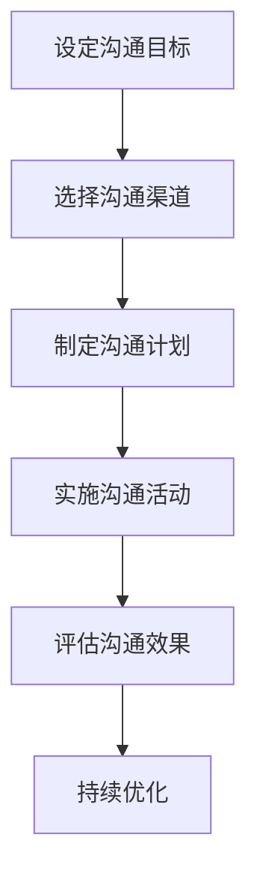
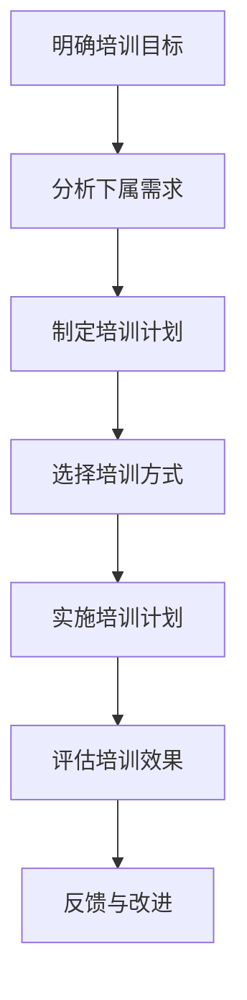

                 

### 文章标题：领导力培养：跨部门、跨职能沟通，并能够有效培养和管理下属

> 关键词：领导力培养、跨部门沟通、跨职能沟通、下属培养、管理下属

> 摘要：本文深入探讨了领导力培养的重要性，特别是在跨部门、跨职能沟通方面。通过详细分析跨部门、跨职能沟通的基本原则与方法，以及培养下属和管理下属的具体技巧，本文旨在为领导者提供一套综合的策略，以提升团队协作和下属发展，从而增强组织整体效能。

---

### 第一部分：领导力培养概述

#### 第1章：领导力培养的定义与重要性

**1.1 领导力的定义**

领导力是一种影响和激励他人以实现共同目标的能力。它不仅包括决策能力、战略规划能力，还包括沟通技巧、团队合作精神和个人魅力。领导力的核心在于激发团队潜能，推动团队达成目标。

**1.1.1 领导力的基本概念**
领导力是一种多维度、多层次的概念，涵盖个人、团队和组织三个层面。在个人层面，领导力体现为自我管理和自我激励的能力；在团队层面，领导力表现为协调和激励团队成员，实现团队目标；在组织层面，领导力则是塑造组织文化、推动组织变革和持续发展的能力。

**1.1.2 领导力的构成要素**
领导力的构成要素包括但不限于：情感智慧、沟通能力、决策能力、战略思维、团队合作精神和创新能力。这些要素相互作用，共同构成了一个全面的领导力体系。

**1.2 领导力的重要性**

**1.2.1 对个人职业生涯的影响**
领导力是职业生涯发展的重要基石。具备领导力的人更容易获得职业晋升和更高的薪酬，因为他们能够更好地应对复杂的工作挑战，提升团队效能，从而获得组织和市场的认可。

**1.2.2 对团队和组织的影响**
领导力对团队和组织的影响至关重要。优秀的领导者能够激发团队成员的潜力，提升团队士气，增强团队凝聚力，从而推动团队实现更高的绩效。同时，领导力有助于塑造组织文化，推动组织变革，提高组织的适应性和竞争力。

**1.2.3 对企业文化的塑造**
领导力对组织文化的塑造具有深远影响。领导者的行为和价值观直接影响组织文化的形成和发展。优秀的领导者通过积极的行为和价值观，塑造积极向上、勇于创新、团结协作的组织文化，推动组织的持续发展。

**1.3 领导力的历史发展**

**1.3.1 古代领导理论的发展**
古代领导理论主要关注领导者的人格特质和道德品质。例如，中国古代的《论语》中提到，“君子之德风，小人之德草，草上之风必偃”，强调了领导者道德品质的重要性。

**1.3.2 现代领导理论的发展**
现代领导理论更加注重领导行为和领导风格。例如，情境领导理论提出，领导风格应根据团队和环境的变化而灵活调整。领导力的研究逐渐从单一维度的分析转向多维度的综合研究，以更好地理解领导力的本质和作用。

**1.3.3 领导力在不同行业领域的应用与演变**
领导力在不同行业领域的应用和演变有所不同。例如，在高科技行业，领导力更加注重创新能力和风险管理；在服务业，领导力则更加注重客户关系管理和员工激励。随着行业环境的不断变化，领导力的内涵和外延也在不断拓展和深化。

---

在领导力培养的过程中，跨部门、跨职能沟通和下属培养与管理是至关重要的环节。下一部分将深入探讨这些关键领域的具体方法和策略。

---

#### 第2章：跨部门、跨职能沟通的基本原则与方法

**2.1 跨部门、跨职能沟通的重要性**

跨部门、跨职能沟通是现代组织有效运作的基石。随着组织规模的扩大和复杂性的增加，跨部门、跨职能沟通的难度也随之提升。有效的跨部门、跨职能沟通不仅能够促进团队协作，提高工作效率，还能增强组织的整体效能。

**2.1.1 有效沟通对团队协作的重要性**
有效的沟通是团队协作的润滑剂。通过清晰、及时的沟通，团队成员能够更好地理解任务目标、工作内容和预期成果，从而避免误解和冲突，提高团队整体的工作效率。

**2.1.2 沟通障碍与解决策略**
沟通障碍是跨部门、跨职能沟通中常见的问题。常见的沟通障碍包括信息不对称、沟通渠道不畅、沟通方式不当等。解决沟通障碍的关键在于建立有效的沟通机制，明确沟通目标，选择合适的沟通渠道，并提升沟通技巧。

**2.2 跨部门、跨职能沟通的基本原则**

**2.2.1 明确沟通目标**
明确的沟通目标是有效沟通的前提。在跨部门、跨职能沟通中，领导者需要明确沟通的目的和目标，确保所有参与者都清楚了解沟通的重点和预期成果。

**2.2.2 选择合适的沟通渠道**
选择合适的沟通渠道对于确保沟通的有效性至关重要。根据沟通的内容、目标和参与者的需求，选择面对面沟通、电子邮件、即时通讯工具或其他沟通渠道。

**2.2.3 保持透明和开放**
透明和开放的沟通环境能够促进信任和合作。领导者需要保持信息的透明，及时向相关部门和人员提供必要的信息，并鼓励团队成员提出问题和意见，共同解决问题。

**2.3 跨部门、跨职能沟通的方法**

**2.3.1 非正式沟通的技巧**
非正式沟通是建立良好关系和促进信息交流的重要途径。领导者可以通过组织团队聚会、午间聊天等方式，营造轻松、友好的沟通氛围，促进团队成员之间的交流与合作。

**2.3.2 正式沟通的技巧**
正式沟通是确保信息准确传递的重要手段。在正式沟通中，领导者需要使用清晰、简洁的语言，明确表达沟通内容和目标，确保所有参与者都能准确理解。

**2.3.3 使用技术工具进行沟通**
现代信息技术为跨部门、跨职能沟通提供了丰富的工具和平台。领导者可以充分利用电子邮件、即时通讯工具、视频会议系统等，提高沟通效率和效果。

**2.3.4 沟通技巧与人际交往能力的提升**
提升沟通技巧和人际交往能力是领导者必备的能力。领导者可以通过参加培训课程、阅读相关书籍、实践沟通技巧等方式，不断提升自己的沟通能力，从而更好地应对跨部门、跨职能沟通的挑战。

通过遵循以上基本原则和运用多种沟通方法，领导者可以有效地促进跨部门、跨职能沟通，提高团队协作效率，为组织的发展奠定坚实基础。

---

在接下来的章节中，我们将深入探讨如何培养下属和管理下属的具体技巧和方法。这将有助于领导者提升团队绩效，实现组织目标。

---

#### 第3章：培养下属的技巧

**3.1 培养下属的重要性**

培养下属是领导者的一项重要职责，对于组织的发展和个人职业生涯都具有深远的影响。通过有效的下属培养，领导者不仅能够提升团队的整体效能，还能为组织培养出更多的优秀人才。

**3.1.1 员工发展的价值**
员工发展是组织长期竞争力的基石。通过培养下属，组织能够不断提升员工的技能和素质，满足不断变化的市场需求，保持竞争优势。此外，员工的发展也能够增强员工的忠诚度和满意度，降低员工流失率。

**3.1.2 下属培养对企业的影响**
有效的下属培养对企业的长远发展具有积极影响。通过培养下属，企业能够培养出具备创新能力和领导力的人才，推动企业的创新和变革。同时，下属的培养也能够提升团队协作效率，促进企业文化的形成和传播。

**3.2 培养下属的基本原则**

**3.2.1 确定培养目标**
确定培养目标是下属培养的第一步。领导者需要明确下属培养的具体目标，包括技能提升、知识拓展、态度转变等方面。通过明确的培养目标，领导者可以更有针对性地制定培养计划和采取培养措施。

**3.2.2 选择合适的培养方式**
选择合适的培养方式是确保培养效果的关键。领导者可以根据下属的岗位需求、个人特点和培养目标，选择内部培训、外部培训、导师制、轮岗等方式。不同的培养方式适用于不同的培养场景和需求，领导者需要灵活运用。

**3.2.3 提供反馈与指导**
提供反馈与指导是下属培养的重要组成部分。领导者需要及时给予下属工作反馈，指出他们的优点和不足，并提供具体的改进建议。通过持续的反馈与指导，领导者能够帮助下属不断改进和提升。

**3.3 培养下属的具体技巧**

**3.3.1 设计培训计划**
设计培训计划是下属培养的重要环节。领导者需要根据培养目标和下属的实际情况，制定具体的培训计划。培训计划应包括培训内容、培训时间、培训方式、培训评估等方面，确保培训计划的实施和效果。

**3.3.2 提供实际工作机会**
提供实际工作机会是下属培养的有效方法。通过让下属参与实际工作项目，领导者能够帮助下属积累实践经验，提升实际工作能力。同时，实际工作机会也能够增强下属的责任感和使命感，提高工作积极性。

**3.3.3 建立信任与支持**
建立信任与支持是下属培养的基础。领导者需要与下属建立良好的信任关系，关心下属的工作和生活，提供必要的支持和帮助。通过建立信任与支持，领导者能够增强下属的自信心和工作动力，提高培养效果。

**3.3.4 如何处理下属的抱怨和问题**
处理下属的抱怨和问题是领导者的一项重要职责。领导者需要耐心倾听下属的意见和抱怨，了解他们的真实需求和问题，并采取积极的措施解决。通过妥善处理下属的抱怨和问题，领导者能够增强下属的满意度和工作积极性。

通过以上具体技巧和方法，领导者可以有效地培养下属，提升团队绩效，实现组织目标。

---

在接下来的章节中，我们将探讨如何通过有效的管理方法来提升下属的工作效率和团队合作能力。

---

#### 第4章：管理下属的方法

**4.1 管理下属的重要性**

管理下属是领导者的一项基本职责，对于团队和组织的发展具有重要意义。有效的下属管理不仅能够提升团队工作效率，还能够增强团队凝聚力和员工满意度。

**4.1.1 管理职责的理解**
管理职责包括制定工作计划、分配任务、监督执行、提供反馈等多个方面。领导者需要明确自己的管理职责，确保下属能够清晰了解工作要求和期望。

**4.1.2 管理下属对组织效能的影响**
有效的下属管理对组织效能具有显著影响。通过合理的管理方法，领导者能够激发下属的潜力，提高工作质量和效率。同时，有效的管理还能够建立积极的团队氛围，增强团队协作能力，推动组织目标的实现。

**4.2 管理下属的基本原则**

**4.2.1 公平与公正**
公平与公正是管理下属的重要原则。领导者需要确保在任务分配、绩效评估、奖励惩罚等方面公平对待每一位下属，避免偏袒和不公平现象的发生。

**4.2.2 信任与尊重**
信任与尊重是建立良好管理关系的基础。领导者需要信任下属的能力和工作表现，给予他们充分的自主权和责任。同时，领导者也要尊重下属的意见和感受，营造积极、和谐的团队氛围。

**4.2.3 激励与鼓励**
激励与鼓励是提升下属工作积极性和工作效率的重要手段。领导者需要根据下属的个性和需求，运用适当的激励手段，如认可和奖励、晋升机会、培训发展等，激发下属的工作热情和创造力。

**4.3 管理下属的具体方法**

**4.3.1 设定明确的目标和期望**
设定明确的目标和期望是管理下属的重要步骤。领导者需要与下属共同制定具体的工作目标和期望，明确工作内容和成果要求。通过明确的目标和期望，下属能够更清晰地了解工作要求，提高工作动力和效率。

**4.3.2 提供必要的资源和支持**
提供必要的资源和支持是确保下属完成任务的重要保障。领导者需要确保下属在完成工作任务时能够获得必要的资源和支持，如技术工具、培训资源、团队支持等。通过提供必要的资源和支持，领导者能够帮助下属克服工作难题，提高工作效率。

**4.3.3 建立有效的沟通机制**
建立有效的沟通机制是管理下属的重要环节。领导者需要建立定期沟通机制，如周会、月度报告等，与下属保持密切沟通。通过有效的沟通，领导者能够及时了解下属的工作进展、问题和需求，提供必要的指导和支持。

**4.3.4 如何处理下属的冲突与问题**
处理下属的冲突与问题是领导者的一项重要职责。领导者需要建立有效的冲突解决机制，积极倾听下属的意见和反馈，了解冲突的根源和影响。通过采取适当的解决策略，如调解、协商、调整工作安排等，领导者能够有效化解冲突，维护团队和谐。

通过遵循以上基本原则和运用具体管理方法，领导者可以有效地管理下属，提升团队绩效，实现组织目标。

---

在接下来的章节中，我们将通过案例分析，探讨跨部门、跨职能协作的具体实践和经验，为领导者提供实际操作的指导。

---

#### 第5章：跨部门、跨职能协作的案例分析

**5.1 案例一：跨部门项目协作的挑战与解决方案**

**5.1.1 案例背景**
在一家大型跨国公司，公司计划推出一款全新产品。该项目涉及研发、市场、销售、客服等多个部门，需要跨部门协作才能顺利完成。

**5.1.2 挑战分析**
在项目初期，由于各部门的沟通不畅，导致项目进度缓慢，质量不稳定。具体挑战包括：信息不对称、职责不清、资源调配不均等。

**5.1.3 解决方案与效果评估**
为了解决跨部门协作中的挑战，公司采取了一系列措施。首先，成立跨部门项目团队，明确各部门的职责和任务；其次，建立定期沟通机制，如每周的项目例会，确保信息传递的及时性和准确性；最后，提供必要的资源和支持，如技术工具和培训资源。通过这些措施，项目进度得到显著提升，项目质量得到保障。

**5.2 案例二：跨职能团队建设的实践与启示**

**5.2.1 案例背景**
在一家互联网公司，公司决定组建一个跨职能团队，负责开发一款创新型社交媒体应用。团队成员包括产品经理、设计师、研发工程师、市场推广专员等。

**5.2.2 跨职能团队建设的实践**
在跨职能团队建设过程中，公司采取了以下措施：首先，明确团队成员的角色和职责，确保每位成员都清楚自己的工作任务；其次，建立高效的沟通机制，如每日站会、周报等，确保团队成员之间的信息传递畅通；最后，提供培训和指导，帮助团队成员提升跨职能协作能力。

**5.2.3 启示与反思**
通过跨职能团队建设，公司发现跨职能协作能够显著提高项目效率和产品质量。然而，在实践中也遇到了一些挑战，如团队成员之间的沟通障碍、职责分工不明确等。通过不断反思和改进，公司逐步解决了这些问题，实现了跨职能团队的良性运作。

**5.3 案例三：下属培养与管理在跨部门协作中的应用**

**5.3.1 案例背景**
在一家咨询公司，公司决定培养一批具有跨部门协作能力的下属，以应对日益复杂的业务需求。

**5.3.2 下属培养与管理的策略**
公司采取以下策略进行下属培养与管理：首先，制定明确的培养目标，如提升跨部门协作能力、增强团队领导力等；其次，提供多样化的培养方式，如内部培训、外部学习、导师制等；最后，建立反馈与评估机制，定期评估下属的培养效果，提供改进建议。

**5.3.3 案例效果与经验总结**
通过下属培养与管理，公司培养了一批具备跨部门协作能力的下属，提升了团队整体协作效率。同时，下属的培养也促进了公司内部的知识共享和资源整合，为公司的可持续发展奠定了坚实基础。

通过以上案例分析，我们可以看到跨部门、跨职能协作在实践中的应用效果。在实际操作中，领导者需要根据组织特点和项目需求，采取灵活有效的策略，促进跨部门、跨职能协作，实现组织目标。

---

在接下来的章节中，我们将探讨如何通过综合策略，全面提升领导力培养的效果。

---

#### 第6章：有效领导力培养的综合策略

**6.1 综合策略的概念与重要性**

综合策略是一种系统化的领导力培养方法，它通过整合多种培养手段和资源，全面提升领导者的能力。综合策略不仅关注领导力的理论学习和技能提升，更注重实践应用和经验积累，从而实现领导力的全面提升。

**6.1.1 综合策略的定义**
综合策略是一种系统化的领导力培养方法，它通过整合多种培养手段和资源，全面提升领导者的能力。这些培养手段包括内部培训、外部学习、导师制、实战演练等。综合策略的目标是帮助领导者实现从理论到实践的转变，提升领导力和管理水平。

**6.1.2 综合策略在领导力培养中的应用**
综合策略在领导力培养中的应用主要体现在以下几个方面：首先，通过内部培训，提升领导者的理论知识和技能；其次，通过外部学习，拓宽领导者的视野和思维；再次，通过导师制，指导领导者的实践操作；最后，通过实战演练，检验领导者的能力和水平。

**6.2 综合策略的实施步骤**

**6.2.1 明确培养目标**
明确培养目标是综合策略实施的第一步。领导者需要根据组织需求和自身发展目标，明确具体的培养目标。这些目标可以是提升领导力、增强管理能力、拓展业务视野等。

**6.2.2 制定培养计划**
制定培养计划是综合策略实施的关键。领导者需要根据培养目标，制定详细的培养计划，包括培训课程、学习资源、实践项目等。培养计划应确保培养内容的系统性和连贯性，避免重复和遗漏。

**6.2.3 组织培养活动**
组织培养活动是综合策略实施的重要环节。领导者需要积极组织和参与各种培养活动，如内部培训、外部学习、实战演练等。通过参与培养活动，领导者能够将理论知识转化为实践能力，提升领导力和管理水平。

**6.2.4 持续跟踪与评估**
持续跟踪与评估是综合策略实施的重要保障。领导者需要定期对培养效果进行评估，了解培养目标的实现情况，发现问题和不足，及时调整培养计划和策略。

**6.3 案例分析：综合策略在领导力培养中的应用效果**

**6.3.1 案例背景**
在一家高科技公司，公司为了提升领导者的领导力和管理水平，决定实施综合策略进行领导力培养。

**6.3.2 综合策略的具体应用**
公司采取以下措施实施综合策略：首先，制定明确的培养目标，如提升领导力、增强管理能力、拓展业务视野等；其次，制定详细的培养计划，包括内部培训、外部学习、实战演练等；再次，组织各类培养活动，如领导力研讨会、管理培训课程、项目实战等；最后，定期对培养效果进行评估，了解培养目标的实现情况，发现问题和不足。

**6.3.3 应用效果与启示**
通过综合策略的实施，公司领导者的领导力和管理水平得到了显著提升。培养目标的实现情况良好，领导者的能力得到了锻炼和提升。同时，公司的整体运营效率和管理水平也得到了提高。这个案例表明，综合策略是一种有效的领导力培养方法，可以为组织带来显著的管理效益。

通过以上分析，我们可以看到综合策略在领导力培养中的应用效果。领导者通过实施综合策略，可以全面提升自己的领导力，实现个人和组织的共同发展。

---

在接下来的章节中，我们将探讨领导力培养的未来趋势与挑战，为领导者提供应对变化的策略和方法。

---

#### 第7章：领导力培养的未来趋势与挑战

**7.1 领导力培养的未来趋势**

**7.1.1 数字化转型对领导力的影响**
随着数字化转型的深入推进，领导力培养也面临着新的挑战和机遇。数字化转型要求领导者具备更强的数字化思维、数据分析和创新能力。未来，领导力培养将更加注重数字化技能的培养，帮助领导者应对数字化时代的挑战。

**7.1.2 智能化技术在领导力培养中的应用**
智能化技术的快速发展为领导力培养带来了新的可能性。例如，通过人工智能技术，可以个性化定制培训内容，提供实时反馈和评估，提高培训效果。未来，智能化技术将在领导力培养中发挥更加重要的作用，提升培训的效率和质量。

**7.1.3 全球化背景下的领导力培养**
全球化背景下的领导力培养需要领导者具备跨文化沟通能力和全球视野。未来，领导力培养将更加注重跨文化教育和全球视野的培养，帮助领导者更好地适应全球化的发展趋势。

**7.2 领导力培养的挑战**

**7.2.1 组织变革带来的挑战**
随着组织的不断变革，领导力培养也面临着新的挑战。领导者需要具备快速适应变化的能力，引领组织变革。同时，组织变革也对领导者的领导风格和决策能力提出了更高的要求。

**7.2.2 个性化和多元化对领导力培养的挑战**
个性化和多元化的工作环境对领导力培养提出了新的要求。领导者需要能够理解和管理多元化团队，激发不同个体的潜力。同时，个性化和多元化也要求领导力培养更加注重个体差异，提供个性化的培养方案。

**7.2.3 持续学习与自我提升的需求**
在快速变化的时代，持续学习和自我提升成为领导者必备的能力。领导力培养需要帮助领导者建立持续学习的能力，适应不断变化的环境。未来，领导力培养将更加注重学习方法和学习体系的构建，帮助领导者实现自我提升。

**7.2.4 领导力培养的可持续性和可复制性**
领导力培养的可持续性和可复制性是组织长期发展的关键。领导者需要能够将领导力培养的经验和成果转化为组织的能力，实现领导力的传承和扩展。未来，领导力培养将更加注重培养模式的可持续性和可复制性，帮助组织建立持久的领导力优势。

通过应对以上挑战，领导者可以不断提升自己的领导力，为组织的持续发展奠定坚实基础。

---

在本文的最后，我们将总结领导力培养的核心要点，并推荐一些领导力培养的工具与资源，以帮助读者进一步学习和实践。

---

#### 总结与展望

本文通过深入探讨领导力培养的定义、重要性、跨部门、跨职能沟通、下属培养和管理下属的方法，以及未来趋势与挑战，为领导者提供了一套全面的领导力培养策略。以下是本文的核心要点总结：

1. **领导力培养的重要性**：领导力是个人职业生涯和团队组织发展的关键，对个人和组织都具有重要意义。
2. **跨部门、跨职能沟通的基本原则与方法**：明确沟通目标、选择合适的沟通渠道、保持透明和开放，以及运用非正式和正式沟通技巧，是有效跨部门、跨职能沟通的关键。
3. **培养下属的技巧**：设定明确培养目标、选择合适培养方式、提供反馈与指导、设计培训计划和提供实际工作机会，是培养下属的有效方法。
4. **管理下属的方法**：公平与公正、信任与尊重、激励与鼓励，以及设定明确目标和期望、提供必要资源、建立有效沟通机制和处理下属的冲突与问题，是管理下属的重要原则和方法。
5. **跨部门、跨职能协作的案例分析**：通过具体案例，展示了跨部门、跨职能协作在实践中的应用和效果，为领导者提供了实际操作的指导。
6. **有效领导力培养的综合策略**：明确培养目标、制定培养计划、组织培养活动、持续跟踪与评估，是实施领导力培养的综合策略。
7. **领导力培养的未来趋势与挑战**：数字化转型、智能化技术、全球化背景、组织变革和个性化和多元化，是领导力培养面临的未来趋势和挑战。

为了帮助读者进一步学习和实践领导力培养，本文推荐以下工具与资源：

- **领导力评估工具**：如360度反馈评估、领导力素质模型等，帮助领导者评估和提升自身领导力。
- **培训课程与资源推荐**：如《领导力心理学》、《领导力与管理技能提升》等课程，提供系统化的领导力培训资源。
- **领导力培养的最佳实践案例**：通过学习其他组织的领导力培养实践，借鉴成功经验，提升自身领导力。

通过本文的探讨和推荐，希望读者能够更好地理解领导力培养的重要性，掌握有效的培养和管理技巧，提升自身的领导力，为个人和组织的发展做出贡献。

### 附录

#### 附录 A：领导力培养的工具与资源

**A.1 领导力评估工具**

- **360度反馈评估**：通过收集来自不同层级和领域的反馈，全面评估领导者的领导力素质。
- **领导力素质模型**：根据组织的战略目标和需求，制定一套领导力素质模型，用于评估和培养领导力。

**A.2 培训课程与资源推荐**

- **《领导力心理学》**：探讨领导力的心理基础，帮助领导者理解和管理团队。
- **《领导力与管理技能提升》**：系统介绍领导力的理论和实践方法，提高领导者的管理能力。
- **在线领导力课程**：如Coursera、edX等平台上的领导力课程，提供灵活的学习方式。

**A.3 领导力培养的最佳实践案例**

- **案例研究**：通过分析成功组织的领导力培养实践，学习他们的经验和方法。
- **行业报告**：如《全球领导力发展报告》，提供行业领导力培养的最新趋势和最佳实践。

#### 附录 B：数学模型和公式

**B.1 常用领导力评估模型**

- **情境领导模型**：基于领导者对情境的感知和反应，评估领导者的领导风格和能力。
- **领导者行为模型**：通过分析领导者的行为特征，评估其领导力素质。

**B.2 沟通模型**

- **信息传递模型**：描述信息从发送者到接收者的传递过程。
- **沟通障碍模型**：分析影响沟通效果的各种因素，如噪声、误解等。

**B.3 培养下属的模型与公式**

- **员工发展模型**：描述员工从入职到晋升的整个发展过程。
- **培训效果评估公式**：如学习转化率（LTI）= 学习投入（Learning Input）× 学习转化率（Learning Transferability）。

**B.4 管理下属的模型与公式**

- **绩效管理模型**：通过设定目标、监控绩效、提供反馈等环节，实现下属绩效的提升。
- **团队效能公式**：如团队效能（Team Effectiveness）= 成员能力（Member Ability）× 团队协作（Team Collaboration）。

#### C.1 伪代码示例

**C.1.1 跨部门沟通策略设计**



**C.1.2 培养下属的培训计划制定**



#### C.2 代码示例

**C.2.1 源代码实现**

```python
# 假设有一个任务分配系统，用于跨部门协作

def assign_task(employee, task):
    if employee["department"] == "Sales":
        print("销售部门成员已分配任务：", task)
    elif employee["department"] == "Marketing":
        print("市场营销部门成员已分配任务：", task)
    else:
        print("其他部门成员已分配任务：", task)

# 示例数据
employee = {"name": "Alice", "department": "Sales"}
task = "市场调研报告"

# 分配任务
assign_task(employee, task)
```

**C.2.2 代码解读与分析**

该代码示例是一个简单的任务分配系统，用于跨部门协作。代码中定义了一个函数`assign_task`，用于分配任务给员工。该函数接受两个参数：`employee`（员工信息）和`task`（任务内容）。

- 在函数内部，根据员工所属部门，打印相应的任务分配信息。如果员工属于销售部门，则打印“销售部门成员已分配任务：”；如果员工属于市场营销部门，则打印“市场营销部门成员已分配任务：”；如果员工属于其他部门，则打印“其他部门成员已分配任务：”。
- 示例数据中，员工名为Alice，所属部门为销售部门，任务为市场调研报告。
- 通过调用`assign_task`函数，系统会根据员工的部门信息，将任务正确分配给相应的员工。

这个简单的代码示例展示了如何在跨部门协作中实现任务分配，为实际项目中的任务管理提供了基础。在实际应用中，任务分配系统可以更加复杂，包括任务优先级、资源调配等多方面的考虑。

---

通过本文的详细探讨和实际案例，我们希望读者能够深刻理解领导力培养的重要性，掌握跨部门、跨职能沟通、下属培养和管理下属的具体技巧和方法。同时，本文也提供了一些数学模型、伪代码和代码示例，以帮助读者更好地理解和应用领导力培养的理论和实践。

作者：AI天才研究院/AI Genius Institute & 禅与计算机程序设计艺术 /Zen And The Art of Computer Programming

---

本文通过系统地探讨领导力培养的重要性、跨部门、跨职能沟通的方法、下属培养和管理下属的技巧，以及跨部门、跨职能协作的案例分析，旨在为领导者提供一套全面的领导力培养策略。通过深入分析和实际案例，本文揭示了领导力培养的核心要点和关键实践，为领导者提升团队协作效率和下属发展能力提供了有力支持。

在未来，领导力培养将面临数字化转型、智能化技术、全球化背景等新挑战。领导者需要持续学习和适应这些变化，以提升自身的领导力和管理能力。同时，本文也展望了领导力培养的未来趋势，如个性化和多元化需求的满足、持续学习与自我提升的重要性等。

通过本文的学习和实践，读者将能够更好地理解领导力培养的理论和实践，提升自身的领导力水平，为个人和组织的发展做出更大的贡献。希望本文能够为读者提供有价值的启示和帮助，共同推动领导力培养的进步与发展。

最后，再次感谢读者对本文的关注和支持。我们期待与读者共同探索领导力培养的更多可能性，为构建更加高效、和谐的组织贡献力量。作者：AI天才研究院/AI Genius Institute & 禅与计算机程序设计艺术 /Zen And The Art of Computer Programming

