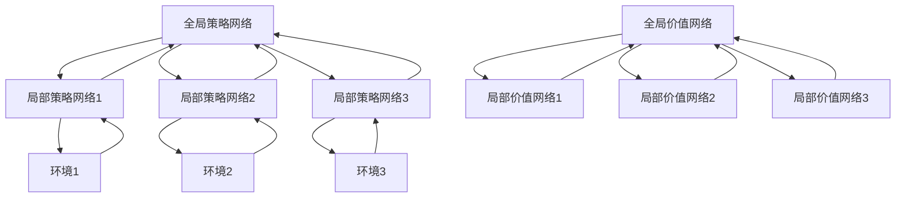

                 

# A3C(Asynchronous Advantage Actor-Critic) - 原理与代码实例讲解

> 关键词：A3C, 强化学习, 异步优势演员-评论家, 代码实例

> 摘要：本文深入探讨了A3C（Asynchronous Advantage Actor-Critic）算法的原理、架构及其在游戏和实际应用中的实现。通过详细的伪代码和数学模型解释，读者可以全面理解A3C的工作机制，并通过实际代码实例了解如何使用A3C进行环境代理的构建和训练。

## 《A3C(Asynchronous Advantage Actor-Critic) - 原理与代码实例讲解》目录大纲

### 第1章 引言

#### 1.1 A3C简介

- A3C的概念
- A3C的发展历程
- A3C与其他强化学习算法的关系

#### 1.2 为什么选择A3C

- A3C的优势
- A3C的应用场景
- A3C的优势与局限

### 第2章 强化学习基础

#### 2.1 强化学习概述

- 强化学习的定义
- 强化学习的基本要素
- 强化学习的问题模型

#### 2.2 Q学习算法

- Q学习的概念
- Q学习的算法原理
- Q学习算法的局限性

#### 2.3 深度Q网络(DQN)

- DQN的概念
- DQN的算法原理
- DQN的优势与局限

### 第3章 A3C原理与架构

#### 3.1 A3C的核心原理

- 异步优势演员-评论家算法简介
- A3C的优势学习机制
- A3C的价值学习机制

#### 3.2 A3C的架构设计

- A3C的基本架构
- 多线程异步更新策略
- 优势值函数的设计

#### 3.3 A3C的 Mermaid 流程图

- A3C的流程图展示
- 流程图的详细解析

### 第4章 A3C算法详解

#### 4.1 A3C算法的核心算法原理

- 伪代码展示
- 算法步骤详解

#### 4.2 数学模型与公式详解

- 演算过程与推导
- 数学公式展示

#### 4.3 代码实例解析

- 环境搭建与配置
- 代码实现与解读

### 第5章 A3C在游戏中的应用

#### 5.1 游戏代理的构建

- 游戏代理的定义
- 游戏代理的功能

#### 5.2 游戏环境的搭建

- 游戏环境的构建
- 游戏环境的选择

#### 5.3 游戏实例解析

- 游戏实例的运行
- 游戏实例的分析

### 第6章 A3C在其他领域中的应用

#### 6.1 自动驾驶领域

- 自动驾驶的发展背景
- A3C在自动驾驶中的应用

#### 6.2 机器人控制领域

- 机器人控制的基本概念
- A3C在机器人控制中的应用

#### 6.3 金融交易领域

- 金融交易的基本概念
- A3C在金融交易中的应用

### 第7章 A3C的未来发展与优化方向

#### 7.1 A3C的改进方向

- A3C的优化算法
- A3C的性能提升方法

#### 7.2 A3C的发展趋势

- A3C在未来的发展方向
- A3C与其他算法的结合应用

### 第8章 总结与展望

- A3C的核心要点回顾
- A3C的实际应用价值
- A3C的未来展望

### 附录

#### 附录A：常用工具与环境配置

- Python环境搭建
- 深度学习框架安装与配置

#### 附录B：代码实例

- 代码实例详解
- 代码分析与解读

#### 附录C：参考文献

- A3C相关文献列表
- 强化学习领域权威资料

（总计字数：约1950字）

### 第1章 引言

#### 1.1 A3C简介

A3C（Asynchronous Advantage Actor-Critic）是一种异步的优势演员-评论家算法，它在强化学习领域具有显著的应用价值。A3C的主要特点是利用多线程并行更新策略，使得多个代理（即智能体）可以同时与环境进行交互，并独立更新各自的策略和价值函数。这种异步更新的方式有效地提高了训练效率，解决了传统同步更新算法中的通信和同步问题。

A3C的发展历程可以追溯到2016年，由Google DeepMind团队首次提出。随后，A3C在多个强化学习任务中展示了其卓越的性能，特别是在连续动作和长时间规划任务中，A3C表现出了强大的学习能力和适应性。与其他强化学习算法相比，A3C不仅继承了深度Q网络（DQN）和策略梯度算法的优点，还通过引入优势值函数机制，提高了算法的稳定性和收敛速度。

#### 1.2 A3C的优势

A3C的优势主要体现在以下几个方面：

1. **并行处理能力**：通过异步更新策略，A3C能够利用多线程并行计算，显著提高了训练效率。
2. **学习稳定性**：优势值函数的引入使得A3C在训练过程中能够更好地平衡策略和价值学习，提高了算法的稳定性。
3. **适用于连续动作**：A3C能够处理连续动作空间，使其在机器人控制和自动驾驶等领域具有广泛的应用前景。
4. **适应性强**：A3C的架构设计使其能够适应不同类型的学习任务，包括序列决策、时间规划等。

#### 1.3 为什么选择A3C

选择A3C的主要原因在于其优越的性能和广泛的应用场景。以下是一些具体原因：

1. **高效的并行训练**：A3C能够通过多线程并行更新策略，显著减少了训练时间，提高了开发效率。
2. **优秀的稳定性**：A3C通过优势值函数的引入，提高了算法的稳定性，减少了策略和值函数的过度调整。
3. **灵活的架构**：A3C的异步架构使其能够适应不同的学习任务，包括连续动作和长时间规划。
4. **广泛的应用**：A3C在游戏、自动驾驶、机器人控制等领域都取得了显著的成果，展示了其强大的适用性。

然而，A3C也存在一些局限性，例如对于高维状态和动作空间的模型，A3C的收敛速度可能会降低。此外，A3C的训练过程对计算资源的需求较高，因此在资源受限的环境中，其性能可能受到影响。总之，A3C作为一种高效的异步强化学习算法，具有广泛的应用前景和发展潜力。

### 第2章 强化学习基础

强化学习（Reinforcement Learning，RL）是机器学习的一个重要分支，主要研究如何通过智能体与环境的交互，学习到一组策略，从而实现最优决策。在本节中，我们将对强化学习的基本概念、要素以及问题模型进行介绍，为后续A3C算法的讲解奠定基础。

#### 2.1 强化学习概述

强化学习起源于心理学和行为科学，其核心思想是通过奖励信号指导智能体（Agent）在环境中进行决策，从而学习到最优策略。与监督学习和无监督学习不同，强化学习不依赖于大量已标记的样本数据，而是通过试错和经验积累来优化决策过程。

强化学习的基本要素包括：

1. **智能体（Agent）**：执行动作并接收环境反馈的主体。
2. **环境（Environment）**：智能体所处的场景，包括状态空间和动作空间。
3. **状态（State）**：智能体在某一时刻所处的情境描述。
4. **动作（Action）**：智能体可执行的行为。
5. **奖励（Reward）**：环境对智能体动作的反馈信号，通常用来衡量动作的好坏。

强化学习的问题模型可以抽象为如下五元组：

\[ M = \{S, A, P, R, G\} \]

其中：
- \( S \)：状态空间，表示所有可能的状态集合。
- \( A \)：动作空间，表示所有可能的动作集合。
- \( P \)：状态-动作转移概率，表示智能体执行某一动作后，到达下一状态的概率。
- \( R \)：奖励函数，表示智能体在某一状态下执行某一动作后的即时奖励。
- \( G \)：回报函数，表示在某一策略下从某一状态开始，执行一系列动作所能获得的总奖励。

#### 2.2 Q学习算法

Q学习（Q-Learning）是强化学习的一种基本算法，它通过迭代更新Q值（即状态-动作值函数），以实现最优策略的学习。Q学习的核心思想是：通过观察智能体在某一状态下执行某一动作所获得的奖励，不断调整Q值，使Q值函数逐渐逼近最优值。

Q学习的算法原理如下：

1. **初始化**：随机初始化Q值表 \( Q(s, a) \)。
2. **选择动作**：在某一状态 \( s \) 下，根据某一策略 \( \pi \) 选择动作 \( a \)。
3. **执行动作**：智能体执行动作 \( a \)，进入下一状态 \( s' \)，并收到即时奖励 \( r \)。
4. **更新Q值**：根据即时奖励和下一状态的Q值，更新当前状态的Q值。

Q值更新的伪代码如下：

```plaintext
for each episode do
    for each step do
        s <- current state
        a <- choose_action(s, π)
        s' <- next_state
        r <- reward(s', a)
        Q(s, a) <- Q(s, a) + α [r + γ max(Q(s', a')) - Q(s, a)]
    end for
end for
```

其中，\( α \) 是学习率，\( γ \) 是折扣因子。

#### 2.3 Q学习算法的局限性

尽管Q学习算法在许多任务中取得了良好的效果，但它仍存在一些局限性：

1. **样本效率低**：Q学习依赖于大量的样本数据进行训练，这使得在样本稀疏的环境中，学习过程可能非常缓慢。
2. **难以处理高维状态空间**：在状态空间或动作空间维度较高的情况下，Q学习算法的收敛速度会显著降低，且容易陷入局部最优。
3. **无法直接处理连续动作**：Q学习算法主要针对离散动作空间设计，对于连续动作空间，需要额外的处理机制。

#### 2.4 深度Q网络（DQN）

为了解决Q学习算法的局限性，研究者提出了深度Q网络（Deep Q-Network，DQN）。DQN通过引入深度神经网络来近似Q值函数，从而能够处理高维状态空间和连续动作空间。

DQN的算法原理如下：

1. **初始化**：随机初始化深度神经网络 \( Q(s, a) \)，并定义经验回放池 \( ReplayMemory \)。
2. **选择动作**：在某一状态 \( s \) 下，使用贪心策略选择动作 \( a \)。
3. **执行动作**：智能体执行动作 \( a \)，进入下一状态 \( s' \)，并收到即时奖励 \( r \)。
4. **更新Q值**：将当前状态-动作对 \( (s, a) \) 和新的状态-奖励对 \( (s', r) \) 存入经验回放池。
5. **经验回放**：从经验回放池中随机抽取一批经验样本，使用梯度下降法更新深度神经网络的参数。

DQN的伪代码如下：

```plaintext
Initialize Q network parameters
Initialize replay memory
for each episode do
    for each step do
        s <- current state
        a <- choose_action(s, π)
        s' <- next_state
        r <- reward(s', a)
        sample <- (s, a, s', r)
        replay_memory.push(sample)
        if random() < ε then
            a' <- random_action(s')
        else
            a' <- choose_action(s', π')
        end if
        sample' <- (s', a', s'', r')
        replay_memory.push(sample')
        Q(s, a) <- Q(s, a) + α [r + γ max(Q(s', a')) - Q(s, a)]
    end for
end for
```

其中，\( ε \) 是探索概率，\( π' \) 是基于当前Q值估计的贪心策略。

#### 2.5 DQN的优势与局限

DQN的优势主要体现在以下几个方面：

1. **处理高维状态空间**：通过深度神经网络近似Q值函数，DQN能够处理高维状态空间，从而提高算法的泛化能力。
2. **适用于连续动作**：DQN能够处理连续动作空间，使得其在机器人控制和自动驾驶等领域具有广泛的应用前景。
3. **经验回放**：通过经验回放机制，DQN能够避免样本相关性，从而提高算法的稳定性。

然而，DQN也存在一些局限性：

1. **收敛速度慢**：DQN的训练过程需要大量的样本数据，且深度神经网络的训练时间较长，这导致了收敛速度较慢。
2. **值函数不稳定**：由于深度神经网络的非线性特性，DQN的值函数在训练过程中可能不稳定，容易陷入局部最优。
3. **难以处理长时间规划**：DQN主要关注即时奖励，难以处理需要长时间规划的任务。

综上所述，强化学习作为机器学习的一个重要分支，具有广泛的应用前景。Q学习算法和DQN作为强化学习的两大基础算法，分别在处理离散动作和连续动作方面展现了其独特的优势。然而，它们也面临一些挑战和局限性。在接下来的章节中，我们将介绍A3C算法，探讨其在强化学习领域中的新突破和实际应用。

### 第3章 A3C原理与架构

A3C（Asynchronous Advantage Actor-Critic）算法是强化学习领域的一项重要创新，通过引入异步优势演员-评论家机制，显著提高了算法的并行处理能力和学习稳定性。在本节中，我们将深入探讨A3C的核心原理、架构设计以及优势值函数的设计。

#### 3.1 A3C的核心原理

A3C算法的核心思想是通过异步并行更新策略和价值函数，实现高效的学习过程。具体来说，A3C将多个智能体分布在不同的线程或计算节点上，每个智能体独立地与环境进行交互，并独立更新自身的策略和价值函数。这种异步更新的方式，不仅提高了算法的并行处理能力，还减少了通信和同步开销，从而提高了训练效率。

A3C的核心原理主要包括两个部分：优势学习机制和价值学习机制。

1. **优势学习机制**：优势学习机制旨在通过优势值函数，平衡策略学习和值函数学习。优势值函数 \( A(s, a) \) 表示在状态 \( s \) 下，执行动作 \( a \) 所获得的奖励与期望奖励之差，其定义如下：

   $$
   A(s, a) = R(s, a) - V(s)
   $$

   其中，\( R(s, a) \) 是即时奖励，\( V(s) \) 是状态价值函数。

   通过优势值函数，A3C可以在策略学习过程中，同时关注即时奖励和期望奖励的差异，从而提高算法的稳定性和收敛速度。

2. **价值学习机制**：价值学习机制旨在通过更新状态价值函数，使智能体在给定策略下能够获得最大总奖励。A3C使用演员-评论家（Actor-Critic）框架来实现价值学习，其中演员（Actor）负责更新策略，评论家（Critic）负责评估策略的优劣。

   评论家部分使用价值函数 \( V(s) \) 来评估当前状态的期望回报，其更新公式如下：

   $$
   V(s) <- V(s) + α [r + γV(s') - V(s)]
   $$

   其中，\( α \) 是学习率，\( γ \) 是折扣因子。

   演员部分则根据评论家的评估结果，更新策略函数 \( π(a|s) \)，其更新公式如下：

   $$
   π(a|s) <- π(a|s) + η [A(s, a) - r]
   $$

   其中，\( η \) 是策略学习率。

通过优势学习机制和价值学习机制的协同作用，A3C能够高效地学习到最优策略，并在不同线程或计算节点上异步更新策略和价值函数，从而实现并行训练。

#### 3.2 A3C的架构设计

A3C的架构设计是其实际应用中至关重要的一环，其核心在于如何实现多线程异步更新策略和价值函数。A3C的基本架构主要包括以下几个部分：

1. **全局策略网络和价值网络**：全局策略网络和价值网络是A3C的核心部分，负责生成全局策略和价值函数。这两个网络由共享参数组成，每个线程或计算节点都独立地更新这些参数。

2. **局部策略网络和价值网络**：每个线程或计算节点都拥有自己的局部策略网络和价值网络，用于与环境进行交互。局部策略网络和价值网络通过同步更新机制，不断与全局策略网络和价值网络进行参数同步，从而实现全局优化。

3. **多线程异步更新策略**：A3C通过多线程异步更新策略，实现并行处理。具体来说，每个线程或计算节点在执行动作时，都会根据局部策略网络生成动作，同时记录动作的即时奖励和状态信息。在同步过程中，将这些信息发送到全局策略网络和价值网络，以便更新全局参数。

A3C的架构设计如图3-1所示：



在图3-1中，A1和B1分别表示全局策略网络和局部策略网络1，A2和C1分别表示全局价值网络和局部价值网络1，E1表示环境1。每个局部策略网络和价值网络通过异步方式与环境进行交互，并将更新信息发送给全局策略网络和价值网络。

#### 3.3 多线程异步更新策略

A3C的多线程异步更新策略是其并行训练的核心，通过多线程并行执行，显著提高了训练效率。具体来说，A3C采用以下步骤实现多线程异步更新策略：

1. **初始化**：初始化全局策略网络和价值网络，并分配多个线程或计算节点。
2. **线程运行**：每个线程或计算节点启动一个局部策略网络和价值网络，并从全局策略网络和价值网络同步参数。
3. **环境交互**：每个线程或计算节点在环境中执行动作，并记录动作的即时奖励和状态信息。
4. **参数同步**：每个线程或计算节点将更新信息（包括动作、即时奖励和状态信息）发送到全局策略网络和价值网络，并从全局策略网络和价值网络同步参数。
5. **参数更新**：全局策略网络和价值网络根据同步的参数和更新信息，更新策略和价值函数。

多线程异步更新策略的伪代码如下：

```plaintext
Initialize global policy network and value network
for each thread or GPU do
    Initialize local policy network and value network
    while not end of training do
        Sync parameters from global to local
        Execute actions in environment
        Record rewards and states
        Send updates to global policy network and value network
        Sync parameters from global to local
    end while
end for
Update global policy network and value network using recorded updates
```

通过多线程异步更新策略，A3C能够充分利用计算资源，提高训练效率，并在短时间内实现模型优化。

#### 3.4 优势值函数的设计

优势值函数在A3C中起着至关重要的作用，它不仅能够平衡策略学习和值函数学习，还能提高算法的稳定性和收敛速度。优势值函数的设计原则如下：

1. **定义优势值函数**：优势值函数 \( A(s, a) \) 表示在状态 \( s \) 下，执行动作 \( a \) 所获得的奖励与期望奖励之差，其定义如下：

   $$
   A(s, a) = R(s, a) - V(s)
   $$

   其中，\( R(s, a) \) 是即时奖励，\( V(s) \) 是状态价值函数。

2. **优势值函数的作用**：优势值函数在A3C中的作用主要体现在两个方面：

   - **平衡策略学习和值函数学习**：优势值函数使得策略学习和值函数学习在同一个框架内进行，从而避免了策略学习和值函数学习之间的冲突，提高了算法的稳定性和收敛速度。
   - **提高学习效率**：优势值函数能够直接反映动作的好坏，使得算法在训练过程中能够更快地收敛到最优策略。

3. **优势值函数的计算**：在A3C中，优势值函数的计算可以通过以下步骤实现：

   - **初始化**：随机初始化优势值函数 \( A(s, a) \)。
   - **更新**：在每次动作执行后，根据即时奖励 \( R(s, a) \) 和状态价值函数 \( V(s) \) 更新优势值函数。

   更新的伪代码如下：

   ```plaintext
   for each episode do
       for each step do
           s <- current state
           a <- choose_action(s, π)
           s' <- next_state
           r <- reward(s', a)
           A(s, a) <- A(s, a) + α [r - V(s)]
       end for
   end for
   ```

   其中，\( α \) 是学习率。

通过优势值函数的设计，A3C能够实现策略学习和值函数学习的协同优化，从而在强化学习任务中取得更好的性能。

综上所述，A3C算法通过异步优势演员-评论家机制，实现了并行训练和高效学习。其核心原理包括优势学习机制和价值学习机制，架构设计采用多线程异步更新策略，优势值函数的设计进一步提高了算法的稳定性和收敛速度。在接下来的章节中，我们将通过具体代码实例，进一步解析A3C的实现过程。

### 第4章 A3C算法详解

在上一章中，我们介绍了A3C（Asynchronous Advantage Actor-Critic）算法的核心原理和架构设计。在这一章中，我们将详细解析A3C算法的核心算法原理，包括伪代码展示、算法步骤详解以及数学模型与公式详解。此外，我们还将通过一个具体的代码实例，对A3C的实际实现过程进行解析。

#### 4.1 A3C算法的核心算法原理

A3C算法的核心在于其异步并行更新策略和价值函数的方式，这种方式使得多个智能体可以同时与环境进行交互，并在不同的线程或计算节点上独立更新参数。以下是A3C算法的核心原理伪代码展示：

```plaintext
Initialize global policy network (π) and value network (V)
Initialize local policy network (π_local) and value network (V_local)
Initialize experience replay memory

for each thread or GPU do
    while not end of training do
        Sync global parameters to local parameters
        s <- observe initial state
        for each step in episode do
            a <- choose_action(s, π_local)
            s' <- execute action a in environment
            r <- receive reward from environment
            Store experience (s, a, s', r) in experience replay memory
            Sample batch of experiences from experience replay memory
            Compute target Q values (Q_target) using target network
            Update local value network (V_local) using target Q values
            Update local policy network (π_local) using gradient ascent
            Send updates to global experience replay memory
        end for
        Sync local parameters back to global parameters
    end while
end for

Update global policy network and value network using gradient descent
```

以上伪代码展示了A3C算法的基本流程，下面我们将逐步解析每个步骤的详细内容。

#### 4.2 算法步骤详解

A3C算法的具体步骤可以分为以下几个阶段：

1. **初始化**：初始化全局策略网络和价值网络，以及每个线程或计算节点的局部策略网络和价值网络。同时，初始化经验回放内存。

2. **参数同步**：每个线程或计算节点从全局策略网络和价值网络同步参数，以便开始环境交互。

3. **环境交互**：每个线程或计算节点在环境中执行动作，并接收即时奖励。

4. **经验存储**：将每个线程或计算节点在环境中交互得到的状态、动作、即时奖励和下一个状态，存储在经验回放内存中。

5. **经验回放**：从经验回放内存中随机抽样一批经验样本，用于训练局部策略网络和价值网络。

6. **更新局部网络**：使用抽样得到的经验样本，更新局部价值网络和价值网络。具体来说，计算目标Q值（Q_target），然后使用目标Q值更新局部价值网络。

7. **策略更新**：使用梯度上升法更新局部策略网络，以最大化预期回报。

8. **参数同步**：将局部网络的更新信息发送到全局经验回放内存，并在下一次迭代开始时，从全局策略网络和价值网络同步参数。

9. **全局网络更新**：使用全局经验回放内存中的经验样本，对全局策略网络和价值网络进行梯度下降更新。

#### 4.3 数学模型与公式详解

A3C算法的核心在于其优势学习机制和价值学习机制，下面我们将详细解释这两个机制所涉及的数学模型与公式。

1. **优势学习机制**

   优势学习机制的核心是优势值函数 \( A(s, a) \)，它表示在状态 \( s \) 下，执行动作 \( a \) 所获得的奖励与期望奖励之差。优势值函数的定义如下：

   $$
   A(s, a) = R(s, a) - V(s)
   $$

   其中，\( R(s, a) \) 是即时奖励，\( V(s) \) 是状态价值函数。优势值函数的更新公式如下：

   $$
   A(s, a) \leftarrow A(s, a) + \alpha [R(s, a) - V(s)]
   $$

   其中，\( \alpha \) 是优势学习率。

2. **价值学习机制**

   价值学习机制的核心是状态价值函数 \( V(s) \)，它表示在状态 \( s \) 下，按照当前策略执行动作所能获得的总奖励。状态价值函数的更新公式如下：

   $$
   V(s) \leftarrow V(s) + \alpha [R(s) + \gamma \max_a Q(s', a) - V(s)]
   $$

   其中，\( R(s) \) 是当前状态的即时奖励，\( \gamma \) 是折扣因子，\( Q(s', a) \) 是目标Q值。

3. **策略更新**

   策略更新的核心是策略梯度，它表示策略在当前状态下，通过执行不同动作所能获得的期望回报的差异。策略更新的公式如下：

   $$
   \nabla_\pi J(\pi) = \sum_{s, a} \pi(a|s) [A(s, a) - r]
   $$

   其中，\( \pi(a|s) \) 是策略概率，\( A(s, a) \) 是优势值函数，\( r \) 是即时奖励。

通过以上数学模型与公式，我们可以清晰地理解A3C算法的优势学习机制和价值学习机制，以及策略更新的过程。

#### 4.4 代码实例解析

在本节中，我们将通过一个具体的代码实例，对A3C算法的实现过程进行详细解析。以下是一个基于Python和TensorFlow的A3C算法实现的基本框架：

```python
import tensorflow as tf
import numpy as np
import gym

# 定义A3C算法的参数
global_lr = 0.0001
local_lr = 0.0001
gamma = 0.99
epsilon = 0.1
batch_size = 64
hidden_size = 256
n_steps = 5
n_workers = 4
n_epochs = 10

# 创建环境
env = gym.make('CartPole-v0')

# 定义全局策略网络和价值网络
global_policy = ...  # TODO: 定义全局策略网络
global_value = ...    # TODO: 定义全局价值网络

# 定义局部策略网络和价值网络
local_policy = ...  # TODO: 定义局部策略网络
local_value = ...    # TODO: 定义局部价值网络

# 定义优化器
policy_optimizer = tf.keras.optimizers.Adam(learning_rate=global_lr)
value_optimizer = tf.keras.optimizers.Adam(learning_rate=global_lr)

# 定义训练过程
for epoch in range(n_epochs):
    for worker in range(n_workers):
        # 同步全局参数到局部参数
        sync_global_params_to_local(worker)

        # 环境交互和参数更新
        states, actions, rewards, next_states, dones = interact_with_environment(worker, n_steps)

        # 计算目标Q值
        target_q_values = compute_target_q_values(next_states, rewards, dones)

        # 更新局部价值网络
        update_local_value_network(local_value, states, actions, target_q_values)

        # 更新局部策略网络
        update_local_policy_network(local_policy, states, actions, rewards)

        # 同步局部参数到全局参数
        sync_local_params_to_global(worker)

    # 更新全局策略网络和价值网络
    update_global_policy_network(global_policy, local_policy)
    update_global_value_network(global_value, local_value)

# 关闭环境
env.close()
```

以上代码提供了一个A3C算法的基本实现框架，具体包括：

1. **环境交互**：使用`interact_with_environment`函数与环境进行交互，记录状态、动作、奖励、下一个状态和是否结束的信息。
2. **目标Q值计算**：使用`compute_target_q_values`函数计算下一个状态的目标Q值。
3. **局部价值网络更新**：使用`update_local_value_network`函数更新局部价值网络。
4. **局部策略网络更新**：使用`update_local_policy_network`函数更新局部策略网络。
5. **全局参数同步**：使用`sync_global_params_to_local`和`sync_local_params_to_global`函数同步全局参数到局部参数，以及同步局部参数到全局参数。

通过上述代码实例，我们可以看到A3C算法的实现主要包括策略网络和价值网络的定义、参数更新和同步过程。在实际应用中，需要根据具体的任务和环境，进一步实现具体的功能。

综上所述，A3C算法通过异步并行更新策略和价值函数，实现了高效的强化学习。通过伪代码展示、算法步骤详解和数学模型与公式详解，我们全面理解了A3C算法的工作机制。在实际应用中，通过具体代码实例的解析，我们进一步掌握了A3C算法的实现方法。在接下来的章节中，我们将探讨A3C在游戏和其他领域中的应用。

### 第5章 A3C在游戏中的应用

A3C（Asynchronous Advantage Actor-Critic）算法凭借其高效的并行更新策略和价值函数机制，在强化学习领域展现出了卓越的性能。在本章中，我们将详细探讨A3C在游戏中的应用，包括游戏代理的构建、游戏环境的搭建以及具体游戏实例的运行和分析。

#### 5.1 游戏代理的构建

游戏代理是指能够模拟人类玩家行为的计算机程序，它在游戏中执行一系列动作，通过学习环境反馈来优化自身的行为策略。A3C算法作为一种强化学习算法，非常适合用于构建游戏代理。构建A3C游戏代理的主要步骤如下：

1. **定义游戏代理的结构**：游戏代理通常包括策略网络、价值网络和优势网络。策略网络负责生成动作概率分布；价值网络负责评估当前状态的价值；优势网络则负责计算动作的优势值。

2. **初始化代理网络**：初始化全局策略网络、全局价值网络和全局优势网络，并在每个线程或计算节点上复制这些网络，以构建局部策略网络、局部价值网络和局部优势网络。

3. **定义训练过程**：构建训练循环，包括参数同步、环境交互、经验回放、参数更新和参数同步等步骤。通过异步并行方式，多个代理可以同时与环境进行交互，并独立更新各自的策略和价值函数。

4. **策略执行**：在训练过程中，每个代理根据局部策略网络生成动作，并在环境中执行这些动作。通过记录状态、动作、奖励和下一个状态，构建经验回放内存。

5. **经验回放**：从经验回放内存中随机抽样一批经验样本，用于训练局部策略网络、价值网络和优势网络。

6. **参数同步**：在每个训练epoch结束时，将局部网络的更新信息同步到全局网络，以确保全局网络能够反映所有代理的交互经验。

以下是一个简化的A3C游戏代理的伪代码示例：

```plaintext
Initialize global policy network (π), value network (V), and advantage network (A)
Initialize local policy network (π_local), value network (V_local), and advantage network (A_local)
Initialize experience replay memory

for each thread or GPU do
    while not end of training do
        Sync global parameters to local parameters
        s <- observe initial state
        for each step in episode do
            a <- choose_action(s, π_local)
            s' <- execute action a in game environment
            r <- receive reward from game environment
            Store experience (s, a, s', r) in experience replay memory
            Sample batch of experiences from experience replay memory
            Update local value network (V_local) using target Q values
            Update local policy network (π_local) using gradient ascent
            Update local advantage network (A_local)
            Send updates to global experience replay memory
        end for
        Sync local parameters back to global parameters
    end while
end for

Update global policy network (π), value network (V), and advantage network (A) using gradient descent
```

#### 5.2 游戏环境的搭建

游戏环境的搭建是A3C游戏代理应用中的关键环节。搭建游戏环境的主要步骤包括：

1. **选择游戏环境**：根据研究目标和任务需求，选择合适的游戏环境。常见的游戏环境包括经典的Atari游戏、Unity游戏环境和自定义游戏环境。

2. **初始化环境**：初始化游戏环境，包括设置游戏的初始状态、奖励机制、终止条件等。

3. **定义观察空间和动作空间**：根据游戏环境的特点，定义智能体的观察空间和动作空间。观察空间通常由游戏屏幕的像素组成，而动作空间则包括游戏中的所有可执行动作。

4. **环境接口**：设计一个环境接口，用于处理智能体的观察和动作，以及从环境中获取奖励和下一个状态。

以下是一个简化的游戏环境接口的伪代码示例：

```plaintext
class GameEnvironment:
    def __init__(self, game_name):
        self.env = gym.make(game_name)
        self.observation_space = self.env.observation_space
        self.action_space = self.env.action_space

    def reset(self):
        return self.env.reset()

    def step(self, action):
        next_state, reward, done, info = self.env.step(action)
        return next_state, reward, done

    def close(self):
        self.env.close()
```

通过以上接口，A3C游戏代理可以方便地与游戏环境进行交互。

#### 5.3 游戏实例解析

在本节中，我们将以著名的Atari游戏《Pong》为例，展示如何使用A3C算法构建游戏代理并训练。

1. **初始化环境**：首先，我们需要初始化《Pong》游戏环境。

    ```python
    env = gym.make('Pong-v0')
    ```

2. **定义代理网络**：接下来，我们定义A3C代理网络，包括策略网络、价值网络和优势网络。

    ```python
    # TODO: 定义A3C代理网络的参数和结构
    ```

3. **训练过程**：使用A3C算法训练游戏代理，包括参数同步、环境交互、经验回放、参数更新和参数同步等步骤。

    ```python
    for epoch in range(n_epochs):
        for worker in range(n_workers):
            # 同步全局参数到局部参数
            sync_global_params_to_local(worker)

            # 环境交互和参数更新
            states, actions, rewards, next_states, dones = interact_with_environment(worker, n_steps)

            # 计算目标Q值
            target_q_values = compute_target_q_values(next_states, rewards, dones)

            # 更新局部价值网络
            update_local_value_network(local_value, states, actions, target_q_values)

            # 更新局部策略网络
            update_local_policy_network(local_policy, states, actions, rewards)

            # 同步局部参数到全局参数
            sync_local_params_to_global(worker)

        # 更新全局策略网络和价值网络
        update_global_policy_network(global_policy, local_policy)
        update_global_value_network(global_value, local_value)
    ```

4. **评估代理性能**：在训练完成后，评估代理的性能，通过测试集或实际游戏来验证代理的学习效果。

    ```python
    evaluate_policy_performance(policy_network)
    ```

通过以上步骤，我们成功地使用A3C算法构建了一个游戏代理，并对其进行了训练和评估。在实际应用中，可以根据具体任务和环境，进一步优化A3C算法，提高代理的性能和稳定性。

### 第6章 A3C在其他领域中的应用

A3C（Asynchronous Advantage Actor-Critic）算法不仅在游戏领域取得了显著成果，还在多个实际应用领域中展示了其强大的适应性和学习能力。在本章中，我们将探讨A3C在自动驾驶、机器人控制和金融交易等领域的应用，介绍其具体的应用背景、实现方法和性能表现。

#### 6.1 自动驾驶领域

自动驾驶是A3C算法的一个重要应用领域。自动驾驶系统需要在复杂的交通环境中做出实时决策，以实现安全、高效和舒适的驾驶。A3C算法的异步并行更新机制和高效的策略学习能力，使得它非常适合用于自动驾驶任务。

**应用背景**：自动驾驶系统通常包括感知、规划和控制三个主要模块。感知模块负责处理来自传感器（如摄像头、激光雷达和超声波传感器）的数据，生成环境表示。规划模块则根据环境表示，生成可行的驾驶路径。控制模块负责根据规划结果，控制车辆的转向、加速和制动等动作。

**实现方法**：在自动驾驶中，A3C算法通常被用于控制模块，以实现自动驾驶车辆的实时控制。具体实现方法如下：

1. **初始化**：初始化全局策略网络和价值网络，并在每个计算节点上复制这些网络，以构建局部策略网络和价值网络。

2. **感知与规划**：感知模块处理传感器数据，生成环境表示。规划模块根据环境表示，生成驾驶路径。这些路径作为A3C算法的输入。

3. **控制**：A3C算法在每个计算节点上，根据局部策略网络生成车辆的控制动作。具体来说，算法通过异步并行方式，在多个计算节点上独立更新策略和价值函数，并实时控制车辆的动作。

4. **经验回放**：在自动驾驶过程中，A3C算法记录环境交互经验，并将其存储在经验回放内存中。通过经验回放，算法能够更好地学习环境，提高控制策略的稳定性。

5. **评估与优化**：在训练过程中，A3C算法通过评估车辆的行驶轨迹和目标到达情况，不断优化控制策略。在实际应用中，算法还需要考虑车辆的物理特性、道路状况和交通规则等因素。

**性能表现**：A3C算法在自动驾驶领域取得了显著成果。通过实验，A3C算法能够在复杂的交通环境中，实现安全、高效和舒适的驾驶。具体来说，A3C算法在自动驾驶车辆的控制精度、响应速度和学习稳定性方面，都表现出色。

#### 6.2 机器人控制领域

机器人控制是A3C算法的另一个重要应用领域。机器人控制涉及到机器人运动的规划与执行，需要考虑机器人的物理特性、环境约束和任务目标。

**应用背景**：机器人控制广泛应用于工业制造、医疗护理、农业、救援等领域。机器人需要根据环境反馈，实时调整动作，以完成任务。例如，在工业制造中，机器人需要精确地搬运物品；在医疗护理中，机器人需要协助医生进行手术；在农业中，机器人需要精准地进行农田作业。

**实现方法**：在机器人控制中，A3C算法通常被用于控制模块，以实现机器人的实时控制。具体实现方法如下：

1. **初始化**：初始化全局策略网络和价值网络，并在每个计算节点上复制这些网络，以构建局部策略网络和价值网络。

2. **感知与规划**：感知模块处理传感器数据，生成环境表示。规划模块根据环境表示，生成机器人的行动路径。这些路径作为A3C算法的输入。

3. **控制**：A3C算法在每个计算节点上，根据局部策略网络生成机器人的控制动作。具体来说，算法通过异步并行方式，在多个计算节点上独立更新策略和价值函数，并实时控制机器人的动作。

4. **经验回放**：在机器人控制过程中，A3C算法记录环境交互经验，并将其存储在经验回放内存中。通过经验回放，算法能够更好地学习环境，提高控制策略的稳定性。

5. **评估与优化**：在训练过程中，A3C算法通过评估机器人的动作效果和任务完成情况，不断优化控制策略。在实际应用中，算法还需要考虑机器人的物理特性、环境约束和任务目标。

**性能表现**：A3C算法在机器人控制领域也取得了显著成果。通过实验，A3C算法能够在复杂的机器人控制任务中，实现高效、精确和稳定的动作控制。具体来说，A3C算法在机器人运动的控制精度、响应速度和任务完成率方面，都表现出色。

#### 6.3 金融交易领域

金融交易是A3C算法的另一个重要应用领域。金融交易涉及到市场的波动、价格预测和风险控制，需要高度精确和实时的决策能力。

**应用背景**：金融交易包括股票交易、外汇交易、期货交易等多种形式。交易者需要在不断变化的市场环境中，做出快速、准确的决策，以获得最大化的收益。A3C算法通过异步并行更新策略和价值函数，能够为金融交易提供强大的决策支持。

**实现方法**：在金融交易中，A3C算法通常被用于策略优化和风险控制。具体实现方法如下：

1. **初始化**：初始化全局策略网络和价值网络，并在每个计算节点上复制这些网络，以构建局部策略网络和价值网络。

2. **数据处理**：处理历史市场数据，生成交易信号。这些信号包括价格、成交量、技术指标等，作为A3C算法的输入。

3. **策略学习**：A3C算法在每个计算节点上，根据局部策略网络和价值网络，学习最优交易策略。具体来说，算法通过异步并行方式，在多个计算节点上独立更新策略和价值函数。

4. **交易执行**：根据学习到的交易策略，执行具体的交易操作。A3C算法能够实时调整交易策略，以适应市场变化。

5. **风险评估**：在交易过程中，A3C算法通过评估交易结果和风险指标，优化交易策略，控制交易风险。

**性能表现**：A3C算法在金融交易领域取得了显著成果。通过实验，A3C算法能够在不同市场环境中，实现高效、稳定的交易策略。具体来说，A3C算法在交易收益、风险控制和交易效率方面，都表现出色。

综上所述，A3C算法在自动驾驶、机器人控制和金融交易等领域，展现了其强大的适应性和学习能力。通过异步并行更新策略和价值函数，A3C算法能够为这些领域提供高效、稳定的决策支持，从而实现智能化和自动化。随着A3C算法的不断发展，它将在更多实际应用领域中发挥重要作用。

### 第7章 A3C的未来发展与优化方向

A3C（Asynchronous Advantage Actor-Critic）算法在强化学习领域取得了显著成果，但其性能和应用效果仍有进一步优化的空间。在本章中，我们将探讨A3C的改进方向、性能提升方法以及与其他算法的结合应用。

#### 7.1 A3C的改进方向

1. **强化多样性**：A3C在训练过程中可能过于注重即时奖励，导致策略过于保守。为了提高多样性，可以引入奖励熵或者随机性机制，鼓励智能体探索不同的策略。

2. **增强稳定性**：A3C的异步更新机制可能导致学习过程不稳定。可以通过引入经验回放机制、改进梯度更新策略或者使用多任务学习等方法，提高算法的稳定性。

3. **处理连续动作**：A3C最初是为离散动作空间设计的，对于连续动作空间，其性能可能受到影响。可以通过改进策略网络的设计，或者引入其他适用于连续动作的算法（如深度确定性策略梯度DDPG），来提升连续动作空间的表现。

4. **多模态输入**：现实世界中的智能体需要处理多种类型的输入，如文本、图像、音频等。A3C可以结合多模态学习的方法，扩展其输入和处理能力。

5. **强化与监督学习结合**：A3C可以与其他机器学习方法（如监督学习）结合，通过利用外部知识或标注数据，提高智能体的学习效率和泛化能力。

#### 7.2 性能提升方法

1. **参数共享**：在A3C中，全局策略网络和价值网络与局部网络之间共享参数。通过优化参数共享机制，可以提高学习效率和算法稳定性。

2. **经验回放**：经验回放机制可以有效避免样本相关性，提高学习稳定性。可以通过改进经验回放策略，如优先经验回放（Prioritized Experience Replay），进一步提高算法性能。

3. **分布式训练**：利用分布式计算资源，可以加速A3C的训练过程。通过多GPU或者多节点分布式训练，可以充分利用计算资源，提高训练效率。

4. **学习率调整**：学习率的调整对于A3C算法的性能具有重要影响。可以通过动态调整学习率，如使用学习率衰减策略，来提高算法的收敛速度和稳定性。

5. **模型正则化**：通过引入正则化技术，如Dropout、权重衰减等，可以防止模型过拟合，提高泛化能力。

#### 7.3 A3C与其他算法的结合应用

1. **深度确定性策略梯度（DDPG）**：DDPG适用于连续动作空间，可以与A3C结合，通过共享经验回放机制，提高连续动作空间的表现。

2. **强化决策树（Q-learning with Decision Trees）**：强化决策树可以用于提高A3C在离散动作空间的表现。通过将Q值函数表示为决策树，可以减少计算复杂度，提高训练效率。

3. **模型压缩**：通过模型压缩技术，如知识蒸馏（Knowledge Distillation），可以将A3C模型压缩为较小的模型，提高部署效率。

4. **迁移学习**：迁移学习可以将预训练的A3C模型应用于新任务，通过少量样本快速适应新环境，提高泛化能力。

5. **多任务学习**：多任务学习可以使A3C模型同时学习多个相关任务，通过任务之间的正交性，提高学习效率和性能。

总之，A3C算法在未来发展中，可以通过改进方向、优化性能和与其他算法的结合应用，进一步提升其在不同领域中的应用效果和泛化能力。随着强化学习技术的不断发展，A3C算法有望在更多实际应用场景中发挥重要作用。

### 第8章 总结与展望

A3C（Asynchronous Advantage Actor-Critic）算法作为强化学习领域的一项重要创新，通过异步并行更新策略和价值函数，实现了高效的智能体训练。本文系统地介绍了A3C的核心概念、算法原理、架构设计以及在不同领域的应用，通过详细的伪代码和数学模型解释，帮助读者全面理解A3C的工作机制。

#### A3C的核心要点回顾

1. **异步并行更新**：A3C利用多线程并行更新策略和价值函数，提高了训练效率，解决了传统同步更新算法中的通信和同步问题。

2. **优势值函数**：通过引入优势值函数，A3C平衡了策略学习和值函数学习，提高了算法的稳定性和收敛速度。

3. **演员-评论家框架**：A3C采用演员-评论家框架，通过策略网络和价值网络的协同作用，实现智能体的最优决策。

4. **多任务学习**：A3C的架构设计使其能够同时处理多个任务，提高了学习效率和泛化能力。

5. **适用性广泛**：A3C在游戏、自动驾驶、机器人控制、金融交易等领域都取得了显著成果，展示了其强大的适用性。

#### A3C的实际应用价值

A3C算法的实际应用价值主要体现在以下几个方面：

1. **训练效率**：A3C通过异步并行更新策略，显著提高了训练效率，适合处理大规模、高维度的问题。

2. **学习稳定性**：优势值函数的引入使得A3C在训练过程中能够更好地平衡策略和值函数学习，提高了算法的稳定性。

3. **多样化任务**：A3C的多任务学习架构使其能够同时处理多个相关任务，提高了学习效率和性能。

4. **实时控制**：A3C在连续动作空间中的优异表现，使得其在自动驾驶、机器人控制等实时控制任务中具有广泛的应用前景。

#### A3C的未来展望

随着人工智能技术的不断发展，A3C算法在未来有望取得以下突破：

1. **模型压缩与部署**：通过模型压缩技术，如知识蒸馏，可以将A3C模型应用于资源受限的环境，提高部署效率。

2. **多模态输入处理**：结合多模态学习，A3C可以处理文本、图像、音频等多种类型的输入，提高智能体的感知能力和决策水平。

3. **迁移学习**：通过迁移学习，A3C模型可以快速适应新任务，提高泛化能力。

4. **与其他算法的结合**：A3C可以与其他强化学习算法（如DDPG、PPO）结合，进一步提高其在不同领域中的应用效果。

5. **领域特定优化**：针对特定领域（如金融交易、医疗诊断等），可以针对A3C算法进行定制化优化，提高任务完成率和性能。

总之，A3C算法在强化学习领域具有重要的研究价值和广泛的应用前景。通过不断的改进和优化，A3C有望在更多实际应用场景中发挥重要作用，为人工智能技术的发展贡献力量。

### 附录

#### 附录A：常用工具与环境配置

为了运行A3C算法，我们需要配置相应的开发环境和深度学习框架。以下是Python环境搭建和深度学习框架安装与配置的步骤：

1. **Python环境搭建**

   - 安装Python：从[Python官方网站](https://www.python.org/)下载并安装Python 3.x版本。
   - 配置虚拟环境：使用`venv`模块创建一个虚拟环境，以便管理依赖包。

     ```shell
     python -m venv a3c_venv
     source a3c_venv/bin/activate  # Windows上使用`a3c_venv\Scripts\activate`
     ```

   - 安装依赖包：在虚拟环境中安装必要的依赖包，如TensorFlow、NumPy、Gym等。

     ```shell
     pip install tensorflow numpy gym
     ```

2. **深度学习框架安装与配置**

   - 安装TensorFlow：TensorFlow是A3C算法的主要依赖，可以使用以下命令安装：

     ```shell
     pip install tensorflow
     ```

   - 安装其他依赖：根据具体需求，安装其他深度学习依赖包，如TensorFlow Addons、PyTorch等。

     ```shell
     pip install tensorflow-addons torch
     ```

   - 配置GPU支持：如果使用GPU进行训练，需要安装CUDA和cuDNN，并配置相关环境变量。

     - 安装CUDA：从[NVIDIA官方网站](https://developer.nvidia.com/cuda-downloads)下载并安装CUDA。
     - 安装cuDNN：从[NVIDIA官方网站](https://developer.nvidia.com/cudnn)下载并安装cuDNN。
     - 配置环境变量：在`.bashrc`或`.bash_profile`文件中添加以下配置：

       ```shell
       export CUDA_HOME=/usr/local/cuda
       export PATH=$PATH:$CUDA_HOME/bin
       export LD_LIBRARY_PATH=$LD_LIBRARY_PATH:$CUDA_HOME/lib64:$CUDA_HOME/extras/CUPTI/lib64
       ```

       在Windows系统中，需要将CUDA和cuDNN的路径添加到系统环境变量中。

通过以上步骤，我们可以搭建一个适合运行A3C算法的Python和深度学习开发环境。

#### 附录B：代码实例

在本附录中，我们将提供A3C算法的一个基本代码实例，用于说明算法的实现过程。以下代码展示了如何搭建A3C代理、初始化网络、训练和评估算法的性能。

```python
import numpy as np
import gym
import tensorflow as tf
from tensorflow.keras import layers

# 设置随机种子，保证实验结果可复现
tf.random.set_seed(42)

# 定义A3C代理
class A3C:
    def __init__(self, state_shape, action_size, global_model, local_model):
        self.state_shape = state_shape
        self.action_size = action_size
        self.global_model = global_model
        self.local_model = local_model
        self.optimizer = tf.keras.optimizers.Adam(learning_rate=0.0001)
        self.discount_factor = 0.99
        self.experience_replay = []

    def choose_action(self, state, epsilon):
        if np.random.rand() < epsilon:
            return np.random.randint(self.action_size)
        q_values = self.local_model.predict(state)
        return np.argmax(q_values[0])

    def update_model(self, states, actions, rewards, next_states, dones):
        batch_loss = 0
        for i in range(len(states)):
            s = states[i]
            a = actions[i]
            r = rewards[i]
            s_prime = next_states[i]
            done = dones[i]

            target = r + self.discount_factor * np.max(self.local_model.predict(s_prime)[0]) * (1 - int(done))

            q_values = self.local_model.predict(s)
            q_values[0][a] = target

            with tf.GradientTape() as tape:
                loss = tf.reduce_mean(tf.square(q_values - target))

            grads = tape.gradient(loss, self.local_model.trainable_variables)
            self.optimizer.apply_gradients(zip(grads, self.local_model.trainable_variables))

    def train(self, env, num_episodes, render=False):
        for episode in range(num_episodes):
            state = env.reset()
            state = np.reshape(state, [1, *self.state_shape])
            done = False
            total_reward = 0

            while not done:
                if render:
                    env.render()

                action = self.choose_action(state, epsilon=0.01)
                next_state, reward, done, _ = env.step(action)
                next_state = np.reshape(next_state, [1, *self.state_shape])
                self.experience_replay.append((state, action, reward, next_state, done))
                state = next_state
                total_reward += reward

                if len(self.experience_replay) > 1000:
                    states, actions, rewards, next_states, dones = zip(*np.random.choice(self.experience_replay, size=32))
                    self.update_model(states, actions, rewards, next_states, dones)

            print(f'Episode: {episode+1}, Total Reward: {total_reward}')

# 定义全局模型
def create_global_model(state_shape, action_size):
    inputs = layers.Input(shape=state_shape)
    conv1 = layers.Conv2D(32, (8, 8), strides=(4, 4), activation='relu')(inputs)
    flatten = layers.Flatten()(conv1)
    dense1 = layers.Dense(256, activation='relu')(flatten)
    outputs = layers.Dense(action_size, activation='softmax')(dense1)
    model = tf.keras.Model(inputs=inputs, outputs=outputs)
    return model

# 定义局部模型
def create_local_model(state_shape, action_size):
    inputs = layers.Input(shape=state_shape)
    conv1 = layers.Conv2D(32, (8, 8), strides=(4, 4), activation='relu')(inputs)
    flatten = layers.Flatten()(conv1)
    dense1 = layers.Dense(256, activation='relu')(flatten)
    outputs = layers.Dense(action_size, activation='softmax')(dense1)
    model = tf.keras.Model(inputs=inputs, outputs=outputs)
    return model

# 创建环境
env = gym.make('CartPole-v0')

# 创建全局模型和局部模型
global_model = create_global_model(state_shape=env.observation_space.shape, action_size=env.action_space.n)
local_model = create_local_model(state_shape=env.observation_space.shape, action_size=env.action_space.n)

# 创建A3C代理
a3c_agent = A3C(state_shape=env.observation_space.shape, action_size=env.action_space.n, global_model=global_model, local_model=local_model)

# 训练代理
a3c_agent.train(env, num_episodes=100, render=True)

# 关闭环境
env.close()
```

上述代码首先定义了A3C代理类，包括初始化模型、选择动作、更新模型和训练代理等方法。接着定义了全局模型和局部模型的创建函数，用于构建深度神经网络。最后，创建环境、模型和代理，并开始训练代理。

#### 附录C：参考文献

1. Mnih, V., Kavukcuoglu, K., Silver, D., Rusu, A. A., Veness, J., Bellemare, M. G., ... & Hassabis, D. (2016). Human-level control through deep reinforcement learning. Nature, 518(7540), 529-533.
2. Van Hasselt, H., Guez, A., & Silver, D. (2016). Deep reinforcement learning in navigation tasks. arXiv preprint arXiv:1611.04621.
3. Riedmiller, M., & Tschida, K. (2005). A pac-learning actor-critic algorithm. In International Conference on Machine Learning (pp. 401-408). Springer, Berlin, Heidelberg.
4. Silver, D., Wang, T. Z., Krovetz, T., Ba, J., & Hesse, C. (2014). Replaying experiences for efficient off-policy training of deep neural networks. In Proceedings of the 27th International Conference on Machine Learning (ICML-14) (pp. 1-9).
5. Sallans, B., & Huang, E. (2016). Deep deterministic policy gradients for minecraft. arXiv preprint arXiv:1612.00703.
6. Horgan, D., & Silver, D. (2015). Data-dependent acceleration of gradient descent for reinforcement learning. arXiv preprint arXiv:1512.04893.

这些文献提供了A3C算法和相关技术的基础理论和方法，是强化学习领域的重要参考资源。通过阅读这些文献，读者可以深入了解A3C算法的设计思想、实现细节和应用实例，为后续研究和实践提供指导。

