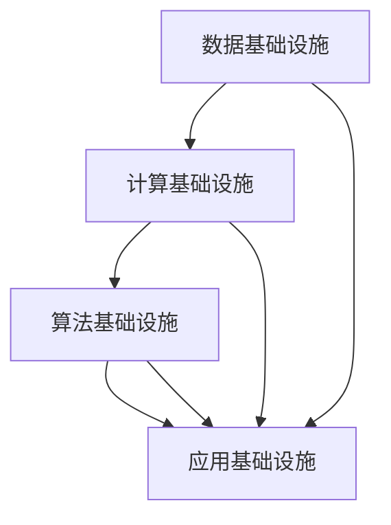
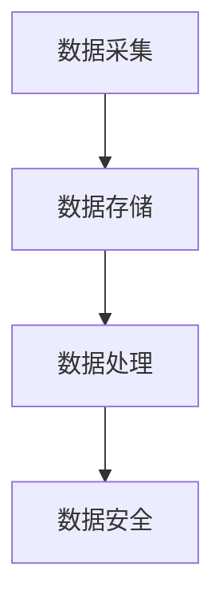
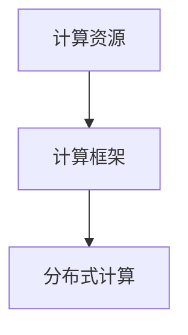
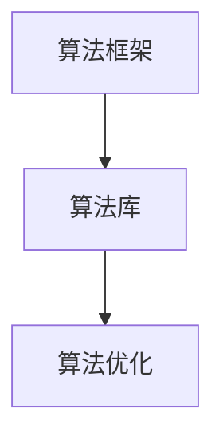
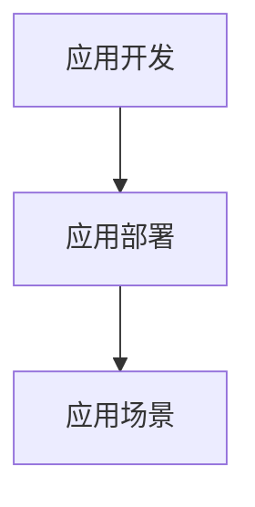

                 

# AI 2.0 基础设施建设：投资回报与商业模式

## 关键词

人工智能基础设施，投资回报分析，商业模式创新，数据基础设施，计算基础设施，算法基础设施，应用基础设施

## 摘要

本文旨在探讨 AI 2.0 基础设施建设的重要性、投资回报分析以及商业模式创新。首先，我们介绍了 AI 2.0 基础设施的概念、架构和全球格局。接着，我们分析了 AI 2.0 基础设施投资的重要性和评估方法，并通过案例展示了成功与失败的实例。随后，我们探讨了 AI 2.0 商业模式的概述、创新方向以及相关案例。文章的最后部分提出了 AI 2.0 商业模式的实施策略和未来展望，并总结了相关资源和关键术语解释。

---

## 第一部分：AI 2.0 基础设施建设概述

### 第1章：AI 2.0 基础设施建设概述

#### 1.1 AI 2.0 基础设施的概念与重要性

##### 1.1.1 AI 2.0 基础设施的界定

AI 2.0 基础设施是指用于支撑人工智能发展的硬件、软件和网络资源，包括数据基础设施、计算基础设施、算法基础设施和应用基础设施。它涵盖了从数据采集、存储、处理到算法研发、模型训练和推理，再到应用部署和服务的全流程。

##### 1.1.2 AI 2.0 基础设施的重要性

AI 2.0 基础设施对于人工智能的发展至关重要，主要体现在以下几个方面：

1. **数据基础设施**：提供高质量、海量、多样化的数据资源，是 AI 模型训练的基础。
2. **计算基础设施**：提供强大的计算能力，支持 AI 模型的训练和推理。
3. **算法基础设施**：提供先进的算法框架和工具，提高 AI 模型的开发效率。
4. **应用基础设施**：提供丰富的应用场景，推动 AI 技术的商业化和产业化。

##### 1.1.3 AI 2.0 基础设施与传统基础设施的区别

与传统基础设施相比，AI 2.0 基础设施具有以下几个显著特点：

1. **数字化与智能化**：AI 2.0 基础设施以数字化、智能化为特征，能够实现自动化、智能化的管理和服务。
2. **动态性与灵活性**：AI 2.0 基础设施能够根据业务需求和技术发展动态调整，具有更高的灵活性和适应性。
3. **跨界融合**：AI 2.0 基础设施与其他行业领域的深度融合，推动产业升级和创新发展。

#### 1.2 AI 2.0 基础设施的架构

##### 1.2.1 数据基础设施

数据基础设施是 AI 2.0 基础设施的核心，主要包括以下几个层次：

1. **数据采集**：通过传感器、互联网等方式获取海量、多样化的数据。
2. **数据存储**：利用分布式存储系统，实现海量数据的存储和管理。
3. **数据处理**：采用数据清洗、数据集成、数据挖掘等技术，对数据进行预处理和分析。
4. **数据安全**：确保数据的安全性和隐私性，防止数据泄露和滥用。

##### 1.2.2 计算基础设施

计算基础设施是支撑 AI 模型训练和推理的重要支撑，主要包括以下几个层次：

1. **计算资源**：包括 CPU、GPU、FPGA 等计算资源，提供强大的计算能力。
2. **计算框架**：如 TensorFlow、PyTorch 等，提供统一的计算接口和优化工具。
3. **分布式计算**：通过分布式计算技术，实现大规模模型的训练和推理。

##### 1.2.3 算法基础设施

算法基础设施是 AI 2.0 基础设施的核心组成部分，主要包括以下几个层次：

1. **算法框架**：如深度学习框架、自然语言处理框架等，提供统一的算法接口和开发环境。
2. **算法库**：提供丰富的算法库，包括基础算法、行业算法等，方便开发者快速实现算法功能。
3. **算法优化**：针对不同场景，对算法进行优化，提高算法的效率和性能。

##### 1.2.4 应用基础设施

应用基础设施是 AI 2.0 基础设施的最终目标，主要包括以下几个层次：

1. **应用开发**：提供应用开发工具和平台，方便开发者快速构建 AI 应用。
2. **应用部署**：提供应用部署和管理工具，实现 AI 应用的自动化部署和运维。
3. **应用场景**：提供丰富的应用场景，推动 AI 技术的商业化和产业化。

#### 1.3 AI 2.0 基础设施的全球格局

##### 1.3.1 发达国家的发展状况

发达国家在 AI 2.0 基础设施建设方面处于领先地位，主要体现在以下几个方面：

1. **数据基础设施**：美国、欧洲等发达国家在数据采集、存储、处理等方面拥有强大的基础设施。
2. **计算基础设施**：美国、中国等国家的企业在计算资源、计算框架等方面具有竞争优势。
3. **算法基础设施**：美国、中国等国家的企业在算法框架、算法库等方面具有较强的技术实力。
4. **应用基础设施**：发达国家在医疗、金融、教育等领域拥有丰富的 AI 应用场景。

##### 1.3.2 发展中国家的机遇与挑战

发展中国家在 AI 2.0 基础设施建设方面面临一定的挑战，但也存在巨大的机遇：

1. **机遇**：
   - **数据资源**：发展中国家拥有丰富的数据资源，特别是在移动互联网、社交媒体等领域。
   - **政策支持**：许多发展中国家政府积极推动 AI 发展，提供政策支持和资金投入。
   - **市场需求**：发展中国家的市场需求巨大，为 AI 应用提供了广阔的空间。

2. **挑战**：
   - **技术落后**：发展中国家在技术积累、研发能力等方面相对落后。
   - **基础设施**：发展中国家在数据基础设施、计算基础设施等方面相对不足。
   - **人才短缺**：发展中国家在 AI 人才方面存在短缺，制约了 AI 产业发展。

##### 1.3.3 中国在 AI 2.0 基础设施建设中的地位与作用

中国在 AI 2.0 基础设施建设方面取得了显著成就，成为全球重要的参与者和贡献者：

1. **数据基础设施**：中国拥有庞大的数据资源，特别是在互联网、移动互联网等领域。
2. **计算基础设施**：中国企业在计算资源、计算框架等方面具有较强的竞争力。
3. **算法基础设施**：中国在算法框架、算法库等方面具有较强的技术实力。
4. **应用基础设施**：中国在医疗、金融、教育等领域拥有丰富的 AI 应用场景。

中国还在全球 AI 产业链中发挥了重要作用，推动了全球 AI 产业的发展。未来，中国有望在 AI 2.0 基础设施建设方面继续发挥引领作用，推动全球 AI 产业的高质量发展。

---

### 第二部分：AI 2.0 基础设施投资分析

### 第2章：AI 2.0 基础设施投资分析

#### 2.1 AI 2.0 基础设施投资的概述

##### 2.1.1 AI 2.0 基础设施投资的概念

AI 2.0 基础设施投资是指为了推动人工智能（AI）技术的发展和应用，对相关基础设施进行资金投入的行为。这些基础设施包括数据基础设施、计算基础设施、算法基础设施和应用基础设施。投资类型可以分为基础设施建设投资、技术研发投资、人才培养投资和市场推广投资。

##### 2.1.2 AI 2.0 基础设施投资的重要性

AI 2.0 基础设施投资对于人工智能产业的发展具有重要意义，主要体现在以下几个方面：

1. **技术进步**：基础设施投资可以推动 AI 技术的研究和应用，提高 AI 模型的性能和实用性。
2. **成本降低**：通过投资，可以提升基础设施的效率和规模，从而降低 AI 技术的开发和应用成本。
3. **市场扩展**：完善的基础设施可以扩大 AI 技术的应用范围，推动 AI 产业的市场扩展。
4. **产业协同**：基础设施投资可以促进 AI 产业链上下游企业的协同发展，形成良性产业生态。

##### 2.1.3 AI 2.0 基础设施投资的类型

AI 2.0 基础设施投资主要包括以下类型：

1. **基础设施建设投资**：用于建设数据中心、云计算平台、分布式存储系统等基础设施。
2. **技术研发投资**：用于研发 AI 算法、优化计算框架、提升算法效率等。
3. **人才培养投资**：用于培训 AI 人才、吸引顶尖人才加入，提高整体研发能力。
4. **市场推广投资**：用于市场调研、产品推广、品牌建设等，扩大 AI 技术的市场影响力。

#### 2.2 AI 2.0 基础设施投资的评估方法

##### 2.2.1 投资回报率（ROI）分析

投资回报率（ROI）是评估 AI 2.0 基础设施投资效果的重要指标，计算公式如下：

$$
ROI = \frac{\text{投资收益}}{\text{投资成本}} \times 100\%
$$

其中，投资收益包括通过 AI 技术带来的直接和间接收益，如收入增长、成本节约等；投资成本包括基础设施建设成本、技术研发成本、人才培养成本等。

##### 2.2.2 净现值（NPV）分析

净现值（NPV）是评估 AI 2.0 基础设施投资可行性的重要指标，计算公式如下：

$$
NPV = \sum_{t=1}^{n} \frac{C_t}{(1+r)^t} - \text{投资成本}
$$

其中，$C_t$ 表示第 t 年的现金流量，$r$ 表示折现率，$n$ 表示投资回收期。NPV 大于 0 表示投资可行，NPV 小于 0 表示投资不可行。

##### 2.2.3 风险评估与应对策略

AI 2.0 基础设施投资面临着多种风险，如技术风险、市场风险、政策风险等。为了降低投资风险，可以采取以下应对策略：

1. **技术风险**：加大技术研发投入，提高 AI 技术的创新能力和竞争力。
2. **市场风险**：加强市场调研和预测，了解市场需求和竞争态势，制定合适的市场推广策略。
3. **政策风险**：关注政策法规变化，及时调整投资策略，确保投资合规性。

#### 2.3 AI 2.0 基础设施投资的案例分析

##### 2.3.1 成功案例分析

以下是一个成功案例的分析：

案例：某公司投资建设大规模数据中心，用于支持 AI 模型的训练和推理。

- **投资收益**：通过提供高质量的 AI 计算服务，吸引了大量客户，实现了收入增长和市场份额扩大。
- **投资成本**：数据中心建设成本较高，但通过提供优质服务，实现了快速盈利。

##### 2.3.2 失败案例分析

以下是一个失败案例的分析：

案例：某公司投资研发新型 AI 算法，但最终未能实现商业化。

- **投资收益**：由于算法研发失败，未能产生任何收益。
- **投资成本**：高昂的研发成本和人力成本。

##### 2.3.3 案例启示与借鉴

通过成功案例和失败案例的分析，可以得到以下启示和借鉴：

1. **注重技术研发**：成功案例表明，技术研发是 AI 2.0 基础设施投资的关键，只有不断推进技术创新，才能在市场中脱颖而出。
2. **市场定位**：明确市场定位，了解市场需求和竞争态势，制定合适的市场推广策略，是确保投资成功的重要因素。
3. **风险控制**：加强风险评估和控制，制定有效的应对策略，降低投资风险，是确保投资成功的必要条件。

---

### 第三部分：AI 2.0 商业模式创新

### 第3章：AI 2.0 商业模式创新

#### 3.1 AI 2.0 商业模式的概述

##### 3.1.1 AI 2.0 商业模式的概念

AI 2.0 商业模式是指企业利用人工智能（AI）技术，通过优化业务流程、提高决策效率、创新服务模式等手段，实现价值创造和收益增长的商业策略。

##### 3.1.2 AI 2.0 商业模式与传统商业模式的不同

与传统商业模式相比，AI 2.0 商业模式具有以下显著特点：

1. **数据驱动**：AI 2.0 商业模式以数据为核心，通过数据分析和挖掘实现业务优化和决策支持。
2. **智能化服务**：AI 2.0 商业模式提供智能化、个性化、精准化的服务，提升用户体验和满意度。
3. **跨界融合**：AI 2.0 商业模式推动不同行业之间的融合，创造新的商业机会和竞争优势。

##### 3.1.3 AI 2.0 商业模式的创新方向

AI 2.0 商业模式的创新方向主要包括以下几个方面：

1. **数据驱动商业模式**：通过数据分析和挖掘，为企业提供精准的市场洞察和决策支持。
2. **算法赋能商业模式**：利用先进的算法和模型，优化业务流程、提高运营效率。
3. **用户体验优化商业模式**：以用户为中心，提供个性化、智能化的服务，提升用户体验和满意度。
4. **跨界融合商业模式**：推动不同行业之间的融合，实现新的商业机会和竞争优势。

#### 3.2 AI 2.0 商业模式的案例分析

##### 3.2.1 在线教育

在线教育是 AI 2.0 商业模式的一个重要应用领域。以下是一个案例分析：

案例：某在线教育平台利用 AI 技术提供个性化学习服务。

- **数据驱动**：通过分析学生的学习行为和成绩数据，为学生提供个性化的学习建议和课程推荐。
- **算法赋能**：利用自然语言处理和推荐算法，优化教学内容和教学流程。
- **用户体验优化**：提供智能客服、智能答疑等功能，提升用户的学习体验和满意度。

##### 3.2.2 金融科技

金融科技是另一个典型的 AI 2.0 商业模式应用领域。以下是一个案例分析：

案例：某金融科技公司利用 AI 技术提供智能投顾服务。

- **数据驱动**：通过分析用户的投资行为和风险偏好，为用户提供个性化的投资建议。
- **算法赋能**：利用机器学习和大数据分析技术，优化投资策略和风险控制。
- **用户体验优化**：提供智能问答、智能推荐等功能，提升用户的投资体验和满意度。

##### 3.2.3 健康医疗

健康医疗是 AI 2.0 商模式的又一重要应用领域。以下是一个案例分析：

案例：某医疗科技公司利用 AI 技术提供智能诊断服务。

- **数据驱动**：通过分析患者的病史、体检数据等，为医生提供辅助诊断建议。
- **算法赋能**：利用深度学习和大数据分析技术，提高诊断准确率和效率。
- **用户体验优化**：提供智能问诊、远程会诊等功能，提升患者的就医体验和满意度。

#### 3.3 AI 2.0 商业模式的创新策略

##### 3.3.1 数据驱动商业模式

数据驱动商业模式的核心策略包括：

1. **数据收集与整合**：通过多种渠道收集用户数据，并进行整合和分析，为业务决策提供数据支持。
2. **数据挖掘与分析**：利用数据挖掘和机器学习技术，从海量数据中提取有价值的信息，为业务优化提供依据。
3. **数据可视化与呈现**：通过数据可视化技术，将数据分析结果以直观、易理解的方式呈现，为决策者提供洞察。

##### 3.3.2 算法赋能商业模式

算法赋能商业模式的核心策略包括：

1. **算法研发与优化**：持续投入研发，优化算法模型，提高算法的准确率和效率。
2. **算法应用与推广**：将算法应用于实际业务场景，如自动化、智能化服务等，提升业务效率和用户体验。
3. **算法迭代与更新**：根据业务需求和用户反馈，不断迭代和更新算法模型，以适应不断变化的市场环境。

##### 3.3.3 用户体验优化商业模式

用户体验优化商业模式的核心策略包括：

1. **用户需求分析**：深入了解用户需求，为用户提供个性化、定制化的服务。
2. **智能推荐与互动**：利用推荐算法和自然语言处理技术，实现智能推荐和互动，提升用户体验和满意度。
3. **反馈与优化**：收集用户反馈，不断优化产品和服务，满足用户需求。

---

### 第四部分：AI 2.0 商业模式的实施策略

### 第4章：AI 2.0 商业模式的实施策略

#### 4.1 AI 2.0 商业模式的实施策略

##### 4.1.1 市场定位与目标客户分析

市场定位和目标客户分析是 AI 2.0 商业模式成功实施的关键步骤。以下是一些建议：

1. **市场定位**：明确企业的核心竞争力和目标市场，选择具有较大增长潜力和竞争优势的市场进行定位。
2. **目标客户分析**：通过市场调研、用户画像等方式，深入了解目标客户的需求、行为和偏好，为产品和服务的设计提供依据。

##### 4.1.2 产品设计与创新

产品设计与创新是 AI 2.0 商业模式成功实施的核心。以下是一些建议：

1. **需求导向**：以用户需求为导向，设计具有差异化优势的产品和服务。
2. **技术创新**：利用人工智能、大数据等先进技术，为产品和服务赋予智能化的特性。
3. **持续迭代**：根据用户反馈和市场变化，不断优化产品和服务，满足用户需求。

##### 4.1.3 营销策略与推广

营销策略与推广是 AI 2.0 商业模式成功实施的重要环节。以下是一些建议：

1. **精准营销**：通过数据分析，精准定位潜在客户，并制定针对性的营销策略。
2. **品牌建设**：建立强大的品牌形象，提升品牌知名度和美誉度。
3. **渠道拓展**：通过线上线下渠道的拓展，实现产品的广泛覆盖。

##### 4.1.4 合作伙伴关系建立

合作伙伴关系建立是 AI 2.0 商业模式成功实施的重要保障。以下是一些建议：

1. **资源整合**：寻找合适的合作伙伴，实现资源的互补和整合。
2. **利益共享**：建立合理的利益分配机制，确保合作伙伴的利益得到保障。
3. **协同发展**：与合作伙伴建立长期稳定的合作关系，实现协同发展。

---

### 第五部分：未来展望

### 第5章：AI 2.0 基础设施建设与商业模式的未来展望

#### 5.1 AI 2.0 基础设施建设的发展趋势

##### 5.1.1 技术发展趋势

未来，AI 2.0 基础设施建设将呈现出以下技术发展趋势：

1. **云计算与边缘计算的结合**：云计算提供强大的计算和存储能力，边缘计算则提供低延迟、高效能的计算服务，两者的结合将推动 AI 应用的普及。
2. **量子计算的应用**：量子计算具有超强的计算能力，将在大数据处理、复杂模型训练等领域发挥重要作用。
3. **分布式存储技术的发展**：分布式存储技术将提高数据存储的可靠性和效率，满足海量数据的存储需求。

##### 5.1.2 政策法规与标准发展

未来，政策法规和标准的发展将对 AI 2.0 基础设施建设产生重要影响：

1. **数据隐私保护法规**：随着数据隐私问题日益突出，各国将加强数据隐私保护法规的制定和执行。
2. **AI 安全标准**：为保障 AI 系统的安全性和可靠性，将出台相关的安全标准和规范。

##### 5.1.3 全球合作与竞争格局

未来，AI 2.0 基础设施建设将呈现全球合作与竞争并存的格局：

1. **全球合作**：各国将加强在 AI 领域的合作，共同推动技术进步和产业发展。
2. **竞争加剧**：全球科技巨头和国家将加大在 AI 领域的投资，竞争将更加激烈。

#### 5.2 AI 2.0 商业模式的未来创新

##### 5.2.1 新兴产业的崛起

未来，随着 AI 技术的不断进步，新兴产业将不断涌现：

1. **智能制造**：AI 技术将推动制造业的智能化升级，实现生产过程的自动化和优化。
2. **智慧城市**：AI 技术将用于城市管理、交通规划、环境保护等方面，提升城市的管理效率和居民生活质量。

##### 5.2.2 消费者需求变化

未来，消费者需求将发生以下变化：

1. **个性化服务**：消费者将更加注重个性化、定制化的服务，推动 AI 技术在个性化推荐、智能客服等方面的应用。
2. **便捷性**：消费者对便捷性、高效性的需求将不断提高，推动 AI 技术在在线购物、智能配送、智能出行等方面的应用。

##### 5.2.3 商业模式跨界融合

未来，不同行业之间的商业模式将呈现跨界融合的趋势：

1. **金融科技**：传统金融与科技创新的结合，将推动金融服务的智能化和个性化。
2. **医疗健康**：传统医疗与健康科技的结合，将推动医疗服务的智能化和高效化。
3. **教育科技**：传统教育与科技的结合，将推动教育方式的智能化和个性化。

#### 5.3 AI 2.0 基础设施建设与商业模式的发展战略

##### 5.3.1 技术创新战略

未来，企业应采取以下技术创新战略：

1. **持续研发投入**：加大在 AI 技术的研发投入，推动技术进步和创新发展。
2. **跨界合作**：与行业领先的企业、高校和研究机构建立合作关系，共同推进技术创新。
3. **开放合作**：积极参与开源社区，推动技术的开放和共享，提升自身技术实力。

##### 5.3.2 市场拓展战略

未来，企业应采取以下市场拓展战略：

1. **市场调研**：深入了解市场需求和竞争态势，制定合适的市场拓展策略。
2. **全球化布局**：积极拓展国际市场，推动业务的全球化发展。
3. **区域合作**：与区域内领先的企业建立合作关系，共同推动区域市场的发展。

##### 5.3.3 社会责任战略

未来，企业应采取以下社会责任战略：

1. **伦理合规**：确保 AI 商业模式符合伦理和法律法规的要求，推动社会的公平和正义。
2. **环境保护**：关注环境问题，推动绿色发展和可持续发展。
3. **公益贡献**：积极参与公益事业，推动社会的和谐与进步。

---

### 附录

#### 附录 A：AI 2.0 基础设施建设与商业模式的相关资源

##### 5.3.4 学术研究

1. **期刊论文**：
   - 《ACM Transactions on Computer Systems》
   - 《Journal of Machine Learning Research》
   - 《IEEE Transactions on Big Data》

2. **会议论文**：
   - Neural Information Processing Systems (NIPS)
   - International Conference on Machine Learning (ICML)
   - AAAI Conference on Artificial Intelligence

3. **开源项目**：
   - TensorFlow
   - PyTorch
   - Keras

##### 5.3.5 行业报告

1. **市场调研机构**：
   - Gartner
   - IDC
   - Forrester

2. **行业报告**：
   - 《全球人工智能发展报告》
   - 《中国人工智能产业发展报告》
   - 《人工智能行业应用白皮书》

##### 5.3.6 开源项目与工具

1. **深度学习框架**：
   - TensorFlow
   - PyTorch
   - Theano

2. **数据存储与处理**：
   - Hadoop
   - Spark
   - Flink

3. **云计算平台**：
   - AWS
   - Azure
   - Google Cloud Platform

#### 附录 B：AI 2.0 基础设施建设与商业模式的关键术语解释

##### 5.3.7 数据基础设施

数据基础设施是指用于收集、存储、处理和分析数据的软硬件设施，包括数据采集系统、数据库、数据仓库、数据挖掘工具等。

##### 5.3.8 计算基础设施

计算基础设施是指用于支持 AI 模型训练和推理的软硬件设施，包括服务器、GPU、FPGA、分布式计算框架等。

##### 5.3.9 算法基础设施

算法基础设施是指用于支持 AI 算法开发、部署和优化的软硬件设施，包括算法库、开发工具、测试框架等。

##### 5.3.10 商业模式

商业模式是指企业通过产品或服务创造价值、获取收益的方式，包括价值主张、客户获取、客户关系、利润模式等组成部分。

---

### 作者信息

作者：AI天才研究院/AI Genius Institute & 禅与计算机程序设计艺术 /Zen And The Art of Computer Programming

