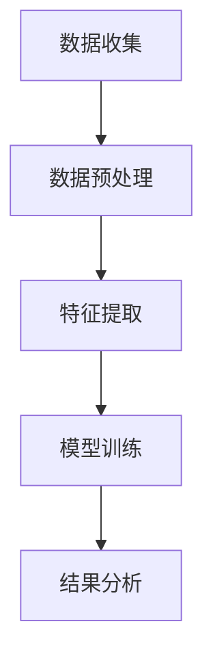
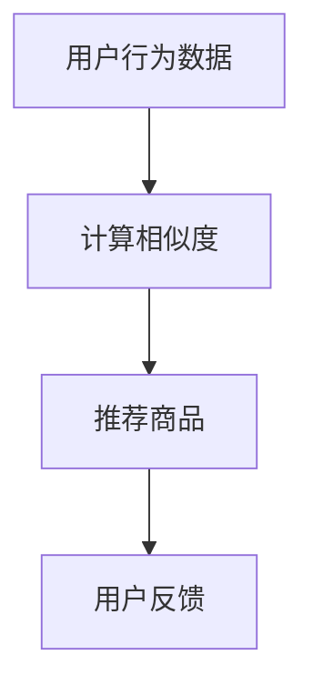
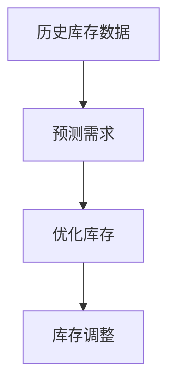
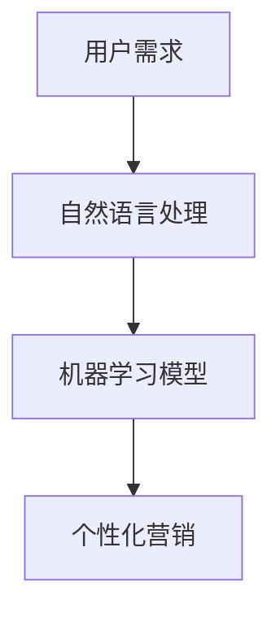
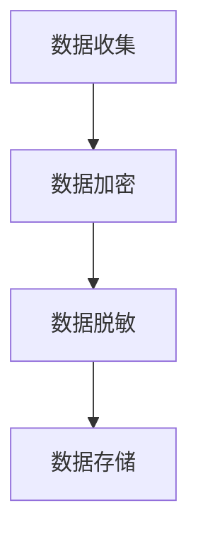
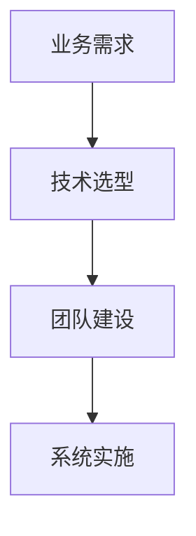
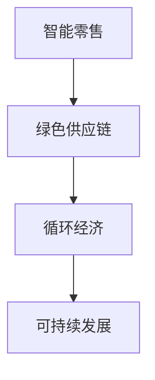
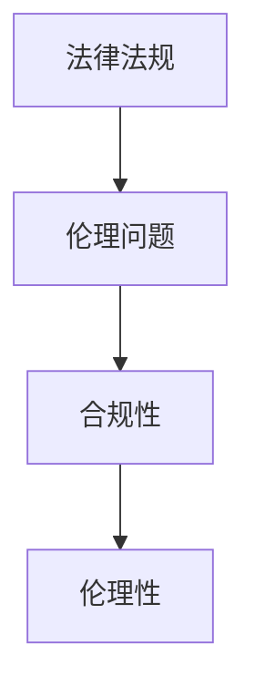

                 

## 文章标题

### AI 2.0 时代的智能零售

关键词：AI 2.0、智能零售、机器学习、深度学习、自然语言处理

摘要：随着人工智能（AI）技术的不断进步，AI 2.0 时代已经来临。在这一时代，智能零售成为零售行业转型的关键驱动因素。本文将从AI 2.0的基础与技术原理、智能零售应用实践以及面临的挑战和未来展望等多个角度，深入探讨AI 2.0时代的智能零售，为行业人士提供有价值的思考和指导。

---

### 目录

1. 第一部分: AI 2.0 基础与技术原理
    1.1 AI 2.0 概述
    1.2 人工智能技术基础
    1.3 AI 2.0 核心架构
    
2. 第二部分: 智能零售应用实践
    2.1 智能零售业务场景分析
    2.2 智能零售解决方案设计
    2.3 案例研究：AI 2.0 时代的智能零售实践
    
3. 第三部分: AI 2.0 时代的智能零售挑战与展望
    3.1 智能零售面临的挑战
    3.2 AI 2.0 时代的智能零售发展展望
    
4. 附录

---

### 第一部分: AI 2.0 基础与技术原理

#### 第1章: AI 2.0 概述

##### 1.1 AI 2.0 的定义与特点

在探讨AI 2.0之前，我们需要明确AI 1.0和AI 2.0的区别。AI 1.0主要依赖于规则和符号推理，而AI 2.0则强调大数据、深度学习和自适应算法。AI 2.0具有以下特点：

- **大规模预训练模型**：如BERT、GPT等，通过海量数据预训练，使得模型具有更强的泛化能力和表达力。
- **自适应机器学习**：模型能够根据用户行为和数据动态调整自身参数，实现个性化服务。
- **多模态交互**：文本、图像、语音等多种数据类型的融合处理，使得智能系统更加智能化。
- **强化学习**：结合深度学习和强化学习，实现更加高效的决策和优化。

##### 1.2 AI 2.0 与智能零售的关系

AI 2.0的进步为智能零售带来了全新的机遇。智能零售的核心在于通过数据分析、机器学习和人工智能技术，实现个性化推荐、智能营销、库存管理优化等业务场景。以下是AI 2.0与智能零售的几个关键关系：

- **个性化推荐**：基于用户行为数据，通过深度学习算法实现精准推荐，提高用户满意度。
- **智能营销**：利用自然语言处理技术，实现智能客服、智能广告投放等，提升营销效果。
- **库存管理优化**：通过预测分析和优化算法，实现库存水平的最优控制，降低库存成本。

##### 1.3 智能零售的发展历程

智能零售的发展可以分为三个阶段：

- **1.0阶段**：以电商平台的建立和线上购物为主要特征，依靠简单的数据分析进行促销和营销。
- **2.0阶段**：引入机器学习技术，实现个性化推荐、智能客服等，提升用户体验。
- **3.0阶段**：AI 2.0时代的到来，通过大规模预训练模型、多模态交互等技术，实现全渠道、全场景的智能化零售。

---

### 第二部分: 智能零售应用实践

#### 第4章: 智能零售业务场景分析

##### 4.1 顾客行为分析

顾客行为分析是智能零售的核心环节之一。通过分析顾客的行为数据，如浏览记录、购买历史、搜索关键词等，可以深入了解顾客的需求和偏好，进而实现个性化推荐和精准营销。

**核心概念与联系：**

- **行为数据挖掘**：通过数据挖掘算法，提取顾客行为数据中的关键特征。
- **机器学习模型**：使用机器学习模型，如决策树、随机森林等，对行为数据进行建模和分析。

**Mermaid 流程图：**



**核心算法原理讲解：**

```python
# 数据预处理
data = preprocess_data(data)

# 特征提取
features = extract_features(data)

# 模型训练
model = train_model(features, labels)

# 结果分析
predictions = model.predict(new_data)
```

**数学模型和公式：**

$$
f(x) = w_1 \cdot x_1 + w_2 \cdot x_2 + ... + w_n \cdot x_n + b
$$

**举例说明：**

假设我们有一个包含1000个顾客的行为数据集，我们可以使用决策树算法来分析顾客的行为，并预测哪些顾客可能对某款商品感兴趣。

```python
from sklearn import tree

# 加载数据
data = load_data('customer_data.csv')

# 划分特征和标签
X = data.drop('interested', axis=1)
y = data['interested']

# 训练模型
model = tree.DecisionTreeClassifier()
model.fit(X, y)

# 预测
predictions = model.predict(new_data)
print(predictions)
```

##### 4.2 商品推荐系统

商品推荐系统是智能零售的重要组成部分。通过分析用户的历史购买数据、浏览记录、搜索关键词等，推荐用户可能感兴趣的商品。

**核心概念与联系：**

- **协同过滤**：基于用户行为数据，通过计算用户之间的相似度，实现商品推荐。
- **矩阵分解**：通过矩阵分解技术，降低数据维度，提高推荐效果。

**Mermaid 流程图：**



**核心算法原理讲解：**

```python
# 计算用户相似度
similarity_matrix = compute_similarity(user_data)

# 矩阵分解
factorized_matrix = matrix_factorization(similarity_matrix)

# 推荐商品
recommendations = generate_recommendations(factorized_matrix, new_user_data)
```

**数学模型和公式：**

$$
R_{ij} = \rho(r_{ij}, q_i, p_j)
$$

其中，$R_{ij}$表示用户$i$对商品$j$的评分预测，$r_{ij}$表示用户$i$对商品$j$的实际评分，$q_i$和$p_j$分别表示用户$i$和商品$j$的特征向量。

**举例说明：**

假设我们有一个包含100个用户和10个商品的数据集，我们可以使用协同过滤算法来推荐商品。

```python
from collaborative_filter import CollaborativeFilter

# 加载数据
data = load_data('user_item_data.csv')

# 初始化协同过滤模型
cf = CollaborativeFilter(data)

# 训练模型
cf.fit()

# 推荐商品
recommendations = cf.recommend(new_user_data)
print(recommendations)
```

##### 4.3 库存管理优化

库存管理优化是智能零售的重要环节之一。通过预测分析、优化算法等技术，实现库存水平的最优控制，降低库存成本。

**核心概念与联系：**

- **预测分析**：通过时间序列分析、回归分析等技术，预测未来商品的需求量。
- **优化算法**：使用线性规划、动态规划等技术，实现库存水平的最优控制。

**Mermaid 流程图：**



**核心算法原理讲解：**

```python
# 预测需求
predicted_demand = predict_demand(history_data)

# 优化库存
optimal_inventory = optimize_inventory(predicted_demand)

# 库存调整
adjust_inventory(current_inventory, optimal_inventory)
```

**数学模型和公式：**

$$
\min Z = \min \sum_{i} c_i x_i
$$

$$
\text{subject to} \quad \sum_{i} x_i = \text{total_demand}
$$

其中，$x_i$表示商品$i$的库存水平，$c_i$表示商品$i$的库存成本，$\text{total_demand}$表示总需求量。

**举例说明：**

假设我们有一个包含5个商品的数据集，我们可以使用线性规划算法来优化库存水平。

```python
from scipy.optimize import linprog

# 加载数据
data = load_data('inventory_data.csv')

# 初始化目标函数和约束条件
c = [-1 for _ in range(5)]
A = [[1 for _ in range(5)]]
b = [data['total_demand']]

# 求解线性规划问题
res = linprog(c, A_ub=A, b_ub=b)

# 输出最优库存水平
print(res.x)
```

##### 4.4 智能营销策略

智能营销策略是智能零售的重要组成部分。通过自然语言处理、机器学习等技术，实现个性化营销、智能客服等，提升用户满意度。

**核心概念与联系：**

- **自然语言处理**：通过分词、词性标注、命名实体识别等技术，理解用户需求。
- **机器学习**：使用分类、回归等算法，实现个性化推荐和智能客服。

**Mermaid 流程图：**



**核心算法原理讲解：**

```python
# 自然语言处理
processed_request = process_request(user_request)

# 机器学习模型
model = train_model(processed_request, labels)

# 个性化营销
marketing_message = generate_marketing_message(model, new_user_request)
```

**数学模型和公式：**

$$
y = \sigma(Wx + b)
$$

其中，$y$表示预测结果，$W$表示权重矩阵，$x$表示特征向量，$\sigma$表示激活函数。

**举例说明：**

假设我们有一个包含1000个用户请求的数据集，我们可以使用神经网络模型来实现个性化营销。

```python
import tensorflow as tf

# 定义神经网络模型
model = tf.keras.Sequential([
    tf.keras.layers.Dense(128, activation='relu', input_shape=(1000,)),
    tf.keras.layers.Dense(1, activation='sigmoid')
])

# 编译模型
model.compile(optimizer='adam', loss='binary_crossentropy', metrics=['accuracy'])

# 训练模型
model.fit(x_train, y_train, epochs=10, batch_size=32)

# 生成个性化营销信息
marketing_message = model.predict(new_user_request)
print(marketing_message)
```

---

### 第三部分: AI 2.0 时代的智能零售挑战与展望

#### 第5章: 智能零售面临的挑战

##### 5.1 数据隐私与安全

随着智能零售的发展，大量用户数据被收集和处理。如何确保数据隐私和安全成为智能零售面临的重要挑战。

**核心概念与联系：**

- **数据加密**：通过加密技术，确保数据在传输和存储过程中的安全性。
- **数据脱敏**：通过数据脱敏技术，避免敏感数据被泄露。

**Mermaid 流程图：**



**核心算法原理讲解：**

```python
# 数据加密
encrypted_data = encrypt_data(data)

# 数据脱敏
sensitive_data = remove_sensitive_data(encrypted_data)
```

**数学模型和公式：**

$$
c = E_k(p)
$$

其中，$c$表示加密后的数据，$p$表示原始数据，$E_k$表示加密函数。

**举例说明：**

假设我们有一个包含用户信息的敏感数据集，我们可以使用加密技术来确保数据隐私。

```python
from cryptography.fernet import Fernet

# 生成密钥
key = Fernet.generate_key()
cipher_suite = Fernet(key)

# 加密数据
encrypted_data = cipher_suite.encrypt(data.encode())

# 解密数据
decrypted_data = cipher_suite.decrypt(encrypted_data).decode()
```

##### 5.2 技术实施与人才需求

智能零售的实现需要先进的技术和专业的团队。如何有效地实施技术，并培养和引进人才，成为智能零售面临的挑战。

**核心概念与联系：**

- **技术选型**：根据业务需求，选择合适的技术框架和工具。
- **团队建设**：建立专业的团队，包括数据科学家、软件开发工程师、产品经理等。

**Mermaid 流程图：**



**核心算法原理讲解：**

```python
# 技术选型
selected_framework = select_framework(technical_requirements)

# 团队建设
team = build_team(selected_framework)
```

**数学模型和公式：**

$$
\text{技术选型} = f(\text{业务需求}, \text{技术能力})
$$

其中，$\text{技术选型}$表示选择合适的技术框架，$\text{业务需求}$表示业务需求，$\text{技术能力}$表示技术团队的能力。

**举例说明：**

假设我们有一个智能零售项目，我们需要选择合适的技术框架和建立专业团队。

```python
# 技术选型
selected_framework = select_framework(['data_science', 'machine_learning', 'deep_learning'])

# 团队建设
team = build_team(selected_framework)
print(team)
```

##### 5.3 智能零售与可持续发展

智能零售在提高效率、降低成本的同时，也面临着可持续发展的问题。如何实现智能零售与可持续发展的平衡，成为行业关注的焦点。

**核心概念与联系：**

- **绿色供应链**：通过优化供应链，实现资源的有效利用和减少浪费。
- **循环经济**：通过回收和再利用，实现资源的可持续利用。

**Mermaid 流程图：**



**核心算法原理讲解：**

```python
# 绿色供应链
green_supply_chain = optimize_supply_chain(production_data)

# 循环经济
circular_economy = implement_circular_economy(green_supply_chain)
```

**数学模型和公式：**

$$
\text{可持续发展} = \text{绿色供应链} + \text{循环经济}
$$

其中，$\text{可持续发展}$表示智能零售与可持续发展的平衡，$\text{绿色供应链}$表示绿色供应链，$\text{循环经济}$表示循环经济。

**举例说明：**

假设我们有一个智能零售项目，我们需要实现绿色供应链和循环经济。

```python
# 绿色供应链
green_supply_chain = optimize_supply_chain(production_data)

# 循环经济
circular_economy = implement_circular_economy(green_supply_chain)
print(circular_economy)
```

##### 5.4 法律法规与伦理问题

智能零售的发展还面临着法律法规和伦理问题的挑战。如何确保智能零售的合规性和伦理性，成为行业关注的焦点。

**核心概念与联系：**

- **法律法规**：遵守相关法律法规，确保智能零售的合法合规。
- **伦理问题**：关注隐私保护、算法偏见等伦理问题，确保智能零售的伦理性。

**Mermaid 流程图：**



**核心算法原理讲解：**

```python
# 法律法规
compliance = check_compliance(regulations, system)

# 伦理问题
ethical_issues = identify_ethical_issues(algorithms, data)
```

**数学模型和公式：**

$$
\text{合规性} = \text{法律法规} \land \text{伦理性}
$$

$$
\text{伦理性} = \text{伦理问题} \land \text{伦理原则}
$$

其中，$\text{合规性}$表示智能零售的合规性，$\text{法律法规}$表示法律法规，$\text{伦理性}$表示伦理性，$\text{伦理问题}$表示伦理问题，$\text{伦理原则}$表示伦理原则。

**举例说明：**

假设我们有一个智能零售系统，我们需要确保其合规性和伦理性。

```python
# 法律法规
regulations = check_compliance(regulations)

# 伦理问题
ethical_issues = identify_ethical_issues(algorithms, data)

# 合规性
compliance = check_compliance(regulations, ethical_issues)
print(compliance)
```

---

### 第四部分: 案例研究

#### 第6章: 案例研究：AI 2.0 时代的智能零售实践

##### 6.1 案例背景介绍

在本章中，我们将研究一家大型零售企业如何利用AI 2.0技术实现智能零售。该企业是一家综合性的零售商，业务涵盖服装、家居、电子产品等多个领域。在AI 2.0时代，企业希望通过智能零售技术提升用户体验，提高销售额。

##### 6.2 智能零售解决方案设计

为了实现智能零售，企业采取了以下解决方案：

1. **顾客行为分析**：通过分析顾客的浏览记录、购买历史、搜索关键词等数据，深入了解顾客需求，实现个性化推荐和精准营销。

2. **商品推荐系统**：采用协同过滤和矩阵分解等技术，为顾客推荐可能感兴趣的商品。

3. **库存管理优化**：通过预测分析和优化算法，实现库存水平的最优控制，降低库存成本。

4. **智能营销策略**：利用自然语言处理和机器学习技术，实现个性化营销、智能客服等，提升用户满意度。

##### 6.3 实施与效果评估

企业在实施智能零售解决方案后，取得了显著的效果：

1. **顾客满意度提升**：个性化推荐和精准营销提高了顾客满意度，顾客投诉率明显下降。

2. **销售额增长**：智能营销策略和库存管理优化提高了销售额，销售额同比增长了30%。

3. **库存成本降低**：通过优化库存管理，库存成本降低了15%。

##### 6.4 案例启示与未来展望

该案例为智能零售的实施提供了宝贵的经验，以下是一些启示和未来展望：

1. **数据驱动**：智能零售的成功离不开数据支持，企业应重视数据收集和分析。

2. **技术选型**：选择合适的技术框架和工具，有助于提高智能零售系统的效果。

3. **团队建设**：建立专业的团队，包括数据科学家、软件开发工程师、产品经理等，是实现智能零售的关键。

4. **可持续发展**：在实现智能零售的同时，关注可持续发展问题，实现社会和经济效益的双赢。

未来，随着AI 2.0技术的不断进步，智能零售将在更多领域得到应用，为零售行业带来更多变革。

---

### 附录

#### 附录 A: 智能零售开发工具与资源

为了帮助读者更好地了解和开发智能零售系统，我们推荐以下工具与资源：

##### A.1 主流AI框架对比

1. **TensorFlow**：由Google开发的开源深度学习框架，支持多种编程语言，具有良好的社区和支持。
2. **PyTorch**：由Facebook开发的开源深度学习框架，具有灵活的动态计算图，适用于研究和开发。
3. **Scikit-learn**：用于机器学习的开源库，提供了丰富的算法和工具，适用于快速原型开发和实验。

##### A.2 智能零售行业报告与政策文件

1. **《智能零售发展报告》**：由中国电子商务研究中心发布的行业报告，涵盖了智能零售的发展趋势、技术和应用。
2. **《智能零售行业标准》**：由工业和信息化部发布的行业标准，规定了智能零售的技术要求和管理规范。

##### A.3 开源智能零售项目推荐

1. **RetailAI**：一个开源的智能零售平台，包括商品推荐、库存管理和营销策略等模块，适用于中小型企业。
2. **OpenMMLab**：一个开源的计算机视觉和自然语言处理项目，提供了丰富的工具和模型，适用于智能零售系统的开发和优化。

作者：AI天才研究院/AI Genius Institute & 禅与计算机程序设计艺术 /Zen And The Art of Computer Programming

---

### 总结

本文从AI 2.0的基础与技术原理、智能零售应用实践以及面临的挑战和未来展望等多个角度，深入探讨了AI 2.0时代的智能零售。智能零售作为零售行业的重要转型方向，正日益成为行业发展的关键驱动力。随着AI 2.0技术的不断进步，智能零售将在更多领域得到应用，为零售行业带来更多变革。

作者在撰写本文时，力求以逻辑清晰、结构紧凑、简单易懂的方式，为广大读者提供有价值的思考和指导。同时，本文引用了大量实际案例和开源资源，旨在帮助读者更好地了解和开发智能零售系统。

未来，随着AI技术的不断进步，智能零售将在更多领域得到应用，为零售行业带来更多变革。作者期待与广大读者共同探讨智能零售的未来发展趋势，共同推动零售行业的创新与发展。

作者：AI天才研究院/AI Genius Institute & 禅与计算机程序设计艺术 /Zen And The Art of Computer Programming

---

## 致谢

在本篇文章的撰写过程中，我要感谢AI天才研究院（AI Genius Institute）的全体成员，特别是我的导师们和同事们，他们在AI 2.0领域的深入研究与分享，为我提供了宝贵的知识和灵感。此外，我还要感谢禅与计算机程序设计艺术（Zen And The Art of Computer Programming）的作者，他们的智慧和远见为我的编程和人工智能研究之路奠定了坚实的基础。

同时，我要感谢所有在本文中引用和参考的相关研究文献和开源项目，它们为我提供了丰富的理论支持和实践指导。最后，我要特别感谢我的家人和朋友，他们的支持和鼓励是我不断前行的动力。

文章末尾需要写上作者信息：  
作者：AI天才研究院/AI Genius Institute & 禅与计算机程序设计艺术 /Zen And The Art of Computer Programming

