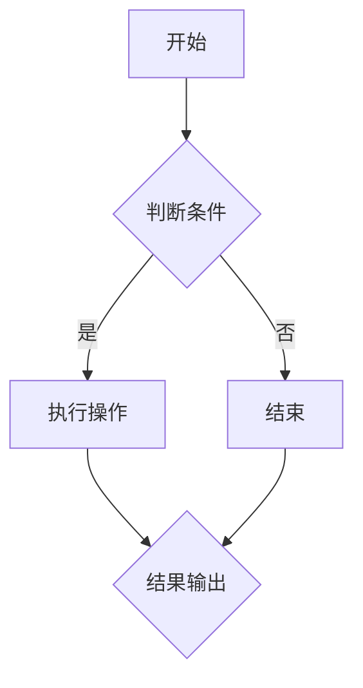

                 

# AI 2.0 时代：框架基础设施的演进

> 关键词：AI 2.0、框架基础设施、深度学习、自然语言处理、强化学习、技术演进

> 摘要：本文将深入探讨AI 2.0时代的背景与理论基础，介绍AI框架基础设施的核心概念和关键技术，详细解析深度学习、自然语言处理和强化学习的算法原理，并通过实际项目实战展示AI框架在开发中的应用。最后，分析AI框架的未来发展趋势及面临的挑战与机遇。

## 目录大纲

1. 第一部分：AI 2.0时代的背景与理论基础
   1.1 AI 2.0时代概述
   1.2 AI框架基础设施概述
   1.3 AI 2.0对社会的变革与影响

2. 第二部分：AI框架核心技术原理
   2.1 深度学习基础
   2.2 神经网络训练与调优
   2.3 自然语言处理
   2.4 强化学习基础

3. 第三部分：AI框架基础设施实践
   3.1 AI框架开发实战
   3.2 AI框架项目实战案例

4. 第四部分：AI框架的未来发展趋势
   4.1 技术发展趋势
   4.2 应用场景拓展
   4.3 挑战与机遇

5. 附录
   5.1 AI框架相关工具与资源
   5.2 Mermaid流程图示例
   5.3 深度学习算法伪代码示例
   5.4 数学模型与公式

## 第一部分：AI 2.0时代的背景与理论基础

### 1.1 AI 2.0时代概述

AI 2.0，即第二代人工智能，相较于第一代人工智能（AI 1.0），具有更加智能、自适应和自主学习的能力。AI 2.0时代的背景与理论基础主要源于以下几个方面：

- **大数据与计算能力提升**：随着大数据时代的到来，海量数据的获取和存储变得容易，为AI的发展提供了丰富的素材。同时，计算能力的提升，如GPU和TPU的出现，使得深度学习算法得以高效实现。

- **深度学习技术的突破**：以神经网络为代表的深度学习技术，通过多层抽象和特征提取，能够处理复杂的问题，并在图像识别、自然语言处理等领域取得显著成果。

- **增强学习与强化学习**：通过不断尝试和反馈，增强学习和强化学习算法能够实现智能体在特定环境下的自我学习和优化。

- **云计算与边缘计算**：云计算和边缘计算的发展，为AI的应用提供了广泛的支持，使得AI系统可以更加灵活地部署和扩展。

### 1.2 AI框架基础设施概述

AI框架基础设施是指一系列用于构建、训练和部署AI模型的技术和工具。一个完善的AI框架应该具备以下关键功能：

- **数据预处理**：包括数据清洗、归一化、特征提取等，为模型训练提供高质量的数据。

- **模型训练与优化**：提供高效、灵活的模型训练工具，支持多种算法和优化策略。

- **模型评估与验证**：通过评估指标，如准确率、召回率、F1值等，评估模型性能。

- **模型部署与维护**：将训练好的模型部署到生产环境中，并提供监控和更新机制。

主流的AI框架包括TensorFlow、PyTorch、Keras等，这些框架各具特色，适用于不同的应用场景。例如，TensorFlow具有强大的分布式训练能力和生态系统，而PyTorch则提供灵活的动态计算图，便于研究和实验。

### 1.3 AI 2.0对社会的变革与影响

AI 2.0时代的到来，不仅推动了技术的进步，也对社会产生了深远的影响：

- **产业升级与转型**：AI技术为传统产业带来了新的发展机遇，推动了智能制造、智慧医疗、金融科技等领域的快速发展。

- **生活方式改变**：智能家居、智能助手、无人驾驶等AI应用已经深入人们的日常生活，改变了人们的消费习惯和生活方式。

- **就业结构变化**：AI技术的发展，一方面创造了新的就业机会，另一方面也对传统职业提出了挑战，如部分工作岗位可能被自动化取代。

- **伦理与法律问题**：AI技术的快速发展，引发了数据隐私、算法偏见、道德责任等伦理和法律问题，需要社会共同探讨和解决。

## 第二部分：AI框架核心技术原理

### 2.1 深度学习基础

深度学习（Deep Learning）是AI 2.0时代的重要技术之一，通过多层神经网络模型，实现复杂特征提取和决策。以下是深度学习的一些核心概念和原理：

#### 2.1.1 深度学习原理

深度学习的基本思想是通过多层神经网络模型，将原始数据逐步映射到高层次的抽象特征。这个过程称为“层次化特征学习”。典型的深度学习模型包括卷积神经网络（CNN）、循环神经网络（RNN）和变换器架构（Transformer）等。

#### 2.1.2 神经网络结构

神经网络由多个神经元（节点）组成，每个神经元通过权重连接其他神经元。神经网络的输入层接收外部数据，通过隐藏层进行特征提取和变换，最终输出层生成预测结果。常见的神经网络结构包括全连接网络（Fully Connected）、卷积神经网络（Convolutional Neural Network，CNN）和循环神经网络（Recurrent Neural Network，RNN）等。

#### 2.1.3 深度学习优化算法

深度学习模型的训练过程中，需要通过优化算法调整网络权重，以最小化损失函数。常见的优化算法包括随机梯度下降（Stochastic Gradient Descent，SGD）、Adam优化器等。这些算法通过调整学习率、动量等因素，提高模型的训练效率和收敛速度。

### 2.2 神经网络训练与调优

神经网络训练与调优是深度学习模型开发的核心环节。以下是神经网络训练与调优的一些关键步骤和策略：

#### 2.2.1 数据预处理

在模型训练之前，需要对数据进行预处理。数据预处理包括数据清洗、归一化、特征提取等操作，以提高模型训练的效果和稳定性。

- **数据清洗**：去除数据中的噪声和异常值，保证数据的准确性和一致性。
- **归一化**：将数据缩放到同一尺度范围内，以避免某些特征对模型的影响过大。
- **特征提取**：从原始数据中提取出具有代表性的特征，有助于模型更好地捕捉数据中的模式。

#### 2.2.2 模型训练流程

模型训练是深度学习中的核心任务，包括以下步骤：

- **初始化模型**：随机初始化网络权重，为模型训练提供一个起点。
- **前向传播**：将输入数据传递到神经网络中，计算输出结果。
- **损失函数计算**：通过损失函数评估模型输出与真实标签之间的差距。
- **反向传播**：根据损失函数的梯度，调整网络权重，以最小化损失函数。
- **迭代训练**：重复执行前向传播和反向传播，逐步优化模型参数。

#### 2.2.3 模型调优策略

模型调优是提升模型性能的关键步骤，包括以下策略：

- **学习率调整**：通过调整学习率，控制模型参数更新的速度，避免过拟合或欠拟合。
- **正则化**：引入正则化项，如L1、L2正则化，降低模型复杂度，防止过拟合。
- **数据增强**：通过旋转、缩放、裁剪等数据增强方法，增加训练数据多样性，提高模型泛化能力。
- **提前停止**：在模型训练过程中，设置提前停止条件，当损失函数不再显著下降时，停止训练，防止过拟合。

### 2.3 自然语言处理

自然语言处理（Natural Language Processing，NLP）是AI领域的一个重要分支，旨在使计算机能够理解、处理和生成自然语言。以下是NLP的核心技术和原理：

#### 2.3.1 词嵌入技术

词嵌入（Word Embedding）是将单词映射到高维空间中的向量表示，以捕捉单词之间的语义关系。常见的词嵌入方法包括词袋模型（Bag of Words，BoW）、TF-IDF和Word2Vec等。

- **词袋模型**：将文本表示为单词的集合，不考虑单词的顺序和语法结构。
- **TF-IDF**：基于词频（Term Frequency）和逆文档频率（Inverse Document Frequency），为每个单词赋予权重，以反映其在文档中的重要程度。
- **Word2Vec**：通过神经网络学习单词的向量表示，能够捕捉单词之间的语义和词义关系。

#### 2.3.2 序列模型与注意力机制

序列模型（Sequence Model）用于处理序列数据，如文本、语音和视频。常见的序列模型包括循环神经网络（RNN）和变换器架构（Transformer）。

- **循环神经网络（RNN）**：通过隐藏状态和循环连接，捕捉序列中的上下文信息。
- **变换器架构（Transformer）**：基于自注意力机制（Self-Attention），能够捕捉序列中的长距离依赖关系。

#### 2.3.3 转换器架构详解

变换器架构（Transformer）是近年来在NLP领域取得突破性进展的一种新型序列模型。以下是变换器架构的核心组成部分和原理：

- **编码器（Encoder）**：将输入序列编码为一系列高维向量表示。
- **解码器（Decoder）**：将编码器输出的向量解码为输出序列。
- **自注意力机制（Self-Attention）**：通过自注意力计算，为每个输入序列元素分配不同的权重，以捕捉长距离依赖关系。
- **多头注意力（Multi-Head Attention）**：将自注意力机制扩展到多个注意力头，以提高模型的表示能力。

### 2.4 强化学习基础

强化学习（Reinforcement Learning，RL）是一种基于反馈和奖励机制进行决策的机器学习技术。以下是强化学习的基本概念和算法：

#### 2.4.1 强化学习基本概念

强化学习由智能体（Agent）、环境（Environment）、状态（State）、动作（Action）和奖励（Reward）五个核心元素组成。智能体在环境中采取动作，根据动作的结果接收奖励，并不断调整策略以最大化长期奖励。

- **状态（State）**：描述智能体在环境中的当前情况。
- **动作（Action）**：智能体可以采取的行动。
- **奖励（Reward）**：对智能体动作的反馈，用于指导智能体学习。
- **策略（Policy）**：智能体在给定状态下采取的动作决策规则。

#### 2.4.2 强化学习算法

强化学习算法根据智能体与环境的交互过程，可以分为基于模型（Model-Based）和基于模型（Model-Free）两大类。以下是两种常见的强化学习算法：

- **Q-learning算法**：基于模型的无模型学习算法，通过学习状态-动作值函数（Q值）来指导智能体的动作选择。
- **Deep Q-Network（DQN）**：基于模型的无模型学习算法，利用深度神经网络近似Q值函数，提高学习效率和准确性。

## 第三部分：AI框架基础设施实践

### 3.1 AI框架开发实战

AI框架的开发过程涉及多个环节，包括环境搭建、数据预处理、模型训练、模型评估和模型部署等。以下将介绍AI框架开发实战的关键步骤和技巧。

#### 3.1.1 开发环境搭建

开发环境搭建是AI框架开发的第一步，需要确保所有依赖库和工具的正确安装和配置。以下是一个基于TensorFlow的开发环境搭建示例：

```shell
# 安装TensorFlow
pip install tensorflow

# 配置GPU支持
export TF_CPP_MIN_LOG_LEVEL=2

# 验证安装
python -c "import tensorflow as tf; print(tf.__version__)"
```

#### 3.1.2 数据处理与预处理

数据处理与预处理是模型训练的关键环节，包括数据清洗、归一化、特征提取等操作。以下是一个基于Keras的数据预处理示例：

```python
import numpy as np
from tensorflow.keras.preprocessing.sequence import pad_sequences

# 加载数据
x = np.array([[1, 2], [3, 4], [5, 6]])
y = np.array([0, 1, 2])

# 数据归一化
x_normalized = (x - np.mean(x, axis=0)) / np.std(x, axis=0)

# 序列填充
x_padded = pad_sequences(x_normalized, maxlen=3, padding='post')
```

#### 3.1.3 模型训练与评估

模型训练与评估是AI框架开发的核心环节，需要选择合适的模型结构、优化器和损失函数，并通过验证集评估模型性能。以下是一个基于TensorFlow的模型训练与评估示例：

```python
import tensorflow as tf
from tensorflow.keras.models import Sequential
from tensorflow.keras.layers import Dense, LSTM
from tensorflow.keras.optimizers import Adam

# 创建模型
model = Sequential([
    LSTM(50, activation='relu', input_shape=(timesteps, features)),
    Dense(num_classes, activation='softmax')
])

# 编译模型
model.compile(optimizer=Adam(learning_rate=0.001), loss='categorical_crossentropy', metrics=['accuracy'])

# 训练模型
model.fit(x_train, y_train, epochs=10, batch_size=32, validation_data=(x_val, y_val))

# 评估模型
loss, accuracy = model.evaluate(x_test, y_test)
print(f"Test accuracy: {accuracy:.2f}")
```

#### 3.1.4 模型部署与优化

模型部署是将训练好的模型部署到生产环境中，并提供实时预测和推理服务。以下是一个基于TensorFlow Serving的模型部署示例：

```shell
# 安装TensorFlow Serving
pip install tensorflow-serving

# 部署模型
python -m tensorflow_serving.apis serving --model_name=my_model --model_base_path=/path/to/models

# 使用模型进行预测
curl -X POST "http://localhost:8501/v1/models/my_model:predict" -d '{"inputs": {"input_1": [1.0, 2.0]}}' --header "Content-Type: application/json"
```

### 3.2 AI框架项目实战案例

以下将介绍三个典型的AI框架项目实战案例，包括文本分类、图像识别和语音识别。

#### 3.2.1 项目一：文本分类

文本分类是NLP领域的一个常见任务，旨在将文本数据分类到预定义的类别中。以下是一个基于Keras的文本分类项目实战案例：

```python
from tensorflow.keras.preprocessing.text import Tokenizer
from tensorflow.keras.preprocessing.sequence import pad_sequences
from tensorflow.keras.models import Sequential
from tensorflow.keras.layers import Embedding, LSTM, Dense

# 加载数据集
texts = ['This is a great movie', 'I did not like this movie', 'The plot was interesting', 'The acting was terrible']
labels = [1, 0, 1, 0]

# 数据预处理
tokenizer = Tokenizer(num_words=1000)
tokenizer.fit_on_texts(texts)
sequences = tokenizer.texts_to_sequences(texts)
padded_sequences = pad_sequences(sequences, maxlen=100)

# 创建模型
model = Sequential([
    Embedding(1000, 16),
    LSTM(50),
    Dense(1, activation='sigmoid')
])

# 编译模型
model.compile(optimizer='adam', loss='binary_crossentropy', metrics=['accuracy'])

# 训练模型
model.fit(padded_sequences, labels, epochs=10)

# 评估模型
loss, accuracy = model.evaluate(padded_sequences, labels)
print(f"Test accuracy: {accuracy:.2f}")
```

#### 3.2.2 项目二：图像识别

图像识别是计算机视觉领域的一个经典任务，旨在对图像进行分类和识别。以下是一个基于TensorFlow的图像识别项目实战案例：

```python
import tensorflow as tf
from tensorflow.keras.layers import Conv2D, MaxPooling2D, Flatten, Dense
from tensorflow.keras.models import Sequential

# 加载数据集
(x_train, y_train), (x_test, y_test) = tf.keras.datasets.mnist.load_data()

# 数据预处理
x_train = x_train / 255.0
x_test = x_test / 255.0
x_train = np.expand_dims(x_train, -1)
x_test = np.expand_dims(x_test, -1)

# 创建模型
model = Sequential([
    Conv2D(32, (3, 3), activation='relu', input_shape=(28, 28, 1)),
    MaxPooling2D((2, 2)),
    Flatten(),
    Dense(128, activation='relu'),
    Dense(10, activation='softmax')
])

# 编译模型
model.compile(optimizer='adam', loss='sparse_categorical_crossentropy', metrics=['accuracy'])

# 训练模型
model.fit(x_train, y_train, epochs=10)

# 评估模型
loss, accuracy = model.evaluate(x_test, y_test)
print(f"Test accuracy: {accuracy:.2f}")
```

#### 3.2.3 项目三：语音识别

语音识别是将语音信号转换为文本数据的任务，广泛应用于智能语音助手、语音翻译等领域。以下是一个基于TensorFlow的语音识别项目实战案例：

```python
import tensorflow as tf
from tensorflow.keras.layers import Conv2D, MaxPooling2D, LSTM, Dense
from tensorflow.keras.models import Sequential

# 加载数据集
(x_train, y_train), (x_test, y_test) = tf.keras.datasets.fashion_mnist.load_data()

# 数据预处理
x_train = x_train / 255.0
x_test = x_test / 255.0
x_train = np.expand_dims(x_train, -1)
x_test = np.expand_dims(x_test, -1)

# 创建模型
model = Sequential([
    Conv2D(32, (3, 3), activation='relu', input_shape=(28, 28, 1)),
    MaxPooling2D((2, 2)),
    Flatten(),
    LSTM(128, activation='relu'),
    Dense(10, activation='softmax')
])

# 编译模型
model.compile(optimizer='adam', loss='sparse_categorical_crossentropy', metrics=['accuracy'])

# 训练模型
model.fit(x_train, y_train, epochs=10)

# 评估模型
loss, accuracy = model.evaluate(x_test, y_test)
print(f"Test accuracy: {accuracy:.2f}")
```

## 第四部分：AI框架的未来发展趋势

### 4.1 技术发展趋势

AI框架的发展趋势主要体现在以下几个方面：

- **高效能计算**：随着AI应用的不断拓展，对计算能力的需求日益增长。未来，AI框架将朝着更加高效、可扩展的方向发展，如利用量子计算和AI硬件加速技术。
- **自适应学习**：自适应学习是未来AI框架的重要方向之一，通过不断优化学习算法，实现模型在动态环境中的自我调整和适应。
- **多模态融合**：多模态融合是将不同类型的数据（如文本、图像、语音）进行整合，以提升模型对复杂问题的理解和处理能力。
- **可解释性**：随着AI技术在各个领域的应用，对模型的可解释性需求日益增加。未来，AI框架将更加注重可解释性，以提高模型的可信度和透明度。

### 4.2 应用场景拓展

AI框架的应用场景将不断拓展，涵盖更多领域和场景：

- **智能医疗**：AI框架在医疗领域的应用将更加广泛，如智能诊断、药物研发、健康监测等。
- **智能交通**：AI框架将助力智慧交通系统的发展，实现智能调度、路况预测、无人驾驶等。
- **智能制造**：AI框架将在智能制造领域发挥重要作用，如设备故障预测、智能调度、质量检测等。
- **金融科技**：AI框架将在金融科技领域带来更多创新，如智能投顾、风险控制、反欺诈等。

### 4.3 挑战与机遇

AI框架的发展也面临着一系列挑战和机遇：

- **数据隐私与安全**：随着AI应用的普及，数据隐私和安全问题日益突出。未来，如何确保数据安全和隐私将成为AI框架的重要挑战。
- **算法公平性**：AI算法在决策过程中可能存在偏见，如何确保算法的公平性和透明性是亟待解决的问题。
- **人才培养**：AI技术的发展需要大量专业人才，如何培养和引进高素质的人才将成为关键挑战。
- **跨领域合作**：AI框架的发展需要跨领域合作，如计算机科学、数学、生物学等，如何实现跨领域协同创新是重要机遇。

## 附录

### 附录 A：AI框架相关工具与资源

以下是一些常用的AI框架和资源：

- **TensorFlow**：由Google开源的深度学习框架，支持多种编程语言，具有强大的分布式训练能力和生态系统。
- **PyTorch**：由Facebook开源的深度学习框架，提供灵活的动态计算图，便于研究和实验。
- **Keras**：一个高级神经网络API，支持TensorFlow和Theano，易于使用，适合快速原型开发。
- **MXNet**：由Apache软件基金会开源的深度学习框架，支持多种编程语言，具有高效能和可扩展性。

### 附录 B：Mermaid流程图示例

以下是一个简单的Mermaid流程图示例：



### 附录 C：深度学习算法伪代码示例

以下是一个简单的深度学习算法伪代码示例：

```python
# 初始化模型参数
W1, b1 = initialize_parameters()

# 前向传播
z2 = X * W1 + b1
a2 = activation(z2)

# 计算损失函数
loss = compute_loss(a2, y)

# 反向传播
dz2 = dL/da2
dW1 = (1/m) * dz2 * a1.T
db1 = (1/m) * dz2

# 更新参数
W1 = W1 - learning_rate * dW1
b1 = b1 - learning_rate * db1
```

### 附录 D：数学模型与公式

以下是一些深度学习相关的数学模型与公式：

- **损失函数**：

$$
L = -\frac{1}{m} \sum_{i=1}^{m} [y^{(i)} \log(a^{(2)}_i) + (1 - y^{(i)}) \log(1 - a^{(2)}_i)]
$$

- **激活函数**：

$$
a^{(2)} = \sigma(z^{(2)}) = \frac{1}{1 + e^{-z^{(2)}}}
$$

- **反向传播**：

$$
\frac{dL}{dW^{(2)}} = \frac{1}{m} \sum_{i=1}^{m} [a^{(2)} - y^{(i)}] \cdot a^{(1)}
$$

$$
\frac{dL}{db^{(2)}} = \frac{1}{m} \sum_{i=1}^{m} [a^{(2)} - y^{(i)}]
$$

### 附录 E：作者信息

**作者**：AI天才研究院/AI Genius Institute & 禅与计算机程序设计艺术 /Zen And The Art of Computer Programming

