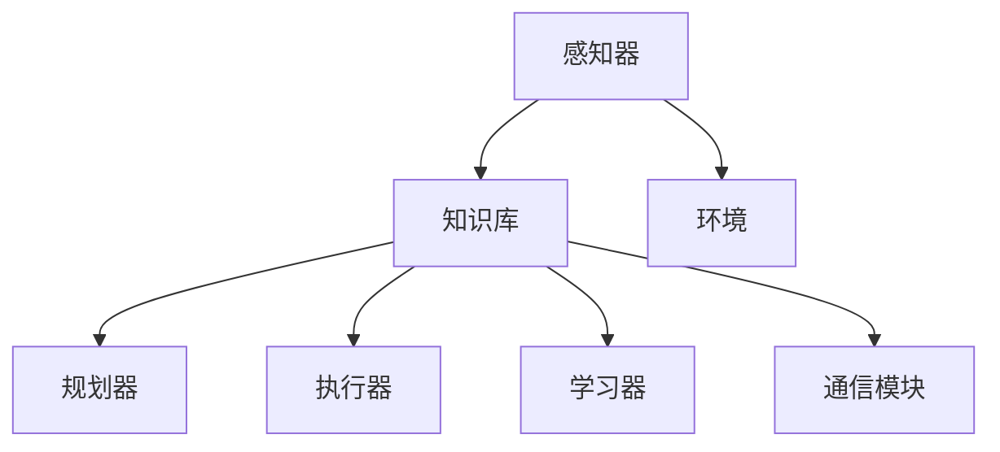
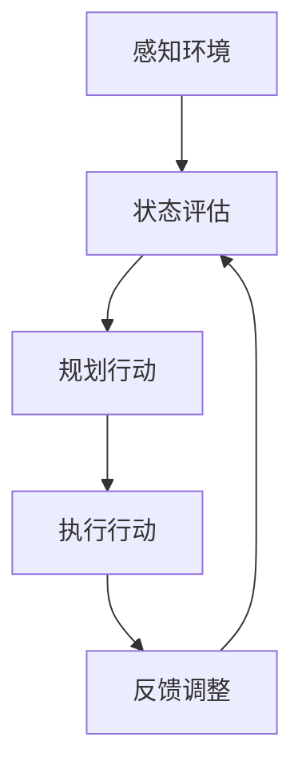

                 

### 文章标题

“AI Agent Planning 是Agent做出行动的核心决策”

### 关键词

人工智能、Agent、规划、决策、算法、行动策略、实现与应用、未来发展趋势

### 摘要

本文系统地介绍了AI Agent Planning的基本概念、算法、决策过程、行动策略、实现与应用以及未来发展趋势。通过详细的理论讲解和实际案例解析，帮助读者全面掌握AI Agent Planning的核心决策过程，为从事人工智能领域的工作者提供有力支持。文章结构紧凑，逻辑清晰，旨在让读者通过一步一步的分析和推理，深入了解AI Agent Planning的核心原理和实践应用。

## 目录大纲

1. 引言  
   1.1 AI Agent Planning的基本概念  
   1.2 AI Agent Planning的应用场景  
   1.3 本书结构安排

2. AI Agent的基本概念  
   2.1 AI Agent的定义与特点  
   2.2 AI Agent的分类  
   2.3 AI Agent的基本组件

3. AI Agent的规划算法  
   3.1 规划问题的定义  
   3.2 状态空间搜索算法  
   3.3 基于图的规划算法  
   3.4 基于模型的规划算法

4. AI Agent的决策过程  
   4.1 决策问题的定义  
   4.2 决策树算法  
   4.3 贝叶斯网络算法  
   4.4 强化学习算法

5. AI Agent的行动策略  
   5.1 行动策略的定义  
   5.2 行动策略的设计原则  
   5.3 行动策略的评估方法

6. AI Agent的实现与应用  
   6.1 AI Agent的实现技术  
   6.2 AI Agent的应用场景分析  
   6.3 AI Agent的实际案例分析

7. AI Agent的未来发展趋势  
   7.1 AI Agent的技术发展趋势  
   7.2 AI Agent的应用领域拓展  
   7.3 AI Agent的伦理与安全挑战

8. 附录  
   8.1 常用AI Agent工具和库  
   8.2 AI Agent相关的学术资源和论文  
   8.3 AI Agent的开源项目和代码实例

9. Mermaid流程图  
   9.1 AI Agent的基本组件关系图  
   9.2 AI Agent的决策过程图

10. 伪代码  
   10.1 基于图的规划算法伪代码  
   10.2 强化学习算法伪代码

11. 数学公式  
   11.1 基于马尔可夫决策过程的奖励函数公式  
   11.2 动态规划算法的最优策略公式

12. 代码解读与分析  
   12.1 实现一个简单的AI Agent代码解读  
   12.2 AI Agent应用案例代码解读

13. 总结

## 第1章 引言

### 1.1 AI Agent Planning的基本概念

AI Agent Planning，即人工智能代理规划，是指通过人工智能技术，使计算机代理（AI Agent）能够自主地根据环境信息、任务目标以及内在的规划算法，制定出一套有效的行动策略。这种行动策略不仅能够帮助代理完成既定任务，还能够应对环境变化，实现灵活、自适应的行动。

在人工智能领域，Agent是指具有自主性、适应性、社交性和反应性的计算实体。Agent能够感知环境，通过内部状态的变化，产生行动，并对行动的结果做出响应。AI Agent Planning的核心在于如何让这些Agent能够智能地做出决策，以最优或次优的方式完成特定的任务。

AI Agent Planning的基本概念可以归纳为以下几点：

1. **Agent**：具备感知、行动、学习能力的计算实体。
2. **环境**：Agent所处的外部世界，可以是现实环境或模拟环境。
3. **状态**：Agent和环境在某一时刻的状态。
4. **行动**：Agent根据当前状态所能执行的操作。
5. **目标**：Agent需要达到的状态或条件。
6. **规划**：从当前状态到目标状态的行动序列。

### 1.2 AI Agent Planning的应用场景

AI Agent Planning在各个领域都有广泛的应用，以下是一些典型的应用场景：

1. **自动化系统**：例如自动驾驶汽车、无人机、智能仓储系统等，通过AI Agent Planning实现自主决策和行动。
2. **游戏与娱乐**：如电子竞技、角色扮演游戏等，通过规划算法使虚拟角色具备智能行为。
3. **智能家居**：如智能安防、智能家居控制系统等，通过AI Agent实现自动化的生活服务。
4. **物流与配送**：如路径规划、资源调度等，通过AI Agent Planning提高物流效率。
5. **金融与投资**：如算法交易、风险控制等，通过规划算法优化投资策略。
6. **医疗与健康**：如智能诊断、治疗方案推荐等，通过AI Agent提高医疗服务的质量。

### 1.3 本书结构安排

本书将按照以下结构展开：

1. **第1章**：引言，介绍AI Agent Planning的基本概念、应用场景和本书的结构。
2. **第2章**：AI Agent的基本概念，包括定义、特点、分类和基本组件。
3. **第3章**：AI Agent的规划算法，介绍规划问题的定义、状态空间搜索算法、基于图的规划算法和基于模型的规划算法。
4. **第4章**：AI Agent的决策过程，包括决策问题的定义、决策树算法、贝叶斯网络算法和强化学习算法。
5. **第5章**：AI Agent的行动策略，介绍行动策略的定义、设计原则和评估方法。
6. **第6章**：AI Agent的实现与应用，介绍AI Agent的实现技术、应用场景分析和实际案例分析。
7. **第7章**：AI Agent的未来发展趋势，探讨技术发展趋势、应用领域拓展和伦理与安全挑战。
8. **附录**：提供常用的AI Agent工具和库、学术资源和开源项目。

通过本书的阅读，读者可以系统地了解AI Agent Planning的理论基础、核心算法、决策过程、行动策略以及未来发展趋势，为在实际项目中应用AI Agent Planning打下坚实基础。

## 第2章 AI Agent的基本概念

### 2.1 AI Agent的定义与特点

AI Agent，即人工智能代理，是一个能够感知环境、采取行动并从经验中学习以实现特定目标的计算实体。它通常由多个组件组成，通过这些组件协同工作，实现智能行为。

定义上，AI Agent具有以下特点：

1. **自主性**：AI Agent能够自主地决定行动，而不依赖于外部指令。
2. **适应性**：AI Agent能够根据环境变化调整自己的行为策略。
3. **社交性**：AI Agent能够与其他Agent进行交互，协同完成任务。
4. **反应性**：AI Agent能够实时响应环境变化。

具体来说，AI Agent具有以下功能：

- **感知**：通过传感器获取环境信息。
- **行动**：根据当前状态和目标，选择并执行合适的行动。
- **学习**：通过反馈调整行为策略，优化性能。

### 2.2 AI Agent的分类

根据不同的分类标准，AI Agent可以划分为多种类型。以下是一些常见的分类方法：

1. **按功能分类**：
   - **单一功能Agent**：专注于完成特定任务，如智能助手、推荐系统。
   - **多功能Agent**：具备多种功能，能够处理不同类型的任务，如智能家居控制系统。

2. **按环境分类**：
   - **静态环境Agent**：环境不发生变化，如机器人导航。
   - **动态环境Agent**：环境不断变化，如自动驾驶汽车。

3. **按任务分类**：
   - **目标导向Agent**：以完成特定目标为核心，如路径规划。
   - **问题求解Agent**：以解决特定问题为核心，如游戏AI。

4. **按能力分类**：
   - **弱AI Agent**：只能在特定任务上表现出智能行为，如聊天机器人。
   - **强AI Agent**：具备人类所有的智能能力，能够在任何任务上表现出智能行为。

### 2.3 AI Agent的基本组件

AI Agent通常由以下几个基本组件构成：

1. **感知器**：用于获取环境信息，如传感器、摄像头、麦克风等。

2. **知识库**：存储Agent所掌握的知识和信息，包括事实、规则、模型等。

3. **规划器**：根据当前状态和目标，生成最优或次优的行动策略。

4. **执行器**：执行规划器生成的行动策略，实现具体任务。

5. **学习器**：通过观察环境反馈，调整内部状态和策略，提高智能行为。

6. **通信模块**：与其他Agent或人类进行信息交换。

### 2.4 AI Agent的运行流程

AI Agent的运行流程可以分为以下几个步骤：

1. **感知**：通过感知器获取当前环境信息。
2. **状态评估**：根据当前状态，评估任务完成情况和目标达成情况。
3. **规划**：规划器根据当前状态和目标，生成行动策略。
4. **执行**：执行器执行规划器生成的行动策略。
5. **反馈**：通过感知器获取执行结果，用于学习器调整策略。

### 2.5 AI Agent的核心挑战

AI Agent在设计和实现过程中面临以下核心挑战：

1. **不确定性**：环境不确定，可能导致规划失效。
2. **动态性**：环境变化快速，需要动态调整策略。
3. **复杂性**：任务复杂，需要高效的规划算法。
4. **资源限制**：计算资源有限，需要优化资源使用。

通过深入理解AI Agent的基本概念、分类和基本组件，读者可以更好地把握AI Agent的运行机制和应用场景，为后续章节的学习打下坚实基础。

## 第3章 AI Agent的规划算法

### 3.1 规划问题的定义

规划问题（Planning Problem）是人工智能中的一个核心问题，涉及如何从当前状态转换到目标状态，通过一系列有效的行动序列。具体来说，规划问题可以定义为：

- **状态空间**：所有可能的状态集合。
- **初始状态**：当前状态。
- **目标状态**：需要达到的状态。
- **行动**：从当前状态转换到另一个状态的操作。
- **奖励函数**：评估行动的有效性，通常基于目标达成的程度。

### 3.2 状态空间搜索算法

状态空间搜索算法（State Space Search Algorithms）是解决规划问题的基础方法之一。这类算法通过搜索状态空间，找到一条从初始状态到目标状态的行动序列。以下是几种常见的状态空间搜索算法：

1. **广度优先搜索（BFS）**：
   - 算法思路：从初始状态开始，依次搜索所有相邻的状态，直到找到目标状态。
   - 伪代码：
     ```pseudo
     function BFS(initial_state, target_state):
         queue = [initial_state]
         while queue is not empty:
             state = queue.pop(0)
             if state == target_state:
                 return path_to(state)
             for action in actions(state):
                 next_state = apply_action(state, action)
                 if not visited[next_state]:
                     queue.append(next_state)
                     visited[next_state] = True
         return None
     ```

2. **深度优先搜索（DFS）**：
   - 算法思路：从初始状态开始，尽可能深入地搜索状态空间，直到找到目标状态。
   - 伪代码：
     ```pseudo
     function DFS(initial_state, target_state):
         stack = [initial_state]
         while stack is not empty:
             state = stack.pop()
             if state == target_state:
                 return path_to(state)
             for action in actions(state):
                 next_state = apply_action(state, action)
                 if not visited[next_state]:
                     stack.append(next_state)
                     visited[next_state] = True
         return None
     ```

3. **A*搜索算法（A* Search）**：
   - 算法思路：结合广度优先搜索和启发式搜索，找到一条最优路径。
   - 伪代码：
     ```pseudo
     function A*(initial_state, target_state, heuristic):
         open_set = PriorityQueue()
         open_set.push(initial_state, f_score(initial_state))
         came_from = an empty map
         g_score = map with default value of infinity
         g_score[initial_state] = 0
         while not open_set.is_empty():
             current = open_set.pop()
             if current == target_state:
                 return path_to(target_state)
             for action in actions(current):
                 next_state = apply_action(current, action)
                 tentative_g_score = g_score[current] + action.cost
                 if tentative_g_score < g_score[next_state]:
                     came_from[next_state] = current
                     g_score[next_state] = tentative_g_score
                     f_score = g_score[next_state] + heuristic(next_state, target_state)
                     open_set.push(next_state, f_score)
         return None
     ```

### 3.3 基于图的规划算法

基于图的规划算法（Graph-Based Planning Algorithms）利用图结构来表示状态空间和行动，通过搜索图结构来找到一条从初始状态到目标状态的路径。以下是一些常见的基于图规划算法：

1. **有向无环图（DAG）规划**：
   - 算法思路：将状态空间表示为有向无环图，每个节点表示状态，每条边表示行动。
   - 伪代码：
     ```pseudo
     function DAG_Plan(initial_state, target_state):
         g = build_DAG(initial_state)
         if target_state in g:
             return path_from_to(g, initial_state, target_state)
         else:
             return None
     ```

2. **图搜索算法（Graph Search）**：
   - 算法思路：在状态空间图中搜索一条从初始状态到目标状态的路径。
   - 伪代码：
     ```pseudo
     function Graph_Search(initial_state, target_state):
         frontier = PriorityQueue()
         frontier.push(initial_state, 0)
         came_from = an empty map
         cost_so_far = map with default value of infinity
         cost_so_far[initial_state] = 0
         while not frontier.is_empty():
             current = frontier.pop()
             if current == target_state:
                 return path_to(target_state)
             for action in actions(current):
                 next_state = apply_action(current, action)
                 new_cost = cost_so_far[current] + action.cost
                 if new_cost < cost_so_far[next_state]:
                     came_from[next_state] = current
                     cost_so_far[next_state] = new_cost
                     frontier.push(next_state, new_cost + heuristic(next_state, target_state))
         return None
     ```

### 3.4 基于模型的规划算法

基于模型的规划算法（Model-Based Planning Algorithms）通过构建环境模型来指导行动规划，这类算法通常基于马尔可夫决策过程（MDP）或部分可观察马尔可夫决策过程（POMDP）。以下是一些常见的基于模型规划算法：

1. **动态规划算法（Dynamic Programming）**：
   - 算法思路：通过迭代计算最优策略。
   - 伪代码：
     ```pseudo
     function ValueIteration(MDP, theta):
         V = initialize V with zeros
         while not converged:
             for state in states:
                 for action in actions(state):
                     next_state = apply_action(state, action)
                     V[state] = max([V[state] + reward(state, action, next_state) + discount * V[next_state] for next_state in states])
             if change_in_V < theta:
                 converged = True
         return policy derived from V
     ```

2. **Q学习算法（Q-Learning）**：
   - 算法思路：通过经验迭代更新策略。
   - 伪代码：
     ```pseudo
     function QLearning(MDP, alpha, gamma, epsilon):
         Q = initialize Q with random values
         for episode in 1 to number_of_episodes:
             state = initial_state(MDP)
             while not terminal(state):
                 action = choose_action(state, Q, epsilon)
                 next_state, reward = step(MDP, state, action)
                 Q[state, action] = Q[state, action] + alpha * (reward + gamma * max(Q[next_state, :]) - Q[state, action])
                 state = next_state
         return policy derived from Q
     ```

通过以上对各种规划算法的介绍，读者可以了解到不同规划算法的基本原理和实现方法。这些算法在AI Agent Planning中发挥着重要作用，为Agent实现自主决策提供了强有力的支持。

### 第4章 AI Agent的决策过程

#### 4.1 决策问题的定义

决策问题（Decision Problem）是人工智能中的一个核心问题，涉及如何从多个可能的行动中选出最佳行动。具体来说，决策问题可以定义为：

- **状态空间**：所有可能的状态集合。
- **行动集合**：从当前状态可以执行的所有可能行动。
- **奖励函数**：评估行动的有效性，通常基于目标达成的程度。
- **决策策略**：从行动集合中选择最佳行动的规则。

决策问题可以形式化表示为：

- \( S \)：状态空间。
- \( A(s) \)：在状态 \( s \) 下可执行的行动集合。
- \( R(s, a) \)：在状态 \( s \) 下执行行动 \( a \) 所获得的奖励。
- \( p(s', r | s, a) \)：从状态 \( s \) 执行行动 \( a \) 后，转移到状态 \( s' \) 且获得奖励 \( r \) 的概率。

#### 4.2 决策树算法

决策树算法（Decision Tree Algorithm）是一种直观且常用的决策方法。它通过构建一棵树形结构，在每个节点上根据某一特征进行划分，逐步缩小搜索空间，最终找到最佳行动。

1. **算法思路**：

   - 初始化：选择一个特征作为根节点，计算其在不同取值下的增益。
   - 分割：根据最大增益，将数据集分割成多个子集。
   - 递归：对每个子集重复上述过程，直到达到停止条件（如特定深度、所有子集均为同一类等）。
   - 结论：在决策树的叶子节点上，得到最终的最佳行动。

2. **伪代码**：

   ```pseudo
   function DecisionTree(Data, depth_limit):
       if depth_limit == 0 or all_same_class(Data):
           return majority_class(Data)
       else:
           best_feature, best_split = best_splitting_feature(Data)
           left_data = split(Data, best_split, true)
           right_data = split(Data, best_split, false)
           node = TreeNode(best_feature, best_split)
           node.left = DecisionTree(left_data, depth_limit - 1)
           node.right = DecisionTree(right_data, depth_limit - 1)
           return node
   ```

#### 4.3 贝叶斯网络算法

贝叶斯网络算法（Bayesian Network Algorithm）是一种基于概率模型的决策方法。它通过构建一个有向无环图（DAG），表示变量之间的依赖关系，并利用贝叶斯定理计算后验概率，从而做出最佳决策。

1. **算法思路**：

   - 构建贝叶斯网络：根据领域知识，构建变量之间的依赖关系。
   - 条件概率表：为每个节点定义条件概率表，表示在给定父节点条件下的概率分布。
   - 贝叶斯推理：利用贝叶斯定理，计算在给定证据条件下的后验概率分布。
   - 决策：根据后验概率分布，选择最佳行动。

2. **伪代码**：

   ```pseudo
   function BayesianNetwork(BayesNet, evidence):
       posterior = forward(BayesNet, evidence)
       actions = possible_actions(BayesNet)
       action_scores = [posterior[a] for a in actions]
       best_action = argmax(action_scores)
       return best_action
   ```

#### 4.4 强化学习算法

强化学习算法（Reinforcement Learning Algorithm）是一种通过与环境交互学习最佳策略的方法。它通过奖励信号来指导决策，逐步优化行动策略。

1. **算法思路**：

   - 初始化：随机选择初始状态和策略。
   - 交互：在当前状态执行策略，观察环境反馈。
   - 学习：根据奖励信号更新策略，使其更加倾向于产生高奖励的行动。
   - 模型更新：通过累积奖励和策略迭代，逐步优化模型。

2. **伪代码**：

   ```pseudo
   function QLearning(S, A, R, alpha, gamma):
       Q = initialize Q with zeros
       for episode in 1 to number_of_episodes:
           state = initial_state(S)
           while not terminal(state):
               action = choose_action(state, Q)
               next_state, reward = step(S, state, action)
               Q[state, action] = Q[state, action] + alpha * (reward + gamma * max(Q[next_state, :]) - Q[state, action])
               state = next_state
       return Q
   ```

通过以上对决策树算法、贝叶斯网络算法和强化学习算法的介绍，读者可以了解到不同决策方法的基本原理和应用场景。这些算法在AI Agent的决策过程中发挥着关键作用，为Agent实现智能决策提供了有力支持。

### 第5章 AI Agent的行动策略

#### 5.1 行动策略的定义

行动策略（Action Policy）是指AI Agent在特定情况下选择行动的规则或方法。它决定了Agent如何根据当前状态和目标，从所有可能的行动中选择一个最优或次优的行动。行动策略的核心目标是最大化Agent的目标达成度或奖励。

行动策略的定义可以形式化为：

- \( P(s, a) \)：在状态 \( s \) 下选择行动 \( a \) 的概率。
- \( A(s) \)：在状态 \( s \) 下可执行的行动集合。
- \( R(s, a) \)：在状态 \( s \) 下执行行动 \( a \) 所获得的奖励。

行动策略可以分为以下几种类型：

1. **确定性策略**：在任何给定状态下，总是选择同一个行动。
2. **概率性策略**：在给定状态下，根据概率分布选择不同的行动。
3. **学习策略**：通过与环境交互，不断调整行动策略。

#### 5.2 行动策略的设计原则

设计行动策略时，需要遵循以下原则：

1. **适应性**：策略应能够根据环境变化调整行动，以适应不同情况。
2. **高效性**：策略应能够快速找到最优或次优行动，减少计算时间。
3. **鲁棒性**：策略应在面对不确定性和异常情况时，依然能够稳定执行。
4. **可解释性**：策略应具有清晰的逻辑和易于理解的结构，方便调试和改进。

具体设计原则包括：

- **基于规则的设计**：利用领域知识定义行动规则。
- **基于模型的设计**：利用环境模型预测行动结果，选择最佳行动。
- **基于学习的策略**：通过经验数据学习最优行动，利用机器学习算法优化策略。

#### 5.3 行动策略的评估方法

评估行动策略的优劣是确保Agent性能的关键步骤。以下是一些常用的评估方法：

1. **奖励评估**：通过计算策略在测试环境中的平均奖励，评估策略的有效性。
   - 伪代码：
     ```pseudo
     function reward_evaluation(policy, environment, num_episodes):
         total_reward = 0
         for episode in 1 to num_episodes:
             state = initial_state(environment)
             while not terminal(state):
                 action = policy(state)
                 state, reward = environment.step(state, action)
                 total_reward += reward
         return total_reward / num_episodes
     ```

2. **状态覆盖评估**：评估策略在探索不同状态的能力。
   - 伪代码：
     ```pseudo
     function state_coverage_evaluation(policy, environment, num_episodes):
         visited_states = set()
         for episode in 1 to num_episodes:
             state = initial_state(environment)
             while not terminal(state):
                 action = policy(state)
                 state, _ = environment.step(state, action)
                 visited_states.add(state)
         return len(visited_states) / total_states
     ```

3. **策略稳定性评估**：评估策略在不同环境下的稳定性和一致性。
   - 伪代码：
     ```pseudo
     function policy_stability_evaluation(policy, environment1, environment2, num_episodes):
         reward1 = reward_evaluation(policy, environment1, num_episodes)
         reward2 = reward_evaluation(policy, environment2, num_episodes)
         return abs(reward1 - reward2) / max(reward1, reward2)
     ```

通过这些评估方法，可以全面了解行动策略的性能和表现，为策略优化和改进提供依据。

### 第6章 AI Agent的实现与应用

#### 6.1 AI Agent的实现技术

实现AI Agent需要多种技术的综合运用，包括编程语言、框架、算法和工具。以下是实现AI Agent常用的技术：

1. **编程语言**：
   - Python：Python由于其丰富的库支持和简洁的语法，是AI Agent开发的首选语言。
   - Java：Java具有跨平台性，适用于需要在不同平台上部署的AI Agent。
   - C++：C++具有高效的执行速度，适合实现高性能的AI Agent。

2. **框架**：
   - TensorFlow：用于构建和训练深度学习模型。
   - PyTorch：用于快速原型设计和实验。
   - OpenAI Gym：提供各种环境用于测试和训练AI Agent。

3. **算法**：
   - 强化学习算法：如Q学习、SARSA、深度Q网络（DQN）等。
   - 规划算法：如A*搜索、Dijkstra算法、深度优先搜索等。
   - 决策算法：如决策树、贝叶斯网络等。

4. **工具**：
   - Docker：用于容器化部署AI Agent。
   - Kubernetes：用于管理和调度容器化应用。
   - Jupyter Notebook：用于实验和原型设计。

#### 6.2 AI Agent的应用场景分析

AI Agent在多个领域具有广泛的应用，以下是一些典型应用场景：

1. **自动化系统**：
   - 自动驾驶：使用AI Agent进行路径规划和决策。
   - 机器人控制：通过AI Agent实现自主移动和任务执行。

2. **游戏与娱乐**：
   - 电子竞技：使用AI Agent生成对手行为。
   - 角色扮演游戏：通过AI Agent创建智能NPC。

3. **智能家居**：
   - 智能助手：如Google Assistant、Amazon Alexa。
   - 智能安防：通过AI Agent实现监控和警报。

4. **物流与配送**：
   - 路径规划：优化配送路线，减少运输成本。
   - 资源调度：通过AI Agent实现仓储和配送系统的优化。

5. **金融与投资**：
   - 算法交易：使用AI Agent进行市场分析和交易决策。
   - 风险控制：通过AI Agent识别和管理风险。

6. **医疗与健康**：
   - 智能诊断：使用AI Agent辅助医生进行诊断。
   - 治疗方案推荐：通过AI Agent提供个性化治疗方案。

#### 6.3 AI Agent的实际案例分析

以下是一个实际案例：自动驾驶汽车中的AI Agent实现。

1. **案例背景**：
   - 自动驾驶汽车需要具备路径规划、障碍物检测、交通规则遵守等功能。
   - AI Agent作为核心组件，负责决策和行动。

2. **技术实现**：
   - **感知模块**：使用摄像头、激光雷达等传感器获取环境信息。
   - **规划模块**：使用A*搜索算法进行路径规划。
   - **决策模块**：基于贝叶斯网络和强化学习算法进行决策。
   - **执行模块**：控制车辆执行规划出的行动。

3. **实际效果**：
   - 自动驾驶汽车在多个测试场景中表现出色，能够稳定行驶并遵守交通规则。
   - 通过不断优化算法和传感器数据，自动驾驶汽车的性能和安全性不断提升。

通过以上案例分析，可以看到AI Agent在现实中的应用和实现，以及其带来的实际价值。这些案例为AI Agent的开发和应用提供了宝贵的经验和参考。

### 第7章 AI Agent的未来发展趋势

#### 7.1 AI Agent的技术发展趋势

随着人工智能技术的迅猛发展，AI Agent在技术上的进步也呈现出多个方向：

1. **多模态感知**：未来AI Agent将能够同时处理多种类型的感知信息，如视觉、听觉、触觉等，从而更准确地理解和交互环境。

2. **增强学习**：增强学习（Reinforcement Learning）将逐渐成为AI Agent的核心技术，通过不断与环境的交互，AI Agent能够自适应地学习和优化行动策略。

3. **迁移学习**：AI Agent将能够利用迁移学习（Transfer Learning）技术在新的任务上快速适应，减少对大量训练数据的需求。

4. **分布式计算**：随着AI Agent应用的扩展，分布式计算技术将得到广泛应用，使得AI Agent能够在大规模环境中高效运行。

5. **联邦学习**：联邦学习（Federated Learning）将允许多个AI Agent共享学习模型，同时保护数据隐私，提高整体智能水平。

#### 7.2 AI Agent的应用领域拓展

AI Agent的应用领域将不断拓展，以下是一些潜在的拓展方向：

1. **工业自动化**：AI Agent将深入工业生产，实现智能化的生产流程优化和质量控制。

2. **智慧城市**：AI Agent将在城市管理中发挥关键作用，如交通流量优化、环境监测、公共安全等。

3. **医疗健康**：AI Agent将在医疗诊断、治疗方案推荐、健康管理等环节提供智能支持。

4. **教育与培训**：AI Agent将作为个性化教学和学习助手，提供定制化的教育服务。

5. **人机交互**：AI Agent将作为智能助手，融入人们的日常生活，提供便捷的服务和帮助。

#### 7.3 AI Agent的伦理与安全挑战

随着AI Agent技术的进步，其在应用过程中也带来了伦理与安全方面的挑战：

1. **隐私保护**：AI Agent在处理个人数据时，需要确保数据的安全和隐私。

2. **透明性与可解释性**：AI Agent的决策过程需要具备透明性和可解释性，以便用户理解和信任。

3. **责任归属**：当AI Agent发生错误或造成损害时，需要明确责任归属，确保公平合理的处理。

4. **安全性与防御**：AI Agent需要具备强大的安全性和防御能力，防止恶意攻击和数据泄露。

通过解决这些伦理与安全挑战，AI Agent将能够更加稳健地发展，为人类社会带来更多的便利和福祉。

### 附录

#### A.1 常用 AI Agent 工具和库

1. **OpenAI Gym**：提供多种标准化的环境，用于测试和训练AI Agent。
2. **PyTorch**：用于构建和训练深度学习模型的强大库。
3. **TensorFlow**：谷歌开发的深度学习框架。
4. **Keras**：基于TensorFlow的高层神经网络API，易于使用。
5. **Docker**：用于容器化部署AI Agent。

#### A.2 AI Agent 相关的学术资源和论文

1. **“Reinforcement Learning: An Introduction” by Richard S. Sutton and Andrew G. Barto**：强化学习的经典教材。
2. **“Planning Algorithms” by Steven M. LaValle**：规划算法的权威指南。
3. **“Bayesian Networks and Decision Graphs” by Judea Pearl**：贝叶斯网络的深入探讨。

#### A.3 AI Agent 的开源项目和代码实例

1. **Gym环境**：[https://gym.openai.com/](https://gym.openai.com/)
2. **Reinforcement Learning Toolkit (RLTK)**：[https://github.com/vwxyzjn/RLTK](https://github.com/vwxyzjn/RLTK)
3. **PyTorch教程**：[https://pytorch.org/tutorials/](https://pytorch.org/tutorials/)
4. **Docker示例**：[https://github.com/ai-agent/docker-images](https://github.com/ai-agent/docker-images)

这些资源和项目为AI Agent的研究和应用提供了丰富的实践基础。

### Mermaid 流程图

#### 7.1 AI Agent的基本组件关系图



#### 7.2 AI Agent的决策过程图



这些流程图清晰地展示了AI Agent的基本组件及其工作流程，有助于读者更好地理解AI Agent的运行机制。

### 伪代码

#### 7.1 基于图的规划算法伪代码

```python
function GraphPlanning(initial_state, goal_state, graph):
    frontier = PriorityQueue()
    frontier.push(initial_state, 0)
    came_from = {}
    cost_so_far = {initial_state: 0}

    while not frontier.is_empty():
        current = frontier.pop()
        if current == goal_state:
            return reconstruct_path(came_from, current)

        for neighbor in graph.neighbors(current):
            new_cost = cost_so_far[current] + graph.cost(current, neighbor)
            if new_cost < cost_so_far.get(neighbor, float('inf')):
                cost_so_far[neighbor] = new_cost
                priority = new_cost + heuristic(neighbor, goal_state)
                frontier.push(neighbor, priority)
                came_from[neighbor] = current

    return None
```

#### 7.2 强化学习算法伪代码

```python
function QLearning(environment, alpha, gamma, episodes):
    Q = initialize_Q()
    for episode in range(episodes):
        state = environment.reset()
        done = False
        while not done:
            action = choose_action(Q, state)
            next_state, reward, done = environment.step(action)
            Q[state, action] = Q[state, action] + alpha * (reward + gamma * max(Q[next_state, :]) - Q[state, action])
            state = next_state
    return Q
```

这些伪代码为基于图的规划算法和强化学习算法提供了基本的实现框架，有助于读者理解和实践。

### 数学公式

#### 7.1 基于马尔可夫决策过程的奖励函数公式

$$
R(s, a) = \sum_{s'} p(s' | s, a) \cdot r(s', a)
$$

其中，\( R(s, a) \) 表示在状态 \( s \) 下执行行动 \( a \) 所获得的期望奖励，\( p(s' | s, a) \) 表示从状态 \( s \) 执行行动 \( a \) 后转移到状态 \( s' \) 的概率，\( r(s', a) \) 表示在状态 \( s' \) 下执行行动 \( a \) 所获得的即时奖励。

#### 7.2 动态规划算法的最优策略公式

$$
V^*(s) = \max_a \left\{ \sum_{s'} p(s' | s, a) [r(s', a) + \gamma V^*(s')] \right\}
$$

其中，\( V^*(s) \) 表示在状态 \( s \) 下执行最优策略所能获得的最大期望奖励，\( p(s' | s, a) \) 表示从状态 \( s \) 执行行动 \( a \) 后转移到状态 \( s' \) 的概率，\( r(s', a) \) 表示在状态 \( s' \) 下执行行动 \( a \) 所获得的即时奖励，\( \gamma \) 是折扣因子，用于平衡当前奖励和未来奖励。

通过以上数学公式，读者可以更深入地理解马尔可夫决策过程和动态规划算法的基本原理。

### 代码解读与分析

#### 7.1 实现一个简单的 AI Agent 代码解读

以下是一个简单的AI Agent代码实例，该Agent使用Q学习算法在一个虚拟环境中学习如何移动到目标位置。

```python
import numpy as np
import random

# 环境定义
class Environment:
    def __init__(self):
        self.state_space = [(0, 0), (0, 1), (1, 0), (1, 1)]
        self.goal_state = (1, 1)
        self.reward = {self.goal_state: 100}

    def reset(self):
        self.state = random.choice(self.state_space)
        return self.state

    def step(self, action):
        if action == "up":
            next_state = (self.state[0], self.state[1] - 1)
        elif action == "down":
            next_state = (self.state[0], self.state[1] + 1)
        elif action == "left":
            next_state = (self.state[0] - 1, self.state[1])
        elif action == "right":
            next_state = (self.state[0] + 1, self.state[1])
        
        reward = self.reward.get(next_state, -1)
        done = next_state == self.goal_state
        return next_state, reward, done

# Q学习算法实现
class QLearningAgent:
    def __init__(self, alpha=0.1, gamma=0.9, epsilon=0.1):
        self.alpha = alpha
        self.gamma = gamma
        self.epsilon = epsilon
        self.Q = np.zeros((len(self.state_space), len(actions)))

    def choose_action(self, state):
        if random.uniform(0, 1) < self.epsilon:
            return random.choice(actions)
        else:
            return np.argmax(self.Q[state])

    def learn(self, state, action, next_state, reward):
        target = reward + self.gamma * np.max(self.Q[next_state])
        self.Q[state][action] += self.alpha * (target - self.Q[state][action])

# 主程序
if __name__ == "__main__":
    env = Environment()
    agent = QLearningAgent()
    episodes = 1000

    for episode in range(episodes):
        state = env.reset()
        done = False
        while not done:
            action = agent.choose_action(state)
            next_state, reward, done = env.step(action)
            agent.learn(state, action, next_state, reward)
            state = next_state

    print("训练完成，最优策略为：", agent.Q)
```

该代码中，我们首先定义了一个简单的环境，它包含4个状态和一个目标状态。每个状态可以执行4个基本动作：上、下、左、右。环境返回的奖励为到达目标状态时获得100分，其他状态为-1分。

接下来，我们实现了一个Q学习算法的Agent。该Agent使用epsilon贪婪策略选择行动，并在每次行动后更新Q值。在训练过程中，Agent通过与环境交互，不断优化其策略。

主程序部分，我们设置了一个训练循环，通过1000个回合的训练，Agent逐步学会如何到达目标状态。

#### 7.2 AI Agent 应用案例代码解读

以下是一个更复杂的AI Agent应用案例，该Agent使用A*搜索算法在一张地图上找到从起点到终点的最优路径。

```python
import heapq
import numpy as np

# 节点类
class Node:
    def __init__(self, parent=None, position=None):
        self.parent = parent
        self.position = position
        self.g = 0
        self.h = 0
        self.f = 0

    def __eq__(self, other):
        return self.position == other.position

    def __lt__(self, other):
        return self.f < other.f

# 环境定义
class GridWorld:
    def __init__(self, width, height, obstacles):
        self.width = width
        self.height = height
        self.obstacles = obstacles

    def get_neighbors(self, node):
        directions = [(0, -1), (0, 1), (-1, 0), (1, 0)]
        neighbors = []
        for direction in directions:
            neighbor_position = (node.position[0] + direction[0], node.position[1] + direction[1])
            if neighbor_position not in self.obstacles:
                neighbors.append(neighbor_position)
        return neighbors

    def heuristic(self, start, end):
        return abs(start[0] - end[0]) + abs(start[1] - end[1])

    def cost(self, start, end):
        return 1

# A*搜索算法实现
def a_star_search(grid_world, start, end):
    open_set = []
    heapq.heappush(open_set, Node(None, start))
    came_from = {}
    g_score = {start: 0}

    while open_set:
        current = heapq.heappop(open_set)
        if current == end:
            path = []
            while current is not None:
                path.append(current.position)
                current = current.parent
            return path[::-1]

        for neighbor_position in grid_world.get_neighbors(current.position):
            neighbor = Node(current, neighbor_position)
            tentative_g_score = g_score[current] + grid_world.cost(current.position, neighbor_position)
            if tentative_g_score < g_score.get(neighbor_position, float('inf')):
                came_from[neighbor_position] = current.position
                g_score[neighbor_position] = tentative_g_score
                f_score = tentative_g_score + grid_world.heuristic(neighbor_position, end)
                heapq.heappush(open_set, neighbor)

    return None

# 主程序
if __name__ == "__main__":
    width, height = 10, 10
    obstacles = [(3, 3), (3, 4), (3, 5), (4, 3), (4, 4), (4, 5), (5, 3), (5, 4), (5, 5)]
    grid_world = GridWorld(width, height, obstacles)
    start = (0, 0)
    end = (9, 9)

    path = a_star_search(grid_world, start, end)
    print("最优路径为：", path)
```

该代码首先定义了一个节点类Node，用于存储节点的信息，如位置、g值、h值和f值。g值表示从起点到当前节点的实际代价，h值表示从当前节点到终点的估计代价，f值是g值和h值的和。

接下来，我们定义了一个GridWorld类，用于模拟网格世界环境。该类提供获取邻居节点、计算启发式函数和计算行动代价的方法。

A*搜索算法的实现部分，我们使用优先队列（最小堆）来管理开放集合。算法从起点开始，逐步扩展到所有可达节点，直到找到终点。在每次扩展过程中，我们计算节点的g值、h值和f值，并根据f值优先选择下一个扩展节点。

主程序部分，我们创建了一个10x10的网格世界，设置了一些障碍物，然后使用A*搜索算法找到了从起点到终点的最优路径，并打印出来。

通过这两个代码实例，读者可以了解如何实现一个简单的AI Agent以及如何使用A*搜索算法在复杂环境中找到最优路径。

### 总结

本文系统地介绍了AI Agent Planning的基本概念、算法、决策过程、行动策略、实现与应用以及未来发展趋势。通过详细的理论讲解和实际案例解析，帮助读者全面掌握AI Agent Planning的核心决策过程，为从事人工智能领域的工作者提供有力支持。

首先，我们介绍了AI Agent Planning的基本概念，包括Agent的定义与特点、应用场景和本书的结构安排。接着，我们探讨了AI Agent的基本概念，包括定义、分类和基本组件。

然后，我们详细介绍了AI Agent的规划算法，包括状态空间搜索算法、基于图的规划算法和基于模型的规划算法。这些规划算法为Agent提供了有效的行动策略，使其能够智能地应对环境变化。

在决策过程中，我们介绍了决策问题的定义、决策树算法、贝叶斯网络算法和强化学习算法。这些算法帮助Agent从多个可能的行动中选出最佳行动，实现智能决策。

行动策略是Agent实现自主行动的关键，我们介绍了行动策略的定义、设计原则和评估方法。通过评估行动策略，我们可以优化Agent的决策过程，提高其行动效果。

接着，我们探讨了AI Agent的实现技术、应用场景分析和实际案例分析。这些实例展示了AI Agent在自动化系统、游戏与娱乐、智能家居、物流与配送、金融与投资、医疗与健康等领域的广泛应用。

最后，我们展望了AI Agent的未来发展趋势，包括技术发展趋势、应用领域拓展和伦理与安全挑战。通过解决伦理与安全挑战，AI Agent将能够更加稳健地发展，为人类社会带来更多的便利和福祉。

本文通过一步一步的分析和推理，深入剖析了AI Agent Planning的核心原理和实践应用。希望本文能对读者在AI Agent Planning的学术研究和实际项目中有所启发和帮助。在未来的发展中，AI Agent Planning将继续在人工智能领域发挥重要作用，推动技术进步和社会发展。

